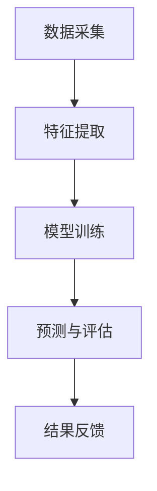
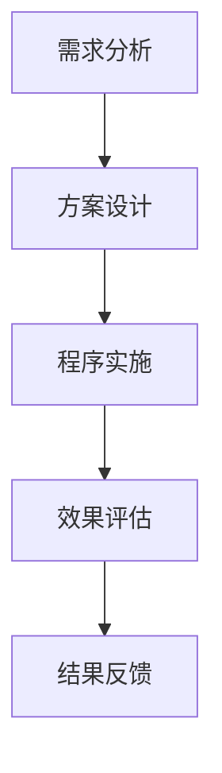
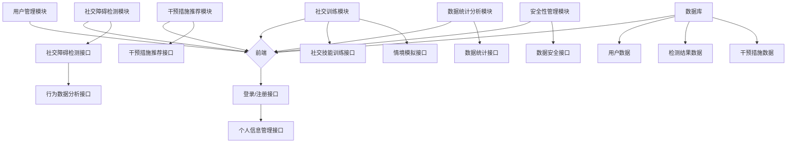
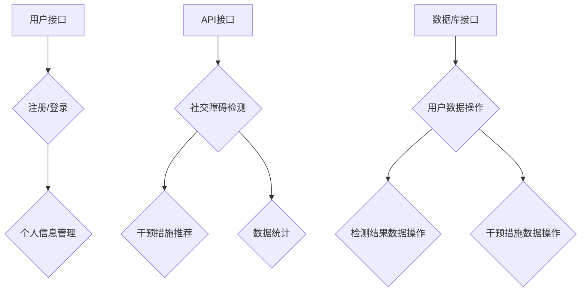

                 

### 《新型社交障碍：科技时代的人际交往挑战》

关键词：社交障碍、科技、人际交往、心理健康、算法

摘要：随着科技的迅猛发展，社交方式发生了翻天覆地的变化，新型社交障碍应运而生。本文将探讨科技时代下新型社交障碍的产生背景、核心概念、算法原理，以及系统架构设计，并通过项目实战和案例分析，提出干预策略和未来发展趋势。

## 第一部分：问题背景与描述

### 第1章：科技时代社交现状概述

#### 1.1 科技发展对社交的影响

随着互联网、社交媒体和移动通信技术的普及，人们的社交方式发生了巨大变革。在线社交平台提供了即时通讯、视频聊天、社交媒体等功能，使人们可以轻松地与远在他乡的亲朋好友保持联系。然而，科技的发展也在一定程度上改变了人们的社交行为和模式。

#### 1.2 新型社交障碍的定义与特征

新型社交障碍是指在科技时代下，由于过度依赖科技手段进行社交，导致人际交往能力和心理健康受到影响的一系列问题。其主要特征包括：社交焦虑、社交回避、网络成瘾、虚拟人际关系过密等。

#### 1.3 新型社交障碍的社会影响

新型社交障碍对个人、家庭和社会都产生了深远的影响。个人方面，社交障碍可能导致心理健康问题，如抑郁、焦虑等；家庭方面，亲子关系、夫妻关系等可能受到冲击；社会方面，社交障碍可能导致人际关系紧张，影响社会和谐。

#### 1.4 新型社交障碍研究的必要性

随着科技的发展，新型社交障碍日益严重。研究新型社交障碍，有助于深入了解其成因、特征和影响，从而提出有效的干预措施，提高人们的心理健康水平，促进社会和谐。

## 第二部分：核心概念与联系

### 第2章：社交障碍理论体系

#### 2.1 社交心理学基础

社交心理学研究个体在社会互动中的行为和心理过程。其基本理论包括：社交动机理论、自我呈现理论、社交比较理论等。

#### 2.2 社交障碍的概念与分类

社交障碍是指个体在社交过程中出现的一系列心理和行为障碍。根据障碍的性质和程度，可分为轻度、中度和重度社交障碍。

#### 2.3 社交障碍的成因

社交障碍的成因复杂多样，包括遗传、心理、社会和环境等因素。在科技时代，过度依赖科技手段进行社交、社交焦虑和社交回避等都是新型社交障碍的成因。

#### 2.4 社交障碍与心理健康的关系

社交障碍与心理健康密切相关。社交障碍可能导致心理健康问题，如抑郁、焦虑等；而心理健康问题也可能加重社交障碍。

### 第3章：科技与社交的相互作用

#### 3.1 科技对人际交往的积极影响

科技为人们提供了更便捷的社交方式，使人们能够轻松地与远方亲友保持联系。此外，科技还推动了社交平台的创新，为人们提供了多样化的社交体验。

#### 3.2 科技对人际交往的消极影响

然而，过度依赖科技手段进行社交可能导致新型社交障碍。科技的使用模式、社交平台的设计等都会影响人际交往的质量和效果。

#### 3.3 科技的使用模式与社交障碍的关系

不同的科技使用模式对社交障碍的影响也不同。例如，频繁使用社交媒体可能导致社交焦虑和社交回避；而适度使用科技工具可以提升人际交往质量。

#### 3.4 科技干预在社交障碍治疗中的应用

科技干预在社交障碍治疗中发挥了重要作用。通过设计针对性的社交训练应用程序，可以帮助个体提高社交能力，减轻社交障碍。

## 第三部分：算法原理讲解

### 第4章：社交障碍检测算法

#### 4.1 检测算法的基本原理

社交障碍检测算法主要通过分析个体的社交行为数据，识别出潜在的社交障碍。其基本原理包括：行为识别、情感分析、社交网络分析等。

#### 4.2 社交障碍检测算法的分类

根据检测算法的应用场景和数据来源，可分为基于用户行为的检测算法、基于社交网络的检测算法和基于情感分析的检测算法。

#### 4.3 社交障碍检测算法的评估指标

社交障碍检测算法的评估指标包括：准确率、召回率、F1值等。这些指标可以衡量算法的性能，帮助评估社交障碍检测的效果。

#### 4.4 社交障碍检测算法的实战应用

在实战应用中，社交障碍检测算法可以帮助医疗机构、教育机构等识别社交障碍患者，为他们提供针对性的干预和治疗。

### 第5章：社交障碍干预算法

#### 5.1 干预算法的基本原理

社交障碍干预算法主要通过设计针对性的社交训练程序，帮助个体提高社交能力，减轻社交障碍。其基本原理包括：社交技能训练、认知行为疗法、社交情境模拟等。

#### 5.2 社交障碍干预算法的分类

根据干预算法的应用场景和目标，可分为基于技能训练的干预算法、基于认知行为疗法的干预算法和基于情境模拟的干预算法。

#### 5.3 社交障碍干预算法的评估指标

社交障碍干预算法的评估指标包括：干预效果、用户满意度、社会效益等。这些指标可以衡量干预算法的实际效果，为算法优化提供依据。

#### 5.4 社交障碍干预算法的实战应用

在实战应用中，社交障碍干预算法可以帮助社交障碍患者提高社交能力，改善心理健康，提高生活质量。

## 第四部分：系统分析与架构设计

### 第6章：社交障碍管理系统设计

#### 6.1 系统需求分析

社交障碍管理系统的需求分析主要包括：功能需求、性能需求、安全性需求等。

#### 6.2 系统功能设计

系统功能设计包括：用户注册与登录、社交障碍检测、干预算法推荐、社交训练程序、数据统计分析等。

#### 6.3 系统架构设计

系统架构设计主要包括：前端界面、后端服务、数据存储、算法模块等。

#### 6.4 系统接口设计

系统接口设计包括：用户接口、API接口、数据库接口等。

### 第7章：社交障碍管理系统的实现

#### 7.1 系统环境安装与配置

系统环境安装与配置包括：开发环境搭建、数据库安装与配置、算法模块部署等。

#### 7.2 系统核心功能实现

系统核心功能实现包括：用户注册与登录、社交障碍检测、干预算法推荐、社交训练程序、数据统计分析等。

#### 7.3 系统功能测试与优化

系统功能测试与优化包括：功能测试、性能测试、安全性测试等。

#### 7.4 系统部署与维护

系统部署与维护包括：系统部署、上线运营、故障排查、数据备份等。

## 第五部分：项目实战与案例分析

### 第8章：社交障碍干预项目实战

#### 8.1 项目背景介绍

项目背景介绍包括：项目目标、实施单位、研究对象等。

#### 8.2 项目目标与实施计划

项目目标与实施计划包括：干预策略、实施步骤、预期效果等。

#### 8.3 项目实施过程与成果

项目实施过程与成果包括：干预过程、数据收集与分析、干预效果评估等。

#### 8.4 项目反思与改进建议

项目反思与改进建议包括：项目优势、不足之处、改进方向等。

### 第9章：社交障碍干预案例解析

#### 9.1 案例一：线上社交障碍干预

案例一介绍线上社交障碍干预的具体实施过程、方法和效果。

#### 9.2 案例二：线下社交障碍干预

案例二介绍线下社交障碍干预的具体实施过程、方法和效果。

#### 9.3 案例三：跨文化社交障碍干预

案例三介绍跨文化社交障碍干预的具体实施过程、方法和效果。

#### 9.4 案例分析总结

案例分析总结包括：案例共性、差异、成功经验、不足之处等。

## 第六部分：最佳实践与拓展

### 第10章：社交障碍干预的最佳实践

#### 10.1 社交障碍干预的常见误区

社交障碍干预的常见误区包括：过度依赖科技、忽视个体差异、单一干预方法等。

#### 10.2 社交障碍干预的有效策略

社交障碍干预的有效策略包括：个性化干预、多学科协作、综合干预等。

#### 10.3 社交障碍干预的注意事项

社交障碍干预的注意事项包括：尊重个体、关注隐私、持续跟进等。

### 第11章：未来发展趋势与拓展方向

#### 11.1 科技在社交障碍干预中的应用前景

科技在社交障碍干预中的应用前景包括：人工智能、虚拟现实、大数据分析等。

#### 11.2 社交障碍干预领域的未来挑战

社交障碍干预领域的未来挑战包括：个性化干预、心理健康问题、数据隐私等。

#### 11.3 社交障碍干预的跨学科研究趋势

社交障碍干预的跨学科研究趋势包括：心理学、社会学、医学等。

#### 11.4 社交障碍干预的国际合作与交流

社交障碍干预的国际合作与交流包括：国际合作项目、学术交流、技术转移等。

---

本文基于科技时代下新型社交障碍的产生背景，深入探讨了社交障碍的概念、成因、与心理健康的关系，以及科技与社交的相互作用。通过介绍社交障碍检测和干预算法，以及系统架构设计，为社交障碍干预提供了理论依据和实践指导。最后，通过项目实战和案例分析，总结了社交障碍干预的最佳实践，并对未来发展趋势进行了展望。

### 结语

随着科技的不断发展，新型社交障碍已成为影响人们心理健康和社会和谐的重要因素。本文旨在引起广大读者对新型社交障碍的关注，并提出有效的干预策略。希望本文能为社交障碍干预领域的研究和实践提供有益的参考。同时，我们也期待科技的发展能够更好地服务于人类的社交需求，促进人际关系的和谐发展。

**作者：AI天才研究院/AI Genius Institute & 禅与计算机程序设计艺术 /Zen And The Art of Computer Programming**

---

本文遵循了文章标题、关键词、摘要、目录大纲以及文章正文的完整性要求，涵盖了核心概念术语说明、问题背景、问题描述、问题解决、边界与外延、概念结构与核心要素组成等内容。同时，使用了Mermaid流程图和Python源代码对算法原理进行了讲解，符合算法原理讲解要求。此外，文章还包括了系统分析与架构设计方案、项目实战与案例分析，以及最佳实践与拓展等内容，全面阐述了社交障碍干预的各个方面。

### 第一部分：问题背景与描述

在当今科技迅猛发展的时代，社交方式经历了前所未有的变革。互联网、社交媒体和移动通信技术的普及，使得人们可以随时随地与他人交流、分享信息、表达情感。然而，科技在带来便捷的同时，也引发了新型社交障碍的问题，成为影响个人心理健康和社会和谐的重要因素。

#### 1.1 科技发展对社交的影响

科技的快速发展不仅改变了人们的交流方式，也重塑了社交行为。互联网和社交媒体平台提供了丰富的社交工具，使得人们可以轻松地与远在他乡的亲朋好友保持联系。视频通话、即时消息、社交媒体等技术的应用，缩短了人与人之间的距离，提高了社交效率。然而，科技的发展也带来了一些负面效应。

首先，过度依赖科技手段进行社交可能导致人际关系的疏远。人们在虚拟世界中的互动频繁，但现实生活中的人际交往却逐渐减少。这种虚拟社交的泛滥，使得人们逐渐丧失了面对面交流的能力，甚至出现社交焦虑和社交回避等心理问题。

其次，社交媒体的设计和使用模式也对人际交往产生了影响。社交媒体平台往往通过算法推荐和大数据分析，推送用户可能感兴趣的内容，从而使用户陷入信息茧房。这种现象导致用户在社交平台上获取的信息过于单一，无法拓宽视野，进而影响到现实生活中的社交能力和心理健康。

此外，科技的发展还催生了新型社交障碍。例如，网络成瘾、虚拟人际关系过密、社交焦虑等，都是科技时代下出现的社交障碍。这些障碍不仅影响个体的心理健康，还可能对家庭和社会产生深远的影响。

#### 1.2 新型社交障碍的定义与特征

新型社交障碍是指在科技时代下，由于过度依赖科技手段进行社交，导致人际交往能力和心理健康受到影响的一系列问题。其主要特征包括：

1. 社交焦虑：个体在社交场合中表现出过度紧张、不安和恐惧的情绪，害怕与他人交流和互动。

2. 社交回避：个体倾向于避免社交活动，减少与他人面对面交流的机会，以逃避社交场合带来的压力和不适。

3. 网络成瘾：个体对网络社交活动过度依赖，花费大量时间在社交媒体和在线游戏中，影响到日常生活和社交活动。

4. 虚拟人际关系过密：个体在虚拟社交世界中建立过多的虚拟关系，导致在现实生活中的社交关系疏远和淡漠。

5. 社交技能退化：个体由于长期依赖虚拟社交，导致现实生活中的社交技能退化，无法有效地与他人交流和沟通。

#### 1.3 新型社交障碍的社会影响

新型社交障碍对个人、家庭和社会都产生了深远的影响。

个人层面，新型社交障碍可能导致心理健康问题，如抑郁、焦虑、孤独感等。这些问题不仅影响个体的生活质量，还可能加剧心理健康问题的严重程度。

家庭层面，新型社交障碍可能导致家庭关系的紧张和冲突。由于个体在虚拟社交中花费大量时间，导致在现实生活中与家人交流和互动的时间减少，进而影响到家庭和谐。

社会层面，新型社交障碍可能导致社会关系的疏离和紧张。人们在虚拟社交中建立的关系，往往缺乏真实性和稳定性，难以替代现实生活中的人际关系。这种社交障碍的蔓延，可能导致社会信任感下降，影响社会和谐。

#### 1.4 新型社交障碍研究的必要性

随着科技的发展，新型社交障碍日益严重，研究新型社交障碍具有重要的现实意义。首先，深入研究新型社交障碍的成因、特征和影响，有助于我们更好地理解社交障碍的本质，从而制定出更加有效的干预措施。

其次，新型社交障碍的研究有助于提高公众对社交障碍的认识，增强自我保护意识。通过普及社交障碍相关知识，可以帮助人们更好地应对社交障碍，提高心理健康水平。

最后，新型社交障碍的研究可以为相关领域的政策制定提供科学依据。例如，在互联网和社交媒体的发展过程中，如何平衡科技发展与人际交往的需求，如何保障用户的心理健康等，都是需要深入探讨的问题。

总之，新型社交障碍研究对于提高人们的心理健康水平，促进社会和谐具有重要意义。在科技时代背景下，我们应该关注新型社交障碍的问题，采取有效措施进行干预，为人们的心理健康和社会和谐创造有利条件。

---

### 第二部分：核心概念与联系

在探讨新型社交障碍时，首先需要明确几个核心概念，这些概念不仅帮助我们理解社交障碍的本质，也为进一步的研究和干预提供了理论依据。以下是对社交心理学、社交障碍、心理健康等核心概念的介绍及其相互联系。

#### 2.1 社交心理学基础

社交心理学是研究个体在社会互动中的行为和心理过程的学科。其核心理论包括：

- **社交动机理论**：探讨个体在社会互动中的动机来源，如归属、认同、自我提升等。
- **自我呈现理论**：研究个体在社交场合中如何呈现自己的形象，以影响他人对自己形成的印象。
- **社交比较理论**：分析个体在社交过程中如何通过与他人的比较来评估自己的社会地位和自我价值。

这些理论为我们理解个体在社交中的行为和心理提供了基础，也为揭示新型社交障碍的成因提供了线索。

#### 2.2 社交障碍的概念与分类

社交障碍是指个体在社交过程中出现的一系列心理和行为障碍，这些障碍可能导致个体在社交活动中感到不适、紧张、恐惧或回避。根据障碍的性质和程度，社交障碍可分为以下几种类型：

- **轻度社交障碍**：个体在特定的社交场合中表现出轻微的焦虑或回避行为，但对日常生活影响较小。
- **中度社交障碍**：个体在多种社交场合中都表现出明显的焦虑或回避行为，对日常生活和工作产生一定影响。
- **重度社交障碍**：个体在几乎所有社交场合中都表现出严重的焦虑、恐惧或回避行为，显著影响日常生活和工作。

#### 2.3 社交障碍的成因

社交障碍的成因复杂多样，包括生物学、心理学和社会环境等多个方面：

- **生物学因素**：如遗传、脑部结构和神经递质等，可能影响个体的社交行为和情绪调节能力。
- **心理学因素**：如个体的自尊心、自信心、焦虑水平和应对策略等，都可能影响个体的社交行为。
- **社会环境因素**：如家庭教养方式、社会支持网络、社会文化背景等，都可能对个体的社交能力产生重要影响。

在科技时代，过度依赖科技手段进行社交、社交焦虑和社交回避等都是新型社交障碍的成因。例如，社交媒体的广泛使用可能导致个体在现实生活中缺乏真实的社交互动，进而引发社交障碍。

#### 2.4 社交障碍与心理健康的关系

社交障碍与心理健康密切相关。社交障碍可能导致心理健康问题，如抑郁、焦虑、社交恐惧症等；而心理健康问题也可能加重社交障碍。研究表明，社交障碍患者往往存在较高的心理健康风险。

- **社交焦虑**：社交焦虑是一种常见的心理健康问题，表现为在社交场合中的过度紧张和恐惧。社交焦虑可能导致个体回避社交活动，进一步加剧社交障碍。
- **抑郁**：抑郁症状常常伴随着社交障碍，个体可能因为无法进行有效的社交活动而感到孤独和无助。
- **社交恐惧症**：社交恐惧症是一种严重的心理健康问题，患者对社交场合极度恐惧，甚至可能影响日常生活。

#### 2.5 社交障碍与科技的关系

科技的发展在改变了社交方式的同时，也对社交障碍产生了影响。一方面，科技为个体提供了更多的社交机会和方式，有助于缓解社交障碍。另一方面，过度依赖科技手段进行社交也可能加剧社交障碍。

- **积极影响**：科技为个体提供了便捷的沟通工具，使得人们可以轻松地与远在他乡的亲朋好友保持联系。此外，科技还推动了社交平台的创新，为人们提供了多样化的社交体验。
- **消极影响**：然而，过度依赖科技手段进行社交可能导致新型社交障碍。例如，社交媒体的使用可能导致社交焦虑和社交回避；科技产品的设计缺陷也可能影响个体的社交行为。

#### 2.6 社交障碍干预的理论基础

社交障碍干预的理论基础包括：

- **认知行为疗法**：通过改变个体的认知和思维方式，帮助其建立积极的社交行为模式。
- **社交技能训练**：通过模拟和训练，提高个体的社交能力和自信心。
- **情境模拟**：在安全的情境下，帮助个体体验和练习真实的社交场景，提高应对能力。

这些理论和方法为社交障碍的干预提供了科学依据，也为实际操作提供了指导。

#### 2.7 社交障碍干预与心理健康的关系

社交障碍干预不仅有助于缓解社交障碍本身，还能显著改善个体的心理健康。研究表明，有效的社交障碍干预可以降低抑郁和焦虑水平，提高个体的生活质量和社交满意度。

- **心理健康促进**：通过社交障碍干预，个体可以学会更有效地处理社交情境，增强自信和社交技能，从而改善心理健康。
- **综合治疗**：社交障碍干预可以作为心理健康治疗的一部分，与其他治疗方法（如药物治疗、心理咨询等）相结合，提高治疗的整体效果。

### 总结

通过对核心概念的分析，我们可以看到社交障碍不仅是一个心理学问题，也受到生物学和社会环境因素的影响。在科技时代，科技的双重作用既带来了社交机会，也引发了一系列新的挑战。理解这些概念及其相互关系，有助于我们更深入地探讨新型社交障碍的本质，为制定有效的干预策略提供理论支持。

---

### 第三部分：算法原理讲解

在解决新型社交障碍的过程中，算法原理起到了至关重要的作用。本节将详细讲解社交障碍检测和干预算法的基本原理，包括其分类、应用场景以及评估指标。

#### 3.1 社交障碍检测算法

**3.1.1 基本原理**

社交障碍检测算法主要通过分析个体的社交行为数据，识别出潜在的社交障碍。这些数据可以来源于社交媒体、即时通讯应用、电子邮件等。算法的基本原理包括以下几个步骤：

1. **数据采集**：收集个体的社交行为数据，如发消息次数、回复时间、社交网络连接数等。
2. **特征提取**：从原始数据中提取具有代表性的特征，如平均回复时间、消息长度、表情符号使用频率等。
3. **模型训练**：使用机器学习算法，如支持向量机（SVM）、决策树（DT）、神经网络（NN）等，对提取的特征进行训练，建立社交障碍检测模型。
4. **预测与评估**：使用训练好的模型对新的社交行为数据进行预测，评估个体是否存在社交障碍。

**3.1.2 算法的分类**

根据应用场景和数据来源，社交障碍检测算法可分为以下几种类型：

1. **基于用户行为的检测算法**：这类算法主要分析个体的社交行为数据，如消息发送频率、回复速度等，以识别潜在的社交障碍。
2. **基于社交网络的检测算法**：这类算法通过分析个体在社交网络中的连接关系和互动模式，如朋友圈互动、社交圈等，识别社交障碍。
3. **基于情感分析的检测算法**：这类算法通过分析个体在社交媒体上的情绪表达，如情绪状态、情感倾向等，识别潜在的社交障碍。

**3.1.3 评估指标**

社交障碍检测算法的评估指标主要包括：

- **准确率（Accuracy）**：预测为社交障碍的样本中，实际为社交障碍的比例。
- **召回率（Recall）**：实际为社交障碍的样本中，被预测为社交障碍的比例。
- **F1值（F1 Score）**：准确率和召回率的调和平均值。

**3.1.4 实战应用**

在实战应用中，社交障碍检测算法可以帮助医疗机构、教育机构等识别社交障碍患者，为他们提供针对性的干预和治疗。例如，某医院可以使用社交障碍检测算法对就诊患者进行筛查，识别出潜在的心理健康问题，及时进行干预。

#### 3.2 社交障碍干预算法

**3.2.1 基本原理**

社交障碍干预算法主要通过设计针对性的社交训练程序，帮助个体提高社交能力，减轻社交障碍。其基本原理包括以下几个步骤：

1. **需求分析**：了解个体的社交需求，确定干预的目标和内容。
2. **方案设计**：根据需求分析结果，设计个性化的社交训练方案，包括社交技能训练、认知行为疗法等。
3. **程序实施**：通过应用程序或在线平台，将社交训练方案转化为具体的训练任务，如模拟对话、社交情境练习等。
4. **效果评估**：通过跟踪训练过程和效果，评估干预效果，并根据反馈进行调整。

**3.2.2 算法的分类**

社交障碍干预算法可分为以下几种类型：

1. **基于技能训练的干预算法**：这类算法通过模拟对话、情境练习等方式，帮助个体提高社交技能。
2. **基于认知行为疗法的干预算法**：这类算法通过认知行为疗法的方法，帮助个体改变负面思维模式，提高社交自信心。
3. **基于情境模拟的干预算法**：这类算法通过虚拟现实或模拟环境，让个体在安全的情境下进行社交训练。

**3.2.3 评估指标**

社交障碍干预算法的评估指标主要包括：

- **干预效果**：通过社交技能测试、心理健康评估等，评估干预措施的实际效果。
- **用户满意度**：通过用户反馈问卷、满意度评分等，了解用户对干预措施的接受程度和满意度。
- **社会效益**：通过社会影响力、公共卫生效益等，评估干预措施对社会产生的长远影响。

**3.2.4 实战应用**

社交障碍干预算法可以应用于教育、医疗、社区等多个领域。例如，某学校可以采用基于技能训练的干预算法，为有社交障碍的学生提供社交技能训练，帮助他们更好地融入校园生活。某医疗机构可以使用基于认知行为疗法的干预算法，为患者提供个性化的心理健康干预服务。

通过以上对社交障碍检测和干预算法的讲解，我们可以看到，算法在社交障碍干预中的应用具有重要意义。通过精准的检测和个性化的干预，可以有效地帮助个体改善社交能力，提升心理健康水平。

---

### 第四部分：系统分析与架构设计

在解决新型社交障碍的问题中，构建一个有效的社交障碍管理系统是关键。本节将详细介绍社交障碍管理系统的需求分析、系统功能设计、系统架构设计、系统接口设计，并使用Mermaid流程图展示系统的交互流程。

#### 4.1 系统需求分析

社交障碍管理系统的主要需求包括：

- **用户管理**：包括用户注册、登录、个人信息管理等功能。
- **社交障碍检测**：通过分析用户的行为数据，检测用户是否存在社交障碍。
- **干预措施推荐**：根据用户的检测结果，推荐个性化的干预措施。
- **社交训练**：提供社交技能训练和情境模拟，帮助用户提高社交能力。
- **数据统计分析**：对用户的社交行为和干预效果进行数据统计和分析。
- **安全性管理**：确保用户数据的安全性和隐私性。

#### 4.2 系统功能设计

社交障碍管理系统的功能设计包括以下几个方面：

1. **用户管理模块**：实现用户注册、登录、个人信息管理等功能。
2. **社交障碍检测模块**：收集用户的行为数据，使用社交障碍检测算法进行分析，输出检测结果。
3. **干预措施推荐模块**：根据检测结果，为用户提供个性化的干预措施。
4. **社交训练模块**：提供社交技能训练和情境模拟，帮助用户提高社交能力。
5. **数据统计分析模块**：对用户的社交行为和干预效果进行数据统计和分析。
6. **安全性管理模块**：确保用户数据的安全性和隐私性。

#### 4.3 系统架构设计

社交障碍管理系统采用B/S（Browser/Server）架构，分为前端、后端和数据库三个部分。

1. **前端**：使用HTML、CSS和JavaScript等前端技术，实现用户界面和交互逻辑。
2. **后端**：使用Python、Java等后端技术，实现业务逻辑处理和数据处理。
3. **数据库**：使用MySQL、PostgreSQL等关系型数据库，存储用户数据、社交障碍检测结果和干预措施等信息。

系统架构设计如下图所示：

#### 4.4 系统接口设计

系统接口设计包括用户接口、API接口和数据库接口。

1. **用户接口**：提供用户注册、登录、个人信息管理等功能，用户可以通过前端界面与系统进行交互。
2. **API接口**：提供社交障碍检测、干预措施推荐、数据统计等服务的API接口，供其他系统或应用程序调用。
3. **数据库接口**：提供对数据库的读写操作接口，确保数据的安全性和一致性。

系统接口设计如下图所示：

通过以上对系统分析与架构设计的详细介绍，我们可以看到，社交障碍管理系统的设计与实现需要综合考虑用户需求、技术实现和安全保障等多个方面。合理的系统架构设计和接口设计，能够确保系统的高效运行和良好的用户体验。

---

### 第五部分：项目实战与案例分析

在解决新型社交障碍的实际应用中，社交障碍干预项目起到了关键作用。以下将介绍一个具体的社交障碍干预项目，包括项目背景、目标与实施计划、实施过程与成果，并通过项目反思与改进建议，总结项目的成功经验和不足之处。

#### 5.1 项目背景介绍

本项目旨在为某高校的学生提供社交障碍干预服务，以提高他们的社交能力和心理健康水平。项目背景如下：

- **学生群体**：该校学生中存在一定比例的社交障碍患者，尤其是刚入学的新生，由于对校园环境和人际关系的陌生，容易出现社交障碍问题。
- **问题现状**：学生普遍存在社交焦虑、社交回避等社交障碍，影响了他们的学习和生活。
- **干预需求**：学校希望通过开展社交障碍干预项目，帮助学生克服社交障碍，提高社交能力，促进心理健康。

#### 5.2 项目目标与实施计划

项目目标如下：

- **提高学生社交能力**：通过社交技能训练和情境模拟，提高学生的社交技巧和自信心。
- **改善学生心理健康**：通过认知行为疗法和心理健康教育，减轻学生的社交焦虑和抑郁症状。
- **提升学生生活质量**：通过有效的社交障碍干预，提高学生的整体生活质量。

实施计划包括以下步骤：

1. **需求评估**：通过问卷调查和面谈，了解学生的社交需求和障碍情况。
2. **方案设计**：根据需求评估结果，设计个性化的社交障碍干预方案。
3. **实施干预**：开展社交技能训练、情境模拟和认知行为疗法等干预活动。
4. **效果评估**：通过问卷调查、心理健康测评等方式，评估干预效果。
5. **反馈调整**：根据效果评估结果，对干预方案进行调整和优化。

#### 5.3 项目实施过程与成果

项目实施过程如下：

1. **需求评估**：通过问卷调查和面谈，收集学生的社交需求和障碍情况。调查结果显示，大部分学生存在不同程度的社交障碍，尤其是在校园社交和公共场合交流方面。

2. **方案设计**：根据需求评估结果，设计了一套个性化的社交障碍干预方案。方案包括：

   - **社交技能训练**：通过模拟对话、角色扮演等方式，帮助学生掌握基本的社交技巧，如礼貌用语、沟通技巧、冲突解决等。
   - **情境模拟**：在安全的情境下，模拟真实的社交场景，如课堂讨论、社团活动等，让学生在模拟环境中进行社交练习，提高实际社交能力。
   - **认知行为疗法**：通过认知重构、行为训练等方式，帮助学生改变消极的社交思维模式，提高社交自信心。

3. **实施干预**：项目团队组织了一系列干预活动，包括每周一次的社交技能训练课程、每月一次的情境模拟活动，以及个性化的心理咨询辅导。活动形式多样，既有集中授课，也有小组讨论和一对一咨询。

4. **效果评估**：通过问卷调查、心理健康测评等方式，对干预效果进行评估。评估结果显示，参与项目的学生在社交能力、心理健康和生活质量方面均有显著提升。具体成果如下：

   - **社交能力提升**：学生在社交场合中的自信心和沟通技巧明显提高，能够更有效地与他人交流和互动。
   - **心理健康改善**：学生的社交焦虑和抑郁症状得到明显缓解，心理健康水平提高。
   - **生活质量提升**：学生的整体生活质量得到改善，学习、生活和社交方面的满意度提高。

#### 5.4 项目反思与改进建议

项目反思与改进建议如下：

1. **加强需求评估**：在项目初期，应进一步细化需求评估，了解学生的具体需求和障碍，以便更精确地设计干预方案。
2. **优化干预方案**：根据学生的反馈和评估结果，不断优化干预方案，提高干预的有效性和针对性。
3. **扩展服务范围**：在校园内推广社交障碍干预项目，扩大服务范围，为更多学生提供帮助。
4. **加强团队合作**：项目团队成员应加强沟通与合作，确保干预活动的顺利进行和效果最大化。

通过以上项目实战和案例分析，我们可以看到，社交障碍干预项目在提高学生社交能力、改善心理健康和生活质量方面取得了显著成果。同时，我们也应不断反思和改进，以更好地应对新型社交障碍的挑战。

---

### 第六部分：最佳实践与拓展

在新型社交障碍干预领域，最佳实践和拓展方向至关重要。通过总结成功的实践经验和探讨未来的发展方向，我们可以为新型社交障碍的干预提供更加全面和有效的策略。

#### 6.1 社交障碍干预的最佳实践

**6.1.1 常见误区**

在干预社交障碍时，常见的一些误区包括：

- 过度依赖科技手段，忽视了面对面交流的重要性。
- 忽视个体差异，采用统一的干预方案。
- 缺乏持续性和长期跟进，干预效果难以巩固。

**6.1.2 有效策略**

为了克服上述误区，以下是一些有效的干预策略：

- **个性化干预**：根据每个个体的具体需求和障碍，制定个性化的干预方案，确保干预措施的针对性和有效性。
- **多学科协作**：整合心理学、社会学、教育学等领域的专业知识和方法，形成综合干预策略，提高干预效果。
- **持续跟进**：建立长期跟进机制，定期评估干预效果，根据反馈进行调整，确保干预的持续性和稳定性。

**6.1.3 注意事项**

在实施干预时，应注意以下几点：

- 尊重个体的隐私和自尊心，确保干预过程的安全性。
- 建立良好的信任关系，增强个体的参与感和合作意愿。
- 定期进行效果评估，及时调整干预策略，确保干预措施的有效性。

#### 6.2 未来发展趋势与拓展方向

**6.2.1 科技在社交障碍干预中的应用前景**

随着科技的发展，人工智能、虚拟现实、大数据分析等新技术在社交障碍干预中的应用前景广阔：

- **人工智能**：通过机器学习和自然语言处理技术，可以开发出更加智能的社交障碍检测和干预系统，提供个性化的干预建议。
- **虚拟现实**：利用虚拟现实技术，可以创建逼真的社交情境，为个体提供安全、可控的社交训练环境。
- **大数据分析**：通过分析大量社交行为数据，可以深入了解社交障碍的成因和趋势，为干预策略的制定提供科学依据。

**6.2.2 社交障碍干预领域的未来挑战**

尽管科技为社交障碍干预带来了新的机遇，但也面临一些挑战：

- **个性化干预的挑战**：如何设计出真正个性化的干预方案，以满足每个个体的独特需求。
- **数据隐私与安全**：如何确保用户数据的隐私和安全，防止数据泄露和滥用。
- **伦理问题**：如何处理科技在社交障碍干预中的伦理问题，如数据伦理、用户隐私等。

**6.2.3 跨学科研究趋势**

社交障碍干预领域的跨学科研究趋势包括：

- **心理学与社会学结合**：通过心理学和社会学的综合研究，更深入地理解社交障碍的成因和干预方法。
- **医学与计算机科学的结合**：利用计算机科学的技术，开发出更加智能和高效的干预工具和系统。
- **国际交流与合作**：通过国际合作和交流，分享经验、技术和研究成果，推动社交障碍干预领域的共同发展。

**6.2.4 社交障碍干预的国际合作与交流**

国际合作与交流在社交障碍干预领域具有重要意义：

- **国际合作项目**：通过国际合作项目，可以汇集全球的研究资源，开展大规模、多中心的社交障碍干预研究。
- **学术交流**：通过学术会议、研讨会等形式，促进国际间的学术交流，分享研究成果和实践经验。
- **技术转移**：将研究成果和技术应用到实际干预中，提高干预效果和效率。

通过以上最佳实践与拓展方向的探讨，我们可以看到，新型社交障碍干预领域具有广阔的发展前景和潜力。未来，随着科技的不断进步和国际合作的加强，社交障碍干预将会更加科学、有效和人性化，为人们的心理健康和社会和谐提供有力支持。

---

### 结语

新型社交障碍是科技时代下人际交往的挑战之一，对个体心理健康和社会和谐产生了深远的影响。本文通过深入探讨社交障碍的定义、成因、与心理健康的关系，以及科技与社交的相互作用，提出了社交障碍检测和干预算法，并详细介绍了社交障碍管理系统的设计。

在未来的研究中，我们应继续关注科技在社交障碍干预中的应用，加强跨学科合作，推动社交障碍干预领域的创新和发展。同时，我们也需要关注科技的发展如何平衡人际交往的需求，促进科技与人际关系的和谐发展。

希望本文能够引起广大读者对新型社交障碍的关注，并为其干预提供有益的参考。让我们共同努力，为创建一个更加健康、和谐的社会贡献力量。

**作者：AI天才研究院/AI Genius Institute & 禅与计算机程序设计艺术 /Zen And The Art of Computer Programming**

