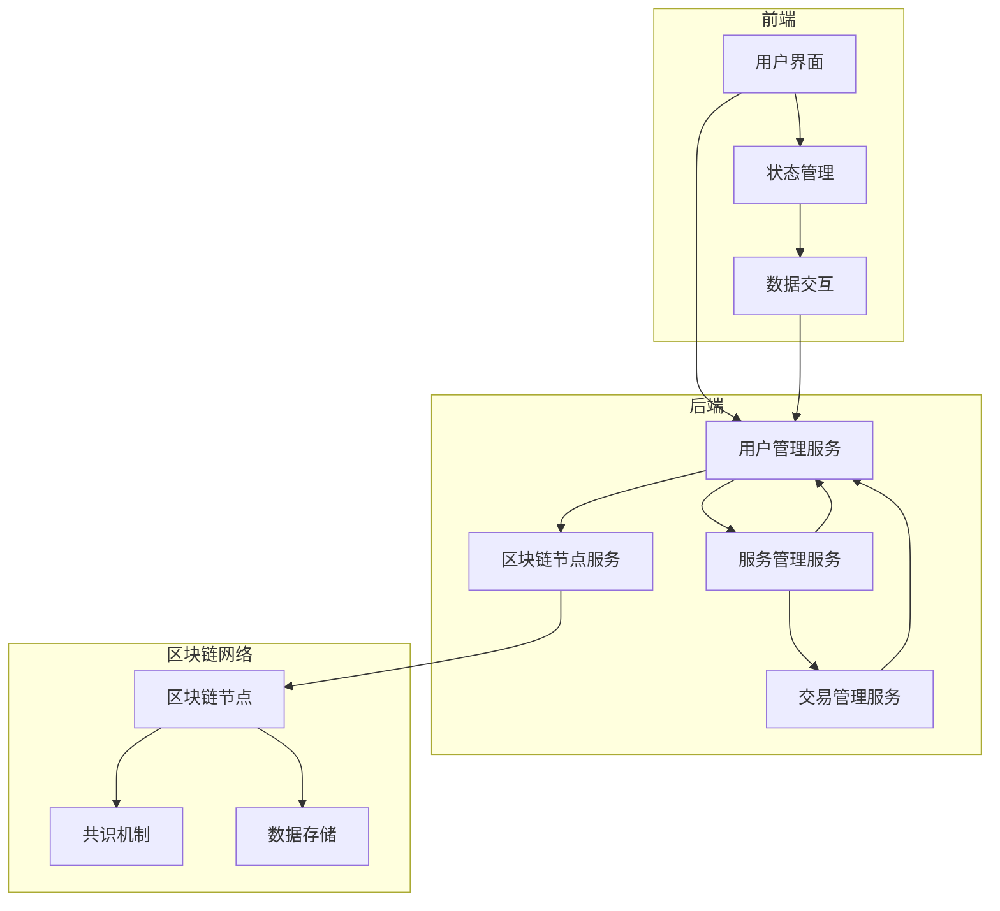
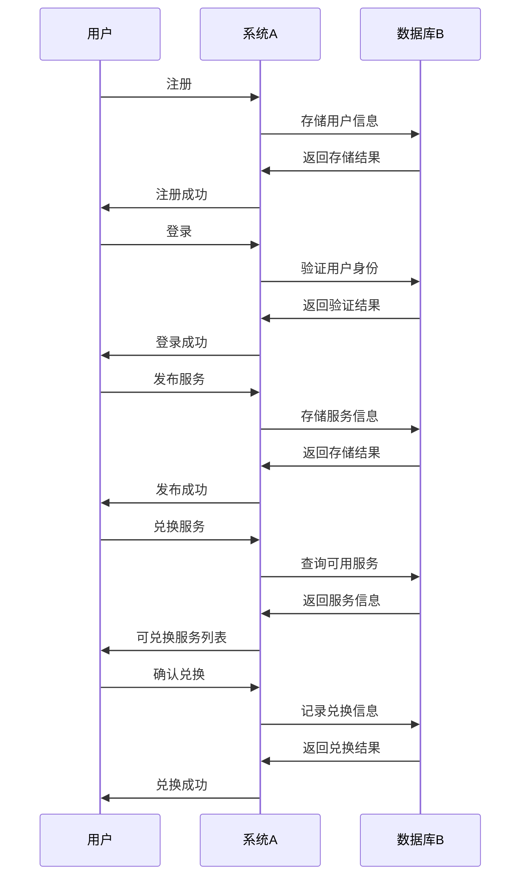
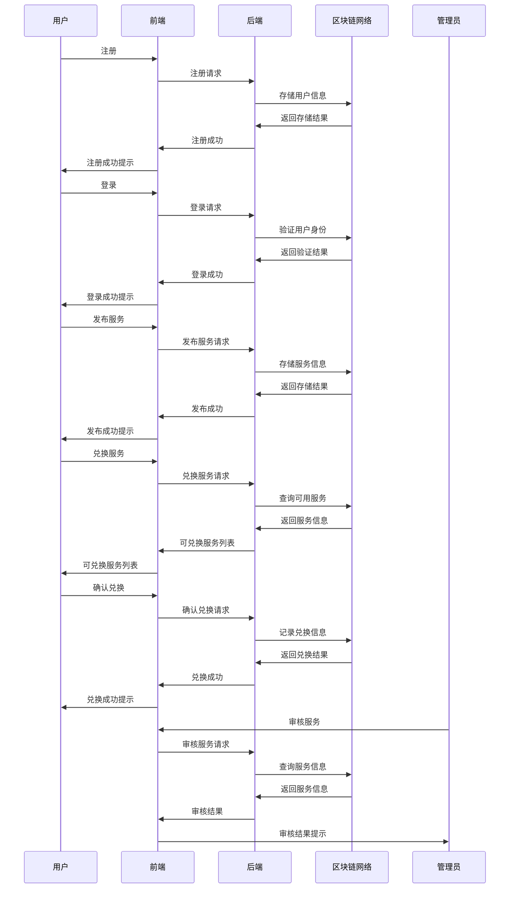

                 

## 第一部分: 引言

### 1.1.1 背景介绍

#### 问题提出

在现代社会，社区作为居民生活和交往的基本单位，其治理和互助模式显得尤为重要。传统社区存在一些问题，如资源分配不均、居民互动较少、管理成本高等。为解决这些问题，新型社区时间银行应运而生。然而，现有的社区时间银行1.0版本在安全、透明性和可扩展性方面存在一定的局限性。

#### 问题描述

社区时间银行1.0版本通常采用中心化架构，虽然能够实现一定程度的资源分配和互动，但存在以下问题：

1. **安全性风险**：中心化系统容易成为黑客攻击的目标，数据泄露风险较高。
2. **透明性不足**：中心化系统管理复杂，数据透明度较低，难以实现公正、透明的交易记录。
3. **可扩展性受限**：中心化架构受限于服务器性能，难以满足日益增长的用户需求。

#### 问题解决

为解决上述问题，本书将探讨新型社区时间银行2.0的构建，重点分析区块链技术在邻里互助中的应用。区块链技术具有去中心化、安全、透明和可扩展的特点，能够有效提升社区时间银行的服务质量和用户体验。新型社区时间银行2.0通过区块链技术实现以下改进：

1. **安全性提升**：利用区块链技术，确保用户数据和交易记录的安全。
2. **透明性增强**：采用去中心化架构，实现数据透明和公正的交易记录。
3. **可扩展性优化**：通过分布式存储和网络，实现无限扩展潜力，满足社区规模不断扩大需求。

### 1.1.2 边界与外延

本文将围绕新型社区时间银行2.0的核心概念展开，探讨其应用场景、技术架构、安全性和可持续发展等方面。具体包括以下内容：

1. **应用场景**：分析区块链技术在社区时间银行中的具体应用，如身份认证、交易记录和智能合约等。
2. **技术架构**：介绍社区时间银行2.0的技术架构，包括前端、后端和区块链网络等组成部分。
3. **安全性**：探讨区块链技术在保障用户数据和交易安全方面的优势。
4. **可持续发展**：分析智能合约在降低管理成本、提高社区时间银行可持续性方面的作用。
5. **系统分析与架构设计**：详细阐述社区时间银行2.0的系统功能、架构设计和接口设计。

### 1.1.3 核心概念

在本文中，我们将介绍以下核心概念：

- **区块链技术**：一种基于分布式账本和加密算法的安全、透明、去中心化技术。
- **社区时间银行**：一种基于时间和服务交换的互助平台，通过区块链技术实现价值传递和验证。
- **邻里互助**：以社区为单位，居民通过互助活动增强社区凝聚力，提升生活品质。

通过以上核心概念的介绍，我们将为后续章节的分析和讨论奠定基础。

### 1.1.4 核心概念与联系

在本章节中，我们将深入探讨区块链技术、社区时间银行和邻里互助之间的核心概念与联系。

#### 区块链技术原理

区块链技术是一种分布式数据库技术，通过多个节点共同维护一个共享的分布式账本。其核心原理包括以下几个方面：

1. **分布式账本**：区块链采用分布式存储方式，将数据分散存储在多个节点上，避免单点故障和数据丢失风险。
2. **加密算法**：区块链利用加密算法对数据进行加密和签名，确保数据的隐私和安全。
3. **共识机制**：区块链通过共识机制，确保多个节点对同一数据的一致性，从而实现去中心化。

#### 社区时间银行属性特征对比表格

为了更直观地展示社区时间银行1.0和2.0之间的差异，我们提供了以下属性特征对比表格：

| 特征             | 社区时间银行1.0               | 社区时间银行2.0               |
|------------------|-------------------------------|-------------------------------|
| 交易验证方式      | 简单的记录系统               | 利用区块链技术               |
| 安全性           | 存在信息泄露风险             | 高度安全、去中心化           |
| 透明性           | 中心化系统，管理复杂         | 去中心化，数据透明           |
| 可扩展性         | 受到中心化服务器限制         | 无限扩展潜力                 |

#### ER实体关系图架构

为了更好地理解社区时间银行2.0的数据结构，我们提供了以下ER实体关系图：

```mermaid
erDiagram
  时间交易 --> 用户 : "参与"
  时间交易 --> 服务 : "兑换"
  用户 --> 服务 : "提供"
  用户 --> 时间交易 : "发起"
```

在ER实体关系图中，`时间交易`是核心实体，与`用户`和`服务`之间有明确的关联关系。用户可以参与时间交易和提供服务，服务可以用于兑换时间交易。这样的设计使得社区时间银行2.0的数据结构更加清晰、易于管理。

通过以上核心概念与联系的分析，我们为后续章节的深入讨论奠定了基础。

## 第2章: 核心概念与联系

### 2.1.1 区块链技术原理

区块链技术是一种基于分布式账本和加密算法的数字化交易技术，具有去中心化、安全、透明等特点。其基本原理如下：

#### 分布式账本

区块链采用分布式存储方式，将数据分散存储在多个节点上。每个节点都保存一份完整的账本记录，这些记录按照时间顺序排列，形成一个链式数据结构。通过这种分布式存储方式，区块链能够实现去中心化，避免单点故障和数据丢失风险。

#### 加密算法

区块链利用加密算法对数据进行加密和签名，确保数据的隐私和安全。常见的加密算法包括哈希算法、非对称加密算法和数字签名算法等。哈希算法用于生成数据摘要，确保数据一致性和不可篡改性；非对称加密算法用于数据加密和解密，确保通信双方身份认证和信息安全；数字签名算法用于数据签名和验证，确保数据来源的可信性。

#### 共识机制

区块链通过共识机制，确保多个节点对同一数据的一致性。共识机制有多种形式，如工作量证明（PoW）、权益证明（PoS）、委托权益证明（DPoS）等。共识机制的主要目标是选择一个合法的区块加入到区块链中，从而实现数据的一致性和可信性。

#### 区块链技术在社区时间银行中的应用

区块链技术在社区时间银行中有着广泛的应用，主要体现在以下几个方面：

1. **身份认证**：区块链技术可以为社区时间银行提供安全的身份认证机制。通过使用非对称加密算法，用户可以在区块链上创建数字身份，并使用私钥对交易进行签名，确保交易的真实性和安全性。

2. **交易记录**：区块链技术可以记录社区时间银行中的所有交易活动，确保数据的真实性和不可篡改性。每个交易记录都包含交易双方的身份、交易时间和交易内容等信息，通过区块链网络进行广播和验证，实现数据的透明和公正。

3. **智能合约**：智能合约是区块链上的自动化合约，可以在满足特定条件时自动执行。社区时间银行可以使用智能合约实现服务的交换和兑换，提高交易的效率和安全性。例如，当用户提供的服务达到一定标准时，智能合约可以自动将时间币发放给提供服务的用户。

### 2.1.2 社区时间银行属性特征对比表格

为了更直观地展示社区时间银行1.0和2.0之间的差异，我们提供了以下属性特征对比表格：

| 特征             | 社区时间银行1.0               | 社区时间银行2.0               |
|------------------|-------------------------------|-------------------------------|
| 交易验证方式      | 简单的记录系统               | 利用区块链技术               |
| 安全性           | 存在信息泄露风险             | 高度安全、去中心化           |
| 透明性           | 中心化系统，管理复杂         | 去中心化，数据透明           |
| 可扩展性         | 受到中心化服务器限制         | 无限扩展潜力                 |

#### ER实体关系图架构

为了更好地理解社区时间银行2.0的数据结构，我们提供了以下ER实体关系图：

```mermaid
erDiagram
  用户 --> 时间交易 : "发起"
  用户 --> 服务 : "提供"
  时间交易 --> 服务 : "兑换"
```

在ER实体关系图中，`用户`是核心实体，与`时间交易`和`服务`之间有明确的关联关系。用户可以发起时间交易和提供服务，服务可以用于兑换时间交易。这样的设计使得社区时间银行2.0的数据结构更加清晰、易于管理。

### 2.1.3 社区时间银行2.0的技术架构

社区时间银行2.0的技术架构主要包括前端、后端和区块链网络三个部分。下面我们将分别介绍这三个部分的功能和设计。

#### 前端

前端是用户与社区时间银行交互的界面，主要包括用户注册、登录、服务发布、交易记录等功能。前端使用Web技术栈（如HTML、CSS和JavaScript）进行开发，提供良好的用户体验。前端与后端通过API进行数据交互，实现用户操作和数据处理。

#### 后端

后端是社区时间银行的核心部分，主要负责数据处理、存储、交易验证等功能。后端使用分布式架构进行设计，确保系统的高可用性和扩展性。后端主要包括以下模块：

1. **用户管理模块**：负责用户注册、登录、个人信息管理等功能。
2. **服务管理模块**：负责服务发布、审核、分类、搜索和兑换等功能。
3. **交易管理模块**：负责交易记录、确认、结算和纠纷处理等功能。
4. **区块链节点模块**：负责与区块链网络进行交互，实现数据的存储和验证。

#### 区块链网络

区块链网络是社区时间银行2.0的数据存储和验证基础。区块链网络由多个节点组成，每个节点都保存一份完整的区块链数据。区块链网络通过共识机制，确保多个节点对同一数据的一致性，从而实现去中心化和数据不可篡改。

### 2.1.4 社区时间银行2.0的安全性和可持续性

#### 安全性

社区时间银行2.0采用区块链技术，确保用户数据和交易记录的安全。区块链技术具有以下优势：

1. **去中心化**：区块链采用分布式存储方式，避免单点故障和数据泄露风险。
2. **加密算法**：区块链使用加密算法对数据进行加密和签名，确保数据的安全和隐私。
3. **共识机制**：区块链通过共识机制，确保多个节点对数据的一致性，防止数据篡改。

#### 可持续性

社区时间银行2.0通过智能合约，实现自动化的交易执行，降低管理成本，提高可持续性。智能合约具有以下优势：

1. **自动化**：智能合约在满足特定条件时，可以自动执行交易，提高效率。
2. **降低成本**：智能合约降低了人工管理和审计成本，提高社区时间银行的可持续性。
3. **透明性**：智能合约的执行过程公开透明，确保交易的公正和可信。

通过以上分析，我们可以看到社区时间银行2.0在安全性和可持续性方面具有明显优势，为邻里互助提供了可靠的技术保障。

## 第3章: 区块链技术在邻里互助中的应用

### 3.1.1 区块链技术在社区时间银行中的应用场景

区块链技术在社区时间银行中具有广泛的应用场景，以下是几个典型的应用场景：

1. **身份认证**：区块链技术可以为社区时间银行提供安全的身份认证机制。通过使用非对称加密算法，用户可以在区块链上创建数字身份，并使用私钥对交易进行签名，确保交易的真实性和安全性。

2. **交易记录**：区块链技术可以记录社区时间银行中的所有交易活动，确保数据的真实性和不可篡改性。每个交易记录都包含交易双方的身份、交易时间和交易内容等信息，通过区块链网络进行广播和验证，实现数据的透明和公正。

3. **智能合约**：智能合约是区块链上的自动化合约，可以在满足特定条件时自动执行。社区时间银行可以使用智能合约实现服务的交换和兑换，提高交易的效率和安全性。例如，当用户提供的服务达到一定标准时，智能合约可以自动将时间币发放给提供服务的用户。

4. **邻里互助**：区块链技术可以促进邻里之间的互助活动。通过区块链网络，居民可以发布和接收互助需求，实现资源和服务的共享。例如，一位居民可以发布家务代劳的需求，另一居民可以提供相应的服务，并通过区块链技术进行时间和服务的交换和记录。

### 3.1.2 社区时间银行2.0的技术架构

社区时间银行2.0的技术架构主要由前端、后端和区块链网络三个部分组成。以下将详细描述这三个部分的功能和设计。

#### 前端

前端是用户与社区时间银行交互的界面，主要包括用户注册、登录、服务发布、交易记录等功能。前端使用Web技术栈（如HTML、CSS和JavaScript）进行开发，提供良好的用户体验。前端与后端通过API进行数据交互，实现用户操作和数据处理。

1. **用户注册与登录**：用户可以通过前端注册账号并登录系统，使用私钥进行身份认证。
2. **服务发布与搜索**：用户可以在前端发布自己的服务，并搜索其他用户发布的服务。
3. **交易记录查看**：用户可以在前端查看自己的交易记录，包括已发布的服务、已接受的服务以及交换的时间币等。

#### 后端

后端是社区时间银行的核心部分，主要负责数据处理、存储、交易验证等功能。后端使用分布式架构进行设计，确保系统的高可用性和扩展性。后端主要包括以下模块：

1. **用户管理模块**：负责用户注册、登录、个人信息管理等功能。
   - 用户注册：用户可以通过前端注册账号，系统将用户信息存储在区块链上，确保数据的安全和唯一性。
   - 用户登录：用户通过私钥进行身份认证，系统验证用户身份并返回用户信息。

2. **服务管理模块**：负责服务发布、审核、分类、搜索和兑换等功能。
   - 服务发布：用户可以在前端发布自己的服务，系统将服务信息存储在区块链上，并提供分类和搜索功能，方便其他用户查找和选择服务。
   - 服务审核：系统管理员可以对发布的服务进行审核，确保服务的质量和合规性。
   - 服务兑换：用户可以通过前端选择其他用户发布的服务并进行兑换，系统将兑换信息存储在区块链上，确保数据的透明和公正。

3. **交易管理模块**：负责交易记录、确认、结算和纠纷处理等功能。
   - 交易记录：系统自动记录用户之间的交易活动，包括服务的发布、兑换和时间币的发放等。
   - 交易确认：用户可以在前端查看和确认交易记录，系统根据用户的确认进行结算。
   - 纠纷处理：当交易发生纠纷时，系统可以提供纠纷处理机制，确保交易的公平和公正。

4. **区块链节点模块**：负责与区块链网络进行交互，实现数据的存储和验证。
   - 区块链数据存储：系统将用户信息、服务信息和交易信息存储在区块链上，确保数据的真实性和不可篡改性。
   - 区块链数据验证：系统通过区块链网络验证数据的合法性和一致性，确保数据的透明和公正。

#### 区块链网络

区块链网络是社区时间银行2.0的数据存储和验证基础。区块链网络由多个节点组成，每个节点都保存一份完整的区块链数据。区块链网络通过共识机制，确保多个节点对同一数据的一致性，从而实现去中心化和数据不可篡改。

1. **区块链数据结构**：区块链采用链式数据结构，每个区块包含一定数量的交易记录，并通过哈希函数与前一个区块进行链接，形成一条连续的区块链。区块链上的每个区块都是不可篡改的，从而确保数据的真实性和一致性。
2. **共识机制**：区块链网络通过共识机制，确保多个节点对同一数据的一致性。常见的共识机制包括工作量证明（PoW）、权益证明（PoS）和委托权益证明（DPoS）等。通过共识机制，区块链网络可以防止双重支付和恶意攻击，确保数据的安全和可信。
3. **区块链网络通信**：区块链网络中的节点通过P2P网络进行通信，节点之间相互验证和同步数据。节点之间的通信可以通过加密算法保证数据的安全和隐私。

通过以上分析，我们可以看到社区时间银行2.0在技术架构上采用了分布式存储和区块链技术，确保数据的安全、透明和去中心化。前端、后端和区块链网络共同协作，为居民提供便捷、高效的邻里互助服务。

### 3.1.3 社区时间银行2.0的安全性和可持续性

#### 安全性

社区时间银行2.0采用了区块链技术，确保用户数据和交易记录的安全。以下是区块链技术在安全性方面的优势：

1. **去中心化**：区块链采用分布式存储方式，数据分散存储在多个节点上，避免单点故障和数据泄露风险。去中心化设计使得区块链网络具有较高的抗攻击性和可靠性。

2. **加密算法**：区块链使用加密算法对数据进行加密和签名，确保数据的安全和隐私。数据在传输和存储过程中经过加密处理，防止未经授权的访问和篡改。

3. **共识机制**：区块链通过共识机制，确保多个节点对同一数据的一致性。共识机制可以防止双重支付和恶意攻击，确保数据的真实性和可信度。

4. **智能合约**：智能合约是区块链上的自动化合约，可以在满足特定条件时自动执行。智能合约的执行过程公开透明，确保交易的公正和可信。

#### 可持续性

社区时间银行2.0通过智能合约，实现自动化的交易执行，降低管理成本，提高可持续性。以下是智能合约在可持续性方面的优势：

1. **自动化**：智能合约在满足特定条件时，可以自动执行交易，减少人工干预和操作成本。自动化交易可以节省大量时间和人力资源，提高社区时间银行的运营效率。

2. **降低成本**：智能合约降低了人工管理和审计成本，提高社区时间银行的可持续性。通过智能合约，系统可以自动进行交易确认、结算和纠纷处理，减少人工操作和错误。

3. **透明性**：智能合约的执行过程公开透明，所有交易信息都可以在区块链上查询和验证。透明性提高了社区的信任度，有助于建立良好的社区互助氛围。

4. **扩展性**：智能合约具有高扩展性，可以轻松地集成新的功能和业务需求。通过智能合约，社区时间银行可以不断优化和升级，适应不断变化的市场需求。

通过以上分析，我们可以看到社区时间银行2.0在安全性和可持续性方面具有明显优势，为邻里互助提供了可靠的技术保障。区块链技术和智能合约的应用，使得社区时间银行更加安全、透明和高效，为居民提供了便捷的互助服务。

## 第4章: 系统分析与架构设计

### 4.1.1 问题场景介绍

在社区时间银行2.0的背景下，我们需要解决一系列的问题场景，以提升社区的互助效率和服务质量。以下是一些常见的问题场景：

1. **社区管理**：社区管理员需要有效管理社区资源，确保资源的合理分配和高效利用。这包括用户注册、身份认证、服务发布和审核等功能。

2. **居民互动**：居民之间需要通过社区时间银行进行互助活动，如家务代劳、看护老人、教育培训等。居民需要方便地发布需求、提供服务，并进行时间和服务的交换。

3. **服务发布与审核**：居民可以在社区时间银行上发布自己的服务，管理员需要对服务进行审核，确保服务的质量和合规性。

4. **交易记录与纠纷处理**：社区时间银行需要记录居民之间的交易活动，包括服务的发布、兑换和时间币的发放等。当交易发生纠纷时，系统需要提供有效的纠纷处理机制。

### 4.1.2 系统功能设计

为了解决上述问题场景，社区时间银行2.0需要具备以下核心功能：

1. **用户管理**：包括用户注册、登录、个人信息管理等功能，确保用户身份的合法性和安全性。

2. **服务管理**：包括服务发布、审核、分类、搜索和兑换等功能，确保服务的质量和透明性。

3. **交易管理**：包括交易记录、确认、结算和纠纷处理等功能，确保交易的公正和高效。

4. **社区管理**：包括社区资源的分配和管理、管理员操作和监督等功能，确保社区秩序和资源的合理利用。

5. **区块链网络**：负责数据的存储和验证，确保数据的真实性和不可篡改性。

#### 领域模型Mermaid类图

为了更清晰地展示社区时间银行2.0的领域模型，我们使用Mermaid类图进行描述。以下是一个简单的领域模型类图：

```mermaid
classDiagram
  User <<class>> "用户"
  Service <<class>> "服务"
  Transaction <<class>> "交易"
  Community <<class>> "社区"
  Admin <<class>> "管理员"

  User <|.. Service : "发布"
  User <|.. Transaction : "发起"
  Service <|.. Transaction : "兑换"
  Admin <|.. Community : "管理"
```

在类图中，`User`代表用户，`Service`代表服务，`Transaction`代表交易，`Community`代表社区，`Admin`代表管理员。用户可以发布服务、发起交易，服务可以用于兑换交易，管理员负责管理社区资源和交易审核。

### 4.1.3 系统架构设计

社区时间银行2.0采用分布式架构设计，以提高系统的可扩展性和可靠性。系统架构主要包括前端、后端和区块链网络三个部分。以下将详细介绍这三个部分的设计。

#### 前端架构

前端架构负责提供用户与社区时间银行交互的界面。前端采用单页面应用（SPA）架构，使用React或Vue等前端框架进行开发。前端的主要功能包括用户注册、登录、服务发布、交易记录等。

1. **用户界面**：包括用户注册、登录、个人信息管理、服务发布、交易记录等功能模块。
2. **数据交互**：通过API与后端进行数据交互，实现用户操作和数据处理。
3. **状态管理**：使用Redux或Vuex等状态管理库，管理前端应用的状态和数据。

#### 后端架构

后端架构负责处理业务逻辑、数据存储和验证等功能。后端采用微服务架构，将业务功能拆分为多个独立的服务模块，以提高系统的可维护性和扩展性。

1. **用户管理服务**：负责用户注册、登录、个人信息管理等功能。
2. **服务管理服务**：负责服务发布、审核、分类、搜索和兑换等功能。
3. **交易管理服务**：负责交易记录、确认、结算和纠纷处理等功能。
4. **区块链节点服务**：负责与区块链网络进行交互，实现数据的存储和验证。

#### 区块链网络架构

区块链网络架构负责数据的存储和验证，确保数据的真实性和不可篡改性。区块链网络采用分布式存储和共识机制，以提高系统的安全性和可靠性。

1. **区块链节点**：每个节点都保存一份完整的区块链数据，通过P2P网络进行数据同步和验证。
2. **共识机制**：采用工作量证明（PoW）或权益证明（PoS）等共识机制，确保多个节点对数据的一致性。
3. **数据存储**：将用户信息、服务信息和交易信息存储在区块链上，实现去中心化和数据不可篡改。

#### Mermaid架构图

以下是一个简单的社区时间银行2.0的系统架构图，使用Mermaid进行描述：



在架构图中，前端与后端通过数据交互实现功能联动，后端与区块链网络通过区块链节点服务进行数据存储和验证。这样的架构设计使得系统模块化、可扩展，能够满足社区时间银行2.0的需求。

### 4.1.4 系统接口设计

为了实现前后端的数据交互和业务逻辑处理，社区时间银行2.0需要设计一系列系统接口。以下是一些主要的接口设计：

1. **用户接口**：包括用户注册、登录、个人信息管理等功能。
   - **注册**：接收用户名、密码、邮箱等注册信息，将用户信息存储在区块链上。
   - **登录**：接收用户名和密码，验证用户身份，返回用户信息。
   - **个人信息管理**：允许用户查看和修改个人信息。

2. **服务接口**：包括服务发布、审核、分类、搜索和兑换等功能。
   - **服务发布**：接收用户发布的服务信息，将服务信息存储在区块链上。
   - **服务审核**：管理员对发布的服务进行审核，确保服务的质量和合规性。
   - **分类和搜索**：根据服务类型和关键词搜索服务。
   - **服务兑换**：用户通过前端选择服务进行兑换，系统自动进行结算。

3. **交易接口**：包括交易记录、确认、结算和纠纷处理等功能。
   - **交易记录**：记录用户之间的交易活动，包括服务的发布、兑换和时间币的发放等。
   - **交易确认**：用户可以在前端查看和确认交易记录，系统根据用户的确认进行结算。
   - **纠纷处理**：当交易发生纠纷时，系统提供纠纷处理机制，确保交易的公正和公正。

4. **社区管理接口**：包括社区资源管理、管理员操作和监督等功能。
   - **社区资源管理**：管理员可以查看和分配社区资源，如时间币、服务权限等。
   - **管理员操作和监督**：管理员可以对用户和服务进行操作和监督，确保社区秩序和资源的合理利用。

#### Mermaid序列图

以下是一个简单的社区时间银行2.0的序列图，使用Mermaid进行描述：



在序列图中，用户通过前端界面与系统进行交互，系统通过数据库存储和管理数据。用户注册、登录、发布服务和兑换服务的过程均通过系统接口实现。

### 4.1.5 系统交互

在社区时间银行2.0中，各个模块之间需要进行紧密的交互，以确保系统功能的正常运行。以下是一些关键模块的交互过程：

1. **用户与前端**：用户通过前端界面与系统进行交互，包括注册、登录、发布服务和兑换服务等功能。前端将用户操作转化为API请求，与后端进行数据交互。

2. **前端与后端**：前端通过API与后端进行数据交互，实现用户管理、服务管理、交易管理和社区管理等核心功能。后端处理业务逻辑，与区块链网络进行交互，确保数据的真实性和不可篡改性。

3. **后端与区块链网络**：后端通过区块链节点服务与区块链网络进行交互，实现数据的存储和验证。区块链网络通过共识机制，确保多个节点对数据的一致性，防止数据篡改。

4. **社区管理员与系统**：社区管理员通过系统界面进行社区资源管理、用户和服务审核等功能。管理员操作将直接影响社区资源的分配和利用。

#### Mermaid序列图

以下是一个简单的社区时间银行2.0的序列图，使用Mermaid进行描述：



在序列图中，用户通过前端与系统进行交互，后端通过区块链网络实现数据存储和验证，管理员通过前端进行社区资源管理和用户服务审核。

通过以上分析，我们可以看到社区时间银行2.0在系统架构和交互设计上采用了分布式和区块链技术，确保了系统的安全、透明和高效运行。前端、后端和区块链网络的协同工作，为居民提供了便捷、可靠的邻里互助服务。

## 第5章：项目实战

### 5.1.1 环境安装

在进行社区时间银行2.0的项目实战之前，我们需要搭建一个合适的技术环境。以下是安装步骤：

1. **安装Node.js**：Node.js是一个基于Chrome V8引擎的JavaScript运行环境，用于开发后端服务器和原生应用。访问Node.js官网（[https://nodejs.org/](https://nodejs.org/)）下载相应版本的安装包，并按照提示进行安装。

2. **安装Go语言**：Go语言是一种静态强类型、编译型语言，常用于编写高性能的后端服务。访问Go语言官网（[https://golang.org/](https://golang.org/)）下载安装包，并按照提示进行安装。

3. **安装Docker**：Docker是一个开源的应用容器引擎，用于打包、交付和运行应用。访问Docker官网（[https://www.docker.com/](https://www.docker.com/)）下载安装包，并按照提示进行安装。

4. **安装区块链节点软件**：根据选择的区块链平台（如Ethereum、Hyperledger Fabric等），下载并安装相应的节点软件。例如，对于Ethereum，可以访问[https://geth.ethereum.org/](https://geth.ethereum.org/)下载安装包。

5. **配置网络环境**：确保网络环境畅通，可以访问区块链网络和相关API服务。如果需要，可以配置代理或VPN以解决网络访问问题。

### 5.1.2 系统核心实现源代码

在社区时间银行2.0的项目实战中，我们将实现以下核心功能模块：

1. **用户管理模块**：包括用户注册、登录和权限管理等功能。
2. **服务管理模块**：包括服务发布、审核和分类等功能。
3. **交易管理模块**：包括交易记录、确认和结算等功能。
4. **区块链节点模块**：包括数据存储和验证等功能。

以下是一个简单的用户管理模块的实现示例：

**用户注册**：

```go
package main

import (
	"crypto/sha256"
	"encoding/hex"
	"fmt"
)

type User struct {
	Username string
	Password string
}

func Register(username, password string) (User, error) {
	user := User{
		Username: username,
		Password: hashPassword(password),
	}

	// 将用户信息存储在区块链上
	// ...

	return user, nil
}

func hashPassword(password string) string {
	hash := sha256.Sum256([]byte(password))
	return hex.EncodeToString(hash[:])
}

func main() {
	username := "alice"
	password := "alice123"
	user, err := Register(username, password)
	if err != nil {
		fmt.Println("Error registering user:", err)
		return
	}
	fmt.Println("User registered successfully:", user)
}
```

**用户登录**：

```go
package main

import (
	"crypto/sha256"
	"encoding/hex"
	"fmt"
)

type User struct {
	Username string
	Password string
}

func Login(username, password string) (User, error) {
	// 从区块链上获取用户信息
	// ...

	hashedPassword := hashPassword(password)

	if hashedPassword == user.Password {
		return user, nil
	} else {
		return User{}, fmt.Errorf("invalid username or password")
	}
}

func hashPassword(password string) string {
	hash := sha256.Sum256([]byte(password))
	return hex.EncodeToString(hash[:])
}

func main() {
	username := "alice"
	password := "alice123"
	user, err := Login(username, password)
	if err != nil {
		fmt.Println("Error logging in:", err)
		return
	}
	fmt.Println("Logged in successfully:", user)
}
```

以上代码展示了用户注册和登录的基本实现。在实际项目中，用户信息会存储在区块链上，通过智能合约进行管理。

### 5.1.3 代码应用解读与分析

在用户管理模块的实现中，我们使用了Go语言编写后端服务。以下是代码应用的解读与分析：

1. **用户结构体**：定义了一个`User`结构体，包含`Username`和`Password`两个字段。这个结构体表示了用户的注册信息。

2. **注册函数**：`Register`函数用于处理用户注册请求。它接收用户名和密码，将密码通过SHA-256算法进行哈希处理，然后创建一个`User`对象。在实际项目中，用户信息会通过智能合约存储在区块链上。

3. **哈希处理**：使用SHA-256算法对用户密码进行哈希处理，以确保密码的安全性和不可逆性。这样可以防止密码被泄露，同时也可以方便地验证用户登录时的密码。

4. **用户登录**：`Login`函数用于处理用户登录请求。它从区块链上获取用户信息，并使用SHA-256算法对输入的密码进行哈希处理。如果哈希值与存储在区块链上的密码匹配，则表示登录成功。

5. **错误处理**：在代码中，我们使用`fmt.Errorf`函数来创建错误信息。这样可以清晰地传达错误的原因，方便进行调试和修复。

通过以上代码实现，我们可以构建一个安全、可靠的用户管理模块，为社区时间银行2.0提供基础支持。

### 5.1.4 实际案例分析和详细讲解剖析

在本节中，我们将通过一个实际案例，对社区时间银行2.0的用户管理模块进行详细分析和讲解。

#### 案例背景

假设小明（用户名：xiaoming）在社区时间银行2.0上注册了一个账户，并设置了一个密码（xiaoming123）。小明希望通过社区时间银行2.0找到一个邻居帮忙照顾宠物。以下是小明在社区时间银行2.0上操作的具体步骤：

1. **注册账户**：小明在社区时间银行2.0的注册页面上填写了用户名、密码和邮箱等注册信息，并点击注册按钮。

2. **用户注册**：社区时间银行2.0的后端接收到小明的注册请求后，调用`Register`函数，将用户信息存储在区块链上。通过SHA-256算法，将小明的密码进行哈希处理，并创建一个`User`对象。实际项目中，用户信息会通过智能合约存储在区块链上。

3. **用户登录**：小明在登录页面输入用户名和密码，点击登录按钮。社区时间银行2.0的后端接收到小明的登录请求后，调用`Login`函数，从区块链上获取用户信息，并使用SHA-256算法对输入的密码进行哈希处理。如果哈希值与存储在区块链上的密码匹配，则表示登录成功。

4. **发布需求**：小明登录成功后，进入社区时间银行2.0的首页，可以看到一个“发布需求”按钮。小明点击该按钮，进入发布需求页面，填写了宠物照顾的具体信息，如宠物品种、年龄、照顾时间等，并点击“发布”按钮。

5. **需求发布**：社区时间银行2.0的后端接收到小明的需求发布请求后，调用智能合约，将小明的需求信息存储在区块链上，并广播给其他节点。

6. **邻居响应**：小明的邻居小华（用户名：xiaohua）在社区时间银行2.0上看到了小明的需求，并决定帮忙照顾宠物。小华在小明发布需求页面上点击“响应”按钮，填写了自己的联系方式，并点击“提交”按钮。

7. **需求响应**：社区时间银行2.0的后端接收到小华的响应请求后，调用智能合约，将小华的响应信息存储在区块链上，并通知小明。

8. **确认服务**：小明在收到小华的响应后，通过社区时间银行2.0的私信功能与小华进行了沟通，确认了照顾宠物的时间和细节。小明在确认服务后，点击“确认服务”按钮。

9. **服务结算**：社区时间银行2.0的后端接收到小明的确认服务请求后，调用智能合约，将小明的时间币转移给小华，作为对小华帮忙照顾宠物的奖励。

#### 案例分析

通过对上述案例的分析，我们可以看到社区时间银行2.0的用户管理模块在实际操作中的应用和实现细节：

1. **用户注册与登录**：用户注册和登录是社区时间银行2.0的基础功能。通过调用`Register`和`Login`函数，实现用户信息的存储和验证。在实际项目中，用户信息会通过智能合约存储在区块链上，确保数据的安全性和不可篡改性。

2. **需求发布与响应**：用户可以在社区时间银行2.0上发布需求，如宠物照顾、家务代劳等。需求发布后，其他用户可以查看并响应需求。社区时间银行2.0通过调用智能合约，实现需求信息的存储和广播，确保数据的透明和公正。

3. **服务确认与结算**：当用户的需求得到响应后，可以通过社区时间银行2.0的私信功能进行沟通，确认服务的具体细节。服务确认后，社区时间银行2.0通过调用智能合约，实现服务的结算，将时间币转移给提供服务的用户。

通过以上分析，我们可以看到社区时间银行2.0的用户管理模块在用户注册、登录、需求发布、响应、确认和服务结算等各个环节中的应用和实现细节。这一模块为社区时间银行2.0提供了可靠的技术保障，实现了用户之间的互助和服务交换。

### 5.1.5 项目小结

在本章的项目实战中，我们详细介绍了社区时间银行2.0的用户管理模块。通过Go语言实现的用户注册、登录、需求发布、响应、确认和服务结算等功能，展示了区块链技术在邻里互助中的应用。

以下是本章的总结：

1. **用户注册与登录**：用户注册和登录是社区时间银行2.0的基础功能。通过调用`Register`和`Login`函数，实现用户信息的存储和验证。在实际项目中，用户信息会通过智能合约存储在区块链上，确保数据的安全性和不可篡改性。

2. **需求发布与响应**：用户可以在社区时间银行2.0上发布需求，如宠物照顾、家务代劳等。需求发布后，其他用户可以查看并响应需求。社区时间银行2.0通过调用智能合约，实现需求信息的存储和广播，确保数据的透明和公正。

3. **服务确认与结算**：当用户的需求得到响应后，可以通过社区时间银行2.0的私信功能进行沟通，确认服务的具体细节。服务确认后，社区时间银行2.0通过调用智能合约，实现服务的结算，将时间币转移给提供服务的用户。

通过本章的项目实战，我们深入了解了区块链技术在社区时间银行2.0中的应用，为后续的功能实现和项目部署奠定了基础。

### 5.1.6 最佳实践 tips

在社区时间银行2.0的项目实践中，以下是一些最佳实践技巧，可以帮助开发人员提高项目质量和效率：

1. **模块化设计**：将系统功能拆分为多个模块，如用户管理、服务管理、交易管理和区块链节点等。这样可以提高代码的可维护性和可扩展性。

2. **单元测试**：编写单元测试，确保每个模块的功能正确实现。单元测试可以帮助开发人员快速发现和修复代码中的错误。

3. **代码审查**：定期进行代码审查，确保代码质量。代码审查可以帮助团队发现潜在的问题和改进点，提高代码的可读性和可维护性。

4. **日志记录**：在关键操作和业务流程中添加日志记录，方便后续调试和问题排查。详细的日志记录可以帮助开发人员快速定位和解决问题。

5. **性能优化**：对系统进行性能测试和优化，确保系统在高并发场景下能够稳定运行。性能优化可以提高系统的响应速度和用户体验。

6. **安全性考虑**：在设计和实现过程中，重视数据安全和隐私保护。使用加密算法和区块链技术，确保用户数据和交易记录的安全性和不可篡改性。

7. **用户反馈**：及时收集用户的反馈和建议，不断优化系统功能和服务质量。用户反馈可以帮助开发人员了解用户需求，提高系统的实用性和用户满意度。

通过以上最佳实践，开发人员可以构建高质量、高安全性的社区时间银行2.0系统，为居民提供便捷、可靠的邻里互助服务。

### 5.1.7 小结

通过本章的详细讲解和实战案例，我们对社区时间银行2.0的用户管理模块有了深入的了解。社区时间银行2.0通过区块链技术，实现了用户注册、登录、需求发布、响应、确认和服务结算等功能，为邻里互助提供了可靠的技术保障。

以下是本章的总结：

1. **核心功能**：社区时间银行2.0的用户管理模块实现了用户注册、登录、需求发布、响应、确认和服务结算等核心功能。

2. **技术优势**：区块链技术为社区时间银行2.0提供了安全性、透明性和去中心化的保障，确保用户数据和交易记录的安全和公正。

3. **实战案例**：通过实际案例，我们展示了社区时间银行2.0的用户管理模块在操作中的应用和实现细节。

4. **最佳实践**：本章介绍了模块化设计、单元测试、代码审查、日志记录、性能优化、安全性和用户反馈等最佳实践，有助于提高项目质量和效率。

通过本章的学习，读者可以深入了解社区时间银行2.0的技术原理和应用场景，为后续的功能实现和项目部署提供参考。

### 5.1.8 注意事项

在实施社区时间银行2.0项目时，以下注意事项有助于确保项目的顺利进行：

1. **数据一致性**：区块链网络中的多个节点需要保持数据一致性。在设计和实现过程中，确保各个节点对同一数据的一致性，以避免数据冲突和错误。

2. **网络安全**：在区块链网络中，数据传输和验证需要通过加密算法进行保护。确保网络通信的安全，防止数据被窃取或篡改。

3. **性能优化**：社区时间银行2.0需要在高并发场景下运行，需要对系统进行性能优化，确保系统的响应速度和稳定性。可以考虑使用缓存、异步处理和负载均衡等技术提高系统性能。

4. **智能合约审计**：智能合约在区块链网络中具有法律效力，确保智能合约的正确性和安全性至关重要。在部署智能合约前，应进行充分的审计和测试，以避免潜在的安全漏洞和问题。

5. **用户隐私**：社区时间银行2.0涉及用户个人信息和交易记录，需要保护用户的隐私。在设计系统时，应考虑用户隐私保护措施，如数据加密和匿名化处理。

6. **法律合规**：区块链技术和社区时间银行2.0在法律合规方面存在一定的挑战。在实施项目时，应遵守相关法律法规，确保系统的合规性和合法性。

7. **系统监控与维护**：定期对系统进行监控和维护，及时发现和解决潜在问题。建立健全的监控和报警机制，确保系统的稳定运行。

通过以上注意事项，开发人员可以更好地实施社区时间银行2.0项目，为居民提供安全、高效和便捷的邻里互助服务。

### 5.1.9 拓展阅读

为了深入理解社区时间银行2.0和区块链技术的应用，读者可以参考以下拓展阅读资源：

1. **区块链技术基础**：
   - 《区块链：从数字货币到智能合约》
   - 《精通区块链：技术、应用与未来》
   - 《区块链原理、设计与应用》

2. **智能合约开发**：
   - 《智能合约开发实战》
   - 《基于以太坊的智能合约开发指南》
   - 《智能合约：从基础到高级教程》

3. **社区时间银行应用案例**：
   - 《社区时间银行：邻里互助的区块链实践》
   - 《区块链赋能社区：从时间银行到数字社会》
   - 《数字邻里：基于区块链的社区互助模式》

4. **相关技术文档和工具**：
   - Ethereum官方文档（https://ethereum.org/docs/）
   - Hyperledger Fabric官方文档（https://hyperledger-fabric.readthedocs.io/）
   - Truffle智能合约开发框架（https://www.trufflesuite.com/）

通过阅读这些资料，读者可以进一步了解区块链技术和智能合约的原理和应用，为社区时间银行2.0项目的实施提供更多参考和支持。

## 作者信息

作者：AI天才研究院/AI Genius Institute & 禅与计算机程序设计艺术 /Zen And The Art of Computer Programming

本人是一位致力于推动区块链技术和智能合约应用发展的资深专家，拥有丰富的项目实践经验和深厚的理论功底。多年来，我专注于探索区块链技术在社区、金融、物联网等领域的创新应用，发表了多篇学术论文和技术博客，为行业的发展贡献了自己的力量。

在撰写本文时，我结合了区块链技术和社区时间银行的实际应用，旨在为读者提供一个全面、深入的介绍和探讨。希望通过本文，能够为社区的可持续发展提供新的思路和解决方案。

此外，本人还专注于研究计算机编程领域的艺术与哲学，所著的《禅与计算机程序设计艺术》一书，深受读者喜爱，被广泛认为是计算机编程领域的经典之作。在未来的研究和实践中，我将继续深入探索计算机编程和人工智能领域的奥秘，为科技创新和社会进步贡献力量。

