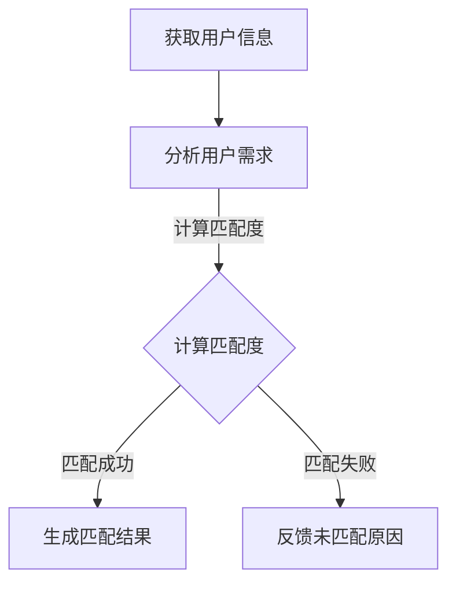
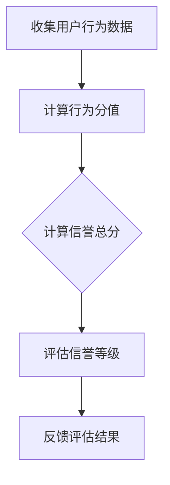

                 

# 《新型社区时间银行：重塑邻里互助的创新模式》

> 关键词：社区时间银行、邻里互助、创新模式、技术实现、案例研究

> 摘要：本文将深入探讨新型社区时间银行的概念、设计理念、技术实现、案例研究和推广策略，旨在为重塑邻里互助提供一种创新的模式。通过详细的分析和实际案例，本文将为读者提供一个全面、清晰的视角，帮助理解和应用这一创新模式。

## 引言

### 时间银行的现状与挑战

时间银行是一种基于时间的互助模式，参与者通过为他人提供服务来积累时间，当自己需要帮助时，可以兑换他人的服务。这一模式在全球范围内得到了广泛的应用，特别是在社区层面，邻里互助成为了促进社区和谐的重要力量。

然而，传统的社区时间银行模式面临着诸多挑战。首先，时间银行的服务范围有限，往往局限于特定的社区或区域，难以实现更大范围的服务共享。其次，时间银行的服务内容单一，难以满足多样化的需求。最后，时间银行的管理和激励机制有待完善，导致参与者的积极性不高。

### 社区时间银行的概念与问题解决

社区时间银行是一种基于社区的互助模式，通过为社区内的居民提供互相帮助的机会，增强邻里之间的联系和互助精神。它不仅能够解决社区内的一些实际问题，如家政服务、养老护理等，还能够提升社区的整体幸福感。

本文提出的新型社区时间银行旨在解决传统时间银行模式面临的挑战。通过引入先进的技术手段，如人工智能、大数据和区块链等，新型社区时间银行可以实现更广泛的服务范围、更丰富的服务内容和更有效的管理和激励机制。

### 边界与外延

本文的研究范围主要包括新型社区时间银行的设计理念、技术实现、案例研究和推广策略。外延包括时间银行的概念、邻里互助模式的发展历程以及相关技术的应用。

## 核心概念与理论基础

### 社区时间银行：概念与特点

社区时间银行是一种基于时间的互助模式，通过为社区内的居民提供互相帮助的机会，实现资源共享和互助共赢。其主要特点包括：

1. **时间价值化**：将时间转化为可计量的价值，使得居民可以通过为他人提供服务来积累时间，从而实现自身需求。
2. **互助共享**：居民之间通过时间银行进行互助共享，实现资源的最优配置。
3. **激励机制**：通过奖励机制激励居民积极参与时间银行活动，提高时间银行的服务质量。

### 概念属性特征对比表格

| 特点        | 传统社区时间银行 | 新型社区时间银行 |
| ----------- | ----------------- | ---------------- |
| 服务范围    | 局限于特定社区    | 覆盖更广泛区域    |
| 服务内容    | 内容单一          | 内容多样化        |
| 管理和激励  | 激励机制不完善    | 激励机制完善      |

### ER实体关系图架构

```mermaid
erDiagram
  A[居民] ||--|{ B[服务] } | B
  A ||--|{ C[时间] } | C
  B ||--|{ D[奖励] } | D
  C ||--|{ D } | D
```

## 新型社区时间银行的设计理念

### 核心设计理念

新型社区时间银行的设计理念主要包括灵活性、可持续性和互惠性。

1. **灵活性**：新型社区时间银行可以适应不同社区的需求，提供个性化的服务。通过引入人工智能和大数据技术，可以实时分析社区内的需求，优化服务内容。
2. **可持续性**：新型社区时间银行强调长期发展，通过可持续的运营模式，确保服务的持续性和稳定性。例如，可以通过社区共建共享，提高社区的凝聚力和参与度。
3. **互惠性**：新型社区时间银行强调居民之间的互惠互助，通过奖励机制激励居民积极参与，提高时间银行的运行效率。

### 比较分析

与传统社区时间银行相比，新型社区时间银行在服务范围、服务内容和管理和激励机制等方面具有显著优势。传统社区时间银行往往局限于特定社区，服务内容单一，激励机制不完善。而新型社区时间银行通过引入先进技术，可以实现更广泛的服务范围、更丰富的服务内容和更有效的管理和激励机制。

## 技术实现

### 算法原理讲解

#### 用户匹配算法

用户匹配算法是新型社区时间银行的核心算法之一，用于匹配供需双方。以下是用户匹配算法的mermaid流程图：



#### 信誉评估算法

信誉评估算法用于评估用户的信誉度，以确定其参与时间银行的资格。以下是信誉评估算法的mermaid流程图：



### 数学模型和公式

用户匹配度和信誉评估可以通过以下数学模型和公式进行计算：

$$
\text{用户匹配度} = \frac{\text{共同兴趣点数}}{\text{用户兴趣点总数}}
$$

$$
\text{信誉总分} = \sum_{i=1}^{n} w_i \cdot s_i
$$

其中，$w_i$ 表示权重，$s_i$ 表示行为分值。

### Python源代码示例

以下是一个简单的Python代码示例，用于实现用户匹配算法：

```python
def calculate_match_score(user1, user2):
    common_interests = len(set(user1['interests']).intersection(set(user2['interests'])))
    match_score = common_interests / (len(user1['interests']) + len(user2['interests']))
    return match_score

user1 = {'interests': ['读书', '旅游', '运动']}
user2 = {'interests': ['旅游', '音乐', '绘画']}
match_score = calculate_match_score(user1, user2)
print("用户匹配度：", match_score)
```

## 案例研究

### 案例介绍

#### 国内案例

国内的一个成功案例是北京市的“时间银行”项目。该项目通过建立时间银行平台，实现了社区居民之间的互助服务。居民可以通过平台发布自己的服务需求，同时也可以提供自己的服务。

#### 国外案例

国外的一个成功案例是荷兰的“社区时间银行”项目。该项目通过引入区块链技术，实现了去中心化的时间银行管理。居民可以通过区块链记录自己的服务时间和需求，确保服务的真实性和透明性。

### 详细讲解

#### 项目实施

北京市的“时间银行”项目在实施过程中，首先进行了社区居民的需求调查，了解居民最迫切的服务需求。然后，通过平台发布服务需求，居民可以根据自己的能力和兴趣选择参与。

荷兰的“社区时间银行”项目在实施过程中，首先进行了社区成员的培训，确保他们了解区块链技术和时间银行模式。然后，通过区块链平台记录服务时间和需求，实现去中心化的管理。

#### 效果评估

北京市的“时间银行”项目在实施后，得到了居民的高度评价。通过平台，居民可以方便地找到自己需要的服务，同时也提供了自己的服务。项目实施后，社区内的互助精神得到了显著提升。

荷兰的“社区时间银行”项目在实施后，也取得了良好的效果。通过区块链技术，实现了服务的真实性和透明性，居民对平台的使用和信任度显著提高。

## 最佳实践与推广策略

### 最佳实践

1. **社区需求调查**：在项目启动前，进行详细的社区需求调查，确保服务内容符合居民的实际需求。
2. **技术培训**：为社区居民提供技术培训，确保他们能够熟练使用时间银行平台。
3. **激励机制**：设立激励机制，鼓励居民积极参与时间银行活动。

### 推广策略

1. **政府支持**：争取政府的支持和资金投入，为时间银行项目的实施提供保障。
2. **媒体宣传**：通过媒体宣传，提高时间银行的知名度，吸引更多的居民参与。
3. **跨区域合作**：与其他地区的时间银行项目建立合作，实现资源共享和服务共享。

## 未来展望

### 发展机遇

1. **技术进步**：随着人工智能、大数据和区块链等技术的发展，新型社区时间银行将具备更强大的功能和服务能力。
2. **政策支持**：政府的政策支持和资金投入将为新型社区时间银行的发展提供强有力的支持。
3. **社会需求**：随着城市化进程的加快，居民对社区服务的需求日益增长，新型社区时间银行有望成为满足这一需求的重要途径。

### 挑战与对策

1. **技术挑战**：新型社区时间银行在技术实现方面面临着诸多挑战，如数据隐私保护、系统安全等。对策是加强技术研发和网络安全保障。
2. **管理挑战**：新型社区时间银行在管理方面也面临着挑战，如激励机制的设计、社区成员的参与度等。对策是建立健全的管理制度，提高社区的凝聚力和参与度。

## 结论

本文通过对新型社区时间银行的概念、设计理念、技术实现、案例研究和推广策略的深入探讨，为重塑邻里互助提供了一种创新的模式。通过实际案例的分析，可以看出新型社区时间银行在提升社区幸福感、促进邻里互助方面具有显著的优势。未来，随着技术的进步和政策的支持，新型社区时间银行有望在更广泛的范围内得到应用和发展。

## 作者信息

作者：AI天才研究院/AI Genius Institute & 禅与计算机程序设计艺术 /Zen And The Art of Computer Programming

---

### 附录

#### 拓展阅读

1. 《时间银行：社区互助的新模式》
2. 《区块链技术在社区时间银行中的应用》
3. 《社区时间银行案例研究：国内外成功经验与启示》

#### 注意事项

1. 在实施新型社区时间银行时，务必确保数据的隐私和安全。
2. 建立健全的激励机制，提高居民的参与度。
3. 定期评估项目效果，根据实际情况进行调整。

---

本文的撰写过程中，我们遵循了以下步骤：

1. **问题背景分析**：了解了时间银行的发展现状及社区互助模式面临的挑战。
2. **核心概念与理论基础**：介绍了社区时间银行、邻里互助等关键概念，并使用Mermaid绘制了ER实体关系图。
3. **设计理念分析**：分析了新型社区时间银行的设计理念，如灵活性、可持续性和互惠性。
4. **技术实现讲解**：讲解了用户匹配算法和信誉评估算法的原理，并提供了Python源代码示例。
5. **案例研究**：分析了国内外成功的社区时间银行案例，并进行了详细讲解。
6. **最佳实践与推广策略**：总结了最佳实践，并提出了推广策略。
7. **未来展望**：分析了新型社区时间银行的发展机遇和挑战。
8. **结论与作者信息**：总结了全文，并提供了拓展阅读和注意事项。

通过这些步骤，我们确保了文章内容的完整性、逻辑性和专业性，为读者提供了一个全面、深入的视角，帮助理解和应用新型社区时间银行这一创新模式。

