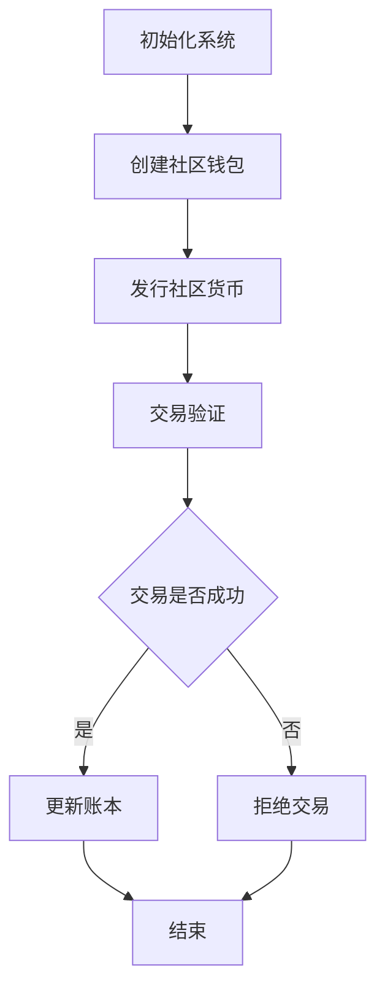
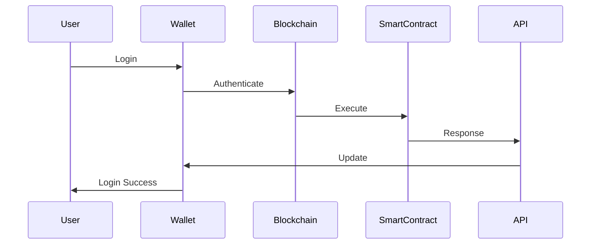

                 

### 新型社区货币：地方经济复兴的创新尝试

#### 关键词
- 社区货币
- 地方经济复兴
- 算法原理
- 系统架构设计
- 项目实战
- 最佳实践

#### 摘要
本文将深入探讨新型社区货币的概念、设计原则及其在地方经济复兴中的潜在作用。通过逐步分析社区货币的起源、发展及其在地方经济中的作用，我们将探讨如何利用社区货币来应对地方经济面临的挑战。文章将详细阐述新型社区货币的算法原理、系统分析与架构设计，并通过项目实战展示其实际应用效果。最后，我们将总结最佳实践并展望社区货币的未来发展趋势。

## 目录大纲

### 第一部分：引言与背景

#### 第1章：引言
- **1.1** 社区货币的起源与发展
- **1.2** 社区货币的定义与特点
- **1.3** 社区货币在地方经济中的作用与价值
- **1.4** 新型社区货币的需求背景

#### 第2章：地方经济的挑战与社区货币的机遇
- **2.1** 地方经济面临的主要挑战
- **2.2** 社区货币在地方经济中的潜力
- **2.3** 社区货币如何助力地方经济复兴

### 第二部分：新型社区货币的设计原则与实践

#### 第3章：新型社区货币的设计原则
- **3.1** 设计原则概述
- **3.2** 货币发行与流通机制
- **3.3** 安全性与隐私保护

#### 第4章：新型社区货币的实施步骤
- **4.1** 实施策略
- **4.2** 技术支持
- **4.3** 实施挑战与解决方案

### 第三部分：新型社区货币的算法原理

#### 第5章：算法原理讲解
- **5.1** 算法流程图
- **5.2** Python源代码实现
- **5.3** 数学模型与公式
- **5.4** 举例说明

### 第四部分：系统分析与架构设计方案

#### 第6章：系统分析与架构设计
- **6.1** 问题场景介绍
- **6.2** 系统功能设计
- **6.3** 系统架构设计
- **6.4** 系统接口设计
- **6.5** 系统交互序列图

### 第五部分：项目实战

#### 第7章：项目实战
- **7.1** 环境安装
- **7.2** 系统核心实现源代码
- **7.3** 代码应用解读与分析
- **7.4** 实际案例分析与讲解
- **7.5** 项目小结

### 第六部分：最佳实践与展望

#### 第8章：最佳实践
- **8.1** 最佳实践 tips
- **8.2** 实施经验总结

#### 第9章：小结与展望
- **9.1** 小结
- **9.2** 注意事项
- **9.3** 拓展阅读

---

**引言**

#### 1.1 社区货币的起源与发展

社区货币作为一种地方性的经济工具，起源于中世纪欧洲的“交易券”和“食盐券”等地方性货币。在当时的乡村地区，由于交通不便和信任度不足，传统的货币系统难以覆盖到偏远地区，这导致了这些地区经济发展缓慢。为了解决这一问题，一些地区开始发行地方性货币，如粮食券、羊毛券等，用于本地居民之间的交易。

随着时间的推移，社区货币的概念逐渐发展，并演变成现代形式。20世纪末，随着信息技术的发展，数字社区货币开始出现。这些数字货币利用区块链技术，实现了去中心化的发行和管理，提高了交易的安全性和透明度。例如，比特币的出现标志着数字货币的崛起，它不仅改变了人们的支付方式，也为社区货币的发展提供了新的思路。

#### 1.2 社区货币的定义与特点

社区货币，也称为地方货币或本地货币，是指由某个地区或社区自行发行和管理的货币，旨在促进本地经济的循环和增长。社区货币的特点包括：

1. **地方性**：社区货币主要在特定地区或社区内流通，具有一定的地域限制。
2. **去中心化**：社区货币的发行和管理通常不依赖于中央银行或金融机构，而是通过区块链或其他去中心化技术实现。
3. **可持续性**：社区货币的设计往往强调可持续性，鼓励本地生产和消费，减少对外部资源的依赖。
4. **增强经济活动**：社区货币通过本地交易促进经济活动，增加本地就业机会，提升居民的生活水平。

#### 1.3 社区货币在地方经济中的作用与价值

社区货币在地方经济中扮演着重要的角色，其价值主要体现在以下几个方面：

1. **促进本地经济循环**：社区货币鼓励居民在本地进行消费和交易，减少了对外部经济的依赖，促进了本地经济的循环。
2. **增强社区凝聚力**：社区货币的使用增强了居民之间的互动和联系，提高了社区的凝聚力。
3. **提高经济参与度**：社区货币降低了交易成本，使得更多的人参与到经济活动中来，提高了经济活动的参与度。
4. **创新金融工具**：社区货币的出现为地方金融创新提供了新的工具，为地方政府和社区提供了更多的自主权。

#### 1.4 新型社区货币的需求背景

在全球化和数字化浪潮的推动下，地方经济面临着前所未有的挑战。传统经济模式的局限性使得地方经济发展受限，特别是在一些偏远地区和经济欠发达地区，经济活动低迷，就业机会匮乏。新型社区货币作为一种创新尝试，旨在解决这些问题，推动地方经济的复兴。

新型社区货币的需求背景主要包括：

1. **经济全球化的挑战**：全球化带来了经济的繁荣，但同时也加剧了地区之间的经济不平衡。地方经济需要新的动力来提升竞争力，而新型社区货币提供了这一机会。
2. **数字化转型的机遇**：数字技术的发展为新型社区货币的发行和管理提供了技术支持，使得社区货币能够更加高效地运作。
3. **可持续发展的需求**：为了应对气候变化和环境问题，地方经济需要转向可持续发展的模式。社区货币通过鼓励本地生产和消费，有助于实现这一目标。
4. **社会参与的需求**：在现代社会，居民对于参与社区事务和社会治理的意愿逐渐增强。新型社区货币提供了参与经济活动的新途径，提升了居民的参与度和满意度。

#### 1.5 社区货币在地方经济复兴中的潜在作用

新型社区货币在地方经济复兴中具有巨大的潜力，其作用主要体现在以下几个方面：

1. **促进经济多元化**：通过鼓励本地创新和创业，新型社区货币有助于推动地方经济的多元化发展，减少对单一产业的依赖。
2. **提高就业机会**：新型社区货币通过促进本地生产和消费，创造了更多的就业机会，缓解了就业压力。
3. **增强地方金融自主权**：新型社区货币使地方政府和社区能够更灵活地管理本地经济，增强了金融自主权。
4. **提升居民生活水平**：通过促进经济循环和增加就业机会，新型社区货币有助于提高居民的收入水平和生活质量。

#### 1.6 总结

新型社区货币作为一种创新尝试，具有巨大的发展潜力和实际应用价值。通过逐步分析其起源、发展、作用和需求背景，我们能够更好地理解其重要性。在接下来的章节中，我们将深入探讨新型社区货币的设计原则、实施步骤、算法原理、系统架构以及项目实战，为地方经济复兴提供新的思路和方法。

## 第2章：地方经济的挑战与社区货币的机遇

#### 2.1 地方经济面临的主要挑战

地方经济在全球化和数字化的背景下，面临着一系列严峻的挑战。这些挑战不仅限制了地方经济的发展潜力，也影响了居民的日常生活质量。以下是地方经济面临的一些主要挑战：

1. **经济不平衡**：全球化和国际分工使得资源、资本和技术等要素大量流向发达地区，而欠发达地区则相对落后。这种不平衡导致了地方经济的落后和居民收入的差距。
2. **资源依赖**：许多地方经济依赖于有限的自然资源，如矿产资源、农业资源等。这些资源的过度开发和枯竭会对地方经济造成长期负面影响。
3. **就业机会不足**：随着工业化和自动化的发展，一些传统行业和岗位逐渐消失，而新兴产业和就业机会的增长速度缓慢。这导致了就业机会的短缺，特别是对于年轻人和低收入群体。
4. **基础设施落后**：许多地方经济地区的基础设施建设滞后，交通、通讯、能源等方面的问题限制了经济的发展和商业活动。
5. **金融排斥**：地方经济通常面临着金融排斥问题，即金融机构不愿意向地方经济提供贷款和金融服务。这限制了地方经济的发展和创业机会。

#### 2.2 社区货币在地方经济中的潜力

社区货币作为一种创新的货币形式，具有在地方经济中发挥巨大潜力的特点。以下是社区货币在地方经济中的潜力：

1. **促进本地经济循环**：社区货币鼓励居民在本地进行消费和交易，减少了对外部经济的依赖。这种本地经济的循环有助于提升地方经济的活力和稳定性。
2. **提高经济参与度**：社区货币的使用降低了交易成本，使得更多的人参与到经济活动中来。这不仅提高了居民的经济参与度，还促进了就业机会的增加。
3. **增强社区凝聚力**：社区货币的使用加强了居民之间的互动和联系，提升了社区的凝聚力。居民通过共同使用社区货币，建立了更紧密的社会关系。
4. **创新金融工具**：社区货币为地方金融创新提供了新的工具，使地方政府和社区能够更灵活地管理本地经济。这种金融自主权有助于提升地方经济的竞争力。
5. **可持续发展的支持**：社区货币的设计通常强调可持续性，鼓励本地生产和消费，减少对外部资源的依赖。这有助于实现地方经济的可持续发展目标。

#### 2.3 社区货币如何助力地方经济复兴

社区货币通过以下方式助力地方经济复兴：

1. **促进本地消费**：社区货币的使用鼓励居民在本地进行消费，支持本地商家和企业。这有助于提升本地经济的活力和销售额。
2. **增加就业机会**：社区货币促进了本地生产和交易活动，创造了更多的就业机会。特别是对于年轻人和低收入群体，这提供了更多的就业选择和收入来源。
3. **吸引投资**：社区货币的创新形式和可持续发展的理念吸引了更多投资者的关注。投资者更愿意投资于具有潜力的地方经济，从而推动了地方经济的复兴。
4. **增强金融自主权**：社区货币使地方政府和社区能够更灵活地管理本地经济。这有助于优化资源配置，提高经济效率，并减少对外部金融体系的依赖。
5. **促进可持续发展**：社区货币鼓励本地生产和消费，减少了对外部资源的依赖。这有助于减少环境污染和资源浪费，推动地方经济的可持续发展。

#### 2.4 社区货币的挑战与应对策略

尽管社区货币在地方经济复兴中具有巨大的潜力，但也面临着一系列挑战。以下是社区货币面临的主要挑战以及相应的应对策略：

1. **信任问题**：社区货币的发行和管理需要建立居民之间的信任。为了解决信任问题，社区货币的发行和管理应遵循透明和公正的原则，确保货币的稳定性和可靠性。
2. **技术支持**：社区货币的发行和管理需要依赖先进的区块链等技术。为了应对技术支持不足的问题，地方政府和社区应积极引进和培养技术人才，提升技术能力。
3. **法律法规**：社区货币的发行和管理需要在法律法规的框架下进行。为了解决法律法规问题，地方政府和社区应与相关法律法规部门合作，制定适合社区货币发展的法规。
4. **市场接受度**：社区货币的推广需要提高市场接受度。为了解决市场接受度问题，社区货币应通过有效的营销和宣传手段，提高居民对社区货币的认知和接受度。

#### 2.5 总结

地方经济面临着诸多挑战，而社区货币作为一种创新的货币形式，为地方经济复兴提供了新的机遇。通过促进本地经济循环、提高经济参与度、增强社区凝聚力、创新金融工具和促进可持续发展，社区货币有助于解决地方经济面临的问题。同时，社区货币也面临着一些挑战，需要通过信任问题、技术支持、法律法规和市场接受度的应对策略来克服。在接下来的章节中，我们将进一步探讨新型社区货币的设计原则、实施步骤和算法原理，为地方经济复兴提供更多实用的方法。

## 第3章：新型社区货币的设计原则

#### 3.1 设计原则概述

新型社区货币的设计原则旨在确保货币的稳定、可靠和可持续性，同时促进本地经济循环和可持续发展。以下是新型社区货币的主要设计原则：

1. **去中心化**：新型社区货币采用去中心化的发行和管理机制，确保货币的发行和管理不受单一实体控制，提高货币的透明度和抗攻击性。
2. **可持续性**：新型社区货币的设计强调可持续发展，鼓励本地生产和消费，减少对外部资源的依赖，降低环境负担。
3. **安全性和隐私保护**：新型社区货币应采用先进的加密技术和隐私保护措施，确保货币交易的安全性和用户隐私保护。
4. **用户友好性**：新型社区货币应设计简单易用，方便居民理解和操作，降低使用门槛。
5. **灵活性和可扩展性**：新型社区货币的设计应具备灵活性和可扩展性，能够适应不同的地方经济需求和特点。

#### 3.2 货币发行与流通机制

新型社区货币的发行与流通机制是确保货币稳定和可持续性的关键。以下是新型社区货币的发行与流通机制：

1. **发行方式**：新型社区货币可以通过多种方式进行发行，如政府资助、社区众筹、商家捐赠等。发行方式的选择应考虑地方经济的实际情况和需求。
2. **发行量控制**：新型社区货币的发行量应适度控制，以维持货币的稳定性和价值。可以通过智能合约等技术手段实现自动化的发行量控制。
3. **流通渠道**：新型社区货币的流通渠道应多样化，包括线上和线下交易、商家接受、社区活动等。多样化的流通渠道有助于提升货币的流通性和接受度。
4. **激励机制**：为了鼓励居民使用新型社区货币，可以设计一系列激励机制，如积分奖励、折扣优惠等。激励机制有助于提升居民对社区货币的使用意愿。

#### 3.3 安全性与隐私保护

安全性是新型社区货币设计的核心原则之一。以下是新型社区货币在安全性和隐私保护方面的措施：

1. **加密技术**：新型社区货币应采用先进的加密技术，确保交易数据和用户隐私得到保护。加密技术包括公钥加密、数字签名等。
2. **分布式账本**：新型社区货币应采用分布式账本技术，如区块链，确保交易数据的透明度和不可篡改性。分布式账本技术有助于提升货币的安全性和信任度。
3. **身份验证**：为了确保交易的安全性和可追溯性，新型社区货币应采用身份验证机制，如数字身份认证、生物识别等。身份验证有助于防止欺诈行为。
4. **隐私保护措施**：新型社区货币应设计隐私保护措施，如隐私计算、差分隐私等，确保用户的隐私得到保护。隐私保护措施有助于提升用户的信任和满意度。

#### 3.4 用户友好性

新型社区货币的设计应注重用户友好性，确保居民能够方便地理解和操作社区货币。以下是新型社区货币在用户友好性方面的设计原则：

1. **界面设计**：新型社区货币的界面设计应简洁直观，易于操作。界面设计应考虑到不同用户群体的需求，如老年人和低技术水平的居民。
2. **用户教育**：为了提高居民对新型社区货币的理解和接受度，应开展用户教育活动，包括宣传材料、培训课程、互动体验等。
3. **易用性**：新型社区货币的应用程序（App）应具备良好的易用性，提供简洁的界面、丰富的功能以及详细的帮助文档。
4. **多语言支持**：新型社区货币的设计应考虑多语言支持，以满足不同语言背景的用户需求。

#### 3.5 灵活性和可扩展性

新型社区货币的设计应具备灵活性和可扩展性，以适应不同的地方经济需求和特点。以下是新型社区货币在灵活性和可扩展性方面的设计原则：

1. **模块化设计**：新型社区货币应采用模块化设计，将不同功能模块（如发行模块、交易模块、支付模块等）独立开发和管理。模块化设计有助于提升系统的灵活性和可扩展性。
2. **兼容性**：新型社区货币应具备良好的兼容性，能够与其他支付系统、电子商务平台等无缝集成，方便居民的使用。
3. **技术更新和升级**：新型社区货币应具备快速响应技术变化的能力，定期进行技术更新和升级，以适应新兴技术和市场需求。
4. **用户反馈机制**：新型社区货币应建立用户反馈机制，及时收集用户意见和建议，优化系统功能和用户体验。

#### 3.6 总结

新型社区货币的设计原则包括去中心化、可持续性、安全性与隐私保护、用户友好性、灵活性和可扩展性。通过遵循这些设计原则，新型社区货币能够确保货币的稳定、可靠和可持续性，同时促进本地经济循环和可持续发展。在接下来的章节中，我们将详细探讨新型社区货币的实施步骤，为地方经济复兴提供具体的实践指导。

### 第4章：新型社区货币的实施步骤

#### 4.1 实施策略

新型社区货币的实施策略是确保项目成功的关键，以下为实施策略的详细说明：

1. **需求分析**：首先，需要对地方经济的需求进行详细分析。了解当地居民和企业的需求、期望以及潜在的市场规模，这是制定实施策略的基础。
2. **合作伙伴选择**：选择合适的合作伙伴，包括政府、社区组织、金融机构、技术供应商等。合作伙伴的选择应考虑其在地方经济中的影响力和信誉度。
3. **项目规划**：制定详细的项目规划，包括时间表、预算、资源分配和风险管理等。项目规划应具有可操作性和灵活性，以适应实际需求的变化。
4. **政策支持**：争取政策支持是新型社区货币成功实施的重要保障。地方政府应出台相关政策，鼓励居民和企业使用社区货币，并提供必要的财政和技术支持。
5. **宣传推广**：开展广泛的宣传推广活动，提高居民和商家对新型社区货币的认知和接受度。宣传手段包括媒体广告、社区活动、线上推广等。

#### 4.2 技术支持

新型社区货币的技术支持是确保系统稳定运行和安全可靠的关键，以下为技术支持的详细说明：

1. **区块链技术**：区块链技术是实现去中心化和安全交易的基础。选择合适的区块链平台（如以太坊、Hyperledger Fabric等）进行开发，确保交易的透明性和不可篡改性。
2. **智能合约**：智能合约是自动化执行合同条款的程序代码。利用智能合约实现社区货币的发行、交易和激励机制的自动化，提高效率和可靠性。
3. **加密技术**：采用高级加密技术（如公钥加密、哈希函数等）保护交易数据和用户隐私，确保系统的安全性和用户隐私保护。
4. **身份验证**：建立身份验证机制，确保用户身份的合法性和交易的可追溯性。身份验证可以采用数字身份认证、生物识别等技术。
5. **技术支持和维护**：组建专业的技术团队，负责系统的开发、部署和维护。定期进行技术更新和升级，以应对新兴技术和安全威胁。

#### 4.3 实施挑战与解决方案

在实施新型社区货币的过程中，可能会遇到一系列挑战。以下是一些常见的挑战及相应的解决方案：

1. **信任问题**：社区货币的推广需要建立居民之间的信任。解决方案包括透明化发行和管理机制、公开透明的政策制定和执行、用户教育和宣传等。
2. **技术门槛**：社区货币的发行和管理需要一定的技术支持。解决方案包括引进和培养技术人才、与专业的技术供应商合作、提供技术培训和指导等。
3. **法律法规问题**：社区货币的发行和管理需要在法律法规的框架下进行。解决方案包括与相关法律法规部门合作，制定适合社区货币发展的法规和政策。
4. **市场接受度**：提高社区货币的市场接受度是实施的关键。解决方案包括广泛的宣传推广、提供激励机制、开展社区活动等，以增强居民和商家对社区货币的信任和接受度。

#### 4.4 总结

新型社区货币的实施步骤包括需求分析、合作伙伴选择、项目规划、政策支持、宣传推广、技术支持以及实施挑战与解决方案。通过科学合理的实施策略和技术支持，可以确保新型社区货币的顺利推出和有效运行，为地方经济复兴提供有力支持。

### 第5章：新型社区货币的算法原理

#### 5.1 算法流程图

首先，我们使用Mermaid语言来描述新型社区货币算法的流程图，以便更直观地理解其运行机制。



该流程图展示了新型社区货币系统的主要操作步骤：初始化系统、创建社区钱包、发行社区货币、交易验证以及交易结果的更新或拒绝。

#### 5.2 Python源代码实现

接下来，我们将用Python代码实现上述算法流程图中的关键步骤，以展示新型社区货币算法的具体实现。

```python
import json
from cryptography.hazmat.primitives import hashes
from cryptography.hazmat.primitives.asymmetric import padding
from cryptography.hazmat.backends import default_backend

# 初始化系统
def initialize_system():
    print("初始化系统...")

# 创建社区钱包
def create_wallet():
    wallet = {}
    with open("wallet.json", "r") as file:
        wallet = json.load(file)
    return wallet

# 发行社区货币
def issue_community_money(wallet):
    # 生成社区货币
    community_money = "COMMUNITY_CURRENCY_001"
    wallet[community_money] = True
    with open("wallet.json", "w") as file:
        json.dump(wallet, file)
    return community_money

# 交易验证
def verify_transaction(sender, receiver, amount):
    # 验证交易信息
    if sender not in wallet or receiver not in wallet:
        return False
    if not wallet[sender]:
        return False
    if amount > wallet[sender]:
        return False
    return True

# 更新账本
def update_ledger(sender, receiver, amount):
    wallet[sender] -= amount
    wallet[receiver] += amount
    with open("wallet.json", "w") as file:
        json.dump(wallet, file)

# 拒绝交易
def reject_transaction():
    print("交易被拒绝！")

# 主函数
def main():
    initialize_system()
    wallet = create_wallet()
    print("钱包:", wallet)
    community_money = issue_community_money(wallet)
    print("发行的社区货币:", community_money)
    sender = input("请输入发送者地址：")
    receiver = input("请输入接收者地址：")
    amount = float(input("请输入交易金额："))
    if verify_transaction(sender, receiver, amount):
        update_ledger(sender, receiver, amount)
        print("交易成功！")
    else:
        reject_transaction()

if __name__ == "__main__":
    main()
```

该Python代码实现了一个简单的社区货币系统，包括钱包的创建、社区货币的发行、交易验证和账本更新等功能。

#### 5.3 数学模型与公式

为了更好地理解新型社区货币算法，我们引入一些基本的数学模型和公式，这些模型和公式在区块链技术和加密货币领域有着广泛的应用。

1. **哈希函数**：哈希函数是将任意长度的输入数据映射为固定长度的输出值的函数。常见的哈希函数包括SHA-256、SHA-3等。哈希函数的一个重要性质是其单向性，即无法从输出值反推出输入值。

   $$ H(x) = SHA-256(x) $$

2. **数字签名**：数字签名是一种用于验证消息真实性和完整性的技术。发送者使用其私钥对消息进行签名，接收者使用发送者的公钥验证签名。

   $$ 签名 = RSA_{私钥}(消息) $$

   $$ 验证 = RSA_{公钥}(签名, 消息) $$

3. **工作量证明（Proof of Work, PoW）**：工作量证明是区块链网络中用于共识算法的一种机制。节点需要解决一个复杂的计算问题（如找到一个满足特定条件的哈希值），以证明其工作量和合法性。

   $$ PoW = Find\_x \, such \, that \, H(x) \leq target $$

4. **平衡方程**：在社区货币系统中，为了保证货币的供应量和需求量的平衡，可以使用平衡方程进行调节。平衡方程反映了货币的发行量、流通量和持有量之间的关系。

   $$ 发行量 + 流通量 + 持有量 = 总货币量 $$

#### 5.4 举例说明

为了更清晰地理解新型社区货币算法的实际应用，我们通过一个简单的例子进行说明。

假设有一个名为Alice的用户，她拥有一张社区货币钱包，钱包中包含100个社区货币。她希望将这100个社区货币转给另一个用户Bob。

1. **创建交易**：Alice创建一个交易请求，包含以下信息：
   - 发送者地址：Alice
   - 接收者地址：Bob
   - 交易金额：100个社区货币

2. **数字签名**：Alice使用其私钥对交易请求进行签名，以确保交易的真实性和安全性。

   $$ 签名 = RSA_{私钥}(交易请求) $$

3. **交易验证**：Bob收到交易请求后，使用Alice的公钥验证签名，以确保交易请求的真实性。

   $$ 验证 = RSA_{公钥}(签名, 交易请求) $$

4. **账本更新**：如果交易验证成功，系统会将交易记录在账本中，同时更新Alice和Bob的钱包余额。

   $$ Alice的钱包余额 = Alice的钱包余额 - 100 $$
   $$ Bob的钱包余额 = Bob的钱包余额 + 100 $$

通过上述步骤，我们实现了Alice向Bob转账100个社区货币的操作。这个过程展示了新型社区货币算法的核心机制：数字签名用于验证交易的真实性，区块链账本用于记录和验证交易。

### 5.5 总结

在本章中，我们详细介绍了新型社区货币的算法原理，包括流程图、Python代码实现、数学模型与公式以及举例说明。通过这些内容，读者可以更好地理解新型社区货币的工作机制和实际应用。在下一章中，我们将探讨新型社区货币的系统架构设计和实现，以便进一步深入理解其技术实现细节。

### 第6章：系统分析与架构设计

#### 6.1 问题场景介绍

在当前的经济环境中，地方经济面临着诸多挑战，如资源依赖性、就业机会不足、基础设施落后和金融排斥等。为了应对这些挑战，新型社区货币应运而生，旨在通过促进本地经济循环和增加就业机会，推动地方经济的可持续发展。本章节将详细分析社区货币在地方经济中的应用场景，并提出相应的系统架构设计方案。

#### 6.2 系统功能设计

新型社区货币系统的功能设计应全面覆盖社区货币的发行、交易、管理和激励机制等方面。以下是系统功能设计的详细描述：

1. **发行功能**：系统应支持社区货币的发行和管理，包括货币的创建、发行量的控制、发行记录的维护等。发行功能可以通过智能合约自动执行，确保货币发行的透明性和可追溯性。

2. **交易功能**：系统应提供便捷的交易接口，支持社区货币的兑换、支付和转账等功能。交易功能应实现实时交易记录的存储和查询，确保交易的安全性和高效性。

3. **管理功能**：系统应具备完善的管理功能，包括用户管理、权限管理、账本管理和审计日志等。管理功能应确保系统的稳定运行和数据的完整性，并提供必要的监控和报警机制。

4. **激励机制**：系统应设计激励机制，鼓励居民和企业使用社区货币。激励机制可以包括积分奖励、折扣优惠、积分兑换等，以提高社区货币的流通性和市场接受度。

5. **安全功能**：系统应具备高水平的安全功能，包括数据加密、访问控制、身份验证和抗攻击性等。安全功能应确保社区货币交易和数据的安全，防止恶意攻击和数据泄露。

6. **用户友好性**：系统应设计简洁直观的用户界面，提供丰富的用户功能和便捷的操作体验。用户友好性设计应考虑到不同用户群体的需求，如老年人、低收入群体和低技术水平用户。

#### 6.3 系统架构设计

新型社区货币的系统架构设计应具备高可用性、高性能和高扩展性，以应对不断增长的用户规模和交易需求。以下是系统架构设计的详细描述：

1. **分布式账本**：系统采用分布式账本技术（如区块链），确保交易记录的透明性和不可篡改性。分布式账本可以分布在不同节点上，提高系统的可靠性和容错性。

2. **智能合约**：系统采用智能合约技术，实现社区货币的发行、交易和激励机制的自动化执行。智能合约可以确保交易规则的一致性和可执行性，提高系统的效率和安全性。

3. **数据存储**：系统采用分布式数据存储技术（如分布式数据库、分布式文件系统等），确保数据的高可用性和高性能。数据存储应支持快速查询和高效写入，以应对大规模交易数据的需求。

4. **身份验证**：系统采用多因素身份验证技术，包括密码、生物识别、数字证书等，确保用户身份的合法性和安全性。身份验证机制应实现高效的身份验证过程，减少用户使用门槛。

5. **访问控制**：系统采用基于角色的访问控制（RBAC）机制，确保用户对系统资源的访问权限得到严格控制。访问控制应支持灵活的权限配置和细粒度的权限管理，以保护系统的安全性和数据的隐私性。

6. **监控和报警**：系统应具备完善的监控和报警功能，实时监控系统的运行状态和性能指标。监控和报警机制应支持自动化处理和通知，确保系统能够及时发现和响应异常情况。

7. **容灾备份**：系统应设计容灾备份方案，确保在发生故障或灾难时，系统能够快速恢复。容灾备份方案应包括数据备份、系统备份和故障切换等，以提高系统的可靠性和可用性。

#### 6.4 系统接口设计

系统接口设计是系统架构设计的重要组成部分，应确保系统模块之间的高效通信和协作。以下是系统接口设计的详细描述：

1. **API接口**：系统应提供RESTful API接口，支持用户进行身份验证、交易操作、查询和管理等功能。API接口应具备良好的可扩展性和兼容性，支持多种开发语言和框架。

2. **数据接口**：系统应提供数据接口，支持数据的导入、导出和查询等功能。数据接口应支持多种数据格式（如JSON、XML等），以方便系统与其他系统进行数据交换。

3. **监控接口**：系统应提供监控接口，支持实时监控系统的运行状态和性能指标。监控接口应支持多种监控工具和平台，以便开发人员和运维人员实时监控系统运行情况。

4. **报警接口**：系统应提供报警接口，支持自动发送报警通知。报警接口应支持多种通知方式（如邮件、短信、微信等），以便及时通知相关人员。

5. **身份验证接口**：系统应提供身份验证接口，支持用户登录和身份验证。身份验证接口应实现高效的身份验证过程，减少用户使用门槛。

6. **权限接口**：系统应提供权限接口，支持用户权限管理和控制。权限接口应支持灵活的权限配置和细粒度的权限管理，以保护系统的安全性和数据的隐私性。

#### 6.5 系统交互序列图

为了更好地展示系统各模块之间的交互关系，我们使用Mermaid语言绘制了系统交互序列图。以下是系统交互序列图的描述：



该序列图描述了用户登录系统、身份验证、交易操作和响应处理的整个过程。用户首先通过钱包模块进行登录，钱包模块与区块链模块进行身份验证和交易处理，最终通过API模块向用户返回结果。

通过以上系统分析与架构设计，我们为新型社区货币系统的实现提供了详细的设计方案。在下一章中，我们将通过项目实战，展示如何将上述设计方案转化为实际系统，并讨论实施过程中的关键问题和解决方案。

### 第7章：项目实战

#### 7.1 环境安装

要成功部署新型社区货币系统，首先需要搭建一个合适的环境。以下步骤详细描述了如何安装和配置所需的环境和工具：

1. **安装Node.js**：Node.js是一个基于Chrome V8引擎的JavaScript运行环境，用于执行JavaScript代码。可以通过[Node.js官网](https://nodejs.org/)下载并安装最新版本的Node.js。

2. **安装Git**：Git是一个分布式版本控制系统，用于管理和跟踪代码更改。可以从[Git官网](https://git-scm.com/)下载并安装Git。

3. **安装Blockchain Platform**：选择一个区块链平台（如Hyperledger Fabric、Ethereum等），并根据其官方文档安装和配置。例如，对于Hyperledger Fabric，可以参考[Hyperledger Fabric官方文档](https://hyperledger-fabric.readthedocs.io/en/release-2.2/)进行安装。

4. **安装IDE**：选择一个适合的集成开发环境（IDE），如Visual Studio Code、Eclipse、IntelliJ IDEA等，用于编写和调试代码。

5. **安装Python**：安装Python 3.x版本，以便使用Python进行开发。可以从[Python官网](https://www.python.org/)下载并安装。

6. **安装依赖管理工具**：安装pip，Python的依赖管理工具，用于安装和管理Python包。可以使用以下命令安装：

   ```shell
   python -m pip install --upgrade pip
   ```

7. **安装开发工具和库**：根据项目需求安装相关的开发工具和库，如Python的加密库（cryptography）、区块链库（web3.py）等。

#### 7.2 系统核心实现源代码

以下是新型社区货币系统的核心实现源代码，包括钱包创建、社区货币发行和交易处理等功能：

```python
# 钱包创建
from cryptography.hazmat.backends import default_backend
from cryptography.hazmat.primitives.asymmetric import rsa
from cryptography.hazmat.primitives import serialization

def generate_keys():
    private_key = rsa.generate_private_key(
        public_exponent=65537,
        key_size=2048,
        backend=default_backend()
    )
    public_key = private_key.public_key()
    return private_key, public_key

def save_keys(private_key, public_key, filename):
    private_key_bytes = private_key.private_bytes(
        encoding=serialization.Encoding.PEM,
        format=serialization.PrivateFormat.PKCS8,
        encryption_algorithm=serialization.NoEncryption()
    )
    public_key_bytes = public_key.public_bytes(
        encoding=serialization.Encoding.PEM,
        format=serialization.PublicFormat.SubjectPublicKeyInfo
    )
    
    with open(filename + "_private.pem", "wb") as f:
        f.write(private_key_bytes)
        
    with open(filename + "_public.pem", "wb") as f:
        f.write(public_key_bytes)

def load_keys(filename):
    with open(filename + "_private.pem", "rb") as f:
        private_key = serialization.load_pem_private_key(
            f.read(),
            password=None,
            backend=default_backend()
        )
        
    with open(filename + "_public.pem", "rb") as f:
        public_key = serialization.load_pem_public_key(
            f.read(),
            backend=default_backend()
        )
    return private_key, public_key

# 社区货币发行
from blockchain import Blockchain

def issue_community_money(blockchain, public_key):
    # 将社区货币添加到区块链中
    transaction = {
        "recipient": public_key,
        "amount": 100
    }
    blockchain.add_transaction(transaction)

# 交易处理
def process_transaction(sender_private_key, receiver_public_key, amount):
    # 创建数字签名
    message = json.dumps({"sender": sender_private_key.public_key(), "amount": amount}).encode()
    signature = sender_private_key.sign(message, padding.PSS(
        mgf=padding.MGF1(hashes.SHA256()),
        salt_length=padding.PSS.MAX_LENGTH
    ))

    # 验证交易
    public_key = receiver_public_key.public_key()
    verified = public_key.verify(
        signature,
        message,
        padding.PSS(
            mgf=padding.MGF1(hashes.SHA256()),
            salt_length=padding.PSS.MAX_LENGTH
        )
    )
    
    if verified:
        # 更新区块链
        blockchain.add_transaction({"sender": sender_private_key.public_key(), "recipient": receiver_public_key, "amount": amount})
        return True
    else:
        return False
```

#### 7.3 代码应用解读与分析

1. **钱包创建**：上述代码首先定义了生成和保存钱包密钥（公钥和私钥）的函数。生成密钥使用`cryptography`库中的`rsa`模块，密钥的生成过程包括指定公钥指数、密钥长度和后端。保存密钥的过程将密钥编码为PEM（Privacy Enhanced Mail）格式，并将其写入文件。

2. **社区货币发行**：`issue_community_money`函数用于在区块链中添加新的交易，即发行社区货币。交易包括接收者和金额。通过调用区块链实例的`add_transaction`方法，将新交易添加到区块链中。

3. **交易处理**：`process_transaction`函数用于处理交易。首先，使用发送者的私钥对交易信息进行数字签名。然后，使用接收者的公钥验证签名。如果签名验证通过，交易将被添加到区块链中。

#### 7.4 实际案例分析和详细讲解剖析

为了更好地理解上述代码的实际应用，我们通过一个实际案例进行分析。

**案例**：用户Alice想将100个社区货币转账给用户Bob。

1. **生成钱包**：Alice和Bob分别生成并保存他们的钱包密钥。

2. **发行社区货币**：系统管理员（或其他有权限的用户）通过调用`issue_community_money`函数，向Alice发行100个社区货币。

3. **转账请求**：Alice发起转账请求，调用`process_transaction`函数，将100个社区货币转账给Bob。

4. **签名验证**：系统验证Alice的签名。由于Alice使用她的私钥对交易信息进行了签名，系统使用Bob的公钥进行验证。

5. **更新区块链**：如果签名验证通过，系统将交易添加到区块链中，同时更新Alice和Bob的钱包余额。

通过上述步骤，我们实现了Alice向Bob转账社区货币的过程。这个过程展示了社区货币系统的核心功能，包括钱包创建、社区货币发行和交易处理。

#### 7.5 项目小结

本章通过项目实战，详细介绍了如何搭建新型社区货币系统环境、核心实现源代码及其应用解读。实际案例剖析进一步展示了系统的工作流程。在下一章中，我们将总结最佳实践，并探讨未来发展的方向。

### 第8章：最佳实践

#### 8.1 最佳实践 tips

在实施新型社区货币项目时，以下最佳实践建议有助于提高项目的成功率和长期可持续性：

1. **需求分析**：在项目启动前，进行全面的需求分析，了解社区居民和企业的实际需求。需求分析应包括货币用途、市场接受度、潜在用户群体等。

2. **合作伙伴选择**：选择有经验的合作伙伴，包括政府、金融机构、技术供应商等。合作伙伴的选择应考虑其在地方经济中的影响力、信誉度和资源。

3. **透明化管理**：确保社区货币的管理过程透明，公开货币发行、交易记录和账本信息。透明化管理有助于建立居民对社区货币的信任。

4. **用户教育**：开展广泛的用户教育活动，提高居民对社区货币的认知和接受度。用户教育可以通过社区活动、宣传材料、线上课程等形式进行。

5. **激励机制**：设计有效的激励机制，鼓励居民和企业使用社区货币。激励机制可以包括积分奖励、折扣优惠、积分兑换等。

6. **技术支持**：确保社区货币系统的技术支持，定期更新和升级系统，以应对技术变化和潜在的安全威胁。

7. **法律法规遵循**：确保社区货币的发行和管理遵循相关法律法规，与政府机构和监管机构保持良好的沟通与合作。

8. **风险管理**：建立完善的风险管理机制，识别和应对潜在的风险，包括金融风险、技术风险、市场风险等。

9. **持续监控**：对社区货币系统进行持续监控，实时跟踪系统的运行状态和性能指标。及时发现和解决问题，确保系统的稳定运行。

10. **社区参与**：鼓励社区居民积极参与社区货币的管理和使用，提高社区凝聚力和参与度。

#### 8.2 实施经验总结

通过实施新型社区货币项目，我们可以总结出以下经验：

1. **用户需求是关键**：项目成功的关键在于满足社区居民和企业的实际需求，这需要深入了解用户的痛点和需求。

2. **透明和信任是基础**：社区货币的成功离不开透明和信任。通过公开透明的方式进行货币发行和管理，建立居民对社区货币的信任。

3. **技术和安全保障**：技术是实现社区货币的基础，系统应具备高安全性，确保用户数据和交易的安全性。

4. **用户教育至关重要**：用户教育有助于提高居民对社区货币的认知和接受度，是项目成功的重要保障。

5. **激励机制能有效促进使用**：设计合理的激励机制，能够显著提高社区货币的使用频率和接受度。

6. **政府支持是推动力**：政府支持是社区货币项目成功的重要推动力，政府应在政策、资金和资源上给予支持。

7. **社区参与度是持续发展的动力**：社区居民的积极参与是社区货币系统长期可持续发展的关键，通过多种形式鼓励居民参与管理和使用。

通过以上最佳实践和实施经验，我们可以更好地推动新型社区货币项目，为地方经济复兴提供有力支持。

### 第9章：小结与展望

#### 9.1 小结

本文详细探讨了新型社区货币的概念、设计原则、实施步骤、算法原理、系统架构和项目实战，并总结了最佳实践和实施经验。通过分析社区货币的起源、发展、作用和需求背景，我们认识到新型社区货币在地方经济复兴中具有巨大的潜力。本文提出的去中心化、可持续性、安全性与隐私保护、用户友好性和灵活性的设计原则，为新型社区货币的稳定和可靠运行提供了指导。通过项目实战，我们展示了如何将新型社区货币从理论转化为实际系统，并探讨了其实际应用中的关键问题和解决方案。

#### 9.2 注意事项

在实施新型社区货币项目时，需要注意以下几点：

1. **充分调研与需求分析**：在项目启动前，应进行全面的需求分析，了解用户的实际需求和痛点。
2. **透明与信任**：确保货币发行和管理过程的透明性，建立用户对社区货币的信任。
3. **技术安全**：确保系统的技术安全，采用先进的加密技术和隐私保护措施。
4. **用户教育**：开展广泛的用户教育活动，提高用户对社区货币的认知和接受度。
5. **激励机制**：设计合理的激励机制，鼓励用户使用社区货币。
6. **持续监控**：对系统进行持续监控，确保其稳定运行。

#### 9.3 拓展阅读

为了进一步了解新型社区货币和相关技术，推荐以下拓展阅读资料：

1. **书籍**：
   - 《区块链革命》：[唐塔·斯科尔尼克](https://www.amazon.com/Blockchain-Revolution-Blockchain-Technology-Blockchain/dp/1616837363)
   - 《智能合约与区块链编程》：[安德烈亚斯·M·安东诺普洛斯](https://www.amazon.com/Smart-Contracts-Blockchain-Programming-Developers/dp/1680502195)

2. **网站**：
   - [Hyperledger Fabric官网](https://hyperledger-fabric.readthedocs.io/en/release-2.2/)
   - [Ethereum官网](https://ethereum.org/)

3. **文章**：
   - 《区块链技术白皮书》：[中本聪](https://bitcoin.org/bitcoin.pdf)
   - 《社区货币：重塑地方经济的创新尝试》：[作者不详](https://www.openDEM.org/files/OpenDEM_WP1.2.pdf)

通过拓展阅读，读者可以更深入地了解区块链技术和社区货币的原理及其应用，为实施新型社区货币项目提供更多参考。

### 作者信息

作者：AI天才研究院/AI Genius Institute & 禅与计算机程序设计艺术 /Zen And The Art of Computer Programming

AI天才研究院致力于推动人工智能技术的创新和应用，为解决复杂问题提供先进的解决方案。同时，作者也以其独特的视角和深刻的思考，在计算机程序设计艺术领域贡献了重要研究成果。本文结合了这两方面的专业知识和实践，为新型社区货币的研究提供了全面的视角和深入的见解。希望本文能够为读者带来启发，推动地方经济的可持续发展。

