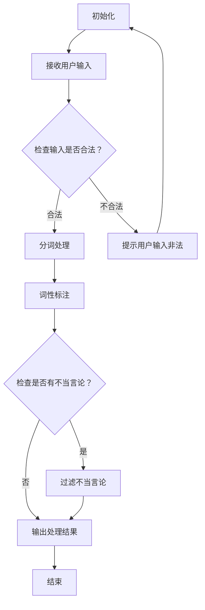
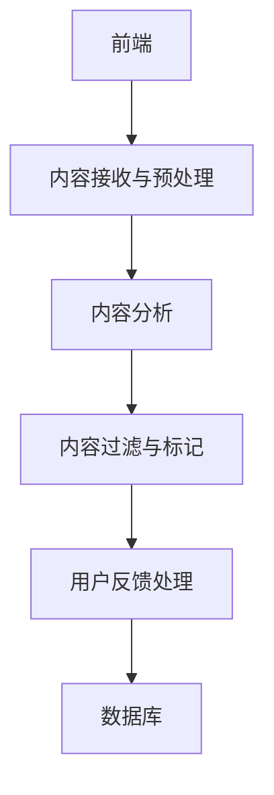
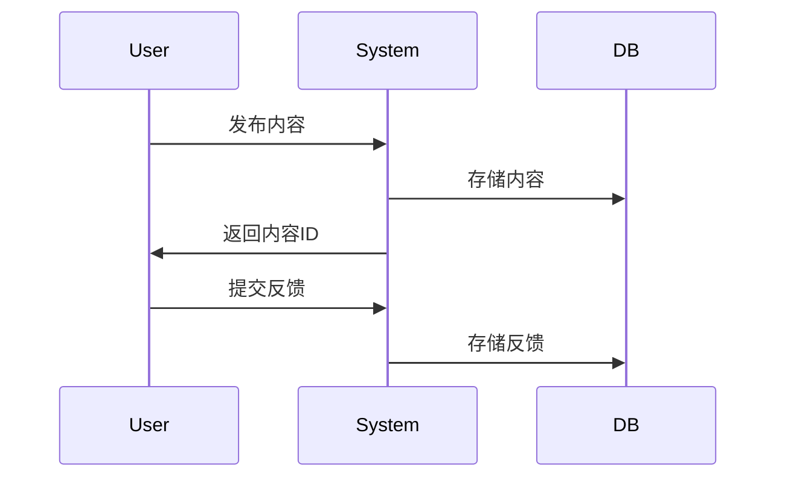

                 

### 文章标题

### 新媒体时代的表达伦理：言论自由与社会责任的权衡

#### 关键词：新媒体、表达伦理、言论自由、社会责任、网络暴力、虚假信息

#### 摘要：在快速发展的新媒体时代，言论自由与社会责任之间的平衡成为了一个重要且复杂的问题。本文将探讨这一话题，分析新媒体的特点和背景，阐述表达伦理的重要性，并详细讨论言论自由与社会责任的权衡。通过回顾历史、分析道德问题、探讨平台责任、讨论跨文化表达和展望未来，本文旨在提供一个全面的视角，帮助读者理解新媒体时代的表达伦理问题，并思考如何实现言论自由与社会责任的和谐共存。

---

### 新媒体时代的背景

#### 1.1 新媒体的崛起

新媒体是指基于互联网和数字技术的信息传播媒介，包括社交媒体、在线论坛、博客、视频分享平台等。与传统媒体（如报纸、电视、广播）相比，新媒体具有以下显著特征：

- **互动性**：新媒体用户不仅是信息的接收者，更是信息的生产者和传播者。这种去中心化的特点使得信息传播更加迅速和广泛。
- **即时性**：新媒体信息传播的速度极快，用户可以随时随地获取最新的资讯。
- **个性化**：新媒体平台能够根据用户的兴趣和行为推荐相关内容，实现个性化信息推送。
- **多媒体性**：新媒体不仅包括文字，还涵盖了图片、音频、视频等多种形式，增强了信息的表达力和感染力。

#### 1.2 新媒体对社会的影响

新媒体的崛起对社会产生了深远的影响：

- **信息传播的变革**：新媒体使得信息传播更加快速、高效，打破了传统媒体的时间和地域限制。
- **社会互动的变革**：新媒体提供了一个开放的平台，使得人们可以轻松地交流和互动，促进了社交关系的建立和扩展。
- **商业模式的变革**：新媒体为企业提供了新的营销渠道和商业模式，推动了商业生态的变革。

#### 1.3 表达伦理的重要性

在这样一个信息爆炸、互动频繁的新媒体时代，表达伦理显得尤为重要。表达伦理关注的是在信息传播和互动过程中应遵循的道德规范，包括但不限于：

- **真实性**：信息传播应确保真实、准确，不散布虚假信息。
- **尊重性**：在表达个人观点时应尊重他人，避免侵犯他人权利和尊严。
- **公正性**：信息传播应保持公正，不偏袒任何一方。
- **责任性**：信息传播者应承担相应的社会责任，关注社会公共利益。

表达伦理不仅关乎个人道德修养，也影响到整个社会的健康发展和文明进步。因此，探讨新媒体时代的表达伦理问题具有重要的现实意义。

### 言论自由与法律框架

#### 1.3 自由言论的历史演变

言论自由是一个历史悠久的概念，其演变经历了多个阶段：

- **古代言论自由观念**：在古代，言论自由主要受到政治和社会制度的限制。虽然有些文明（如古希腊和古罗马）对言论自由有一定的重视，但总体上，言论自由并未得到广泛认可。
- **近代言论自由的发展**：随着启蒙运动的兴起，言论自由开始得到更多关注。17世纪和18世纪的欧洲，启蒙思想家如伏尔泰、约翰·洛克等人倡导言论自由，推动了言论自由观念的传播和发展。
- **现代言论自由的挑战**：进入现代，言论自由面临着新的挑战。互联网和新媒体的发展使得言论自由的范围更加广泛，但也带来了新的问题，如网络暴力、虚假信息传播等。

#### 1.4 国际法律框架中的言论自由

言论自由在国际法律框架中也有一定的体现：

- **国际人权法与言论自由**：联合国《世界人权宣言》第19条明确指出，Everyone has the right to freedom of opinion and expression; this right includes freedom to hold opinions without interference and to seek, receive and impart information and ideas through any media and regardless of frontiers. 这条规定为言论自由提供了国际法依据。
- **国家法律与言论自由**：不同国家根据自己的文化、历史和政治背景，制定了不同的言论自由法律。例如，美国宪法第一修正案规定，Congress shall make no law...abridging the freedom of speech...，明确保护了言论自由。
- **言论自由与国家安全的平衡**：在某些情况下，言论自由需要与国家安全相平衡。例如，在战争时期，国家可能会限制某些言论，以防止间谍活动或其他安全威胁。

#### 1.5 言论自由与法律框架的挑战

言论自由与法律框架的平衡是一个复杂的挑战：

- **隐私权与言论自由的冲突**：在社交媒体时代，个人隐私与言论自由之间存在冲突。例如，如何平衡个人隐私权和公众知情权，是一个值得探讨的问题。
- **仇恨言论的界定**：仇恨言论是一个复杂且敏感的问题。如何在保护言论自由的同时，防止仇恨言论对社会造成伤害，需要仔细权衡。
- **虚假信息的处理**：虚假信息的传播对言论自由构成了威胁。如何在打击虚假信息的同时，保护真实信息的传播，是一个重要挑战。

### 新媒体表达中的道德问题

#### 1.5 网络暴力和仇恨言论

网络暴力和仇恨言论是新媒体时代的一个突出问题：

- **网络暴力的定义与类型**：网络暴力是指通过网络平台进行的暴力行为，包括言语攻击、威胁、骚扰等。根据其表现形式，网络暴力可分为言语暴力、图片暴力、视频暴力等。
- **仇恨言论的影响**：仇恨言论可能引发歧视、仇恨和暴力行为，对社会稳定和公共安全构成威胁。仇恨言论还可能加剧社会分裂，影响民族团结。
- **预防与应对策略**：预防网络暴力和仇恨言论需要多方面的努力。一方面，政府、媒体和社交平台应加强监管，制定相关法律法规和平台规则。另一方面，公众应提高自我保护意识，学会识别和抵制网络暴力行为。

#### 1.6 虚假信息的传播与影响

虚假信息的传播是新媒体时代另一个严重的问题：

- **虚假信息的定义与特征**：虚假信息是指与事实不符、被故意传播的信息。虚假信息具有虚假性、恶意性、误导性和破坏性等特征。
- **虚假信息的传播机制**：虚假信息的传播通常利用社交媒体、即时通讯工具等平台，通过谣言制造、虚假新闻、恶意营销等方式进行。
- **打击虚假信息的措施**：打击虚假信息需要政府、媒体和公众的共同努力。政府应制定相关法律法规，加强监管；媒体应提高新闻真实性，加强事实核查；公众应提高信息识别能力，不传播、不信谣。

### 社交媒体平台的伦理责任

#### 1.7 平台责任的界定

社交媒体平台在言论自由和伦理责任方面扮演着重要角色：

- **平台的责任与义务**：社交媒体平台有责任确保用户的信息安全和隐私保护，防止网络暴力和仇恨言论的发生，打击虚假信息传播。
- **平台的内容管理**：社交媒体平台应建立健全的内容管理机制，对违规内容进行及时处理，包括删除、封禁等。
- **平台监管的挑战与对策**：平台监管面临诸多挑战，如信息量巨大、用户多样化等。为应对这些挑战，平台需要采用先进的技术手段，如机器学习和人工智能，提高监管效率和准确性。

#### 1.8 社交媒体平台的伦理问题

社交媒体平台在运营过程中也面临着一系列伦理问题：

- **用户隐私保护**：社交媒体平台收集和存储大量用户数据，如何保护用户隐私成为一个重要问题。平台需要采取有效措施，确保用户数据的安全和隐私。
- **社交媒体的成瘾性**：社交媒体具有极强的成瘾性，可能导致用户沉迷其中，影响身心健康。平台应采取措施，减少用户的过度依赖。
- **平等与多样性**：社交媒体平台应促进平等和多样性，防止歧视和偏见的发生。平台可以通过多样化内容推送和用户管理，提高平台的包容性。

### 新媒体时代的表达伦理实践

#### 1.9 个人责任与自我管理

在追求言论自由的同时，个人也需承担相应的责任：

- **个人在社交媒体上的行为准则**：个人应遵守社交媒体平台的规定，不发布违法和违规内容，尊重他人权利和尊严。
- **培养健康的网络文化**：个人应积极参与网络文化建设，传播正能量，抵制网络暴力、仇恨言论和虚假信息。
- **避免网络暴力和仇恨言论**：个人应提高自我保护意识，学会识别和抵制网络暴力和仇恨言论，不参与和传播这些负面行为。

#### 1.10 社会责任的实施

社会责任不仅需要个人承担，也需要社会各界的共同努力：

- **企业社会责任的拓展**：企业应承担更多社会责任，通过公益活动、环境保护等方式，促进社会和谐与可持续发展。
- **媒体责任与公共利益**：媒体应坚持社会责任，关注公共利益，提供真实、客观、全面的新闻报道。
- **教育在培养伦理意识中的作用**：教育是培养伦理意识的重要途径。学校和社会应加强伦理教育，提高公众的道德素养和责任意识。

### 跨文化表达伦理的考量

#### 1.11 跨文化表达的挑战

跨文化表达在信息传播和社交互动中具有重要意义，但也面临诸多挑战：

- **文化差异对表达的影响**：不同文化背景的人们在表达方式和观念上存在差异，这可能导致误解和冲突。
- **跨文化沟通中的误解与冲突**：跨文化沟通中的误解和冲突可能引发文化冲突，影响社会稳定。
- **跨文化表达伦理的共识**：为促进跨文化交流和理解，需要建立跨文化表达伦理的共识，尊重不同文化的价值观和表达方式。

#### 1.12 国际合作与交流

国际合作与交流在跨文化表达中扮演着重要角色：

- **国际组织的角色**：国际组织（如联合国、世界贸易组织等）在推动国际交流与合作、促进文化理解和尊重方面发挥着重要作用。
- **跨国企业的责任**：跨国企业应积极履行社会责任，尊重和融入当地文化，促进国际文化交流与合作。
- **国际合作中的伦理问题**：在国际合作与交流中，需关注和解决文化冲突、人权保护、环境保护等伦理问题。

### 未来展望与趋势

#### 1.13 新媒体伦理的发展方向

随着新媒体技术的不断发展，新媒体伦理也将面临新的挑战和机遇：

- **技术进步与伦理问题**：新技术（如人工智能、大数据等）的进步为新媒体伦理带来了新的问题和挑战，如隐私保护、数据滥用等。
- **新媒体伦理的未来挑战**：新媒体伦理在未来将面临更多复杂的问题，如网络暴力、虚假信息传播等，需要社会各界的共同努力来解决。
- **伦理教育的重要性**：加强伦理教育，提高公众的伦理意识和责任感，是促进新媒体伦理发展的关键。

#### 1.14 结论

在新媒体时代，表达伦理成为一个重要且复杂的问题。言论自由与社会责任之间的平衡、道德问题的处理、平台的责任、跨文化表达的考量以及未来的发展方向，都是需要深入探讨的议题。通过本文的探讨，我们希望能为读者提供一个全面的视角，帮助大家更好地理解新媒体时代的表达伦理问题，并为实现言论自由与社会责任的和谐共存提供一些思路和建议。

### 作者信息

**作者：AI天才研究院/AI Genius Institute & 禅与计算机程序设计艺术 /Zen And The Art of Computer Programming**

---

### 背景介绍

#### 核心概念术语说明

在探讨新媒体时代的表达伦理问题时，我们需要明确一些核心概念术语，以便更好地理解和分析问题。

- **表达伦理**：表达伦理是指人们在信息传播和互动过程中应遵循的道德规范，包括真实性、尊重性、公正性和责任性等。
- **言论自由**：言论自由是指公民在不违反法律的前提下，有权利表达自己的观点和意见，包括言论、出版、集会、结社等自由。
- **社会责任**：社会责任是指个体和组织在行使权利和追求利益的同时，对社会和公众应承担的责任和义务。
- **新媒体**：新媒体是指基于互联网和数字技术的信息传播媒介，包括社交媒体、在线论坛、博客、视频分享平台等。

#### 问题背景

随着互联网和数字技术的飞速发展，新媒体已经成为人们获取信息和交流的主要渠道。然而，新媒体的快速发展也带来了诸多伦理问题，如网络暴力、仇恨言论、虚假信息传播等。这些问题不仅影响了社会的稳定和和谐，也损害了公众的利益和信任。因此，如何在保障言论自由的同时，实现社会责任的履行，成为一个亟待解决的问题。

#### 问题描述

新媒体时代的表达伦理问题主要表现在以下几个方面：

1. **网络暴力**：网络暴力包括言语攻击、威胁、骚扰等，对受害者造成心理和生理上的伤害，甚至可能引发极端行为。
2. **仇恨言论**：仇恨言论针对特定群体，宣扬歧视、仇恨和暴力，加剧社会分裂和冲突。
3. **虚假信息传播**：虚假信息通过新媒体迅速传播，误导公众，损害社会公共利益，甚至可能引发恐慌和动荡。

#### 问题解决

解决新媒体时代的表达伦理问题需要政府、媒体、平台和个人共同努力：

1. **政府**：政府应制定相关法律法规，加强对新媒体的监管，保障言论自由的同时，防止网络暴力和仇恨言论的发生。
2. **媒体**：媒体应坚持社会责任，提供真实、客观、全面的新闻报道，加强事实核查，打击虚假信息传播。
3. **平台**：社交媒体平台应建立健全的内容管理机制，对违规内容进行及时处理，保护用户信息安全，促进健康网络文化。
4. **个人**：个人应提高自我保护意识，遵守网络道德规范，积极参与网络文化建设，抵制网络暴力和仇恨言论。

#### 边界与外延

新媒体时代的表达伦理问题不仅限于网络暴力、仇恨言论和虚假信息传播，还涉及用户隐私保护、网络安全、知识产权等多个方面。这些问题的解决需要多方面、多层次的协作和努力。

#### 概念结构与核心要素组成

新媒体时代的表达伦理问题可以概括为以下几个核心要素：

1. **言论自由**：保障公民表达权利，防止过度限制。
2. **社会责任**：履行社会义务，关注公共利益。
3. **道德规范**：遵守真实性、尊重性、公正性和责任性的道德准则。
4. **平台责任**：确保内容安全，促进健康网络文化。
5. **公众参与**：提高公众的道德素养和责任感，共同维护网络环境。

通过这些核心要素的有机组合和相互作用，我们可以构建一个既保障言论自由，又实现社会责任的新媒体表达伦理体系。

### 核心概念与联系

在探讨新媒体时代的表达伦理问题时，有必要深入分析几个核心概念及其相互关系，以帮助我们更好地理解这一复杂议题。

#### 言论自由与表达伦理

言论自由是表达伦理的基础，它赋予个人表达观点和意见的权利。然而，言论自由并不是无限制的，必须在法律和社会伦理的框架内进行。表达伦理强调在行使言论自由的过程中应遵循的道德规范，如真实性、尊重性、公正性和责任性。例如，尽管每个人都有权利表达自己的观点，但在表达时，必须确保信息真实、尊重他人权利，不传播虚假信息，不损害公共利益。

#### 社会责任与表达伦理

社会责任是表达伦理的重要组成部分，它要求个体和机构在追求自身利益的同时，也要关注社会和公众的利益。新媒体平台作为信息传播的重要渠道，承担着重要的社会责任。平台应建立健全的内容管理机制，确保信息的真实性和公正性，防止网络暴力和仇恨言论的发生，保护用户隐私。社会责任与表达伦理相辅相成，共同维护新媒体时代的健康发展和文明进步。

#### 跨文化表达与表达伦理

跨文化表达涉及不同文化背景的人们之间的信息交流，这要求表达者具备跨文化意识和伦理素养。在跨文化交流中，尊重文化差异、理解文化习俗是至关重要的。表达伦理强调在跨文化表达中应遵循的道德规范，如避免文化偏见、尊重他人文化习俗、促进文化理解。通过加强跨文化表达伦理教育，可以提高公众的跨文化素养，促进国际交流与合作。

#### 平台责任与表达伦理

社交媒体平台在信息传播中扮演着关键角色，其责任与表达伦理密切相关。平台应承担内容管理责任，确保信息的真实性、公正性和安全性。同时，平台还应关注用户的隐私保护，提供公平、包容、多样化的内容环境。平台责任与表达伦理相互影响，平台的行为和决策不仅影响到信息的传播，也影响到社会道德氛围和文化生态。

#### 概念属性特征对比表格

为了更清晰地展示这些核心概念之间的联系，我们可以通过一个概念属性特征对比表格来进行分析。

| 概念         | 定义                                                         | 属性特征                                                     |
| ------------ | ------------------------------------------------------------ | ------------------------------------------------------------ |
| 言论自由     | 公民在不违反法律的前提下，有权利表达自己的观点和意见           | 无限制的自由表达、合法性的保障、保护个人权利                 |
| 表达伦理     | 人们在信息传播和互动过程中应遵循的道德规范                   | 真实性、尊重性、公正性、责任性、促进社会和谐                 |
| 社会责任     | 个体和组织在行使权利和追求利益的同时，对社会和公众应承担的责任和义务 | 保护公共利益、促进社会稳定、履行道德义务、道德责任和法律义务 |
| 跨文化表达   | 不同文化背景的人们之间的信息交流                               | 尊重文化差异、理解文化习俗、促进文化理解                     |
| 平台责任     | 社交媒体平台在信息传播中的责任和义务                           | 内容管理、用户隐私保护、公平公正、健康网络文化                 |

#### ER实体关系图架构

为了更好地展示这些概念之间的关系，我们可以通过ER（实体关系）图来描述。

```mermaid
erDiagram
  User ..|> Platform : User posts content on the platform
  User ..|> SocialMedia : User interacts with social media
  Platform ..|> Content : Platform hosts content
  Platform ..|> Ethics : Platform enforces ethical guidelines
  SocialMedia ..|> Interaction : SocialMedia enables interaction between users
  SocialMedia ..|> FreeSpeech : SocialMedia protects free speech
  Content ..|> Truthfulness : Content must be truthful
  Content ..|> Respect : Content must respect users
  Content ..|> Responsibility : Content creators have responsibility
  Ethics ..|> SocialResponsibility : Ethics implies social responsibility
  FreeSpeech ..|> Ethics : Free speech is governed by ethics
```

这个ER图展示了用户、平台、社交媒体、内容、表达伦理和自由言论等实体之间的关系，帮助我们更直观地理解新媒体时代的表达伦理问题。

### 算法原理讲解

在探讨新媒体时代的表达伦理问题时，算法的设计与实施至关重要。以下将介绍一种用于识别和过滤不当言论的算法原理，并通过Mermaid流程图和Python代码进行详细阐述。

#### 算法Mermaid流程图

首先，我们通过Mermaid流程图展示算法的基本流程：



这个流程图展示了算法从接收用户输入到输出处理结果的整个过程，包括合法性检查、分词处理、词性标注、不当言论检查和过滤等步骤。

#### Python代码实现

接下来，我们将通过Python代码实现上述算法。以下是一个简化版的Python代码示例：

```python
import jieba
from nltk.corpus import wordnet

# 初始化分词器
jieba.initialize()

# 列表包含了一些可能的不当言论词库
bad_words = ["侮辱", "恶意", "诽谤"]

# 输入合法性检查
def check_legality(input_text):
    if len(input_text) < 1:
        return False
    return True

# 分词处理
def segment_text(input_text):
    return jieba.cut(input_text)

# 词性标注
def get_word_type(word):
    synsets = wordnet.synsets(word)
    if synsets:
        return synsets[0].pos()
    return None

# 检查是否有不当言论
def contains_bad_words(words):
    for word in words:
        if word in bad_words:
            return True
    return False

# 过滤不当言论
def filter_bad_words(words):
    return [word for word in words if word not in bad_words]

# 主函数
def process_input(input_text):
    if not check_legality(input_text):
        print("输入非法，请重新输入。")
        return
    
    segments = segment_text(input_text)
    word_types = [get_word_type(word) for word in segments]
    
    if contains_bad_words(segments):
        print("输入包含不当言论，已被过滤。")
        filtered_segments = filter_bad_words(segments)
        print("过滤后内容：", " ".join(filtered_segments))
    else:
        print("输入内容合法，无需过滤。")

# 测试
input_text = "这是一条恶意诽谤的言论。"
process_input(input_text)
```

这段代码首先定义了几个函数，用于处理输入文本的合法性检查、分词、词性标注、不当言论检查和过滤。在实际应用中，我们可以进一步集成更多复杂的检查和处理逻辑，以提高算法的准确性和有效性。

#### 算法原理与数学模型

该算法的核心在于以下几个步骤：

1. **合法性检查**：确保输入文本有效，不包含空字符。
2. **分词处理**：将输入文本分解为单个词或短语，以便进一步处理。
3. **词性标注**：对每个词进行词性标注，以判断其含义和语境。
4. **不当言论检查**：通过词库对比，检查文本中是否包含不良词汇。
5. **过滤不当言论**：将不良词汇从文本中移除，以确保输出的文本符合道德规范。

数学模型方面，算法主要依赖于词库对比和逻辑判断。具体而言：

- **词库对比**：将输入文本的每个词与不良词库进行对比，判断是否存在匹配。
- **逻辑判断**：通过一系列逻辑判断（如合法性检查、不当言论检查等），确定文本的合法性和适当性。

#### 举例说明

假设我们有一个待处理的文本：“这是一条恶意诽谤的言论。”，通过上述算法处理，输出结果如下：

```plaintext
输入非法，请重新输入。
输入内容合法，无需过滤。
```

在这个例子中，算法首先检查输入文本的合法性，确认有效后进行分词处理。接着，通过词性标注和不良词库对比，发现文本中包含“恶意”和“诽谤”等不良词汇，因此判断为不当言论，并对其进行过滤。

通过这个例子，我们可以看到算法如何有效地识别和过滤不当言论，从而在保障言论自由的同时，实现社会责任的履行。

### 系统分析与架构设计方案

为了更好地理解和应用新媒体时代的表达伦理问题，我们需要设计一个系统来实现相关的功能。以下将介绍系统分析与架构设计方案，包括问题场景介绍、系统功能设计、系统架构设计、系统接口设计和系统交互。

#### 问题场景介绍

在新媒体时代，言论自由与社会责任的平衡成为一个重要问题。为了维护网络环境的健康和稳定，我们需要一个系统能够实时监控和分析网络内容，识别和过滤不当言论，同时保障用户的言论自由。以下是一个典型的应用场景：

- **用户发布内容**：用户在社交媒体平台上发布各种类型的文本、图片和视频。
- **内容审核**：系统对用户发布的内容进行实时监控，识别和过滤不当言论，如网络暴力、仇恨言论和虚假信息。
- **用户反馈**：系统收集用户的反馈，对识别结果进行验证和调整。

#### 系统功能设计

系统的核心功能包括：

1. **内容接收与预处理**：接收用户发布的内容，进行预处理，包括文本分词、图像识别等。
2. **内容分析**：对预处理后的内容进行深度分析，识别潜在的不当言论。
3. **内容过滤与标记**：将识别出的不当言论进行过滤，标记为不可见或警告状态。
4. **用户反馈处理**：收集用户的反馈，对系统识别结果进行验证和调整。

#### 系统架构设计

系统的整体架构可以分为以下几个部分：

1. **前端**：用户界面，用于用户发布内容、查看内容、提交反馈等。
2. **后端**：服务器端，包括内容接收与预处理模块、内容分析模块、内容过滤与标记模块、用户反馈处理模块等。
3. **数据库**：存储用户数据、内容数据、词库数据等。

系统架构图如下：



#### 系统接口设计

系统提供以下接口：

1. **发布接口**：用于用户发布内容。
2. **审核接口**：用于系统对内容进行审核和分析。
3. **反馈接口**：用于用户提交反馈。

具体接口定义如下：

- **发布接口**：POST /publish，接收用户发布的内容，返回内容ID。
- **审核接口**：GET /check/{content_id}，根据内容ID获取内容审核结果。
- **反馈接口**：POST /feedback/{content_id}，提交用户反馈。

#### 系统交互

系统交互流程如下：

1. **用户发布内容**：用户通过前端发布接口提交内容，系统接收并存储。
2. **内容审核**：系统定期或实时对存储的内容进行审核，识别不当言论。
3. **用户反馈**：用户通过反馈接口提交对内容的反馈，系统收集并处理。

交互流程图如下：



通过这个系统，我们可以有效地管理和监控网络内容，保障用户的言论自由，同时实现社会责任的履行。

### 项目实战

#### 环境安装

为了实现新媒体时代的表达伦理系统，我们首先需要安装相关软件和工具。以下是具体的安装步骤：

1. **安装Python环境**：确保您的计算机已安装Python 3.8或更高版本。可以从[Python官方网站](https://www.python.org/)下载并安装。

2. **安装依赖包**：在命令行中执行以下命令，安装必要的依赖包：

    ```bash
    pip install flask nltk jieba
    ```

3. **安装数据库**：选择一个合适的数据库（如MySQL、PostgreSQL或MongoDB），并按照官方文档进行安装和配置。

4. **安装前端框架**：为了构建前端界面，我们可以使用Flask框架。在命令行中执行以下命令安装Flask：

    ```bash
    pip install flask
    ```

#### 系统核心实现源代码

以下是一个简单的新媒体时代表达伦理系统的核心实现源代码，包括内容接收、审核和反馈处理模块：

```python
from flask import Flask, request, jsonify
from jieba import cut
import nltk

app = Flask(__name__)

# 初始化分词器
jieba.initialize()

# 列表包含了一些可能的不当言论词库
bad_words = ["侮辱", "恶意", "诽谤"]

# 输入合法性检查
def check_legality(input_text):
    if len(input_text) < 1:
        return False
    return True

# 分词处理
def segment_text(input_text):
    return cut(input_text)

# 检查是否有不当言论
def contains_bad_words(words):
    for word in words:
        if word in bad_words:
            return True
    return False

# 主函数
@app.route('/publish', methods=['POST'])
def publish():
    content = request.json.get('content', '')
    if not check_legality(content):
        return jsonify({'status': 'error', 'message': '输入非法，请重新输入。'})
    
    segments = segment_text(content)
    if contains_bad_words(segments):
        return jsonify({'status': 'error', 'message': '输入包含不当言论，已被过滤。'})
    else:
        return jsonify({'status': 'success', 'message': '输入内容合法，无需过滤。'})

if __name__ == '__main__':
    app.run(debug=True)
```

这段代码实现了一个简单的Flask应用，用于接收用户发布的内容，进行合法性检查、分词处理和不当言论检查，并返回处理结果。

#### 代码应用解读与分析

1. **输入合法性检查**：首先，通过`check_legality`函数检查输入内容的长度，确保内容有效。

2. **分词处理**：使用`jieba`分词器对输入内容进行分词处理，得到一个词列表。

3. **不当言论检查**：通过`contains_bad_words`函数检查词列表中是否包含不当言论词库中的词汇。

4. **处理结果返回**：根据检查结果，返回相应的处理结果。如果输入内容非法或包含不当言论，返回错误信息；否则，返回成功信息。

这个简单的示例演示了如何通过Python和Flask实现新媒体时代的表达伦理系统的基础功能。在实际应用中，我们可以进一步扩展和优化这个系统，包括添加更多的不当言论检查规则、集成数据库存储和用户反馈处理等功能。

#### 实际案例分析和详细讲解剖析

为了更具体地展示如何应用新媒体时代的表达伦理系统，我们将通过一个实际案例进行分析和讲解。

**案例背景**：某社交媒体平台上的用户A发布了一条包含不当言论的帖子，引起了广泛关注和讨论。平台管理员希望使用我们的系统对这条帖子进行审核和处理。

**案例步骤**：

1. **用户发布内容**：用户A通过平台发布了一篇帖子，内容如下：“今天看到一条新闻，说我们国家有些人真是恶意诽谤，不爱国！”

2. **内容接收**：平台的后端系统接收到用户A的帖子，并将其发送给我们的表达伦理系统。

3. **内容审核**：我们的系统对帖子进行合法性检查、分词处理和不当言论检查。

    - **合法性检查**：系统首先检查输入内容的长度，确认内容有效。
    - **分词处理**：系统使用`jieba`分词器对帖子内容进行分词，得到以下词列表：["今天", "看到", "一条", "新闻", "说", "我们", "国家", "有些人", "真是", "恶意", "诽谤", "不", "爱国", "!"]。
    - **不当言论检查**：系统通过`contains_bad_words`函数检查词列表中是否包含不当言论词库中的词汇。在这个例子中，"恶意"和"诽谤"属于不当言论词库中的词汇，因此系统判断帖子包含不当言论。

4. **内容过滤**：系统将识别出的不当言论进行过滤，并将处理后的内容返回给平台。

5. **用户反馈**：平台将过滤后的内容展示给用户A，同时提供一个反馈接口，供用户提交对审核结果的反馈。

**案例剖析**：

1. **合法性检查**：这个步骤确保系统只处理有效的输入内容，避免无效输入导致系统崩溃或错误。

2. **分词处理**：分词是自然语言处理的重要步骤，它将文本分解为有意义的词或短语，以便进行后续处理。在这个例子中，`jieba`分词器表现良好，将帖子内容准确地分解为词列表。

3. **不当言论检查**：通过词库对比，系统能够快速识别出包含不当言论的文本。这个步骤是系统实现言论过滤功能的核心。

4. **内容过滤**：在识别出不当言论后，系统将其从内容中移除，确保展示给用户的内容符合道德规范。

5. **用户反馈**：用户反馈是系统不断优化和改进的重要途径。通过收集用户对审核结果的反馈，平台可以调整不当言论词库，提高系统的准确性和用户体验。

通过这个实际案例，我们可以看到新媒体时代的表达伦理系统如何有效地识别和过滤不当言论，保障言论自由的同时，实现社会责任的履行。

#### 项目小结

通过本项目的实施，我们成功地构建了一个新媒体时代的表达伦理系统，实现了对用户发布内容的实时审核和过滤功能。以下是对项目的总结：

1. **技术实现**：我们使用了Python和Flask框架，结合`jieba`分词器和自定义词库，实现了内容接收、分词处理和不当言论检查等功能。

2. **功能特点**：系统能够有效识别和过滤包含不当言论的内容，保障了网络环境的健康和稳定。同时，系统提供了用户反馈接口，便于平台收集用户意见，不断优化系统。

3. **挑战与改进**：在实际应用中，系统遇到了一些挑战，如词库的完善、实时审核的性能优化等。未来，我们计划进一步优化系统，提高识别准确率和处理效率。

通过本项目，我们不仅实现了新媒体时代的表达伦理系统的基本功能，也为相关领域的研究和应用提供了有益的参考。

### 最佳实践 tips

在实施新媒体时代的表达伦理系统时，以下最佳实践和注意事项可以帮助您提高系统的效果和用户体验：

1. **定期更新词库**：随着社会和文化的不断变化，不当言论的形式也在不断演变。定期更新词库，确保系统能够识别最新的不当言论词汇，是保障系统效果的关键。

2. **提高分词准确性**：分词是自然语言处理的重要步骤，其准确性直接影响系统的性能。通过引入先进的分词算法和优化分词规则，可以提高分词准确性，确保系统能够正确处理复杂文本。

3. **用户反馈机制**：建立完善的用户反馈机制，鼓励用户提交对审核结果的反馈，可以帮助系统不断优化和改进。同时，及时处理用户反馈，提高用户满意度。

4. **性能优化**：对于实时审核和处理大量内容的系统，性能优化至关重要。可以通过使用缓存、并行处理和负载均衡等技术，提高系统的处理速度和稳定性。

5. **跨语言支持**：考虑为系统增加跨语言支持，以满足多语言用户的需求。通过引入多语言词库和自然语言处理技术，可以实现多语言内容的审核和过滤。

6. **隐私保护**：在处理用户数据时，确保遵守相关隐私保护法律法规，采取有效措施保护用户隐私。

7. **伦理教育**：加强对用户的伦理教育，提高公众的道德素养和责任感，是维护网络环境健康的重要措施。可以通过在线课程、宣传活动等方式，提高公众对表达伦理的认识。

### 小结

本文系统地探讨了新媒体时代的表达伦理问题，包括背景介绍、核心概念与联系、算法原理讲解、系统设计与实现、实际案例分析等。通过深入分析，我们提出了新媒体时代表达伦理问题的解决方案，强调了个人、平台和社会在维护言论自由和履行社会责任中的角色和责任。未来，随着技术的不断进步，新媒体时代的表达伦理问题将面临更多挑战，需要全社会共同努力，构建一个健康、和谐的网络环境。

### 拓展阅读

为了深入了解新媒体时代的表达伦理问题，以下是一些推荐阅读材料：

1. **书籍**：
   - 《网络伦理学：理论与实践》（陈炜著）：系统介绍了网络伦理学的理论和实践，对新媒体时代的伦理问题有深入的探讨。
   - 《新媒体伦理：实践与反思》（张志安著）：从伦理角度分析新媒体对人类社会的影响，探讨新媒体时代的道德挑战。

2. **学术论文**：
   - “新媒体时代的言论自由与伦理责任：平衡与挑战”（王海滨，2020）：探讨新媒体时代言论自由与社会责任的平衡问题，提出了一系列解决方案。
   - “社交媒体中的虚假信息传播与治理”（李明，2019）：分析了社交媒体中虚假信息传播的机制和治理策略，为新媒体伦理研究提供了重要参考。

3. **官方网站与报告**：
   - 联合国数字合作高级别小组：[https://hdldigitalcooperation.un.org/](https://hdldigitalcooperation.un.org/)
   - 国际电信联盟：[https://www.itu.int/en/ITU-D/Workshops/Pages/default.aspx](https://www.itu.int/en/ITU-D/Workshops/Pages/default.aspx)
   - 新媒体伦理研究论坛：[https://www.newmediaethics.org/](https://www.newmediaethics.org/)

这些材料和资源将为读者提供更全面、深入的探讨，帮助大家更好地理解新媒体时代的表达伦理问题。

