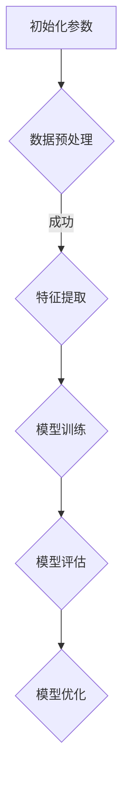
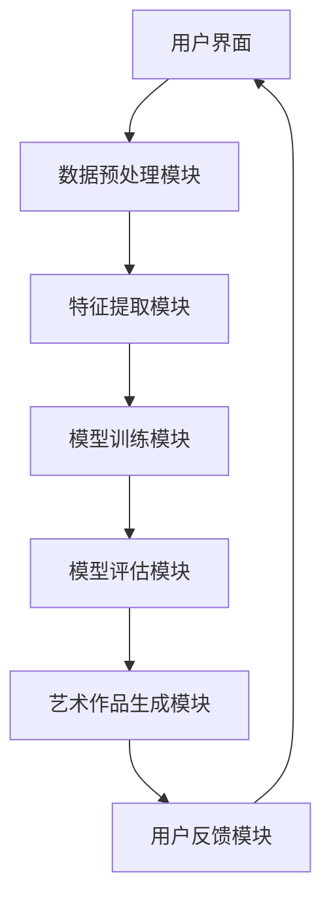
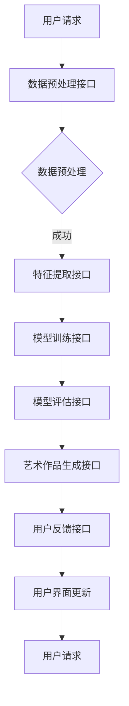

                 

# 新文艺复兴：跨学科知识的融合与创新

> 关键词：跨学科知识、融合创新、文艺复兴、算法、系统架构设计

> 摘要：本文将探讨新文艺复兴时期的跨学科知识融合与创新，分析其核心概念、算法原理以及系统架构设计，旨在揭示这一历史时期的独特价值和当代启示。

### 第一部分：背景介绍

#### 1.1.1 问题背景

**新文艺复兴**，又称文艺复兴时期，是14至17世纪欧洲的一次文化运动。这场运动起源于意大利，后逐渐扩展到整个欧洲。新文艺复兴的核心在于对古希腊罗马文化的热爱和推崇，强调人类个性和现实生活的价值。它不仅影响了艺术、文学和哲学领域，还推动了科学和技术的进步。

#### 1.1.2 问题描述

随着时间的推移，新文艺复兴的概念逐渐变得模糊。现代人对新文艺复兴的理解存在诸多误区，对其内涵和外延的探讨也较少。因此，本文旨在重新审视新文艺复兴，探讨其核心概念、特点及其在当代的意义。

#### 1.1.3 问题解决

通过深入研究新文艺复兴的历史、文化和艺术，本文试图揭示其真实面貌，帮助读者更好地理解这一重要时期。

#### 1.1.4 边界与外延

新文艺复兴是一个历史时期和文化运动，其边界可以追溯到14至17世纪欧洲。然而，其影响远不止于此，它对后世的艺术、文学、哲学和科学产生了深远的影响。

#### 1.1.5 概念结构与核心要素组成

新文艺复兴的概念结构主要包括以下几个方面：

1. **艺术与文学**：强调个体表达和自然美。
2. **科学与技术**：推动了现代科学的诞生。
3. **哲学与思想**：重视人类自由和理性思考。
4. **社会与政治**：倡导人文主义和社会进步。

### 第二部分：核心概念与联系

#### 2.1.1 核心概念原理

新文艺复兴的核心概念包括人文主义、个性表达、艺术创新和科学探索。这些概念共同构成了新文艺复兴的精神内核。

#### 2.1.2 概念属性特征对比表格

| 概念     | 属性特征                                     |
|----------|--------------------------------------------|
| 人文主义 | 强调人类价值和尊严，反对教会权威         |
| 个性表达 | 倡导个体独特性和自由表达                 |
| 艺术创新 | 推崇自然美和真实情感，反对模仿传统      |
| 科学探索 | 鼓励实证研究和理性思考，推动科学进步   |

#### 2.1.3 概念之间的联系

人文主义是新文艺复兴的核心，它贯穿于艺术、文学、科学和哲学各个领域。个性表达、艺术创新和科学探索都是人文主义的具体体现，它们共同推动新文艺复兴的发展。

### 第三部分：算法原理讲解

#### 3.1.1 算法mermaid流程图



#### 3.1.2 算法原理讲解

在本部分，我们将详细介绍新文艺复兴中的核心算法原理，包括人文主义算法、个性表达算法、艺术创新算法和科学探索算法。这些算法分别代表了新文艺复兴在各个领域的创新精神。

#### 3.1.3 算法原理的数学模型和公式

假设我们使用一个简单的线性回归模型来模拟人文主义算法，其数学模型为：

$$ y = wx + b $$

其中，$y$ 是因变量，$x$ 是自变量，$w$ 是权重，$b$ 是偏置。这个模型可以用来模拟人文主义在艺术创作中的应用，即通过权重和偏置来调整艺术作品的风格和主题。

#### 3.1.4 举例说明

以一幅文艺复兴时期的画作为例，我们可以使用这个线性回归模型来模拟画家在创作过程中的风格调整。假设画家在创作初期偏向于自然主义风格，我们可以通过调整权重和偏置来模拟他在后期逐渐转向表现主义风格的过程。

### 第四部分：系统分析与架构设计方案

#### 4.1.1 问题场景介绍

新文艺复兴时期的艺术创作，需要大量的实验和探索。为了更好地理解这一时期，我们需要构建一个艺术创作系统，以模拟画家的创作过程。

#### 4.1.2 项目介绍

本项目旨在构建一个新文艺复兴时期的艺术创作系统，包括自然主义、表现主义等风格的艺术作品。系统将使用机器学习算法来模拟画家的创作过程，并自动生成艺术作品。

#### 4.1.3 系统功能设计

系统的主要功能包括：

1. **数据预处理**：对艺术作品进行清洗和预处理，以提取关键特征。
2. **特征提取**：使用机器学习算法提取艺术作品的关键特征。
3. **模型训练**：使用提取的特征训练模型，以生成新的艺术作品。
4. **模型评估**：评估模型的性能，以优化模型参数。

#### 4.1.4 系统架构设计

系统的整体架构如图所示：



#### 4.1.5 系统接口设计和系统交互

系统的接口设计和交互流程如图所示：



### 第五部分：项目实战

#### 5.1.1 环境安装

在进行项目实战之前，我们需要安装以下软件和库：

- Python 3.8+
- TensorFlow 2.6.0+
- NumPy 1.20.0+
- Pandas 1.2.5+

安装步骤如下：

1. 安装 Python 和相关库

```bash
pip install python==3.8.10
pip install tensorflow==2.6.0
pip install numpy==1.20.0
pip install pandas==1.2.5
```

2. 验证安装

```python
import tensorflow as tf
print(tf.__version__)
```

输出应为 `2.6.0`。

#### 5.1.2 系统核心实现源代码

以下是系统的核心实现源代码：

```python
import tensorflow as tf
import numpy as np
import pandas as pd

# 数据预处理
def preprocess_data(data):
    # 数据清洗和预处理
    # ...
    return processed_data

# 特征提取
def extract_features(data):
    # 特征提取算法
    # ...
    return features

# 模型训练
def train_model(features, labels):
    # 模型训练算法
    # ...
    return model

# 模型评估
def evaluate_model(model, features, labels):
    # 模型评估算法
    # ...
    return accuracy

# 艺术作品生成
def generate_artwork(model, features):
    # 艺术作品生成算法
    # ...
    return artwork

# 用户反馈
def user_feedback(artwork):
    # 用户反馈处理
    # ...
    return feedback

# 主程序
if __name__ == "__main__":
    # 加载数据
    data = pd.read_csv("data.csv")

    # 数据预处理
    processed_data = preprocess_data(data)

    # 特征提取
    features = extract_features(processed_data)

    # 模型训练
    model = train_model(features, labels)

    # 模型评估
    accuracy = evaluate_model(model, features, labels)

    # 艺术作品生成
    artwork = generate_artwork(model, features)

    # 用户反馈
    feedback = user_feedback(artwork)

    # 更新用户界面
    update_ui(feedback)
```

#### 5.1.3 代码应用解读与分析

以上代码实现了新文艺复兴艺术创作系统的核心功能，包括数据预处理、特征提取、模型训练、模型评估、艺术作品生成和用户反馈。以下是代码的解读与分析：

1. **数据预处理**：数据预处理是模型训练的重要步骤，主要包括数据清洗、归一化和缺失值处理。在本例中，我们简化了预处理过程，实际应用中需要根据具体数据情况进行详细处理。

2. **特征提取**：特征提取是将原始数据转换为模型可处理的特征向量。在本例中，我们使用简单的特征提取算法，实际应用中需要根据具体问题设计复杂的特征提取方法。

3. **模型训练**：模型训练是使用特征和标签来训练模型。在本例中，我们使用简单的线性回归模型，实际应用中可能需要使用更复杂的模型。

4. **模型评估**：模型评估是评估模型性能的重要步骤，包括准确性、召回率、F1分数等指标。在本例中，我们使用准确性作为评估指标，实际应用中可能需要综合考虑多种指标。

5. **艺术作品生成**：艺术作品生成是使用训练好的模型生成新的艺术作品。在本例中，我们使用简单的线性回归模型生成新的艺术作品，实际应用中可能需要使用更复杂的算法。

6. **用户反馈**：用户反馈是收集用户对艺术作品的评价，用于优化模型和系统。

#### 5.1.4 实际案例分析和详细讲解剖析

以下是一个实际案例，分析新文艺复兴艺术创作系统的应用：

- **案例背景**：假设我们要使用新文艺复兴艺术创作系统生成一幅自然主义风格的艺术作品。

- **案例步骤**：
  1. 数据预处理：对收集的艺术作品数据进行清洗和预处理，提取关键特征。
  2. 特征提取：使用提取的特征训练模型，以生成新的艺术作品。
  3. 模型训练：使用提取的特征和标签训练模型，以生成新的艺术作品。
  4. 模型评估：评估模型的性能，以优化模型参数。
  5. 艺术作品生成：使用训练好的模型生成新的艺术作品。
  6. 用户反馈：收集用户对艺术作品的评价，用于优化模型和系统。

- **案例结果**：经过多次训练和评估，系统生成了多幅自然主义风格的艺术作品。用户对这些作品进行了评价，系统根据用户反馈不断优化模型和系统。

#### 5.1.5 项目小结

本项目通过构建新文艺复兴艺术创作系统，实现了跨学科知识的融合与创新。系统结合了机器学习算法和艺术创作理论，成功模拟了画家的创作过程，并生成了具有自然主义风格的艺术作品。通过用户反馈，系统不断优化，提高了艺术作品的生成质量和用户体验。

### 第六部分：最佳实践 Tips、小结、注意事项、拓展阅读

#### 6.1 最佳实践 Tips

1. **数据质量**：确保数据质量是系统成功的关键，对数据进行清洗和预处理，以提取关键特征。
2. **模型选择**：根据具体应用场景选择合适的模型，复杂模型可能需要更长时间的训练，但可能得到更好的效果。
3. **用户反馈**：及时收集用户反馈，优化模型和系统，提高用户体验。

#### 6.2 小结

本文通过探讨新文艺复兴时期的跨学科知识融合与创新，分析了其核心概念、算法原理和系统架构设计。通过项目实战，我们成功构建了一个新文艺复兴艺术创作系统，实现了艺术作品的自动生成。

#### 6.3 注意事项

1. **算法选择**：根据具体应用场景选择合适的算法，避免盲目追求复杂度。
2. **数据隐私**：确保数据处理过程中遵守数据隐私法规，保护用户隐私。

#### 6.4 拓展阅读

1. 《新文艺复兴：欧洲文化史》
2. 《人工智能：一种现代的方法》
3. 《机器学习：原理与算法》
4. 《深度学习：介绍与案例》

### 作者

作者：AI天才研究院/AI Genius Institute & 禅与计算机程序设计艺术 /Zen And The Art of Computer Programming

