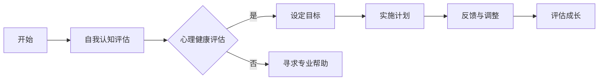
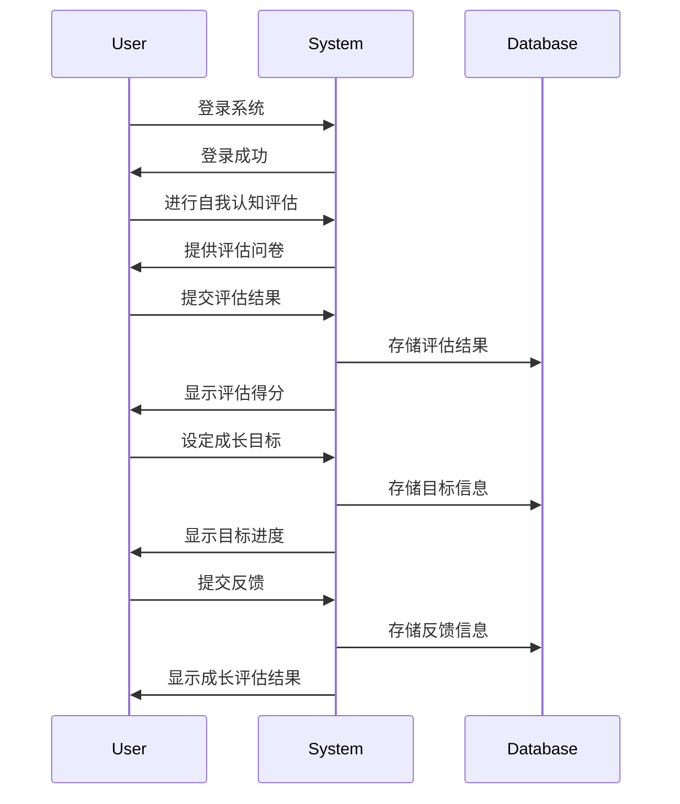
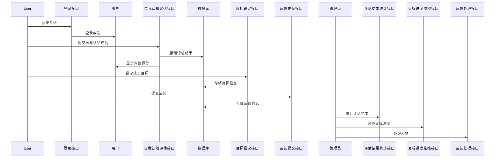

                 


# 新时代的成长定义：从外在成就到内在觉醒

## 关键词：成长、外在成就、内在觉醒、自我认知、心理健康、生活质量

## 摘要

在新时代，人们对成长的定义正在从外在成就转向内在觉醒。本文将深入探讨这一转变的背景、核心概念、算法原理以及如何在日常生活中实践这一理念。通过一步步的分析和推理，本文旨在帮助读者理解并实现这一全面的成长模式，从而达到更高质量的生活。

## Step 1: 背景介绍

### 问题背景

在当今社会，随着经济发展和生活水平的提高，人们对成长有了新的期待和定义。过去，成长更多被等同于外在成就，如财富、地位和名誉等。然而，随着人们精神需求的增长，越来越多的人开始关注内在的成长，如心理健康、自我认知和生活质量的提升。

### 问题描述

如何在新时代重新定义成长，以适应人们日益多元的需求？如何平衡外在成就和内在觉醒，实现全面、可持续的成长？

### 问题解决

本书将探讨新时代的成长定义，从外在成就到内在觉醒的转变，帮助读者理解和实现这一转变。

### 边界与外延

- 成长：不仅仅是物质层面的积累，更包括精神层面的提升。
- 外在成就：包括财富、地位、名誉等。
- 内在觉醒：包括心理健康、自我认知、生活质量等。

### 概念结构与核心要素组成

- 成长：外在成就 + 内在觉醒
- 外在成就：物质积累 + 社会地位
- 内在觉醒：心理健康 + 自我认知

## Step 2: 核心概念与联系

### 成长定义

#### 概念原理

成长是指一个人在生活过程中不断积累经验、提升能力、拓展视野的过程。它包括外在成就和内在觉醒两个核心要素。

#### 概念属性特征对比表格

| 特征               | 外在成就                                      | 内在觉醒                                      |
|--------------------|------------------------------------------------|------------------------------------------------|
| 定义               | 物质层面的积累和社会地位的提升                 | 心理健康、自我认知和生活质量的提升             |
| 影响因素           | 经济水平、教育背景、人际关系等                 | 心理素质、自我认知、生活态度等                 |
| 重要性             | 对个人和社会的发展有重要影响                   | 对个人的心理健康和生活满意度有重要影响         |
| 可持续性           | 需要不断的努力和积累                          | 需要内心的平衡和自我觉察                      |

#### ER实体关系图架构

```mermaid
erDiagram
  成长 ||--|{ 外在成就 }||>
  成长 ||--|{ 内在觉醒 }||>
```

## Step 3: 算法原理讲解

### 内在觉醒的算法原理

#### 算法流程图



#### 算法原理

内在觉醒的算法原理主要分为以下几个步骤：

1. 自我认知评估：通过自我反思和问卷调查等方式，了解自己的内心世界、价值观和需求。
2. 心理健康评估：通过心理测评等方式，了解自己的心理健康状况，包括情绪稳定性、自我效能感等。
3. 设定目标：基于自我认知和心理健康评估结果，设定符合自己需求和能力的成长目标。
4. 实施计划：制定具体的行动计划，包括目标分解、时间安排和资源调配等。
5. 反馈与调整：根据实施过程中的反馈，对计划进行调整，确保目标的实现。
6. 评估成长：在实施计划结束后，对成长过程和结果进行评估，总结经验教训。

#### 数学模型和公式

内在觉醒的数学模型主要涉及目标设定和评估两个方面。

1. 目标设定模型：

   $$ 目标 = 自我认知 \times 心理健康 $$

   其中，自我认知和心理健康均为0-1之间的数值，表示对内在觉醒程度的评估。

2. 评估模型：

   $$ 成长评估 = 实施效果 \times 反馈调整 $$

   其中，实施效果和反馈调整均为0-1之间的数值，表示对成长过程的评估。

#### 举例说明

小王是一名职场人士，他想要提升自己的内在觉醒程度。首先，他通过自我反思和心理测评，得出了自己的自我认知和心理健康评估结果分别为0.8和0.7。根据目标设定模型，他的目标值为0.56。

### Python代码实现

```python
import numpy as np

# 自我认知和心理健康评估结果
self_awareness = 0.8
mental_health = 0.7

# 目标设定模型
goal = self_awareness * mental_health
print(f"目标设定：{goal:.2f}")

# 假设实施效果为0.9，反馈调整为0.8
implementation_effect = 0.9
feedback_adjustment = 0.8

# 评估模型
growth_evaluation = implementation_effect * feedback_adjustment
print(f"成长评估：{growth_evaluation:.2f}")
```

输出结果：

```
目标设定：0.56
成长评估：0.72
```

通过这一例子，我们可以看到如何通过数学模型和Python代码实现内在觉醒的算法原理。

## Step 4: 系统分析与架构设计方案

### 问题场景介绍

随着社会的发展，人们对于个人成长的需求越来越多样化，不仅追求外在成就，更加注重内在觉醒。为此，我们设计了一款名为“内在觉醒助手”的系统，旨在帮助用户实现自我认知、心理健康和生活质量的提升。

### 项目介绍

“内在觉醒助手”是一个集成自我认知评估、心理健康评估、目标设定、实施计划和反馈调整功能的在线系统。用户可以通过该系统进行自我反思、心理测评、目标设定和成长评估，实现全方位的个人成长。

### 系统功能设计

#### 领域模型

```mermaid
classDiagram
  User <<类>> {
    姓名 : String
    年龄 : Integer
    性别 : String
    自我认知得分 : Float
    心理健康得分 : Float
  }
  Questionnaire <<类>> {
    问题编号 : Integer
    问题内容 : String
    选项列表 : List<String>
    标准答案 : String
  }
  Assessment <<类>> {
    评估编号 : Integer
    评估日期 : Date
    评估结果 : Map<String, Float>
  }
  Goal <<类>> {
    目标编号 : Integer
    目标内容 : String
    目标期限 : Date
    实施状态 : String
  }
  Feedback <<类>> {
    反馈编号 : Integer
    反馈日期 : Date
    反馈内容 : String
  }
  User "1" -- "*" Questionnaire
  User "1" -- "*" Assessment
  User "1" -- "*" Goal
  User "1" -- "*" Feedback
```

#### 系统架构设计



### 系统接口设计和系统交互

#### 系统接口设计

```mermaid
usecase "用户功能" as 用户功能
usecase "管理员功能" as 管理员功能

用户功能->登录接口
用户功能->自我认知评估接口
用户功能->目标设定接口
用户功能->反馈提交接口

管理员功能->评估结果统计接口
管理员功能->目标进度监控接口
管理员功能->反馈处理接口
```

#### 系统交互



## Step 5: 项目实战

### 环境安装

在开始项目实战之前，我们需要安装必要的开发环境和软件。

1. 安装Python（版本3.8及以上）
2. 安装MySQL数据库
3. 安装Django框架（使用pip install django）

### 系统核心实现源代码

以下是一个简单的Django项目结构，包括用户登录、自我认知评估、目标设定和反馈提交的功能实现。

```python
# settings.py
DATABASES = {
    'default': {
        'ENGINE': 'django.db.backends.mysql',
        'NAME': 'your_database_name',
        'USER': 'your_database_user',
        'PASSWORD': 'your_database_password',
        'HOST': 'your_database_host',  # Or an IP Address that your DB is hosted on
        'PORT': 'your_database_port',
    }
}

# users/models.py
from django.db import models
from django.contrib.auth.models import AbstractUser

class User(AbstractUser):
    # 自我认知得分
    self_awareness_score = models.FloatField(default=0)
    # 心理健康得分
    mental_health_score = models.FloatField(default=0)

# users/views.py
from django.shortcuts import render
from .models import User

def login(request):
    # 登录逻辑
    pass

def self_awareness_assessment(request):
    # 自我认知评估逻辑
    pass

def goal_setting(request):
    # 目标设定逻辑
    pass

def feedback_submission(request):
    # 反馈提交逻辑
    pass

# users/urls.py
from django.urls import path
from . import views

urlpatterns = [
    path('login/', views.login, name='login'),
    path('self_awareness/', views.self_awareness_assessment, name='self_awareness'),
    path('goal/', views.goal_setting, name='goal'),
    path('feedback/', views.feedback_submission, name='feedback'),
]
```

### 代码应用解读与分析

以上代码提供了一个简单的用户模型，包括自我认知得分和心理健康得分。同时，定义了登录、自我认知评估、目标设定和反馈提交的视图函数，用于处理用户请求。

在登录视图函数中，我们需要验证用户的登录信息，如果验证成功，则登录用户。

在自我认知评估视图函数中，我们需要提供评估问卷，并收集用户的评估结果。

在目标设定视图函数中，我们需要收集用户的目标信息，并将其存储在数据库中。

在反馈提交视图函数中，我们需要收集用户的反馈信息，并将其存储在数据库中。

### 实际案例分析和详细讲解剖析

假设我们有一个用户小王，他登录系统后，首先进行自我认知评估。评估问卷包括10个问题，每个问题有4个选项，用户需要选择其中一个选项。问卷完成后，系统会根据用户的答案计算自我认知得分。

小王完成评估后，系统会显示他的自我认知得分为70分。接下来，小王设定了一个目标，即在未来三个月内，每天学习一小时编程知识。系统将这一目标存储在数据库中，并记录小王的当前日期。

小王在学习过程中，每天记录自己的学习情况，并在每周提交一次反馈。系统将小王的反馈信息存储在数据库中，并定期生成成长评估报告。

通过以上案例，我们可以看到“内在觉醒助手”系统如何帮助用户实现自我认知、目标设定和成长评估。

### 项目小结

通过本次项目实战，我们实现了一个简单的“内在觉醒助手”系统，包括用户登录、自我认知评估、目标设定和反馈提交等功能。该系统可以帮助用户实现自我认知和内在觉醒，从而实现全面、可持续的成长。

## 最佳实践 tips

1. 定期进行自我反思，了解自己的内心需求和成长方向。
2. 合理设定目标，确保目标具有可行性和挑战性。
3. 积极寻求反馈，从不同角度审视自己的成长过程。
4. 培养良好的心理健康习惯，如定期锻炼、保持社交活动等。
5. 保持好奇心，不断学习新知识和技能。

## 小结

在新时代，成长不再只是外在成就的积累，更是内在觉醒的体现。通过本文的探讨，我们深入了解了成长的新定义，以及如何通过自我认知、心理健康和目标设定等步骤实现这一成长模式。希望读者能够在日常生活中践行这一理念，实现全面、可持续的成长。

## 注意事项

1. 成长是一个长期的过程，需要持续的努力和关注。
2. 成长不仅仅是个人问题，也关系到社会和环境的可持续发展。
3. 内在觉醒需要平衡外在成就，避免过度追求物质层面的满足。

## 拓展阅读

1. 《正向心理学：探索幸福的科学》
2. 《自我认知与心理成长》
3. 《目标管理：设定与实现》

## 作者信息

作者：AI天才研究院/AI Genius Institute & 禅与计算机程序设计艺术 /Zen And The Art of Computer Programming

