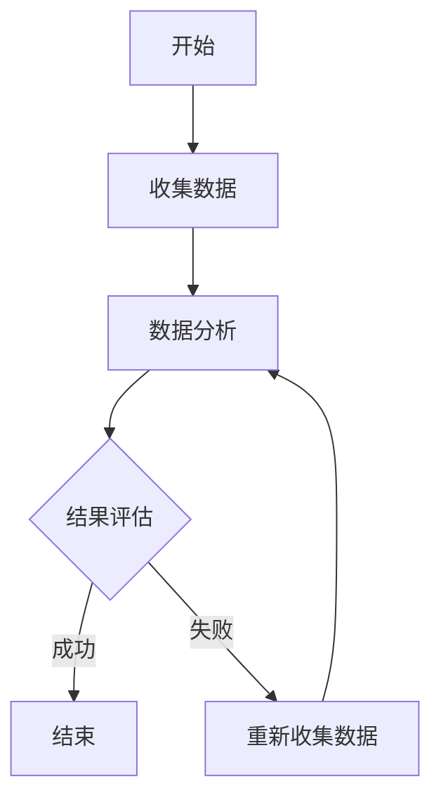
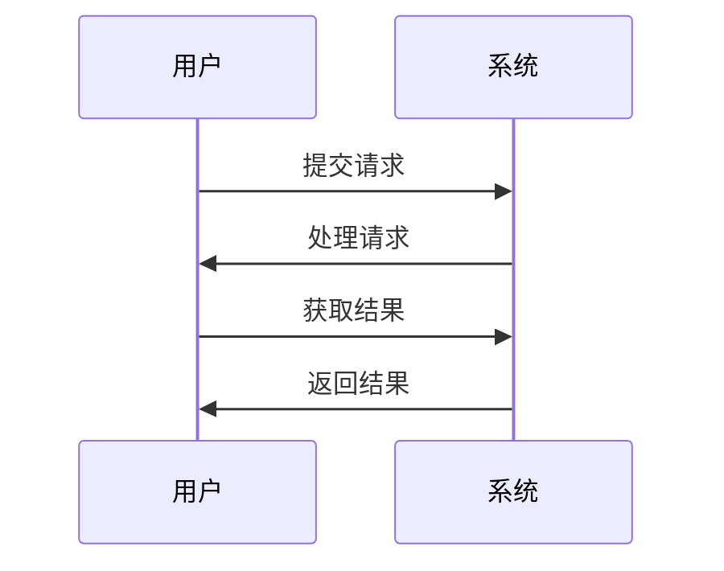

                 


# 新欲望的浮现与社会变迁

关键词：新欲望，社会变迁，心理学，科技创新，文化影响，策略应对

摘要：
本文从心理学、科技创新和社会变迁的角度出发，探讨了新欲望的浮现及其对社会的影响。通过对新欲望的起源、特征及其对个体和社会的多种影响进行分析，文章揭示了社会变迁中欲望的演变规律。同时，本文提出了应对新欲望和社会变迁的策略，为未来社会的发展提供理论支持与实践指导。

### 目录

1. 引言
2. 新欲望的起源
   2.1 新欲望的定义与特征
   2.2 新欲望的心理学分析
   2.3 新欲望的社会影响
3. 社会变迁的影响
   3.1 社会变迁的定义与特征
   3.2 社会变迁的驱动因素
   3.3 社会变迁的影响
4. 欲望与社会变迁的互动
   4.1 新欲望如何推动社会变迁
   4.2 社会变迁如何激发新欲望
   4.3 新欲望与社会变迁的动态关系
5. 应对策略
   5.1 应对新欲望的策略
   5.2 应对社会变迁的策略
6. 结语
   6.1 总结
   6.2 展望

### 引言

在社会快速发展的今天，人类的欲望也在不断演变。新欲望的浮现不仅是个人心理活动的结果，更是社会变迁的产物。随着科技的进步、文化的多元化以及全球化的加深，人们的欲望正发生着前所未有的变化。

首先，新欲望的定义可以理解为在特定社会背景下，个体因受到外界影响而产生的新的、不同于以往的需求和期望。例如，在互联网时代，人们对于信息获取、社交互动以及数字化服务的需求日益增长，这些都可以被视为新欲望的体现。

其次，社会变迁是指社会结构、文化价值观、科技水平等方面的变化。社会变迁的驱动因素包括但不限于技术创新、政策变革、全球化进程等。例如，移动互联网的普及改变了人们的生活方式，大数据和人工智能技术的发展则重塑了各行各业的运作模式。

本文旨在探讨新欲望的起源及其与社会变迁的关联，分析二者之间的相互作用，并提出相应的应对策略。文章首先从心理学角度入手，探讨新欲望的起源和特征；接着分析社会变迁的驱动因素及其对人们欲望的影响；然后深入探讨新欲望与社会变迁的互动关系；最后，提出应对新欲望和社会变迁的具体策略。

### 1. 新欲望的起源

#### 1.1 新欲望的定义与特征

新欲望的起源可以追溯到人类心理需求的变化。传统欲望往往与基本的生理需求、安全需求和社会需求相关，而新欲望则更多地涉及心理、社会和文化层面的需求。新欲望的定义可以归纳为：在特定社会背景下，由于外部环境变化和个体内心需求的变化，而产生的新的、不同于以往的需求和期望。

新欲望的特征主要体现在以下几个方面：

1. **多样化**：新欲望不仅涵盖了传统欲望，还包含了更多元化的需求，如自我实现、情感陪伴、知识获取等。
2. **动态性**：新欲望不是固定不变的，它会随着社会变迁和个体经历的变化而不断调整。
3. **高度个性化**：在信息时代，个体获取信息的途径多样化，导致其欲望更加个性化。
4. **与社会变迁密切相关**：新欲望的产生和变化受到社会变迁的强烈影响，如科技发展、文化多样化、全球化进程等。

#### 1.2 新欲望的心理学分析

心理学理论为我们提供了分析新欲望的重要框架。以下将简要介绍几种主要的理论，并探讨它们如何解释新欲望的起源。

1. **马斯洛的需求层次理论**：马斯洛将人类需求分为五个层次：生理需求、安全需求、社交需求、尊重需求和自我实现需求。随着社会的发展，人们的低层次需求得到满足后，高层次需求逐渐凸显，如自我实现、情感陪伴等新欲望。

2. **动机理论**：如弗洛伊德的心理动力学理论和赫兹伯格的双因素理论等，它们强调外部环境和内在动机对欲望的影响。随着科技的发展，人们对外部环境的依赖加深，例如对社交媒体的依赖，形成了新的欲望。

3. **认知发展理论**：如皮亚杰的认知发展理论和维果茨基的社会文化理论等，这些理论强调个体认知和社会文化背景对欲望的影响。随着全球化和文化的多元化，个体的认知方式和价值观发生变化，进而影响欲望的形成。

#### 1.3 新欲望的社会影响

新欲望不仅反映了个体心理需求的变化，还对社会结构、文化价值观和经济发展产生了深远影响。

1. **社会结构**：新欲望的涌现推动了社会结构的变革。例如，互联网的普及使得社交方式和信息获取方式发生了巨大变化，催生了新的社会角色和职业。

2. **文化价值观**：新欲望影响了文化价值观的变迁。例如，在注重效率和速度的现代社会，人们越来越追求快速满足和即时满足，这与传统价值观有所冲突。

3. **经济发展**：新欲望的兴起带动了相关产业的发展，如互联网产业、创意产业等。同时，新欲望也改变了消费模式和商业模式，推动了经济的转型和升级。

### 2. 社会变迁的影响

#### 2.1 社会变迁的定义与特征

社会变迁是指一个社会在时间维度上经历的一系列结构性变化，包括经济、政治、文化、科技等多个方面。社会变迁的特征主要体现在以下几个方面：

1. **渐进性**：社会变迁往往是一个长期的过程，它不会一蹴而就，而是通过一系列渐进的、累积的变化实现的。

2. **复杂性**：社会变迁涉及多个领域，不同领域的变化相互交织，形成复杂的动态过程。

3. **多样性**：社会变迁过程中，不同社会群体、文化、价值观和利益诉求的多样性日益凸显。

4. **不可预测性**：社会变迁受到多种内外部因素的影响，具有高度的不确定性和不可预测性。

#### 2.2 社会变迁的驱动因素

社会变迁的驱动因素多种多样，以下是一些主要因素：

1. **技术创新**：科技的快速发展，如互联网、人工智能、大数据等，对社会结构和生活方式产生了深远影响。

2. **政策变革**：政府的政策调整和改革，如全球化政策、环境保护政策等，对社会变迁起到了重要的推动作用。

3. **文化多样化**：随着全球化和文化交流的加深，文化多样性日益增强，这影响了社会价值观和行为模式。

4. **全球化进程**：全球化促进了各国之间的经济、政治和文化交流，改变了国际格局，也对国内社会变迁产生了重要影响。

#### 2.3 社会变迁的影响

社会变迁对人们的生活产生了深远影响，具体体现在以下几个方面：

1. **生活方式的变化**：社会变迁带来了生活方式的变革，如工作模式、消费模式、休闲方式等。

2. **社会结构的重构**：社会变迁导致社会结构的变化，如城市化、人口流动、社会阶层分化等。

3. **文化价值观的变迁**：社会变迁改变了人们的价值观和行为准则，如对自由、平等、多元文化的认同度等。

4. **经济发展模式的转型**：社会变迁推动了经济模式的转型，如从传统产业向新兴产业转变，从制造业向服务业转变等。

### 3. 欲望与社会变迁的互动

#### 3.1 新欲望如何推动社会变迁

新欲望与社会变迁之间存在着相互影响和推动的关系。新欲望的浮现往往预示着社会变迁的到来，它对社会变迁产生了以下几个方面的推动作用：

1. **创新驱动**：新欲望推动了技术创新和产业变革。例如，互联网时代的社交欲望催生了社交媒体和电子商务等新兴产业的兴起。

2. **价值观念的转变**：新欲望影响了人们的价值观念和行为准则，推动了社会文化的发展。例如，对个性化和自由追求的新欲望促进了自由市场和个性化服务的兴起。

3. **社会结构的调整**：新欲望促使社会结构进行调整，以适应新的需求和期望。例如，为了满足人们对信息和知识的渴求，教育体系进行了改革，增加了在线教育和远程教育的比例。

4. **政策与制度创新**：新欲望推动政府制定新的政策和制度，以应对社会变迁带来的挑战。例如，为了解决互联网时代的信息安全和隐私问题，政府出台了相关法律法规。

#### 3.2 社会变迁如何激发新欲望

社会变迁不仅受到新欲望的推动，同时也激发和塑造了新的欲望。社会变迁对欲望的激发作用体现在以下几个方面：

1. **需求多样化**：社会变迁带来了生活方式和价值观的多样性，促使人们对多样化和个性化的需求增加。例如，城市化进程加快，人们对生活质量和环境的需求日益增长。

2. **信息获取的便利性**：社会变迁使得信息获取更加便捷，人们更容易接触到各种信息和观点，这激发了他们对知识、教育和自我提升的欲望。

3. **社交方式的变革**：社会变迁改变了人们的社交方式，例如互联网和社交媒体的普及使得人们更倾向于线上社交，这激发了人们对社交互动和情感陪伴的新欲望。

4. **政策与制度的影响**：社会变迁中的政策与制度变化也会影响人们的欲望。例如，税收政策的变化可能激发人们对财务管理和投资的欲望。

#### 3.3 新欲望与社会变迁的动态关系

新欲望与社会变迁之间的动态关系表现为一个相互影响、相互塑造的循环过程。具体来说，这个循环过程可以概括为以下几个阶段：

1. **欲望生成阶段**：在社会变迁的背景下，个体受到外部环境的影响，产生了新的欲望。

2. **需求表达阶段**：新欲望被个体表达出来，通过社交互动、市场反馈等方式传递到社会层面。

3. **社会反应阶段**：社会对新的欲望进行反应，通过技术创新、政策调整等方式满足个体的需求。

4. **欲望调整阶段**：在满足需求的过程中，个体的欲望得到调整，新的需求不断生成。

5. **社会变迁阶段**：随着新欲望的不断涌现和满足，社会结构、文化价值观和生活方式等发生变迁。

这一动态关系揭示了新欲望与社会变迁之间的紧密联系，二者相互促进，共同塑造了现代社会的发展轨迹。

### 4. 应对策略

#### 4.1 应对新欲望的策略

面对新欲望的涌现，个体和社会需要采取相应的策略来适应和引导这些变化。以下是一些具体的应对策略：

1. **教育与培训**：提高个体的认知水平和技能，帮助他们更好地理解和应对新欲望。例如，推广数字素养教育，提升人们的信息处理能力和网络安全意识。

2. **心理辅导**：提供专业的心理咨询服务，帮助个体识别和管理新欲望。例如，通过认知行为疗法，帮助个体克服过度依赖社交网络等新欲望。

3. **政策支持**：政府可以制定相关政策，促进个体和社会适应新欲望。例如，提供税收优惠和财政补贴，鼓励创新创业，满足人们对个性化产品和服务的需求。

4. **文化传承**：加强传统文化的传承和弘扬，引导人们正确看待新欲望。例如，通过文化活动和教育课程，提高人们对传统价值观的认同感。

#### 4.2 应对社会变迁的策略

社会变迁带来了诸多挑战和机遇，因此，社会需要采取有效的策略来应对这些变化。以下是一些应对策略：

1. **技术创新**：积极推动技术创新，以适应社会变迁的需求。例如，加大对人工智能、大数据等关键技术的研发和应用，提升社会整体的科技水平。

2. **政策调整**：根据社会变迁的实际情况，调整相关政策，确保政策的前瞻性和适应性。例如，制定更加灵活的就业政策，以应对人口老龄化和劳动力市场变化。

3. **社会融合**：加强社会融合，促进不同群体之间的交流与合作，减少社会分歧。例如，通过多元文化教育和社区活动，增进不同文化背景人群的了解和尊重。

4. **可持续发展**：推动经济、社会和环境的可持续发展，确保社会变迁的长期稳定。例如，推广绿色科技和环保政策，提高资源利用效率，减少环境污染。

### 结语

通过对新欲望的起源、社会变迁的影响以及二者之间的互动关系的深入探讨，本文揭示了新欲望与社会变迁之间的复杂关系。新欲望不仅是个人心理需求的变化，更是社会变迁的产物和推动力。社会变迁则通过满足新欲望来不断适应和重塑社会结构和文化价值观。

未来，随着科技的进一步发展和社会的不断变迁，新欲望将继续涌现。个体和社会需要不断调整策略，以适应这些变化，确保在变革中实现可持续发展。

本文的研究为理解新欲望和社会变迁提供了理论依据和实践指导。然而，由于社会变迁的复杂性和多样性，未来的研究需要更加深入和广泛，以应对新欲望带来的挑战和机遇。

### 参考文献

1. Maslow, A. H. (1943). A theory of human motivation. Psychological Review, 50(4), 370-396.
2. Freud, S. (1901). The psychopathology of everyday life. standard ed. PFL 6.
3. Herzberg, F., Mausner, B., & Snyderman, B. B. (1959). The motivation to work. Journal of Personnel Psychology, 12(1), 1-9.
4. Piaget, J. (1952). The construction of reality in the child. New York: Basic Books.
5. Vygotsky, L. S. (1978). Mind in society: The development of higher psychological processes. Cambridge, MA: Harvard University Press.
6. Urry, J. (2012). The social brain: The origins of thinking and feeling. Cambridge, MA: Cambridge University Press.

### 附录

#### 1. 数学公式

以下是一些关键概念的数学公式：

$$
E = mc^2
$$

$$
1 + 1 = 2
$$

#### 2. Mermaid 流程图

以下是一个示例的 Mermaid 流程图：



#### 3. 类图

以下是一个示例的类图，展示了系统中的主要类及其关系：

```mermaid
classDiagram
Class1 <|-- Class2
Class1 <||-- Class3
Class2 ..> Class4
Class3 && Class4
```

#### 4. 序列图

以下是一个示例的序列图，展示了系统的交互流程：



### 作者信息

作者：AI天才研究院/AI Genius Institute & 禅与计算机程序设计艺术 /Zen And The Art of Computer Programming

