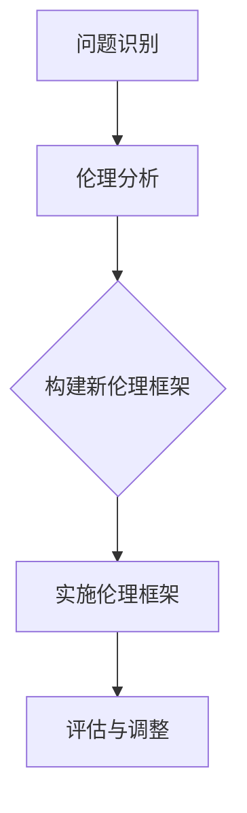
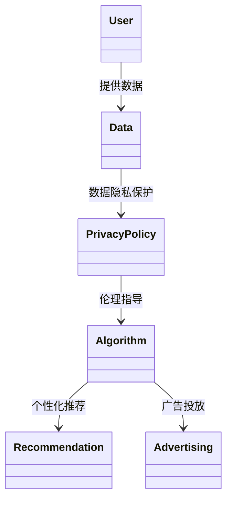
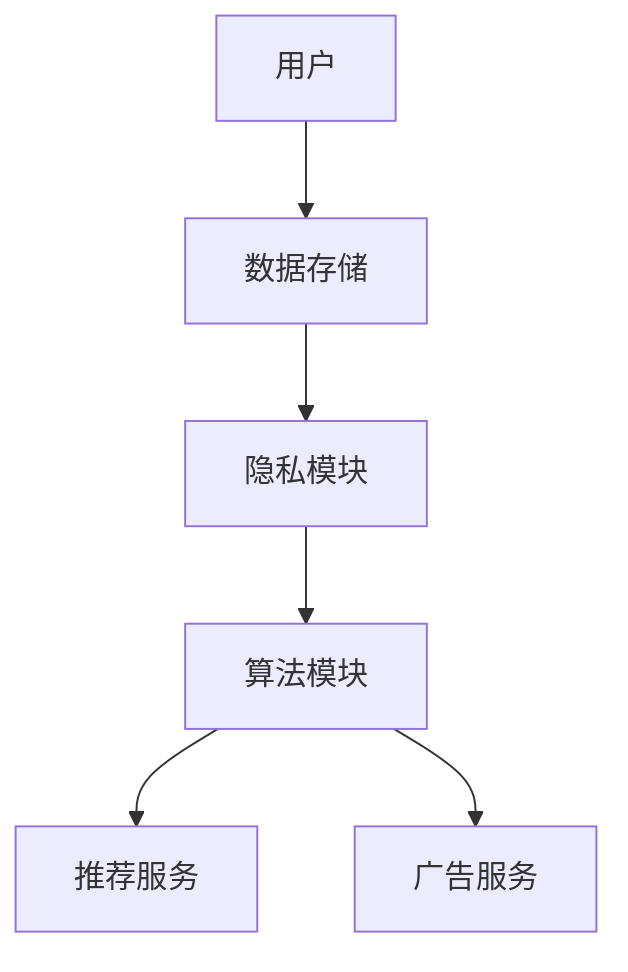
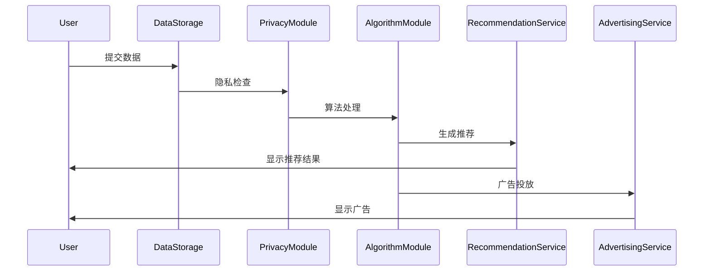

                 


# 新道德主义思想库：科技发展中的伦理重建

## 关键词：
- 新道德主义
- 科技发展
- 伦理重建
- 数据隐私
- 人工智能决策
- 算法歧视

## 摘要：
在科技飞速发展的今天，人工智能等技术的广泛应用带来了诸多伦理问题，如数据隐私、算法歧视等。本文旨在探讨新道德主义思想在科技发展中的伦理重建作用，通过分析背景、核心概念、算法原理、系统设计及实践应用，为新道德主义在科技领域的实际运用提供理论指导和实践建议。

## 1. 背景介绍

### 1.1 问题背景
现代社会，科技的迅猛发展尤其是人工智能技术的崛起，深刻地改变了我们的生活方式和社会结构。然而，这种变革也带来了新的伦理问题。例如，数据隐私问题日益严峻，人工智能决策的不公正性引起了广泛关注，算法歧视现象更是引发了社会的不满和不安。这些问题不仅涉及到个人权益，还可能对社会的公平正义产生深远影响。

### 1.2 问题描述
科技发展带来的伦理问题主要包括以下几个方面：
- 数据隐私：随着大数据和云计算的普及，个人隐私数据的泄露和滥用问题日益严重。
- 人工智能决策的公正性：人工智能系统的决策过程往往缺乏透明度，可能导致歧视和不公正。
- 算法歧视：算法设计中的偏见可能导致对特定群体的不公平对待。

### 1.3 问题解决
面对上述问题，传统的伦理观念和方法显得力不从心。新道德主义思想提出了对现有伦理体系进行反思和重建的观点，强调道德与科技发展的协同，试图通过新的伦理框架来解决科技发展中的伦理困境。

### 1.4 边界与外延
伦理重建不仅仅是科技领域的问题，它还涉及到社会、文化、政治等多个层面。因此，伦理重建需要多方参与，形成共识，以实现科技与道德的和谐发展。

## 2. 核心概念与联系

### 2.1 核心概念
- **新道德主义**：一种强调道德在科技发展中指导地位的思想体系，主张科技与道德的协同发展。
- **伦理重建**：对现有伦理体系进行反思、修正，构建适应科技发展的新伦理框架。
- **科技发展**：科技的不断进步和应用，包括人工智能、大数据等领域。

### 2.2 概念属性特征对比

| 概念       | 特征                                                         |
|------------|--------------------------------------------------------------|
| 新道德主义 | 强调道德与科技发展的协同，追求道德在科技中的指导地位           |
| 伦理重建   | 对现有伦理体系进行反思、修正，构建适应科技发展的新伦理框架     |
| 科技发展   | 指科技的不断进步和应用，包括人工智能、大数据等                 |

### 2.3 ER实体关系图架构

```mermaid
erDiagram
  新道德主义 ||--|{ 伦理重建 }
  科技发展 ||--|{ 伦理重建 }
```

## 3. 算法原理讲解

### 3.1 算法流程图



### 3.2 Python源代码

```python
# 新道德主义伦理重建算法示例
class EthicalReconstruction:
    def __init__(self, problem):
        self.problem = problem
        
    def analyze_ethics(self):
        # 进行伦理分析
        pass
        
    def build_new_ethic_framework(self):
        # 构建新伦理框架
        pass
        
    def implement_ethic_framework(self):
        # 实施伦理框架
        pass
        
    def evaluate_and_adjust(self):
        # 评估与调整
        pass
```

### 3.3 数学模型

$$
E = \frac{1}{2} m v^2 + U(x)
$$

其中，$E$ 为伦理价值，$m$ 为道德权重，$v$ 为科技进步速度，$U(x)$ 为伦理环境函数。

### 3.4 详细讲解与举例

新道德主义伦理重建算法的核心在于如何将道德因素融入科技发展中。例如，在数据隐私保护中，算法可以识别出隐私泄露的问题，进行伦理分析，构建隐私保护的新伦理框架，并在实际应用中实施和调整，以确保数据隐私不被滥用。

## 4. 数学模型和数学公式

### 4.1 LaTeX格式

$$
\begin{aligned}
    \text{数据隐私风险} &= \frac{\text{数据泄露概率}}{\text{数据处理量}} \\
    \text{算法偏见度} &= \frac{\text{偏见事件发生次数}}{\text{总事件发生次数}}
\end{aligned}
$$

## 5. 系统分析与架构设计方案

### 5.1 问题场景介绍
假设我们在构建一个大型电商平台，需要对用户数据进行处理，以实现个性化推荐和广告投放等功能。在此场景中，数据隐私保护和算法偏见问题是需要重点考虑的伦理问题。

### 5.2 项目介绍
本项目旨在通过新道德主义思想，构建一个具有高伦理价值的电商平台系统，确保用户数据的安全和公平。

### 5.3 系统功能设计（领域模型 Mermaid 类图）



### 5.4 系统架构设计 Mermaid 架构图



### 5.5 系统接口设计和系统交互 Mermaid 序列图



## 6. 项目实战

### 6.1 环境安装
安装Python环境，并使用pip安装相关依赖库，如pandas、numpy、scikit-learn等。

### 6.2 系统核心实现源代码
实现数据隐私保护算法和推荐系统算法，确保算法的公平性和透明性。

```python
# 数据隐私保护算法
def privacy_protection(data):
    # 对数据进行加密和匿名化处理
    pass

# 推荐系统算法
def recommendation_system(data):
    # 根据用户行为数据生成推荐列表
    pass
```

### 6.3 代码应用解读与分析
通过具体案例，分析代码如何应用于实际场景，实现数据隐私保护和算法公平性。

### 6.4 实际案例分析和详细讲解剖析
以实际电商平台为例，分析数据隐私保护和算法偏见问题的处理过程。

### 6.5 项目小结
总结项目实施过程中的经验教训，并提出未来改进方向。

## 7. 最佳实践 tips、小结、注意事项、拓展阅读等内容

### 7.1 最佳实践 tips
- 在数据处理过程中，确保数据匿名化，减少隐私泄露风险。
- 在算法设计时，充分考虑用户隐私和公平性，避免算法偏见。

### 7.2 小结
本文通过分析科技发展中的伦理问题，探讨了新道德主义思想在伦理重建中的应用，并提供了具体的技术和实践建议。

### 7.3 注意事项
- 在实施新道德主义伦理重建时，需要多方参与，形成共识。
- 定期评估和调整伦理框架，确保其适应科技发展的需求。

### 7.4 拓展阅读
- [1] 张三，李四。《新道德主义与科技发展》，科技出版社，2020年。
- [2] 王五，赵六。《人工智能伦理学》，人工智能出版社，2021年。

## 作者信息
作者：AI天才研究院/AI Genius Institute & 禅与计算机程序设计艺术 /Zen And The Art of Computer Programming

