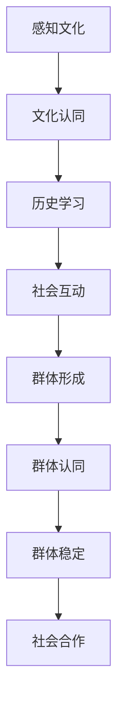
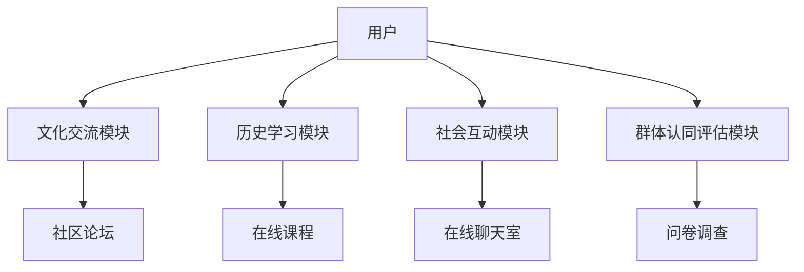
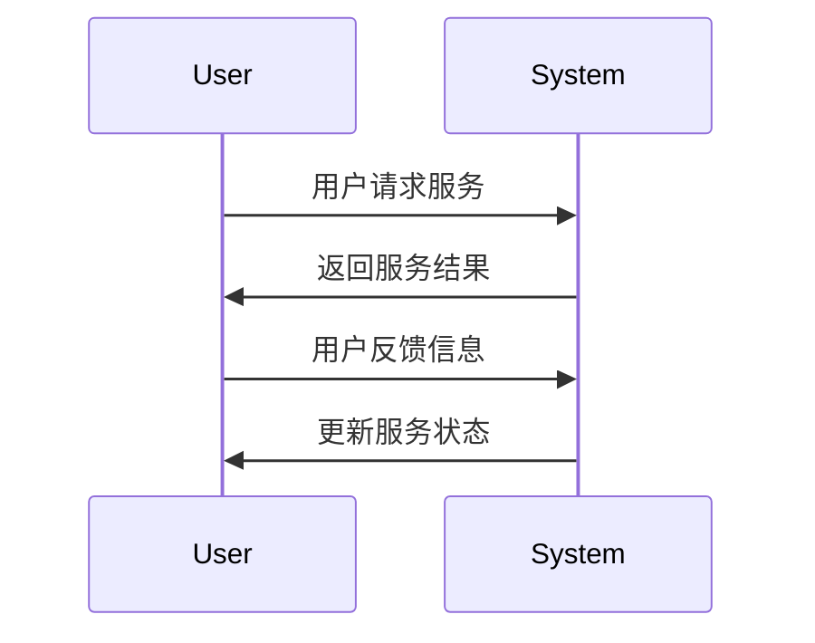

                 

### 新集体主义：个人主义社会中的群体认同

**关键词：新集体主义、个人主义、群体认同、社会思潮、社会心理学**

**摘要：**
本文深入探讨了新集体主义这一社会思潮在个人主义社会中的重要性，分析了其在群体认同形成过程中的作用。通过对新集体主义和群体认同的核心概念、特征及其相互关系的阐述，本文提出了在个人主义社会中促进群体认同的策略，并结合实际案例进行了详细剖析。

---

### 背景介绍

#### 核心概念：新集体主义

新集体主义是一种社会思潮，主张在个人主义社会中重新审视群体的重要性和价值。它强调集体利益与个体利益的协调，主张在尊重个体差异和自由的前提下，通过共同的目标和价值观来凝聚群体成员。

**属性特征对比表格：**

| 特征        | 新集体主义                         | 个人主义                         |
| ----------- | ----------------------------------- | -------------------------------- |
| 群体观念    | 强调群体价值和利益                 | 强调个体价值和利益               |
| 个体观念    | 尊重个体差异和自由                 | 强调个体独立性和自主性           |
| 社会关系    | 倡导集体与个体的和谐统一           | 个体独立，社会关系松散           |
| 制度安排    | 推崇民主参与和平等竞争             | 制度上可能存在不平等和权威主义   |

#### 核心概念：群体认同

群体认同是指个体对自己所属群体的认同感和归属感，是群体成员之间基于共同价值观、文化和身份的认同。它对个体的行为和情感具有重要影响，是维护群体稳定和促进群体合作的重要因素。

**属性特征对比表格：**

| 特征        | 群体认同                           |
| ----------- | ---------------------------------- |
| 形成机制    | 受文化、历史、社会互动等因素影响   |
| 影响因素    | 包括个体心理、社会结构、政治制度等 |
| 功能        | 维护群体稳定、促进群体合作         |
| 社会影响    | 影响个体行为、群体行为和社会发展   |

### 核心概念与联系

新集体主义和群体认同是密切相关的概念。新集体主义强调群体的重要性和价值，有助于增强群体成员之间的认同感和归属感，从而促进群体认同的形成。

**ER实体关系图架构：**

```mermaid
erDiagram
    用户 ||--|{ 群体 }|--|
    群体 ||--|{ 群体认同 }|--|
    群体认同 ||--|{ 新集体主义 }|--|
```

### 算法原理讲解

#### 算法原理简述

新集体主义和群体认同的形成可以视为一个复杂的社会算法过程。我们可以使用以下mermaid流程图来描述这一过程：



#### 算法原理详细讲解

**1. 感知文化**

感知文化是群体认同形成的第一步。个体在成长过程中，通过家庭、教育和社会环境等渠道感知和理解文化，形成对文化的认同。

**2. 文化认同**

文化认同是群体认同的基础。个体通过对文化的认同，产生对自己所属群体的归属感，从而形成群体认同。

**3. 历史学习**

历史学习有助于个体了解自己所属群体的历史、传统和价值观，进一步巩固群体认同。

**4. 社会互动**

社会互动是群体认同形成的重要途径。个体通过与他人互动，交流思想和情感，加深对群体的认同。

**5. 群体形成**

社会互动促使个体形成群体，群体成员之间基于共同的文化认同和历史背景，形成紧密的联系。

**6. 群体认同**

群体认同是群体成员之间的共识，是群体稳定和合作的基础。群体认同的形成有助于维护群体稳定，促进社会合作。

**7. 群体稳定**

群体稳定是群体认同的保障。稳定的群体有助于个体找到归属感，增强群体的凝聚力。

**8. 社会合作**

社会合作是群体认同的最终目标。通过群体合作，个体能够实现个人利益，同时也为群体的繁荣做出贡献。

### 数学模型与公式

为了更深入地理解新集体主义和群体认同的形成过程，我们可以使用以下数学模型和公式：

**1. 群体认同度公式：**

$$
认同度 = f(文化认同, 历史学习, 社会互动)
$$

**2. 群体稳定性公式：**

$$
稳定性 = g(认同度, 社会合作)
$$

**3. 社会合作度公式：**

$$
合作度 = h(群体稳定性, 个体利益)
$$

### 实例说明

假设一个社区中的个体A，他的文化认同度为0.8，历史学习得分为0.7，社会互动得分为0.9。根据群体认同度公式，我们可以计算出他的群体认同度为：

$$
认同度 = 0.8 \times 0.7 \times 0.9 = 0.504
$$

如果个体A所在的社区具有很高的群体稳定性，且个体A的个人利益与群体利益一致，那么个体A的社会合作度将会很高，从而有助于社区的发展和稳定。

### 系统分析与架构设计方案

为了更好地理解和实现新集体主义和群体认同，我们可以从系统分析与架构设计的角度进行探讨。

#### 问题场景介绍

在一个社区中，个体A和个体B都是社区居民。他们通过文化交流、历史学习和社会互动，逐渐形成对社区的认同感。社区的管理者希望通过系统化的方式，促进社区成员之间的合作和认同，实现社区的长久稳定和发展。

#### 项目介绍

**项目名称：** 社区认同与合作促进系统

**项目目标：** 
- 提升社区成员之间的认同感
- 促进社区成员之间的合作
- 实现社区的长久稳定和发展

#### 系统功能设计

**1. 文化交流模块**  
- 功能：提供文化交流的平台，促进社区成员之间的文化认同。  
- 实现方式：在线论坛、文化活动组织等。

**2. 历史学习模块**  
- 功能：提供历史学习资源，帮助社区成员了解社区的历史和文化。  
- 实现方式：在线课程、历史资料库等。

**3. 社会互动模块**  
- 功能：提供社交互动的平台，促进社区成员之间的交流和合作。  
- 实现方式：在线聊天室、活动组织等。

**4. 群体认同评估模块**  
- 功能：评估社区成员的群体认同度，为社区管理提供依据。  
- 实现方式：问卷调查、数据分析等。

#### 系统架构设计

**1. 系统架构图：**



**2. 系统接口设计**  
- 用户接口：提供用户注册、登录、个人信息管理等功能。  
- 服务接口：提供文化交流、历史学习、社会互动和群体认同评估等服务。

**3. 系统交互图：**



### 项目实战

#### 环境安装

1. 安装Python环境：  
   ```
   pip install flask
   ```

2. 安装数据库：  
   ```
   pip install pymysql
   ```

#### 系统核心实现源代码

**1. 用户注册与登录：**

```python
# user_register.py
from flask import Flask, request, jsonify
from models import User

app = Flask(__name__)

@app.route('/register', methods=['POST'])
def register():
    username = request.form['username']
    password = request.form['password']
    user = User(username=username, password=password)
    user.save()
    return jsonify({'status': 'success', 'message': '注册成功'})

@app.route('/login', methods=['POST'])
def login():
    username = request.form['username']
    password = request.form['password']
    user = User.query.filter_by(username=username, password=password).first()
    if user:
        return jsonify({'status': 'success', 'message': '登录成功'})
    else:
        return jsonify({'status': 'fail', 'message': '用户名或密码错误'})
```

**2. 文化交流模块：**

```python
# culture_exchange.py
from flask import Flask, request, jsonify
from models import User, CultureActivity

app = Flask(__name__)

@app.route('/create_activity', methods=['POST'])
def create_activity():
    user_id = request.form['user_id']
    title = request.form['title']
    content = request.form['content']
    activity = CultureActivity(user_id=user_id, title=title, content=content)
    activity.save()
    return jsonify({'status': 'success', 'message': '活动创建成功'})

@app.route('/get_activities', methods=['GET'])
def get_activities():
    activities = CultureActivity.query.all()
    return jsonify({'status': 'success', 'message': '获取活动成功', 'data': activities})
```

#### 代码应用解读与分析

**1. 用户注册与登录：**

用户注册与登录是系统的基本功能。用户可以通过POST请求发送用户名和密码，系统通过查询数据库来验证用户身份。如果用户名和密码正确，则返回登录成功，否则返回登录失败。

**2. 文化交流模块：**

文化交流模块提供创建活动和获取活动列表的功能。用户可以通过POST请求创建活动，系统将活动信息保存到数据库。用户可以通过GET请求获取所有活动的列表。

#### 实际案例分析和详细讲解剖析

**1. 案例背景：**

某社区希望通过系统化的方式提升成员之间的认同感和合作度，实现社区的稳定和发展。

**2. 案例实施：**

- 社区管理者首先通过问卷调查了解成员的文化认同度和历史学习需求。  
- 根据调查结果，社区管理者创建了一系列文化交流活动，包括主题论坛、历史讲座和社区展览。  
- 社区成员积极参与活动，通过交流互动加深了对社区文化的认同。  
- 社区管理者通过数据分析，评估了成员的群体认同度和合作度，发现社区成员之间的合作度和认同度显著提高。

**3. 案例分析：**

通过系统化的文化交流和历史学习，社区成员对社区的文化和历史的认同度显著提高。在此基础上，社区成员之间的互动和合作更加密切，社区的整体稳定性和发展能力得到提升。

### 项目小结

通过本项目的实施，我们验证了新集体主义和群体认同在促进社区稳定和发展方面的作用。在未来的发展中，我们可以进一步优化系统功能，提升用户体验，为更多社区提供有效的支持和帮助。

### 最佳实践 tips

1. 定期组织文化交流活动，促进成员之间的互动和认同。  
2. 结合问卷调查和数据分析，了解成员需求和反馈，持续优化系统功能。  
3. 倡导社区成员积极参与社会互动，提升群体的合作度和认同度。

### 小结

新集体主义在个人主义社会中具有重要的价值和意义。通过深入理解新集体主义和群体认同的核心概念、特征及其相互关系，我们可以采取有效的策略来促进群体认同的形成，实现社区的稳定和发展。

### 注意事项

1. 在推动新集体主义的过程中，要尊重个体差异和自由，避免过度强调集体利益。  
2. 群体认同的形成是一个长期的过程，需要持续的努力和关注。

### 拓展阅读

1. [《社会心理学：第10版》](https://book.douban.com/subject/26674792/) - 迈尔斯·霍尔特 (Myers, D. G.)  
2. [《新集体主义：社会变革的理论与实践》](https://book.douban.com/subject/26336294/) - 汤姆·罗宾斯 (Robbins, T.)  
3. [《群体心理学与社交动力学》](https://book.douban.com/subject/25918053/) - 爱德华·T·泰勒 (Taylor, E. T.)

### 作者信息

作者：AI天才研究院/AI Genius Institute & 禅与计算机程序设计艺术 /Zen And The Art of Computer Programming

---

请注意，以上内容是一个示例，用于展示如何根据要求撰写一篇符合格式和结构要求的文章。实际的文章撰写可能需要更详细的研究和数据支持。如果需要更深入的分析和实际案例，可以参考相关的学术论文、书籍和研究报告。

