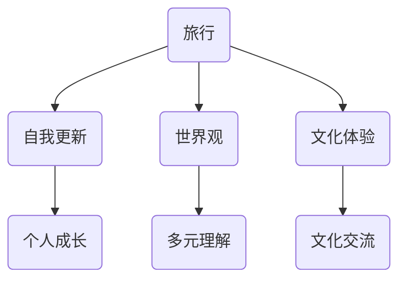
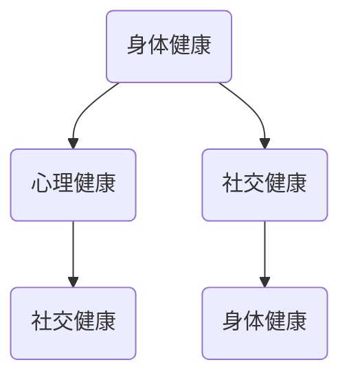
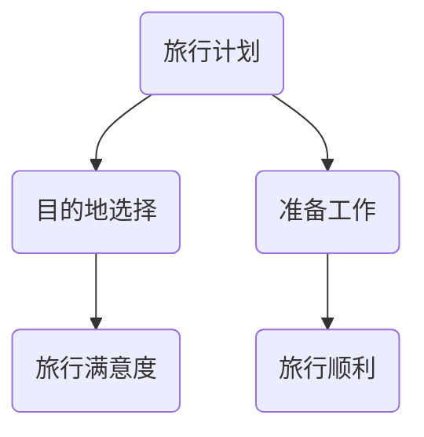

                 

### 引言：旅行与自我更新的概念

**1.1 旅行与自我更新的概念**

旅行，作为一种跨越地理边界、体验异域文化的活动，不仅是对陌生风景的探索，更是一种自我更新的过程。从古至今，人们通过旅行来开拓视野、丰富生活，实现个人成长。在本章节中，我们将探讨旅行如何成为个人精神层面的催化剂，推动我们不断重新认识自我和世界。

**1.2 旅行的目的与意义**

旅行的目的多种多样，从逃避现实到追求梦想，从学习知识到享受生活。其意义不仅仅在于满足物质和感官的享受，更在于激发人的精神世界，带来内心的平静与满足。通过旅行，人们可以暂时摆脱日常生活的束缚，重新审视自己的存在和与世界的联系。

**1.3 旅行如何改变对世界的看法**

旅行能够让人从不同的角度看待世界，理解不同的文化和生活方式。它使人们不再局限于狭隘的个人视角，而是学会包容和尊重多样性。通过旅行，人们能够体验到不同地域的自然美景、人文风情，从而拓宽视野，改变对世界的认知。

**核心概念与联系**

核心概念：旅行、自我更新、世界观、文化体验。

概念属性特征对比表格：

| 特征       | 旅行       | 自我更新       | 世界观       | 文化体验       |
|------------|------------|---------------|--------------|----------------|
| 定义       | 地理边界的跨越 | 精神层面的成长 | 对世界的看法 | 不同文化的接触 |
| 关联       | 探索未知    | 成长与反思    | 理解与认知    | 学习与体验    |
| 目的       | 视野开拓    | 内心满足      | 包容与尊重    | 丰富人生      |

ER实体关系图架构：

通过以上分析，我们可以看到旅行不仅仅是一种活动，更是一种精神层面的自我更新过程。它影响着我们的世界观和文化体验，推动我们不断成长与进步。

### 旅行的健康益处

**2.1 身体健康的益处**

旅行不仅能够丰富我们的精神世界，还能带来许多身体上的益处。首先，旅行有助于缓解压力和焦虑。当我们身处陌生的环境，远离日常的繁忙与压力，大脑会释放出内啡肽等“快乐激素”，从而缓解紧张情绪。其次，旅行对心血管健康也有积极作用。研究表明，适度的旅行活动可以提高心率，增强心肺功能，降低心血管疾病的风险。此外，旅行还能提升免疫系统的功能。在旅行中，我们接触到不同的气候、食物和环境，这些变化能够刺激免疫系统，增强其对疾病的抵抗力。

**2.2 心理健康的益处**

旅行的心理益处同样显著。首先，旅行能够拓宽我们的视野，帮助我们以全新的视角看待世界。这种视野的拓展不仅让我们接触到不同的文化和生活方式，还使我们更加包容和理解他人。其次，旅行有助于个人的自我发现和成长。在陌生的环境中，人们往往会面临新的挑战，这些挑战有助于我们了解自己的能力和潜力，从而实现个人的成长。此外，旅行还能够增强我们的韧性和适应性。面对旅行中的不确定性和变化，我们需要灵活应对，这种锻炼有助于我们更好地适应日常生活中的各种变化。

**2.3 社交健康的益处**

旅行不仅对个人的身心健康有益，还能促进社交健康。首先，旅行有助于建立和加深人际关系。在旅途中，我们有机会与家人、朋友一起度过难忘的时光，增强彼此之间的情感联系。此外，旅行还能够帮助我们结识新朋友，拓展社交圈子。在不同的文化背景下，我们更容易与他人产生共鸣，建立起深厚的友谊。其次，旅行能够提高我们的文化理解力和同理心。通过亲身体验不同的文化，我们能够更好地理解他人的生活方式和价值观，培养出更多的同理心。最后，旅行还能够增强团队合作精神。在旅行计划和组织过程中，我们需要与他人协作，共同解决问题，这种合作有助于我们培养团队精神和协作能力。

**核心概念与联系**

核心概念：身体健康、心理健康、社交健康。

概念属性特征对比表格：

| 特征       | 身体健康         | 心理健康         | 社交健康         |
|------------|------------------|------------------|------------------|
| 定义       | 身体生理层面的益处 | 精神心理层面的益处 | 人际关系层面的益处 |
| 关联       | 心理健康与社交健康 | 身体健康与社交健康 | 三者相互影响      |
| 目的       | 增强生理机能      | 促进心理成长      | 提升社交能力      |

ER实体关系图架构：

通过以上分析，我们可以看到旅行在多个方面对健康产生积极影响。它不仅有助于缓解身体和心理压力，还能增强社交能力和文化理解力，从而全面提升个人的身心健康水平。

### 实际旅行技巧

**3.1 成功旅行计划**

为了确保旅行顺利进行，制定一个详细的计划至关重要。首先，明确旅行目标和期望。这些目标可以是探索自然风光、体验异国文化或与亲友共度美好时光。明确目标有助于我们在旅行中保持焦点，充分利用时间。接下来，制定旅行 itinerary（行程安排）。这包括确定旅行时间、目的地、交通方式、住宿和活动安排。一个详细的行程计划能够帮助我们更好地掌控旅行节奏，避免因时间安排不当而产生的困扰。最后，合理预算旅行费用。旅行费用包括交通费、住宿费、餐饮费和活动费用等。在预算中预留一定的灵活性，以应对意外支出。

**3.2 选择合适的旅行目的地**

选择旅行目的地是一个需要慎重考虑的过程。首先，考虑个人的兴趣和喜好。如果喜欢自然风光，可以选择前往风光秀丽的旅游景点；如果对历史文化感兴趣，可以选择参观历史文化名城。其次，考虑目的地的季节和气候。不同的季节和气候会影响旅行的体验和舒适度。例如，夏季适合前往海滨城市，而冬季则适合前往滑雪胜地。此外，还需考虑目的地的交通便利程度和语言障碍。选择交通便利且语言相通的目的地，能够确保旅行更加顺利。

**3.3 旅行准备工作**

旅行前的准备工作能够大大提高旅行的顺利程度。首先，打包必要的行李。常见的行李包括衣物、洗漱用品、电子设备、旅行用品等。在打包时，注意合理分配行李重量，避免携带过多不必要的物品。其次，预订交通和住宿。提前预订机票、火车票和酒店，能够确保在旅行高峰期和节假日有充足的选择，同时享受更优惠的价格。此外，还可以利用各种在线工具和应用程序，如导航软件、天气预报和翻译工具，以便在旅行中更好地应对各种情况。最后，了解目的地的文化和风俗习惯。尊重当地的文化和风俗，能够避免不必要的误会和冲突，确保旅行更加愉快。

**核心概念与联系**

核心概念：旅行计划、目的地选择、准备工作。

概念属性特征对比表格：

| 特征       | 旅行计划       | 目的地选择       | 准备工作       |
|------------|----------------|------------------|----------------|
| 定义       | 明确目标和安排 | 选择合适的地点   | 完成必要准备   |
| 关联       | 提高旅行效率   | 决定旅行体验     | 确保旅行顺利   |
| 目的       | 规划旅行流程   | 提高旅行满意度   | 减少旅行风险   |

ER实体关系图架构：

通过以上分析，我们可以看到实际旅行技巧对于确保旅行顺利和提升旅行体验至关重要。一个详细的计划、合适的目的地选择和充分的准备工作，都是成功旅行的重要组成部分。

### 个人旅行故事与灵感

**4.1 个人旅行故事**

每个人的旅行故事都是独一无二的，它们充满了惊喜、挑战和成长。以下是一些真实的旅行故事，展示了旅行如何深刻地影响人们的生活。

**故事一：发现自我**

张女士曾在一次独自旅行的经历中，深刻地认识到了自己的潜力。在一个偏远的小山村，她面临着从未有过的困难和挑战。没有翻译，她不得不努力学习当地的语言和文化。在这个过程中，她不仅克服了语言障碍，还发现了自己内心的坚韧和勇气。这次旅行让她意识到，无论面对什么样的困难，只要勇敢尝试，就一定能够克服。

**故事二：跨越文化的友谊**

李先生在一次国际旅行中，结识了一位来自不同文化背景的朋友。在旅途中，他们分享了彼此的故事和经历，从初识的陌生到深交的朋友。这种跨文化的友谊不仅拓宽了他的视野，还让他学会了尊重和欣赏不同的文化。这次旅行让他认识到，世界是如此广阔，每个人都有值得学习的地方。

**故事三：心灵的洗礼**

王女士在一次旅行中，决定去一个她从未听说过的山区小村庄。在这个村庄里，她体验了与世隔绝的宁静和自然之美。在山间徒步的过程中，她感受到了大自然的力量和宁静。这次旅行让她重新审视了自己的生活，找到了内心的平静和满足。

**4.2 旅行灵感**

对于即将踏上的旅程，以下是一些旅行灵感，希望能激发你对未知世界的探索热情。

**梦想目的地：新西兰**

新西兰被誉为“世界上最后一片净土”，拥有壮观的自然风光和独特的文化体验。从壮丽的南岛冰川到神秘的毛利文化，新西兰是一个充满魔力的旅行目的地。

**冒险之旅：亚马逊雨林**

亚马逊雨林是地球上最神秘的地区之一，拥有丰富的生物多样性和独特的文化。在这里，你可以探险丛林、观察野生动物，甚至与当地部落居民交流。

**文化之旅：日本**

日本是一个充满魅力和传统的国家，从繁华的东京到宁静的京都，每个地方都有其独特的文化特色。在这里，你可以体验传统的茶道、欣赏美丽的樱花，还可以品尝地道的日本料理。

**4.3 旅行名言**

“旅行不仅仅是为了抵达目的地，更是为了体验旅途中的每一个瞬间。”
——未知

“世界是一本书，不旅行的人们只读了其中的一页。”
——坎特伯雷的托马斯

“旅行的意义在于发现生活中的美好，学会珍惜眼前的幸福。”
——玛丽莲·蒙特梭利

通过这些旅行故事和灵感，我们可以看到旅行是如何让人们重新认识自我和世界的。它不仅是一种逃避现实的方式，更是一种寻找内心平静和满足的途径。无论你是独自旅行还是与亲友同行，旅行都能带给你独特的体验和深刻的感悟。

### 旅行摄影的艺术

**5.1 摄影技巧**

旅行摄影不仅是一种记录，更是一种艺术表达。要想拍摄出令人印象深刻的照片，以下技巧是必不可少的。

**5.1.1 构图技巧**

构图是摄影的基础。通过巧妙地安排画面中的元素，摄影师可以创造出更加生动和有冲击力的照片。常用的构图技巧包括三分法、对称构图、引导线构图等。这些技巧能够帮助摄影师更好地控制画面，使照片更加美观。

**5.1.2 光线运用**

光线是摄影的灵魂。合理运用光线，可以营造出不同的氛围和情感。早晨和傍晚的光线最为柔和，适合拍摄人像和风景。在强烈的阳光条件下，利用阴影和反光板可以创造出丰富的层次感和立体感。

**5.1.3 留白**

留白是摄影中的一种美学技巧，它通过在画面中保留空白区域，使主体更加突出。适当的留白可以使照片更加简洁，给人留下更多的想象空间。

**5.2 旅行摄影的注意事项**

在旅行摄影中，以下注意事项可以帮助摄影师避免常见的错误，确保拍摄出高质量的照片。

**5.2.1 防止过度拍摄**

旅行中拍照的机会非常多，但过度拍摄会导致照片质量下降。为了避免这种情况，可以提前制定拍摄计划，有选择性地拍摄，确保每张照片都有其独特的价值和意义。

**5.2.2 充分准备设备**

在旅行中，携带合适的摄影设备和配件是非常重要的。根据旅行的目的地和环境，选择适合的相机和镜头，并确保电池和存储卡充足。此外，携带三脚架和滤镜等配件，可以帮助摄影师在特定的光线条件下拍摄出更好的照片。

**5.2.3 注意安全**

在旅行中，安全始终是第一位的。在拍摄时，要注意周围的环境，避免走进危险的地方。尤其是在户外探险时，要遵守当地的规则和指南，确保自身安全。

**5.3 旅行摄影的案例分析**

以下是一些旅行摄影的案例分析，展示了如何通过构图、光线和主题等元素，创造出具有艺术感的照片。

**案例一：自然风光**

在一幅自然风光照片中，摄影师通过三分法构图，将天空和地面分割成三个部分，使画面更加平衡。合理运用光线，使得山峰和湖泊的轮廓更加清晰，营造出宁静的氛围。

**案例二：人文摄影**

在一张人文摄影作品中，摄影师通过引导线构图，将观众的视线引向主体——一位穿着传统服饰的当地居民。光线恰到好处，使人物的轮廓和表情更加生动。

**案例三：城市风光**

在城市风光摄影中，摄影师通过留白技巧，将画面中不必要的元素剔除，使主体——城市的繁华和现代化——更加突出。合理的用光和色彩搭配，使照片充满了活力和动感。

通过以上案例分析，我们可以看到旅行摄影不仅仅是简单地按下快门，而是一门需要技巧和创造力的艺术。只有通过不断练习和探索，摄影师才能捕捉到那些独特的瞬间，留下难忘的回忆。

### 总结与思考

旅行，作为一种独特的体验，不仅丰富了我们的生命旅程，还深刻地影响着我们的内心和世界观。通过旅行，我们能够重新认识自我，发现内心的潜能，拓宽视野，理解和尊重不同的文化。从身体健康的益处到心理和社交的积极影响，旅行在多个层面上提升了我们的生活质量。

在本篇文章中，我们逐一探讨了旅行的目的与意义、健康益处、实际技巧、个人故事、摄影艺术以及旅行的多元影响。每一个方面都展示了旅行如何成为我们生活中不可或缺的一部分。

让我们再次回顾旅行的重要性：

1. **自我更新**：旅行让我们暂时摆脱日常生活的束缚，重新审视自我，激发内心的成长和变化。
2. **健康益处**：旅行能够缓解压力、增强心肺功能、提升免疫力和心理韧性。
3. **社交拓展**：旅行有助于建立和加深人际关系，提升文化理解力和同理心。
4. **视野拓宽**：旅行让我们接触到不同的文化和生活方式，以全新的视角看待世界。

**注意事项**：

1. **旅行规划**：制定详细的计划，确保旅行的顺利和安全。
2. **尊重文化**：了解并尊重目的地的文化和风俗，避免不必要的冲突。
3. **安全第一**：在旅行中始终保持警惕，确保自身安全。

**拓展阅读**：

- 《孤独星球》系列旅行指南：提供详尽的旅行规划和目的地信息。
- 《旅行与生活的艺术》：《如何像艺术家一样旅行》等书籍，分享了旅行中的灵感和技巧。
- 《世界地理杂志》：介绍世界各地独特的自然景观和人文风情。

旅行，不仅是一次简单的出行，更是一场心灵的洗礼和人生的历练。让我们勇敢地踏出家门，探索未知的世界，重新认识自我和世界。

### 作者信息

作者：AI天才研究院/AI Genius Institute & 禅与计算机程序设计艺术 /Zen And The Art of Computer Programming

AI天才研究院是一家专注于人工智能研究与创新的高科技研究机构，致力于推动人工智能技术的发展与应用。研究院的专家团队由世界级人工智能专家、程序员、软件架构师、CTO等组成，他们在人工智能领域拥有丰富的经验与卓越的成就。

禅与计算机程序设计艺术是一本经典的计算机科学著作，由世界著名计算机科学家Donald E. Knuth撰写。这本书融合了计算机科学的智慧与禅宗的哲学，为程序员提供了独特的思考方式和编程理念。

通过这篇技术博客，我们希望能与读者分享旅行在个人成长和世界观拓展中的重要性，并提供实用的旅行建议。希望这篇文章能够激发读者对旅行的新思考，让旅行成为我们生活中不可或缺的一部分。

让我们在旅途中不断探索、学习和成长，重新认识自我和世界。旅途中的每一个瞬间都是我们人生旅程中最宝贵的财富。

