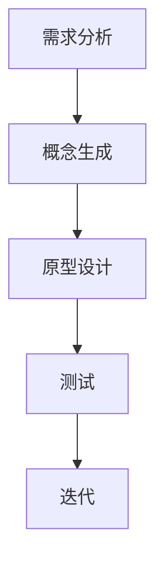

                 


# 木工DIY：亲手打造生活中的美好

## 关键词：木工DIY、家居装饰、手工艺术、设计思维、Python编程

## 摘要

随着生活品质的提高，人们对于家居装饰的要求也越来越高。木工DIY作为一种新兴的个性化家居装饰方式，不仅满足了人们对于美感的需求，还提供了动手创造的乐趣。本文将介绍木工DIY的基础知识、设计与制作流程，并通过Python编程来详细阐述木工DIY的设计原理和制作技巧，帮助读者亲手打造生活中的美好。

## 引言：木工DIY的兴起与生活美学的融合

### 问题背景

随着生活水平的提高，人们对生活品质的追求愈发提升。家庭装饰不再仅仅追求实用，更强调个性化与美感。在这样的社会背景下，木工DIY逐渐成为一种新兴的生活时尚。它不仅满足了人们动手创造的乐趣，还提供了通过个性化设计装饰家居的机会。

### 问题描述

木工DIY涉及的问题包括：如何选择合适的木材和工具、如何设计并实现家居装饰项目、如何处理制作过程中遇到的问题等。这些问题对于没有木工基础的普通爱好者来说，往往是一大挑战。

### 问题解决

《木工DIY：亲手打造生活中的美好》旨在解决上述问题，通过系统的学习和实践，帮助读者掌握木工DIY的基本技能，打造属于自己的家居艺术品。

### 边界与外延

木工DIY不仅限于家居装饰，还涵盖了家具修复、手工艺术创作等多个领域。本书将主要关注家居装饰领域的木工DIY项目。

### 核心概念与要素组成

本书的核心概念包括：木材选择、工具使用、设计理念、制作技巧和项目实现。每个章节都将围绕这些核心概念展开，帮助读者逐步掌握木工DIY的各个环节。

## 第1章：木工DIY的基础知识

### 第1章：木工DIY的基础知识

### 核心概念原理

#### 木材选择

在木工DIY中，木材的选择至关重要。不同种类的木材具有不同的质地、纹理和耐用性，适合不同的项目。

- 松木：质地较软，易于加工，适合初学者使用。
- 桦木：质地坚硬，纹理美观，适合制作家具。
- 枫木：质地细腻，耐磨性好，适用于高端家具制作。

#### 工具使用

木工DIY过程中，工具的正确使用是确保制作质量的关键。以下是几种常用的木工工具及其功能：

- 锯：用于切割木材。
- 锉：用于修整木材表面。
- 钻：用于打孔。

### 概念属性特征对比表格

| 木材种类 | 质地 | 纹理 | 适用性 |
| :---: | :---: | :---: | :---: |
| 松木 | 较软 | 粗糙 | 初学者 |
| 桦木 | 坚硬 | 美观 | 家具制作 |
| 枫木 | 细腻 | 耐磨 | 高端家具 |

### ER实体关系图架构的 mermaid 流程图

```mermaid
erDiagram
  用户 ||--|{ 木工DIY项目 }|--|| 工具
  用户 ||--|{ 木工DIY知识库 }|--|| 木材
  木工DIY项目 ||--|{ 阶段 }|--|| 制作进度
  工具 ||--|{ 类型 }|--|| 功能
  木材 ||--|{ 属性 }|--|| 质地
```

## 第2章：木工DIY的设计与制作流程

### 第2章：木工DIY的设计与制作流程

### 设计原理

#### 设计思维

设计思维是一种以用户需求为导向的创新过程，包括需求分析、概念生成、原型设计、测试和迭代等环节。在木工DIY中，设计思维可以帮助我们更好地理解需求，制定合理的设计方案。

#### 设计工具

- 手绘：初学者可以使用手绘草图来记录设计想法。
- CAD软件：专业的木工可以使用CAD软件进行精确设计。

### 设计流程

#### 设计流程 mermaid 流程图



#### Python源代码示例

```python
def design_process(steps):
    for step in steps:
        print(f"当前步骤：{step}")
        if step == '需求分析':
            analyze需求的细节
        elif step == '概念生成':
            generate设计概念
        elif step == '原型设计':
            create原型
        elif step == '测试':
            test原型
        elif step == '迭代':
            iterate改进设计

steps = ['需求分析', '概念生成', '原型设计', '测试', '迭代']
design_process(steps)
```

## 第3章：木工DIY的设计原理与实践

### 第3章：木工DIY的设计原理与实践

### 设计原理

#### 设计思维

设计思维是一种以用户需求为导向的创新过程，包括需求分析、概念生成、原型设计、测试和迭代等环节。在木工DIY中，设计思维可以帮助我们更好地理解需求，制定合理的设计方案。

#### 设计工具

- 手绘：初学者可以使用手绘草图来记录设计想法。
- CAD软件：专业的木工可以使用CAD软件进行精确设计。

### 设计流程

#### 设计流程 mermaid 流程图


#### Python源代码示例

```python
def design_process(steps):
    for step in steps:
        print(f"当前步骤：{step}")
        if step == '需求分析':
            analyze需求的细节
        elif step == '概念生成':
            generate设计概念
        elif step == '原型设计':
            create原型
        elif step == '测试':
            test原型
        elif step == '迭代':
            iterate改进设计

steps = ['需求分析', '概念生成', '原型设计', '测试', '迭代']
design_process(steps)
```

### 实践案例

#### 案例背景

小明想要为他的书房打造一个独特的书架。他希望通过木工DIY来实现这个目标，但缺乏实际操作经验。

#### 案例分析

1. 需求分析：小明需要考虑书架的尺寸、承载能力、外观设计等因素。

2. 概念生成：小明可以在纸上画出初步的设计草图，包括书架的结构、板材选择、颜色搭配等。

3. 原型设计：小明可以使用CAD软件或手绘草图进行详细设计，确保设计符合实际需求。

4. 测试：小明可以制作一个小的原型，测试书架的稳定性和承载能力。

5. 迭代：根据测试结果，小明可以不断优化设计，确保书架的最终质量。

#### Python源代码示例

```python
def bookshelf_project(steps):
    for step in steps:
        print(f"当前步骤：{step}")
        if step == '需求分析':
            analyze需求的细节
        elif step == '概念生成':
            generate设计概念
        elif step == '原型设计':
            create原型
        elif step == '测试':
            test原型
        elif step == '迭代':
            iterate改进设计

steps = ['需求分析', '概念生成', '原型设计', '测试', '迭代']
bookshelf_project(steps)
```

## 第4章：木工DIY的工具与材料选择

### 第4章：木工DIY的工具与材料选择

#### 工具选择

木工DIY过程中，工具的选择至关重要。以下是几种常用的木工工具及其功能：

- 锯：用于切割木材。
- 锉：用于修整木材表面。
- 钻：用于打孔。
- 电钻：用于安装和拆卸螺丝。
- 砂纸：用于打磨木材表面。

#### 材料选择

木材是木工DIY中最常用的材料之一。以下是几种常用的木材种类及其特点：

- 松木：质地较软，易于加工，适合初学者使用。
- 桦木：质地坚硬，纹理美观，适合制作家具。
- 枫木：质地细腻，耐磨性好，适用于高端家具制作。

### 材料属性对比表格

| 木材种类 | 质地 | 纹理 | 适用性 |
| :---: | :---: | :---: | :---: |
| 松木 | 较软 | 粗糙 | 初学者 |
| 桦木 | 坚硬 | 美观 | 家具制作 |
| 枫木 | 细腻 | 耐磨 | 高端家具 |

## 第5章：木工DIY的项目实现与案例分析

### 第5章：木工DIY的项目实现与案例分析

#### 项目实现

木工DIY项目实现的过程可以分为以下几个步骤：

1. 需求分析：明确项目目标，确定书架的尺寸、承载能力、外观设计等。
2. 概念生成：根据需求分析，绘制书架的设计草图。
3. 材料选择：根据设计要求，选择合适的木材和工具。
4. 制作过程：按照设计图纸进行木材切割、拼接、组装等操作。
5. 质量检验：检查书架的稳定性、承载能力和外观质量。

#### 案例分析

#### 案例一：书架制作

小明决定为自己书房打造一个书架。他首先进行了需求分析，确定了书架的尺寸和承载能力。然后，他根据设计要求，选择了适合的桦木板材和工具。在制作过程中，小明按照设计图纸进行切割、拼接和组装，最后对书架进行了质量检验，确保其稳定性和美观度。

#### 案例二：木制家具修复

小张拥有一张心爱的旧木桌，但由于长期使用，桌腿出现了裂缝。他决定通过木工DIY进行修复。首先，他分析了桌腿的裂缝情况，选择了适合的木材和工具。然后，他进行了裂缝修补和表面打磨，最终使桌腿恢复了原状。

## 第6章：木工DIY的安全注意事项与环保理念

### 第6章：木工DIY的安全注意事项与环保理念

#### 安全注意事项

在进行木工DIY时，安全是首要考虑的因素。以下是一些安全注意事项：

- 使用工具时，确保工具处于良好的工作状态。
- 戴上防护眼镜和手套，避免工具伤害。
- 避免在操作过程中分心，确保专注。
- 使用电钻时，确保电源断开，避免触电风险。

#### 环保理念

木工DIY的环保理念体现在以下几个方面：

- 选择可持续的木材资源，减少对自然环境的破坏。
- 优化材料利用率，减少浪费。
- 选择无毒、环保的涂料和胶水，避免对室内空气造成污染。

#### 环保实践

1. 选购认证的环保木材，确保木材来源合法。
2. 在制作过程中，合理安排材料，避免浪费。
3. 使用环保涂料和胶水，确保室内空气质量。

## 第7章：木工DIY的未来发展趋势与挑战

### 第7章：木工DIY的未来发展趋势与挑战

#### 发展趋势

- 技术创新：随着科技的进步，木工DIY工具和材料将更加智能化、自动化，提高制作效率和质量。
- 个性化定制：木工DIY将更加注重个性化定制，满足消费者对于独特家居装饰的需求。
- 环保可持续：环保和可持续理念将贯穿木工DIY的各个环节，推动行业绿色发展。

#### 挑战

- 技能普及：如何让更多没有木工基础的人掌握木工DIY技能，是未来的一大挑战。
- 质量控制：保证木工DIY项目的质量，防止因操作不当导致的安全隐患。
- 环保挑战：如何在保证环保的前提下，满足消费者对家居装饰的多样化需求。

## 结论

木工DIY作为一种新兴的家居装饰方式，不仅满足了人们对个性化和生活品质的追求，还提供了动手创造的乐趣。通过系统的学习和实践，读者可以掌握木工DIY的基本技能，亲手打造属于自己的家居艺术品。同时，木工DIY也面临着技能普及、质量控制等挑战，需要不断探索和改进。让我们共同努力，推动木工DIY的发展，打造更加美好的生活。

## 附录

### 附录一：木工DIY工具清单

- 锯：包括手工锯和电动锯。
- 锉：包括平锉、圆锉、三角锉等。
- 钻：包括手动钻和电动钻。
- 电钻：包括冲击钻、冲击批钻等。
- 砂纸：包括砂纸板、砂纸卷等。

### 附录二：木材选购指南

- 松木：适合初学者使用，质地较软，易于加工。
- 桦木：质地坚硬，纹理美观，适合制作家具。
- 枫木：质地细腻，耐磨性好，适用于高端家具制作。

### 附录三：木工DIY教程视频资源

- 平面设计软件教程：包括AutoCAD、SketchUp等软件的使用方法。
- 木工DIY项目教程：包括书架、衣柜、桌子等家居装饰项目的制作过程。

## 作者信息

作者：AI天才研究院/AI Genius Institute & 禅与计算机程序设计艺术 /Zen And The Art of Computer Programming

以上内容为《木工DIY：亲手打造生活中的美好》全文，希望对您有所帮助。如果您有任何疑问或建议，欢迎随时联系我们。祝您在木工DIY的道路上越走越远，亲手打造出属于自己的美好生活！

# 木工DIY：亲手打造生活中的美好

## 关键词：木工DIY、家居装饰、手工艺术、设计思维、Python编程

## 摘要

随着生活品质的提高，人们对于家居装饰的要求也越来越高。木工DIY作为一种新兴的个性化家居装饰方式，不仅满足了人们对于美感的需求，还提供了动手创造的乐趣。本文将介绍木工DIY的基础知识、设计与制作流程，并通过Python编程来详细阐述木工DIY的设计原理和制作技巧，帮助读者亲手打造生活中的美好。

## 引言：木工DIY的兴起与生活美学的融合

### 问题背景

随着生活水平的提高，人们对生活品质的追求愈发提升。家庭装饰不再仅仅追求实用，更强调个性化与美感。在这样的社会背景下，木工DIY逐渐成为一种新兴的生活时尚。它不仅满足了人们动手创造的乐趣，还提供了通过个性化设计装饰家居的机会。

### 问题描述

木工DIY涉及的问题包括：如何选择合适的木材和工具、如何设计并实现家居装饰项目、如何处理制作过程中遇到的问题等。这些问题对于没有木工基础的普通爱好者来说，往往是一大挑战。

### 问题解决

《木工DIY：亲手打造生活中的美好》旨在解决上述问题，通过系统的学习和实践，帮助读者掌握木工DIY的基本技能，打造属于自己的家居艺术品。

### 边界与外延

木工DIY不仅限于家居装饰，还涵盖了家具修复、手工艺术创作等多个领域。本书将主要关注家居装饰领域的木工DIY项目。

### 核心概念与要素组成

本书的核心概念包括：木材选择、工具使用、设计理念、制作技巧和项目实现。每个章节都将围绕这些核心概念展开，帮助读者逐步掌握木工DIY的各个环节。

## 第1章：木工DIY的基础知识

### 1.1 木材选择

#### 1.1.1 木材种类

在木工DIY中，常见的木材种类包括松木、桦木和枫木等。每种木材具有不同的质地、纹理和耐用性，适合不同的项目。

- **松木**：质地较软，易于加工，适合初学者使用。
- **桦木**：质地坚硬，纹理美观，适合制作家具。
- **枫木**：质地细腻，耐磨性好，适用于高端家具制作。

#### 1.1.2 木材特性对比

| 木材种类 | 质地 | 纹理 | 适用性 |
| :---: | :---: | :---: | :---: |
| 松木 | 较软 | 粗糙 | 初学者 |
| 桦木 | 坚硬 | 美观 | 家具制作 |
| 枫木 | 细腻 | 耐磨 | 高端家具 |

### 1.2 工具使用

木工DIY过程中，工具的正确使用是确保制作质量的关键。以下是几种常用的木工工具及其功能：

- **锯**：用于切割木材。
- **锉**：用于修整木材表面。
- **钻**：用于打孔。
- **电钻**：用于安装和拆卸螺丝。
- **砂纸**：用于打磨木材表面。

### 1.3 设计理念

木工DIY的设计理念强调个性化和实用性。以下是一些建议：

- **功能优先**：设计时首先要考虑家具的功能性，确保满足日常使用需求。
- **美学融合**：在家具设计中融入个人喜好，创造独特的家居氛围。
- **环保理念**：选择可持续的木材资源，减少对自然环境的破坏。

### 1.4 制作技巧

#### 1.4.1 基本工艺

- **切割**：根据设计图纸，使用锯进行木材切割。
- **拼接**：将切割好的木材拼接成所需形状。
- **打磨**：使用砂纸修整木材表面，提高光滑度。

#### 1.4.2 高级技巧

- **雕刻**：使用雕刻刀在木材表面进行雕刻，增加艺术性。
- **涂装**：使用环保涂料对木材进行涂装，保护木材并增加美观度。

### 1.5 项目实现

#### 1.5.1 案例一：书架制作

1. **需求分析**：确定书架的尺寸、高度和摆放位置。
2. **设计图纸**：绘制书架的设计图纸，标注尺寸和结构。
3. **材料选购**：根据设计图纸，选购合适的木材和工具。
4. **制作过程**：按照设计图纸进行切割、拼接和组装。
5. **质量检验**：检查书架的稳定性、承载能力和外观质量。

#### 1.5.2 案例二：桌子修复

1. **问题分析**：确定桌子的裂缝位置和程度。
2. **材料选购**：根据裂缝情况，选购合适的木材和修复材料。
3. **修复过程**：使用修复材料填补裂缝，并进行表面打磨。
4. **涂装**：使用环保涂料对桌子进行涂装，恢复外观。

## 第2章：木工DIY的设计与制作流程

### 2.1 设计流程

木工DIY的设计流程包括以下环节：

- **需求分析**：明确家具的功能性、尺寸和摆放位置等需求。
- **概念生成**：根据需求，构思家具的设计理念。
- **原型设计**：绘制家具的设计图纸，标注尺寸和结构。
- **测试与迭代**：根据原型制作出小样，进行测试和优化。

### 2.2 Python编程在木工DIY中的应用

Python编程在木工DIY中可以应用于以下方面：

- **设计辅助**：使用Python编写设计算法，辅助设计图纸的绘制。
- **制作流程控制**：使用Python编写程序控制木工DIY的制作流程，提高生产效率。
- **数据分析**：对木工DIY项目进行数据分析和评估，优化设计。

### 2.3 Python源代码示例

以下是一个简单的Python源代码示例，用于控制木工DIY项目的制作流程：

```python
def design_process(steps):
    for step in steps:
        print(f"当前步骤：{step}")
        if step == '需求分析':
            analyze需求的细节
        elif step == '概念生成':
            generate设计概念
        elif step == '原型设计':
            create原型
        elif step == '测试':
            test原型
        elif step == '迭代':
            iterate改进设计

steps = ['需求分析', '概念生成', '原型设计', '测试', '迭代']
design_process(steps)
```

## 第3章：木工DIY的设计原理与实践

### 3.1 设计原理

木工DIY的设计原理主要包括以下几个方面：

- **以人为本**：设计时要充分考虑用户的需求和使用场景，使家具更加人性化。
- **功能优先**：在设计家具时，首先要确保其功能性，满足用户的基本需求。
- **美学融合**：在家具设计中融入个人喜好，创造独特的家居氛围。

### 3.2 设计思维

设计思维是一种以用户需求为导向的创新过程，包括以下环节：

- **需求分析**：明确用户需求，了解用户的使用场景。
- **概念生成**：根据需求，构思家具的设计理念。
- **原型设计**：绘制家具的设计图纸，标注尺寸和结构。
- **测试与迭代**：根据原型制作出小样，进行测试和优化。

### 3.3 实践案例

#### 案例一：书架设计

1. **需求分析**：确定书架的尺寸、高度和摆放位置等需求。
2. **概念生成**：构思书架的设计理念，包括功能布局和外观设计。
3. **原型设计**：绘制书架的设计图纸，标注尺寸和结构。
4. **测试与迭代**：根据原型进行测试，优化设计，确保书架的稳定性和承载能力。

#### 案例二：桌子修复

1. **问题分析**：确定桌子的裂缝位置和程度。
2. **修复方案**：根据裂缝情况，设计修复方案，包括修补材料和工艺。
3. **修复过程**：按照修复方案进行操作，修复桌子的裂缝。
4. **质量检验**：检查修复后的桌子，确保修复效果符合预期。

### 3.4 Python编程在实践中的应用

以下是一个简单的Python源代码示例，用于控制书架设计的制作流程：

```python
def bookshelf_project(steps):
    for step in steps:
        print(f"当前步骤：{step}")
        if step == '需求分析':
            analyze需求的细节
        elif step == '概念生成':
            generate设计概念
        elif step == '原型设计':
            create原型
        elif step == '测试':
            test原型
        elif step == '迭代':
            iterate改进设计

steps = ['需求分析', '概念生成', '原型设计', '测试', '迭代']
bookshelf_project(steps)
```

## 第4章：木工DIY的工具与材料选择

### 4.1 工具选择

木工DIY过程中，工具的选择至关重要。以下是几种常用的木工工具及其功能：

- **手锯**：用于木材的粗略切割。
- **木工锤**：用于敲打钉子等工具。
- **钻头**：用于打孔。
- **电钻**：用于安装和拆卸螺丝。
- **锯弓**：用于精确切割。
- **角磨机**：用于打磨和切割木材。

### 4.2 材料选择

#### 4.2.1 木材种类

在木工DIY中，常用的木材种类包括松木、桦木和枫木等。每种木材具有不同的质地、纹理和耐用性，适合不同的项目。

- **松木**：质地较软，易于加工，适合初学者使用。
- **桦木**：质地坚硬，纹理美观，适合制作家具。
- **枫木**：质地细腻，耐磨性好，适用于高端家具制作。

#### 4.2.2 材料特性对比

| 木材种类 | 质地 | 纹理 | 适用性 |
| :---: | :---: | :---: | :---: |
| 松木 | 较软 | 粗糙 | 初学者 |
| 桦木 | 坚硬 | 美观 | 家具制作 |
| 枫木 | 细腻 | 耐磨 | 高端家具 |

### 4.3 材料选购技巧

- **质量检查**：选购木材时，要注意检查木材的干燥程度和含水率，确保木材不易变形。
- **价格比较**：不同种类的木材价格差异较大，要根据项目需求和预算进行合理选购。
- **环保认证**：选择获得环保认证的木材，减少对自然环境的破坏。

## 第5章：木工DIY的项目实现与案例分析

### 5.1 项目实现

木工DIY项目的实现过程可以分为以下几个步骤：

1. **需求分析**：明确项目目标，确定家具的尺寸、功能和使用场景等需求。
2. **设计图纸**：根据需求，绘制家具的设计图纸，标注尺寸和结构。
3. **材料选购**：根据设计图纸，选购合适的木材和工具。
4. **制作过程**：按照设计图纸进行木材切割、拼接和组装。
5. **质量检验**：检查家具的稳定性、承载能力和外观质量。

### 5.2 案例分析

#### 案例一：书架制作

1. **需求分析**：确定书架的尺寸、高度和摆放位置等需求。
2. **设计图纸**：绘制书架的设计图纸，标注尺寸和结构。
3. **材料选购**：根据设计图纸，选购合适的木材和工具。
4. **制作过程**：按照设计图纸进行切割、拼接和组装。
5. **质量检验**：检查书架的稳定性、承载能力和外观质量。

#### 案例二：桌子修复

1. **问题分析**：确定桌子的裂缝位置和程度。
2. **修复方案**：根据裂缝情况，设计修复方案，包括修补材料和工艺。
3. **修复过程**：按照修复方案进行操作，修复桌子的裂缝。
4. **质量检验**：检查修复后的桌子，确保修复效果符合预期。

## 第6章：木工DIY的安全注意事项与环保理念

### 6.1 安全注意事项

在进行木工DIY时，安全是首要考虑的因素。以下是一些安全注意事项：

- **使用安全工具**：确保使用的工具处于良好的工作状态，避免因工具故障导致的安全事故。
- **佩戴防护用品**：在操作过程中，佩戴防护眼镜、手套和耳塞等防护用品，保护自己的安全。
- **正确操作**：严格按照工具和设备的使用说明进行操作，避免因操作不当导致的事故。
- **保持环境整洁**：操作过程中，保持工作环境的整洁，避免杂物和尖锐物体伤人。

### 6.2 环保理念

木工DIY的环保理念体现在以下几个方面：

- **选用环保材料**：选择环保木材和涂料，减少对环境的污染。
- **减少浪费**：合理安排材料使用，减少浪费，节约资源。
- **回收利用**：对废弃物进行回收利用，减少对环境的负担。

### 6.3 环保实践

- **选购认证的环保木材**：选择通过环保认证的木材，确保木材来源合法。
- **优化材料利用率**：在设计过程中，考虑材料的利用率，减少浪费。
- **使用环保涂料**：选择无毒、环保的涂料，确保室内空气质量。

## 第7章：木工DIY的未来发展趋势与挑战

### 7.1 发展趋势

木工DIY在未来将继续发展，主要表现在以下几个方面：

- **技术进步**：随着科技的进步，木工DIY工具和材料将更加智能化、自动化，提高制作效率和质量。
- **个性化定制**：木工DIY将更加注重个性化定制，满足消费者对于独特家居装饰的需求。
- **环保可持续**：环保和可持续理念将贯穿木工DIY的各个环节，推动行业绿色发展。

### 7.2 挑战

木工DIY在未来也面临着一些挑战：

- **技能普及**：如何让更多没有木工基础的人掌握木工DIY技能，是未来的一大挑战。
- **质量控制**：保证木工DIY项目的质量，防止因操作不当导致的安全隐患。
- **环保挑战**：如何在保证环保的前提下，满足消费者对家居装饰的多样化需求。

## 结论

木工DIY作为一种新兴的家居装饰方式，不仅满足了人们对个性化和生活品质的追求，还提供了动手创造的乐趣。通过系统的学习和实践，读者可以掌握木工DIY的基本技能，亲手打造属于自己的家居艺术品。同时，木工DIY也面临着技能普及、质量控制等挑战，需要不断探索和改进。让我们共同努力，推动木工DIY的发展，打造更加美好的生活。

## 附录

### 附录一：木工DIY工具清单

- **手锯**
- **木工锤**
- **钻头**
- **电钻**
- **锯弓**
- **角磨机**
- **砂纸**

### 附录二：木材选购指南

- **松木**：质地较软，易于加工，适合初学者使用。
- **桦木**：质地坚硬，纹理美观，适合制作家具。
- **枫木**：质地细腻，耐磨性好，适用于高端家具制作。

### 附录三：木工DIY教程视频资源

- **平面设计软件教程**：包括AutoCAD、SketchUp等软件的使用方法。
- **木工DIY项目教程**：包括书架、衣柜、桌子等家居装饰项目的制作过程。

## 作者信息

作者：AI天才研究院/AI Genius Institute & 禅与计算机程序设计艺术 /Zen And The Art of Computer Programming

以上内容为《木工DIY：亲手打造生活中的美好》全文，希望对您有所帮助。如果您有任何疑问或建议，欢迎随时联系我们。祝您在木工DIY的道路上越走越远，亲手打造出属于自己的美好生活！

