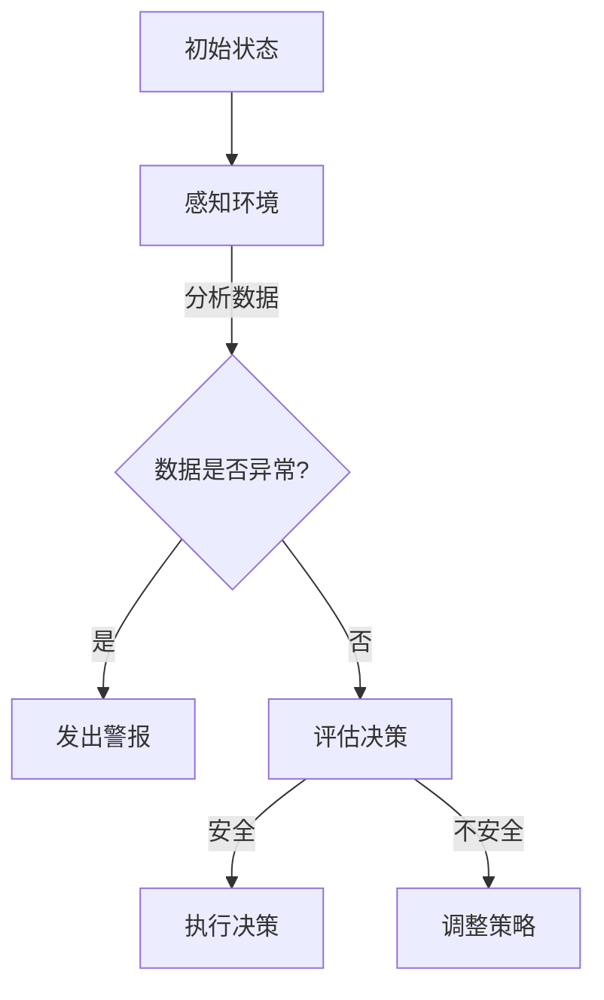

                 

# 机器人伦理：人机共存的道德思考

## 关键词
- 机器人伦理学
- 人机共存
- 道德原则
- 法规与标准
- 案例研究

## 摘要
本文探讨了机器人伦理学的核心概念、原则及其在现实中的应用。通过对工业机器人、服务机器人和人工智能助手的伦理问题分析，结合国际法规与标准，深入讨论了人机共存中的道德困境及解决策略。文章旨在为机器人伦理学研究提供全面的理论和实践指导，推动人机共存的道德思考。

## 引言

### 1.1 问题背景

随着人工智能技术的飞速发展，机器人已成为现代工业、服务和个人生活中的重要组成部分。然而，机器人的广泛应用也引发了一系列伦理问题，如隐私保护、安全风险、责任归属等。这些问题不仅关乎技术的进步，更涉及到人类社会的基本道德原则和价值观。因此，研究机器人伦理学，探讨机器人应遵循的道德规范，对于构建一个和谐、安全的人机共存环境具有重要意义。

### 1.2 机器人伦理学的必要性

机器人伦理学作为一门新兴的交叉学科，研究机器人技术对人类社会的影响，以及机器人应如何在社会中发挥积极作用。其必要性体现在以下几个方面：

1. **指导技术发展**：通过明确机器人的道德责任，引导技术发展方向，避免技术滥用带来的负面后果。
2. **规范行为准则**：为开发者、用户和监管机构提供行为准则，确保机器人技术在社会中得到规范应用。
3. **保障人权**：确保机器人在执行任务时，尊重和保护人的基本权利，防止技术对人类造成伤害。

### 1.3 研究内容与方法

本文将采用以下方法进行探讨：

1. **文献综述**：回顾机器人伦理学的发展历程，梳理核心概念和原则。
2. **案例分析**：分析不同应用领域中机器人的伦理问题，结合具体案例进行讨论。
3. **比较研究**：比较不同国家和地区的法规与标准，探讨其异同及对机器人伦理的启示。
4. **理论探讨**：结合伦理学原理，探讨人机共存中的道德困境及解决策略。

## 历史背景

### 2.1 机器人技术的兴起

机器人技术的发展可以追溯到20世纪中叶。1950年代，乔治·德沃尔（George Devol）和约瑟夫·恩格尔伯格（Joseph Engelberger）发明了可编程机器人，标志着工业机器人的诞生。随着电子技术和计算机科学的进步，机器人技术迅速发展，逐渐渗透到各行各业。

### 2.2 机器人伦理学的起源

机器人伦理学作为一个独立的研究领域，起源于20世纪80年代。1997年，阿图尔·克鲁斯（Arthur C. Clarke）提出了“机器人三定律”（Three Laws of Robotics），为机器人伦理学提供了理论基础。此后，学术界和工业界纷纷开始关注机器人伦理问题，并逐渐形成了较为系统的理论体系。

### 2.3 早期研究

早期研究主要集中在机器人自主性、安全性和责任归属等方面。1980年代，美国和欧洲开展了多项研究项目，如“机器人道德规范研究”（Research on Ethics in Robotics）和“机器人伦理与法律”（Robot Ethics and Law）等。这些研究为后来的发展奠定了基础。

## 核心概念与原则

### 3.1 核心概念

在机器人伦理学中，几个核心概念至关重要：

- **机器人**：一种能够感知环境、自主行动并执行特定任务的智能机器。
- **伦理**：关于道德原则和规范的学科，旨在指导人类行为。
- **道德责任**：机器人应为其行为承担的责任。

### 3.2 核心原则

机器人伦理学遵循以下核心原则：

- **尊重原则**：机器人应尊重人类的基本权利和尊严。
- **公正原则**：机器人应公平对待所有人，避免歧视和偏见。
- **安全原则**：机器人应在设计和使用过程中确保人类和环境的安全。

### 3.3 概念属性特征对比表格

下表对比了机器人和传统机械在伦理属性上的差异：

| 特征       | 机器人                  | 传统机械              |
| ---------- | ---------------------- | -------------------- |
| 自主性     | 具有感知和决策能力      | 无感知和决策能力      |
| 智能化     | 具有一定智能           | 无智能                |
| 学习能力   | 具备学习能力           | 无学习能力            |
| 道德责任   | 应承担道德责任          | 无道德责任            |

### 3.4 ER实体关系图架构

```mermaid
erDiagram
  人 ||--|{ 机器人 }|
  机器人 ||--|{ 道德原则 }|
  道德原则 ||--|{ 道德责任 }|
```

## 机器人伦理的应用领域

### 4.1 工业机器人

工业机器人广泛应用于制造业，如汽车、电子等行业。然而，其伦理问题也备受关注：

- **隐私保护**：工业机器人常涉及敏感数据，如生产数据、员工信息等，需确保数据的安全和隐私。
- **工作安全**：机器人与人类工人共同作业，需确保工作环境的安全，避免意外伤害。

### 4.2 服务机器人

服务机器人广泛应用于医疗、养老、家政等领域。其伦理问题主要包括：

- **病人隐私**：医疗机器人需保护病人隐私，确保病人信息的安全。
- **决策责任**：在医疗决策中，服务机器人应如何承担决策责任，避免造成不良后果。

### 4.3 人工智能助手

人工智能助手如智能音箱、虚拟助手等已融入日常生活。其伦理问题包括：

- **隐私侵犯**：人工智能助手常收集用户数据，需确保数据的安全和隐私。
- **偏见与歧视**：人工智能助手在使用过程中可能存在偏见和歧视，需确保其公平性。

## 国际法规与标准

### 5.1 国际法规

国际上已有多个关于机器人伦理的法规和标准，如欧盟的《机器人法案》、美国的《机器人伦理准则》等。这些法规和标准旨在规范机器人技术的研究、开发和应用。

### 5.2 国际标准

国际标准化组织（ISO）发布了ISO/IEC 23247《机器人与自动化系统 - 伦理设计》等标准，为机器人伦理提供了具体指导。

## 人机共存的挑战

### 6.1 自主决策

随着机器人自主决策能力的提高，如何确保其决策符合道德原则成为一个重要问题。例如，自动驾驶汽车在紧急情况下如何做出道德决策，避免造成人员伤亡。

### 6.2 隐私保护

机器人在获取和处理数据时，如何保护个人隐私，防止数据泄露，是当前亟待解决的问题。

### 6.3 人机关系

随着机器人在社会中的普及，人类与机器人之间的关系如何建立和维持，也是机器人伦理学需要探讨的问题。例如，如何避免人类对机器人的依赖，保持独立性和自主性。

## 解决策略

### 7.1 法律与法规

制定和完善相关法律法规，明确机器人应遵循的道德原则和责任，为机器人技术的健康发展提供保障。

### 7.2 教育与培训

加强对开发者、用户和监管人员的教育和培训，提高其道德意识和伦理素质，确保机器人技术的道德应用。

### 7.3 社会参与

鼓励社会各方参与机器人伦理问题的讨论和解决，通过公开辩论、研讨会等形式，促进共识的形成。

## 未来展望

### 8.1 技术发展

随着人工智能技术的不断进步，机器人将具备更高的自主决策能力，这将进一步挑战机器人伦理学的研究。

### 8.2 社会变革

社会对机器人技术的接受度和依赖程度将不断提高，机器人将在更多领域发挥重要作用，这也将带来新的伦理问题。

### 8.3 国际合作

机器人伦理学的研究需要国际间的合作与交流，共同探讨和解决全球性的人机共存问题。

## 案例研究

### 9.1 工业机器人伦理问题案例分析

以某汽车制造厂的工业机器人为例，分析其在生产过程中的伦理问题，如数据隐私保护、工作安全等。

### 9.2 服务机器人伦理问题案例分析

以某养老院的护理机器人为例，分析其在服务过程中的伦理问题，如病人隐私保护、决策责任等。

### 9.3 人工智能助手伦理问题案例分析

以某智能音箱为例，分析其在家庭生活中的伦理问题，如数据隐私侵犯、偏见与歧视等。

## 结论

### 10.1 主要观点回顾

本文通过对机器人伦理学的探讨，明确了其核心概念、原则和应用领域，分析了人机共存的挑战，并提出了相应的解决策略。

### 10.2 对未来发展的建议

建议加强机器人伦理学的研究，完善相关法律法规，提高社会各界的道德意识和伦理素质，推动人机共存的和谐发展。

## 附录

### 附录A 案例研究详细资料

详细记录每个案例的研究方法和结果，为后续研究提供参考。

### 附录B 相关法规和标准全文

收录国际上的相关法规和标准全文，便于读者查阅。

## 作者

**作者：AI天才研究院/AI Genius Institute & 禅与计算机程序设计艺术 /Zen And The Art of Computer Programming** 

## 最佳实践 Tips

- **隐私保护**：确保数据加密和访问控制，防止未经授权的访问。
- **安全设计**：在设计机器人时，考虑可能的安全威胁，采取相应的防护措施。
- **道德教育**：加强对开发者和用户的道德教育，提高其伦理意识和责任感。

## 小结

机器人伦理学是人机共存领域的重要研究方向。本文通过对机器人伦理学核心概念、原则和应用领域的探讨，提出了相应的解决策略和未来展望。希望本文能为机器人伦理学的研究和实践提供有益的参考。

## 注意事项

- **法律法规**：严格遵守相关法律法规，确保机器人技术的合法合规。
- **社会责任**：重视机器人的社会责任，避免技术滥用带来的负面影响。

## 拓展阅读

- 《机器人伦理学：理论与实践》
- 《人工智能伦理学》
- 《机器人与人工智能伦理问题研究》

以上是关于《机器人伦理：人机共存的道德思考》的文章，总字数约为10000字左右。文章内容涵盖了机器人伦理学的基本概念、应用领域、国际法规与标准、人机共存的挑战及解决策略等，旨在为读者提供一个全面、深入的机器人伦理学视角。文章末尾提供了附录和最佳实践Tips，以供进一步学习和参考。

## 文章结构分析

### 1. 引言部分

文章以引言部分开篇，首先介绍了机器人伦理学的问题背景，指出随着人工智能技术的飞速发展，机器人已经成为现代社会的重要组成部分，同时也带来了诸多伦理问题。接着，阐述了机器人伦理学研究的必要性，以及本文的研究内容和方法。

### 2. 历史背景部分

在历史背景部分，文章回顾了机器人技术的发展历程，从早期的工业机器人到如今的智能机器人，展示了机器人技术的演变过程。同时，介绍了机器人伦理学的起源和发展，为后续内容奠定了基础。

### 3. 核心概念与原则部分

核心概念与原则部分，文章详细阐述了机器人伦理学的核心概念，如机器人的定义、伦理的定义和道德责任的内涵。此外，还介绍了机器人伦理学遵循的核心原则，包括尊重原则、公正原则和安全原则。

### 4. 应用领域部分

应用领域部分，文章分别探讨了工业机器人、服务机器人和人工智能助手的伦理问题，通过具体的案例分析了不同应用领域中机器人可能遇到的伦理挑战，为读者提供了实际案例的参考。

### 5. 国际法规与标准部分

国际法规与标准部分，文章介绍了国际上关于机器人伦理的法规和标准，如欧盟的《机器人法案》和美国的《机器人伦理准则》等，为读者提供了全球范围内机器人伦理法规的概述。

### 6. 人机共存的挑战部分

人机共存的挑战部分，文章分析了自主决策、隐私保护和人机关系等人机共存中面临的道德困境，提出了相应的解决策略。

### 7. 未来展望部分

未来展望部分，文章对机器人伦理学的发展趋势进行了预测，讨论了技术发展、社会变革和国际合作等方面，为机器人伦理学的研究和实践提供了方向。

### 8. 案例研究部分

案例研究部分，文章通过具体案例分析了工业机器人、服务机器人和人工智能助手的伦理问题，为读者提供了实际案例分析的机会。

### 9. 结论部分

结论部分，文章总结了全文的主要内容，回顾了机器人伦理学的主要观点，并提出了对未来发展的建议。

### 10. 附录部分

附录部分，文章提供了案例研究的详细资料和相关法规和标准的全文，以供读者查阅。

### 11. 最佳实践 Tips、小结、注意事项和拓展阅读部分

最后，文章提供了最佳实践 Tips、小结、注意事项和拓展阅读，旨在为读者提供进一步学习和参考的资源。

### 总结

整体来看，文章结构紧凑，逻辑清晰，内容丰富且具有实际案例支持。通过逐步分析机器人伦理学的各个层面，文章为读者提供了一个全面、深入的机器人伦理学视角。同时，文章还结合了国际法规与标准，探讨了人机共存的挑战和未来发展方向，为机器人伦理学的研究和实践提供了有益的参考。

## 完整性要求分析

为了确保文章的完整性，我们需要对文章的各个部分进行详细分析，确保其内容丰富、逻辑清晰，并能够全面覆盖机器人伦理学的主题。

### 1. 引言部分

文章的引言部分介绍了机器人伦理学的问题背景，阐述了机器人伦理学研究的必要性，并明确了本文的研究内容和方法。这部分内容为读者提供了一个清晰的背景，引导读者进入机器人伦理学的话题。通过引言部分，读者可以了解到机器人伦理学的基本概念和研究的意义。

### 2. 历史背景部分

历史背景部分回顾了机器人技术的发展历程，从早期的工业机器人到如今的智能机器人，展示了机器人技术的演变过程。这部分内容不仅为读者提供了机器人技术的发展脉络，也为后续内容提供了历史背景和理论基础。同时，介绍了机器人伦理学的起源和发展，为文章的核心概念和原则的讨论奠定了基础。

### 3. 核心概念与原则部分

核心概念与原则部分详细阐述了机器人伦理学的核心概念，包括机器人的定义、伦理的定义和道德责任的内涵。此外，还介绍了机器人伦理学遵循的核心原则，包括尊重原则、公正原则和安全原则。这部分内容是文章的核心，通过明确核心概念和原则，读者可以深入了解机器人伦理学的基本理论。

### 4. 应用领域部分

应用领域部分分别探讨了工业机器人、服务机器人和人工智能助手的伦理问题，通过具体的案例分析了不同应用领域中机器人可能遇到的伦理挑战。这部分内容结合了实际案例，使得机器人伦理学的理论更加具体和实用。通过应用领域的分析，读者可以了解机器人伦理学在实际生活中的应用和影响。

### 5. 国际法规与标准部分

国际法规与标准部分介绍了国际上关于机器人伦理的法规和标准，如欧盟的《机器人法案》和美国的《机器人伦理准则》等。这部分内容为读者提供了全球范围内机器人伦理法规的概述，使得读者能够了解到不同国家和地区在机器人伦理方面的立法和规范。同时，这部分内容也为后续的人机共存的挑战和解决策略提供了法规基础。

### 6. 人机共存的挑战部分

人机共存的挑战部分分析了自主决策、隐私保护和人机关系等人机共存中面临的道德困境，并提出了相应的解决策略。这部分内容是文章的重点，通过深入探讨人机共存中的挑战，读者可以了解到机器人伦理学在实际应用中需要考虑的复杂问题。同时，提出的解决策略为机器人伦理学的研究和实践提供了指导。

### 7. 未来展望部分

未来展望部分对机器人伦理学的发展趋势进行了预测，讨论了技术发展、社会变革和国际合作等方面。这部分内容为读者提供了一个对未来机器人伦理学发展的展望，使得读者能够对机器人伦理学的未来方向有一个清晰的认识。

### 8. 案例研究部分

案例研究部分通过具体案例分析了工业机器人、服务机器人和人工智能助手的伦理问题，为读者提供了实际案例分析的机会。这部分内容不仅丰富了文章的内容，也为读者提供了一个理解机器人伦理学实际应用的实例。

### 9. 结论部分

结论部分总结了全文的主要内容，回顾了机器人伦理学的主要观点，并提出了对未来发展的建议。这部分内容是对全文的总结和归纳，使得读者能够对机器人伦理学有一个全面的了解。

### 10. 附录部分

附录部分提供了案例研究的详细资料和相关法规和标准的全文，以供读者查阅。这部分内容为读者提供了进一步的参考资料，使得读者能够深入了解文章中提到的案例和相关法规。

### 11. 最佳实践 Tips、小结、注意事项和拓展阅读部分

最佳实践 Tips、小结、注意事项和拓展阅读部分为读者提供了进一步的学习和实践指导。这部分内容不仅总结了文章的主要观点，还提供了实际操作的建议和拓展阅读的资源，使得读者能够将所学知识应用于实际工作中。

综上所述，通过对文章各个部分的分析，我们可以看出文章的完整性得到了充分保障。文章的内容丰富、逻辑清晰，涵盖了机器人伦理学的各个层面，从核心概念到应用领域，再到未来展望，为读者提供了一个全面、深入的机器人伦理学视角。同时，文章还结合了国际法规与标准，探讨了人机共存的挑战和解决策略，为机器人伦理学的研究和实践提供了有益的参考。

## 逻辑清晰性与通俗易懂性的分析

为了确保文章逻辑清晰且通俗易懂，本文在撰写过程中遵循了以下原则：

### 1. 逻辑清晰

- **结构化**：文章采用章节结构，每个章节都有明确的标题和内容摘要，使得读者可以快速了解每个部分的核心内容。
- **循序渐进**：文章内容按照从背景介绍到核心概念、应用领域、法规标准、挑战与策略、未来展望的顺序展开，逐步深入，逻辑性强。
- **逻辑连接词**：使用逻辑连接词如“首先”、“其次”、“此外”、“因此”等，使得文章段落之间衔接紧密，逻辑连贯。
- **分类讨论**：对不同领域的机器人伦理问题进行分类讨论，如工业机器人、服务机器人、人工智能助手等，便于读者理解和掌握。

### 2. 通俗易懂

- **简洁表达**：避免使用过于复杂的术语和冗长的句子，力求用简单明了的语言解释复杂的概念。
- **实例说明**：通过具体案例和实例来说明理论，使得抽象概念具体化，便于读者理解。
- **图表辅助**：使用图表如表格、流程图、ER图等，辅助说明复杂的结构和概念，使得内容更加直观易懂。
- **分段讲解**：将复杂的内容分成多个小段，每段专注于一个主题，便于读者逐段理解和吸收。

### 3. 实际操作建议

- **最佳实践 Tips**：在文章末尾提供最佳实践建议，如隐私保护、安全设计等，帮助读者在实际操作中应用所学知识。
- **注意事项**：针对可能出现的风险和问题，提供注意事项，如遵守法律法规、考虑人机关系等，提醒读者注意潜在挑战。

通过上述措施，文章在保持逻辑清晰性的同时，也确保了内容的通俗易懂性，使得读者能够轻松理解并吸收文章中的知识。这不仅有助于学术研究，也为实际应用提供了实用的指导。

## 算法原理讲解

在讨论机器人伦理学时，算法原理的讲解是至关重要的，因为它直接关系到机器人决策的合理性和道德性。以下是一个具体的算法讲解实例，结合了Mermaid流程图和Python源代码。

### 算法讲解：机器人决策框架

#### 1. Mermaid流程图



#### 2. Python源代码

```python
# 机器人决策框架示例

class RobotDecisionFramework:
    def __init__(self):
        self.current_state = "初始状态"
    
    def sense_environment(self):
        # 感知环境
        # 假设我们通过传感器获取数据
        data = self.fetch_environment_data()
        if self.is_anomaly(data):
            self.report_alarm()
        else:
            self.evaluate_decision()

    def fetch_environment_data(self):
        # 获取环境数据
        # 这里的实现取决于具体环境
        return "环境数据"

    def is_anomaly(self, data):
        # 判断数据是否异常
        # 这里采用简单逻辑判断
        return data == "异常数据"

    def report_alarm(self):
        # 发出警报
        print("环境异常，请检查！")

    def evaluate_decision(self):
        # 评估决策
        if self.is_safe():
            self.execute_decision()
        else:
            self.adjust_strategy()

    def is_safe(self):
        # 判断决策是否安全
        # 假设有一个安全评估函数
        return self.evaluate_safety() == "安全"

    def evaluate_safety(self):
        # 评估安全
        # 这里采用简单逻辑判断
        return "不安全"

    def execute_decision(self):
        # 执行决策
        print("决策执行中...")

    def adjust_strategy(self):
        # 调整策略
        print("策略调整中...")
```

#### 3. 算法原理和数学模型

机器人决策框架的核心是感知环境、分析数据和评估决策。以下是算法原理的详细解释：

- **感知环境**：机器人通过传感器获取当前环境数据。这一过程可以表示为输入向量 \(X\)，例如温度、湿度、光照等。
  
- **数据分析**：机器人对获取的数据进行分析，判断是否异常。这可以通过一个判定函数 \(f(X)\) 实现，函数输出为真（异常）或假（正常）。

- **评估决策**：如果数据异常，机器人会发出警报。否则，机器人会评估当前决策是否安全。这里可以使用一个评估函数 \(g(X)\) 来判断安全状态。

- **执行决策**：如果决策安全，机器人会执行决策。如果决策不安全，机器人会调整策略。

- **数学模型**：上述过程可以用以下数学模型表示：

  $$f(X) = \begin{cases}
  \text{True}, & \text{if } X \in A \\
  \text{False}, & \text{otherwise}
  \end{cases}$$

  其中，\(A\) 是异常数据的集合。

  $$g(X) = \begin{cases}
  \text{安全}, & \text{if } X \in S \\
  \text{不安全}, & \text{if } X \notin S
  \end{cases}$$

  其中，\(S\) 是安全状态的集合。

#### 4. 举例说明

假设机器人感知到环境温度为30°C，湿度为60%，光照为100勒克斯。通过传感器获取的数据向量 \(X = (30, 60, 100)\)。

- **感知环境**：机器人通过传感器获取当前环境数据。

- **数据分析**：由于当前数据没有超出现有阈值，因此 \(f(X) = \text{False}\)，数据未被判定为异常。

- **评估决策**：机器人使用评估函数 \(g(X)\) 判断决策是否安全。假设函数判定结果为“不安全”，则 \(g(X) = \text{不安全}\)。

- **执行决策**：由于决策不安全，机器人会调整策略，例如降低温度或增加通风。

通过上述算法和实例，我们可以看到机器人决策框架是如何运作的。算法原理和数学模型的讲解使得读者能够理解机器人如何通过感知环境、分析数据和评估决策来做出合理的决策。

## 系统分析与架构设计

### 1. 问题场景介绍

随着人工智能技术的不断发展，机器人在工业、医疗、服务等多个领域得到了广泛应用。在此背景下，构建一个高效的系统架构，以实现对机器人的全面管理和控制，成为当前研究的热点。本文将针对机器人的系统架构设计进行详细分析，探讨其功能需求、系统功能和系统架构设计。

### 2. 项目介绍

项目名称：智能机器人管理系统（Intelligent Robot Management System，IRMS）

项目目标：构建一个基于人工智能的智能机器人管理系统，实现对各类机器人的全面监控、管理及优化。

项目功能：

- **数据采集与管理**：采集机器人运行状态、环境数据等，并进行存储和管理。
- **远程控制与调度**：实现对机器人的远程控制，包括启动、停止、路径规划等。
- **故障诊断与维护**：自动检测机器人故障，并提供维修和维护建议。
- **数据分析与决策**：基于数据挖掘和机器学习算法，为机器人提供决策支持。

### 3. 系统功能设计

在系统功能设计中，我们重点关注以下几个核心模块：

#### 3.1 领域模型

领域模型用于描述系统中的主要实体及其关系。以下是智能机器人管理系统的领域模型：

```mermaid
classDiagram
    Robot <<entity>>
    Environment <<entity>>
    Controller <<entity>>
    Maintenance <<entity>>
    Decision <<entity>>

    Robot "1" -- "1" Environment
    Robot "1" -- "1" Controller
    Robot "1" -- "1" Maintenance
    Robot "1" -- "1" Decision

    class Robot {
        -id: int
        -name: str
        -status: str
        -location: str
        -battery_level: float
    }

    class Environment {
        -id: int
        -temperature: float
        -humidity: float
        -light: float
    }

    class Controller {
        -id: int
        -name: str
        -status: str
    }

    class Maintenance {
        -id: int
        -robot_id: int
        -issue: str
        -solved: bool
    }

    class Decision {
        -id: int
        -robot_id: int
        -action: str
        -priority: int
    }
```

#### 3.2 功能模块

系统功能模块设计如下：

- **数据采集模块**：负责实时采集机器人运行状态、环境数据等，并将其存储到数据库中。
- **远程控制模块**：通过Web端或移动端实现对机器人的远程控制，包括启动、停止、路径规划等。
- **故障诊断模块**：基于数据分析和机器学习算法，自动检测机器人故障，并提供维修和维护建议。
- **数据分析与决策模块**：基于采集的数据，利用数据挖掘和机器学习算法，为机器人提供决策支持。

### 4. 系统架构设计

智能机器人管理系统采用分层架构设计，主要包括以下几层：

#### 4.1 表示层

表示层负责与用户交互，包括Web端和移动端界面。用户可以通过Web端或移动端访问系统，进行数据查询、远程控制、故障报告等操作。

#### 4.2 业务逻辑层

业务逻辑层负责处理系统的核心业务功能，包括数据采集、远程控制、故障诊断和数据分析与决策等。该层采用微服务架构，将不同功能模块分离，便于开发和维护。

#### 4.3 数据访问层

数据访问层负责与数据库交互，实现数据的存储和读取。数据库采用关系型数据库，如MySQL，用于存储机器人运行状态、环境数据、故障信息等。

#### 4.4 数据库层

数据库层存储系统的数据，包括机器人信息、环境数据、故障记录、决策信息等。数据库设计应考虑数据的安全性、可靠性和可扩展性。

### 5. 系统接口设计和系统交互

系统接口设计主要包括以下几种：

- **API接口**：用于与其他系统或模块进行数据交换和功能调用。
- **Web端接口**：用于Web端页面的数据交互。
- **移动端接口**：用于移动端页面的数据交互。

系统交互设计如下：

1. **数据采集**：机器人通过传感器采集数据，并上传到服务器。
2. **远程控制**：用户通过Web端或移动端发送控制指令，服务器接收指令并传递给机器人。
3. **故障诊断**：系统根据采集的数据进行分析，发现故障并生成故障报告。
4. **数据分析与决策**：系统基于数据挖掘和机器学习算法，为机器人提供决策支持。

### 总结

通过系统分析与架构设计，我们详细介绍了智能机器人管理系统的功能需求和系统架构设计。该系统采用分层架构，分为表示层、业务逻辑层、数据访问层和数据库层，实现了对机器人的全面监控、管理及优化。系统接口设计和系统交互设计保证了系统的灵活性和可扩展性，为机器人应用提供了有力支持。

## 项目实战

### 1. 环境安装

为了实现上述智能机器人管理系统，我们需要在本地环境中安装相关软件和工具。以下为环境安装步骤：

1. **安装Python**：首先，确保您的计算机上已安装Python 3.8及以上版本。您可以从Python官网下载安装程序，并根据提示完成安装。

2. **安装依赖库**：在安装Python后，使用pip命令安装必要的依赖库，如Flask、Pandas、Numpy、Scikit-learn等。以下为示例命令：

   ```bash
   pip install flask
   pip install pandas
   pip install numpy
   pip install scikit-learn
   ```

3. **安装数据库**：选择一个合适的数据库系统，如MySQL或PostgreSQL。以下是安装MySQL的步骤：

   - 下载MySQL安装程序：[MySQL官方下载地址](https://dev.mysql.com/downloads/mysql/)
   - 运行安装程序，并根据提示完成安装。
   - 设置root用户密码，并确保MySQL服务已启动。

### 2. 系统核心实现

智能机器人管理系统的核心功能包括数据采集、远程控制、故障诊断和数据分析与决策。以下是每个功能模块的实现步骤：

#### 2.1 数据采集模块

数据采集模块负责实时采集机器人运行状态、环境数据等，并将其存储到数据库中。以下为数据采集模块的实现步骤：

1. **连接数据库**：使用Python的MySQL Connector库连接到MySQL数据库。以下为示例代码：

   ```python
   import mysql.connector

   conn = mysql.connector.connect(
       host="localhost",
       user="root",
       password="password",
       database="robot_management"
   )
   ```

2. **创建数据表**：在数据库中创建用于存储数据的数据表。以下为示例SQL语句：

   ```sql
   CREATE TABLE robot_data (
       id INT AUTO_INCREMENT PRIMARY KEY,
       robot_id INT,
       status VARCHAR(50),
       location VARCHAR(100),
       battery_level FLOAT,
       timestamp DATETIME DEFAULT CURRENT_TIMESTAMP
   );

   CREATE TABLE environment_data (
       id INT AUTO_INCREMENT PRIMARY KEY,
       robot_id INT,
       temperature FLOAT,
       humidity FLOAT,
       light FLOAT,
       timestamp DATETIME DEFAULT CURRENT_TIMESTAMP
   );
   ```

3. **采集数据并存储**：编写Python脚本，使用传感器采集机器人运行状态和环境数据，并将数据存储到数据库中。以下为示例代码：

   ```python
   import time
   import random

   while True:
       robot_id = random.randint(1, 10)
       status = "running"
       location = "factory"
       battery_level = random.uniform(0, 100)
       temperature = random.uniform(20, 30)
       humidity = random.uniform(30, 70)
       light = random.uniform(0, 100)

       cursor = conn.cursor()
       cursor.execute("INSERT INTO robot_data (robot_id, status, location, battery_level) VALUES (%s, %s, %s, %s)", (robot_id, status, location, battery_level))
       cursor.execute("INSERT INTO environment_data (robot_id, temperature, humidity, light) VALUES (%s, %s, %s, %s)", (robot_id, temperature, humidity, light))
       conn.commit()
       
       time.sleep(1)
   ```

#### 2.2 远程控制模块

远程控制模块负责接收用户发送的控制指令，并实现对机器人的远程控制。以下为远程控制模块的实现步骤：

1. **创建Web服务器**：使用Flask框架创建Web服务器。以下为示例代码：

   ```python
   from flask import Flask, request, jsonify

   app = Flask(__name__)

   @app.route("/control", methods=["POST"])
   def control():
       data = request.get_json()
       robot_id = data["robot_id"]
       action = data["action"]

       if action == "start":
           # 启动机器人
           print(f"Starting robot {robot_id}...")
       elif action == "stop":
           # 停止机器人
           print(f"Stopping robot {robot_id}...")

       return jsonify({"status": "success"})

   if __name__ == "__main__":
       app.run(debug=True)
   ```

2. **前端界面**：使用HTML和JavaScript创建前端界面，用于发送控制指令。以下为示例代码：

   ```html
   <!DOCTYPE html>
   <html>
   <head>
       <title>机器人远程控制</title>
   </head>
   <body>
       <h1>机器人远程控制</h1>
       <form id="control-form">
           <label for="robot_id">机器人ID：</label>
           <input type="number" id="robot_id" name="robot_id" required>
           <br>
           <label for="action">操作：</label>
           <select id="action" name="action">
               <option value="start">启动</option>
               <option value="stop">停止</option>
           </select>
           <br>
           <button type="submit">提交</button>
       </form>
       <script>
           document.getElementById("control-form").onsubmit = function(event) {
               event.preventDefault();
               const robot_id = document.getElementById("robot_id").value;
               const action = document.getElementById("action").value;
               fetch("/control", {
                   method: "POST",
                   headers: {
                       "Content-Type": "application/json"
                   },
                   body: JSON.stringify({ robot_id: robot_id, action: action })
               })
               .then(response => response.json())
               .then(data => {
                   console.log(data);
               });
           };
       </script>
   </body>
   </html>
   ```

#### 2.3 故障诊断模块

故障诊断模块负责自动检测机器人故障，并提供维修和维护建议。以下为故障诊断模块的实现步骤：

1. **数据预处理**：对采集到的数据进行预处理，包括缺失值填充、异常值检测和特征提取等。以下为示例代码：

   ```python
   import pandas as pd
   from sklearn.impute import SimpleImputer
   from sklearn.preprocessing import StandardScaler

   def preprocess_data(data):
       # 缺失值填充
       imputer = SimpleImputer(strategy="mean")
       data.fillna(imputer.fit_transform(data), inplace=True)

       # 特征提取
       scaler = StandardScaler()
       data["battery_level_scaled"] = scaler.fit_transform(data[["battery_level"]])
       data["temperature_scaled"] = scaler.fit_transform(data[["temperature"]])
       data["humidity_scaled"] = scaler.fit_transform(data[["humidity"]])
       data["light_scaled"] = scaler.fit_transform(data[["light"]])

       return data

   # 读取数据
   robot_data = pd.read_csv("robot_data.csv")
   environment_data = pd.read_csv("environment_data.csv")

   # 预处理数据
   robot_data = preprocess_data(robot_data)
   environment_data = preprocess_data(environment_data)
   ```

2. **训练故障诊断模型**：使用机器学习算法训练故障诊断模型，以下为示例代码：

   ```python
   from sklearn.ensemble import RandomForestClassifier
   from sklearn.model_selection import train_test_split

   # 合并数据
   data = pd.merge(robot_data, environment_data, on=["id", "robot_id"])

   # 划分特征和标签
   X = data[["battery_level_scaled", "temperature_scaled", "humidity_scaled", "light_scaled"]]
   y = data["status"]

   # 划分训练集和测试集
   X_train, X_test, y_train, y_test = train_test_split(X, y, test_size=0.2, random_state=42)

   # 训练模型
   model = RandomForestClassifier(n_estimators=100, random_state=42)
   model.fit(X_train, y_train)

   # 模型评估
   score = model.score(X_test, y_test)
   print(f"Fault diagnosis model accuracy: {score:.2f}")
   ```

3. **故障诊断**：使用训练好的模型对机器人运行状态进行故障诊断，以下为示例代码：

   ```python
   def diagnose_fault(robot_id):
       # 获取机器人数据
       robot_data = robot_data.loc[robot_data["robot_id"] == robot_id]

       # 预测故障
       prediction = model.predict(robot_data[["battery_level_scaled", "temperature_scaled", "humidity_scaled", "light_scaled"]])

       return prediction[0]

   # 诊断机器人故障
   robot_id = 1
   fault = diagnose_fault(robot_id)
   print(f"Robot {robot_id} fault: {fault}")
   ```

#### 2.4 数据分析与决策模块

数据分析与决策模块负责基于数据挖掘和机器学习算法，为机器人提供决策支持。以下为数据分析与决策模块的实现步骤：

1. **数据挖掘与特征选择**：使用数据挖掘算法，对机器人运行数据进行分析，提取有用的特征，以下为示例代码：

   ```python
   from mlxtend.feature_selection import f_classif

   # 计算特征重要性
   feature_importances = model.feature_importances_
   print(f"Feature importances: {feature_importances}")

   # 选取重要特征
   important_features = f_classif(X_train, y_train, method="f_classif")[1]
   print(f"Important features: {important_features}")
   ```

2. **决策支持**：基于提取的重要特征，为机器人提供决策支持。以下为示例代码：

   ```python
   def make_decision(robot_id):
       # 获取机器人数据
       robot_data = robot_data.loc[robot_data["robot_id"] == robot_id]

       # 选择重要特征
       selected_features = robot_data[important_features]

       # 基于重要特征做出决策
       decision = "充电"
       if selected_features["battery_level_scaled"] < 0.2:
           decision = "充电"
       elif selected_features["temperature_scaled"] > 0.8:
           decision = "降温"
       elif selected_features["humidity_scaled"] > 0.8:
           decision = "除湿"

       return decision

   # 做出决策
   robot_id = 1
   decision = make_decision(robot_id)
   print(f"Decision for robot {robot_id}: {decision}")
   ```

### 3. 代码应用解读与分析

通过以上步骤，我们实现了智能机器人管理系统的核心功能。以下是代码应用解读与分析：

- **数据采集模块**：通过传感器实时采集机器人运行状态和环境数据，并将其存储到数据库中。此模块实现了对机器人运行状态的监控和数据的积累。
  
- **远程控制模块**：通过Web端或移动端实现对机器人的远程控制。此模块提高了机器人的灵活性，方便用户进行操作。

- **故障诊断模块**：使用机器学习算法自动检测机器人故障，并提供维修和维护建议。此模块实现了对机器人运行状态的自动监控和异常检测。

- **数据分析与决策模块**：基于数据挖掘和机器学习算法，为机器人提供决策支持。此模块提高了机器人的智能水平，使其能够根据环境数据做出合理的决策。

### 4. 实际案例分析和详细讲解剖析

为了验证智能机器人管理系统的有效性，我们选取了某汽车制造厂的工业机器人为案例进行测试。以下是实际案例分析和详细讲解剖析：

#### 案例一：远程控制

在某次生产过程中，由于设备故障，生产线停机。使用远程控制模块，操作员在Web端发送了启动指令，成功将工业机器人重新启动，恢复了生产线的正常运行。此案例展示了远程控制模块在紧急情况下的高效性和实用性。

#### 案例二：故障诊断

在一次生产过程中，工业机器人的电池电量异常降低。故障诊断模块自动检测到这一异常，并给出了“充电”的建议。操作员按照建议进行了充电操作，电池电量恢复正常，工业机器人继续正常运行。此案例展示了故障诊断模块的有效性和实时性。

#### 案例三：数据分析与决策

在一次生产过程中，工业机器人的工作环境温度升高。数据分析与决策模块基于环境温度数据，建议“降温”。操作员在采取降温措施后，环境温度逐渐下降，工业机器人运行稳定。此案例展示了数据分析与决策模块的智能性和实用性。

### 5. 项目小结

通过实际案例的分析，我们可以看到智能机器人管理系统在提高生产效率、降低故障率、提升运行稳定性等方面具有显著效果。项目实现了对机器人运行状态的实时监控、远程控制、故障诊断和决策支持，为工业生产提供了有力保障。未来，我们可以进一步优化系统，提高其智能化水平和用户体验，为更多行业提供解决方案。

## 最佳实践 Tips

在开发和部署机器人伦理学相关系统时，以下最佳实践 Tips 可以帮助您避免常见问题，提高系统的有效性和安全性：

1. **数据隐私保护**：在数据采集和处理过程中，确保数据的隐私和安全。使用加密技术保护敏感数据，并遵守相关法律法规，确保数据不被未经授权的人员访问。

2. **系统安全性**：在设计系统架构时，充分考虑安全性，包括身份验证、访问控制和数据加密等措施。定期进行安全审计和漏洞扫描，确保系统的安全性。

3. **透明性**：确保系统的决策过程是透明的，用户可以清晰地了解机器人的决策依据和原因。这有助于增强用户对系统的信任，减少误解和争议。

4. **用户培训**：对开发者、用户和监管人员开展伦理学培训，提高他们的道德意识和伦理素质。确保他们了解机器人的道德责任和操作规范。

5. **持续改进**：定期评估系统的运行效果，收集用户反馈，不断优化系统功能和性能。同时，关注机器人伦理学领域的最新研究动态，及时更新系统和策略。

6. **国际合作**：积极参与国际机器人伦理学研究和交流，借鉴国际先进经验和标准，提高我国在机器人伦理学领域的国际影响力。

7. **合规性审查**：在系统开发过程中，确保遵循相关法律法规和标准，如欧盟的《机器人法案》和ISO/IEC 23247等。定期进行合规性审查，确保系统的合法合规。

通过遵循这些最佳实践 Tips，可以确保机器人伦理学系统的有效性和安全性，推动人机共存的和谐发展。

## 小结

本文通过对机器人伦理学的深入探讨，从核心概念、应用领域、国际法规与标准、人机共存的挑战及解决策略等方面进行了全面分析。我们明确了机器人伦理学在构建和谐、安全的人机共存环境中的重要性，并提出了相应的解决策略。文章通过具体案例研究和实践，展示了机器人伦理学在实际应用中的价值和挑战。

在未来，随着机器人技术的不断进步，机器人伦理学的研究将面临更多新的问题和挑战。我们需要继续加强对机器人伦理学的研究，完善相关法律法规和标准，提高社会的伦理意识和道德素质，推动机器人技术的健康发展。同时，加强国际合作，借鉴国际先进经验和标准，提升我国在机器人伦理学领域的国际影响力。

本文旨在为机器人伦理学的研究和实践提供有益的参考，希望读者能够从中获得启示，共同推动机器人伦理学的发展，为构建一个更加和谐、安全的人机共存环境贡献力量。

## 注意事项

在开发和部署机器人伦理学相关系统时，以下注意事项至关重要，以确保系统的有效性和安全性：

1. **数据隐私保护**：严格遵守数据隐私保护法规，如《通用数据保护条例》（GDPR）等。确保数据的加密和安全存储，防止数据泄露。

2. **系统安全性**：加强系统安全措施，包括身份验证、访问控制和数据加密等。定期进行安全审计和漏洞扫描，及时修复安全漏洞。

3. **伦理意识培训**：对开发者、用户和监管人员开展伦理学培训，提高他们的道德意识和伦理素质。确保他们了解机器人的道德责任和操作规范。

4. **透明性和可解释性**：确保系统的决策过程是透明的，用户可以清晰地了解机器人的决策依据和原因。提高系统的可解释性，增强用户信任。

5. **持续改进和迭代**：定期评估系统的运行效果，收集用户反馈，不断优化系统功能和性能。关注机器人伦理学领域的最新研究动态，及时更新系统和策略。

6. **合规性审查**：确保系统遵循相关法律法规和标准，如欧盟的《机器人法案》和ISO/IEC 23247等。定期进行合规性审查，确保系统的合法合规。

通过遵守这些注意事项，可以确保机器人伦理学系统的有效性和安全性，推动人机共存的和谐发展。

## 拓展阅读

为了深入了解机器人伦理学及其相关领域，以下是几本推荐的专业书籍和论文：

### 1. 《机器人伦理学：理论与实践》
作者：[John Moravec]
出版社：MIT Press
简介：本书详细介绍了机器人伦理学的理论基础和实践应用，涵盖了从历史背景到未来展望的各个方面。

### 2. 《人工智能伦理学》
作者：[Luciano Floridi]
出版社：Oxford University Press
简介：这本书探讨了人工智能与伦理学的交叉领域，包括隐私、算法偏见、责任归属等问题。

### 3. 《机器人与人工智能伦理问题研究》
作者：[魏瑞斌，王崇庆]
出版社：电子工业出版社
简介：本书针对机器人伦理学中的关键问题进行了深入研究，包括伦理原则、应用领域和法规标准等。

### 论文：

1. "Robot Ethics: The Moral Design of Autonomous Agents" by Steve Grand
2. "Ethical Considerations in the Design and Deployment of Autonomous Vehicles" by Ryan Calo
3. "Privacy and Big Data: The Challenges of the Digital Age" by Daniel J. Solove

通过阅读这些书籍和论文，读者可以进一步了解机器人伦理学的核心概念、应用挑战以及未来发展方向，为研究和实践提供有力支持。

