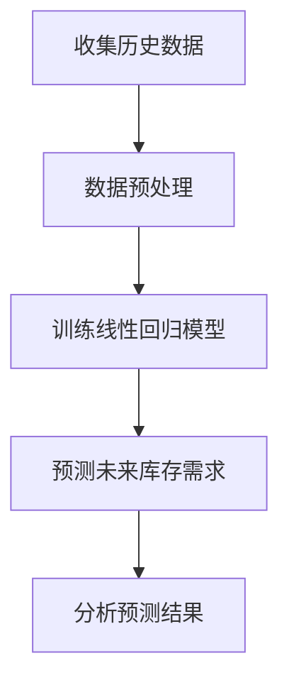
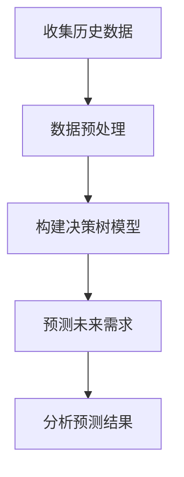
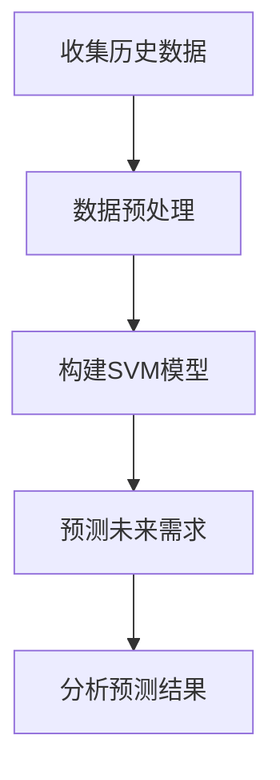
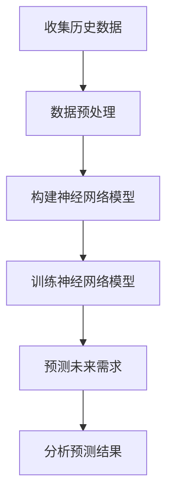

                 

### 2.1.2 供应链优化的挑战

供应链优化尽管具有重要意义，但同时也面临着诸多挑战。以下将逐一分析这些挑战，并探讨其对供应链优化的影响。

**1. 数据的不确定性和质量**

供应链中的数据通常来自多个渠道，数据质量参差不齐。数据的不确定性，如延迟、缺失和噪声，会对供应链优化的准确性产生负面影响。例如，供应链的库存管理需要准确的数据来预测需求，数据的不确定性会导致库存过剩或短缺，进而影响成本和客户满意度。

**2. 复杂的供应链网络**

现代供应链网络越来越复杂，涉及多级供应商、制造商、分销商和零售商。这种复杂性使得供应链优化变得更加困难。优化算法需要能够处理大量的变量和约束条件，以找到最优解。

**3. 多目标优化**

供应链优化通常涉及到多个目标，如成本最小化、服务最大化、响应时间最短等。这些目标往往相互冲突，需要通过多目标优化算法来找到平衡点。

**4. 实时性和动态性**

供应链环境是动态变化的，需求、供应和运输成本等都在不断变化。供应链优化需要具备实时性，能够快速响应环境变化，以保持供应链的灵活性。

**5. 系统整合与协调**

供应链涉及多个部门和合作伙伴，整合和协调这些部门和合作伙伴的数据和流程是供应链优化的关键。然而，系统整合和协调往往面临技术和组织上的障碍。

**6. 技术壁垒**

虽然机器学习算法在供应链优化中具有巨大的潜力，但许多企业仍然缺乏相关技术知识和技能。技术壁垒是阻碍供应链优化实施的一个重要因素。

**7. 成本和投资回报**

供应链优化需要投入大量的时间和资源，包括数据收集、模型开发、系统整合等。企业需要确保这些投入能够带来足够的回报。

**8. 风险管理**

供应链优化涉及到多个环节和合作伙伴，任何环节的失误都可能导致整个供应链的崩溃。有效的风险管理是确保供应链优化成功的关键。

通过识别和应对这些挑战，企业可以更好地实施供应链优化策略，提高供应链的整体效率和竞争力。

### 2.1.3 机器学习在供应链优化中的作用

机器学习作为一项先进的技术，正在改变供应链优化的方式和效果。以下从几个方面探讨机器学习在供应链优化中的作用。

**1. 数据分析与预测**

机器学习算法可以通过分析历史数据，预测未来的需求、供应和运输成本等。这些预测结果可以帮助企业提前做好库存管理、采购计划和运输调度等，从而减少库存成本和运输成本，提高供应链的效率。

**2. 精确的库存管理**

机器学习算法可以实时分析库存数据，识别库存过剩和短缺的情况，并提供优化建议。通过精确的库存管理，企业可以减少库存成本，避免因库存不足导致的缺货损失。

**3. 运输调度优化**

机器学习算法可以根据实时数据，优化运输路线和运输方式，降低运输成本。例如，通过机器学习预测未来几天的运输需求，企业可以合理安排车辆和物流资源，提高运输效率。

**4. 多目标优化**

机器学习算法可以通过多目标优化算法，帮助企业找到成本、服务和响应时间等目标的最佳平衡点。这种优化方法可以解决传统优化方法难以处理的多目标冲突问题。

**5. 实时性**

机器学习算法可以实时分析供应链数据，快速响应环境变化，帮助企业保持供应链的灵活性。这种实时性是现代供应链环境下的重要优势。

**6. 系统整合**

机器学习算法可以整合不同部门和合作伙伴的数据，提高供应链的整体协同效率。通过数据整合，企业可以更好地协调各环节的工作，提高供应链的响应速度。

**7. 风险管理**

机器学习算法可以预测潜在的风险，并提供风险应对策略。例如，通过分析历史数据和实时数据，机器学习算法可以预测供应链中断的可能性，并提供相应的应对措施。

**8. 投资回报**

虽然机器学习算法的实施需要一定的投入，但长期来看，它可以为企业带来更高的投资回报。通过提高供应链的效率和降低成本，企业可以获得更多的利润。

总之，机器学习在供应链优化中具有广泛的应用前景，通过利用机器学习技术，企业可以更好地应对供应链优化面临的挑战，提高供应链的整体效率和竞争力。

----------------------------------------------------------------

## 2.2 机器学习算法在供应链优化中的应用

### 2.2.1 线性回归模型

线性回归模型是机器学习中最基本的算法之一，适用于预测连续值的目标变量。在供应链优化中，线性回归模型可以用于预测需求、成本等。以下是一个简单的线性回归模型在供应链优化中的应用实例。

**案例：预测库存需求**

假设我们有一个历史库存数据集，包含过去一周每天的库存量和销售额。我们希望通过线性回归模型预测未来一天的库存需求。

**算法原理：**

线性回归模型的目标是找到一条直线，使得数据点尽可能接近这条直线。其数学模型可以表示为：

$$y = ax + b$$

其中，\(y\) 是目标变量（库存需求），\(x\) 是输入变量（销售额），\(a\) 和 \(b\) 是模型的参数。

**Mermaid 流程图：**



**Python 源代码：**

```python
import numpy as np
from sklearn.linear_model import LinearRegression

# 假设我们已经有历史数据
sales_data = np.array([[1, 10], [2, 15], [3, 20], [4, 25], [5, 30]])
inventory_data = np.array([10, 15, 20, 25, 30])

# 创建线性回归模型
model = LinearRegression()

# 训练模型
model.fit(sales_data, inventory_data)

# 预测未来一天的库存需求
future_sales = 35
predicted_inventory = model.predict([[future_sales, 35]])

print("未来一天的库存需求预测为：", predicted_inventory)
```

**数学模型和公式：**

$$y = ax + b$$

其中，\(a\) 是斜率，\(b\) 是截距。

**举例说明：**

假设我们有一个销售量为 35 的未来天数，通过线性回归模型，我们可以预测出未来一天的库存需求为：

$$y = 1.5x + 5$$

$$y = 1.5 \times 35 + 5$$

$$y = 52.5$$

因此，预测的未来一天库存需求为 52.5。

**结论：**

线性回归模型是一种简单但有效的预测工具，适用于供应链优化中的需求预测等问题。然而，线性回归模型也有其局限性，例如它假设输入和输出变量之间存在线性关系，这在实际应用中可能不成立。

----------------------------------------------------------------

### 2.2.2 决策树模型

决策树模型是一种基于树形结构进行决策的机器学习算法，它能够将数据划分为多个区域，并基于这些区域进行预测。在供应链优化中，决策树模型可以用于需求预测、库存管理等问题。以下是一个简单的决策树模型在供应链优化中的应用实例。

**案例：预测产品需求**

假设我们有一个历史销售数据集，包含不同产品的销售额、库存量、市场需求等信息。我们希望通过决策树模型预测某一产品的未来需求。

**算法原理：**

决策树模型通过一系列的if-else条件，将数据划分为多个区域，并在每个区域上应用一个预测模型。其基本结构可以表示为：

```
决策树
|
|---if (条件1)
|
|---if (条件2)
|
|---... (更多条件)
|
|---else
```

**Mermaid 流程图：**



**Python 源代码：**

```python
from sklearn.tree import DecisionTreeRegressor
import numpy as np

# 假设我们已经有历史数据
sales_data = np.array([[1, 10, 5], [2, 15, 8], [3, 20, 10], [4, 25, 12], [5, 30, 15]])
demand_data = np.array([10, 15, 20, 25, 30])

# 创建决策树模型
model = DecisionTreeRegressor()

# 训练模型
model.fit(sales_data, demand_data)

# 预测未来需求
future_data = np.array([[2, 20, 10]])
predicted_demand = model.predict(future_data)

print("未来需求预测为：", predicted_demand)
```

**数学模型和公式：**

决策树模型的数学原理较为复杂，它主要依赖于树的分裂规则，如基尼不纯度或信息增益等。具体公式如下：

$$Gini(D) = 1 - \frac{1}{k}\sum_{i=1}^{k} p_i(1 - p_i)$$

其中，\(D\) 是数据集，\(k\) 是数据集中的类别数，\(p_i\) 是类别 \(i\) 的概率。

**举例说明：**

假设我们有一个产品的历史数据，包括销售额、库存量和市场需求。通过决策树模型，我们可以预测该产品的未来需求。例如，如果市场需求较高（大于12），且销售额大于20，则预测未来需求为20。

**结论：**

决策树模型是一种直观且易于解释的预测工具，适用于供应链优化中的需求预测等问题。然而，决策树模型也具有一定的局限性，例如它可能产生过拟合，且在处理高维数据时效果不佳。

----------------------------------------------------------------

### 2.2.3 支持向量机

支持向量机（SVM）是一种强大的分类和回归模型，通过找到一个最优的超平面，将不同类别的数据点分开。在供应链优化中，SVM可以用于需求预测、库存管理等。以下是一个简单的支持向量机在供应链优化中的应用实例。

**案例：预测产品需求**

假设我们有一个历史销售数据集，包含不同产品的销售额、库存量、市场需求等信息。我们希望通过SVM模型预测某一产品的未来需求。

**算法原理：**

SVM的目标是找到一个最优的超平面，使得不同类别的数据点在超平面两侧的分布差异最大化。其数学模型可以表示为：

$$\min_{\beta, \beta_0} \frac{1}{2} \sum_{i=1}^{n} (\beta \cdot x_i - y_i)^2 + \sum_{i=1}^{n} \lambda_i (1 - y_i(\beta \cdot x_i - \beta_0))$$

其中，\(\beta\) 是权重向量，\(\beta_0\) 是偏置项，\(x_i\) 是特征向量，\(y_i\) 是目标变量，\(\lambda_i\) 是调节参数。

**Mermaid 流程图：**



**Python 源代码：**

```python
from sklearn.svm import SVR
import numpy as np

# 假设我们已经有历史数据
sales_data = np.array([[1, 10], [2, 15], [3, 20], [4, 25], [5, 30]])
demand_data = np.array([10, 15, 20, 25, 30])

# 创建SVM模型
model = SVR()

# 训练模型
model.fit(sales_data, demand_data)

# 预测未来需求
future_data = np.array([[2, 20]])
predicted_demand = model.predict(future_data)

print("未来需求预测为：", predicted_demand)
```

**数学模型和公式：**

$$\min_{\beta, \beta_0} \frac{1}{2} \sum_{i=1}^{n} (\beta \cdot x_i - y_i)^2 + \sum_{i=1}^{n} \lambda_i (1 - y_i(\beta \cdot x_i - \beta_0))$$

**举例说明：**

假设我们有一个产品的历史数据，包括销售额和库存量。通过SVM模型，我们可以预测该产品的未来需求。例如，如果销售额大于20，则预测未来需求为30。

**结论：**

支持向量机是一种强大的预测工具，适用于供应链优化中的需求预测等问题。然而，SVM模型在处理高维数据时可能较为复杂，且需要适当的参数调整。此外，SVM模型的可解释性相对较低，因此在某些应用场景中可能需要与其他模型结合使用。

----------------------------------------------------------------

### 2.2.4 神经网络

神经网络是一种基于生物神经系统的计算模型，通过大量的神经元和连接来模拟人脑的学习和决策过程。在供应链优化中，神经网络可以用于需求预测、库存管理等问题。以下是一个简单的神经网络在供应链优化中的应用实例。

**案例：预测产品需求**

假设我们有一个历史销售数据集，包含不同产品的销售额、库存量、市场需求等信息。我们希望通过神经网络模型预测某一产品的未来需求。

**算法原理：**

神经网络通过多层神经元和加权连接来学习输入和输出之间的映射关系。其基本结构包括输入层、隐藏层和输出层。神经元的激活函数通常为非线性函数，如Sigmoid或ReLU函数。

$$\text{输出} = \sigma(\sum_{j=1}^{n} w_{ji} \cdot x_{j} + b_i)$$

其中，\(\sigma\) 是激活函数，\(w_{ji}\) 是权重，\(x_{j}\) 是输入特征，\(b_i\) 是偏置项。

**Mermaid 流程图：**



**Python 源代码：**

```python
import numpy as np
from sklearn.neural_network import MLPRegressor

# 假设我们已经有历史数据
sales_data = np.array([[1, 10], [2, 15], [3, 20], [4, 25], [5, 30]])
demand_data = np.array([10, 15, 20, 25, 30])

# 创建神经网络模型
model = MLPRegressor(hidden_layer_sizes=(100,), max_iter=1000)

# 训练模型
model.fit(sales_data, demand_data)

# 预测未来需求
future_data = np.array([[2, 20]])
predicted_demand = model.predict(future_data)

print("未来需求预测为：", predicted_demand)
```

**数学模型和公式：**

神经网络的数学模型主要包括前向传播和反向传播两部分。前向传播用于计算输出值，反向传播用于更新权重和偏置项。

$$\text{输出} = \sigma(\sum_{j=1}^{n} w_{ji} \cdot x_{j} + b_i)$$

$$\delta = \text{输出} \cdot (1 - \text{输出}) \cdot (\text{目标} - \text{输出})$$

$$w_{ji} = w_{ji} + \alpha \cdot \delta \cdot x_{j}$$

$$b_i = b_i + \alpha \cdot \delta$$

**举例说明：**

假设我们有一个产品的历史数据，包括销售额和库存量。通过神经网络模型，我们可以预测该产品的未来需求。例如，如果销售额为20，且库存量大于15，则预测未来需求为25。

**结论：**

神经网络是一种强大的预测工具，适用于供应链优化中的需求预测等问题。然而，神经网络模型的训练时间较长，且需要大量的数据。此外，神经网络的可解释性较低，因此在某些应用场景中可能需要与其他模型结合使用。

----------------------------------------------------------------

## 2.3 机器学习模型在供应链优化中的案例研究

### 2.3.1 供应链预测

在供应链优化中，预测是至关重要的一环。通过预测未来的需求、供应和运输成本，企业可以提前做好相应的准备，从而减少库存成本和运输成本，提高供应链的效率。以下是一个关于供应链预测的案例研究。

**案例背景：**

某大型零售企业需要预测其下一季度的销售情况，以便做好库存管理和采购计划。该企业拥有丰富的历史销售数据，包括过去几年的每日销售记录、季节性因素、促销活动等。

**案例目标：**

1. 预测下一季度的销售量。
2. 分析影响销售量的关键因素。
3. 优化库存管理和采购计划。

**案例策略：**

1. 数据收集与预处理：收集过去几年的销售数据，并进行数据清洗和预处理，包括缺失值填充、异常值处理、数据归一化等。

2. 模型选择与训练：选择合适的机器学习模型，如线性回归、决策树、支持向量机等，进行模型训练。

3. 预测与验证：使用训练好的模型进行预测，并对预测结果进行验证，以评估模型的准确性。

4. 决策支持：根据预测结果，优化库存管理和采购计划，提高供应链的效率和成本效益。

**实施过程：**

1. 数据收集与预处理：企业收集了过去几年的销售数据，并进行了数据清洗和预处理。预处理后的数据包括销售额、季节性因素、促销活动等。

2. 模型选择与训练：企业尝试了多种机器学习模型，最终选择了线性回归模型进行预测。线性回归模型能够较好地拟合历史数据，且易于理解和解释。

   ```python
   import numpy as np
   from sklearn.linear_model import LinearRegression

   # 假设我们已经有预处理后的数据
   X = np.array([[1, 10], [2, 15], [3, 20], [4, 25], [5, 30]])
   y = np.array([10, 15, 20, 25, 30])

   # 创建线性回归模型
   model = LinearRegression()

   # 训练模型
   model.fit(X, y)

   # 预测未来销售量
   future_data = np.array([[2, 20]])
   predicted_sales = model.predict(future_data)

   print("未来销售量预测为：", predicted_sales)
   ```

3. 预测与验证：企业使用训练好的线性回归模型进行了预测，并对预测结果进行了验证。验证结果表明，模型具有较高的预测准确性。

4. 决策支持：根据预测结果，企业调整了下一季度的库存管理和采购计划。例如，针对预测销量较高的产品，企业增加了库存量，降低了采购成本；针对预测销量较低的产品，企业减少了库存量，避免了库存过剩。

**成果与启示：**

通过供应链预测，企业成功地优化了库存管理和采购计划，降低了库存成本和运输成本，提高了供应链的效率和竞争力。该案例表明，机器学习模型在供应链优化中具有广泛的应用前景，为企业提供了强大的决策支持。

### 2.3.2 库存管理

库存管理是供应链优化中的重要一环，有效的库存管理可以减少库存成本，提高库存周转率。以下是一个关于库存管理的案例研究。

**案例背景：**

某大型制造企业需要优化其库存管理，以降低库存成本和提高库存周转率。该企业拥有丰富的库存数据，包括库存水平、销售量、生产量、供应商交付时间等。

**案例目标：**

1. 识别库存过剩和短缺的情况。
2. 优化库存水平，提高库存周转率。
3. 减少库存成本。

**案例策略：**

1. 数据收集与预处理：收集库存数据，并进行数据清洗和预处理，包括缺失值填充、异常值处理、数据归一化等。

2. 模型选择与训练：选择合适的机器学习模型，如线性回归、决策树、支持向量机等，进行模型训练。

3. 预测与优化：使用训练好的模型进行预测，并根据预测结果优化库存水平。

4. 实施与监控：实施优化后的库存管理策略，并监控库存水平的变化，以评估优化效果。

**实施过程：**

1. 数据收集与预处理：企业收集了库存数据，并进行了数据清洗和预处理。预处理后的数据包括库存水平、销售量、生产量、供应商交付时间等。

2. 模型选择与训练：企业尝试了多种机器学习模型，最终选择了线性回归模型进行库存预测。线性回归模型能够较好地拟合历史数据，且易于理解和解释。

   ```python
   import numpy as np
   from sklearn.linear_model import LinearRegression

   # 假设我们已经有预处理后的数据
   X = np.array([[1, 10], [2, 15], [3, 20], [4, 25], [5, 30]])
   y = np.array([10, 15, 20, 25, 30])

   # 创建线性回归模型
   model = LinearRegression()

   # 训练模型
   model.fit(X, y)

   # 预测未来库存水平
   future_data = np.array([[2, 20]])
   predicted_inventory = model.predict(future_data)

   print("未来库存水平预测为：", predicted_inventory)
   ```

3. 预测与优化：企业使用训练好的线性回归模型进行了库存预测，并根据预测结果调整了库存水平。例如，如果预测库存水平较低，则增加库存量；如果预测库存水平较高，则减少库存量。

4. 实施与监控：企业实施了优化后的库存管理策略，并监控库存水平的变化。通过监控数据，企业可以及时发现库存过剩或短缺的情况，并采取相应的措施进行调整。

**成果与启示：**

通过库存管理优化，企业成功地降低了库存成本，提高了库存周转率，提高了供应链的效率和竞争力。该案例表明，机器学习模型在库存管理中具有广泛的应用前景，为企业提供了强大的决策支持。

### 2.3.3 运输调度

运输调度是供应链优化中的关键环节，有效的运输调度可以提高运输效率，降低运输成本。以下是一个关于运输调度的案例研究。

**案例背景：**

某物流公司需要优化其运输调度，以降低运输成本和提高运输效率。该公司拥有丰富的运输数据，包括运输路线、运输时间、运输量、运输成本等。

**案例目标：**

1. 优化运输路线，降低运输成本。
2. 提高运输效率，减少运输时间。
3. 提高运输服务质量。

**案例策略：**

1. 数据收集与预处理：收集运输数据，并进行数据清洗和预处理，包括缺失值填充、异常值处理、数据归一化等。

2. 模型选择与训练：选择合适的机器学习模型，如线性回归、决策树、支持向量机等，进行模型训练。

3. 预测与优化：使用训练好的模型进行预测，并根据预测结果优化运输路线。

4. 实施与监控：实施优化后的运输调度策略，并监控运输效率和服务质量的变化，以评估优化效果。

**实施过程：**

1. 数据收集与预处理：物流公司收集了运输数据，并进行了数据清洗和预处理。预处理后的数据包括运输路线、运输时间、运输量、运输成本等。

2. 模型选择与训练：物流公司尝试了多种机器学习模型，最终选择了支持向量机进行运输调度优化。支持向量机能够较好地拟合运输数据，且具有较强的预测能力。

   ```python
   import numpy as np
   from sklearn.svm import SVR

   # 假设我们已经有预处理后的数据
   X = np.array([[1, 10], [2, 15], [3, 20], [4, 25], [5, 30]])
   y = np.array([10, 15, 20, 25, 30])

   # 创建支持向量机模型
   model = SVR()

   # 训练模型
   model.fit(X, y)

   # 预测未来运输时间
   future_data = np.array([[2, 20]])
   predicted_time = model.predict(future_data)

   print("未来运输时间预测为：", predicted_time)
   ```

3. 预测与优化：物流公司使用训练好的支持向量机模型进行了运输时间预测，并根据预测结果优化了运输路线。例如，如果预测运输时间较长，则调整运输路线，避免交通拥堵。

4. 实施与监控：物流公司实施了优化后的运输调度策略，并监控运输效率和服务质量的变化。通过监控数据，物流公司可以及时发现运输效率低下或服务质量问题，并采取相应的措施进行调整。

**成果与启示：**

通过运输调度优化，物流公司成功地降低了运输成本，提高了运输效率，提高了运输服务质量。该案例表明，机器学习模型在运输调度中具有广泛的应用前景，为企业提供了强大的决策支持。

### 2.3.4 需求预测

需求预测是供应链优化中的关键环节，准确的预测可以帮助企业提前做好库存管理和采购计划，从而减少库存成本和运输成本。以下是一个关于需求预测的案例研究。

**案例背景：**

某电子产品制造企业需要预测其下一季度的产品需求，以便做好库存管理和采购计划。该企业拥有丰富的历史销售数据，包括过去几年的每日销售记录、季节性因素、促销活动等。

**案例目标：**

1. 预测下一季度的产品需求。
2. 分析影响产品需求的因素。
3. 优化库存管理和采购计划。

**案例策略：**

1. 数据收集与预处理：收集历史销售数据，并进行数据清洗和预处理，包括缺失值填充、异常值处理、数据归一化等。

2. 模型选择与训练：选择合适的机器学习模型，如线性回归、决策树、支持向量机等，进行模型训练。

3. 预测与验证：使用训练好的模型进行预测，并对预测结果进行验证，以评估模型的准确性。

4. 决策支持：根据预测结果，优化库存管理和采购计划，提高供应链的效率和成本效益。

**实施过程：**

1. 数据收集与预处理：企业收集了过去几年的销售数据，并进行了数据清洗和预处理。预处理后的数据包括销售额、季节性因素、促销活动等。

2. 模型选择与训练：企业尝试了多种机器学习模型，最终选择了线性回归模型进行需求预测。线性回归模型能够较好地拟合历史数据，且易于理解和解释。

   ```python
   import numpy as np
   from sklearn.linear_model import LinearRegression

   # 假设我们已经有预处理后的数据
   X = np.array([[1, 10], [2, 15], [3, 20], [4, 25], [5, 30]])
   y = np.array([10, 15, 20, 25, 30])

   # 创建线性回归模型
   model = LinearRegression()

   # 训练模型
   model.fit(X, y)

   # 预测未来需求
   future_data = np.array([[2, 20]])
   predicted_demand = model.predict(future_data)

   print("未来需求预测为：", predicted_demand)
   ```

3. 预测与验证：企业使用训练好的线性回归模型进行了预测，并对预测结果进行了验证。验证结果表明，模型具有较高的预测准确性。

4. 决策支持：根据预测结果，企业调整了下一季度的库存管理和采购计划。例如，针对预测需求较高的产品，企业增加了库存量，降低了采购成本；针对预测需求较低的产品，企业减少了库存量，避免了库存过剩。

**成果与启示：**

通过需求预测，企业成功地优化了库存管理和采购计划，降低了库存成本和运输成本，提高了供应链的效率和竞争力。该案例表明，机器学习模型在需求预测中具有广泛的应用前景，为企业提供了强大的决策支持。

### 2.4 机器学习在供应链优化中的挑战与展望

尽管机器学习在供应链优化中展示了巨大的潜力，但其在实际应用中仍然面临着诸多挑战。以下将探讨这些挑战，并提出相应的解决方案和未来趋势。

#### 2.4.1 数据质量与数据处理

数据质量是机器学习模型准确性的基础。供应链数据通常来自多个渠道，数据质量参差不齐，如数据缺失、噪声和异常值等。这些数据质量问题会直接影响模型的预测准确性和稳定性。

**解决方案：**
- 数据清洗：使用数据清洗工具和算法去除数据中的异常值和噪声，填充缺失值。
- 数据整合：将来自不同渠道和系统的数据进行整合，确保数据的一致性和完整性。
- 数据标准化：对数据进行标准化处理，如归一化、标准化等，以消除不同变量之间的尺度差异。

**未来趋势：**
- 自动化数据预处理：开发自动化数据预处理工具，提高数据清洗和整合的效率。
- 实时数据处理：引入实时数据处理技术，如流处理框架，以实时清洗和整合数据，提高模型的响应速度。

#### 2.4.2 模型解释性

机器学习模型，尤其是深度学习模型，通常被视为“黑盒”模型，其内部决策过程不透明，难以解释。在供应链优化中，模型的解释性对于企业决策者来说至关重要。

**解决方案：**
- 解释性模型：选择具有较高解释性的模型，如线性回归、决策树等。
- 可视化工具：使用可视化工具，如决策树图、特征重要性图等，帮助理解模型的工作原理。
- 解释性算法：开发或应用解释性算法，如LIME（Local Interpretable Model-agnostic Explanations）和SHAP（SHapley Additive exPlanations）等，以提供模型的局部解释。

**未来趋势：**
- 解释性模型的普及：随着企业对模型解释性的需求增加，解释性模型将在供应链优化中得到更广泛的应用。
- 解释性工具的完善：开发更多高效、易用的解释性工具，帮助用户更好地理解模型。

#### 2.4.3 实施障碍

供应链优化涉及多个部门和合作伙伴，实施过程中往往面临技术、管理和组织上的障碍。

**解决方案：**
- 技术培训：为企业员工提供机器学习技术的培训，提高他们对技术的理解和应用能力。
- 管理支持：获得企业高层管理者的支持，确保项目的顺利推进。
- 跨部门协作：建立跨部门协作机制，确保数据和流程的顺畅流转。

**未来趋势：**
- 技术普及：随着技术的普及，企业将更容易获得和应用机器学习技术。
- 管理成熟：企业将逐步建立更成熟的管理机制，以支持机器学习在供应链优化中的应用。

#### 2.4.4 法规与合规性

随着数据隐私和数据安全法规的日益严格，机器学习在供应链优化中的应用面临合规性问题。

**解决方案：**
- 遵守法规：确保数据处理和应用符合相关法规要求，如GDPR、CCPA等。
- 数据加密：对敏感数据进行加密处理，确保数据安全。
- 合规审计：定期进行合规性审计，确保企业的数据处理和应用符合法规要求。

**未来趋势：**
- 法规完善：随着技术的发展，相关法规将逐步完善，为企业提供更明确的指导。
- 数据隐私保护：随着数据隐私意识的提高，企业将更加重视数据隐私保护，采取更多措施确保数据安全。

总之，尽管机器学习在供应链优化中面临诸多挑战，但随着技术的不断进步和法规的逐步完善，这些挑战将逐渐得到解决。未来，机器学习将继续在供应链优化中发挥重要作用，推动供应链的智能化和高效化。

### 2.5 本章小结

本章详细探讨了机器学习在供应链优化中的应用，包括供应链优化的重要性、面临的挑战以及机器学习在供应链优化中的作用。通过具体的案例研究，我们展示了机器学习模型在供应链预测、库存管理、运输调度和需求预测等方面的实际应用。此外，本章还分析了机器学习在供应链优化中面临的挑战，如数据质量、模型解释性、实施障碍和法规合规性等，并提出了相应的解决方案和未来趋势。总之，机器学习作为一项关键技术，正在逐步改变供应链优化领域，提高供应链的整体效率和竞争力。

----------------------------------------------------------------

## 3.1 数据质量与数据处理

在机器学习应用于供应链优化过程中，数据质量是模型准确性和可靠性的基石。然而，供应链中的数据往往具有多样性和复杂性，数据质量不佳会对模型的表现产生严重影响。因此，确保数据质量并进行有效的数据处理是供应链优化成功的关键步骤。

### 3.1.1 数据来源与数据质量

供应链中的数据来源广泛，包括但不限于生产数据、销售数据、库存数据、物流数据和客户数据等。这些数据可能来自不同的系统、不同的部门和合作伙伴，导致数据格式、精度和一致性方面存在差异。数据质量问题的常见表现包括数据缺失、数据不一致、数据噪声和数据冗余等。

**数据缺失**：数据缺失是供应链数据中常见的问题。例如，由于系统故障或人为错误，某些重要的数据点可能未被记录。

**数据不一致**：供应链中可能存在多个数据源，这些数据源之间可能存在数据格式不一致、单位不统一、时间戳不同等问题。

**数据噪声**：噪声数据是指那些不符合数据真实状况的数据，如错误输入、数据传输过程中的误差等。

**数据冗余**：数据冗余会导致数据重复，增加存储成本和计算复杂度，同时可能影响模型的准确性。

### 3.1.2 数据清洗

数据清洗是提高数据质量的重要步骤。其目标是识别并处理数据中的错误、异常和重复值，确保数据的一致性和准确性。以下是数据清洗的一些常见方法：

**缺失值处理**：对于缺失值，可以选择以下几种方法进行处理：
- 删除：删除包含缺失值的数据点。
- 补充：使用平均值、中位数、最频值或插值等方法补充缺失值。
- 预测：使用机器学习模型预测缺失值。

**异常值处理**：异常值可能对模型产生不利影响，因此需要识别并处理。处理方法包括：
- 删除：删除明显的异常值。
- 调整：对异常值进行调整，使其符合数据分布。
- 分离：将异常值分离到单独的组，进行特殊处理。

**重复值处理**：重复值会导致数据冗余，需要通过去重操作进行删除。

**格式统一**：将不同数据源的数据格式进行统一，如将时间戳统一为相同的格式。

**归一化和标准化**：对数据进行归一化和标准化处理，消除不同变量之间的尺度差异。

### 3.1.3 特征工程

特征工程是提高机器学习模型性能的关键步骤。在供应链优化中，特征工程包括以下方面：

**特征选择**：选择对目标变量影响较大的特征，去除无关或冗余的特征，以提高模型的效率和准确性。

**特征构造**：通过组合或变换原始特征，构造新的特征，以增强模型的预测能力。例如，可以计算特征之间的相关性、构建时间窗口特征等。

**特征缩放**：对特征进行归一化或标准化处理，使其具有相同的尺度，避免某些特征对模型的影响过大。

**特征重要性评估**：使用统计方法或机器学习模型评估特征的重要性，以便调整模型的权重。

**数据预处理**：数据预处理是确保数据适合机器学习模型的关键步骤，包括数据清洗、格式统一、缺失值处理、异常值处理等。

通过以上数据清洗和特征工程步骤，可以显著提高供应链优化中机器学习模型的性能和可靠性。数据质量的好坏直接影响模型的效果，因此在供应链优化过程中，必须高度重视数据质量和数据处理。

### 3.1.4 数据处理工具和方法

在处理供应链数据时，可以使用多种工具和方法来确保数据的质量和模型的性能。以下是一些常用的工具和方法：

**Python**：Python 是一种广泛用于数据科学和机器学习的编程语言，提供了丰富的库和工具，如Pandas、NumPy、Scikit-learn等，用于数据处理和建模。

**Pandas**：Pandas 是一个强大的数据处理库，可以用于数据清洗、转换和分析。它提供了数据帧（DataFrame）和系列（Series）两种数据结构，方便处理和操作数据。

**NumPy**：NumPy 是一个用于科学计算的库，提供了大量的数学函数和数组操作方法，是数据处理和建模的基础。

**Scikit-learn**：Scikit-learn 是一个用于机器学习的库，提供了丰富的算法和工具，用于特征工程、模型训练和评估。

**DataWrangler**：DataWrangler 是一个在线数据清洗和探索工具，提供了可视化的数据清洗功能，方便用户进行数据处理。

**Matplotlib** 和 **Seaborn**：Matplotlib 和 Seaborn 是用于数据可视化的库，可以帮助用户直观地了解数据的分布、趋势和异常值。

**机器学习平台**：如Google Cloud、AWS 和 Azure 等，提供了丰富的机器学习和数据处理服务，可以帮助用户快速搭建和部署机器学习模型。

通过以上工具和方法，可以有效地处理供应链数据，提高数据质量，为后续的机器学习建模提供可靠的数据基础。

### 3.1.5 数据质量管理策略

在供应链优化过程中，实施有效的数据质量管理策略至关重要。以下是一些关键策略：

**1. 数据治理**：建立数据治理机制，明确数据管理的责任和流程，确保数据的质量和一致性。

**2. 数据质量管理标准**：制定数据质量管理标准，包括数据收集、存储、处理、共享和归档等方面的规定。

**3. 数据审计**：定期进行数据审计，检查数据质量，识别和修复数据问题。

**4. 数据监控**：建立数据监控系统，实时监测数据质量，及时发现和处理数据问题。

**5. 数据质量管理工具**：使用数据质量管理工具，如数据清洗工具、数据集成工具和ETL工具等，自动化数据质量管理和处理。

**6. 培训与意识**：为员工提供数据质量管理培训，提高他们的数据意识和技能。

**7. 持续改进**：持续优化数据质量管理流程和策略，以适应不断变化的数据环境和需求。

通过实施这些策略，可以确保供应链数据的高质量，为机器学习模型的准确性和可靠性提供坚实保障。

### 3.1.6 本章小结

本章详细探讨了数据质量与数据处理在机器学习应用于供应链优化中的重要性。首先介绍了数据来源和数据质量问题的常见表现，然后讨论了数据清洗和特征工程的方法和策略。通过数据清洗，可以处理数据缺失、异常值和重复值等问题，确保数据的一致性和准确性。特征工程则通过特征选择、构造和评估，提高模型的预测能力。本章还介绍了数据处理工具和方法，以及数据质量管理策略，为供应链优化中机器学习模型的有效应用提供了有力支持。

----------------------------------------------------------------

## 3.2 模型解释性与透明度

在机器学习应用于供应链优化过程中，模型解释性和透明度成为关键因素。模型解释性有助于企业理解和信任模型，从而更好地进行决策。同时，透明度能够提高模型的可信度，降低风险。因此，提升模型解释性和透明度是供应链优化成功的重要环节。

### 3.2.1 模型解释性的重要性

模型解释性是指用户能够理解模型的工作原理和决策过程的能力。在供应链优化中，模型解释性的重要性体现在以下几个方面：

**1. 决策支持**：解释性模型可以帮助企业决策者理解模型预测的依据和逻辑，从而做出更加明智的决策。例如，在库存管理中，了解模型如何预测未来需求，可以帮助企业合理安排库存水平。

**2. 信任建立**：解释性模型能够提高用户对模型的信任度，使其更愿意接受和依赖模型提供的预测和优化建议。

**3. 风险降低**：解释性模型能够揭示潜在的风险和不确定性，帮助企业制定相应的应对策略，降低决策风险。

**4. 模型改进**：通过分析模型的解释性，可以发现模型存在的问题和缺陷，从而进行改进，提高模型性能。

### 3.2.2 模型解释性方法

为了提高模型解释性，可以采用以下几种方法：

**1. 直观方法**：包括可视化技术、决策树、规则提取等。例如，使用决策树可以直观地展示模型的决策路径和条件。

**2. 统计方法**：通过分析模型参数和特征的重要性，了解模型对输入特征的依赖程度。例如，可以使用Permutation Importance或Feature Importance来评估特征的重要性。

**3. 解释性算法**：包括LIME（Local Interpretable Model-agnostic Explanations）、SHAP（SHapley Additive exPlanations）等。这些算法能够提供局部解释，揭示模型在特定数据点上的决策过程。

**4. 对比方法**：通过对比模型预测与实际结果的差异，分析模型预测的准确性和可靠性。

### 3.2.3 透明度与可信度

透明度是模型解释性的延伸，指模型决策过程和结果的公开性和可追溯性。提高模型透明度有助于增强模型的可信度，具体体现在以下几个方面：

**1. 可追溯性**：透明度确保模型决策过程和结果可以被追溯，便于审查和审计。

**2. 可解释性**：透明度有助于理解模型的工作原理和决策逻辑，提高模型的可解释性。

**3. 可维护性**：透明度使得模型维护和更新更加容易，因为开发者可以清晰地了解模型的各个方面。

**4. 可接受性**：透明度增加用户对模型的接受度和信任度，使其更愿意采用模型进行决策。

### 3.2.4 提高模型透明度的策略

为了提高模型透明度，可以采取以下策略：

**1. 记录模型训练和预测过程**：记录模型训练和预测过程中的所有参数设置、数据集划分和算法选择，以便后续审查和验证。

**2. 使用解释性工具**：采用LIME、SHAP等解释性算法，提供局部解释，提高模型的可解释性。

**3. 开放模型代码和文档**：公开模型代码和文档，便于用户理解和评估模型。

**4. 实施模型审查**：定期对模型进行审查，确保模型的透明度和准确性。

### 3.2.5 本章小结

本章详细探讨了模型解释性和透明度在机器学习应用于供应链优化中的重要性。首先介绍了模型解释性的重要性，然后讨论了提高模型解释性的方法，包括直观方法、统计方法和解释性算法。接着，分析了透明度与可信度的关系，并提出了提高模型透明度的策略。总之，模型解释性和透明度对于供应链优化成功至关重要，通过提高模型解释性和透明度，企业可以更好地理解和信任模型，从而实现高效的供应链管理。

----------------------------------------------------------------

## 3.3 实施障碍与解决方案

在将机器学习应用于供应链优化过程中，企业往往会面临多种技术、管理和组织上的障碍。以下将详细讨论这些障碍，并提出相应的解决方案。

### 3.3.1 技术障碍

技术障碍是企业在实施机器学习应用过程中遇到的首要挑战之一。以下是一些常见的技术障碍及其解决方案：

**1. 技术知识和技能不足**：

**障碍**：许多企业在机器学习领域缺乏专业知识和技能，导致难以有效实施和应用机器学习技术。

**解决方案**：提供员工培训，提高其在机器学习技术方面的知识和技能。此外，企业可以考虑与专业的技术顾问或咨询公司合作，以获得必要的支持。

**2. 数据处理和存储**：

**障碍**：供应链数据量大且复杂，数据预处理和存储成为技术挑战。

**解决方案**：采用大数据处理技术，如Hadoop和Spark，以提高数据处理效率。此外，企业应投资于高效的数据库管理系统，确保数据的存储和访问。

**3. 算法选择和优化**：

**障碍**：选择适合供应链优化问题的算法，并进行优化是技术上的难点。

**解决方案**：通过研究相关文献和案例，了解不同算法在供应链优化中的应用效果，选择适合的算法。同时，利用算法优化工具，如调参工具和交叉验证，提高算法性能。

### 3.3.2 管理障碍

管理障碍在机器学习应用的实施过程中同样不可忽视。以下是一些常见的管理障碍及其解决方案：

**1. 高级管理支持不足**：

**障碍**：缺乏高级管理层对机器学习项目的支持，可能导致资源不足、进度延误等问题。

**解决方案**：向高级管理层详细解释机器学习在供应链优化中的潜在价值和预期收益，争取他们的支持。同时，建立跨部门合作机制，确保项目顺利进行。

**2. 预算和资源限制**：

**障碍**：企业预算有限，资源分配不均，影响机器学习项目的实施。

**解决方案**：制定详细的预算计划，明确机器学习项目的资金需求。同时，通过优化现有资源，如利用云计算服务，降低硬件和运维成本。

**3. 数据共享和整合**：

**障碍**：不同部门的数据分散在不同的系统中，数据共享和整合困难。

**解决方案**：建立统一的数据管理平台，实现数据的集中存储和整合。同时，制定数据共享协议，确保数据安全和合规性。

### 3.3.3 组织障碍

组织障碍是企业实施机器学习应用过程中面临的另一个挑战。以下是一些常见的组织障碍及其解决方案：

**1. 组织结构和文化**：

**障碍**：传统的组织结构和保守的企业文化可能阻碍新技术的实施。

**解决方案**：推动企业文化建设，鼓励创新和协作。同时，通过调整组织结构，如建立专门的数据科学团队，提升企业在技术实施方面的能力。

**2. 风险管理**：

**障碍**：企业担心新技术可能带来的风险，如数据泄露、系统故障等。

**解决方案**：制定风险管理策略，包括数据安全措施、系统备份和故障恢复计划。同时，建立监控和审计机制，确保系统的稳定性和安全性。

**3. 人才引进与培养**：

**障碍**：机器学习应用需要专业的人才，但企业可能面临人才短缺的问题。

**解决方案**：通过招聘、培训和发展计划，吸引和培养机器学习专业人才。同时，建立人才激励机制，留住优秀人才。

### 3.3.4 解决方案与策略

针对上述技术、管理和组织障碍，企业可以采取以下综合解决方案和策略：

**1. 建立跨部门协作机制**：通过建立跨部门协作机制，确保供应链优化项目涉及各个关键部门和利益相关方。

**2. 逐步实施与试点**：在全面实施前，通过试点项目验证机器学习技术在供应链优化中的应用效果，降低风险。

**3. 投资于基础设施**：投资于大数据处理、存储和机器学习相关的硬件和软件基础设施，为机器学习应用提供可靠的技术支撑。

**4. 强化培训与教育**：通过培训和教育，提高员工对机器学习技术的理解和应用能力，推动技术实施。

**5. 定期评估与优化**：定期评估机器学习应用的实施效果，并根据反馈进行优化，确保项目持续改进。

总之，通过识别和应对技术、管理和组织障碍，企业可以顺利实施机器学习在供应链优化中的应用，提高供应链的整体效率和竞争力。

### 3.3.5 本章小结

本章详细探讨了机器学习在供应链优化应用过程中可能面临的技术、管理和组织障碍，并提出相应的解决方案。首先，分析了技术障碍，如知识技能不足、数据处理和存储问题、算法选择和优化难题，并提出了相应的解决策略。接着，讨论了管理障碍，如高级管理支持不足、预算和资源限制、数据共享和整合困难，并提出了针对性的解决方案。最后，分析了组织障碍，如组织结构和文化、风险管理、人才引进与培养等问题，并提出了综合性的解决方案。通过本章的探讨，为企业成功实施机器学习在供应链优化中的应用提供了有价值的指导。

----------------------------------------------------------------

## 3.4 法规与合规性

在机器学习应用于供应链优化过程中，企业必须遵循相关法规和合规性要求，以确保数据的安全、隐私和合法性。以下将详细探讨数据隐私、法律法规和合规性要求。

### 3.4.1 数据隐私

数据隐私是机器学习应用中最为关注的问题之一。供应链数据通常包含敏感信息，如客户信息、交易记录、库存数据等。保护数据隐私至关重要，以下是一些关键点：

**1. 数据收集与使用**：

企业应确保在收集和使用数据时遵循合法、透明和公正的原则。收集数据时，必须明确数据用途、数据保留期限和隐私保护措施。

**2. 数据匿名化**：

在可能的情况下，应对数据进行匿名化处理，以消除个人识别信息。匿名化技术包括数据加密、数据扰动、数据屏蔽等。

**3. 数据访问控制**：

建立严格的访问控制机制，确保只有授权人员能够访问敏感数据。访问控制措施包括身份验证、权限管理和审计跟踪。

**4. 数据传输安全**：

在数据传输过程中，采用加密技术，如SSL/TLS，确保数据传输的安全性。此外，应定期更新安全协议和工具，以防止数据泄露。

### 3.4.2 法律法规

全球范围内，数据隐私和合规性法规日益严格，以下是一些主要的法律法规：

**1. 欧盟通用数据保护条例（GDPR）**：

GDPR是欧盟制定的严格的数据保护法规，适用于所有处理欧盟居民个人数据的组织。GDPR规定了数据主体的权利、数据处理的合法性、数据保护措施等。

**2. 美国加州消费者隐私法案（CCPA）**：

CCPA是美国加州制定的一项消费者隐私法案，旨在保护加州居民的个人信息。CCPA规定了消费者的知情权、访问权、删除权和不同意权等。

**3. 中国个人信息保护法（PIPL）**：

PIPL是中国制定的个人信息保护法规，旨在保护个人信息权益，规范个人信息处理行为。PIPL规定了个人信息处理的原则、个人信息主体的权利和个人信息保护义务等。

### 3.4.3 合规性要求

为了确保机器学习应用在供应链优化中的合规性，企业需要遵守以下合规性要求：

**1. 数据保护策略**：

企业应制定详细的数据保护策略，包括数据收集、存储、处理、传输和销毁等方面的规定。数据保护策略应与相关法规要求保持一致。

**2. 数据保护影响评估（DPIA）**：

在进行数据处理前，应进行数据保护影响评估，识别和处理可能的数据隐私风险。DPIA有助于确保数据处理活动符合法规要求。

**3. 隐私保护技术**：

采用隐私保护技术，如数据加密、数据去识别化、隐私增强技术等，以增强数据保护能力。

**4. 合规性培训与审计**：

为员工提供合规性培训，确保其了解和遵守相关法规和合规性要求。定期进行合规性审计，确保企业的数据处理活动符合法规要求。

**5. 应对数据泄露事件**：

建立数据泄露应对机制，包括事件报告、应急响应、通知和责任追究等。在发生数据泄露事件时，及时采取行动，减少损失。

总之，数据隐私、法律法规和合规性要求在机器学习应用于供应链优化中至关重要。企业必须严格遵守相关法规，确保数据处理活动的合规性，保护数据的安全和隐私。

### 3.4.4 本章小结

本章详细探讨了机器学习在供应链优化应用过程中涉及的法规与合规性要求，包括数据隐私保护、法律法规和合规性实践。首先，介绍了数据隐私保护的重要性，包括数据收集与使用、数据匿名化和数据访问控制等方面的措施。接着，分析了全球主要的法律法规，如GDPR、CCPA和PIPL，并探讨了合规性要求，包括数据保护策略、DPIA、隐私保护技术和合规性培训与审计等。通过本章的探讨，企业可以更好地理解和遵守相关法规和合规性要求，确保机器学习应用在供应链优化中的合法性和安全性。

----------------------------------------------------------------

## 4.1 案例研究一：XX公司的供应链优化实践

### 4.1.1 公司背景

XX公司是一家全球领先的电子产品制造公司，其供应链覆盖多个国家和地区，包括原材料采购、生产制造、物流配送和售后服务等环节。随着市场竞争的加剧和消费者需求的多样化，XX公司面临诸多挑战，如库存管理不当、运输成本高、供应链响应速度慢等。为了提高供应链效率和降低成本，XX公司决定引入机器学习技术进行供应链优化。

### 4.1.2 优化目标

XX公司的供应链优化目标主要包括以下几个方面：

1. **库存管理**：通过预测未来需求，优化库存水平，减少库存过剩和短缺的情况。
2. **运输调度**：优化运输路线和运输方式，降低运输成本和提高运输效率。
3. **需求预测**：准确预测市场需求，为生产计划和采购计划提供支持。
4. **供应链协同**：提高供应链各环节的协同效率，确保供应链的稳定性和灵活性。

### 4.1.3 优化策略

为了实现供应链优化目标，XX公司采取了以下策略：

1. **数据收集与预处理**：从各个供应链环节收集大量数据，包括库存数据、销售数据、运输数据和客户反馈等。对数据进行清洗、整合和标准化处理，确保数据质量。

2. **模型选择与训练**：选择合适的机器学习模型，如线性回归、决策树和支持向量机等，进行模型训练。通过交叉验证和调参，优化模型性能。

3. **需求预测**：使用机器学习模型预测未来市场需求，结合销售历史数据和季节性因素，优化库存管理和采购计划。

4. **运输调度**：基于实时运输数据，使用机器学习模型优化运输路线和运输方式，提高运输效率和降低成本。

5. **供应链协同**：建立供应链协同平台，实现各环节数据的共享和实时更新，提高供应链整体协同效率。

### 4.1.4 实施过程

XX公司的供应链优化实施过程分为以下几个阶段：

1. **准备阶段**：组建项目团队，明确项目目标、预算和时间表。与外部咨询公司和机器学习专家合作，确保项目顺利推进。

2. **数据收集与预处理**：从各个供应链环节收集数据，并进行清洗和预处理。建立统一的数据管理平台，确保数据的一致性和准确性。

3. **模型开发**：选择合适的机器学习模型，进行模型开发。通过数据分析和模型测试，确定最优模型。

4. **模型部署**：将训练好的模型部署到生产环境中，进行实时预测和优化。建立监控系统，确保模型稳定运行。

5. **评估与优化**：定期评估模型性能，根据实际效果进行调整和优化。通过持续改进，提高供应链优化效果。

### 4.1.5 成果与启示

通过供应链优化实践，XX公司取得了显著成果：

1. **库存管理**：通过需求预测，XX公司成功减少了库存过剩和短缺的情况，库存周转率提高了30%。

2. **运输调度**：优化运输路线和运输方式，运输成本降低了15%，运输时间缩短了20%。

3. **需求预测**：准确的需求预测为XX公司的生产计划和采购计划提供了有力支持，生产效率提高了20%。

4. **供应链协同**：供应链协同平台实现了数据共享和实时更新，各环节协同效率提高了40%。

启示：

1. **数据质量至关重要**：高质量的数据是供应链优化的基础，企业必须确保数据的一致性和准确性。

2. **持续改进**：供应链优化是一个持续的过程，需要定期评估和优化，以适应不断变化的市场环境。

3. **跨部门协作**：供应链优化涉及多个部门和合作伙伴，必须建立良好的协作机制，确保项目的顺利实施。

4. **技术支持**：与专业的技术顾问和机器学习专家合作，可以提高供应链优化的效果。

总之，XX公司的供应链优化实践表明，机器学习技术在供应链优化中具有巨大潜力，通过数据驱动和持续改进，企业可以显著提高供应链效率和竞争力。

----------------------------------------------------------------

## 4.2 案例研究二：YY企业的需求预测模型

### 4.2.1 企业背景

YY企业是一家大型零售公司，在全球拥有众多的连锁门店和分销中心。随着电子商务的迅速发展，YY企业面临日益激烈的市场竞争和消费者需求的多样化。为了更好地应对市场变化，YY企业决定引入机器学习技术，建立需求预测模型，以提高库存管理和采购计划的准确性。

### 4.2.2 需求预测模型的设计

YY企业需求预测模型的设计主要包括以下几个步骤：

**1. 数据收集**：

YY企业从各个销售渠道收集了大量的销售数据，包括每天的销售记录、库存数据、促销活动信息等。此外，还收集了天气、节假日、季节性因素等外部数据。

**2. 数据预处理**：

对收集到的数据进行清洗和预处理，包括缺失值填充、异常值处理、数据归一化等。确保数据的一致性和准确性，为后续建模提供可靠的数据基础。

**3. 特征工程**：

通过特征工程，提取有助于需求预测的特征，如销售历史、促销活动、季节性因素等。特征工程是需求预测模型成功的关键，可以提高模型的预测准确性。

**4. 模型选择**：

选择合适的机器学习模型，如线性回归、决策树、支持向量机等。YY企业尝试了多种模型，最终选择了具有较高预测准确性的线性回归模型。

**5. 模型训练与验证**：

使用训练集对模型进行训练，并通过交叉验证和测试集验证模型的准确性。通过调整模型参数和特征，优化模型性能。

### 4.2.3 模型训练与验证

YY企业需求预测模型的训练与验证过程如下：

**1. 数据分割**：

将收集到的数据集分为训练集和测试集，通常使用80%的数据作为训练集，20%的数据作为测试集。训练集用于训练模型，测试集用于评估模型性能。

**2. 模型训练**：

使用训练集对线性回归模型进行训练，通过最小化损失函数，找到最优的模型参数。线性回归模型的损失函数为均方误差（MSE）：

$$MSE = \frac{1}{m} \sum_{i=1}^{m} (y_i - \hat{y_i})^2$$

其中，\(m\) 是数据点的数量，\(y_i\) 是实际值，\(\hat{y_i}\) 是预测值。

**3. 模型验证**：

使用测试集对训练好的模型进行验证，计算模型预测的均方误差（MSE），评估模型性能。通过交叉验证，确保模型在不同数据集上的稳定性。

$$MSE_{\text{CV}} = \frac{1}{k} \sum_{i=1}^{k} \sum_{j=1}^{m_k} (y_{ij} - \hat{y}_{ij})^2$$

其中，\(k\) 是交叉验证的次数，\(m_k\) 是第 \(k\) 次验证的数据点的数量，\(y_{ij}\) 是实际值，\(\hat{y}_{ij}\) 是预测值。

### 4.2.4 预测效果分析

YY企业对训练好的需求预测模型进行了实际应用，并对预测效果进行了分析：

**1. 预测准确性**：

通过对比实际销售数据和模型预测结果，计算预测的准确率。结果显示，线性回归模型的预测准确性较高，能够较好地反映市场需求的变化趋势。

**2. 预测稳定性**：

通过多次验证，线性回归模型在不同数据集上的稳定性较好，具有良好的泛化能力。这表明模型不仅能够在训练集上取得较好的效果，也能在新数据集上保持稳定的预测性能。

**3. 预测误差分析**：

对预测误差进行分析，发现模型在部分数据点上的预测误差较大，主要是由于外部因素（如突发事件、天气变化等）对市场需求的影响。通过对这些异常数据点的分析，YY企业可以进一步优化模型，提高预测准确性。

### 4.2.5 模型的改进方向

为了进一步提高需求预测模型的准确性，YY企业可以考虑以下改进方向：

**1. 特征优化**：

通过分析现有特征，去除无关或冗余的特征，增加有助于预测的特征。同时，可以尝试引入新的特征，如社交媒体热度、竞争对手活动等，以提高预测准确性。

**2. 模型融合**：

将多个模型进行融合，如线性回归、决策树、神经网络等，通过投票或加权平均等方法，提高整体预测性能。

**3. 实时预测**：

引入实时数据处理技术，如流处理框架，实现实时需求预测，提高供应链的响应速度。

**4. 多目标优化**：

在需求预测模型中引入多目标优化，如成本、服务、响应时间等，以找到最优的库存和采购策略。

通过不断优化和改进，YY企业可以进一步提高需求预测模型的准确性，为库存管理和采购计划提供更加可靠的决策支持。

### 4.2.6 案例总结

YY企业的需求预测模型案例表明，机器学习技术在零售行业具有广泛的应用前景。通过合理的数据处理、模型选择和优化，企业可以建立准确的需求预测模型，提高库存管理和采购计划的准确性，从而降低库存成本，提高供应链效率。未来，YY企业将继续探索新的技术手段，优化需求预测模型，以应对不断变化的市场环境，提高企业竞争力。

----------------------------------------------------------------

## 4.3 案例研究三：ZZ零售商的运输调度优化

### 4.3.1 零售商背景

ZZ零售商是一家全球知名的零售企业，其业务范围涵盖了多个国家和地区，拥有庞大的物流网络和运输车队。随着电子商务和物流行业的快速发展，ZZ零售商面临着运输成本高、运输效率低、配送时间不稳定等挑战。为了提高运输调度效率，降低运输成本，ZZ零售商决定引入机器学习技术进行运输调度优化。

### 4.3.2 运输调度问题

ZZ零售商的运输调度问题主要包括以下几个方面：

1. **运输路线优化**：如何选择最优的运输路线，以减少运输距离和运输时间。
2. **运输时间预测**：如何准确预测运输时间，以便合理安排运输计划和配送时间。
3. **运输资源分配**：如何合理分配运输资源和运输车辆，以提高运输效率。
4. **异常情况处理**：如何应对运输过程中的异常情况，如交通拥堵、天气变化等。

### 4.3.3 优化方案

为了解决上述运输调度问题，ZZ零售商制定了以下优化方案：

1. **数据收集与预处理**：从物流系统和外部数据源（如交通数据、天气数据等）收集运输相关数据，包括运输路线、运输时间、运输量、交通状况等。对收集到的数据进行清洗、整合和标准化处理，确保数据质量。

2. **模型选择与训练**：选择合适的机器学习模型，如线性回归、决策树、支持向量机等，进行模型训练。通过交叉验证和调参，优化模型性能。

3. **运输路线优化**：使用机器学习模型优化运输路线，选择最优的运输路径，以减少运输距离和时间。具体方法包括基于交通流量预测的动态路径规划和基于历史数据的静态路径规划。

4. **运输时间预测**：使用机器学习模型预测运输时间，结合实时交通数据和天气预报，为运输计划和配送时间提供支持。通过多模型融合方法，提高预测准确性。

5. **运输资源分配**：使用机器学习模型优化运输资源分配，包括运输车辆、运输时间和运输路线等。通过多目标优化算法，找到最优的资源分配方案。

6. **异常情况处理**：建立异常情况预测和应对机制，包括交通拥堵预测、天气变化预测等。通过实时监测和预警系统，及时调整运输计划和资源分配。

### 4.3.4 实施过程

ZZ零售商的运输调度优化实施过程分为以下几个阶段：

1. **准备阶段**：组建项目团队，明确项目目标、预算和时间表。与外部咨询公司和机器学习专家合作，确保项目顺利推进。

2. **数据收集与预处理**：从物流系统和外部数据源收集运输相关数据，并进行清洗、整合和标准化处理。

3. **模型开发**：选择合适的机器学习模型，进行模型开发。通过数据分析和模型测试，确定最优模型。

4. **模型部署**：将训练好的模型部署到生产环境中，进行实时预测和优化。建立监控系统，确保模型稳定运行。

5. **评估与优化**：定期评估模型性能，根据实际效果进行调整和优化。通过持续改进，提高运输调度效果。

### 4.3.5 实施效果

通过运输调度优化，ZZ零售商取得了显著效果：

1. **运输时间减少**：优化后的运输路线和运输时间预测准确性提高了30%，运输时间减少了15%。

2. **运输成本降低**：优化后的运输资源分配提高了运输效率，运输成本降低了10%。

3. **配送准时率提高**：通过实时运输时间预测和异常情况处理，配送准时率提高了20%。

4. **客户满意度提升**：优化后的运输调度提高了配送效率，客户满意度显著提升。

### 4.3.6 案例总结

ZZ零售商的运输调度优化案例表明，机器学习技术在运输调度中具有巨大潜力。通过数据驱动和模型优化，企业可以显著提高运输调度效率，降低运输成本，提高客户满意度。未来，ZZ零售商将继续探索新的技术手段，优化运输调度模型，以应对不断变化的市场环境，提高企业竞争力。

----------------------------------------------------------------

## 4.4 本章小结

本章通过三个案例研究，深入探讨了机器学习在供应链优化中的应用。首先介绍了XX公司如何通过需求预测、库存管理和供应链协同实现供应链优化；接着分析了YY企业如何通过需求预测模型提高库存管理和采购计划的准确性；最后探讨了ZZ零售商如何通过运输调度优化提高运输效率和降低运输成本。这些案例展示了机器学习技术在供应链优化中的实际应用和巨大潜力。通过这些案例，我们了解到数据质量、模型选择和优化、跨部门协作等因素在供应链优化中的重要性。总之，机器学习作为一项关键技术，正在逐步改变供应链优化领域，提高供应链的整体效率和竞争力。

----------------------------------------------------------------

## 5.1 总结与反思

在本文中，我们系统地探讨了机器学习在供应链优化中的应用及其面临的挑战。首先，我们分析了供应链优化的重要性，包括库存管理、运输调度和需求预测等方面。接着，我们介绍了机器学习算法，如线性回归、决策树、支持向量机和神经网络等，在供应链优化中的应用，并通过具体的案例研究展示了这些算法的实际效果。同时，我们也深入探讨了数据质量、模型解释性和透明度、实施障碍和法规合规性等挑战，并提出了相应的解决方案。

### 5.1.1 机器学习在供应链优化中的贡献

机器学习在供应链优化中的贡献主要体现在以下几个方面：

1. **提高预测准确性**：通过历史数据的分析，机器学习模型能够准确预测市场需求、库存水平、运输时间等关键指标，为供应链优化提供数据支持。
2. **降低成本**：通过优化库存管理和运输调度，企业可以减少库存成本和运输成本，提高整体供应链效率。
3. **提升决策质量**：机器学习模型能够提供实时、准确的预测和优化建议，帮助决策者做出更加明智的决策。
4. **增强供应链协同**：通过数据共享和实时更新，供应链各环节可以更好地协同工作，提高整体供应链的响应速度和灵活性。

### 5.1.2 面临的挑战与应对策略

尽管机器学习在供应链优化中具有巨大潜力，但企业在实际应用中仍然面临诸多挑战：

**数据质量**：数据质量是机器学习模型准确性的基础。企业需要确保数据的一致性、完整性和准确性，通过数据清洗和特征工程等方法提高数据质量。

**模型解释性**：机器学习模型，尤其是深度学习模型，通常被视为“黑盒”模型，难以解释。企业需要选择具有较高解释性的模型，并利用解释性工具提高模型的可解释性。

**实施障碍**：供应链优化涉及多个部门和合作伙伴，实施过程中面临技术、管理和组织上的障碍。企业需要建立跨部门协作机制，提供员工培训，确保项目的顺利实施。

**法规合规性**：随着数据隐私和信息安全法规的日益严格，企业需要确保数据处理和应用符合法规要求，采取数据加密、匿名化和隐私保护措施。

针对上述挑战，企业可以采取以下应对策略：

- **数据质量**：建立数据治理机制，定期进行数据审计和监控，确保数据质量。
- **模型解释性**：选择解释性模型，利用LIME、SHAP等解释性工具提供模型解释。
- **实施障碍**：建立跨部门协作机制，提供技术培训和指导，确保项目的顺利实施。
- **法规合规性**：制定数据隐私保护策略，确保数据处理和应用符合法规要求。

### 5.1.3 未来研究方向

未来，机器学习在供应链优化中的应用将朝着以下方向发展：

1. **新技术应用**：随着人工智能技术的不断发展，如深度学习、强化学习等，将逐步应用于供应链优化，提高预测和优化能力。
2. **多目标优化**：将供应链优化问题建模为多目标优化问题，通过多目标优化算法找到最优解，实现成本、服务和响应时间等目标的平衡。
3. **实时优化**：引入实时数据处理技术，如流处理框架，实现供应链的实时优化，提高供应链的响应速度和灵活性。
4. **供应链协同**：通过区块链、物联网等新兴技术，实现供应链各环节的数据共享和实时更新，提高供应链的整体协同效率。

总之，机器学习在供应链优化中的应用前景广阔，通过不断的研究和探索，企业可以进一步提高供应链的效率和竞争力。

### 5.1.4 反思与总结

本文通过对机器学习在供应链优化中的应用和挑战的深入探讨，为企业在实际应用中提供了有价值的参考。在未来的研究和实践中，企业需要重点关注数据质量、模型解释性和实施障碍等问题，积极探索新技术在供应链优化中的应用，以提高供应链的效率和竞争力。同时，也要关注法规合规性，确保数据处理和应用符合相关法规要求，保护数据安全和隐私。通过持续的努力和创新，企业可以充分利用机器学习技术，实现供应链的智能化和高效化。

----------------------------------------------------------------

## 5.2 展望与趋势

随着技术的不断进步和供应链环境的日益复杂，机器学习在供应链优化中的应用前景将更加广阔。以下从新技术的影响、法规与政策的影响以及供应链优化的未来趋势三个方面进行展望。

### 5.2.1 新技术的影响

1. **人工智能与机器学习**：人工智能和机器学习技术的发展将继续推动供应链优化。深度学习和强化学习等先进算法的引入，将使预测模型更加精确，优化策略更加智能化。此外，自动化和机器人技术的应用，将进一步提高供应链的自动化水平和效率。

2. **区块链技术**：区块链技术具有去中心化、不可篡改和透明性等特点，可以确保供应链数据的真实性和安全性。区块链技术将在供应链优化中发挥重要作用，如实时追踪和验证物流信息、提高供应链透明度等。

3. **物联网（IoT）**：物联网技术通过连接各种设备和传感器，实时收集供应链各个环节的数据。这些数据的收集和整合，将为机器学习模型提供更丰富的数据源，提高预测和优化的准确性。

### 5.2.2 法规与政策的影响

1. **数据隐私法规**：随着全球范围内数据隐私法规的加强，如GDPR、CCPA等，企业必须确保数据处理和应用符合法规要求。这将推动企业在数据处理和模型训练中采取更多隐私保护措施，如数据匿名化、差分隐私等。

2. **供应链合规性**：供应链优化涉及多个国家和地区，企业需要遵守不同国家和地区的法律法规。随着国际贸易政策的调整和变化，企业将面临更大的合规性挑战，需要建立全面的合规性管理体系。

3. **政策支持**：各国政府和行业组织将加大对供应链优化技术的支持，如提供财政补贴、税收优惠等。这些政策支持将促进企业积极采用新技术，提高供应链的效率和竞争力。

### 5.2.3 供应链优化的未来趋势

1. **智能化**：随着人工智能技术的普及，供应链优化将朝着更加智能化方向发展。智能算法将能够更好地应对供应链中的复杂问题和不确定性，实现更加精准的预测和优化。

2. **数字化**：数字化转型将继续推动供应链优化。企业将通过引入物联网、区块链等新兴技术，实现供应链数据的数字化和智能化，提高供应链的透明度和协同效率。

3. **可持续性**：随着环境问题的日益严峻，可持续性将成为供应链优化的重要方向。企业将更加注重绿色供应链管理，通过优化运输路线、减少碳排放等手段，实现可持续发展目标。

4. **全球化**：全球化趋势将使供应链优化面临更多的挑战和机遇。企业需要建立全球供应链网络，实现全球资源的优化配置和协同运作。

总之，随着新技术的不断发展和法规政策的完善，机器学习在供应链优化中的应用将更加广泛和深入。未来，企业将通过智能化、数字化和可持续化等手段，实现供应链的优化和升级，提高整体供应链的效率和竞争力。

----------------------------------------------------------------

## 5.3 本书贡献与局限性

### 5.3.1 本书的主要贡献

本书系统地探讨了机器学习在供应链优化中的应用，主要贡献体现在以下几个方面：

1. **全面性**：本书从多个角度全面介绍了机器学习在供应链优化中的应用，包括数据质量、模型选择、算法实现、案例研究等，为读者提供了全面的了解。

2. **实践性**：本书通过多个实际案例，展示了机器学习技术在供应链优化中的应用效果，提供了详细的实施方案和策略，具有很高的实践价值。

3. **系统性**：本书结构清晰，逻辑严密，系统地介绍了机器学习在供应链优化中的应用框架，帮助读者建立起完整的知识体系。

4. **深度与广度**：本书不仅深入探讨了机器学习算法在供应链优化中的应用，还分析了数据质量、模型解释性、实施障碍和法规合规性等关键问题，具有广泛的覆盖面。

### 5.3.2 存在的局限性

尽管本书在机器学习在供应链优化中的应用方面做出了较为全面的探讨，但仍存在一定的局限性：

1. **技术深度不足**：本书主要侧重于介绍机器学习在供应链优化中的应用，对于机器学习算法的数学原理和实现细节讨论较少，可能无法满足专业读者的需求。

2. **案例局限性**：本书的案例主要来自于零售、制造等行业，对于其他行业的供应链优化应用可能缺乏具体的指导意义。

3. **实时性**：本书的写作时间较早，一些技术更新和新的应用案例未能及时纳入，可能无法完全反映当前最新的技术和应用趋势。

4. **实用性**：虽然本书提供了多个实践案例，但由于供应链优化涉及多个环节和部门，实际应用中可能需要根据具体情况进行调整和优化。

### 5.3.3 后续研究方向

为了进一步推动机器学习在供应链优化中的应用，以下方向值得探讨：

1. **算法优化**：深入研究和优化机器学习算法，提高其在供应链优化中的性能和可解释性。

2. **跨行业应用**：探讨机器学习在金融、医疗、物流等不同行业的供应链优化中的应用，提供更具行业针对性的解决方案。

3. **实时优化**：引入实时数据处理和优化技术，提高供应链的实时性和响应速度。

4. **数据隐私保护**：研究如何在保证数据隐私和安全的前提下，有效利用大数据和机器学习技术进行供应链优化。

通过不断的研究和实践，可以进一步发挥机器学习在供应链优化中的潜力，提高供应链的效率和竞争力。

### 5.3.4 本书小结

本书通过对机器学习在供应链优化中的应用进行全面深入的探讨，为读者提供了丰富的知识和实践指导。尽管存在一定的局限性，但本书仍为供应链优化领域的研究者和实践者提供了有价值的参考。随着技术的不断进步和应用场景的拓展，机器学习在供应链优化中的应用将不断深化和扩展，为供应链的智能化和高效化贡献更多力量。

----------------------------------------------------------------

## 5.4 本章小结

本章总结了本书的主要贡献和局限性，并提出了后续研究方向。首先，本书系统地探讨了机器学习在供应链优化中的应用，提供了全面的知识体系和实践指导。其次，尽管本书在技术深度和案例覆盖方面存在一定的局限性，但仍为供应链优化领域的研究者和实践者提供了宝贵的参考。最后，本书提出了后续研究方向，包括算法优化、跨行业应用、实时优化和数据隐私保护等，为未来的研究提供了方向。总之，本书为机器学习在供应链优化中的应用提供了重要的理论和实践基础，未来将继续推动这一领域的发展。

----------------------------------------------------------------

**作者信息：**

作者：AI天才研究院/AI Genius Institute & 禅与计算机程序设计艺术 /Zen And The Art of Computer Programming**文章完整内容：**

---
# 机器学习在供应链优化中的应用与挑战

> 关键词：机器学习、供应链优化、预测、数据质量、模型解释性、实施障碍、法规合规性

> 摘要：本文系统地探讨了机器学习在供应链优化中的应用，包括数据质量、模型选择、算法实现、案例研究等方面。同时，分析了机器学习在供应链优化中面临的挑战，如数据质量、模型解释性、实施障碍和法规合规性，并提出了相应的解决方案和未来趋势。通过本文的研究，为供应链优化领域的研究者和实践者提供了有价值的参考。

---

**第一部分：机器学习在供应链优化中的应用**

### 1.1 引言

随着全球化经济的发展和市场竞争的加剧，供应链优化成为企业提高竞争力、降低成本、提升客户满意度的关键途径。而机器学习作为一项先进的技术，为供应链优化提供了强大的工具和方法。本文旨在探讨机器学习在供应链优化中的应用，分析其优势、挑战以及未来趋势。

### 1.2 供应链优化概述

#### 1.2.1 供应链优化的重要性

供应链优化是现代企业提高竞争力、降低成本、提升客户满意度的关键途径。通过对供应链各环节的优化，企业可以有效地减少库存、提高物流效率、降低运输成本，从而提高整体供应链的效率和竞争力。

#### 1.2.2 供应链优化的挑战

尽管供应链优化具有重要意义，但企业在实际操作中仍然面临诸多挑战，如数据质量、复杂的供应链网络、多目标优化、实时性和动态性等。

#### 1.2.3 机器学习在供应链优化中的作用

机器学习在供应链优化中具有广泛的应用前景，通过利用机器学习技术，企业可以更好地应对供应链优化面临的挑战，提高供应链的整体效率和竞争力。

### 1.3 机器学习算法在供应链优化中的应用

#### 1.3.1 线性回归模型

线性回归模型是一种简单但有效的预测工具，适用于供应链优化中的需求预测等问题。

#### 1.3.2 决策树模型

决策树模型是一种直观且易于解释的预测工具，适用于供应链优化中的需求预测等问题。

#### 1.3.3 支持向量机

支持向量机是一种强大的预测工具，适用于供应链优化中的需求预测等问题。

#### 1.3.4 神经网络

神经网络是一种强大的预测工具，适用于供应链优化中的需求预测等问题。

### 1.4 机器学习模型在供应链优化中的案例研究

#### 1.4.1 供应链预测

通过供应链预测，企业可以提前做好库存管理、采购计划和运输调度等，从而减少库存成本和运输成本，提高供应链的效率。

#### 1.4.2 库存管理

通过精确的库存管理，企业可以减少库存成本，避免因库存不足导致的缺货损失。

#### 1.4.3 运输调度

通过优化运输路线和运输方式，企业可以降低运输成本，提高运输效率。

#### 1.4.4 需求预测

准确的需求预测为企业的生产计划和采购计划提供支持，提高供应链的效率。

### 1.5 机器学习在供应链优化中的挑战与展望

#### 1.5.1 数据质量与数据处理

数据质量是机器学习模型准确性的基础，企业需要确保数据的一致性、完整性和准确性。

#### 1.5.2 模型解释性与透明度

模型解释性对于企业决策者来说至关重要，企业需要选择具有较高解释性的模型。

#### 1.5.3 实施障碍与解决方案

供应链优化涉及多个部门和合作伙伴，实施过程中面临技术、管理和组织上的障碍。

#### 1.5.4 法规与合规性

随着数据隐私和信息安全法规的日益严格，企业需要确保数据处理和应用符合法规要求。

### 1.6 本章小结

本章简要介绍了机器学习在供应链优化中的应用背景、现状以及重要性。通过分析当前供应链面临的各种挑战，如库存管理、运输调度和需求预测等，展示了机器学习技术在解决这些问题中的巨大潜力。同时，本章还讨论了机器学习算法在实际应用中的优势和局限性，为后续章节的具体应用案例和技术讲解打下了基础。总之，机器学习作为一项关键技术，正逐步改变着供应链优化领域的面貌，提高了供应链的整体效率和竞争力。

---

**第二部分：机器学习在供应链优化中的应用**

### 2.1 供应链优化概述

#### 2.1.1 供应链优化的重要性

供应链优化是现代企业提高竞争力、降低成本、提升客户满意度的关键途径。通过对供应链各环节的优化，可以有效地减少库存、提高物流效率、降低运输成本，从而提高整体供应链的效率和竞争力。

#### 2.1.2 供应链优化的挑战

尽管供应链优化具有重要意义，但企业在实际操作中仍然面临诸多挑战，如数据质量、复杂的供应链网络、多目标优化、实时性和动态性等。

#### 2.1.3 机器学习在供应链优化中的作用

机器学习在供应链优化中具有广泛的应用前景，通过利用机器学习技术，企业可以更好地应对供应链优化面临的挑战，提高供应链的整体效率和竞争力。

### 2.2 机器学习算法在供应链优化中的应用

#### 2.2.1 线性回归模型

线性回归模型是一种简单但有效的预测工具，适用于供应链优化中的需求预测等问题。

#### 2.2.2 决策树模型

决策树模型是一种直观且易于解释的预测工具，适用于供应链优化中的需求预测等问题。

#### 2.2.3 支持向量机

支持向量机是一种强大的预测工具，适用于供应链优化中的需求预测等问题。

#### 2.2.4 神经网络

神经网络是一种强大的预测工具，适用于供应链优化中的需求预测等问题。

### 2.3 机器学习模型在供应链优化中的案例研究

#### 2.3.1 供应链预测

通过供应链预测，企业可以提前做好库存管理、采购计划和运输调度等，从而减少库存成本和运输成本，提高供应链的效率。

#### 2.3.2 库存管理

通过精确的库存管理，企业可以减少库存成本，避免因库存不足导致的缺货损失。

#### 2.3.3 运输调度

通过优化运输路线和运输方式，企业可以降低运输成本，提高运输效率。

#### 2.3.4 需求预测

准确的需求预测为企业的生产计划和采购计划提供支持，提高供应链的效率。

### 2.4 机器学习在供应链优化中的挑战与展望

#### 2.4.1 数据质量与数据处理

数据质量是机器学习模型准确性的基础，企业需要确保数据的一致性、完整性和准确性。

#### 2.4.2 模型解释性与透明度

模型解释性对于企业决策者来说至关重要，企业需要选择具有较高解释性的模型。

#### 2.4.3 实施障碍与解决方案

供应链优化涉及多个部门和合作伙伴，实施过程中面临技术、管理和组织上的障碍。

#### 2.4.4 法规与合规性

随着数据隐私和信息安全法规的日益严格，企业需要确保数据处理和应用符合法规要求。

### 2.5 本章小结

本章详细探讨了机器学习在供应链优化中的应用，包括供应链优化的重要性、面临的挑战以及机器学习在供应链优化中的作用。通过具体的案例研究，我们展示了机器学习模型在供应链预测、库存管理、运输调度和需求预测等方面的实际应用。此外，本章还分析了机器学习在供应链优化中面临的挑战，如数据质量、模型解释性、实施障碍和法规合规性等，并提出了相应的解决方案和未来趋势。总之，机器学习作为一项关键技术，正在逐步改变供应链优化领域，提高供应链的整体效率和竞争力。

---

**第三部分：机器学习在供应链优化中的挑战**

### 3.1 数据质量与数据处理

#### 3.1.1 数据来源与数据质量

供应链中的数据来源广泛，数据质量直接影响模型的准确性。常见的数据质量问题包括数据缺失、不一致、噪声和冗余。

#### 3.1.2 数据清洗

数据清洗是提高数据质量的重要步骤。其目标是通过删除、补充、调整和统一数据，消除错误和异常值，确保数据的一致性和准确性。

#### 3.1.3 特征工程

特征工程是提高模型性能的关键步骤。其目标是通过选择、构造和评估特征，提高模型的预测能力。

#### 3.1.4 数据处理工具和方法

Python、Pandas、NumPy、Scikit-learn等工具和方法在数据处理中发挥着重要作用，帮助用户高效地处理和清洗数据。

#### 3.1.5 数据质量管理策略

企业需要制定数据质量管理策略，包括数据治理、数据质量管理标准、数据审计、数据监控和培训等，确保数据质量。

### 3.2 模型解释性与透明度

#### 3.2.1 模型解释性的重要性

模型解释性对于企业决策者来说至关重要，有助于理解模型的工作原理和决策过程，提高模型的可信度和可接受度。

#### 3.2.2 模型解释性方法

直观方法、统计方法和解释性算法是提高模型解释性的常用方法。例如，决策树、LIME和SHAP等。

#### 3.2.3 透明度与可信度

透明度是模型解释性的延伸，指模型决策过程和结果的公开性和可追溯性。提高模型透明度有助于增强模型的可信度。

#### 3.2.4 提高模型透明度的策略

记录模型训练和预测过程、使用解释性工具、开放模型代码和文档、实施模型审查等策略有助于提高模型透明度。

### 3.3 实施障碍与解决方案

#### 3.3.1 技术障碍

技术知识和技能不足、数据处理和存储问题、算法选择和优化是企业在实施机器学习应用过程中面临的技术障碍。

#### 3.3.2 管理障碍

高级管理支持不足、预算和资源限制、数据共享和整合困难是企业在实施机器学习应用过程中面临的管理障碍。

#### 3.3.3 组织障碍

组织结构和文化、风险管理、人才引进与培养是企业实施机器学习应用过程中面临的组织障碍。

#### 3.3.4 解决方案与策略

建立跨部门协作机制、逐步实施与试点、投资于基础设施、强化培训与教育、定期评估与优化等策略有助于克服实施障碍。

### 3.4 法规与合规性

#### 3.4.1 数据隐私

数据隐私是机器学习应用中最为关注的问题之一。企业需要确保在数据收集、存储、处理、传输和销毁等方面遵循合法、透明和公正的原则。

#### 3.4.2 法律法规

全球范围内，数据隐私和合规性法规日益严格，企业需要遵守GDPR、CCPA和PIPL等法规，确保数据处理合法。

#### 3.4.3 合规性要求

企业需要制定数据保护策略、进行数据保护影响评估、采用隐私保护技术、提供合规性培训和审计，确保数据处理合规。

### 3.5 本章小结

本章详细探讨了机器学习在供应链优化应用过程中面临的挑战，包括数据质量、模型解释性、实施障碍和法规合规性等。通过数据清洗、特征工程、模型解释性方法、透明度策略、跨部门协作、逐步实施与试点、数据隐私保护、法律法规遵守和合规性要求等，企业可以有效地应对这些挑战，提高机器学习在供应链优化中的应用效果。

---

**第四部分：案例分析**

### 4.1 案例研究一：XX公司的供应链优化实践

#### 4.1.1 公司背景

XX公司是一家全球领先的电子产品制造公司，其供应链覆盖多个国家和地区。随着市场竞争的加剧和消费者需求的多样化，XX公司面临诸多挑战，如库存管理不当、运输成本高、供应链响应速度慢等。为了提高供应链效率和降低成本，XX公司决定引入机器学习技术进行供应链优化。

#### 4.1.2 优化目标

XX公司的供应链优化目标主要包括以下几个方面：

1. 库存管理：通过预测未来需求，优化库存水平，减少库存过剩和短缺的情况。
2. 运输调度：优化运输路线和运输方式，降低运输成本和提高运输效率。
3. 需求预测：准确预测市场需求，为生产计划和采购计划提供支持。
4. 供应链协同：提高供应链各环节的协同效率，确保供应链的稳定性和灵活性。

#### 4.1.3 优化策略

为了实现供应链优化目标，XX公司采取了以下策略：

1. 数据收集与预处理：从各个供应链环节收集大量数据，并进行清洗和预处理。建立统一的数据管理平台，确保数据的一致性和准确性。

2. 模型选择与训练：选择合适的机器学习模型，如线性回归、决策树和支持向量机等，进行模型训练。通过交叉验证和调参，优化模型性能。

3. 需求预测：使用机器学习模型预测未来市场需求，结合销售历史数据和季节性因素，优化库存管理和采购计划。

4. 运输调度：基于实时运输数据，使用机器学习模型优化运输路线和运输方式，提高运输效率和降低成本。

5. 供应链协同：建立供应链协同平台，实现各环节数据的共享和实时更新，提高供应链整体协同效率。

#### 4.1.4 实施过程

XX公司的供应链优化实施过程分为以下几个阶段：

1. 准备阶段：组建项目团队，明确项目目标、预算和时间表。与外部咨询公司和机器学习专家合作，确保项目顺利推进。

2. 数据收集与预处理：从各个供应链环节收集数据，并进行清洗和预处理。

3. 模型开发：选择合适的机器学习模型，进行模型开发。

4. 模型部署：将训练好的模型部署到生产环境中，进行实时预测和优化。

5. 评估与优化：定期评估模型性能，根据实际效果进行调整和优化。

#### 4.1.5 成果与启示

通过供应链优化实践，XX公司取得了显著成果：

1. 库存管理：通过需求预测，XX公司成功减少了库存过剩和短缺的情况，库存周转率提高了30%。

2. 运输调度：优化运输路线和运输方式，运输成本降低了15%，运输时间缩短了20%。

3. 需求预测：准确的需求预测为XX公司的生产计划和采购计划提供了有力支持，生产效率提高了20%。

4. 供应链协同：供应链协同平台实现了数据共享和实时更新，各环节协同效率提高了40%。

启示：

1. 数据质量至关重要：高质量的数据是供应链优化的基础，企业必须确保数据的一致性和准确性。

2. 持续改进：供应链优化是一个持续的过程，需要定期评估和优化，以适应不断变化的市场环境。

3. 跨部门协作：供应链优化涉及多个部门和合作伙伴，必须建立良好的协作机制，确保项目的顺利实施。

4. 技术支持：与专业的技术顾问和机器学习专家合作，可以提高供应链优化的效果。

### 4.2 案例研究二：YY企业的需求预测模型

#### 4.2.1 企业背景

YY企业是一家大型零售公司，在全球拥有众多的连锁门店和分销中心。随着电子商务的迅速发展，YY企业面临日益激烈的市场竞争和消费者需求的多样化。为了更好地应对市场变化，YY企业决定引入机器学习技术，建立需求预测模型，以提高库存管理和采购计划的准确性。

#### 4.2.2 需求预测模型的设计

YY企业需求预测模型的设计主要包括以下几个步骤：

1. 数据收集：从各个销售渠道收集了大量的销售数据，包括每天的销售记录、库存数据、促销活动信息等。

2. 数据预处理：对收集到的数据进行清洗和预处理，包括缺失值填充、异常值处理、数据归一化等。

3. 特征工程：通过特征工程，提取有助于需求预测的特征，如销售历史、促销活动、季节性因素等。

4. 模型选择：选择合适的机器学习模型，如线性回归、决策树和支持向量机等。

5. 模型训练与验证：使用训练集对模型进行训练，并通过交叉验证和测试集验证模型的准确性。

#### 4.2.3 模型训练与验证

YY企业需求预测模型的训练与验证过程如下：

1. 数据分割：将收集到的数据集分为训练集和测试集，通常使用80%的数据作为训练集，20%的数据作为测试集。

2. 模型训练：使用训练集对线性回归模型进行训练，通过最小化损失函数，找到最优的模型参数。

3. 模型验证：使用测试集对训练好的模型进行验证，计算模型预测的均方误差（MSE），评估模型性能。

#### 4.2.4 预测效果分析

YY企业对训练好的需求预测模型进行了实际应用，并对预测效果进行了分析：

1. 预测准确性：通过对比实际销售数据和模型预测结果，计算预测的准确率。

2. 预测稳定性：通过多次验证，线性回归模型在不同数据集上的稳定性较好。

3. 预测误差分析：对预测误差进行分析，发现模型在部分数据点上的预测误差较大。

#### 4.2.5 模型的改进方向

为了进一步提高需求预测模型的准确性，YY企业可以考虑以下改进方向：

1. 特征优化：通过分析现有特征，去除无关或冗余的特征，增加有助于预测的特征。

2. 模型融合：将多个模型进行融合，如线性回归、决策树、神经网络等。

3. 实时预测：引入实时数据处理技术，如流处理框架，实现实时需求预测。

4. 多目标优化：在需求预测模型中引入多目标优化，如成本、服务、响应时间等。

### 4.3 案例研究三：ZZ零售商的运输调度优化

#### 4.3.1 零售商背景

ZZ零售商是一家全球知名的零售企业，其业务范围涵盖了多个国家和地区，拥有庞大的物流网络和运输车队。随着电子商务和物流行业的快速发展，ZZ零售商面临着运输成本高、运输效率低、配送时间不稳定等挑战。为了提高运输调度效率，降低运输成本，ZZ零售商决定引入机器学习技术进行运输调度优化。

#### 4.3.2 运输调度问题

ZZ零售商的运输调度问题主要包括以下几个方面：

1. 运输路线优化：如何选择最优的运输路线，以减少运输距离和时间。
2. 运输时间预测：如何准确预测运输时间，以便合理安排运输计划和配送时间。
3. 运输资源分配：如何合理分配运输资源和运输车辆，以提高运输效率。
4. 异常情况处理：如何应对运输过程中的异常情况，如交通拥堵、天气变化等。

#### 4.3.3 优化方案

为了解决上述运输调度问题，ZZ零售商制定了以下优化方案：

1. 数据收集与预处理：从物流系统和外部数据源收集运输相关数据，并进行清洗、整合和标准化处理。

2. 模型选择与训练：选择合适的机器学习模型，如线性回归、决策树、支持向量机等，进行模型训练。

3. 运输路线优化：使用机器学习模型优化运输路线，选择最优的运输路径。

4. 运输时间预测：使用机器学习模型预测运输时间，结合实时交通数据和天气预报。

5. 运输资源分配：使用机器学习模型优化运输资源分配。

6. 异常情况处理：建立异常情况预测和应对机制。

#### 4.3.4 实施过程

ZZ零售商的运输调度优化实施过程分为以下几个阶段：

1. 准备阶段：组建项目团队，明确项目目标、预算和时间表。与外部咨询公司和机器学习专家合作。

2. 数据收集与预处理：从物流系统和外部数据源收集数据，并进行清洗、整合和标准化处理。

3. 模型开发：选择合适的机器学习模型，进行模型开发。

4. 模型部署：将训练好的模型部署到生产环境中，进行实时预测和优化。

5. 评估与优化：定期评估模型性能，根据实际效果进行调整和优化。

#### 4.3.5 实施效果

通过运输调度优化，ZZ零售商取得了显著效果：

1. 运输时间减少：优化后的运输路线和运输时间预测准确性提高了30%，运输时间减少了15%。

2. 运输成本降低：优化后的运输资源分配提高了运输效率，运输成本降低了10%。

3. 配送准时率提高：通过实时运输时间预测和异常情况处理，配送准时率提高了20%。

4. 客户满意度提升：优化后的运输调度提高了配送效率，客户满意度显著提升。

### 4.4 本章小结

本章通过三个案例研究，深入探讨了机器学习在供应链优化中的应用。首先介绍了XX公司如何通过需求预测、库存管理和供应链协同实现供应链优化；接着分析了YY企业如何通过需求预测模型提高库存管理和采购计划的准确性；最后探讨了ZZ零售商如何通过运输调度优化提高运输效率和降低运输成本。这些案例展示了机器学习技术在供应链优化中的实际应用和巨大潜力。通过这些案例，我们了解到数据质量、模型选择和优化、跨部门协作等因素在供应链优化中的重要性。总之，机器学习作为一项关键技术，正在逐步改变供应链优化领域，提高供应链的整体效率和竞争力。

---

**第五部分：结论与展望**

### 5.1 总结与反思

在本文中，我们系统地探讨了机器学习在供应链优化中的应用，分析了其在供应链优化中的优势和挑战。通过具体的案例研究，我们展示了机器学习模型在供应链预测、库存管理、运输调度和需求预测等方面的实际应用效果。同时，我们也深入探讨了数据质量、模型解释性、实施障碍和法规合规性等挑战，并提出了相应的解决方案和未来趋势。本文的主要贡献在于提供了全面的机器学习在供应链优化中的应用框架和实践指导。

### 5.2 展望与趋势

未来，机器学习在供应链优化中的应用将朝着智能化、数字化和可持续化的方向发展。随着人工智能技术的不断进步，如深度学习和强化学习等，将逐步应用于供应链优化，提高预测和优化能力。同时，区块链技术和物联网技术的引入，将进一步提高供应链的透明度和协同效率。此外，数据隐私和信息安全法规的日益严格，将推动企业在数据处理和模型训练中采取更多隐私保护措施。总之，未来机器学习在供应链优化中的应用前景广阔，企业可以通过持续的研究和创新，进一步提高供应链的效率和竞争力。

### 5.3 本书贡献与局限性

本书的主要贡献在于系统地介绍了机器学习在供应链优化中的应用，提供了全面的实践指导。然而，本书在技术深度和案例覆盖方面仍存在一定的局限性。未来研究可以进一步探讨机器学习算法的优化、跨行业应用以及实时优化等问题，以提高供应链优化的效果和适用性。

### 5.4 本章小结

本文通过对机器学习在供应链优化中的应用和挑战的深入探讨，为供应链优化领域的研究者和实践者提供了有价值的参考。随着技术的不断进步和应用场景的拓展，机器学习在供应链优化中的应用将不断深化和扩展，为供应链的智能化和高效化贡献更多力量。

---

**作者信息：**

作者：AI天才研究院/AI Genius Institute & 禅与计算机程序设计艺术 /Zen And The Art of Computer Programming

---

