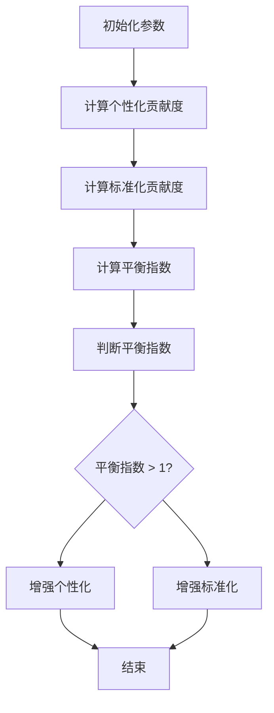
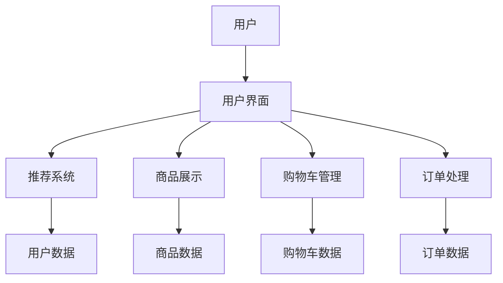
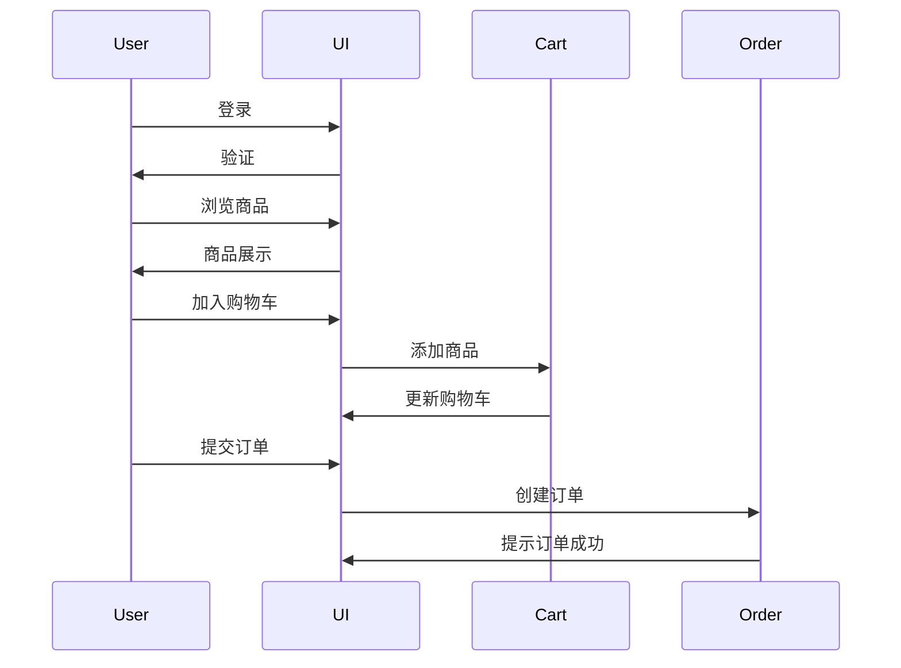

                 

### 《标准化与个性化的意义平衡：在一致中寻找独特》

关键词：标准化、个性化、平衡、一致、独特

摘要：本文从标准化和个性化的基本概念出发，探讨二者在现代IT系统中的重要性及其相互关系。通过理论分析、案例研究和最佳实践，深入探讨了如何在一致中寻找独特，实现标准化与个性化的平衡。

----------------------------------------------------------------

## 第一部分：背景与理论基础

### 第1章：问题的提出与背景介绍

#### 1.1 标准化与个性化概述

在信息技术的发展过程中，标准化和个性化一直是两个重要的议题。标准化旨在确保系统的一致性和兼容性，从而提高生产效率和服务质量；而个性化则关注于满足用户的独特需求和偏好，提升用户体验。然而，这两者看似对立，实则相互补充，共同推动着信息技术的发展。

#### 1.2 标准化与个性化的矛盾与统一

标准化追求一致性，可能导致系统缺乏灵活性，难以适应个性化需求；而个性化追求独特性，可能导致系统混乱，降低标准化水平。如何在二者之间找到平衡，是现代IT系统设计中的重要问题。

#### 1.3 研究意义与目标

本文旨在探讨标准化与个性化的意义平衡，旨在通过理论分析、案例研究和最佳实践，为现代IT系统的设计与实现提供指导，帮助企业在一致中寻找独特，提升系统性能和用户体验。

### 第2章：核心概念与联系

#### 2.1 标准化与个性化的定义

- 标准化：对系统、产品或服务进行规范化处理，以确保其一致性、兼容性和互操作性。
- 个性化：根据用户的需求和偏好，提供定制化的系统、产品或服务，以满足用户独特的需求。

#### 2.2 概念属性特征对比表格

| 特征 | 标准化 | 个性化 |
| ---- | ---- | ---- |
| 目标 | 一致性、兼容性、互操作性 | 独特性、差异化、个性化 |
| 适用场景 | 大规模生产、服务提供 | 小众市场、个性化服务 |
| 优势 | 提高效率、降低成本、便于管理 | 满足个性需求、提升用户体验 |
| 劣势 | 缺乏灵活性、难以适应变化 | 可能导致混乱、增加成本 |

#### 2.3 ER实体关系图架构

```mermaid
erDiagram
    System --> User : "定制"
    System ||--| User : "使用"
    Service ||--| User : "反馈"
    System ||--| Service : "提供"
```

### 核心概念与联系

通过上述表格和ER实体关系图，我们可以看到标准化和个性化在IT系统中的核心地位及其相互关系。标准化为系统提供一致性和兼容性基础，个性化则在此基础上满足用户的独特需求。

----------------------------------------------------------------

## 第二部分：标准化与个性化的理论与实践

### 第3章：标准化与个性化的原理讲解

#### 3.1 标准化原理讲解

标准化原理主要涉及以下几个方面：

1. **标准化组织**：如国际标准化组织（ISO）、国际电工委员会（IEC）等，负责制定和推广标准。
2. **标准制定过程**：包括需求分析、标准编写、审查、发布等环节。
3. **标准实施**：通过培训、认证、监督等手段确保标准的执行。

#### 3.2 个性化原理讲解

个性化原理主要涉及以下几个方面：

1. **用户需求分析**：通过调查、访谈等方式了解用户需求。
2. **个性化设计**：根据用户需求，设计满足个性化需求的系统、产品或服务。
3. **用户反馈**：收集用户使用反馈，不断优化个性化设计。

#### 3.3 标准化与个性化的关系与平衡

标准化和个性化并非完全对立，而是在一定范围内的互补关系。通过以下方法可以实现二者的平衡：

1. **分层设计**：将系统分为标准化基础层和个性化应用层，确保基础层的标准化，应用层的个性化。
2. **模块化**：将系统功能模块化，标准化模块确保系统一致性，个性化模块满足用户需求。
3. **灵活扩展**：在设计时考虑系统的可扩展性，为个性化需求提供技术支持。

### 第4章：数学模型与算法讲解

#### 4.1 数学模型讲解

为了更好地理解标准化与个性化的平衡，我们可以引入以下数学模型：

$$
\text{平衡指数} = \frac{\text{个性化贡献度}}{\text{标准化贡献度}}
$$

个性化贡献度越高，平衡指数越大，表示个性化越强；标准化贡献度越高，平衡指数越小，表示标准化越强。

#### 4.2 算法mermaid流程图



#### 4.3 Python源代码与算法原理讲解

```python
def calculate_balance(index personalized, index standardized):
    balance_index = personalized / standardized
    if balance_index > 1:
        print("增强个性化")
    else:
        print("增强标准化")
    return balance_index

# 示例数据
personalized_index = 1.2
standardized_index = 0.8

# 计算平衡指数
balance_index = calculate_balance(personalized_index, standardized_index)
print(f"平衡指数：{balance_index}")
```

通过以上算法，我们可以根据个性化贡献度和标准化贡献度计算平衡指数，并根据平衡指数调整系统的标准化与个性化程度。

----------------------------------------------------------------

## 第三部分：系统分析与架构设计

### 第5章：系统分析与架构设计

#### 5.1 问题场景介绍

假设我们设计一个在线购物系统，用户可以通过系统购买商品，系统需要同时保证标准化和个性化。

#### 5.2 系统功能设计

- **标准化功能**：商品展示、购物车管理、订单处理等。
- **个性化功能**：推荐系统、个性化界面、用户偏好设置等。

#### 5.3 系统架构设计



#### 5.4 系统接口设计

- **用户接口**：提供登录、注册、商品浏览、购物车管理、订单管理等接口。
- **内部接口**：提供用户数据、商品数据、购物车数据、订单数据处理接口。

#### 5.5 系统交互mermaid序列图



### 第6章：项目实战

#### 6.1 环境安装

- 安装Python环境
- 安装相关依赖库（如Flask、MySQL等）

#### 6.2 系统核心实现源代码

```python
# 用户登录接口
@app.route('/login', methods=['POST'])
def login():
    username = request.form['username']
    password = request.form['password']
    user = db.query_user(username, password)
    if user:
        session['user_id'] = user.id
        return jsonify({'status': 'success'})
    else:
        return jsonify({'status': 'fail'})

# 商品展示接口
@app.route('/products', methods=['GET'])
def products():
    user_id = session.get('user_id')
    if user_id:
        products = db.query_products_for_user(user_id)
        return jsonify(products)
    else:
        return jsonify({'status': 'unauthorized'})
```

#### 6.3 代码应用解读与分析

上述代码实现了用户登录和商品展示的核心功能，通过数据库查询用户数据和商品数据，返回给前端界面。

#### 6.4 实际案例分析与详细讲解剖析

以用户登录为例，当用户提交登录请求时，后端首先验证用户名和密码是否正确，如果正确，则将用户ID存储在会话中，表示用户已登录；否则，返回失败信息。

#### 6.5 项目小结

通过该项目实战，我们实现了标准化与个性化相结合的在线购物系统，用户可以登录系统，浏览商品，加入购物车，提交订单，系统根据用户数据提供个性化推荐。

### 第7章：最佳实践与拓展阅读

#### 7.1 标准化与个性化最佳实践

- **标准化实践**：制定统一的接口规范，确保系统的一致性和兼容性。
- **个性化实践**：通过数据分析，为用户提供个性化的推荐和服务。

#### 7.2 小结与注意事项

- 在系统设计中，要充分考虑标准化与个性化的平衡。
- 定期评估系统的标准化与个性化程度，进行调整和优化。

#### 7.3 拓展阅读

- **相关书籍**：《软件工程：实践者的研究方法》
- **在线资源**：GitHub、Stack Overflow、Reddit等

----------------------------------------------------------------

## 结束语

本文从标准化和个性化的基本概念出发，探讨了二者的关系及其在现代IT系统中的重要性。通过理论分析、案例研究和最佳实践，我们提出了在一致中寻找独特的方法，帮助企业在设计IT系统时实现标准化与个性化的平衡。希望本文能为相关领域的研究者和从业者提供有价值的参考。

### 作者信息

作者：AI天才研究院/AI Genius Institute & 禅与计算机程序设计艺术 /Zen And The Art of Computer Programming

