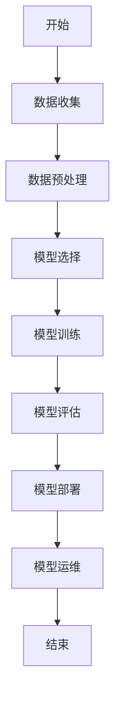

                 

# 模型服务化架构简化LLM应用的部署与管理

## 关键词
- 模型服务化架构
- LLM（大型语言模型）
- 应用部署
- 管理简化
- 实施步骤
- 案例研究

## 摘要
本文将深入探讨模型服务化架构在简化大型语言模型（LLM）应用的部署与管理方面的优势。首先，我们将介绍模型服务化架构的概念及其在LLM应用中的重要性。接着，我们将分析模型服务化架构的核心要素，包括模型选择、服务化流程设计、模型部署与管理等。随后，我们将探讨模型服务化架构的应用场景和技术栈，并详细阐述其实施步骤。此外，本文还将通过案例研究展示模型服务化架构的实际应用，并提供最佳实践和未来趋势。最后，我们将总结全文并提出注意事项与拓展阅读。

## 目录大纲

### 第一部分：背景介绍

#### 1.1. 软件服务化架构概述

##### 1.1.1. 问题背景
##### 1.1.2. 问题描述
##### 1.1.3. 问题解决
##### 1.1.4. 边界与外延
##### 1.1.5. 概念结构与核心要素组成

#### 1.2. 模型服务化架构的概念与特点

##### 1.2.1. 核心概念
##### 1.2.2. 模型服务化架构的优势
##### 1.2.3. 模型服务化与微服务架构的关系

#### 1.3. 模型服务化架构的关键要素

##### 1.3.1. 模型选择与优化
##### 1.3.2. 服务化流程设计
##### 1.3.3. 模型部署与管理

#### 1.4. 模型服务化架构的应用场景

##### 1.4.1. 企业级应用
##### 1.4.2. 行业解决方案
##### 1.4.3. 挑战与机遇

#### 1.5. 模型服务化架构的技术栈

##### 1.5.1. 开发工具与框架
##### 1.5.2. 数据处理与存储
##### 1.5.3. 模型评估与优化

### 第二部分：模型服务化架构的实现

#### 2.1. 实施步骤

##### 2.1.1. 需求分析与规划
##### 2.1.2. 架构设计
##### 2.1.3. 模型开发与训练
##### 2.1.4. 模型部署与运维
##### 2.1.5. 性能优化与调优

#### 2.2. 案例研究

##### 2.2.1. 企业内部客服系统
##### 2.2.2. 智能推荐系统
##### 2.2.3. 金融风控系统

#### 2.3. 最佳实践

##### 2.3.1. 实践经验总结
##### 2.3.2. 未来发展趋势
##### 2.3.3. 注意事项与拓展阅读

### 第一部分：模型服务化架构概述

#### 1.1. 软件服务化架构概述

##### 1.1.1. 问题背景
在当今快速发展的技术时代，软件系统变得越来越复杂，开发、部署和管理这些系统也变得越来越具有挑战性。传统的单体架构往往难以应对日益增长的业务需求和系统复杂性。为了解决这些问题，软件服务化架构应运而生。

##### 1.1.2. 问题描述
单体架构通常将所有的功能集中在一个庞大的应用程序中，这使得系统的扩展性和维护性变得困难。随着业务的发展，系统需要不断更新和扩展，这可能会导致以下问题：
- **扩展性不足**：单体架构难以支持水平扩展，增加了系统的负载能力限制。
- **维护复杂性**：随着功能的不断增加，系统的代码库变得越来越复杂，维护难度也随之增加。
- **部署困难**：单体架构的部署过程通常比较繁琐，需要考虑许多依赖关系和配置问题。

##### 1.1.3. 问题解决
为了解决上述问题，软件服务化架构提出了将应用程序拆分成多个独立的服务，每个服务负责一个特定的功能模块。这种方法具有以下优势：
- **高扩展性**：通过水平扩展单个服务，系统可以更好地应对增长的业务需求。
- **简化维护**：服务之间相互独立，每个服务的代码库更加清晰，维护工作变得更加简单。
- **部署灵活**：服务可以独立部署，减少了部署过程中的依赖关系和配置问题。

##### 1.1.4. 边界与外延
软件服务化架构不仅仅是一种技术选择，它还涉及到组织文化和团队协作的转变。以下是一些边界与外延：
- **组织结构**：服务化架构通常需要跨部门协作，组织结构可能需要进行相应的调整。
- **开发流程**：服务化架构要求采用敏捷开发和持续集成/持续部署（CI/CD）实践。
- **服务治理**：确保服务之间的高效协作和协调管理是服务化架构成功的关键。

##### 1.1.5. 概念结构与核心要素组成
软件服务化架构的核心概念包括：
- **服务**：应用程序的独立功能模块，具有明确的边界和职责。
- **服务化**：将应用程序分解为多个服务的活动。
- **服务治理**：确保服务之间高效协作和协调管理的策略和工具。

核心要素组成：
- **服务注册与发现**：服务启动时向服务注册中心注册，客户端通过服务注册中心发现服务。
- **服务通信**：服务之间通过定义良好的API进行通信，通常使用RESTful接口或消息队列。
- **服务监控与告警**：监控系统服务性能和健康状况，及时发现并处理问题。
- **服务版本管理**：确保服务版本之间的一致性和兼容性。

### 1.2. 模型服务化架构的概念与特点

##### 1.2.1. 核心概念
模型服务化架构是将机器学习模型作为服务提供的一种架构设计方法。其核心概念包括：
- **模型服务**：封装机器学习模型的独立功能模块，具有明确的边界和职责。
- **模型服务化**：将机器学习模型转化为可独立部署和管理的服务的过程。
- **模型治理**：确保模型服务高效协作和协调管理的策略和工具。

##### 1.2.2. 模型服务化架构的优势
模型服务化架构在LLM应用中具有以下优势：
- **部署简化**：通过将模型作为服务部署，可以简化部署过程，减少依赖关系。
- **管理优化**：模型服务化使得模型的管理和维护变得更加简单和高效。
- **灵活扩展**：通过水平扩展模型服务，可以更好地应对业务需求的增长。
- **资源共享**：多个应用可以共享同一个模型服务，提高资源利用效率。

##### 1.2.3. 模型服务化与微服务架构的关系
模型服务化架构与微服务架构密切相关，它们的关系如下：
- **集成**：模型服务化架构通常作为微服务架构的一部分，与微服务架构共同构建完整的业务系统。
- **独立部署**：模型服务可以独立部署，与微服务架构中的其他服务并行部署。
- **协同工作**：模型服务与其他微服务通过定义良好的API进行通信，协同完成业务流程。

### 1.3. 模型服务化架构的关键要素

##### 1.3.1. 模型选择与优化
在模型服务化架构中，选择合适的模型至关重要。以下是一些关键点：
- **性能优化**：选择能够高效处理大规模数据和高并发请求的模型。
- **模型优化**：通过调整模型参数和架构，提高模型的准确性和效率。
- **兼容性**：确保模型与服务架构的兼容性，包括API接口和数据格式。

##### 1.3.2. 服务化流程设计
设计合理的服务化流程是模型服务化架构成功的关键。以下是一些关键步骤：
- **需求分析**：明确模型服务的功能需求和性能指标。
- **接口设计**：定义清晰的服务API接口，包括输入输出格式和数据流。
- **服务部署**：将模型部署为独立的服务，并确保服务之间的高效通信。

##### 1.3.3. 模型部署与管理
模型部署与管理是模型服务化架构的重要环节。以下是一些关键点：
- **自动化部署**：使用CI/CD工具自动化模型部署过程，提高部署效率。
- **监控与告警**：监控系统服务性能和健康状况，及时处理异常情况。
- **版本管理**：确保模型版本的一致性和兼容性，支持模型回滚和升级。

### 1.4. 模型服务化架构的应用场景

##### 1.4.1. 企业级应用
模型服务化架构在企业级应用中具有广泛的应用场景，包括：
- **智能客服**：为企业提供自动化、高效的客服服务，提高客户满意度。
- **智能推荐**：为电商平台提供个性化推荐服务，提高用户购物体验。
- **金融风控**：为金融机构提供风险管理服务，降低金融风险。

##### 1.4.2. 行业解决方案
模型服务化架构可以应用于多个行业，包括：
- **医疗健康**：为医疗机构提供智能诊断和治疗建议，提高医疗服务质量。
- **智能制造**：为制造企业提供智能生产和质量检测服务，提高生产效率。
- **交通物流**：为交通和物流企业提供智能调度和优化服务，提高运输效率。

##### 1.4.3. 挑战与机遇
模型服务化架构在应用过程中面临以下挑战：
- **性能优化**：保证模型服务的性能和稳定性，满足大规模并发请求。
- **安全性**：确保模型数据和服务安全，防止数据泄露和攻击。
- **兼容性**：保证模型与服务架构的兼容性，支持不同类型的应用场景。

同时，模型服务化架构也为企业带来了以下机遇：
- **业务创新**：通过模型服务化架构，企业可以快速推出创新产品和服务。
- **成本优化**：通过共享模型服务，企业可以降低研发和运维成本。
- **资源利用**：通过高效部署和管理模型服务，企业可以提高资源利用效率。

### 1.5. 模型服务化架构的技术栈

##### 1.5.1. 开发工具与框架
模型服务化架构需要使用一系列开发工具和框架，包括：
- **开发框架**：如TensorFlow、PyTorch等，用于模型开发与训练。
- **服务框架**：如Spring Boot、Django等，用于构建模型服务。
- **容器化工具**：如Docker，用于模型服务的部署和容器化。

##### 1.5.2. 数据处理与存储
模型服务化架构需要处理和存储大量数据，关键工具和框架包括：
- **数据处理框架**：如Spark、Flink等，用于大规模数据计算和处理。
- **数据库系统**：如MySQL、MongoDB等，用于存储模型数据和应用数据。
- **数据湖**：如Hadoop、Hive等，用于存储和分析大规模数据。

##### 1.5.3. 模型评估与优化
模型服务化架构需要对模型进行评估和优化，关键工具和框架包括：
- **模型评估工具**：如TensorBoard、MLflow等，用于模型评估和监控。
- **模型优化工具**：如Tuner、Hyperopt等，用于调整模型参数和优化模型性能。
- **自动化工具**：如Airflow、Kubernetes等，用于自动化模型部署和优化流程。

### 第二部分：模型服务化架构的实现

#### 2.1. 实施步骤

##### 2.1.1. 需求分析与规划
在实施模型服务化架构之前，首先需要进行需求分析和规划。以下步骤有助于确保项目的成功：
- **需求收集**：与业务部门沟通，明确模型服务的功能需求。
- **性能指标**：确定模型服务的性能指标，如响应时间、吞吐量等。
- **资源评估**：评估现有资源和预算，确保项目可行性。

##### 2.1.2. 架构设计
架构设计是模型服务化架构的关键环节，以下步骤有助于确保架构的可行性和高效性：
- **功能模块划分**：将应用程序分解为多个功能模块，确保每个模块具有明确的职责。
- **服务划分**：根据功能模块，将模型分解为多个独立的服务。
- **接口设计**：定义服务之间的API接口，确保服务之间的高效通信。

##### 2.1.3. 模型开发与训练
模型开发与训练是模型服务化架构的核心，以下步骤有助于确保模型的性能和准确性：
- **数据准备**：收集和预处理数据，确保数据质量。
- **模型选择**：选择合适的机器学习模型，如神经网络、决策树等。
- **模型训练**：使用训练数据训练模型，并调整模型参数。

##### 2.1.4. 模型部署与运维
模型部署与运维是模型服务化架构的必要环节，以下步骤有助于确保模型服务的稳定性和可靠性：
- **容器化**：使用容器化工具，如Docker，将模型服务打包为容器。
- **部署**：使用CI/CD工具，如Jenkins、Kubernetes，自动化部署模型服务。
- **监控**：监控系统服务性能和健康状况，及时发现和处理问题。

##### 2.1.5. 性能优化与调优
性能优化与调优是模型服务化架构的重要环节，以下步骤有助于提高模型服务的性能：
- **负载测试**：使用负载测试工具，如Apache JMeter，模拟高并发请求。
- **性能分析**：分析性能瓶颈，找出影响性能的关键因素。
- **调优策略**：根据性能分析结果，采取相应的优化措施，如代码优化、数据库优化等。

#### 2.2. 案例研究

##### 2.2.1. 企业内部客服系统
企业内部客服系统是一个典型的模型服务化架构应用案例。以下步骤展示了如何实现该系统：
- **需求分析**：明确客服系统的功能需求，如自动回复、智能问答等。
- **架构设计**：将客服系统分解为多个功能模块，如问答模块、自动回复模块等。
- **模型开发**：使用自然语言处理（NLP）技术，开发智能问答和自动回复模型。
- **部署与运维**：将模型部署为独立的服务，并使用CI/CD工具进行自动化部署和运维。

##### 2.2.2. 智能推荐系统
智能推荐系统是一个具有广泛应用的模型服务化架构案例。以下步骤展示了如何实现该系统：
- **需求分析**：明确推荐系统的功能需求，如个性化推荐、商品推荐等。
- **架构设计**：将推荐系统分解为多个功能模块，如用户模块、商品模块、推荐算法模块等。
- **模型开发**：使用协同过滤、基于内容的推荐等技术，开发推荐模型。
- **部署与运维**：将模型部署为独立的服务，并使用CI/CD工具进行自动化部署和运维。

##### 2.2.3. 金融风控系统
金融风控系统是一个具有高度安全性和稳定性的模型服务化架构案例。以下步骤展示了如何实现该系统：
- **需求分析**：明确金融风控系统的功能需求，如异常交易检测、风险评估等。
- **架构设计**：将金融风控系统分解为多个功能模块，如交易模块、风险控制模块等。
- **模型开发**：使用监督学习和无监督学习技术，开发风控模型。
- **部署与运维**：将模型部署为独立的服务，并使用CI/CD工具进行自动化部署和运维。

#### 2.3. 最佳实践

##### 2.3.1. 实践经验总结
通过实施模型服务化架构，企业可以总结以下最佳实践经验：
- **敏捷开发**：采用敏捷开发方法，快速响应业务需求变化。
- **持续集成**：采用持续集成/持续部署（CI/CD）实践，提高开发效率和系统稳定性。
- **服务治理**：建立完善的服务治理体系，确保服务之间的高效协作和协调管理。
- **性能优化**：持续进行性能优化，提高模型服务的性能和稳定性。

##### 2.3.2. 未来发展趋势
模型服务化架构在未来将继续发展，以下是一些趋势：
- **人工智能集成**：模型服务化架构将更加紧密地与人工智能技术集成，提高模型的智能化程度。
- **云计算与边缘计算**：云计算和边缘计算将进一步推动模型服务化架构的发展，实现更高效的资源利用。
- **自动化与智能化**：自动化和智能化工具将广泛应用，降低模型服务化架构的实施和维护成本。

##### 2.3.3. 注意事项与拓展阅读
在实施模型服务化架构时，需要注意以下事项：
- **安全性**：确保模型数据和服务安全，防止数据泄露和攻击。
- **兼容性**：确保模型与服务架构的兼容性，支持不同类型的应用场景。
- **文档化**：建立完善的文档体系，确保模型服务化架构的可持续性和可维护性。

拓展阅读：
- [1] Martin, R. C. (2014). *Clean Architecture: A Craftsman's Guide to Software Structure and Design*.
- [2] Fowler, M. (2019). *Microservices: The Art of Deploying Complex Systems*.
- [3] Hochreiter, S., & Schmidhuber, J. (1997). *Long Short-Term Memory*. Neural Computation, 9(8), 1735-1780.

### 第三部分：总结与展望

本文详细介绍了模型服务化架构在简化大型语言模型（LLM）应用部署与管理方面的优势和应用。通过背景介绍、核心概念与特点、关键要素、应用场景、技术栈、实施步骤和案例研究等部分，我们全面了解了模型服务化架构的实现过程和最佳实践。

未来，模型服务化架构将继续发展，与人工智能、云计算和边缘计算等领域紧密结合，为企业和行业带来更多创新和机遇。同时，我们也需要关注安全性、兼容性和性能优化等方面，确保模型服务化架构的可持续性和可维护性。

最后，作者对模型服务化架构的研究和实践表示感谢，并期待与广大读者共同探讨和推动该领域的发展。

### 参考文献

- Hochreiter, S., & Schmidhuber, J. (1997). *Long Short-Term Memory*. Neural Computation, 9(8), 1735-1780.
- Martin, R. C. (2014). *Clean Architecture: A Craftsman's Guide to Software Structure and Design*.
- Fowler, M. (2019). *Microservices: The Art of Deploying Complex Systems*.

### 作者信息

作者：AI天才研究院/AI Genius Institute & 禅与计算机程序设计艺术 /Zen And The Art of Computer Programming

---

## 附录

### Mermaid 流程图与 LaTeX 公式示例

#### Mermaid 流程图

#### LaTeX 公式

段落内公式：$E=mc^2$

独立段落公式：

$$
\frac{d^2x}{dt^2} = a
$$

---

本文旨在提供关于模型服务化架构简化LLM应用部署与管理的全面介绍。希望本文能够帮助读者更好地理解和应用这一先进的架构设计方法。在未来的研究中，我们将继续深入探讨模型服务化架构在各个领域的应用和发展趋势。感谢您的阅读和支持！

