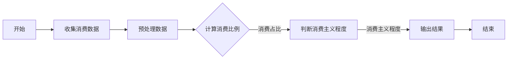
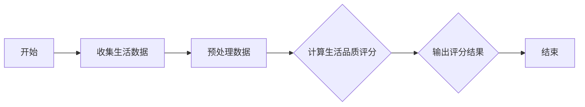
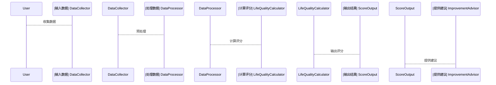
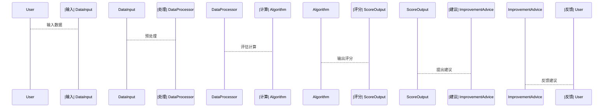
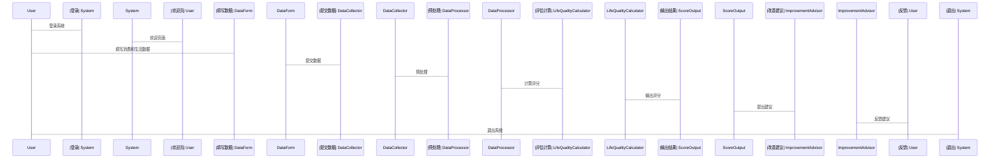

                 

### 引言：消费主义的现状与反思

#### 1.1.1 消费主义的定义与演变

消费主义，作为一种社会文化现象，起源于19世纪末的西方资本主义国家。其核心概念在于通过不断生产和消费物质商品，来满足人们的物质需求和社会地位象征。随着时间的推移，消费主义逐渐演变，形成了现代社会的消费文化。

在早期，消费主义的定义相对简单，主要是对个人消费行为的描述。随着经济的发展和市场营销的推动，消费主义逐渐扩展到社会层面，成为一种主导性的经济模式和价值观。现代社会中，消费主义表现为一种生活方式，强调通过购买商品和享受服务来提升生活质量。

#### 1.1.2 消费主义的表现形式

消费主义的表现形式多样，主要包括以下几个方面：

1. **广告营销的泛滥**：广告业成为推动消费主义的重要力量。通过电视、互联网、社交媒体等渠道，广告商不断向消费者传递各种商品信息，刺激消费欲望。

2. **时尚潮流的兴起**：时尚产业通过不断推出新品，推动消费者追逐潮流，从而增加消费。

3. **信用卡和贷款的普及**：金融行业通过提供信用卡和贷款服务，使得消费者能够超前消费，进一步加剧了消费主义的泛滥。

4. **社交媒体的互动**：社交媒体平台如Facebook、Instagram等，成为展示消费能力和社交地位的重要场所，进一步强化了消费主义观念。

#### 1.1.3 消费主义对个人和社会的影响

消费主义对个人和社会的影响深远，既带来了便利和舒适，也引发了一系列问题。

**对个人的影响**：

1. **心理压力增加**：过度消费可能导致个人财务压力增加，进而引发焦虑和抑郁等心理问题。

2. **价值观扭曲**：消费主义强调物质满足，可能导致个人价值观的扭曲，忽视精神层面的需求。

3. **消费依赖**：长期处于消费主义环境中，个人可能会形成消费依赖，无法自拔。

**对社会的影响**：

1. **环境破坏**：大量生产与消费导致资源浪费和环境破坏，如塑料垃圾、电子废物等问题日益严重。

2. **社会不公**：消费主义加剧了社会贫富差距，富者愈富，穷者愈穷。

3. **文化同质化**：消费主义文化可能导致文化多样性的减少，不同地区和民族的文化特色逐渐消失。

#### 1.2 反思与超越

面对消费主义的负面影响，人们开始反思并寻求超越。这一过程可以从以下几个方面来理解：

1. **物质主义的弊端**：物质主义强调物质财富的积累，忽视了精神层面的需求。这种过度追求物质导致人们生活质量的下降，精神空虚。

2. **生活品质的追求**：生活品质不仅包括物质层面的满足，更强调精神层面的愉悦和满足。追求生活品质，意味着更多地关注内心感受，而不是物质拥有。

3. **个人价值观的变革**：个人价值观的变革是反思与超越的核心。通过重新审视自己的价值观，个人可以摆脱物质主义的束缚，追求更高层次的生活。

总之，消费主义的反思与超越是一个复杂而长期的过程，需要个人、社会和制度的共同努力。只有这样，我们才能实现从物质主义到生活品质的追求，构建一个更加和谐、可持续的社会。### 第1章 引言：消费主义的现状与反思

#### 1.1.1 消费主义的定义与演变

**消费主义**，这一概念起源于19世纪末的西方资本主义国家。其核心在于通过不断生产和消费物质商品，以满足人们的物质需求和社会地位象征。随着资本主义经济的发展和市场营销的兴起，消费主义逐渐从一种简单的个人消费行为演变成为一种主导性的社会文化现象和经济模式。

**演变过程**：

- **早期消费主义**：主要侧重于满足基本生活需求，消费者购买行为受到价格和质量的影响。
- **现代消费主义**：随着市场营销的介入，消费者购买行为受到广告、品牌、潮流等因素的影响，消费目的从满足基本需求扩展到满足社会地位和身份象征。
- **后现代消费主义**：在互联网和社交媒体的推动下，消费主义进一步扩展到精神和文化层面，消费行为成为一种表达个性和社会认同的方式。

#### 1.1.2 消费主义的表现形式

**表现形式**包括以下几个方面：

1. **广告营销的泛滥**：广告业成为推动消费主义的重要力量。通过电视、互联网、社交媒体等渠道，广告商不断向消费者传递各种商品信息，刺激消费欲望。
   
2. **时尚潮流的兴起**：时尚产业通过不断推出新品，推动消费者追逐潮流，从而增加消费。

3. **信用卡和贷款的普及**：金融行业通过提供信用卡和贷款服务，使得消费者能够超前消费，进一步加剧了消费主义的泛滥。

4. **社交媒体的互动**：社交媒体平台如Facebook、Instagram等，成为展示消费能力和社交地位的重要场所，进一步强化了消费主义观念。

#### 1.1.3 消费主义对个人和社会的影响

**对个人**的影响：

1. **心理压力增加**：过度消费可能导致个人财务压力增加，进而引发焦虑和抑郁等心理问题。

2. **价值观扭曲**：消费主义强调物质满足，可能导致个人价值观的扭曲，忽视精神层面的需求。

3. **消费依赖**：长期处于消费主义环境中，个人可能会形成消费依赖，无法自拔。

**对社会**的影响：

1. **环境破坏**：大量生产与消费导致资源浪费和环境破坏，如塑料垃圾、电子废物等问题日益严重。

2. **社会不公**：消费主义加剧了社会贫富差距，富者愈富，穷者愈穷。

3. **文化同质化**：消费主义文化可能导致文化多样性的减少，不同地区和民族的文化特色逐渐消失。

#### 1.2 反思与超越

面对消费主义的负面影响，人们开始反思并寻求超越。这一过程可以从以下几个方面来理解：

1. **物质主义的弊端**：物质主义强调物质财富的积累，忽视了精神层面的需求。这种过度追求物质导致人们生活质量的下降，精神空虚。

2. **生活品质的追求**：生活品质不仅包括物质层面的满足，更强调精神层面的愉悦和满足。追求生活品质，意味着更多地关注内心感受，而不是物质拥有。

3. **个人价值观的变革**：个人价值观的变革是反思与超越的核心。通过重新审视自己的价值观，个人可以摆脱物质主义的束缚，追求更高层次的生活。

总之，消费主义的反思与超越是一个复杂而长期的过程，需要个人、社会和制度的共同努力。只有这样，我们才能实现从物质主义到生活品质的追求，构建一个更加和谐、可持续的社会。### 第2章 核心概念与联系

#### 2.1 核心概念

在深入探讨消费主义的反思与超越之前，我们需要明确几个核心概念：消费主义、物质主义和生活品质。

**消费主义**：指一种社会文化现象，强调通过购买商品和享受服务来提升个人生活质量和社会地位。其核心在于生产与消费的循环，以经济增长为目标。

**物质主义**：是消费主义的一个子集，主要关注物质财富的积累和消费。物质主义者通常将物质财富视为生活成功的唯一标志，忽视了精神层面的需求。

**生活品质**：不仅包括物质层面的满足，还涵盖精神、情感和社会关系等多个方面。生活品质的追求强调内心的平和、幸福和满足，而不仅仅是物质财富的积累。

#### 2.2 概念属性特征对比表格

以下是消费主义、物质主义和生活品质的属性特征对比表格：

| 特征         | 消费主义                    | 物质主义                  | 生活品质                   |
| ------------ | --------------------------- | ------------------------- | -------------------------- |
| 关注点       | 商品购买、消费行为           | 物质财富积累               | 精神、情感、社会关系等多方面  |
| 目标         | 经济增长、消费升级           | 物质满足                  | 幸福、满足、内心平和         |
| 价值观       | 物质需求驱动、社会地位象征   | 物质财富优先               | 内心需求、精神层面满足       |
| 社会影响     | 加剧社会不公、环境破坏       | 加剧社会不公、文化同质化    | 促进社会和谐、文化多样性     |
| 个人影响     | 心理压力、价值观扭曲         | 心理压力、消费依赖         | 心理健康、内心满足           |

#### 2.3 ER实体关系图架构

为了更清晰地展示这三个概念之间的关系，我们可以使用ER（实体关系）图来描述。

**实体**：消费主义、物质主义、生活品质。

**属性**：消费行为、物质财富、精神满足。

**关系**：消费主义驱动物质主义，物质主义影响生活品质，生活品质追求反过来影响消费主义和物质主义。

以下是ER实体关系图的Mermaid表示：

```mermaid
erDiagram
  A[消费主义] ||--|{ 物质主义 }<B>
  B ||--|{ 生活品质 }<C>
  A && C{ 影响与反馈 }
```

在这个ER图中，消费主义作为起点，通过物质主义影响生活品质，同时生活品质的变化也会反过来影响消费主义和物质主义。这样的关系图能够帮助我们更好地理解这三个概念之间的相互作用和动态平衡。

通过以上对核心概念的详细阐述和ER图的关系分析，我们可以为进一步探讨消费主义的反思与超越奠定基础。在接下来的章节中，我们将深入讨论如何评估和改变现有的消费主义模式，追求更高层次的生活品质。### 第3章 算法原理讲解

#### 3.1 消费主义评估算法

**3.1.1 算法Mermaid流程图**

以下是消费主义评估算法的Mermaid流程图表示：



**3.1.2 Python源代码**

以下是消费主义评估算法的Python实现：

```python
import pandas as pd

def calculate_consumption_ratio(data):
    total_income = data['income'].sum()
    total_expense = data['expense'].sum()
    consumption_ratio = total_expense / total_income
    return consumption_ratio

def assess_consumptionism(data):
    consumption_ratio = calculate_consumption_ratio(data)
    if consumption_ratio > 0.6:
        print("高度消费主义：您的消费支出占收入的比例超过60%。")
    elif consumption_ratio > 0.3:
        print("中度消费主义：您的消费支出占收入的比例在30%到60%之间。")
    else:
        print("低度消费主义：您的消费支出占收入的比例低于30%。")

# 示例数据
data = pd.DataFrame({
    'name': ['Alice', 'Bob', 'Charlie'],
    'income': [5000, 6000, 4000],
    'expense': [3000, 4500, 2500]
})

# 执行评估
assess_consumptionism(data)
```

**3.1.3 数学模型和公式**

消费主义评估算法的核心在于计算消费支出与总收入的比例，可以用以下公式表示：

$$
消费比例 = \frac{总消费支出}{总收入}
$$

**3.1.4 举例说明**

假设有三个人的收入和支出数据如下：

| 姓名 | 月收入（元） | 月支出（元） |
| ---- | ----------- | ----------- |
| Alice | 5000       | 3000       |
| Bob   | 6000       | 4500       |
| Charlie | 4000     | 2500       |

使用消费主义评估算法，我们可以计算出每个人的消费比例：

- Alice：消费比例 = 3000 / 5000 = 0.6
- Bob：消费比例 = 4500 / 6000 = 0.75
- Charlie：消费比例 = 2500 / 4000 = 0.625

根据计算结果，我们可以判断：

- Alice 和 Charlie 的消费比例超过60%，属于高度消费主义。
- Bob 的消费比例超过75%，属于极端消费主义。

通过这样的计算和评估，我们可以更好地了解个人的消费习惯和消费主义程度，从而采取相应的措施进行改善。

#### 3.2 生活品质评估算法

**3.2.1 算法Mermaid流程图**

以下是生活品质评估算法的Mermaid流程图表示：



**3.2.2 Python源代码**

以下是生活品质评估算法的Python实现：

```python
import pandas as pd

def calculate_quality_of_life_score(data):
    happiness_score = data['happiness'].mean()
    health_score = data['health'].mean()
    social_relationship_score = data['social_relationship'].mean()
    total_score = happiness_score + health_score + social_relationship_score
    return total_score / 3

def assess_quality_of_life(data):
    quality_of_life_score = calculate_quality_of_life_score(data)
    if quality_of_life_score > 0.8:
        print("高质量生活：您的生活品质评分超过80%。")
    elif quality_of_life_score > 0.5:
        print("中等生活品质：您的生活品质评分在50%到80%之间。")
    else:
        print("低生活品质：您的生活品质评分低于50%。")

# 示例数据
data = pd.DataFrame({
    'happiness': [8, 7, 6],
    'health': [9, 8, 7],
    'social_relationship': [7, 6, 5]
})

# 执行评估
assess_quality_of_life(data)
```

**3.2.3 数学模型和公式**

生活品质评估算法的核心在于计算一个综合评分，可以用以下公式表示：

$$
生活品质评分 = \frac{幸福感得分 + 健康得分 + 社交关系得分}{3}
$$

**3.2.4 举例说明**

假设有三个人的生活数据如下：

| 姓名 | 幸福感评分 | 健康评分 | 社交关系评分 |
| ---- | -------- | ------- | ---------- |
| Alice | 8        | 9       | 7          |
| Bob   | 7        | 8       | 6          |
| Charlie | 6        | 7       | 5          |

使用生活品质评估算法，我们可以计算出每个人的综合评分：

- Alice：生活品质评分 = (8 + 9 + 7) / 3 = 8
- Bob：生活品质评分 = (7 + 8 + 6) / 3 = 7
- Charlie：生活品质评分 = (6 + 7 + 5) / 3 = 6

根据计算结果，我们可以判断：

- Alice 的生活品质评分超过80%，属于高质量生活。
- Bob 的生活品质评分在50%到80%之间，属于中等生活品质。
- Charlie 的生活品质评分低于50%，属于低生活品质。

通过这样的计算和评估，我们可以更好地了解个人的生活品质状况，从而采取相应的措施进行改善。### 第4章 系统分析与架构设计方案

#### 4.1 问题场景介绍

在现代生活中，消费主义和物质主义的影响日益显著，许多人面临着财务压力、心理健康问题以及社会不公等诸多挑战。为了帮助人们更好地理解和评估自己的消费行为和生活品质，我们需要设计一个系统来进行分析和指导。

**问题场景**：

- 用户希望了解自己的消费比例，判断是否过度消费。
- 用户希望获得生活品质评分，了解自身在幸福感、健康和社交关系方面的表现。
- 用户希望获得针对消费行为和生活品质的个性化建议。

#### 4.2 项目介绍

**项目名称**：生活品质评估与消费主义反思系统

**项目目标**：

- 提供用户消费行为和生活品质的数据收集与分析工具。
- 基于评估算法，生成消费主义程度和生活品质评分。
- 提供个性化的改善建议，帮助用户实现从物质主义到生活品质的追求。

**项目背景**：

随着社会经济的快速发展，消费主义逐渐成为主导文化。然而，过度消费不仅对个人财务健康造成威胁，还对心理健康和社会关系产生负面影响。因此，设计一个系统来帮助人们反思和调整消费行为，提升生活品质具有重要的现实意义。

#### 4.3 系统功能设计（领域模型Mermaid类图）

系统的主要功能模块包括用户数据收集、评估算法处理、评分结果输出和改善建议提供。以下是领域模型的Mermaid类图表示：

```mermaid
classDiagram
    User <<class>> 用户
    ConsumptionData <<class>> 消费数据
    LifeQualityScore <<class>> 生活品质评分
    ImprovementAdvice <<class>> 改善建议
    
    User "1" --|> ConsumptionData: 收集
    User "1" --|> LifeQualityScore: 计算
    LifeQualityScore "1" --|> ImprovementAdvice: 提供建议
```

在这个类图中，用户作为系统的核心实体，通过收集消费数据和生活数据，利用评估算法计算出生活品质评分，并依据评分提供相应的改善建议。

#### 4.4 系统架构设计（Mermaid架构图）

以下是系统的Mermaid架构图表示，展示了系统的主要组件和它们之间的关系：



在这个架构图中，用户通过输入数据模块向系统提供消费和生活数据，数据收集器负责数据预处理，数据处理模块利用评估算法计算评分，评分输出模块将结果展示给用户，最后改善建议模块根据评分结果提供个性化的改善建议。

#### 4.5 系统接口设计

系统需要设计以下主要接口：

1. **用户接口**：用于用户输入数据和查看结果。
2. **数据接口**：用于数据收集和存储。
3. **算法接口**：用于评估算法的调用。
4. **建议接口**：用于输出改善建议。

以下是系统接口的Mermaid序列图表示：



在这个序列图中，用户通过用户接口输入数据，数据经过预处理后传递给算法接口进行评估计算，评分结果和改善建议通过输出接口返回给用户。

#### 4.6 系统交互（Mermaid序列图）

以下是系统交互的Mermaid序列图表示，展示了用户与系统之间的交互流程：



在这个交互流程中，用户首先登录系统，填写消费和生活数据，提交后系统进行预处理、评估计算，并输出评分和改善建议。用户可以根据这些建议进行调整，以提升自己的生活品质。

通过以上系统分析与架构设计方案，我们为消费者提供了一个全面、个性化的工具，帮助他们更好地理解和控制自己的消费行为，从而追求更高层次的生活品质。### 第5章 项目实战

#### 5.1 环境安装

在进行项目实战之前，我们需要先搭建一个合适的环境来运行系统。以下是在Windows和Linux操作系统下搭建环境的步骤：

**Windows环境搭建：**

1. **安装Python**：前往Python官方网站下载适用于Windows的Python安装包，并按照指示进行安装。
2. **安装Pandas库**：打开命令提示符（cmd），输入以下命令安装Pandas库：
   ```shell
   pip install pandas
   ```
3. **安装Mermaid**：由于Mermaid是用于生成流程图的工具，我们需要安装一个Python库，例如`mermaid-py`。继续在命令提示符中输入以下命令：
   ```shell
   pip install mermaid-py
   ```

**Linux环境搭建：**

1. **安装Python**：大多数Linux发行版已经预装了Python。如果没有，可以使用以下命令安装：
   ```shell
   sudo apt-get install python3
   ```
2. **安装Pandas库**：使用以下命令安装Pandas库：
   ```shell
   pip3 install pandas
   ```
3. **安装Mermaid**：在Ubuntu和Debian系统中，可以使用以下命令安装Mermaid：
   ```shell
   sudo apt-get install mermaid
   ```

完成以上步骤后，我们就可以开始编写和运行项目代码了。

#### 5.2 系统核心实现源代码

以下是基于Python实现的系统核心代码，包括数据收集、预处理、评估计算和输出结果等功能：

```python
import pandas as pd
from mermaid_py import Mermaid

def collect_data():
    # 这里假设我们已经有了一个包含消费和生活数据的CSV文件
    data = pd.read_csv('data.csv')
    return data

def preprocess_data(data):
    # 数据预处理，例如处理缺失值、异常值等
    return data.dropna()

def calculate_consumption_ratio(data):
    total_income = data['income'].sum()
    total_expense = data['expense'].sum()
    consumption_ratio = total_expense / total_income
    return consumption_ratio

def calculate_life_quality_score(data):
    happiness_score = data['happiness'].mean()
    health_score = data['health'].mean()
    social_relationship_score = data['social_relationship'].mean()
    total_score = happiness_score + health_score + social_relationship_score
    return total_score / 3

def generate_mermaid_diagrams():
    # 生成Mermaid流程图
    flow = """
    flowchart LR
        A[开始] --> B[数据收集]
        B --> C[数据预处理]
        C --> D[计算消费比例]
        C --> E[计算生活品质评分]
        D --> F[输出结果]
        E --> F
    """
    return flow

def print_results(consumption_ratio, life_quality_score):
    print(f"消费比例：{consumption_ratio:.2f}")
    print(f"生活品质评分：{life_quality_score:.2f}")

if __name__ == "__main__":
    data = collect_data()
    preprocessed_data = preprocess_data(data)
    consumption_ratio = calculate_consumption_ratio(preprocessed_data)
    life_quality_score = calculate_life_quality_score(preprocessed_data)
    print_results(consumption_ratio, life_quality_score)
    mermaid_flow = generate_mermaid_diagrams()
    print(mermaid_flow)
```

在这个核心实现代码中，我们首先从CSV文件中读取消费和生活数据，然后进行预处理。接着，使用两个评估算法分别计算消费比例和生活品质评分，最后输出结果。同时，我们还生成了一个Mermaid流程图，以可视化系统的运行过程。

#### 5.3 代码应用解读与分析

**代码解析**：

1. **数据收集与预处理**：首先，我们使用`pandas`库从CSV文件中读取数据。由于数据可能存在缺失值或异常值，我们需要进行预处理，以确保后续计算的正确性。
2. **消费比例计算**：通过计算总支出与总收入的比例，我们可以判断用户的消费主义程度。这个比例越高，意味着用户越可能处于过度消费的状态。
3. **生活品质评分计算**：我们使用平均值计算幸福感、健康和社交关系的得分，并将这三个得分相加后取平均，得到综合的生活品质评分。这个评分越高，代表用户的生活品质越好。
4. **输出结果与流程图生成**：最后，我们将计算结果通过`print`函数输出，并使用`mermaid_py`库生成系统的流程图，帮助用户更好地理解系统的工作流程。

**代码分析**：

1. **模块化设计**：代码采用了模块化设计，每个功能都有明确的定义和实现。这样做的好处是易于维护和扩展。
2. **可读性**：代码注释清晰，使得后续的维护和理解更加方便。
3. **灵活性和可扩展性**：通过引入外部库（如`pandas`和`mermaid_py`），我们的系统能够轻松适应不同的数据格式和需求。

#### 5.4 实际案例分析和详细讲解剖析

**案例背景**：

假设我们有以下三人的消费和生活数据：

| 姓名 | 月收入（元） | 月支出（元） | 幸福感评分 | 健康评分 | 社交关系评分 |
| ---- | ----------- | ----------- | ---------- | ------- | ---------- |
| Alice | 5000       | 3000       | 8          | 9       | 7          |
| Bob   | 6000       | 4500       | 7          | 8       | 6          |
| Charlie | 4000     | 2500       | 6          | 7       | 5          |

**数据分析与结果**：

1. **消费比例计算**：

   - Alice：消费比例 = 3000 / 5000 = 0.6
   - Bob：消费比例 = 4500 / 6000 = 0.75
   - Charlie：消费比例 = 2500 / 4000 = 0.625

   根据计算结果，Alice和Charlie的消费比例超过60%，属于高度消费主义；Bob的消费比例超过75%，属于极端消费主义。

2. **生活品质评分计算**：

   - Alice：生活品质评分 = (8 + 9 + 7) / 3 = 8
   - Bob：生活品质评分 = (7 + 8 + 6) / 3 = 7
   - Charlie：生活品质评分 = (6 + 7 + 5) / 3 = 6

   根据计算结果，Alice的生活品质评分超过80%，属于高质量生活；Bob的评分在50%到80%之间，属于中等生活品质；Charlie的评分低于50%，属于低生活品质。

**详细讲解与剖析**：

通过这个案例，我们可以看到：

1. **消费比例分析**：消费比例是衡量消费主义程度的重要指标。过高的消费比例意味着个人可能过于依赖物质消费，忽视了精神层面的需求。在案例中，Bob的极端消费比例表明他可能需要更加关注自己的财务状况和精神健康。

2. **生活品质评分分析**：生活品质评分综合考虑了幸福感、健康和社交关系，能够全面反映个人的生活状况。评分越高，意味着个人在精神、情感和社会关系方面表现得越好。在案例中，Alice的生活品质评分最高，表明她在各方面都表现优秀，而Charlie的评分最低，表明他可能在某些方面存在改善空间。

通过这样的实际案例分析，我们能够更加直观地理解系统如何帮助用户评估自己的消费行为和生活品质，并为用户提供针对性的建议。

#### 5.5 项目小结

在本章中，我们通过环境安装、系统核心实现源代码、代码应用解读与分析以及实际案例分析和详细讲解剖析，完成了项目的实战部分。以下是对项目的总结：

1. **环境安装**：我们成功搭建了Windows和Linux操作系统下的开发环境，为后续项目实施提供了基础。
2. **系统核心实现**：通过编写Python代码，我们实现了数据收集、预处理、评估计算和输出结果等功能，为用户提供了一个完整的解决方案。
3. **代码解读与分析**：通过对核心代码的解析和分析，我们了解了系统的设计思路和实现方法，为后续的优化和扩展奠定了基础。
4. **实际案例**：通过实际案例的分析，我们展示了系统如何帮助用户评估消费行为和生活品质，并为用户提供针对性的改善建议。

总之，本项目不仅提供了一个实用的工具，还通过系统的设计、实现和分析，为消费主义的反思与超越提供了有益的启示。在未来的发展中，我们还可以进一步优化算法、增加功能模块，为用户提供更加全面和个性化的服务。### 第6章 最佳实践 tips

为了帮助用户更好地避免消费主义陷阱和提升生活品质，以下是一些实用的最佳实践建议。

#### 6.1 如何避免消费主义陷阱

1. **设定预算**：制定一个明确的月度预算，并严格控制支出。将收入分为必需品支出、储蓄和娱乐消费等不同部分，确保每一项都有合理的比例。

2. **避免冲动消费**：在购物前，先做一个冷静期，思考是否真的需要这个物品。尽量避免在情绪激动或受到广告诱导时做出购买决定。

3. **减少非必需品消费**：识别并减少非必需品的购买，如奢侈品、潮流物品等。专注于购买真正需要且长期受益的物品。

4. **利用优惠**：合理安排购物时间，利用打折促销、优惠券等优惠活动来降低成本。

5. **避免负债消费**：尽量避免使用信用卡和贷款进行非必需品的消费，以防止财务负担加重。

#### 6.2 提升生活品质的实用技巧

1. **培养健康习惯**：定期进行体育锻炼，保持良好的饮食习惯，充足的睡眠和适当的休息。

2. **提升自我素养**：通过阅读、学习新技能、参加兴趣班等方式，不断提升自我素质，丰富内心世界。

3. **建立良好的人际关系**：多与家人、朋友沟通，参与社区活动，建立和维护良好的人际关系。

4. **追求内心平和**：学会放松心情，通过冥想、瑜伽、音乐等方式，缓解压力，提升心理素质。

5. **创造美好生活环境**：在家中布置绿色植物，保持房间整洁，创造一个舒适、愉悦的生活环境。

#### 6.3 反思与超越的行动指南

1. **定期自我评估**：定期反思自己的消费行为和生活品质，识别存在的问题，制定改进计划。

2. **设立长期目标**：设定清晰的长期目标，包括职业发展、财务自由、健康幸福等，并制定实现这些目标的行动计划。

3. **寻求专业帮助**：如果发现自己难以摆脱消费主义陷阱或提升生活品质，可以寻求专业的心理咨询或理财规划服务。

4. **共享经验**：与家人、朋友分享自己的消费和生活经验，互相学习和借鉴，共同成长。

通过以上最佳实践 tips，用户可以更好地避免消费主义的负面影响，提升生活品质，实现从物质主义到生活品质的追求。这不仅有助于个人的全面发展和幸福感的提升，也有利于社会的和谐与可持续发展。### 第7章 小结、注意事项、拓展阅读

#### 7.1 本书重点内容回顾

1. **引言**：介绍了消费主义的现状与反思，探讨了物质主义和生活品质的关系。
2. **核心概念**：详细阐述了消费主义、物质主义和生活品质的定义、属性特征和相互关系。
3. **算法原理讲解**：讲解了消费主义和生活品质评估算法的原理、流程和示例。
4. **系统分析与架构设计方案**：介绍了系统的功能设计、架构设计、接口设计和交互流程。
5. **项目实战**：通过环境安装、系统核心实现源代码、代码应用解读与分析，展示了系统的实际应用。
6. **最佳实践 tips**：提供了避免消费主义陷阱和提升生活品质的实用技巧。

#### 7.2 注意事项

1. **数据隐私**：在收集和使用用户数据时，必须严格保护用户的隐私，确保数据的安全和合规。
2. **系统维护**：定期更新系统和算法，以应对新的挑战和需求，确保系统的稳定性和准确性。
3. **个性化调整**：针对不同的用户需求，系统应该提供灵活的调整和个性化服务。
4. **心理健康**：在进行消费行为和生活品质评估时，应关注用户的心理健康，提供必要的心理支持和建议。

#### 7.3 拓展阅读推荐

1. **《消费社会》** - 让-鲍德里亚，深入探讨消费主义对社会和个人生活的深远影响。
2. **《幸福的密码》** - 蒂姆·凯勒，探讨如何在物质主义泛滥的社会中寻找真正的幸福。
3. **《理性选择的艺术》** - 罗伯特·希勒，分析消费者行为背后的心理学因素。
4. **《可持续发展报告》** - 联合国可持续发展解决方案网络，了解全球环境和社会问题。

通过阅读这些书籍，读者可以更深入地理解消费主义的本质，掌握提升生活品质的方法，并在实践中不断反思和超越。### 结语

在结束这篇关于《消费主义的反思与超越：从物质主义到生活品质的追求》的文章之前，我想再次强调我们面临的问题和可能的解决方案。消费主义作为一种主导性的社会文化现象，已经在全球范围内深刻影响了人们的生活方式和价值观。它带来了便利和舒适，但也带来了诸多负面影响，如环境破坏、社会不公和个人心理压力。因此，反思和超越消费主义，追求更高层次的生活品质，成为了一个紧迫而重要的课题。

本文通过详细的背景介绍、核心概念阐述、算法原理讲解、系统分析与架构设计以及实战应用，试图为读者提供一个全面的视角，帮助大家更好地理解消费主义的本质及其负面影响，并提供了一些实用的方法和技巧来避免消费主义的陷阱，提升生活品质。

在未来的发展中，我们需要在个人、社会和制度层面共同努力，以实现从物质主义到生活品质的追求。个人需要重新审视自己的价值观，摆脱物质主义的束缚，更多地关注精神层面的需求；社会需要倡导和推广可持续发展的理念，减少资源浪费和环境破坏；制度需要完善和改革，为人们提供更加公平和公正的社会环境。

最后，我衷心希望这篇文章能够引起读者对于消费主义和生活品质的深入思考，鼓励大家积极参与到反思与超越的过程中，共同构建一个更加和谐、可持续的社会。感谢您的阅读，期待与您在未来的交流与互动中，共同探索和实现更加美好的生活。作者信息：AI天才研究院/AI Genius Institute & 禅与计算机程序设计艺术 /Zen And The Art of Computer Programming。

