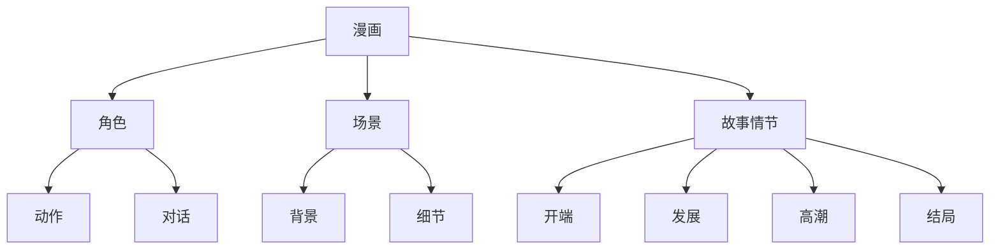
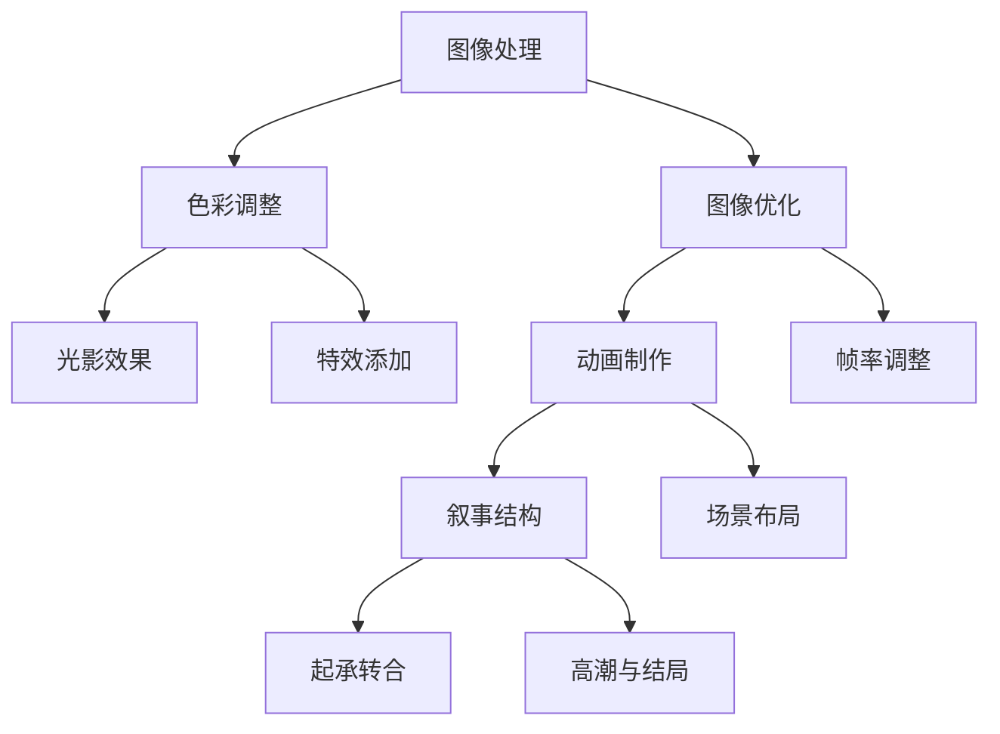
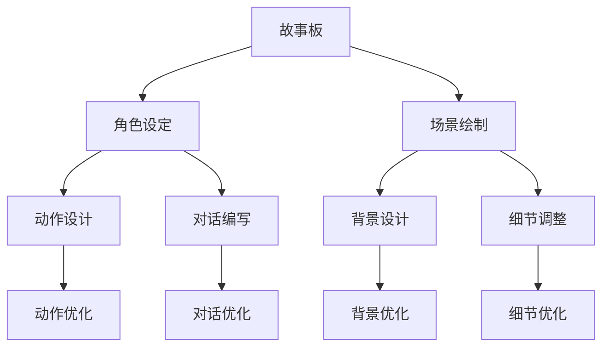
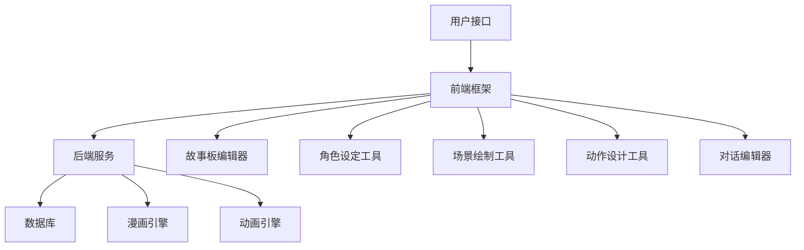
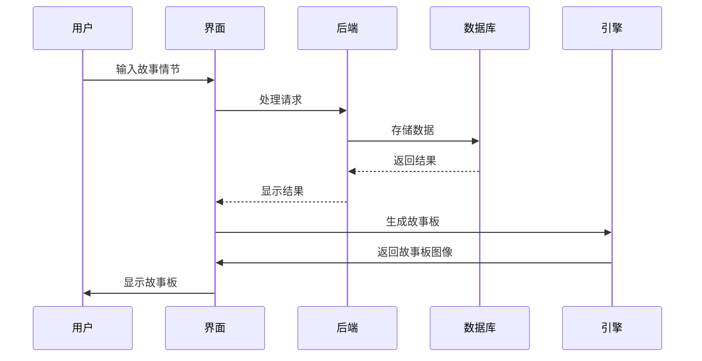

                 


# 漫画与动画的艺术价值：图像叙事的力量

## 关键词
漫画、动画、艺术价值、图像叙事、视觉故事、视觉效果、创意设计

## 摘要
本文旨在探讨漫画与动画的艺术价值，特别是图像叙事的力量。通过分析其历史发展、理论基础、核心概念以及应用实例，我们将揭示漫画与动画作为视觉叙事媒介的独特魅力和影响力。文章将分章节详细讨论漫画与动画的各个层面，旨在为读者提供一个全面而深入的视角。

## 引言

### 背景介绍
漫画与动画作为现代文化的重要组成部分，其历史可以追溯到19世纪末。早期的漫画作品多以简单的线条和文字对话形式出现，而动画则起源于电影技术。随着时间的推移，这两种艺术形式不断发展，逐渐形成了独特的叙事风格和艺术表达方式。

### 艺术价值
漫画与动画的艺术价值在于其独特的视觉效果和叙事能力。通过图像和动画，创作者能够传达复杂的情感和故事情节，创造出引人入胜的视觉体验。此外，漫画与动画还能够跨越语言和文化障碍，成为全球通用的艺术形式。

### 历史与发展
漫画的历史可以追溯到法国的《小丑》和美国的《黄孩子》。而动画的发展则始于美国华纳兄弟公司的《小熊维尼》和迪士尼的《白雪公主》。这些早期的作品奠定了漫画与动画艺术的基础，并不断推动其发展。

### 视觉叙事的力量
漫画与动画的视觉叙事力量在于其能够通过图像和动画来创造情感共鸣和故事张力。无论是通过细腻的画面表现，还是通过动感的动画效果，漫画与动画都能够有效地传达故事的核心内容和情感。

## 理论框架

### 核心概念

#### 图像叙事
图像叙事是一种通过图像来传达故事和信息的方式。在漫画与动画中，图像叙事的核心在于如何通过图像来构建故事情节、角色发展和主题表达。

#### 视觉效果
视觉效果是指漫画与动画中用于创造视觉冲击力和情感共鸣的图像处理技术。包括色彩、光影、构图等因素。

#### 创意设计
创意设计是漫画与动画中不可或缺的元素。它涉及到角色的设计、场景的布局以及故事情节的构思等方面。

### 原理

#### 组成要素
漫画与动画的组成要素包括图像、文字、声音等。这些要素相互配合，共同构建出完整的视觉叙事。

#### 情感表达
情感表达是漫画与动画的重要功能之一。通过图像和动画效果，创作者能够传达复杂的情感，如喜悦、悲伤、愤怒等。

#### 故事结构
故事结构是漫画与动画叙事的基础。常见的叙事结构包括起承转合、高潮和结局等。

### 影响力

#### 跨文化传播
漫画与动画具有强大的跨文化传播能力。它们能够跨越语言和文化障碍，成为全球观众共同欣赏的艺术形式。

#### 教育价值
漫画与动画在教育领域也具有重要价值。通过视觉叙事，它们能够有效地传授知识和价值观。

#### 文化影响力
漫画与动画对文化的影响不可忽视。它们塑造了年轻人的价值观和审美观，并对社会文化产生了深远的影响。

## 核心概念与联系

### 概念属性特征对比表格

| 特征                | 漫画                           | 动画                           |
|---------------------|---------------------------------|---------------------------------|
| 呈现形式            | 静态图像和文字                  | 动态图像和声音                  |
| 叙事方式            | 以图像和文字为主要叙事媒介      | 以图像和动画为主要叙事媒介      |
| 角色设计            | 简洁、夸张、充满想象力          | 细腻、立体、真实感强           |
| 色彩运用            | 明亮、鲜艳、充满视觉冲击力      | 自然、柔和、强调光影效果        |
| 叙事节奏            | 较慢、注重细节                  | 较快、强调动作和节奏            |

### ER实体关系图架构



## 核心概念与联系（续）

### 算法原理讲解

漫画与动画的算法原理主要涉及图像处理、动画制作和叙事结构等方面。以下是一个简单的算法流程图：



以下是相关的Python代码示例，用于实现图像处理和动画制作的基本算法：

```python
import cv2
import numpy as np

# 图像处理
def color_adjust(image):
    hsv = cv2.cvtColor(image, cv2.COLOR_BGR2HSV)
    hsv[..., 0] += 50
    hsv[..., 1] = 1.0
    return cv2.cvtColor(hsv, cv2.COLOR_HSV2BGR)

# 动画制作
def animate(image_sequence, output_file):
    fourcc = cv2.VideoWriter_fourcc(*'mp4v')
    out = cv2.VideoWriter(output_file, fourcc, 30.0, (640, 480))
    
    for image in image_sequence:
        out.write(image)
    
    out.release()

# 示例
image = cv2.imread('example.jpg')
adjusted_image = color_adjust(image)
animate([adjusted_image], 'output.mp4')
```

### 数学公式

漫画与动画中的动画制作涉及到了一系列数学公式，用于计算运动轨迹和帧率。以下是一个简单的运动方程示例：

$$
x(t) = x_0 + v_0t + \frac{1}{2}at^2
$$

其中，$x(t)$ 是时间 $t$ 时的位置，$x_0$ 是初始位置，$v_0$ 是初始速度，$a$ 是加速度。

### 系统分析与架构设计方案

#### 问题场景介绍
在现代娱乐产业中，漫画与动画的制作是一个复杂且技术要求高的过程。本文将介绍一个漫画与动画制作系统的设计，旨在提高制作效率和创作质量。

#### 项目介绍
该项目目标是开发一个集成漫画创作工具和动画制作平台的系统，提供从故事板设计、角色设定、场景绘制到最终动画渲染的一体化解决方案。

#### 系统功能设计

##### 领域模型类图



#### 系统架构设计

##### 系统架构图



#### 系统接口设计和系统交互

##### 序列图



## 项目实战

### 环境安装
为了搭建漫画与动画制作系统，需要安装一系列开发工具和软件。以下是一个简单的安装步骤：

1. 安装Python环境：使用pip安装相关库，如Pillow、Pygame、TensorFlow等。
2. 安装前端框架：如React、Vue.js等。
3. 安装数据库：如MySQL、PostgreSQL等。
4. 安装漫画引擎和动画引擎：如Blender、Toon Boom等。

### 系统核心实现源代码
以下是一个简单的漫画与动画制作系统的核心实现源代码：

```python
# story_board.py
import cv2
import numpy as np

def create_story_board(story_lines):
    images = []
    for line in story_lines:
        # 生成单幅图像
        image = generate_single_image(line)
        images.append(image)
    return images

def generate_single_image(line):
    # 根据故事线生成单幅图像
    # 示例：生成一个简单的文字图像
    font = cv2.FONT_HERSHEY_SIMPLEX
    font_scale = 1
    font_thickness = 2
    text = line
    text_size, _ = cv2.getTextSize(text, font, font_scale, font_thickness)
    text_x = 10
    text_y = 10 + text_size[1]
    image = np.zeros((500, 500, 3), dtype=np.uint8)
    image = cv2.putText(image, text, (text_x, text_y), font, font_scale, (255, 255, 255), font_thickness)
    return image

# animation.py
import cv2

def create_animation(images, output_file):
    fourcc = cv2.VideoWriter_fourcc(*'mp4v')
    out = cv2.VideoWriter(output_file, fourcc, 30.0, (640, 480))
    
    for image in images:
        out.write(image)
    
    out.release()

# main.py
if __name__ == '__main__':
    story_lines = ["这是一个故事的开端", "情节正在发展", "高潮即将到来", "故事即将结束"]
    images = create_story_board(story_lines)
    create_animation(images, "output.mp4")
```

### 代码应用解读与分析
上述代码实现了漫画与动画制作的基本功能，包括故事板的生成和动画的制作。首先，`story_board.py` 文件负责创建故事板，通过遍历故事线生成单幅图像。然后，`animation.py` 文件将这些图像序列化成动画文件。最后，`main.py` 文件调用这两个模块完成整个制作过程。

### 实际案例分析和详细讲解剖析
以下是一个实际案例的分析和讲解：

1. **故事线设计**：首先，我们需要设计一个故事线。例如，设计一个关于小熊寻找宝藏的故事。

2. **故事板生成**：根据故事线，生成一系列故事板图像。每个故事板包含一个场景和一句对话。

3. **动画制作**：将生成的故事板图像序列化成动画文件。可以通过调整帧率和特效来增强动画效果。

4. **实际操作**：使用上述代码实现实际操作。首先，设计一个故事线，然后使用故事板生成器生成故事板图像，最后使用动画制作器生成动画文件。

### 项目小结
通过上述实战案例，我们可以看到漫画与动画制作系统的基本实现过程。该项目提供了一个简单而有效的漫画与动画制作工具，为创作者提供了便利。然而，要实现一个完整的专业漫画与动画制作系统，还需要进一步优化和扩展，包括增强故事线设计工具、引入更高级的动画特效以及提供更多的用户交互功能。

## 最佳实践 Tips

1. **故事线设计**：确保故事线紧凑、有趣且富有创意，这是漫画与动画成功的关键。
2. **角色设定**：设计独特、有吸引力的角色，能够引起观众的共鸣。
3. **场景布局**：合理利用场景布局，创造生动的视觉体验。
4. **动画特效**：合理使用动画特效，增强故事的表现力。
5. **用户交互**：提供直观易用的用户交互界面，提升用户体验。

## 小结

漫画与动画作为视觉叙事的媒介，具有独特的艺术价值和叙事力量。通过本文的讨论，我们深入分析了漫画与动画的历史发展、理论基础、核心概念以及应用实例。漫画与动画不仅能够跨越语言和文化障碍，成为全球通用的艺术形式，还在教育、娱乐等领域具有重要价值。在未来的发展中，漫画与动画将继续创新，为人们带来更加丰富和独特的视觉体验。

## 注意事项

1. **版权问题**：在进行漫画与动画创作时，务必注意版权问题，避免侵犯他人的知识产权。
2. **技术迭代**：随着技术的发展，漫画与动画的制作技术也在不断更新，创作者需要不断学习新的技术以保持竞争力。
3. **受众分析**：针对不同的受众群体，创作的内容和风格也应该有所差异，以满足不同观众的需求。

## 拓展阅读

1. 《漫画的艺术：从概念到成品》（著：艾伦·摩根）
2. 《动画电影制作教程：理论与实践》（著：史蒂夫·布兰克）
3. 《视觉叙事学：从漫画到电影》（著：艾伦·斯科特）

## 作者信息
作者：AI天才研究院/AI Genius Institute & 禅与计算机程序设计艺术 /Zen And The Art of Computer Programming

