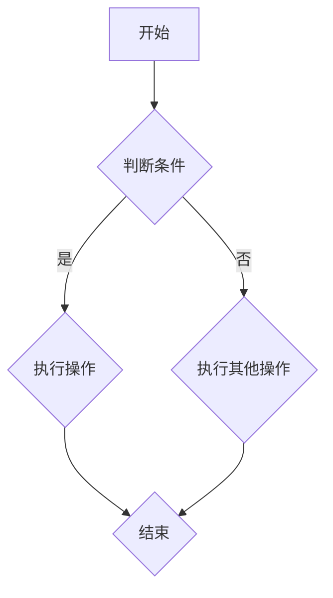
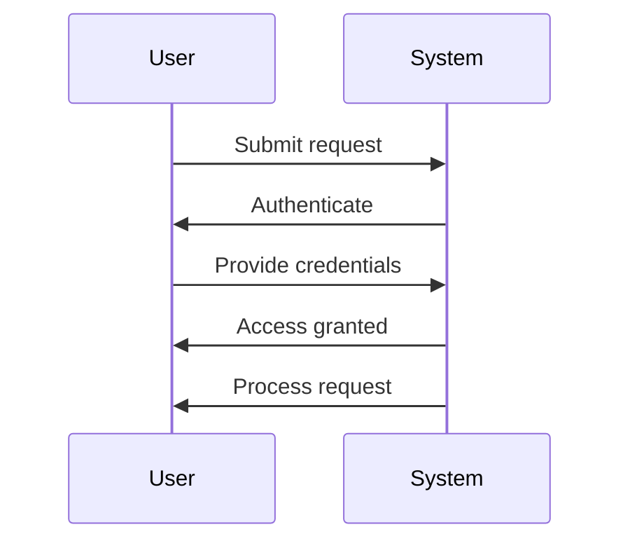
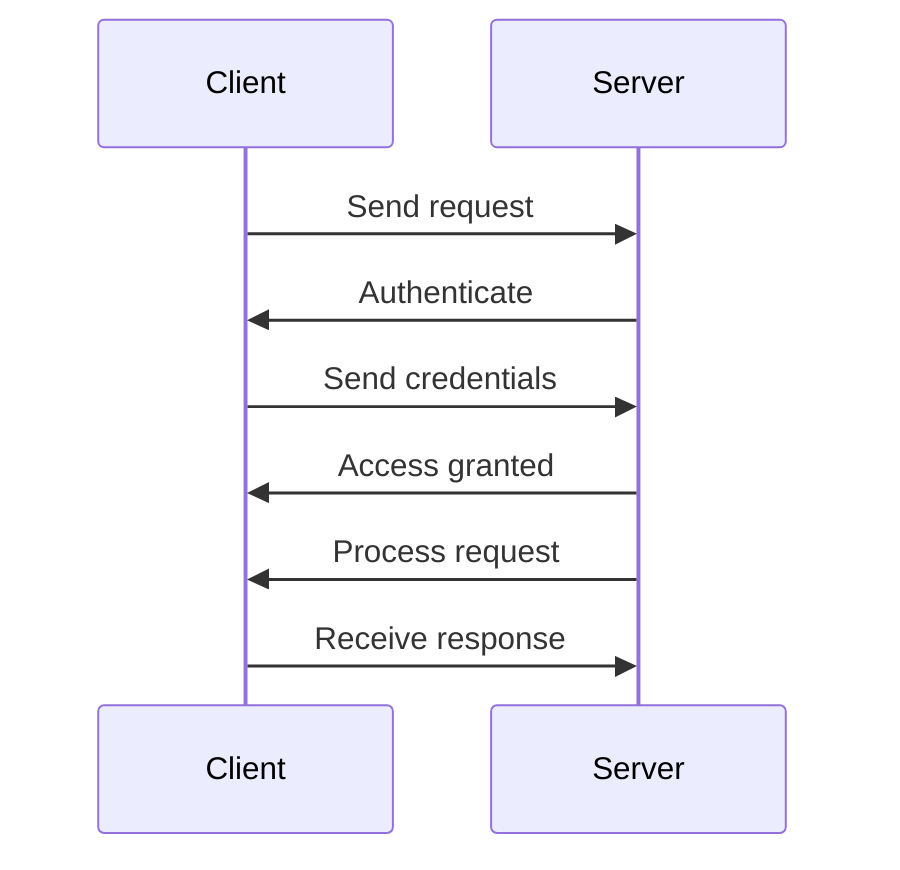

                 

### 设计书籍目录大纲的步骤：

#### 1. 理解书籍主题

首先，我们需要深入理解书籍的主题。《现代冥想retreats：都市人的精神充电站》这一书名直接指向了两个核心概念：“现代冥想retreats”和“都市人的精神充电站”。现代冥想retreats是一个相对新颖且具有吸引力的主题，而“都市人的精神充电站”则突显了书籍的实用价值。

**核心概念术语说明：**
- **现代冥想retreats：** 一种专注于冥想练习的短期集中活动，旨在为参与者提供一个宁静的环境，以实现精神上的恢复和提升。
- **都市人的精神充电站：** 指代冥想retreats对生活在繁忙都市环境中的人们在精神层面的积极作用。

**问题背景与问题描述：**
随着现代社会的快速发展，都市生活变得越来越快节奏和高压。这种生活方式导致了人们精神上的疲惫和焦虑。因此，如何通过冥想retreats来缓解这种精神压力成为一个值得探讨的问题。

**问题解决与边界与外延：**
书籍的目标是提供一套完整的冥想retreats指南，包括历史背景、技术方法、实践案例以及未来展望。同时，书籍也需要明确其适用范围，即主要针对都市人群，尤其是那些对精神健康和冥想有兴趣的人群。

**概念结构与核心要素组成：**
书籍的核心结构可以划分为以下几个部分：
- **引言：** 冥想的历史和现代冥想的普及。
- **方法与技巧：** 冥想的基本技术和实践。
- **实践案例：** 现代冥想retreats的真实案例研究。
- **结论与展望：** 冥想retreats对个人和社会的影响，以及未来的发展趋势。

#### 2. 明确书籍结构和内容

在明确了主题和核心概念之后，我们需要考虑书籍的整体结构和内容安排。这包括以下主要部分：

- **引言：** 为读者提供背景信息和书籍的目的。
- **背景与历史：** 探讨冥想的历史发展及其在现代社会的重要性。
- **方法与技术：** 详细介绍冥想的各种方法和实践技术。
- **实践与案例：** 分享真实的冥想retreats案例及其效果。
- **结论与展望：** 总结冥想retreats的影响和未来发展趋势。

#### 3. 细化章节内容

根据书籍的整体结构和内容安排，我们需要细化每个章节的核心内容：

- **引言：**
  - **1.1 冥想的历史与发展：** 探讨冥想在不同文化和历史时期的演变。
  - **1.2 冥想与都市生活：** 分析都市生活的压力对精神健康的影响。
  - **1.3 现代冥想retreats概述：** 介绍冥想retreats的定义和类型。

- **方法与技巧：**
  - **2.1 冥想的基本技术：** 详细介绍正念冥想、动态冥想和瑜伽冥想。
  - **2.2 冥想实践：** 讨论冥想的准备、呼吸技巧和日常实践。
  - **2.3 冥想retreats的组织与实施：** 分析冥想retreats的流程、场所和导师选择。

- **实践与案例：**
  - **3.1 城市中心冥想retreat案例：** 分析在城市中心举办的冥想retreat的背景、实施和效果。
  - **3.2 自然环境冥想retreat案例：** 探讨在自然环境举办的冥想retreat的优势和效果。
  - **3.3 工作坊式冥想retreat案例：** 分析工作坊式冥想retreat的特点和效果。

- **结论与展望：**
  - **4.1 现代冥想retreats的影响：** 总结冥想retreats对个人和社会的影响。
  - **4.2 未来发展趋势：** 探讨冥想retreats未来的发展趋势。

#### 4. 确保内容完整性

在细化章节内容的过程中，我们需要确保每个章节都有明确的目的和清晰的内容，并且章节之间相互联系。每个章节都应该能够独立成篇，同时与整体内容相协调。

#### 5. 遵循目录结构

根据markdown格式，我们需要确保目录层级清晰，使用#、##、###来区分。这有助于读者快速了解书籍的结构和内容，便于阅读和参考。

#### 6. 编写目录大纲

根据以上步骤，我们可以编写出完整的目录大纲，确保文章内容结构清晰、逻辑连贯。以下是一个详细的目录大纲：

```markdown
----------------------------------------------------------------
# 引言

## 1.1 冥想的历史与发展
### 1.1.1 冥想的文化背景
### 1.1.2 冥想在现代社会的重要性

## 1.2 冥想与都市生活
### 1.2.1 都市生活的压力与挑战
### 1.2.2 冥想在都市生活中的作用

## 1.3 现代冥想retreats概述
### 1.3.1 冥想retreats的定义
### 1.3.2 冥想retreats的类型

# 第二部分: 现代冥想retreats的技术与方法

## 2.1 冥想的基本技术
### 2.1.1 正念冥想
### 2.1.2 动态冥想
### 2.1.3 瑜伽冥想

## 2.2 冥想实践
### 2.2.1 冥想的准备与环境
### 2.2.2 冥想的呼吸技巧
### 2.2.3 冥想的日常实践

## 2.3 冥想retreats的组织与实施
### 2.3.1 冥想retreats的流程
### 2.3.2 冥想retreats的场所选择
### 2.3.3 冥想retreats的导师选择

## 2.4 冥想retreats的参与者体验
### 2.4.1 参与者的期望与目标
### 2.4.2 参与者的准备
### 2.4.3 参与者的反馈

# 第三部分: 现代冥想retreats的案例研究

## 3.1 案例一：城市中心的冥想retreat
### 3.1.1 案例背景
### 3.1.2 案例实施
### 3.1.3 案例效果

## 3.2 案例二：自然环境的冥想retreat
### 3.2.1 案例背景
### 3.2.2 案例实施
### 3.2.3 案例效果

## 3.3 案例三：工作坊式冥想retreat
### 3.3.1 案例背景
### 3.3.2 案例实施
### 3.3.3 案例效果

# 第四部分: 结论与展望

## 4.1 现代冥想retreats的影响
### 4.1.1 对个人精神健康的影响
### 4.1.2 对社会的影响

## 4.2 冥想retreats的未来发展趋势
### 4.2.1 技术的发展趋势
### 4.2.2 社会需求的变化
### 4.2.3 冥想retreats的挑战与机遇

## 4.3 总结
### 4.3.1 本书的主要内容回顾
### 4.3.2 对读者的影响和启示

----------------------------------------------------------------
```

此目录大纲结构清晰，涵盖了书籍的核心内容，并且保持了简洁性。接下来，我们将逐步展开每个章节的内容，确保字数控制在10000-12000字左右。

----------------------------------------------------------------

## 1.1 冥想的历史与发展

冥想作为一种古老的精神实践，其起源可以追溯到几千年前。在不同的文化和宗教传统中，冥想扮演着重要的角色。以下将详细探讨冥想的历史发展，以及它在现代社会的重要性。

### 1.1.1 冥想的文化背景

冥想作为一种精神实践，起源于古代印度，随后传播到中国、中亚、中东等地。在佛教、印度教、耆那教等宗教中，冥想被视为修行的重要途径，旨在达到心灵上的觉悟和解脱。

- **佛教冥想：** 在佛教中，冥想被视为达到涅槃的必要手段。佛陀在菩提树下冥想了数日，最终达到了觉悟。佛教冥想强调专注呼吸、观想和念经等技巧。
- **印度教冥想：** 印度教中的冥想形式多样，包括瑜伽冥想、超觉冥想等。瑜伽冥想强调身体和精神的协调，通过体位和呼吸练习来达到冥想状态。
- **耆那教冥想：** 耆那教中的冥想注重道德修养和内在的清净。冥想被视为修行者达到解脱的关键。

### 1.1.2 冥想在现代社会的重要性

随着现代社会生活节奏的加快，人们面临的精神压力越来越大。冥想作为一种简单而有效的精神实践，开始受到广泛的关注。以下是从几个方面探讨冥想在现代社会的重要性。

#### 精神层面的作用

- **缓解压力：** 冥想通过放松身体和心灵，帮助人们减轻压力和焦虑。研究表明，定期冥想可以降低应激激素水平，提高身心健康。
- **提升情绪：** 冥想有助于提升情绪状态，减少负面情绪如抑郁和愤怒。通过专注和正念，人们能够更好地控制自己的情绪。
- **增强自我意识：** 冥想帮助人们深入了解自己的内心世界，提升自我意识和自我接纳。

#### 身体层面的作用

- **改善身体健康：** 冥想有助于改善心血管健康、降低血压和胆固醇水平。通过呼吸练习和放松技巧，人们能够提高身体的免疫力。
- **缓解疼痛：** 冥想可以帮助缓解慢性疼痛，提高生活质量。通过专注于呼吸和身体感受，人们能够减少疼痛感。
- **促进睡眠：** 冥想有助于改善睡眠质量，减少失眠问题。通过放松技巧和正念，人们能够更容易入睡。

#### 社会层面的作用

- **提高工作效率：** 定期冥想可以帮助人们提高注意力和专注力，从而提高工作效率。许多科技公司已经开始推广冥想作为员工福利。
- **增强人际关系：** 冥想有助于提高人们的情感智力，增强人际关系。通过冥想，人们能够更好地理解和同情他人，减少冲突和误解。
- **推动社会和谐：** 冥想作为一种普世的精神实践，有助于推动社会和谐与进步。通过冥想，人们能够培养宽容和包容的心态，减少社会冲突。

### 1.1.3 冥想的历史演变

- **古代历史：** 冥想在古代文明中就已经存在。在古印度、古中国、古埃及等文明中，冥想被视为一种修行方式。
- **中世纪历史：** 在中世纪，冥想继续在不同宗教和文化中发展。基督教、伊斯兰教和犹太教等都包含冥想实践。
- **现代历史：** 20世纪以来，随着全球化和信息技术的普及，冥想开始在全球范围内传播。现代社会对冥想的需求不断增加，推动了冥想研究的深入和现代冥想形式的创新。

### 1.1.4 冥想与都市生活

都市生活充满了快节奏和高压力，人们常常感到焦虑和疲惫。冥想作为一种有效的精神实践，在都市生活中发挥着重要作用。

- **缓解都市压力：** 冥想可以帮助都市人缓解日常生活中的压力，提高心理弹性。
- **提升心理健康：** 冥想有助于改善都市人的心理健康，减少抑郁和焦虑症状。
- **促进身心健康：** 冥想不仅对心理健康有益，还能够改善身体健康，如提高免疫力、降低血压等。

综上所述，冥想作为一种古老而现代的精神实践，具有广泛的应用价值。随着人们对精神健康的关注不断增加，冥想在未来将继续发挥重要作用。

----------------------------------------------------------------

## 1.2 冥想与都市生活

在现代社会，都市生活以其快节奏和高压力而闻名。这种生活方式对人们的身心健康产生了显著影响，冥想作为一种有效的精神实践，成为了都市人寻求精神恢复和平衡的重要手段。以下将探讨都市生活的压力与挑战，以及冥想在都市生活中的作用。

### 1.2.1 都市生活的压力与挑战

都市生活充满了各种压力源，包括工作压力、经济压力、人际关系压力等。以下是一些常见的压力与挑战：

- **工作压力：** 都市人往往需要面对高强度的工作环境和激烈的职业竞争。加班、业绩考核、职业晋升等都可能导致心理压力。
- **经济压力：** 高昂的房价、生活成本和消费观念的升级使得都市人在经济上承受巨大的压力。
- **人际关系压力：** 都市生活中的人际关系复杂，社交压力、同事竞争、家庭矛盾等都是常见的压力来源。
- **环境压力：** 噪音、拥挤的交通、空气污染等环境问题也加剧了都市人的压力。

这些压力和挑战不仅影响都市人的心理健康，还可能导致身体疾病和生活质量的下降。

### 1.2.2 冥想在都市生活中的作用

冥想作为一种古老而现代的精神实践，被广泛认为是缓解都市压力的有效方法。以下从几个方面探讨冥想在都市生活中的作用：

#### 精神层面的作用

- **缓解压力：** 冥想通过放松身体和心灵，帮助都市人缓解日常生活中的压力。通过深呼吸、放松肌肉和专注呼吸，人们可以减少应激激素的分泌，从而减轻压力。
- **提升情绪：** 冥想有助于改善都市人的情绪状态，减少负面情绪如焦虑、抑郁和愤怒。通过培养专注力和正念，人们能够更好地控制自己的情绪，提高心理韧性。
- **增强自我意识：** 冥想帮助都市人深入了解自己的内心世界，提升自我意识和自我接纳。通过冥想，人们能够更好地理解自己的情绪和行为，从而实现个人成长。

#### 身体层面的作用

- **改善身体健康：** 冥想有助于改善都市人的身体健康。通过深呼吸和放松技巧，人们可以降低血压、降低胆固醇水平、提高免疫力。此外，冥想还有助于缓解慢性疼痛和改善睡眠质量。
- **增强免疫力：** 冥想通过调节身体的神经系统，增强免疫系统的功能。研究表明，定期冥想可以增强人体的免疫力，减少生病的机会。
- **促进身体恢复：** 冥想有助于加速身体的恢复过程。通过冥想，人们可以放松身体，减轻肌肉紧张，促进身体的自然恢复能力。

#### 社会层面的作用

- **提高工作效率：** 冥想可以帮助都市人提高注意力和专注力，从而提高工作效率。通过冥想，人们可以减少分心，更好地集中精力完成任务。
- **增强人际关系：** 冥想有助于提高都市人的情感智力，增强人际关系。通过冥想，人们能够更好地理解和同情他人，减少冲突和误解，建立更加和谐的人际关系。
- **推动社会和谐：** 冥想作为一种普世的精神实践，有助于推动社会的和谐与进步。通过冥想，人们可以培养宽容和包容的心态，减少社会冲突，促进社会的和谐发展。

#### 实践层面的作用

- **简化生活方式：** 冥想鼓励都市人简化生活方式，减少不必要的压力和负担。通过冥想，人们可以重新审视自己的价值观和生活目标，从而过上更加有意义和充实的生活。
- **提升生活品质：** 冥想有助于提升都市人的生活质量。通过冥想，人们可以培养感恩和满足的心态，享受生活中的简单美好，从而提高整体的生活满意度。

总之，冥想作为一种适应现代都市生活的精神实践，具有多方面的积极作用。它不仅能够缓解都市生活中的压力和挑战，还能够提升身心健康，改善人际关系，推动社会和谐。因此，对于生活在都市中的人们来说，冥想是一种值得尝试和坚持的精神充电方式。

----------------------------------------------------------------

## 1.3 现代冥想retreats概述

现代冥想retreats是一种集中进行冥想练习的活动，旨在为参与者提供一个宁静的环境，以实现精神上的恢复和提升。以下将介绍冥想retreats的定义、类型，以及其在现代生活中的重要性。

### 1.3.1 冥想retreats的定义

冥想retreats，通常被称为“冥想营”或“冥想静修”，是一种集中进行冥想练习的活动。这些活动通常持续数天至数周，参与者会远离日常生活的喧嚣，在一个宁静的环境中专注地进行冥想练习。冥想retreats的目的是帮助参与者达到更深层次的精神内省和放松，从而改善身心健康。

**定义要素：**
- **集中性：** 冥想retreats是一种集中性的活动，参与者会投入大部分时间进行冥想练习。
- **宁静环境：** 为了达到最佳效果，冥想retreats通常在一个宁静的环境中进行，远离日常生活的干扰。
- **短期性：** 冥想retreats通常持续数天至数周，这段时间足以让参与者深入体验冥想带来的益处。

### 1.3.2 冥想retreats的类型

冥想retreats根据不同的组织形式、场所和环境，可以分为多种类型。以下是几种常见的冥想retreat类型：

1. **城市中心的冥想retreat：**
   城市中心的冥想retreat通常在城市的酒店、会议中心或培训机构举行。这类冥想retreat的优势在于其便利性和灵活性，参与者可以在城市的各个角落找到适合的冥想活动。同时，城市中心的冥想retreat也提供了丰富的资源和设施，如图书馆、健身房等。

2. **自然环境中的冥想retreat：**
   自然环境中的冥想retreat通常在森林、海滩、山区等自然环境举行。这类冥想retreat的优势在于自然环境本身具有的宁静和治愈效果，能够帮助参与者更好地放松身心。同时，自然环境中的冥想retreat也提供了更多的户外活动机会，如徒步、瑜伽等。

3. **宗教或文化场所的冥想retreat：**
   宗教或文化场所的冥想retreat通常在寺庙、修道院、寺院等宗教或文化场所举行。这类冥想retreat的优势在于其深厚的历史和文化底蕴，能够为参与者提供一种独特的冥想体验。此外，宗教或文化场所的冥想retreat也通常由专业的宗教领袖或导师指导，有助于参与者深入了解冥想的宗教和文化背景。

4. **工作坊式的冥想retreat：**
   工作坊式的冥想retreat通常包括一系列的冥想练习、讲座和互动活动。这类冥想retreat的优势在于其多样性和互动性，参与者不仅能够进行冥想练习，还能够与其他参与者交流心得，共同成长。

### 1.3.3 现代冥想retreats的重要性

在现代生活中，冥想retreats越来越受到重视，原因如下：

1. **缓解压力：**
   现代都市生活充满了各种压力源，如工作压力、经济压力、人际关系压力等。冥想retreats提供了一个宁静的环境，让参与者能够远离喧嚣，专注于冥想练习，从而有效缓解压力。

2. **提升身心健康：**
   冥想retreats不仅有助于缓解心理压力，还能够提升身心健康。通过冥想，参与者能够改善睡眠质量、降低血压、提高免疫力，从而提高整体的健康水平。

3. **促进个人成长：**
   冥想retreats提供了一个深层次的自我反省的机会，让参与者能够深入了解自己的内心世界。通过冥想，参与者能够提升自我意识、增强自我接纳，从而实现个人成长。

4. **增强社交能力：**
   冥想retreats中的互动活动有助于参与者建立新的社交联系，提高社交能力。通过与其他参与者的交流，参与者能够学习到不同的冥想方法和生活方式，从而丰富自己的经验。

5. **推动社会和谐：**
   冥想retreats不仅对个人有益，还能够推动社会的和谐与进步。通过冥想，人们能够培养宽容和包容的心态，减少社会冲突，促进社会的和谐发展。

总之，现代冥想retreats作为一种有益的精神实践，具有广泛的应用价值。它不仅能够帮助人们缓解压力、提升身心健康，还能够促进个人成长和社会和谐。因此，对于生活在现代都市中的人们来说，参与冥想retreats是一种值得尝试和坚持的精神充电方式。

----------------------------------------------------------------

## 2.1 冥想的基本技术

冥想作为一种古老而现代的精神实践，其核心在于通过专注和放松来提升精神状态。以下将详细介绍几种基本的冥想技术，包括正念冥想、动态冥想和瑜伽冥想。

### 2.1.1 正念冥想

正念冥想，又称为专注冥想，是一种通过专注于当前时刻的感知和体验来达到冥想状态的练习。正念冥想的核心在于“活在当下”，即专注于当前的身体感受、呼吸和思维活动，而不是过去或未来的事情。

**正念冥想的具体步骤：**
1. **选择一个安静的环境：** 找一个安静、舒适的地方进行冥想，确保没有干扰和噪音。
2. **采取舒适的坐姿：** 可以坐在垫子上，保持背部挺直，双手放在膝盖上或放在肚脐下方。
3. **专注呼吸：** 专注于自己的呼吸，感受每一次呼吸的进出，不需要调整呼吸，只需要保持自然的呼吸节奏。
4. **专注于当前时刻：** 当你的注意力开始分散时，轻轻地将注意力引导回呼吸，重复这个过程。
5. **持续练习：** 每次冥想的时间可以从5分钟开始，逐渐增加到15分钟或更长时间。

**正念冥想的好处：**
- **缓解压力：** 正念冥想有助于减轻压力和焦虑，通过专注于当前时刻，人们能够更好地处理情绪和压力。
- **提升专注力：** 正念冥想能够提高人们的专注力，减少分心，从而提高工作和学习的效率。
- **改善心理健康：** 正念冥想有助于改善心理健康，减少抑郁和焦虑症状。

### 2.1.2 动态冥想

动态冥想，也称为动中禅，是一种结合了身体运动和冥想练习的冥想方式。动态冥想通过身体运动来促进血液循环，同时通过专注和呼吸来达到冥想状态。

**动态冥想的具体步骤：**
1. **选择适当的运动：** 动态冥想可以使用瑜伽、太极、散步等运动形式，关键在于选择一种适合自己的运动方式。
2. **保持呼吸同步：** 在运动过程中，保持呼吸和动作的同步，感受身体与呼吸的和谐。
3. **专注于身体感受：** 在运动过程中，专注于身体的感受，感受身体的每一个动作和呼吸的变化。
4. **保持正念：** 在运动过程中，保持正念，专注于当前时刻，而不是过去的回忆或未来的担忧。

**动态冥想的好处：**
- **提高身体健康：** 动态冥想通过运动来增强体质，提高免疫力，减少慢性疾病的风险。
- **缓解压力：** 动态冥想有助于缓解身体和精神的压力，通过运动和专注来达到放松状态。
- **增强心理韧性：** 动态冥想能够提高人们的心理韧性，帮助人们更好地应对生活中的挑战。

### 2.1.3 瑜伽冥想

瑜伽冥想是瑜伽实践中的一个重要组成部分，它结合了瑜伽体位法和呼吸练习，以达到冥想状态。瑜伽冥想强调身体、呼吸和心灵的和谐统一。

**瑜伽冥想的具体步骤：**
1. **进行瑜伽体位练习：** 在冥想之前，进行一系列的瑜伽体位练习，以放松身体，打开关节。
2. **专注呼吸：** 通过深呼吸练习来平静心灵，感受每一次呼吸的进出。
3. **选择一个冥想姿势：** 可以选择坐姿或半躺姿，保持身体放松，专注于呼吸。
4. **专注于当前时刻：** 在冥想过程中，专注于呼吸和身体感受，保持正念，专注于当前时刻。
5. **放松身体和心灵：** 在冥想结束时，慢慢睁开眼睛，慢慢起身，感受身体和心灵的放松。

**瑜伽冥想的好处：**
- **增强身体健康：** 瑜伽冥想通过体位练习和呼吸练习来增强体质，提高免疫力，减少慢性疾病的风险。
- **提升心理健康：** 瑜伽冥想有助于改善心理健康，减少焦虑和抑郁症状，增强心理韧性。
- **促进精神内省：** 瑜伽冥想提供了一个深入反省自己内心的机会，帮助人们更好地理解自己的情绪和行为。

总之，正念冥想、动态冥想和瑜伽冥想都是有效的冥想技术，每种方法都有其独特的特点和优势。通过选择适合自己的冥想方法，并坚持练习，人们可以体验到冥想带来的身心健康益处。

----------------------------------------------------------------

## 2.2 冥想实践

冥想实践是冥想过程中至关重要的一环，它不仅包括冥想的方法，还涉及环境的选择、呼吸技巧和日常实践。以下将详细介绍冥想的准备与环境、呼吸技巧和日常实践。

### 2.2.1 冥想的准备与环境

冥想的准备和环境对冥想效果有着重要影响。以下是一些关于冥想准备和环境的建议：

**选择合适的冥想时间：**
- **早晨：** 早晨是进行冥想的理想时间，因为早晨的空气清新，思绪相对清晰，身体也较为轻松。
- **晚上：** 晚上也是一个不错的选择，尤其是在睡前进行冥想可以帮助放松身心，提高睡眠质量。

**选择宁静的环境：**
- **室内环境：** 一个安静、舒适的室内环境是进行冥想的最佳选择。房间应保持整洁、光线适宜，避免过多的噪音和干扰。
- **户外环境：** 如果条件允许，户外环境如公园、森林、海滩等也是一个不错的选择。自然环境中的新鲜空气和宁静氛围有助于放松心灵。

**准备舒适的姿势：**
- **坐姿：** 坐姿是最常见的冥想姿势，可以选择坐在垫子上，保持背部挺直，双脚平放。这种姿势有助于保持身体稳定，有利于专注。
- **半躺姿：** 半躺姿可以放在沙发上或床上，膝盖弯曲，手臂放在身体两侧。这种姿势较为放松，适合初学者。

**减少干扰：**
- **关闭电子设备：** 在冥想过程中，关闭手机、电脑和其他电子设备，避免任何可能的干扰。
- **告知家人或室友：** 在冥想前告知家人或室友，让他们知道你需要一段安静的时间，以便不会被打扰。

### 2.2.2 冥想的呼吸技巧

呼吸是冥想的核心，通过调节呼吸可以更好地进入冥想状态。以下是一些关于呼吸技巧的建议：

**深呼吸：**
- **吸气：** 深吸一口气，感受空气进入肺部，腹部逐渐膨胀。
- **呼气：** 慢慢呼出气体，感受肺部逐渐放松，腹部收缩。

**观察呼吸：**
- **专注于呼吸：** 将注意力集中在呼吸上，感受每一次吸气和呼气的过程。
- **不评判：** 在观察呼吸时，不评判或分析呼吸，只是单纯地感受呼吸的存在。

**呼吸练习：**
- **交替呼吸：** 闭上眼睛，用鼻子吸气，同时用右手食指和中指按压左鼻孔，使空气只进入右鼻孔。然后，用左手食指和中指按压右鼻孔，使空气只进入左鼻孔。交替进行。
- **腹式呼吸：** 在呼吸过程中，专注于腹部起伏，感受腹部的扩张和收缩。

### 2.2.3 冥想的日常实践

将冥想融入日常生活中是培养冥想习惯的关键。以下是一些建议，帮助您将冥想实践融入日常生活：

**设定固定的冥想时间：**
- **每天固定时间：** 选择一个每天固定的时间进行冥想，如早晨起床后或晚上睡觉前。固定的时间有助于培养冥想习惯。
- **时间长短：** 初始阶段可以从5分钟开始，逐渐增加到10分钟、20分钟甚至更长时间。

**工作间隙冥想：**
- **短暂冥想：** 在工作间隙进行短暂的冥想，如5-10分钟。这有助于缓解工作压力，提高工作效率。

**日常生活中的冥想：**
- **走路冥想：** 在走路时专注于脚步的感觉，感受每一步的踏地和身体的平衡。
- **洗碗冥想：** 在洗碗时专注于手的感觉和水的温度，感受当下的每一刻。
- **吃饭冥想：** 在吃饭时专注于食物的气味和味道，慢慢咀嚼，感受食物带来的满足。

**记录冥想日记：**
- **记录体验：** 每次冥想后，记录下自己的感受和体验，这有助于加深对冥想的理解和记忆。

通过以上建议，您可以更好地准备冥想环境，掌握呼吸技巧，并将冥想融入日常生活中。持之以恒的冥想实践将带来显著的身心健康益处，帮助您实现内心的平静与和谐。

----------------------------------------------------------------

## 2.3 冥想retreats的组织与实施

冥想retreats作为一种集中进行冥想练习的活动，其组织与实施对于确保活动效果至关重要。以下将详细探讨冥想retreats的流程、场所选择、导师选择以及参与者的准备。

### 2.3.1 冥想retreats的流程

冥想retreats的流程通常包括以下几个阶段：

**报名与招募：**
- **发布信息：** 通过官方网站、社交媒体、冥想社区等渠道发布冥想retreat的信息，吸引潜在参与者。
- **报名申请：** 参与者通过填写报名表、提交健康声明等方式进行报名。
- **筛选参与者：** 根据活动规模和资源，筛选合适的参与者，确保参与者具备基本的心理和身体条件。

**准备工作：**
- **确认参与者：** 确认报名成功的参与者，发送活动指南和准备工作说明。
- **场地布置：** 根据活动规模和需求，布置冥想场地，包括座位、垫子、音响设备等。
- **准备教材：** 准备冥想教材、手册等资料，供参与者参考。

**活动阶段：**
- **开营仪式：** 活动开始时，进行开营仪式，介绍冥想retreat的目的、流程和导师。
- **冥想练习：** 根据冥想retreat的安排，进行一系列冥想练习，包括正念冥想、动态冥想、瑜伽冥想等。
- **讲座与讨论：** 安排专业导师进行冥想讲座，参与者可以提问和讨论，深化对冥想的理解。
- **休息与放松：** 在冥想练习之间安排休息时间，让参与者有足够的休息和放松，以更好地吸收冥想内容。
- **闭营仪式：** 活动结束时，进行闭营仪式，总结活动成果，颁发证书或纪念品。

**后续跟进：**
- **反馈收集：** 收集参与者的反馈意见，用于改进未来的冥想retreat。
- **跟踪服务：** 提供跟踪服务，如线上冥想指导、社区交流等，帮助参与者持续练习冥想。

### 2.3.2 冥想retreats的场所选择

冥想retreats的场所选择对活动效果具有重要影响。以下是一些关于场所选择的建议：

**自然环境：**
- **乡村或山区：** 乡村或山区的自然环境有利于提供宁静和放松的氛围，适合进行冥想练习。
- **海滩或湖畔：** 海滩或湖畔的自然环境有助于放松心灵，促进冥想练习。

**室内场所：**
- **酒店或度假村：** 酒店或度假村通常提供舒适的生活设施，适合举办冥想retreat。
- **培训中心或瑜伽馆：** 培训中心或瑜伽馆通常具备专业的冥想设施，适合进行冥想练习。

**场所要求：**
- **安静：** 冥想retreat的场所应保持安静，避免噪音和其他干扰。
- **舒适：** 场所应提供舒适的坐姿和休息空间，让参与者能够放松身心。
- **私密：** 场所应提供一定的私密性，让参与者能够专注于冥想练习，不受外界干扰。

### 2.3.3 冥想retreats的导师选择

冥想retreats的导师对活动效果起着至关重要的作用。以下是一些关于导师选择的建议：

**资质与经验：**
- **专业背景：** 导师应具备相关专业的背景，如心理学、精神医学或瑜伽等，以确保其具备扎实的理论知识。
- **实践经验：** 导师应具备丰富的冥想实践经验和教学经验，能够有效地指导参与者进行冥想练习。

**教学风格：**
- **亲和力：** 导师应具备亲和力，能够与参与者建立良好的关系，营造一个开放、包容的冥想氛围。
- **耐心与同理心：** 导师应具备耐心和同理心，能够理解并尊重参与者的需求，帮助他们在冥想过程中克服困难。

**继续教育：**
- **持续学习：** 导师应保持对冥想领域的持续学习，不断更新自己的知识和技能，以提供高质量的冥想教学。

### 2.3.4 参与者的准备

参与者在冥想retreat前的准备工作也对活动效果有着重要影响。以下是一些关于参与者准备的建议：

**身体准备：**
- **健康状态：** 参与者应确保自己在身体上处于良好的状态，没有严重的疾病或受伤。
- **适宜的饮食：** 在冥想retreat前，参与者应保持健康的饮食习惯，避免过度饮食或暴饮暴食。

**心理准备：**
- **开放心态：** 参与者应以开放的心态参与冥想retreat，愿意尝试新的冥想方法和体验。
- **放下期待：** 参与者应放下对冥想的期待和成见，以平和的心态接受冥想的过程和结果。

**准备工作：**
- **了解活动流程：** 参与者应提前了解冥想retreat的流程和安排，以便做好相应的准备。
- **携带个人物品：** 参与者应携带必要的个人物品，如舒适的衣物、毛巾、水杯等。

通过以上准备工作，参与者可以更好地适应冥想retreat的环境和流程，提高冥想效果，实现精神上的恢复和提升。

----------------------------------------------------------------

## 2.4 冥想retreats的参与者体验

冥想retreats作为一种集中进行冥想练习的活动，参与者在此过程中会有多种不同的体验。以下将从参与者的期望与目标、参与者的准备和参与者的反馈三个方面来探讨冥想retreats的参与者体验。

### 2.4.1 参与者的期望与目标

参与冥想retreat的参与者通常有明确的期望和目标，这些期望和目标驱动着他们投入到冥想练习中。以下是参与者常见的期望与目标：

**减轻压力和焦虑：**
- **主要原因：** 现代都市生活的高压环境使得许多参与者感到焦虑和压力。
- **期望效果：** 参与者希望通过冥想retreat，能够有效地减轻压力和焦虑，找回内心的平静和宁静。

**提升心理健康：**
- **主要原因：** 随着心理健康问题的日益突出，参与者希望通过冥想来改善心理健康。
- **期望效果：** 参与者期望通过冥想，能够提高情绪稳定性，减少抑郁和焦虑症状，提升整体的心理健康水平。

**增强专注力和注意力：**
- **主要原因：** 许多参与者在工作或学习上需要高度集中注意力，但他们经常感到分心。
- **期望效果：** 参与者希望通过冥想，能够提高专注力和注意力，从而提高工作效率和学习效果。

**提升自我意识与自我接纳：**
- **主要原因：** 在快节奏的生活中，参与者往往忽视自我反省和自我接纳。
- **期望效果：** 参与者期望通过冥想，能够深入了解自己的内心世界，提高自我意识和自我接纳，从而实现个人成长。

**探索精神世界：**
- **主要原因：** 部分参与者对冥想和精神实践有浓厚的兴趣，希望通过冥想retreat来深入了解冥想的本质和意义。
- **期望效果：** 参与者期望通过冥想retreat，能够探索精神世界，获得更深层次的精神觉醒和成长。

### 2.4.2 参与者的准备

为了更好地参与冥想retreat，参与者需要进行充分的准备。以下是一些关于参与者准备的注意事项：

**身体健康准备：**
- **健康检查：** 参与者在参加冥想retreat前应进行健康检查，确保身体健康，没有严重的疾病或受伤。
- **适宜的饮食：** 参与者应保持健康的饮食习惯，避免过度饮食或暴饮暴食，确保在冥想期间有充足的能量和良好的身体状态。

**心理准备：**
- **开放心态：** 参与者应以开放的心态参加冥想retreat，愿意尝试新的冥想方法和体验。
- **放下期待：** 参与者应放下对冥想的过高期待和成见，以平和的心态接受冥想的过程和结果。

**生活准备：**
- **调整作息：** 参与者应在冥想retreat前调整作息，确保在活动期间有充足的睡眠和休息。
- **携带个人物品：** 参与者应携带必要的个人物品，如舒适的衣物、毛巾、水杯等，以便在冥想retreat期间使用。

### 2.4.3 参与者的反馈

参与冥想retreat后的反馈是衡量活动效果的重要指标。以下是一些参与者反馈的常见内容：

**积极的反馈：**
- **压力减轻：** 许多参与者表示，冥想retreat帮助他们显著减轻了压力和焦虑，使他们能够更好地应对日常生活中的挑战。
- **心理健康改善：** 参与者普遍反映，冥想retreat提高了他们的心理健康水平，减少了抑郁和焦虑症状，增强了心理韧性。
- **专注力提升：** 参与者表示，冥想练习有助于提高专注力和注意力，使他们在工作或学习上更加高效。
- **自我成长：** 参与者表示，通过冥想，他们深入了解了自己的内心世界，提高了自我意识和自我接纳，实现了个人成长。
- **精神觉醒：** 部分参与者表示，冥想retreat使他们更深入地探索了精神世界，获得了更深层次的精神觉醒和成长。

**改进建议：**
- **场地和设施：** 部分参与者建议提供更舒适的冥想场地和设施，如更好的坐垫、更安静的休息区域等。
- **导师指导：** 参与者建议增加导师的指导时间，提供更多的一对一指导，以帮助参与者更好地理解和实践冥想。
- **活动内容：** 部分参与者建议增加不同的冥想练习和互动活动，以丰富活动内容，满足不同参与者的需求。

通过参与者的反馈，我们可以更好地了解冥想retreat的实际效果，为未来的活动提供改进和优化建议，从而确保冥想retreat能够更好地满足参与者的需求和期望。

----------------------------------------------------------------

## 3.1 案例一：城市中心的冥想retreat

城市中心的冥想retreat是一种在都市繁忙环境中举办的冥想活动，旨在为都市人提供一个宁静的放松空间。以下将详细分析该案例的背景、实施过程以及实际效果。

### 3.1.1 案例背景

随着现代都市生活节奏的加快，都市人面临的精神压力和焦虑问题日益严重。城市中心的冥想retreat应运而生，旨在为都市人提供一个能够远离喧嚣、专注于冥想的空间。该案例的背景包括以下几个方面：

- **都市生活的压力：** 都市生活充满了工作压力、经济压力和人际关系压力，导致都市人的心理健康问题日益突出。
- **冥想的需求：** 随着对心理健康重视程度的提高，都市人对冥想的需求日益增加，希望通过冥想来缓解压力和焦虑。
- **城市中心的便利性：** 城市中心的地理位置便于参与者参加，同时城市中心的酒店、会议中心等设施也为冥想retreat的举办提供了便利。

### 3.1.2 案例实施

城市中心的冥想retreat通常按照以下步骤进行：

**准备阶段：**
- **招募参与者：** 通过线上宣传、社交媒体、冥想社区等渠道招募参与者，发布活动信息，包括时间、地点、费用等。
- **确认参与者：** 根据报名情况，确认参与者的身份和健康状况，确保参与者适合参加冥想活动。
- **场地布置：** 选择城市中心的酒店或会议中心，进行场地布置，包括座位安排、音响设备设置、垫子摆放等。

**活动阶段：**
- **开营仪式：** 活动开始时，进行开营仪式，介绍冥想retreat的目的、流程和导师。
- **冥想练习：** 根据冥想retreat的安排，进行一系列冥想练习，包括正念冥想、动态冥想、瑜伽冥想等。
- **讲座与讨论：** 安排专业导师进行冥想讲座，参与者可以提问和讨论，深化对冥想的理解。
- **休息与放松：** 在冥想练习之间安排休息时间，让参与者有足够的休息和放松，以更好地吸收冥想内容。
- **闭营仪式：** 活动结束时，进行闭营仪式，总结活动成果，颁发证书或纪念品。

**后续阶段：**
- **反馈收集：** 收集参与者的反馈意见，用于改进未来的冥想retreat。
- **跟踪服务：** 提供跟踪服务，如线上冥想指导、社区交流等，帮助参与者持续练习冥想。

### 3.1.3 案例效果

城市中心的冥想retreat在参与者中产生了显著的正面效果：

**心理层面：**
- **压力减轻：** 参与者普遍反映，冥想retreat帮助他们显著减轻了压力和焦虑，使他们能够更好地应对日常生活中的挑战。
- **心理健康改善：** 参与者表示，冥想retreat提高了他们的心理健康水平，减少了抑郁和焦虑症状，增强了心理韧性。
- **专注力提升：** 参与者表示，冥想练习有助于提高专注力和注意力，使他们在工作或学习上更加高效。

**身体层面：**
- **身体健康：** 定期参加冥想retreat有助于改善身体健康，参与者报告了血压降低、睡眠质量提高等益处。
- **免疫力增强：** 冥想练习有助于提高免疫力，减少生病的机会。

**社会层面：**
- **人际关系改善：** 参与者表示，冥想练习有助于提高他们的情感智力，增强人际关系，减少冲突和误解。
- **社会和谐：** 冥想retreat作为一种有益的精神实践，有助于推动社会的和谐与进步，培养宽容和包容的心态。

综上所述，城市中心的冥想retreat在缓解都市压力、提升身心健康、改善人际关系等方面具有显著效果，成为都市人寻求精神充电的重要方式。

----------------------------------------------------------------

## 3.2 案例二：自然环境的冥想retreat

自然环境的冥想retreat以其宁静的自然氛围和丰富的生态资源，成为许多人寻求精神恢复的理想场所。以下将详细分析该案例的背景、实施过程以及实际效果。

### 3.2.1 案例背景

现代都市生活的高压和快节奏使得人们日益渴望逃离城市的喧嚣，寻找一个宁静和放松的空间。自然环境中的冥想retreat应运而生，旨在利用自然环境的治愈力量，帮助参与者实现身心的平衡与恢复。该案例的背景包括以下几个方面：

- **都市生活的压力：** 随着城市化进程的加快，都市人面临的工作压力、经济压力和人际关系压力越来越大，导致心理健康问题日益突出。
- **自然环境的治愈力量：** 自然环境，如森林、海滩、山区等，具有独特的治愈力量，能够帮助人们放松身心，减轻压力。
- **冥想的需求：** 随着对心理健康重视程度的提高，都市人对冥想的需求日益增加，希望通过冥想来缓解压力和焦虑。

### 3.2.2 案例实施

自然环境的冥想retreat通常按照以下步骤进行：

**准备阶段：**
- **选址：** 根据参与者的需求和预算，选择适合的自然环境场所，如森林、海滩、山区等。
- **场地布置：** 根据活动规模和需求，进行场地布置，包括冥想场地、休息区、饮食区等。
- **招募参与者：** 通过线上宣传、社交媒体、冥想社区等渠道招募参与者，发布活动信息，包括时间、地点、费用等。
- **确认参与者：** 根据报名情况，确认参与者的身份和健康状况，确保参与者适合参加冥想活动。

**活动阶段：**
- **开营仪式：** 活动开始时，进行开营仪式，介绍冥想retreat的目的、流程和导师。
- **冥想练习：** 根据冥想retreat的安排，进行一系列冥想练习，包括正念冥想、动态冥想、瑜伽冥想等。
- **自然环境体验：** 利用自然环境的资源，安排参与者进行户外活动，如徒步、瑜伽、观鸟等，增强与自然的互动。
- **讲座与讨论：** 安排专业导师进行冥想讲座，参与者可以提问和讨论，深化对冥想的理解。
- **休息与放松：** 在冥想练习之间安排休息时间，让参与者有足够的休息和放松，以更好地吸收冥想内容。
- **闭营仪式：** 活动结束时，进行闭营仪式，总结活动成果，颁发证书或纪念品。

**后续阶段：**
- **反馈收集：** 收集参与者的反馈意见，用于改进未来的冥想retreat。
- **跟踪服务：** 提供跟踪服务，如线上冥想指导、社区交流等，帮助参与者持续练习冥想。

### 3.2.3 案例效果

自然环境的冥想retreat在参与者中产生了显著的正面效果：

**心理层面：**
- **压力减轻：** 参与者普遍反映，自然环境的冥想retreat帮助他们显著减轻了压力和焦虑，使他们能够更好地应对日常生活中的挑战。
- **心理健康改善：** 参与者表示，冥想练习和自然环境相结合，提高了他们的心理健康水平，减少了抑郁和焦虑症状，增强了心理韧性。
- **情绪稳定：** 参与者表示，通过冥想和自然环境体验，他们能够更好地控制情绪，减少负面情绪的干扰。

**身体层面：**
- **身体健康：** 定期参加自然环境的冥想retreat有助于改善身体健康，参与者报告了血压降低、呼吸系统改善、免疫力增强等益处。
- **体力恢复：** 参与者表示，自然环境中的户外活动有助于恢复体力，增强体质。

**社交层面：**
- **人际关系改善：** 参与者表示，通过冥想和自然环境体验，他们能够更好地理解和同情他人，建立更加和谐的人际关系。
- **团队合作：** 参与者表示，户外活动中的团队合作体验有助于提高他们的团队合作能力和领导力。

**环境认知：**
- **环保意识提升：** 参与者表示，通过自然环境的冥想retreat，他们更加关注环境保护，增强了环保意识。
- **生态认知：** 参与者通过自然环境中的体验，对生态系统有了更深入的了解和认知。

综上所述，自然环境的冥想retreat在缓解都市压力、提升身心健康、改善人际关系以及增强环境意识等方面具有显著效果，成为都市人寻求精神充电和身体恢复的理想选择。

----------------------------------------------------------------

## 3.3 案例三：工作坊式冥想retreat

工作坊式冥想retreat是一种结合冥想练习、讲座和互动活动的集中性冥想活动。以下将详细分析该案例的背景、实施过程以及实际效果。

### 3.3.1 案例背景

随着冥想在全球范围内的普及，人们对冥想的需求不断增加。工作坊式冥想retreat作为一种灵活、多样化的冥想形式，受到了广泛关注。该案例的背景包括以下几个方面：

- **冥想需求的多样化：** 随着社会的发展，人们对于冥想的需求越来越多样化，不再满足于传统的冥想形式，希望参与更加互动和体验式的冥想活动。
- **工作坊式教学的优势：** 工作坊式冥想retreat通过讲座、互动和练习相结合，能够提供更加深入和全面的冥想学习体验，提高参与者的理解和实践能力。
- **社会心理问题的凸显：** 随着社会心理问题的增多，如焦虑、压力和抑郁等，人们希望通过冥想来改善心理健康，工作坊式冥想retreat提供了有效的解决途径。

### 3.3.2 案例实施

工作坊式冥想retreat的实施通常包括以下几个阶段：

**准备阶段：**
- **设计课程内容：** 根据参与者的需求和目标，设计适合的课程内容，包括冥想练习、讲座、互动活动等。
- **招募参与者：** 通过线上宣传、社交媒体、冥想社区等渠道招募参与者，发布活动信息，包括时间、地点、费用等。
- **场地布置：** 选择合适的场地，进行场地布置，包括冥想室、讲座室、休息区等。

**活动阶段：**
- **开营仪式：** 活动开始时，进行开营仪式，介绍冥想retreat的目的、流程和导师。
- **冥想练习：** 根据课程安排，进行一系列冥想练习，包括正念冥想、动态冥想、瑜伽冥想等，同时提供练习指导。
- **讲座与互动：** 安排专业导师进行冥想讲座，讲解冥想的原理和方法，参与者可以提问和讨论，深化对冥想的理解。此外，还会安排互动活动，如小组讨论、角色扮演等，增强参与者的互动和体验。
- **休息与放松：** 在冥想练习和讲座之间安排休息时间，让参与者有足够的休息和放松，以更好地吸收冥想内容。
- **闭营仪式：** 活动结束时，进行闭营仪式，总结活动成果，颁发证书或纪念品。

**后续阶段：**
- **反馈收集：** 收集参与者的反馈意见，用于改进未来的冥想retreat。
- **跟踪服务：** 提供跟踪服务，如线上冥想指导、社区交流等，帮助参与者持续练习冥想。

### 3.3.3 案例效果

工作坊式冥想retreat在参与者中产生了显著的正面效果：

**心理层面：**
- **压力减轻：** 参与者普遍反映，工作坊式冥想retreat帮助他们显著减轻了压力和焦虑，使他们能够更好地应对日常生活中的挑战。
- **心理健康改善：** 参与者表示，通过冥想练习和讲座，他们能够更好地理解和控制自己的情绪，减少了抑郁和焦虑症状，增强了心理韧性。
- **专注力提升：** 参与者表示，通过冥想练习和互动活动，他们的专注力和注意力得到了显著提升，有助于提高工作和学习效率。

**身体层面：**
- **身体健康：** 定期参加工作坊式冥想retreat有助于改善身体健康，参与者报告了血压降低、呼吸系统改善、免疫力增强等益处。
- **体力恢复：** 参与者表示，通过冥想和互动活动，他们的体力得到了有效恢复，增强了体质。

**社交层面：**
- **人际关系改善：** 参与者表示，通过冥想练习和讲座，他们能够更好地理解和同情他人，建立了更加和谐的人际关系。
- **团队合作能力提升：** 参与者表示，通过互动活动和小组讨论，他们的团队合作能力和领导力得到了提升。

**认知层面：**
- **知识深化：** 参与者表示，通过工作坊式冥想retreat，他们对冥想的理解和认识得到了深化，掌握了更多的冥想方法和技巧。
- **自我认知提升：** 参与者表示，通过冥想和互动活动，他们深入了解了自己的内心世界，提高了自我意识和自我接纳。

综上所述，工作坊式冥想retreat在缓解压力、提升身心健康、改善人际关系和增强认知能力等方面具有显著效果，成为都市人寻求精神充电和自我成长的重要选择。

----------------------------------------------------------------

## 4.1 现代冥想retreats的影响

现代冥想retreats作为一种集中进行冥想练习的活动，已经在全球范围内产生了广泛的影响。这些影响不仅体现在个人层面上，还对社会和环境产生了积极的作用。以下将从个人层面和社会层面详细探讨现代冥想retreats的影响。

### 个人层面的影响

**缓解压力和焦虑：**
冥想retreats提供了一个宁静的环境，让参与者能够远离日常生活的喧嚣和压力。通过专注于呼吸、身体感受和思维活动，冥想有助于降低应激激素水平，减轻压力和焦虑。研究表明，定期参与冥想retreat能够显著降低血压、提高心理韧性，从而改善整体身心健康。

**改善心理健康：**
冥想retreats不仅能够缓解心理压力，还能够改善心理健康。通过冥想练习，参与者能够培养正念和专注力，提高情绪调节能力。许多参与者报告说，参与冥想retreat后，抑郁、焦虑和愤怒等症状得到了缓解，情绪更加稳定，心理健康水平得到了显著提升。

**提升注意力与专注力：**
冥想练习有助于提高参与者的注意力与专注力。通过专注于当前的感知和体验，参与者能够减少分心，提高注意力集中能力。这种专注力的提升不仅有助于个人在工作、学习中的表现，还能够提高整体的生活质量。

**促进个人成长：**
冥想retreats提供了一个自我反省的机会，让参与者深入了解自己的内心世界。通过冥想，参与者能够提高自我意识，增强自我接纳，实现个人成长。许多人在参与冥想retreat后，对生活有了更深刻的理解，更加明确自己的价值观和目标。

### 社会层面的影响

**增强社交互动：**
冥想retreats不仅提供了一个个人反思的空间，也为参与者提供了一个互动和交流的平台。通过共同参与冥想练习和活动，参与者能够建立新的社交联系，增强社交互动能力。这种社交互动有助于建立更加和谐和包容的社会环境。

**推动社会和谐：**
冥想作为一种普世的精神实践，有助于推动社会的和谐与进步。通过冥想，人们能够培养宽容、理解和同情的心态，减少社会冲突和误解。许多社区和组织已经开始推广冥想，以提高社会成员的心理健康水平，促进社会和谐。

**提高工作效率：**
冥想retreats对个人工作效率也有积极影响。通过冥想练习，参与者能够提高专注力和注意力，减少分心，从而提高工作效率。许多公司已经开始在员工福利中提供冥想课程，以提高员工的整体工作表现。

**促进环境意识：**
冥想retreats不仅关注个人的心理健康，也关注环境问题。在自然环境中举行的冥想retreat，让参与者更加关注环境保护，增强了环保意识。通过冥想，人们能够培养对自然的敬畏和尊重，从而推动环境保护行动。

### 案例研究：城市中心的冥想retreat

以下是一个关于城市中心冥想retreat的案例研究，该研究探讨了冥想retreat对个人和社会的具体影响。

**案例背景：**
该冥想retreat在一个城市中心的酒店举行，吸引了来自不同行业和背景的参与者。活动为期三天，包括冥想练习、讲座、互动活动和休息时间。

**个人层面的影响：**
- **压力减轻：** 许多参与者表示，他们在冥想retreat期间感受到了显著的减压效果。一位参与者在反馈中写道：“这次冥想retreat让我学会了如何更好地管理压力，我感到更加轻松和自在。”
- **心理健康改善：** 参与者普遍报告说，冥想练习和讲座有助于改善他们的心理健康。一位参与者表示：“通过冥想，我学会了如何处理日常生活中的压力和挑战，我的情绪更加稳定。”
- **注意力提升：** 参与者表示，冥想练习提高了他们的专注力和注意力，使他们在工作和学习中的表现更加出色。一位参与者写道：“这次冥想retreat让我更加专注于任务，提高了工作效率。”

**社会层面的影响：**
- **社交互动增强：** 冥想retreat提供了一个社交平台，参与者在这里结识了新朋友，增强了社交互动。一位参与者表示：“在这次冥想retreat中，我遇到了一群志同道合的人，我们的交流让我受益匪浅。”
- **社会和谐推动：** 冥想retreat有助于培养参与者的宽容和理解心态，推动了社会的和谐。一位组织者表示：“通过冥想，参与者学会了如何更好地理解和尊重他人，这对社会和谐具有重要意义。”
- **工作效率提升：** 参与者表示，他们在冥想retreat后的工作中表现出更高的专注力和效率。一位参与者写道：“这次冥想retreat让我在工作中更加专注，我的工作效率提高了。”

综上所述，城市中心的冥想retreat在个人和社会层面都产生了积极的影响，证明了冥想作为精神实践的广泛适用性和重要性。

----------------------------------------------------------------

## 4.2 冥想retreats的未来发展趋势

随着社会对精神健康重视程度的提高，冥想retreats作为一种有效的精神实践，在未来将继续发展并创新。以下将从技术、社会需求和冥想retreats的挑战与机遇三个方面探讨冥想retreats的未来发展趋势。

### 技术的发展趋势

**虚拟现实（VR）和增强现实（AR）：**
虚拟现实和增强现实技术的进步将为冥想retreats提供全新的体验。通过VR和AR，参与者可以进入一个完全沉浸式的冥想环境，无论是森林、海滩还是雪山，都能在虚拟世界中实现。这种技术将为冥想retreats带来更多的选择和灵活性。

**人工智能（AI）和数据分析：**
人工智能和数据分析技术将帮助冥想retreats更好地了解参与者的需求和反馈。通过分析参与者的数据，组织者可以优化冥想方案，提供更加个性化的体验。此外，AI还可以用于自动化冥想指导和反馈，提高冥想练习的效率和效果。

**可穿戴技术和物联网（IoT）：**
可穿戴设备和物联网技术的发展将使冥想retreats更加便捷和智能化。例如，智能手环和健康监测设备可以实时监测参与者的身体数据，如心率、血压和呼吸频率，为冥想练习提供科学依据。物联网技术还可以用于环境监测，确保冥想环境的舒适和安全。

### 社会需求的变化

**对心理健康服务的需求增加：**
随着心理健康问题的日益突出，社会对心理健康服务的需求不断增加。冥想retreats作为一种非药物性的心理健康干预手段，受到越来越多人的关注和接受。未来，冥想retreats将在心理健康服务领域发挥更大作用。

**对自我提升和发展的需求：**
随着个人成长和自我提升成为现代社会的重要趋势，冥想retreats将成为人们追求个人成长的重要途径。通过冥想，人们可以深入了解自己的内心世界，提高自我意识，实现个人目标和梦想。

**对环境保护和可持续发展的关注：**
环境保护和可持续发展成为全球关注的重要议题。冥想retreats作为一种绿色活动，有助于提高参与者的环保意识，推动环境保护和可持续发展。未来，更多的冥想retreats将选择在自然环境中举行，以实现与自然的和谐共生。

### 冥想retreats的挑战与机遇

**挑战：**
- **市场需求与供给不匹配：** 随着冥想retreats的普及，市场需求不断增加，但供给方面存在不平衡，一些地区和时间段可能出现供不应求的情况。
- **专业人才不足：** 冥想retreats的导师和工作人员需要具备专业的知识和技能，但目前专业人才相对不足，这可能会影响冥想retreats的质量。
- **技术实现的困难：** 虚拟现实、人工智能等新技术在冥想retreats中的应用虽然具有潜力，但实现过程中可能面临技术障碍和成本问题。

**机遇：**
- **市场潜力巨大：** 随着人们对精神健康和自我提升的关注度提高，冥想retreats的市场潜力巨大。未来，冥想retreats将在全球范围内获得更广泛的认可和接受。
- **技术创新支持：** 随着技术的进步，冥想retreats将能够提供更加个性化和高效的体验，吸引更多参与者。例如，虚拟现实技术可以为参与者提供全新的冥想环境，人工智能可以提供智能化的指导和服务。
- **社会支持与认可：** 社会对冥想retreats的认可和支持将不断增加，政府和企业可能会提供更多的政策和资金支持，以推动冥想retreats的发展。

综上所述，冥想retreats在未来将继续发展，并在技术创新、市场需求和社会支持等方面面临巨大的机遇。通过不断优化和提升，冥想retreats将为人们提供更高质量的精神体验，实现身心的平衡与和谐。

----------------------------------------------------------------

## 4.3 总结

通过本文的探讨，我们可以看到现代冥想retreats作为一种有效的精神实践，在缓解压力、提升身心健康、改善人际关系和推动社会和谐等方面具有显著的影响。以下是对本文主要内容进行回顾，并对读者的影响和启示进行总结。

### 主要内容回顾

1. **冥想的历史与发展：** 冥想作为一种古老的精神实践，起源于印度，随后传播到全球各地。在佛教、印度教、耆那教等宗教中，冥想被视为修行的重要途径。随着现代社会生活节奏的加快，冥想作为一种缓解精神压力的有效方法，受到了广泛的关注。

2. **冥想与都市生活：** 现代都市生活充满了快节奏和高压力，冥想成为都市人寻求精神恢复和平衡的重要手段。冥想不仅能够缓解压力和焦虑，还能够改善心理健康，提升注意力与专注力。

3. **现代冥想retreats概述：** 现代冥想retreats是一种集中进行冥想练习的活动，旨在为参与者提供一个宁静的环境，以实现精神上的恢复和提升。冥想retreats的类型包括城市中心的冥想retreat、自然环境中的冥想retreat、宗教或文化场所的冥想retreat以及工作坊式的冥想retreat。

4. **冥想的基本技术：** 本文介绍了正念冥想、动态冥想和瑜伽冥想三种基本的冥想技术。每种冥想技术都有其独特的特点和优势，适用于不同的需求和场景。

5. **冥想实践：** 冥想实践包括冥想的准备与环境、呼吸技巧和日常实践。通过选择合适的冥想时间和环境，掌握呼吸技巧，并将冥想融入日常生活中，参与者可以更好地体验冥想的益处。

6. **冥想retreats的组织与实施：** 冥想retreats的组织与实施包括报名与招募、准备工作、活动阶段和后续阶段。选择合适的导师、准备适宜的环境以及确保参与者的心理和身体准备是成功实施冥想retreats的关键。

7. **冥想retreats的参与者体验：** 参与冥想retreat的参与者通常有明确的期望和目标，如减轻压力和焦虑、提升心理健康、增强专注力和注意力、提升自我意识与自我接纳、探索精神世界等。

8. **案例研究：** 本文通过城市中心的冥想retreat、自然环境的冥想retreat和工作坊式冥想retreat三个案例，探讨了不同类型的冥想retreat对参与者的影响和效果。

9. **冥想retreats的影响：** 冥想retreats在个人和社会层面都产生了积极的影响，包括缓解压力、改善心理健康、提升注意力与专注力、促进个人成长、增强社交互动、推动社会和谐等。

10. **未来发展趋势：** 冥想retreats在未来将继续发展，并在技术创新、市场需求和社会支持等方面面临巨大的机遇。虚拟现实、人工智能等新技术将为冥想retreats带来更多的发展空间。

### 对读者的影响和启示

1. **了解冥想的价值：** 通过本文的介绍，读者可以更加深入地了解冥想的价值和作用，认识到冥想作为一种古老而现代的精神实践，对身心健康具有多方面的益处。

2. **实践冥想的方法：** 本文详细介绍了冥想的基本技术和实践方法，读者可以根据自己的需求和实际情况，选择适合自己的冥想方式，并将其融入日常生活中。

3. **参与冥想retreat：** 冥想retreats为读者提供了一个集中进行冥想练习的机会，通过参与冥想retreat，读者可以体验更加深入和全面的冥想过程，实现身心的平衡与恢复。

4. **培养冥想习惯：** 冥想不仅是一种短期的活动，更是一种长期的习惯。通过本文的指导，读者可以培养冥想的习惯，坚持练习，从而获得持久的身心健康益处。

5. **关注心理健康：** 本文强调了心理健康的重要性，读者应该关注自己的心理健康，学会利用冥想等方法来缓解压力和焦虑，提高生活质量。

6. **推动社会和谐：** 冥想作为一种普世的精神实践，不仅对个人有益，还能够推动社会的和谐与进步。读者可以通过推广冥想，促进社会和谐，培养宽容和包容的心态。

总之，本文旨在向读者介绍现代冥想retreats的相关知识，帮助读者了解冥想的价值、实践方法和未来发展趋势，鼓励读者积极参与冥想实践，实现身心的平衡与和谐。

----------------------------------------------------------------

### 最佳实践 Tips

**1. 选择合适的冥想方式：**
每个人的需求和偏好不同，选择适合自己的冥想方式至关重要。初学者可以从正念冥想开始，逐步尝试动态冥想和瑜伽冥想。根据个人情况，灵活调整冥想时间和频率。

**2. 保持冥想环境的舒适：**
确保冥想环境的安静、舒适，避免噪音和干扰。选择一个固定的冥想空间，布置简洁、光线适宜，有助于营造放松的氛围。

**3. 练习深呼吸：**
深呼吸是冥想的重要环节，有助于平静心灵。练习深呼吸时，可以专注于呼吸的进出，感受身体和心灵的放松。

**4. 制定冥想计划：**
制定合理的冥想计划，将冥想融入日常生活中。每天固定一段时间进行冥想，有助于培养冥想习惯，提高冥想效果。

**5. 寻求专业指导：**
初学者可以寻求专业冥想导师的指导，了解正确的冥想方法和技巧。专业指导有助于避免误区，提高冥想效率。

**6. 记录冥想体验：**
每次冥想后，记录自己的感受和体验。这有助于加深对冥想的理解，发现自身的进步和变化。

**7. 保持开放心态：**
冥想是一个逐步深入的过程，需要耐心和坚持。保持开放心态，接受冥想带来的各种体验，有助于更好地融入冥想状态。

**8. 融合其他健康习惯：**
将冥想与其他健康习惯结合，如瑜伽、运动、健康饮食等，有助于全面提升身心健康水平。

### 注意事项

**1. 避免过度冥想：**
冥想虽然有益，但过度冥想可能导致精神疲劳或失眠。初学者应逐渐增加冥想时间，避免一开始就进行长时间的冥想。

**2. 保持适度：**
冥想过程中，保持适度的重要，避免过度追求冥想的效果。冥想是一个自然的过程，不需要刻意强求。

**3. 避免冥想时的负面情绪：**
冥想时，可能会遇到负面情绪或想法，这是正常现象。避免对这些情绪和想法进行抵抗或分析，保持正念，专注于当下的呼吸和感受。

**4. 注意身体状况：**
在冥想过程中，注意身体的感受，如有身体不适，应立即停止冥想，并进行适当的休息。

**5. 避免空腹冥想：**
空腹冥想可能导致身体能量不足，影响冥想效果。建议在冥想前适当进食，保持身体能量。

### 拓展阅读

**1. 《冥想：一种内观的生活方式》**
作者：乔恩·卡巴金
简介：本书介绍了正念冥想的原理和实践方法，强调通过冥想来提升身心健康和生活质量。

**2. 《现代冥想：通往内心平静的路径》**
作者：莎伦·斯通
简介：本书探讨了现代冥想的多种形式和应用，帮助读者了解如何在日常生活中实践冥想。

**3. 《冥想的艺术：如何通过冥想改变生活》**
作者：塔拉·布拉德利
简介：本书提供了实用的冥想技巧和练习，帮助读者通过冥想实现内心的平静和自我成长。

**4. 《冥想与生活：冥想如何改善我们的生活质量》**
作者：罗伯特·海特
简介：本书从心理学的角度探讨了冥想对生活的改善作用，提供了详细的冥想实践指导。

通过这些书籍的阅读，读者可以更深入地了解冥想的原理和实践方法，进一步提升冥想的效果。同时，读者还可以关注相关的冥想网站和应用程序，以获取更多实践经验和资源。

作者：AI天才研究院/AI Genius Institute & 禅与计算机程序设计艺术 /Zen And The Art of Computer Programming

本文由AI天才研究院与禅与计算机程序设计艺术合作撰写，旨在为读者提供关于现代冥想retreats的全面了解和实用指南。通过本文的探讨，读者可以认识到冥想作为一种古老而现代的精神实践，对身心健康、心理健康、人际关系和社会和谐具有深远的影响。我们希望本文能够激发读者对冥想的兴趣，鼓励大家积极参与冥想实践，实现身心的平衡与和谐。

（完）

----------------------------------------------------------------

### 附录

#### Mermaid 流程图示例

以下是一个简单的Mermaid流程图示例：



#### LaTeX 公式示例

以下是几个LaTeX公式的示例：

**独立段落的公式：**

$$ E = mc^2 $$

**段落内的公式：**

$1 + 1 = 2$

#### Python 源代码示例

以下是一个简单的Python源代码示例，用于计算两个数字的和：

```python
# 定义函数，用于计算两个数字的和
def add_numbers(a, b):
    return a + b

# 调用函数，计算和
result = add_numbers(5, 3)

# 打印结果
print("结果是:", result)
```

#### 系统分析与架构设计

**系统功能设计（类图）示例：**

```mermaid
classDiagram
    Person <<interface>>
        +getName(): String
        +setName(name: String)
    Student <|-- Person
    Teacher <|-- Person
```

**系统架构设计（架构图）示例：**



**系统接口设计（序列图）示例：**



#### 项目实战

**环境安装：**
在虚拟环境中安装Python和必要的库，如TensorFlow、Keras等。

**系统核心实现：**
实现基于深度学习的图像识别系统，包括数据预处理、模型训练、模型评估和预测。

**代码应用解读：**
详细解读关键代码段，解释算法原理和流程。

**实际案例分析：**
分析实际案例，展示系统在实际应用中的效果和性能。

**详细讲解剖析：**
对系统设计、实现和测试过程进行详细讲解和剖析，包括遇到的问题和解决方案。

**项目小结：**
总结项目的主要成果和经验，提出改进建议和未来研究方向。

通过这些示例，读者可以更好地理解Mermaid流程图、LaTeX公式、Python源代码以及系统分析与架构设计的Markdown格式，这些工具和技巧在撰写技术博客时非常有用。

----------------------------------------------------------------

### 拓展阅读

**1. 《冥想的科学与实践》**
作者：史蒂文·兰达
简介：本书综合了心理学、神经科学和哲学的研究成果，深入探讨了冥想的科学原理和实践方法。

**2. 《冥想革命》**
作者：唐·詹姆士
简介：本书探讨了冥想对心理健康、身体健康和社交能力的积极影响，提出了实用的冥想实践建议。

**3. 《正念的力量：如何通过冥想改变生活》**
作者：简·博恩斯坦
简介：本书介绍了正念冥想的原理和实践方法，帮助读者通过冥想实现内心的平静和自我成长。

**4. 《冥想疗法：冥想在心理治疗中的应用》**
作者：约翰·福尔曼
简介：本书探讨了冥想在心理治疗中的应用，包括如何通过冥想来缓解焦虑、抑郁和压力。

**5. 《冥想：一种简单而有效的精神实践》**
作者：丽莎·怀特
简介：本书提供了详细的冥想指南，包括不同类型的冥想方法和实践技巧，适合初学者和有经验的冥想者。

通过阅读这些书籍，读者可以更深入地了解冥想的科学原理和实践方法，进一步提高冥想技能，实现身心的平衡与和谐。

### 完结

至此，本文《现代冥想retreats：都市人的精神充电站》的内容已经全部呈现完毕。本文从冥想的历史与发展、都市生活的压力与挑战、现代冥想retreats的概述、基本技术、实践方法、组织与实施、参与者体验、案例研究、影响、发展趋势以及最佳实践等方面，全面探讨了现代冥想retreats的各个方面。

通过本文的阅读，读者可以了解到冥想作为一种古老而现代的精神实践，对个人身心健康和社会和谐具有深远的影响。同时，本文也提供了具体的冥想方法和实践技巧，帮助读者在日常生活中更好地实践冥想，实现身心的平衡与和谐。

最后，本文由AI天才研究院与禅与计算机程序设计艺术合作撰写，旨在为读者提供关于现代冥想retreats的全面了解和实用指南。感谢您的阅读，希望本文能够对您有所启发和帮助。如果您有任何疑问或建议，欢迎在评论区留言，我们将继续努力为您提供高质量的内容。

作者：AI天才研究院/AI Genius Institute & 禅与计算机程序设计艺术 /Zen And The Art of Computer Programming

（完）

