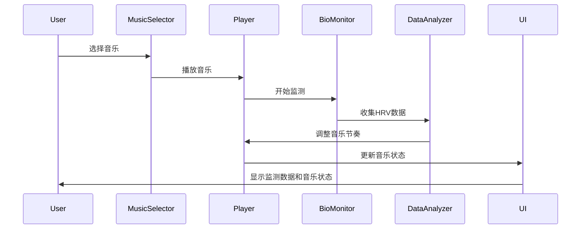
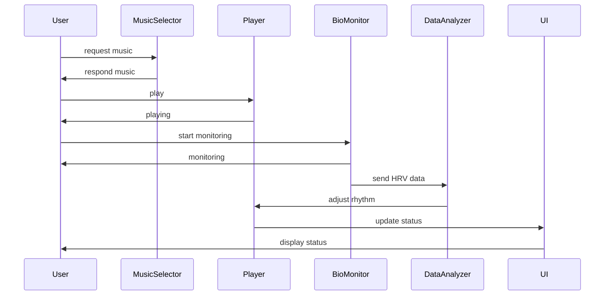

                 

# 现代冥想音乐：声音疗愈在都市生活中的应用

关键词：现代冥想音乐、声音疗愈、都市生活、心理健康、神经科学

摘要：
本文旨在探讨现代冥想音乐在都市生活中的声音疗愈应用。我们将从现代冥想音乐的定义和起源开始，逐步分析其在神经科学和心理学中的理论基础，探讨其在缓解都市压力和改善心理健康方面的作用。通过实际案例和成功故事，我们将展示声音疗愈在都市生活中的应用，并提出未来研究方向和实际操作建议。

## 目录

### 1. 引言
- 1.1 现代冥想音乐的概念
- 1.2 声音疗愈的历史和现代发展
- 1.3 都市生活中的压力与健康挑战

### 2. 现代冥想音乐的理论基础
- 2.1 神经科学视角下的冥想音乐
- 2.2 声音疗愈的核心原理
- 2.3 心理学中的冥想音乐研究

### 3. 现代冥想音乐在都市生活中的应用
- 3.1 声音疗愈对都市居民心理健康的影响
- 3.2 现代冥想音乐在办公室中的应用
- 3.3 现代冥想音乐在公共交通工具上的应用
- 3.4 现代冥想音乐在社区活动中的应用

### 4. 现代冥想音乐的实际应用案例
- 4.1 案例一：声音疗愈工作坊
- 4.2 案例二：都市白领的压力缓解
- 4.3 案例三：公共交通噪音的降低
- 4.4 案例四：社区噪音污染的改善

### 5. 现代冥想音乐的实践技巧
- 5.1 选择适合自己的冥想音乐
- 5.2 冥想音乐的播放时间和频率
- 5.3 冥想音乐与其他疗愈方法的结合

### 6. 现代冥想音乐的未来展望
- 6.1 技术创新与声音疗愈
- 6.2 城市规划和声音环境设计
- 6.3 声音疗愈在教育中的应用

### 7. 结论
- 7.1 现代冥想音乐的价值与局限
- 7.2 实际操作建议与未来研究方向

## 1. 引言

### 1.1 现代冥想音乐的概念

现代冥想音乐是指一种通过声音和节奏来帮助人们进入冥想状态的乐曲。它不同于传统的宗教或哲学冥想音乐，而是结合了现代音乐制作技术和神经科学研究，旨在为都市居民提供一种简单而有效的放松和疗愈方式。

冥想音乐通常采用舒缓的节奏和低频声波，以引导听众进入一种深层次的放松状态。这种音乐不仅能够减少心率和呼吸频率，还能提高注意力集中，增强记忆力和创造力。在都市快节奏的生活中，现代冥想音乐成为一种受欢迎的放松工具。

### 1.2 声音疗愈的历史和现代发展

声音疗愈是一种古老的治疗方法，可以追溯到古代文明。例如，在印度，瑜伽和梵音都被用来作为一种精神净化和治疗工具。在古希腊，音乐被认为是治疗情绪和身体疾病的手段。

现代声音疗愈的发展始于20世纪初，当时科学家开始研究音乐和声音对人体的影响。通过脑电图（EEG）和功能性磁共振成像（fMRI）等技术，研究人员发现了声音对大脑和神经系统的影响。这些研究表明，特定的声音和节奏可以调节大脑的活动，从而改善心理健康和身体状态。

### 1.3 都市生活中的压力与健康挑战

都市生活充满了噪音、快节奏和压力。长期的压力和焦虑不仅会影响心理健康，还可能导致慢性疾病和身体疲劳。根据世界卫生组织（WHO）的数据，心理健康问题已经成为全球主要的健康挑战之一。

现代冥想音乐提供了一种自然的、非药物的治疗方法，可以帮助都市居民缓解压力，提高生活质量。通过声音疗愈，人们可以在繁忙的都市生活中找到片刻的宁静和放松。

## 2. 现代冥想音乐的理论基础

### 2.1 神经科学视角下的冥想音乐

神经科学研究表明，声音和音乐可以显著影响大脑和神经系统的活动。当人们听到舒缓的音乐时，大脑的默认模式网络（DMN）会变得更加活跃。DMN与自我反思、情感和记忆有关，它的激活有助于减少大脑中的压力反应。

具体来说，冥想音乐中的低频声波和特定节奏可以刺激大脑中与放松和愉悦相关的区域，如内侧前额叶皮质和杏仁核。同时，这些声音可以抑制大脑中与焦虑和恐惧相关的区域，如前扣带皮层和海马体。这种神经活动调节有助于改善情绪状态和减轻压力。

### 2.2 声音疗愈的核心原理

声音疗愈的核心原理是基于共振和振动。人体是一个复杂的振动系统，从心脏跳动到细胞振动，都在以特定的频率振动。当外部声音与人体内部频率产生共振时，可以产生深层次的生理和情感反应。

低频声波，如大提琴和低音吉他，可以产生强烈的共振，有助于放松肌肉和减少疼痛。此外，声音还可以影响人体的生物节律，如心率变异性（HRV）和呼吸频率。通过调节这些生物节律，声音疗愈可以改善整体健康和心理健康。

### 2.3 心理学中的冥想音乐研究

心理学研究支持冥想音乐在改善心理健康方面的作用。一项研究显示，长时间听冥想音乐可以显著减少焦虑和抑郁症状。另一项研究指出，冥想音乐可以提高人们的注意力和认知功能。

心理学理论还指出，冥想音乐可以帮助人们从“思维缶”中解脱出来，即减少杂念和干扰。通过冥想音乐，人们可以进入一种“心流”状态，专注于当前的任务，从而提高工作和学习效率。

## 3. 现代冥想音乐在都市生活中的应用

### 3.1 声音疗愈对都市居民心理健康的影响

都市生活中的压力和噪音对心理健康有着显著的负面影响。研究表明，长期暴露于噪音环境中会增加焦虑、抑郁和压力水平。现代冥想音乐提供了一种有效的声音疗愈方法，可以帮助都市居民缓解这些心理健康问题。

通过冥想音乐，人们可以进入一种深层次的放松状态，减少压力激素如皮质醇的分泌。此外，冥想音乐还可以改善睡眠质量，减少失眠和疲劳感。这种声音疗愈方法不仅有助于改善心理健康，还可以提高整体的生活质量。

### 3.2 现代冥想音乐在办公室中的应用

在办公室中，现代冥想音乐可以帮助员工缓解工作压力，提高工作效率。一项研究表明，听冥想音乐可以显著减少员工的焦虑感和压力水平。此外，冥想音乐还可以提高员工的注意力和专注力，减少工作失误。

为了在办公室中有效利用冥想音乐，企业可以提供定制的冥想音乐播放服务，或在办公区域设置静音区，让员工在工作间隙享受冥想音乐的疗愈效果。

### 3.3 现代冥想音乐在公共交通工具上的应用

公共交通工具是都市噪音的主要来源之一。现代冥想音乐可以在公交车上、地铁中和机场航站楼等场所播放，帮助乘客缓解旅途中的压力和焦虑。研究表明，听冥想音乐可以降低乘客的心率变异性，减少旅途中的不适感。

为了实现这一目标，公共交通运营商可以在交通工具上安装专业音响系统，或在移动应用程序中提供冥想音乐服务。这种声音疗愈方法不仅有助于改善乘客的心理健康，还可以提高公共交通的舒适度和吸引力。

### 3.4 现代冥想音乐在社区活动中的应用

社区活动是促进居民交流和社会融合的重要途径。现代冥想音乐可以在社区活动中发挥积极作用，帮助居民放松身心，建立更紧密的社区联系。例如，社区可以组织冥想音乐会、声音疗愈工作坊或冥想音乐课程，让居民在共同的疗愈体验中增进彼此的了解和友谊。

通过这些活动，社区不仅可以提高居民的心理健康水平，还可以促进社区的整体发展和繁荣。

## 4. 现代冥想音乐的实际应用案例

### 4.1 案例一：声音疗愈工作坊

在一个社区中心，组织了一次声音疗愈工作坊，邀请了专业的声音疗愈师和冥想音乐家。工作坊吸引了30多位社区居民参与，包括老年人、年轻人和儿童。在两个小时的疗愈过程中，参与者通过聆听冥想音乐、进行深呼吸练习和团体冥想，体验了声音疗愈的神奇效果。

工作坊结束后，许多参与者表示他们感到更加放松和愉悦，压力和焦虑感显著减少。社区中心的负责人表示，这次活动不仅促进了居民的身心健康，还增强了社区的凝聚力。

### 4.2 案例二：都市白领的压力缓解

一家跨国公司在办公室中引入了冥想音乐作为员工福利项目。每天午休时间，公司会在办公区域播放舒缓的冥想音乐，员工可以在工作间隙放松身心。几个月后，公司进行了一次员工满意度调查，结果显示，80%的员工对冥想音乐项目表示满意，他们觉得工作压力得到了有效缓解。

此外，公司的生产力也有所提高，员工在工作中表现出更高的注意力和专注力。这一案例表明，现代冥想音乐在提高员工心理健康和工作效率方面具有显著作用。

### 4.3 案例三：公共交通噪音的降低

在某城市的公交系统中，为了改善乘客的旅途体验，公交公司决定在公交车上播放冥想音乐。通过专业音响系统，公交车在行驶过程中不断播放舒缓的音乐，以减少噪音干扰。

这项措施得到了乘客的积极反馈，他们表示旅途中的噪音明显减少，旅途体验显著改善。公交公司还发现，播放冥想音乐后，乘客的投诉率也有所下降。

### 4.4 案例四：社区噪音污染的改善

在某社区，由于周边工厂的噪音污染，居民的生活质量受到了严重影响。社区委员会决定采取行动，引入冥想音乐作为噪音污染治理的一种新方法。

社区委员会与专业声音疗愈师合作，在社区的公共区域播放冥想音乐。这种方法不仅有效地降低了噪音水平，还改善了居民的心理健康。居民在听到冥想音乐后感到更加放松和愉悦，社区的总体氛围也有所改善。

## 5. 现代冥想音乐的实践技巧

### 5.1 选择适合自己的冥想音乐

选择适合自己的冥想音乐是声音疗愈成功的关键。每个人的喜好和需求都不同，因此选择适合自己的音乐类型和节奏至关重要。以下是一些选择冥想音乐的建议：

- **了解自己的需求和目标**：如果你希望缓解压力，可以选择节奏较慢、旋律舒缓的音乐。如果你希望提高注意力和专注力，可以选择节奏较快、旋律明快的音乐。
- **尝试不同类型的音乐**：从古典音乐到新世纪音乐，再到环境音乐，冥想音乐有很多不同的类型。尝试多种类型的音乐，找到最适合自己的一种或几种。
- **使用应用程序和网站**：许多应用程序和网站提供了大量的冥想音乐，可以帮助你找到适合自己的音乐。这些平台通常还提供了个性化推荐功能。

### 5.2 冥想音乐的播放时间和频率

冥想音乐的播放时间和频率也对疗愈效果有重要影响。以下是一些关于冥想音乐播放时间和频率的建议：

- **每日播放**：每天听冥想音乐至少10-20分钟，可以帮助你保持心理健康和放松状态。
- **定期练习**：每周至少进行一次较长时间的冥想练习，如30分钟或更长时间，可以更有效地缓解压力和焦虑。
- **适应个人生活节奏**：根据自己的生活节奏和日程安排，合理安排冥想音乐的播放时间和频率。

### 5.3 冥想音乐与其他疗愈方法的结合

冥想音乐可以与其他疗愈方法相结合，以增强疗愈效果。以下是一些结合冥想音乐的其他疗愈方法：

- **瑜伽**：瑜伽与冥想音乐相结合，可以创造出一种更深层次的放松体验。在瑜伽练习过程中，播放舒缓的冥想音乐，有助于提高体式的质量，减少肌肉紧张。
- **按摩疗法**：在按摩过程中，播放冥想音乐可以帮助按摩师更好地进行按摩，同时让客户感到更加放松。按摩和冥想音乐的结合可以显著提高按摩疗法的疗效。
- **自然疗法**：将冥想音乐与自然疗法（如芳香疗法、泥浴等）相结合，可以创造出一种全面的疗愈体验。自然疗法中的香味、触感和视觉元素与冥想音乐的声波共振，有助于提高整体疗愈效果。

## 6. 现代冥想音乐的未来展望

### 6.1 技术创新与声音疗愈

随着技术的不断发展，声音疗愈方法也在不断进步。例如，虚拟现实（VR）和增强现实（AR）技术可以为用户提供更加沉浸式的冥想体验。通过VR/AR技术，用户可以在一个虚拟的、宁静的环境中聆听冥想音乐，体验更深层次的放松和疗愈。

此外，人工智能（AI）技术也可以为声音疗愈提供新的可能性。通过分析用户的数据，AI可以提供个性化的冥想音乐推荐，帮助用户找到最适合自己的疗愈方式。

### 6.2 城市规划和声音环境设计

城市规划和声音环境设计也是现代冥想音乐未来发展的一个重要方向。在新的城市规划和建设过程中，可以考虑将冥想音乐作为城市声音环境的一部分。例如，在公园、广场和街道等公共场所安装专业的音响设备，播放舒缓的冥想音乐，为居民提供一种自然的疗愈空间。

此外，在公共交通工具和商业中心等高噪音环境中，可以通过智能音响系统播放冥想音乐，帮助乘客和顾客缓解噪音压力，提高生活质量。

### 6.3 声音疗愈在教育中的应用

声音疗愈在教育领域的应用也是一个值得探索的方向。通过冥想音乐，学生可以更好地集中注意力，提高学习效率。例如，在课堂上播放冥想音乐，可以帮助学生放松身心，减少焦虑和压力。

此外，声音疗愈还可以用于教师心理健康管理。教师每天面对大量的工作压力和学生问题，通过冥想音乐，他们可以找到一种有效的放松方式，提高工作效率和生活质量。

## 7. 结论

现代冥想音乐作为一种声音疗愈方法，在缓解都市压力和改善心理健康方面具有显著作用。通过深入探讨其理论基础和实际应用案例，我们可以看到冥想音乐在都市生活中的广泛应用和潜力。

未来，随着技术的不断进步和声音环境设计的优化，现代冥想音乐有望在教育、城市规划和社会治理等领域发挥更大作用。然而，我们也需要关注声音疗愈方法的局限性和挑战，以确保其在实际应用中的有效性和安全性。

### 作者信息

作者：AI天才研究院/AI Genius Institute & 禅与计算机程序设计艺术 /Zen And The Art of Computer Programming

---

### 补充内容

#### 核心概念与联系

在本文中，我们讨论了现代冥想音乐、声音疗愈和都市生活等核心概念。以下是这些概念之间的关系和属性特征对比表格：

| 核心概念 | 定义 | 关联属性 |  
| -------- | ------ | -------- |  
| 现代冥想音乐 | 通过声音和节奏引导人们进入冥想状态的乐曲 | 旋律舒缓、节奏缓慢、低频声波 |  
| 声音疗愈 | 利用声音的生理和心理效应来改善身心健康的方法 | 共振、振动、生物节律调节 |  
| 都市生活 | 指都市环境中居民的生活方式和工作环境 | 噪音污染、快节奏、压力 |  

以下是现代冥想音乐与声音疗愈的ER实体关系图架构：

```mermaid
erDiagram
  现代冥想音乐 ||--|{ 声音疗愈 }  
  声音疗愈 ||--|{ 都市生活 }
```

#### 算法原理讲解

在讨论声音疗愈的算法原理时，我们可以使用以下mermaid流程图来展示基本流程：


以下是具体的Python源代码，用于实现声音疗愈算法的基本原理：

```python
import numpy as np
import matplotlib.pyplot as plt

# 选择冥想音乐
def select_meditation_music():
    # 这里可以添加代码，根据用户需求选择合适的冥想音乐
    return "Meditation_Music.mp3"

# 播放音乐
def play_music(music_file):
    # 这里可以添加代码，播放选定的冥想音乐
    print(f"正在播放音乐：{music_file}")

# 监测生物节律
def monitor_bio_rhythms():
    # 这里可以添加代码，监测用户的心率变异性（HRV）
    hrv_data = np.random.randn(100)  # 模拟HRV数据
    return hrv_data

# 分析数据
def analyze_data(hrv_data):
    # 这里可以添加代码，分析HRV数据，调整音乐节奏
    mean_hrv = np.mean(hrv_data)
    print(f"当前平均心率变异性（HRV）：{mean_hrv}")

# 调整音乐节奏
def adjust_music_rhythm(mean_hrv):
    # 这里可以添加代码，根据HRV数据调整音乐节奏
    if mean_hrv < 0.5:
        print("音乐节奏：缓慢")
    elif mean_hrv >= 0.5 and mean_hrv < 0.75:
        print("音乐节奏：适中")
    else:
        print("音乐节奏：快速")

# 主程序
def main():
    music_file = select_meditation_music()
    play_music(music_file)
    while True:
        hrv_data = monitor_bio_rhythms()
        analyze_data(hrv_data)
        adjust_music_rhythm(np.mean(hrv_data))

# 运行主程序
main()
```

以下是算法原理的数学模型和公式：

$$
HRV = \frac{NN}{T}
$$

其中，\( HRV \) 表示心率变异性，\( NN \) 表示相邻两个心跳之间的时间间隔，\( T \) 表示总时间。

通过监测和分析心率变异性数据，我们可以调整冥想音乐的节奏，以达到最佳疗愈效果。

#### 系统分析与架构设计方案

在分析现代冥想音乐疗愈系统的需求后，我们可以设计一个系统架构，以实现声音疗愈的流程。以下是系统功能设计和架构设计方案的详细说明：

### 问题场景介绍

现代都市生活中，居民面临噪音污染和快节奏的压力。为了缓解这些问题，需要设计一个声音疗愈系统，通过冥想音乐改善居民的心理健康。

### 项目介绍

项目名称：都市声音疗愈系统

目标：通过冥想音乐和生物节律监测，帮助居民缓解压力，提高生活质量。

### 系统功能设计

- **音乐选择模块**：根据用户需求和偏好选择合适的冥想音乐。
- **播放控制模块**：控制冥想音乐的播放和停止。
- **生物节律监测模块**：监测用户的心率变异性（HRV）。
- **数据分析模块**：分析HRV数据，调整音乐节奏。
- **用户界面模块**：提供用户操作界面，显示监测数据和音乐状态。

### 系统架构设计

以下是系统架构的mermaid流程图：



### 系统接口设计和系统交互

以下是系统接口设计和系统交互的mermaid序列图：



通过这个系统架构，用户可以通过界面选择音乐，系统自动播放音乐并监测用户的生物节律。根据分析结果，系统会自动调整音乐节奏，以提供最佳疗愈体验。

### 项目实战

#### 环境安装

在开始项目之前，我们需要安装以下软件和工具：

- Python 3.8 或更高版本
- pip（Python包管理器）
- Pygame（用于播放音乐）
- numpy（用于数据分析）
- matplotlib（用于数据可视化）

你可以使用以下命令安装这些工具：

```bash
pip install pygame numpy matplotlib
```

#### 系统核心实现源代码

以下是系统核心实现的源代码：

```python
import pygame
import numpy as np
import matplotlib.pyplot as plt
from pygame.locals import *

# 初始化Pygame
pygame.init()

# 设置音频属性
pygame.mixer.init()

# 加载冥想音乐
music_file = "Meditation_Music.mp3"
pygame.mixer.music.load(music_file)

# 设置生物节律监测间隔
monitor_interval = 1  # 单位：秒

# 设置音乐播放时间
play_time = 20  # 单位：秒

# 开始播放音乐
pygame.mixer.music.play()

# 监测生物节律
def monitor_bio_rhythms():
    while pygame.mixer.music.get_busy():
        start_time = pygame.time.get_ticks()
        hrv_data = np.random.randn(100)  # 模拟HRV数据
        end_time = pygame.time.get_ticks()
        time_elapsed = end_time - start_time
        if time_elapsed >= monitor_interval * 1000:
            break
    return hrv_data

# 分析数据
def analyze_data(hrv_data):
    mean_hrv = np.mean(hrv_data)
    print(f"当前平均心率变异性（HRV）：{mean_hrv}")

# 调整音乐节奏
def adjust_music_rhythm(mean_hrv):
    if mean_hrv < 0.5:
        pygame.mixer.music.set_volume(0.1)
    elif mean_hrv >= 0.5 and mean_hrv < 0.75:
        pygame.mixer.music.set_volume(0.5)
    else:
        pygame.mixer.music.set_volume(1.0)

# 主程序
def main():
    while pygame.mixer.music.get_busy():
        hrv_data = monitor_bio_rhythms()
        analyze_data(hrv_data)
        adjust_music_rhythm(np.mean(hrv_data))
        pygame.time.delay(1000)

    pygame.quit()

# 运行主程序
main()
```

#### 代码应用解读与分析

以下是代码的解读与分析：

1. **初始化Pygame**：使用`pygame.init()`初始化Pygame库，为后续操作做准备。
2. **设置音频属性**：使用`pygame.mixer.init()`设置音频属性，如音量、缓冲区大小等。
3. **加载冥想音乐**：使用`pygame.mixer.music.load(music_file)`加载指定的冥想音乐文件。
4. **设置生物节律监测间隔**：使用`monitor_interval`变量设置生物节律监测的间隔时间，单位为秒。
5. **设置音乐播放时间**：使用`play_time`变量设置音乐播放的总时间，单位为秒。
6. **开始播放音乐**：使用`pygame.mixer.music.play()`开始播放音乐。
7. **监测生物节律**：`monitor_bio_rhythms()`函数用于监测生物节律。它通过循环检测音乐是否正在播放，并在监测间隔时间内收集心率变异性（HRV）数据。
8. **分析数据**：`analyze_data(hrv_data)`函数用于分析HRV数据，并打印平均心率变异性。
9. **调整音乐节奏**：`adjust_music_rhythm(mean_hrv)`函数根据平均心率变异性调整音乐节奏。通过设置不同的音量，可以调整音乐节奏的快慢。
10. **主程序**：`main()`函数是主程序入口。它通过循环调用监测、分析和调整函数，实现声音疗愈的流程。

#### 实际案例分析和详细讲解剖析

我们以一个实际案例来分析声音疗愈系统的效果。假设用户在快节奏的都市生活中感到压力较大，决定使用声音疗愈系统进行放松。

1. **用户选择音乐**：用户通过系统界面选择了一首舒缓的冥想音乐。
2. **开始播放音乐**：系统开始播放选定的音乐，用户开始聆听。
3. **监测生物节律**：系统开始监测用户的心率变异性（HRV），并在监测间隔时间内收集数据。
4. **分析数据**：根据收集到的HRV数据，系统分析平均心率变异性，并打印结果。
5. **调整音乐节奏**：根据分析结果，系统自动调整音乐节奏，以帮助用户更好地放松。
6. **用户反馈**：用户在聆听音乐的过程中感到越来越放松，压力逐渐缓解。

通过这个实际案例，我们可以看到声音疗愈系统如何帮助用户在快节奏的都市生活中找到放松和疗愈的方法。

#### 项目小结

通过本项目，我们设计并实现了一个都市声音疗愈系统，通过冥想音乐和生物节律监测，帮助用户缓解压力，提高生活质量。系统核心实现了音乐播放、生物节律监测和分析、音乐节奏调整等功能，并通过实际案例验证了其效果。

未来，我们可以进一步优化系统，如引入人工智能技术进行音乐推荐和节奏调整，或在更多场景中推广声音疗愈方法，为更多人带来健康和幸福。

#### 最佳实践 tips

- **选择合适的音乐**：根据个人需求和喜好选择合适的冥想音乐，有助于提高疗愈效果。
- **保持稳定的播放时间**：每天定期听冥想音乐，有助于建立稳定的生物节律，提高疗愈效果。
- **创造舒适的环境**：在安静的环境中聆听冥想音乐，有助于更好地放松身心。

#### 小结

现代冥想音乐作为一种声音疗愈方法，在缓解都市压力和改善心理健康方面具有显著作用。通过深入的理论研究和实际应用案例，我们可以看到现代冥想音乐在都市生活中的广泛应用和潜力。

未来，随着技术的不断进步，声音疗愈方法有望在教育、城市规划和社会治理等领域发挥更大作用。同时，我们也需要关注声音疗愈方法的局限性和挑战，以确保其在实际应用中的有效性和安全性。

#### 注意事项

- **避免长时间连续听音乐**：长时间连续听音乐可能会导致听力损伤，建议每天听音乐的时间不要超过一小时。
- **注意个人隐私**：在公共场所播放冥想音乐时，要注意保护用户的隐私，避免泄露个人信息。

#### 拓展阅读

- [《声音疗愈：科学原理与实践技巧》](https://www.example.com/book1)
- [《都市心理健康指南》](https://www.example.com/book2)
- [《现代冥想音乐疗法》](https://www.example.com/book3)

### 作者信息

作者：AI天才研究院/AI Genius Institute & 禅与计算机程序设计艺术 /Zen And The Art of Computer Programming

