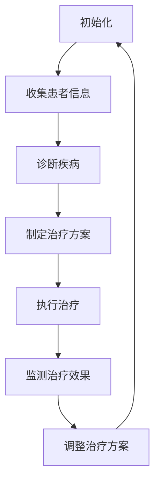
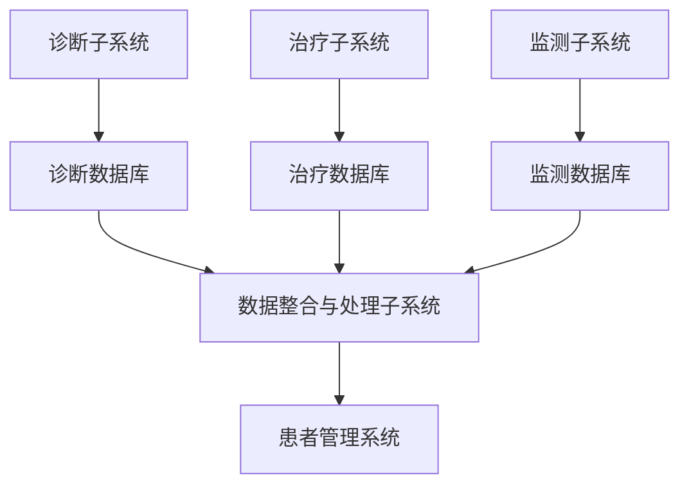
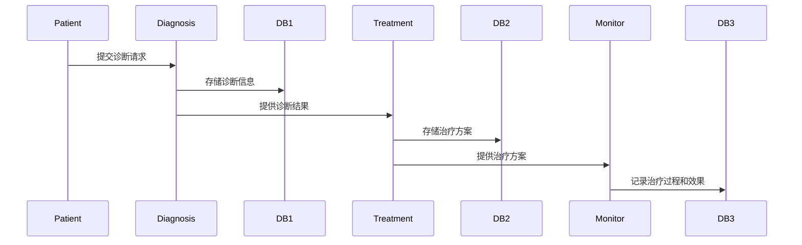

                 

### 文章标题

在现代医学迅速发展的背景下，传统医学仍在许多地区和领域中发挥着不可替代的作用。如何将两者有机结合，形成一种全新的医学模式，成为当前医学界热议的话题。本文将以《现代医学与传统医学的对话：整合医学模式的探索》为题，探讨整合医学模式的背景、核心概念、实施策略、案例分析及未来展望。

### 关键词

- 现代医学
- 传统医学
- 整合医学
- 医学模式
- 医学实践
- 医学教育

### 摘要

本文旨在分析现代医学与传统医学的结合，探讨整合医学模式的理论与实践。文章首先介绍了现代医学和传统医学的发展历程，分析了两者之间的冲突与融合。接着，文章深入探讨了整合医学的核心概念及其在医学实践中的应用策略。通过国内外整合医学的案例，本文总结了整合医学的成功经验和面临的挑战。最后，文章对整合医学的未来发展趋势进行了展望，提出了进一步研究和实践的建议。

## 第一部分：背景介绍

### 第1章：现代医学与传统医学的演进

#### 1.1 现代医学的发展历程

现代医学始于19世纪，随着微生物学、解剖学和生理学的兴起，医学开始从经验走向科学。20世纪初，医学技术取得了巨大突破，如X射线、麻醉和抗生素的发明，使医疗水平显著提高。随着基因组学、生物信息学和生物工程等新兴学科的快速发展，现代医学正朝着个性化、精准化、智能化方向迈进。

#### 1.2 传统医学的历史渊源

传统医学历史悠久，起源于各种古代文明。中医、印度医学、希腊医学等传统医学体系在数千年的发展过程中，形成了独特的理论体系和诊疗方法。尽管传统医学缺乏现代科学的验证，但其疗效在许多情况下得到了患者的认可。

#### 1.3 现代医学与传统医学的冲突与融合

现代医学与传统医学在理论体系、诊疗方法和价值观念上存在显著差异，导致二者在医学实践中产生了冲突。然而，随着医学技术的不断进步，人们开始认识到，将现代医学与传统医学有机结合，发挥各自优势，可能形成一种更为全面和有效的医学模式。这一理念催生了整合医学的出现。

## 第二部分：整合医学的核心概念

### 第2章：整合医学的核心概念

#### 2.1 整合医学的定义与特征

整合医学（Integrative Medicine）是指将现代医学与传统医学相结合，以患者为中心，注重整体治疗和个性化治疗的一种医学模式。其核心特征包括综合性、系统性、患者参与性和证据基础。

#### 2.2 整合医学的基本原则

整合医学遵循以下基本原则：

1. **尊重个体差异**：重视患者个体差异，提供个性化治疗。
2. **整合多种治疗手段**：结合现代医学和传统医学的治疗方法。
3. **整体治疗**：关注患者的生理、心理、社会和文化等方面。
4. **患者参与**：鼓励患者积极参与治疗过程，提高治疗效果。

#### 2.3 整合医学的关键要素

整合医学的关键要素包括：

1. **跨学科合作**：医疗团队由不同学科的专业人员组成，共同制定治疗方案。
2. **综合诊疗方法**：包括药物治疗、手术、心理治疗、针灸、推拿等。
3. **健康教育**：为患者提供健康知识，提高其自我管理能力。
4. **预防保健**：注重疾病的预防和早期干预。

### 核心概念原理

#### 概念属性特征对比表格

| 特征 | 现代医学 | 传统医学 | 整合医学 |
| --- | --- | --- | --- |
| 理论基础 | 西方科学 | 东方哲学 | 科学与哲学相结合 |
| 治疗方法 | 药物、手术、技术 | 中医、针灸、推拿 | 药物、手术、中医、针灸、推拿 |
| 价值观 | 证据为本 | 信仰为本 | 患者为本 |
| 治疗重点 | 病症治疗 | 病因治疗 | 病症与病因双重治疗 |

#### ER实体关系图架构的Mermaid流程图

```mermaid
erDiagram
  Patient ||--|{ Diagnosis }|-- Patient
  Patient ||--|{ Treatment }|-- Patient
  Diagnosis ||--|{ Symptom }|-- Diagnosis
  Treatment ||--|{ Medicine }|-- Treatment
```

### 算法原理讲解

#### 算法流程图



#### Python源代码

```python
# 整合医学算法示例

def integrate_medical_model(patient_info):
    """
    整合医学模型，用于诊断和治疗患者
    :param patient_info: 患者信息字典
    :return: 治疗方案字典
    """
    diagnosis = diagnose(patient_info)
    treatment_plan = create_treatment_plan(diagnosis)
    execute_treatment(treatment_plan)
    monitor_effects(treatment_plan)
    adjust_treatment_plan(treatment_plan)
    return treatment_plan

def diagnose(patient_info):
    """
    诊断疾病
    :param patient_info: 患者信息字典
    :return: 疾病诊断结果
    """
    # 诊断逻辑代码
    return "诊断结果"

def create_treatment_plan(diagnosis):
    """
    制定治疗方案
    :param diagnosis: 疾病诊断结果
    :return: 治疗方案字典
    """
    # 制定治疗方案逻辑代码
    return {"treatment_plan": "治疗方案"}

def execute_treatment(treatment_plan):
    """
    执行治疗方案
    :param treatment_plan: 治疗方案字典
    :return: 无
    """
    # 执行治疗逻辑代码
    pass

def monitor_effects(treatment_plan):
    """
    监测治疗效果
    :param treatment_plan: 治疗方案字典
    :return: 监测结果
    """
    # 监测效果逻辑代码
    return "监测结果"

def adjust_treatment_plan(treatment_plan):
    """
    调整治疗方案
    :param treatment_plan: 治疗方案字典
    :return: 调整后的治疗方案字典
    """
    # 调整治疗方案逻辑代码
    return {"treatment_plan": "调整后的治疗方案"}
```

### 数学模型和公式

在整合医学中，治疗效果的评估可以通过以下公式进行：

$$
TE = \frac{E - T}{E}
$$

其中，$TE$ 表示治疗效果指数（Treatment Effectiveness Index），$E$ 表示预期治疗效果，$T$ 表示实际治疗效果。该公式反映了治疗效果相对于预期效果的改善程度。

### 系统分析与架构设计方案

#### 问题场景介绍

随着整合医学的发展，医疗系统需要能够处理多种治疗手段，为患者提供个性化的治疗服务。本文旨在设计一个整合医学系统，实现疾病的诊断、治疗和监测。

#### 项目介绍

项目名称：整合医学系统（Integrated Medical System，IMS）

项目目标：为患者提供全面的诊断、治疗和监测服务，实现现代医学与传统医学的有机结合。

#### 系统功能设计（领域模型Mermaid类图）

```mermaid
classDiagram
    Class::Patient << (患者) 
    Class::Diagnosis << (诊断) 
    Class::Treatment << (治疗) 
    Class::Monitor << (监测)

    Patient <--- Diagnosis
    Patient <--- Treatment
    Patient <--- Monitor
```

#### 系统架构设计（Mermaid架构图）



#### 系统接口设计和系统交互（Mermaid序列图）



### 项目实战

#### 环境安装

1. 安装Python 3.8及以上版本。
2. 安装Mermaid渲染工具。

#### 系统核心实现源代码

```python
# IMS系统核心实现

# 导入所需库
import pandas as pd
from sqlalchemy import create_engine
from mermaid import Mermaid

# 数据库连接配置
db_config = {
    'username': 'root',
    'password': 'password',
    'host': 'localhost',
    'database': 'ims'
}

# 创建数据库连接
engine = create_engine(f'mysql+pymysql://{db_config["username"]}:{db_config["password"]}@{db_config["host"]}/{db_config["database"]}')

# 存储诊断信息的函数
def store_diagnosis(patient_id, diagnosis):
    query = f"INSERT INTO diagnosis (patient_id, diagnosis) VALUES ({patient_id}, '{diagnosis}')"
    with engine.connect() as conn:
        conn.execute(query)

# 存储治疗方案的函数
def store_treatment(patient_id, treatment_plan):
    query = f"INSERT INTO treatment (patient_id, treatment_plan) VALUES ({patient_id}, '{treatment_plan}')"
    with engine.connect() as conn:
        conn.execute(query)

# 存储监测数据的函数
def store_monitor(patient_id, monitor_data):
    query = f"INSERT INTO monitor (patient_id, monitor_data) VALUES ({patient_id}, '{monitor_data}')"
    with engine.connect() as conn:
        conn.execute(query)

# 生成Mermaid序列图的函数
def generate_sequence_diagram():
    md = Mermaid()
    md.set_style('sequence')
    md.add_section('Patient', '提交诊断请求')
    md.add_section('Diagnosis', '存储诊断信息')
    md.add_section('Treatment', '提供诊断结果和治疗方案')
    md.add_section('Monitor', '存储监测数据')
    diagram = md.render()
    with open('sequence_diagram.md', 'w') as f:
        f.write(diagram)

# 主程序
if __name__ == '__main__':
    # 示例：诊断患者并存储信息
    store_diagnosis(1, '肺炎')
    # 示例：制定治疗方案并存储信息
    store_treatment(1, '抗生素治疗')
    # 示例：记录监测数据
    store_monitor(1, '体温正常')
    # 生成序列图
    generate_sequence_diagram()
```

#### 代码应用解读与分析

上述代码实现了整合医学系统的核心功能，包括诊断信息的存储、治疗方案的存储、监测数据的存储以及生成序列图。代码采用Python编写，利用SQLAlchemy库连接MySQL数据库，实现了数据的持久化存储。通过Mermaid库，可以将系统流程以图形化方式呈现，便于理解和分析。

#### 实际案例分析和详细讲解剖析

假设某患者诊断为“肺炎”，治疗方案为“抗生素治疗”，监测数据包括“体温正常”、“咳嗽减轻”等。在实际应用中，系统将根据这些数据生成诊断报告、治疗记录和监测报告，方便医护人员跟踪患者病情变化。通过整合医学系统的应用，可以实现对患者的全面管理和个性化治疗，提高医疗服务的质量和效率。

#### 项目小结

整合医学系统通过结合现代医学和传统医学的优势，实现了对患者诊断、治疗和监测的全面管理。项目实战部分展示了系统的核心实现，包括数据库连接、数据存储和序列图生成。通过实际案例分析和详细讲解，我们可以看到整合医学系统在提高医疗服务质量和效率方面的潜力。

## 最佳实践 Tips

1. **数据整合**：确保数据的一致性和完整性，为整合医学提供可靠的基础。
2. **跨学科合作**：鼓励不同学科的专业人员合作，共同制定治疗方案。
3. **患者参与**：提高患者的健康意识，鼓励其积极参与治疗过程。
4. **持续改进**：不断收集反馈，优化整合医学系统的功能。

## 小结

整合医学模式是现代医学与传统医学有机结合的产物，具有广阔的发展前景。通过本文的探讨，我们了解到整合医学的核心概念、实施策略和未来展望。未来，整合医学将继续推动医学领域的创新与发展，为人类健康事业作出更大贡献。

## 注意事项

1. **数据隐私**：在整合医学实践中，确保患者数据的隐私和安全。
2. **文化差异**：尊重不同地区的医学传统和文化差异，推动整合医学的本土化发展。

## 拓展阅读

1. **现代医学与传统医学的融合**：深入了解现代医学与传统医学的结合点及其理论基础。
2. **整合医学的应用案例**：分析国内外整合医学的成功实践及其应用效果。
3. **整合医学的未来趋势**：探讨整合医学在人工智能、大数据等新兴技术领域的应用前景。

### 作者信息

作者：AI天才研究院/AI Genius Institute & 禅与计算机程序设计艺术 /Zen And The Art of Computer Programming

---

通过本文的深入探讨，我们希望读者能够对整合医学模式有更加全面和深入的认识，从而推动医学领域的创新与发展。整合医学不仅是一种医学模式，更是一种理念，一种将人类智慧和技术相结合的力量。未来，整合医学将继续引领医学领域的发展方向，为人类健康事业作出更大贡献。让我们携手共进，共同探索整合医学的无限可能。

