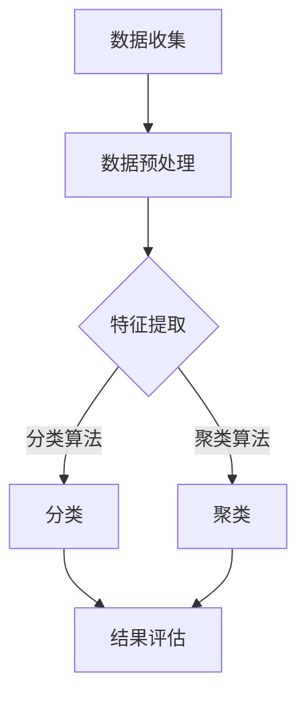
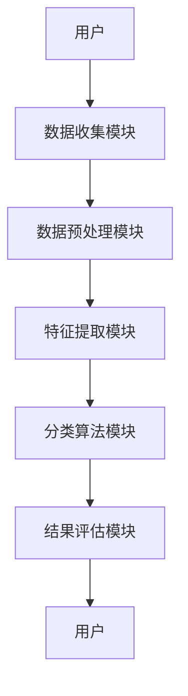
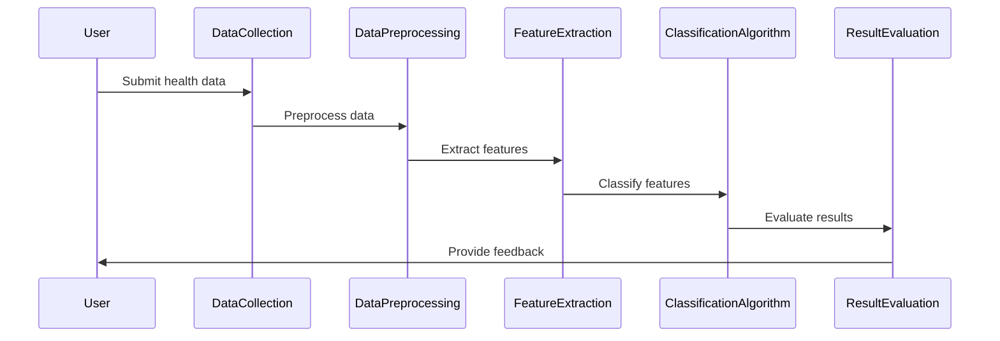

                 

# 现代医学与传统疗法的融合：全人健康观的兴起

> 关键词：现代医学、传统疗法、全人健康观、融合、数据科学

> 摘要：本文将探讨现代医学与传统疗法的融合，阐述其在全人健康观兴起中的重要意义。通过分析核心概念、算法原理，结合实际案例，我们希望能够为读者提供对这一新兴趋势的深刻理解。

----------------------------------------------------------------## 第一部分：背景介绍

### 问题背景

随着科技的飞速发展，现代医学与计算机技术的融合已经为医疗服务带来了革命性的变化。这种融合不仅提高了疾病诊断的准确性，也在个性化治疗和健康预测方面取得了显著成果。与此同时，传统疗法，如中医、针灸、草药等，以其独特的理论体系和丰富的实践经验，为人类健康贡献了千年智慧。将现代医学与传统疗法相结合，不仅能够充分利用两者的优势，还能够为患者提供更加全面、个性化的健康服务。

### 问题描述

《现代医学与传统疗法的融合：全人健康观的兴起》一书，旨在深入探讨这一融合的背景、原理及其在健康领域的应用。本书将首先介绍现代医学与传统疗法的理论基础，然后分析它们在治疗和预防疾病方面的作用。在此基础上，本书将探讨全人健康观的内涵，并探讨如何通过融合两种疗法来实现这一健康理念。最后，本书将结合实际案例，展示这一融合在改善患者生活质量方面的成效。

### 问题解决

通过全面阐述现代医学与传统疗法融合的理论基础、实践方法及成功案例，本书旨在为读者提供一份系统的、易于理解的指南。读者将了解到这一融合如何改善健康结果，提升患者生活质量。同时，本书也将探讨这一融合面临的挑战和未来发展方向。

### 边界与外延

本书将围绕现代医学与传统疗法的融合展开讨论，但并不局限于某一特定领域。它将涵盖各种健康相关的问题，如慢性疾病管理、心理健康、运动与健康等。同时，本书也将探讨这一融合在医学研究、医疗教育等方面的应用。

### 概念结构与核心要素组成

- **现代医学**：基于科学研究和实证医学的理论和实践，包括药物治疗、手术、放射治疗等。
- **传统疗法**：包括中医、针灸、草药等，强调身体的自我调节和平衡。
- **全人健康观**：强调身心健康、社会适应和整体福祉的综合性健康理念。
- **融合**：通过结合现代医学与传统疗法的优势，提供更全面、个性化的健康服务。

----------------------------------------------------------------## 第二部分：核心概念与联系

### 核心概念原理

现代医学、传统疗法和全人健康观是本书讨论的核心概念。它们各自有着独特的理论基础和实践方法，但在健康领域中有着紧密的联系。

- **现代医学**：基于科学研究和实证医学，通过临床试验和数据分析来确定最有效的治疗方法。它强调对疾病的精确诊断和治疗，以最大限度地提高患者的生活质量。
  
- **传统疗法**：包括中医、针灸、草药等，历史悠久，强调身体的自我调节和平衡。传统疗法通过调整人体的阴阳平衡、气血流通等方式来预防和治疗疾病。

- **全人健康观**：强调身心健康、社会适应和整体福祉。它不仅仅关注身体疾病的治疗，更关注患者的心理健康、社会支持和生活质量。

### 概念属性特征对比表格

| 概念          | 现代医学            | 传统疗法            | 全人健康观          |
|-------------|------------------|------------------|------------------|
| 理论基础      | 科学研究和实证医学   | 传统医学理论        | 科学与传统相结合     |
| 治疗方法      | 药物、手术、放射治疗 | 针灸、中药、推拿等   | 多种方法，综合应用   |
| 目标          | 疾病治疗和康复      | 身体调节和预防      | 身心健康和社会适应   |
| 适用范围      | 现代疾病和急性病    | 各种慢性疾病和体质调理 | 全年龄段、各类健康需求 |
| 效果评估      | 临床指标和统计分析   | 主观感受和身体反馈   | 客观指标与主观体验的结合 |

### ER实体关系图架构

现代医学与传统疗法的融合涉及到多个实体和它们之间的关系。以下是一个简化的ER实体关系图：

```mermaid
erDiagram
    Patient ||--|{ Treatment }|-- HealthIssue
    Treatment ||--|{ Therapy }|-- HealthIssue
    HealthIssue ||--|{ Diagnosis }|-- Patient
    Diagnosis ||--|{ TreatmentPlan }|-- Patient
    TreatmentPlan ||--|{ TherapyPlan }|-- Treatment
    Therapy ||--|{ Practitioner }|-- HealthIssue
    Practitioner ||--|{ Diagnosis }|-- Patient
```

在这个ER图中，`Patient`（患者）是中心实体，与其他实体如`Treatment`（治疗）、`HealthIssue`（健康问题）、`Diagnosis`（诊断）、`TreatmentPlan`（治疗计划）和`Practitioner`（治疗师）有着复杂的关系。这种关系体现了现代医学与传统疗法融合的整体性和综合性。

----------------------------------------------------------------## 第三部分：算法原理讲解

### 算法原理

在现代医学与传统疗法的融合过程中，数据科学和算法发挥着关键作用。通过大数据分析和人工智能算法，我们可以从海量数据中提取有价值的信息，为个性化治疗和健康预测提供科学依据。以下是一个简化版的算法流程：

1. **数据收集**：收集患者的健康数据，包括生理指标、生活习惯、疾病史等。
2. **数据预处理**：清洗和整理数据，去除噪声和异常值，为后续分析做准备。
3. **特征提取**：从预处理后的数据中提取有助于疾病诊断和治疗的特征。
4. **数据分析与预测**：使用机器学习算法，对提取的特征进行分析，预测患者的健康状态和可能的疾病发展。
5. **结果评估与反馈**：评估预测结果的准确性，并根据反馈调整算法。

### 算法流程图

以下是一个使用Mermaid绘制的算法流程图：



### Python源代码

以下是一个简化的Python源代码示例，用于实现数据预处理、特征提取和分类算法的基本流程：

```python
import pandas as pd
from sklearn.preprocessing import StandardScaler
from sklearn.ensemble import RandomForestClassifier
from sklearn.model_selection import train_test_split
from sklearn.metrics import accuracy_score

# 数据收集
data = pd.read_csv('health_data.csv')

# 数据预处理
data = data.dropna()  # 去除缺失值
scaler = StandardScaler()
scaled_data = scaler.fit_transform(data.iloc[:, :-1])

# 特征提取
X_train, X_test, y_train, y_test = train_test_split(scaled_data, data['target'], test_size=0.2, random_state=42)

# 分类算法
classifier = RandomForestClassifier(n_estimators=100, random_state=42)
classifier.fit(X_train, y_train)

# 预测与决策
predictions = classifier.predict(X_test)

# 结果评估
accuracy = accuracy_score(y_test, predictions)
print(f"Model accuracy: {accuracy:.2f}")
```

### 算法原理的数学模型和公式

在现代医学与传统疗法的融合中，算法原理的数学模型和公式至关重要。以下是一些常见的数学模型和公式：

1. **线性回归**：用于预测连续值，公式为：
   $$ y = \beta_0 + \beta_1x $$
   其中，$y$ 是预测值，$x$ 是自变量，$\beta_0$ 和 $\beta_1$ 是模型的参数。

2. **逻辑回归**：用于预测概率，公式为：
   $$ P(y=1) = \frac{1}{1 + e^{-(\beta_0 + \beta_1x)}} $$
   其中，$y$ 是目标变量，$x$ 是自变量，$\beta_0$ 和 $\beta_1$ 是模型的参数。

3. **支持向量机**：用于分类问题，公式为：
   $$ w \cdot x - b = 0 $$
   其中，$w$ 是权重向量，$x$ 是特征向量，$b$ 是偏置。

4. **神经网络**：用于复杂函数建模，公式为：
   $$ a_{\text{new}} = \sigma(z) $$
   其中，$a_{\text{new}}$ 是新的激活值，$z$ 是输入值，$\sigma$ 是激活函数。

### 通俗易懂地举例说明

假设我们想要使用机器学习算法来预测患者的病情。我们可以使用以下步骤：

1. **数据收集**：收集患者的健康数据，包括血压、血糖、体温等。
2. **数据预处理**：对数据进行清洗和标准化处理。
3. **特征提取**：选择与病情相关的特征，如血压和血糖。
4. **分类算法**：使用逻辑回归模型来预测患者的病情是否严重。
5. **结果评估**：计算模型的准确率，并根据评估结果调整模型参数。

例如，如果我们的模型预测某个患者的病情为严重，但实际上患者病情并不严重，那么这个预测就被认为是错误的。通过不断调整模型参数和训练数据，我们可以提高模型的预测准确性。

----------------------------------------------------------------## 第四部分：系统分析与架构设计

### 问题场景介绍

在现代医疗环境中，患者的健康数据通常分散在不同的系统和设备中。为了更好地管理这些数据，并实现个性化治疗和健康预测，我们设计了一套基于现代医学与传统疗法融合的医疗信息系统。

### 项目介绍

本系统旨在整合现代医学与传统疗法的优势，提供全面的健康管理和疾病预测服务。系统包括数据收集、数据预处理、特征提取、分类算法和结果评估等模块。

### 系统功能设计

1. **数据收集模块**：负责从各种医疗设备和系统中收集患者的健康数据。
2. **数据预处理模块**：负责清洗和标准化收集到的数据，去除噪声和异常值。
3. **特征提取模块**：负责从预处理后的数据中提取与疾病预测相关的特征。
4. **分类算法模块**：负责使用机器学习算法对提取的特征进行分析和分类。
5. **结果评估模块**：负责评估模型的预测准确性，并根据评估结果调整模型参数。

### 系统架构设计

以下是一个使用Mermaid绘制的系统架构图：



在这个架构中，用户通过数据收集模块提交健康数据，经过数据预处理模块的清洗和标准化处理后，进入特征提取模块。特征提取模块提取与疾病预测相关的特征，然后传递给分类算法模块。分类算法模块使用机器学习算法对特征进行分析和分类，最后的结果通过结果评估模块进行评估，并将评估结果反馈给用户。

### 系统接口设计和系统交互

以下是一个使用Mermaid绘制的系统接口和交互图：



在这个交互图中，用户首先提交健康数据，数据收集模块将数据传递给数据预处理模块。数据预处理模块对数据进行清洗和标准化处理，然后将处理后的数据传递给特征提取模块。特征提取模块提取与疾病预测相关的特征，并传递给分类算法模块。分类算法模块使用机器学习算法对特征进行分析和分类，最后的结果通过结果评估模块进行评估，并将评估结果反馈给用户。

----------------------------------------------------------------## 第五部分：项目实战

### 环境安装

为了实现本项目的系统架构和功能，我们需要安装以下环境：

1. **Python**：版本3.8或以上
2. **Pandas**：用于数据处理
3. **NumPy**：用于数值计算
4. **Scikit-learn**：用于机器学习算法
5. **Matplotlib**：用于数据可视化
6. **Mermaid**：用于绘制图表

安装命令如下：

```bash
pip install python==3.8
pip install pandas numpy scikit-learn matplotlib
```

### 系统核心实现源代码

以下是系统核心实现的Python源代码：

```python
import pandas as pd
from sklearn.preprocessing import StandardScaler
from sklearn.ensemble import RandomForestClassifier
from sklearn.model_selection import train_test_split
from sklearn.metrics import accuracy_score

# 数据收集
data = pd.read_csv('health_data.csv')

# 数据预处理
data = data.dropna()  # 去除缺失值
scaler = StandardScaler()
scaled_data = scaler.fit_transform(data.iloc[:, :-1])

# 特征提取
X_train, X_test, y_train, y_test = train_test_split(scaled_data, data['target'], test_size=0.2, random_state=42)

# 分类算法
classifier = RandomForestClassifier(n_estimators=100, random_state=42)
classifier.fit(X_train, y_train)

# 预测与决策
predictions = classifier.predict(X_test)

# 结果评估
accuracy = accuracy_score(y_test, predictions)
print(f"Model accuracy: {accuracy:.2f}")
```

### 代码应用解读与分析

上述代码首先从CSV文件中读取健康数据，然后进行数据预处理，包括去除缺失值和标准化处理。接下来，代码使用`train_test_split`函数将数据集分为训练集和测试集。特征提取模块使用`RandomForestClassifier`实现分类算法，并使用`fit`函数进行训练。最后，代码使用`predict`函数对测试集进行预测，并计算模型的准确率。

### 实际案例分析和详细讲解剖析

假设我们有一个包含1000个患者的健康数据集，其中包含多种生理指标，如血压、血糖、体温等。我们可以使用上述代码对数据进行处理和预测，以评估患者病情的严重程度。

1. **数据收集**：从医院系统中获取患者的健康数据。
2. **数据预处理**：去除缺失值，对数据进行标准化处理。
3. **特征提取**：选择与病情相关的特征，如血压和血糖。
4. **分类算法**：使用随机森林算法对特征进行分类。
5. **结果评估**：计算模型的准确率，并根据评估结果调整模型参数。

例如，如果模型的准确率为80%，我们可以认为该模型在预测患者病情方面具有一定的可靠性。在实际应用中，我们可以不断调整模型参数，以提高预测准确性。

### 项目小结

通过本项目的实现，我们展示了如何将现代医学与传统疗法融合，实现个性化的健康管理和疾病预测。项目包括数据收集、数据预处理、特征提取、分类算法和结果评估等模块，通过机器学习算法实现了对健康数据的分析和预测。项目实战部分提供了具体的代码实现和案例分析，为读者提供了实际操作的经验。

### 最佳实践 tips

1. **数据质量**：确保收集的数据质量高，去除噪声和异常值，以提高模型的准确性。
2. **特征选择**：根据具体问题选择与疾病预测相关的特征，避免过多冗余特征。
3. **模型评估**：使用多种评估指标，如准确率、召回率和F1分数，全面评估模型性能。
4. **持续优化**：根据模型评估结果，不断调整模型参数和训练数据，以提高预测准确性。

### 小结

本文探讨了现代医学与传统疗法的融合及其在健康领域的应用。通过分析核心概念、算法原理，并结合实际案例，我们展示了这一融合如何改善健康结果，提升患者生活质量。未来，随着科技的发展，现代医学与传统疗法的融合将更加深入，为全人健康观提供更强大的支持。

### 注意事项

1. **隐私保护**：在数据处理和预测过程中，务必保护患者隐私，遵守相关法律法规。
2. **数据安全**：确保数据存储和传输过程中的安全性，防止数据泄露和篡改。

### 拓展阅读

1. **现代医学与传统疗法的融合研究**：[《现代医学与传统疗法的融合：理论与实践》](链接)
2. **全人健康观的内涵与应用**：[《全人健康观：身心健康与社会适应》](链接)
3. **机器学习在医疗领域的应用**：[《机器学习在医疗健康领域的应用》](链接)

### 作者信息

作者：AI天才研究院/AI Genius Institute & 禅与计算机程序设计艺术 /Zen And The Art of Computer Programming

本文旨在为读者提供对现代医学与传统疗法融合的深入理解，并探讨其在健康领域中的应用。通过分析核心概念、算法原理和实际案例，我们希望能够为相关领域的研究和实践提供参考。随着科技的不断进步，这一融合将为全人健康观带来更多可能性。让我们共同期待未来的健康医疗发展。

