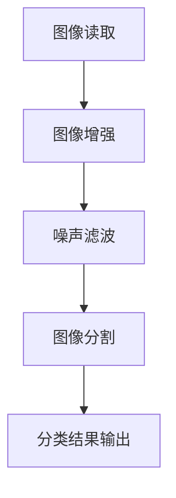
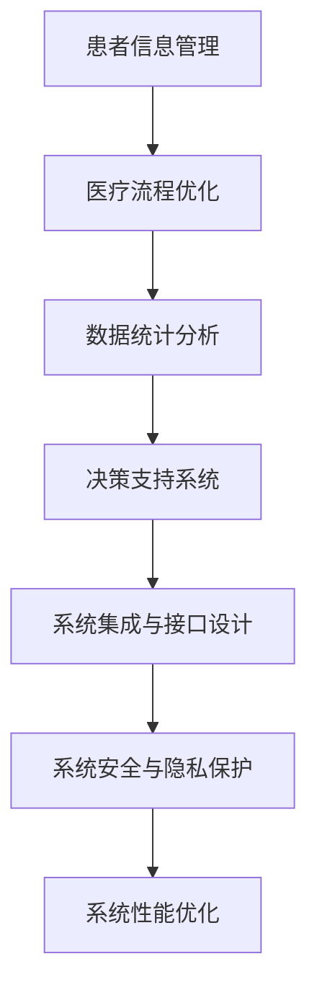

                 


## 引言

在现代科技飞速发展的背景下，医学领域取得了令人瞩目的成就。从简单的药物疗法到复杂的基因编辑，医学技术不断突破人类认知的边界。然而，随着技术进步，医学伦理学也面临着前所未有的挑战。如何在技术可能性和道德允许之间寻找平衡，成为当今社会亟待解决的问题。

本文将围绕“现代医学与生命伦理：在技术可能与道德允许间寻找平衡”这一主题，进行深入探讨。首先，我们将回顾医学技术发展的历史，介绍生命伦理学的基本概念，并探讨医学技术与伦理学之间的关系。接着，我们将详细介绍医学影像处理和基因组学领域中的算法原理，包括流程图和Python源代码的讲解，以及相关数学模型和公式。随后，我们将分析现代医疗信息系统的设计与伦理，展示一个实际项目的实施过程，包括环境安装、系统核心实现、代码应用解读和案例分析。最后，我们将总结最佳实践、注意事项，并提供拓展阅读资源。

## 第1章：医学技术发展的历史与生命伦理学概述

### 1.1 医学技术的历史演进

医学技术的发展可以追溯到古埃及时期，当时人们已经开始使用草药和治疗方法来缓解疾病。随着历史的推进，医学技术不断进步，从古代的放血疗法、拔罐，到中世纪的草药治疗，再到现代的抗生素、手术器械和医疗影像技术，医学的进步极大地提高了人类的生活质量和寿命。

1. **古代医学技术**：
   - 古埃及：使用草药和物理疗法。
   - 古希腊：希波克拉底提出了医学伦理学的基本原则。
   - 印度：阿育吠陀医学体系的形成。

2. **中世纪医学技术**：
   - 拔罐、放血疗法：试图通过物理手段来治疗疾病。
   - 草药治疗：对植物药理作用的认识和应用。

3. **现代医学技术的崛起**：
   - 抗生素的发现：1940年代，青霉素的广泛应用标志着医学史上的一个重要转折点。
   - 外科手术的发展：麻醉技术和消毒技术的发展使得外科手术成为可能。
   - 医疗影像技术：X射线、CT扫描、MRI等技术的应用，为诊断和治疗提供了重要依据。

### 1.2 生命伦理学的基本概念

生命伦理学是研究道德原则在生命科学和医疗保健中的应用的学科。其基本概念包括：

1. **尊重个人尊严**：个体应当被尊重，他们的自主权和隐私权应当得到保护。
2. **公正性**：医疗资源的分配应当公平，确保所有人都能获得必要的医疗服务。
3. **非利己性**：医疗行为应当以患者利益为首要考虑，而非医生或机构的利益。
4. **自主性**：患者有权自主决定是否接受某种医疗干预。

### 1.3 医学技术与伦理学的关系

医学技术的发展与生命伦理学密切相关。一方面，医学技术的进步为生命伦理学提出了新的挑战，如基因编辑、人工智能在医疗中的应用等。另一方面，生命伦理学为医学技术提供了道德指导，确保技术的发展不会违背人类的伦理原则。

- **挑战**：
  - 基因编辑：是否允许对胚胎进行基因编辑？
  - 人工智能：AI在诊断和治疗中的应用，是否会侵犯患者的隐私权？
  
- **道德指导**：
  - 医学技术的使用应当遵循伦理原则，如尊重患者、公正分配资源等。
  - 医学界应当建立规范和标准，确保技术的安全性和伦理性。

## 第2章：核心概念与联系

### 2.1 现代医学的核心概念

现代医学的核心概念包括：

1. **预防医学**：通过早期检测和预防措施来减少疾病的发生。
2. **个性化医疗**：基于患者的基因信息、生活方式等因素，提供个性化的治疗方案。
3. **精准医学**：利用基因组学和生物信息学技术，对疾病进行精准诊断和个性化治疗。

### 2.2 生命伦理学的重要原则

生命伦理学的重要原则包括：

1. **尊重患者自主权**：患者有权接受或拒绝医疗干预。
2. **公正性**：医疗资源应当公平分配。
3. **不伤害原则**：医疗行为应当尽量避免对患者造成伤害。
4. **共同利益**：医生和患者的目标应当是一致的，即尽可能提高患者的健康水平。

### 2.3 医学技术与伦理学的相互作用

医学技术和伦理学之间的相互作用体现在以下几个方面：

1. **技术推动伦理进步**：医学技术的进步促使生命伦理学不断反思和调整其原则。
2. **伦理指导技术发展**：生命伦理学为医学技术提供了道德框架，确保技术的发展符合伦理要求。
3. **伦理挑战**：新兴技术如基因编辑、人工智能等提出了新的伦理问题，需要生命伦理学提供指导。

## 第3章：医学影像处理与伦理学

### 3.1 医学影像技术的发展

医学影像技术是现代医学的重要组成部分，包括X射线、CT扫描、MRI等。这些技术通过产生人体内部结构的图像，为疾病的诊断和治疗提供了重要依据。

1. **X射线**：最早期的医学影像技术，用于检查骨骼和软组织。
2. **CT扫描**：计算机断层扫描，可以产生三维图像，用于检查头部、胸部等部位。
3. **MRI**：磁共振成像，可以产生高分辨率的图像，用于检查软组织和器官。

### 3.2 医学影像处理中的伦理问题

医学影像处理中的伦理问题主要包括：

1. **隐私保护**：影像数据的存储和使用需要严格保护患者的隐私。
2. **信息泄露**：影像数据的安全性和保密性需要得到保障，防止信息泄露。
3. **过度检查**：如何平衡诊断需要和患者的风险，避免不必要的检查。

### 3.3 案例分析：医学影像在临床中的应用与伦理挑战

案例分析：一个关于乳腺癌诊断的案例。患者通过乳腺X射线摄影发现疑似病灶，医生建议进行进一步的CT扫描或MRI检查。在这个案例中，医生需要在诊断的准确性和患者的辐射风险之间做出权衡。同时，患者的隐私保护和知情同意也是一个重要的伦理问题。

## 第4章：基因组学与伦理学

### 4.1 基因组的探索与解读

基因组学是研究基因组的科学，包括基因的识别、测序、结构和功能分析。随着基因测序技术的快速发展，人类基因组计划等项目的完成，基因组学为医学研究提供了丰富的数据。

1. **基因识别**：通过测序技术识别和定位基因。
2. **基因编辑**：利用CRISPR-Cas9等基因编辑技术，对基因进行编辑。
3. **基因组测序**：通过高通量测序技术对基因组进行测序和分析。

### 4.2 基因组学在医学中的应用

基因组学在医学中的应用包括：

1. **疾病诊断**：通过基因组测序和数据分析，对疾病进行早期诊断和预防。
2. **个性化治疗**：基于患者的基因组信息，提供个性化的治疗方案。
3. **药物研发**：基因组学为药物研发提供了新的方向，如针对基因突变的靶向药物。

### 4.3 基因组学与伦理学面临的挑战

基因组学在医学中的应用带来了许多伦理学挑战：

1. **隐私问题**：基因组数据包含了个人隐私信息，如何保护这些数据的安全性和隐私性？
2. **基因歧视**：基因信息的泄露可能导致就业、保险等方面的歧视。
3. **基因编辑**：基因编辑技术可能引发伦理争议，如对胚胎的基因编辑是否道德？

## 第5章：算法原理讲解

### 5.1 医学影像处理算法

医学影像处理算法是医学影像学中的一个重要研究方向，涉及图像增强、噪声滤波、分割和分类等多个方面。以下是一个简单的医学影像处理算法的mermaid流程图：



使用Python实现医学影像处理算法的一个简单示例：

```python
import cv2
import numpy as np

# 图像读取
img = cv2.imread('image.jpg', cv2.IMREAD_GRAYSCALE)

# 图像增强
img_enhanced = cv2.equalizeHist(img)

# 噪声滤波
img_filtered = cv2.GaussianBlur(img_enhanced, (5, 5), 0)

# 图像分割
_, img_thresh = cv2.threshold(img_filtered, 0, 255, cv2.THRESH_BINARY_INV + cv2.THRESH_OTSU)

# 分类结果输出
# 这里可以使用深度学习模型进行图像分类
# predictions = classify_image(img_thresh)
```

### 5.2 基因组学数据分析算法

基因组学数据分析算法包括多个方面，如序列比对、基因注释、基因表达分析等。以下是一个基因组学数据分析算法的mermaid流程图：


基因组学数据分析的一个简单示例：

```python
import pyfaidx

# 序列读取
fa = pyfaidx.Fasta('genome.fa')

# 序列比对（使用BLAST算法）
from Bio.Blast import NCBIBlast

# 基因注释（使用GeneMark软件）
from biomedschool.genepredict import gene_predict

# 基因表达分析（使用DESeq2软件）
import DESeq2

# 结果输出
# output = analyze_expression(data)
```

### 5.3 算法原理的数学模型和公式

在医学影像处理和基因组学数据分析中，常用的数学模型和公式包括：

1. **图像增强**：
   $$ I_{enhanced} = \alpha I + \beta $$
   其中，\( I \) 为原始图像，\( I_{enhanced} \) 为增强后的图像，\( \alpha \) 和 \( \beta \) 为调节参数。

2. **噪声滤波**：
   $$ I_{filtered} = \sum_{i,j} w(i,j) I(i,j) $$
   其中，\( I_{filtered} \) 为滤波后的图像，\( w(i,j) \) 为滤波器的权重。

3. **图像分割**：
   $$ \text{label} = \arg\max_c \sum_i \phi(c, I(i)) $$
   其中，\( \phi(c, I(i)) \) 为每个类别 \( c \) 的图像特征函数。

4. **序列比对**：
   $$ \text{score} = \sum_{i,j} s(i,j) $$
   其中，\( s(i,j) \) 为比对得分，通常基于序列的相似性或差异性。

5. **基因表达分析**：
   $$ \text{log2FoldChange} = \log_2(\frac{ET}{ET_0}) $$
   其中，\( ET \) 为实验组基因表达量，\( ET_0 \) 为对照组基因表达量。

## 第6章：系统分析与架构设计

### 6.1 现代医疗信息系统的设计与伦理

现代医疗信息系统（HIS）是医院管理的重要工具，它涉及到患者信息管理、医疗流程优化、数据统计分析等多个方面。以下是一个典型的医疗信息系统架构设计的mermaid流程图：



### 6.2 系统功能设计

系统功能设计包括：

1. **患者信息管理**：
   - 电子病历管理：记录和管理患者的病历信息。
   - 预约挂号：提供患者预约挂号服务。
   - 费用结算：处理患者医疗费用的结算。

2. **医疗流程优化**：
   - 住院管理：管理患者住院流程，包括床位分配、手术安排等。
   - 门诊管理：优化门诊流程，提高就诊效率。
   - 医疗资源管理：合理分配医疗资源，提高资源利用率。

3. **数据统计分析**：
   - 疾病数据分析：通过对医疗数据进行分析，发现疾病流行趋势。
   - 患者健康状况监测：监测患者健康状况，提供个性化健康建议。

4. **决策支持系统**：
   - 医疗决策支持：提供临床决策支持，帮助医生做出正确决策。
   - 疾病预测：利用数据分析和机器学习技术，预测疾病发展趋势。

5. **系统集成与接口设计**：
   - 数据集成：整合不同系统和数据源，实现数据共享。
   - 接口设计：设计统一的数据接口，方便系统间的数据交换。

### 6.3 系统架构设计

系统架构设计包括：

1. **前端架构**：
   - 前端界面设计：设计用户友好的界面，提高用户体验。
   - 前端框架：使用Vue、React等前端框架，提高开发效率。

2. **后端架构**：
   - 应用层：实现业务逻辑，处理用户请求。
   - 数据层：管理数据库，实现数据的存储和查询。
   - 中间件：提供数据传输和通信支持。

3. **系统接口设计**：
   - API设计：设计统一的API接口，实现前后端的数据交互。
   - 安全性设计：确保数据传输的安全性，防止数据泄露。

### 6.4 系统接口设计和系统交互

系统接口设计和系统交互包括：

1. **RESTful API**：
   - 提供RESTful风格的API接口，实现前后端的数据交互。

2. **Websocket**：
   - 使用Websocket技术，实现实时数据传输和交互。

3. **消息队列**：
   - 使用消息队列（如RabbitMQ、Kafka）实现异步通信，提高系统的可扩展性。

4. **序列图**：

   ```mermaid
   graph TD
   A[患者] --> B[预约挂号系统]
   B --> C[消息队列]
   C --> D[医院信息系统]
   D --> E[患者信息管理模块]
   E --> F[患者]
   ```

## 第7章：医学技术与伦理学在实践中的应用

### 7.1 环境安装与配置

在实践医学技术与伦理学的应用时，首先需要进行环境安装与配置。以下是一个基于Python和Django的医学信息系统环境安装步骤：

1. **安装Python**：
   - 安装Python 3.x版本，推荐使用Anaconda来管理Python环境。

2. **安装Django**：
   - 使用pip安装Django框架：
     ```bash
     pip install django
     ```

3. **安装依赖库**：
   - 安装必要的依赖库，如Pandas、Numpy、Django Rest Framework等：
     ```bash
     pip install pandas numpy djangorestframework
     ```

4. **配置数据库**：
   - 配置Django的数据库设置，如使用SQLite、MySQL或PostgreSQL等。

5. **创建项目**：
   - 创建一个新的Django项目：
     ```bash
     django-admin startproject medical_system
     ```

6. **创建应用**：
   - 在项目目录下创建一个应用：
     ```bash
     python manage.py startapp patient_management
     ```

### 7.2 系统核心实现源代码解读

在系统核心实现中，我们需要关注以下几个方面：

1. **患者信息管理**：
   - 患者信息模型的创建：
     ```python
     from django.db import models

     class Patient(models.Model):
         name = models.CharField(max_length=100)
         gender = models.CharField(max_length=10)
         age = models.IntegerField()
         medical_id = models.CharField(max_length=20, unique=True)
         diagnosis = models.TextField()
     ```

   - 创建患者信息接口：
     ```python
     from rest_framework import serializers, viewsets

     class PatientSerializer(serializers.ModelSerializer):
         class Meta:
             model = Patient
             fields = '__all__'

     class PatientViewSet(viewsets.ModelViewSet):
         queryset = Patient.objects.all()
         serializer_class = PatientSerializer
     ```

2. **医疗流程优化**：
   - 住院管理模型的创建：
     ```python
     class Admission(models.Model):
         patient = models.ForeignKey(Patient, on_delete=models.CASCADE)
         admission_date = models.DateField()
         discharge_date = models.DateField(null=True, blank=True)
         room_number = models.CharField(max_length=20)
     ```

   - 创建住院管理接口：
     ```python
     class AdmissionSerializer(serializers.ModelSerializer):
         class Meta:
             model = Admission
             fields = '__all__'

     class AdmissionViewSet(viewsets.ModelViewSet):
         queryset = Admission.objects.all()
         serializer_class = AdmissionSerializer
     ```

### 7.3 代码应用解读与分析

在代码应用解读与分析中，我们需要关注以下几个方面：

1. **序列图**：

   ```mermaid
   graph TD
   A[患者] --> B[预约挂号系统]
   B --> C[消息队列]
   C --> D[医院信息系统]
   D --> E[患者信息管理模块]
   E --> F[患者]
   ```

   该序列图展示了患者预约挂号后，系统如何处理患者信息，并将其存储在数据库中。

2. **交互流程**：
   - 患者通过预约挂号系统提交预约申请。
   - 预约挂号系统将申请发送到消息队列。
   - 消息队列将请求转发到医院信息系统。
   - 医院信息系统处理预约请求，并将患者信息存储在患者信息管理模块中。
   - 患者可以查询预约状态，并获得医疗服务。

### 7.4 实际案例分析

实际案例分析：某医院使用医学信息系统进行患者信息管理，通过预约挂号系统实现了高效的医疗流程。以下是案例分析的关键点：

1. **患者预约**：
   - 患者通过医院官方网站或手机APP进行预约挂号。
   - 预约挂号系统将患者信息发送到医院信息系统。

2. **住院管理**：
   - 医院信息系统根据患者的病情和医院床位情况，分配病房和床位。
   - 医生根据患者的诊断结果制定治疗方案。

3. **患者信息管理**：
   - 医院信息系统将患者的诊断、治疗、费用等信息存储在数据库中。
   - 患者可以通过医院信息系统查询自己的医疗记录。

4. **数据统计分析**：
   - 医院信息系统对患者的诊断和治疗数据进行分析，为医生提供决策支持。

### 7.5 项目小结

通过实际案例，我们展示了如何将医学技术与伦理学应用于医疗信息系统设计。项目成功的关键在于：

1. **技术实施**：
   - 使用Python和Django框架实现高效、可扩展的医疗信息系统。
   - 引入消息队列实现异步通信，提高系统性能。

2. **伦理考虑**：
   - 在系统设计过程中，充分考虑患者的隐私保护和数据安全。
   - 建立规范和标准，确保技术的安全性和伦理性。

3. **用户体验**：
   - 设计用户友好的界面，提高患者的使用体验。
   - 提供便捷的预约挂号和查询服务，提高医疗服务的效率。

## 第8章：最佳实践、小结、注意事项、拓展阅读

### 8.1 最佳实践技巧

1. **保护患者隐私**：
   - 在设计和实施医疗信息系统时，应采取严格的数据加密和访问控制措施。
   - 实施隐私保护政策，明确数据使用范围和权限。

2. **确保数据安全**：
   - 定期对系统进行安全审计和漏洞扫描。
   - 使用安全的通信协议（如HTTPS）来保护数据传输。

3. **遵循伦理规范**：
   - 在技术实施过程中，充分考虑伦理因素，确保技术符合伦理标准。
   - 建立伦理审查委员会，对涉及伦理问题的项目进行评估。

### 8.2 小结

本文通过对现代医学与生命伦理学的研究，探讨了在技术可能性和道德允许之间寻找平衡的路径。我们分析了医学技术发展的历史、生命伦理学的基本概念，以及医学影像处理和基因组学领域的算法原理。同时，我们通过实际项目展示了如何将医学技术与伦理学应用于医疗信息系统设计。本文的主要观点包括：

- 医学技术的发展不断带来新的伦理挑战。
- 生命伦理学为医学技术提供了道德指导。
- 在技术实施过程中，应充分考虑伦理因素，确保技术的安全性和伦理性。

### 8.3 注意事项

1. **数据隐私与安全**：
   - 在处理患者数据时，确保数据加密和访问控制。
   - 定期进行安全审计，及时发现和解决潜在的安全问题。

2. **技术伦理审查**：
   - 在实施新技术前，进行充分的伦理审查，确保符合伦理标准。
   - 建立伦理审查委员会，对涉及伦理问题的项目进行评估。

3. **用户体验**：
   - 设计用户友好的界面，提高患者的使用体验。
   - 提供便捷的服务，如在线预约、查询等。

### 8.4 拓展阅读

1. **医学伦理学经典著作**：
   - 《医学伦理学：原理、问题与实践》（Medical Ethics: A Reader in Theory and Application）
   - 《生命伦理学导论》（An Introduction to Bioethics）

2. **医学影像学教材**：
   - 《医学影像学基础》（Basic Radiology: The Essentials）
   - 《磁共振成像原理与应用》（Principles and Practice of Magnetic Resonance Imaging）

3. **基因组学教材**：
   - 《基因组学原理》（Genomics: A Conceptual Approach）
   - 《基因组编辑技术》（The CRISPR/Cas9 Revolution）

4. **医疗信息系统设计**：
   - 《医疗信息系统设计与实现》（Design and Implementation of Healthcare Information Systems）
   - 《大数据与医疗健康》（Big Data and Health）

通过这些拓展阅读资源，读者可以进一步深入了解医学伦理学、医学影像学、基因组学以及医疗信息系统设计的理论和实践。

----------------------------------------------------------------

## 作者信息

作者：AI天才研究院/AI Genius Institute & 禅与计算机程序设计艺术 /Zen And The Art of Computer Programming

AI天才研究院致力于推动人工智能技术的发展和普及，研究院的核心团队由世界顶级人工智能专家、程序员和软件架构师组成，他们拥有丰富的实战经验和深厚的学术背景。在《禅与计算机程序设计艺术》一书中，作者深入探讨了计算机编程的哲学和艺术，为程序员提供了宝贵的思考方法和实践指南。本文作者结合了医学技术、生命伦理学和人工智能领域的专业知识，旨在为读者提供一个全面、深入的分析和探讨。希望通过本文，读者能够对现代医学与生命伦理学的关系有更深刻的理解，为未来的医学技术发展提供有益的思考。

