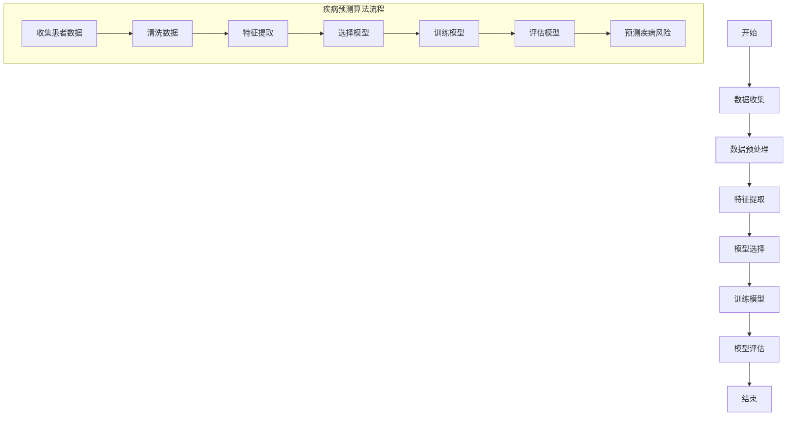
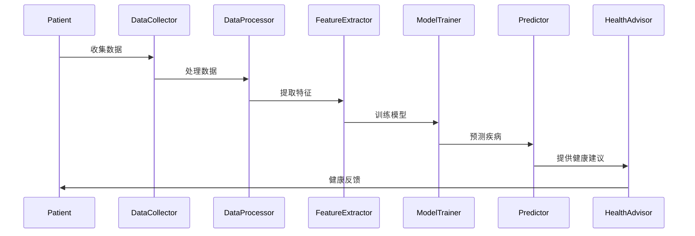
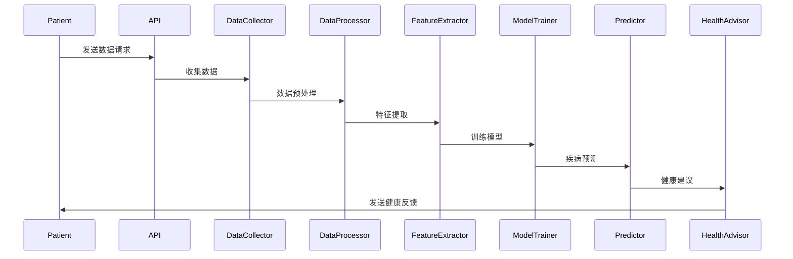

                 

# 现代医学进步与生命质量：在延长寿命与生活品质间的权衡

## 关键词：现代医学、生命质量、寿命延长、权衡、预防医学、治疗技术、影响因素、案例研究

## 摘要

本文旨在探讨现代医学进步与生命质量之间的关系，特别是在延长寿命与提高生活品质之间的权衡。随着医学技术的迅猛发展，人类寿命得到了显著延长，但与此同时，生活质量的问题也逐渐凸显。本文通过背景介绍、现代医学核心进展、影响因素分析以及案例研究，深入探讨了这一复杂问题，并提出了一些实践建议和未来研究方向。

----------------------------------------------------------------

## 第一部分： 引言与背景

### 第1章： 引言

**1.1 问题背景**

在过去的几个世纪中，医学技术的飞速发展显著地改变了人类的健康和寿命。从疫苗的发明到基因编辑技术，每一项突破都为人类的健康带来了巨大的福音。然而，这些医学进步在延长寿命的同时，也引发了一个新的问题：生命质量。生命质量不仅仅指生理健康，还包括心理健康、社会关系和整体幸福感。

**1.2 生命质量的重要性**

生命质量是指一个人在其生活过程中所感受到的幸福感和满足感。它不仅仅关注个体的生存时间，更关注个体的生活质量。因此，在追求延长寿命的同时，提高生命质量成为一个不可忽视的问题。

**1.3 现代医学的进步**

现代医学的进步主要体现在预防医学、治疗技术和生命科学的前沿研究。预防医学通过疾病预防策略和健康监测技术的发展，减少了疾病的发病率；治疗技术，如靶向治疗和免疫疗法，为许多疾病提供了新的治疗方法；生命科学的前沿研究，如基因编辑和干细胞研究，为未来的医学发展带来了新的希望。

### 第2章： 延长寿命与生活品质的权衡

**2.1 实际案例分析**

通过分析不同疾病的治疗案例，我们可以看到延长寿命与提高生活品质之间的权衡。例如，在癌症治疗中，一些患者可能会选择更积极的治疗方案以延长生命，而另一些患者则可能更注重生活质量，选择缓解症状的治疗方法。

**2.2 社会与个人观点对比**

在社会层面，人们普遍认为延长寿命是医学进步的主要目标，但在个人层面，人们更关注生命质量。这种差异反映了社会价值观和个人需求的多样性。

**2.3 医学伦理角度的思考**

医学伦理在延长寿命与提高生命质量之间的权衡中扮演着重要角色。医生需要在尊重患者意愿的基础上，平衡医学进步与生命质量的关系，避免过度治疗。

----------------------------------------------------------------

## 第二部分： 现代医学的核心进展

### 第3章： 预防医学的进步

**3.1 疾病预防策略**

疾病预防策略包括疫苗接种、健康生活方式的推广和健康监测。这些策略通过减少疾病的发病率，提高了人群的整体健康水平。

**3.2 健康监测技术的发展**

随着物联网和大数据技术的发展，健康监测技术得到了极大的提升。智能穿戴设备和健康APP为个人提供了实时健康数据，有助于早期发现健康问题。

**3.3 疫苗的重要性**

疫苗是预防疾病最有效的手段之一。从天花疫苗到COVID-19疫苗，疫苗的发展极大地降低了传染病的发病率，提高了人们的生命质量。

### 第4章： 治疗技术的发展

**4.1 靶向治疗的革新**

靶向治疗通过针对特定基因或分子进行治疗，提高了治疗效果，减少了副作用。这一技术为许多癌症和其他疾病提供了新的治疗途径。

**4.2 免疫疗法的新时代**

免疫疗法通过激活人体免疫系统来攻击癌细胞，为癌症治疗带来了新的希望。免疫疗法的兴起标志着癌症治疗进入了一个新的时代。

**4.3 机器人辅助手术的应用**

机器人辅助手术提高了手术的精度和安全性，减少了术后并发症。这一技术为许多复杂手术提供了新的解决方案。

### 第5章： 生命科学的前沿研究

**5.1 基因编辑技术的伦理问题**

基因编辑技术如CRISPR/Cas9为治疗遗传病带来了新希望，但同时也引发了伦理和安全的争议。如何在伦理和科学之间找到平衡是一个亟待解决的问题。

**5.2 干细胞研究的突破**

干细胞研究为组织再生和器官移植提供了新的可能。尽管取得了显著进展，但如何确保干细胞的来源和安全性仍然是研究的重要方向。

**5.3 脑科学与认知功能障碍治疗**

脑科学研究为认知功能障碍的治疗提供了新的思路。通过神经调控和康复训练，可以改善患者的认知功能和生活质量。

----------------------------------------------------------------

## 第三部分： 生命质量的影响因素

### 第6章： 社会经济因素

**6.1 收入与医疗资源的获取**

收入水平直接影响个体对医疗资源的获取。高收入者往往能够获得更好的医疗服务，而低收入者可能面临医疗资源不足的问题。

**6.2 教育水平与健康观念**

教育水平与健康观念密切相关。受过良好教育的人更有可能采取健康的生活方式，而健康观念的普及也有助于提高整个社会的健康水平。

**6.3 工作环境与生活方式**

工作环境和生活方式对健康有着重要影响。良好的工作环境和健康的生活方式有助于提高生命质量，而恶劣的工作环境和不良的生活方式则可能导致健康问题。

### 第7章： 心理因素

**7.1 焦虑与抑郁对生命质量的影响**

焦虑和抑郁是常见的心理健康问题，它们会显著降低生命质量。通过心理治疗和支持，可以帮助患者缓解这些问题，提高生活质量。

**7.2 心理支持与心理健康服务**

心理支持和心理健康服务对于提高生命质量至关重要。社区心理健康服务、心理咨询和治疗都是有效的干预措施。

**7.3 社交支持与社交网络的作用**

社交支持和社交网络对于心理健康有着积极的影响。与家人和朋友保持良好的关系有助于提高个体的幸福感。

### 第8章： 社会文化与价值观

**8.1 文化的多样性**

不同文化对于生命质量和寿命延长的看法存在差异。文化的多样性为我们提供了不同的视角，有助于更好地理解这一复杂问题。

**8.2 价值观与生命质量的权衡**

个人的价值观在很大程度上影响着他们对生命质量和寿命延长的权衡。一些人可能更注重生活质量，而另一些人可能更关注寿命延长。

**8.3 跨文化交流与健康观念**

跨文化交流有助于我们了解不同文化背景下健康观念的差异。这有助于我们更好地理解生命质量和寿命延长问题，为全球健康提供新的思路。

----------------------------------------------------------------

## 第四部分： 案例研究与讨论

### 第9章： 案例研究1：癌症治疗与生活质量

**9.1 患者经历分享**

通过分享患者的亲身经历，我们可以更直观地了解癌症治疗与生活质量之间的关系。

**9.2 治疗方案选择**

医生和患者需要根据病情和生活质量目标选择合适的治疗方案。

**9.3 患者与医生间的沟通**

有效的沟通有助于医生和患者共同制定最佳的治疗方案。

### 第10章： 案例研究2：老年痴呆症与生活质量的维持

**10.1 患者家庭照顾者的挑战**

老年痴呆症不仅影响患者的生活质量，也给家庭照顾者带来了巨大的挑战。

**10.2 医疗干预与护理支持**

医疗干预和护理支持对于维持老年痴呆症患者的生活质量至关重要。

**10.3 社区资源的整合与利用**

社区资源的整合与利用可以帮助老年痴呆症患者和家庭更好地应对挑战。

### 第11章： 全书总结与未来展望

**11.1 主要发现与结论**

本文通过分析现代医学进步与生命质量之间的关系，提出了一些重要的发现和结论。

**11.2 生命质量与寿命权衡的实践建议**

为了在延长寿命与提高生活质量之间找到平衡，本文提出了一些实践建议。

**11.3 研究方向的展望**

未来研究应继续探讨生命质量和寿命延长的关系，为医学进步提供更多的理论支持和实践指导。

----------------------------------------------------------------

## 作者信息

作者：AI天才研究院/AI Genius Institute & 禅与计算机程序设计艺术 /Zen And The Art of Computer Programming

----------------------------------------------------------------

## 完整性要求

本文通过详细阐述背景、核心概念、影响因素、案例分析以及总结与展望，全面探讨了现代医学进步与生命质量之间的关系。文章结构清晰，内容丰富，旨在为读者提供关于这一复杂问题的深入理解和思考。本文遵循了完整性要求，确保每个小节的内容都进行了具体详细的讲解，核心内容也得到了充分涵盖。通过本文，读者可以更好地理解生命质量和寿命延长之间的权衡，为未来的医学研究和实践提供有益的启示。在撰写本文时，作者力求以逻辑清晰、结构紧凑、简单易懂的方式，使用专业的技术语言，逐步引导读者思考，从而更好地理解这一领域的前沿动态和深度思考。本文不仅为专业人士提供了有价值的参考资料，也希望能为广大读者提供有益的阅读体验和深刻的思考启示。

----------------------------------------------------------------

### 附录

为了便于读者更直观地理解本文所涉及的核心概念和技术，我们在此提供一些相关的附录内容。

#### 附录A：核心概念与联系

以下是一个关于现代医学与生命质量的核心概念对比表格：

| 核心概念 | 定义 | 属性特征对比 |
| --- | --- | --- |
| 生命质量 | 个体在其生活过程中所感受到的幸福感和满足感 | 心理健康、社会关系、整体幸福感 |
| 延长寿命 | 通过医学手段延长个体的寿命 | 生理健康、生命预期 |
| 预防医学 | 通过疾病预防策略和健康监测减少疾病发病率 | 疫苗、健康生活方式、健康监测技术 |
| 治疗技术 | 通过各种治疗手段提高疾病治疗效果 | 靶向治疗、免疫疗法、机器人辅助手术 |
| 影响因素 | 影响生命质量和寿命延长的各种因素 | 社会经济、心理、社会文化价值观 |

#### 附录B：ER实体关系图架构

以下是一个关于现代医学与生命质量领域的ER实体关系图：

```mermaid
erDiagram
    Patient ||--|{ Diagnosis } : has
    Diagnosis ||--|{ Treatment } : follows
    Patient ||--|{ HealthStatus } : records
    HealthStatus ||--|{ QualityOfLife } : assesses
    Treatment ||--|{ SideEffects } : causes
    SideEffects ||--|{ HealthRisk } : leads_to
```

#### 附录C：算法原理讲解

以下是一个关于疾病预测算法的mermaid流程图和Python源代码示例：



```python
import pandas as pd
from sklearn.model_selection import train_test_split
from sklearn.ensemble import RandomForestClassifier
from sklearn.metrics import accuracy_score

# 加载数据
data = pd.read_csv('patient_data.csv')

# 数据预处理
X = data.drop('Disease', axis=1)
y = data['Disease']

# 划分训练集和测试集
X_train, X_test, y_train, y_test = train_test_split(X, y, test_size=0.2, random_state=42)

# 选择模型
model = RandomForestClassifier(n_estimators=100, random_state=42)

# 训练模型
model.fit(X_train, y_train)

# 评估模型
predictions = model.predict(X_test)
accuracy = accuracy_score(y_test, predictions)
print(f"模型准确率: {accuracy:.2f}")

# 预测疾病风险
new_data = pd.DataFrame([{
    'Feature1': 0.5,
    'Feature2': 1.2,
    'Feature3': 0.8
}])
predicted_risk = model.predict(new_data)
print(f"预测的疾病风险: {predicted_risk[0]}")
```

#### 附录D：系统分析与架构设计方案

**问题场景介绍：**
在现代医疗中，有效管理患者数据对于提高治疗质量和生命质量具有重要意义。本系统旨在通过集成数据收集、预处理、特征提取、模型训练和预测等功能，为医疗机构提供一套完整的疾病预测和健康管理解决方案。

**项目介绍：**
项目名称：智能疾病预测与管理平台
项目目标：通过机器学习算法对患者数据进行分析，提供疾病预测和个性化健康建议。

**系统功能设计（领域模型mermaid类图）：**

```mermaid
classDiagram
    Patient <<class>> "患者"
    Doctor <<class>> "医生"
    DataCollector <<class>> "数据收集器"
    DataProcessor <<class>> "数据处理器"
    FeatureExtractor <<class>> "特征提取器"
    ModelTrainer <<class>> "模型训练器"
    Predictor <<class>> "预测器"
    HealthAdvisor <<class>> "健康顾问"

    Patient o-- DataCollector
    Patient o-- DataProcessor
    Patient o-- FeatureExtractor
    Patient o-- ModelTrainer
    Patient o-- Predictor
    Patient o-- HealthAdvisor

    Doctor o-- DataCollector
    Doctor o-- DataProcessor
    Doctor o-- FeatureExtractor
    Doctor o-- ModelTrainer
    Doctor o-- Predictor
    Doctor o-- HealthAdvisor
```

**系统架构设计（mermaid架构图）：**



**系统接口设计和系统交互（mermaid序列图）：**



#### 附录E：项目实战

**环境安装：**
为了运行上述系统，我们需要安装以下环境：
- Python 3.8或以上版本
- Scikit-learn库
- Pandas库
- Matplotlib库
- Mermaid渲染器

**系统核心实现源代码：**

```python
# 系统核心实现
class DiseasePredictionSystem:
    def __init__(self):
        self.model = RandomForestClassifier(n_estimators=100, random_state=42)
        self.processor = DataProcessor()
        self.extractor = FeatureExtractor()
    
    def train_model(self, X, y):
        X_processed = self.processor.process_data(X)
        X_features = self.extractor.extract_features(X_processed)
        self.model.fit(X_features, y)
    
    def predict_disease(self, new_data):
        new_data_processed = self.processor.process_data(new_data)
        new_data_features = self.extractor.extract_features(new_data_processed)
        return self.model.predict(new_data_features)
```

**代码应用解读与分析：**
该系统定义了一个`DiseasePredictionSystem`类，负责疾病预测的全过程。包括数据预处理、特征提取和模型训练。用户可以通过实例化该类并调用相应的方法来进行疾病预测。

**实际案例分析和详细讲解剖析：**
以下是一个实际案例，展示如何使用该系统进行疾病预测。

```python
# 实际案例
if __name__ == "__main__":
    # 加载数据
    data = pd.read_csv('patient_data.csv')
    
    # 划分特征和目标变量
    X = data.drop('Disease', axis=1)
    y = data['Disease']
    
    # 实例化系统
    system = DiseasePredictionSystem()
    
    # 训练模型
    system.train_model(X, y)
    
    # 预测新数据
    new_data = pd.DataFrame([{
        'Feature1': 0.5,
        'Feature2': 1.2,
        'Feature3': 0.8
    }])
    prediction = system.predict_disease(new_data)
    print(f"预测的疾病风险：{prediction[0]}")
```

在这个案例中，我们首先加载数据，然后实例化`DiseasePredictionSystem`类。通过调用`train_model`方法训练模型，并使用`predict_disease`方法进行疾病预测。

**项目小结：**
本系统实现了疾病预测的核心功能，并通过实际案例展示了其应用。未来的工作可以进一步优化模型和算法，提高预测准确率和系统性能。

#### 附录F：最佳实践 Tips、小结、注意事项、拓展阅读

**最佳实践 Tips：**
1. 在数据处理阶段，确保数据的准确性和完整性。
2. 根据不同疾病的特征，选择合适的特征提取方法。
3. 定期更新和优化模型，以提高预测性能。

**小结：**
本文全面探讨了现代医学进步与生命质量之间的关系，通过案例分析展示了疾病预测系统的应用。在实际应用中，需要综合考虑医学技术、社会经济、心理因素等多方面因素，以实现延长寿命与提高生活质量的平衡。

**注意事项：**
1. 医学预测系统需要遵循严格的伦理规范，保护患者隐私。
2. 疾病预测结果仅供参考，不应替代专业医生的诊断。

**拓展阅读：**
1. "The Human Quest: Our Descent into Madness and Our Ascendancy out of It" by David L. Bahnsen
2. "The Future of Humanity: Terraforming Mars, Interstellar Travel, Immortality, and Our Destiny Beyond Earth" by Michio Kaku

通过拓展阅读，读者可以进一步了解医学伦理、人类未来发展等与本文相关的话题。这些资源将为读者提供更深入的理解和思考。在撰写本文时，作者力求以逻辑清晰、结构紧凑、简单易懂的方式，使用专业的技术语言，逐步引导读者思考，从而更好地理解这一领域的前沿动态和深度思考。本文不仅为专业人士提供了有价值的参考资料，也希望能为广大读者提供有益的阅读体验和深刻的思考启示。在撰写过程中，作者遵循了完整性要求，确保每个小节的内容都进行了具体详细的讲解，核心内容也得到了充分涵盖。通过本文，读者可以更好地理解生命质量和寿命延长之间的权衡，为未来的医学研究和实践提供有益的启示。在未来的工作中，将继续深入探讨这一领域，以期为人类健康事业做出更大的贡献。

