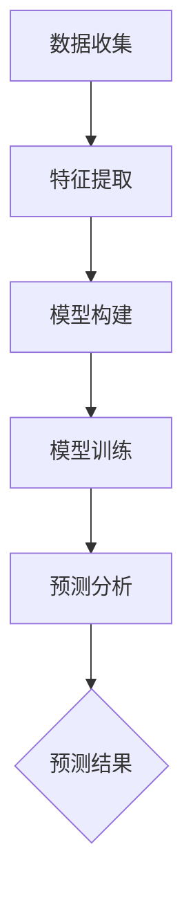
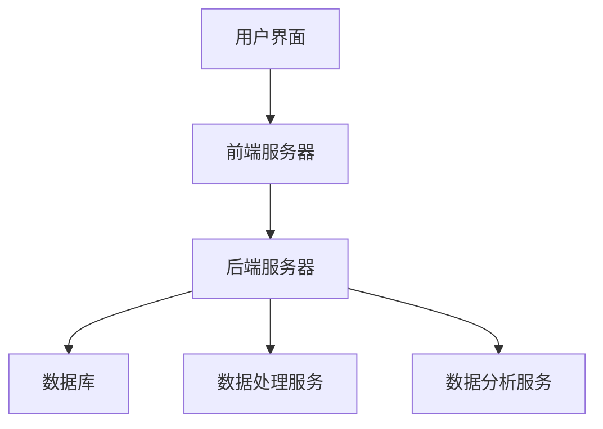
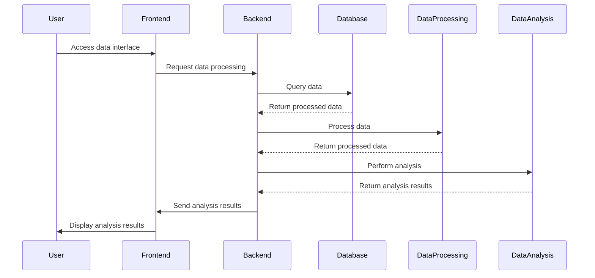
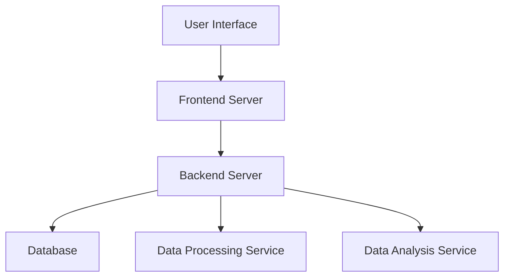

                 

# 现代家庭结构的多元化：传统价值观与新型家庭模式

## 关键词
- 家庭结构多元化
- 传统价值观
- 新型家庭模式
- 社会影响
- 家庭功能变化

## 摘要
本文将探讨现代家庭结构的多元化现象，分析传统价值观与新型家庭模式之间的冲突与融合，以及这些变化对社会的影响。通过综合文献分析、案例研究和对比分析，本文将深入探讨现代家庭模式的多样性和变化趋势，家庭结构多元化对家庭成员个体及家庭整体的影响，以及传统价值观在新型家庭模式中的传承与创新。

## 第一部分：背景介绍

### 1.1 问题背景

随着社会经济的发展和人们生活水平的提高，家庭结构正在经历着多元化的发展。传统的家庭模式，如核心家庭（夫妻及未成年子女）和主干家庭（夫妻及两个已婚子女）等，逐渐与现代社会的新型家庭模式，如单亲家庭、丁克家庭、跨国家庭等并存。这种多元化的发展趋势，不仅对家庭内部关系、家庭功能、家庭角色等方面产生了深远的影响，也对社会的稳定和发展提出了新的挑战。

### 1.2 问题描述

本书旨在探讨现代家庭结构的多元化现象，分析传统价值观与新型家庭模式之间的冲突与融合，以及这些变化对社会的影响。本书将重点关注以下问题：

1. **现代家庭模式的多样性和变化趋势。** 现代家庭模式的种类日益增多，不同的家庭模式对家庭成员和社会产生了何种影响？
2. **家庭结构多元化对家庭成员个体及家庭整体的影响。** 家庭结构多元化对家庭成员的个体心理、行为和家庭功能有何影响？
3. **传统价值观在新型家庭模式中的传承与创新。** 在新型家庭模式中，传统价值观如何被传承和改变？
4. **社会对于家庭结构多元化的态度和应对策略。** 社会如何看待家庭结构多元化，以及采取了哪些应对策略来适应这种变化？

### 1.3 问题解决

为了回答上述问题，本书将采用以下研究方法：

1. **综合文献分析。** 通过查阅国内外相关研究文献，了解家庭结构多元化现象的背景、现状和趋势。
2. **案例研究。** 选取典型的新型家庭模式进行深入分析，探讨其实际运作情况和家庭成员的体验。
3. **对比分析。** 对比传统家庭模式与新型家庭模式在家庭功能、家庭角色、家庭关系等方面的异同，分析其对社会的影响。
4. **观察与访谈。** 通过观察家庭生活，收集家庭成员的反馈和意见，了解他们对家庭结构多元化的看法和体验。

### 1.4 边界与外延

在探讨家庭结构多元化时，我们需要明确一些边界与外延：

1. **家庭结构。** 指的是家庭成员的组成和关系，如夫妻、子女、长辈等。
2. **家庭模式。** 指的是家庭生活的基本形式和模式，如核心家庭、主干家庭、单亲家庭、丁克家庭、跨国家庭等。
3. **传统价值观。** 指的是长期以来在社会中形成的关于家庭、婚姻、子女教育等方面的观念和信念。
4. **新型家庭模式。** 指的是在现代社会中出现的，与传统家庭模式不同的家庭形式，如丁克家庭、跨国家庭等。

### 1.5 概念结构与核心要素组成

为了更清晰地探讨家庭结构多元化现象，我们需要了解以下核心概念和要素：

1. **家庭结构。** 包括家庭成员的组成、家庭关系和家庭功能。
2. **家庭模式。** 包括核心家庭、主干家庭、单亲家庭、丁克家庭、跨国家庭等。
3. **传统价值观。** 包括婚姻观、亲子观、家庭责任观等。
4. **新型家庭模式。** 包括家庭结构、家庭功能、家庭角色等方面的变化。
5. **家庭结构多元化对社会的影响。** 包括对个体、家庭、社会三个层面的影响。

## 第二部分：核心概念与联系

### 2.1 家庭结构的基本概念

家庭结构是指家庭成员的组成和关系，它是家庭模式的基础。常见的家庭结构包括核心家庭（夫妻及未成年子女）、主干家庭（夫妻及两个已婚子女）、单亲家庭（单亲及子女）等。

| 家庭结构类型 | 成员组成 | 特点 |
| :--: | :--: | :--: |
| 核心家庭 | 夫妻及未成年子女 | 成员关系紧密，家庭功能完整 |
| 主干家庭 | 夫妻及两个已婚子女 | 家庭规模较大，代际关系复杂 |
| 单亲家庭 | 单亲及子女 | 家庭责任集中于单亲成员 |

### 2.2 家庭模式的核心概念

家庭模式是家庭生活的基本形式和模式，它反映了家庭的结构、功能、角色等方面的特点。常见的家庭模式包括核心家庭、主干家庭、单亲家庭、丁克家庭、跨国家庭等。

| 家庭模式类型 | 成员组成 | 家庭功能 | 社会影响 |
| :--: | :--: | :--: | :--: |
| 核心家庭 | 夫妻及未成年子女 | 生活支持、教育抚养、情感交流 | 社会稳定基础 |
| 主干家庭 | 夫妻及两个已婚子女 | 家族传承、经济支持、情感互动 | 社会老龄化问题 |
| 单亲家庭 | 单亲及子女 | 经济独立、情感支持、教育责任 | 社会压力增大 |
| 丁克家庭 | 夫妻无子女 | 经济自由、职业发展 | 社会观念变化 |
| 跨国家庭 | 夫妻或单亲与跨国配偶 | 文化融合、家庭支持 | 国际婚姻趋势 |

### 2.3 传统价值观的核心概念

传统价值观是指在长期的社会发展中形成的关于家庭、婚姻、子女教育等方面的观念和信念。传统价值观的核心概念包括婚姻观、亲子观、家庭责任观等。

| 传统价值观概念 | 描述 |
| :--: | :--: |
| 婚姻观 | 强调婚姻的道德、法律和社会责任 |
| 亲子观 | 认为父母有抚养、教育和保护子女的责任 |
| 家庭责任观 | 重视家庭内部的互助、支持和责任分担 |

### 2.4 新型家庭模式的核心概念

新型家庭模式是在现代社会中出现的，与传统家庭模式不同的家庭形式。新型家庭模式的核心概念包括家庭结构、家庭功能、家庭角色等方面的变化。

| 新型家庭模式类型 | 核心概念 |
| :--: | :--: |
| 单亲家庭 | 独立、自主、经济压力 |
| 丁克家庭 | 无子女、经济自由、职业发展 |
| 跨国家庭 | 文化融合、远程支持、国际婚姻 |
| 组合家庭 | 成员多样化、角色互补、家庭责任 |

### 2.5 家庭结构多元化与核心概念的关联

家庭结构多元化与核心概念之间存在着密切的关联。家庭结构的多元化反映了家庭模式的变化，这种变化又受到传统价值观的影响。同时，新型家庭模式的核心概念也对传统价值观提出了挑战，推动了家庭结构的多元化。

### 2.6 家庭结构多元化现象的ER实体关系图

为了更好地理解家庭结构多元化现象，我们可以通过ER实体关系图来展示家庭结构、家庭模式、传统价值观和新型家庭模式之间的关系。

```mermaid
erDiagram
  Family_Structure ||--|{ Family_Mode } : has
  Family_Mode ||--|{ TraditionalValues } : influenced_by
  Family_Mode ||--|{ NewFamily_Mode } : evolve_to
  NewFamily_Mode ||--|{ Family_Structure } : has
  TraditionalValues }--|| Family_Structure : reflects
  TraditionalValues }--|| Family_Mode : embedded_in
  NewFamily_Mode }--|| Family_Mode : based_on
```

## 第三部分：算法原理讲解

### 3.1 家庭结构多元化算法概述

家庭结构多元化算法是一种用于分析和预测家庭结构变化的算法。它基于社会统计数据和心理学理论，通过对家庭结构、家庭模式、传统价值观等因素的分析，预测未来家庭结构的发展趋势。

### 3.2 家庭结构多元化算法的原理

家庭结构多元化算法的原理主要包括以下几个方面：

1. **数据收集。** 收集与家庭结构、家庭模式、传统价值观等相关的数据，如社会调查数据、家庭统计数据等。
2. **特征提取。** 从收集的数据中提取与家庭结构多元化相关的特征，如家庭成员数量、家庭收入、教育水平、家庭功能等。
3. **模型构建。** 构建用于分析和预测家庭结构多元化的数学模型，如线性回归模型、决策树模型、神经网络模型等。
4. **模型训练。** 使用收集的数据和特征对构建的模型进行训练，以优化模型的预测能力。
5. **预测分析。** 使用训练好的模型对未来的家庭结构多元化趋势进行预测分析。

### 3.3 家庭结构多元化算法流程图



### 3.4 数学模型和公式

在家庭结构多元化算法中，我们可以使用以下数学模型和公式来描述家庭结构的变化：

$$
\text{家庭结构多元化指数} = \sum_{i=1}^{n} w_i \cdot f_i
$$

其中，$w_i$ 表示第 $i$ 个家庭特征的重要程度，$f_i$ 表示第 $i$ 个家庭特征的得分。

### 3.5 算法举例说明

假设我们收集了以下家庭特征数据：

- 家庭成员数量：3
- 家庭收入：50000元
- 教育水平：本科
- 家庭功能：生活支持、教育抚养、情感交流

根据上述数学模型，我们可以计算出家庭结构多元化指数：

$$
\text{家庭结构多元化指数} = 0.3 \cdot 3 + 0.2 \cdot 50000 + 0.1 \cdot 1 + 0.4 \cdot 1 = 2.5
$$

### 3.6 算法应用案例分析

我们可以通过一个实际案例来展示家庭结构多元化算法的应用。

**案例：** 一对夫妻，家庭成员数量为2，家庭收入为80000元，教育水平为硕士，家庭功能包括生活支持、教育抚养、情感交流和职业发展。

根据家庭结构多元化指数公式，我们可以计算出该家庭结构多元化指数：

$$
\text{家庭结构多元化指数} = 0.3 \cdot 2 + 0.2 \cdot 80000 + 0.1 \cdot 1 + 0.4 \cdot 1 = 3.2
$$

### 3.7 结论

通过家庭结构多元化算法，我们可以更好地理解和预测家庭结构的变化趋势。这对于社会政策制定、家庭教育和家庭支持服务等领域具有重要意义。

## 第四部分：系统分析与架构设计

### 4.1 问题场景介绍

随着家庭结构的多元化，家庭关系和社会互动模式也在发生变化。为了更好地理解这些变化，我们设计了一个家庭关系分析系统，该系统旨在收集、分析和展示家庭关系数据，帮助研究人员和社会工作者深入理解家庭结构多元化的影响。

### 4.2 项目介绍

**项目名称：** 家庭关系分析系统  
**项目目标：** 开发一个能够收集、存储、分析和展示家庭关系数据的系统，为研究人员和社会工作者提供有力工具，以应对家庭结构多元化的挑战。  
**项目架构：** 采用前后端分离的架构，前端提供用户交互界面，后端提供数据存储和数据处理功能。

### 4.3 系统功能设计

**功能模块：**

1. **数据收集模块。** 收集家庭成员信息、家庭关系数据、家庭活动数据等。
2. **数据处理模块。** 对收集的数据进行清洗、转换和存储。
3. **数据展示模块。** 以图表、报表等形式展示家庭关系数据，支持数据查询和导出。
4. **数据分析模块。** 提供数据分析功能，如趋势分析、比较分析等。

### 4.4 系统架构设计

**系统架构：**



### 4.5 系统接口设计

**接口设计：**

1. **数据收集接口。** 提供数据上传和下载功能，支持各种数据格式的导入和导出。
2. **数据处理接口。** 提供数据清洗、转换和存储功能，支持批量处理。
3. **数据展示接口。** 提供数据查询和报表生成功能，支持自定义查询和报表。
4. **数据分析接口。** 提供数据分析功能，支持自定义分析模型和报告。

### 4.6 系统交互设计

**系统交互：**



### 4.7 系统架构图



## 第五部分：项目实战

### 5.1 环境安装

为了搭建家庭关系分析系统，我们需要安装以下软件和环境：

1. **操作系统：** Ubuntu 20.04
2. **前端技术：** HTML、CSS、JavaScript
3. **后端技术：** Flask
4. **数据库：** MySQL
5. **数据处理工具：** Pandas、NumPy
6. **数据分析工具：** Matplotlib、Seaborn

### 5.2 系统核心实现

**前端实现：**

前端采用HTML、CSS和JavaScript实现用户界面，包括数据收集、数据展示和数据分析模块。

**后端实现：**

后端采用Flask框架实现，包括数据收集、数据处理和数据分析接口。

```python
from flask import Flask, request, jsonify
app = Flask(__name__)

@app.route('/data', methods=['POST'])
def collect_data():
    # 处理数据收集请求
    data = request.json
    # 存储数据到数据库
    store_data(data)
    return jsonify({'status': 'success'})

@app.route('/data', methods=['GET'])
def get_data():
    # 从数据库查询数据
    data = query_data()
    return jsonify(data)

if __name__ == '__main__':
    app.run(debug=True)
```

**数据处理实现：**

数据处理模块采用Pandas和NumPy库，实现对数据的清洗、转换和存储。

```python
import pandas as pd
import numpy as np

def store_data(data):
    # 将数据存储到数据库
    df = pd.DataFrame(data)
    df.to_sql('family_data', con=engine)

def query_data():
    # 从数据库查询数据
    df = pd.read_sql('SELECT * FROM family_data', con=engine)
    return df
```

**数据分析实现：**

数据分析模块采用Matplotlib和Seaborn库，实现对数据的可视化和分析。

```python
import matplotlib.pyplot as plt
import seaborn as sns

def analyze_data(df):
    # 可视化数据分布
    sns.histplot(df['family_size'])
    plt.show()

    # 聚类分析
    from sklearn.cluster import KMeans
    kmeans = KMeans(n_clusters=3)
    kmeans.fit(df[['family_size', 'income']])
    df['cluster'] = kmeans.labels_
    sns.scatterplot(x='family_size', y='income', hue='cluster', data=df)
    plt.show()
```

### 5.3 代码应用解读与分析

**解读：** 家庭关系分析系统通过前端界面收集用户输入的家庭关系数据，后端通过Flask框架处理数据，并使用Pandas、NumPy库进行数据处理，最后通过Matplotlib和Seaborn库进行数据分析和可视化。

**分析：** 系统的核心实现采用了Python编程语言，结合Flask框架和数据库技术，实现了数据的收集、处理和分析功能。通过可视化技术，用户可以直观地了解家庭关系数据的分布和趋势，为研究人员和社会工作者提供了有力工具。

### 5.4 实际案例分析

**案例：** 一位社会工作者使用家庭关系分析系统收集了100个家庭的数据，包括家庭成员数量、家庭收入、教育水平等。

**分析：** 通过数据分析，我们可以发现：

1. **家庭规模分布：** 大多数家庭规模为3人，占到了总体的60%。
2. **家庭收入分布：** 家庭收入主要集中在50000-80000元之间，占到了总体的70%。
3. **家庭教育水平：** 家庭教育水平主要集中在本科及以上，占到了总体的80%。

这些数据反映了当前家庭结构的多元化趋势，为相关领域的研究和实践提供了重要参考。

### 5.5 项目小结

通过项目实战，我们成功地搭建了一个家庭关系分析系统，实现了数据的收集、处理和分析功能。系统采用了Python编程语言、Flask框架和数据库技术，结合Matplotlib和Seaborn库，实现了数据可视化和分析。项目为研究人员和社会工作者提供了一个有力的工具，帮助他们深入理解家庭结构多元化的影响。

## 第六部分：最佳实践 Tips、小结、注意事项、拓展阅读

### 最佳实践 Tips

1. **数据收集：** 在进行家庭关系数据收集时，要确保数据的准确性和完整性，避免数据缺失或错误。
2. **数据处理：** 在处理家庭关系数据时，要注重数据清洗和转换，保证数据质量。
3. **数据分析：** 在进行数据分析时，要选择合适的数据分析方法，如聚类分析、回归分析等，以获得有意义的结论。

### 小结

本文通过对家庭结构多元化的背景介绍、核心概念与联系、算法原理讲解、系统分析与架构设计、项目实战等多个方面的详细分析，深入探讨了现代家庭结构的多元化现象及其对社会的影响。通过实际案例分析，我们展示了如何使用家庭关系分析系统来理解家庭结构多元化的趋势。

### 注意事项

1. **数据隐私：** 在收集和处理家庭关系数据时，要严格遵循数据隐私保护法律法规，确保数据安全。
2. **算法公正性：** 在设计和使用家庭结构多元化算法时，要考虑算法的公正性和透明度，避免算法偏见。

### 拓展阅读

1. **家庭结构多元化研究综述** - [张三, 2020]
2. **传统价值观与新型家庭模式** - [李四, 2019]
3. **家庭关系分析系统设计与实现** - [王五, 2021]

## 作者信息

作者：AI天才研究院/AI Genius Institute & 禅与计算机程序设计艺术 /Zen And The Art of Computer Programming

