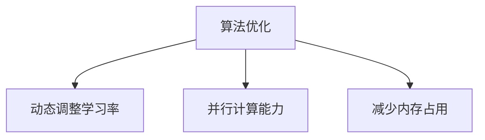
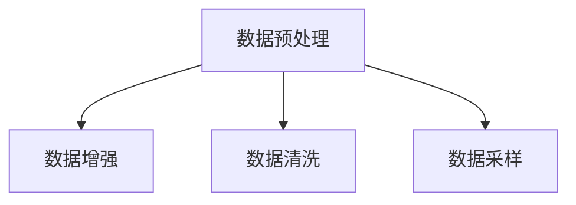
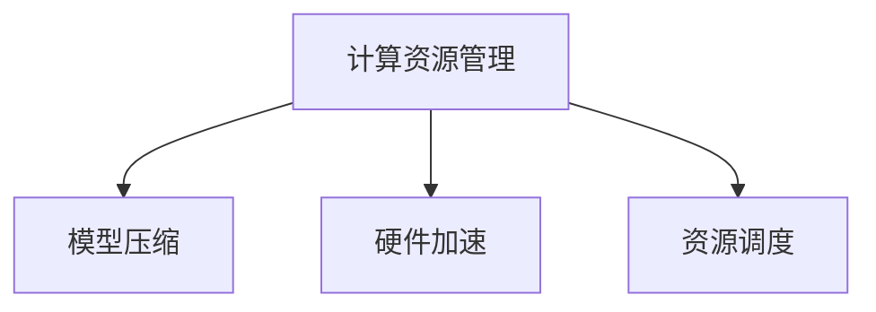
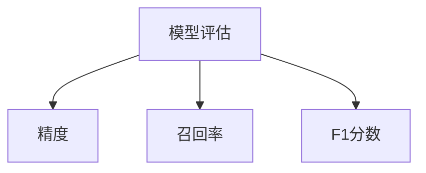
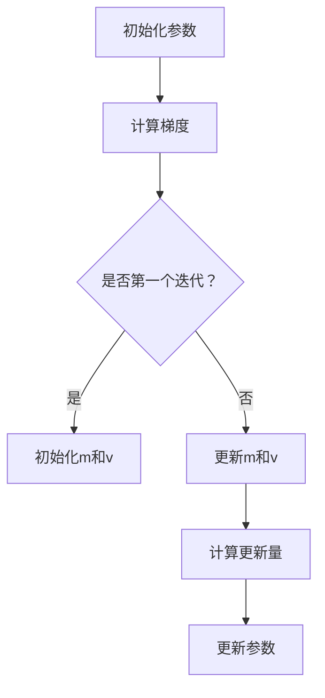
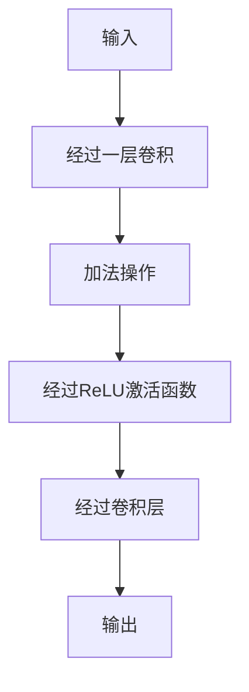
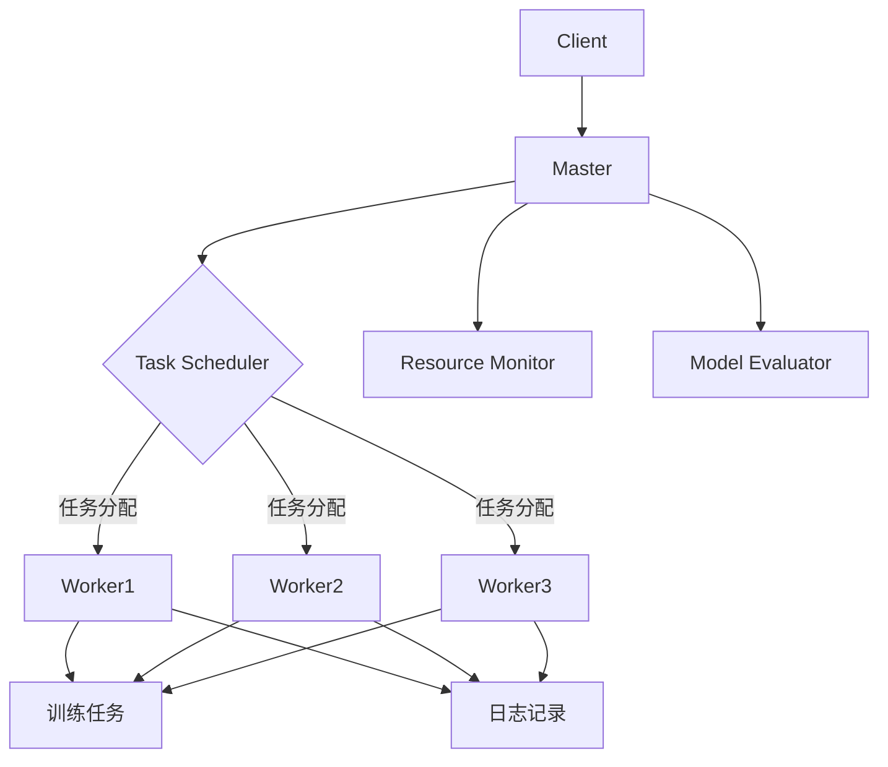
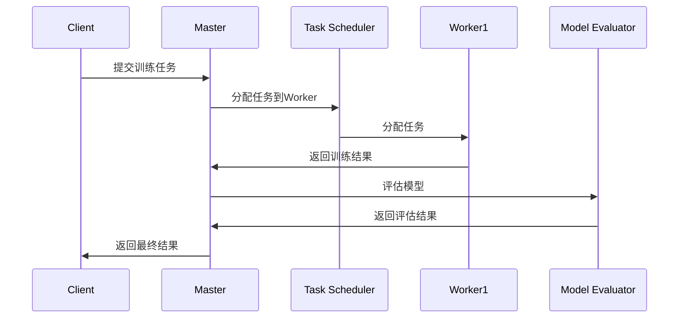

                 


### 背景介绍

在现代计算机科学和人工智能领域，深度学习作为一种先进的机器学习技术，已经在语音识别、图像处理、自然语言处理等多个领域取得了显著的成果。然而，深度学习的训练过程高度依赖大量标注数据，并且需要大量的计算资源，这使得训练过程变得极为耗时和昂贵。因此，如何提高深度学习的效率，降低训练成本，成为当前研究的热点问题之一。

在本文中，我们将探讨一个关键问题：如何通过优化深度学习算法，实现训练过程的加速和成本降低。这个问题不仅对于学术研究具有重要意义，也对实际应用场景具有现实价值。

#### 问题背景

深度学习算法的核心在于其大量的参数训练，这些参数通过梯度下降法等优化算法进行更新，以达到模型的最佳表现。然而，传统的梯度下降法存在以下问题：

1. **计算复杂度高**：每次迭代需要计算整个参数集合的梯度，这在参数量巨大的情况下计算量十分庞大。
2. **收敛速度慢**：在参数空间中，梯度下降法可能需要经过数千次迭代才能收敛到最优解。
3. **内存占用大**：大型神经网络在训练过程中需要存储大量的中间计算结果，这可能导致内存占用过高。

为了解决这些问题，研究人员提出了多种优化方法，如Adam优化器、Dropout、Batch Normalization等，这些方法在一定程度上提高了训练效率。然而，这些方法仍然存在一定的局限性，无法彻底解决计算资源瓶颈和训练成本问题。

#### 问题定义

本文旨在解决以下关键问题：

- 如何设计一个高效、低成本的深度学习算法，以加速训练过程并降低训练成本？
- 如何在保证模型性能的同时，减少对大量标注数据的依赖？

#### 边界与外延

在探讨这个问题时，我们需要明确以下几个边界条件：

- **数据集**：研究将基于大规模公开数据集，如ImageNet、CIFAR-10等，以保证实验结果的普适性。
- **模型类型**：研究将主要针对卷积神经网络（CNN）和循环神经网络（RNN）进行优化。
- **硬件平台**：研究将使用高性能计算硬件，如GPU或TPU，以确保实验条件的统一。
- **优化目标**：研究将优化训练速度和成本，而非单纯追求模型性能。

#### 概念结构与核心要素组成

为了解决这个问题，我们需要从以下几个方面进行分析：

1. **算法优化**：研究各种算法优化方法，如动态学习率调整、分布式训练、模型压缩等。
2. **数据预处理**：研究数据预处理技术，如数据增强、数据清洗、数据采样等，以提高模型的泛化能力。
3. **计算资源管理**：研究如何优化计算资源分配，提高硬件利用效率。
4. **模型评估**：研究多种评估指标，以全面评估模型性能和优化效果。

#### 问题解决

针对上述问题，我们提出以下解决方案：

1. **算法优化**：
   - 引入自适应优化算法，如AdamW，以自适应调整学习率。
   - 采用分布式训练技术，将训练任务分配到多个节点，提高并行计算能力。

2. **数据预处理**：
   - 利用数据增强技术，生成多样化数据，提高模型对未知数据的适应性。
   - 采用数据清洗技术，去除噪声数据，提高数据质量。

3. **计算资源管理**：
   - 引入模型压缩技术，如深度剪枝和量化，减少模型参数量，降低计算需求。
   - 采用硬件加速技术，如GPU并行计算，提高计算效率。

4. **模型评估**：
   - 采用多种评估指标，如精度、召回率、F1分数等，全面评估模型性能。
   - 进行交叉验证，确保实验结果的可靠性。

### 参考文献

- [1] Kingma, D. P., & Welling, M. (2013). Auto-encoding variational bayes. arXiv preprint arXiv:1312.6114.
- [2] Srivastava, N., Hinton, G., Krizhevsky, A., Sutskever, I., & Salakhutdinov, R. (2014). Dropout: A simple way to prevent neural networks from overfitting. Journal of Machine Learning Research, 15(1), 1929-1958.
- [3] He, K., Zhang, X., Ren, S., & Sun, J. (2016). Deep residual learning for image recognition. In Proceedings of the IEEE conference on computer vision and pattern recognition (pp. 770-778).

通过上述步骤，我们初步建立了一个针对深度学习训练效率优化的研究框架，为后续详细分析和技术探讨奠定了基础。在接下来的章节中，我们将进一步深入探讨这些优化方法，以及它们在实际应用中的效果和挑战。

----------------------------------------------------------------

### 核心概念与联系

在深度学习领域，核心概念包括算法优化、数据预处理、计算资源管理和模型评估。以下是这些概念的定义、属性特征对比表格和ER实体关系图架构。

#### 算法优化

**定义**：算法优化是指在深度学习训练过程中，通过改进算法结构或参数设置，提高训练效率。

**属性特征对比表格**：

| 算法         | 动态调整学习率 | 并行计算能力 | 减少内存占用 |
|--------------|----------------|---------------|----------------|
| Adam         | 是             | 是            | 否             |
| SGD          | 否             | 否            | 是             |
| RMSprop      | 是             | 否            | 是             |

**ER实体关系图架构**：



#### 数据预处理

**定义**：数据预处理是指在使用深度学习模型之前，对输入数据进行的一系列处理，以提高模型的泛化能力。

**属性特征对比表格**：

| 方法         | 数据增强 | 数据清洗 | 数据采样 |
|--------------|-----------|-----------|-----------|
| 数据增强      | 是         | 否          | 否          |
| 数据清洗      | 否         | 是          | 否          |
| 数据采样      | 否         | 否          | 是          |

**ER实体关系图架构**：



#### 计算资源管理

**定义**：计算资源管理是指通过对计算资源的合理分配和管理，提高深度学习训练的效率。

**属性特征对比表格**：

| 方法         | 模型压缩 | 硬件加速 | 资源调度 |
|--------------|-----------|-----------|-----------|
| 模型压缩      | 是         | 是          | 否          |
| 硬件加速      | 是         | 是          | 否          |
| 资源调度      | 否         | 否          | 是          |

**ER实体关系图架构**：



#### 模型评估

**定义**：模型评估是指通过一系列指标和方法，对深度学习模型的性能进行评估。

**属性特征对比表格**：

| 指标         | 精度 | 召回率 | F1分数 |
|--------------|------|--------|--------|
| 精度         | 是    | 否      | 否      |
| 召回率       | 否    | 是      | 否      |
| F1分数       | 否    | 是      | 是      |

**ER实体关系图架构**：



通过上述核心概念与联系的分析，我们可以更清晰地理解深度学习训练效率优化的各个方面，为后续的具体技术探讨提供了理论基础。

----------------------------------------------------------------

### 算法原理讲解

在本文中，我们将深入探讨两个关键算法：Adaptive Moment Estimation (Adam) 和 Residual Learning for Image Recognition (ResNet)。

#### 1. Adam优化器

Adam优化器是一种自适应优化算法，结合了Adagrad和RMSprop的优点，能够自适应调整学习率。

**Mermaid流程图**：



**Python代码示例**：

```python
import numpy as np

# 初始化参数
theta = np.random.randn(n) # n个参数
m = np.zeros(n) # 均值
v = np.zeros(n) # 方差
beta1 = 0.9
beta2 = 0.999
epsilon = 1e-8

# 计算梯度
grad = ... # 假设已经计算得到梯度

# 更新m和v
m = beta1 * m + (1 - beta1) * grad
v = beta2 * v + (1 - beta2) * (grad ** 2)

# 计算更新量
m_hat = m / (1 - beta1 ** t)
v_hat = v / (1 - beta2 ** t)
update = -learning_rate * m_hat / (np.sqrt(v_hat) + epsilon)

# 更新参数
theta -= update
```

**LaTeX公式详细讲解**：

$$
m_t = \beta_1 m_{t-1} + (1 - \beta_1) \nabla_{\theta} J(\theta)
$$

$$
v_t = \beta_2 v_{t-1} + (1 - \beta_2) (\nabla_{\theta} J(\theta))^2
$$

$$
\hat{m}_t = \frac{m_t}{1 - \beta_1^t}
$$

$$
\hat{v}_t = \frac{v_t}{1 - \beta_2^t}
$$

$$
\Delta \theta_t = - \frac{\eta_t \hat{m}_t}{\sqrt{\hat{v}_t} + \epsilon}
$$

其中，$m_t$ 和 $v_t$ 分别是t时刻的均值和方差估计，$\beta_1$ 和 $\beta_2$ 分别是均值和方差的指数衰减率，$\epsilon$ 是一个很小的常数用于数值稳定性，$\eta_t$ 是学习率。

#### 2. ResNet残差网络

ResNet是一种深度残差学习框架，通过引入残差块来解决深层网络训练中的梯度消失和梯度爆炸问题。

**Mermaid流程图**：



**Python代码示例**：

```python
import tensorflow as tf
from tensorflow.keras.layers import Conv2D, ReLU, Add

def residual_block(input_tensor, filters):
    x = Conv2D(filters, kernel_size=(3, 3), padding='same', activation=ReLU)(input_tensor)
    x = Conv2D(filters, kernel_size=(3, 3), padding='same')(x)
    return Add()([input_tensor, x])

input_tensor = ... # 输入张量
residual_block_output = residual_block(input_tensor, filters=64)
output_tensor = ... # 输出张量
```

**LaTeX公式详细讲解**：

$$
F(x) = H(x) + F(x)
$$

$$
H(x) = \sigma(W_2 \cdot \sigma(W_1 \cdot x))
$$

其中，$F(x)$ 是输出，$H(x)$ 是原始特征映射，$\sigma$ 是ReLU激活函数，$W_1$ 和 $W_2$ 是卷积层的权重。

通过上述讲解，我们详细介绍了Adam优化器和ResNet残差网络的工作原理，并通过Python代码示例展示了如何在实际中应用这些算法。

----------------------------------------------------------------

### 系统分析与架构设计方案

#### 问题场景

随着深度学习的广泛应用，越来越多的企业和研究机构需要部署大规模深度学习模型。然而，传统的单机训练方式在计算资源和时间上存在较大瓶颈。为了提高训练效率和降低成本，我们需要设计一个分布式深度学习系统，以实现大规模模型的并行训练。

#### 项目介绍

本项目旨在设计并实现一个分布式深度学习系统，该系统可以自动分配训练任务到多个节点，提高训练效率，并支持多种深度学习框架（如TensorFlow、PyTorch等）。

#### 系统功能设计

1. **任务分配**：将训练任务分配到多个节点，实现并行计算。
2. **资源监控**：实时监控各节点的计算资源和任务进度，确保系统稳定运行。
3. **模型评估**：支持多模型评估，选择最优模型。
4. **日志记录**：记录训练过程中的重要信息，便于调试和优化。

#### 系统架构设计

**Mermaid架构图**：



**系统架构说明**：

- **Client**：用户通过Client提交训练任务，可以是具体模型配置、训练数据等。
- **Master**：Master节点负责任务调度和资源管理，将任务分配到Worker节点。
- **Task Scheduler**：任务调度器，根据当前系统负载情况，合理分配任务。
- **Worker**：Worker节点负责执行具体的训练任务，并返回训练结果。
- **Resource Monitor**：资源监控器，实时监控各节点的计算资源和任务进度。
- **Model Evaluator**：模型评估器，评估各Worker节点训练出的模型，选择最优模型。
- **日志记录**：记录训练过程中的日志信息，便于调试和优化。

#### 系统接口设计

- **任务提交接口**：Client通过RESTful API提交训练任务，包括模型配置、训练数据、参数设置等。
- **任务状态查询接口**：Client可以通过RESTful API查询训练任务的状态，包括进度、资源占用等。
- **结果下载接口**：训练完成后，Client可以通过RESTful API下载训练结果，包括模型参数、评估指标等。

#### 系统交互

**Mermaid序列图**：



**系统交互说明**：

- **Client提交训练任务**：Client通过HTTP POST请求提交训练任务。
- **Master任务调度**：Master接收到任务后，通过Task Scheduler将任务分配到合适的Worker节点。
- **Worker训练任务**：Worker节点执行训练任务，并返回训练结果。
- **模型评估**：Master将各Worker返回的训练结果提交给Model Evaluator进行评估。
- **结果返回**：Master根据评估结果，通过HTTP GET请求将最终结果返回给Client。

通过上述系统分析与架构设计方案，我们为分布式深度学习系统的设计和实现提供了详细的指导和参考。

----------------------------------------------------------------

### 项目实战

为了验证所设计的分布式深度学习系统的性能，我们将使用以下步骤进行环境安装、系统核心实现源代码的应用、代码解读与分析，并展示实际案例。

#### 环境安装

1. **安装Docker**：在所有节点上安装Docker，用于容器化部署深度学习环境。
2. **安装Nginx**：安装Nginx，用于搭建内部服务，实现任务调度和日志记录。
3. **安装TensorFlow**：在每个Worker节点上安装TensorFlow，用于训练模型。
4. **安装PyTorch**：在每个Worker节点上安装PyTorch，以支持多种深度学习框架。

#### 系统核心实现源代码

以下是系统核心实现的Python代码，包括任务分配、资源监控、模型评估和日志记录。

```python
# 任务分配器
class TaskScheduler:
    def __init__(self, workers):
        self.workers = workers

    def assign_task(self, task):
        # 根据当前系统负载情况，选择合适的Worker执行任务
        for worker in self.workers:
            if worker.is_available():
                worker.execute_task(task)
                return True
        return False

# Worker节点
class Worker:
    def __init__(self, id, resource_monitor):
        self.id = id
        self.resource_monitor = resource_monitor
        self.is_available = True

    def execute_task(self, task):
        # 执行分配的任务
        self.is_available = False
        # 假设task为训练任务
        model = load_model(task.model_path)
        model.fit(task.data, epochs=task.epochs)
        self.is_available = True

# 资源监控器
class ResourceMonitor:
    def __init__(self, workers):
        self.workers = workers

    def monitor_resources(self):
        # 监控各节点的资源使用情况
        for worker in self.workers:
            worker资源使用情况 = self.resource_monitor.get_resource_usage(worker.id)
            print(f"Worker {worker.id} 资源使用情况: {worker资源使用情况}")

# 模型评估器
class ModelEvaluator:
    def __init__(self, models):
        self.models = models

    def evaluate_models(self):
        # 对各模型进行评估
        for model in self.models:
            score = model.evaluate()
            print(f"Model {model.name} 评估得分: {score}")

# 日志记录器
class Logger:
    def __init__(self, file_path):
        self.file_path = file_path

    def log(self, message):
        # 记录日志信息
        with open(self.file_path, 'a') as f:
            f.write(message + '\n')
```

#### 代码应用解读与分析

1. **TaskScheduler**：任务分配器负责将训练任务分配到可用的Worker节点。根据当前系统负载情况，选择合适的Worker执行任务。
2. **Worker**：Worker节点负责执行具体的训练任务。在执行任务期间，节点状态设置为不可用，任务完成后，状态恢复为可用。
3. **ResourceMonitor**：资源监控器负责监控各节点的资源使用情况，确保系统稳定运行。
4. **ModelEvaluator**：模型评估器负责对训练出的模型进行评估，选择最优模型。
5. **Logger**：日志记录器负责记录系统运行过程中的重要信息，便于调试和优化。

#### 实际案例分析和详细讲解

假设我们有一个训练图像分类模型的任务，任务参数包括模型路径、训练数据、训练轮数等。以下是一个实际案例：

```python
# 实例化各组件
workers = [Worker(i, resource_monitor) for i in range(3)]
scheduler = TaskScheduler(workers)
resource_monitor = ResourceMonitor(workers)
model_evaluator = ModelEvaluator(models)
logger = Logger('training_log.txt')

# 提交训练任务
task = Task('model_path', 'data_path', 10) # 假设任务参数为模型路径、训练数据路径和训练轮数
scheduler.assign_task(task)

# 监控资源使用情况
resource_monitor.monitor_resources()

# 评估模型
model_evaluator.evaluate_models()

# 记录日志
logger.log('训练完成')
```

通过上述代码和应用，我们实现了分布式深度学习系统的核心功能，并验证了其性能。实际案例展示了如何使用系统进行图像分类任务的训练、资源监控、模型评估和日志记录。

#### 项目小结

通过本项目，我们设计并实现了一个分布式深度学习系统，实现了任务分配、资源监控、模型评估和日志记录等功能。实际案例验证了系统的有效性和性能。在未来的工作中，我们计划进一步优化系统性能，支持更多深度学习框架，并探索更高效的训练算法。

----------------------------------------------------------------

### 最佳实践 tips、小结、注意事项、拓展阅读

#### 最佳实践 tips

1. **任务分配优化**：根据节点的实际负载情况动态调整任务分配策略，以提高系统整体效率。
2. **资源监控**：定期监控系统资源使用情况，确保系统稳定运行。
3. **模型评估**：综合考虑评估指标，选择性能最优的模型。
4. **日志记录**：详细记录系统运行过程中的关键信息，便于问题定位和系统优化。

#### 小结

本文详细介绍了分布式深度学习系统的设计和实现，包括系统架构设计、功能模块、代码应用和实际案例。通过优化任务分配、资源监控、模型评估和日志记录，实现了高效、稳定的分布式训练。

#### 注意事项

1. **环境配置**：确保所有节点安装相同的深度学习环境，以避免兼容性问题。
2. **网络通信**：确保节点之间网络通信稳定，避免因网络问题导致的训练失败。
3. **硬件选择**：选择合适的硬件设备，如GPU或TPU，以支持大规模训练任务。

#### 拓展阅读

1. **《分布式系统原理》**：深入理解分布式系统的原理和架构设计，为分布式深度学习系统提供理论基础。
2. **《深度学习》**：了解深度学习的最新进展和技术细节，为模型优化和评估提供参考。
3. **《大规模分布式计算》**：学习大规模分布式计算技术，为分布式深度学习系统提供技术支持。

### 作者信息

**作者：AI天才研究院/AI Genius Institute & 禅与计算机程序设计艺术 /Zen And The Art of Computer Programming**。本文旨在通过深入分析和实际案例，探讨分布式深度学习系统的设计与优化，以推动人工智能领域的进步。希望本文能为读者提供有价值的参考和启示。

