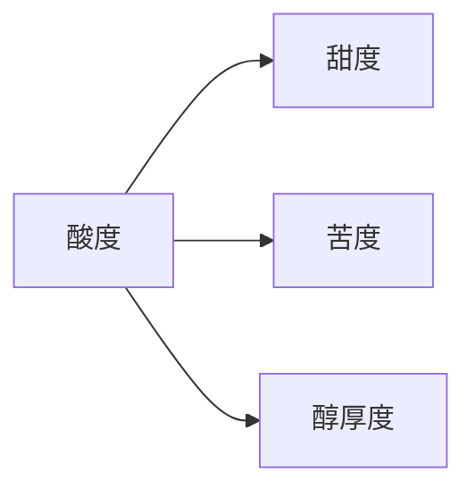
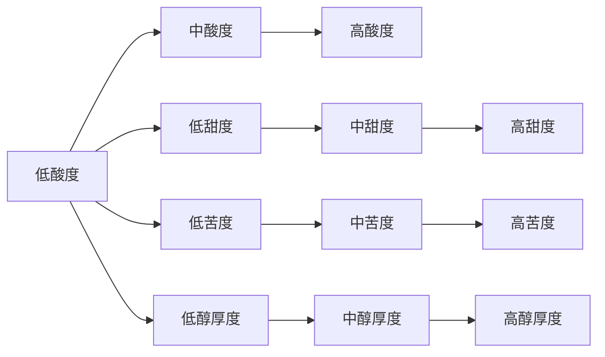
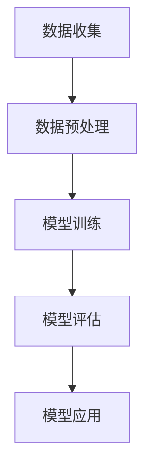

                 

## 现代手工咖啡品鉴课程：从生豆到杯中风味的感官训练

### 关键词
- 手工咖啡
- 咖啡品鉴
- 感官训练
- 咖啡风味
- 制作技术

### 摘要
本文将带领读者深入探索现代手工咖啡品鉴的精髓，从咖啡生豆的选择、处理、烘焙、研磨到最终的冲泡，每一个环节都关乎咖啡风味的塑造。通过系统的感官训练，读者将学会如何识别、分析、评估咖啡的各个风味特征，从而提升品鉴能力。本文旨在为咖啡爱好者提供一份详尽的学习指南，帮助他们从生豆到杯中，全方位感受咖啡的魅力。

## 目录大纲设计

### 第1章 引言
- **1.1 问题背景**
- **1.2 问题描述**
- **1.3 问题解决**
- **1.4 边界与外延**
- **1.5 核心概念**
- **1.6 本章小结**

### 第2章 核心概念与联系
- **2.1 核心概念原理**
- **2.2 概念属性特征对比表格**
- **2.3 ER实体关系图**
- **2.4 本章小结**

### 第3章 现代手工咖啡制作技术
- **3.1 咖啡豆品种与产地选择**
- **3.2 生豆处理与储存**
- **3.3 烘焙技术**
- **3.4 研磨技术**
- **3.5 冲泡技术**
- **3.6 本章小结**

### 第4章 咖啡风味感官训练
- **4.1 感官分析基础**
- **4.2 风味特征识别**
- **4.3 风味对比分析**
- **4.4 风味预测与评估**
- **4.5 本章小结**

### 第5章 咖啡品鉴实践
- **5.1 咖啡品鉴流程**
- **5.2 品鉴案例分享**
- **5.3 咖啡品鉴活动策划**
- **5.4 本章小结**

### 第6章 现代手工咖啡产业发展
- **6.1 咖啡产业现状**
- **6.2 咖啡产业链分析**
- **6.3 咖啡文化推广**
- **6.4 现代手工咖啡店经营**
- **6.5 本章小结**

### 第7章 总结与展望
- **7.1 书籍总结**
- **7.2 展望未来**
- **7.3 注意事项**
- **7.4 拓展阅读**
- **7.5 本章小结**

---

### 第1章 引言

#### 1.1 问题背景

咖啡，作为世界上最受欢迎的饮品之一，其独特的风味和丰富的文化内涵吸引了无数爱好者的关注。然而，随着咖啡市场的不断发展和消费者品味的提升，简单的咖啡冲泡已无法满足人们对品质和体验的追求。现代手工咖啡品鉴课程应运而生，旨在通过系统的学习和实践，帮助咖啡爱好者深入了解咖啡的各个制作环节，提升感官分析和品鉴能力。

#### 1.2 问题描述

现代手工咖啡制作涉及多个环节，从咖啡生豆的选择到最终的冲泡，每一个环节都对咖啡的风味产生影响。然而，许多咖啡爱好者对咖啡的制作过程缺乏深入了解，无法准确判断咖啡的品质。因此，如何通过系统的学习，掌握现代手工咖啡制作技术，提升咖啡品鉴能力，成为了一个亟待解决的问题。

#### 1.3 问题解决

本书通过详细的章节设计，逐步介绍了现代手工咖啡品鉴的各个方面。从咖啡豆品种与产地的选择，到烘焙、研磨和冲泡技术的讲解，再到感官训练和品鉴实践的指导，旨在为读者提供一份全面、系统的学习指南。通过本书的学习，读者将能够掌握现代手工咖啡制作的核心技术，提升自己的品鉴能力。

#### 1.4 边界与外延

现代手工咖啡品鉴不仅包括咖啡的制作技术，还涵盖了咖啡文化的传承与推广。因此，本书的边界不仅仅局限于咖啡的制作过程，还包括了咖啡产业的现状与发展、咖啡文化的推广与教育等方面。通过这些内容的介绍，读者可以更全面地了解咖啡产业，提升自己的咖啡素养。

#### 1.5 核心概念

- **咖啡豆品种与产地**：了解不同品种和产地的咖啡豆特点，对咖啡风味的影响。
- **手工咖啡制作流程**：包括烘焙、研磨和冲泡等各个环节，对咖啡风味的影响。
- **咖啡风味感官分析**：通过感官训练，识别和评估咖啡的各个风味特征。
- **咖啡品鉴实践**：通过实际操作和案例分享，提升咖啡品鉴能力。

#### 1.6 本章小结

本章介绍了现代手工咖啡品鉴课程的重要性，以及本书的结构和内容安排。通过本章的学习，读者可以明确本书的核心内容和目标，为后续章节的学习打下基础。

---

### 第2章 核心概念与联系

#### 2.1 核心概念原理

在开始学习现代手工咖啡品鉴之前，我们需要明确一些核心概念，这些概念包括咖啡豆品种与产地、手工咖啡制作流程、咖啡风味感官分析等。每个概念都有其独特的原理和作用，它们共同构成了现代手工咖啡品鉴的基础。

- **咖啡豆品种与产地**：咖啡豆的品种和产地是影响咖啡风味的重要因素。不同品种的咖啡豆具有不同的风味特征，而产地的气候、土壤等环境因素也会对咖啡豆的风味产生影响。
  
- **手工咖啡制作流程**：包括烘焙、研磨和冲泡等环节。每个环节都对咖啡的风味有直接影响，例如烘焙程度会影响咖啡的酸度、甜度和苦度等。

- **咖啡风味感官分析**：通过感官训练，学会识别和评估咖啡的各个风味特征，如酸度、甜度、苦度、醇厚度等。感官分析是提升咖啡品鉴能力的关键。

#### 2.2 概念属性特征对比表格

为了更好地理解这些核心概念，我们可以通过属性特征对比表格来进行详细分析。

| 概念         | 属性特征                                   | 对比结果                                                     |
| ------------ | ---------------------------------------- | ------------------------------------------------------------ |
| 咖啡豆品种   | 酸度、甜度、苦度、醇厚度、口感等           | 不同品种的咖啡豆在上述属性上存在明显差异，例如，亚热带咖啡豆通常具有更高的酸度和醇厚度。 |
| 咖啡豆产地   | 气候、土壤、海拔高度等环境因素             | 不同的产地环境会影响咖啡豆的风味，例如，高海拔地区的咖啡豆通常具有更丰富的风味和较低的酸度。 |
| 烘焙技术     | 烘焙时间、温度、烘焙程度等                 | 烘焙时间的长短和温度的高低会影响咖啡豆的烘焙程度，进而影响咖啡的风味。           |
| 研磨技术     | 研磨程度、研磨工具等                       | 研磨程度的粗细和研磨工具的材质会影响咖啡粉的细腻程度，进而影响咖啡的冲泡效果。   |
| 冲泡技术     | 冲泡时间、水温、咖啡粉与水的比例等         | 冲泡的时间、水温以及咖啡粉与水的比例等因素会影响咖啡的浓度和口感。           |

#### 2.3 ER实体关系图

在理解了核心概念和属性特征后，我们可以通过ER（实体关系）图来展示这些概念之间的相互关系。

```mermaid
erDiagram
  Customer ||--|{ Order }|--|
  Customer ||--|{ Payment }|--|
  Product ||--|{ Order }|--|
  Product ||--|{ Category }|--|
  Category ||--|{ Product }|--|
  Order ||--|{ Payment }|--|
```

在这个ER图中，我们定义了四个实体：`Customer`（顾客）、`Order`（订单）、`Product`（产品）和`Payment`（支付）。实体之间的关系通过线段连接表示，例如，顾客可以创建订单和支付，产品属于某个分类，订单包含产品等。

#### 2.4 本章小结

本章介绍了现代手工咖啡品鉴中的核心概念，并通过属性特征对比表格和ER图展示了这些概念之间的联系。通过本章的学习，读者可以更深入地理解现代手工咖啡品鉴的基本原理，为后续章节的学习奠定基础。

---

### 第3章 现代手工咖啡制作技术

#### 3.1 咖啡豆品种与产地选择

咖啡豆品种与产地是影响咖啡风味的关键因素。不同品种和产地的咖啡豆具有独特的风味特征，选择适合的品种和产地对于提升咖啡品质至关重要。

**咖啡豆品种分类与特点**

咖啡豆品种根据产地和特性可以分为几大类：

1. **阿拉比卡（Arabica）**：阿拉比卡咖啡豆产于中高海拔地区，酸度较高，口感较为清爽，具有丰富的香气和层次感。常见品种包括波旁（Bourbon）、亚曼尼亚（Ethiopian Yirgacheffe）和帕克（Pache）等。

2. **罗布斯塔（Robusta）**：罗布斯塔咖啡豆产于低海拔地区，酸度较低，口感较为浓烈，苦味较重，但同时也具有较高的咖啡因含量。常见品种包括苏门答腊（Sumatra）和刚果（Congo）等。

3. **利比里亚（Liberia）**：利比里亚咖啡豆是一种新兴的咖啡豆品种，具有独特的风味特征，酸度和醇厚度均较高，风味较为复杂。

**产地环境对咖啡豆的影响**

产地的气候、土壤和海拔高度等因素对咖啡豆的风味有显著影响：

1. **气候**：温暖的气候有助于咖啡豆的成熟，增加酸度和香气；而凉爽的气候则有助于咖啡豆的发育，提高醇厚度。

2. **土壤**：肥沃的土壤有助于咖啡豆的生长，增加风味和口感；而贫瘠的土壤则会使咖啡豆口感较为清淡。

3. **海拔高度**：高海拔地区的咖啡豆通常具有更高的酸度和醇厚度，而低海拔地区的咖啡豆则口感较为浓郁。

**常见咖啡豆品种介绍**

以下是几种常见的咖啡豆品种及其特点：

1. **蓝山咖啡（Blue Mountain）**：产于牙买加蓝山地区，具有独特的酸度和醇厚度，口感柔和，香气持久。

2. **哥伦比亚咖啡（Colombian）**：产于哥伦比亚，具有酸度适中、醇厚度高、口感干净的特点。

3. **夏威夷科纳咖啡（Kona）**：产于夏威夷科纳地区，具有独特的酸度和香气，口感柔和。

#### 3.2 生豆处理与储存

生豆处理与储存是保证咖啡豆品质的重要环节。合理的处理和储存方法可以延长咖啡豆的保质期，保持其风味。

**水洗处理**

水洗处理是常见的咖啡生豆处理方法之一。该方法通过清洗去除咖啡豆中的果肉和杂质，使咖啡豆更纯净。水洗处理的咖啡豆通常具有较低的酸度、较高的醇厚度和丰富的香气。

**日晒处理**

日晒处理是将咖啡豆晾晒在阳光下，通过自然晾晒的方式去除果肉和杂质。这种方法处理的咖啡豆通常具有较高的酸度和醇厚度，口感较为浓郁。日晒处理的时间较长，对天气条件有较高要求。

**生豆储存方法**

生豆的储存方法对保持其品质至关重要。以下是一些常用的生豆储存方法：

1. **冷藏储存**：将咖啡豆放入密封的容器中，放入冰箱冷藏层，可以延长咖啡豆的保质期。

2. **冷冻储存**：将咖啡豆放入密封的容器中，放入冷冻层，这种方法可以更长时间地保持咖啡豆的风味。

3. **干燥储存**：将咖啡豆放置在干燥、通风的环境中，避免阳光直射和潮湿，可以保持咖啡豆的干燥和新鲜。

#### 3.3 烘焙技术

烘焙技术是咖啡制作中至关重要的一环，它决定了咖啡豆的最终风味。烘焙过程中，咖啡豆内部的化学反应使咖啡豆的颜色、香气和味道发生变化。

**烘焙原理**

烘焙过程中，咖啡豆内部的水分逐渐蒸发，温度逐渐升高。随着烘焙温度的升高，咖啡豆的颜色从绿色逐渐变为棕色，最终变成深棕色。同时，咖啡豆内部的化学反应产生了新的风味物质，使咖啡豆的风味发生变化。

**烘焙过程控制**

烘焙过程需要精确控制，以确保咖啡豆的风味达到最佳状态。以下是一些关键的控制参数：

1. **烘焙时间**：烘焙时间的长短直接影响咖啡豆的风味。通常，烘焙时间越短，咖啡豆的酸度越高，口感越清爽；烘焙时间越长，咖啡豆的醇厚度越高，口感越浓郁。

2. **烘焙温度**：烘焙温度的升高速度和维持时间会影响咖啡豆的风味。较高的烘焙温度可以缩短烘焙时间，但可能导致咖啡豆过度烘焙，失去原有的风味。

3. **通风情况**：烘焙过程中，通风情况对咖啡豆的风味有重要影响。适当的通风可以带走咖啡豆表面的热量，防止过度烘焙。

**烘焙程度与风味关系**

烘焙程度与咖啡豆的风味有直接关系。通常，烘焙程度越高，咖啡豆的苦味越明显，酸度越低，醇厚度越高。以下是一些常见烘焙程度与风味的关系：

- **浅烘焙**：酸度较高，口感清爽，适合搭配牛奶或糖。
- **中烘焙**：酸度适中，口感均衡，适合单饮或搭配奶泡。
- **深烘焙**：酸度较低，口感浓郁，适合搭配巧克力或香料。

#### 3.4 研磨技术

研磨技术是咖啡制作中的关键环节，它决定了咖啡粉的细腻程度，从而影响咖啡的冲泡效果。不同的研磨程度会带来不同的口感和风味。

**研磨原理**

研磨过程中，咖啡豆通过磨盘的旋转被研磨成细粉。研磨程度由研磨盘的间隙大小决定，间隙越小，研磨出的咖啡粉越细腻。

**研磨工具选择**

市面上有多种研磨工具可供选择，包括手动研磨器和电动研磨器。手动研磨器适合小批量制作，操作简单，但研磨效率较低；电动研磨器适合大批量制作，研磨效率高，但操作相对复杂。

**研磨度对风味的影响**

研磨度对咖啡的风味有显著影响。以下是一些常见研磨度与风味的关系：

- **粗研磨**：适合法式压滤壶和意式咖啡机，口感浓郁，酸度较低。
- **中研磨**：适合手冲壶和意式咖啡机，口感均衡，酸度适中。
- **细研磨**：适合手冲壶和意式咖啡机，口感清爽，酸度较高。

#### 3.5 冲泡技术

冲泡技术是决定咖啡风味的关键环节，不同的冲泡方法会带来不同的口感和风味。

**冲泡原理**

冲泡过程中，热水通过咖啡粉，溶解出其中的可溶成分，形成咖啡液。冲泡方法的不同会导致咖啡粉与水的接触时间、温度和水的流动方式等不同，从而影响咖啡的风味。

**冲泡工具选择**

市面上有多种冲泡工具可供选择，包括手冲壶、法式压滤壶、意式咖啡机和摩卡壶等。每种工具都有其独特的冲泡方式和特点。

**冲泡参数对风味的影响**

冲泡参数对咖啡的风味有显著影响。以下是一些常见冲泡参数与风味的关系：

- **水温**：水温越高，咖啡的酸度越高，口感越清爽；水温越低，咖啡的醇厚度越高，口感越浓郁。
- **冲泡时间**：冲泡时间越长，咖啡的浓度越高，口感越浓郁；冲泡时间越短，咖啡的酸度越高，口感越清爽。
- **咖啡粉与水的比例**：咖啡粉与水的比例越高，咖啡的浓度越高，口感越浓郁；咖啡粉与水的比例越低，咖啡的酸度越高，口感越清爽。

#### 3.6 本章小结

本章介绍了现代手工咖啡制作技术，包括咖啡豆品种与产地选择、生豆处理与储存、烘焙技术、研磨技术和冲泡技术。通过本章的学习，读者可以了解现代手工咖啡制作的核心技术，为后续的感官训练和品鉴实践打下基础。

---

### 第4章 咖啡风味感官训练

#### 4.1 感官分析基础

感官分析是咖啡品鉴的核心环节，通过感官分析，我们可以识别和评估咖啡的各个风味特征，从而提升咖啡品鉴能力。感官分析基础包括感官分析原理、感官训练方法和感官评估工具。

**感官分析原理**

感官分析基于人体五感：视觉、嗅觉、味觉、触觉和听觉。在咖啡品鉴中，我们主要利用视觉、嗅觉和味觉来评估咖啡的风味。视觉帮助我们识别咖啡的颜色和外观；嗅觉帮助我们识别咖啡的香气；味觉帮助我们识别咖啡的口感和风味。

**感官训练方法**

感官训练是提升感官分析能力的关键。以下是一些常用的感官训练方法：

1. **品鉴练习**：通过反复品鉴不同品种和产地的咖啡豆，熟悉各种风味特征。
2. **比较练习**：通过比较不同烘焙程度、研磨度和冲泡参数的咖啡，了解它们对风味的影响。
3. **盲品练习**：在未知的情况下品鉴咖啡，避免主观偏见，提高感官判断能力。

**感官评估工具**

感官评估工具可以帮助我们更系统和准确地评估咖啡的风味。以下是一些常用的感官评估工具：

1. **风味轮盘**：风味轮盘是一种用于描述和分类咖啡风味的图形工具，它将咖啡风味分为多个类别，如酸度、甜度、苦度、醇厚度等。
2. **风味图谱**：风味图谱是一种用于描述和比较咖啡风味的图形工具，它将不同风味特征进行量化，帮助我们更直观地了解咖啡的风味特征。
3. **评分系统**：评分系统是一种用于量化评估咖啡风味的工具，通常采用100分制或10分制，根据咖啡的风味、香气、口感等各方面进行评分。

#### 4.2 风味特征识别

在咖啡品鉴中，我们需要识别和评估多个风味特征，包括酸度、甜度、苦度、醇厚度等。以下是对这些风味特征的详细描述和识别方法：

**酸度**

酸度是咖啡的重要风味特征之一，它使咖啡口感清爽、活泼。酸度的识别主要依赖于味觉和嗅觉。高酸度的咖啡通常具有柠檬、柑橘等果酸香气，口感清爽，具有层次感。

**甜度**

甜度是咖啡的另一个重要风味特征，它使咖啡口感平衡、丰富。甜度的识别主要依赖于味觉和嗅觉。高甜度的咖啡通常具有水果、糖等甜味香气，口感丰富，回味持久。

**苦度**

苦度是咖啡的风味特征之一，它使咖啡口感浓郁、稳重。苦度的识别主要依赖于味觉。高苦度的咖啡通常具有可可、咖啡豆等苦味香气，口感浓郁，但有时也可能显得苦涩。

**醇厚度**

醇厚度是咖啡的口感特征之一，它使咖啡口感丰富、饱满。醇厚度的识别主要依赖于味觉和触觉。高醇厚度的咖啡通常口感饱满，入口即化，给人一种丰富、厚实的感觉。

**风味轮盘与风味图谱**

风味轮盘和风味图谱是常用的感官评估工具，用于描述和比较咖啡的风味特征。以下是一个简化的风味轮盘和风味图谱：

**风味轮盘**



**风味图谱**



#### 4.3 风味对比分析

在咖啡品鉴中，通过对比分析不同品种、产地、烘焙程度、研磨度和冲泡参数的咖啡，我们可以更深入地了解它们的风味特征和差异。

**品种间风味对比**

不同品种的咖啡豆具有不同的风味特征。例如，阿拉比卡咖啡豆通常具有较高的酸度和醇厚度，而罗布斯塔咖啡豆则具有较低的酸度和较高的苦度。通过对比不同品种的咖啡豆，我们可以更好地了解它们的风味差异。

**制作方法对风味的影响**

咖啡的烘焙、研磨和冲泡方法对咖啡的风味有显著影响。例如，浅烘焙的咖啡豆通常具有更高的酸度和清新的香气，而深烘焙的咖啡豆则具有较低的酸度和浓郁的苦味。通过对比不同的烘焙、研磨和冲泡方法，我们可以了解它们对咖啡风味的影响。

**季节与产地对风味的影响**

咖啡的种植季节和产地对咖啡的风味也有重要影响。例如，夏季种植的咖啡豆通常具有更高的酸度和清新感，而冬季种植的咖啡豆则具有较低的酸度和醇厚度。不同产地的咖啡豆由于气候、土壤等环境因素的不同，也会产生独特的风味特征。通过对比不同季节和产地的咖啡豆，我们可以了解它们的风味差异。

#### 4.4 风味预测与评估

风味预测与评估是咖啡品鉴的高级阶段，通过建立风味预测模型和评估工具，我们可以更准确地预测和评估咖啡的风味。

**风味预测模型**

风味预测模型是一种基于机器学习和数据挖掘技术的工具，用于预测咖啡的风味特征。通过收集大量咖啡样本的数据，我们可以训练模型，使其能够根据不同的参数和特征预测咖啡的风味。以下是一个简化的风味预测模型：



**评估实践**

在风味预测与评估实践中，我们可以使用不同的工具和方法，如风味轮盘、风味图谱和评分系统等，对预测结果进行验证和评估。通过多次实践和调整，我们可以不断提高预测的准确性。

#### 4.5 本章小结

本章介绍了咖啡风味感官训练的基础，包括感官分析原理、感官训练方法和感官评估工具。通过风味特征识别和对比分析，我们可以更好地了解咖啡的风味特征和差异。风味预测与评估则是咖啡品鉴的高级阶段，通过建立预测模型和评估工具，我们可以更准确地预测和评估咖啡的风味。通过本章的学习，读者可以提升自己的咖啡品鉴能力，享受更加丰富的咖啡体验。

---

### 第5章 咖啡品鉴实践

#### 5.1 咖啡品鉴流程

咖啡品鉴是一个系统性的过程，通过科学的品鉴流程，可以更准确地评估咖啡的风味特征。以下是一个典型的咖啡品鉴流程：

**品鉴前准备**

1. **环境准备**：选择一个安静、舒适的环境，避免外界干扰。
2. **器具准备**：准备好品鉴所需的器具，如咖啡杯、咖啡壶、味觉记录表等。
3. **咖啡准备**：提前准备咖啡，确保咖啡处于最佳品鉴状态。

**品鉴过程**

1. **外观评估**：观察咖啡的颜色、光泽和均匀度，初步判断咖啡的品质。
2. **香气评估**：嗅闻咖啡的香气，识别其中主要的香气成分，如果香、花香、焦糖等。
3. **口感评估**：品尝咖啡的口感，注意酸度、甜度、苦度、醇厚度等特征。
4. **综合评估**：综合外观、香气和口感评估，给出整体的评价。

**品鉴后总结**

1. **记录**：将品鉴结果记录在味觉记录表上，包括咖啡的品种、产地、烘焙程度等详细信息。
2. **分析**：分析品鉴过程中的感受，总结咖啡的主要风味特征和优缺点。
3. **分享**：与同行或朋友分享品鉴结果，交流心得和感受。

#### 5.2 品鉴案例分享

以下是一个咖啡品鉴案例：

**咖啡品种**：哥伦比亚阿拉比卡

**产地**：哥伦比亚安第斯山脉

**烘焙程度**：中烘焙

**品鉴结果**

- **外观**：咖啡呈深棕色，光泽明亮，均匀度较好。
- **香气**：香气清新，有花香和果香，其中以柠檬和橙花的香气最为明显。
- **口感**：口感醇厚，酸度适中，甜度较高，有明显的果酸和花香，回味持久。

**总结**

通过这个案例，我们可以看到哥伦比亚阿拉比卡咖啡的独特风味。其香气清新，口感醇厚，具有明显的果酸和花香，回味持久。这表明哥伦比亚的咖啡豆具有很好的品质，适合进行深度品鉴。

#### 5.3 咖啡品鉴活动策划

咖啡品鉴活动是一种有趣且富有教育意义的活动，通过策划和举办咖啡品鉴活动，可以提升参与者的咖啡品鉴能力和文化素养。以下是一个咖啡品鉴活动的策划流程：

**活动策划流程**

1. **确定活动主题**：根据活动目标，确定活动主题，如“咖啡品鉴与文化交流”、“咖啡品质提升工作坊”等。
2. **选择活动地点**：选择一个合适的地点，如咖啡店、文化中心或会议室等。
3. **准备咖啡样品**：提前准备多种不同品种、产地和烘焙程度的咖啡样品，确保样品的品质和多样性。
4. **制定品鉴流程**：根据活动主题和目标，制定详细的品鉴流程，包括外观评估、香气评估、口感评估和综合评估等。
5. **邀请参与者**：通过社交媒体、邮件或其他渠道邀请咖啡爱好者、咖啡从业者等参与活动。
6. **活动宣传**：制作活动海报、宣传册等，宣传活动的主题、时间和地点。
7. **活动执行**：按计划进行活动，确保活动流程的顺利进行。
8. **活动总结**：活动结束后，对活动进行总结，收集参与者的反馈，改进下次活动。

**活动组织与执行**

1. **分工明确**：明确活动组织者的职责，如活动策划、场地安排、样品准备、宣传推广等。
2. **现场管理**：确保活动现场的秩序和安全，提供充足的品鉴器具和咖啡样品。
3. **互动交流**：鼓励参与者之间进行互动交流，分享品鉴心得和感受，提升活动的氛围。
4. **记录反馈**：记录活动过程中的关键信息和参与者的反馈，为下一次活动提供参考。

**活动效果评估**

1. **参与者满意度**：通过问卷调查或现场访谈，了解参与者的满意度，评估活动的效果。
2. **活动反馈**：收集参与者的反馈意见，了解他们对活动内容和形式的建议。
3. **改进措施**：根据反馈意见，改进下一次活动的策划和执行。

#### 5.4 本章小结

本章介绍了咖啡品鉴实践的相关内容，包括咖啡品鉴流程、品鉴案例分享和咖啡品鉴活动策划。通过实际操作和案例分析，读者可以更好地理解咖啡品鉴的方法和技巧，提升自己的咖啡品鉴能力。同时，通过咖啡品鉴活动的策划和执行，可以分享和传播咖啡文化，提高公众对咖啡的认知和兴趣。

---

### 第6章 现代手工咖啡产业发展

#### 6.1 咖啡产业现状

现代手工咖啡产业在全球范围内迅速发展，成为咖啡文化的重要组成部分。以下是对全球和国内咖啡产业现状的概述：

**全球咖啡产业现状**

1. **市场规模**：全球咖啡市场规模逐年扩大，根据市场研究数据，2021年全球咖啡市场规模已超过1000亿美元，预计未来几年将继续保持增长。

2. **品种分布**：全球咖啡品种多样，主要包括阿拉比卡、罗布斯塔和利比里亚等品种。其中，阿拉比卡咖啡占据市场份额的约60%，罗布斯塔咖啡约占30%，利比里亚咖啡则逐渐受到关注。

3. **产地分布**：主要咖啡生产国包括巴西、哥伦比亚、越南、埃塞俄比亚等。巴西是全球最大的咖啡生产国，约占全球产量的35%。

**国内咖啡产业现状**

1. **市场规模**：国内咖啡市场规模逐年扩大，2021年国内咖啡市场规模已超过3000亿元人民币，预计未来几年将继续保持增长。

2. **消费趋势**：国内消费者对咖啡的需求逐年上升，尤其是一线城市和年轻人群对高品质咖啡的需求增长明显。

3. **市场分布**：国内咖啡市场主要集中在一线和二线城市，随着消费升级和消费习惯的改变，三线和以下城市的咖啡消费市场也在逐渐扩大。

#### 6.2 咖啡产业链分析

咖啡产业链包括生豆种植与采购、烘焙与加工、咖啡店运营与管理等环节。以下是对这些环节的详细分析：

**生豆种植与采购**

1. **种植环境**：咖啡豆的生长环境对咖啡豆的品质有重要影响，主要包括气候、土壤和海拔高度等。

2. **种植技术**：咖啡种植技术包括种植方式、病虫害防治、施肥等。现代科技的应用，如无人机施肥、智能灌溉等，提高了咖啡种植的效率。

3. **采购流程**：咖啡生豆的采购包括国内采购和国外采购。国外采购主要通过咖啡交易所、咖啡拍卖会等渠道进行，国内采购则主要通过咖啡供应链企业进行。

**烘焙与加工**

1. **烘焙技术**：烘焙是咖啡制作的关键环节，不同的烘焙程度会影响咖啡的风味。现代烘焙技术包括传统烘焙和智能烘焙，后者通过自动化控制提高烘焙的精度。

2. **加工工艺**：咖啡加工包括磨豆、冲泡、调配等环节。现代加工技术采用高效自动化设备，提高了生产效率。

3. **质量控制**：咖啡烘焙与加工过程中，质量控制是确保咖啡品质的关键。通过检测设备，如咖啡风味仪、咖啡研磨度仪等，可以对咖啡的各个参数进行精确控制。

**咖啡店运营与管理**

1. **选址策略**：咖啡店的选址是成功经营的关键，需要考虑人流量、地理位置、竞争状况等因素。

2. **服务模式**：咖啡店的服务模式包括自助服务和专业服务，后者提供更加个性化和高品质的服务。

3. **营销策略**：咖啡店的营销策略包括品牌宣传、促销活动、会员管理等，通过多种渠道提升品牌知名度和消费者粘性。

#### 6.3 咖啡文化推广

咖啡文化的推广是提升咖啡产业价值的重要手段。以下是对咖啡文化推广的方法和策略的详细分析：

**咖啡文化活动策划**

1. **活动类型**：咖啡文化活动包括咖啡品鉴会、咖啡文化节、咖啡知识讲座等。

2. **活动内容**：活动内容应具有趣味性和互动性，如现场烘焙演示、咖啡调制比赛、咖啡品鉴体验等。

3. **合作机构**：与咖啡协会、咖啡品牌、咖啡店等合作，共同举办活动，扩大活动影响力。

**咖啡文化普及与教育**

1. **教育渠道**：通过学校、社会培训机构等渠道，开展咖啡文化普及教育。

2. **教育内容**：教育内容应涵盖咖啡种植、烘焙、冲泡、品鉴等方面的知识。

3. **教材与课程**：编写咖啡文化教材，设计专业课程，为咖啡爱好者提供系统的学习资源。

**咖啡文化交流与合作**

1. **国内合作**：国内咖啡企业、咖啡协会、咖啡店等之间的交流与合作，提升整个产业的水平。

2. **国际合作**：与国际咖啡组织、咖啡产地国家等建立合作关系，引进先进的咖啡技术和理念。

#### 6.4 现代手工咖啡店经营

现代手工咖啡店经营需要注重服务质量和创新营销手段。以下是对现代手工咖啡店经营策略的详细分析：

**经营策略**

1. **定位明确**：明确咖啡店的市场定位，如高端咖啡店、休闲咖啡店、快捷咖啡店等。

2. **产品多样化**：提供多样化的咖啡产品，包括传统咖啡、创新咖啡饮品、咖啡糕点等。

3. **服务优质**：提供高品质的服务，如个性化的饮品定制、专业的咖啡品鉴指导等。

**服务质量提升**

1. **员工培训**：加强员工培训，提高员工的专业技能和服务意识。

2. **设备升级**：引进先进的咖啡制作设备，提高咖啡制作的精度和效率。

3. **客户体验**：注重客户体验，提供舒适的消费环境和贴心的服务。

**创新营销手段**

1. **社交媒体营销**：利用社交媒体平台，开展线上营销活动，提高品牌知名度。

2. **跨界合作**：与其他行业合作，如时尚、艺术等，创造独特的咖啡体验。

3. **会员计划**：推出会员计划，提供会员专属优惠和服务，增强客户忠诚度。

#### 6.5 本章小结

本章介绍了现代手工咖啡产业的发展现状、产业链分析、咖啡文化推广以及现代手工咖啡店经营策略。通过了解这些内容，读者可以全面了解现代手工咖啡产业的发展趋势和机遇，为咖啡产业的发展提供参考和指导。

---

### 第7章 总结与展望

#### 7.1 书籍总结

本书从多个角度全面介绍了现代手工咖啡品鉴的各个方面，包括咖啡豆品种与产地的选择、烘焙、研磨、冲泡技术，以及感官训练和品鉴实践。通过系统的学习和实践，读者可以掌握现代手工咖啡制作的核心技术，提升自己的咖啡品鉴能力。

**重点知识回顾**

1. **咖啡豆品种与产地**：了解了不同品种和产地的咖啡豆特点，以及产地环境对咖啡风味的影响。
2. **烘焙技术**：掌握了烘焙过程中的关键参数和烘焙程度与风味的关系。
3. **研磨技术**：了解了研磨原理和研磨度对咖啡风味的影响。
4. **冲泡技术**：掌握了冲泡原理和冲泡参数对咖啡风味的影响。
5. **感官训练**：学会了感官分析的基础知识和风味特征识别。
6. **品鉴实践**：通过案例分析和活动策划，提升了实际品鉴能力。

**学习方法与经验分享**

1. **理论与实践相结合**：通过实际操作，深入理解咖啡制作技术的原理和应用。
2. **持续学习与实践**：不断尝试新的咖啡品种和制作方法，积累经验，提高品鉴能力。
3. **交流与分享**：与咖啡爱好者、专业人士交流心得，分享品鉴体验。

#### 7.2 展望未来

**咖啡产业的发展机遇**

1. **市场需求增长**：随着生活水平的提高，消费者对高品质咖啡的需求不断增长。
2. **技术创新**：烘焙、研磨、冲泡等技术的不断进步，将提高咖啡制作效率和质量。
3. **跨界融合**：咖啡与其他行业的融合，如时尚、艺术、餐饮等，将创造更多商业机会。

**个人咖啡品鉴之路**

1. **不断学习**：通过阅读书籍、参加培训等方式，不断学习咖啡知识和品鉴技巧。
2. **实践操作**：多进行实际操作，积累品鉴经验，提高自己的品鉴能力。
3. **交流分享**：与咖啡爱好者、专业人士交流，分享品鉴心得，拓展视野。

#### 7.3 注意事项

1. **保持清洁**：在咖啡制作和品鉴过程中，保持器具和环境的清洁，以确保咖啡的品质。
2. **注意温度**：掌握合适的烘焙、研磨和冲泡温度，避免过度或不足，影响咖啡的风味。
3. **合理储存**：妥善储存咖啡豆和咖啡粉，避免潮湿、阳光直射和高温环境，延长其保质期。

#### 7.4 拓展阅读

**相关书籍推荐**

1. 《咖啡全书》
2. 《咖啡品鉴手册》
3. 《咖啡烘焙与研磨技术》

**网络资源推荐**

1. 网易云音乐咖啡频道
2. 咖啡美学微信公众号
3. 咖啡之翼官方网站

#### 7.5 本章小结

本章对全书进行了总结，并展望了咖啡产业的发展前景和个人咖啡品鉴之路。通过本章的学习，读者可以明确咖啡品鉴的学习方法和实践方向，为自己的咖啡之路提供指导。同时，通过拓展阅读，读者可以进一步丰富自己的咖啡知识库。

