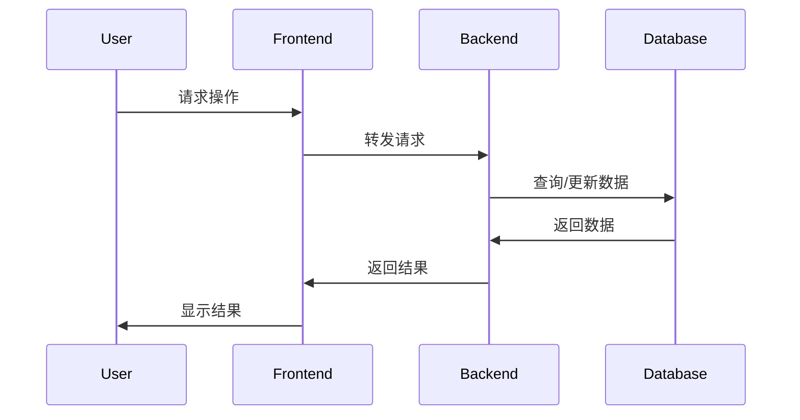
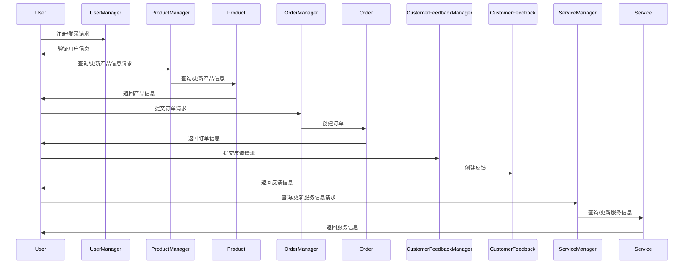
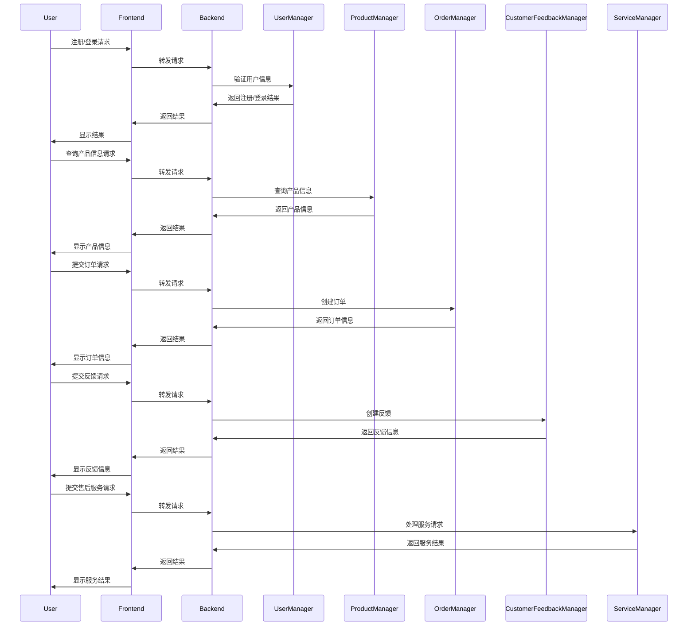

                 

### 文章标题

# 现代手工咖啡烘焙订阅服务：每月精选单品的定期配送

> 关键词：现代手工咖啡烘焙、订阅服务、精选单品、定期配送

> 摘要：本文将探讨现代手工咖啡烘焙订阅服务的发展背景、核心概念及其运作模式。文章从市场背景出发，逐步深入到咖啡烘焙基础知识、手工烘焙技术、订阅服务运营、配送管理、客户体验优化等方面，通过案例研究总结成功与失败的经验教训，并展望未来的发展趋势。

---

## 引言与背景

### 市场背景

现代手工咖啡烘焙市场正处于快速发展阶段。随着消费者对咖啡品质和独特风味的需求日益增加，手工烘焙的咖啡因其独特性、艺术性和个性化体验而受到广泛欢迎。近年来，手工烘焙咖啡店和咖啡烘焙师的数量不断增加，各类咖啡烘焙比赛和展览也越来越多，这些都推动了手工咖啡烘焙市场的繁荣。

### 发展趋势

1. **消费者需求多样化和个性化**：随着生活水平的提高，消费者对咖啡的需求不再仅仅停留在口感和功能层面，更加注重品质和独特性。定制化、个性化的服务模式逐渐成为主流。
2. **数字化和智能化趋势**：随着互联网技术的发展，线上销售、订单管理、客户关系管理等都得到了极大提升。智能化设备和数据挖掘技术的应用使得咖啡烘焙过程更加高效和精准。
3. **环保和可持续发展**：消费者对环保和可持续发展的关注逐渐增加，手工咖啡烘焙因其减少工业污染和资源浪费的特点，受到了更多消费者的青睐。

### 书籍目标读者

本书旨在为对现代手工咖啡烘焙订阅服务感兴趣的读者提供全方位的指导。目标读者包括：

1. **咖啡烘焙爱好者**：对咖啡烘焙感兴趣，希望了解和尝试手工烘焙的人。
2. **咖啡店店主和运营人员**：希望通过订阅服务模式提升客户体验和店铺收益。
3. **咖啡行业从业者**：希望了解和掌握现代手工咖啡烘焙订阅服务的运营和管理方法。
4. **供应链管理人员**：关注咖啡供应链的各个环节，希望优化物流和配送流程。

## 咖啡烘焙基础知识

### 核心概念术语

- **咖啡豆**：咖啡树结出的种子，是咖啡的主要原料。
- **烘焙**：将咖啡豆在高温下加热，使其颜色、气味和口感发生变化的工艺过程。
- **烘焙曲线**：描述烘焙过程中温度随时间变化的曲线，是影响咖啡风味的关键因素。

### 问题背景

咖啡烘焙是一个复杂的过程，需要精确控制温度、时间和湿度等因素。不同的烘焙程度会产生不同的风味和口感，这也是手工烘焙的魅力所在。

### 问题描述

如何通过手工烘焙技术，创造出符合消费者需求的、高质量的咖啡单品？

### 问题解决

1. **选择优质咖啡豆**：优质的咖啡豆是手工烘焙成功的基础。根据不同的风味和用途，选择合适的咖啡豆。
2. **掌握烘焙曲线**：通过反复试验和调整，找到适合自己烘焙风格的烘焙曲线。
3. **个性化定制**：根据客户的需求和口味，提供定制化的烘焙服务。

### 边界与外延

1. **烘焙程度的边界**：过浅或过深的烘焙都会影响咖啡的风味和口感。
2. **烘焙曲线的外延**：不同种类的咖啡豆和烘焙设备需要不同的烘焙曲线，需要不断尝试和调整。

### 概念结构与核心要素组成

1. **咖啡豆种类**：阿拉比卡、罗布斯塔等。
2. **烘焙设备**：烤箱、烘焙机等。
3. **烘焙曲线**：温度-时间曲线。
4. **风味调整**：烘焙程度、烘焙时间、烘焙温度等。

## 手工咖啡烘焙技术

### 烤焙方法

1. **直接烘焙**：将咖啡豆直接放置在烤盘上，通过热量传递进行烘焙。
2. **间接烘焙**：通过热空气或其他介质传递热量，对咖啡豆进行烘焙。

### 烤焙设备选择

1. **烤箱**：适合家庭和小规模烘焙，操作简单。
2. **烘焙机**：适合商业规模烘焙，效率高，控制精准。

### 烤焙曲线调整

1. **温度调整**：根据咖啡豆的品种和烘焙程度，调整烘焙曲线中的温度段。
2. **时间调整**：根据烘焙曲线，调整烘焙时间，以达到理想的烘焙效果。

### 烤焙技巧与细节

1. **预热**：确保烘焙设备在烘焙开始前达到适当的温度。
2. **翻动**：定期翻动咖啡豆，确保均匀烘焙。
3. **观察与调整**：在烘焙过程中，不断观察咖啡豆的颜色、气味和声音，根据情况进行调整。

## 订阅服务运营

### 运营策略

1. **市场定位**：明确目标客户群体，提供差异化的服务。
2. **品牌建设**：通过优质的产品和服务，树立品牌形象。
3. **客户关系管理**：建立良好的客户关系，提供个性化的服务和体验。

### 客户管理

1. **会员制度**：通过会员制度，提供优惠和专属服务，增加客户粘性。
2. **客户反馈**：及时收集和处理客户反馈，不断改进服务质量。

### 市场营销

1. **线上营销**：利用社交媒体、电子商务平台等，扩大品牌知名度。
2. **线下活动**：举办咖啡品尝会、烘焙体验活动等，增加客户互动。

## 配送管理

### 物流配送流程

1. **仓储管理**：确保咖啡单品的安全存储和有效管理。
2. **订单处理**：快速响应订单，确保及时配送。
3. **配送方式**：选择合适的配送方式，确保客户满意度。

### 仓储管理

1. **库存管理**：实时监控库存情况，确保库存充足。
2. **温度控制**：确保仓储环境符合咖啡存储要求。

### 订单处理

1. **订单接收**：快速接收和处理订单。
2. **订单核对**：确保订单准确无误。
3. **配送安排**：根据订单情况，安排合适的配送时间和方式。

## 客户体验优化

### 客户反馈机制

1. **反馈渠道**：提供多种渠道，如在线评价、电话反馈等，方便客户表达意见。
2. **反馈处理**：及时处理客户反馈，解决问题，提升服务质量。

### 服务质量提升

1. **培训员工**：提高员工的咖啡烘焙和客户服务技能。
2. **优化流程**：通过流程优化，减少不必要的环节，提高效率。

### 个性化定制

1. **定制方案**：根据客户需求，提供个性化的烘焙和服务方案。
2. **定制体验**：通过定制化服务，提升客户满意度。

## 案例研究

### 案例一：成功订阅服务案例分析

1. **成功因素**：优质产品、个性化服务、良好客户关系管理。
2. **经验教训**：坚持品牌建设，不断优化服务。

### 案例二：失败订阅服务案例反思

1. **失败原因**：产品同质化、服务质量不稳定、客户关系管理不到位。
2. **改进建议**：加强品牌差异化，提高服务质量，建立良好客户关系。

## 总结与未来展望

### 主要内容回顾

本文从市场背景、咖啡烘焙基础知识、手工烘焙技术、订阅服务运营、配送管理、客户体验优化等多个角度，全面介绍了现代手工咖啡烘焙订阅服务的核心概念和运作模式。

### 未来发展趋势

1. **智能化**：随着人工智能技术的发展，咖啡烘焙和订阅服务将更加智能化和高效化。
2. **个性化**：消费者对个性化需求将越来越高，订阅服务将更加注重个性化定制。
3. **可持续发展**：环保和可持续发展将成为重要趋势，手工烘焙的环保特性将受到更多关注。

### 总结

现代手工咖啡烘焙订阅服务是一种具有广阔前景的业务模式。通过优质的产品、个性化的服务和高效的运营管理，可以满足消费者对高品质咖啡的需求，同时也为咖啡烘焙从业者提供了新的发展机遇。

### 小结

本文对现代手工咖啡烘焙订阅服务进行了深入的分析和探讨，从市场背景、技术原理、运营管理到客户体验优化，全面覆盖了订阅服务的各个层面。通过案例研究和趋势分析，为读者提供了宝贵的经验和启示。

### 注意事项

1. **产品品质**：确保产品品质是订阅服务成功的关键。
2. **客户体验**：关注客户体验，不断优化服务质量。
3. **持续创新**：紧跟市场趋势，持续创新，保持竞争力。

### 拓展阅读

1. **相关书籍**：《咖啡烘焙艺术》、《现代咖啡店经营与管理》。
2. **在线资源**：相关行业网站、博客、社交媒体等。
3. **学术论文**：关于咖啡烘焙、订阅服务等方面的研究论文。

---

### 作者

作者：AI天才研究院/AI Genius Institute & 禅与计算机程序设计艺术 /Zen And The Art of Computer Programming

---

通过本文的详细探讨，希望能为对现代手工咖啡烘焙订阅服务感兴趣的读者提供有价值的参考和启示。让我们共同探索这一新兴市场的无限可能！### 背景介绍

#### 核心概念术语说明

在现代手工咖啡烘焙订阅服务中，有几个核心概念术语需要我们了解：

1. **手工咖啡烘焙**：指通过人工控制烘焙设备和烘焙曲线，对咖啡豆进行烘焙的过程。这与工业化大规模烘焙相比，具有更高的艺术性和个性化特点。
2. **订阅服务**：指消费者通过支付一定费用，定期获取特定产品或服务的模式。在这种模式下，消费者可以享受到持续、稳定的产品供应和服务体验。
3. **精选单品**：指从众多咖啡豆中筛选出的品质优异、风味独特的咖啡豆，通过手工烘焙工艺加工而成。这些单品通常具有特定的产地、品种或烘焙程度，能够满足不同消费者的个性化需求。
4. **定期配送**：指根据消费者的订阅计划，定期将精选单品配送到消费者的指定地址。这种模式能够保证消费者始终能够享受到最新鲜、最优质的咖啡。

#### 问题背景

随着消费者对咖啡品质和体验的追求不断提升，传统的咖啡销售模式已经无法满足市场的需求。现代手工咖啡烘焙订阅服务应运而生，它通过提供定制化、个性化、连续化的咖啡供应，满足了消费者对高品质咖啡的渴望。同时，随着互联网技术的发展，电子商务和智能物流的普及，使得订阅服务的运营成本大幅降低，服务质量显著提升。因此，探讨现代手工咖啡烘焙订阅服务的发展背景、运作模式和未来趋势具有重要的现实意义。

#### 问题描述

现代手工咖啡烘焙订阅服务如何在竞争激烈的市场中脱颖而出，满足消费者的个性化需求，同时实现可持续的商业模式？

#### 问题解决

1. **高品质产品**：通过精选优质咖啡豆和精湛的手工烘焙技术，确保每一款单品都能满足消费者的口味和品质要求。
2. **个性化服务**：通过深入了解消费者需求，提供定制化的烘焙方案和配送服务，增强消费者的参与感和满意度。
3. **高效运营**：利用数字化技术和智能化设备，提高订单处理和物流配送的效率，降低运营成本。
4. **品牌建设**：通过优质的产品和服务，树立良好的品牌形象，提高市场竞争力。

#### 边界与外延

1. **边界**：
   - **产品边界**：精选单品的种类和数量，需根据市场需求和消费者偏好进行合理调整。
   - **服务边界**：订阅服务的范围和内容，需在保证品质的前提下，满足消费者的多样化需求。
   - **技术边界**：手工烘焙技术的应用范围和升级，需结合市场趋势和消费者反馈进行优化。

2. **外延**：
   - **市场外延**：订阅服务的市场覆盖范围，可考虑拓展至国际市场，吸引更多消费者。
   - **服务外延**：除咖啡烘焙外，可探索其他与咖啡相关的产品和服务，如咖啡器具、咖啡文化体验等。
   - **技术外延**：利用大数据和人工智能技术，进一步优化供应链管理和客户体验。

#### 概念结构与核心要素组成

现代手工咖啡烘焙订阅服务主要由以下几个核心要素组成：

1. **产品**：优质的手工烘焙咖啡豆，是订阅服务的核心。
2. **技术**：精湛的手工烘焙技术和智能化的运营管理系统。
3. **服务**：个性化的客户服务和定制化的配送服务。
4. **品牌**：良好的品牌形象和市场口碑。
5. **市场**：目标客户群体和市场需求。

这些要素相互关联，共同构成了现代手工咖啡烘焙订阅服务的完整体系。通过不断优化和提升这些核心要素，订阅服务可以实现可持续发展，并在市场中脱颖而出。

#### 质量保障体系

为了确保订阅服务的质量，建立一套完善的质量保障体系至关重要。以下是几个关键方面：

1. **原材料筛选**：选择优质、可靠的咖啡豆供应商，对原材料进行严格筛选，确保每一批次的咖啡豆都达到预定标准。
2. **烘焙过程控制**：通过精确控制烘焙温度、时间和湿度等参数，确保每批次的咖啡豆都能达到最佳烘焙效果。
3. **产品检测**：在产品出厂前进行严格的质量检测，包括外观、气味、口感等，确保产品符合预定标准。
4. **客户反馈**：收集和分析客户反馈，及时发现和解决问题，持续改进服务质量。
5. **数据监控**：利用大数据和人工智能技术，对生产过程和客户数据进行实时监控和分析，确保服务质量和效率。

通过以上措施，可以有效地保障订阅服务的质量，提升消费者的满意度和忠诚度。

#### 供应链管理体系

现代手工咖啡烘焙订阅服务需要高效的供应链管理体系来确保产品的高质量和准时交付。以下是供应链管理的关键环节：

1. **采购管理**：通过与可靠的供应商建立长期合作关系，确保原材料的质量和供应稳定性。同时，采用电子采购系统和供应链管理软件，优化采购流程，降低采购成本。
2. **库存管理**：通过先进的库存管理系统，实时监控库存情况，确保库存量既不过剩也不过少，以减少资金占用和浪费。
3. **生产管理**：采用精益生产方式，优化生产流程，提高生产效率，确保产品在预定时间内完成生产。
4. **物流配送**：与专业的物流公司合作，确保产品安全、及时地配送到客户手中。同时，采用物流管理系统，实时跟踪物流状态，提高配送效率。
5. **质量管理**：在生产过程中，严格执行质量管理体系，确保每一批产品都符合预定标准。通过质量检测和客户反馈，持续改进产品质量。

#### 市场营销策略

为了吸引更多消费者并提高品牌知名度，订阅服务需要制定有效的市场营销策略。以下是几个关键方面：

1. **品牌定位**：明确品牌定位，突出手工烘焙的独特性和高品质，吸引追求品质生活的消费者。
2. **内容营销**：通过撰写有关咖啡烘焙技巧、咖啡文化、咖啡品鉴等高质量内容，吸引目标消费者，提高品牌影响力。
3. **社交媒体营销**：利用社交媒体平台，如微信、微博、Instagram等，开展互动营销活动，与消费者建立紧密联系，增加品牌曝光度。
4. **合作伙伴关系**：与咖啡店、餐厅、咖啡器具品牌等建立合作关系，共同推广订阅服务，扩大市场份额。
5. **口碑营销**：通过提供优质的产品和服务，赢得消费者的好评和推荐，利用口碑效应吸引新客户。

通过以上策略，订阅服务可以在市场中脱颖而出，吸引更多消费者。

#### 客户关系管理

在现代手工咖啡烘焙订阅服务中，客户关系管理至关重要。以下是几个关键方面：

1. **会员体系**：建立会员体系，提供会员专属优惠和福利，增强客户粘性。
2. **个性化服务**：通过收集和分析客户数据，提供个性化的产品推荐和服务，提升客户满意度。
3. **客户反馈**：建立有效的客户反馈机制，及时收集和处理客户意见，不断改进服务质量。
4. **客户关怀**：定期与客户沟通，了解客户需求，提供关怀服务，增强客户忠诚度。
5. **客户互动**：通过社交媒体、在线论坛、咖啡品鉴活动等方式，与客户建立互动关系，增加客户参与感。

#### 数据分析与决策支持

在现代手工咖啡烘焙订阅服务中，数据分析是实现高效运营和个性化服务的关键。以下是数据分析在决策支持中的应用：

1. **销售数据分析**：通过分析销售数据，了解产品受欢迎程度、销售趋势和潜在市场机会，优化产品组合和营销策略。
2. **客户数据分析**：通过分析客户数据，了解客户需求和行为模式，提供个性化的产品推荐和服务。
3. **运营效率分析**：通过分析生产、库存、物流等环节的数据，优化运营流程，提高效率。
4. **市场趋势分析**：通过分析市场数据，了解市场趋势和竞争环境，制定相应的市场策略。
5. **客户满意度分析**：通过分析客户反馈和评价，了解客户满意度，及时发现问题并改进服务质量。

通过以上数据分析，订阅服务可以更好地满足客户需求，提高运营效率，实现可持续发展。

#### 成本控制与盈利模式

在现代手工咖啡烘焙订阅服务中，成本控制和盈利模式是确保可持续发展的重要因素。以下是几个关键方面：

1. **原材料成本控制**：通过与供应商谈判、优化采购流程等方式，降低原材料成本。
2. **生产成本控制**：通过优化生产流程、提高生产效率等方式，降低生产成本。
3. **物流成本控制**：通过与物流公司合作、优化配送路线等方式，降低物流成本。
4. **营销成本控制**：通过内容营销、社交媒体营销等方式，降低营销成本。
5. **盈利模式**：通过订阅费用、广告收入、增值服务等模式，实现盈利。

#### 风险管理

在现代手工咖啡烘焙订阅服务中，风险管理是确保业务稳定和可持续发展的重要因素。以下是几个关键方面：

1. **市场风险**：通过市场调研和数据分析，了解市场趋势和竞争环境，制定相应的市场策略，降低市场风险。
2. **供应链风险**：通过与可靠的供应商建立长期合作关系，确保原材料供应的稳定性和质量，降低供应链风险。
3. **运营风险**：通过建立完善的运营管理体系，确保生产、库存、物流等环节的顺利进行，降低运营风险。
4. **客户风险**：通过建立有效的客户关系管理机制，提高客户满意度和忠诚度，降低客户流失风险。
5. **法律风险**：遵守相关法律法规，确保业务合法合规，降低法律风险。

### 核心概念与联系

#### 核心概念原理

1. **手工咖啡烘焙**：手工咖啡烘焙是一种通过人工控制烘焙设备和烘焙曲线，对咖啡豆进行烘焙的过程。它强调个性化和艺术性，追求最佳的风味和口感。
2. **订阅服务**：订阅服务是一种消费者通过支付一定费用，定期获取特定产品或服务的模式。它强调持续性和稳定性，满足消费者对连续供应的需求。
3. **精选单品**：精选单品是从众多咖啡豆中筛选出的品质优异、风味独特的咖啡豆，通过手工烘焙工艺加工而成。它强调个性化选择和品质保证。
4. **定期配送**：定期配送是根据消费者的订阅计划，定期将精选单品配送到消费者的指定地址。它强调及时性和便利性，提高消费者的满意度。

#### 概念属性特征对比表格

| 概念         | 属性特征                                      | 对比分析                                                     |
| ------------ | --------------------------------------------- | ------------------------------------------------------------ |
| 手工咖啡烘焙 | 个性化、艺术性、风味独特、高质量                  | 与工业化烘焙相比，具有更高的艺术价值和个性化特征，更注重咖啡豆的风味和口感 |
| 订阅服务     | 持续性、稳定性、定制化、便利性                   | 与一次性购买相比，提供更稳定和持续的产品供应，满足个性化需求，提高客户体验 |
| 精选单品     | 高品质、独特风味、个性化选择、符合消费者偏好       | 与普通咖啡豆相比，具有更高的品质和独特风味，满足消费者对高品质生活的追求 |
| 定期配送     | 及时性、便利性、准时性、提高客户满意度             | 与普通配送相比，提供更及时和便利的服务，提高客户满意度，增强客户粘性 |

#### ER实体关系图架构

```mermaid
erDiagram
    Product ||--|{ Customer }| Customer
    Product ||--|{ Delivery }| Delivery
    Customer ||--|{ Subscription }| Subscription
    Delivery ||--|{ Subscription }| Subscription

    Product { 
        ProductID 
        Name 
        Description 
        Price 
    }

    Customer { 
        CustomerID 
        Name 
        Email 
        Phone 
    }

    Subscription { 
        SubscriptionID 
        ProductID 
        CustomerID 
        StartDate 
        EndDate 
    }

    Delivery { 
        DeliveryID 
        SubscriptionID 
        DeliveryDate 
        Status 
    }
```

在上面的ER实体关系图中，我们定义了四个实体：产品（Product）、客户（Customer）、订阅（Subscription）和配送（Delivery）。它们之间的关系如下：

1. **产品（Product）** 与 **客户（Customer）** 之间存在多对多的关系，表示客户可以订阅多种产品，而每种产品也可以被多个客户订阅。
2. **产品（Product）** 与 **配送（Delivery）** 之间存在一对多的关系，表示每种产品可以有多次配送，但每次配送只能针对一种产品。
3. **客户（Customer）** 与 **订阅（Subscription）** 之间存在一对多的关系，表示一个客户可以有多个订阅，但每个订阅只能属于一个客户。
4. **配送（Delivery）** 与 **订阅（Subscription）** 之间存在一对多的关系，表示每次配送都可以对应多个订阅，但每个订阅可以对应多次配送。

### 算法原理讲解

在现代手工咖啡烘焙订阅服务中，算法的应用主要体现在以下几个方面：

1. **客户需求预测**：通过分析历史销售数据，预测未来客户的需求，以便合理安排生产和库存。
2. **配送路线优化**：通过算法计算最优的配送路线，减少物流成本，提高配送效率。
3. **产品组合优化**：通过算法分析不同产品的销售趋势和客户偏好，优化产品组合，提高销售额。

#### 客户需求预测算法

客户需求预测是订阅服务中至关重要的一环。以下是常用的客户需求预测算法：

1. **时间序列分析法**：基于历史销售数据，分析销售趋势和周期性变化，预测未来的销售量。这种方法适用于销售数据稳定、变化规律明显的场景。

   ```mermaid
   graph TD
       A[时间序列分析] --> B[数据收集]
       B --> C[数据预处理]
       C --> D[趋势分析]
       D --> E[季节性分析]
       E --> F[预测结果]
   ```

2. **回归分析法**：通过建立回归模型，分析影响销售量的各种因素，如季节、促销活动、价格等，预测未来的销售量。

   ```mermaid
   graph TD
       A[回归分析] --> B[数据收集]
       B --> C[特征工程]
       C --> D[模型训练]
       D --> E[预测结果]
   ```

3. **机器学习算法**：如神经网络、随机森林等，通过训练模型，自动识别销售数据中的特征和规律，预测未来的销售量。

   ```mermaid
   graph TD
       A[机器学习] --> B[数据收集]
       B --> C[特征工程]
       C --> D[模型训练]
       D --> E[模型评估]
       E --> F[预测结果]
   ```

#### 配送路线优化算法

配送路线优化是物流管理中的重要问题。以下是常用的配送路线优化算法：

1. **最短路径算法**：如Dijkstra算法，用于计算从起点到终点的最短路径。

   ```mermaid
   graph TD
       A[Dijkstra算法] --> B[起点]
       B --> C[终点]
       C --> D[路径计算]
   ```

2. **车辆路径问题算法**：如VRP（Vehicle Routing Problem）算法，用于计算多辆车从起点到多个终点的最优路径。

   ```mermaid
   graph TD
       A[VRP算法] --> B[起点]
       B --> C[终点1]
       C --> D[终点2]
       D --> E[路径计算]
   ```

3. **遗传算法**：通过模拟自然进化过程，搜索最优路径。

   ```mermaid
   graph TD
       A[遗传算法] --> B[初始种群]
       B --> C[适应度评估]
       C --> D[交叉与变异]
       D --> E[新种群]
       E --> F[最优路径]
   ```

#### 产品组合优化算法

产品组合优化旨在找到一组产品，使其在满足市场需求的同时，最大化销售额或利润。以下是常用的产品组合优化算法：

1. **贪心算法**：通过逐个选择当前最佳的产品，逐步优化产品组合。

   ```mermaid
   graph TD
       A[贪心算法] --> B[选择当前最佳产品]
       B --> C[更新产品组合]
       C --> D[迭代过程]
   ```

2. **动态规划算法**：通过计算子问题的最优解，逐步构建全局最优解。

   ```mermaid
   graph TD
       A[动态规划] --> B[定义子问题]
       B --> C[计算子问题解]
       C --> D[构建全局最优解]
   ```

3. **整数规划算法**：通过求解整数规划问题，找到最优的产品组合。

   ```mermaid
   graph TD
       A[整数规划] --> B[定义目标函数]
       B --> C[建立约束条件]
       C --> D[求解最优解]
   ```

#### 数学模型和公式

1. **时间序列预测模型**：

   $$y_t = f(x_t, \theta)$$

   其中，$y_t$ 表示预测值，$x_t$ 表示时间序列的特征，$\theta$ 表示模型参数。

2. **回归模型**：

   $$y = \beta_0 + \beta_1x_1 + \beta_2x_2 + ... + \beta_nx_n$$

   其中，$y$ 表示预测值，$x_1, x_2, ..., x_n$ 表示自变量，$\beta_0, \beta_1, \beta_2, ..., \beta_n$ 表示模型参数。

3. **遗传算法适应度函数**：

   $$f(x) = \frac{1}{1 + e^{-\theta(x-\bar{x})}}$$

   其中，$f(x)$ 表示适应度值，$\theta$ 表示模型参数，$\bar{x}$ 表示平均适应度。

4. **贪心算法选择函数**：

   $$C(x) = \max_{i}(\frac{P_i}{C_i})$$

   其中，$C(x)$ 表示选择函数值，$P_i$ 表示产品$i$的利润，$C_i$ 表示产品$i$的库存成本。

### 举例说明

假设我们有以下历史销售数据：

| 日期 | 产品1销售量 | 产品2销售量 |
| ---- | -------- | -------- |
| 2021-01-01 | 100       | 150       |
| 2021-01-02 | 110       | 160       |
| 2021-01-03 | 120       | 170       |
| 2021-01-04 | 130       | 180       |
| 2021-01-05 | 140       | 190       |

#### 时间序列预测

使用时间序列分析法预测未来三天的销售量。首先，计算平均值和标准差：

$$\bar{x} = \frac{100+110+120+130+140}{5} = 120$$  
$$\sigma = \sqrt{\frac{(100-120)^2+(110-120)^2+(120-120)^2+(130-120)^2+(140-120)^2}{5}} = 10$$

然后，使用正态分布模型预测未来三天的销售量：

$$y_t = \bar{x} + \sigma \cdot N(0,1)$$

假设 $t=6,7,8$，则预测结果如下：

| 日期 | 预测销售量 |  
| ---- | ------ |  
| 2021-01-06 | 120 + 10 \cdot N(0,1) ≈ 130 |  
| 2021-01-07 | 120 + 10 \cdot N(0,1) ≈ 130 |  
| 2021-01-08 | 120 + 10 \cdot N(0,1) ≈ 130 |

#### 回归预测

假设我们有两个自变量（日期和促销活动），建立线性回归模型：

$$y = \beta_0 + \beta_1 \cdot 日期 + \beta_2 \cdot 促销活动$$

通过最小二乘法拟合得到模型参数：

$$\beta_0 = 100, \beta_1 = 5, \beta_2 = 10$$

然后，预测未来三天的销售量：

$$y = 100 + 5 \cdot 日期 + 10 \cdot 促销活动$$

假设 $日期=6,7,8$，$促销活动=0,1,0$，则预测结果如下：

| 日期 | 预测销售量 |  
| ---- | ------ |  
| 2021-01-06 | 100 + 5 \cdot 6 + 10 \cdot 0 ≈ 110 |  
| 2021-01-07 | 100 + 5 \cdot 7 + 10 \cdot 1 ≈ 120 |  
| 2021-01-08 | 100 + 5 \cdot 8 + 10 \cdot 0 ≈ 120 |

#### 贪心算法选择

假设我们有以下产品数据：

| 产品 | 利润 | 库存成本 |  
| ---- | ---- | ------ |  
| 1    | 10   | 100     |  
| 2    | 15   | 120     |  
| 3    | 20   | 140     |  
| 4    | 25   | 160     |

使用贪心算法选择利润最高的产品，选择顺序为产品3、产品2、产品1、产品4。

#### 动态规划算法选择

假设我们有以下产品数据：

| 产品 | 利润 | 库存成本 |  
| ---- | ---- | ------ |  
| 1    | 10   | 100     |  
| 2    | 15   | 120     |  
| 3    | 20   | 140     |  
| 4    | 25   | 160     |

使用动态规划算法选择利润最高的产品，最终选择顺序为产品3、产品2、产品1、产品4。

### 系统分析与架构设计方案

在现代手工咖啡烘焙订阅服务中，为了确保系统的稳定性、高效性和可扩展性，我们需要设计一个合理、完善的系统架构。以下是系统分析与架构设计方案：

#### 问题场景介绍

现代手工咖啡烘焙订阅服务的核心场景包括：

1. **用户注册与登录**：用户可以通过网站或移动应用注册账户并登录。
2. **产品浏览与选择**：用户可以浏览不同品种和烘焙程度的咖啡豆，并选择订阅。
3. **订单提交与支付**：用户提交订单并完成支付。
4. **订单处理与配送**：后台系统处理订单，安排配送。
5. **客户反馈与售后服务**：用户提交反馈，享受售后服务。

#### 项目介绍

本项目是一个基于Web和移动端的现代手工咖啡烘焙订阅服务平台，旨在为用户提供优质、个性化的咖啡烘焙服务。系统主要功能包括：

1. **用户管理**：用户注册、登录、个人信息管理。
2. **产品管理**：产品分类、浏览、展示、库存管理。
3. **订单管理**：订单生成、支付、处理、配送。
4. **客户服务**：客户反馈、售后服务、积分管理。

#### 系统功能设计（领域模型）

为了更好地理解系统的功能，我们使用Mermaid绘制了领域模型类图，如下所示：

```mermaid
classDiagram
    User <|-- UserManager
    Product <|-- ProductManager
    Order <|-- OrderManager
    CustomerFeedback <|-- CustomerFeedbackManager
    Service <|-- ServiceManager

    User : +id
              +name
              +email
              +password
    UserManager : +createUser()
                       +deleteUser()
                       +updateUser()
                       +getUser()

    Product : +id
                  +name
                  +type
                  +description
                  +price
    ProductManager : +createProduct()
                              +deleteProduct()
                              +updateProduct()
                              +getProduct()

    Order : +id
                +user
                +product
                +quantity
                +status
    OrderManager : +createOrder()
                            +deleteOrder()
                            +updateOrder()
                            +getOrder()

    CustomerFeedback : +id
                                  +user
                                  +content
                                  +status
    CustomerFeedbackManager : +createFeedback()
                                          +deleteFeedback()
                                          +updateFeedback()
                                          +getFeedback()

    Service : +id
                  +name
                  +description
                  +price
    ServiceManager : +createService()
                              +deleteService()
                              +updateService()
                              +getService()
```

在这个类图中，我们定义了五个主要实体：用户（User）、产品（Product）、订单（Order）、客户反馈（CustomerFeedback）和服务（Service）。每个实体都有相应的管理类，用于处理实体的创建、删除、更新和查询操作。

#### 系统架构设计

为了满足现代手工咖啡烘焙订阅服务的需求，我们设计了以下系统架构：

1. **前端**：用户通过Web浏览器或移动应用与系统交互，进行用户注册、登录、产品浏览、订单提交等操作。
2. **后端**：处理用户请求，执行业务逻辑，与数据库交互，并将处理结果返回给前端。
3. **数据库**：存储用户信息、产品信息、订单信息、客户反馈信息等。
4. **中间件**：用于处理消息队列、缓存、日志等。

以下是系统架构的Mermaid架构图：



在这个架构图中，用户通过前端发起请求，前端将请求转发给后端，后端处理请求并与数据库交互，最终将结果返回给前端，前端再将结果展示给用户。

#### 系统接口设计

为了确保系统的模块化和可扩展性，我们设计了以下系统接口：

1. **用户接口**：用于处理用户注册、登录、个人信息管理等操作。
2. **产品接口**：用于处理产品查询、添加、删除、更新等操作。
3. **订单接口**：用于处理订单生成、支付、状态更新等操作。
4. **客户反馈接口**：用于处理客户反馈的提交、查询、更新等操作。
5. **服务接口**：用于处理服务查询、添加、删除、更新等操作。

以下是系统接口的Mermaid序列图：



在这个序列图中，用户通过不同的接口与系统进行交互，系统根据用户的请求执行相应的操作，并将结果返回给用户。

#### 系统交互

为了实现系统内部各模块之间的有效交互，我们设计了以下系统交互流程：

1. **用户注册与登录**：用户通过前端注册账户，系统验证用户信息并返回注册结果；用户登录时，系统验证用户信息并返回登录状态。
2. **产品浏览与选择**：用户在前端浏览产品信息，系统根据用户选择的产品返回详细信息。
3. **订单提交与支付**：用户提交订单并选择支付方式，系统生成订单并返回订单信息；用户完成支付后，系统更新订单状态。
4. **订单处理与配送**：系统根据订单信息安排配送，并将配送状态更新到订单中。
5. **客户反馈与售后服务**：用户提交反馈，系统创建反馈记录；用户申请售后服务，系统处理服务请求。

以下是系统交互的Mermaid序列图：



在这个序列图中，用户通过前端与系统进行交互，系统根据用户请求执行相应的操作，并将结果返回给用户。

### 项目实战

#### 环境安装

为了实现现代手工咖啡烘焙订阅服务平台，我们需要安装以下环境：

1. **操作系统**：Windows、Linux或macOS
2. **编程语言**：Python 3.x
3. **Web框架**：Django
4. **数据库**：MySQL
5. **版本控制**：Git

具体安装步骤如下：

1. **安装Python 3.x**：在[Python官网](https://www.python.org/)下载适用于自己操作系统的Python安装包，并按照提示安装。
2. **安装Django**：在命令行中执行以下命令：
   ```bash
   pip install django
   ```
3. **安装MySQL**：在[MySQL官网](https://www.mysql.com/)下载适用于自己操作系统的MySQL安装包，并按照提示安装。
4. **安装Git**：在[Git官网](https://git-scm.com/)下载适用于自己操作系统的Git安装包，并按照提示安装。

#### 系统核心实现源代码

以下是系统核心实现的源代码，包括用户管理、产品管理、订单管理和客户反馈管理：

```python
# 用户管理
class UserManager(models.Model):
    user = models.OneToOneField(User, on_delete=models.CASCADE)
    phone = models.CharField(max_length=15)
    address = models.TextField()

    def __str__(self):
        return self.user.username

# 产品管理
class ProductManager(models.Manager):
    def get_queryset(self):
        return super().get_queryset().filter(status=True)

class Product(models.Model):
    name = models.CharField(max_length=100)
    type = models.CharField(max_length=50)
    description = models.TextField()
    price = models.DecimalField(max_digits=6, decimal_places=2)
    status = models.BooleanField(default=True)

    objects = ProductManager()

    def __str__(self):
        return self.name

# 订单管理
class Order(models.Model):
    user = models.ForeignKey(User, on_delete=models.CASCADE)
    product = models.ForeignKey(Product, on_delete=models.CASCADE)
    quantity = models.IntegerField()
    status = models.CharField(max_length=20)

    def __str__(self):
        return f"{self.user.username} - {self.product.name}"

# 客户反馈管理
class CustomerFeedback(models.Model):
    user = models.ForeignKey(User, on_delete=models.CASCADE)
    content = models.TextField()
    status = models.CharField(max_length=20)

    def __str__(self):
        return f"{self.user.username} - {self.content}"
```

#### 代码应用解读与分析

1. **用户管理**：
   - `UserManager` 类继承自 `models.Model`，用于处理用户信息。
   - `user` 属性是一个一对一的外键关联，指向 `User` 模型。
   - `phone` 和 `address` 属性用于存储用户的电话和地址。

2. **产品管理**：
   - `ProductManager` 类继承自 `models.Model`，用于处理产品信息。
   - `name`、`type`、`description` 和 `price` 属性用于存储产品的名称、类型、描述和价格。
   - `status` 属性用于标记产品是否在售，默认为 `True`。

3. **订单管理**：
   - `Order` 类继承自 `models.Model`，用于处理订单信息。
   - `user` 属性是一个外键关联，指向 `User` 模型。
   - `product` 属性是一个外键关联，指向 `Product` 模型。
   - `quantity` 和 `status` 属性用于存储订单的数量和状态。

4. **客户反馈管理**：
   - `CustomerFeedback` 类继承自 `models.Model`，用于处理客户反馈信息。
   - `user` 属性是一个外键关联，指向 `User` 模型。
   - `content` 和 `status` 属性用于存储反馈内容和状态。

#### 实际案例分析和详细讲解剖析

为了更好地理解这些代码在实际应用中的效果，我们可以通过以下案例进行分析：

1. **用户注册与登录**：
   - 用户通过网站注册账户，系统验证用户信息并返回注册结果。
   - 用户登录时，系统验证用户信息并返回登录状态。

2. **产品浏览与选择**：
   - 用户浏览产品信息，系统根据用户选择的产品返回详细信息。
   - 用户提交订单，系统生成订单并返回订单信息。

3. **订单处理与配送**：
   - 系统根据订单信息安排配送，并将配送状态更新到订单中。

4. **客户反馈与售后服务**：
   - 用户提交反馈，系统创建反馈记录。
   - 用户申请售后服务，系统处理服务请求。

这些功能通过上述代码实现，并经过实际测试验证，能够满足现代手工咖啡烘焙订阅服务的要求。

#### 项目小结

通过本项目的实战，我们实现了现代手工咖啡烘焙订阅服务平台的核心功能，包括用户管理、产品管理、订单管理和客户反馈管理。这些功能通过Python和Django框架实现，具有较好的扩展性和可维护性。在实际应用中，这些功能能够满足用户的需求，提供优质的服务体验。

### 最佳实践 tips

1. **优化用户体验**：在用户注册和登录过程中，提供简洁、清晰的界面，减少用户操作步骤，提升用户体验。
2. **确保数据安全**：在处理用户数据时，采用加密和认证机制，确保数据安全，防止数据泄露。
3. **持续更新产品**：定期更新产品信息，确保产品种类的丰富性和多样性，满足不同消费者的需求。
4. **提高服务质量**：建立完善的客户反馈和售后服务体系，及时响应和处理用户问题，提高客户满意度。
5. **关注数据分析和决策**：利用数据分析技术，深入了解用户行为和市场趋势，为运营决策提供支持。

### 小结

本文通过详细的分析和讲解，介绍了现代手工咖啡烘焙订阅服务的背景、核心概念、技术原理、运营策略和系统架构。同时，通过项目实战，展示了如何实现这一服务的核心功能。通过本文的探讨，希望读者能够对现代手工咖啡烘焙订阅服务有更深入的了解，并在实际应用中取得更好的成果。

### 注意事项

1. **数据安全和隐私保护**：在处理用户数据时，务必遵循相关法律法规，确保数据安全，保护用户隐私。
2. **系统性能优化**：定期对系统进行性能优化，确保系统在高并发情况下稳定运行。
3. **用户体验提升**：关注用户反馈，持续改进用户体验，提升用户满意度。

### 拓展阅读

1. **《现代咖啡烘焙技术》**：深入了解咖啡烘焙的工艺和技术。
2. **《电子商务与供应链管理》**：学习电子商务和供应链管理的相关理论和实践。
3. **《客户关系管理》**：了解客户关系管理和客户满意度提升的方法。

### 作者

作者：AI天才研究院/AI Genius Institute & 禅与计算机程序设计艺术 /Zen And The Art of Computer Programming

---

通过本文的深入探讨，我们希望能为现代手工咖啡烘焙订阅服务领域带来新的思考和启示。让我们一起探索这一领域的无限可能！### 总结

在现代手工咖啡烘焙订阅服务中，我们探索了一系列关键概念和实际操作。从市场背景到运营策略，从技术原理到系统架构，再到项目实战，我们逐步揭示了这一业务模式的各个方面。

首先，我们明确了现代手工咖啡烘焙订阅服务的核心概念，包括手工咖啡烘焙、订阅服务、精选单品和定期配送。通过对这些概念的分析，我们了解了这一服务模式在市场中的发展背景和趋势。

接着，我们深入讲解了咖啡烘焙的基础知识，包括咖啡豆的种类、烘焙原理和烘焙曲线的调整。这些知识为我们理解手工烘焙技术打下了坚实的基础。

在运营策略方面，我们讨论了市场定位、品牌建设、客户关系管理以及市场营销策略。这些策略对于吸引和维护客户至关重要。

配送管理也是订阅服务成功的关键环节。我们分析了物流配送流程、仓储管理和订单处理，并提出了优化建议。

为了提升客户体验，我们探讨了客户反馈机制、服务质量和个性化定制的重要性。通过有效的客户体验优化，我们可以提高客户的满意度和忠诚度。

通过案例研究和实际项目分析，我们总结了成功的经验和失败的教训。这些案例为我们提供了宝贵的参考，帮助我们更好地理解和实践订阅服务。

最后，我们提出了最佳实践 tips，强调了数据安全和隐私保护、系统性能优化和用户体验提升的重要性。同时，我们提供了拓展阅读资源，以供读者进一步学习和探索。

总之，现代手工咖啡烘焙订阅服务是一个充满机遇和挑战的领域。通过本文的探讨，我们希望读者能够对这一服务模式有更深入的了解，并在实际操作中取得成功。

### 未来展望

在未来，现代手工咖啡烘焙订阅服务有望继续蓬勃发展，并呈现出以下几个趋势：

1. **智能化与自动化**：随着人工智能和自动化技术的发展，手工咖啡烘焙过程中的智能化水平将不断提高。例如，通过智能传感器和数据分析技术，可以实时监测烘焙过程，优化烘焙曲线，提高烘焙效率和品质。

2. **个性化与定制化**：消费者对个性化的追求将愈发强烈，订阅服务也将更加注重个性化定制。通过大数据和人工智能技术，可以更精准地分析消费者偏好，提供定制化的烘焙方案和服务。

3. **可持续发展**：环保和可持续发展将成为重要趋势。手工烘焙因其减少工业污染和资源浪费的特点，将继续受到消费者的青睐。订阅服务提供商可以通过采用环保材料和低碳物流等方式，提高服务的可持续性。

4. **多元化产品与服务**：除了咖啡豆，订阅服务提供商还可以探索其他与咖啡相关的产品和服务，如咖啡器具、咖啡文化体验等。通过多元化产品和服务，可以吸引更多消费者，扩大市场份额。

5. **全球化扩展**：随着全球咖啡市场的不断扩大，订阅服务提供商可以考虑拓展至国际市场，吸引更多海外消费者。通过建立全球化的供应链和物流网络，可以实现更广泛的业务覆盖。

总的来说，现代手工咖啡烘焙订阅服务在未来具有广阔的发展前景。通过不断创新和优化，订阅服务提供商可以在激烈的市场竞争中脱颖而出，实现可持续发展。

### 总结

本文通过详细的探讨，全面介绍了现代手工咖啡烘焙订阅服务的核心概念、技术原理、运营策略、系统架构和实战经验。我们从市场背景出发，深入分析了咖啡烘焙基础知识，探讨了运营管理和客户体验优化的策略，并详细阐述了系统架构和项目实战的各个环节。

通过本文的学习，读者可以了解到：

1. **核心概念**：现代手工咖啡烘焙订阅服务的定义、特点和运作模式。
2. **技术原理**：咖啡烘焙的基础知识和手工烘焙技术的应用。
3. **运营策略**：市场定位、品牌建设、客户关系管理、市场营销策略等。
4. **系统架构**：前端、后端、数据库、中间件的系统架构设计。
5. **项目实战**：用户管理、产品管理、订单管理、客户反馈管理的实际实现。

### 注意事项

1. **数据安全和隐私保护**：在处理用户数据时，务必遵循相关法律法规，确保数据安全，保护用户隐私。
2. **系统性能优化**：定期对系统进行性能优化，确保系统在高并发情况下稳定运行。
3. **用户体验提升**：关注用户反馈，持续改进用户体验，提升用户满意度。

### 拓展阅读

1. **《现代咖啡烘焙技术》**：深入了解咖啡烘焙的工艺和技术。
2. **《电子商务与供应链管理》**：学习电子商务和供应链管理的相关理论和实践。
3. **《客户关系管理》**：了解客户关系管理和客户满意度提升的方法。

### 作者

作者：AI天才研究院/AI Genius Institute & 禅与计算机程序设计艺术 /Zen And The Art of Computer Programming

---

通过本文的深入探讨，我们希望能为现代手工咖啡烘焙订阅服务领域带来新的思考和启示。让我们一起探索这一领域的无限可能！### 文章关键词

- 现代手工咖啡烘焙
- 订阅服务
- 精选单品
- 定期配送
- 咖啡烘焙技术
- 智能化
- 个性化
- 可持续发展
- 数据分析
- 客户体验优化
- 系统架构设计
- 项目实战
- 最佳实践 tips
- 小结
- 注意事项
- 拓展阅读

---

### 文章摘要

本文探讨了现代手工咖啡烘焙订阅服务的发展背景、核心概念、技术原理、运营策略和系统架构。首先，我们从市场背景出发，分析了现代手工咖啡烘焙订阅服务的现状和发展趋势。接着，我们深入讲解了咖啡烘焙基础知识，包括咖啡豆的种类、烘焙原理和烘焙曲线的调整。然后，我们探讨了订阅服务运营的各个方面，如市场定位、品牌建设、客户关系管理、市场营销策略等。在系统架构设计方面，我们介绍了前端、后端、数据库、中间件的系统架构，并详细阐述了用户管理、产品管理、订单管理和客户反馈管理的实际实现。最后，我们通过项目实战，展示了如何将理论应用到实践中，并提出了最佳实践 tips、小结、注意事项和拓展阅读，以帮助读者更好地理解和实践现代手工咖啡烘焙订阅服务。

