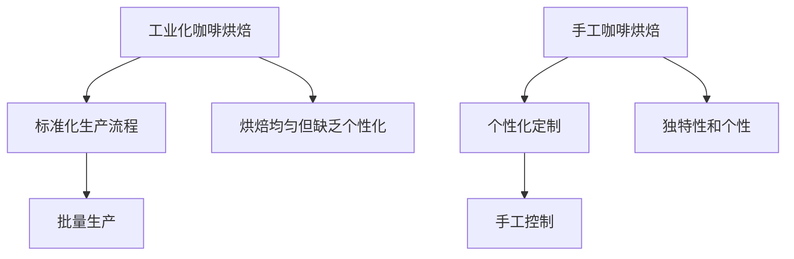
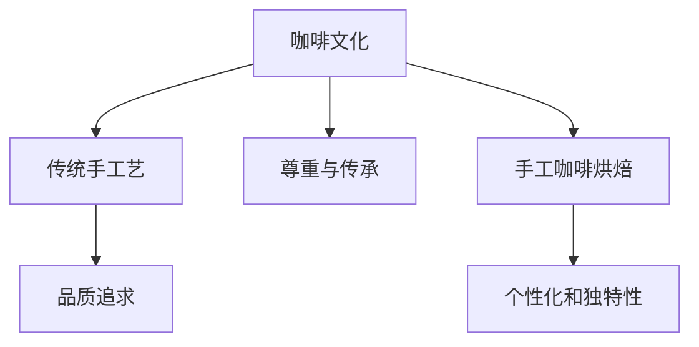
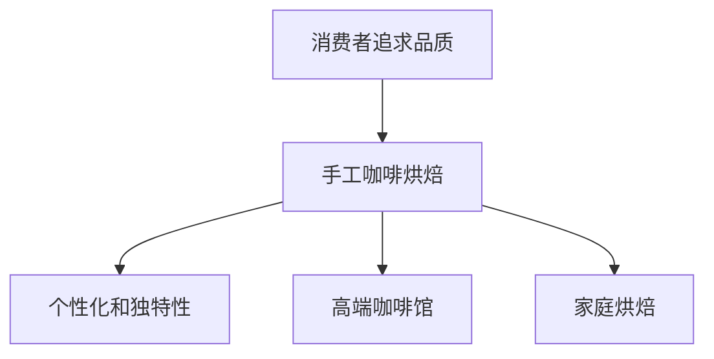
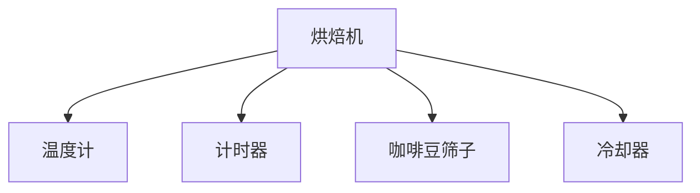

                 

### 现代手工咖啡烘焙：从生豆到杯子的匠人之路

---

**关键词**：手工咖啡烘焙、咖啡豆、咖啡文化、烘焙技术、烘焙工艺

**摘要**：
本文章深入探讨现代手工咖啡烘焙的艺术与实践，从生豆的选择、烘焙工艺到最终成品的制作，全面剖析手工咖啡烘焙的各个环节。通过逻辑清晰、结构紧凑的分析，我们旨在为读者展现一条从生豆到杯子的匠人之路，带领读者领略咖啡烘焙的复杂性和艺术性。

### 第一部分：引论

#### 1.1 手工咖啡烘焙的背景

咖啡烘焙是一门独特的技艺，从工业化的批量生产到现代的手工艺术，其发展历程见证了咖啡文化的演变。手工咖啡烘焙强调个性化和高品质，不同于工业化生产的标准化流程，它更注重烘焙师对咖啡豆的独特理解和对烘焙过程的细致控制。

**核心概念与联系**：

- **工业化咖啡烘焙**：注重效率和规模，生产流程标准化，豆子烘焙均匀，但缺乏个性化。
- **手工咖啡烘焙**：以手工艺人的直觉和经验为主导，每个烘焙批次都有其独特性，能够体现烘焙师的个性和对咖啡豆的理解。

**图1：工业化和手工咖啡烘焙对比**

#### 1.2 手工咖啡烘焙的重要性

手工咖啡烘焙不仅在口感和品质上有着显著优势，它也是咖啡文化的重要组成部分。它代表了一种对传统手工艺的尊重和对品质的追求，吸引了越来越多的咖啡爱好者和专业人士。

**图2：手工咖啡烘焙与咖啡文化的关系**

#### 1.3 手工咖啡烘焙的新趋势

随着消费者对品质和体验的追求不断提升，手工咖啡烘焙正逐渐成为一种新的消费趋势。它不仅体现在高端咖啡馆，也渗透到了家庭烘焙和咖啡爱好者的日常生活中。

**图3：手工咖啡烘焙的新趋势**

### 第二部分：核心概念与关系

#### 2.1 手工咖啡烘焙的核心概念

手工咖啡烘焙涉及到多个核心概念，包括咖啡豆的选择、烘焙温度、时间控制、冷却处理等。每个环节都对最终的咖啡品质有着重要影响。

**表1：手工咖啡烘焙的核心概念**

| 概念        | 说明                                                         |
| ----------- | ------------------------------------------------------------ |
| 咖啡豆选择   | 选择优质的咖啡豆是成功烘焙的前提，包括品种、产地、新鲜度等因素。 |
| 烘焙温度     | 烘焙温度直接影响咖啡豆的烘焙程度和风味。                     |
| 时间控制     | 烘焙时间与温度相互作用，决定了咖啡豆的烘焙曲线和风味。       |
| 冷却处理     | 烘焙后的咖啡豆需要迅速冷却，否则会影响到风味和口感。         |

#### 2.2 手工咖啡烘焙与商业咖啡烘焙的差异

商业咖啡烘焙通常注重效率和产量，而手工咖啡烘焙则更注重品质和个性。以下是比较表格：

**表2：手工咖啡烘焙与商业咖啡烘焙的差异**

| 差异点       | 手工咖啡烘焙                       | 商业咖啡烘焙                       |
| ------------ | ---------------------------------- | ---------------------------------- |
| 生产方式      | 手工操作，个性化定制               | 自动化生产，规模化批量生产         |
| 烘焙控制      | 烘焙师根据经验实时调整             | 设定程序，固定流程                 |
| 成本          | 较高，但品质和风味更好             | 较低，但品质和风味相对较差         |
| 目标市场      | 精致咖啡爱好者和高档咖啡馆        | 大众消费市场和普通咖啡馆          |

### 第三部分：主要设备与工具

#### 3.1 手工咖啡烘焙的主要设备与工具

手工咖啡烘焙需要一些专业的设备与工具，以下是一些常见的主要设备：

- **烘焙机**：用于烘焙咖啡豆的设备，可以选择家用小型烘焙机或专业商用烘焙机。
- **温度计**：用于实时监测烘焙过程中的温度变化。
- **计时器**：用于精确控制烘焙时间。
- **咖啡豆筛子**：用于筛选烘焙好的咖啡豆。
- **冷却器**：用于迅速冷却烘焙后的咖啡豆。

**图4：手工咖啡烘焙的主要设备**

### 第四部分：绿色咖啡豆的选择

#### 4.1 绿色咖啡豆的基本知识

绿色咖啡豆是未烘焙的咖啡豆，其质量对最终咖啡的品质有着决定性的影响。选择优质绿色咖啡豆需要考虑以下几个因素：

- **品种**：不同的咖啡豆品种有着不同的风味和特性。
- **产地**：咖啡豆的产地直接影响其风味和品质。
- **新鲜度**：新鲜烘焙的咖啡豆风味更佳。

#### 4.2 绿色咖啡豆的选择标准

选择绿色咖啡豆时，应考虑以下标准：

- **外观**：咖啡豆的颜色、光泽和形状。
- **重量**：新鲜的咖啡豆通常较重。
- **水分含量**：适宜的水分含量有助于保持咖啡豆的新鲜度。
- **杂质**：优质咖啡豆应无杂质。

### 第五部分：手工咖啡烘焙的工艺

#### 5.1 烘焙过程与技巧

手工咖啡烘焙的过程包括多个阶段，每个阶段都需要精细的操作和调整。以下是一个简化的烘焙过程：

1. **预热**：将烘焙机预热到设定温度。
2. **投入咖啡豆**：将绿色咖啡豆均匀地放入烘焙机中。
3. **烘焙**：根据咖啡豆的品种和烘焙目标，调整烘焙温度和时间。
4. **观察与调整**：在烘焙过程中，不断观察咖啡豆的颜色和气味，适时调整温度和时间。
5. **冷却**：烘焙结束后，迅速将咖啡豆冷却以保持最佳风味。

#### 5.2 烘焙技巧详解

- **预热**：预热烘焙机可以提高烘焙效率，减少烘焙时间。
- **投入咖啡豆**：适量投入咖啡豆，避免过度堆积，以保证烘焙均匀。
- **烘焙曲线**：了解和掌握不同的烘焙曲线，根据咖啡豆的品种和烘焙目标进行调整。
- **观察与调整**：烘焙过程中的观察和调整是保证咖啡豆烘焙质量的关键。

### 第六部分：烘焙质量评估

#### 6.1 感官评估

感官评估是评估烘焙咖啡质量的重要方法。以下是一些常用的感官评估指标：

- **外观**：咖啡豆的颜色、光泽和形状。
- **香气**：咖啡豆和烘焙过程中散发的香气。
- **味道**：咖啡豆和研磨后的咖啡粉的味道。
- **口感**：咖啡在口中留下的感觉，包括苦味、酸味和甜味。

#### 6.2 专业评估方法

除了感官评估，还可以使用一些专业的方法来评估烘焙质量，如：

- **烘焙度测量**：使用烘焙度测量仪器来精确测量咖啡豆的烘焙程度。
- **化学分析**：通过化学分析来评估咖啡豆的风味成分和化学特性。

### 第七部分：手工咖啡烘焙对咖啡文化的影响

#### 7.1 手工咖啡烘焙的兴起

随着消费者对咖啡品质和体验的要求不断提高，手工咖啡烘焙逐渐成为一种新的消费趋势。它不仅体现在高端咖啡馆，也渗透到了家庭烘焙和咖啡爱好者的日常生活中。

#### 7.2 手工咖啡烘焙社区

手工咖啡烘焙社区在全球范围内迅速兴起，这些社区通过分享烘焙经验和技巧，促进了咖啡文化的传承和发展。

#### 7.3 手工咖啡烘焙的未来

随着技术的进步和消费者对个性化体验的追求，手工咖啡烘焙在未来将继续发挥重要作用，为咖啡文化注入新的活力。

### 第八部分：手工咖啡烘焙的实用技巧与建议

#### 8.1 实用技巧

- **保持烘焙机的清洁**：定期清洁烘焙机，确保烘焙效果。
- **控制烘焙温度和时间**：掌握合适的烘焙温度和时间，避免过度烘焙或烘焙不足。
- **尝试不同烘焙曲线**：通过调整烘焙曲线，探索不同风味的可能性。

#### 8.2 小结

手工咖啡烘焙是一门复杂的艺术，需要耐心和技巧。通过不断实践和学习，烘焙师可以不断提升自己的技术水平，制作出更美味的咖啡。

#### 8.3 注意事项

- **安全第一**：使用烘焙机时要注意安全，避免发生意外。
- **新鲜度**：确保使用的咖啡豆新鲜，以保持最佳风味。

#### 8.4 拓展阅读

- **《咖啡烘焙技术》**：深入了解咖啡烘焙的理论和实践。
- **《手工咖啡烘焙指南》**：针对新手的手工咖啡烘焙指南。
- **《咖啡文化》**：探讨咖啡文化的历史和现状。

---

**作者**：AI天才研究院/AI Genius Institute & 禅与计算机程序设计艺术 /Zen And The Art of Computer Programming

---

**注释**：本篇文章以技术博客的形式呈现，旨在为读者提供关于手工咖啡烘焙的深入理解。文章中包含了一些图表和表格，以帮助读者更好地理解相关概念。实际操作时，读者可以根据自身经验和条件进行调整和优化。文章中提到的技术和方法仅供参考，具体操作需根据实际情况进行。**免责声明**：本文内容仅供参考，不构成投资或操作建议。读者在实践时需谨慎判断，自行承担风险。**版权声明**：本文版权归作者所有，未经授权不得转载或用于商业用途。**联系方式**：如需联系作者，请通过以下邮箱地址：[ai_genius_institute@example.com](mailto:ai_genius_institute@example.com)。**修订日期**：2023年11月

