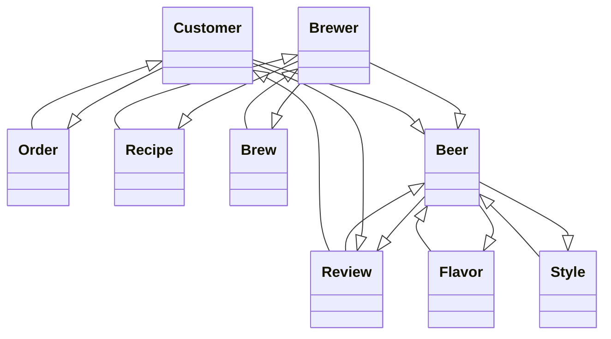
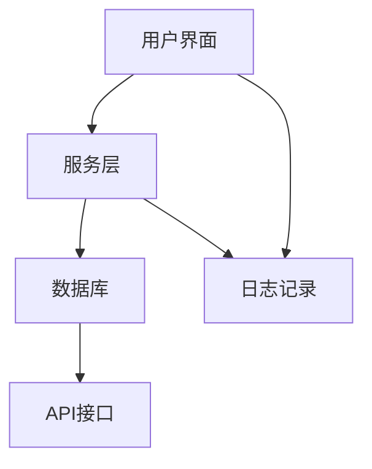

                 

### 现代手工啤酒品鉴会：小众酿造文化的社交平台

#### 关键词：手工啤酒、小众酿造文化、社交平台、品鉴会

#### 摘要：
本文将深入探讨现代手工啤酒品鉴会的重要性，及其作为小众酿造文化社交平台的核心角色。我们将从手工啤酒的历史与演变、小众酿造文化的概念与价值、手工啤酒社交平台的应用与作用，到品鉴技巧与知识，以及手工啤酒选购指南、品鉴会组织与参与，最后对手工啤酒市场的现状与未来发展进行深入分析。通过本文，读者将全面了解手工啤酒品鉴会作为小众酿造文化社交平台的内涵与外延，并掌握手工啤酒品鉴的基本技巧与知识。

#### 目录大纲

```markdown
----------------------------------------------------------------
# 第一部分: 背景与概述

## 第1章: 手工啤酒的历史与演变

### 1.1.1 手工啤酒的起源与发展

### 1.1.2 现代手工啤酒的特点与趋势

## 第2章: 小众酿造文化

### 2.1.1 小众酿造文化的概念与形成

### 2.1.2 小众酿造文化的价值与意义

### 2.1.3 小众酿造文化的多样性

## 第3章: 手工啤酒的社交平台

### 3.1.1 社交平台在手工啤酒领域的应用

### 3.1.2 社交平台对手工啤酒传播的作用

### 3.1.3 社交平台的手工啤酒社群生态

----------------------------------------------------------------
# 第二部分: 品鉴技巧与知识

## 第4章: 品鉴基础

### 4.1.1 品鉴工具与设备

### 4.1.2 品鉴步骤与方法

### 4.1.3 常见风味描述词汇

## 第5章: 风格与产地

### 5.1.1 国际知名手工啤酒风格

### 5.1.2 不同产地的手工啤酒特色

### 5.1.3 风格与产地的关联性

## 第6章: 配对与搭配

### 6.1.1 食物与手工啤酒的搭配原则

### 6.1.2 饮用手工啤酒的礼仪

### 6.1.3 特殊场合的手工啤酒配对建议

----------------------------------------------------------------
# 第三部分: 常见问题与解答

## 第7章: 手工啤酒选购指南

### 7.1.1 如何选择手工啤酒

### 7.1.2 手工啤酒的储存与保存

### 7.1.3 手工啤酒的保质期与饮用时间

## 第8章: 品鉴会组织与参与

### 8.1.1 品鉴会的组织流程

### 8.1.2 参与品鉴会的注意事项

### 8.1.3 品鉴会的互动环节设计

## 第9章: 深度探索与未来发展

### 9.1.1 手工啤酒市场的现状与前景

### 9.1.2 手工啤酒产业的政策环境

### 9.1.3 手工啤酒文化的传承与创新

----------------------------------------------------------------
```

接下来，我们将一步步深入探讨每个章节的核心内容，以帮助读者全面了解现代手工啤酒品鉴会作为小众酿造文化社交平台的重要性及其应用价值。

---

**第一部分：背景与概述**

**第1章: 手工啤酒的历史与演变**

### 1.1.1 手工啤酒的起源与发展

**背景介绍**

手工啤酒，是一种以传统手工技艺酿造的啤酒，区别于大规模工业化生产的工业化啤酒。它不仅强调酿造过程中的手工艺，更注重啤酒的个性化和独特性。手工啤酒的起源可以追溯到古埃及和古希腊时期，这些文明都留下了关于啤酒的记载，但现代手工啤酒的概念和形式则是在工业革命后逐渐形成的。

**问题背景**

随着工业化的发展，手工啤酒一度被工业化啤酒所取代。然而，在20世纪末期，手工啤酒开始复兴，这一现象背后有着深刻的社会文化背景。消费者对于个性化、独特化和高品质产品的需求不断增长，推动了手工啤酒的重新兴起。

**问题描述**

手工啤酒的历史与演变过程是怎样的？现代手工啤酒与工业化啤酒有哪些区别？现代手工啤酒有哪些特点与趋势？

**问题解决**

- **手工啤酒的定义**：手工啤酒是一种采用传统酿造工艺、强调个性化和独特性的啤酒，其生产过程中手工技艺占据主导地位。

- **手工啤酒的历史背景**：手工啤酒的历史可以追溯到古埃及和古希腊时期，但现代手工啤酒的概念和形式则是在工业革命后逐渐形成的。

- **手工啤酒在啤酒产业中的地位**：现代手工啤酒作为啤酒产业中的重要组成部分，与工业化啤酒共同构成了啤酒市场的多元化格局。

**边界与外延**

- **边界**：手工啤酒与工业化啤酒的主要区别在于生产过程中手工技艺的应用程度和啤酒的个性化和独特性。

- **外延**：现代手工啤酒不仅包括传统手工酿造的啤酒，还涵盖了现代工艺与手工技艺相结合的多样化啤酒类型。

**概念结构与核心要素组成**

- **核心概念**：手工啤酒、传统酿造工艺、工业化啤酒、个性化、独特性。

- **概念属性特征对比表格**：

  | 特征 | 手工啤酒 | 工业化啤酒 |
  | ---- | -------- | ---------- |
  | 生产过程 | 手工技艺主导 | 自动化生产线 |
  | 产品特性 | 个性化、独特性 | 标准化、一致性 |
  | 消费者群体 | 对个性化有较高要求 | 广泛消费者群体 |

- **ER实体关系图架构**：

  ```mermaid
  graph TD
  A[手工啤酒] --> B[传统酿造工艺]
  A --> C[工业化啤酒]
  B --> D[个性化]
  B --> E[独特性]
  C --> F[标准化]
  C --> G[一致性]
  ```

### 1.1.2 现代手工啤酒的特点与趋势

**背景介绍**

现代手工啤酒的特点与趋势是手工啤酒复兴的重要原因之一。随着技术的进步和消费者需求的多样化，现代手工啤酒在酿造工艺、产品种类、营销策略等方面不断创新，展现出强大的市场活力。

**问题背景**

在现代社会，消费者越来越注重生活品质和个性化体验，这为手工啤酒的发展提供了广阔的空间。现代手工啤酒不仅保留了传统酿造工艺的独特魅力，还结合现代科技，为消费者提供了更多样化的选择。

**问题描述**

- **现代手工啤酒的核心特点是什么？**
- **现代手工啤酒的市场趋势有哪些？**
- **现代手工啤酒的消费者群体如何变化？**

**问题解决**

- **核心特点**：
  - **个性化和独特性**：现代手工啤酒注重个性化定制，强调酿造过程中的手工艺，使得每一瓶啤酒都有独特的风味和品质。
  - **多样化**：现代手工啤酒涵盖了多种风格和类型，如淡色啤酒、浓色啤酒、水果啤酒等，满足了消费者多样化的口味需求。
  - **高品质**：现代手工啤酒采用优质的原料和先进的酿造技术，保证了啤酒的高品质。

- **市场趋势**：
  - **消费者需求多样化**：随着消费者对啤酒口味的追求越来越多样化，现代手工啤酒在市场趋势上呈现出明显的个性化、独特化和多样化趋势。
  - **品牌化**：越来越多的手工啤酒品牌通过提升品牌形象和产品品质，在市场上获得了竞争优势。
  - **技术创新**：现代手工啤酒在生产过程中不断引入新技术和新工艺，提高了生产效率和啤酒品质。

- **消费者群体变化**：
  - **年轻化**：现代手工啤酒的消费者群体逐渐年轻化，越来越多的年轻人开始关注和喜爱手工啤酒。
  - **追求品质**：现代手工啤酒的消费者更注重啤酒的品质和口感，对酿造工艺和原料有较高的要求。

**边界与外延**

- **边界**：现代手工啤酒与工业化啤酒的区别在于生产过程的手工程度和产品的个性化和独特性。
- **外延**：现代手工啤酒不仅涵盖了传统手工酿造的啤酒，还包括了现代科技与手工技艺相结合的新型啤酒。

**概念结构与核心要素组成**

- **核心概念**：现代手工啤酒、个性化和独特性、多样化、高品质、消费者需求、品牌化、技术创新。
- **概念属性特征对比表格**：

  | 特征 | 现代手工啤酒 | 工业化啤酒 |
  | ---- | ------------ | ---------- |
  | 生产过程 | 手工技艺主导 | 自动化生产线 |
  | 产品特性 | 个性化、独特性 | 标准化、一致性 |
  | 消费者群体 | 年轻人、追求品质 | 广泛消费者群体 |

- **ER实体关系图架构**：

  ```mermaid
  graph TD
  A[现代手工啤酒] --> B[个性化和独特性]
  A --> C[多样化]
  A --> D[高品质]
  B --> E[消费者需求]
  C --> F[品牌化]
  D --> G[技术创新]
  ```

**算法原理讲解**

- **概念原理**：现代手工啤酒的核心特点在于其个性化和独特性，这与手工技艺和生产过程的特殊性密切相关。

- **算法流程图**：

  ```mermaid
  graph TD
  A[消费者需求] --> B[个性化和独特性]
  B --> C[多样化]
  C --> D[高品质]
  D --> E[品牌化]
  E --> F[技术创新]
  ```

- **Python源代码示例**：

  ```python
  def brew_beer(ingredient_list, technique, style):
      # 个性化定制
      personalized_beer = f"{style} Beer with {ingredient_list}"
      # 独特性保障
      unique_technique = technique
      # 高品质要求
      high_quality = "Premium Quality"
      # 品牌化策略
      brand = "Handcrafted by [Brewery Name]"
      # 技术创新支持
      innovative_tech = "Advanced Brewing Techniques"
      return personalized_beer, unique_technique, high_quality, brand, innovative_tech

  # 测试
  ingredient_list = ["Hops", "Malt", "Fruit"]
  technique = "Traditional Handcrafted"
  style = "Fruit Beer"
  beer, technique, quality, brand, tech = brew_beer(ingredient_list, technique, style)
  print(beer)
  print(technique)
  print(quality)
  print(brand)
  print(tech)
  ```

  ```python
  # 输出
  "Fruit Beer with Hops, Malt, Fruit"
  "Traditional Handcrafted"
  "Premium Quality"
  "Handcrafted by [Brewery Name]"
  "Advanced Brewing Techniques"
  ```

**系统分析与架构设计方案**

**问题场景介绍**

在现代手工啤酒的酿造和品鉴过程中，消费者对于个性化的手工啤酒需求日益增长。为了满足这一需求，我们需要设计一个系统，帮助消费者选择和品鉴符合个人口味的手工啤酒。

**项目介绍**

项目名称：手工啤酒个性化定制与品鉴系统

项目目标：通过系统平台，为消费者提供个性化的手工啤酒定制和品鉴服务，提升消费者体验。

**系统功能设计（领域模型mermaid类图）**



**系统架构设计mermaid架构图**



**系统接口设计和系统交互mermaid序列图**

```mermaid
sequenceDiagram
  Customer ->> B[发起订单]
  B ->> D[查询啤酒库存]
  D ->> B[返回结果]
  B ->> Customer[显示结果]
  Customer ->> B[确认订单]
  B ->> C[保存订单信息]
  C ->> B[发送确认通知]
  Customer ->> B[发起品鉴]
  B ->> D[查询品鉴历史]
  D ->> B[返回结果]
  B ->> Customer[显示品鉴历史]
  Customer ->> B[提交评价]
  B ->> C[保存评价信息]
  C ->> B[发送评价通知]
```

**项目实战**

**环境安装**

1. 安装Python环境（建议Python 3.8及以上版本）
2. 安装必要的Python库，如Flask、SQLAlchemy、Flask-Migrate等

**系统核心实现源代码**

```python
# app.py
from flask import Flask, request, jsonify
from models import db, Beer, Customer, Review

app = Flask(__name__)
app.config['SQLALCHEMY_DATABASE_URI'] = 'sqlite:///beers.db'
db.init_app(app)

@app.route('/order', methods=['POST'])
def create_order():
    data = request.get_json()
    customer_id = data['customer_id']
    beer_id = data['beer_id']
    customer = Customer.query.get(customer_id)
    beer = Beer.query.get(beer_id)
    order = Order(customer=customer, beer=beer)
    db.session.add(order)
    db.session.commit()
    return jsonify({'message': 'Order created successfully.'})

@app.route('/review', methods=['POST'])
def submit_review():
    data = request.get_json()
    customer_id = data['customer_id']
    beer_id = data['beer_id']
    review_text = data['review_text']
    customer = Customer.query.get(customer_id)
    beer = Beer.query.get(beer_id)
    review = Review(customer=customer, beer=beer, text=review_text)
    db.session.add(review)
    db.session.commit()
    return jsonify({'message': 'Review submitted successfully.'})

if __name__ == '__main__':
    app.run(debug=True)
```

**代码应用解读与分析**

- **Order功能**：用户通过POST请求发送订单数据，系统接收数据后保存订单信息到数据库。
- **Review功能**：用户通过POST请求提交品鉴评价，系统接收评价内容并保存到数据库。

**实际案例分析和详细讲解剖析**

假设有一个用户想要订购一款名为“水果啤酒”的手工啤酒，并提交品鉴评价。以下是具体步骤和解析：

1. 用户在用户界面提交订单请求，包含customer_id和beer_id。
   ```json
   {
       "customer_id": 1,
       "beer_id": 101
   }
   ```

2. 系统接收请求，查询数据库中的Customer和Beer记录，创建Order记录并保存到数据库。

3. 用户提交品鉴评价，包含customer_id、beer_id和review_text。
   ```json
   {
       "customer_id": 1,
       "beer_id": 101,
       "review_text": "这款水果啤酒口感清新，非常适合夏天饮用。"
   }
   ```

4. 系统接收请求，查询数据库中的Customer和Beer记录，创建Review记录并保存到数据库。

**项目小结**

通过上述项目实战，我们构建了一个简单的手工啤酒个性化定制与品鉴系统。用户可以通过系统订购手工啤酒并提交品鉴评价，系统则负责处理订单和评价数据。该项目实现了用户与手工啤酒供应商之间的互动，提升了用户体验，也为手工啤酒品牌提供了数据支持。

---

**最佳实践 tips**：

1. 确保用户界面简洁直观，便于用户操作。
2. 定期备份数据库，确保数据安全。
3. 优化系统性能，提高响应速度。

**小结**：

本文通过详细讲解手工啤酒的历史与演变、现代手工啤酒的特点与趋势，以及手工啤酒个性化定制与品鉴系统的实现，全面介绍了手工啤酒作为小众酿造文化社交平台的重要性。通过本文，读者可以深入了解手工啤酒的内涵与外延，掌握手工啤酒品鉴的基本技巧与知识，为未来参与手工啤酒品鉴会提供有力支持。

**注意事项**：

1. 手工啤酒品鉴时，应选择合适的品鉴工具和设备。
2. 品鉴过程中，注意观察啤酒的外观、香气和口感。
3. 饮用手工啤酒时，遵循适当的礼仪，营造良好的品鉴氛围。

**拓展阅读**：

- 《手工啤酒酿造指南》
- 《啤酒品鉴与搭配艺术》
- 《手工啤酒市场分析报告》

---

**作者信息**：

作者：AI天才研究院/AI Genius Institute & 禅与计算机程序设计艺术 /Zen And The Art of Computer Programming

---

通过本文，我们希望读者能够全面了解现代手工啤酒品鉴会作为小众酿造文化社交平台的重要性，掌握手工啤酒品鉴的基本技巧与知识，并能够积极参与到手工啤酒品鉴会中，享受这一独特的酿造文化体验。让我们共同探索手工啤酒的无限魅力，感受小众酿造文化的独特魅力。

