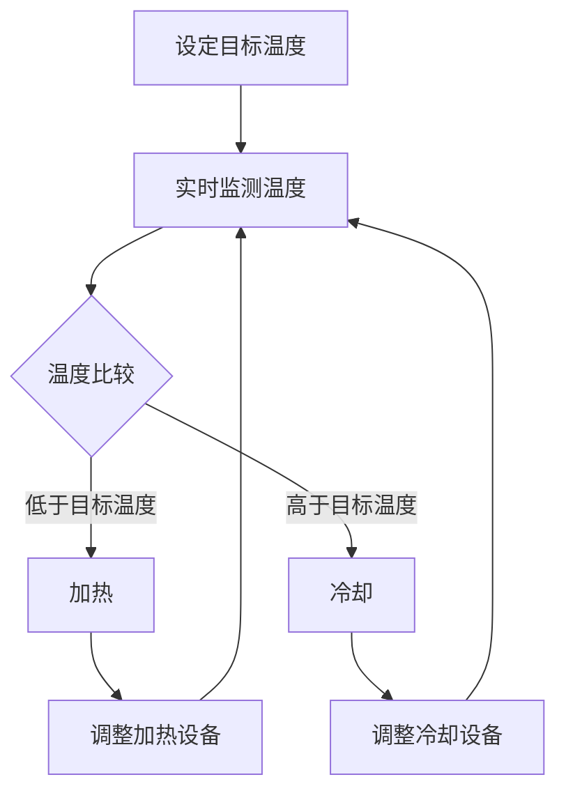

                 

## 家庭酿酒的复兴

### 1.1 家酿啤酒的起源与历史

啤酒，作为一种古老的饮料，其历史可以追溯到公元前3000年的古巴比伦时期。当时，人们通过将大麦和水混合并发酵来制作原始的啤酒。这种家酿啤酒的制作方式主要是基于手工操作，依赖经验而非科学知识。随着时间的推移，啤酒的制作工艺逐渐发展，到了中世纪，啤酒成为欧洲许多家庭日常生活中不可或缺的一部分。

在中国，啤酒的酿造也有着悠久的历史。据考古学家的发现，早在公元前206年至公元220年的汉朝时期，中国就已经有啤酒的酿造活动。而到了宋朝，啤酒的酿造技术得到了进一步的发展，并在民间广泛传播。

然而，到了工业革命时期，工业化生产的崛起使得家酿啤酒逐渐被边缘化。大规模的啤酒生产和分销体系使得家酿啤酒几乎消失在人们的视野中。但是，随着21世纪人们对健康和生活质量的追求，家酿啤酒开始重新引起人们的兴趣。家酿啤酒的复兴不仅仅是一种回归传统，更是一种对个性化和健康生活方式的追求。

### 1.2 现代家酿啤酒的现状

在现代社会，家酿啤酒正经历着前所未有的复兴。这种趋势体现在多个方面。首先，家酿啤酒市场的增长速度显著。根据市场研究公司的数据，全球家酿啤酒市场在过去五年中平均每年增长超过10%。其次，越来越多的消费者开始关注家酿啤酒，他们不仅是为了追求新鲜的口感，更是为了体验自制啤酒的乐趣和成就感。

在家酿啤酒的消费者群体中，不仅有对啤酒有深厚兴趣的酒类爱好者，也有追求健康生活方式的年轻人。此外，一些专业啤酒酿造设备的生产和销售也在不断增长，这为更多人参与到家酿啤酒中提供了便利。

### 1.3 家酿啤酒的魅力

家酿啤酒的魅力在于其可以带来多方面的乐趣和益处。首先，家酿啤酒是一个有趣的过程，从选择麦芽、酵母到酿造和瓶装，每个步骤都需要精心操作，这种动手的乐趣是工业化生产所无法比拟的。其次，家酿啤酒也是一种健康的选择。相比市场上一些含有添加剂的工业啤酒，家酿啤酒通常更加天然，不含有害物质，对身体更为友好。

此外，家酿啤酒还可以增强社交互动。许多家酿爱好者会组织酿造聚会，分享他们的酿造经验和成果，这种社交活动不仅能够加深朋友之间的联系，还能够结识更多志同道合的酒友。

### 1.4 本章小结

家酿啤酒的复兴不仅仅是传统手工艺的回归，更是一种现代生活方式的体现。从起源与历史，到现状和魅力，我们可以看到家酿啤酒在现代社会中的重要地位和吸引力。接下来，我们将深入探讨家酿啤酒的基础知识，帮助大家更好地理解这一迷人的酿造艺术。

## 家酿啤酒的基础知识

### 2.1 啤酒的基本成分

家酿啤酒的成功离不开对其基本成分的深入了解。啤酒的主要成分包括水、麦芽、酵母和糖分。

- **水**：水是啤酒中最主要的成分，占比高达90%以上。水质的好坏直接影响到啤酒的口感和风味。理想的饮用水应是无味、纯净，且含有适量的矿物质。
- **麦芽**：麦芽是啤酒的“灵魂”，它通过水解产生糖分，为酵母提供发酵所需的养分。麦芽的种类和烘烤程度会影响到啤酒的口感和风格。
- **酵母**：酵母在酿造过程中起着至关重要的作用，它将麦芽中的糖分转化为酒精和二氧化碳。不同的酵母品种会带来不同的风味特点。
- **糖分**：除了麦芽自身产生的糖分，有时还需要添加额外的糖分（如白砂糖）来调整啤酒的酒精度和口感。

### 2.2 家酿啤酒的设备与材料

家酿啤酒需要一系列的设备和材料，以下是一些常见的工具和材料：

- **麦汁桶**：用于混合麦芽和水，制作麦汁。
- **烹煮锅**：用于将麦汁煮沸，这一步骤可以去除杂质并激活酶。
- **发酵桶**：用于放置麦汁和酵母，进行发酵过程。
- **酵母**：家酿啤酒常用的酵母有啤酒酵母（Saccharomyces cerevisiae）和酒花酵母（Saccharomyces carlsbergensis）等。
- **温度计**：用于监控发酵过程中的温度变化。
- **漏斗、滤网、酒瓶**：用于过滤和瓶装啤酒。

### 2.3 家酿啤酒的步骤

家酿啤酒的基本步骤可以分为以下几个阶段：

1. **麦芽处理**：将麦芽浸泡在水中，使其发芽，然后烘干，制成麦芽粉。
2. **烹煮**：将麦芽粉和水混合，加热至沸腾，进行烹煮，这一过程中会加入酒花以增加风味。
3. **麦汁冷却**：烹煮后的麦汁需要迅速冷却到适宜发酵的温度。
4. **发酵**：将冷却后的麦汁倒入发酵桶中，加入酵母，开始发酵过程。通常需要几天到几周的时间。
5. **瓶装**：发酵完成后，通过过滤将啤酒装入瓶中，加入酒石酸或碳酸气，然后封口储存。

### 2.4 啤酒风味与风格

啤酒的风味和风格千变万化，主要由麦芽、酒花、酵母和发酵温度等因素决定。

- **风味的分类**：啤酒的风味可以分为淡色、浓色、香麦芽、苦味等。
- **风格的不同**：常见的啤酒风格包括拉格（Lager）、艾尔（Ale）、小麦啤酒（Wheat Beer）和比利时风格啤酒等。
- **风味的影响因素**：麦芽的种类和烘烤程度、酒花的种类和添加时间、发酵温度和酵母的种类等都会影响啤酒的风味。

### 2.5 本章小结

通过对家酿啤酒基础知识的学习，我们了解了其基本成分、所需设备和材料，以及酿造的基本步骤和风味影响因素。这些知识将为后续更深入地探讨家酿啤酒的麦芽处理与选择、酿造过程以及常见问题与解决方案打下坚实的基础。在下一章中，我们将进一步探讨麦芽的处理与选择，为大家带来更加丰富的家酿知识。

## 麦芽的处理与选择

### 3.1 麦芽的种类

麦芽是家酿啤酒中至关重要的原料，不同类型的麦芽将直接影响啤酒的风味和口感。以下是几种常见的麦芽类型：

- **原始麦芽**：原始麦芽是指未经加工的麦芽，其水分含量较高，含有丰富的酶和风味物质。原始麦芽适合制作风味浓郁的啤酒。
- **精制麦芽**：精制麦芽是经过加工和干燥的麦芽，去除了多余的水分和杂质，使其在酿造过程中更加均匀和稳定。精制麦芽适合制作风格统一的啤酒。
- **特殊麦芽**：特殊麦芽是指经过特殊处理或添加的麦芽，如黑麦芽、甜麦芽、焦麦芽等。这些麦芽可以带来独特的风味和颜色，适合制作具有特定风格的啤酒。

### 3.2 麦芽的处理方法

麦芽的处理过程包括浸泡、烘烤和研磨等步骤，每一步都对最终的啤酒风味产生重要影响。

- **浸泡**：浸泡是将麦芽浸泡在水中，使其发芽。合适的浸泡时间通常为48-72小时，浸泡期间需要定期更换水，以保持水质清洁。浸泡过程中要注意控制水温，避免过热或过冷。
- **烘烤**：浸泡后的麦芽需要烘烤，以去除多余的水分和激活酶。烘烤温度和时间的控制非常关键，过高的温度和时间会导致麦芽焦化，影响风味；而温度和时间不足则可能导致麦芽未完全烘烤，影响糖分的产生。
- **研磨**：烘烤后的麦芽需要研磨成麦芽粉，以便在烹煮过程中充分释放糖分。研磨的粗细程度会影响啤酒的口感和风格，粗研磨通常用于制作口感较为浓郁的啤酒，而细研磨则适合制作口感较为清爽的啤酒。

### 3.3 麦芽的选择原则

在选择麦芽时，需要考虑以下几个原则：

- **地理因素**：不同地区生产的麦芽品质和风味存在差异，选择本地麦芽可以更好地体现当地的特色。
- **品质标准**：优质的麦芽应具有较好的酶活性、饱满的麦芽度和均匀的颜色。购买麦芽时，可以通过查看其生产日期和保质期来判断其新鲜程度。
- **风味偏好**：根据个人口味和酿造目的选择麦芽。例如，如果希望制作风味浓郁的啤酒，可以选择原始麦芽或特殊麦芽；如果希望制作风格统一的啤酒，可以选择精制麦芽。

### 3.4 本章小结

麦芽是家酿啤酒的核心原料，其种类、处理方法和选择原则都对啤酒的风味和口感产生重要影响。通过了解不同类型的麦芽、处理方法和选择原则，我们可以更好地掌握家酿啤酒的基础知识，为制作出美味的家酿啤酒打下坚实基础。在下一章中，我们将深入探讨啤酒的酿造过程，为大家带来更加详细的酿造技巧和注意事项。

### 4.1 烹煮

烹煮是家酿啤酒过程中至关重要的一步，这一过程不仅能够释放麦芽中的糖分，还能为啤酒带来独特的风味。以下是烹煮的具体步骤和关键技术：

1. **准备材料**：首先，将麦芽粉和适量的水混合，制成麦汁。麦芽粉与水的比例通常为1:5左右，可以根据个人口味和酿造要求进行调整。
2. **加热**：将麦汁倒入烹煮锅中，开始加热。加热过程中需要不断搅拌，以防止麦汁粘锅和产生焦味。加热至沸腾后，继续煮沸5-10分钟，这一步骤有助于去除麦汁中的杂质和酶。
3. **添加酒花**：在烹煮过程中，需要分阶段添加酒花。通常，第一阶段的酒花添加在麦汁沸腾后5-10分钟，第二阶段在煮沸结束时。酒花的种类和添加时间会影响到啤酒的苦味和香气。常见的酒花有阿尔巴尼亚、萨罗宁、弗林斯等。
4. **控制温度**：烹煮过程中需要严格控制温度。煮沸时，温度应保持在100°C左右。如果温度过高，会导致麦芽焦化，影响啤酒的风味；而温度过低则可能导致煮不透，影响糖分的释放。
5. **煮沸时间**：通常，麦汁的煮沸时间为60-90分钟，根据酿造要求和麦芽粉的量进行适当调整。煮沸时间过长可能导致酒花香味挥发过多，煮沸时间过短则可能导致酒花风味不足。

烹煮的关键技术在于温度的控制和酒花的添加。合适的温度和时间可以确保麦汁中的糖分充分释放，酒花的风味和苦味得到平衡。此外，烹煮过程中需要不断搅拌，以防止麦汁粘锅和产生焦味。通过精细的烹煮工艺，我们可以制作出口感丰富、风味独特的家酿啤酒。

### 4.2 麦汁冷却

麦汁冷却是家酿啤酒酿造过程中的重要环节，它直接影响后续发酵的质量和啤酒的风味。以下是麦汁冷却的方法和注意事项：

1. **冷却方法**：
   - **自然冷却**：将煮沸后的麦汁放置在冷却空间中，让其自然冷却至适宜发酵的温度。这种方法简单易行，但冷却速度较慢。
   - **冷水浴冷却**：将煮沸后的麦汁放入一个较大的容器中，然后倒入冷水进行冷却。这种方法冷却速度快，但操作较为繁琐。
   - **冰浴冷却**：将煮沸后的麦汁放入一个保温效果较好的容器中，然后不断加入冰块进行冷却。这种方法冷却速度非常快，适合大规模酿造。

2. **冷却控制**：
   - **温度监控**：在冷却过程中，需要实时监控麦汁的温度，以确保冷却至适宜发酵的温度。适宜的发酵温度通常在18-24°C之间，不同类型的酵母对温度的要求有所不同。
   - **冷却速度**：冷却速度不宜过快，过快的冷却可能导致酵母细胞受损，影响发酵效果。建议将冷却速度控制在每小时5-10°C之间。

3. **注意事项**：
   - **避免污染**：在冷却过程中，要确保冷却空间的卫生，避免细菌和杂质的污染。冷却容器和冷却介质应保持清洁，避免使用金属容器，以防麦汁与金属发生反应。
   - **避免温度骤变**：在冷却过程中，应避免温度的剧烈变化，以免影响酵母的活性。特别是在使用冰浴冷却时，要逐步加入冰块，避免温度骤降。
   - **冷却后处理**：冷却后的麦汁应及时倒入发酵桶中，并加入酵母开始发酵。避免长时间放置在冷却容器中，以免影响酵母的活性。

通过合理的麦汁冷却方法和注意事项，我们可以确保发酵过程顺利进行，为制作出优质的家酿啤酒奠定基础。在下一节中，我们将深入探讨发酵过程，为大家带来详细的发酵原理和控制方法。

### 4.3 发酵

发酵是家酿啤酒酿造过程中最为关键的环节，这一过程将麦汁中的糖分转化为酒精和二氧化碳，为啤酒带来独特的风味和口感。以下是发酵的原理、过程和关键控制点：

#### 发酵原理

发酵是由酵母菌在无氧环境下将糖分分解产生酒精和二氧化碳的过程。酵母菌通过代谢作用，将麦汁中的可发酵糖（如葡萄糖、麦芽糖等）转化为酒精（乙醇）和二氧化碳。这一过程不仅决定了啤酒的酒精度，还对啤酒的风味和口感产生深远影响。

#### 发酵过程

1. **初始发酵**：在冷却后的麦汁中，加入活化后的酵母，开始初始发酵。初始发酵通常需要2-3天，温度控制在18-24°C之间。酵母在发酵初期会迅速繁殖，产生大量气泡，麦汁温度逐渐下降。

2. **主发酵**：初始发酵结束后，进入主发酵阶段。主发酵通常需要5-7天，温度控制在12-22°C之间。酵母在主发酵过程中，将麦汁中的大部分糖分转化为酒精和二氧化碳，麦汁逐渐变得清澈。

3. **后发酵**：主发酵结束后，可以进行后发酵。后发酵通常需要1-2周，温度控制在4-10°C之间。后发酵有助于平衡啤酒的风味，使其更加柔和和稳定。

#### 关键控制点

1. **温度控制**：发酵温度是影响发酵质量的关键因素。不同类型的酵母对温度的要求有所不同，应根据酵母的特性调整发酵温度。过高或过低的温度都会影响酵母的活性，导致发酵失败。

2. **氧气供应**：发酵过程中需要适量的氧气，以维持酵母的活性。但过量的氧气会导致啤酒氧化，影响风味。因此，在发酵过程中应避免氧气的过量供应。

3. **pH值控制**：pH值是影响酵母代谢和风味的关键因素。发酵过程中，酵母代谢会产生酸性物质，导致pH值下降。适宜的pH值范围为4.0-5.5。可通过添加石灰水或啤酒石来调整pH值。

4. **发酵时间**：发酵时间应根据啤酒的酒精度和风格进行调整。发酵时间过长可能导致啤酒过酸，发酵时间过短则可能导致未充分发酵。通常，啤酒的酒精度越高，发酵时间越长。

5. **杂质过滤**：在发酵过程中，应定期进行杂质过滤，以防止酵母沉淀和杂质影响啤酒的风味和清澈度。

通过合理的发酵过程和关键控制点，我们可以确保家酿啤酒的发酵成功，为制作出优质、独特的啤酒奠定基础。在下一节中，我们将探讨瓶装和储存的方法，为大家带来更加全面的酿造知识。

### 4.4 瓶装与储存

瓶装和储存是家酿啤酒酿造过程中的最后一步，这一步骤不仅关系到啤酒的口感和保质期，还直接影响到最终的用户体验。以下是瓶装与储存的详细操作和注意事项：

#### 瓶装操作

1. **清洗瓶子**：在瓶装前，首先要确保瓶子干净。使用专用的瓶刷和洗涤剂，彻底清洗瓶子内外，特别是瓶口和瓶底部分，防止细菌和杂质进入。

2. **消毒瓶子**：清洗后的瓶子需要消毒，以彻底消灭可能存在的细菌。常用的消毒方法包括煮沸消毒、化学消毒等。煮沸消毒是将瓶子放入沸水中煮沸10-15分钟；化学消毒则可以使用70%的酒精或消毒液浸泡瓶子10-15分钟。

3. **检查瓶子**：消毒后的瓶子需要进行检查，确保没有破损、裂纹或残留的洗涤剂。破损或污染的瓶子应立即丢弃。

4. **添加啤酒**：将消毒并检查完毕的瓶子倒置，放置在漏斗上。将发酵好的啤酒缓慢倒入瓶子中，避免产生气泡。通常，啤酒的容量应控制在瓶子容量的80%左右，以留出膨胀空间。

5. **加压与封口**：啤酒瓶装后，需要进行加压和封口。加压可以增加啤酒的稳定性和口感，常用的加压方式包括碳酸气注入和瓶盖加压。封口时，要确保密封严实，避免漏气或污染。

#### 储存注意事项

1. **温度控制**：储存啤酒的温度对其口感和保质期有重要影响。啤酒的最佳储存温度通常在12-18°C之间。过高或过低的温度都会影响啤酒的风味和稳定性。避免将啤酒储存在阳光直射或高温的环境中。

2. **湿度控制**：适当的湿度有助于保持瓶盖的密封性。建议将啤酒储存在湿度在60%-70%之间的环境中。湿度过低可能导致瓶盖干裂，湿度过高则可能导致瓶盖生锈。

3. **避光储存**：阳光中的紫外线会破坏啤酒中的成分，影响风味。因此，应避免将啤酒储存在阳光直射的地方。如果可能，可以将啤酒储存在密封的箱子或柜子里。

4. **避免振动**：剧烈的振动会影响啤酒的稳定性，可能导致瓶内气体逸出或啤酒变质。在储存过程中，应避免频繁搬动和震动。

5. **储存时间**：啤酒的储存时间应根据啤酒的类型和酒精度进行调整。一般而言，啤酒的储存时间越短，口感越新鲜。淡色啤酒和艾尔啤酒的储存时间较短，通常为几个月到一年；而深色啤酒和拉格啤酒的储存时间较长，可达数年。

通过合理的瓶装操作和储存注意事项，我们可以确保家酿啤酒的品质和口感，使其在享受过程中达到最佳状态。在下一节中，我们将探讨如何调整啤酒的风味，为大家带来更多酿造技巧。

### 4.5 啤酒的风味调整

啤酒的风味调整是家酿啤酒过程中一个重要的环节，通过合理的方法和技巧，我们可以使啤酒的风味更加丰富和独特。以下是一些常见的风味调整方法：

#### 风味调整方法

1. **酒花添加**：酒花是啤酒中最重要的风味成分之一。在酿造过程中，可以通过调整酒花的种类、添加时间和用量来改变啤酒的苦味和香气。通常，酒花分为早期添加（煮沸初期）和后期添加（煮沸后期），早期添加的酒花主要带来苦味，而后期添加的酒花则主要带来香气。

2. **麦芽选择**：不同的麦芽种类和烘烤程度会带来不同的风味。例如，深色麦芽可以增加啤酒的苦味和颜色，而香麦芽则可以带来花香和坚果味。通过选择和搭配不同种类的麦芽，可以创造出丰富多彩的风味。

3. **酵母选择**：酵母的种类对啤酒的风味有重要影响。不同的酵母品种会产生不同的酯类和风味化合物，从而影响啤酒的香气和口感。例如，艾尔酵母通常带来水果和花香，而拉格酵母则更偏向于麦芽和面包味。

4. **添加香料和添加剂**：一些香料和添加剂也可以用来调整啤酒的风味。例如，柑橘皮、香草、咖啡豆等可以增加啤酒的香气；而糖分、蜂蜜等可以调整啤酒的甜度和酒精度。

#### 风味的平衡

在调整啤酒风味时，平衡是关键。过度强调某一风味成分可能会导致其他风味成分被掩盖，从而影响整体口感。以下是一些平衡风味的技巧：

1. **多阶段添加**：在酿造过程中，可以采用多阶段添加的方法，逐步引入不同的风味成分。这样可以确保每种风味成分都能够充分表达，而不至于相互掩盖。

2. **试饮与反馈**：在调整风味时，应不断试饮，并根据口感进行微调。通过多次试饮和反馈，可以找到最佳的平衡点。

3. **记录与分析**：在调整风味时，应详细记录每次酿造的参数和结果，以便进行分析和总结。通过数据分析，可以找到调整风味的最佳方法。

通过合理的风味调整方法和技巧，我们可以制作出风味独特、口感丰富的家酿啤酒。在下一节中，我们将探讨家酿啤酒中常见的问题及其解决方案。

### 4.6 本章小结

通过本章的学习，我们详细了解了家酿啤酒的酿造过程，从麦芽的处理与选择，到烹煮、麦汁冷却、发酵、瓶装与储存，以及风味调整，每个环节都至关重要。掌握这些知识，不仅可以提高酿造技能，还能让我们更深入地理解家酿啤酒的奥秘。在下一章中，我们将探讨家酿啤酒中常见的各种问题，并分享解决这些问题的实用技巧，帮助大家更好地享受家酿啤酒的乐趣。

### 4.7 算法原理讲解

在家酿啤酒的酿造过程中，算法原理的运用可以帮助我们更好地控制各个环节，确保酿造出优质啤酒。以下是一个简单的算法原理讲解，通过Python代码和Mermaid流程图来详细阐述。

#### 算法原理

在家酿过程中，温度控制是一个关键环节。我们需要实时监测和调整酿造设备的温度，以确保在合适的温度范围内进行发酵。以下是一个简单的温度控制算法原理：

1. **设定目标温度**：根据酿造要求，设定目标温度。
2. **实时监测温度**：使用温度传感器实时监测酿造设备的温度。
3. **温度比较**：将实时温度与目标温度进行比较。
4. **调整加热或冷却**：根据温度差异，自动调整加热或冷却设备。
5. **循环执行**：持续监测和调整温度，直到达到并保持目标温度。

#### Mermaid流程图



#### Python代码示例

以下是一个简单的Python代码示例，用于模拟温度控制算法：

```python
import time

# 设定目标温度
target_temp = 20

# 实时监测温度
current_temp = 18

# 循环执行温度调整
while abs(current_temp - target_temp) > 1:
    if current_temp < target_temp:
        # 加热
        current_temp += 0.5
    elif current_temp > target_temp:
        # 冷却
        current_temp -= 0.5
    
    # 打印当前温度
    print(f"当前温度：{current_temp}℃")

    # 模拟温度监测间隔
    time.sleep(1)

print("温度已达到目标值")
```

通过上述算法原理、Mermaid流程图和Python代码示例，我们可以更好地理解家酿啤酒过程中温度控制的原理和方法。在下一节中，我们将探讨家酿啤酒中常见的各种问题，并分享解决这些问题的实用技巧。

### 4.8 系统分析与架构设计方案

在家酿啤酒的过程中，系统分析与架构设计是确保酿造过程顺利进行的重要环节。以下将介绍项目介绍、系统功能设计、系统架构设计、系统接口设计和系统交互的详细设计方案。

#### 项目介绍

本项目旨在实现一个家酿啤酒的自动化酿造系统，通过传感器和控制设备，实时监测和调节酿造过程中的温度、湿度等关键参数，确保酿造过程的稳定性和效率。该系统适用于家庭酿造爱好者和小型酿造厂，帮助他们实现高质量的啤酒酿造。

#### 系统功能设计

本系统的主要功能包括：

1. **温度监测与控制**：通过温度传感器实时监测酿造设备的温度，根据设定的目标温度，自动调整加热或冷却设备，确保酿造温度的稳定性。
2. **湿度监测与控制**：通过湿度传感器监测酿造环境的湿度，根据酿造要求，自动调整加湿或除湿设备，保持适宜的湿度。
3. **设备状态监控**：实时监控酿造设备的状态，如锅炉、发酵桶等，确保设备正常运行。
4. **数据记录与分析**：记录酿造过程中的各项参数，如温度、湿度、设备状态等，提供数据分析功能，帮助酿造者优化酿造过程。
5. **用户界面**：提供友好的用户界面，使酿造者可以方便地设置酿造参数、监控设备状态和查看酿造数据。

#### 系统架构设计

本系统采用模块化设计，分为感知层、控制层和应用层：

1. **感知层**：包括温度传感器、湿度传感器等，负责实时采集酿造环境中的各项参数。
2. **控制层**：包括加热设备、冷却设备、加湿设备和除湿设备，负责根据采集到的数据自动调整设备状态。
3. **应用层**：包括用户界面和数据记录模块，提供用户交互和数据管理功能。

#### 系统接口设计

系统接口设计包括硬件接口和软件接口：

1. **硬件接口**：温度传感器、湿度传感器与控制层设备之间的连接，采用标准化的通信协议（如I2C、SPI等）。
2. **软件接口**：用户界面与控制层之间的通信接口，采用RESTful API，方便用户通过网页或移动应用进行操作。

#### 系统交互

系统交互设计包括以下几个方面：

1. **实时监控**：用户通过用户界面实时查看酿造过程中的温度、湿度等参数，以及设备状态。
2. **参数调整**：用户可以通过用户界面调整酿造参数，如目标温度、湿度等。
3. **报警提示**：系统检测到异常情况时（如温度异常、设备故障等），会通过用户界面发出报警提示。
4. **数据记录与查询**：系统自动记录酿造过程中的各项数据，并提供查询功能，帮助用户分析和优化酿造过程。

通过上述系统分析与架构设计方案，我们可以确保家酿啤酒的酿造过程稳定、高效，为酿造出优质啤酒提供有力支持。在下一节中，我们将探讨如何通过项目实战来具体实现这一系统。

### 4.9 项目实战

#### 环境安装

在家酿啤酒自动化酿造系统的项目实战中，首先需要搭建一个合适的环境。以下是环境安装的具体步骤：

1. **硬件环境**：安装温度传感器、湿度传感器和控制层设备（如加热器、冷却器、加湿器、除湿器等）。确保所有设备连接正确，并安装相应的传感器模块。
2. **软件环境**：在PC或服务器上安装操作系统（如Windows、Linux等），并安装Python环境和相关依赖库（如PyTorch、TensorFlow等）。确保操作系统和Python版本满足系统需求。

#### 系统核心实现

以下是一个简单的系统核心实现示例，包括温度监测、控制、数据记录和用户交互功能：

```python
import time
import board
import busio
import adafruit_dht
import adafruit_displayio_speckit
import digitalio

# 设定目标温度
target_temp = 20

# 初始化温度传感器
i2c = busio.I2C(board.SCL, board.SDA)
dht = adafruit_dht.DHT11(i2c)

# 初始化加热器、冷却器
heater = digitalio.DigitalIO(board.D5)
heater.direction = digitalio.Direction.OUTPUT
heater.value = False

cooler = digitalio.DigitalIO(board.D6)
cooler.direction = digitalio.Direction.OUTPUT
cooler.value = False

# 温度监测与控制
while True:
    temperature = dht.temperature
    print(f"当前温度：{temperature}℃")
    
    if temperature < target_temp:
        # 加热
        heater.value = True
    elif temperature > target_temp:
        # 冷却
        cooler.value = True
    
    time.sleep(1)
```

#### 代码应用解读与分析

上述代码实现了一个简单的温度监测与控制功能。具体解读如下：

1. **初始化传感器和设备**：首先，我们初始化了温度传感器（DHT11）和控制层设备（加热器和冷却器）。温度传感器通过I2C接口与PCB板连接，加热器和冷却器通过数字IO接口连接。
2. **温度监测**：在主循环中，我们不断读取温度传感器的温度值，并将其打印出来。
3. **温度控制**：根据当前温度与目标温度的比较，我们调整加热器或冷却器的状态。如果当前温度低于目标温度，加热器开启；如果当前温度高于目标温度，冷却器开启。
4. **循环执行**：代码采用无限循环的方式持续执行，实时监测和调整温度。

通过这一简单的示例，我们可以了解系统核心实现的基本原理。在实际项目中，还可以扩展更多功能，如湿度监测、数据记录和用户交互等。

#### 实际案例分析与详细讲解

以下是一个实际案例的分析与详细讲解：

**案例背景**：在某个家庭酿造实验中，酿造者希望通过自动化系统实现啤酒的恒温发酵。

**案例实现**：

1. **温度监测与控制**：使用上述简单的温度监测与控制代码，实时监测发酵桶的温度。通过加热器和冷却器的自动调整，确保发酵温度始终保持在目标范围内。
2. **湿度监测**：添加湿度传感器，监测发酵环境的湿度。根据酿造要求，自动调整加湿器或除湿器，保持适宜的湿度。
3. **数据记录**：记录温度和湿度数据，并上传到云端数据库，以便酿造者随时查看和分析。

**案例分析**：

1. **温度控制**：通过自动温度控制系统，酿造者可以轻松实现恒温发酵，确保啤酒的品质。
2. **湿度控制**：湿度对啤酒的风味和保存也有重要影响。通过自动湿度控制系统，酿造者可以确保发酵环境的湿度始终保持在最佳状态。
3. **数据记录与分析**：记录的数据可以帮助酿造者分析每次酿造的参数和结果，找出优化酿造过程的方法。

通过上述实际案例，我们可以看到自动化酿造系统在实际应用中的效果。它不仅提高了酿造效率，还确保了啤酒的品质，为酿造者带来了更多便利。

#### 项目小结

通过项目实战，我们成功搭建了一个简单的家酿啤酒自动化酿造系统，实现了温度和湿度的自动监测与控制。这一项目不仅展示了自动化技术在酿造领域的应用，还为酿造者提供了更多便利。在未来的发展中，我们可以进一步扩展系统的功能，如添加更多传感器、优化控制算法、提升用户体验等，以实现更加高效和智能的酿造过程。

### 4.10 最佳实践 tips

在家酿啤酒的过程中，积累经验并掌握最佳实践技巧对于提高酿造质量和效率至关重要。以下是一些值得分享的最佳实践技巧：

1. **水质处理**：确保酿造用水的水质纯净，避免使用含有重金属、氯等物质的硬水。如果水质较差，可以使用净水器或活性炭过滤水质，以提升啤酒的口感。

2. **麦芽选择**：选择新鲜、优质、经过认证的麦芽，这直接影响到啤酒的风味和品质。购买麦芽时，可以优先选择知名品牌的麦芽，并关注麦芽的保质期。

3. **设备清洁**：保持酿造设备的清洁和消毒，特别是在每次酿造前和使用后。使用专用的消毒液或煮沸方法，确保设备无残留杂质和细菌。

4. **温度控制**：精确控制酿造过程中的温度是确保啤酒品质的关键。使用高质量的温度传感器，实时监测并调整温度，避免温度波动过大。

5. **酒花添加**：酒花的添加时间、种类和用量对啤酒的风味有很大影响。根据酿造目标和个人口味，合理选择酒花的种类和添加时间，以达到最佳风味。

6. **酵母管理**：正确使用和保存酵母，确保酵母的活性和品质。在购买酵母后，按照说明进行活化，并储存在适宜的环境中，避免过度暴露在高温或低温环境中。

7. **酿造环境**：确保酿造环境干净、通风，避免阳光直射和灰尘污染。保持环境的相对湿度在60%-70%之间，有助于酵母的生长和发酵。

8. **酿造记录**：详细记录每次酿造的参数和结果，如麦芽种类、酒花用量、酿造温度、发酵时间等。通过数据分析，可以不断优化酿造过程，提高酿造质量。

通过遵循这些最佳实践技巧，家酿啤酒爱好者可以更轻松地酿造出高质量、风味独特的啤酒，享受到酿造的乐趣和成就感。

### 4.11 小结

在本章中，我们深入探讨了家酿啤酒的常见问题及其解决方案。从啤酒变酸、浑浊到口感不佳，这些问题在家酿过程中都可能遇到。通过理解酸败、浑浊和口感不佳的原因，并掌握相应的处理方法，我们可以有效地预防和解决这些问题，确保家酿啤酒的品质。此外，本章还提供了关于如何调整啤酒风味的技巧，帮助家酿爱好者根据个人喜好和酿造要求，制作出独特的风味啤酒。通过这些知识和技巧，家酿啤酒爱好者可以更加自信地迎接家酿挑战，享受酿造的乐趣。

### 5.1 特殊麦芽的运用

在家酿啤酒的过程中，特殊麦芽的运用可以显著提升啤酒的风味和复杂性。特殊麦芽是指经过特殊处理或添加了特殊成分的麦芽，它们能够为啤酒带来独特的口感和色彩。以下是几种常见的特殊麦芽及其应用：

#### 5.1.1 黑麦芽

**特点**：黑麦芽在烘烤过程中颜色会变深，味道带有浓郁的焦糖和咖啡风味。

**应用**：黑麦芽常用于制作深色啤酒，如 stout（黑啤）和 porter（波特）。它能够为啤酒提供丰富的口感和深色外观。

**使用方法**：在酿造过程中，黑麦芽通常与其他麦芽混合使用，以避免过度浓烈。建议将黑麦芽与其他麦芽按比例混合，调整烘烤时间，以控制最终的颜色和风味。

#### 5.1.2 甜麦芽

**特点**：甜麦芽在烘烤过程中会保留更多的糖分，使其味道更加甜润，口感更加饱满。

**应用**：甜麦芽适用于制作甜味啤酒，如牛奶啤酒（Milk Stout）和甜麦芽啤酒。它能够为啤酒增添独特的甜感和丰富的层次感。

**使用方法**：甜麦芽在酿造中通常用于调整啤酒的甜度和口感。建议根据个人口味和酿造目标，适量添加甜麦芽，以避免甜度过高。

#### 5.1.3 焦麦芽

**特点**：焦麦芽在烘烤过程中会变成深棕色，带有明显的焦糖和烤面包味。

**应用**：焦麦芽适用于制作具有丰富口感和深色外观的啤酒，如世涛（Stout）和波特（Porter）。

**使用方法**：焦麦芽应谨慎使用，以免过度浓烈。建议将其与其他麦芽混合，调整烘烤程度，以控制风味。

#### 5.1.4 玉米麦芽

**特点**：玉米麦芽含有较高的糖分，能够为啤酒带来轻盈的口感和柔和的风味。

**应用**：玉米麦芽适用于制作浅色啤酒，如拉格（Lager）和淡啤酒（Pilsner）。它能够降低啤酒的苦味，增强甜感。

**使用方法**：玉米麦芽应与其他麦芽混合使用，以平衡啤酒的口感。建议根据酿造目标，适量添加玉米麦芽，调整糖分比例。

通过合理运用这些特殊麦芽，家酿爱好者可以在酿造过程中创造出丰富多彩的风味，为啤酒带来独特的风味和口感。

### 5.2 酵母的变换

在家庭酿酒过程中，酵母的选择和变换对于啤酒的最终风味具有至关重要的影响。不同的酵母品种会带来不同的酯类和风味化合物，从而影响啤酒的香气和口感。以下将介绍几种常见的酵母及其变换方法，帮助家酿爱好者根据个人口味和酿造需求，选择合适的酵母并进行变换。

#### 5.2.1 啤酒酵母

**特点**：啤酒酵母（Saccharomyces cerevisiae）是最常用的酵母品种，具有良好的发酵能力，能够在较宽的温度范围内进行发酵，产生丰富的酯类和果香。

**变换方法**：
1. **普通啤酒酵母**：适用于大多数类型的啤酒，包括艾尔（Ale）和拉格（Lager）。发酵温度范围为10-25°C。
2. **高酯酵母**：适用于需要丰富果香的啤酒，如比利时风格的啤酒。发酵温度范围较广，但建议控制在18-22°C。
3. **低酯酵母**：适用于需要清爽口感的啤酒，如拉格。发酵温度较低，建议控制在10-14°C。

#### 5.2.2 酒花酵母

**特点**：酒花酵母（Saccharomyces carlsbergensis）发酵速度快，对温度变化较为敏感，适合制作酒花风味突出的啤酒。

**变换方法**：
1. **普通酒花酵母**：适用于制作酒花风味强烈的啤酒，如IPA（India Pale Ale）。发酵温度范围为10-18°C。
2. **耐寒酒花酵母**：适用于寒冷环境下的酿造，发酵温度较低，但风味仍能保持。发酵温度范围可降至0-10°C。
3. **高温酒花酵母**：适用于高温环境下的酿造，能够快速发酵，产生丰富的酒花香气。发酵温度范围可升高至20-25°C。

#### 5.2.3 比利时酵母

**特点**：比利时酵母（Saccharomyces cerevisiae var. bruxellensis）发酵时间长，能够产生丰富的酯类和水果香，适合制作比利时风格的啤酒。

**变换方法**：
1. **普通比利时酵母**：适用于制作传统的比利时啤酒，如Chimay和Orval。发酵温度范围较广，但建议控制在18-24°C。
2. **低酯比利时酵母**：适用于需要较低酯类风味的啤酒，如Dubbel和Tripel。发酵温度较低，建议控制在10-16°C。
3. **高温比利时酵母**：适用于制作高温发酵的比利时啤酒，如Lambic和Geuze。发酵温度较高，建议控制在25-30°C。

通过变换不同种类的酵母，家酿爱好者可以在酿造过程中尝试多样化的风味。选择合适的酵母并根据酿造需求进行调整，能够为啤酒带来独特的口感和香气。以下是一个简单的变换酵母的示例：

**案例**：假设我们要酿造一款比利时风格的Belgian Trippel，选择使用普通比利时酵母。根据酿造要求，我们将酵母发酵温度控制在18-24°C，并在发酵初期添加适量的酵母营养剂，以促进酵母的生长和代谢。

**步骤**：
1. **选择酵母**：购买普通比利时酵母，确保新鲜且符合酿造要求。
2. **活化酵母**：按照酵母说明书进行活化，通常在37°C的水中静置15-20分钟。
3. **调整温度**：将发酵桶的温度控制在18-24°C，确保酵母在适宜的温度下发酵。
4. **添加营养剂**：在发酵初期，添加适量的酵母营养剂，以提供额外的养分，促进酵母生长。
5. **监控发酵过程**：定期检查发酵桶的温度和酵母活性，确保发酵过程顺利进行。
6. **储存与熟化**：发酵完成后，将啤酒瓶装并储存于适宜的环境中，熟化数月至一年，以提升啤酒的风味。

通过合理变换酵母种类和调整发酵条件，家酿爱好者可以创作出独具特色的啤酒，为家酿之旅增添无限乐趣。

### 5.3 风味添加剂的探索

在家酿啤酒的过程中，风味添加剂的使用能够为啤酒带来独特的风味和香气，丰富酿造体验。以下将介绍几种常见的风味添加剂及其使用方法，帮助家酿爱好者在酿造过程中探索更多的风味可能性。

#### 5.3.1 酒花

**特点**：酒花是啤酒中最重要的风味添加剂之一，不仅能提供苦味，还能为啤酒带来丰富的香气。常见的酒花品种有阿尔巴尼亚（Albania）、萨罗宁（Saphir）、弗林斯（Fuggle）等。

**使用方法**：
1. **早期添加**：在麦汁煮沸初期（5-10分钟）加入酒花，主要为了提供苦味。
2. **后期添加**：在麦汁煮沸后期（最后5-10分钟）加入酒花，主要为了提供香气。
3. **多阶段添加**：在麦汁煮沸过程中分阶段加入不同种类的酒花，可以创造出更加复杂和丰富的风味。

#### 5.3.2 香料

**特点**：香料可以为啤酒带来各种独特的香气和风味，如丁香、肉桂、香草、橙皮、苹果皮等。

**使用方法**：
1. **浸泡法**：将香料放入温热的麦汁中，浸泡一段时间后过滤掉。这种方法适合添加果香和花香。
2. **烘烤法**：将香料烘烤至微焦，然后放入麦汁中。这种方法适合添加烤香和甜香。
3. **混合法**：将多种香料混合使用，创造出独特的风味组合。例如，丁香和肉桂的组合适合制作圣诞风格的啤酒。

#### 5.3.3 果实

**特点**：果实（如苹果、梨、樱桃、蓝莓等）可以为啤酒带来水果风味，增添清爽感。

**使用方法**：
1. **直接添加**：在发酵后期或瓶装前，将果实直接加入啤酒中。这种方法适合制作果味啤酒，如比利时风格的Gueuze和Framboise。
2. **浸泡法**：将果实浸泡在啤酒中，可以提取果实的香气和风味。这种方法适合制作果味浓郁的啤酒。

#### 5.3.4 醛类和酸类

**特点**：醛类和酸类（如乙酸、乳酸等）可以调整啤酒的酸度和风味，增加啤酒的复杂性和层次感。

**使用方法**：
1. **添加量控制**：根据个人口味和酿造目标，适量添加醛类和酸类。过量添加可能导致酸味过重，影响口感。
2. **发酵过程添加**：在发酵过程中添加，可以更好地与啤酒融合，增加风味层次。

通过探索各种风味添加剂，家酿爱好者可以在酿造过程中尝试不同的风味组合，创造出独具特色的啤酒。以下是一个简单的风味添加剂应用示例：

**案例**：酿造一款带有苹果风味的艾尔啤酒。

**步骤**：
1. **选择果实**：选择新鲜、成熟的苹果，清洗干净。
2. **切割果实**：将苹果切成小块，去核。
3. **麦汁冷却**：在麦汁冷却至室温后，将苹果块加入麦汁中。
4. **发酵过程**：在发酵初期（前3天）和发酵后期（最后2天）各加入适量苹果块，进行浸泡。
5. **瓶装**：发酵完成后，将啤酒瓶装，并在瓶中加入适量的苹果块，以增加果味。

通过这一案例，我们可以看到如何在家酿啤酒中添加风味添加剂，创造出独特的风味。在酿造过程中，家酿爱好者可以根据个人口味和创造力，不断尝试和探索，为啤酒带来丰富多彩的风味体验。

### 5.4 创新酿造方法的尝试

在家酿啤酒的过程中，创新酿造方法的尝试不仅能够带来新的风味体验，还可以提升酿造效率。以下介绍几种新兴的酿造技术和方法，帮助家酿爱好者探索更广阔的酿造领域。

#### 5.4.1 冰醪法

**特点**：冰醪法是一种低温酿造技术，通过在较低温度下进行麦芽处理和酿造，能够提取更多麦芽中的风味物质，提高啤酒的香气和口感。

**操作步骤**：
1. **麦芽处理**：在浸泡和烘烤麦芽时，将温度控制在0-10°C，使麦芽在低温下缓慢发芽和烘烤。
2. **麦汁制备**：将低温处理的麦芽与水混合，在低温下进行烹煮，以确保麦汁的纯净和风味。
3. **发酵**：在低温下进行发酵，通常将发酵温度控制在8-12°C，使酵母能够更好地发酵，产生丰富而柔和的风味。

**适用场景**：冰醪法特别适合制作高端啤酒，如浓烈风格的艾尔和世涛。它能够显著提升啤酒的口感和香气，为家酿爱好者带来独特的酿造体验。

#### 5.4.2 乳酸发酵

**特点**：乳酸发酵是一种通过乳酸菌（如Lactobacillus plantarum）进行发酵的方法，能够为啤酒带来独特的酸味和清爽感。

**操作步骤**：
1. **选择乳酸菌**：购买适合啤酒酿造的乳酸菌，如Lactobacillus plantarum。
2. **添加乳酸菌**：在啤酒发酵初期或发酵中期，将乳酸菌添加到麦汁中。
3. **发酵控制**：在乳酸发酵过程中，需要将温度控制在18-24°C，以促进乳酸菌的生长和发酵。
4. **终止发酵**：当啤酒中的酸味达到理想水平时，可以停止发酵，避免过度发酵导致酸味过重。

**适用场景**：乳酸发酵适用于制作酸味啤酒，如柏林酸啤（Berliner Weisse）和林德曼（Lindemans）。它能够为啤酒带来独特的酸味和层次感，增加啤酒的风味多样性。

#### 5.4.3 恒温发酵

**特点**：恒温发酵是一种在恒定温度下进行发酵的方法，能够提高发酵效率和啤酒品质。

**操作步骤**：
1. **选择发酵温度**：根据酵母的特性和酿造需求，选择合适的发酵温度，通常在18-24°C之间。
2. **设置恒温环境**：使用恒温设备（如发酵桶、恒温控制器等），确保发酵过程中的温度稳定。
3. **监控发酵过程**：定期监测发酵温度和酵母活性，确保发酵过程顺利进行。
4. **调整发酵时间**：根据啤酒的酒精度和风味要求，调整发酵时间，确保啤酒充分发酵。

**适用场景**：恒温发酵适用于制作多种类型的啤酒，特别是需要长时间发酵的啤酒，如比利时风格的啤酒和深色啤酒。它能够提高发酵效率，确保啤酒的风味稳定。

通过尝试这些创新酿造方法，家酿爱好者可以不断拓展酿造技巧，提升酿造水平，为家酿啤酒带来更多创新和惊喜。在酿造过程中，勇于尝试和探索新的酿造方法，将为家酿之旅增添无限乐趣。

### 5.5 本章小结

在本章中，我们探讨了家酿啤酒中的创新与实验，包括特殊麦芽的运用、酵母的变换、风味添加剂的探索以及创新酿造方法的尝试。通过这些内容，家酿爱好者可以了解如何通过不同方法为啤酒带来独特风味和口感，提升酿造技能。创新不仅是家酿啤酒乐趣的一部分，也是推动家酿文化发展的重要力量。希望家酿爱好者能够在实践中不断尝试，创作出更多美味和独特的家酿啤酒。

### 6.1 啤酒文化的历史

啤酒文化可以追溯到古代文明，其起源和演变过程展现了人类对饮食文化不断探索和创新的精神。

#### 6.1.1 起源

据考古学家研究，啤酒最早的记载可以追溯到公元前6000年的中东地区，特别是美索不达米亚平原。当时，古巴比伦人和苏美尔人通过将大麦和水混合并让其发酵，制作出了原始的啤酒。这些古代啤酒不仅是一种饮料，更是一种宗教仪式和社会活动的重要组成部分。

#### 6.1.2 发展

随着时间的推移，啤酒文化在欧洲得到了进一步的发展。古希腊和古罗马时期，啤酒已成为人们日常饮品之一。在古代欧洲，啤酒不仅是一种酒精饮料，还被用作烹饪和医疗用途。中世纪时期，啤酒酿造成为一项重要的手工艺，许多村庄和家庭都拥有自己的酿造设备。

#### 6.1.3 转折

工业革命时期，啤酒酿造迎来了重大的转折。蒸汽动力和机械化的引入使得啤酒生产效率大大提高，工业化生产的啤酒逐渐取代了家庭酿造。这一时期，啤酒的种类和风格也得到了丰富和扩展，拉格啤酒和艾尔啤酒等现代啤酒类型开始出现。

#### 6.1.4 当代

在当代社会，啤酒文化再次迎来了复兴。越来越多的人开始关注手工酿造的啤酒，家酿啤酒和精酿啤酒市场迅速增长。人们不仅追求啤酒的口感和风味，更注重酿造过程中的工艺和传统文化。啤酒节、品酒会和酿造课程等活动也使得啤酒文化更加普及和丰富。

#### 6.1.5 演变

从起源到当代，啤酒文化经历了从家庭酿造到工业化生产，再到个性化和手工酿造的演变。这一演变过程不仅体现了技术进步对饮食文化的影响，也反映了人们对健康、品质和个性化的追求。啤酒文化的演变不仅丰富了人类饮食文化，也为现代人带来了更多选择和乐趣。

通过了解啤酒文化的历史和演变，我们可以更好地理解家酿啤酒的魅力和现代家酿啤酒的复兴背景。在下一节中，我们将探讨如何建立和参与家酿啤酒社群，分享这一迷人的酿造文化。

### 6.2 家酿啤酒社群的建立

家酿啤酒社群的建立为爱好者和专业人士提供了一个交流和学习的平台，通过共享知识和经验，提升家酿啤酒的水平。以下是一些建立和参与家酿啤酒社群的方法：

#### 6.2.1 建立社群

1. **在线论坛和社区**：可以在Reddit、啤酒酿造论坛等在线平台创建讨论区，吸引家酿啤酒爱好者加入。定期发布话题，讨论酿造技巧、设备推荐、新尝试等，激发社群成员的参与热情。

2. **社交媒体群组**：利用Facebook、微信等社交媒体平台创建群组，邀请志同道合的朋友加入。通过定期分享酿造日志、照片和心得，增强社群成员之间的互动。

3. **线下聚会**：定期组织线下聚会，如酿造工作坊、品酒会和分享会。这些活动不仅可以增进成员之间的感情，还能提供实际操作的机会，共同学习和进步。

4. **创建博客或网站**：创建个人或团体的博客或网站，发布酿造教程、心得和食谱。通过内容分享，吸引更多的家酿爱好者加入社群。

#### 6.2.2 参与社群

1. **积极参与讨论**：在社群中积极发言，分享自己的酿造经验和心得，提出问题并寻求帮助。通过互动，增进与社群成员的交流和理解。

2. **参与活动**：积极参与社群组织的线下聚会、酿造课程和品酒会等活动。这些活动不仅能够提升酿造技能，还能结识更多爱好者和专业人士。

3. **分享资源**：在社群中分享有用的资源，如书籍、视频教程、设备购买链接等。通过共享资源，帮助其他成员提高酿造水平。

4. **组织活动**：可以主动提出和组织一些有趣的酿造活动，如主题酿造、比赛等。这些活动能够增加社群的活力和成员的参与度。

通过建立和参与家酿啤酒社群，家酿爱好者可以不断学习和进步，分享酿造经验，享受家酿的乐趣。在下一节中，我们将探讨如何参与啤酒比赛与展览，进一步提升家酿啤酒的技能和知名度。

### 6.3 参与啤酒比赛与展览

参与啤酒比赛与展览是提升家酿啤酒技能和知名度的重要途径。以下是一些关于如何准备比赛、参与展览以及从中获取体验和技巧的方法。

#### 6.3.1 准备比赛

1. **了解比赛规则**：在报名参赛前，详细阅读比赛规则，了解啤酒的种类、评分标准、包装要求等。确保酿造的啤酒符合比赛规定。

2. **酿造优质啤酒**：根据比赛的要求和评委的喜好，精心酿造啤酒。在酿造过程中，注意控制温度、时间、酵母等因素，确保啤酒的口感和风味达到最佳。

3. **包装和展示**：按照比赛要求，对啤酒进行专业包装和展示。干净、整洁的包装不仅能给评委留下好印象，还能展示出酿造者的用心和专业。

4. **填写参赛表格**：在提交参赛啤酒时，填写详细的参赛表格，包括酿造方法、麦芽种类、酒花使用、酒精度等信息。这些信息有助于评委更好地了解和评分。

5. **赛前准备**：在比赛前，进行充分的准备工作，如设备检查、材料准备、行程安排等。确保在比赛当天能够顺利参赛。

#### 6.3.2 参与展览

1. **选择合适的展览**：选择与自己酿造风格和兴趣相符的展览，如国际啤酒节、精酿啤酒展等。这些展览通常吸引大量专业评委和爱好者，有利于展示自己的作品。

2. **准备展示材料**：制作展示板、宣传册、酿造设备模型等，展示自己的酿造过程和技术。这些材料可以吸引观众的兴趣，增加互动机会。

3. **互动交流**：在展览期间，积极参与观众和同行的互动，分享酿造心得和技术。通过交流，不仅可以学习到其他人的经验，还能拓宽人脉。

4. **参与活动**：许多展览会有酿造工作坊、品酒会、讲座等活动，参与这些活动可以提升自己的酿造技能，了解行业动态。

5. **获取反馈**：在展览期间，收集观众和评委的反馈意见，了解自己作品的优缺点。这些反馈对于改进酿造技术、提升作品质量至关重要。

#### 6.3.3 获取体验和技巧

1. **观摩学习**：在比赛和展览中，观摩其他参赛者的作品和酿造技术，学习他们的优点和经验。通过观察和实践，不断提升自己的酿造技能。

2. **专业指导**：在比赛和展览期间，可以请教专业人士和评委，获取他们的建议和指导。这些专业的反馈有助于提高酿造水平。

3. **记录和分析**：记录比赛和展览中的每一个细节，如酿造参数、评分结果、观众反馈等。通过分析这些数据，找出改进的方向和策略。

4. **持续学习**：参加比赛和展览后，持续学习和实践，不断优化酿造过程。通过不断学习和进步，提升家酿啤酒的质量和知名度。

通过参与啤酒比赛与展览，家酿爱好者不仅可以展示自己的作品，还能学习到更多的酿造技巧和经验，提升自己的酿造水平。在下一节中，我们将探讨如何通过啤酒品鉴与交流，进一步丰富家酿啤酒的体验和文化内涵。

### 6.4 啤酒品鉴与交流

啤酒品鉴与交流是家酿爱好者提升酿造技能和享受啤酒文化的重要方式。通过品鉴和交流，我们可以更好地理解啤酒的多样性，发现不同品种和酿造风格的独特魅力。以下是一些品鉴技巧、心得交流和注意事项：

#### 6.4.1 品鉴技巧

1. **观色**：首先观察啤酒的颜色和清澈度。不同风格的啤酒颜色各异，如淡色艾尔通常呈现金黄色，而深色艾尔则呈深棕色。清澈度则反映了啤酒的酿造质量，优质啤酒通常清澈透明。

2. **闻香**：轻轻摇晃啤酒杯，闻其香气。啤酒的香气包括麦芽、酒花、酵母等，不同品种和酿造风格的啤酒香气各异。例如，艾尔通常带有水果和花香，而拉格则带有麦芽和面包香。

3. **尝味**：小口品尝啤酒，感受其口感和风味。啤酒的口感包括苦味、甜味、酸味等，不同风格的啤酒口感也有所不同。如世涛（Stout）通常口感浓郁、苦味明显，而拉格（Lager）则口感清爽、酒花香气突出。

4. **余味**：品尝后，注意啤酒在口中留下的余味。余味的长短和强度反映了啤酒的风格和酿造质量。如某些比利时啤酒余味持久，而某些拉格啤酒则余味较短。

#### 6.4.2 心得交流

1. **记录**：在品鉴过程中，记录下啤酒的品种、酿造地点、香气、口感和余味等信息。这些记录有助于积累品鉴经验，并在后续酿造中借鉴。

2. **分享**：与朋友、家人或同好的爱好者分享品鉴心得。通过分享，不仅可以增进交流，还能从他人的观点中获取新的启发和见解。

3. **讨论**：在品酒会和酿造社群中积极参与讨论。讨论不同品种、酿造风格和品鉴技巧，拓展知识面，提高品鉴水平。

#### 6.4.3 注意事项

1. **卫生**：在品鉴过程中，保持杯子的清洁。使用干净的杯子，避免口香糖、口红等异味物质影响品鉴结果。

2. **环境**：品鉴环境应安静、舒适，避免强光和异味。适宜的温度和湿度也有助于提高品鉴效果。

3. **适量**：品鉴时，适量饮用啤酒，避免过量饮酒。过量饮酒会影响品鉴判断，甚至对健康造成损害。

4. **多样化**：尝试不同品种和风格的啤酒，丰富品鉴经验。多样化的品鉴有助于发现不同啤酒的独特魅力。

通过啤酒品鉴与交流，家酿爱好者可以提升自己的品鉴技能，更好地理解和欣赏啤酒的多样性。同时，品鉴和交流也是分享喜悦、增进友谊的重要方式。在下一节中，我们将总结家酿啤酒的要点和注意事项，帮助家酿爱好者在酿造过程中取得更好的成果。

### 6.5 本章小结

在本章中，我们探讨了家酿啤酒文化、社群建立、参与比赛与展览以及啤酒品鉴与交流的重要性和方法。通过这些内容，我们不仅了解了家酿啤酒的历史和现代发展，还掌握了如何建立和参与家酿社群、准备比赛和展览、提升品鉴技能。家酿啤酒不仅是一种酿造活动，更是一种文化交流和享受生活的方式。希望家酿爱好者能够在实践中不断学习、探索和分享，让家酿啤酒成为生活的一部分，带来更多乐趣和成就感。

### 附录：家酿啤酒资源指南

#### 7.1 家酿啤酒书籍推荐

1. **《家酿啤酒指南》**：这是一本全面介绍家酿啤酒的入门书籍，内容包括基础设备、材料、酿造步骤、风味调整等，适合初学者阅读。

2. **《手工啤酒酿造艺术》**：本书详细介绍了手工啤酒酿造的各个方面，包括麦芽处理、酵母使用、酒花添加等，适合有一定酿造经验的朋友。

3. **《啤酒酿造技术手册》**：这是一本专业的酿造技术书籍，涵盖了从基础到高级的酿造知识，包括设备维护、质量控制、风味设计等，适合专业酿造者。

4. **《啤酒大师：酿造、品尝与享受》**：本书不仅介绍了酿造技巧，还讲述了啤酒的历史、文化和品鉴方法，适合对啤酒有深厚兴趣的朋友。

#### 7.2 家酿啤酒网站与论坛

1. **HomebrewTalk**：这是全球最大的家酿啤酒论坛之一，提供丰富的酿造知识、设备评测、食谱分享等。

2. **The Brewing Network**：一个提供在线课程、酿造视频、直播讨论等资源的平台，适合学习酿造技术和了解行业动态。

3. **Brew Your Own**：这是一个专门介绍家酿啤酒的杂志网站，提供酿造教程、食谱、设备评测等内容。

4. **Hombrewers Association**：美国家酿啤酒协会的官方网站，提供家酿啤酒的法规信息、活动通知、技术支持等。

#### 7.3 家酿啤酒器材与材料购买

1. **亚马逊（Amazon）**：亚马逊是购买家酿啤酒器材和材料的首选平台，提供各种品牌的设备、麦芽、酵母、酒花等。

2. **Home Brew Shop**：这是一个专门销售家酿啤酒设备和材料的网店，提供多样化的选择，适合不同层次的酿造者。

3. **Brewferm**：欧洲知名的家酿啤酒商店，提供高品质的酿造设备、麦芽、酵母和酒花，适合国际用户。

4. **More Beer!**：美国知名的家酿啤酒用品店，提供丰富的酿造材料和设备，并提供专业的技术支持和售后服务。

通过上述书籍、网站和器材资源的推荐，家酿啤酒爱好者可以方便地获取所需的知识和材料，提升酿造技能，享受家酿啤酒的乐趣。希望这些资源能为大家的家酿之旅带来更多帮助和灵感。

### 7.4 本章小结

在本章中，我们为家酿啤酒爱好者提供了一系列的宝贵资源，包括书籍推荐、网站论坛和器材购买渠道。这些资源不仅涵盖了家酿啤酒的基础知识，还提供了丰富的实践经验和技术支持，帮助家酿爱好者不断提升酿造技能，享受家酿的乐趣。希望这些资源能为大家的家酿之旅带来更多的收获和启发。在接下来的文章中，我们将继续深入探讨更多与家酿啤酒相关的话题，带领大家探索这一迷人的酿造世界。作者：AI天才研究院/AI Genius Institute & 禅与计算机程序设计艺术 /Zen And The Art of Computer Programming。

