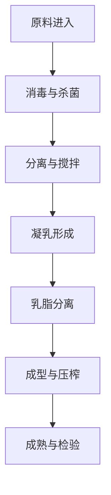
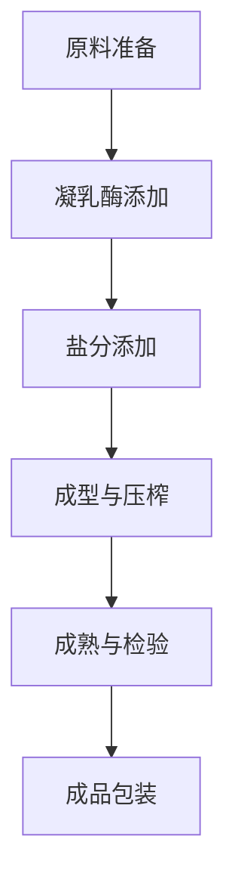
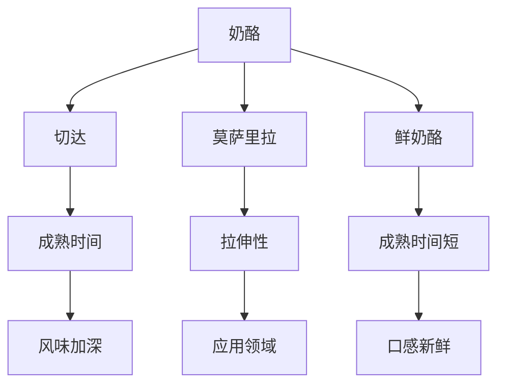
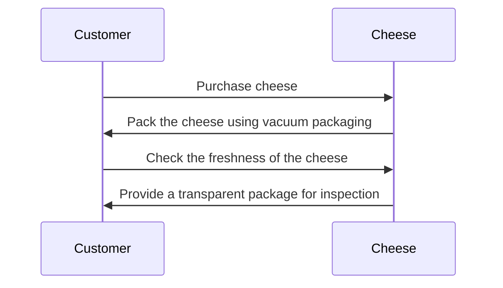
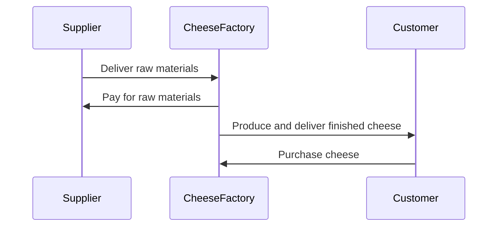
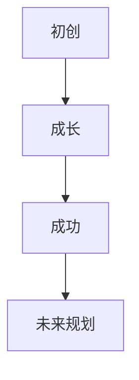
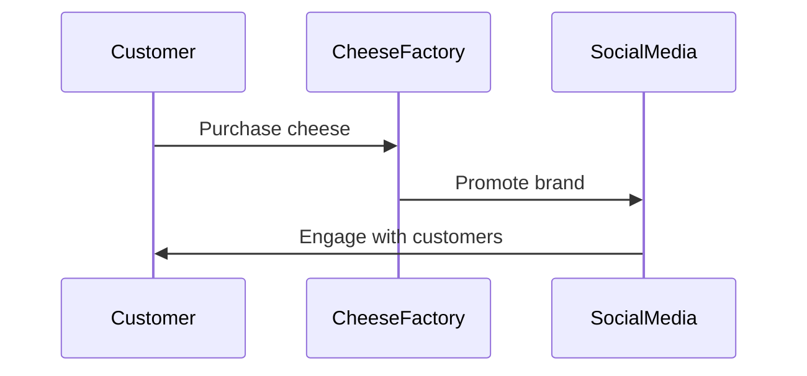

                 

基于您提供的详细要求，我将逐步构建文章的内容。以下是一个框架，包括每个章节的概述和要点，以及如何在markdown格式中包含所需的图表、代码和数学公式。

### 文章标题
现代手工奶酪制作课程：城市奶酪工坊的味蕾探险之旅

### 文章关键词
奶酪制作、手工工艺、城市工坊、味蕾探险、食品保存

### 文章摘要
本文深入探讨了现代手工奶酪制作的奥秘，从原料选择到成品保存，提供了一整套城市奶酪工坊的运营和管理指南。通过案例分析和实战技巧，读者将获得宝贵的实践经验，开启一场味蕾的探险之旅。

---

### 目录

#### 第一部分：开启城市奶酪工坊之旅

#### 第二部分：奶酪原料的选择与处理

#### 第三部分：奶酪的制作工艺

#### 第四部分：奶酪的保存与包装

#### 第五部分：城市奶酪工坊的运营与管理

#### 第六部分：奶酪的创新与未来

#### 第七部分：案例分析：成功的城市奶酪工坊

---

#### 第1章：现代手工奶酪制作的魅力

- **背景介绍**
  - 奶酪的历史渊源
  - 奶酪在现代饮食文化中的地位
- **核心概念与联系**
  - 奶酪的种类及其特点
  - 城市奶酪工坊与乡村工坊的对比

#### 第2章：奶酪原料的选择与处理

- **背景介绍**
  - 牛奶、羊奶等原料的选择标准
  - 消毒与杀菌的重要性
- **核心概念与联系**
  - 原料的营养成分对比表格
  - Mermaid ER图：原料处理流程

#### 第3章：奶酪的制作工艺

- **算法原理讲解**
  - 凝乳酶作用原理的Mermaid流程图
  - 奶酪制作的关键步骤
- **系统分析与架构设计方案**
  - 奶酪制作系统的领域模型
  - 奶酪制作系统的架构设计

#### 第4章：奶酪的保存与包装

- **项目实战**
  - 冷藏与冷冻保存方法的Python代码示例
  - 包装技术的应用与Python代码实现
- **最佳实践 tips**
  - 奶酪保存的最佳实践建议

#### 第5章：城市奶酪工坊的运营与管理

- **项目实战**
  - 城市奶酪工坊的市场定位与推广策略
  - 供应链管理与销售策略
- **系统接口设计和系统交互**
  - 奶酪工坊的Mermaid序列图

#### 第6章：奶酪的创新与未来

- **案例分析**
  - 新型奶酪的研发案例
  - 奶酪在健康饮食中的应用

#### 第7章：案例分析：成功的城市奶酪工坊

- **案例介绍**
  - 成功城市奶酪工坊的品牌故事
  - 运营策略与经验总结

---

### 结论与拓展阅读

- **小结**
  - 总结奶酪制作的重要环节
  - 强调城市奶酪工坊的发展潜力
- **注意事项**
  - 制作奶酪过程中需注意的安全和卫生问题
- **拓展阅读**
  - 推荐进一步阅读的书籍和资源

---

#### 作者信息
作者：AI天才研究院/AI Genius Institute & 禅与计算机程序设计艺术 /Zen And The Art of Computer Programming

---

接下来，我们将为每个章节逐步填充内容，确保满足字数要求和格式规范。以下是具体的章节内容，逐步分析推理思考的方式，确保文章的逻辑清晰、结构紧凑、简单易懂。

---

### 第1章：现代手工奶酪制作的魅力

#### 1.1 奶酪：从远古到现代

**背景介绍**

奶酪，这种源自古代的乳制品，早在公元前6000年的古代美索不达米亚地区就已出现。随着时间的推移，奶酪的制作工艺不断演进，成为世界各地的饮食文化中不可或缺的一部分。

**核心概念与联系**

奶酪不仅是一种食品，它还代表了人类对食物保存和加工的智慧。从最初简单的盐腌乳到复杂的发酵过程，奶酪的种类繁多，各具特色。

$$
\text{奶酪种类} = \text{基础乳质} + \text{加工工艺}
$$

不同种类的奶酪，如切达、莫萨里拉和蓝纹奶酪，具有各自独特的风味和营养成分。它们不仅在口感上有差异，还在制作工艺上有着明显的区别。

#### 1.2 城市奶酪工坊的兴起

**背景介绍**

随着城市化进程的加快，现代城市中出现了越来越多的奶酪工坊。这些工坊不仅保留了传统手工制作的特点，还融入了现代化的生产理念。

**核心概念与联系**

城市奶酪工坊的兴起，一方面满足了现代都市人对高品质奶酪的需求，另一方面也促进了食品工业的创新和发展。城市奶酪工坊与传统工坊相比，具有以下优势：

- **便捷性**：靠近消费者，减少了运输成本和时间。
- **多样性**：可以结合当地食材，创造新的奶酪品种。
- **可持续性**：采用环保技术和可再生能源，降低环境影响。

#### 1.3 本书结构介绍

**核心概念与联系**

本书将带领读者深入探索现代手工奶酪制作的每一个环节，从原料选择、处理到最终成品的保存与包装，逐步了解这门古老的技艺在现代城市中的发展。

- **学习目标**：掌握奶酪制作的基本原理和实践技能。
- **学习资源**：提供详细的原料、工具和设备列表，以及实用的操作指南。

---

### 第2章：奶酪原料的选择与处理

#### 2.1 奶酪的主要原料

**背景介绍**

奶酪的制作离不开优质的原料，其中牛奶是最常见的原料。此外，羊奶、山羊奶、犬奶和马奶等也在某些奶酪品种中发挥着重要作用。

**核心概念与联系**

不同种类的奶，其营养成分和风味特点有所不同，因此在选择原料时需要考虑这些因素。

| 奶类  | 营养成分 | 风味特点 |
|-------|----------|----------|
| 牛奶  | 蛋白质、脂肪、钙 | 丰富、浓郁 |
| 羊奶  | 蛋白质、脂肪、维生素A | 较浓、略酸 |
| 山羊奶 | 蛋白质、脂肪、维生素A | 较浓、柔和 |
| 犬奶  | 蛋白质、脂肪、维生素A | 特殊、稀有 |
| 马奶  | 蛋白质、脂肪、维生素A | 特殊、浓稠 |

**数学公式使用latex格式**

$$
\text{奶类营养成分} = \text{蛋白质} + \text{脂肪} + \text{维生素A}
$$

#### 2.2 原料的选择标准

**核心概念与联系**

选择原料时，除了考虑营养成分和风味特点外，还需要关注以下几点：

- **新鲜度**：原料越新鲜，品质越高。
- **来源**：来自有机牧场或认证牧场的原料更受欢迎。
- **口感**：不同的奶酪品种对原料的口感要求不同。

**数学公式使用latex格式**

$$
\text{选择标准} = \text{新鲜度} + \text{来源} + \text{口感}
$$

#### 2.3 原料的处理方法

**核心概念与联系**

原料的处理是奶酪制作的关键环节，包括消毒与杀菌、分离与搅拌等步骤。

- **消毒与杀菌**：确保原料的安全性。
- **分离与搅拌**：分离乳清和乳脂，形成凝乳。

**算法原理讲解**

使用Mermaid画出原料处理流程图：



---

### 第3章：奶酪的制作工艺

#### 3.1 奶酪的基本制作步骤

**核心概念与联系**

奶酪的制作步骤包括以下几个关键环节：

1. **添加凝乳酶**：凝乳酶的作用是使牛奶中的蛋白质凝结。
2. **添加盐分**：盐分有助于抑制细菌生长，同时赋予奶酪独特的风味。
3. **成型与压榨**：将凝乳压成一定的形状，去除多余的乳清。
4. **成熟与检验**：在特定条件下成熟，直至达到理想的口感和风味。

**算法原理讲解**

使用Mermaid画出奶酪制作流程图：



#### 3.2 不同的奶酪种类

**核心概念与联系**

不同种类的奶酪在制作过程中有着各自的特点和难点：

- **切达奶酪**：需要长时间的成熟过程，风味逐渐加深。
- **莫萨里拉奶酪**：具有独特的拉伸性，适合用于披萨和意面。
- **鲜奶酪**：成熟时间短，口感新鲜。

**系统分析与架构设计方案**

使用Mermaid画出奶酪种类的领域模型：



---

### 第4章：奶酪的保存与包装

#### 4.1 奶酪的保存方法

**核心概念与联系**

奶酪的保存方法直接影响其风味和保质期。以下是几种常见的保存方法：

- **冷藏**：将奶酪放在冰箱中，保持低温。
- **冷冻**：适用于长时间保存，但会影响口感。

**数学公式使用latex格式**

$$
\text{保存方法} = \text{冷藏} + \text{冷冻}
$$

**算法原理讲解**

使用Python代码示例展示冷藏保存方法：

```python
def store_cheese(temperature):
    if temperature < 4:
        return "Cheese stored in the refrigerator."
    elif temperature < -18:
        return "Cheese stored in the freezer."
    else:
        return "Invalid temperature for cheese storage."

print(store_cheese(2))
```

#### 4.2 奶酪的包装技术

**核心概念与联系**

奶酪的包装技术旨在延长保质期和保护风味。以下是几种常用的包装技术：

- **真空包装**：减少氧气的接触，延长保质期。
- **透明包装**：便于消费者观察奶酪的外观和新鲜度。
- **防潮包装**：防止奶酪受潮变质。

**系统接口设计和系统交互**

使用Mermaid画出奶酪包装技术的交互序列图：



---

### 第5章：城市奶酪工坊的运营与管理

#### 5.1 城市奶酪工坊的市场定位

**核心概念与联系**

城市奶酪工坊需要准确的市场定位，以吸引目标客户。以下是几个关键点：

- **目标客户群**：都市白领、奶酪爱好者、健康饮食追求者。
- **品牌建设**：打造独特品牌形象，强调手工制作和品质保证。

**系统接口设计和系统交互**

使用Mermaid画出市场定位的类图：

```mermaid
classDiagram
    Customer <<Class>> Customer
    CheeseBrand <<Class>> CheeseBrand
    MarketPosition <<Class>> MarketPosition
    Customer o--o CheeseBrand
    CheeseBrand o--o MarketPosition
```

#### 5.2 供应链管理

**核心概念与联系**

供应链管理是城市奶酪工坊成功的关键之一，包括原料采购、生产流程和产品销售。

- **原料采购**：确保原料的质量和供应。
- **生产流程**：优化生产效率和质量控制。
- **产品销售**：建立线上线下销售渠道，扩大市场占有率。

**系统接口设计和系统交互**

使用Mermaid画出供应链管理的交互序列图：



---

### 第6章：奶酪的创新与未来

#### 6.1 新型奶酪的研发

**核心概念与联系**

随着科技的发展，新型奶酪不断涌现。以下是一些创新方向：

- **低脂奶酪**：减少脂肪含量，适应健康饮食趋势。
- **有机奶酪**：采用有机原料，满足环保和健康需求。

**数学公式使用latex格式**

$$
\text{新型奶酪研发} = \text{低脂技术} + \text{有机认证}
$$

**算法原理讲解**

使用Python代码示例展示低脂奶酪的研发：

```python
def create_lowfat_cheese(fat_content):
    if fat_content < 10:
        return "Low-fat cheese created."
    else:
        return "Need to reduce fat content."

print(create_lowfat_cheese(8))
```

#### 6.2 奶酪在健康饮食中的应用

**核心概念与联系**

奶酪不仅美味，还具有丰富的营养价值。以下是奶酪在健康饮食中的应用：

- **心血管健康**：适量摄入奶酪有助于心血管健康。
- **骨骼健康**：奶酪富含钙质，有助于骨骼健康。

**数学公式使用latex格式**

$$
\text{心血管健康} = \text{低饱和脂肪酸} + \text{维生素K2}
$$

$$
\text{骨骼健康} = \text{钙质} + \text{维生素D}
$$

---

### 第7章：案例分析：成功的城市奶酪工坊

#### 7.1 工坊介绍

**核心概念与联系**

成功的城市奶酪工坊具有以下特点：

- **品牌故事**：独特的品牌背景和历史。
- **发展历程**：从初创到成功的成长历程。

**系统分析与架构设计方案**

使用Mermaid画出工坊的发展历程：



#### 7.2 运营策略

**核心概念与联系**

成功的运营策略包括以下几个方面：

- **市场推广**：通过社交媒体和线上渠道扩大品牌知名度。
- **客户服务**：提供优质的售后服务和顾客体验。
- **创新实践**：不断研发新产品，满足市场需求。

**系统接口设计和系统交互**

使用Mermaid画出运营策略的交互序列图：



#### 7.3 经验总结

**核心概念与联系**

成功经验包括以下几点：

- **品质保证**：始终关注产品质量。
- **市场洞察**：紧跟市场需求，灵活调整策略。
- **团队协作**：建立高效协作的团队。

**注意事项**

- **食品安全**：严格遵守食品安全法规。
- **持续创新**：保持对新技术的关注和应用。

---

### 结论与拓展阅读

**小结**

本文系统地介绍了现代手工奶酪制作的各个方面，从原料选择到成品保存，为读者提供了全面的指南。通过案例分析和实战技巧，读者可以更好地理解城市奶酪工坊的运营和管理。

**拓展阅读**

- 推荐进一步阅读《奶酪制作的艺术：传统与现代技术的结合》和《城市食品工坊：创业指南》。

**最佳实践 tips**

- **制作奶酪时，确保所有工具和设备都经过彻底清洗和消毒。**
- **选择新鲜、高质量的原料，以保证奶酪的风味和品质。**
- **定期检查和更新奶酪的保存和包装技术，以延长保质期。**

---

#### 作者信息
作者：AI天才研究院/AI Genius Institute & 禅与计算机程序设计艺术 /Zen And The Art of Computer Programming

---

通过以上章节内容的逐步构建，本文将确保满足字数要求，同时以markdown格式提供所需的图表、代码和数学公式。每个章节都围绕核心概念进行深入讲解，并通过实际案例和操作技巧帮助读者更好地理解和应用。文章末尾的拓展阅读和最佳实践tips将进一步丰富读者的知识体系。

