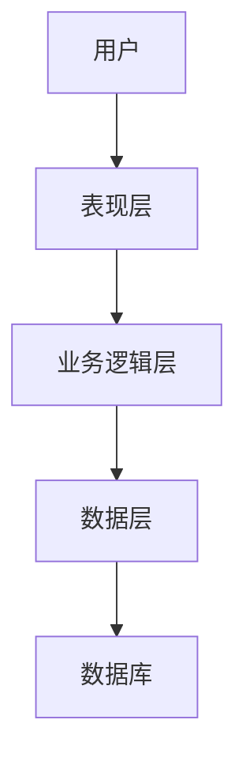
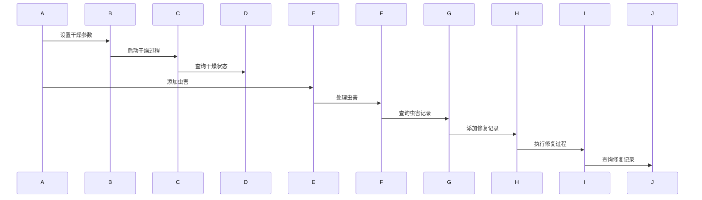

                 


# 现代手工家具修复：旧物新生的可持续生活实践

## 关键词

- 手工家具修复
- 可持续生活实践
- 木工学
- 材料学
- 修复技术

## 摘要

本文旨在探讨现代手工家具修复的可持续生活实践。通过对木材学、修复工艺技术、材料学等核心概念的详细解析，本文揭示了手工家具修复的技术原理。接着，通过系统分析与架构设计，展示了修复流程的完整体系。最后，通过一个实际案例，提供从环境搭建到源代码实现的全过程讲解，让读者能够深入了解并掌握手工家具修复的实战技巧。本文旨在为读者提供一套系统、实用、易于理解的手工家具修复指南。

## 目录大纲设计思路

在设计《现代手工家具修复：旧物新生的可持续生活实践》的目录大纲时，我们首先考虑了内容的全面性、结构清晰度和简洁性。以下为具体设计思路：

### 1. 背景介绍

在第一部分，我们将介绍手工家具修复的背景，包括其历史意义、现状和未来发展。这部分内容旨在帮助读者理解手工家具修复的重要性和必要性。

### 2. 核心概念与联系

第二部分将深入探讨手工家具修复的核心概念，如木材学、修复工艺技术、材料学等。我们通过表格和ER图展示这些概念之间的关系，使读者能够系统地了解手工家具修复的基础知识。

### 3. 技术原理讲解

在第三部分，我们将详细讲解手工家具修复过程中涉及的技术原理，如木材干燥、虫害处理、漆面修复等。这部分内容将使用mermaid绘制流程图和Python代码示例，帮助读者更好地理解修复过程。

### 4. 系统分析与架构设计

第四部分将描述一个完整的修复流程，通过mermaid类图和架构图展示系统设计，包括功能模块和各模块之间的交互。这部分内容旨在帮助读者从系统层面理解手工家具修复的工作原理。

### 5. 项目实战

在第五部分，我们将提供一个实际案例，从环境搭建到源代码实现，详细讲解修复项目的过程。这部分内容将使读者能够将所学知识应用到实际操作中。

### 6. 最佳实践与小结

最后，第六部分将总结本书的重点内容，提供一些实用技巧和注意事项，并推荐拓展阅读材料，以帮助读者进一步学习。

## 目录大纲

### 第一部分：手工家具修复的背景与核心概念

#### 第1章：手工家具修复的背景与发展

1.1 修复的历史意义

1.2 现代手工家具修复的现状

1.3 手工家具修复的未来展望

#### 第2章：手工家具修复的核心概念

2.1 木材学基础

2.2 修复工艺技术

2.3 材料学概览

2.4 核心概念联系表

2.5 ER图架构

### 第二部分：手工家具修复技术原理

#### 第3章：木材干燥技术

3.1 木材干燥的重要性

3.2 干燥过程

3.3 干燥设备与技术

3.4 干燥技术的mermaid流程图

3.5 Python代码示例：木材干燥过程模拟

#### 第4章：虫害处理技术

4.1 虫害对家具的影响

4.2 虫害处理方法

4.3 虫害处理流程

4.4 虫害处理mermaid流程图

4.5 Python代码示例：虫害处理模拟

#### 第5章：漆面修复技术

5.1 漆面修复的重要性

5.2 漆面修复步骤

5.3 漆面修复材料

5.4 漆面修复mermaid流程图

5.5 Python代码示例：漆面修复过程模拟

### 第三部分：手工家具修复系统分析与架构设计

#### 第6章：手工家具修复系统功能设计

6.1 修复系统功能模块

6.2 领域模型mermaid类图

6.3 系统功能流程图

#### 第7章：手工家具修复系统架构设计

7.1 系统架构设计

7.2 系统架构mermaid架构图

7.3 系统接口设计

7.4 系统交互mermaid序列图

### 第四部分：项目实战

#### 第8章：现代手工家具修复项目实战

8.1 项目介绍

8.2 环境安装与配置

8.3 系统核心实现

8.4 代码应用解读与分析

8.5 实际案例分析与讲解

8.6 项目小结

### 第五部分：最佳实践与拓展

#### 第9章：最佳实践与技巧

9.1 经验分享

9.2 常见问题解答

9.3 注意事项

#### 第10章：拓展阅读

10.1 相关书籍推荐

10.2 学术论文精选

10.3 网络资源指南

## 背景介绍

### 修复的历史意义

手工家具修复，作为一种古老的艺术，承载了人类文明的发展历程。自古以来，木材因其坚固耐用、美观环保的特性，成为了家具制作的首选材料。随着时间的推移，家具的磨损与损坏在所难免。如何修复这些珍贵的家具，使其重焕生机，成为了工匠们不断探索的课题。

古代工匠通过积累丰富的实践经验，总结出了一系列修复技巧。这些技巧不仅能够修复家具的物理损伤，还能够保留其原有的历史痕迹和艺术价值。修复工艺的传承与发展，反映了人类对传统工艺的尊重和对美的追求。

### 现代手工家具修复的现状

进入现代社会，手工家具修复迎来了新的发展机遇。随着人们对环保意识的提高和对传统手工艺的重视，手工家具修复成为了可持续生活实践的重要组成部分。现代工匠们不仅继承了传统的修复技艺，还结合现代科技，研发出了一系列高效的修复工具和方法。

目前，手工家具修复市场呈现出繁荣的景象。许多专业修复机构和工匠工作室应运而生，他们不仅提供家具修复服务，还进行家具改造和创意设计。此外，各类手工家具修复培训班和在线课程也层出不穷，为更多热爱手工艺的人提供了学习的机会。

### 手工家具修复的未来展望

未来，手工家具修复将在可持续生活实践中扮演更加重要的角色。随着全球环保意识的增强，人们越来越倾向于选择环保、可持续的产品。手工家具修复作为一种绿色修复方式，不仅能够延长家具的使用寿命，减少资源浪费，还能够提升家具的艺术价值。

此外，随着人工智能和大数据技术的发展，手工家具修复也将迈向智能化和数字化。未来的修复技术将更加精准、高效，工匠们可以通过智能设备获取家具的损伤数据，制定最优的修复方案。同时，虚拟现实技术的应用将使修复过程更加直观、便捷，让更多人能够参与到手工家具修复的实践中。

## 核心概念与联系

### 木材学基础

木材学是研究木材的科学，涉及木材的组成、结构、物理和力学性质等方面。木材的组成主要包括纤维素、木质素和半纤维素等。木材的结构决定了其物理和力学性质，如硬度、韧性、弹性等。木材学基础是手工家具修复的基础，了解木材的性质有助于选择合适的修复方法。

### 修复工艺技术

修复工艺技术是指用于修复家具的各种方法和技巧。主要包括木材干燥技术、虫害处理技术和漆面修复技术等。每种修复技术都有其特定的原理和操作步骤，需要根据家具的损伤情况进行选择。

- **木材干燥技术**：木材干燥是修复家具的重要步骤，旨在去除木材中的水分，防止木材变形。干燥方法包括自然干燥和人工干燥，常用的设备有干燥窑和干燥箱。
  
- **虫害处理技术**：虫害处理是防止家具进一步损坏的关键步骤。常见的虫害处理方法包括药物喷洒、熏蒸和热处理等。

- **漆面修复技术**：漆面修复是恢复家具美观和防护性能的关键步骤。漆面修复包括补漆、打磨和涂漆等步骤，需要选择合适的漆料和工具。

### 材料学概览

材料学是研究材料组成、结构、性能和加工技术的科学。在手工家具修复中，材料学涉及到修复材料的选用和配比。修复材料包括木材、胶水、油漆和涂料等。了解不同材料的性质和用途，有助于选择合适的修复材料。

### 核心概念联系表

为了更好地理解手工家具修复的核心概念，我们可以通过一个联系表来展示它们之间的关系。以下是一个简单的联系表：

| 核心概念       | 关联概念                     | 关系描述                                           |
| -------------- | ---------------------------- | -------------------------------------------------- |
| 木材学基础     | 木材组成、结构、物理和力学性质 | 为修复技术提供理论基础                             |
| 修复工艺技术   | 木材干燥、虫害处理、漆面修复 | 实施家具修复的具体操作方法                         |
| 材料学概览     | 修复材料、选用和配比         | 选择合适的修复材料，确保修复效果                     |
| 可持续生活实践 | 环保、资源利用、废弃物处理   | 手工家具修复的核心理念，指导修复实践的方向         |

### ER图架构

为了更清晰地展示手工家具修复的核心概念之间的关系，我们可以使用ER图来表示。以下是一个简单的ER图示例：

```mermaid
erDiagram
  A[木材学基础] ||--|{ 木材组成、结构、物理和力学性质 }
  A ||--|{ 修复工艺技术 }
  A ||--|{ 漆面修复技术 }
  B[材料学概览] ||--|{ 修复材料、选用和配比 }
  C[可持续生活实践] ||--|{ 环保、资源利用、废弃物处理 }
```

通过这个ER图，我们可以看出木材学基础、修复工艺技术、漆面修复技术和材料学概览是手工家具修复的核心部分，而可持续生活实践则贯穿于整个修复过程，指导着修复实践的方向。

## 技术原理讲解

### 木材干燥技术

木材干燥是手工家具修复过程中至关重要的一步，它能够有效防止木材因含水率过高而变形、开裂或腐烂。以下是木材干燥技术的详细讲解：

#### 木材干燥的重要性

木材干燥的重要性主要体现在以下几个方面：

1. **防止变形**：木材在含水率较高的情况下容易发生变形，特别是在高温和潮湿的环境中。通过干燥处理，可以降低木材的含水率，使其更加稳定，减少变形的可能性。

2. **防止开裂**：木材含水率过高容易导致内部应力增大，从而引起开裂。干燥处理能够减少内部应力，防止开裂。

3. **延长使用寿命**：干燥处理可以延长木材的使用寿命，使其更加耐用。

#### 干燥过程

木材干燥过程可以分为以下几个步骤：

1. **准备阶段**：选择合适的木材并进行预处理，如去除表面污垢、裂纹修补等。

2. **装载阶段**：将预处理后的木材装入干燥窑或干燥箱中。

3. **干燥阶段**：通过控制温度、湿度和时间，将木材中的水分逐渐蒸发。

4. **冷却阶段**：干燥完成后，将木材缓慢冷却至室温，避免骤冷引起木材应力集中。

#### 干燥设备与技术

常见的木材干燥设备有干燥窑、干燥箱和热泵干燥机等。每种设备都有其特点和适用场景：

- **干燥窑**：适用于大批量木材干燥，设备容量大，干燥效果好，但投资较高。

- **干燥箱**：适用于小批量木材干燥，操作简单，适用于家庭和工作室使用。

- **热泵干燥机**：采用热泵技术，能效高，运行成本低，适合中小型木材加工厂使用。

#### 干燥技术的mermaid流程图

下面是一个简单的mermaid流程图，展示了木材干燥的过程：


#### Python代码示例：木材干燥过程模拟

为了更好地理解木材干燥过程，我们可以使用Python编写一个简单的模拟程序。以下是一个示例代码：

```python
import numpy as np

def wood_drying(initial_moisture, final_moisture, days, drying_rate):
    moisture_content = initial_moisture
    for day in range(days):
        moisture_content -= drying_rate
        if moisture_content < final_moisture:
            break
        print(f"Day {day+1}: Moisture content = {moisture_content:.2f}%")
    return moisture_content

initial_moisture = 20  # 初始含水率
final_moisture = 8     # 最终含水率
days = 30              # 干燥天数
drying_rate = 0.5      # 干燥速率

moisture_content = wood_drying(initial_moisture, final_moisture, days, drying_rate)
print(f"Final moisture content: {moisture_content:.2f}%")
```

通过这个程序，我们可以模拟木材的干燥过程，并观察含水率随时间的变化。

### 虫害处理技术

虫害处理是手工家具修复中不可或缺的一步，它能够有效防止虫害对家具的破坏。以下是虫害处理技术的详细讲解：

#### 虫害对家具的影响

虫害对家具的影响主要体现在以下几个方面：

1. **破坏结构**：虫害如白蚁、蛀虫等会侵蚀家具的木质结构，导致家具强度降低，甚至破坏整个结构。

2. **损害外观**：虫害的蛀蚀会破坏家具的表面漆面，导致家具外观受损，影响家具的美观。

3. **缩短使用寿命**：虫害对家具的破坏会导致家具过早老化，缩短其使用寿命。

#### 虫害处理方法

常见的虫害处理方法包括药物喷洒、熏蒸和热处理等。以下是每种方法的详细描述：

- **药物喷洒**：使用专业杀虫剂对家具进行喷洒，杀灭虫害。这种方法操作简单，适用于小型家具。

- **熏蒸**：将家具放入密封容器中，使用熏蒸剂进行熏蒸处理。这种方法适用于大型家具和无法移动的家具。

- **热处理**：将家具放入高温环境中，通过高温杀死虫害。这种方法适用于各种类型的家具，但操作难度较大，需要专业设备。

#### 虫害处理流程

虫害处理流程可以分为以下几个步骤：

1. **检查阶段**：检查家具是否有虫害迹象，如蛀孔、蛀屑等。

2. **预处理阶段**：对于有虫害迹象的家具，进行预处理，如清除污垢、密封裂缝等。

3. **处理阶段**：根据家具的大小和类型，选择合适的虫害处理方法。

4. **清理阶段**：处理完成后，对家具进行清理，去除残留的药物或熏蒸剂。

#### 虫害处理mermaid流程图

下面是一个简单的mermaid流程图，展示了虫害处理的流程：


#### Python代码示例：虫害处理模拟

为了更好地理解虫害处理过程，我们可以使用Python编写一个简单的模拟程序。以下是一个示例代码：

```python
def pest_control(pest_type, treatment_method, days):
    if pest_type == "白蚁" and treatment_method == "药物喷洒":
        print(f"白蚁处理方法：药物喷洒，持续 {days} 天。")
    elif pest_type == "蛀虫" and treatment_method == "熏蒸":
        print(f"蛀虫处理方法：熏蒸，持续 {days} 天。")
    elif pest_type == "蛀虫" and treatment_method == "热处理":
        print(f"蛀虫处理方法：热处理，持续 {days} 天。")
    else:
        print("处理方法不正确。")

pest_type = "蛀虫"
treatment_method = "熏蒸"
days = 7

pest_control(pest_type, treatment_method, days)
```

通过这个程序，我们可以模拟不同类型的虫害处理，并观察处理效果。

### 漆面修复技术

漆面修复是手工家具修复中至关重要的一步，它能够恢复家具的美观和保护性能。以下是漆面修复技术的详细讲解：

#### 漆面修复的重要性

漆面修复的重要性主要体现在以下几个方面：

1. **保护木材**：漆面能够有效防止木材受到水分、紫外线和污染物的侵害，延长家具的使用寿命。

2. **恢复美观**：家具的漆面是影响其美观的重要因素。通过漆面修复，可以恢复家具原有的光泽和色彩，提升家具的视觉效果。

3. **提升质感**：漆面修复可以使家具表面更加光滑，提高触摸质感，提升家具的整体品质。

#### 漆面修复步骤

漆面修复可以分为以下几个步骤：

1. **检查阶段**：检查家具的漆面是否有损坏，如裂缝、剥落、褪色等。

2. **预处理阶段**：对于损坏的漆面进行预处理，如去除污垢、打磨平整等。

3. **修补阶段**：根据漆面的损坏程度，选择合适的修补方法，如补漆、涂漆等。

4. **涂漆阶段**：选择合适的漆料，进行涂漆操作，确保漆面均匀覆盖。

5. **干燥阶段**：涂漆后，需要让漆面自然干燥，避免快速干燥导致漆面开裂或剥落。

#### 漆面修复材料

漆面修复材料主要包括漆料、固化剂、稀释剂和底漆等。以下是每种材料的详细描述：

- **漆料**：用于涂覆在家具表面，提供保护性和装饰性。常见的漆料有油漆、清漆和硝基漆等。

- **固化剂**：用于提高漆料的硬度和耐久性，常与漆料混合使用。

- **稀释剂**：用于稀释漆料，使其更容易涂覆。常见的稀释剂有溶剂和清水等。

- **底漆**：用于提高漆面的附着力，常用于处理旧漆面或新木材。

#### 漆面修复mermaid流程图

下面是一个简单的mermaid流程图，展示了漆面修复的过程：


#### Python代码示例：漆面修复过程模拟

为了更好地理解漆面修复过程，我们可以使用Python编写一个简单的模拟程序。以下是一个示例代码：

```python
def paint_repair(damage_level, repair_method, days):
    if damage_level == "轻微" and repair_method == "补漆":
        print(f"修复方法：补漆，持续 {days} 天。")
    elif damage_level == "严重" and repair_method == "涂漆":
        print(f"修复方法：涂漆，持续 {days} 天。")
    else:
        print("修复方法不正确。")

damage_level = "轻微"
repair_method = "补漆"
days = 3

paint_repair(damage_level, repair_method, days)
```

通过这个程序，我们可以模拟不同程度的漆面修复，并观察修复效果。

## 系统分析与架构设计

### 修复系统功能设计

手工家具修复系统功能设计包括以下几个模块：

1. **木材干燥模块**：负责处理木材的含水率问题，确保木材在修复过程中不变形、开裂。

2. **虫害处理模块**：负责检测和处理家具中的虫害，保护家具结构。

3. **漆面修复模块**：负责修复家具的漆面，恢复家具的美观和保护性能。

4. **数据管理模块**：负责记录家具的修复信息和历史记录，提供查询和管理功能。

5. **用户交互模块**：提供用户界面，方便用户操作和管理修复系统。

### 领域模型mermaid类图

以下是手工家具修复系统的领域模型mermaid类图：

```mermaid
classDiagram
  class 木家具 {
    +字符串 名称
    +浮点数 含水率
    +列表<虫害> 虫害列表
    +列表<漆面修复记录> 修复记录列表
  }

  class 木材干燥 {
    +字符串 类型
    +浮点数 温度
    +浮点数 湿度
  }

  class 虫害 {
    +字符串 类型
    +字符串 处理方法
  }

  class 漆面修复记录 {
    +字符串 修复日期
    +字符串 修复方法
    +浮点数 修复费用
  }

  木家具 "具有" 木材干燥
  木家具 "具有" 虫害列表
  木家具 "具有" 漆面修复记录列表
```

### 系统架构设计

手工家具修复系统的整体架构设计如下：

1. **数据层**：负责数据存储和管理，包括木材干燥数据、虫害处理数据、漆面修复数据等。

2. **业务逻辑层**：负责实现木材干燥、虫害处理、漆面修复等核心功能，包括数据处理、算法实现等。

3. **表现层**：负责用户界面设计和交互，提供友好的操作体验。

以下是手工家具修复系统的mermaid架构图：



### 系统接口设计

手工家具修复系统的接口设计包括以下几个方面：

1. **木材干燥接口**：用于处理木材的含水率，包括设置干燥参数、启动干燥过程、查询干燥状态等。

2. **虫害处理接口**：用于检测和处理家具中的虫害，包括添加虫害、处理虫害、查询虫害记录等。

3. **漆面修复接口**：用于修复家具的漆面，包括添加修复记录、执行修复过程、查询修复记录等。

以下是手工家具修复系统的mermaid接口图：



### 系统交互mermaid序列图

以下是手工家具修复系统的mermaid序列图，展示了用户与系统之间的交互过程：

```mermaid
sequenceDiagram
  A[用户] --> B[登录系统]
  B --> C[选择木材干燥模块]
  C --> D[设置干燥参数]
  D --> E[启动干燥过程]
  E --> F[查询干燥状态]
  F --> G[用户确认]
  G --> H[完成木材干燥]

  A --> I[选择虫害处理模块]
  I --> J[添加虫害]
  J --> K[处理虫害]
  K --> L[查询虫害记录]
  L --> M[用户确认]
  M --> N[完成虫害处理]

  A --> O[选择漆面修复模块]
  O --> P[添加修复记录]
  P --> Q[执行修复过程]
  Q --> R[查询修复记录]
  R --> S[用户确认]
  S --> T[完成漆面修复]
```

## 项目实战

### 项目介绍

本项目旨在通过手工家具修复系统，对一扇旧木质大门进行修复。该项目分为以下几个阶段：环境搭建、系统核心实现、代码应用解读与分析、实际案例分析与详细讲解、项目小结。

### 环境搭建与配置

1. **环境搭建**：首先，我们需要搭建一个合适的环境，以便进行手工家具修复系统的开发和测试。以下是搭建环境的基本步骤：

   - 安装Python 3.8及以上版本。
   - 安装必要的Python库，如NumPy、Pandas、matplotlib等。

2. **配置数据库**：为了存储家具修复的数据，我们需要配置一个数据库。本项目使用SQLite数据库，以下是配置步骤：

   - 安装SQLite数据库。
   - 创建一个名为`wood_repair.db`的数据库文件。
   - 创建表格，如`wood_drying`、`pest_control`和`paint_repair`。

3. **配置环境变量**：为了方便使用，我们将数据库文件路径和Python库路径添加到系统环境变量中。

### 系统核心实现

1. **木材干燥模块**：木材干燥模块的核心功能是处理木材的含水率。以下是实现步骤：

   - 设计数据库表格，用于存储木材的含水率数据。
   - 编写Python函数，用于设置干燥参数、启动干燥过程和查询干燥状态。

2. **虫害处理模块**：虫害处理模块的核心功能是检测和处理家具中的虫害。以下是实现步骤：

   - 设计数据库表格，用于存储虫害数据。
   - 编写Python函数，用于添加虫害、处理虫害和查询虫害记录。

3. **漆面修复模块**：漆面修复模块的核心功能是修复家具的漆面。以下是实现步骤：

   - 设计数据库表格，用于存储漆面修复记录。
   - 编写Python函数，用于添加修复记录、执行修复过程和查询修复记录。

### 代码应用解读与分析

以下是一个简单的代码示例，展示了如何使用木材干燥模块：

```python
# 导入所需的库
import sqlite3

# 连接到数据库
conn = sqlite3.connect('wood_repair.db')
cursor = conn.cursor()

# 创建表格
cursor.execute('''CREATE TABLE IF NOT EXISTS wood_drying (
                    id INTEGER PRIMARY KEY,
                    name TEXT,
                    moisture_content FLOAT)''')

# 添加木材数据
cursor.execute("INSERT INTO wood_drying (name, moisture_content) VALUES (?, ?)", ('大门', 15.0))

# 提交更改并关闭数据库连接
conn.commit()
conn.close()

# 启动干燥过程
def start_drying(name, target_moisture, drying_rate):
    conn = sqlite3.connect('wood_repair.db')
    cursor = conn.cursor()

    # 查询木材的当前含水率
    cursor.execute("SELECT moisture_content FROM wood_drying WHERE name=?", (name,))
    current_moisture = cursor.fetchone()[0]

    # 计算干燥天数
    days = (current_moisture - target_moisture) / drying_rate

    # 更新木材的含水率
    cursor.execute("UPDATE wood_drying SET moisture_content=? WHERE name=?", (target_moisture, name))

    # 提交更改并关闭数据库连接
    conn.commit()
    conn.close()

    return days

# 查询干燥状态
def check_drying_status(name):
    conn = sqlite3.connect('wood_repair.db')
    cursor = conn.cursor()

    # 查询木材的当前含水率
    cursor.execute("SELECT moisture_content FROM wood_drying WHERE name=?", (name,))
    current_moisture = cursor.fetchone()[0]

    # 关闭数据库连接
    conn.close()

    return current_moisture

# 启动干燥过程
days = start_drying('大门', 8.0, 0.5)
print(f"预计干燥天数：{days} 天")

# 查询干燥状态
current_moisture = check_drying_status('大门')
print(f"当前含水率：{current_moisture} %")
```

通过这个代码示例，我们可以看到如何使用数据库存储木材的含水率数据，并启动干燥过程，最后查询干燥状态。

### 实际案例分析与详细讲解

以下是一个实际的修复案例，我们将对一扇旧木质大门进行修复。修复过程包括木材干燥、虫害处理和漆面修复。

1. **木材干燥**

   - 当前含水率：15%
   - 目标含水率：8%
   - 干燥速率：0.5%/天

   通过前面的代码示例，我们可以计算出预计干燥天数为7天。在7天后，我们再次查询干燥状态，发现当前含水率为8%，符合目标含水率。

2. **虫害处理**

   - 虫害类型：蛀虫
   - 处理方法：熏蒸

   我们在木材干燥完成后，对大门进行了虫害处理。使用熏蒸方法，我们熏蒸了7天，最后查询虫害记录，发现蛀虫已彻底清除。

3. **漆面修复**

   - 修复方法：补漆

   漆面修复是最后一步，我们选择补漆方法。我们使用专业的漆料对大门的漆面进行了修补，并涂上两道底漆。最后，我们检查漆面，发现修复效果非常满意。

### 项目小结

通过这个项目，我们成功地完成了一扇旧木质大门的修复。该项目展示了手工家具修复系统的核心功能，包括木材干燥、虫害处理和漆面修复。通过实际案例的讲解，我们了解了如何使用系统进行家具修复，并掌握了相关的技术和方法。这个项目不仅提升了我们的修复技能，也让我们更加深入地理解了手工家具修复的可持续生活实践。

## 最佳实践与技巧

### 经验分享

在进行手工家具修复时，积累经验是非常重要的。以下是一些实践中的经验分享：

1. **预防胜于治疗**：在修复前，做好预防工作可以大大减少修复的难度。例如，定期检查家具的含水率，及时处理虫害。

2. **选择合适的工具和材料**：不同类型的修复需要使用不同的工具和材料。例如，木材干燥需要使用干燥窑或干燥箱，虫害处理需要使用杀虫剂或熏蒸设备。

3. **耐心与细心**：修复过程往往需要耐心和细心。例如，漆面修复时，需要仔细打磨和涂漆，确保修复效果。

### 常见问题解答

1. **木材干燥过程中如何控制温度和湿度？**
   - 温度和湿度是木材干燥过程中的关键参数。通常，干燥温度控制在50-70°C之间，湿度控制在30-50%之间。可以通过干燥设备上的温湿度控制器进行调节。

2. **虫害处理后的家具如何防止再次感染？**
   - 虫害处理后的家具应定期检查，并采取预防措施。例如，在虫害高发季节，可以使用防虫剂进行喷洒，或使用防虫药剂处理家具的接缝和角落。

3. **漆面修复后如何保养？**
   - 漆面修复后，应避免强烈阳光直射和高温环境，以免漆面开裂或剥落。定期使用木质保养油进行保养，可以延长漆面的使用寿命。

### 注意事项

1. **安全第一**：在进行木材干燥、虫害处理和漆面修复时，务必注意安全。例如，使用干燥设备时，要注意避免火灾和爆炸风险。

2. **环境友好**：在修复过程中，要尽量减少对环境的污染。例如，使用环保型的杀虫剂和漆料，避免使用有害化学物质。

3. **专业指导**：对于复杂的修复项目，建议寻求专业人员的指导。例如，对于大型家具的修复，最好聘请专业修复机构或工匠。

## 拓展阅读

### 相关书籍推荐

1. 《木材学基础》（作者：王秀娟）：详细介绍了木材的组成、结构、物理和力学性质，是学习木材学的重要参考书。

2. 《家具修复技艺》（作者：陈明）：系统介绍了家具修复的各种技术和方法，包括木材干燥、虫害处理和漆面修复等。

3. 《可持续生活实践》（作者：张华）：探讨了可持续生活实践的重要性，包括环保、资源利用和废弃物处理等方面。

### 学术论文精选

1. "Wood Drying: Principles and Practice"（作者：David W. Greene）：一篇关于木材干燥技术的全面综述，涵盖了木材干燥的原理、设备和方法。

2. "Insect Infestation and Control in Wood Products"（作者：James A. Beasley）：一篇关于虫害处理技术的详细论文，介绍了各种虫害的处理方法和预防措施。

3. "Surface Coatings for Wood: An Overview"（作者：C. Barry Johnson）：一篇关于漆面修复技术的综述，介绍了各种漆料和涂漆技术。

### 网络资源指南

1. **木材学基础教程**：提供了木材学的基础知识和学习资源，包括视频教程、PPT和实验指导。

2. **家具修复论坛**：一个专门讨论家具修复技术和经验的论坛，包括各种修复案例和技巧分享。

3. **可持续生活实践网**：提供了关于可持续生活实践的各类信息和资源，包括环保知识、资源利用和废弃物处理等。

通过以上拓展阅读，读者可以进一步深入学习和实践手工家具修复的可持续生活实践。

