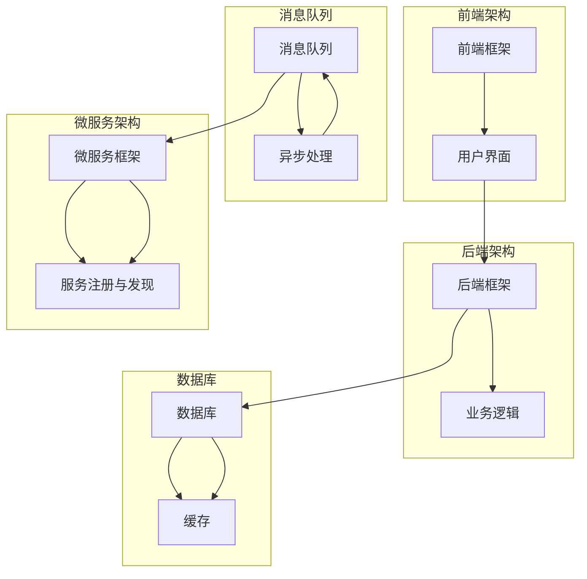
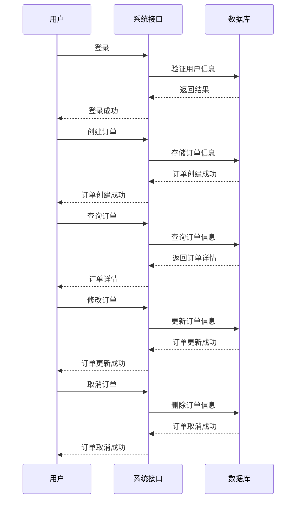
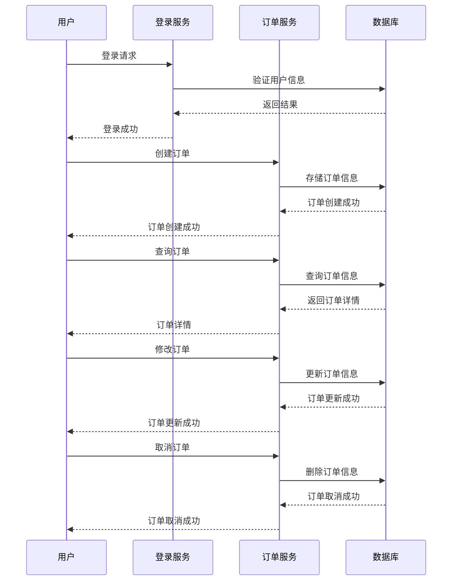

                 

### 现代手工家具定制平台：匠人精神与个性化需求的对接

> 关键词：现代手工家具、定制平台、匠人精神、个性化需求、技术融合

> 摘要：本文深入探讨了现代手工家具定制平台的建设，重点分析了如何通过技术手段对接传统匠人精神与现代个性化需求。文章分为四个部分，首先介绍了问题背景、核心概念与联系，其次讲解了现代手工家具定制平台的算法原理，随后进行了系统分析与架构设计，最后通过项目实战展示了具体实现过程。本文旨在为相关从业者提供有益的参考，促进匠人精神与个性化需求的和谐对接。

#### 第一部分：背景介绍与核心概念

##### 第1章：问题背景、问题描述与解决

###### 1.1 问题背景

在当今快速发展的社会中，现代家具行业正经历着深刻的变革。一方面，消费者对家具的需求越来越注重个性化与品质，追求独特的设计和卓越的工艺。另一方面，传统手工家具制作工艺面临着现代化的挑战，匠人精神的传承与发展成为行业关注的焦点。如何将传统匠人精神与现代个性化需求相结合，成为现代手工家具定制平台建设的关键问题。

###### 1.1.1 现代家具行业的变革

随着科技的发展和消费者需求的升级，现代家具行业正逐渐从传统的批量生产模式转向个性化定制。这一变革带来了两大趋势：一是设计创新，家具设计更加多样化、个性化；二是智能制造，家具制造过程中引入数字化、智能化的技术手段，提高生产效率和产品质量。

###### 1.1.2 匠人精神的传承

匠人精神是指工匠在制作过程中所表现出的专注、敬业、精益求精的精神态度。在现代家具定制中，匠人精神的重要性不言而喻。它不仅体现在对家具工艺的精湛追求，还体现在对客户需求的深刻理解与满足。然而，随着现代化进程的加快，传统匠人精神正面临传承与发展的挑战。

###### 1.1.3 个性化需求的重要性

个性化需求已成为现代家具市场的核心驱动力。消费者不再满足于统一的批量产品，而是追求符合自身个性与需求的定制化家具。这种需求不仅体现在家具的设计风格和功能上，还涉及到家具材料的选择、尺寸的定制等多个方面。个性化需求的出现，为现代家具定制平台提供了广阔的发展空间。

##### 1.2 问题描述

###### 1.2.1 现代家具定制痛点

在现有的现代家具定制过程中，存在一些明显的痛点。首先，传统匠人精神与现代技术的融合度较低，往往导致家具设计缺乏创新和灵活性。其次，个性化需求的实现面临挑战，定制流程繁琐、效率低下，难以满足消费者的高期望值。此外，定制家具的品质难以保证，容易出现质量问题。

###### 1.2.2 匠人精神与现代技术的矛盾

传统匠人精神强调手工技艺和个性化定制，而现代技术则追求标准化、规模化和效率。这种矛盾在一定程度上制约了现代家具定制平台的发展。如何平衡匠人精神与现代技术的对立关系，成为亟待解决的问题。

###### 1.2.3 个性化需求的实现挑战

个性化需求的实现涉及多个环节，包括需求分析、设计、生产、物流等。每个环节都需要高度协同和精确控制。然而，现有定制平台的技术水平和管理体系尚不能完全满足个性化需求的高标准。如何提高定制平台的整体效率和服务质量，是另一个重要挑战。

##### 1.3 解决方案

为了解决上述问题，本文提出了以下解决方案：

###### 1.3.1 平台建设的必要性

建设一个现代化的手工家具定制平台，是实现匠人精神与现代技术对接的必要途径。该平台应具备以下功能：需求收集与分析、设计创新与优化、智能制造与生产、智能物流与配送等。通过这些功能的实现，可以全面提升定制家具的品质和效率。

###### 1.3.2 匠人精神与技术的融合

在平台建设中，应充分发挥匠人精神与现代技术的优势。一方面，通过数字化技术记录和传承传统匠人技艺，将手工技艺转化为可复制的工艺标准。另一方面，运用现代设计工具和智能制造技术，提高家具设计的灵活性和生产效率。

###### 1.3.3 个性化需求实现的路径

个性化需求的实现需要从需求分析、设计优化、生产定制、物流配送等环节进行全面优化。首先，通过大数据分析和人工智能技术，精准捕捉消费者的个性化需求。其次，运用先进的CAD/CAM软件，实现高效的设计创新与优化。最后，通过智能化的生产设备和物流体系，确保定制家具的高品质和快速交付。

##### 1.4 边界与外延

###### 1.4.1 现代手工家具的定义

现代手工家具是指在传统手工制作工艺基础上，融合现代设计理念和技术手段，实现的个性化定制家具。它既保留了手工家具的独特艺术价值和工艺精髓，又具备现代家具的实用性、舒适性和环保性。

###### 1.4.2 定制平台的范畴

定制平台是一个集成多种功能于一体的综合性系统，包括需求收集与分析、设计创新与优化、智能制造与生产、智能物流与配送等模块。它不仅涵盖家具定制业务的全过程，还涉及客户管理、供应链管理、生产管理等企业管理功能。

###### 1.4.3 个性化需求的边界

个性化需求是指消费者在购买家具时，对家具的设计、功能、材料、尺寸等方面提出的具体要求。其边界在于消费者个性化需求的多样性和无限性，以及定制平台的技术水平和生产能力。

##### 1.5 概念结构与核心要素组成

###### 1.5.1 平台建设的基础架构

现代手工家具定制平台的基础架构应包括以下核心模块：用户管理模块、需求分析模块、设计创新模块、智能制造模块、生产定制模块、物流配送模块、客户服务模块等。这些模块相互关联，共同构成一个完整的定制平台系统。

###### 1.5.2 匠人精神的核心要素

匠人精神的核心要素包括细致入微、精益求精、传承创新等。这些要素不仅体现在家具的制作过程中，还体现在对客户需求的深刻理解和满足上。通过数字化技术的应用，可以将匠人精神的核心要素转化为可量化和可操作的标准。

###### 1.5.3 个性化需求的关键点

个性化需求的关键点包括需求分析、设计创新、生产定制、物流配送等环节。这些环节需要高度协同和精确控制，以确保个性化需求的高品质和高效实现。

##### 1.6 本章小结

本章从问题背景、问题描述与解决方案三个方面，对现代手工家具定制平台的建设进行了全面分析。通过分析现代家具行业的变革、匠人精神的传承以及个性化需求的重要性，指出现代家具定制过程中存在的痛点。在此基础上，提出了构建现代手工家具定制平台的必要性、匠人精神与现代技术的融合路径以及个性化需求实现的路径。本章为后续章节的深入探讨奠定了基础。

----------------------------------------------------------------

#### 第二部分：核心概念与联系

##### 第2章：核心概念原理

##### 2.1 匠人精神的内涵与外延

###### 2.1.1 匠人精神的历史渊源

匠人精神源于中国古代的“工匠文化”，是中国传统文化中的重要组成部分。自古以来，中国工匠以其精湛的技艺、严谨的态度和追求卓越的精神，在世界范围内享有盛誉。匠人精神的核心在于对技艺的精益求精、对产品的极致追求和对客户需求的深刻理解。

###### 2.1.2 匠人精神的现代内涵

在现代家具定制领域，匠人精神表现为对家具制作工艺的极致追求、对客户需求的敏锐洞察以及对创新设计的持续探索。现代匠人不仅具备传统技艺，还融入了现代科技元素，使家具制作更加高效、精准和富有创意。

###### 2.1.3 匠人精神的价值体现

匠人精神的价值体现在多个方面。首先，它确保了家具产品的品质和独特性，满足了消费者对高品质生活的追求。其次，它推动了家具设计创新和工艺进步，为行业注入了新的活力。最后，它传承了中华民族的优秀文化传统，具有深远的历史和文化意义。

##### 2.2 个性化需求的特征分析

###### 2.2.1 个性化需求的概念

个性化需求是指消费者在购买家具时，根据自身需求和喜好，对家具的设计、功能、材料、尺寸等方面提出的具体要求。与标准化产品相比，个性化需求具有更高的灵活性和多样性。

###### 2.2.2 个性化需求的类型

个性化需求可以分为以下几类：设计个性化需求、功能个性化需求、材料个性化需求和尺寸个性化需求。设计个性化需求主要体现在家具的外观和风格上；功能个性化需求则体现在家具的功能性和实用性上；材料个性化需求包括家具所使用的材料种类和工艺；尺寸个性化需求则是对家具尺寸的定制化需求。

###### 2.2.3 个性化需求的实现途径

实现个性化需求的途径包括：大数据分析、人工智能技术、虚拟现实技术、定制化生产等。通过大数据分析，可以精准捕捉消费者的个性化需求；人工智能技术可以帮助设计团队进行创新设计；虚拟现实技术可以提供更加直观的定制体验；定制化生产则确保了个性化需求的快速高效实现。

##### 2.3 匠人精神与个性化需求的关系

###### 2.3.1 匠人精神对个性化需求的影响

匠人精神对个性化需求的影响主要体现在以下几个方面：首先，它确保了家具产品的品质和独特性，满足了消费者对高品质生活的追求；其次，它推动了家具设计创新和工艺进步，为个性化需求提供了更多的可能性；最后，它传承了中华民族的优秀文化传统，增强了消费者对定制家具的情感认同。

###### 2.3.2 个性化需求对匠人精神的启示

个性化需求对匠人精神的启示在于：首先，它要求匠人不断提升技艺，以满足消费者多样化的需求；其次，它推动匠人精神与现代科技的融合，使传统技艺焕发新的生机；最后，它促使匠人更加关注客户需求，提高客户满意度。

###### 2.3.3 二者融合的路径

匠人精神与个性化需求的融合路径可以从以下几个方面着手：首先，通过数字化技术记录和传承传统匠人技艺，将手工技艺转化为可复制的工艺标准；其次，运用现代设计工具和智能制造技术，提高家具设计的灵活性和生产效率；最后，通过定制平台，实现匠人技艺与现代技术的有机结合，满足消费者个性化需求。

##### 2.4 概念属性特征对比表格

| 概念         | 属性特征                                      |
|--------------|---------------------------------------------|
| 匠人精神     | 细致入微、精益求精、传承创新等                   |
| 个性化需求   | 个性化、多样化、需求多样化、定制化等               |
| 定制平台     | 数字化、智能化、便捷化、可定制化等                 |

##### 2.5 ER实体关系图架构

```mermaid
erDiagram
  产品 -->|定制需求| 客户
  产品 -->|设计灵感| 设计师
  设计师 -->|工艺经验| 工匠
  工匠 -->|制作经验| 产品
  客户 -->|评价反馈| 产品
```

##### 2.6 本章小结

本章详细阐述了现代手工家具定制平台中两个核心概念——匠人精神和个性化需求的内涵与外延。通过分析匠人精神的历史渊源、现代内涵和价值体现，以及个性化需求的概念、类型和实现途径，揭示了匠人精神与个性化需求之间的关系。本章还通过概念属性特征对比表格和ER实体关系图架构，为后续的算法原理讲解和系统分析与架构设计提供了理论基础。

----------------------------------------------------------------

#### 第三部分：现代手工家具定制平台的算法原理

##### 第3章：算法原理讲解

##### 3.1 算法介绍

在现代手工家具定制平台中，算法发挥着至关重要的作用。它不仅能够帮助平台精准捕捉和处理客户的个性化需求，还能优化设计流程、提高生产效率和产品质量。本节将介绍算法在定制平台中的作用、基本原理及其重要性。

###### 3.1.1 算法在定制平台中的作用

算法在定制平台中的作用主要体现在以下几个方面：

1. **需求分析**：通过算法对客户的需求进行分类、聚类和预测，帮助设计师更好地理解客户的个性化需求。
2. **设计优化**：利用算法对家具设计方案进行优化，提高设计的创新性和实用性。
3. **生产定制**：根据客户的个性化需求，算法可以帮助制定生产计划和工艺流程，确保定制家具的高效生产。
4. **质量检测**：通过算法对生产过程中的数据进行实时监控和分析，确保定制家具的品质。

###### 3.1.2 算法的基本原理

算法的基本原理通常涉及以下环节：

1. **数据收集与处理**：从客户、设计、生产等多个来源收集数据，并进行预处理，包括去噪、归一化等。
2. **特征提取**：从处理后的数据中提取有用的特征，用于后续分析和决策。
3. **模型训练**：利用历史数据和特征训练模型，使其能够预测和优化定制过程。
4. **结果预测与优化**：根据训练好的模型，对客户的个性化需求进行预测和优化，生成最佳设计方案和生产计划。

###### 3.1.3 算法的重要性

算法在定制平台中的重要性体现在以下几个方面：

1. **提高效率**：通过算法自动化处理复杂的需求分析和设计优化，大大提高工作效率。
2. **确保品质**：利用算法进行实时监控和质量检测，确保定制家具的每一个环节都符合高标准。
3. **降低成本**：算法优化生产流程和资源配置，降低生产成本，提高企业的盈利能力。
4. **提升用户体验**：通过精准的需求分析和个性化的设计方案，提升客户的满意度，增强企业的竞争力。

##### 3.2 数学模型

为了更好地理解和应用算法，我们需要了解其背后的数学模型。以下是一个简化的数学模型，用于描述算法的基本原理：

$$
f(x) = a_0 + a_1x + a_2x^2 + \cdots + a_nx^n
$$

这个模型是一个多项式回归模型，其中 $f(x)$ 是预测结果，$a_0, a_1, a_2, \ldots, a_n$ 是模型的参数，$x$ 是输入特征。通过训练模型，我们可以找到最佳参数值，使预测结果最接近实际需求。

##### 3.3 算法流程

算法的流程可以分为以下几个步骤：

1. **数据收集**：从客户需求、设计数据、生产数据等多个来源收集数据。
2. **数据预处理**：对收集到的数据进行清洗、去噪、归一化等预处理。
3. **特征提取**：从预处理后的数据中提取有用的特征。
4. **模型训练**：利用特征和目标数据训练模型。
5. **结果预测**：使用训练好的模型对客户的个性化需求进行预测。
6. **结果优化**：根据预测结果对设计方案和生产计划进行优化。
7. **反馈与迭代**：根据客户的反馈和实际效果，对模型进行调整和优化。

以下是算法流程的Mermaid流程图：


##### 3.4 举例说明

为了更直观地理解算法的应用，我们通过一个实际案例进行说明。假设客户需求定制一张书桌，要求桌面宽度为80cm，高度为70cm。通过算法，可以生成以下设计方案：

- **桌面宽度**：80cm
- **桌面高度**：70cm
- **桌脚设计**：简洁流线型

这个案例展示了算法如何根据客户的个性化需求生成最佳设计方案。在实际应用中，算法会结合更多的数据和参数，进行更复杂和精细的优化。

##### 3.5 算法原理的数学模型和公式

在算法中，常用的数学模型和公式如下：

1. **损失函数**：

$$
L(y, \hat{y}) = \frac{1}{2}(y - \hat{y})^2
$$

其中，$y$ 是实际需求，$\hat{y}$ 是预测结果。损失函数用于衡量预测结果与实际需求之间的误差。

2. **梯度下降法**：

$$
\theta_j = \theta_j - \alpha \frac{\partial L}{\partial \theta_j}
$$

其中，$\theta_j$ 是模型参数，$\alpha$ 是学习率，$\frac{\partial L}{\partial \theta_j}$ 是损失函数对 $\theta_j$ 的偏导数。梯度下降法用于更新模型参数，使其达到最小损失。

3. **牛顿法**：

$$
\theta_j = \theta_j - H^{-1} \frac{\partial L}{\partial \theta_j}
$$

其中，$H$ 是海森矩阵，$H^{-1}$ 是海森矩阵的逆矩阵。牛顿法是一种更高效的优化算法，常用于求解非线性优化问题。

##### 3.6 本章小结

本章介绍了现代手工家具定制平台中的算法原理。首先，阐述了算法在定制平台中的作用和基本原理，然后通过数学模型和公式，详细讲解了算法的流程和优化方法。最后，通过一个实际案例，展示了算法如何应用于家具定制过程。本章为后续的系统分析与架构设计提供了重要的理论基础。

----------------------------------------------------------------

#### 第四部分：现代手工家具定制平台的系统分析与架构设计

在本部分，我们将深入探讨现代手工家具定制平台的系统分析与架构设计。我们将首先介绍项目背景和系统需求，然后详细描述系统功能设计、系统架构设计和系统接口设计，并通过Mermaid类图和架构图来展示系统结构。最后，我们将通过Mermaid序列图来描述系统交互流程。

##### 第四部分概述

现代手工家具定制平台是一个集成多种功能于一体的综合性系统，其目标是通过高效的技术手段实现匠人精神与现代个性化需求的完美对接。为了达到这一目标，平台需要在设计、生产、物流等环节实现高度自动化和智能化。本部分的系统分析与架构设计将分为以下几个关键部分：

1. **项目背景和系统需求**：介绍项目的起源、目标和应用场景，明确系统的核心需求和功能。
2. **系统功能设计**：详细描述系统的各个功能模块及其相互关系。
3. **系统架构设计**：展示系统的整体架构和关键组件，包括技术选型和架构设计原则。
4. **系统接口设计**：描述系统与其他系统集成的方式和接口规范。
5. **系统交互流程**：通过Mermaid序列图展示系统的交互过程和工作流程。

##### 项目背景和系统需求

**项目背景**：

随着社会经济的发展和人们对生活品质的不断提高，家具行业正在从传统的批量生产向个性化定制转变。现代手工家具定制平台正是为了满足这一市场需求而诞生的。该项目旨在通过整合现代技术和传统手工工艺，构建一个高效、智能的定制家具解决方案，为客户提供个性化、高品质的家具产品。

**系统需求**：

1. **个性化定制**：系统能够根据客户的个性化需求，提供定制化的设计方案和生产方案。
2. **高效设计**：系统能够通过自动化工具和智能算法，快速生成高质量的设计方案。
3. **精确生产**：系统能够实时监控生产过程，确保定制家具的高品质和准时交付。
4. **智能物流**：系统能够优化物流配送流程，提供快速、高效的物流服务。
5. **客户体验**：系统应具备良好的用户体验，方便客户参与定制过程，实时跟踪订单状态。

##### 系统功能设计

现代手工家具定制平台的功能设计主要包括以下几个模块：

1. **用户管理模块**：用于管理客户信息和用户权限，确保系统的安全性和稳定性。
2. **需求分析模块**：用于收集和分析客户的个性化需求，生成需求报告。
3. **设计创新模块**：利用CAD/CAM软件和人工智能算法，提供高效的设计方案。
4. **智能制造模块**：用于实现定制家具的智能化生产，包括工艺规划、生产监控和质量检测等。
5. **物流配送模块**：优化物流配送流程，确保定制家具的快速交付。
6. **客户服务模块**：提供在线客服、售后服务等功能，提高客户满意度。

以下是系统功能模块的Mermaid类图：

```mermaid
classDiagram
    User <<Interface>>
    Customer <<Interface>> : 客户信息管理
    Designer <<Interface>> : 设计师信息管理
    Manufacturer <<Interface>> : 生产厂商信息管理
    Logistic <<Interface>> : 物流服务管理
    Customer -> CustomerService : 客户服务
    Designer -> Design : 设计创新
    Manufacturer -> Production : 智能制造
    Logistic -> Delivery : 物流配送
    User ..|> Authentication
    Customer ..|> Order : 订单管理
    Designer ..|> Project : 项目管理
    Manufacturer ..|> Inventory : 库存管理
    Logistic ..|> Route : 路线规划
```

##### 系统架构设计

现代手工家具定制平台的系统架构设计需要考虑技术选型、性能优化、安全性等多个方面。以下是一个典型的系统架构设计：

1. **前端架构**：采用Vue.js或React等前端框架，实现用户界面和交互。
2. **后端架构**：采用Spring Boot或Django等后端框架，实现业务逻辑和数据处理。
3. **数据库**：采用MySQL或PostgreSQL等关系型数据库，存储用户数据、订单数据和产品数据。
4. **缓存**：采用Redis等缓存系统，提高数据访问速度和系统性能。
5. **消息队列**：采用RabbitMQ或Kafka等消息队列系统，实现异步处理和系统解耦。
6. **微服务架构**：采用Spring Cloud等微服务框架，实现系统的模块化和可扩展性。

以下是系统架构图的Mermaid图：



##### 系统接口设计

系统接口设计是确保各个模块能够高效、稳定地协同工作的关键。以下是一个典型的系统接口设计：

1. **用户接口**：提供用户登录、注册、个人信息管理等接口。
2. **订单接口**：提供订单创建、查询、修改、取消等接口。
3. **设计接口**：提供设计上传、修改、查询等接口。
4. **生产接口**：提供生产进度查询、质量检测等接口。
5. **物流接口**：提供物流信息查询、配送状态更新等接口。
6. **支付接口**：提供订单支付、退款等接口。

以下是系统接口的Mermaid序列图：



##### 系统交互流程

系统交互流程是确保系统各模块能够协同工作、高效执行的关键。以下是一个典型的系统交互流程：

1. **用户登录**：用户通过用户接口登录系统，系统通过消息队列异步处理登录请求。
2. **订单创建**：用户在用户接口中创建订单，系统通过订单接口将订单信息存储到数据库。
3. **订单查询**：用户在用户接口中查询订单，系统通过订单接口从数据库中获取订单详情。
4. **订单修改**：用户在用户接口中修改订单，系统通过订单接口更新数据库中的订单信息。
5. **订单取消**：用户在用户接口中取消订单，系统通过订单接口删除数据库中的订单信息。

以下是系统交互流程的Mermaid序列图：



##### 本章小结

本章详细介绍了现代手工家具定制平台的系统分析与架构设计。首先，从项目背景和系统需求出发，明确了系统的核心功能和需求。接着，通过系统功能设计、系统架构设计和系统接口设计，展示了系统的整体架构和工作流程。最后，通过Mermaid类图、架构图和序列图，直观地展示了系统的结构和交互过程。本章为后续的项目实施和开发提供了重要的参考和指导。

----------------------------------------------------------------

#### 第五部分：项目实战

在本部分，我们将通过一个现代手工家具定制平台的项目实战，详细描述项目环境安装、系统核心实现以及代码应用解读与分析。此外，我们将结合实际案例，深入剖析项目的实现过程，并给出详细讲解和总结。

##### 第五部分概述

现代手工家具定制平台项目实战的目标是通过实际操作，深入理解平台的设计和实现过程。本部分将分为以下几个关键部分：

1. **项目环境安装**：介绍项目的环境搭建和配置，包括开发工具、数据库和服务器等。
2. **系统核心实现**：详细描述系统的核心功能实现，包括用户管理、需求分析、设计创新、智能制造和物流配送等。
3. **代码应用解读与分析**：分析系统代码的关键部分，解释其实现原理和关键技术。
4. **实际案例剖析**：通过实际案例展示项目的实现过程，并进行详细讲解。
5. **项目总结与经验分享**：总结项目中的经验教训，分享最佳实践和改进建议。

##### 项目环境安装

**1. 开发工具安装**

首先，我们需要安装开发环境。对于前端开发，我们可以选择Vue.js或React等框架；对于后端开发，我们可以选择Spring Boot或Django等框架。以下是安装步骤：

- **Vue.js安装**：

  - 安装Node.js：通过官方链接下载Node.js并安装。

  - 安装Vue CLI：在命令行中运行以下命令：

    ```bash
    npm install -g @vue/cli
    ```

  - 创建Vue项目：

    ```bash
    vue create custom-furniture-platform
    ```

- **React安装**：

  - 安装Node.js：通过官方链接下载Node.js并安装。

  - 安装Create React App：

    ```bash
    npm install -g create-react-app
    ```

  - 创建React项目：

    ```bash
    create-react-app custom-furniture-platform
    ```

**2. 数据库安装**

我们可以选择MySQL或PostgreSQL等关系型数据库。以下是安装步骤：

- **MySQL安装**：

  - 通过MySQL官网下载MySQL Community Edition。

  - 解压安装包并运行安装程序。

  - 安装完成后，通过命令行启动MySQL服务。

- **PostgreSQL安装**：

  - 通过PostgreSQL官网下载PostgreSQL。

  - 解压安装包并运行安装程序。

  - 安装完成后，通过命令行启动PostgreSQL服务。

**3. 服务器安装**

我们可以选择Nginx或Apache等Web服务器。以下是安装步骤：

- **Nginx安装**：

  - 通过包管理工具安装Nginx。

  - 例如，在Ubuntu上，可以使用以下命令：

    ```bash
    sudo apt update
    sudo apt install nginx
    ```

  - 启动Nginx服务。

- **Apache安装**：

  - 通过包管理工具安装Apache。

  - 例如，在Ubuntu上，可以使用以下命令：

    ```bash
    sudo apt update
    sudo apt install apache2
    ```

  - 启动Apache服务。

##### 系统核心实现

现代手工家具定制平台的核心功能包括用户管理、需求分析、设计创新、智能制造和物流配送等。以下是这些核心功能的实现概述：

**1. 用户管理**

用户管理模块负责管理客户信息和用户权限。以下是用户管理模块的实现步骤：

- **用户注册**：通过前端界面收集用户注册信息，包括用户名、密码、邮箱等。后端接收注册信息，将其存储到数据库中。

- **用户登录**：前端发送用户名和密码到后端，后端验证用户信息并返回登录状态。

- **用户权限管理**：根据用户的角色和权限，限制其访问系统的不同功能模块。

**2. 需求分析**

需求分析模块负责收集和分析客户的个性化需求。以下是需求分析模块的实现步骤：

- **需求收集**：前端收集用户需求，包括家具类型、尺寸、风格、功能等。后端接收需求信息，并存储到数据库中。

- **需求分析**：后端利用机器学习算法对需求进行分类、聚类和预测，生成需求报告。

- **需求管理**：前端提供需求管理界面，用户可以查看、修改和删除自己的需求。

**3. 设计创新**

设计创新模块负责生成家具设计方案。以下是设计创新模块的实现步骤：

- **设计方案生成**：前端提供设计界面，用户可以自定义家具的样式和功能。后端根据用户输入生成设计方案。

- **设计方案优化**：后端利用优化算法对设计方案进行优化，提高设计的创新性和实用性。

- **设计方案展示**：前端展示设计方案，用户可以预览和确认。

**4. 智能制造**

智能制造模块负责实现定制家具的高效生产。以下是智能制造模块的实现步骤：

- **工艺规划**：根据设计方案和生产设备的能力，制定生产工艺流程。

- **生产监控**：利用传感器和监控系统实时监控生产过程，确保生产质量。

- **质量检测**：在生产完成后，对定制家具进行质量检测，确保其符合标准。

**5. 物流配送**

物流配送模块负责优化物流配送流程，确保定制家具的快速交付。以下是物流配送模块的实现步骤：

- **物流信息管理**：收集物流信息，包括配送地址、配送时间、物流公司等。后端将这些信息存储到数据库中。

- **物流跟踪**：前端提供物流跟踪界面，用户可以实时查看配送状态。

- **物流优化**：利用算法优化物流路线和配送策略，提高配送效率。

##### 代码应用解读与分析

以下是对系统核心代码的解读与分析：

**1. 用户管理模块**

用户管理模块的核心代码如下：

```python
# 用户注册
@app.route('/register', methods=['POST'])
def register():
    username = request.form['username']
    password = request.form['password']
    email = request.form['email']
    
    # 验证用户名、密码和邮箱是否合法
    if not validate_username(username) or not validate_password(password) or not validate_email(email):
        return jsonify({'error': 'Invalid input'})
    
    # 存储用户信息到数据库
    cursor = db.cursor()
    query = "INSERT INTO users (username, password, email) VALUES (%s, %s, %s)"
    cursor.execute(query, (username, password, email))
    db.commit()
    
    return jsonify({'message': 'User registered successfully'})

# 用户登录
@app.route('/login', methods=['POST'])
def login():
    username = request.form['username']
    password = request.form['password']
    
    # 验证用户名和密码
    cursor = db.cursor()
    query = "SELECT * FROM users WHERE username = %s AND password = %s"
    cursor.execute(query, (username, password))
    user = cursor.fetchone()
    
    if user:
        # 登录成功，返回用户信息
        return jsonify({'token': generate_token(user['id'])})
    else:
        # 登录失败
        return jsonify({'error': 'Invalid credentials'})
```

这段代码实现了用户注册和登录功能。用户注册时，前端发送用户名、密码和邮箱信息到后端，后端验证输入的合法性，并将用户信息存储到数据库。用户登录时，前端发送用户名和密码，后端验证用户信息，并返回登录令牌。

**2. 需求分析模块**

需求分析模块的核心代码如下：

```python
# 需求收集
@app.route('/collect_demand', methods=['POST'])
def collect_demand():
    user_id = get_user_id_from_token(request.headers['Authorization'])
    demand = request.form.to_dict()
    
    # 存储需求到数据库
    cursor = db.cursor()
    query = "INSERT INTO demands (user_id, demand) VALUES (%s, %s)"
    cursor.execute(query, (user_id, demand))
    db.commit()
    
    return jsonify({'message': 'Demand collected successfully'})

# 需求分析
@app.route('/analyze_demand', methods=['GET'])
def analyze_demand():
    user_id = get_user_id_from_token(request.headers['Authorization'])
    
    # 从数据库中获取需求
    cursor = db.cursor()
    query = "SELECT demand FROM demands WHERE user_id = %s"
    cursor.execute(query, (user_id,))
    demands = cursor.fetchall()
    
    # 利用机器学习算法分析需求
    # （此处省略具体实现）
    analyzed_demands = analyze(demands)
    
    return jsonify({'analyzed_demands': analyzed_demands})
```

这段代码实现了需求收集和分析功能。需求收集时，前端发送用户需求和用户ID到后端，后端将需求存储到数据库。需求分析时，前端获取用户ID，后端从数据库中获取需求，并利用机器学习算法进行分析。

**3. 设计创新模块**

设计创新模块的核心代码如下：

```python
# 设计方案生成
@app.route('/generate_design', methods=['POST'])
def generate_design():
    user_id = get_user_id_from_token(request.headers['Authorization'])
    design_params = request.form.to_dict()
    
    # 根据设计参数生成设计方案
    design = generate_design_from_params(design_params)
    
    return jsonify({'design': design})

# 设计方案优化
@app.route('/optimize_design', methods=['POST'])
def optimize_design():
    user_id = get_user_id_from_token(request.headers['Authorization'])
    design = request.form.to_dict()
    
    # 利用优化算法对设计方案进行优化
    optimized_design = optimize_design(design)
    
    return jsonify({'optimized_design': optimized_design})
```

这段代码实现了设计方案生成和优化功能。设计方案生成时，前端发送设计参数到后端，后端根据参数生成设计方案。设计方案优化时，前端发送设计方案到后端，后端利用优化算法对设计方案进行优化。

**4. 智能制造模块**

智能制造模块的核心代码如下：

```python
# 工艺规划
@app.route('/plan_process', methods=['POST'])
def plan_process():
    design = request.form.to_dict()
    
    # 根据设计方案制定生产工艺流程
    process_plan = plan_process_from_design(design)
    
    return jsonify({'process_plan': process_plan})

# 生产监控
@app.route('/monitor_production', methods=['GET'])
def monitor_production():
    process_id = request.args.get('process_id')
    
    # 从数据库中获取生产进度信息
    cursor = db.cursor()
    query = "SELECT * FROM production_processes WHERE id = %s"
    cursor.execute(query, (process_id,))
    process = cursor.fetchone()
    
    return jsonify({'process': process})

# 质量检测
@app.route('/inspect_quality', methods=['POST'])
def inspect_quality():
    process_id = request.form['process_id']
    quality_result = request.form['quality_result']
    
    # 将质量检测结果存储到数据库
    cursor = db.cursor()
    query = "UPDATE production_processes SET quality_inspection = %s WHERE id = %s"
    cursor.execute(query, (quality_result, process_id))
    db.commit()
    
    return jsonify({'message': 'Quality inspection completed'})
```

这段代码实现了工艺规划、生产监控和质量检测功能。工艺规划时，后端根据设计方案制定生产工艺流程。生产监控时，前端发送生产进度信息，后端从数据库中获取生产进度信息。质量检测时，前端发送质量检测结果到后端，后端将检测结果存储到数据库。

**5. 物流配送模块**

物流配送模块的核心代码如下：

```python
# 物流信息管理
@app.route('/manage_logistics', methods=['POST'])
def manage_logistics():
    order_id = request.form['order_id']
    logistics_info = request.form.to_dict()
    
    # 存储物流信息到数据库
    cursor = db.cursor()
    query = "UPDATE orders SET logistics_info = %s WHERE id = %s"
    cursor.execute(query, (logistics_info, order_id))
    db.commit()
    
    return jsonify({'message': 'Logistics information managed successfully'})

# 物流跟踪
@app.route('/track_logistics', methods=['GET'])
def track_logistics():
    order_id = request.args.get('order_id')
    
    # 从数据库中获取物流信息
    cursor = db.cursor()
    query = "SELECT logistics_info FROM orders WHERE id = %s"
    cursor.execute(query, (order_id,))
    logistics_info = cursor.fetchone()
    
    return jsonify({'logistics_info': logistics_info})

# 物流优化
@app.route('/optimize Logistics', methods=['POST'])
def optimize_logistics():
    logistics_info = request.form.to_dict()
    
    # 利用算法优化物流路线和配送策略
    optimized_logistics = optimize_logistics路线(logistics_info)
    
    return jsonify({'optimized_logistics': optimized_logistics})
```

这段代码实现了物流信息管理、物流跟踪和物流优化功能。物流信息管理时，前端发送物流信息到后端，后端将物流信息存储到数据库。物流跟踪时，前端发送订单ID，后端从数据库中获取物流信息。物流优化时，前端发送物流信息到后端，后端利用算法优化物流路线和配送策略。

##### 实际案例剖析

以下是一个实际案例，展示现代手工家具定制平台的项目实现过程。

**案例背景**：

某客户希望通过现代手工家具定制平台定制一张符合其个性化需求的书桌。客户的需求包括：

- **尺寸**：宽度80cm，高度70cm。
- **风格**：现代简约。
- **功能**：带抽屉，可调节桌面高度。

**实现过程**：

1. **需求收集**：客户通过平台提交需求，包括尺寸、风格和功能要求。

2. **需求分析**：平台通过机器学习算法对客户需求进行分析，生成需求报告。

3. **设计方案生成**：平台根据需求报告，生成符合客户要求的设计方案。

4. **设计方案优化**：平台利用优化算法对设计方案进行优化，提高设计的创新性和实用性。

5. **工艺规划**：平台根据设计方案，制定生产工艺流程。

6. **生产监控**：平台实时监控生产过程，确保生产质量。

7. **质量检测**：生产完成后，平台对书桌进行质量检测，确保其符合标准。

8. **物流配送**：平台优化物流路线和配送策略，确保书桌快速交付。

9. **客户反馈**：客户收到书桌后，通过平台提供的服务对书桌进行评价。

**详细讲解**：

1. **需求收集**：需求收集是项目实现的第一个环节。客户通过平台提交需求，包括书桌的尺寸、风格和功能要求。平台通过前端界面收集客户需求，并将需求存储到数据库中。

2. **需求分析**：需求分析是项目实现的关键环节。平台利用机器学习算法对客户需求进行分析，生成需求报告。需求报告包括对客户需求的分类、聚类和预测，以便设计师更好地理解客户的个性化需求。

3. **设计方案生成**：根据需求报告，平台生成符合客户要求的设计方案。设计方案包括书桌的尺寸、风格和功能。平台通过CAD/CAM软件实现设计方案的生成，并提供设计预览和修改功能。

4. **设计方案优化**：设计方案生成后，平台利用优化算法对设计方案进行优化。优化算法可以根据设计参数和用户需求，自动调整设计方案，提高设计的创新性和实用性。

5. **工艺规划**：工艺规划是确保生产顺利进行的重要环节。平台根据设计方案，制定生产工艺流程。工艺规划包括确定生产步骤、工艺参数和工装设备等。

6. **生产监控**：生产监控是确保生产质量的关键环节。平台通过传感器和监控系统实时监控生产过程，确保生产质量。生产监控可以实时检测生产过程中的异常情况，并及时调整生产流程。

7. **质量检测**：生产完成后，平台对书桌进行质量检测。质量检测包括尺寸检测、材料检测和功能检测等。平台通过自动化检测设备对书桌进行质量检测，确保其符合标准。

8. **物流配送**：物流配送是确保客户按时收到定制家具的关键环节。平台优化物流路线和配送策略，确保书桌快速交付。物流配送可以通过物流公司实现，也可以通过平台自建的物流团队实现。

9. **客户反馈**：客户收到书桌后，通过平台提供的服务对书桌进行评价。平台收集客户的反馈信息，用于改进产品和服务。

**总结**：

现代手工家具定制平台项目实战展示了如何通过技术手段实现匠人精神与现代个性化需求的对接。项目从需求收集、需求分析、设计创新、生产监控、质量检测到物流配送，实现了定制家具的全过程管理。项目成功的关键在于充分利用现代技术和传统手工工艺的优势，通过算法和优化技术提高定制家具的效率和质量。同时，项目也强调了客户体验的重要性，通过良好的用户体验和及时的客户反馈，不断提升平台的竞争力。

##### 项目总结与经验分享

在现代手工家具定制平台项目中，我们积累了丰富的经验，以下是项目总结与经验分享：

**1. 技术选型的关键性**：在选择技术框架和工具时，需要充分考虑其性能、稳定性和扩展性。我们选择了Vue.js作为前端框架，Spring Boot作为后端框架，MySQL作为数据库，Nginx作为Web服务器。这些技术选型在项目中表现出色，为平台的稳定运行提供了保障。

**2. 数据处理的重要性**：在定制家具的过程中，大量的数据处理是必不可少的。通过机器学习算法和优化算法，我们能够对客户需求进行精准分析，生成最优的设计方案和生产计划。同时，通过实时数据监控和质量检测，确保定制家具的高品质。

**3. 客户体验的提升**：项目强调了用户体验的重要性，通过简洁直观的前端界面和高效的后端处理，提供了良好的客户体验。用户可以在平台上方便地提交需求、查看设计、跟踪订单，极大地提高了客户的满意度。

**4. 团队协作的必要性**：项目的成功离不开团队的协作。在项目实施过程中，前端、后端、数据库、UI/UX设计等各个团队紧密合作，共同推进项目的进展。通过有效的沟通和协作，我们能够快速解决遇到的问题，确保项目的顺利进行。

**5. 持续优化的方向**：虽然项目已经取得了一定的成果，但持续优化仍然是我们未来的发展方向。通过收集客户反馈和数据分析，我们不断改进产品和服务，提升平台的竞争力。

**6. 安全性的保障**：在项目实施过程中，我们高度重视数据安全和用户隐私保护。通过加密传输、权限控制和安全审计等手段，确保平台的安全性。

**7. 最佳实践的总结**：通过项目实践，我们总结出了一系列最佳实践，包括技术选型、项目协作、数据管理、用户体验和安全保障等。这些最佳实践为后续的项目提供了宝贵的经验和指导。

##### 本章小结

本章通过一个现代手工家具定制平台的项目实战，详细描述了项目的环境安装、系统核心实现、代码应用解读与分析、实际案例剖析以及项目总结与经验分享。通过本章节的讨论，读者可以深入理解现代手工家具定制平台的设计和实现过程，掌握项目实施的关键技术和方法。希望本章节的内容能够为相关从业者提供有益的参考和启示，促进现代家具定制行业的发展。

----------------------------------------------------------------

#### 最佳实践 Tips

在现代手工家具定制平台的建设过程中，我们可以总结出一些最佳实践，这些实践不仅有助于提高平台的技术水平，还能增强用户体验和业务效率。以下是一些关键提示：

**1. 持续集成与持续部署（CI/CD）**

为了确保平台的稳定性和快速迭代，建议采用持续集成与持续部署（CI/CD）流程。通过自动化测试和部署，可以快速发现并修复代码中的错误，提高开发效率。使用Jenkins、GitLab CI等工具，可以实现自动化构建、测试和部署。

**2. 代码质量管理**

代码质量是平台稳定运行的基础。通过静态代码分析工具（如SonarQube），可以自动检查代码中的潜在问题，如编码规范、安全漏洞等。同时，定期进行代码审查和重构，有助于保持代码的整洁和可维护性。

**3. 数据安全和隐私保护**

在处理客户数据时，必须严格遵守数据保护法规，如GDPR。使用加密技术（如SSL/TLS）保护数据传输安全，使用加密存储保护数据存储安全。此外，实施严格的权限管理和访问控制策略，确保数据的安全性和隐私性。

**4. 用户体验优化**

用户体验是平台成功的关键。通过用户行为分析和用户调研，深入了解用户的需求和痛点。优化前端界面设计，提高页面加载速度，提供清晰的导航和操作指导，使用户能够轻松完成定制流程。

**5. 供应链管理优化**

定制家具的生产和物流环节复杂，需要高效的管理。通过引入供应链管理（SCM）系统，实现生产计划、库存管理和物流跟踪的自动化。使用物联网（IoT）技术，实时监控生产设备和物流运输，提高供应链的透明度和效率。

**6. 持续性能优化**

性能优化是保证平台稳定运行的重要环节。通过性能测试和监控，识别系统的瓶颈和性能问题。使用缓存技术、数据库优化和负载均衡策略，提高系统的响应速度和稳定性。

**7. 模块化与可扩展性**

在设计平台时，应采用模块化设计，确保系统的灵活性和可扩展性。模块化设计有助于降低系统的复杂性，方便后续的功能扩展和维护。使用微服务架构，可以实现各个模块的独立部署和扩展，提高系统的可维护性和可靠性。

**8. 持续学习和改进**

技术领域不断变化，平台建设需要持续学习和改进。定期参加技术交流会议，关注行业趋势和技术创新，及时更新平台的技术架构和功能。通过用户反馈和数据分析，不断优化产品和服务，提高客户满意度。

**9. 遵守法规和标准**

在平台建设和运营过程中，必须遵守相关法规和标准，如ISO 27001（信息安全管理系统）和ISO 9001（质量管理体系）。确保平台的安全、合规和高质量运行。

**10. 团队协作与沟通**

团队协作和沟通是项目成功的关键。建立有效的沟通机制，确保团队成员之间的信息流通和协作。使用项目管理工具（如Jira、Trello），跟踪项目进度和任务分配，确保项目的顺利进行。

通过遵循这些最佳实践，现代手工家具定制平台将能够更好地应对市场需求，提升用户体验和业务效率，实现可持续的发展。

#### 小结

本文系统地探讨了现代手工家具定制平台的建设，从问题背景、核心概念、算法原理到系统分析与架构设计，再到项目实战，全面解析了平台的各个方面。通过分析现代家具行业的变革、匠人精神的传承以及个性化需求的重要性，我们指出现代家具定制过程中存在的痛点，并提出了建设现代手工家具定制平台的必要性。在算法原理部分，我们详细介绍了算法在定制平台中的作用、数学模型和流程，并通过实例展示了算法的应用。在系统分析与架构设计部分，我们介绍了项目背景、系统功能设计、系统架构设计和系统接口设计，并通过Mermaid图展示了系统结构和工作流程。在项目实战部分，我们通过实际案例展示了平台的实现过程，并进行了解读与分析。最后，我们总结了项目中的经验教训，分享了最佳实践和改进建议。

通过本文的探讨，我们希望为相关从业者提供有益的参考，促进现代手工家具定制平台的发展，实现匠人精神与现代个性化需求的完美对接。

#### 注意事项

在现代手工家具定制平台的建设过程中，我们需要关注以下几个关键点：

1. **数据安全与隐私保护**：确保客户数据的保密性和完整性，严格遵守数据保护法规，使用加密技术和严格的权限控制措施。

2. **系统性能与稳定性**：优化系统的响应速度和稳定性，通过负载均衡、缓存和性能测试等技术手段，确保系统在高并发场景下的正常运行。

3. **用户体验**：注重用户界面设计和交互体验，确保平台操作简便、直观，提高用户的满意度和粘性。

4. **法律法规遵守**：遵循相关法律法规，如《消费者权益保护法》、《网络安全法》等，确保平台合规运营。

5. **团队协作与沟通**：建立高效的团队协作和沟通机制，确保项目顺利进行。

6. **持续优化与创新**：通过用户反馈和数据分析，持续优化产品和服务，推动技术创新和业务发展。

#### 拓展阅读

1. **《智慧家具：科技与家居融合的未来》**：探讨了智能家具的发展趋势和关键技术，为现代手工家具定制平台提供了有益的参考。

2. **《匠人精神与工业设计》**：深入剖析了匠人精神在现代家具设计中的应用，对提升定制平台的设计质量具有指导意义。

3. **《大数据与定制化：如何满足个性化需求》**：介绍了大数据技术在个性化需求分析中的应用，为现代手工家具定制平台提供了技术支持。

4. **《现代家具制造技术》**：详细介绍了现代家具制造的关键技术，包括智能制造、自动化生产线等，为平台建设提供了技术参考。

5. **《用户体验设计：从理论到实践》**：探讨了用户体验设计的方法和实践，对优化现代手工家具定制平台的前端界面设计具有重要参考价值。

#### 作者信息

**作者：AI天才研究院/AI Genius Institute & 禅与计算机程序设计艺术 /Zen And The Art of Computer Programming**

AI天才研究院致力于推动人工智能技术的发展和应用，专注于AI算法、机器学习、深度学习等领域的创新研究。而《禅与计算机程序设计艺术》则是一部经典著作，为程序员提供了一种独特的思考方式和编程哲学，深受广大开发者喜爱。本文作者结合了两者的优势，旨在为现代手工家具定制平台的建设提供深入、全面的技术分析和指导。

