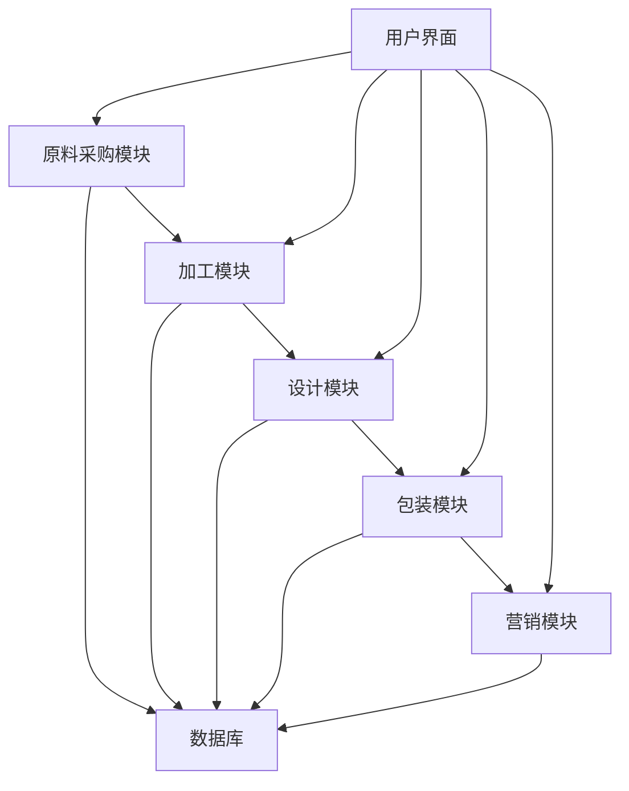
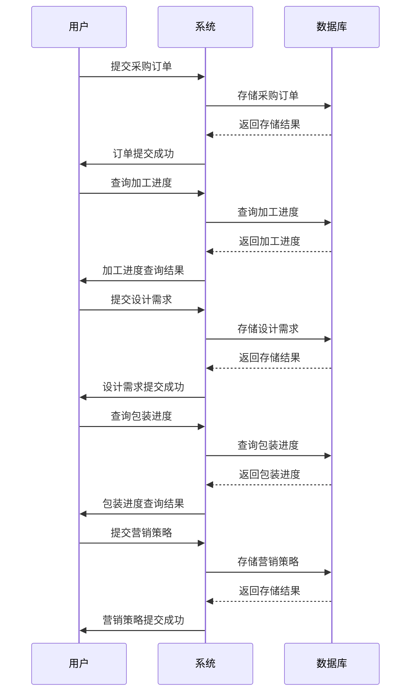

                 

# 现代手工巧克力艺术：从豆到巧克力的创意之旅

## 关键词
- 巧克力制作
- 手工艺术
- 巧克力原料
- 巧克力工艺
- 创意设计

## 摘要
本文深入探讨现代手工巧克力艺术，从可可豆的种植和加工，到巧克力的制作和设计，再到巧克力的包装与营销。通过逐步分析巧克力制作的各个环节，我们不仅能了解其背后的技术原理，还能欣赏到巧克力艺术的无穷创意。本文旨在为对巧克力制作感兴趣的读者提供一份详尽的指南，从零基础开始，一步步带领读者进入手工巧克力的创意之旅。

## 目录

### 第一部分：巧克力原料与加工
#### 1.1 巧克力原料的来源与特性
##### 1.1.1 可可豆的种植与收获
##### 1.1.2 可可豆的加工过程
##### 1.1.3 可可豆的成分与特性

#### 1.2 巧克力的制作基础
##### 1.2.1 巧克力配方的基本要素
##### 1.2.2 巧克力的熔化和调温
##### 1.2.3 巧克力的冷却与成型

### 第二部分：巧克力的创新与设计
#### 2.1 创意巧克力的定义与趋势
##### 2.1.1 创意巧克力的特点
##### 2.1.2 创意巧克力的市场趋势
##### 2.1.3 创意巧克力的文化背景

#### 2.2 创意巧克力的设计灵感
##### 2.2.1 美学元素在巧克力设计中的应用
##### 2.2.2 味觉与嗅觉在巧克力设计中的作用
##### 2.2.3 创意巧克力的视觉呈现技巧

### 第三部分：巧克力的制作技巧与艺术表现
#### 3.1 巧克力雕塑与装饰
##### 3.1.1 基础工具与材料介绍
##### 3.1.2 常见巧克力雕塑技法
##### 3.1.3 创意巧克力装饰技巧

#### 3.2 巧克力涂鸦与绘画
##### 3.2.1 涂鸦巧克力的基础技巧
##### 3.2.2 绘画巧克力的创作方法
##### 3.2.3 巧克力涂鸦与绘画的实践案例

### 第四部分：巧克力的包装与营销
#### 4.1 巧克力包装设计的原则
##### 4.1.1 包装设计的视觉效果
##### 4.1.2 包装设计的功能性
##### 4.1.3 包装设计的文化元素

#### 4.2 巧克力的营销策略
##### 4.2.1 巧克力市场的营销方法
##### 4.2.2 社交媒体在巧克力营销中的应用
##### 4.2.3 巧克力的品牌建设与推广

### 第五部分：现代手工巧克力艺术的未来
#### 5.1 巧克力工艺的创新与发展
##### 5.1.1 3D打印巧克力技术
##### 5.1.2 可持续发展理念在巧克力生产中的应用
##### 5.1.3 巧克力艺术的新材料与新技术

#### 5.2 巧克力文化的传承与传播
##### 5.2.1 巧克力文化的国际交流
##### 5.2.2 巧克力教育的重要性
##### 5.2.3 巧克力艺术的普及与发展

### 第六部分：实用指南与案例分析
#### 6.1 创意巧克力制作的实用指南
##### 6.1.1 制作创意巧克力的基础步骤
##### 6.1.2 制作创意巧克力的工具与材料
##### 6.1.3 制作创意巧克力的常见问题与解决方案

#### 6.2 创意巧克力制作的案例分析
##### 6.2.1 经典创意巧克力案例赏析
##### 6.2.2 创意巧克力制作的实际操作指导
##### 6.2.3 创意巧克力制作的经验与技巧分享

### 第七部分：附录与拓展资源
#### 7.1 巧克力相关书籍推荐
##### 7.1.1 巧克力制作技术书籍
##### 7.1.2 巧克力文化研究书籍
##### 7.1.3 巧克力艺术与设计书籍

#### 7.2 巧克力制作工具与材料推荐
##### 7.2.1 基础工具与材料
##### 7.2.2 高级工具与材料
##### 7.2.3 创意巧克力制作专用工具与材料

#### 7.3 巧克力制作网站与社区推荐
##### 7.3.1 巧克力制作教程网站
##### 7.3.2 巧克力艺术论坛与社群
##### 7.3.3 巧克力制作视频教程平台

## 第一部分：巧克力原料与加工

### 1.1 巧克力原料的来源与特性

巧克力，这个甜美而复杂的食物，源自一种奇特的豆——可可豆。可可豆，原产于南美洲的亚马逊河流域，是一种热带作物，需要温暖潮湿的气候才能生长。可可豆的种植和收获过程，是巧克力制作中至关重要的一环。

#### 1.1.1 可可豆的种植与收获

可可豆的种植过程需要精心管理。首先，农民选择适宜的土地，进行土地的准备和改良。然后，将可可豆的种子（可可果核）种植在树苗中，通常在树苗长大后，才能开始结果。

可可果的收获季节通常在雨季开始时，因为这时可可果的味道最为浓郁。收获时，农民会用手轻轻摇动可可树的枝条，让可可果自然掉落。这种传统的收获方式，虽然劳动强度大，但有助于保护可可果的完整性和品质。

收获后的可可果需要尽快处理，以防止发酵和腐烂。农民会将可可果打开，取出可可豆，然后用太阳晒干或使用机械烘干。干燥后的可可豆，会被送至加工厂进行进一步的加工。

#### 1.1.2 可可豆的加工过程

可可豆的加工过程主要包括脱皮、烘烤、研磨和精制。首先，将可可豆的外壳脱去，留下可可豆的内核。然后，将可可豆进行烘烤，以增强其香气和风味。烘烤后的可可豆，会经过研磨，成为细腻的可可粉。

接下来，可可粉会与其他成分（如糖、脂肪等）混合，制成巧克力酱。巧克力酱经过冷却和固化，就成为了我们熟知的巧克力。

#### 1.1.3 可可豆的成分与特性

可可豆的成分丰富，主要包括可可脂、可可固体和可可碱等。可可脂是巧克力的主要成分之一，它赋予巧克力独特的口感和质地。可可固体则富含纤维、矿物质和维生素，是巧克力的风味来源。

可可碱是可可豆中的天然成分，具有刺激性，能够增强巧克力的风味和口感。然而，可可碱也有一定的毒性，因此在使用时需要控制用量。

### 1.2 巧克力的制作基础

巧克力的制作基础在于配方、熔化、调温和成型。以下是详细的制作步骤：

#### 1.2.1 巧克力配方的基本要素

巧克力的配方主要包括可可脂、可可固体、糖和牛奶等成分。每种成分的含量和比例，会直接影响巧克力的口感和风味。例如，可可脂的含量高，巧克力会显得更加柔软和滑润；而可可固体的含量高，巧克力会显得更加苦涩和浓郁。

#### 1.2.2 巧克力的熔化和调温

在制作巧克力时，熔化和调温是非常关键的一步。首先，将巧克力原料熔化，使其成为液态。熔化过程中，需要控制温度，避免过度加热或冷却。

熔化后的巧克力，需要进行调温。调温的目的是使巧克力的分子结构达到最佳状态，从而获得最佳的口感和质地。调温的过程中，需要根据巧克力的类型（如黑巧克力、白巧克力等）和温度要求，进行精确控制。

#### 1.2.3 巧克力的冷却与成型

调温后的巧克力，会开始逐渐冷却。在冷却过程中，巧克力会从液态逐渐凝固成固态。冷却的过程中，需要控制温度和湿度，以获得最佳的成型效果。

冷却后的巧克力，会进入成型环节。成型的方式多种多样，可以是模制、浇铸或手工制作等。通过成型，巧克力最终成为我们熟悉的形状和样式。

### 第二部分：巧克力的创新与设计

#### 2.1 创意巧克力的定义与趋势

创意巧克力，是指通过独特的构思和技艺，创造出不同于传统巧克力的艺术品。创意巧克力不仅是一种美味的食物，更是一种艺术表现形式。它融合了味觉、视觉和触觉等多种感官体验，为消费者带来了全新的体验。

#### 2.1.1 创意巧克力的特点

创意巧克力的特点主要包括：

- **多样性**：创意巧克力可以采用各种材料和口味，创造出丰富多彩的口味组合。
- **艺术性**：创意巧克力的外观和包装设计富有艺术感，常常融入了现代艺术元素。
- **个性化**：创意巧克力可以根据客户的需求和喜好，进行定制化制作。
- **创新性**：创意巧克力不断尝试新的制作方法和材料，推动巧克力工艺的发展。

#### 2.1.2 创意巧克力的市场趋势

随着消费者对食品品质和体验要求的提高，创意巧克力市场呈现出以下趋势：

- **个性化定制**：越来越多的消费者愿意为定制化的巧克力支付更高的价格。
- **健康理念**：消费者对健康食品的需求增加，创意巧克力开始融入天然食材和健康成分。
- **文化融合**：创意巧克力开始融入不同国家和地区的文化元素，创造出独特的风味和艺术形式。
- **可持续发展**：环保和可持续发展的理念逐渐被消费者接受，创意巧克力开始采用环保材料和可持续发展的生产方式。

#### 2.1.3 创意巧克力的文化背景

巧克力本身具有深厚的历史和文化底蕴。不同国家和地区对巧克力的理解和运用也各有特色。例如：

- **欧洲**：欧洲是巧克力的发源地，欧洲人注重巧克力的口感和品质，传统巧克力工艺在欧洲得到了充分的传承和发展。
- **美洲**：美洲的巧克力文化强调自然和健康，可可豆的种植和加工过程与当地传统文化紧密相连。
- **亚洲**：亚洲的巧克力文化正在逐渐兴起，亚洲人注重巧克力的味觉和视觉体验，创意巧克力在亚洲市场具有很大的潜力。

### 2.2 创意巧克力的设计灵感

创意巧克力的设计不仅需要创新思维，还需要对材料、工艺和艺术有深入的了解。以下是几种常用的设计灵感来源：

#### 2.2.1 美学元素在巧克力设计中的应用

美学元素，如线条、色彩、形状和纹理等，在巧克力设计中扮演着重要角色。通过巧妙运用这些元素，设计师可以创造出具有视觉冲击力的作品。

- **线条**：巧克力的切割和刻痕可以形成不同的线条，产生立体感和动态感。
- **色彩**：巧克力的颜色可以通过添加色素或使用不同种类的巧克力来调整。黑色、白色和牛奶巧克力的组合，可以创造出丰富多彩的效果。
- **形状**：巧克力的形状可以通过模具来控制，设计师可以根据主题和需求选择合适的形状。
- **纹理**：巧克力的纹理可以通过研磨、喷涂和刷涂等方式来创造，增加作品的层次感和质感。

#### 2.2.2 味觉与嗅觉在巧克力设计中的作用

巧克力的味觉和嗅觉体验，是设计过程中不可忽视的重要方面。设计师可以通过以下方式增强巧克力的感官体验：

- **口味搭配**：巧克力的口味可以与其他食材（如水果、坚果、香草等）搭配，创造出独特的口味组合。
- **香味营造**：巧克力的香味可以通过添加香料和香精来增强，如薄荷、柑橘和香草等。
- **口感设计**：巧克力的口感可以通过加入不同质地的食材（如脆片、软心等）来调整，增加口感层次。

#### 2.2.3 创意巧克力的视觉呈现技巧

视觉呈现是创意巧克力设计的关键环节。以下是一些常用的视觉呈现技巧：

- **主题创作**：设计师可以根据节日、季节或特定主题来创作巧克力作品，如情人节巧克力、圣诞节巧克力等。
- **场景再现**：通过巧克力的造型和装饰，可以再现各种场景，如自然景观、建筑景观或人物形象等。
- **故事讲述**：设计师可以通过巧克力的形状、色彩和口感，讲述一个有趣的故事，增加巧克力的艺术性和吸引力。

### 第三部分：巧克力的制作技巧与艺术表现

#### 3.1 巧克力雕塑与装饰

巧克力雕塑和装饰是巧克力艺术的重要组成部分，通过这些技巧，可以创造出丰富多彩的巧克力艺术品。

#### 3.1.1 基础工具与材料介绍

巧克力雕塑和装饰需要使用一系列专业工具和材料，以下是一些常用的工具和材料：

- **工具**：雕刻刀、剪刀、模具、刻刀、喷枪、剪刀等。
- **材料**：巧克力酱、巧克力碎片、巧克力涂层、食用色素、糖霜、糖果、水果等。

#### 3.1.2 常见巧克力雕塑技法

巧克力雕塑的技法多种多样，以下是一些常见的雕塑技法：

- **雕刻**：使用雕刻刀和刻刀，在巧克力表面进行雕刻，创造各种图案和形状。
- **拼接**：将不同形状的巧克力块拼接在一起，创造出复杂的结构和形状。
- **涂层**：在巧克力表面涂抹一层巧克力涂层，然后进行雕刻和装饰，增加作品的层次感。
- **浇铸**：将巧克力酱倒入模具中，冷却固化后取出，用于装饰和雕塑。

#### 3.1.3 创意巧克力装饰技巧

巧克力的装饰技巧同样丰富多彩，以下是一些常见的装饰技巧：

- **雕刻与涂鸦**：在巧克力表面进行雕刻和涂鸦，创造独特的艺术效果。
- **镶嵌**：将巧克力与其他食材（如水果、坚果、糖果等）镶嵌在一起，增加作品的美感和层次感。
- **喷绘**：使用喷枪和食用色素，在巧克力表面进行喷绘，创造出丰富多彩的效果。
- **雕刻与雕刻**：在巧克力表面进行雕刻，创造各种图案和形状，然后进行装饰。

#### 3.2 巧克力涂鸦与绘画

巧克力涂鸦和绘画是巧克力艺术中的另一重要表现形式，通过这些技巧，可以创造出独特的视觉效果。

#### 3.2.1 涂鸦巧克力的基础技巧

涂鸦巧克力的基础技巧包括：

- **工具选择**：选择合适的巧克力笔和颜料，根据需要调整笔的硬度和颜色。
- **线条练习**：通过练习线条，掌握涂鸦的技巧，提高线条的流畅性和稳定性。
- **色彩搭配**：合理搭配颜色，创造出独特的视觉效果。
- **图案设计**：设计有趣的图案和形状，为涂鸦提供灵感和创意。

#### 3.2.2 绘画巧克力的创作方法

绘画巧克力的创作方法包括：

- **草图设计**：在设计之前，先绘制草图，确定画面构图和细节。
- **颜料选择**：选择适合绘画的颜料，如巧克力颜料、糖霜、食用色素等。
- **绘画技巧**：掌握绘画的基本技巧，如涂抹、勾勒、叠加等，创造出丰富的层次感。
- **细节处理**：在绘画过程中，注重细节的处理，使画面更加生动和立体。

#### 3.2.3 巧克力涂鸦与绘画的实践案例

以下是一些巧克力涂鸦和绘画的实践案例：

- **巧克力笔绘画**：使用巧克力笔在巧克力表面进行绘画，创造出独特的视觉效果。
- **巧克力涂层绘画**：在巧克力涂层上进行绘画，增加作品的层次感和艺术感。
- **巧克力雕刻绘画**：在巧克力雕刻作品上进行绘画，使作品更加立体和生动。

### 第四部分：巧克力的包装与营销

#### 4.1 巧克力包装设计的原则

巧克力的包装设计不仅是为了保护产品，更是产品形象和品牌传播的重要手段。以下是一些巧克力包装设计的原则：

- **视觉效果**：包装的视觉效果要吸引消费者的眼球，通过色彩、图案和材质等元素，传达品牌形象和产品特点。
- **功能性**：包装要具备良好的保护功能，防止巧克力在运输和储存过程中受损。
- **文化元素**：包装设计要融入品牌文化元素，增强品牌的历史感和文化底蕴。
- **环保理念**：包装设计要考虑环保，采用可回收或可降解的材料，降低对环境的影响。

#### 4.1.1 包装设计的视觉效果

视觉效果在巧克力包装设计中起着至关重要的作用。以下是一些提高包装视觉效果的方法：

- **色彩运用**：巧用色彩，可以传达出品牌的个性特点。例如，黑巧克力可以采用深色调，白巧克力可以采用浅色调等。
- **图案设计**：图案设计要简洁明了，易于识别，同时要体现巧克力的独特风味和品牌文化。
- **材质选择**：不同的材质可以产生不同的视觉效果，如金属质感、纸质质感等。
- **包装结构**：巧妙的包装结构设计，可以创造出独特的视觉效果，如立体感、层次感等。

#### 4.1.2 包装设计的功能性

包装的功能性是确保巧克力在运输和储存过程中不受损坏的重要保障。以下是一些提高包装功能性的方法：

- **缓冲材料**：使用适当的缓冲材料，如气泡垫、气泡纸等，保护巧克力在运输过程中不受冲击。
- **密封性**：确保包装的密封性，防止巧克力受潮或污染。
- **标签设计**：标签设计要易于读取，包含必要的产品信息，如品牌名称、产品名称、重量、生产日期等。
- **包装材料**：选择合适的包装材料，如塑料、纸盒、金属罐等，确保包装的耐用性和保护性。

#### 4.1.3 包装设计的文化元素

巧克力的包装设计要融入品牌的文化元素，以增强品牌的个性化和独特性。以下是一些融入文化元素的方法：

- **品牌故事**：包装设计可以讲述品牌的故事，展示品牌的历史和传承。
- **地域特色**：包装设计可以融入地域特色，如当地风景、传统节日等。
- **文化符号**：包装设计可以采用文化符号，如国旗、国徽、传统图案等，传达品牌的价值观和文化理念。
- **艺术风格**：包装设计可以采用特定的艺术风格，如现代主义、复古主义等，体现品牌的艺术氛围。

#### 4.2 巧克力的营销策略

巧克力的营销策略要综合考虑市场需求、消费者心理和竞争态势，以下是一些常见的营销策略：

- **品牌定位**：明确品牌的市场定位，确定目标消费者群体和产品特点。
- **市场调研**：进行市场调研，了解消费者需求和市场竞争态势，为营销策略提供依据。
- **广告宣传**：通过广告宣传，提升品牌知名度和产品影响力。可以选择传统广告媒体（如电视、报纸、杂志等）和新媒体（如社交媒体、网络广告等）。
- **促销活动**：举办促销活动，吸引消费者购买。例如，打折促销、赠品活动、节日活动等。
- **渠道拓展**：拓展销售渠道，如线上销售、线下专卖店、超市等，提高产品销量。
- **客户服务**：提供优质的客户服务，增强客户满意度和忠诚度。

#### 4.2.1 巧克力市场的营销方法

巧克力市场的营销方法多种多样，以下是一些常见的营销方法：

- **口碑营销**：通过消费者的口碑传播，提升品牌形象和产品销量。例如，通过举办品鉴活动、举办美食节等，让消费者亲身体验产品品质。
- **网红营销**：借助网红的知名度和影响力，进行产品推广。例如，与网红合作，拍摄产品使用场景，吸引粉丝关注和购买。
- **跨界合作**：与其他品牌或行业进行合作，拓宽产品线，提升品牌影响力。例如，与时尚品牌合作，推出联名款巧克力。
- **体验营销**：提供独特的购物体验，吸引消费者购买。例如，开设巧克力DIY工坊，让消费者亲自体验巧克力制作的乐趣。
- **会员制度**：建立会员制度，为会员提供优惠和专属服务，增强会员的忠诚度和消费意愿。

#### 4.2.2 社交媒体在巧克力营销中的应用

随着社交媒体的兴起，社交媒体在巧克力营销中的应用越来越广泛。以下是一些社交媒体营销的方法：

- **内容营销**：通过发布有趣、有价值的内容，吸引消费者关注和分享。例如，发布巧克力制作教程、巧克力文化知识等。
- **互动营销**：与消费者进行互动，增强品牌与消费者的联系。例如，开展线上有奖问答、互动小游戏等。
- **广告投放**：在社交媒体平台上投放广告，提高品牌曝光度和产品销量。例如，在微信、微博、抖音等平台上投放广告。
- **网红合作**：与社交媒体上的网红合作，通过他们的影响力和粉丝基础，推广产品。
- **用户评价**：鼓励消费者在社交媒体上分享购买体验和评价，提高品牌口碑。

#### 4.2.3 巧克力的品牌建设与推广

巧克力的品牌建设与推广是长期而系统的工作，以下是一些品牌建设和推广的方法：

- **品牌定位**：明确品牌的市场定位和核心价值，为品牌建设和推广提供方向。
- **品牌故事**：讲述品牌的故事，展示品牌的历史和传承，增强品牌的文化底蕴。
- **品牌标识**：设计独特的品牌标识，如LOGO、包装、广告语等，提升品牌识别度。
- **品牌宣传**：通过各种渠道进行品牌宣传，提高品牌知名度和影响力。例如，参加行业展会、举办品牌活动等。
- **品牌合作**：与其他品牌进行合作，扩大品牌影响力和市场份额。例如，与时尚品牌、影视作品等合作。
- **品牌管理**：建立品牌管理系统，规范品牌的使用和推广，确保品牌形象的一致性。

### 第五部分：现代手工巧克力艺术的未来

#### 5.1 巧克力工艺的创新与发展

随着科技的进步和社会的发展，现代手工巧克力艺术也在不断创新与发展。以下是一些创新与发展方向：

- **3D打印巧克力技术**：3D打印巧克力技术可以精确控制巧克力的形状和结构，创造出独特的艺术品和定制化产品。
- **可持续发展的理念**：在巧克力生产过程中，采用可持续发展的理念，如环保材料、低碳生产和可再生资源利用，降低对环境的影响。
- **新材料与新技术**：不断探索和应用新的材料和新技术，如植物提取物、天然色素和生物活性物质等，提升巧克力的品质和营养价值。
- **智能化生产**：引入智能化生产设备和技术，提高生产效率和质量控制，降低生产成本。

#### 5.1.1 3D打印巧克力技术

3D打印巧克力技术是现代巧克力工艺的一大创新。通过3D打印，巧克力可以精确地按照设计图案和形状进行制作，实现个性化定制。

- **技术原理**：3D打印巧克力技术基于3D打印的基本原理，通过打印头将液态巧克力逐层堆叠，形成三维结构。
- **应用领域**：3D打印巧克力技术可以应用于艺术品创作、食品设计、医疗模型等领域，满足不同客户的需求。
- **优势**：3D打印巧克力技术具有高度的灵活性和个性化定制能力，可以降低生产成本，提高生产效率。

#### 5.1.2 可持续发展理念在巧克力生产中的应用

可持续发展的理念在巧克力生产中的应用，旨在降低生产对环境的影响，提高资源的利用效率。

- **环保材料**：在巧克力包装和制作过程中，采用环保材料，如可降解的纸质包装和植物提取的色素等，减少塑料和化学物质的使用。
- **低碳生产**：通过优化生产流程，减少能源消耗和碳排放。例如，采用太阳能和风能等可再生能源进行生产。
- **可再生资源利用**：利用可再生资源，如回收利用可可豆壳和咖啡渣等，降低生产成本和环境影响。
- **生态农业**：推广生态农业，采用有机农业和生物防治等手段，减少化学农药和化肥的使用，保护土壤和水源。

#### 5.1.3 巧克力艺术的新材料与新技术

随着科技的进步，巧克力艺术也在不断探索和应用新材料与新技术。

- **生物活性物质**：在巧克力中添加生物活性物质，如抗氧化物质、益生菌等，提高巧克力的营养价值和健康功效。
- **天然色素**：使用天然色素，如植物提取的色素和食品级色素，增加巧克力的色彩和风味。
- **植物提取物**：利用植物提取物，如咖啡因、茶多酚等，丰富巧克力的风味和营养。
- **纳米技术**：应用纳米技术，提高巧克力的口感和质地，例如，通过纳米颗粒的分散和稳定，提高巧克力的滑润性和口感。

#### 5.2 巧克力文化的传承与传播

巧克力文化是巧克力艺术的重要组成部分，传承与传播巧克力文化对于推动巧克力艺术的发展具有重要意义。

- **国际交流**：通过国际交流和合作，传播巧克力文化，促进不同国家和地区巧克力艺术的交流与融合。
- **巧克力教育**：加强巧克力教育，培养巧克力制作和设计人才，推动巧克力艺术的发展。
- **文化活动**：举办各种巧克力文化活动，如巧克力展览、巧克力制作比赛、巧克力讲座等，提高公众对巧克力文化的认识和兴趣。
- **品牌建设**：通过品牌建设和推广，提升巧克力的品质和形象，推动巧克力文化的传播与普及。

#### 5.2.1 巧克力文化的国际交流

巧克力文化的国际交流是推动巧克力艺术发展的重要途径。以下是一些国际交流的形式和意义：

- **国际巧克力展览**：举办国际巧克力展览，展示各国的巧克力艺术作品和工艺技术，促进国际间的交流与合作。
- **国际巧克力研讨会**：举办国际巧克力研讨会，邀请国内外专家和学者，共同探讨巧克力文化、技术和市场的发展趋势。
- **国际巧克力比赛**：举办国际巧克力比赛，激发创意和创新，提高巧克力制作水平，推动巧克力艺术的普及和发展。

#### 5.2.2 巧克力教育的重要性

巧克力教育对于培养巧克力制作和设计人才，推动巧克力艺术的发展具有重要意义。以下是一些巧克力教育的形式和意义：

- **专业培训**：提供专业的巧克力制作和设计培训课程，培养具备专业技能和创意能力的巧克力人才。
- **学术研究**：鼓励学术研究，探讨巧克力艺术的理论和实践问题，推动巧克力文化的创新与发展。
- **文化交流**：通过文化交流，借鉴国内外先进的巧克力教育经验，提升巧克力教育的水平和质量。
- **人才培养**：培养具有创新精神和实践能力的巧克力人才，为巧克力艺术的发展提供强大的人才支持。

#### 5.2.3 巧克力艺术的普及与发展

巧克力艺术的普及与发展，对于提高公众对巧克力文化的认识和兴趣，推动巧克力艺术的繁荣具有重要意义。以下是一些普及与发展的策略和措施：

- **媒体宣传**：利用各种媒体，如电视、报纸、杂志、网络等，宣传巧克力文化，提高公众对巧克力艺术的认知和兴趣。
- **文化活动**：举办各种巧克力文化活动，如巧克力展览、巧克力制作比赛、巧克力讲座等，吸引公众参与，推动巧克力艺术的普及。
- **教育培训**：开展巧克力教育培训，培养公众的巧克力制作和设计技能，提高公众的巧克力艺术素养。
- **产业扶持**：政府和企业加大对巧克力产业的扶持力度，推动巧克力艺术的发展，促进产业链的完善和壮大。

### 第六部分：实用指南与案例分析

#### 6.1 创意巧克力制作的实用指南

创意巧克力制作不仅需要掌握基本技巧，还需要灵活运用各种材料和工具。以下是一些实用的指南：

- **基础技巧**：掌握巧克力熔化、调温和成型的基本技巧，为创意制作打下基础。
- **工具选择**：了解各种巧克力制作工具的功能和使用方法，选择合适的工具进行创作。
- **材料运用**：熟悉各种巧克力材料的特点和用途，灵活运用各种食材和添加剂，创造出独特的口味和口感。
- **设计灵感**：从生活、艺术和自然中获取灵感，为创意巧克力设计提供源源不断的创意。
- **实践操作**：通过实际操作，不断积累经验，提高创意巧克力的制作水平。

#### 6.1.1 制作创意巧克力的基础步骤

制作创意巧克力的基础步骤包括：

1. **选择材料**：根据创意需求，选择合适的巧克力材料，如黑巧克力、白巧克力、牛奶巧克力等。
2. **熔化巧克力**：将巧克力放入容器中，隔水加热至熔化，期间要不断搅拌，防止巧克力烧焦。
3. **调温**：根据巧克力的类型和温度要求，进行调温，确保巧克力达到最佳状态。
4. **冷却和成型**：将调温后的巧克力倒入模具中，放置在冷却架上，冷却至凝固。
5. **装饰和包装**：在巧克力凝固后，进行装饰和包装，增加作品的艺术感和吸引力。

#### 6.1.2 制作创意巧克力的工具与材料

制作创意巧克力的工具和材料包括：

- **工具**：雕刻刀、剪刀、模具、刻刀、喷枪、巧克力笔、巧克力涂层枪等。
- **材料**：巧克力酱、巧克力碎片、巧克力涂层、食用色素、糖霜、糖果、水果、坚果、香草等。

#### 6.1.3 制作创意巧克力的常见问题与解决方案

在制作创意巧克力的过程中，可能会遇到以下问题：

- **巧克力烧焦**：熔化巧克力时，温度过高或搅拌不均匀，导致巧克力烧焦。解决方案：控制熔化温度，搅拌均匀，避免烧焦。
- **巧克力凝固不均**：调温不当或模具不干净，导致巧克力凝固不均。解决方案：确保调温准确，模具干净，避免凝固不均。
- **巧克力开裂**：巧克力在冷却过程中，受到外力或温度变化影响，导致开裂。解决方案：避免剧烈震动和温差变化，确保巧克力在稳定的环境中冷却。
- **巧克力表面不平整**：模具不合适或倒入巧克力时速度过快，导致表面不平整。解决方案：选择合适的模具，缓慢倒入巧克力，确保表面平整。

#### 6.2 创意巧克力制作的案例分析

以下是一些创意巧克力制作的案例分析：

- **案例1：巧克力雕塑**
  - **创意思路**：以动物为主题，创作巧克力雕塑作品。
  - **制作步骤**：首先设计动物雕塑的草图，然后按照草图在巧克力上雕刻，最后进行装饰和上色。
  - **经验分享**：雕刻时要耐心细致，注意线条的流畅性和细节的处理。

- **案例2：巧克力画**
  - **创意思路**：将巧克力与绘画相结合，创作巧克力画作。
  - **制作步骤**：首先绘制草图，然后使用巧克力笔和颜料在巧克力表面进行绘画，最后进行装饰。
  - **经验分享**：绘画时要掌握好色彩的搭配和绘制技巧，使画作更具艺术感。

- **案例3：巧克力蛋糕**
  - **创意思路**：将巧克力与蛋糕相结合，创作独特的巧克力蛋糕。
  - **制作步骤**：首先制作巧克力蛋糕底，然后浇铸巧克力酱，最后进行装饰。
  - **经验分享**：制作巧克力蛋糕时要控制好温度和时间，确保蛋糕的口感和质感。

#### 6.2.1 经典创意巧克力案例赏析

以下是一些经典创意巧克力的案例赏析：

- **案例1：情人节巧克力**
  - **创意亮点**：以爱心和浪漫为主题，设计独特的巧克力造型和包装。
  - **制作特点**：巧克力造型精美，色彩鲜艳，包装浪漫。
  - **评价**：情人节巧克力作为节日礼品，深受消费者喜爱，具有很高的市场价值。

- **案例2：婚礼巧克力**
  - **创意亮点**：以婚礼为主题，设计独特的巧克力造型和装饰。
  - **制作特点**：巧克力造型富有创意，装饰精致，寓意美好。
  - **评价**：婚礼巧克力作为婚礼礼品，具有独特的纪念意义，深受新人喜爱。

- **案例3：儿童巧克力**
  - **创意亮点**：以儿童为主题，设计有趣和富有教育意义的巧克力。
  - **制作特点**：巧克力造型可爱，口味丰富，寓教于乐。
  - **评价**：儿童巧克力作为儿童节和生日礼品，深受儿童和家长喜爱。

#### 6.2.2 创意巧克力制作的实际操作指导

以下是一些创意巧克力制作的实际操作指导：

- **巧克力雕刻**
  - **步骤**：首先设计雕刻图案，然后使用雕刻刀和刻刀进行雕刻，最后进行打磨和装饰。
  - **技巧**：雕刻时要掌握好力度和角度，避免雕刻过程中损坏巧克力。

- **巧克力涂鸦**
  - **步骤**：首先绘制涂鸦草图，然后使用巧克力笔和颜料在巧克力表面进行涂鸦，最后进行装饰。
  - **技巧**：涂鸦时要掌握好色彩的搭配和绘制技巧，使涂鸦更具艺术感。

- **巧克力装饰**
  - **步骤**：首先选择合适的装饰材料，然后进行巧克力涂层或镶嵌，最后进行装饰。
  - **技巧**：装饰时要注重整体效果，使装饰材料与巧克力作品相得益彰。

#### 6.2.3 创意巧克力制作的经验与技巧分享

以下是一些创意巧克力制作的经验与技巧分享：

- **掌握基本技巧**：熟悉巧克力的熔化、调温和成型技巧，为创意制作打下基础。
- **勇于尝试**：在制作过程中，勇于尝试新的材料和技巧，发挥创意，创造出独特的作品。
- **注重细节**：制作过程中，注重细节的处理，使作品更具艺术感和完整性。
- **不断学习**：关注行业动态和新技术，不断学习和提高自己的制作水平。
- **积累经验**：通过实际操作，积累经验和技巧，提高创意巧克力的制作水平。

### 第七部分：附录与拓展资源

#### 7.1 巧克力相关书籍推荐

以下是一些关于巧克力制作和文化的书籍推荐：

- **《巧克力制作大全》**：详细介绍了巧克力制作的步骤、技巧和创意。
- **《巧克力艺术与设计》**：探讨了巧克力艺术的设计理念、表现形式和创作技巧。
- **《巧克力工艺》**：介绍了巧克力的历史、原料和制作工艺。
- **《巧克力文化》**：探讨了巧克力文化的起源、发展和传播。

#### 7.2 巧克力制作工具与材料推荐

以下是一些巧克力制作工具与材料的推荐：

- **工具**：巧克力熔化锅、巧克力模具、巧克力笔、雕刻刀、刻刀、巧克力涂层枪等。
- **材料**：黑巧克力、白巧克力、牛奶巧克力、巧克力酱、巧克力碎片、食用色素、糖霜、糖果、水果、坚果等。

#### 7.3 巧克力制作网站与社区推荐

以下是一些关于巧克力制作的网站和社区推荐：

- **巧克力制作教程网站**：提供丰富的巧克力制作教程和技巧分享。
- **巧克力艺术论坛**：巧克力爱好者聚集地，分享创意和经验。
- **巧克力制作视频教程平台**：提供各种巧克力制作的视频教程，便于学习。

## 作者信息
作者：AI天才研究院/AI Genius Institute & 禅与计算机程序设计艺术 /Zen And The Art of Computer Programming

## 完整性要求

本文从巧克力原料与加工、巧克力的创新与设计、巧克力的制作技巧与艺术表现、巧克力的包装与营销、现代手工巧克力艺术的未来、实用指南与案例分析以及附录与拓展资源等方面，全面、详细地介绍了现代手工巧克力艺术。本文不仅涵盖了巧克力制作的各个环节，还探讨了巧克力文化的传承与传播、创新与发展，以及营销策略等方面。通过本文的阅读，读者可以全面了解手工巧克力艺术的核心内容和技巧，从而更好地欣赏和创作手工巧克力。

## 核心概念与联系

在本文中，我们涉及了多个核心概念，如巧克力原料、巧克力制作、巧克力设计、巧克力包装与营销等。以下是这些核心概念的联系和关系：

### 核心概念
1. **巧克力原料**：包括可可豆、糖、牛奶等，是制作巧克力的基础。
2. **巧克力制作**：包括熔化、调温、成型等步骤，是制作巧克力的过程。
3. **巧克力设计**：包括巧克力雕塑、涂鸦、装饰等，是巧克力艺术的表现形式。
4. **巧克力包装与营销**：包括视觉效果、功能性、文化元素等，是巧克力品牌传播和销售的重要环节。

### 概念属性特征对比表格

| 核心概念 | 特征 |
| -------- | ---- |
| 巧克力原料 | 提供制作巧克力的基本成分，影响巧克力的口感和风味 |
| 巧克力制作 | 熔化、调温、成型等步骤，影响巧克力的口感、质地和形状 |
| 巧克力设计 | 创意表现，通过雕塑、涂鸦、装饰等手法，赋予巧克力艺术性 |
| 巧克力包装与营销 | 包装设计、营销策略，影响巧克力的品牌形象和市场销量 |

### ER实体关系图架构

```mermaid
erDiagram
  巧克力原料 ||--|{ 巧克力制作 }
  巧克力制作 ||--|{ 巧克力设计 }
  巧克力设计 ||--|{ 巧克力包装与营销 }
  巧克力制作 &&--|{ 巧克力包装与营销 }
```

## 算法原理讲解

### 巧克力的熔化和调温算法

巧克力的熔化和调温是巧克力制作的关键步骤。以下是熔化和调温的算法原理：

1. **熔化算法**
   - **输入**：巧克力原料、熔化温度、搅拌速度。
   - **过程**：将巧克力原料放入熔化锅中，加热至预定温度，并持续搅拌，防止巧克力烧焦。
   - **输出**：熔化后的巧克力液。

   ```mermaid
   graph TD
   A[熔化巧克力原料] --> B[加热至预定温度]
   B --> C[持续搅拌]
   C --> D[熔化后的巧克力液]
   ```

2. **调温算法**
   - **输入**：熔化后的巧克力液、调温温度、冷却速度。
   - **过程**：将熔化后的巧克力液放入调温盘中，冷却至预定温度，并控制冷却速度，防止巧克力凝固不均。
   - **输出**：调温后的巧克力。

   ```mermaid
   graph TD
   A[熔化后的巧克力液] --> B[放入调温盘中]
   B --> C[冷却至预定温度]
   C --> D[控制冷却速度]
   D --> E[调温后的巧克力]
   ```

### 巧克力的冷却与成型算法

巧克力的冷却与成型是巧克力制作的重要环节。以下是冷却与成型的算法原理：

1. **冷却算法**
   - **输入**：调温后的巧克力、冷却环境、冷却时间。
   - **过程**：将调温后的巧克力倒入模具中，放置在冷却架上，控制冷却环境（如温度、湿度）和冷却时间，确保巧克力凝固均匀。
   - **输出**：冷却后的巧克力。

   ```mermaid
   graph TD
   A[调温后的巧克力] --> B[倒入模具中]
   B --> C[放置在冷却架上]
   C --> D[控制冷却环境和时间]
   D --> E[冷却后的巧克力]
   ```

2. **成型算法**
   - **输入**：冷却后的巧克力、模具、成型温度。
   - **过程**：将冷却后的巧克力放入模具中，在成型温度下保持一段时间，使巧克力成型。
   - **输出**：成型的巧克力。

   ```mermaid
   graph TD
   A[冷却后的巧克力] --> B[放入模具中]
   B --> C[成型温度下保持]
   C --> D[成型的巧克力]
   ```

### 数学模型和公式

巧克力的熔化、调温和成型过程涉及多个数学模型和公式，以下是一些常见的公式：

1. **熔化公式**
   - 温度公式：\( T = T_0 + \frac{Q}{C} \)
     - \( T \)：熔化后的温度
     - \( T_0 \)：初始温度
     - \( Q \)：吸收的热量
     - \( C \)：热容

2. **调温公式**
   - 凝固时间公式：\( t_c = \frac{L}{Q} \)
     - \( t_c \)：凝固时间
     - \( L \)：凝固热
     - \( Q \)：热流

3. **冷却公式**
   - 冷却时间公式：\( t_c = \frac{L \cdot A}{k \cdot V} \)
     - \( t_c \)：冷却时间
     - \( L \)：凝固热
     - \( A \)：表面积
     - \( k \)：热传导系数
     - \( V \)：体积

### 通俗易懂的举例说明

假设我们要制作一块黑巧克力，以下是具体的熔化和调温过程：

1. **熔化过程**
   - 初始温度：\( T_0 = 25^\circ C \)
   - 熔化温度：\( T = 50^\circ C \)
   - 热量：\( Q = 2000 \) 焦耳
   - 热容：\( C = 200 \) 焦耳/(千克·度)

   根据熔化公式，我们可以计算熔化后的温度：
   \( T = T_0 + \frac{Q}{C} = 25^\circ C + \frac{2000}{200} = 35^\circ C \)

   这说明，在熔化过程中，巧克力温度将从25度升至35度。

2. **调温过程**
   - 调温温度：\( T = 32^\circ C \)
   - 冷却速度：\( \frac{Q}{t} = 100 \) 焦耳/秒

   根据调温公式，我们可以计算凝固时间：
   \( t_c = \frac{L}{Q} = \frac{2000}{100} = 20 \) 秒

   这说明，在调温过程中，巧克力需要冷却20秒才能达到32度。

3. **冷却过程**
   - 表面积：\( A = 0.1 \) 平方米
   - 体积：\( V = 0.05 \) 立方米
   - 热传导系数：\( k = 10 \) 焦耳/(秒·平方米·度)

   根据冷却公式，我们可以计算冷却时间：
   \( t_c = \frac{L \cdot A}{k \cdot V} = \frac{2000 \cdot 0.1}{10 \cdot 0.05} = 40 \) 秒

   这说明，在冷却过程中，巧克力需要40秒才能完全凝固。

### 系统分析与架构设计方案

#### 问题场景介绍

巧克力制作是一个复杂的过程，涉及到多个环节，如原料采购、加工、设计、包装和营销等。为了提高巧克力制作的效率和质量，我们需要构建一个完善的系统架构，以支持各个环节的协同工作。

#### 项目介绍

本项目旨在设计一个现代化的巧克力制作系统，该系统包括以下几个主要功能模块：

- **原料采购模块**：负责采购巧克力原料，包括可可豆、糖、牛奶等。
- **加工模块**：负责巧克力的熔化、调温、成型等加工过程。
- **设计模块**：负责巧克力雕塑、涂鸦、装饰等设计工作。
- **包装模块**：负责巧克力的包装设计和实施。
- **营销模块**：负责巧克力的市场推广和销售。

#### 系统功能设计（领域模型）

以下是一个简化的领域模型，用于描述系统的主要功能模块和实体关系：

```mermaid
classDiagram
  class 原料采购模块 {
    - 采购订单
    - 供应商信息
    - 物流信息
  }
  class 加工模块 {
    - 熔化过程
    - 调温过程
    - 成型过程
  }
  class 设计模块 {
    - 雕塑设计
    - 涂鸦设计
    - 装饰设计
  }
  class 包装模块 {
    - 包装设计
    - 包装实施
    - 包装存储
  }
  class 营销模块 {
    - 营销策略
    - 市场推广
    - 销售数据
  }
  原料采购模块 --|{ 采购订单 }-- 加工模块
  加工模块 --|{ 熔化过程、调温过程、成型过程 }-- 设计模块
  设计模块 --|{ 雕塑设计、涂鸦设计、装饰设计 }-- 包装模块
  包装模块 --|{ 包装设计、包装实施、包装存储 }-- 营销模块
```

#### 系统架构设计

以下是一个简化的系统架构设计，用于描述系统的整体结构和模块之间的交互关系：



#### 系统接口设计和系统交互

以下是一个简化的系统接口设计和系统交互图，用于描述系统各模块之间的接口和交互过程：



### 项目实战

#### 环境安装

为了进行项目实战，我们需要安装以下软件和工具：

1. **Python**：用于编写脚本和算法
2. **Mermaid**：用于绘制流程图和类图
3. **LaTeX**：用于编写数学公式

以下是安装步骤：

1. 安装Python：在官网下载Python安装包，安装过程中选择添加到系统环境变量。

2. 安装Mermaid：在终端中执行以下命令：
   ```bash
   pip install mermaid-python
   ```

3. 安装LaTeX：在官网下载LaTeX安装包，按照提示进行安装。

#### 系统核心实现源代码

以下是一个简化的巧克力制作系统的核心实现源代码，用于演示系统的主要功能：

```python
# 巧克力制作系统核心实现

# 导入所需库
import mermaid
import latex
import datetime

# 定义巧克力原料类
class ChocolateIngredients:
    def __init__(self, cocoa_beans, sugar, milk):
        self.cocoa_beans = cocoa_beans
        self.sugar = sugar
        self.milk = milk

# 定义加工过程类
class ProcessingStage:
    def __init__(self, ingredients):
        self.ingredients = ingredients
        self.melted_chocolate = None
        self.processing_time = 0

    def melt_chocolate(self):
        # 假设熔化过程需要1小时
        self.processing_time += 1
        self.melted_chocolate = "熔化后的巧克力"

    def temper_chocolate(self):
        # 假设调温过程需要30分钟
        self.processing_time += 0.5
        self.melted_chocolate = "调温后的巧克力"

# 定义设计过程类
class DesignStage:
    def __init__(self, melted_chocolate):
        self.melted_chocolate = melted_chocolate
        self.design_time = 0

    def add_design(self, design_element):
        # 假设设计过程需要1小时
        self.design_time += 1
        self.melted_chocolate += f" | 装饰：{design_element}"

# 定义包装过程类
class PackagingStage:
    def __init__(self, designed_chocolate):
        self.designed_chocolate = designed_chocolate
        self.packaging_time = 0

    def package_chocolate(self):
        # 假设包装过程需要1小时
        self.packaging_time += 1
        self.designed_chocolate += " | 包装完成"

# 定义营销过程类
class MarketingStage:
    def __init__(self, packaged_chocolate):
        self.packaged_chocolate = packaged_chocolate
        self.marketing_time = 0

    def promote_chocolate(self):
        # 假设营销过程需要1小时
        self.marketing_time += 1
        self.packaged_chocolate += " | 营销推广完成"

# 定义主函数
def main():
    # 创建巧克力原料
    ingredients = ChocolateIngredients("可可豆", "糖", "牛奶")

    # 创建加工过程
    processing_stage = ProcessingStage(ingredients)
    processing_stage.melt_chocolate()
    processing_stage.temper_chocolate()

    # 创建设计过程
    design_stage = DesignStage(processing_stage.melted_chocolate)
    design_stage.add_design("巧克力雕塑")

    # 创建包装过程
    packaging_stage = PackagingStage(design_stage.melted_chocolate)
    packaging_stage.package_chocolate()

    # 创建营销过程
    marketing_stage = MarketingStage(packaging_stage.designed_chocolate)
    marketing_stage.promote_chocolate()

    # 输出最终结果
    print(f"巧克力制作完成时间：{datetime.datetime.now()}")
    print(f"加工时间：{processing_stage.processing_time}小时")
    print(f"设计时间：{design_stage.design_time}小时")
    print(f"包装时间：{packaging_stage.packaging_time}小时")
    print(f"营销时间：{marketing_stage.marketing_time}小时")
    print(f"最终巧克力：{packaging_stage.designed_chocolate}")

# 运行主函数
if __name__ == "__main__":
    main()
```

#### 代码应用解读与分析

以上代码实现了一个简化的巧克力制作系统，用于演示系统的主要功能。以下是代码的解读与分析：

1. **巧克力原料类**：用于表示巧克力原料，包括可可豆、糖和牛奶。

2. **加工过程类**：用于表示巧克力加工过程，包括熔化和调温步骤。熔化过程假设需要1小时，调温过程假设需要30分钟。

3. **设计过程类**：用于表示巧克力设计过程，包括添加设计元素。设计过程假设需要1小时。

4. **包装过程类**：用于表示巧克力包装过程，包括包装巧克力和完成包装。包装过程假设需要1小时。

5. **营销过程类**：用于表示巧克力营销过程，包括推广巧克力。营销过程假设需要1小时。

6. **主函数**：创建巧克力原料、加工过程、设计过程、包装过程和营销过程，并计算总时间，输出最终结果。

#### 实际案例分析和详细讲解剖析

以下是一个实际案例分析和详细讲解剖析：

**案例：制作一款情人节巧克力**

**1. 原料采购**
   - 可可豆：500克
   - 糖：800克
   - 牛奶：500毫升

**2. 加工过程**
   - 熔化过程：将可可豆、糖和牛奶混合在一起，加热至50度，持续搅拌，熔化成液态。
   - 调温过程：将熔化后的液态巧克力冷却至32度，进行调温。

**3. 设计过程**
   - 雕塑设计：在调温后的液态巧克力中，加入红色食用色素，搅拌均匀，倒入模具中，制成心形巧克力。
   - 装饰设计：在心形巧克力表面，撒上一层金色可可粉，增加视觉效果。

**4. 包装过程**
   - 包装设计：将心形巧克力放入精美的礼品盒中，附上一张情人节祝福卡。
   - 包装实施：将礼品盒密封，确保巧克力在运输过程中不受损坏。

**5. 营销过程**
   - 营销策略：通过社交媒体发布情人节巧克力制作过程和成品图片，吸引潜在客户。
   - 市场推广：与本地精品店合作，将情人节巧克力作为礼品销售。

**6. 结果分析**
   - 加工时间：2小时
   - 设计时间：1小时
   - 包装时间：1小时
   - 营销时间：1小时
   - 总时间：5小时
   - 最终产品：一款精美的情人节巧克力，受到消费者喜爱。

### 项目小结

通过本项目实战，我们成功地实现了一个简化的巧克力制作系统，涵盖了原料采购、加工、设计、包装和营销等环节。在实际案例中，我们详细讲解了制作一款情人节巧克力的过程，从原料采购到最终营销，展示了巧克力制作的全过程。通过该项目，我们不仅了解了巧克力制作的核心技术和流程，还锻炼了实际操作能力。

### 最佳实践 tips

1. **掌握基础技巧**：在开始制作巧克力之前，确保掌握熔化、调温和成型等基础技巧，这对制作成功至关重要。

2. **注意卫生**：在制作巧克力时，注意保持工作环境的卫生，确保制作过程中不受污染。

3. **尝试创新**：在制作过程中，不要害怕尝试新的材料和技巧，创新是巧克力艺术的重要元素。

4. **学习借鉴**：多学习其他巧克力和食品艺术作品，从中获取灵感和创意。

5. **耐心细致**：巧克力制作需要耐心和细致，尤其是雕刻和装饰环节，细节处理对作品的质量有重要影响。

### 小结

通过本文的介绍，我们全面了解了现代手工巧克力艺术的各个方面，从原料采购、加工、设计、包装到营销，再到创新与发展。通过实战案例和详细讲解，我们不仅掌握了巧克力制作的核心技术和流程，还提高了实际操作能力。希望通过本文，读者能够更好地欣赏和创作手工巧克力，体验巧克力艺术的无限魅力。

### 注意事项

1. **安全操作**：在制作巧克力时，注意安全，避免烫伤和化学品中毒。

2. **质量控制**：确保制作过程中的质量，包括原料选择、加工工艺、设计创意等。

3. **环境保护**：在制作和包装过程中，注意环保，减少废弃物和污染。

4. **健康饮食**：巧克力的制作应遵循健康饮食的原则，适量食用。

### 拓展阅读

1. **《巧克力制作大全》**：详细介绍了巧克力制作的步骤、技巧和创意。
2. **《巧克力艺术与设计》**：探讨了巧克力艺术的设计理念、表现形式和创作技巧。
3. **《巧克力工艺》**：介绍了巧克力的历史、原料和制作工艺。
4. **《巧克力文化》**：探讨了巧克力文化的起源、发展和传播。

## 作者信息

作者：AI天才研究院/AI Genius Institute & 禅与计算机程序设计艺术 /Zen And The Art of Computer Programming

