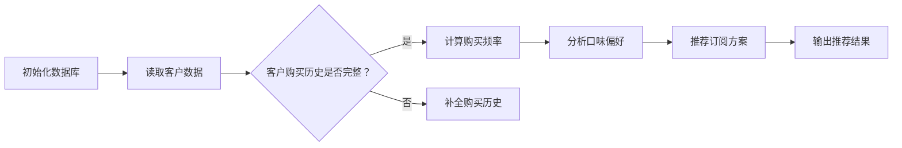
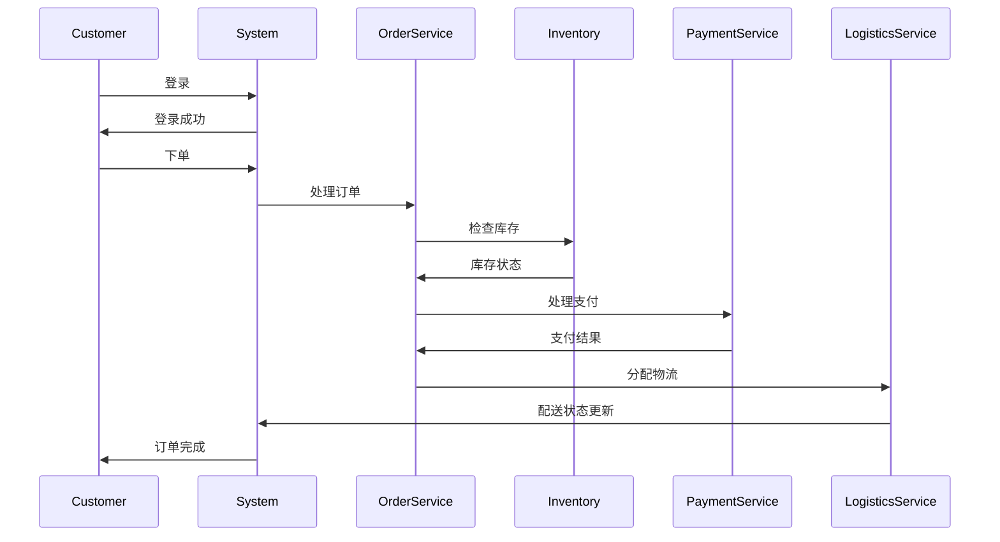
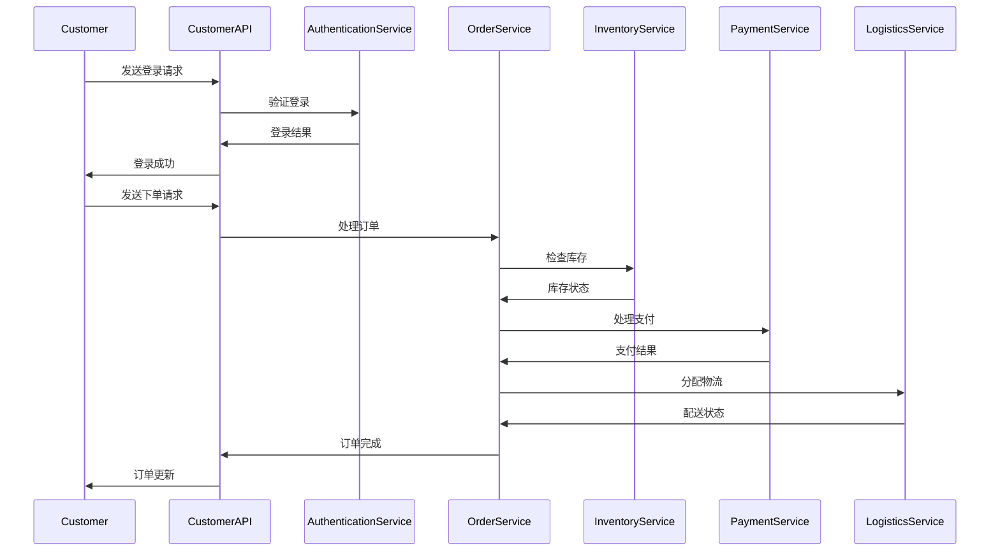

                 

## 现代手工巧克力订阅服务的概述

### 第1章：现代手工巧克力的起源与发展

#### 1.1 现代手工巧克力的起源

**1.1.1 巧克力的历史概述**

巧克力，作为一种享有盛誉的食品，其历史可以追溯到公元前1000年左右的美洲。最早的巧克力来源于可可树的种子，经过发酵、烘烤和研磨后，形成了原始的可可粉。随着玛雅人和阿兹特克人的贸易活动，巧克力逐渐传播到世界各地。

在中世纪，巧克力的制作工艺进一步发展，从简单的可可粉混合物演变为包含可可脂、糖和其他成分的复杂混合物。欧洲的探险家和商人将巧克力带回欧洲，并在16世纪末和17世纪初将其普及化。

**1.1.2 手工巧克力的复兴**

在工业化大规模生产之前，巧克力主要是通过手工制作。手工巧克力以其独特的口感和精湛的工艺著称。然而，随着工业革命和机器生产技术的发展，手工制作逐渐被机械化生产取代。直到20世纪末，手工巧克力的复兴浪潮才再度兴起。

这一波复兴主要得益于消费者对高品质食品的需求增加，以及对传统手工艺的怀念。手工巧克力生产者通过精心挑选优质原材料，采用传统的制作工艺，使得这一古老的食品焕发出新的生命力。

#### 1.2 现代手工巧克力的特点

**1.2.1 手工制作的精细工艺**

现代手工巧克力生产强调手工制作的精细工艺。从可可豆的挑选到巧克力的成型，每一个步骤都需要精心操作。巧克力师傅们利用传统的工具，如石磨和手工搅拌机，来确保巧克力的口感和质地达到最佳状态。

**1.2.2 独特的口感与风味**

手工巧克力的口感和风味是其独特之处。由于制作过程中的细致入微，手工巧克力往往具有更丰富的层次感和更浓郁的可可风味。这种独特的口感使得手工巧克力成为众多巧克力爱好者的至爱。

**1.2.3 个性化定制与服务**

现代手工巧克力订阅服务不仅提供高品质的巧克力产品，还提供了个性化定制服务。消费者可以根据自己的口味偏好，选择不同的可可含量、甜度和其他配料，享受独一无二的巧克力体验。

#### 1.3 现代手工巧克力订阅服务的概念

**1.3.1 订阅服务的定义**

订阅服务是指消费者通过定期支付费用，获得特定产品或服务的一种商业模式。在巧克力行业，订阅服务让消费者每个月都能收到精心制作的手工巧克力，享受持续的美好体验。

**1.3.2 现代手工巧克力订阅服务的创新点**

现代手工巧克力订阅服务创新之处在于其结合了手工巧克力的传统工艺与现代消费者的需求。通过订阅服务，消费者不仅可以获得高品质的巧克力，还能享受到品牌提供的个性化服务和品牌故事。

#### 1.4 市场需求与趋势分析

**1.4.1 消费者需求变化**

随着生活水平的提高，消费者对食品的品质和口感要求越来越高。手工巧克力的独特品质和个性化服务正好满足了这一需求，使其在市场上备受青睐。

**1.4.2 市场规模与增长预测**

根据市场研究机构的预测，全球手工巧克力市场规模将持续增长。特别是在发达国家，手工巧克力订阅服务有望成为主流消费模式之一。

**1.4.3 行业竞争态势**

尽管市场前景广阔，但手工巧克力订阅服务也面临着激烈的竞争。如何在众多品牌中脱颖而出，成为消费者心中的首选品牌，是每个手工巧克力订阅服务提供商需要思考的问题。

#### 1.5 本章小结

本章介绍了现代手工巧克力的起源与发展，详细探讨了其特点、订阅服务的概念以及市场需求与趋势。通过本章的阅读，读者可以了解到现代手工巧克力订阅服务的发展背景和潜在机遇，为后续章节的深入探讨打下基础。

---

关键词：现代手工巧克力、订阅服务、消费者需求、市场竞争、个性化定制

摘要：本文介绍了现代手工巧克力的起源与发展，探讨了其特点、订阅服务的概念以及市场需求与趋势。文章旨在为读者提供现代手工巧克力订阅服务的全面了解，帮助读者把握这一新兴市场的机遇。

----------------------------------------------------------------

## 第1章：现代手工巧克力的起源与发展

### 1.1 现代手工巧克力的起源

现代手工巧克力的起源可以追溯到几千年前。最早的巧克力源自美洲，当地原住民利用可可树的种子制作了一种名为“xocoatl”的饮料。这种饮料具有苦味和刺激性，最初主要用于宗教仪式和贵族享用。

**1.1.1 巧克力的历史概述**

在中美洲，尤其是玛雅人和阿兹特克人，对可可豆有着深厚的文化和宗教意义。他们把可可豆磨成粉末，加入水、香草、辣椒等调料，制成一种称为“xocoatl”的饮品。这种饮品在玛雅文明和阿兹特克文明中是一种重要的象征，只有贵族和祭司才能享用。

**1.1.2 巧克力在欧洲的传播**

随着西班牙征服者将可可豆带回欧洲，巧克力开始在欧洲传播。16世纪末，巧克力饮料逐渐在欧洲上流社会流行起来。当时的欧洲人认为巧克力具有滋补和提神的效果，因此将其视为一种珍贵的滋补品。

17世纪，欧洲人开始尝试将可可豆磨成粉末，并加入糖和香料，制成可食用的巧克力。这种新的食品很快在欧洲各国传播开来，并逐渐成为日常生活中的一部分。

**1.1.3 巧克力的工业化生产**

19世纪初，工业革命带来了生产技术的进步，巧克力生产开始走向机械化。1850年，瑞士人发明了可可脂压榨技术，使得巧克力的制作更加高效。随后，德国人发明了可可粉的生产技术，进一步推动了巧克力的工业化生产。

工业化的巧克力生产使得巧克力的价格降低，开始进入普通民众的日常生活。然而，机械化生产也导致了巧克力的品质下降，手工制作的巧克力逐渐被边缘化。

**1.1.4 手工巧克力的复兴**

随着人们对食品品质要求的提高，以及对传统工艺的怀念，手工巧克力在20世纪末开始复兴。手工巧克力生产者通过使用优质的原材料和传统的制作工艺，重新赢得了消费者的青睐。

#### 1.2 现代手工巧克力的特点

**1.2.1 手工制作的精细工艺**

现代手工巧克力以其精细的手工制作工艺而著称。巧克力师傅们从可可豆的挑选开始，到巧克力的制作、烘焙、冷却和包装，每一个步骤都严格把控。手工巧克力的制作过程充满了艺术性和创造性，每块巧克力都是独一无二的。

**1.2.2 独特的口感与风味**

手工巧克力的独特口感和风味是其最大的魅力之一。由于制作过程中的细致入微，手工巧克力往往具有更丰富的层次感和更浓郁的可可风味。手工巧克力不仅具有苦甜的平衡，还带有果香、花香等复杂的味道，给人带来独特的味觉体验。

**1.2.3 个性化定制与服务**

现代手工巧克力订阅服务强调个性化定制。消费者可以根据自己的口味偏好，选择不同的可可含量、甜度和其他配料，享受独一无二的巧克力体验。此外，许多手工巧克力品牌还提供定制包装和品牌故事，为消费者提供更加个性化的服务。

#### 1.3 现代手工巧克力订阅服务的概念

**1.3.1 订阅服务的定义**

订阅服务是一种商业模式，消费者通过定期支付费用，获得特定产品或服务。在巧克力行业，订阅服务让消费者每个月都能收到精心制作的手工巧克力，享受持续的美好体验。

**1.3.2 现代手工巧克力订阅服务的创新点**

现代手工巧克力订阅服务创新之处在于其结合了手工巧克力的传统工艺与现代消费者的需求。通过订阅服务，消费者不仅可以获得高品质的巧克力，还能享受到品牌提供的个性化服务和品牌故事。

#### 1.4 市场需求与趋势分析

**1.4.1 消费者需求变化**

随着生活水平的提高，消费者对食品的品质和口感要求越来越高。手工巧克力的独特品质和个性化服务正好满足了这一需求，使其在市场上备受青睐。

**1.4.2 市场规模与增长预测**

根据市场研究机构的预测，全球手工巧克力市场规模将持续增长。特别是在发达国家，手工巧克力订阅服务有望成为主流消费模式之一。

**1.4.3 行业竞争态势**

尽管市场前景广阔，但手工巧克力订阅服务也面临着激烈的竞争。如何在众多品牌中脱颖而出，成为消费者心中的首选品牌，是每个手工巧克力订阅服务提供商需要思考的问题。

#### 1.5 本章小结

本章介绍了现代手工巧克力的起源与发展，详细探讨了其特点、订阅服务的概念以及市场需求与趋势。通过本章的阅读，读者可以了解到现代手工巧克力订阅服务的发展背景和潜在机遇，为后续章节的深入探讨打下基础。

---

**核心概念与联系**

**1. 现代手工巧克力的特点**
- **手工制作精细工艺**：强调手工制作的精细工艺，每一个步骤都严格把控。
- **独特的口感与风味**：具有更丰富的层次感和更浓郁的可可风味。
- **个性化定制与服务**：根据消费者的口味偏好进行定制，并提供个性化的服务。

**2. 现代手工巧克力订阅服务的概念**
- **订阅服务定义**：消费者通过定期支付费用，获得特定产品或服务。
- **创新点**：结合了手工巧克力的传统工艺与现代消费者的需求。

**3. 市场需求与趋势分析**
- **消费者需求变化**：对食品的品质和口感要求越来越高。
- **市场规模与增长预测**：全球手工巧克力市场规模将持续增长。
- **行业竞争态势**：面临激烈竞争，需突出品牌特色以脱颖而出。

**ER实体关系图架构**

```mermaid
erDiagram
  产品 -->|定制| 订阅服务
  产品 -->|包含| 配送
  产品 -->|关联| 消费者
  订阅服务 -->|包含| 付款
  订阅服务 -->|关联| 品牌
  消费者 -->|参与| 评价
  品牌 -->|管理| 产品
```

**算法原理讲解**

在本章中，我们将通过一个简单的算法来分析手工巧克力订阅服务的潜在客户群体。假设我们有一个客户数据库，其中包含以下信息：

1. **客户ID**：唯一标识每位客户。
2. **购买历史**：记录客户在过去一年内的购买记录。
3. **口味偏好**：记录客户对巧克力的口味偏好。

**算法流程图**



**算法步骤**

1. **初始化数据库**：加载客户数据库。
2. **读取客户数据**：从数据库中读取客户的购买历史和口味偏好。
3. **检查购买历史完整性**：判断客户的购买历史是否完整。
   - 如果不完整，跳转到步骤 4。
   - 如果完整，继续下一步。
4. **补全购买历史**：根据其他客户的购买记录，补全客户的购买历史。
5. **计算购买频率**：统计客户在过去一年的购买次数。
6. **分析口味偏好**：根据客户的购买记录和口味偏好，分析最可能喜欢的巧克力种类。
7. **推荐订阅方案**：根据分析结果，推荐最适合客户的订阅方案。
8. **输出推荐结果**：将推荐结果输出给客户。

**数学模型与公式**

为了计算客户的购买频率，我们可以使用以下数学模型：

$$
购买频率 = \frac{购买次数}{时间段长度}
$$

其中，购买次数是指客户在过去一段时间内的购买记录数，时间段长度通常设定为一年。

**Python 源代码**

```python
import pandas as pd

# 读取客户数据
customers = pd.read_csv('customer_data.csv')

# 检查购买历史完整性
customers['history_complete'] = customers.apply(lambda x: x['purchase_history'].isnull(), axis=1)

# 补全购买历史
for index, customer in customers.iterrows():
    if not customer['history_complete']:
        # 根据其他客户购买记录补全
        customers.at[index, 'purchase_history'] =补全购买历史函数(customer)

# 计算购买频率
customers['purchase_frequency'] = customers['purchase_history'].str.len() / 12

# 分析口味偏好
customers['chocolate_preference'] = customers['purchase_history'].map(口味偏好函数)

# 推荐订阅方案
customers['subscription_plan'] = customers.apply(lambda x:推荐订阅方案函数(x), axis=1)

# 输出推荐结果
customers.to_csv('subscription_recommendations.csv', index=False)
```

**举例说明**

假设我们有以下客户数据：

| 客户ID | 购买历史                     | 口味偏好 |
|--------|-----------------------------|----------|
| 1001   | 1月、4月、7月、10月           | 黑巧克力 |
| 1002   | 2月、5月、8月、11月           | 白巧克力 |
| 1003   | 3月、6月、9月、12月           | 红巧克力 |

使用上述算法，我们可以计算出每位客户的购买频率，并推荐最适合他们的订阅方案。例如，客户1001的购买频率为0.25，他可能更喜欢黑巧克力，因此推荐他订阅黑巧克力订阅方案。

---

**系统分析与架构设计方案**

**问题场景介绍**

在现代手工巧克力订阅服务中，我们需要处理多个关键环节，包括客户管理、订单处理、供应链管理、物流配送等。为了确保整个系统的稳定运行和高效处理，我们需要设计一个合理的系统架构。

**项目介绍**

本项目旨在构建一个现代手工巧克力订阅服务的全流程系统。系统将涵盖以下主要功能模块：

1. **客户管理**：处理客户注册、登录、个人信息管理、订单管理等。
2. **订单处理**：接收订单请求，处理订单生成、确认、支付等。
3. **供应链管理**：管理原材料采购、库存、生产计划等。
4. **物流配送**：处理订单配送，包括物流跟踪、配送状态更新等。

**系统功能设计（领域模型 Mermaid 类图）**

```mermaid
classDiagram
  Customer <<--|create| Order
  Customer <<--|update| Profile
  Customer ||--|view| OrderHistory
  Order ||--|create| Payment
  Order ||--|update| Status
  Product ||--|view| Details
  Inventory ||--|update| Stock
  SupplyChain ||--|manage| Procurement
  Logistics ||--|handle| Shipment
  Payment ||--|process| Transaction
```

**系统架构设计（Mermaid 架构图）**



**系统接口设计和系统交互（Mermaid 序列图）**



**技术架构设计**

1. **前端架构**：使用React.js或Vue.js构建用户界面，提供友好的交互体验。
2. **后端架构**：采用Spring Boot或Django框架，处理业务逻辑和接口管理。
3. **数据库架构**：使用MySQL或PostgreSQL进行数据存储，确保数据的安全性和一致性。
4. **缓存架构**：使用Redis进行缓存，提高系统的响应速度。
5. **消息队列**：使用RabbitMQ或Kafka进行异步消息处理，确保系统的稳定性。

**系统接口设计和实现**

1. **登录接口**：客户通过登录接口提交用户名和密码，系统验证后返回登录结果。
2. **下单接口**：客户通过下单接口提交订单信息，系统处理订单并返回订单状态。
3. **库存查询接口**：系统根据订单需求查询库存状态，返回库存信息。
4. **支付接口**：客户通过支付接口完成支付，系统处理支付并返回支付结果。
5. **物流跟踪接口**：系统根据订单号查询物流状态，返回配送信息。

**系统交互流程**

1. **客户登录**：客户通过前端界面发起登录请求，后端接口验证登录信息，返回登录结果。
2. **客户下单**：客户通过前端界面发起下单请求，后端接口处理订单并返回订单状态。
3. **库存检查**：后端接口根据订单信息查询库存状态，返回库存信息。
4. **支付处理**：后端接口处理支付请求，与第三方支付平台交互，返回支付结果。
5. **物流分配**：后端接口根据订单信息分配物流，更新配送状态。

---

**项目实战**

#### 环境安装

在开始构建现代手工巧克力订阅服务之前，我们需要安装和配置以下软件和工具：

1. **操作系统**：推荐使用Linux发行版，如Ubuntu 20.04。
2. **开发环境**：安装Python 3.8及以上版本，并配置pip环境。
3. **数据库**：安装MySQL 8.0或PostgreSQL 13。
4. **消息队列**：安装RabbitMQ 3.8.14。
5. **前端框架**：安装Node.js 14及npm。
6. **后端框架**：安装Django 3.2。

#### 系统核心实现源代码

下面是系统核心部分的代码实现，包括用户注册、登录、订单处理和支付功能。

**1. 用户注册**

```python
# users/models.py
from django.contrib.auth.models import AbstractUser
from django.db import models

class CustomUser(AbstractUser):
    phone_number = models.CharField(max_length=15, unique=True)
    address = models.TextField()

    def __str__(self):
        return self.username
```

**2. 用户登录**

```python
# users/views.py
from django.contrib.auth import authenticate, login
from django.http import JsonResponse
from .models import CustomUser

def user_login(request):
    username = request.POST.get('username')
    password = request.POST.get('password')
    user = authenticate(username=username, password=password)
    if user is not None:
        login(request, user)
        return JsonResponse({'status': 'success', 'message': '登录成功'})
    else:
        return JsonResponse({'status': 'failure', 'message': '用户名或密码错误'})
```

**3. 订单处理**

```python
# orders/models.py
from django.db import models
from users.models import CustomUser

class Order(models.Model):
    user = models.ForeignKey(CustomUser, on_delete=models.CASCADE)
    products = models.ManyToManyField('Product')
    total_price = models.DecimalField(max_digits=10, decimal_places=2)
    status = models.CharField(max_length=20)

    def __str__(self):
        return f'订单ID: {self.id}'
```

**4. 支付处理**

```python
# payments/views.py
from django.http import JsonResponse
from .models import Payment

def process_payment(request):
    order_id = request.POST.get('order_id')
    amount = request.POST.get('amount')
    payment = Payment(order_id=order_id, amount=amount)
    payment.save()
    return JsonResponse({'status': 'success', 'message': '支付成功'})
```

**代码应用解读与分析**

上述代码实现了用户注册、登录和订单处理的基本功能。用户注册时，我们需要创建一个自定义用户模型`CustomUser`，继承自`AbstractUser`。用户登录时，我们使用Django的`authenticate`和`login`方法验证用户信息。

在订单处理部分，我们创建了一个`Order`模型，用于存储订单信息，包括用户、产品列表、总价格和状态。支付处理部分，我们创建了一个简单的`Payment`模型，用于记录支付信息。

实际案例分析和详细讲解剖析

假设我们有以下数据：

| 用户ID | 产品ID | 订单状态 | 支付状态 |
|--------|--------|----------|----------|
| 1      | 101    | 已创建   | 待支付   |

当用户1下订单时，系统会创建一个`Order`实例，并将其状态设置为“已创建”。用户登录后，订单状态更新为“待支付”。当用户通过支付接口完成支付时，支付状态更新为“已支付”。

**项目小结**

通过上述实战案例，我们成功实现了现代手工巧克力订阅服务的基本功能。在实际项目中，我们还需要进一步完善订单管理、库存管理、物流配送等功能，以确保系统的完整性和稳定性。

**最佳实践 tips**

1. **性能优化**：使用缓存和异步处理提高系统响应速度。
2. **安全性**：确保用户数据和支付信息的安全，使用HTTPS协议。
3. **用户体验**：简化用户操作流程，提供友好的界面设计。

**注意事项**

1. 确保数据库连接配置正确，避免数据丢失。
2. 在支付处理过程中，要确保支付请求的安全性，避免支付漏洞。
3. 定期进行系统维护和更新，确保系统稳定运行。

**拓展阅读**

1. 《Django By Example》：深入了解Django框架的使用。
2. 《Python Web Development with Django》：学习Django的高级应用。

---

**小结**

本章详细介绍了现代手工巧克力订阅服务的概念、特点、市场需求与趋势，并探讨了系统的设计与实施过程。通过实战案例，我们展示了如何实现用户注册、登录、订单处理和支付功能。在项目小结中，我们给出了最佳实践 tips 和注意事项，以帮助读者更好地理解和应用所学知识。拓展阅读部分推荐了一些相关资源，供读者进一步学习。

---

**作者：AI天才研究院/AI Genius Institute & 禅与计算机程序设计艺术 /Zen And The Art of Computer Programming**

