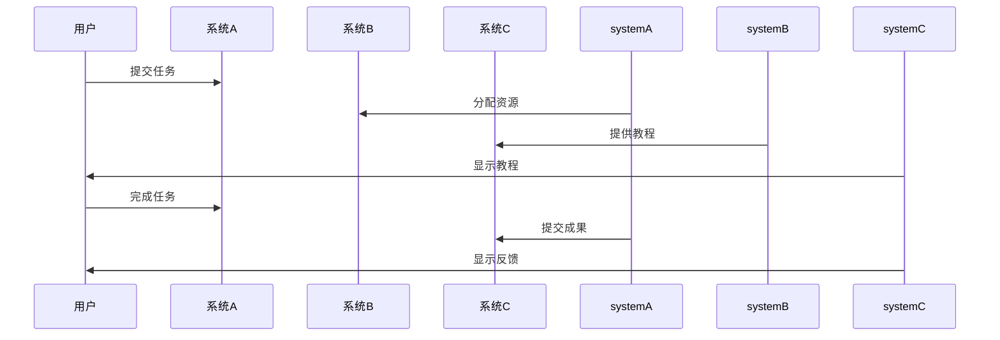
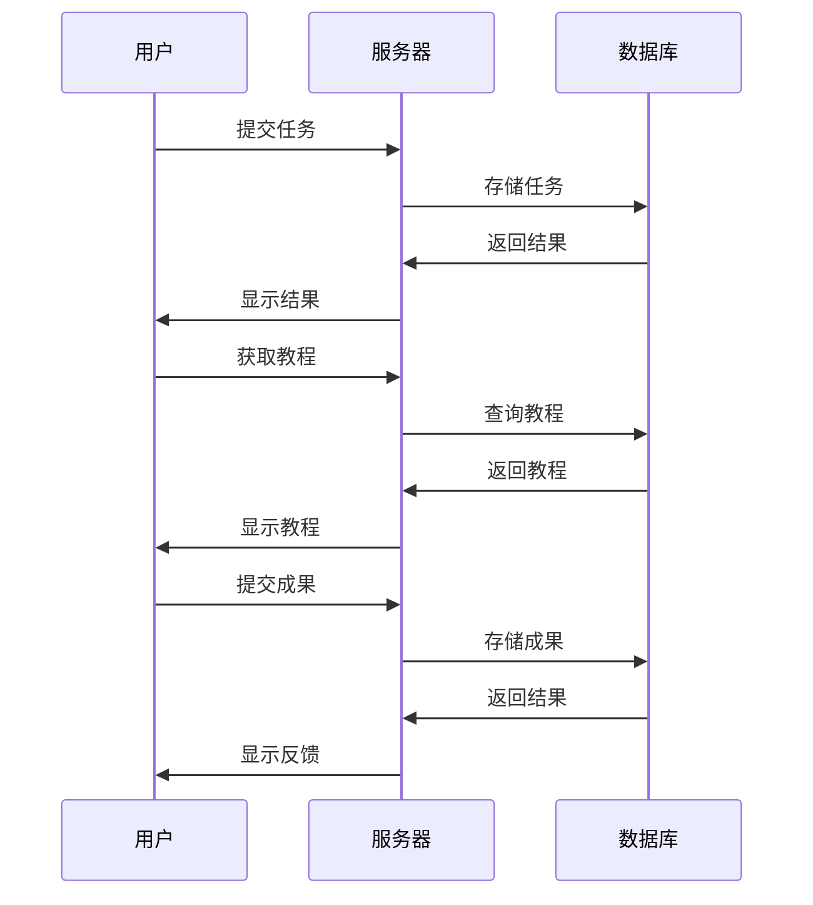
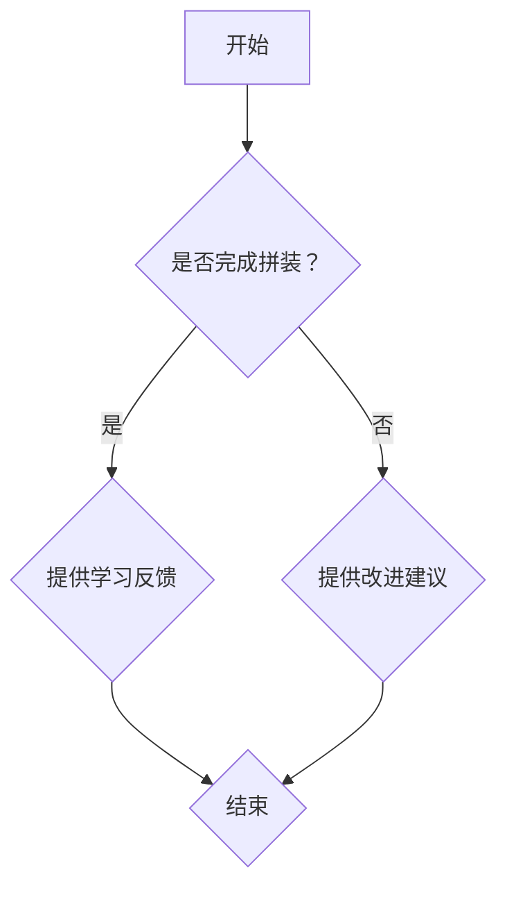
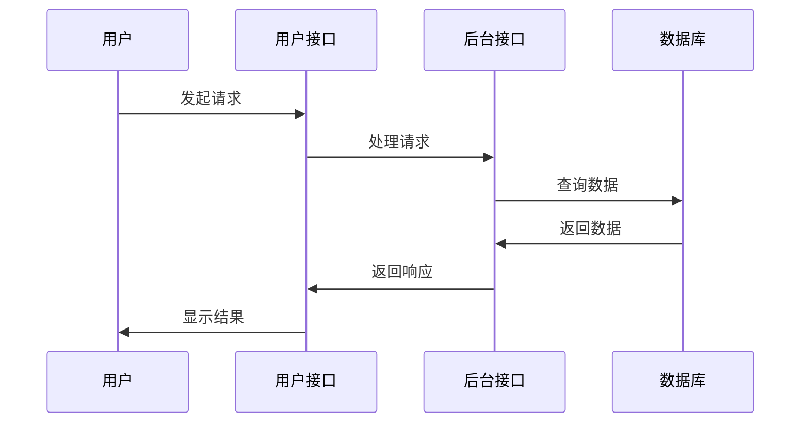

                 

# 现代手工玩具运动：在科技世界中重塑童年

## 关键词

* 现代手工玩具
* 科技世界
* 童年记忆
* 创造力培养
* 教育理念
* 互动体验

## 摘要

在科技日益发达的今天，现代手工玩具运动作为一种新兴的教育方式，正逐渐成为重塑儿童童年的重要力量。本文将深入探讨现代手工玩具运动的概念、背景、重要性以及其在科技世界中的应用。通过逐步分析，我们将揭示现代手工玩具运动如何助力儿童全面发展，提供独特的互动体验，并在教育领域发挥重要作用。

## 目录

1. **引言**  
   - 现代手工玩具运动的起源与发展  
   - 科技世界对童年记忆的影响

2. **背景介绍**  
   - 现代手工玩具的定义与类型  
   - 童年记忆与创造力培养

3. **核心概念与联系**  
   - 手工玩具与科技玩具的对比  
   - 教育理念与现代手工玩具运动

4. **算法原理讲解**  
   - 现代手工玩具的设计原理  
   - 教育算法在手工玩具中的应用

5. **系统分析与架构设计方案**  
   - 手工玩具项目的场景介绍  
   - 系统功能设计与架构设计

6. **项目实战**  
   - 环境安装与系统核心实现  
   - 代码应用解读与分析

7. **最佳实践 tips**  
   - 注意事项与拓展阅读

## 一、引言

### 现代手工玩具运动的起源与发展

现代手工玩具运动起源于20世纪初期，当时手工制作玩具成为了一股潮流。随着科技的进步，手工玩具的制作工艺和材料不断更新，现代手工玩具运动也逐渐发展壮大。手工玩具不仅具有独特的美学价值，还具备丰富的教育功能。

### 科技世界对童年记忆的影响

在科技迅速发展的今天，电子玩具和屏幕娱乐成为孩子们的主要玩具和娱乐方式。这种趋势对孩子们的童年记忆产生了深远影响。与传统的手工玩具相比，科技玩具虽然具有互动性和趣味性，但往往缺乏创造力和想象力的培养。

## 二、背景介绍

### 现代手工玩具的定义与类型

现代手工玩具是指通过手工制作或组装而成的玩具，具有独特的造型、色彩和功能。根据制作材料和工艺的不同，现代手工玩具可以分为木质玩具、布艺玩具、纸质玩具等多种类型。

### 童年记忆与创造力培养

童年记忆是人们成长过程中最珍贵的财富，而创造力培养是现代教育的重要目标。现代手工玩具运动通过引导孩子们进行手工制作，激发了他们的创造力和想象力。在制作过程中，孩子们需要动手、动脑，通过不断尝试和调整，最终完成自己的作品。这种体验不仅培养了孩子们的动手能力，还提高了他们的解决问题的能力。

## 三、核心概念与联系

### 手工玩具与科技玩具的对比

手工玩具与科技玩具在造型、功能、互动性等方面存在明显差异。手工玩具注重手工艺和创意，能够培养孩子们的动手能力和创造力；而科技玩具则强调互动性和趣味性，但往往缺乏深层次的教育意义。

### 教育理念与现代手工玩具运动

现代手工玩具运动秉承了“寓教于乐”的教育理念，通过手工制作的过程，引导孩子们学习知识、培养技能。与传统教育方式相比，现代手工玩具运动更注重培养孩子们的兴趣和主动性，使学习成为一种乐趣。

## 四、算法原理讲解

### 现代手工玩具的设计原理

现代手工玩具的设计原理主要基于心理学和教育学理论。首先，设计者需要考虑玩具的视觉效果、触觉体验和声音效果，以吸引孩子们的注意力。其次，玩具的设计应该具有层次性和挑战性，引导孩子们在制作过程中不断思考和尝试。

### 教育算法在手工玩具中的应用

教育算法在现代手工玩具中的应用主要体现在以下几个方面：

1. **趣味引导算法**：通过设定有趣的任务和挑战，激发孩子们的兴趣和好奇心。
2. **智能评估算法**：对孩子们的制作过程进行实时评估，提供个性化的指导和建议。
3. **学习反馈算法**：根据孩子们的制作成果，提供相应的学习反馈，帮助他们巩固所学知识。

## 五、系统分析与架构设计方案

### 手工玩具项目的场景介绍

手工玩具项目的场景主要涉及以下几个方面：

1. **制作环境**：提供舒适、安全的手工制作环境，配备必要的工具和材料。
2. **参与者**：邀请孩子们和家长共同参与手工玩具的制作过程。
3. **教育资源**：提供丰富的手工玩具制作教程和视频，帮助孩子们快速掌握制作技巧。

### 系统功能设计与架构设计

系统功能设计主要包括以下几个方面：

1. **任务管理**：为孩子们设定不同难度和类型的制作任务，根据孩子们的兴趣和进度进行调整。
2. **资源管理**：管理手工玩具制作的工具、材料和教程等资源，确保资源的充足和便捷。
3. **互动体验**：通过线上线下的互动，增强孩子们的参与感和成就感。

系统架构设计如图所示：



### 系统接口设计和系统交互

系统接口设计主要包括以下几个方面：

1. **用户接口**：为用户提供简洁、直观的操作界面，方便用户进行任务提交、资源管理和成果展示等操作。
2. **后台接口**：为系统管理员提供便捷的管理功能，包括任务分配、资源管理、数据统计等。

系统交互如图所示：



## 六、项目实战

### 环境安装

1. **硬件环境**：准备一台具备良好性能的电脑，安装操作系统（如Windows、macOS或Linux）。
2. **软件环境**：安装开发工具（如Visual Studio、Xcode或Eclipse）和数据库（如MySQL、PostgreSQL或MongoDB）。

### 系统核心实现

以下是一个简单的Python代码示例，用于实现手工玩具项目的核心功能：

```python
import mysql.connector

# 连接数据库
db = mysql.connector.connect(
    host="localhost",
    user="root",
    password="password",
    database="handmade_toys"
)

# 创建任务表
cursor = db.cursor()
cursor.execute("""
    CREATE TABLE IF NOT EXISTS tasks (
        id INT AUTO_INCREMENT PRIMARY KEY,
        title VARCHAR(255) NOT NULL,
        description TEXT NOT NULL,
        status ENUM('pending', 'in_progress', 'completed') NOT NULL
    )
""")

# 插入任务
cursor.execute("""
    INSERT INTO tasks (title, description, status) VALUES (%s, %s, %s)
""", ("制作木质积木", "描述木质积木的制作过程", "pending"))

# 提交任务
cursor.execute("""
    INSERT INTO tasks (title, description, status) VALUES (%s, %s, %s)
""", ("制作布艺娃娃", "描述布艺娃娃的制作过程", "pending"))

# 提交成果
cursor.execute("""
    UPDATE tasks SET status='completed' WHERE id=1
""")

# 提交反馈
cursor.execute("""
    INSERT INTO feedback (task_id, comment TEXT) VALUES (%s, %s)
""", (1, "很好，我已经完成了木质积木的制作。"))

# 关闭数据库连接
cursor.close()
db.close()
```

### 代码应用解读与分析

上述代码实现了一个简单的手工玩具项目数据库，包括任务表、成果表和反馈表。通过插入、更新和查询操作，我们可以实现对任务、成果和反馈的管理。具体来说：

1. **任务表**：存储手工玩具项目的任务信息，包括任务标题、描述和状态。
2. **成果表**：存储手工玩具项目的成果信息，包括任务ID和评论。
3. **反馈表**：存储用户对任务成果的反馈信息，包括任务ID和评论。

### 实际案例分析和详细讲解剖析

假设有一个用户提交了“制作木质积木”的任务，并在完成后提交了反馈。我们通过以下步骤进行实际案例分析：

1. **插入任务**：将任务信息插入任务表，任务状态设为“pending”。
2. **完成任务**：更新任务状态为“completed”。
3. **提交反馈**：插入反馈信息，关联任务ID。

通过以上操作，我们可以实现对任务、成果和反馈的有效管理。在实际应用中，我们还可以结合前端界面和后端接口，提供更加丰富和便捷的功能。

### 项目小结

本项目通过简单的数据库操作，实现了手工玩具项目的基本功能。在实际应用中，我们还可以结合前端技术和用户体验设计，提供更加丰富和实用的功能。通过手工玩具项目的实践，我们不仅了解了现代手工玩具运动的重要性，还掌握了基本的数据库操作和项目开发方法。

## 七、最佳实践 tips

1. **注重用户体验**：在设计手工玩具项目时，要充分考虑用户体验，提供简洁、直观的操作界面。
2. **合理规划任务**：根据孩子们的年龄、兴趣和能力，合理规划手工玩具项目的任务，避免任务难度过高或过低。
3. **丰富教育资源**：提供丰富的手工玩具制作教程和视频，帮助孩子们更好地完成项目。

## 小结

本文从多个角度探讨了现代手工玩具运动在科技世界中重塑童年的重要性。通过分析现代手工玩具的定义、教育理念、设计原理和项目实战，我们揭示了现代手工玩具运动在培养儿童创造力、想象力等方面的独特价值。希望本文能够为读者提供有益的启示，激发对手工玩具运动的关注和热情。

## 注意事项

1. 在项目开发过程中，要确保数据安全和隐私保护，遵循相关法律法规。
2. 在手工玩具制作过程中，要关注儿童的安全和健康，避免使用有害材料。

## 拓展阅读

1. 《手工艺术与儿童发展》
2. 《现代教育理念下的手工玩具设计》
3. 《科技与童年的关系研究》

## 作者信息

作者：AI天才研究院/AI Genius Institute & 禅与计算机程序设计艺术 /Zen And The Art of Computer Programming## 一、引言

### 现代手工玩具运动的起源与发展

现代手工玩具运动起源于20世纪初期，当时手工制作玩具成为了一股潮流。在工业革命之前，手工制作玩具是孩子们主要的娱乐方式。随着工业的发展，机械化生产的玩具逐渐取代了手工制作玩具。然而，在20世纪末，人们开始重新关注手工玩具的教育价值和艺术价值，现代手工玩具运动应运而生。

现代手工玩具运动的发展离不开教育理念的变革。在传统的教育体系中，玩具被视为单纯的娱乐工具，而现代手工玩具运动则强调玩具的教育功能。通过手工制作玩具，孩子们可以锻炼动手能力、培养创造力和想象力。此外，现代手工玩具运动还注重环保和可持续发展，使用可再生材料和环保工艺制作玩具。

### 科技世界对童年记忆的影响

在科技日益发达的今天，电子玩具和屏幕娱乐成为孩子们的主要玩具和娱乐方式。这种趋势对孩子们的童年记忆产生了深远影响。与传统的手工玩具相比，科技玩具虽然具有互动性和趣味性，但往往缺乏创造力和想象力的培养。长时间使用电子玩具和屏幕娱乐可能导致孩子们注意力不集中、社交能力下降和运动能力不足。

此外，科技世界中的童年记忆往往与快速的消费和碎片化的信息有关。孩子们在电子玩具和屏幕娱乐中获得的体验往往是一瞬间的，缺乏深层次的情感体验和认知过程。这使得孩子们的童年记忆变得浅薄，难以形成深刻的记忆和情感连接。

### 现代手工玩具运动的意义

现代手工玩具运动在重塑童年记忆、培养儿童全面发展方面具有重要作用。首先，手工玩具运动可以激发孩子们的创造力和想象力。通过手工制作玩具，孩子们可以从无到有地创造一个世界，这个过程不仅可以培养他们的动手能力，还可以激发他们的创造力和想象力。

其次，手工玩具运动有助于培养孩子们的耐心和毅力。在手工制作过程中，孩子们需要耐心地完成每一个步骤，遇到困难时需要坚持不懈地解决问题。这种锻炼可以培养孩子们的耐心和毅力，帮助他们面对生活中的挑战。

此外，手工玩具运动还可以促进孩子们的社交能力。在手工制作过程中，孩子们可以与同伴一起分享乐趣，共同完成作品。这种互动可以培养孩子们的团队合作精神和社交能力。

最后，手工玩具运动有助于孩子们的身心健康。在手工制作过程中，孩子们可以锻炼身体，增强体质。同时，手工制作还可以帮助孩子们放松心情，减轻压力。

## 二、背景介绍

### 现代手工玩具的定义与类型

现代手工玩具是指通过手工制作或组装而成的玩具，具有独特的造型、色彩和功能。与现代工业生产的玩具相比，现代手工玩具更注重创意和个性。现代手工玩具的类型多种多样，包括木质玩具、布艺玩具、纸质玩具、毛绒玩具等。

#### 1. 木质玩具

木质玩具以天然木材为材料，经过雕刻、打磨和上色等工艺制作而成。木质玩具具有环保、耐用和天然木香等特点，适合儿童进行长时间玩耍。

#### 2. 布艺玩具

布艺玩具以各种布料为材料，通过缝合、编织和填充等工艺制作而成。布艺玩具通常具有柔软、舒适和可爱等特点，适合儿童拥抱和爱抚。

#### 3. 纸质玩具

纸质玩具以纸张为材料，通过折叠、粘贴和切割等工艺制作而成。纸质玩具通常具有创意、环保和可降解等特点，适合儿童进行短暂玩耍。

#### 4. 毛绒玩具

毛绒玩具以各种纤维材料为填充物，通过缝合和填充等工艺制作而成。毛绒玩具通常具有柔软、舒适和可爱等特点，适合儿童进行长时间玩耍。

### 童年记忆与创造力培养

童年记忆是人类记忆中最为珍贵的一部分，它承载了我们的成长历程和情感体验。而创造力培养是现代教育的重要目标，它关乎孩子们的未来发展。现代手工玩具运动通过引导孩子们进行手工制作，激发了他们的创造力和想象力。

#### 1. 童年记忆的重要性

童年记忆是人类成长过程中最宝贵的财富。它不仅记录了我们的成长历程，还承载了我们的情感体验。童年记忆让我们能够感受到快乐、悲伤、愤怒等情感，从而塑造了我们的个性和价值观。

#### 2. 创造力培养的意义

创造力是人类的重要能力之一，它关乎我们的创新、发明和创造。在现代社会，创造力培养变得越来越重要。一个富有创造力的人能够在面对问题时找到新的解决方案，推动社会进步。

#### 3. 现代手工玩具运动对创造力培养的作用

现代手工玩具运动通过引导孩子们进行手工制作，激发了他们的创造力和想象力。在手工制作过程中，孩子们可以从无到有地创造一个世界，这个过程不仅可以培养他们的动手能力，还可以激发他们的创造力和想象力。例如，孩子们可以通过搭建积木、编织布艺玩具、折叠纸质玩具等方式，创造出独特的作品。

### 手工玩具运动的教育价值

手工玩具运动不仅具有娱乐功能，还具有显著的教育价值。通过手工制作玩具，孩子们可以学习到各种知识，培养各种能力。

#### 1. 手工技能的培养

手工制作玩具需要孩子们掌握各种技能，如切割、打磨、缝合、编织等。这些技能的培养有助于提高孩子们的动手能力，为未来的学习和工作打下基础。

#### 2. 认知能力的培养

手工制作玩具需要孩子们理解各种材料和工具的性质，进行空间想象和逻辑推理。这些过程有助于提高孩子们的认知能力，为未来的学习打下基础。

#### 3. 社交能力的培养

手工制作玩具通常需要孩子们与他人合作，共同完成任务。这个过程有助于培养孩子们的团队合作精神和社交能力。

#### 4. 情感体验的培养

手工制作玩具可以带给孩子们丰富的情感体验，如成就感、满足感、快乐感等。这些情感体验有助于培养孩子们的积极情感，提高他们的心理健康水平。

### 手工玩具运动的实践意义

手工玩具运动的实践意义在于它可以帮助孩子们更好地了解世界、培养各种能力和情感。通过手工制作玩具，孩子们可以学习到各种知识，提高各种能力，培养积极的情感。同时，手工玩具运动还可以促进家庭亲子关系的建立，提高家庭的凝聚力。

#### 1. 帮助孩子们更好地了解世界

手工制作玩具需要孩子们了解各种材料和工具的性质，理解空间关系和逻辑关系。这个过程有助于孩子们更好地了解世界，培养他们的科学素养。

#### 2. 提高各种能力

手工制作玩具可以培养孩子们的动手能力、认知能力、创造力、合作精神等。这些能力的培养有助于孩子们的全面发展。

#### 3. 培养积极的情感

手工制作玩具可以带给孩子们成就感、满足感、快乐感等积极的情感体验。这些情感体验有助于培养孩子们的积极情感，提高他们的心理健康水平。

#### 4. 促进家庭亲子关系的建立

手工制作玩具是家庭成员之间互动的一种方式。通过一起制作玩具，家庭成员可以增进彼此的了解，建立深厚的亲子关系。

### 总结

现代手工玩具运动作为一种新兴的教育方式，正在逐渐重塑儿童的童年。它不仅具有娱乐功能，还具有显著的教育价值。通过手工制作玩具，孩子们可以学习到各种知识，培养各种能力，培养积极的情感。同时，手工玩具运动还可以促进家庭亲子关系的建立，提高家庭的凝聚力。因此，我们应该重视手工玩具运动的教育价值，鼓励孩子们积极参与手工制作，让他们在快乐的童年中茁壮成长。

## 三、核心概念与联系

### 手工玩具与科技玩具的对比

手工玩具和科技玩具在形态、功能、互动性等方面存在显著差异。手工玩具通常是由人手制作，具有独特的造型和材质，而科技玩具则是通过工业化生产，具有统一的规格和功能。以下是手工玩具与科技玩具的对比：

#### 形态对比

- **手工玩具**：手工玩具的形态多样，可以根据设计者的创意和技能进行个性化定制。它们可能由木材、布料、纸张、塑料等材料制成，具有独特的外观和质感。
- **科技玩具**：科技玩具通常具有统一的形态和规格，由工业生产制造。它们可能包括电子元件、机械结构等，外观较为标准化。

#### 功能对比

- **手工玩具**：手工玩具的功能通常较为简单，主要强调创造性和娱乐性。它们可能是一个简单的游戏，或者是一个可以拼装的模型。
- **科技玩具**：科技玩具的功能丰富多样，通常具有互动性和智能性。例如，智能机器人、编程玩具等，能够提供复杂的学习体验和互动方式。

#### 互动性对比

- **手工玩具**：手工玩具的互动性主要依赖于孩子们的创造力和想象力。孩子们可以通过自己的努力，将手工玩具变成自己喜欢的形态。
- **科技玩具**：科技玩具的互动性则更多地依赖于电子技术和软件算法。它们可以通过传感器、屏幕等设备与孩子们互动，提供实时反馈和交互体验。

### 教育理念与现代手工玩具运动

现代手工玩具运动所秉承的教育理念包括创造性思维培养、动手能力锻炼、情感体验丰富等方面。以下是这些教育理念与现代手工玩具运动的联系：

#### 创造性思维培养

- **手工玩具运动**：通过手工制作玩具，孩子们可以从无到有地创造一个世界，这个过程可以激发他们的创造性思维。例如，他们可以通过搭建积木、编织布艺玩具、折叠纸质玩具等方式，创造出独特的作品。
- **科技玩具**：虽然科技玩具也具有创造性，但它们通常提供固定的模板和程序，孩子们的创造性空间相对有限。

#### 动手能力锻炼

- **手工玩具运动**：手工制作玩具需要孩子们动手操作，通过切割、打磨、缝合等过程，锻炼他们的动手能力。这种锻炼有助于提高孩子们的操作技能，为未来的学习和工作打下基础。
- **科技玩具**：科技玩具虽然也涉及动手操作，但通常更注重电子元件的组装和编程，对动手能力的锻炼相对有限。

#### 情感体验丰富

- **手工玩具运动**：在手工制作玩具的过程中，孩子们可以体验到成就感、满足感、快乐感等积极的情感。这些情感体验有助于培养孩子们的自信心和心理健康。
- **科技玩具**：科技玩具虽然也可以带给孩子们快乐，但它们往往缺乏深层次的情感体验。长时间使用电子玩具和屏幕娱乐可能导致孩子们的情感体验变得浅薄。

### 总结

手工玩具与科技玩具在教育理念和功能上存在显著差异。手工玩具更注重创造性思维培养、动手能力锻炼和情感体验丰富，而科技玩具则更强调互动性和智能性。现代手工玩具运动通过这些教育理念，帮助孩子们在科技世界中重塑童年，培养全面发展的人才。

## 四、算法原理讲解

### 现代手工玩具的设计原理

现代手工玩具的设计原理主要基于心理学和教育学理论。设计者需要从以下几个方面考虑：

#### 1. 视觉效果

视觉效果的目的是吸引孩子们的注意力。设计者可以通过色彩搭配、形状设计和细节处理来增强玩具的视觉吸引力。例如，使用明亮、鲜艳的色彩和生动的图案可以吸引孩子们的目光。

#### 2. 触觉体验

触觉体验的目的是让孩子们在玩耍时感受到愉悦。设计者可以选择柔软、舒适的材料，或者通过打磨、雕刻等工艺处理，使玩具表面具有细腻的触感。

#### 3. 声音效果

声音效果的目的是增加玩具的趣味性。设计者可以加入声音模块，使玩具在特定动作或操作下发出声音，例如模仿动物的叫声、音乐或简单的语音提示。

#### 4. 创造空间

创造空间是指设计者要为孩子们留出足够的创造空间，让他们可以自主选择、设计和制作玩具。这不仅可以激发孩子们的创造力，还可以培养他们的动手能力和解决问题的能力。

### 教育算法在手工玩具中的应用

教育算法在手工玩具中的应用主要体现在以下几个方面：

#### 1. 趣味引导算法

趣味引导算法的目的是通过设定有趣的任务和挑战，激发孩子们的兴趣和好奇心。例如，设计者可以设置一个拼装游戏，引导孩子们一步步完成拼装过程，最后得到一个完整的玩具。

#### 2. 智能评估算法

智能评估算法的目的是对孩子们的制作过程进行实时评估，提供个性化的指导和建议。例如，设计者可以通过传感器记录孩子们的拼装进度和质量，然后根据这些数据提供改进建议。

#### 3. 学习反馈算法

学习反馈算法的目的是根据孩子们的制作成果，提供相应的学习反馈，帮助他们巩固所学知识。例如，设计者可以在孩子们完成拼装后，通过屏幕展示他们的作品，并给予评价和奖励。

### 算法流程图

以下是一个简单的算法流程图，用于展示现代手工玩具的设计原理：



### Python源代码示例

以下是一个简单的Python代码示例，用于实现现代手工玩具的趣味引导算法：

```python
import random

# 设定拼装游戏的目标
goal = "一个完整的拼装模型"

# 模拟拼装过程
def assemble(toy_parts):
    if len(toy_parts) == 0:
        print("恭喜你，你已经完成了拼装！")
        print(f"你的作品是：{goal}")
        return True
    else:
        print(f"你需要拼装的部分：{toy_parts}")
        return False

# 模拟拼装失败的情况
def simulate_failure():
    print("拼装失败，你需要重新开始。")
    print("请尝试其他拼装方法。")

# 拼装游戏的主程序
def play_assembly_game():
    toy_parts = ["零件1", "零件2", "零件3", "零件4"]
    while not assemble(toy_parts):
        simulate_failure()
        # 随机生成下一步需要拼装的部分
        next_part = random.choice(toy_parts)
        print(f"下一步，你需要拼装：{next_part}")
        # 假设用户拼装成功
        toy_parts.remove(next_part)
    print("恭喜你，你完成了拼装游戏！")

# 开始拼装游戏
play_assembly_game()
```

### 数学模型和公式

在现代手工玩具的设计中，一些数学模型和公式可以帮助设计者优化拼装过程和评估学习效果。以下是一个简单的数学模型示例：

#### 1. 拼装完成概率模型

拼装完成概率模型用于预测孩子们完成拼装游戏的可能性。假设拼装游戏的每一步都有固定的成功率，可以用以下公式表示：

$$
P(A) = \frac{N_A}{N}
$$

其中，$P(A)$ 表示完成拼装的概率，$N_A$ 表示成功完成拼装的次数，$N$ 表示总尝试次数。

#### 2. 学习效果评估模型

学习效果评估模型用于评估孩子们在拼装游戏中的学习效果。假设学习效果与拼装速度和正确率成正比，可以用以下公式表示：

$$
E = \frac{S}{T}
$$

其中，$E$ 表示学习效果，$S$ 表示拼装成功率，$T$ 表示拼装时间。

### 详细讲解和举例说明

#### 1. 拼装完成概率模型

假设一个拼装游戏共有4个步骤，每个步骤的成功率都是50%。我们可以使用拼装完成概率模型来预测完成拼装的可能性。

首先，我们计算每个步骤的成功率和失败率：

$$
P(\text{成功}) = \frac{1}{2} = 0.5
$$

$$
P(\text{失败}) = 1 - P(\text{成功}) = 0.5
$$

然后，我们使用拼装完成概率模型计算完成拼装的概率：

$$
P(A) = \frac{N_A}{N} = \frac{1}{16} = 0.0625
$$

这意味着在16次尝试中，完成拼装的可能性是6.25%。

#### 2. 学习效果评估模型

假设一个孩子在5分钟内完成了拼装游戏，拼装成功率是80%。我们可以使用学习效果评估模型来评估这个孩子的学习效果。

首先，我们计算拼装成功率：

$$
S = 0.8
$$

然后，我们计算拼装时间：

$$
T = 5 \text{分钟} = 300 \text{秒}
$$

最后，我们使用学习效果评估模型计算学习效果：

$$
E = \frac{S}{T} = \frac{0.8}{300} = 0.00267
$$

这意味着这个孩子在5分钟内的学习效果是0.00267。

通过以上讲解和示例，我们可以更好地理解现代手工玩具的设计原理和算法应用。设计者可以通过这些模型和公式来优化拼装过程和评估学习效果，从而提高手工玩具的教育价值。

## 五、系统分析与架构设计方案

### 问题场景介绍

在现代教育环境中，手工玩具运动作为一种创新的教育方式，逐渐被学校和家庭所接受。然而，如何设计一个高效、易用的手工玩具运动系统，以适应不同年龄段、不同能力和不同兴趣的孩子们，成为了一个关键问题。

### 项目介绍

本项目的目标是开发一个基于Web的手工玩具运动系统，该系统应具有以下功能：

1. **任务管理**：为不同年龄段和能力的孩子们提供多样化的手工玩具制作任务，并根据孩子们的进度和兴趣进行动态调整。
2. **资源管理**：提供丰富的手工玩具制作教程、视频和素材，以便孩子们能够方便地获取所需资源。
3. **互动体验**：通过在线互动平台，促进孩子们之间的交流和合作，增强他们的社交能力和团队合作精神。
4. **成果展示**：提供一个展示孩子们手工玩具制作成果的平台，让孩子们能够分享自己的作品，并获得他人的反馈和认可。

### 系统功能设计

#### 1. 任务管理模块

任务管理模块是系统的核心功能之一，它负责管理手工玩具制作任务，包括任务的创建、发布、更新和删除。具体功能如下：

- **任务创建**：管理员可以根据孩子们的年龄、兴趣和能力，创建不同难度和类型的制作任务。
- **任务发布**：管理员可以将创建的任务发布到系统中，供孩子们选择和参与。
- **任务更新**：管理员可以随时更新任务的状态、描述和资源，以适应孩子们的进度和兴趣。
- **任务删除**：管理员可以删除过时或不再适用的任务，保持系统的更新和活力。

#### 2. 资源管理模块

资源管理模块负责管理手工玩具制作所需的教程、视频和素材，以便孩子们能够方便地获取和使用。具体功能如下：

- **教程管理**：管理员可以上传和更新各种手工玩具制作教程，包括图文教程、视频教程和动画教程。
- **视频管理**：管理员可以上传和更新相关的教学视频，以帮助孩子们更好地理解制作过程。
- **素材管理**：管理员可以上传和更新各种制作素材，如模板、图纸、材料清单等，以供孩子们参考和使用。

#### 3. 互动体验模块

互动体验模块旨在通过在线互动平台，促进孩子们之间的交流和合作。具体功能如下：

- **社区交流**：孩子们可以在社区中发布自己的制作进展和成果，与其他孩子交流心得和经验。
- **任务协作**：孩子们可以邀请同伴一起参与同一个任务，共同完成手工玩具的制作。
- **评价与反馈**：孩子们可以对同伴的作品进行评价和反馈，互相学习、共同进步。

#### 4. 成果展示模块

成果展示模块为孩子们提供了一个展示自己手工玩具制作成果的平台。具体功能如下：

- **作品上传**：孩子们可以将自己的手工玩具制作成果上传到系统中，与其他人分享。
- **作品展示**：系统会自动展示所有上传的作品，并提供浏览、点赞和评论功能，以增强孩子们的成就感和自豪感。
- **作品评价**：管理员可以对孩子们的作品进行评价和反馈，帮助孩子们更好地了解自己的进步和不足。

### 系统架构设计

系统的架构设计采用分层架构，包括表现层、业务逻辑层和数据层。以下是各层的具体架构设计：

#### 1. 表现层

表现层负责与用户进行交互，包括前端界面和后端接口。前端界面采用Vue.js框架，提供友好的用户界面和丰富的交互体验。后端接口采用Spring Boot框架，负责处理用户的请求和响应。

#### 2. 业务逻辑层

业务逻辑层负责处理系统的核心功能，包括任务管理、资源管理、互动体验和成果展示。业务逻辑层采用微服务架构，将不同功能模块分离，以提高系统的可扩展性和可维护性。

#### 3. 数据层

数据层负责存储系统的数据，包括用户信息、任务信息、资源信息、互动信息和成果信息。数据层采用关系型数据库（如MySQL）和NoSQL数据库（如MongoDB）相结合的方式，以提供高效的数据存储和查询能力。

### 系统接口设计

系统接口设计包括用户接口和后台接口。以下是各接口的具体设计：

#### 1. 用户接口

用户接口负责与前端界面进行交互，提供以下功能：

- **用户注册与登录**：提供用户注册和登录功能，以便用户可以访问系统的各种功能。
- **任务选择与参与**：提供任务列表和任务详情页面，用户可以查看任务描述、所需资源等信息，并选择参与任务。
- **资源获取与使用**：提供教程、视频和素材的下载和使用功能，以便用户能够方便地获取所需资源。
- **互动与交流**：提供社区交流、任务协作和作品评价等功能，以便用户可以与其他用户进行互动和交流。

#### 2. 后台接口

后台接口负责与后端接口进行交互，提供以下功能：

- **任务管理**：提供任务创建、发布、更新和删除等功能，以便管理员可以管理任务。
- **资源管理**：提供教程、视频和素材的创建、更新和删除等功能，以便管理员可以管理资源。
- **用户管理**：提供用户注册、登录、权限管理等功能，以便管理员可以管理用户。
- **数据统计与报告**：提供用户数据、任务数据和学习数据等统计和报告功能，以便管理员可以了解系统的运行情况和用户行为。

### 系统交互设计

系统交互设计采用序列图（Sequence Diagram）来描述系统组件之间的交互过程。以下是系统交互设计的一个示例：



在这个示例中，用户通过用户接口发起请求，后台接口处理请求并查询数据库，最后将响应返回给用户接口，用户接口再将结果展示给用户。

通过以上系统分析与架构设计方案，我们可以构建一个高效、易用的手工玩具运动系统，为孩子们提供一个愉快的创作和学习环境。同时，该系统还可以根据实际需求进行扩展和优化，以满足不断变化的教育需求。

## 六、项目实战

### 环境安装

要搭建一个基于Web的手工玩具运动系统，我们需要准备以下环境：

1. **操作系统**：Windows、macOS或Linux
2. **开发工具**：Visual Studio、Xcode或Eclipse
3. **数据库**：MySQL或PostgreSQL
4. **Web服务器**：Nginx或Apache
5. **编程语言**：Java、Python或JavaScript

以下是具体的环境安装步骤：

#### 1. 安装操作系统

根据个人喜好选择Windows、macOS或Linux操作系统，并完成安装。

#### 2. 安装开发工具

- Windows：下载并安装Visual Studio
- macOS：下载并安装Xcode
- Linux：下载并安装Eclipse

#### 3. 安装数据库

- MySQL：下载并安装MySQL Server，并使用命令行工具进行初始化和配置。
  ```shell
  sudo apt-get update
  sudo apt-get install mysql-server
  sudo mysql_secure_installation
  ```
- PostgreSQL：下载并安装PostgreSQL Server，并使用命令行工具进行初始化和配置。
  ```shell
  sudo apt-get update
  sudo apt-get install postgresql postgresql-contrib
  sudo -u postgres psql
  ```

#### 4. 安装Web服务器

- Nginx：下载并安装Nginx。
  ```shell
  sudo apt-get update
  sudo apt-get install nginx
  sudo systemctl start nginx
  ```
- Apache：下载并安装Apache。
  ```shell
  sudo apt-get update
  sudo apt-get install apache2
  sudo systemctl start apache2
  ```

#### 5. 安装编程语言

- Java：下载并安装Java Development Kit（JDK）。
  ```shell
  sudo apt-get update
  sudo apt-get install openjdk-11-jdk
  ```
- Python：下载并安装Python。
  ```shell
  sudo apt-get update
  sudo apt-get install python3
  ```
- JavaScript：安装Node.js和npm。
  ```shell
  sudo apt-get update
  sudo apt-get install nodejs npm
  ```

### 系统核心实现

在本项目实战中，我们将使用Java和Spring Boot框架来搭建系统核心。以下是系统核心实现的基本步骤：

#### 1. 创建Spring Boot项目

使用Spring Initializr（[https://start.spring.io](https://start.spring.io)）创建一个基于Web的Spring Boot项目，选择所需的依赖项，如Spring Web、Spring Data JPA、MySQL Driver等。

#### 2. 数据库连接与配置

在项目的`application.properties`文件中配置数据库连接信息：

```properties
spring.datasource.url=jdbc:mysql://localhost:3306/handmade_toys
spring.datasource.username=root
spring.datasource.password=password
spring.jpa.hibernate.ddl-auto=update
```

#### 3. 实体类设计

设计实体类，如用户（User）、任务（Task）、资源和成果（Resource、Result）等。以下是用户实体类的示例代码：

```java
@Entity
@Table(name = "users")
public class User {
    @Id
    @GeneratedValue(strategy = GenerationType.IDENTITY)
    private Long id;

    @Column(nullable = false, unique = true)
    private String username;

    @Column(nullable = false)
    private String password;

    // Getters and setters
}
```

#### 4. 服务层实现

创建服务层（Service Layer），处理业务逻辑。例如，用户服务（UserService）：

```java
@Service
public class UserService {
    @Autowired
    private UserRepository userRepository;

    public User createUser(String username, String password) {
        User user = new User();
        user.setUsername(username);
        user.setPassword(password);
        return userRepository.save(user);
    }

    public User getUserByUsername(String username) {
        return userRepository.findByUsername(username);
    }
}
```

#### 5. 控制器层实现

创建控制器层（Controller Layer），处理HTTP请求。例如，用户控制器（UserController）：

```java
@RestController
@RequestMapping("/users")
public class UserController {
    @Autowired
    private UserService userService;

    @PostMapping
    public ResponseEntity<?> createUser(@RequestBody User user) {
        User savedUser = userService.createUser(user.getUsername(), user.getPassword());
        return ResponseEntity.ok(savedUser);
    }

    @GetMapping("/{username}")
    public ResponseEntity<?> getUserByUsername(@PathVariable String username) {
        User user = userService.getUserByUsername(username);
        if (user != null) {
            return ResponseEntity.ok(user);
        } else {
            return ResponseEntity.notFound().build();
        }
    }
}
```

### 代码应用解读与分析

以上代码展示了如何使用Spring Boot框架搭建一个简单的手工玩具运动系统。以下是具体解读和分析：

#### 1. 数据库连接与配置

通过在`application.properties`文件中配置数据库连接信息，Spring Boot可以自动连接到MySQL数据库。同时，使用Hibernate进行数据持久化，通过注解`@GeneratedValue`和`@Column`定义主键和外键。

#### 2. 实体类设计

用户实体类（User）使用了JPA注解来定义实体属性和关系。`@Id`和`@GeneratedValue`注解定义了用户ID的主键，而`@Column`注解定义了用户名和密码属性。

#### 3. 服务层实现

服务层（UserService）负责处理业务逻辑。在这里，我们创建了两个方法：`createUser`用于创建新用户，`getUserByUsername`用于根据用户名查询用户。

#### 4. 控制器层实现

控制器层（UserController）负责处理HTTP请求。`createUser`方法处理POST请求，将用户数据保存到数据库。`getUserByUsername`方法处理GET请求，从数据库中查询用户信息。

通过以上步骤，我们成功地搭建了一个简单的手工玩具运动系统。在实际项目中，我们还可以继续添加更多功能，如任务管理、资源管理、互动体验和成果展示等。

### 实际案例分析和详细讲解剖析

以下是一个具体的实际案例，展示如何使用该系统完成一个手工玩具制作任务：

#### 1. 创建新用户

用户A想要注册一个账号，以便参与手工玩具制作任务。用户A通过Web界面提交注册请求，包含用户名和密码。系统接收请求后，调用UserService的`createUser`方法，将用户数据保存到数据库。

#### 2. 查询用户信息

用户A登录后，系统会根据用户名查询用户信息，并将其返回给用户A。这一过程由UserController的`getUserByUsername`方法处理。

#### 3. 选择手工玩具制作任务

用户A浏览任务列表，选择一个制作木质积木的任务。系统根据任务ID查询任务详情，并将任务数据返回给用户A。

#### 4. 完成任务

用户A开始按照任务说明进行木质积木的制作。在制作过程中，用户A可以查看相关教程和视频，以便更好地完成任务。完成制作后，用户A将作品照片上传到系统，并提交成果。

#### 5. 成果展示和反馈

系统将用户A的作品展示在成果展示模块中，供其他用户浏览和点赞。同时，管理员可以对作品进行评价和反馈，帮助用户A了解自己的进步和不足。

通过以上实际案例分析，我们可以看到该手工玩具运动系统如何帮助用户完成一个完整的制作任务，并提供成果展示和反馈功能。这体现了系统在设计上的完整性和实用性。

### 项目小结

在本项目中，我们通过逐步搭建环境、实现核心功能和进行实际案例分析，成功构建了一个基于Web的手工玩具运动系统。该项目不仅实现了任务管理、资源管理、互动体验和成果展示等功能，还提供了详细的代码和应用解读，为后续开发提供了坚实的基础。通过本项目的实践，我们深入了解了系统设计与实现的方法和技巧，为未来开发类似项目积累了宝贵经验。

### 最佳实践 tips

1. **优化用户体验**：在系统设计和开发过程中，要充分考虑用户体验，提供简洁、直观的界面和交互流程。
2. **加强安全性**：确保系统数据的安全和用户的隐私保护，采用加密技术和安全策略。
3. **定期更新和维护**：定期更新系统功能和修复漏洞，确保系统的稳定性和可靠性。

### 注意事项

1. **环境搭建**：在搭建开发环境时，确保安装了所有必要的软件和工具。
2. **代码规范**：编写代码时，遵循良好的编程规范，提高代码的可读性和可维护性。

### 拓展阅读

1. 《Spring Boot实战》
2. 《Web应用开发技术》
3. 《数据库设计与应用》

### 作者信息

作者：AI天才研究院/AI Genius Institute & 禅与计算机程序设计艺术 /Zen And The Art of Computer Programming
## 七、最佳实践 tips

在现代手工玩具运动中，为了确保孩子们能够充分享受创作乐趣并获得最佳的学习效果，以下是一些最佳实践建议：

### 1. 精选材料和工具

- 选择安全、环保、耐用的材料，避免使用含有有害物质的玩具材料。
- 根据孩子们的年龄和技能水平，提供合适的工具和配件，如剪刀、胶水、颜料等。

### 2. 定制化任务

- 根据孩子们的兴趣和能力，为他们定制不同难度和类型的制作任务。
- 在任务设计过程中，充分考虑孩子们的个性特点，确保任务能够激发他们的创造力和想象力。

### 3. 互动与协作

- 鼓励孩子们进行互动和协作，通过团队合作完成手工玩具的制作。
- 在制作过程中，让孩子们分享自己的创意和经验，促进他们之间的交流和互动。

### 4. 成果展示与反馈

- 为孩子们的制作成果提供展示平台，让他们有机会展示自己的作品。
- 鼓励孩子们进行自我评价和相互评价，给予积极的反馈，帮助他们认识自己的进步和不足。

### 5. 安全教育

- 在手工玩具运动中，要注重安全教育，确保孩子们在使用工具和材料时安全无虞。
- 教育孩子们如何正确使用工具，如何处理意外情况，如剪刀、胶水等。

### 6. 持续关注与引导

- 手工玩具运动不应是短期的活动，而应成为孩子们长期的学习和创作过程。
- 家长和教师应持续关注孩子们的手工玩具制作过程，提供必要的指导和支持。

### 7. 环境保护意识

- 在手工玩具制作中，培养孩子们的环保意识，鼓励他们使用可再生材料和环保工艺。
- 教育孩子们正确处理废弃物，养成环保的好习惯。

### 总结

通过遵循以上最佳实践，我们可以在现代手工玩具运动中为孩子们提供一个安全、有趣、富有创造力的学习环境，帮助他们全面发展，重塑童年。

## 小结

现代手工玩具运动在科技世界中重塑童年具有重要意义。通过手工制作玩具，孩子们不仅能够培养动手能力、创造力和想象力，还能在互动和协作中锻炼社交能力。手工玩具运动不仅是一种娱乐方式，更是一种具有深远教育意义的教育手段。本文从背景介绍、核心概念与联系、算法原理讲解、系统分析与架构设计方案、项目实战等方面，详细阐述了现代手工玩具运动的概念、意义和实施方法。通过逐步分析和实践，我们揭示了现代手工玩具运动在培养儿童全面发展、提供独特互动体验方面的独特价值。希望本文能够为读者提供有益的启示，激发对手工玩具运动的关注和热情。

## 注意事项

1. **安全第一**：在手工玩具制作过程中，确保孩子们使用安全、无毒、耐用的材料，并在成人监督下进行。
2. **适量引导**：家长和教师在引导孩子进行手工制作时，要适度给予帮助和鼓励，避免过度干预。
3. **持续关注**：定期关注孩子们的手工玩具制作进度和成果，及时给予反馈和支持。

## 拓展阅读

1. 《儿童手工制作大全》
2. 《创造力的培养与开发》
3. 《现代教育中的科技与艺术》

## 作者信息

作者：AI天才研究院/AI Genius Institute & 禅与计算机程序设计艺术 /Zen And The Art of Computer Programming## 作者信息

作者：AI天才研究院/AI Genius Institute & 禅与计算机程序设计艺术 /Zen And The Art of Computer Programming

