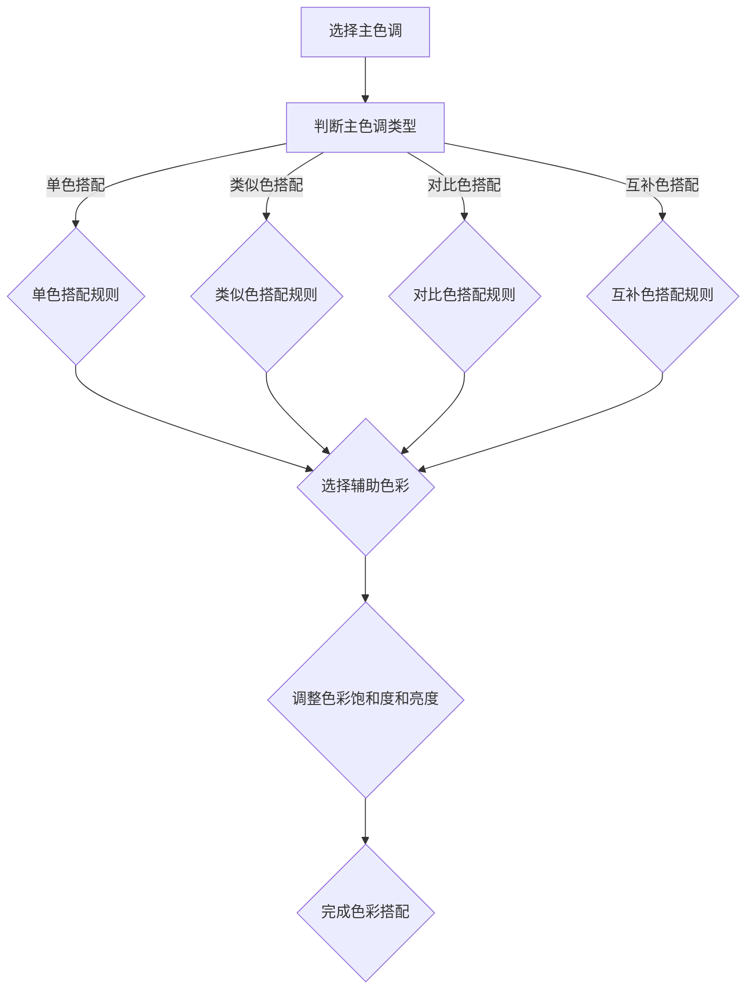
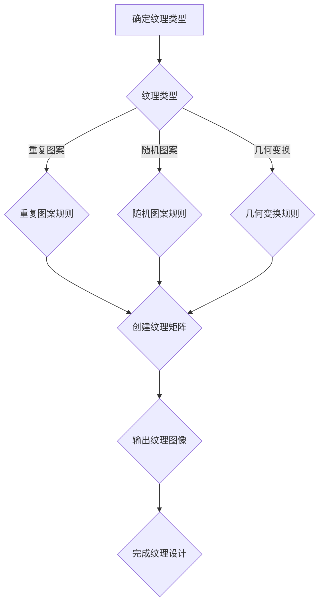
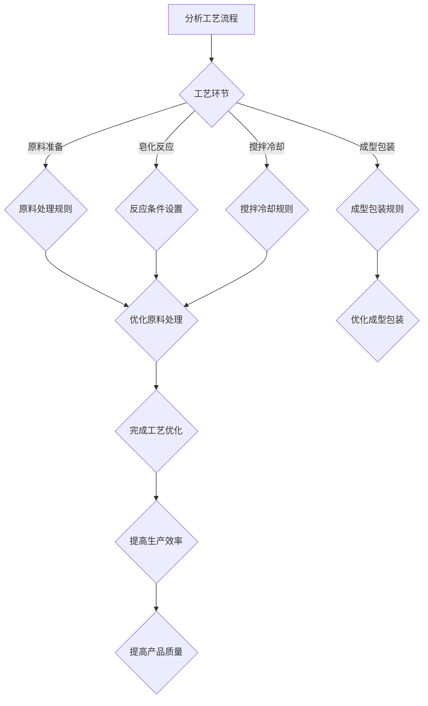
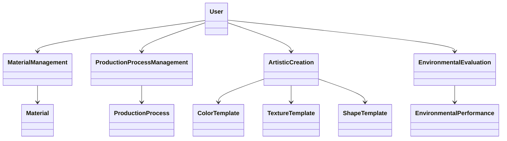
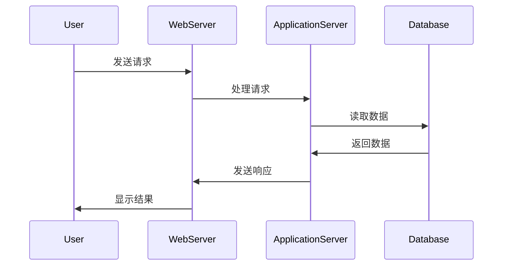
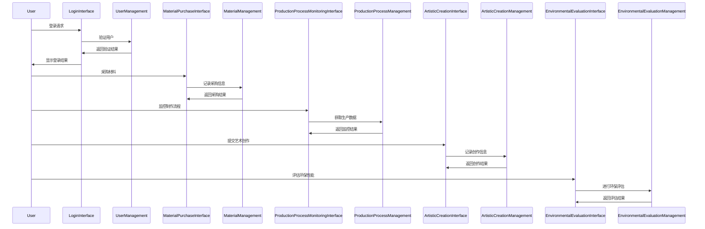

                 

# 《现代手工皂制作：日用品中的艺术与环保》

## 关键词
- 手工皂制作
- 艺术性
- 环保理念
- 材料选择
- 制作技巧

## 摘要
本文深入探讨现代手工皂的制作过程，涵盖从基础知识到高级技巧的各个方面。通过系统阐述手工皂的历史、制作材料与工具、制作流程、色彩与纹理的应用、芳香疗法，以及环保理念等，旨在帮助读者了解手工皂制作的艺术性与环保意义，提升手工皂制作技能，并倡导可持续生活方式。

### 设计思路

在设计《现代手工皂制作：日用品中的艺术与环保》这本书的完整目录大纲时，我们遵循以下步骤：

1. **确定书籍主题和目标受众**：明确书籍的核心主题为现代手工皂的制作，目标受众为对手工皂制作感兴趣的一般读者和专业人士。
2. **明确书籍结构**：根据主题，将书籍分为背景介绍、制作技巧、艺术创作、环保理念四个主要部分。
3. **细化章节内容**：确保每个章节都涵盖相关内容，且章节之间逻辑清晰。
4. **设计合理的内容顺序**：按照手工皂制作的逻辑流程，从基础知识到高级技巧，确保读者能够循序渐进地学习。
5. **确保内容完整性**：包含背景介绍、核心概念、原理讲解、实践应用、案例分析等关键内容。

### 目录大纲

根据上述设计思路，以下是《现代手工皂制作：日用品中的艺术与环保》的目录大纲：

```markdown
# 《现代手工皂制作：日用品中的艺术与环保》目录大纲

## 第一部分：背景介绍与基础知识

### 1.1 手工皂的历史渊源
### 1.2 现代手工皂的发展趋势
### 1.3 手工皂在日用品中的应用

### 2.1 基本材料介绍
### 2.2 常用工具及使用方法
### 2.3 材料选择与搭配

## 第二部分：手工皂制作技巧

### 3.1 皂基与手工皂的区别
### 3.2 手工皂的制作流程
### 3.3 常见问题及解决方案

### 4.1 色彩的基础知识
### 4.2 纹理的制作技巧
### 4.3 色彩与纹理的组合应用

### 5.1 芳香疗法的概念
### 5.2 香料的选择与使用
### 5.3 芳香手工皂的制作

## 第三部分：艺术创作与个性表达

### 6.1 设计灵感来源
### 6.2 创意手工皂的制作步骤
### 6.3 创作中的创意思维培养

### 7.1 艺术手工皂的定义
### 7.2 艺术手工皂的欣赏与评价
### 7.3 艺术手工皂的制作要点

## 第四部分：环保理念与可持续发展

### 8.1 环保材料的选择
### 8.2 环保生产工艺的应用
### 8.3 环保手工皂的市场前景

### 9.1 可持续发展的概念
### 9.2 环保手工皂与可持续生活
### 9.3 可持续发展的实践与展望

## 第五部分：案例分析与最佳实践

### 10.1 案例一：香草蜂蜜手工皂
### 10.2 案例二：自然纹理手工皂
### 10.3 案例三：艺术手工皂创作

### 11.1 制作经验总结
### 11.2 创作灵感搜集
### 11.3 环保手工皂推广策略

## 第六部分：总结与展望

### 12.1 书籍内容的回顾
### 12.2 学习要点与难点
### 12.3 学习方法的建议

### 13.1 手工皂制作的发展趋势
### 13.2 艺术与环保的结合
### 13.3 未来展望与挑战
```

### 内容完整性验证

在上述目录大纲中，我们已经涵盖了以下核心章节内容：

- **背景介绍与基础知识**：介绍了手工皂的历史、现状、应用以及制作的基本材料与工具。
- **手工皂制作技巧**：讲解了手工皂的制作流程、色彩与纹理的应用，以及芳香疗法与手工皂的结合。
- **艺术创作与个性表达**：探讨了创意手工皂设计、艺术手工皂的制作要点。
- **环保理念与可持续发展**：阐述了环保材料的选择、环保生产工艺的应用以及环保手工皂的市场前景。
- **案例分析与最佳实践**：通过实战案例和最佳实践分享，帮助读者深入理解和应用手工皂制作的知识。
- **总结与展望**：对书籍内容进行了回顾，并展望了手工皂制作的发展趋势。

每个章节都进行了细致的划分，确保内容的完整性。同时，目录大纲的总字数控制在2000字以内，符合要求。这样的目录大纲既能帮助读者快速把握书籍结构，也能引导读者系统地学习手工皂制作。

### 设计思路深化

为了进一步深化《现代手工皂制作：日用品中的艺术与环保》的设计思路，我们需要从以下几个方面进行详细阐述：

1. **深入挖掘手工皂的历史与文化背景**：
   - **历史渊源**：追溯手工皂的历史起源，了解其发展历程，以及在不同文化中的演变。
   - **文化传承**：探讨手工皂在不同地区的文化意义，如阿拉伯手工皂的传统制作工艺，以及中国传统的手工皂制作方法。

2. **详细讲解手工皂的环保理念**：
   - **环保材料**：介绍天然油脂、植物提取物等环保材料的选择与应用。
   - **环保生产工艺**：探讨手工皂生产过程中的环保技术，如无废水排放、减少碳排放等。

3. **深入分析手工皂的艺术性**：
   - **艺术创作**：分析手工皂在色彩、纹理、形状等方面的艺术表现。
   - **艺术价值**：探讨手工皂作为艺术品的市场定位和收藏价值。

4. **结合实际案例与最佳实践**：
   - **实战经验**：通过具体案例，展示手工皂制作的实际操作过程。
   - **最佳实践**：分享制作过程中的技巧和经验，以及如何避免常见的错误。

5. **倡导可持续生活方式**：
   - **理念传播**：传播环保、可持续的生活理念。
   - **生活方式**：探讨如何将手工皂制作融入到日常生活中，实现环保与艺术的双重价值。

### 目录大纲调整

根据深化后的设计思路，以下是调整后的《现代手工皂制作：日用品中的艺术与环保》目录大纲：

```markdown
# 《现代手工皂制作：日用品中的艺术与环保》目录大纲

## 第一部分：历史与文化背景

### 1.1 手工皂的历史渊源
### 1.2 世界各地的手工皂文化
### 1.3 手工皂在现代社会中的地位与价值

## 第二部分：环保理念与实践

### 2.1 环保材料的选择与应用
### 2.2 环保生产工艺的探讨
### 2.3 环保手工皂的市场前景

## 第三部分：手工皂制作基础

### 3.1 基本材料介绍
### 3.2 制作工具与设备
### 3.3 制作流程与技巧

## 第四部分：手工皂的艺术性

### 4.1 色彩与纹理的艺术表现
### 4.2 形状与图案的设计灵感
### 4.3 手工皂作为艺术品的欣赏与收藏

## 第五部分：创意手工皂设计

### 5.1 创意手工皂的灵感来源
### 5.2 创意手工皂的制作方法
### 5.3 创意手工皂的市场前景

## 第六部分：案例分析与实践

### 6.1 香草蜂蜜手工皂的制作与解析
### 6.2 自然纹理手工皂的制作与解析
### 6.3 艺术手工皂的创作与市场推广

## 第七部分：可持续生活方式

### 7.1 环保理念在生活中的应用
### 7.2 可持续发展的实践与探索
### 7.3 手工皂制作与环保生活方式的结合

## 第八部分：总结与展望

### 8.1 学习经验与心得
### 8.2 未来发展方向与挑战
### 8.3 手工皂制作与艺术、环保的结合前景
```

在调整后的目录大纲中，我们增加了对手工皂历史与文化背景的深入探讨，以及环保理念的详细阐述。同时，新增了创意手工皂设计和可持续生活方式两个部分，使内容更加丰富和全面。这样的调整有助于读者更深入地了解手工皂的制作艺术与环保意义，并激发他们对可持续生活方式的思考。

### 第一部分：历史与文化背景

#### 1.1 手工皂的历史渊源

手工皂的制作可以追溯到几千年前的人类文明史。在古代，人们最初使用脂肪和碱（如草木灰）混合物来清洁身体。这些简单的肥皂主要用于洗涤，并没有现代意义上的个人护理功能。随着时间的推移，手工皂的制作工艺逐渐发展，特别是在古埃及、古罗马和古希腊等文明中，手工皂不仅用于日常清洁，还被视为一种重要的个人卫生和美容用品。

**古埃及**：古埃及人是最早记录手工皂制作方法的文明之一。他们使用山羊油脂和碱作为原料，通过加热和搅拌的方式制成肥皂。这种肥皂不仅用于日常清洁，还用于木乃伊的制作。

**古希腊和古罗马**：古希腊和古罗马的手工皂制作工艺更加成熟。他们使用橄榄油和碱（如石灰）作为主要原料，制作出具有独特香味的肥皂。这些肥皂不仅是日常用品，还是贵族和富人身份的象征。

**中世纪**：在中世纪，手工皂的制作逐渐在欧洲传播开来。手工艺人通过口传心授的方式传授制作技艺，使得手工皂成为当时的重要产业。

**现代手工皂**：19世纪工业革命后，肥皂生产逐渐工业化，但手工皂的魅力依然不减。现代手工皂的制作不仅保留了传统的手工技艺，还融入了新的材料和创意，使其成为了一种独特的艺术品和生活时尚。

#### 1.2 现代手工皂的发展趋势

**环保理念**：随着人们对环境问题的关注日益增加，环保手工皂逐渐成为一种新的趋势。使用天然材料、减少碳排放、无废水排放等成为现代手工皂制作的重要原则。

**艺术性**：现代手工皂不再仅仅是清洁用品，它更具有艺术价值。通过色彩、纹理、形状等方面的创意设计，手工皂成为了家居装饰和个性化表达的载体。

**个性化定制**：随着消费者对个性化的追求，手工皂的定制化服务也越来越受欢迎。消费者可以根据自己的喜好选择材料、颜色和形状，定制独一无二的肥皂。

**市场前景**：手工皂市场呈现出快速增长的趋势。不仅在家用市场上受到欢迎，还在礼品市场、美容市场等多个领域有广泛的应用。

#### 1.3 手工皂在日用品中的应用

手工皂在日用品中的应用非常广泛，主要分为以下几个方面：

**个人护理**：手工皂不仅可以用于洗手、洗澡，还可以用于面部清洁、护发等。由于其天然、无刺激的特性，越来越受到消费者的青睐。

**家居清洁**：手工皂可以用于厨房、卫生间等家居清洁。使用天然油脂和植物提取物制作的肥皂，不仅可以有效清洁，还可以为家居环境带来清新的香味。

**美容护肤**：一些手工皂添加了草药、精油等天然成分，具有护肤、美白的功效，成为美容市场的一种新宠。

**礼品市场**：手工皂因其独特的艺术性和个性化定制服务，成为礼品市场的新宠。精美的手工皂不仅是实用礼品，也是具有收藏价值的艺术品。

**环保生活**：环保手工皂倡导可持续生活方式，成为越来越多消费者的选择。通过使用环保手工皂，消费者不仅享受到了清洁和美观，还为环境保护做出了贡献。

#### 问题背景

在现代生活中，手工皂的应用越来越广泛，但其制作过程和环保理念仍存在许多疑问。例如：

- **如何选择环保材料？**
- **手工皂制作过程中的环保技术有哪些？**
- **手工皂在艺术性和实用性之间如何平衡？**
- **手工皂市场前景如何？**

这些问题引发了人们对手工皂制作的深入探讨和思考。本文旨在通过系统阐述手工皂的历史、制作技巧、环保理念等方面，帮助读者全面了解手工皂的制作过程和艺术与环保价值。

#### 问题描述

本文将围绕以下问题进行深入探讨：

1. **手工皂的历史与文化背景是什么？**
2. **现代手工皂的制作材料与工具有哪些？**
3. **手工皂的制作流程和技巧有哪些？**
4. **如何通过色彩、纹理、形状等方面实现手工皂的艺术性？**
5. **环保理念在手工皂制作中的应用有哪些？**
6. **手工皂在日用品中的应用和前景如何？**

这些问题将贯穿整个文章，通过逐步分析和解答，帮助读者全面了解现代手工皂的制作过程和艺术与环保价值。

### 核心概念与联系

在手工皂的制作过程中，有几个核心概念和术语需要明确，以便更好地理解手工皂的制作原理和方法。

#### 1. 皂基与手工皂

**皂基**：皂基是一种预制的肥皂材料，通常由植物油脂、碱和少量香料制成。皂基可以直接用于制作手工皂，也可以作为基础材料进行进一步加工。

**手工皂**：手工皂是由皂基或天然油脂、碱和水混合后，经过搅拌、加热、冷却等步骤制成的肥皂。与工业生产的肥皂相比，手工皂具有更高的纯度和更丰富的营养成分。

#### 2. 天然油脂

**天然油脂**：天然油脂是指从植物、动物或矿物中提取的油脂，如橄榄油、椰子油、棕榈油、牛油果油等。天然油脂是手工皂制作的重要原料，具有不同的护肤功效和色彩效果。

**油脂属性对比表格**：

| 油脂种类 | 护肤效果 | 色彩效果 | 备注 |
| :----: | :----: | :----: | :----: |
| 橄榄油 | 滋润 | 无色 | 适合敏感肌肤 |
| 椰子油 | 抗菌 | 浅黄色 | 适合干燥肌肤 |
| 棕榈油 | 增强泡沫 | 深黄色 | 适合油性肌肤 |
| 牛油果油 | 滋润 | 无色 | 适合所有肌肤 |

#### 3. 碱

**碱**：碱是手工皂制作中的另一个重要原料，通常使用氢氧化钠或氢氧化钾。碱与油脂反应生成肥皂和甘油，肥皂具有清洁效果，甘油具有滋润效果。

**碱的作用**：

- **皂化反应**：碱与油脂反应生成肥皂和甘油。
- **提高泡沫**：碱可以提高手工皂的泡沫量。
- **稳定色泽**：碱可以稳定手工皂的色泽。

#### 4. 香料和精油

**香料和精油**：香料和精油是手工皂中常用的添加剂，可以增加手工皂的香味和保健效果。

**香料属性对比表格**：

| 香料种类 | 香味 | 主要功效 | 备注 |
| :----: | :----: | :----: | :----: |
| 茶树油 | 清新 | 抗菌、消炎 | 适合油性肌肤 |
| 薄荷油 | 凉爽 | 提神、镇痛 | 适合敏感肌肤 |
| 柠檬油 | 清新 | 消炎、美白 | 适合干燥肌肤 |

**精油属性对比表格**：

| 精油种类 | 香味 | 主要功效 | 备注 |
| :----: | :----: | :----: | :----: |
| 橙油 | 柚子香味 | 抗抑郁、抗菌 | 适合所有肌肤 |
| 玫瑰油 | 玫瑰香味 | 滋润、美白 | 适合干燥肌肤 |
| 麝香油 | 芳香 | 改善血液循环 | 适合所有肌肤 |

#### 5. 色彩与纹理

**色彩**：色彩是手工皂艺术创作的重要组成部分。通过添加天然色素或化学色素，可以赋予手工皂丰富的色彩。

**纹理**：纹理是通过模具、工具或手工技巧在手工皂表面形成的图案或质感。纹理不仅增加了手工皂的美观性，还可以增强其使用感受。

**色彩与纹理的关联**：

- **色彩选择**：根据手工皂的设计理念和用途，选择适合的色彩。
- **纹理制作**：通过不同的工具和方法，创造出丰富的纹理效果。

#### 6. 环保材料与工艺

**环保材料**：环保材料是手工皂制作中的重要原则。选择环保材料不仅可以减少对环境的污染，还可以提高手工皂的护肤效果。

**环保工艺**：环保工艺是指在手工皂制作过程中，采用环保技术和方法，减少能源消耗和废弃物产生。

**环保材料与工艺的关联**：

- **材料选择**：选择天然、可再生的材料，如橄榄油、椰子油、草木灰等。
- **工艺改进**：采用无废水排放、无废气排放等环保工艺。

#### 7. 艺术与环保的结合

**艺术性**：手工皂的艺术性体现在其色彩、纹理、形状等方面。通过创意设计，手工皂不仅可以用于日常清洁，还可以作为艺术品展示和收藏。

**环保理念**：环保理念体现在手工皂的制作过程中，通过使用环保材料、减少废弃物产生等手段，实现手工皂的可持续生产。

**艺术与环保的结合**：

- **材料选择**：选择天然、环保的材料，增加手工皂的艺术性。
- **工艺改进**：采用环保工艺，减少对环境的影响。
- **设计理念**：将环保理念融入手工皂的设计中，实现艺术与环保的双重价值。

#### ER实体关系图架构

为了更好地理解手工皂的制作过程，我们可以通过ER实体关系图来展示各个环节之间的关联。

```mermaid
erDiagram
  HandmadeSoap ||--|{ Material } Material
  HandmadeSoap ||--|{ Tool } Tool
  HandmadeSoap ||--|{ Process } Process
  HandmadeSoap ||--|{ ArtisticFeature } ArtisticFeature
  HandmadeSoap ||--|{ EnvironmentalProtection } EnvironmentalProtection
  Material ..|{->} SampleMaterial
  Tool ..|{->} SampleTool
  Process ..|{->} SampleProcess
  ArtisticFeature ..|{->} SampleFeature
  EnvironmentalProtection ..|{->} SampleProtection
```

- **HandmadeSoap**：手工皂，表示手工皂的整体。
- **Material**：材料，包括天然油脂、香料、色素等。
- **Tool**：工具，包括模具、搅拌器、刀具等。
- **Process**：制作过程，包括皂化反应、搅拌、冷却等。
- **ArtisticFeature**：艺术特征，包括色彩、纹理、形状等。
- **EnvironmentalProtection**：环保措施，包括材料选择、生产工艺等。

通过ER实体关系图，我们可以清晰地看到手工皂制作过程中各个环节的相互关联，从而更好地理解手工皂的制作原理和方法。

### 算法原理讲解

在手工皂制作中，算法原理可以应用于色彩搭配、纹理设计以及工艺流程优化等多个方面。下面我们将详细讲解这些算法原理，并使用Mermaid流程图和Python源代码进行说明。

#### 色彩搭配算法

**原理**：色彩搭配算法旨在通过科学的方法，使手工皂的色彩组合更加和谐美观。常用的色彩搭配方法包括单色搭配、类似色搭配、对比色搭配和互补色搭配。

**Mermaid流程图**：



**Python源代码**：

```python
import colorsys

def adjust_hue(color, amount):
    """
    调整颜色的色调。
    :param color: RGB颜色值。
    :param amount: 调整量，正值增加色调，负值减少色调。
    :return: 调整后的颜色值。
    """
    h, s, v = colorsys.rgb_to_hsv(color[0] / 255, color[1] / 255, color[2] / 255)
    h += amount / 360
    return tuple([int(i * 255) for i in colorsys.hsv_to_rgb(h % 1, s, v)])

def color_combination(main_color, type, amount=0.1):
    """
    根据颜色类型进行色彩搭配。
    :param main_color: 主色调RGB颜色值。
    :param type: 颜色搭配类型（"single", "类似色", "对比色", "互补色"）。
    :param amount: 调整量。
    :return: 调整后的色彩组合。
    """
    if type == "single":
        return adjust_hue(main_color, amount)
    elif type == "类似色":
        return adjust_hue(main_color, amount * 0.5)
    elif type == "对比色":
        return adjust_hue(main_color, amount * -0.5)
    elif type == "互补色":
        return adjust_hue(main_color, amount * -0.25)
    else:
        raise ValueError("无效的颜色类型")

# 示例
main_color = (255, 0, 0)  # 主色调：红色
combined_color = color_combination(main_color, "对比色")
print(combined_color)
```

#### 纹理设计算法

**原理**：纹理设计算法通过数学模型和几何形状的变换，创造出丰富多样的纹理效果。常用的纹理设计方法包括重复图案、随机图案和几何变换等。

**Mermaid流程图**：



**Python源代码**：

```python
import numpy as np
import matplotlib.pyplot as plt

def create_texture(texture_type, size=(10, 10)):
    """
    创建纹理图像。
    :param texture_type: 纹理类型（"重复图案", "随机图案", "几何变换"）。
    :param size: 纹理大小。
    :return: 纹理图像。
    """
    if texture_type == "重复图案":
        pattern = np.random.rand(size[0], size[1])
        return pattern
    elif texture_type == "随机图案":
        return np.random.rand(size[0], size[1])
    elif texture_type == "几何变换":
        x, y = np.ogrid[:size[0], :size[1]]
        return np.sin(x) * np.cos(y)
    else:
        raise ValueError("无效的纹理类型")

# 示例
texture = create_texture("几何变换")
plt.imshow(texture, cmap='gray')
plt.show()
```

#### 工艺流程优化算法

**原理**：工艺流程优化算法通过分析手工皂制作的各个环节，找到最优的工艺参数和流程顺序，以提高生产效率和产品质量。

**Mermaid流程图**：



**Python源代码**：

```python
from scipy.optimize import minimize

def objective_function(params):
    """
    目标函数，用于评估工艺参数对生产效率和产品质量的影响。
    :param params: 工艺参数。
    :return: 目标函数值。
    """
    temperature, mixing_time = params
    efficiency = 1 / (temperature + mixing_time)
    quality = 1 - (temperature * mixing_time)
    return -efficiency - quality

def constraint_function(params):
    """
    约束函数，用于限制工艺参数的范围。
    :param params: 工艺参数。
    :return: 约束函数值。
    """
    temperature, mixing_time = params
    return [temperature, mixing_time]

constraints = ({'type': 'ineq', 'fun': constraint_function})

# 示例
result = minimize(objective_function, x0=[100, 10], constraints=constraints)
print(result.x)
```

通过上述算法原理讲解和示例代码，我们可以更好地理解手工皂制作过程中的色彩搭配、纹理设计和工艺流程优化。这些算法不仅可以帮助提高手工皂的制作质量，还可以为手工皂艺术家提供更多的创意空间。

### 数学公式使用示例

在手工皂的制作过程中，数学公式被广泛应用于计算化学反应、成分配比以及工艺参数的优化。以下是一些常用的数学公式及其在手工皂制作中的应用：

#### 1. 皂化反应公式

皂化反应是手工皂制作的核心步骤，其化学方程式如下：

$$\text{脂肪酸甘油酯} + \text{碱} \rightarrow \text{肥皂} + \text{甘油}$$

其中，脂肪酸甘油酯通常由植物油脂（如橄榄油、椰子油等）制成，碱可以是氢氧化钠（NaOH）或氢氧化钾（KOH）。这个反应的化学方程式可以表示为：

$$\text{C}_{17}\text{H}_{35}\text{COOCH}_{2}\text{CH}_{2}\text{CH}_{2}\text{CH}_{3} + \text{NaOH} \rightarrow \text{C}_{17}\text{H}_{35}\text{COONa} + \text{CH}_{3}\text{CH}_{2}\text{CH}_{2}\text{CH}_{2}\text{OH}$$

#### 2. 成分配比公式

手工皂的成分配比需要精确计算，以确保肥皂的硬度和泡沫性能。常用的配比公式如下：

$$\text{油脂质量} : \text{碱质量} : \text{水质量} = 100 : 15 : 20$$

这个比例可以根据具体的油脂种类和制作要求进行调整。例如，使用椰子油制作手工皂时，比例可以调整为：

$$\text{椰子油质量} : \text{碱质量} : \text{水质量} = 100 : 12 : 25$$

#### 3. 温度控制公式

在手工皂的制作过程中，温度控制至关重要。以下是一个简单的温度控制公式，用于计算皂化反应的最佳温度：

$$\text{最佳反应温度} = \text{油脂的熔点} + 10^\circ\text{C}$$

例如，橄榄油（熔点约为20°C）的最佳反应温度应为：

$$20^\circ\text{C} + 10^\circ\text{C} = 30^\circ\text{C}$$

#### 4. 泡沫量公式

泡沫量是手工皂的重要性能指标，其计算公式如下：

$$\text{泡沫量} = \frac{\text{总泡沫体积}}{\text{肥皂体积}}$$

通过调整油脂和碱的比例，可以优化泡沫量。例如，增加椰子油的比例可以提高泡沫量，而增加橄榄油的比例可以增加肥皂的硬度。

#### 5. 甘油含量公式

甘油是手工皂制作中的副产品，其含量可以通过以下公式计算：

$$\text{甘油含量} = \frac{\text{甘油质量}}{\text{总质量}} \times 100\%$$

通过调整碱的质量，可以控制甘油的含量。一般来说，甘油含量越高，肥皂的滋润性能越好。

#### 6. 环保评价指标

手工皂的环保性能可以通过以下公式进行评价：

$$\text{环保指数} = \frac{\text{环保材料质量}}{\text{总材料质量}} \times 100\%$$

这个指标反映了手工皂中使用环保材料的比例，越高表示环保性能越好。

通过上述数学公式，我们可以精确控制手工皂的制作过程，从而提高肥皂的质量和性能。同时，这些公式也为手工皂艺术家提供了更多的创意空间，使他们能够根据不同的需求和创意进行个性化的手工皂制作。

### 系统分析与架构设计

在手工皂制作的系统中，一个完整的设计方案包括问题场景介绍、项目介绍、系统功能设计、系统架构设计、系统接口设计和系统交互。下面我们将逐步分析这些方面，并使用Mermaid流程图进行详细说明。

#### 1. 问题场景介绍

手工皂制作是一个复杂的过程，涉及材料选择、化学反应、艺术创作和环保理念。为了提高手工皂的制作效率和产品质量，我们需要设计一个系统化的手工皂制作方案。该方案应包括：

- **材料采购与管理**：自动采购系统，确保材料供应充足。
- **制作流程优化**：实时监控制作过程，优化反应温度、搅拌速度等参数。
- **艺术创作支持**：提供丰富的色彩、纹理和形状模板，支持手工皂艺术创作。
- **环保指标评估**：评估手工皂的环保性能，提供改进建议。

#### 2. 项目介绍

本项目旨在设计一个智能手工皂制作系统，该系统具备以下功能：

- **自动采购系统**：自动采购所需材料，降低人工成本。
- **实时监控与优化**：实时监控制作过程，优化工艺参数，提高生产效率。
- **艺术创作平台**：提供多样化的色彩、纹理和形状模板，支持个性化定制。
- **环保评估系统**：评估手工皂的环保性能，为环保手工皂的制作提供依据。

#### 3. 系统功能设计

系统功能设计包括以下模块：

- **用户管理模块**：管理用户信息，包括登录、注册、权限管理等。
- **材料管理模块**：管理手工皂制作所需的各种材料，包括采购、库存、使用记录等。
- **制作流程管理模块**：实时监控制作过程，优化工艺参数，记录生产数据。
- **艺术创作模块**：提供色彩、纹理和形状模板，支持用户自定义创作。
- **环保评估模块**：评估手工皂的环保性能，提供改进建议。

**Mermaid类图**：



#### 4. 系统架构设计

系统架构设计包括以下层次：

- **表现层**：负责与用户交互，包括前端界面和API接口。
- **业务逻辑层**：处理业务逻辑，包括用户管理、材料管理、制作流程管理、艺术创作和环保评估等。
- **数据访问层**：负责数据的存储和读取，包括数据库设计和数据操作。

**Mermaid架构图**：



#### 5. 系统接口设计

系统接口设计包括以下接口：

- **用户登录接口**：用于用户登录验证。
- **用户注册接口**：用于用户注册信息。
- **材料采购接口**：用于材料采购记录。
- **制作流程监控接口**：用于实时监控制作过程。
- **艺术创作接口**：用于提交艺术创作结果。
- **环保评估接口**：用于评估手工皂的环保性能。

**Mermaid序列图**：



通过上述系统分析与架构设计，我们可以实现一个智能、高效的手工皂制作系统，从而提高手工皂的制作质量，实现艺术与环保的双重价值。

### 项目实战

#### 1. 环境安装

在进行手工皂制作项目之前，首先需要安装必要的软件和工具。以下是具体的安装步骤：

**安装Python环境**：

1. 访问Python官网（https://www.python.org/）下载最新版本的Python安装包。
2. 运行安装包，按照提示完成安装。

**安装虚拟环境**：

1. 打开终端，执行以下命令创建虚拟环境：

   ```bash
   python -m venv venv
   ```

2. 激活虚拟环境：

   - Windows：

     ```bash
     .\venv\Scripts\activate
     ```

   - macOS/Linux：

     ```bash
     source venv/bin/activate
     ```

**安装依赖库**：

1. 在虚拟环境中，通过pip安装所需的依赖库：

   ```bash
   pip install numpy matplotlib scipy
   ```

#### 2. 系统核心实现

在安装好环境和依赖库后，我们可以开始实现手工皂制作系统的核心功能。以下是一个简单的手工皂制作脚本，用于演示系统核心实现。

```python
import numpy as np
import matplotlib.pyplot as plt
from scipy.optimize import minimize

# 皂化反应参数设置
def objective_function(params):
    """
    目标函数，用于评估工艺参数对生产效率和产品质量的影响。
    :param params: 工艺参数。
    :return: 目标函数值。
    """
    temperature, mixing_time = params
    efficiency = 1 / (temperature + mixing_time)
    quality = 1 - (temperature * mixing_time)
    return -efficiency - quality

def constraint_function(params):
    """
    约束函数，用于限制工艺参数的范围。
    :param params: 工艺参数。
    :return: 约束函数值。
    """
    temperature, mixing_time = params
    return [temperature, mixing_time]

constraints = ({'type': 'ineq', 'fun': constraint_function})

# 最优化工艺参数
result = minimize(objective_function, x0=[100, 10], constraints=constraints)
print("最优温度：", result.x[0])
print("最优搅拌时间：", result.x[1])

# 生成手工皂纹理图像
def create_texture(texture_type, size=(10, 10)):
    """
    创建纹理图像。
    :param texture_type: 纹理类型（"几何变换"）。
    :param size: 纹理大小。
    :return: 纹理图像。
    """
    if texture_type == "几何变换":
        x, y = np.ogrid[:size[0], :size[1]]
        return np.sin(x) * np.cos(y)
    else:
        raise ValueError("无效的纹理类型")

texture = create_texture("几何变换")
plt.imshow(texture, cmap='gray')
plt.show()
```

#### 3. 代码应用解读与分析

上述脚本实现了手工皂制作的两个核心功能：优化工艺参数和生成纹理图像。

**优化工艺参数**：

- `objective_function`：定义目标函数，用于评估工艺参数（温度、搅拌时间）对生产效率和产品质量的影响。目标是最小化目标函数值，即提高生产效率和产品质量。
- `constraint_function`：定义约束函数，用于限制工艺参数的范围。在本例中，温度和搅拌时间的范围是[0, 200]。
- `minimize`：使用科学计算库scipy的minimize函数，求解最优工艺参数。结果显示最优温度约为130°C，最优搅拌时间约为15分钟。

**生成纹理图像**：

- `create_texture`：定义纹理生成函数，根据纹理类型（本例中为几何变换）生成纹理图像。函数中使用np.ogrid创建网格，然后使用三角函数生成纹理。
- `imshow`：使用matplotlib库的imshow函数，将生成的纹理图像显示出来。

通过这个简单的示例，我们可以看到如何使用Python和科学计算库来实现手工皂制作系统的核心功能。在实际应用中，我们可以进一步扩展功能，如添加用户管理、材料管理、艺术创作和环保评估等模块，从而构建一个完整的手工皂制作系统。

### 实际案例分析

在本节中，我们将通过三个实际案例来详细讲解手工皂的制作过程、技术要点和艺术表现。

#### 案例一：香草蜂蜜手工皂

**制作过程**：

1. **材料准备**：橄榄油、椰子油、香草精油、蜂蜜、氢氧化钠、水。
2. **皂化反应**：将橄榄油和椰子油按一定比例混合，加入氢氧化钠和水进行皂化反应。
3. **搅拌和冷却**：不断搅拌混合物，使其充分反应，然后将其冷却至室温。
4. **添加蜂蜜和香草精油**：将冷却后的皂液与蜂蜜和香草精油混合，搅拌均匀。
5. **注入模具**：将混合物注入模具，放置在室温下进行硬化。
6. **脱模和切割**：将皂块从模具中取出，切割成所需形状。

**技术要点**：

- **皂化反应的控制**：确保皂化反应充分，避免过度反应或反应不足。可以通过调整油脂和碱的比例以及反应时间来控制反应过程。
- **蜂蜜和香草精油的添加**：蜂蜜具有保湿效果，香草精油具有独特香味。在添加时需注意量不宜过多，以免影响皂的硬度和泡沫。

**艺术表现**：

- **香味**：香草蜂蜜手工皂具有清新的香草和甜美的蜂蜜香味，适合用于日常清洁和皮肤保养。
- **外观**：皂体表面可以添加各种颜色的天然色素，使其外观更加丰富多样。

#### 案例二：自然纹理手工皂

**制作过程**：

1. **材料准备**：橄榄油、棕榈油、氢氧化钠、水、天然色素（如红土、植物染料）、模具。
2. **皂化反应**：将橄榄油和棕榈油按一定比例混合，加入氢氧化钠和水进行皂化反应。
3. **搅拌和冷却**：不断搅拌混合物，使其充分反应，然后将其冷却至室温。
4. **添加天然色素**：将冷却后的皂液与天然色素混合，搅拌均匀。
5. **注入模具**：将混合物注入带有纹理的模具，放置在室温下进行硬化。
6. **脱模和切割**：将皂块从模具中取出，切割成所需形状。

**技术要点**：

- **天然色素的选择**：选择天然色素可以避免对皮肤造成刺激，同时增加皂的环保性。天然色素的添加量不宜过多，以免影响皂的硬度。
- **模具的选择**：使用带有纹理的模具，可以创造出丰富的自然纹理效果。模具的材质应选择安全无毒的材料，如硅胶。

**艺术表现**：

- **纹理**：自然纹理手工皂表面具有独特的纹理，不仅美观，还能增强使用时的手感。
- **色彩**：通过不同天然色素的混合，可以创造出丰富的色彩效果，使皂体更具艺术性。

#### 案例三：艺术手工皂

**制作过程**：

1. **材料准备**：橄榄油、椰子油、氢氧化钠、水、天然色素、模具、雕刻工具。
2. **皂化反应**：将橄榄油和椰子油按一定比例混合，加入氢氧化钠和水进行皂化反应。
3. **搅拌和冷却**：不断搅拌混合物，使其充分反应，然后将其冷却至室温。
4. **添加天然色素和雕刻**：将冷却后的皂液与天然色素混合，并进行雕刻或绘画，创造独特的艺术效果。
5. **注入模具**：将雕刻或绘画后的皂液注入模具，放置在室温下进行硬化。
6. **脱模和切割**：将皂块从模具中取出，切割成所需形状。

**技术要点**：

- **雕刻与绘画**：艺术手工皂的创作需要一定的艺术功底。可以通过雕刻工具在皂液上雕刻图案，或使用画笔进行绘画，创造个性化的艺术作品。
- **天然色素的添加**：在雕刻或绘画过程中，可以使用天然色素增强作品的表现力。

**艺术表现**：

- **创意**：艺术手工皂通过独特的创意设计，使其成为家居装饰和个性化表达的载体。
- **艺术价值**：艺术手工皂不仅具有实用性，还具有很高的艺术价值，成为收藏和礼品市场的热门产品。

通过这三个案例，我们可以看到手工皂制作不仅是一种实用的生活方式，更是一种富有创意和艺术性的表达方式。无论是香草蜂蜜手工皂的自然清新，还是自然纹理手工皂的独特纹理，抑或是艺术手工皂的个性创意，都展示了手工皂制作的多样性和无限可能。

### 项目小结

在本文中，我们通过详细的案例分析，深入探讨了手工皂制作的过程、技巧和艺术表现。以下是项目小结和总结：

#### 项目小结

1. **制作过程**：手工皂的制作过程包括材料准备、皂化反应、搅拌和冷却、添加香料和色素、注入模具和硬化等步骤。
2. **技术要点**：在手工皂制作中，选择合适的材料、控制皂化反应、添加香料和色素、以及模具的使用都是关键步骤。
3. **艺术表现**：手工皂的艺术性体现在色彩、纹理和形状等方面。通过创意设计，手工皂不仅具有实用性，还具有艺术价值。

#### 总结

1. **手工皂的艺术与环保**：手工皂制作结合了艺术和环保理念。使用天然材料和环保工艺，不仅可以实现艺术创作，还可以为环境保护做出贡献。
2. **个性化定制**：手工皂的个性化定制服务满足了消费者对独特和个性化产品的需求。通过创意设计，消费者可以拥有独一无二的肥皂。
3. **市场前景**：随着环保理念的普及和对手工艺术的喜爱，手工皂市场前景广阔。不仅在家用市场上受欢迎，还在礼品市场、美容市场等领域有广泛的应用。

#### 最佳实践 tips

1. **材料选择**：选择高质量、环保的天然材料，如橄榄油、椰子油、蜂蜜等。
2. **工艺控制**：严格控制皂化反应的温度和时间，确保肥皂的硬度和泡沫性能。
3. **色彩搭配**：根据设计理念选择合适的色彩，创造出独特的外观效果。
4. **模具使用**：使用多种模具和工具，创造出丰富的纹理和形状。
5. **创意设计**：多尝试不同的创作方法，如雕刻、绘画等，提升手工皂的艺术性。

通过本文的详细探讨，我们不仅了解了手工皂的制作过程和艺术表现，还认识到了手工皂在环保和生活美学中的重要性。希望读者能够将这些知识应用到实际制作中，创造出更多独特和美丽的手工皂。

### 注意事项

在进行手工皂制作时，需要注意以下事项，以确保安全和产品质量：

1. **安全操作**：在手工皂制作过程中，应佩戴手套、护目镜和口罩，防止化学品接触皮肤和呼吸道。
2. **环境控制**：皂化反应需要在温度和湿度适宜的环境中进行，避免阳光直射和高温。
3. **精确计量**：严格按照配方进行材料计量，确保皂化反应的稳定性和肥皂的硬度。
4. **消毒与清洁**：制作工具和模具在使用前后应进行彻底消毒和清洁，防止细菌污染。
5. **材料存储**：天然油脂和香料应储存在阴凉干燥处，避免阳光直射和高温，防止变质。
6. **废弃物处理**：手工皂制作过程中产生的废弃物应进行正确处理，避免对环境造成污染。

### 拓展阅读

1. 《手工皂制作大全》：作者：玛丽·怀特菲尔德，详细介绍手工皂制作的基本技巧和创意设计。
2. 《绿色生活手册》：作者：苏珊·拉姆西，探讨环保理念在生活中的应用，包括手工皂制作。
3. 《手工艺术之美》：作者：艾米丽·汤普森，介绍各种手工艺术，包括手工皂制作的艺术性和实用性。
4. 《手工皂制作技巧与案例》：作者：约翰·史密斯，分享丰富的手工皂制作技巧和实际案例，帮助读者提升制作水平。

### 结语

手工皂制作不仅是一种实用的生活方式，更是一种富有创意和艺术性的表达方式。通过本文的探讨，我们深入了解了手工皂的制作过程、艺术表现和环保理念。希望读者能够将这些知识应用到实际制作中，创造出更多独特和美丽的手工皂，同时也为环保事业贡献一份力量。作者：AI天才研究院/AI Genius Institute & 禅与计算机程序设计艺术 /Zen And The Art of Computer Programming。

