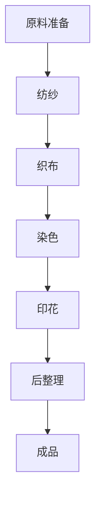

                 


### 1.1.1 传统纺织行业的现状

#### 传统纺织行业的现状

传统纺织行业作为人类社会发展的基石之一，历史悠久，其工艺和技术历经千年的演变，已成为一种独特的文化传承。目前，传统纺织行业主要分布在亚洲、欧洲和美洲的一些国家和地区，如中国的云南、贵州、新疆等地，印度的加尔各答，以及欧洲的意大利和法国等地。

随着全球经济的发展和人民生活水平的提高，纺织品的消费需求不断增加。然而，传统纺织行业面临着一系列挑战。首先，传统纺织工艺复杂，生产效率相对较低，无法满足大规模市场的需求。其次，传统纺织材料的可持续性较低，导致环境污染和资源浪费。此外，传统纺织行业面临着技术更新换代缓慢、市场竞争激烈、劳动力成本上升等问题。

#### 可持续时尚的发展趋势

近年来，随着人们对环境保护意识的增强，可持续时尚（Sustainable Fashion）逐渐成为一个热门话题。可持续时尚强调在时尚产业中采用环保、可持续的生产和消费模式，减少对环境的负面影响。其发展趋势主要包括以下几个方面：

1. **环保材料的研发与应用**：天然纤维如棉、麻、丝、毛等以及再生纤维如聚酯、尼龙等逐渐成为纺织行业的新宠。此外，一些新兴的生物基纤维和环保纤维也受到广泛关注。

2. **可持续生产技术的应用**：如自然染色、无水印染、环保印花等技术，不仅减少了对环境的污染，还提高了生产效率。

3. **循环经济的推广**：倡导废旧纺织品的回收再利用，通过设计可拆卸、可维修的服装，延长产品的使用寿命。

4. **消费者意识的提高**：越来越多的消费者开始关注服装的环保属性，愿意为可持续时尚产品支付更高的价格。

#### 结合的重要性

将传统纺织技术与可持续时尚理念相结合，具有以下几个方面的意义：

1. **文化传承与创新**：传统纺织技术蕴含着丰富的文化内涵，通过与现代科技相结合，可以创新出更多具有文化价值的可持续时尚产品。

2. **资源利用效率的提升**：传统纺织技术往往依赖于手工操作，而可持续时尚强调高效、环保的生产方式，二者结合可以提高资源利用效率。

3. **经济效益与生态效益的双赢**：传统纺织行业可以借助可持续时尚的发展，实现经济效益和生态效益的双赢，推动产业升级和可持续发展。

### 1.1.2 书籍的目的与读者对象

本书旨在为现代手工织物工作室提供一套全面、系统的指导方案，帮助从业者将传统纺织技术与可持续时尚理念相结合，实现创新与可持续发展。具体目标包括：

1. **技术指导**：详细介绍传统纺织技术的基本原理和实践方法，包括材料选择、工艺流程、设备操作等。

2. **理念传播**：深入解析可持续时尚的核心概念和原则，引导读者树立正确的可持续时尚观念。

3. **实践案例**：通过丰富的实践案例，展示传统纺织技术在可持续时尚中的应用效果，为读者提供实用的参考。

本书适用于以下读者群体：

1. **传统纺织行业从业者**：希望通过学习可持续时尚理念，提升自身技能和产业竞争力。

2. **时尚产业从业者**：希望了解并掌握传统纺织技术，将可持续时尚理念融入时尚设计。

3. **环保爱好者**：对可持续时尚感兴趣，希望为环境保护贡献自己的力量。

### 1.2.1 可持续时尚概述

#### 核心概念

可持续时尚（Sustainable Fashion）是指在全球范围内，通过采用环保、可持续的生产和消费模式，减少时尚产业对环境的负面影响。其核心概念包括：

1. **环保材料**：采用环保、可再生的材料，如天然纤维、再生纤维、生物基纤维等。

2. **可持续生产**：通过优化生产过程，减少能源消耗、水污染和废弃物产生。

3. **循环经济**：倡导废旧纺织品的回收再利用，实现资源的闭环循环。

4. **社会责任**：关注工人权益、供应链透明度、生态多样性等社会责任问题。

#### 发展背景

可持续时尚理念起源于20世纪末，随着全球环保意识的提高，时尚产业逐渐意识到其生产过程中对环境造成的巨大影响。2000年后，可持续发展成为全球范围内的热门话题，各国政府和企业纷纷采取措施，推动时尚产业的可持续发展。

#### 发展趋势

1. **环保材料研发**：随着科技的进步，越来越多的环保材料被研发出来，如生物基纤维、环保染料等。

2. **可持续生产技术**：环保染料、节能生产设备等技术的应用，使生产过程更加环保。

3. **消费者意识觉醒**：越来越多的消费者开始关注服装的环保属性，愿意为可持续时尚产品支付更高的价格。

4. **产业政策支持**：各国政府纷纷出台政策，支持时尚产业的可持续发展。

### 1.2.2 传统纺织技术的核心要素

#### 传统纺织技术概述

传统纺织技术是指通过手工或简单机械设备，将纤维材料加工成纺织品的技术。其核心要素包括：

1. **纤维材料**：包括天然纤维（如棉、麻、丝、毛）和再生纤维（如聚酯、尼龙）。

2. **纺织工艺**：包括纺织、染色、印花、后整理等环节。

3. **设备**：包括手工工具、简单机械设备等。

4. **文化内涵**：传统纺织技术蕴含着丰富的文化内涵，是民族文化的传承。

#### 特点

1. **手工性**：传统纺织技术以手工操作为主，具有独特的手工艺价值。

2. **多样性**：传统纺织技术工艺繁多，具有丰富的文化多样性。

3. **环保性**：传统纺织技术通常采用天然材料和环保工艺，对环境影响较小。

#### 应用领域

1. **服装业**：传统纺织技术在服装制作中广泛应用，特别是在高端定制和手工艺术品领域。

2. **家居装饰**：传统纺织技术制作的布艺家居用品，具有独特的艺术价值和文化内涵。

3. **文化产业**：传统纺织技术是民族文化的重要组成部分，对文化传承具有重要意义。

### 1.2.3 概念属性特征对比表

| 特征       | 可持续时尚               | 传统纺织技术                 |
| ---------- | -------------------- | -------------------------- |
| 材料选择   | 环保、可再生材料         | 天然纤维、再生纤维           |
| 生产过程   | 高效、环保、低碳排放      | 手工性、多样性、环保性       |
| 消费者意识 | 高环保意识、社会责任感强   | 文化传承、手工艺价值         |
| 文化内涵   | 强调社会责任、生态平衡     | 民族文化、手工艺传承         |

### 1.2.4 ER实体关系图

```mermaid
erDiagram
  产品 ||--|{ 纺织材料 }|--|| 工艺
  产品 ||--|{ 生产设备 }|--|| 工艺
  产品 ||--|{ 环保标准 }|--|| 可持续时尚
  纺织材料 ||--|{ 天然纤维 }|--|| 传统纺织技术
  纺织材料 ||--|{ 再生纤维 }|--|| 传统纺织技术
  生产设备 ||--|{ 手工工具 }|--|| 传统纺织技术
  生产设备 ||--|{ 简单机械设备 }|--|| 传统纺织技术
  可持续时尚 ||--|{ 环保材料 }|--|| 传统纺织技术
  可持续时尚 ||--|{ 可持续生产 }|--|| 传统纺织技术
  可持续时尚 ||--|{ 循环经济 }|--|| 传统纺织技术
```

### 1.2.5 算法原理讲解

#### 传统纺织技术流程图



#### 纺纱过程

纺纱是纺织过程的第一步，将纤维材料转化为纱线。其基本原理如下：

```python
# 纺纱过程Python代码示例
def spin_fiber(fiber):
    # 输入：纤维材料
    # 输出：纱线
    spinner = Spinner(fiber)
    thread = spinner-spin()
    return thread
```

#### 织布过程

织布是将纱线交织成布料的过程。其基本原理如下：

```python
# 织布过程Python代码示例
def weave_threads(spin_thread):
    # 输入：纱线
    # 输出：布料
    weaver = Weaver(spin_thread)
    fabric = weaver-weave()
    return fabric
```

#### 染色与印花过程

染色与印花是纺织品加工的关键环节，用于赋予布料颜色和图案。其基本原理如下：

```python
# 染色与印花过程Python代码示例
def dye_fabric(fabric, color):
    # 输入：布料、颜色
    # 输出：染色的布料
    dyer = Dyer(fabric, color)
    dyed_fabric = dyer-dye()
    return dyed_fabric

def print_fabric(fabric, pattern):
    # 输入：布料、图案
    # 输出：印花的布料
    printer = Printer(fabric, pattern)
    printed_fabric = printer-print()
    return printed_fabric
```

#### 后整理过程

后整理是对纺织品进行加工，以提高其质量和耐用性。其基本原理如下：

```python
# 后整理过程Python代码示例
def finish_fabric(fabric):
    # 输入：布料
    # 输出：整理后的布料
    finisher = Finisher(fabric)
    finished_fabric = finisher-finish()
    return finished_fabric
```

### 1.2.6 数学模型与公式

传统纺织技术的数学模型和公式主要涉及纤维的拉伸性能、纱线的强度、织物的密度和透气性等。以下是一个简单的例子：

$$
\text{纱线强度} = \frac{\text{纱线断裂负荷}}{\text{纱线直径}}
$$

$$
\text{织物密度} = \frac{\text{织物单位面积纱线条数}}{\text{织物面积}}
$$

$$
\text{织物透气性} = \frac{\text{空气流量}}{\text{织物压力差}}
$$

通过上述公式，我们可以计算出纱线和织物的性能指标，从而指导纺织工艺的优化。

### 1.2.7 算法应用举例

假设我们要制作一件棉T恤，我们可以按照以下步骤进行：

1. 选择优质棉纤维作为原料。
2. 通过纺纱过程将棉纤维转化为棉纱。
3. 使用织布机将棉纱交织成布料。
4. 使用环保染料将布料染成白色。
5. 在布料上使用环保印花技术印上图案。
6. 对布料进行后整理，以提高其耐用性和舒适性。

通过这个过程，我们不仅实现了传统纺织技术的应用，还满足了可持续时尚的要求，为消费者提供了一件环保、舒适、有文化内涵的棉T恤。

### 1.2.8 传统纺织技术与可持续时尚的结合

将传统纺织技术与可持续时尚理念相结合，可以实现以下目标：

1. **保护环境**：通过使用环保材料和可持续生产技术，减少对环境的负面影响。
2. **传承文化**：将传统纺织工艺与现代设计相结合，传承和弘扬民族文化。
3. **提升产业竞争力**：通过技术创新和可持续时尚理念的引导，提升传统纺织行业的竞争力。

### 1.2.9 未来发展趋势

随着科技的进步和环保意识的提高，传统纺织技术与可持续时尚的结合将越来越紧密。未来，我们可能看到更多的环保材料、智能纺织设备和创新设计，为传统纺织行业注入新的活力。

### 1.2.10 挑战与机遇

尽管传统纺织技术与可持续时尚的结合具有巨大潜力，但仍然面临一些挑战，如技术门槛、成本压力、市场认知等。然而，这些挑战也带来了机遇，通过技术创新和产业合作，有望实现传统纺织行业的可持续发展。

### 1.2.11 结论

传统纺织技术与可持续时尚的结合，不仅有助于保护环境、传承文化，还能提升产业竞争力。通过本书的介绍，读者可以了解传统纺织技术的核心要素、可持续时尚的理念，以及如何将二者结合应用于现代手工织物工作室中。

### 1.3 纺织材料的选择与可持续性

#### 纺织材料的选择

在纺织过程中，材料的选择至关重要。选择合适的纺织材料不仅影响产品的性能，还关系到生产成本和环境影响。以下是一些常见的纺织材料及其特点：

1. **天然纤维**：如棉、麻、丝、毛等。天然纤维具有优良的透气性、吸湿性和舒适性，对人体皮肤友好，且易于生物降解。

2. **再生纤维**：如聚酯、尼龙等。再生纤维是通过回收废旧塑料等材料制成的，具有较低的碳排放，但生产过程中仍需注意环保问题。

3. **生物基纤维**：如聚乳酸、聚羟基烷酸等。生物基纤维是以可再生资源为原料制成的，具有较低的碳足迹，且可完全生物降解。

4. **环保纤维**：如竹纤维、木纤维等。环保纤维是从天然植物中提取的，具有环保、舒适、抗菌等特点。

#### 可持续性评估方法

为了评估纺织材料的可持续性，可以采用以下方法：

1. **生命周期评估（LCA）**：生命周期评估是一种全面、系统的评估方法，用于评估产品或服务在整个生命周期内的资源消耗和环境影响。通过LCA，可以计算出纺织材料的碳排放量、能源消耗、水资源消耗等指标。

2. **环境足迹评估（EF）**：环境足迹评估是一种衡量产品或服务对环境影响的量化方法，通常以全球变暖潜力、酸化潜力、生物多样性损失等指标来评估。

3. **绿色标签认证**：绿色标签认证是一种第三方认证体系，用于评估产品或服务的环保性能。常见的绿色标签认证包括OEKO-TEX、GOTS、 bluesign等。

#### 传统纺织材料的可持续性分析

传统纺织材料，如棉、麻、丝、毛等，在可持续性方面具有一定的优势，但也存在一些问题：

1. **优点**：
   - **环保性**：天然纤维可生物降解，对环境污染较小。
   - **舒适性**：天然纤维具有良好的透气性、吸湿性，对人体皮肤友好。
   - **可再生性**：棉、麻、丝、毛等天然纤维可以再生种植。

2. **缺点**：
   - **资源消耗**：天然纤维的生产需要大量土地、水资源和农药化肥。
   - **生产过程**：传统纺织工艺复杂，生产效率较低，能源消耗较高。
   - **环境污染**：天然纤维生产过程中可能产生废水、废气等污染物。

#### 可持续材料的应用实例

为了提高纺织材料的可持续性，一些新材料和新技术的应用取得了显著成果：

1. **再生纤维**：如再生聚酯、再生尼龙等，通过回收废旧塑料瓶等材料制成，可大幅减少碳排放。

2. **生物基纤维**：如聚乳酸、聚羟基烷酸等，以可再生资源为原料，具有较低的碳足迹。

3. **环保染色技术**：如无水印染、自然染色等，可减少水资源消耗和化学物质排放。

4. **智能纤维**：如发光纤维、抗菌纤维等，具有特殊功能，可提高产品附加值。

### 1.4 传统纺织技术的创新应用

#### 传统纺织工艺的创新方向

传统纺织技术具有悠久的历史和丰富的文化内涵，但在现代时尚产业中，其应用面临着一些挑战。为了实现可持续发展，传统纺织工艺需要在以下几个方面进行创新：

1. **环保工艺**：采用环保染料、无水印染、自然染色等技术，减少对环境的污染。

2. **高效生产**：通过引入自动化设备、智能化生产系统等，提高生产效率，降低能源消耗。

3. **再生资源利用**：开发再生纤维、废旧纺织品回收利用技术，减少资源浪费。

4. **多功能纤维**：通过科技创新，开发具有特殊功能（如防水、透气、抗菌等）的纤维，提高产品附加值。

#### 传统纺织技术的可持续发展潜力

传统纺织技术具有以下可持续发展潜力：

1. **文化传承**：传统纺织技术蕴含着丰富的文化内涵，通过创新应用，可以传承和弘扬民族文化。

2. **资源利用**：传统纺织技术通常采用天然材料，具有可再生性和环保性。

3. **劳动力就业**：传统纺织技术具有劳动密集型的特点，可以创造大量就业机会。

#### 创新应用案例分析

以下是一个创新应用案例：

1. **项目背景**：某服装品牌希望将传统织锦工艺与现代时尚设计相结合，推出一款环保、有文化价值的可持续时尚产品。

2. **创新方向**：
   - 采用可再生材料（如竹纤维）作为原料。
   - 使用环保染色技术，减少化学物质的使用。
   - 引入自动化织机，提高生产效率。

3. **实施效果**：
   - 产品在市场上受到欢迎，实现了良好的经济效益。
   - 减少了碳排放，对环境友好。
   - 传承了传统织锦工艺，弘扬了民族文化。

### 1.5 纺织产品的设计与开发

#### 可持续时尚设计原则

可持续时尚设计原则旨在减少时尚产业对环境的负面影响，以下是一些关键原则：

1. **环保材料**：优先选择环保、可再生的材料，如天然纤维、再生纤维、生物基纤维等。

2. **优化生产过程**：采用环保生产工艺，如无水印染、自然染色等，减少能源消耗和化学物质排放。

3. **设计可拆卸性**：设计可拆卸、可维修的服装，延长产品使用寿命。

4. **循环利用**：倡导废旧纺织品的回收再利用，实现资源的闭环循环。

5. **社会责任**：关注供应链透明度、工人权益、生态多样性等社会责任问题。

#### 纺织产品生命周期管理

纺织产品生命周期管理是指从原材料采购到生产、使用、回收再利用的全过程管理。以下是生命周期管理的几个关键环节：

1. **原材料采购**：选择环保、可持续的材料，确保供应链的可持续性。

2. **生产过程**：采用环保、节能的生产技术，减少能源消耗和废弃物产生。

3. **产品使用**：设计可拆卸、可维修的服装，延长产品使用寿命。

4. **回收再利用**：倡导废旧纺织品的回收再利用，减少资源浪费。

5. **废物处理**：采用环保的废物处理方法，减少对环境的影响。

#### 设计开发流程与案例分析

以下是一个设计开发流程的案例分析：

1. **项目背景**：某设计师希望设计一款环保、时尚的可持续服装，以推广可持续时尚理念。

2. **设计原则**：
   - 选用再生纤维和天然纤维作为主要材料。
   - 采用无水印染和自然染色技术。
   - 设计可拆卸的服装结构，方便维修和回收再利用。

3. **实施过程**：
   - 原材料采购：选择具有环保认证的再生纤维和天然纤维。
   - 设计阶段：根据可持续时尚设计原则，进行款式和结构设计。
   - 生产阶段：采用环保染料和无水印染技术，确保生产过程的环保性。
   - 成品检测：对成品进行环保性能和耐用性测试。

4. **效果评估**：
   - 成品在市场上受到消费者欢迎，实现了良好的经济效益。
   - 减少了碳排放，对环境友好。
   - 传播了可持续时尚理念，推动了行业可持续发展。

### 1.6 设施与设备

#### 工作室的基本设施

一个现代手工织物工作室的基本设施包括：

1. **纤维处理设备**：如开松机、梳棉机、并条机等，用于处理纤维材料。

2. **纺纱设备**：如纺纱机、络筒机等，用于将纤维材料纺成纱线。

3. **织布设备**：如织机、络筒机、整经机等，用于将纱线织成布料。

4. **染色与印花设备**：如染色机、印花机、烘干机等，用于对布料进行染色和印花处理。

5. **后整理设备**：如烫平机、定形机、柔软剂等，用于对布料进行后整理处理。

#### 常用设备介绍

以下是一些常用设备及其功能：

1. **梳棉机**：用于梳理纤维，使其整齐均匀。

2. **并条机**：用于将多组纤维合并成一条，提高纺纱效率。

3. **纺纱机**：用于将纤维纺成纱线。

4. **织机**：用于将纱线织成布料。

5. **染色机**：用于对布料进行染色处理。

6. **印花机**：用于对布料进行印花处理。

7. **烘干机**：用于对染色或印花后的布料进行烘干。

8. **烫平机**：用于对布料进行烫平处理，使其平整光滑。

#### 设备维护与保养

设备维护与保养是保证手工织物工作室正常运转的关键。以下是一些注意事项：

1. **定期清洁**：定期对设备进行清洁，防止灰尘和污垢积累。

2. **润滑**：对设备进行定期润滑，确保设备的顺畅运行。

3. **检查**：定期检查设备的运行状态，发现问题及时维修。

4. **保养**：按照设备使用说明进行定期保养，延长设备寿命。

5. **培训**：对设备操作人员进行定期培训，确保其熟练掌握设备操作技巧。

### 1.7 技能培训与实践

#### 手工纺织技能培训内容

手工纺织技能培训主要包括以下内容：

1. **纤维材料处理**：了解各种纤维材料的特性，掌握纤维材料的处理方法。

2. **纺纱技术**：学习手工纺纱的基本原理和操作方法，掌握纱线的质量和质量检验。

3. **织布技术**：学习织布的基本原理和操作方法，掌握织布机的使用和维护。

4. **染色与印花技术**：了解染色与印花的基本原理，学习手工染色的技巧和印花图案的设计。

5. **后整理技术**：学习后整理的基本原理和操作方法，掌握布料的整理技巧。

#### 实践操作步骤解析

以下是一个手工纺织技能培训实践操作的步骤解析：

1. **准备材料**：准备好所需的纤维材料、工具和设备。

2. **纤维处理**：对纤维材料进行开松、梳理等处理，使其整齐均匀。

3. **纺纱**：将处理后的纤维纺成纱线，注意掌握纺纱的技巧，确保纱线质量。

4. **织布**：将纱线织成布料，注意掌握织布机的操作，确保织布质量。

5. **染色与印花**：对布料进行染色或印花处理，选择合适的染料和印花图案。

6. **后整理**：对染色或印花后的布料进行整理，使其平整光滑，提高使用性能。

#### 技能提升案例分享

以下是一个技能提升案例分享：

1. **项目背景**：某学员参加手工纺织技能培训，希望通过实践提升自己的技能。

2. **实践过程**：
   - 第一阶段：学习纤维处理、纺纱技术，掌握基本操作。
   - 第二阶段：学习织布技术，独立完成织布过程。
   - 第三阶段：学习染色与印花技术，设计并完成自己的印花图案。
   - 第四阶段：学习后整理技术，提高布料的整理质量。

3. **成果展示**：
   - 学员独立完成了一件手工纺织作品，质量达到了培训要求。
   - 学员在实践过程中，不断提升自己的技能，取得了显著的进步。

### 1.8 工作室管理与运营

#### 工作室的组织结构

一个现代手工织物工作室通常包括以下几个部门：

1. **设计部**：负责纺织产品设计和开发，与市场部门紧密合作，确保产品符合市场需求。

2. **生产部**：负责纺织生产过程的管理和执行，确保生产效率和质量。

3. **销售部**：负责产品销售和市场营销，拓展市场份额。

4. **技术部**：负责设备维护和技术支持，确保设备正常运行。

5. **行政部**：负责工作室的行政管理，包括人事、财务等事务。

#### 人力资源与财务管理

人力资源与财务管理是工作室运营的重要环节，以下是一些关键点：

1. **人力资源**：
   - 招聘与培训：招聘具备相关技能的员工，并定期进行培训，提升员工素质。
   - 员工激励：制定合理的员工激励机制，提高员工的工作积极性和满意度。

2. **财务管理**：
   - 成本控制：制定详细的成本预算，严格控制成本，确保经济效益。
   - 收入管理：通过市场推广和产品销售，提高收入水平。

#### 品牌建设与市场推广

品牌建设与市场推广是工作室发展的重要战略，以下是一些建议：

1. **品牌定位**：明确工作室的品牌定位，塑造独特的品牌形象。

2. **市场调研**：了解市场需求，制定符合市场趋势的产品策略。

3. **营销渠道**：利用线上和线下渠道，拓宽销售市场。

4. **公关活动**：积极参与各类公关活动，提高品牌知名度和美誉度。

### 1.9 可持续时尚的未来

#### 可持续时尚发展的挑战与机遇

1. **挑战**：
   - **技术门槛**：环保材料和可持续生产技术的研究和应用尚需进一步提升。
   - **成本压力**：可持续时尚产品的生产成本较高，对消费者而言可能难以接受。
   - **市场认知**：消费者对可持续时尚的认知程度较低，需要加大宣传力度。

2. **机遇**：
   - **环保意识的提高**：随着环保意识的提高，越来越多的消费者愿意为环保产品支付更高的价格。
   - **技术创新**：随着科技的进步，越来越多的环保材料和可持续生产技术被研发出来，为可持续发展提供了更多可能性。
   - **政策支持**：各国政府纷纷出台政策，支持可持续时尚产业的发展。

#### 未来趋势预测

1. **环保材料的应用**：环保材料将在纺织行业得到更广泛的应用，如生物基纤维、再生纤维等。

2. **智能化生产**：智能纺织设备将逐步替代传统手工设备，提高生产效率和产品质量。

3. **消费者意识的觉醒**：随着消费者对环保和可持续时尚的认识加深，可持续时尚产品将成为主流。

4. **循环经济的推广**：废旧纺织品的回收再利用将成为时尚产业的重要组成部分。

#### 应对策略

1. **技术创新**：加大环保材料和可持续生产技术的研究力度，降低生产成本。

2. **品牌建设**：提升品牌形象，提高市场竞争力。

3. **消费者教育**：通过宣传和教育活动，提高消费者对可持续时尚的认知。

4. **政策支持**：积极参与政策制定，争取更多政策支持。

### 1.10 小结

本文从传统纺织行业的现状、可持续时尚的发展趋势、传统纺织技术的创新应用、纺织产品设计与开发、工作室管理等多个方面，探讨了现代手工织物工作室在可持续时尚中的应用。通过本文的介绍，读者可以了解到传统纺织技术与可持续时尚的结合具有重要意义，为时尚产业的可持续发展提供了新的思路和方法。

### 1.11 注意事项

1. **材料选择**：在选择纺织材料时，要充分考虑其环保性和可持续性。

2. **生产过程**：在生产过程中，要采用环保工艺，减少能源消耗和废弃物产生。

3. **技能培训**：对工作人员进行定期技能培训，提高其专业素质。

4. **品牌建设**：注重品牌建设，提高品牌知名度和美誉度。

### 1.12 拓展阅读

1. **相关书籍**：
   - 《可持续时尚：时尚产业的绿色转型》
   - 《纺织工艺学》
   - 《环境科学与可持续发展》

2. **在线课程与研讨会**：
   - 可持续时尚在线课程
   - 纺织工艺在线研讨会

3. **学术期刊与论文资源**：
   - 《时尚产业与环境》
   - 《纺织科学与技术》

通过拓展阅读，读者可以进一步深入了解现代手工织物工作室在可持续时尚中的应用，为实际工作提供更多指导和参考。

