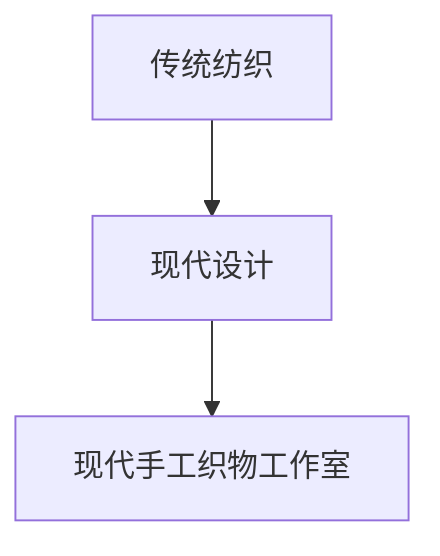

                 

# 现代手工织物工作室：传统纺织在现代设计中的应用

## 关键词

- 现代手工织物
- 传统纺织
- 设计应用
- 创新融合
- 社会文化价值

## 摘要

本文旨在探讨传统纺织在现代设计中的应用，以及如何通过建立现代手工织物工作室来实现这一融合。文章首先介绍了传统纺织的历史与演变，以及现代设计的基本概念和发展趋势。接着，文章详细分析了传统纺织在现代设计中的应用，包括材料选择、设计风格和技术创新等方面。通过成功案例的分析，文章展示了传统纺织在现代设计中的成功实践。随后，文章探讨了现代手工织物工作室的设置与管理，包括空间规划、工作流程、成本控制和盈利模式等方面。最后，文章展望了现代手工织物在市场中的应用与前景，以及其在社会与文化价值方面的意义。

## 目录大纲

### 第一部分：背景介绍与问题核心

#### 1.1 问题描述与解决

##### 1.1.1 问题背景

##### 1.1.2 问题描述

##### 1.1.3 解决方案概述

##### 1.1.4 边界与外延

#### 1.2 核心概念与联系

##### 1.2.1 核心概念

##### 1.2.2 概念属性特征对比

##### 1.2.3 概念联系与关系图

### 第二部分：传统纺织与现代设计的融合

#### 2.1 传统纺织与现代设计的背景

##### 2.1.1 传统纺织的历史与演变

##### 2.1.2 现代设计的概念与发展

##### 2.1.3 传统纺织在现代设计中的挑战与机遇

#### 2.2 传统纺织在现代设计中的应用

##### 2.2.1 材料选择与应用

##### 2.2.2 设计风格与趋势

##### 2.2.3 技术创新与实现

#### 2.3 成功案例分析

##### 2.3.1 案例一：传统纺织在现代服饰设计中的应用

##### 2.3.2 案例二：传统纺织在现代家居设计中的应用

##### 2.3.3 案例三：传统纺织在现代艺术装置设计中的应用

#### 2.4 拓展应用领域

##### 2.4.1 传统纺织在工艺品制作中的应用

##### 2.4.2 传统纺织在建筑与室内设计中的应用

##### 2.4.3 传统纺织在时尚产业中的未来趋势

### 第三部分：现代手工织物的工作室设置与管理

#### 3.1 工作室设置

##### 3.1.1 空间规划

##### 3.1.2 设备选择与配置

##### 3.1.3 原材料采购与储存

#### 3.2 工作流程与管理

##### 3.2.1 设计阶段

##### 3.2.2 生产阶段

##### 3.2.3 质量控制与检验

##### 3.2.4 营销与推广

#### 3.3 成本控制与盈利模式

##### 3.3.1 成本预算与分配

##### 3.3.2 盈利模式分析

##### 3.3.3 风险评估与管理

#### 3.4 工作室运营与未来发展

##### 3.4.1 团队建设与人才培养

##### 3.4.2 创新能力提升

##### 3.4.3 持续发展策略

### 第四部分：现代手工织物的创意与设计

#### 4.1 创意思维方法

##### 4.1.1 概念化思维

##### 4.1.2 模式化思维

##### 4.1.3 形式思维

##### 4.1.4 变异思维

#### 4.2 设计工具与技术

##### 4.2.1 传统手工技术

##### 4.2.2 现代数码技术

##### 4.2.3 材料创新与实验

#### 4.3 设计流程与案例

##### 4.3.1 设计流程概述

##### 4.3.2 设计案例解析

##### 4.3.3 设计反馈与优化

#### 4.4 案例展示与评价

##### 4.4.1 案例展示

##### 4.4.2 评价标准与原则

##### 4.4.3 评价案例分析

### 第五部分：现代手工织物在市场中的应用与前景

#### 5.1 市场分析与定位

##### 5.1.1 市场环境分析

##### 5.1.2 消费者需求分析

##### 5.1.3 市场定位策略

#### 5.2 品牌建设与营销策略

##### 5.2.1 品牌理念与价值观

##### 5.2.2 品牌形象设计

##### 5.2.3 营销渠道与推广

#### 5.3 产品定价与销售模式

##### 5.3.1 产品定价策略

##### 5.3.2 销售渠道选择

##### 5.3.3 销售模式创新

#### 5.4 行业趋势与未来发展

##### 5.4.1 行业趋势分析

##### 5.4.2 未来发展前景

##### 5.4.3 创新方向与策略

### 第六部分：现代手工织物的社会与文化价值

#### 6.1 现代手工织物的艺术价值

##### 6.1.1 传统与现代艺术的交融

##### 6.1.2 手工织物的艺术表现力

##### 6.1.3 创作灵感与艺术风格

#### 6.2 现代手工织物的文化传承

##### 6.2.1 文化内涵与地域特色

##### 6.2.2 传统技艺的保护与传承

##### 6.2.3 当代文化的创新与发展

#### 6.3 社会责任与可持续发展

##### 6.3.1 环保理念与实践

##### 6.3.2 社会责任与公益项目

##### 6.3.3 可持续发展的路径与策略

#### 6.4 影响与启示

##### 6.4.1 现代手工织物对社会的深远影响

##### 6.4.2 启示与借鉴

##### 6.4.3 未来发展方向与挑战

### 第七部分：结论与展望

#### 7.1 结论总结

##### 7.1.1 书籍内容的回顾与总结

##### 7.1.2 研究成果与贡献

#### 7.2 展望未来

##### 7.2.1 未来发展展望

##### 7.2.2 研究方向与建议

##### 7.2.3 读者启示与建议

--------------------

### 第一部分：背景介绍与问题核心

#### 1.1 问题描述与解决

##### 1.1.1 问题背景

传统纺织作为一种历史悠久的手工技艺，在全球范围内都有着广泛的应用。然而，随着现代科技的快速发展，传统纺织面临着诸多挑战。一方面，传统纺织技艺的传承和发展受到了限制，很多手工艺人面临失业的风险；另一方面，现代设计需求日益多样化，传统纺织难以满足这些需求。因此，如何将传统纺织与现代设计相结合，实现创新融合，成为了一个亟待解决的问题。

##### 1.1.2 问题描述

问题描述主要集中在以下几个方面：

1. 如何将传统纺织技艺与现代设计理念相结合，创造出具有时代特色的新作品？
2. 如何通过技术创新，提高传统纺织的效率和品质？
3. 如何构建一个可持续发展的现代手工织物工作室，以适应市场需求？

##### 1.1.3 解决方案概述

为了解决上述问题，本文提出以下解决方案：

1. 通过研究传统纺织的历史与演变，了解其基本概念和特性，为现代设计提供灵感。
2. 探索传统纺织在现代设计中的应用，包括材料选择、设计风格和技术创新等方面。
3. 建立现代手工织物工作室，制定科学合理的工作流程和管理模式，以实现传统纺织与现代设计的有效融合。

##### 1.1.4 边界与外延

本文的研究边界主要限定在传统纺织与现代设计的融合应用上，不涉及其他相关领域的深入探讨。同时，本文的研究具有一定的外延性，可以为其他手工技艺与现代设计的融合提供参考和借鉴。

#### 1.2 核心概念与联系

##### 1.2.1 核心概念

1. **传统纺织**：指以手工技艺为主，利用纤维材料制成的纺织品。传统纺织具有历史悠久、技艺精湛、文化内涵丰富等特点。
2. **现代设计**：指基于现代审美观念和市场需求，运用现代技术和工具进行的设计活动。现代设计注重创新、实用和美观，具有时代特色。
3. **现代手工织物工作室**：指以现代设计理念为指导，融合传统纺织技艺和现代科技手段，进行织物创作和生产的场所。

##### 1.2.2 概念属性特征对比

| 概念       | 特征 |
|------------|------|
| 传统纺织   | 历史悠久、技艺精湛、文化内涵丰富 |
| 现代设计   | 创新、实用、美观、时代特色 |
| 现代手工织物工作室 | 融合传统与现代、技术创新、高效生产 |

##### 1.2.3 概念联系与关系图

传统纺织作为基础，通过现代设计理念的应用，实现了向现代手工织物工作室的转型。现代手工织物工作室则成为传统纺织与现代设计相结合的重要载体，推动了传统纺织的创新与发展。

### 第二部分：传统纺织与现代设计的融合

#### 2.1 传统纺织与现代设计的背景

##### 2.1.1 传统纺织的历史与演变

传统纺织起源于史前时期，随着人类文明的进步，纺织技艺不断发展和完善。中国古代的丝织、棉织、麻织等技艺，代表了世界纺织业的先进水平。传统纺织工艺不仅体现了人类对自然资源的合理利用，也承载了丰富的文化内涵和历史记忆。

随着时间的推移，传统纺织经历了以下几个阶段：

1. **起源与初步发展**：纺织作为人类基本的生活需求之一，起源于新石器时代。
2. **繁荣时期**：古代文明时期，如中国的汉唐时期、欧洲的文艺复兴时期，纺织业达到了繁荣。
3. **工业化发展**：18世纪末，随着工业革命的到来，纺织业开始向机械化、自动化转变。
4. **现代手工艺复兴**：20世纪末，随着人们对传统手工艺的重新认识，传统纺织技艺得到了保护和传承。

##### 2.1.2 现代设计的概念与发展

现代设计起源于20世纪初，随着工业化和科技的发展，设计理念逐渐从艺术分离出来，成为一种独立的学科。现代设计的核心思想是满足人们的功能需求，同时追求美观和个性化。

现代设计经历了以下几个阶段：

1. **功能主义时期**：强调设计的实用性和功能性，以包豪斯学派为代表。
2. **后现代主义时期**：强调设计的多样性和创新性，反对单一风格和形式的束缚。
3. **数字化设计时期**：随着计算机技术的发展，数字化设计成为现代设计的重要手段。

##### 2.1.3 传统纺织在现代设计中的挑战与机遇

传统纺织在现代设计中面临着诸多挑战：

1. **技艺传承与创新**：传统纺织技艺需要传承，同时也需要创新，以适应现代设计的需要。
2. **生产效率与成本**：传统手工生产效率较低，成本较高，难以与工业化产品竞争。
3. **市场需求变化**：现代消费者对纺织品的需求越来越多样化，传统纺织难以满足这些需求。

然而，传统纺织也面临着巨大的机遇：

1. **文化价值**：传统纺织具有丰富的文化内涵，可以与现代设计相结合，创造独特的作品。
2. **个性化需求**：现代消费者越来越追求个性化，传统纺织的个性化特点恰好满足了这一需求。
3. **环保意识**：随着环保意识的增强，传统纺织的环保特性得到了认可。

#### 2.2 传统纺织在现代设计中的应用

##### 2.2.1 材料选择与应用

在传统纺织与现代设计的融合中，材料选择是至关重要的环节。传统纺织材料包括棉、麻、丝、毛等，这些材料具有不同的质地和特性，适用于不同的设计需求。

1. **棉**：棉质地的柔软舒适，适合制作家居用品、服饰等，特别是在现代家居设计中，棉质织物因其自然质感而受到青睐。
2. **麻**：麻织物的纹理清晰，透气性好，适合制作夏季服装和家居用品，如麻质窗帘、桌布等。
3. **丝**：丝绸具有光泽和质感，适合制作高端服装和家居装饰，如丝巾、窗帘等。
4. **毛**：羊毛织物保暖性好，适合制作冬季服装和家居用品，如毛衣、地毯等。

在现代设计中，传统纺织材料的创新应用主要包括：

- **混纺**：将传统纺织材料与其他纤维材料混合，以获得更丰富的质地和性能。
- **染色和印花**：运用现代染色和印花技术，为传统纺织材料注入新的设计元素。
- **复合结构**：将传统纺织材料与其他材料复合，创造新型纺织品，如纺织品与皮革、金属等的结合。

##### 2.2.2 设计风格与趋势

传统纺织在现代设计中的应用，不仅体现在材料选择上，还表现在设计风格和趋势上。

1. **简约风格**：现代设计追求简洁、纯粹的美感，传统纺织的天然纹理和质朴色彩，与简约风格相得益彰。
2. **复古风格**：复古风的兴起，使得传统纺织材料在服装、家居设计等领域得到了广泛应用，如复古图案的印花、复古色系的运用等。
3. **个性化设计**：现代消费者对个性化的追求，促使设计师在传统纺织材料的基础上，进行创意设计，如定制服装、家居饰品等。

##### 2.2.3 技术创新与实现

传统纺织在现代设计中的应用，离不开技术创新的支撑。以下是一些关键的技术创新：

1. **数码印花**：数码印花技术使传统纺织材料的图案设计和色彩应用更加灵活，为设计师提供了无限的创意空间。
2. **纺织复合材料**：通过将传统纺织材料与其他材料复合，如纺织品与纳米材料、生物材料的结合，创造出新型功能性纺织品。
3. **自动化生产**：自动化生产技术提高了传统纺织的生产效率，降低了成本，使得传统纺织在现代设计中更具竞争力。

#### 2.3 成功案例分析

##### 2.3.1 案例一：传统纺织在现代服饰设计中的应用

**案例背景**：设计师张女士，对传统纺织技艺有着深厚的兴趣，她希望通过现代服饰设计，将传统纺织与现代时尚相结合。

**设计思路**：张女士选择棉、麻等传统纺织材料，结合现代印花、编织技术，设计出一系列兼具传统特色和现代时尚感的服饰。

**实施过程**：

1. **材料选择**：选用优质棉麻面料，确保舒适性和透气性。
2. **图案设计**：采用数码印花技术，设计出具有现代感的图案，如抽象几何图形、艺术画作等。
3. **编织工艺**：运用手工编织技术，为服饰增添传统特色，如手工编织的毛衣、围巾等。
4. **成品展示**：在时装周上展示设计成果，得到了观众和媒体的高度评价。

**效果评估**：

1. **市场反响**：设计作品在市场上大受欢迎，销售额显著增长。
2. **社会影响**：张女士的设计为传统纺织技艺的传承和创新做出了积极贡献。

##### 2.3.2 案例二：传统纺织在现代家居设计中的应用

**案例背景**：家居品牌“织梦”，致力于将传统纺织技艺与现代家居设计相结合，打造独具特色的家居产品。

**设计思路**：“织梦”品牌以传统纺织材料为基础，通过创新设计，开发出一系列家居用品，如窗帘、沙发套、地毯等。

**实施过程**：

1. **材料选择**：选用优质丝绸、羊毛等传统纺织材料，确保家居用品的质感和舒适性。
2. **设计风格**：以简约、复古、个性化为设计风格，结合现代家居审美需求。
3. **生产技术**：采用数码印花、立体编织等技术，提高生产效率和产品质量。
4. **市场推广**：通过线上线下渠道，将设计作品推向市场。

**效果评估**：

1. **市场表现**：“织梦”品牌的家居产品在市场上取得了良好的销售业绩，品牌知名度不断提升。
2. **社会意义**：“织梦”品牌的设计理念和实践，推动了传统纺织技艺的传承和创新。

##### 2.3.3 案例三：传统纺织在现代艺术装置设计中的应用

**案例背景**：艺术家李先生，擅长将传统纺织技艺融入现代艺术装置设计中。

**设计思路**：李先生利用传统纺织材料，创作出一系列具有强烈视觉冲击力和表现力的艺术装置，如大型编织雕塑、装置艺术等。

**实施过程**：

1. **材料选择**：选用各种传统纺织材料，如棉、麻、丝等，确保作品的稳定性和耐久性。
2. **创作理念**：以当代社会为主题，通过传统纺织材料的表现形式，探讨人与自然、人与社会的关系。
3. **制作工艺**：采用手工编织、刺绣等传统工艺，确保作品的独特性和艺术性。
4. **展览展示**：在国内外艺术展览上展出，引起了广泛的关注和讨论。

**效果评估**：

1. **艺术评价**：李先生的艺术装置作品得到了艺术界的高度评价，被认为是传统纺织在现代艺术装置设计中的重要探索。
2. **社会影响**：李先生的作品不仅丰富了现代艺术的表现形式，也为传统纺织技艺的传承和创新提供了新的思路。

#### 2.4 拓展应用领域

##### 2.4.1 传统纺织在工艺品制作中的应用

传统纺织技艺在工艺品制作中有着广泛的应用，如刺绣、织锦、手工编织等。这些工艺品不仅具有艺术价值，还承载了丰富的文化内涵。随着现代设计理念的融入，传统纺织工艺品在设计和制作上不断创新，拓展了其应用领域。

1. **家居装饰**：传统纺织工艺品如地毯、窗帘、桌布等，广泛应用于家居装饰，为家庭生活增添艺术气息。
2. **服饰配饰**：传统纺织技艺在服饰配饰中的应用，如刺绣服饰、手工编织围巾等，提升了服饰的个性化和时尚感。
3. **艺术品**：传统纺织工艺品如刺绣画、织锦屏风等，作为艺术品被收藏和欣赏，具有很高的艺术价值。

##### 2.4.2 传统纺织在建筑与室内设计中的应用

传统纺织材料在建筑与室内设计中也有着广泛的应用。如纺织材料制成的窗帘、屏风、地毯等，不仅可以美化空间，还具有隔音、隔热等功能。

1. **建筑外立面**：纺织材料制成的外立面装饰，如编织幕墙、纺织幕墙等，为建筑增添了独特的美感和文化特色。
2. **室内装饰**：纺织材料在室内装饰中的应用，如窗帘、地毯、墙面装饰等，为室内空间增添了温馨和舒适的氛围。
3. **功能性应用**：纺织材料在功能性应用方面的探索，如纺织材料制成的隔音板、隔热板等，为建筑提供了更多的节能方案。

##### 2.4.3 传统纺织在时尚产业中的未来趋势

随着现代设计理念的融入，传统纺织在时尚产业中的应用前景广阔。未来，传统纺织在时尚产业中可能呈现出以下趋势：

1. **个性化定制**：随着消费者对个性化需求的增加，传统纺织的个性化定制将成为时尚产业的一个重要发展方向。
2. **环保可持续**：环保意识的增强，将推动传统纺织在环保、可持续方面的创新，如使用可再生材料、减少环境污染等。
3. **跨领域融合**：传统纺织与其他领域的融合，如纺织与科技、纺织与艺术等，将创造出更多新颖的产品和设计。

### 第三部分：现代手工织物的工作室设置与管理

#### 3.1 工作室设置

##### 3.1.1 空间规划

空间规划是现代手工织物工作室设置的首要任务，合理规划空间可以确保工作效率和舒适度。

1. **功能区划分**：根据工作流程和需求，将工作室划分为设计区、生产区、展示区、仓储区等功能区。
2. **布局设计**：设计区应靠近窗户，确保自然采光；生产区应远离设计区，避免噪音干扰；展示区应宽敞明亮，便于展示作品。
3. **空间利用率**：合理利用空间，确保每个功能区都有足够的工作空间和储存空间。

##### 3.1.2 设备选择与配置

设备选择与配置直接影响工作室的工作效率和质量。

1. **纺织设备**：选择合适的纺织设备，如织机、绣机、染料机等，确保生产过程的顺利进行。
2. **设计工具**：配置专业的计算机、绘图软件等设计工具，为设计师提供高效便捷的设计环境。
3. **辅助设备**：如烫平机、烘干机等辅助设备，提升生产效率和产品质量。

##### 3.1.3 原材料采购与储存

原材料采购与储存是工作室运营的重要环节。

1. **原材料选择**：根据设计需求和市场需求，选择合适的原材料，如棉、麻、丝、毛等。
2. **采购渠道**：建立稳定的采购渠道，确保原材料的品质和供应。
3. **储存管理**：建立科学的储存管理制度，确保原材料的新鲜度和质量。

#### 3.2 工作流程与管理

##### 3.2.1 设计阶段

设计阶段是现代手工织物工作室的核心环节，高效的设计流程可以确保作品的创新性和市场竞争力。

1. **设计灵感**：从生活、艺术、文化等各个方面获取灵感，为设计提供创意来源。
2. **设计草图**：将灵感转化为设计草图，初步确定设计方向和风格。
3. **图案设计**：运用计算机绘图软件，对图案进行精细设计，确保图案的准确性和美观性。
4. **样品制作**：根据设计图纸，制作样品，进行测试和调整。

##### 3.2.2 生产阶段

生产阶段是现代手工织物工作室的实际操作环节，科学的生产流程可以确保产品质量和生产效率。

1. **原材料准备**：根据设计要求，准备相应的原材料，如棉、麻、丝、毛等。
2. **纺织工艺**：根据设计图纸，选择合适的纺织工艺，如织造、绣花、编织等。
3. **后处理**：对成品进行后处理，如染色、印花、烫平等，确保产品的质量和美观度。
4. **质量检验**：对成品进行严格的质量检验，确保产品质量符合标准。

##### 3.2.3 质量控制与检验

质量控制与检验是现代手工织物工作室的重要环节，确保产品的质量和可靠性。

1. **质量控制体系**：建立完善的质量控制体系，确保每个生产环节都有质量控制措施。
2. **质量检验标准**：制定严格的质量检验标准，对成品进行多方面检验，如尺寸、颜色、纹理等。
3. **问题反馈与改进**：对出现质量问题的产品进行反馈和改进，确保产品质量不断提升。

##### 3.2.4 营销与推广

营销与推广是现代手工织物工作室取得成功的重要手段，合理的营销策略可以提升品牌知名度和市场占有率。

1. **品牌建设**：建立独特的品牌形象，明确品牌理念和价值主张，提升品牌竞争力。
2. **市场定位**：根据市场需求和消费者特征，确定市场定位策略，确保产品能够精准满足消费者需求。
3. **营销渠道**：通过线上线下渠道，拓宽产品销售渠道，提高产品销量。
4. **营销活动**：举办各类营销活动，如展览、讲座、促销等，提升品牌知名度和美誉度。

#### 3.3 成本控制与盈利模式

##### 3.3.1 成本预算与分配

成本预算与分配是现代手工织物工作室运营的重要环节，合理控制成本可以提高盈利能力。

1. **成本预算**：根据生产规模和市场需求，制定详细的成本预算，包括原材料成本、设备成本、人工成本等。
2. **成本分配**：将成本按比例分配到各个生产环节，确保每个环节的成本合理控制。

##### 3.3.2 盈利模式分析

盈利模式分析是现代手工织物工作室运营的重要策略，合理的盈利模式可以提高工作室的盈利能力。

1. **产品销售**：通过销售成品获得利润，是工作室的主要盈利模式。
2. **定制服务**：提供个性化定制服务，满足消费者对独特产品的需求，增加收入。
3. **教育培训**：开展纺织技艺培训，培养新一代手工艺人，实现知识传承和经济效益的双赢。
4. **跨界合作**：与其他行业进行跨界合作，如艺术、设计、科技等，拓展业务范围，实现多元化盈利。

##### 3.3.3 风险评估与管理

风险评估与管理是现代手工织物工作室运营的重要环节，合理评估和管理风险可以降低运营风险。

1. **市场风险**：分析市场变化趋势，预测市场需求，降低市场风险。
2. **技术风险**：评估新技术应用的风险，确保新技术应用的安全性和稳定性。
3. **运营风险**：建立完善的运营管理体系，确保工作室的稳定运营。

#### 3.4 工作室运营与未来发展

##### 3.4.1 团队建设与人才培养

团队建设与人才培养是现代手工织物工作室可持续发展的重要保障。

1. **团队建设**：建立高效团队，明确团队成员的职责和角色，提升团队协作能力。
2. **人才培养**：开展专业技能培训，提高员工的专业技能和综合素质，培养创新型人才。

##### 3.4.2 创新能力提升

创新能力提升是现代手工织物工作室持续发展的关键。

1. **技术创新**：不断引进新技术、新材料，提升产品的科技含量和市场竞争力。
2. **设计创新**：鼓励设计师进行创意设计，推动传统纺织与现代设计的融合。

##### 3.4.3 持续发展策略

持续发展策略是现代手工织物工作室长期发展的重要策略。

1. **市场拓展**：开拓新的市场领域，扩大市场份额，实现业务的多元化发展。
2. **品牌建设**：加强品牌建设，提升品牌知名度和美誉度，增强品牌竞争力。
3. **可持续发展**：关注环保和可持续发展，推动绿色生产和环保意识的普及。

### 第四部分：现代手工织物的创意与设计

#### 4.1 创意思维方法

##### 4.1.1 概念化思维

概念化思维是将复杂的事物抽象为简单的概念，通过概念之间的关系来理解和创造。在现代手工织物设计中，概念化思维可以帮助设计师从宏观角度把握设计主题，从而创造出有深度的作品。

- **实例**：以“自然”为主题，可以将自然中的各种元素如水、风、植物等抽象为概念，再通过这些概念之间的关系，如循环、共生、变化等，设计出具有自然元素的织物图案。

##### 4.1.2 模式化思维

模式化思维是通过识别和运用现有的模式来创新设计。模式可以是图案、颜色搭配、纹理等。设计师可以通过改变模式的组合和呈现方式，创造出新的设计。

- **实例**：在织物设计中，传统图案可以通过现代设计手法如几何图形的切割和重组，呈现出新的视觉效果。

##### 4.1.3 形式思维

形式思维关注设计的形式美，包括比例、对称、平衡等。通过形式思维，设计师可以创造出和谐统一的作品。

- **实例**：在织物设计中，通过对图案大小的对比、颜色的搭配和纹理的层次感，创造出视觉上的平衡和和谐。

##### 4.1.4 变异思维

变异思维是在原有设计基础上进行变化和改进，以创造出新的设计。变异思维鼓励设计师敢于尝试，不断探索。

- **实例**：在织物设计中，通过对传统图案的变形，如颜色的改变、纹理的添加等，创造出具有现代感的织物。

#### 4.2 设计工具与技术

##### 4.2.1 传统手工技术

传统手工技术是现代手工织物设计的重要基础，包括织造、绣花、编织等技艺。这些技艺不仅赋予织物独特的质感和纹理，还能传递出深厚的文化内涵。

- **实例**：刺绣技艺在织物设计中发挥着重要作用，通过刺绣可以将复杂的花纹和图案精细地呈现出来。

##### 4.2.2 现代数码技术

现代数码技术为现代手工织物设计提供了更多的可能性，包括数码印花、激光切割、3D建模等。这些技术不仅提高了生产效率，还使设计更加多样化和个性化。

- **实例**：数码印花技术可以将设计师的创意迅速转化为实物，实现复杂图案的高效生产。

##### 4.2.3 材料创新与实验

材料创新与实验是现代手工织物设计的重要方向，通过新材料的应用和实验，可以创造出全新的织物效果。

- **实例**：通过混合天然纤维和合成纤维，可以创造出具有特殊质感和性能的织物，如防水透气织物。

#### 4.3 设计流程与案例

##### 4.3.1 设计流程概述

现代手工织物设计流程通常包括以下几个阶段：

1. **创意构思**：设计师通过灵感获取和思维训练，形成初步的设计概念。
2. **图案设计**：将创意转化为具体的图案，运用传统手工技术和现代数码技术进行设计。
3. **样品制作**：根据设计图案制作样品，进行测试和调整。
4. **成品生产**：根据样品和生产流程，进行大批量生产。

##### 4.3.2 设计案例解析

**案例背景**：设计师李小姐受自然景观的启发，设计了一系列以山水为主题的织物作品。

**设计思路**：

1. **创意构思**：李小姐从山水景观中获取灵感，将山水的线条、形状和色彩作为设计元素。
2. **图案设计**：运用数码印花技术，将山水图案精细地呈现在织物上。
3. **样品制作**：制作样品，对图案的清晰度、颜色和质感进行测试和调整。
4. **成品生产**：根据样品，进行大批量生产，确保成品的质量和一致性。

**效果评估**：

1. **市场表现**：设计作品在市场上得到了良好的反响，受到了消费者的喜爱。
2. **社会影响**：设计作品不仅展示了传统山水文化的魅力，也为现代织物设计提供了新的视角和灵感。

##### 4.3.3 设计反馈与优化

设计反馈与优化是设计流程的重要环节，通过收集用户反馈和市场数据，不断改进设计。

1. **用户反馈**：通过用户反馈，了解消费者对设计作品的喜好和意见，为下一次设计提供参考。
2. **市场数据**：分析市场数据，了解产品的销售情况，优化生产策略和营销策略。
3. **设计改进**：根据用户反馈和市场数据，对设计进行改进，提升作品的质量和市场竞争力。

#### 4.4 案例展示与评价

##### 4.4.1 案例展示

以下是一些现代手工织物设计案例的展示：

- **案例一**：以传统刺绣技法创作的现代礼服，融合了传统刺绣的精美细节和现代设计的大胆风格。
- **案例二**：使用数码印花技术制作的家居纺织品，以其鲜艳的色彩和复杂的图案，为家居空间增添活力。
- **案例三**：结合传统编织技艺和现代设计理念的围巾，以其独特的手工编织纹理和个性化的图案设计，成为时尚配饰。

##### 4.4.2 评价标准与原则

对现代手工织物设计进行评价时，可以参照以下标准：

1. **创意性**：设计是否具有独特性和创新性，是否打破了传统设计的束缚。
2. **实用性**：设计是否符合实际需求，是否具有实用的功能和舒适的使用体验。
3. **美观性**：设计是否具有艺术美感，是否能够引起观众的共鸣。
4. **工艺质量**：设计作品是否精细，工艺质量是否达到标准。

##### 4.4.3 评价案例分析

**案例一**：以传统刺绣技法创作的现代礼服

- **创意性**：设计融合了传统刺绣的精美细节和现代设计的大胆风格，具有很高的创意性。
- **实用性**：礼服的设计符合现代场合的需求，具有良好的实用性。
- **美观性**：礼服的色彩搭配和谐，图案设计精美，具有较高的艺术美感。
- **工艺质量**：刺绣工艺精细，图案清晰，展现了传统刺绣的高超技艺。

**案例二**：使用数码印花技术制作的家居纺织品

- **创意性**：数码印花技术使设计具有现代感和多样性，具有较高的创意性。
- **实用性**：家居纺织品色彩鲜艳，图案丰富，能够提升家居环境的氛围，具有良好的实用性。
- **美观性**：设计图案复杂且具有视觉冲击力，美观性突出。
- **工艺质量**：印花图案清晰，色彩饱满，工艺质量达到标准。

**案例三**：结合传统编织技艺和现代设计理念的围巾

- **创意性**：围巾的设计结合了传统编织技艺和现代设计理念，展现了传统与现代的融合，具有很高的创意性。
- **实用性**：围巾的设计适合多种场合，具有良好的实用性。
- **美观性**：围巾的编织纹理独特，图案设计个性化，美观性突出。
- **工艺质量**：编织工艺精湛，图案设计细腻，工艺质量达到标准。

### 第五部分：现代手工织物在市场中的应用与前景

#### 5.1 市场分析与定位

##### 5.1.1 市场环境分析

现代手工织物市场环境复杂多样，受多种因素影响：

1. **经济环境**：全球经济波动、通货膨胀等因素会影响消费者的购买力。
2. **技术环境**：科技进步，特别是纺织技术的创新，将改变市场格局。
3. **文化环境**：传统文化复兴，消费者对文化内涵的需求增加。
4. **社会环境**：环保意识的提升，消费者对可持续发展的关注增加。

##### 5.1.2 消费者需求分析

现代手工织物市场的消费者需求具有以下特点：

1. **个性化**：消费者越来越追求独特、个性化的产品。
2. **高品质**：消费者对产品质量和耐用性有较高的要求。
3. **文化内涵**：消费者对具有文化内涵的产品有较强的偏好。
4. **环保**：消费者关注产品的环保性能，对可持续发展的支持增加。

##### 5.1.3 市场定位策略

为了在市场上取得成功，现代手工织物企业需要制定合适的定位策略：

1. **高端市场**：针对追求高品质、个性化的消费者，提供高端手工织物产品。
2. **中端市场**：满足大众消费者对高品质、实用性的需求，提供中档价位的产品。
3. **细分市场**：针对特定消费群体，如年轻时尚群体、环保意识强烈的消费者，提供定制化的产品。
4. **品牌塑造**：通过品牌形象建设，提升产品的市场竞争力和品牌忠诚度。

#### 5.2 品牌建设与营销策略

##### 5.2.1 品牌理念与价值观

品牌理念与价值观是品牌建设的核心，现代手工织物品牌应具备以下理念：

1. **传统与现代的融合**：强调传统纺织技艺与现代设计的结合，创造具有时代特色的产品。
2. **个性化与独特性**：注重产品的个性化设计，满足消费者的独特需求。
3. **高品质与舒适性**：坚持高品质标准，提供舒适、耐用的产品。
4. **可持续与环保**：关注可持续发展，使用环保材料和工艺。

##### 5.2.2 品牌形象设计

品牌形象设计是品牌建设的重要环节，包括：

1. **品牌标识**：设计独特的品牌标识，体现品牌的核心价值。
2. **品牌色彩**：选择具有辨识度和记忆点的品牌色彩，提升品牌形象。
3. **品牌口号**：提炼简洁有力的品牌口号，传达品牌理念和价值观。
4. **品牌视觉**：通过统一的视觉设计，提升品牌的整体形象。

##### 5.2.3 营销渠道与推广

现代手工织物品牌需要多样化的营销渠道和推广策略：

1. **线上渠道**：利用电商平台、社交媒体等，扩大品牌影响力和销售渠道。
2. **线下渠道**：开设品牌专卖店、参加时尚展览和活动，提升品牌知名度。
3. **定制服务**：提供个性化定制服务，增强消费者对品牌的认同感和忠诚度。
4. **跨界合作**：与其他品牌、艺术家合作，开展联名设计，拓展品牌影响力。

#### 5.3 产品定价与销售模式

##### 5.3.1 产品定价策略

现代手工织物产品的定价策略应考虑以下因素：

1. **成本**：包括原材料成本、生产成本、人工成本等。
2. **市场竞争**：分析竞争对手的定价策略，确保产品的市场竞争力。
3. **消费者需求**：根据消费者的支付能力和消费心理，制定合理的定价策略。

##### 5.3.2 销售渠道选择

现代手工织物销售渠道的选择应考虑以下因素：

1. **目标市场**：根据目标市场的特点，选择合适的销售渠道。
2. **成本效益**：评估不同销售渠道的投入产出比，选择成本效益最高的渠道。
3. **市场覆盖率**：选择能够覆盖目标市场的销售渠道。

##### 5.3.3 销售模式创新

销售模式的创新是提升现代手工织物市场竞争力的重要手段：

1. **线上销售**：通过电商平台、社交媒体等渠道，实现线上销售，提高销售效率和覆盖范围。
2. **线下体验**：开设线下体验店，提供产品试用和定制服务，增强消费者体验。
3. **跨界销售**：与其他行业合作，如家居、时尚等，拓宽销售渠道和产品应用领域。

#### 5.4 行业趋势与未来发展

##### 5.4.1 行业趋势分析

现代手工织物行业呈现出以下趋势：

1. **个性化定制**：消费者对个性化产品的需求日益增加，个性化定制成为行业的重要趋势。
2. **环保可持续**：环保意识的提升，消费者对环保、可持续产品的需求增加。
3. **跨界融合**：传统纺织与现代设计、科技等领域的跨界融合，创造出更多新颖的产品和设计。
4. **数字化发展**：数字化技术的应用，提高了生产效率和质量，推动了行业的数字化转型。

##### 5.4.2 未来发展前景

未来，现代手工织物行业具有广阔的发展前景：

1. **市场潜力**：随着消费升级和个性化需求的增加，市场潜力巨大。
2. **技术创新**：随着科技的进步，纺织技术的创新将为行业带来更多发展机遇。
3. **品牌建设**：品牌建设将成为行业竞争的重要手段，具有品牌优势的企业将脱颖而出。
4. **可持续发展**：环保和可持续发展将成为行业发展的核心，推动行业的绿色转型。

##### 5.4.3 创新方向与策略

为了抓住行业发展的机遇，现代手工织物企业应采取以下创新方向与策略：

1. **技术创新**：不断引进新技术、新材料，提升产品的科技含量和市场竞争力。
2. **设计创新**：鼓励设计师进行创意设计，推动传统纺织与现代设计的融合。
3. **渠道创新**：拓展销售渠道，实现线上与线下的有机结合，提高市场覆盖率。
4. **品牌建设**：加强品牌建设，提升品牌知名度和美誉度，增强品牌竞争力。

### 第六部分：现代手工织物的社会与文化价值

#### 6.1 现代手工织物的艺术价值

##### 6.1.1 传统与现代艺术的交融

现代手工织物设计充分体现了传统与现代艺术的交融，通过传统纺织技艺的运用和现代设计理念的融入，创造出独特的艺术作品。

1. **艺术形式**：现代手工织物设计不仅包括纺织品本身，还涵盖与之相关的装饰品、艺术品等，形式多样，充满艺术感。
2. **艺术表现**：通过色彩、纹理、图案等元素的运用，现代手工织物作品具有强烈的视觉冲击力和艺术表现力。
3. **艺术价值**：现代手工织物作品不仅具有审美价值，还承载了丰富的文化内涵和历史记忆，具有较高的艺术价值。

##### 6.1.2 手工织物的艺术表现力

现代手工织物设计通过独特的艺术表现力，吸引了大量艺术爱好者和收藏家的关注。

1. **视觉艺术**：通过色彩、纹理和图案的运用，现代手工织物作品展现了独特的视觉艺术效果，具有很强的视觉吸引力。
2. **空间艺术**：在现代家居设计和建筑中，现代手工织物作品通过空间布局和装饰，创造出独特的艺术氛围，提升了空间的艺术价值。
3. **行为艺术**：通过现代手工织物作品，艺术家可以进行行为艺术创作，如现场编织、刺绣等，为观众带来全新的艺术体验。

##### 6.1.3 创作灵感与艺术风格

现代手工织物设计的创作灵感来源于生活、艺术、文化等多个领域，不同的艺术风格在作品中得到了充分的体现。

1. **自然风格**：以自然景观为创作灵感，现代手工织物作品呈现出自然、简约的风格，如山水、植物等图案。
2. **复古风格**：以复古元素为创作灵感，现代手工织物作品呈现出复古、经典的风格，如复古图案、色彩搭配等。
3. **现代风格**：以现代设计理念为创作灵感，现代手工织物作品呈现出时尚、前卫的风格，如抽象图案、几何形状等。

#### 6.2 现代手工织物的文化传承

##### 6.2.1 文化内涵与地域特色

现代手工织物作品不仅具有艺术价值，还承载了丰富的文化内涵和地域特色。

1. **文化内涵**：现代手工织物作品通过图案、色彩和纹理等元素，传达了不同地域的文化特色和历史记忆，如中国传统文化的龙、凤、花鸟等图案。
2. **地域特色**：不同地域的手工织物作品具有独特的文化内涵和地域特色，如新疆的维吾尔刺绣、西藏的唐卡等，展现了丰富多样的地域文化。

##### 6.2.2 传统技艺的保护与传承

现代手工织物作品是对传统纺织技艺的保护与传承的重要方式。

1. **技艺传承**：通过现代手工织物作品，传统纺织技艺得到了传承和发扬，如手工刺绣、织锦、编织等技艺。
2. **技艺创新**：在传承传统技艺的基础上，现代手工织物作品通过创新设计，使传统技艺焕发出新的生命力。

##### 6.2.3 当代文化的创新与发展

现代手工织物作品不仅传承了传统纺织技艺和文化内涵，还融入了当代文化元素，推动了文化的创新与发展。

1. **文化融合**：现代手工织物作品通过融合不同文化元素，如西方艺术、现代设计等，创造出具有时代特色的文化作品。
2. **文化创新**：现代手工织物作品通过创新设计，推动了文化的创新与发展，为传统文化注入了新的活力。

#### 6.3 社会责任与可持续发展

##### 6.3.1 环保理念与实践

现代手工织物作品在环保理念和实践方面具有显著的优势。

1. **环保材料**：现代手工织物作品采用环保材料，如天然纤维、可再生材料等，减少了环境污染和资源浪费。
2. **环保工艺**：现代手工织物作品在生产和加工过程中，采用环保工艺，减少了对环境的污染。

##### 6.3.2 社会责任与公益项目

现代手工织物企业通过社会责任和公益项目，积极参与社会公益事业，承担社会责任。

1. **公益项目**：现代手工织物企业通过开展公益项目，如爱心捐赠、公益活动等，帮助弱势群体，推动社会公平和和谐发展。
2. **社会责任**：现代手工织物企业关注社会责任，通过绿色生产、环保宣传等方式，推动环保意识的普及。

##### 6.3.3 可持续发展的路径与策略

现代手工织物企业应制定可持续发展路径和策略，实现经济效益和社会效益的双赢。

1. **绿色生产**：采用绿色生产方式，降低生产过程中的能耗和污染，实现环保生产。
2. **资源循环**：通过资源的循环利用，减少资源浪费，实现可持续发展。
3. **社会责任**：积极参与社会公益事业，承担社会责任，推动社会进步。

#### 6.4 影响与启示

##### 6.4.1 现代手工织物对社会的深远影响

现代手工织物在社会各个领域产生了深远影响。

1. **经济影响**：现代手工织物作品推动了相关产业的发展，创造了就业机会，促进了经济增长。
2. **文化影响**：现代手工织物作品传承了传统纺织技艺和文化内涵，推动了文化的创新与发展。
3. **环保影响**：现代手工织物作品倡导环保理念，推动了环保意识的普及。

##### 6.4.2 启示与借鉴

现代手工织物作品为其他领域提供了启示和借鉴。

1. **创新思维**：现代手工织物作品通过融合传统与现代，展现了创新的思维模式，为其他领域的创新提供了借鉴。
2. **文化传承**：现代手工织物作品通过传承和发扬传统纺织技艺和文化内涵，为其他领域的文化传承提供了借鉴。
3. **可持续发展**：现代手工织物作品倡导环保理念，推动了可持续发展，为其他领域的可持续发展提供了借鉴。

##### 6.4.3 未来发展方向与挑战

现代手工织物在未来发展中面临着诸多挑战。

1. **技术创新**：现代手工织物需要不断引进新技术、新材料，提高生产效率和产品质量，实现技术创新。
2. **市场拓展**：现代手工织物需要拓展市场，提高品牌知名度和市场占有率，实现市场拓展。
3. **人才培养**：现代手工织物需要培养高素质的设计师和工艺师，推动传统纺织技艺的传承和创新。

### 第七部分：结论与展望

#### 7.1 结论总结

通过对现代手工织物在传统纺织与现代设计中的应用、工作室设置与管理、创意与设计、市场应用与前景、社会与文化价值等方面的探讨，本文得出了以下结论：

1. **传统与现代的融合**：现代手工织物通过将传统纺织技艺与现代设计理念相结合，创造出具有时代特色的新作品，推动了传统纺织的创新与发展。
2. **工作室设置与管理**：现代手工织物工作室的设置与管理需要科学合理，通过空间规划、设备选择、原材料采购与储存等方面的优化，提高工作效率和产品质量。
3. **创意与设计**：现代手工织物设计需要运用创意思维方法，结合传统手工技术和现代数码技术，创造出具有艺术价值和文化内涵的作品。
4. **市场应用与前景**：现代手工织物在市场中的应用前景广阔，通过市场分析与定位、品牌建设与营销策略、产品定价与销售模式等方面的优化，可以提高市场竞争力。
5. **社会与文化价值**：现代手工织物在社会和文化价值方面具有深远的影响，通过社会责任与可持续发展的实践，为社会的进步和文化的传承做出了积极贡献。

#### 7.2 展望未来

未来，现代手工织物的发展将面临诸多机遇和挑战。本文提出以下展望和建议：

1. **技术创新**：未来，现代手工织物应继续推动技术创新，通过引进新技术、新材料，提高生产效率和产品质量，实现可持续发展。
2. **市场拓展**：未来，现代手工织物应拓展市场，通过品牌建设和营销策略的优化，提高市场知名度和占有率，实现市场多元化发展。
3. **人才培养**：未来，现代手工织物应重视人才培养，通过教育培训和团队建设，培养高素质的设计师和工艺师，推动传统纺织技艺的传承和创新。
4. **文化传承**：未来，现代手工织物应继续传承和发扬传统文化，通过作品展示和文化活动，推动文化的创新与发展。
5. **社会责任**：未来，现代手工织物应积极参与社会公益事业，通过环保理念和实践，推动社会责任的履行和可持续发展。

总之，现代手工织物在现代设计中的应用和工作室设置与管理具有重要意义，通过不断探索和创新，现代手工织物将在未来发挥更大的社会和文化价值。同时，读者也应关注现代手工织物的发展动态，积极参与其中，为传统纺织的传承和创新做出贡献。作者：AI天才研究院/AI Genius Institute & 禅与计算机程序设计艺术 /Zen And The Art of Computer Programming。

