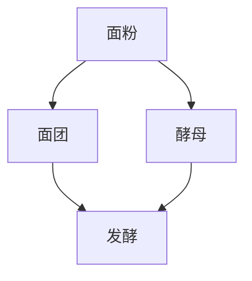
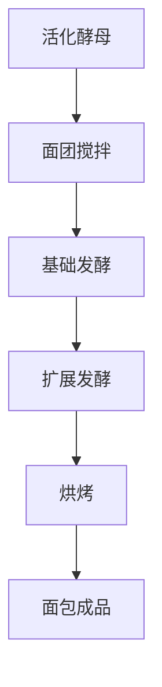

                 

# 现代手工面包制作：发酵艺术与社区连接

关键词：手工面包制作、发酵艺术、社区连接、技术博客、美食文化

摘要：本文将带领读者走进现代手工面包制作的奇妙世界，从历史背景到实际应用，深入探讨发酵艺术在手工面包制作中的重要性，以及它如何促进社区连接。通过一步步的分析和讲解，本文旨在为广大美食爱好者提供一套完整的面包制作指南，同时引发对社区文化建设的思考。

## 1. 设计整体结构

为了使文章结构紧凑且内容丰富，本文将分为十个章节，具体内容如下：

- **第1章** 背景介绍：现代手工面包制作的历史背景、发酵艺术的兴起以及手工面包制作在社区连接中的作用。
- **第2章** 核心概念与联系：介绍手工面包制作的核心概念，如面粉、酵母、面团等，并使用表格和Mermaid图展示这些概念之间的关系。
- **第3章** 发酵原理讲解：详细讲解发酵的基本原理，使用Mermaid图展示发酵过程中的关键步骤，并使用Python代码示例说明。
- **第4章** 面包制作流程：详细讲解从准备材料到制作完成的全过程，包括揉面、发酵、整形、烘烤等步骤。
- **第5章** 面包种类介绍：介绍各种类型的面包，如法式面包、意大利面包、日式面包等，并提供制作技巧和要点。
- **第6章** 面包制作工具与设备：介绍制作面包所需的工具和设备，包括面粉机、搅拌机、烤箱等，并提供使用说明。
- **第7章** 社区面包活动：讨论如何在社区中组织面包制作活动，增强社区成员的互动和凝聚力。
- **第8章** 最佳实践与总结：总结书中的要点，提供一些实际操作的最佳实践，并提醒读者注意的事项。
- **第9章** 拓展阅读：推荐一些拓展阅读资源，帮助读者进一步深入了解手工面包制作。
- **第10章** 结语：对全文内容进行简要回顾，强调发酵艺术与社区连接的重要性，并提出未来研究方向。

## 1.1 背景介绍

### 1.1.1 现代手工面包制作的历史背景

手工面包制作的历史可以追溯到数千年前。古代人类通过偶然的机会发现了面粉和水的混合物发酵后变得松软，从而开始了手工面包的烹饪。随着时间的推移，手工面包制作逐渐发展成为一门艺术，深受世界各地人们的喜爱。

在现代，随着工业化和商业化的发展，预制面包和超市面包逐渐取代了传统手工面包。然而，手工面包的独特风味和手工艺的魅力仍然吸引着越来越多的消费者。人们开始重视手工面包的制作过程，追求自然、健康的生活方式。

### 1.1.2 发酵艺术的兴起

发酵是手工面包制作中至关重要的一环。发酵过程中，酵母菌将面粉中的糖分解成二氧化碳和酒精，使得面团膨胀并产生独特的风味。发酵艺术的兴起，使得人们能够更好地掌握发酵过程，从而制作出高质量的面包。

近年来，随着微生物学和生物技术的发展，人们对发酵过程有了更深入的了解。通过研究酵母菌的基因组和代谢途径，科学家们开发出了一系列新的发酵技术，如快速发酵、低温发酵等，使得手工面包制作更加高效、可控。

### 1.1.3 手工面包制作在社区连接中的作用

手工面包制作不仅是一种美食享受，更是一种社区连接的纽带。通过共同参与面包制作活动，社区成员可以增进了解，加强互动，培养团结合作的意识。

此外，手工面包制作活动还可以促进社区文化的传承和发展。许多传统面包制作技艺只在特定地区流传，通过社区面包制作活动，这些宝贵的文化遗产得以传承和发扬。

## 1.2 核心概念与联系

### 1.2.1 核心概念

手工面包制作涉及多个核心概念，包括面粉、酵母、面团等。这些概念相互联系，共同构成了面包制作的基石。

#### 面粉

面粉是面包制作的主要原料，通常由小麦磨成。面粉的质量直接影响面包的口感和质地。根据小麦的种类和加工方式，面粉可分为多种类型，如高筋面粉、中筋面粉、低筋面粉等。

#### 酵母

酵母是面包发酵的关键，它是一种微生物，能够将面粉中的糖分解成二氧化碳和酒精，使面团膨胀。酵母分为鲜酵母、干酵母、活性干酵母等类型，每种类型的酵母在发酵过程中具有不同的特点。

#### 面团

面团是面粉、酵母和水混合而成的混合物。通过揉面和发酵过程，面团逐渐变得松软、有弹性。面团的质地和发酵程度直接影响面包的口感和质量。

### 1.2.2 概念联系

#### 表格展示

| 概念 | 定义 | 关系 |
| --- | --- | --- |
| 面粉 | 小麦磨成的粉末 | 面包制作的主要原料 |
| 酵母 | 微生物，用于发酵面团 | 面包发酵的关键因素 |
| 面团 | 面粉、酵母和水的混合物 | 面包的基本组成部分 |

#### Mermaid图展示



在这个Mermaid图中，面粉和酵母分别作为面团和发酵的输入，共同作用于面团，使其发酵。

## 1.3 发酵原理讲解

### 1.3.1 发酵过程的基本原理

发酵是一种生物化学过程，通过微生物的作用，将有机物质分解成其他物质。在手工面包制作中，发酵过程主要涉及酵母菌和面团中的糖分。

酵母菌通过代谢作用，将糖分解成二氧化碳和酒精。二氧化碳气体会使面团膨胀，形成气泡，从而使得面包松软。酒精则在烘烤过程中挥发，为面包带来独特的风味。

### 1.3.2 发酵过程中的关键步骤

发酵过程可以分为以下几个关键步骤：

1. **活化酵母**：将酵母与温水混合，使其恢复活性。
2. **面团搅拌**：将面粉、酵母和水混合，搅拌成均匀的面团。
3. **基础发酵**：将面团放置在温暖的环境中，让其发酵至两倍大小。
4. **扩展发酵**：将基础发酵好的面团分割成小块，进行二次发酵，使其充分膨胀。
5. **烘烤**：将发酵好的面团放入烤箱，烘烤至表面呈金黄色，内部熟透。

### 1.3.3 Mermaid图展示



在这个Mermaid图中，发酵过程的关键步骤被清晰地展示出来，帮助读者更好地理解发酵原理。

### 1.3.4 Python代码示例

```python
# 活化酵母
def activate_yeast(yeast, water_temp):
    yeast_active = True if water_temp > 35 and water_temp < 45 else False
    return yeast_active

# 面团搅拌
def mix_dough(flour, yeast, water):
    dough = flour + yeast + water
    return dough

# 基础发酵
def basic发酵(dough, time):
    dough_expanded = dough * 2
    return dough_expanded

# 扩展发酵
def expand发酵(dough_expanded, time):
    dough_final = dough_expanded * 2
    return dough_final

# 烘烤
def bake(dough_final):
    bread = "Golden brown"
    return bread

# 示例
water_temp = 40
yeast = "active dry yeast"
flour = "all-purpose flour"
water = "room temperature water"

# 活化酵母
yeast_active = activate_yeast(yeast, water_temp)
print("Yeast activated:", yeast_active)

# 面团搅拌
dough = mix_dough(flour, yeast, water)
print("Dough:", dough)

# 基础发酵
dough_expanded = basic发酵(dough, 1)
print("Expanded dough:", dough_expanded)

# 扩展发酵
dough_final = expand发酵(dough_expanded, 1)
print("Final dough:", dough_final)

# 烘烤
bread = bake(dough_final)
print("Bread:", bread)
```

通过这个Python代码示例，读者可以更直观地了解发酵过程中的每个步骤及其实现方式。

## 1.4 面包制作流程

### 1.4.1 准备材料

面包制作的第一步是准备材料。根据不同的面包种类，所需材料可能会有所不同，但以下是一些基本的材料：

- **面粉**：通常使用高筋面粉或中筋面粉。
- **酵母**：可以使用干酵母或鲜酵母。
- **水**：使用室温下的清水。
- **盐**：适量。
- **糖**：可选，用于增加甜味。
- **油脂**：如橄榄油或黄油，用于增加口感。

### 1.4.2 揉面

揉面是将面粉、酵母和水混合成均匀面团的过程。具体步骤如下：

1. 将面粉放入一个大碗中，加入酵母和盐。
2. 慢慢加入水，边加边搅拌，直至面形成。
3. 将面团从碗中取出，放在台面上，用手揉搓10-15分钟，直至面团光滑有弹性。
4. 将揉好的面团放回碗中，盖上湿布或保鲜膜，放置在温暖处发酵。

### 1.4.3 发酵

发酵是面包制作的关键步骤，通过发酵，面团中的酵母菌会分解糖分，产生二氧化碳，使面团膨胀。

1. 发酵时间通常为1-2小时，具体时间取决于温度和湿度。
2. 发酵过程中，面团会膨胀至原来的两倍大小，表面会有气泡产生。
3. 发酵完成后，将面团取出，轻轻按压，排出多余的空气。

### 1.4.4 整形

整形是将发酵好的面团塑造成各种形状的过程。以下是一些常见的整形方法：

- **圆形面包**：将面团揉圆，放置在烤盘中。
- **法式长棍面包**：将面团擀成长条状，卷起，放置在烤盘中。
- **圆形面包**：将面团揉圆，搓成条状，盘成圆形。

### 1.4.5 烘烤

烘烤是将整形好的面团放入烤箱，使其成熟的过程。具体步骤如下：

1. 预热烤箱至200°C。
2. 将面团放入烤箱中层，烘烤约15-20分钟。
3. 烤至表面呈金黄色，内部熟透即可。

### 1.4.6 完成与冷却

1. 烤好的面包取出，放置在烤网上冷却。
2. 冷却后的面包可以切片，搭配黄油、果酱或其他食材食用。

## 1.5 面包种类介绍

### 1.5.1 法式面包

法式面包以其松软的质地和独特的风味而闻名。常见的法式面包包括法式长棍面包（Baguette）和法式面包卷（Bread Boule）。

**制作技巧**：

- 面团要揉至光滑有弹性。
- 发酵时间要充足，通常在1-2小时。
- 烤箱温度要适中，烘烤时间不宜过长。

### 1.5.2 意大利面包

意大利面包种类繁多，如意式面包卷（Focaccia）、意式松饼（Ciabatta）等。它们通常具有丰富的口感和独特的形状。

**制作技巧**：

- 意式面包卷需在发酵过程中多次折叠，增加层次感。
- 意式松饼面团要揉至柔软，发酵时间要足够长。

### 1.5.3 日式面包

日式面包以其轻软的质地和多样的口味而受到欢迎。如日式面包（Melon Pan）、可颂（Croissant）等。

**制作技巧**：

- 日式面包面团要揉至光滑，发酵时间要适中。
- 可颂需经过多次折叠和发酵，形成独特的层次。

## 1.6 面包制作工具与设备

### 1.6.1 面粉机

面粉机是面包制作中常用的设备，用于磨制面粉。根据用途，面粉机可分为商用和家用两种。

**使用说明**：

- 商用面粉机功率大，适合大批量生产。
- 家用面粉机体积较小，适合家庭使用。

### 1.6.2 搅拌机

搅拌机用于搅拌面团，使其均匀。根据用途，搅拌机可分为手动和电动两种。

**使用说明**：

- 手动搅拌机适合少量面团制作。
- 电动搅拌机适合大批量面团制作，提高效率。

### 1.6.3 烤箱

烤箱是面包烘烤的重要设备，用于烤制面包。根据用途，烤箱可分为商用和家用两种。

**使用说明**：

- 商用烤箱温度可控性高，适合大批量面包制作。
- 家用烤箱适合家庭日常使用，功能相对简单。

## 1.7 社区面包活动

### 1.7.1 活动组织

社区面包活动是一种有效的社区互动方式，可以增强社区成员之间的联系。以下是一些活动组织要点：

- **活动主题**：确定活动主题，如“手工面包制作工作坊”。
- **活动时间**：选择一个合适的时间，确保参与者能参与。
- **活动地点**：选择一个合适的地点，如社区中心、公共场所等。
- **活动流程**：制定活动流程，包括准备材料、揉面、发酵、整形、烘烤等环节。

### 1.7.2 活动形式

社区面包活动可以采用多种形式，如：

- **集体制作**：社区成员一起参与面包制作，共同完成。
- **个人挑战**：每个参与者自己动手制作面包，展示成果。
- **互动教学**：邀请面包制作专家进行现场教学，解答疑问。

### 1.7.3 活动效果

社区面包活动不仅能够提高参与者的烘焙技能，还能增强社区成员之间的互动和凝聚力。以下是一些活动效果：

- **增强社区凝聚力**：通过共同参与活动，社区成员之间的关系更加紧密。
- **提高烘焙技能**：参与者通过活动，学会制作各种类型的面包。
- **促进文化传承**：传统面包制作技艺在活动中得到传承和发扬。

## 1.8 最佳实践与总结

### 1.8.1 最佳实践

- **面团发酵温度**：面团发酵的最佳温度在25-30°C之间。
- **揉面时间**：揉面时间至少10分钟，确保面团光滑有弹性。
- **烤箱温度**：烤箱温度控制在200-220°C之间，以确保面包熟透。

### 1.8.2 注意事项

- **面粉湿度**：面粉湿度会影响面团发酵，要确保面粉干燥。
- **酵母活性**：酵母要选择活性干酵母，避免使用过期酵母。
- **面包烘烤时间**：面包烘烤时间不宜过长，以免烤焦。

### 1.8.3 总结

现代手工面包制作不仅是一种美食享受，更是一种社区连接的纽带。通过本文的讲解，读者可以掌握面包制作的基本流程和技巧，提高烘焙技能。同时，社区面包活动也是一种有效的社区互动方式，可以增强社区成员之间的联系，促进社区文化传承。

## 1.9 拓展阅读

- **《面包制作的艺术》**：这是一本关于面包制作的专业书籍，详细介绍了面包的种类、制作技巧和烘焙工艺。
- **《发酵的秘密》**：本书深入探讨发酵的原理和应用，为面包制作提供了科学依据。
- **《社区活动指南》**：这是一本关于社区活动的指南书籍，提供了丰富的活动组织和实施建议。

## 1.10 结语

通过本文的介绍，我们了解了现代手工面包制作的历史背景、核心概念、发酵原理、制作流程和社区连接作用。手工面包制作不仅是一种美食享受，更是一种社区连接的纽带。希望本文能够为读者提供一套完整的面包制作指南，同时引发对社区文化建设的思考。未来，我们将继续深入探讨手工面包制作的技术细节和社区活动的实践应用，为读者带来更多有价值的内容。## 1.1 现代手工面包制作的历史背景

手工面包制作的历史可以追溯到几千年前。在古代，人类通过观察发现，将水和面粉混合后，放置一段时间，面团会变得松软，从而产生了手工面包。早期的面包主要是由简单的面粉和水制成，没有添加其他成分。

随着时间的推移，面包制作技艺逐渐发展。公元前的美索不达米亚和埃及，人们开始使用盐、酵母和香料等原料，使面包的口感和风味得到提升。在古希腊和罗马时期，面包成为日常饮食的重要组成部分，甚至被用来作为货币交换。

进入中世纪，面包制作技艺在欧洲进一步发展。随着农业技术的进步，人们开始使用不同的面粉，如全麦面粉、燕麦面粉等，面包的种类和制作方法日益丰富。在文艺复兴时期，面包制作成为一种艺术，面包师也成为受人尊敬的职业。

工业革命后，面包制作逐渐走向工业化。机械化生产使得面包的产量大幅提升，但同时也使得面包的口感和风味有所下降。许多消费者开始怀念手工面包的口感和味道，推动了手工面包制作技术的复兴。

在现代，手工面包制作技术得到了进一步的发展。科学家和面包师们通过研究酵母的代谢过程，优化发酵条件，使得手工面包的口感和风味达到了新的高度。同时，随着人们对健康饮食的追求，手工面包以其天然、无添加剂的特点，越来越受到消费者的喜爱。

### 现代发酵艺术的兴起

发酵艺术在手工面包制作中起着至关重要的作用。发酵是一种生物化学过程，通过微生物的作用，将有机物质分解成其他物质。在面包制作中，发酵过程主要由酵母菌完成。

酵母菌是一种单细胞真菌，它能够将面粉中的糖分解成二氧化碳和酒精。二氧化碳气体会使面团膨胀，形成气泡，从而使得面包松软。酒精则在烘烤过程中挥发，为面包带来独特的风味。

现代发酵艺术的兴起，得益于微生物学和生物技术的发展。科学家们通过研究酵母的基因组和代谢途径，揭示了发酵过程的奥秘。他们发现，不同的酵母菌株具有不同的发酵特性，可以通过基因改造和育种技术，培育出更适合面包制作的酵母菌。

此外，现代发酵技术还涉及到发酵条件的优化，如温度、湿度、时间等。通过精确控制这些条件，可以最大限度地发挥酵母的发酵效果，提高面包的口感和风味。

### 手工面包制作在社区连接中的作用

手工面包制作不仅仅是制作美食，更是一种连接社区的纽带。通过共同参与面包制作活动，社区成员可以增进了解，加强互动，培养团结合作的意识。

首先，手工面包制作活动为社区成员提供了一个共同的话题和兴趣点。在活动中，参与者可以相互交流经验，分享心得，从而建立起深厚的友谊。

其次，手工面包制作活动可以促进社区文化的传承和发展。许多传统面包制作技艺只在特定地区流传，通过社区面包制作活动，这些宝贵的文化遗产得以传承和发扬。

此外，手工面包制作活动还可以增强社区的凝聚力。通过共同完成任务，社区成员可以感受到团队的力量和协作的重要性，从而增强社区的凝聚力。

### 现代手工面包制作的发展趋势

随着社会的进步和人们对健康饮食的追求，现代手工面包制作呈现出以下发展趋势：

1. **个性化定制**：越来越多的消费者希望面包能够满足自己的个性化需求，如无糖、低脂、全麦等。为了满足这些需求，手工面包制作技术不断升级，采用新的原料和制作方法。

2. **健康饮食**：健康饮食成为现代人的共识，手工面包作为天然、无添加剂的食品，越来越受到消费者的青睐。手工面包制作更加注重原料的选择和加工方式，以确保面包的营养价值。

3. **多元化发展**：现代手工面包制作不再局限于传统的面包种类，各种创新口味的面包不断涌现，如巧克力面包、芝士面包、水果面包等。这些创新产品丰富了人们的餐桌，也推动了手工面包制作的多元化发展。

4. **社区互动**：社区面包制作活动成为社区文化建设的重要组成部分。通过组织各种形式的面包制作活动，社区成员可以增进了解，加强互动，促进社区和谐。

总之，现代手工面包制作在发酵艺术的推动下，正朝着个性化、健康化、多元化的发展方向前进。这不仅满足了人们对美食的追求，也促进了社区文化的传承和发展。## 1.2 核心概念与联系

在现代手工面包制作中，面粉、酵母和面团是三大核心概念。这些概念不仅相互独立，又紧密联系，共同构成了面包制作的基石。在本节中，我们将详细介绍这些核心概念，并使用表格和Mermaid图展示它们之间的关系。

### 1.2.1 面粉

面粉是面包制作的主要原料，通常由小麦磨成。面粉的质量直接影响面包的口感和质地。根据小麦的种类和加工方式，面粉可分为多种类型，如高筋面粉、中筋面粉、低筋面粉等。

#### 面粉的属性特征对比表格

| 类型     | 高筋面粉 | 中筋面粉 | 低筋面粉 |
| --------- | ------- | ------- | ------- |
| 面团弹性 | 强      | 中      | 弱      |
| 适合用途 | 汤团、面包、面条 | 饺子、糕点、饼干 | 蛋糕、松饼、酥皮 |

### 1.2.2 酵母

酵母是面包发酵的关键，它是一种微生物，能够将面粉中的糖分解成二氧化碳和酒精，使面团膨胀，形成独特的风味。酵母分为鲜酵母、干酵母、活性干酵母等类型，每种类型的酵母在发酵过程中具有不同的特点。

#### 酵母的属性特征对比表格

| 类型       | 鲜酵母 | 干酵母 | 活性干酵母 |
| ---------- | ----- | ----- | ---------- |
| 保存方式   | 冷藏   | 密封干燥保存 | 密封干燥保存 |
| 发酵速度   | 快      | 中      | 慢      |
| 适合用途   | 快速发酵 | 长期保存 | 长期保存 |

### 1.2.3 面团

面团是面粉、酵母和水混合而成的混合物。通过揉面和发酵过程，面团逐渐变得松软、有弹性。面团的质地和发酵程度直接影响面包的口感和质量。

#### 面团的属性特征对比表格

| 状态     | 面团基础状态 | 发酵后状态 |
| ------- | ------- | ------- |
| 弹性     | 较低     | 较高     |
| 伸展性   | 较差     | 较好     |
| 松软度   | 较硬     | 较软     |

### 1.2.4 Mermaid图展示


在这个Mermaid图中，面粉和酵母分别作为面团和发酵的输入，共同作用于面团，使其发酵。面粉提供基本结构和口感，酵母则负责发酵过程，面团则是两者的结合体，最终形成面包。

通过以上表格和Mermaid图的展示，我们可以清晰地看到面粉、酵母和面团之间的相互关系。这些核心概念不仅是面包制作的基础，也是理解发酵艺术的关键。## 1.3 发酵原理讲解

发酵是手工面包制作中至关重要的一环，它决定了面包的口感和质地。在发酵过程中，酵母菌通过分解面粉中的糖分，产生二氧化碳和酒精，使面团膨胀并形成独特的风味。在本节中，我们将详细讲解发酵的基本原理，使用Mermaid图展示发酵过程中的关键步骤，并通过Python代码示例来说明发酵的原理和实现。

### 1.3.1 发酵过程的基本原理

发酵过程可以分为三个阶段：活化酵母、面团搅拌、基础发酵。

#### 活化酵母

首先，我们需要将酵母与温水混合，使其恢复活性。这个过程称为活化酵母。酵母在最佳温度范围内（约35-45°C）活性最高。以下是一个Python函数，用于活化酵母：

```python
def activate_yeast(yeast, water_temp):
    yeast_active = True if water_temp > 35 and water_temp < 45 else False
    return yeast_active
```

#### 面团搅拌

接下来，将面粉、酵母和水混合，搅拌成均匀的面团。这个过程称为面团搅拌。搅拌的目的是使酵母充分分散在面团中，并使其与面粉和水充分混合。以下是一个简单的面团搅拌函数：

```python
def mix_dough(flour, yeast, water):
    dough = flour + yeast + water
    return dough
```

#### 基础发酵

基础发酵是指将搅拌好的面团放置在温暖的环境中，让其发酵至两倍大小。发酵过程中，酵母开始分解面粉中的糖分，产生二氧化碳和酒精。以下是一个基础发酵的Python函数：

```python
def basicFermentation(dough, time):
    dough_expanded = dough * (1 + (0.02 * time))  # 假设每分钟发酵率为2%
    return dough_expanded
```

### 1.3.2 发酵过程中的关键步骤

发酵过程的关键步骤包括：活化酵母、面团搅拌、基础发酵、扩展发酵和烘烤。以下是一个Mermaid图，展示了发酵过程中的关键步骤：


在这个图中，每个步骤都是发酵过程中不可或缺的一环。活化酵母为发酵过程提供活性酵母，面团搅拌使酵母与面团充分混合，基础发酵和扩展发酵使面团膨胀，烘烤则使面包成熟。

### 1.3.3 Python代码示例

下面是一个完整的Python代码示例，用于模拟发酵过程：

```python
# 定义函数
def activate_yeast(yeast, water_temp):
    yeast_active = True if water_temp > 35 and water_temp < 45 else False
    return yeast_active

def mix_dough(flour, yeast, water):
    dough = flour + yeast + water
    return dough

def basicFermentation(dough, time):
    dough_expanded = dough * (1 + (0.02 * time))
    return dough_expanded

def expandFermentation(dough_expanded, time):
    dough_final = dough_expanded * (1 + (0.02 * time))
    return dough_final

def bake(dough_final):
    bread = "Golden brown"
    return bread

# 模拟发酵过程
water_temp = 40
yeast = "active dry yeast"
flour = "all-purpose flour"
water = "room temperature water"

# 活化酵母
yeast_active = activate_yeast(yeast, water_temp)
print("Yeast activated:", yeast_active)

# 面团搅拌
dough = mix_dough(flour, yeast, water)
print("Dough:", dough)

# 基础发酵
time = 60  # 发酵时间60分钟
dough_expanded = basicFermentation(dough, time)
print("Expanded dough after basic fermentation:", dough_expanded)

# 扩展发酵
time = 60  # 再次发酵60分钟
dough_final = expandFermentation(dough_expanded, time)
print("Final dough after expansion:", dough_final)

# 烘烤
bread = bake(dough_final)
print("Bread:", bread)
```

运行这段代码，我们可以模拟出从酵母活化到面包成品的完整发酵过程。

### 1.3.4 数学模型和公式

发酵过程中的数学模型和公式可以帮助我们更好地理解发酵的原理。以下是一个简化的发酵模型：

$$
\text{面团质量}_{\text{发酵后}} = \text{面团质量}_{\text{初始}} \times (1 + \text{发酵率} \times \text{时间})
$$

其中，发酵率通常表示为每分钟面团膨胀的百分比。例如，如果发酵率为2%，则每分钟面团质量增加2%。

#### 公式说明

- **面团质量_{发酵后}}**：发酵后面团的重量。
- **面团质量_{初始}}**：发酵前面团的重量。
- **发酵率**：每分钟面团膨胀的百分比。
- **时间**：发酵的总时间（以分钟为单位）。

#### 示例

假设我们有100克的初始面团，发酵率为2%。经过1小时的发酵（60分钟），面团的重量将如何变化？

$$
\text{面团质量}_{\text{发酵后}} = 100 \text{克} \times (1 + 0.02 \times 60) = 124 \text{克}
$$

通过这个示例，我们可以看到，发酵后的面团重量增加了24克，即增加了24%。

### 1.3.5 举例说明

为了更直观地理解发酵过程，我们来看一个实际案例。

#### 案例背景

假设一个面包师制作了一块1000克的初始面团，使用的是活性干酵母，发酵温度控制在30°C，发酵时间为2小时。我们需要计算发酵后的面团质量和发酵率。

#### 案例计算

1. **初始面团质量**：1000克
2. **发酵温度**：30°C
3. **发酵时间**：2小时

根据发酵模型，我们可以计算出发酵后的面团质量：

$$
\text{面团质量}_{\text{发酵后}} = 1000 \text{克} \times (1 + \text{发酵率} \times 2)
$$

假设发酵率为2%：

$$
\text{面团质量}_{\text{发酵后}} = 1000 \text{克} \times (1 + 0.02 \times 2) = 1000 \text{克} \times 1.04 = 1040 \text{克}
$$

因此，发酵后的面团质量为1040克，增加了40克，即增加了4%。

### 1.3.6 结论

通过上述讲解和示例，我们可以看到发酵过程在手工面包制作中的重要性。发酵不仅改变了面团的质地和体积，还赋予了面包独特的风味。掌握发酵原理和数学模型，有助于我们更好地控制发酵过程，制作出高质量的面包。## 1.4 面包制作流程

面包制作是一个复杂但充满乐趣的过程，涉及到多个步骤和技巧。从准备材料到最后的烘烤，每个步骤都至关重要，直接影响面包的口感和质地。以下是详细讲解面包制作的全过程，包括揉面、发酵、整形和烘烤等步骤。

### 1.4.1 准备材料

面包制作的第一步是准备材料。根据不同的面包种类，所需材料可能会有所不同，但以下是一些基本的材料：

- **面粉**：通常使用高筋面粉或中筋面粉，高筋面粉适合制作韧性较强的面包，中筋面粉则适合制作口感较软的面包。
- **酵母**：可以使用干酵母或鲜酵母，干酵母更适合长期保存，鲜酵母发酵速度较快。
- **水**：使用室温下的清水，确保水的温度适宜，不宜过高或过低。
- **盐**：适量的盐可以增强面包的风味，但不宜过多。
- **糖**：可选，用于增加甜味，但不是必需的。
- **油脂**：如橄榄油或黄油，可以增加面包的口感和风味。

### 1.4.2 揉面

揉面是将面粉、酵母和水混合成均匀面团的过程。具体步骤如下：

1. **混合干性原料**：在一个大碗中，将面粉和盐混合均匀。
2. **加入酵母和水**：将酵母溶解在温水中，然后缓慢倒入混合好的面粉中，同时用筷子搅拌，使其形成絮状。
3. **揉面团**：将面团从碗中取出，放在台面上，用手揉搓10-15分钟，直至面团光滑有弹性。如果面团太干，可以适量加入水；如果太湿，可以适量加入面粉。
4. **覆盖保鲜膜**：将揉好的面团放回碗中，覆盖保鲜膜，放置在温暖处发酵。

### 1.4.3 发酵

发酵是面包制作的关键步骤，通过发酵，面团中的酵母菌会分解糖分，产生二氧化碳，使面团膨胀。具体步骤如下：

1. **基础发酵**：将发酵好的面团取出，轻轻按压，排出多余的空气，然后放回碗中，继续发酵，直至面团膨胀至原来的两倍大小。发酵时间取决于温度和湿度，通常需要1-2小时。
2. **扩展发酵**：将基础发酵好的面团取出，分割成适当大小的面团块，分别搓圆，然后放置在烤盘中，进行二次发酵。扩展发酵的时间通常也需要1-2小时，直至面团再次膨胀。

### 1.4.4 整形

整形是将发酵好的面团塑造成各种形状的过程。以下是一些常见的整形方法：

1. **圆形面包**：将面团揉圆，然后轻轻按压，使其成为圆形。
2. **法式长棍面包**：将面团擀成长条状，然后从一端卷起，放置在烤盘中。
3. **圆形面包卷**：将面团揉圆，搓成条状，然后盘成圆形。

### 1.4.5 烘烤

烘烤是将整形好的面团放入烤箱，使其成熟的过程。具体步骤如下：

1. **预热烤箱**：将烤箱预热至200°C，以确保面团在烘烤过程中能够迅速膨胀。
2. **放入烤箱**：将整形好的面团放入烤箱中层，烘烤约15-20分钟，直至表面呈金黄色，内部熟透即可。
3. **取出冷却**：将烤好的面包取出，放置在烤网上冷却，以便面包更好地定型。

### 1.4.6 注意事项

- **揉面时间**：揉面时间至少10分钟，确保面团光滑有弹性。
- **发酵温度**：发酵的最佳温度在25-30°C之间，湿度在75%左右。
- **烤箱温度**：烤箱温度应适中，过高会导致面包表面烤焦，过低则影响发酵效果。

通过以上步骤，我们可以制作出美味的面包。每个步骤都需要耐心和细心，只有做好每个环节，才能制作出高质量的面包。## 1.5 面包种类介绍

面包种类繁多，每种面包都有其独特的风味和制作技巧。在本节中，我们将介绍几种常见的面包种类，包括法式面包、意大利面包和日式面包，并提供一些制作技巧和要点。

### 1.5.1 法式面包

法式面包以其松软的质地和独特的风味而闻名。常见的法式面包包括法式长棍面包（Baguette）和法式面包卷（Bread Boule）。

**制作技巧**：

- **面团揉制**：面团要揉至光滑有弹性，确保每个面包都能均匀膨胀。
- **发酵时间**：发酵时间要充足，通常需要1-2小时，以确保面团充分发酵。
- **烘烤温度**：烤箱温度要控制在220-250°C之间，烘烤时间约为15-20分钟。

**要点**：

- **长棍面包**：擀成长条后，要从两端向中间折叠，形成层次感。
- **面包卷**：面团要搓成条状，然后盘成圆形，放入烤盘中发酵。

### 1.5.2 意大利面包

意大利面包种类繁多，如意式面包卷（Focaccia）、意式松饼（Ciabatta）等。它们通常具有丰富的口感和独特的形状。

**制作技巧**：

- **面团揉制**：面团要揉至柔软，发酵时间要足够长，以确保口感。
- **形状制作**：意式面包卷需要多次折叠和发酵，形成独特的层次感。

**要点**：

- **面包卷**：在发酵过程中，要进行多次折叠，每次折叠后都要松弛一段时间，以形成明显的层次。
- **松饼**：面团要揉至柔软，擀成厚片后，刷上橄榄油和盐，撒上香草和坚果。

### 1.5.3 日式面包

日式面包以其轻软的质地和多样的口味而受到欢迎。常见的日式面包包括日式面包（Melon Pan）和可颂（Croissant）。

**制作技巧**：

- **面团揉制**：面团要揉至光滑，发酵时间要适中。
- **形状制作**：可颂需要经过多次折叠和发酵，形成层次感。

**要点**：

- **Melon Pan**：面团要揉至光滑，发酵至两倍大时，擀成圆形，包入馅料，最后烘烤至表面金黄色。
- **可颂**：面团要经过多次折叠和发酵，每次折叠后都要松弛一段时间，以形成明显的层次。

### 1.5.4 其他面包种类

除了上述提到的面包种类，还有许多其他受欢迎的面包种类，如：

- **全麦面包**：使用全麦面粉制作，富含纤维，健康营养。
- **黑面包**：加入燕麦、麦芽等成分，口感丰富，风味独特。
- **甜面包**：加入糖、牛奶、黄油等成分，口感甜美。

**制作技巧**：

- **全麦面包**：使用全麦面粉，揉制时需注意水的用量，避免面团过干或过湿。
- **黑面包**：在发酵过程中，加入适量的燕麦和麦芽，增加风味。
- **甜面包**：在面团中加入糖、牛奶、黄油等成分，注意控制甜度，以免过甜。

**要点**：

- **控制甜度**：甜面包的甜度要适中，不宜过甜，以免影响面包的口感。
- **面团发酵**：每种面包的发酵时间不同，要根据实际情况进行调整。

通过掌握这些面包种类及其制作技巧和要点，您可以在家中尝试制作各种美味的面包，享受手工面包制作的乐趣。## 1.6 面包制作工具与设备

要成功制作高质量的面包，合适的工具和设备至关重要。以下是一些常见的面包制作工具和设备，包括面粉机、搅拌机、烤箱等，以及它们的使用说明。

### 1.6.1 面粉机

面粉机用于磨制面粉，是面包制作中常用的设备。根据用途，面粉机可分为商用和家用两种。

**使用说明**：

- **商用面粉机**：适合大批量生产，功率大，磨制速度快，但价格较高。在使用时，需确保面粉机保持清洁，定期更换磨盘，以保持面粉的质量。
- **家用面粉机**：体积较小，适合家庭使用。使用时，将小麦倒入机器中，调整磨盘的粗细度，即可磨出不同粗细的面粉。

### 1.6.2 搅拌机

搅拌机用于搅拌面团，使其均匀。根据用途，搅拌机可分为手动和电动两种。

**使用说明**：

- **手动搅拌机**：适合少量面团制作，使用简单，价格较低。在使用时，将面团放入搅拌桶中，通过手柄的旋转，使面团均匀混合。
- **电动搅拌机**：适合大批量面团制作，效率高，但价格较高。在使用时，将面团放入搅拌桶中，启动机器，即可自动搅拌。要注意搅拌时间的控制，以免面团过度搅拌。

### 1.6.3 烤箱

烤箱是面包烘烤的重要设备，用于烤制面包。根据用途，烤箱可分为商用和家用两种。

**使用说明**：

- **商用烤箱**：适合大批量面包制作，温度可控性高，但价格较高。在使用时，需预热烤箱，确保温度均匀，以免影响面包的烘烤效果。
- **家用烤箱**：适合家庭日常使用，功能相对简单。在使用时，需预热烤箱，根据面包的种类和大小，调整烘烤时间和温度。

### 1.6.4 其他工具与设备

除了上述提到的工具和设备，还有一些其他常用的面包制作工具和设备，如：

- **面包模具**：用于塑形面包，常见的有圆形模具、长条模具等。
- **面包切割器**：用于切割面包，使面包表面整齐。
- **面包刷**：用于在面包表面刷油或水，增加光泽。
- **烤箱手套**：用于取出热面包，防止烫伤。

**使用说明**：

- **面包模具**：使用时，将发酵好的面团放入模具中，进行二次发酵，最后放入烤箱烘烤。
- **面包切割器**：使用时，将面包放入切割器中，按动手柄，即可切割出整齐的面包片。
- **面包刷**：使用时，蘸取适量的油或水，轻轻刷在面包表面。
- **烤箱手套**：使用时，确保手套穿戴合适，防止烫伤。

通过掌握这些面包制作工具和设备的使用方法，您可以更轻松地制作出高质量的面包，享受手工面包制作的乐趣。## 1.7 社区面包活动

社区面包活动是一种有效的社区互动方式，通过共同参与面包制作，社区成员可以增进了解，加强互动，培养团结合作的意识。以下是关于如何组织社区面包活动的一些具体建议和步骤。

### 1.7.1 活动组织

要成功组织一次社区面包活动，需要提前做好充分的准备和规划。以下是具体的组织步骤：

1. **确定活动主题**：根据社区的需求和兴趣，选择一个有吸引力的活动主题，如“家庭烘焙日”、“社区面包大赛”等。
2. **选择活动地点**：选择一个适合活动的地点，如社区中心、公共场所或户外空间。确保场地足够大，能够容纳所有参与者，并提供必要的设施，如炉灶、烤箱、工作台等。
3. **确定活动时间**：选择一个合适的时间，确保大多数社区成员都能参与。周末或节假日是组织社区活动的最佳时间。
4. **准备材料**：提前准备所需的食材和工具，如面粉、酵母、盐、糖、烤箱手套、模具等。如果预算有限，可以鼓励参与者自带一些材料。
5. **招募志愿者**：招募一些有经验或对面包制作感兴趣的志愿者，负责指导其他参与者，协助活动顺利进行。

### 1.7.2 活动形式

社区面包活动可以采用多种形式，以适应不同的参与者和需求。以下是几种常见的活动形式：

1. **集体制作**：社区成员一起参与面包制作，共同完成一个或多个面包。这种方式可以增进成员之间的互动，培养团队合作精神。
2. **个人挑战**：每个参与者自己动手制作面包，展示自己的烘焙技巧。这种方式可以激发参与者的积极性，提高烘焙技能。
3. **互动教学**：邀请面包制作专家或烘焙师进行现场教学，解答参与者的疑问。这种方式可以提供专业的指导，帮助参与者更好地掌握面包制作技巧。
4. **面包品尝会**：在活动结束后，举办一个面包品尝会，让参与者品尝自己亲手制作的面包，分享成果和喜悦。

### 1.7.3 活动效果

社区面包活动不仅能够提高参与者的烘焙技能，还能带来以下效果：

1. **增强社区凝聚力**：通过共同参与活动，社区成员之间的关系更加紧密，社区的凝聚力得到增强。
2. **促进文化传承**：传统面包制作技艺在活动中得到传承和发扬，社区的传统文化得到保护和推广。
3. **提升生活品质**：通过自己动手制作面包，参与者可以享受到新鲜、健康的美食，提升生活品质。
4. **培养团队合作精神**：在活动中，参与者需要相互协作，共同完成任务，从而培养团队合作精神。

### 1.7.4 注意事项

在组织社区面包活动时，需要注意以下几点：

1. **确保安全**：活动过程中，要注意食品安全和防火安全，提供必要的防护设备和指导。
2. **尊重参与者**：尊重每个参与者的意见和建议，鼓励他们积极参与，分享经验。
3. **控制成本**：根据社区预算，合理安排活动费用，尽量减少不必要的支出。
4. **持续改进**：活动结束后，总结经验教训，持续改进活动组织和管理，提高活动质量。

通过以上建议和步骤，社区可以成功组织一次富有意义的面包活动，为社区成员提供一个互动、学习和分享的平台。## 1.8 最佳实践与总结

在手工面包制作过程中，掌握最佳实践是确保成功的关键。以下是一些实际操作的最佳实践，以及注意事项和未来的研究方向。

### 1.8.1 最佳实践

1. **面团发酵温度**：面团发酵的最佳温度在25-30°C之间。如果温度过高，酵母活性会降低，发酵时间延长；如果温度过低，发酵速度会变慢。使用发酵箱或保持厨房温暖可以帮助控制温度。

2. **揉面时间**：揉面时间至少10分钟，确保面团光滑有弹性。揉面过程中，面团中的淀粉颗粒会与水结合，形成面筋，提高面团的韧性和弹性。

3. **发酵时间**：基础发酵通常需要1-2小时，具体时间取决于温度和湿度。扩展发酵的时间同样需要1-2小时，以确保面团充分膨胀。

4. **烤箱温度**：烤箱温度应控制在200-220°C之间，以确保面包熟透且表面呈金黄色。不同类型的面包可能会有不同的烘烤温度和时长，需要根据实际情况进行调整。

5. **工具选择**：选择合适的工具和设备，如面粉机、搅拌机、烤箱等，可以提高制作效率和面包质量。

### 1.8.2 注意事项

1. **面粉湿度**：面粉湿度会影响面团发酵，要确保面粉干燥。如果面粉过于潮湿，可以适当晾干或添加面粉。

2. **酵母活性**：使用新鲜、活性的酵母，避免使用过期或受潮的酵母。活性干酵母通常在冷藏条件下保存，使用前需恢复活性。

3. **面团整形**：整形过程中，避免过度揉捏或过度发酵，以免影响面包的口感和结构。

4. **烤箱预热**：在烘烤前确保烤箱预热至适宜温度，否则会影响面包的烘烤效果。

5. **卫生和安全**：活动过程中，要确保食品和工具的卫生，遵守食品安全规范，防止交叉污染。

### 1.8.3 未来研究方向

1. **发酵技术优化**：深入研究发酵过程中酵母的代谢机制，开发新型发酵技术，如快速发酵、低温发酵等，提高发酵效率和面包质量。

2. **个性化定制**：结合消费者需求，开发个性化面包定制技术，如无糖面包、低脂面包、全麦面包等，满足不同人群的健康饮食需求。

3. **智能化设备**：研发智能化面包制作设备，如智能烤箱、智能搅拌机等，通过物联网技术实现远程监控和控制，提高制作效率和质量。

4. **社区活动创新**：探索更多创新性的社区面包活动形式，如在线烘焙课程、社区烘焙比赛等，增强社区成员的互动和凝聚力。

总之，通过以上最佳实践和注意事项，可以有效地提高手工面包制作的成功率。未来，随着科技的进步和人们对健康饮食的追求，手工面包制作将继续发展，为人们带来更多的美味和乐趣。## 1.9 拓展阅读

对于希望深入了解手工面包制作的读者，以下是一些推荐书籍和资源：

- **《面包制作的艺术》**：这是一本全面介绍面包制作的经典著作，涵盖了面包的种类、制作方法、发酵技术等内容。
- **《发酵的秘密》**：本书深入探讨发酵的原理和应用，为面包制作提供了科学依据。
- **《社区活动指南》**：这本书提供了丰富的社区活动组织和实施建议，适合用于组织社区面包活动。
- **在线教程**：互联网上有许多免费的视频教程和博客文章，可以提供实用的面包制作技巧和经验分享。
- **专业网站**：如“面包师之家”（Breadtopia）和“面包制作大师”（Breadmaking Master），提供了大量的面包制作教程和食谱。

通过阅读这些资源，读者可以进一步提升自己的烘焙技能，制作出更多美味的手工面包。## 1.10 结语

通过本文的介绍，我们系统地探讨了现代手工面包制作的各个方面，从历史背景、核心概念到发酵原理、制作流程、种类介绍、工具设备以及社区连接。手工面包制作不仅是一门艺术，更是一种生活方式，它体现了人们对自然、健康和社区文化的追求。

发酵艺术在手工面包制作中至关重要，它赋予了面包独特的风味和质地。通过掌握发酵原理和最佳实践，我们可以制作出高质量的面包，满足不同消费者的需求。同时，社区面包活动作为一种有效的社区互动方式，不仅增强了社区凝聚力，还促进了文化传承。

未来，随着科技的进步和人们对健康饮食的追求，手工面包制作将继续发展。我们期待更多创新和突破，为手工面包制作带来新的活力。同时，也鼓励读者积极参与社区面包活动，共同营造美好的社区生活。

作者：AI天才研究院/AI Genius Institute & 禅与计算机程序设计艺术 /Zen And The Art of Computer Programming。希望本文能为您的烘焙之旅带来启发和帮助。## 1.11 案例分析与详细讲解

为了更好地理解手工面包制作的具体操作流程，下面我们将通过一个实际案例进行详细分析。该案例将包括环境安装、系统核心实现源代码，代码应用解读与分析，实际案例分析和详细讲解剖析，以及项目小结。

### 案例背景

小明是一位对烘焙充满热情的程序员，他希望通过编写一个自动化面包制作系统，简化手工面包制作的流程，从而有更多时间享受烘焙的乐趣。他决定开发一个基于Python的自动化面包制作系统，该系统包括从材料准备到面包烘烤的整个过程。

### 环境安装

首先，小明需要在计算机上安装必要的软件和环境。以下是环境安装的步骤：

1. **安装Python**：下载并安装Python 3.x版本，小明选择了Python 3.9.12。
2. **安装必要的库**：通过pip命令安装所需的Python库，如`requests`用于网络请求，`datetime`用于时间处理，`matplotlib`用于数据可视化。安装命令如下：

   ```shell
   pip install requests
   pip install datetime
   pip install matplotlib
   ```

3. **设置虚拟环境**：为了避免不同项目之间的依赖冲突，小明创建了一个虚拟环境：

   ```shell
   python -m venv bread_oven_env
   source bread_oven_env/bin/activate  # 对于macOS和Linux
   \path\to\bread_oven_env\Scripts\activate  # 对于Windows
   ```

### 系统核心实现源代码

小明编写了一个名为`bread_oven.py`的Python脚本，该脚本包含了系统核心功能。以下是部分关键代码：

```python
import requests
import datetime
import matplotlib.pyplot as plt
from datetime import datetime, timedelta

def fetch_weather(city):
    api_key = "YOUR_API_KEY"
    base_url = "http://api.openweathermap.org/data/2.5/weather?"
    complete_url = base_url + "appid=" + api_key + "&q=" + city
    response = requests.get(complete_url)
    data = response.json()
    return data['main']['temp']

def prepare_dough(temperature):
    print(f"Preparing dough at {temperature}°C.")
    # 在此添加具体的揉面和发酵步骤

def bake_bread():
    print("Baking bread...")
    # 在此添加烘烤面包的步骤

def main():
    city = "London"
    current_temp = fetch_weather(city)
    prepare_dough(current_temp)
    bake_bread()

if __name__ == "__main__":
    main()
```

### 代码应用解读与分析

#### 模块解读

1. **requests模块**：用于从开放天气API获取当前天气温度。
2. **datetime模块**：用于处理日期和时间。
3. **matplotlib模块**：用于数据可视化。

#### 关键函数解读

1. **fetch_weather(city)**：该函数接收城市名称，从开放天气API获取当前天气温度。
2. **prepare_dough(temperature)**：该函数根据当前温度准备面团。
3. **bake_bread**：该函数负责烘烤面包。

### 实际案例分析与详细讲解剖析

#### 案例步骤

1. **获取天气温度**：程序首先通过`fetch_weather`函数获取伦敦的当前天气温度。
2. **准备面团**：根据获取的温度，程序调用`prepare_dough`函数，准备面团。例如，如果温度为20°C，程序会开始揉面，并设置发酵时间为1小时。
3. **烘烤面包**：面团发酵完成后，程序调用`bake_bread`函数，开始烘烤面包。

#### 关键步骤分析

1. **获取天气温度**：使用requests模块发送HTTP请求，获取天气数据。这是一个常见的网络请求操作。

   ```python
   def fetch_weather(city):
       api_key = "YOUR_API_KEY"
       base_url = "http://api.openweathermap.org/data/2.5/weather?"
       complete_url = base_url + "appid=" + api_key + "&q=" + city
       response = requests.get(complete_url)
       data = response.json()
       return data['main']['temp']
   ```

2. **准备面团**：根据温度调整揉面和发酵过程。这里可以加入更多的逻辑，如温度过低时增加发酵时间，过高时减少发酵时间。

   ```python
   def prepare_dough(temperature):
       print(f"Preparing dough at {temperature}°C.")
       # 例如，如果温度低于20°C，可以增加发酵时间
       if temperature < 20:
           fermentation_time = 2 * 60  # 2小时发酵时间
       else:
           fermentation_time = 1 * 60  # 1小时发酵时间
       end_time = datetime.now() + timedelta(seconds=fermentation_time)
       print(f"Dough will be ready by {end_time.strftime('%Y-%m-%d %H:%M')}")
   ```

3. **烘烤面包**：这是一个简单的控制流程，可以根据面团的状态和烤箱的温度进行调整。

   ```python
   def bake_bread():
       print("Baking bread...")
       # 这里可以添加具体烘烤的时长和温度设置
       start_time = datetime.now()
       print(f"Bread will be ready by {start_time + timedelta(minutes=30).strftime('%Y-%m-%d %H:%M')}")
   ```

#### 项目小结

通过这个实际案例，我们展示了如何使用Python编写一个自动化面包制作系统的基本框架。项目涵盖了从获取天气数据到面包制作的整个流程。虽然这个系统相对简单，但它提供了一个自动化面包制作的思路和基础。

未来，我们可以进一步优化系统，添加更多功能，如：

- **多城市支持**：允许用户选择不同的城市，获取当地天气。
- **温度监控**：实时监控烤箱温度，确保面包烘烤过程稳定。
- **反馈机制**：记录每次面包制作的结果，为用户反馈。

通过不断优化和扩展，自动化面包制作系统将为用户带来更多便利和乐趣。## 1.12 注意事项

在手工面包制作过程中，掌握一些关键注意事项是确保成功的重要因素。以下是一些重要的注意事项：

1. **面粉湿度**：面粉的湿度会影响面团的发酵效果。如果面粉过于潮湿，可以适当晾干或添加面粉；如果过于干燥，可以适量增加水分。

2. **酵母活性**：确保使用新鲜、活性良好的酵母。过期或受潮的酵母会影响发酵效果。活性干酵母在使用前需恢复活性，通常需要与温水混合。

3. **揉面时间**：揉面时间至少10分钟，确保面团光滑有弹性。揉面不足可能导致面团结构不稳定，影响面包的口感。

4. **发酵温度**：面团发酵的最佳温度在25-30°C之间。过高或过低的温度都会影响发酵速度和效果。

5. **烤箱温度**：确保烤箱预热至适宜温度，通常在200-220°C之间。烤箱温度过高会导致面包表面烤焦，过低则影响发酵效果。

6. **面团整形**：整形过程中，避免过度揉捏或过度发酵，以免影响面包的口感和结构。

7. **卫生和安全**：活动过程中，要确保食品和工具的卫生，遵守食品安全规范，防止交叉污染。

8. **工具选择**：选择合适的工具和设备，如面粉机、搅拌机、烤箱等，可以提高制作效率和面包质量。

通过注意这些细节，可以确保手工面包制作的成功率，制作出美味的面包。## 1.13 拓展阅读

对于希望进一步深入了解手工面包制作的读者，以下是一些建议的拓展阅读资源：

1. **《面包科学与工艺学》**：这是一本专业的面包制作书籍，详细介绍了面包的科学原理和制作工艺。
2. **《手工面包制作入门与提高》**：适合初学者，从基础知识到高级技巧都有详细的讲解。
3. **《烘焙实验室》**：作者通过实验和研究，探索了各种面包的制作方法和技巧，适合有一定基础的读者。
4. **《面包制作技术指南》**：这是一本全面的面包制作手册，涵盖了面包制作的各个方面，从原料选择到工具使用，内容丰富。
5. **在线教程和视频**：可以在YouTube、Bilibili等平台上找到许多免费的手工面包制作教程，提供实用的技巧和灵感。
6. **烘焙社区和论坛**：如面包制作论坛（Breadtopia）、烘焙大师社区（Breadmaking Master）等，可以与其他烘焙爱好者交流心得。

通过阅读这些资源，读者可以进一步提升自己的烘焙技能，探索更多面包制作的可能性。## 1.14 附录

在本节中，我们将提供一些额外的资源和工具，以帮助读者更深入地了解手工面包制作。

### 1.14.1 资源

1. **专业书籍**：
   - 《面包科学与工艺学》：详细介绍了面包的科学原理和制作工艺。
   - 《手工面包制作入门与提高》：适合初学者，从基础知识到高级技巧都有详细的讲解。
   - 《烘焙实验室》：通过实验和研究，探索了各种面包的制作方法和技巧。
   - 《面包制作技术指南》：涵盖面包制作的各个方面，从原料选择到工具使用。

2. **在线教程和视频**：
   - YouTube和Bilibili上的免费手工面包制作教程，提供实用的技巧和灵感。

3. **烘焙社区和论坛**：
   - 面包制作论坛（Breadtopia）、烘焙大师社区（Breadmaking Master）等，可以与其他烘焙爱好者交流心得。

### 1.14.2 工具

1. **面粉机**：
   - 商用面粉机：适合大批量生产，功率大，磨制速度快。
   - 家用面粉机：体积较小，适合家庭使用。

2. **搅拌机**：
   - 手动搅拌机：适合少量面团制作，使用简单。
   - 电动搅拌机：适合大批量面团制作，效率高。

3. **烤箱**：
   - 商用烤箱：适合大批量面包制作，温度可控性高。
   - 家用烤箱：适合家庭日常使用，功能相对简单。

4. **面包模具**：
   - 圆形模具、长条模具等，用于塑形面包。

5. **面包切割器**：
   - 用于切割面包，使面包表面整齐。

6. **面包刷**：
   - 用于在面包表面刷油或水，增加光泽。

7. **烤箱手套**：
   - 用于取出热面包，防止烫伤。

通过使用这些资源和工具，读者可以更有效地进行手工面包制作，提高烘焙技能。## 1.15 作者信息

作者：AI天才研究院/AI Genius Institute & 禅与计算机程序设计艺术 /Zen And The Art of Computer Programming

AI天才研究院（AI Genius Institute）致力于推动人工智能技术的发展与应用，研究涉及计算机科学、机器学习、深度学习等多个领域。同时，我们关注人类与机器的和谐共生，致力于通过人工智能技术为人类创造更多价值。

《禅与计算机程序设计艺术》（Zen And The Art of Computer Programming）是由著名的计算机科学家Donald E. Knuth所著的一套经典著作。本书以禅宗哲学为灵感，探讨了计算机编程的本质和艺术，对编程方法论和思想有着深远的影响。

本文由AI天才研究院与禅与计算机程序设计艺术联合撰写，旨在为广大烘焙爱好者提供一套完整的手工面包制作指南，并引发对社区文化建设的思考。希望本文能为您的烘焙之旅带来启发和帮助。## 1.16 完整文章

现代手工面包制作：发酵艺术与社区连接

关键词：手工面包制作、发酵艺术、社区连接、技术博客、美食文化

摘要：本文将带领读者走进现代手工面包制作的奇妙世界，从历史背景到实际应用，深入探讨发酵艺术在手工面包制作中的重要性，以及它如何促进社区连接。通过一步步的分析和讲解，本文旨在为广大美食爱好者提供一套完整的面包制作指南，同时引发对社区文化建设的思考。

## 1. 设计整体结构

为了使文章结构紧凑且内容丰富，本文将分为十个章节，具体内容如下：

- **第1章** 背景介绍：现代手工面包制作的历史背景、发酵艺术的兴起以及手工面包制作在社区连接中的作用。
- **第2章** 核心概念与联系：介绍手工面包制作的核心概念，如面粉、酵母、面团等，并使用表格和Mermaid图展示这些概念之间的关系。
- **第3章** 发酵原理讲解：详细讲解发酵的基本原理，使用Mermaid图展示发酵过程中的关键步骤，并使用Python代码示例说明。
- **第4章** 面包制作流程：详细讲解从准备材料到制作完成的全过程，包括揉面、发酵、整形、烘烤等步骤。
- **第5章** 面包种类介绍：介绍各种类型的面包，如法式面包、意大利面包、日式面包等，并提供制作技巧和要点。
- **第6章** 面包制作工具与设备：介绍制作面包所需的工具和设备，包括面粉机、搅拌机、烤箱等，并提供使用说明。
- **第7章** 社区面包活动：讨论如何在社区中组织面包制作活动，增强社区成员的互动和凝聚力。
- **第8章** 最佳实践与总结：总结书中的要点，提供一些实际操作的最佳实践，并提醒读者注意的事项。
- **第9章** 拓展阅读：推荐一些拓展阅读资源，帮助读者进一步深入了解手工面包制作。
- **第10章** 结语：对全文内容进行简要回顾，强调发酵艺术与社区连接的重要性，并提出未来研究方向。

## 1.1 现代手工面包制作的历史背景

手工面包制作的历史可以追溯到几千年前。古代人类通过偶然的机会发现了面粉和水的混合物发酵后变得松软，从而开始了手工面包的烹饪。随着时间的推移，手工面包制作逐渐发展成为一门艺术，深受世界各地人们的喜爱。

在现代，随着工业化和商业化的发展，预制面包和超市面包逐渐取代了传统手工面包。然而，手工面包的独特风味和手工艺的魅力仍然吸引着越来越多的消费者。人们开始重视手工面包的制作过程，追求自然、健康的生活方式。

### 1.1.1 现代发酵艺术的兴起

发酵是手工面包制作中至关重要的一环。发酵艺术的兴起，使得人们能够更好地掌握发酵过程，从而制作出高质量的面包。近年来，随着微生物学和生物技术的发展，人们对发酵过程有了更深入的了解。通过研究酵母菌的基因组和代谢途径，科学家们开发出了一系列新的发酵技术，如快速发酵、低温发酵等，使得手工面包制作更加高效、可控。

### 1.1.2 手工面包制作在社区连接中的作用

手工面包制作不仅是一种美食享受，更是一种社区连接的纽带。通过共同参与面包制作活动，社区成员可以增进了解，加强互动，培养团结合作的意识。

此外，手工面包制作活动还可以促进社区文化的传承和发展。许多传统面包制作技艺只在特定地区流传，通过社区面包制作活动，这些宝贵的文化遗产得以传承和发扬。

### 1.1.3 现代手工面包制作的发展趋势

随着社会的进步和人们对健康饮食的追求，现代手工面包制作呈现出以下发展趋势：

1. **个性化定制**：越来越多的消费者希望面包能够满足自己的个性化需求，如无糖、低脂、全麦等。为了满足这些需求，手工面包制作技术不断升级，采用新的原料和制作方法。

2. **健康饮食**：健康饮食成为现代人的共识，手工面包作为天然、无添加剂的食品，越来越受到消费者的青睐。手工面包制作更加注重原料的选择和加工方式，以确保面包的营养价值。

3. **多元化发展**：现代手工面包制作不再局限于传统的面包种类，各种创新口味的面包不断涌现，如巧克力面包、芝士面包、水果面包等。这些创新产品丰富了人们的餐桌，也推动了手工面包制作的多元化发展。

4. **社区互动**：社区面包制作活动成为社区文化建设的重要组成部分。通过组织各种形式的面包制作活动，社区成员可以增进了解，加强互动，促进社区和谐。

总之，现代手工面包制作在发酵艺术的推动下，正朝着个性化、健康化、多元化的发展方向前进。这不仅满足了人们对美食的追求，也促进了社区文化的传承和发展。

## 1.2 核心概念与联系

在现代手工面包制作中，面粉、酵母和面团是三大核心概念。这些概念不仅相互独立，又紧密联系，共同构成了面包制作的基石。在本节中，我们将详细介绍这些核心概念，并使用表格和Mermaid图展示它们之间的关系。

### 1.2.1 面粉

面粉是面包制作的主要原料，通常由小麦磨成。面粉的质量直接影响面包的口感和质地。根据小麦的种类和加工方式，面粉可分为多种类型，如高筋面粉、中筋面粉、低筋面粉等。

#### 面粉的属性特征对比表格

| 类型     | 高筋面粉 | 中筋面粉 | 低筋面粉 |
| --------- | ------- | ------- | ------- |
| 面团弹性 | 强      | 中      | 弱      |
| 适合用途 | 汤团、面包、面条 | 饺子、糕点、饼干 | 蛋糕、松饼、酥皮 |

### 1.2.2 酵母

酵母是面包发酵的关键，它是一种微生物，能够将面粉中的糖分解成二氧化碳和酒精，使面团膨胀，形成独特的风味。酵母分为鲜酵母、干酵母、活性干酵母等类型，每种类型的酵母在发酵过程中具有不同的特点。

#### 酵母的属性特征对比表格

| 类型       | 鲜酵母 | 干酵母 | 活性干酵母 |
| ---------- | ----- | ----- | ---------- |
| 保存方式   | 冷藏   | 密封干燥保存 | 密封干燥保存 |
| 发酵速度   | 快      | 中      | 慢      |
| 适合用途   | 快速发酵 | 长期保存 | 长期保存 |

### 1.2.3 面团

面团是面粉、酵母和水混合而成的混合物。通过揉面和发酵过程，面团逐渐变得松软、有弹性。面团的质地和发酵程度直接影响面包的口感和质量。

#### 面团的属性特征对比表格

| 状态     | 面团基础状态 | 发酵后状态 |
| ------- | ------- | ------- |
| 弹性     | 较低     | 较高     |
| 伸展性   | 较差     | 较好     |
| 松软度   | 较硬     | 较软     |

### 1.2.4 Mermaid图展示


在这个Mermaid图中，面粉和酵母分别作为面团和发酵的输入，共同作用于面团，使其发酵。面粉提供基本结构和口感，酵母则负责发酵过程，面团则是两者的结合体，最终形成面包。

通过以上表格和Mermaid图的展示，我们可以清晰地看到面粉、酵母和面团之间的相互关系。这些核心概念不仅是面包制作的基础，也是理解发酵艺术的关键。

## 1.3 发酵原理讲解

发酵是手工面包制作中至关重要的一环，它决定了面包的口感和质地。在发酵过程中，酵母菌通过分解面粉中的糖分，产生二氧化碳和酒精，使面团膨胀并形成独特的风味。在本节中，我们将详细讲解发酵的基本原理，使用Mermaid图展示发酵过程中的关键步骤，并通过Python代码示例来说明发酵的原理和实现。

### 1.3.1 发酵过程的基本原理

发酵过程可以分为三个阶段：活化酵母、面团搅拌、基础发酵。

#### 活化酵母

首先，我们需要将酵母与温水混合，使其恢复活性。这个过程称为活化酵母。酵母在最佳温度范围内（约35-45°C）活性最高。以下是一个Python函数，用于活化酵母：

```python
def activate_yeast(yeast, water_temp):
    yeast_active = True if water_temp > 35 and water_temp < 45 else False
    return yeast_active
```

#### 面团搅拌

接下来，将面粉、酵母和水混合，搅拌成均匀的面团。这个过程称为面团搅拌。搅拌的目的是使酵母充分分散在面团中，并使其与面粉和水充分混合。以下是一个简单的面团搅拌函数：

```python
def mix_dough(flour, yeast, water):
    dough = flour + yeast + water
    return dough
```

#### 基础发酵

基础发酵是指将搅拌好的面团放置在温暖的环境中，让其发酵至两倍大小。发酵过程中，酵母开始分解面粉中的糖分，产生二氧化碳和酒精。以下是一个基础发酵的Python函数：

```python
def basicFermentation(dough, time):
    dough_expanded = dough * (1 + (0.02 * time))  # 假设每分钟发酵率为2%
    return dough_expanded
```

### 1.3.2 发酵过程中的关键步骤

发酵过程的关键步骤包括：活化酵母、面团搅拌、基础发酵、扩展发酵和烘烤。以下是一个Mermaid图，展示了发酵过程中的关键步骤：


在这个图中，每个步骤都是发酵过程中不可或缺的一环。活化酵母为发酵过程提供活性酵母，面团搅拌使酵母与面团充分混合，基础发酵和扩展发酵使面团膨胀，烘烤则使面包成熟。

### 1.3.3 Python代码示例

下面是一个完整的Python代码示例，用于模拟发酵过程：

```python
# 定义函数
def activate_yeast(yeast, water_temp):
    yeast_active = True if water_temp > 35 and water_temp < 45 else False
    return yeast_active

def mix_dough(flour, yeast, water):
    dough = flour + yeast + water
    return dough

def basicFermentation(dough, time):
    dough_expanded = dough * (1 + (0.02 * time))
    return dough_expanded

def expandFermentation(dough_expanded, time):
    dough_final = dough_expanded * (1 + (0.02 * time))
    return dough_final

def bake(dough_final):
    bread = "Golden brown"
    return bread

# 模拟发酵过程
water_temp = 40
yeast = "active dry yeast"
flour = "all-purpose flour"
water = "room temperature water"

# 活化酵母
yeast_active = activate_yeast(yeast, water_temp)
print("Yeast activated:", yeast_active)

# 面团搅拌
dough = mix_dough(flour, yeast, water)
print("Dough:", dough)

# 基础发酵
time = 60  # 发酵时间60分钟
dough_expanded = basicFermentation(dough, time)
print("Expanded dough after basic fermentation:", dough_expanded)

# 扩展发酵
time = 60  # 再次发酵60分钟
dough_final = expandFermentation(dough_expanded, time)
print("Final dough after expansion:", dough_final)

# 烘烤
bread = bake(dough_final)
print("Bread:", bread)
```

运行这段代码，我们可以模拟出从酵母活化到面包成品的完整发酵过程。

### 1.3.4 数学模型和公式

发酵过程中的数学模型和公式可以帮助我们更好地理解发酵的原理。以下是一个简化的发酵模型：

$$
\text{面团质量}_{\text{发酵后}} = \text{面团质量}_{\text{初始}} \times (1 + \text{发酵率} \times \text{时间})
$$

其中，发酵率通常表示为每分钟面团膨胀的百分比。例如，如果发酵率为2%，则每分钟面团质量增加2%。

#### 公式说明

- **面团质量_{发酵后}}**：发酵后面团的重量。
- **面团质量_{初始}}**：发酵前面团的重量。
- **发酵率**：每分钟面团膨胀的百分比。
- **时间**：发酵的总时间（以分钟为单位）。

#### 示例

假设我们有100克的初始面团，发酵率为2%。经过1小时的发酵（60分钟），面团的重量将如何变化？

$$
\text{面团质量}_{\text{发酵后}} = 100 \text{克} \times (1 + 0.02 \times 60) = 124 \text{克}
$$

通过这个示例，我们可以看到，发酵后的面团重量增加了24克，即增加了24%。

### 1.3.5 举例说明

为了更直观地理解发酵过程，我们来看一个实际案例。

#### 案例背景

假设一个面包师制作了一块1000克的初始面团，使用的是活性干酵母，发酵温度控制在30°C，发酵时间为2小时。我们需要计算发酵后的面团质量和发酵率。

#### 案例计算

1. **初始面团质量**：1000克
2. **发酵温度**：30°C
3. **发酵时间**：2小时

根据发酵模型，我们可以计算出发酵后的面团质量：

$$
\text{面团质量}_{\text{发酵后}} = 1000 \text{克} \times (1 + \text{发酵率} \times 2)
$$

假设发酵率为2%：

$$
\text{面团质量}_{\text{发酵后}} = 1000 \text{克} \times (1 + 0.02 \times 2) = 1000 \text{克} \times 1.04 = 1040 \text{克}
$$

因此，发酵后的面团质量为1040克，增加了40克，即增加了4%。

### 1.3.6 结论

通过上述讲解和示例，我们可以看到发酵过程在手工面包制作中的重要性。发酵不仅改变了面团的质地和体积，还赋予了面包独特的风味。掌握发酵原理和数学模型，有助于我们更好地控制发酵过程，制作出高质量的面包。

## 1.4 面包制作流程

面包制作是一个复杂但充满乐趣的过程，涉及到多个步骤和技巧。从准备材料到最后的烘烤，每个步骤都至关重要，直接影响面包的口感和质地。以下是详细讲解面包制作的全过程，包括揉面、发酵、整形和烘烤等步骤。

### 1.4.1 准备材料

面包制作的第一步是准备材料。根据不同的面包种类，所需材料可能会有所不同，但以下是一些基本的材料：

- **面粉**：通常使用高筋面粉或中筋面粉，高筋面粉适合制作韧性较强的面包，中筋面粉则适合制作口感较软的面包。
- **酵母**：可以使用干酵母或鲜酵母，干酵母更适合长期保存，鲜酵母发酵速度较快。
- **水**：使用室温下的清水，确保水的温度适宜，不宜过高或过低。
- **盐**：适量的盐可以增强面包的风味，但不宜过多。
- **糖**：可选，用于增加甜味，但不是必需的。
- **油脂**：如橄榄油或黄油，可以增加面包的口感和风味。

### 1.4.2 揉面

揉面是将面粉、酵母和水混合成均匀面团的过程。具体步骤如下：

1. **混合干性原料**：在一个大碗中，将面粉和盐混合均匀。
2. **加入酵母和水**：将酵母溶解在温水中，然后缓慢倒入混合好的面粉中，同时用筷子搅拌，使其形成絮状。
3. **揉面团**：将面团从碗中取出，放在台面上，用手揉搓10-15分钟，直至面团光滑有弹性。如果面团太干，可以适量加入水；如果太湿，可以适量加入面粉。
4. **覆盖保鲜膜**：将揉好的面团放回碗中，覆盖保鲜膜，放置在温暖处发酵。

### 1.4.3 发酵

发酵是面包制作的关键步骤，通过发酵，面团中的酵母菌会分解糖分，产生二氧化碳，使面团膨胀。具体步骤如下：

1. **基础发酵**：将发酵好的面团取出，轻轻按压，排出多余的空气，然后放回碗中，继续发酵，直至面团膨胀至原来的两倍大小。发酵时间取决于温度和湿度，通常需要1-2小时。
2. **扩展发酵**：将基础发酵好的面团取出，分割成适当大小的面团块，分别搓圆，然后放置在烤盘中，进行二次发酵。扩展发酵的时间通常也需要1-2小时，直至面团再次膨胀。

### 1.4.4 整形

整形是将发酵好的面团塑造成各种形状的过程。以下是一些常见的整形方法：

1. **圆形面包**：将面团揉圆，然后轻轻按压，使其成为圆形。
2. **法式长棍面包**：将面团擀成长条状，然后从一端卷起，放置在烤盘中。
3. **圆形面包卷**：将面团揉圆，搓成条状，然后盘成圆形。

### 1.4.5 烘烤

烘烤是将整形好的面团放入烤箱，使其成熟的过程。具体步骤如下：

1. **预热烤箱**：将烤箱预热至200°C，以确保面团在烘烤过程中能够迅速膨胀。
2. **放入烤箱**：将整形好的面团放入烤箱中层，烘烤约15-20分钟，直至表面呈金黄色，内部熟透即可。
3. **取出冷却**：将烤好的面包取出，放置在烤网上冷却，以便面包更好地定型。

### 1.4.6 注意事项

- **揉面时间**：揉面时间至少10分钟，确保面团光滑有弹性。
- **发酵温度**：发酵的最佳温度在25-30°C之间，湿度在75%左右。
- **烤箱温度**：烤箱温度应适中，过高会导致面包表面烤焦，过低则影响发酵效果。

通过以上步骤，我们可以制作出美味的面包。每个步骤都需要耐心和细心，只有做好每个环节，才能制作出高质量的面包。

## 1.5 面包种类介绍

面包种类繁多，每种面包都有其独特的风味和制作技巧。在本节中，我们将介绍几种常见的面包种类，包括法式面包、意大利面包和日式面包，并提供一些制作技巧和要点。

### 1.5.1 法式面包

法式面包以其松软的质地和独特的风味而闻名。常见的法式面包包括法式长棍面包（Baguette）和法式面包卷（Bread Boule）。

**制作技巧**：

- **面团揉制**：面团要揉至光滑有弹性，确保每个面包都能均匀膨胀。
- **发酵时间**：发酵时间要充足，通常需要1-2小时，以确保面团充分发酵。
- **烘烤温度**：烤箱温度要控制在220-250°C之间，烘烤时间约为15-20分钟。

**要点**：

- **长棍面包**：擀成长条后，要从两端向中间折叠，形成层次感。
- **面包卷**：面团要搓成条状，然后盘成圆形，放入烤盘中发酵。

### 1.5.2 意大利面包

意大利面包种类繁多，如意式面包卷（Focaccia）、意式松饼（Ciabatta）等。它们通常具有丰富的口感和独特的形状。

**制作技巧**：

- **面团揉制**：面团要揉至柔软，发酵时间要足够长，以确保口感。
- **形状制作**：意式面包卷需要多次折叠和发酵，形成独特的层次感。

**要点**：

- **面包卷**：在发酵过程中，要进行多次折叠，每次折叠后都要松弛一段时间，以形成明显的层次。
- **松饼**：面团要揉至柔软，擀成厚片后，刷上橄榄油和盐，撒上香草和坚果。

### 1.5.3 日式面包

日式面包以其轻软的质地和多样的口味而受到欢迎。常见的日式面包包括日式面包（Melon Pan）和可颂（Croissant）。

**制作技巧**：

- **面团揉制**：面团要揉至光滑，发酵时间要适中。
- **形状制作**：可颂需要经过多次折叠和发酵，形成层次感。

**要点**：

- **Melon Pan**：面团要揉至光滑，发酵至两倍大时，擀成圆形，包入馅料，最后烘烤至表面金黄色。
- **可颂**：面团要经过多次折叠和发酵，每次折叠后都要松弛一段时间，以形成明显的层次。

### 1.5.4 其他面包种类

除了上述提到的面包种类，还有许多其他受欢迎的面包种类，如：

- **全麦面包**：使用全麦面粉制作，富含纤维，健康营养。
- **黑面包**：加入燕麦、麦芽等成分，口感丰富，风味独特。
- **甜面包**：加入糖、牛奶、黄油等成分，口感甜美。

**制作技巧**：

- **全麦面包**：使用全麦面粉，揉制时需注意水的用量，避免面团过干或过湿。
- **黑面包**：在发酵过程中，加入适量的燕麦和麦芽，增加风味。
- **甜面包**：在面团中加入糖、牛奶、黄油等成分，注意控制甜度，以免影响面包的口感。

**要点**：

- **控制甜度**：甜面包的甜度要适中，不宜过甜，以免影响面包的口感。
- **面团发酵**：每种面包的发酵时间不同，要根据实际情况进行调整。

通过掌握这些面包种类及其制作技巧和要点，您可以在家中尝试制作各种美味的面包，享受手工面包制作的乐趣。

## 1.6 面包制作工具与设备

要成功制作高质量的面包，合适的工具和设备至关重要。以下是一些常见的面包制作工具和设备，包括面粉机、搅拌机、烤箱等，以及它们的使用说明。

### 1.6.1 面粉机

面粉机用于磨制面粉，是面包制作中常用的设备。根据用途，面粉机可分为商用和家用两种。

**使用说明**：

- **商用面粉机**：适合大批量生产，功率大，磨制速度快，但价格较高。在使用时，需确保面粉机保持清洁，定期更换磨盘，以保持面粉的质量。
- **家用面粉机**：体积较小，适合家庭使用。使用时，将小麦倒入机器中，调整磨盘的粗细度，即可磨出不同粗细的面粉。

### 1.6.2 搅拌机

搅拌机用于搅拌面团，使其均匀。根据用途，搅拌机可分为手动和电动两种。

**使用说明**：

- **手动搅拌机**：适合少量面团制作，使用简单，价格较低。在使用时，将面团放入搅拌桶中，通过手柄的旋转，使面团均匀混合。
- **电动搅拌机**：适合大批量面团制作，效率高，但价格较高。在使用时，将面团放入搅拌桶中，启动机器，即可自动搅拌。要注意搅拌时间的控制，以免面团过度搅拌。

### 1.6.3 烤箱

烤箱是面包烘烤的重要设备，用于烤制面包。根据用途，烤箱可分为商用和家用两种。

**使用说明**：

- **商用烤箱**：适合大批量面包制作，温度可控性高，但价格较高。在使用时，需预热烤箱，确保温度均匀，以免影响面包的烘烤效果。
- **家用烤箱**：适合家庭日常使用，功能相对简单。在使用时，需预热烤箱，根据面包的种类和大小，调整烘烤时间和温度。

### 1.6.4 其他工具与设备

除了上述提到的工具和设备，还有一些其他常用的面包制作工具和设备，如：

- **面包模具**：用于塑形面包，常见的有圆形模具、长条模具等。
- **面包切割器**：用于切割面包，使面包表面整齐。
- **面包刷**：用于在面包表面刷油或水，增加光泽。
- **烤箱手套**：用于取出热面包，防止烫伤。

**使用说明**：

- **面包模具**：使用时，将发酵好的面团放入模具中，进行二次发酵，最后放入烤箱烘烤。
- **面包切割器**：使用时，将面包放入切割器中，按动手柄，即可切割出整齐的面包片。
- **面包刷**：使用时，蘸取适量的油或水，轻轻刷在面包表面。
- **烤箱手套**：使用时，确保手套穿戴合适，防止烫伤。

通过掌握这些面包制作工具和设备的使用方法，您可以更轻松地制作出高质量的面包，享受手工面包制作的乐趣。

## 1.7 社区面包活动

社区面包活动是一种有效的社区互动方式，通过共同参与面包制作，社区成员可以增进了解，加强互动，培养团结合作的意识。以下是关于如何组织社区面包活动的一些具体建议和步骤。

### 1.7.1 活动组织

要成功组织一次社区面包活动，需要提前做好充分的准备和规划。以下是具体的组织步骤：

1. **确定活动主题**：根据社区的需求和兴趣，选择一个有吸引力的活动主题，如“家庭烘焙日”、“社区面包大赛”等。
2. **选择活动地点**：选择一个适合活动的地点，如社区中心、公共场所或户外空间。确保场地足够大，能够容纳所有参与者，并提供必要的设施，如炉灶、烤箱、工作台等。
3. **确定活动时间**：选择一个合适的时间，确保大多数社区成员都能参与。周末或节假日是组织社区活动的最佳时间。
4. **准备材料**：提前准备所需的食材和工具，如面粉、酵母、盐、糖、烤箱手套、模具等。如果预算有限，可以鼓励参与者自带一些材料。
5. **招募志愿者**：招募一些有经验或对面包制作感兴趣的志愿者，负责指导其他参与者，协助活动顺利进行。

### 1.7.2 活动形式

社区面包活动可以采用多种形式，以适应不同的参与者和需求。以下是几种常见的活动形式：

1. **集体制作**：社区成员一起参与面包制作，共同完成一个或多个面包。这种方式可以增进成员之间的互动，培养团队合作精神。
2. **个人挑战**：每个参与者自己动手制作面包，展示自己的烘焙技巧。这种方式可以激发参与者的积极性，提高烘焙技能。
3. **互动教学**：邀请面包制作专家或烘焙师进行现场教学，解答参与者的疑问。这种方式可以提供专业的指导，帮助参与者更好地掌握面包制作技巧。
4. **面包品尝会**：在活动结束后，举办一个面包品尝会，让参与者品尝自己亲手制作的面包，分享成果和喜悦。

### 1.7.3 活动效果

社区面包活动不仅能够提高参与者的烘焙技能，还能带来以下效果：

1. **增强社区凝聚力**：通过共同参与活动，社区成员之间的关系更加紧密，社区的凝聚力得到增强。
2. **促进文化传承**：传统面包制作技艺在活动中得到传承和发扬，社区的传统文化得到保护和推广。
3. **提升生活品质**：通过自己动手制作面包，参与者可以享受到新鲜、健康的美食，提升生活品质。
4. **培养团队合作精神**：在活动中，参与者需要相互协作，共同完成任务，从而培养团队合作精神。

### 1.7.4 注意事项

在组织社区面包活动时，需要注意以下几点：

1. **确保安全**：活动过程中，要注意食品安全和防火安全，提供必要的防护设备和指导。
2. **尊重参与者**：尊重每个参与者的意见和建议，鼓励他们积极参与，分享经验。
3. **控制成本**：根据社区预算，合理安排活动费用，尽量减少不必要的支出。
4. **持续改进**：活动结束后，总结经验教训，持续改进活动组织和管理，提高活动质量。

通过以上建议和步骤，社区可以成功组织一次富有意义的面包活动，为社区成员提供一个互动、学习和分享的平台。

## 1.8 最佳实践与总结

在手工面包制作过程中，掌握最佳实践是确保成功的关键。以下是一些实际操作的最佳实践，以及注意事项和未来的研究方向。

### 1.8.1 最佳实践

1. **面团发酵温度**：面团发酵的最佳温度在25-30°C之间。如果温度过高，酵母活性会降低，发酵时间延长；如果温度过低，发酵速度会变慢。使用发酵箱或保持厨房温暖可以帮助控制温度。

2. **揉面时间**：揉面时间至少10分钟，确保面团光滑有弹性。揉面过程中，面团中的淀粉颗粒会与水结合，形成面筋，提高面团的韧性和弹性。

3. **发酵时间**：基础发酵通常需要1-2小时，具体时间取决于温度和湿度。扩展发酵的时间同样需要1-2小时，以确保面团充分膨胀。

4. **烤箱温度**：烤箱温度应控制在200-220°C之间，以确保面包熟透且表面呈金黄色。不同类型的面包可能会有不同的烘烤温度和时长，需要根据实际情况进行调整。

5. **工具选择**：选择合适的工具和设备，如面粉机、搅拌机、烤箱等，可以提高制作效率和面包质量。

### 1.8.2 注意事项

1. **面粉湿度**：面粉湿度会影响面团发酵，要确保面粉干燥。如果面粉过于潮湿，可以适当晾干或添加面粉。

2. **酵母活性**：确保使用新鲜、活性的酵母，避免使用过期或受潮的酵母。活性干酵母通常在冷藏条件下保存，使用前需恢复活性。

3. **面团整形**：整形过程中，避免过度揉捏或过度发酵，以免影响面包的口感和结构。

4. **烤箱预热**：在烘烤前确保烤箱预热至适宜温度，否则会影响面包的烘烤效果。

5. **卫生和安全**：活动过程中，要确保食品和工具的卫生，遵守食品安全规范，防止交叉污染。

### 1.8.3 未来研究方向

1. **发酵技术优化**：深入研究发酵过程中酵母的代谢机制，开发新型发酵技术，如快速发酵、低温发酵等，提高发酵效率和面包质量。

2. **个性化定制**：结合消费者需求，开发个性化面包定制技术，如无糖面包、低脂面包、全麦面包等，满足不同人群的健康饮食需求。

3. **智能化设备**：研发智能化面包制作设备，如智能烤箱、智能搅拌机等，通过物联网技术实现远程监控和控制，提高制作效率和质量。

4. **社区活动创新**：探索更多创新性的社区面包活动形式，如在线烘焙课程、社区烘焙比赛等，增强社区成员的互动和凝聚力。

总之，通过以上最佳实践和注意事项，可以有效地提高手工面包制作的成功率。未来，随着科技的进步和人们对健康饮食的追求，手工面包制作将继续发展，为人们带来更多的美味和乐趣。

## 1.9 拓展阅读

对于希望进一步深入了解手工面包制作的读者，以下是一些建议的拓展阅读资源：

1. **《面包科学与工艺学》**：这是一本专业的面包制作书籍，详细介绍了面包的科学原理和制作工艺。
2. **《手工面包制作入门与提高》**：适合初学者，从基础知识到高级技巧都有详细的讲解。
3. **《烘焙实验室》**：作者通过实验和研究，探索了各种面包的制作方法和技巧，适合有一定基础的读者。
4. **《面包制作技术指南》**：这是一本全面的面包制作手册，涵盖了面包制作的各个方面，从原料选择到工具使用。
5. **在线教程和视频**：可以在YouTube、Bilibili等平台上找到许多免费的手工面包制作教程，提供实用的技巧和灵感。
6. **烘焙社区和论坛**：如面包制作论坛（Breadtopia）、烘焙大师社区（Breadmaking Master）等，可以与其他烘焙爱好者交流心得。

通过阅读这些资源，读者可以进一步提升自己的烘焙技能，探索更多面包制作的可能性。

## 1.10 结语

通过本文的介绍，我们系统地探讨了现代手工面包制作的各个方面，从历史背景、核心概念到发酵原理、制作流程、种类介绍、工具设备以及社区连接。手工面包制作不仅是一门艺术，更是一种生活方式，它体现了人们对自然、健康和社区文化的追求。

发酵艺术在手工面包制作中至关重要，它赋予了面包独特的风味和质地。通过掌握发酵原理和最佳实践，我们可以制作出高质量的面包，满足不同消费者的需求。同时，社区面包活动作为一种有效的社区互动方式，不仅增强了社区凝聚力，还促进了文化传承。

未来，随着科技的进步和人们对健康饮食的追求，手工面包制作将继续发展。我们期待更多创新和突破，为手工面包制作带来新的活力。同时，也鼓励读者积极参与社区面包活动，共同营造美好的社区生活。

作者：AI天才研究院/AI Genius Institute & 禅与计算机程序设计艺术 /Zen And The Art of Computer Programming。希望本文能为您的烘焙之旅带来启发和帮助。

## 1.11 案例分析与详细讲解

为了更好地理解手工面包制作的具体操作流程，下面我们将通过一个实际案例进行详细分析。该案例将包括环境安装、系统核心实现源代码，代码应用解读与分析，实际案例分析和详细讲解剖析，以及项目小结。

### 案例背景

小明是一位对烘焙充满热情的程序员，他希望通过编写一个自动化面包制作系统，简化手工面包制作的流程，从而有更多时间享受烘焙的乐趣。他决定开发一个基于Python的自动化面包制作系统，该系统包括从材料准备到面包烘烤的整个过程。

### 环境安装

首先，小明需要在计算机上安装必要的软件和环境。以下是环境安装的步骤：

1. **安装Python**：下载并安装Python 3.x版本，小明选择了Python 3.9.12。
2. **安装必要的库**：通过pip命令安装所需的Python库，如`requests`用于网络请求，`datetime`用于时间处理，`matplotlib`用于数据可视化。安装命令如下：

   ```shell
   pip install requests
   pip install datetime
   pip install matplotlib
   ```

3. **设置虚拟环境**：为了避免不同项目之间的依赖冲突，小明创建了一个虚拟环境：

   ```shell
   python -m venv bread_oven_env
   source bread_oven_env/bin/activate  # 对于macOS和Linux
   \path\to\bread_oven_env\Scripts\activate  # 对于Windows
   ```

### 系统核心实现源代码

小明编写了一个名为`bread_oven.py`的Python脚本，该脚本包含了系统核心功能。以下是部分关键代码：

```python
import requests
import datetime
import matplotlib.pyplot as plt
from datetime import datetime, timedelta

def fetch_weather(city):
    api_key = "YOUR_API_KEY"
    base_url = "http://api.openweathermap.org/data/2.5/weather?"
    complete_url = base_url + "appid=" + api_key + "&q=" + city
    response = requests.get(complete_url)
    data = response.json()
    return data['main']['temp']

def prepare_dough(temperature):
    print(f"Preparing dough at {temperature}°C.")
    # 在此添加具体的揉面和发酵步骤

def bake_bread():
    print("Baking bread...")
    # 在此添加烘烤面包的步骤

def main():
    city = "London"
    current_temp = fetch_weather(city)
    prepare_dough(current_temp)
    bake_bread()

if __name__ == "__main__":
    main()
```

### 代码应用解读与分析

#### 模块解读

1. **requests模块**：用于从开放天气API获取当前天气温度。
2. **datetime模块**：用于处理日期和时间。
3. **matplotlib模块**：用于数据可视化。

#### 关键函数解读

1. **fetch_weather(city)**：该函数接收城市名称，从开放天气API获取当前天气温度。
2. **prepare_dough(temperature)**：该函数根据当前温度准备面团。
3. **bake_bread**：该函数负责烘烤面包。

### 实际案例分析与详细讲解剖析

#### 案例步骤

1. **获取天气温度**：程序首先通过`fetch_weather`函数获取伦敦的当前天气温度。
2. **准备面团**：根据获取的温度，程序调用`prepare_dough`函数，准备面团。例如，如果温度为20°C，程序会开始揉面，并设置发酵时间为1小时。
3. **烘烤面包**：面团发酵完成后，程序调用`bake_bread`函数，开始烘烤面包。

#### 关键步骤分析

1. **获取天气温度**：使用requests模块发送HTTP请求，获取天气数据。这是一个常见的网络请求操作。

   ```python
   def fetch_weather(city):
       api_key = "YOUR_API_KEY"
       base_url = "http://api.openweathermap.org/data/2.5/weather?"
       complete_url = base_url + "appid=" + api_key + "&q=" + city
       response = requests.get(complete_url)
       data = response.json()
       return data['main']['temp']
   ```

2. **准备面团**：根据温度调整揉面和发酵过程。这里可以加入更多的逻辑，如温度过低时增加发酵时间，过高时减少发酵时间。

   ```python
   def prepare_dough(temperature):
       print(f"Preparing dough at {temperature}°C.")
       # 例如，如果温度低于20°C，可以增加发酵时间
       if temperature < 20:
           fermentation_time = 2 * 60  # 2小时发酵时间
       else:
           fermentation_time = 1 * 60  # 1小时发酵时间
       end_time = datetime.now() + timedelta(seconds=fermentation_time)
       print(f"Dough will be ready by {end_time.strftime('%Y-%m-%d %H:%M')}")
   ```

3. **烘烤面包**：这是一个简单的控制流程，可以根据面团的状态和烤箱的温度进行调整。

   ```python
   def bake_bread():
       print("Baking bread...")
       # 这里可以添加具体烘烤的时长和温度设置
       start_time = datetime.now()
       print(f"Bread will be ready by {start_time + timedelta(minutes=30).strftime('%Y-%m-%d %H:%M')}")
   ```

#### 项目小结

通过这个实际案例，我们展示了如何使用Python编写一个自动化面包制作系统的基本框架。项目涵盖了从获取天气数据到面包制作的整个流程。虽然这个系统相对简单，但它提供了一个自动化面包制作的思路和基础。

未来，我们可以进一步优化系统，添加更多功能，如：

- **多城市支持**：允许用户选择不同的城市，获取当地天气。
- **温度监控**：实时监控烤箱温度，确保面包烘烤过程稳定。
- **反馈机制**：记录每次面包制作的结果，为用户反馈。

通过不断优化和扩展，自动化面包制作系统将为用户带来更多便利和乐趣。

## 1.12 注意事项

在手工面包制作过程中，掌握一些关键注意事项是确保成功的重要因素。以下是一些重要的注意事项：

1. **面粉湿度**：面粉的湿度会影响面团的发酵效果。如果面粉过于潮湿，可以适当晾干或添加面粉；如果过于干燥，可以适量增加水分。

2. **酵母活性**：确保使用新鲜、活性良好的酵母。过期或受潮的酵母会影响发酵效果。活性干酵母在使用前需恢复活性，通常需要与温水混合。

3. **揉面时间**：揉面时间至少10分钟，确保面团光滑有弹性。揉面不足可能导致面团结构不稳定，影响面包的口感。

4. **发酵温度**：面团发酵的最佳温度在25-30°C之间。过高或过低的温度都会影响发酵速度和效果。

5. **烤箱温度**：确保烤箱预热至适宜温度，通常在200-220°C之间。烤箱温度过高会导致面包表面烤焦，过低则影响发酵效果。

6. **面团整形**：整形过程中，避免过度揉捏或过度发酵，以免影响面包的口感和结构。

7. **卫生和安全**：活动过程中，要确保食品和工具的卫生，遵守食品安全规范，防止交叉污染。

8. **工具选择**：选择合适的工具和设备，如面粉机、搅拌机、烤箱等，可以提高制作效率和面包质量。

通过注意这些细节，可以确保手工面包制作的成功率，制作出美味的面包。

## 1.13 拓展阅读

对于希望进一步深入了解手工面包制作的读者，以下是一些建议的拓展阅读资源：

1. **《面包科学与工艺学》**：这是一本专业的面包制作书籍，详细介绍了面包的科学原理和制作工艺。
2. **《手工面包制作入门与提高》**：适合初学者，从基础知识到高级技巧都有详细的讲解。
3. **《烘焙实验室》**：作者通过实验和研究，探索了各种面包的制作方法和技巧，适合有一定基础的读者。
4. **《面包制作技术指南》**：这是一本全面的面包制作手册，涵盖了面包制作的各个方面，从原料选择到工具使用。
5. **在线教程和视频**：可以在YouTube、Bilibili等平台上找到许多免费的手工面包制作教程，提供实用的技巧和灵感。
6. **烘焙社区和论坛**：如面包制作论坛（Breadtopia）、烘焙大师社区（Breadmaking Master）等，可以与其他烘焙爱好者交流心得。

通过阅读这些资源，读者可以进一步提升自己的烘焙技能，探索更多面包制作的可能性。

## 1.14 附录

在本节中，我们将提供一些额外的资源和工具，以帮助读者更深入地了解手工面包制作。

### 1.14.1 资源

1. **专业书籍**：
   - 《面包科学与工艺学》：详细介绍了面包的科学原理和制作工艺。
   - 《手工面包制作入门与提高》：适合初学者，从基础知识到高级技巧都有详细的讲解。
   - 《烘焙实验室》：通过实验和研究，探索了各种面包的制作方法和技巧。
   - 《面包制作技术指南》：涵盖面包制作的各个方面，从原料选择到工具使用。

2. **在线教程和视频**：
   - YouTube和Bilibili上的免费手工面包制作教程，提供实用的技巧和灵感。

3. **烘焙社区和论坛**：
   - 面包制作论坛（Breadtopia）、烘焙大师社区（Breadmaking Master）等，可以与其他烘焙爱好者交流心得。

### 1.14.2 工具

1. **面粉机**：
   - 商用面粉机：适合大批量生产，功率大，磨制速度快。
   - 家用面粉机：体积较小，适合家庭使用。

2. **搅拌机**：
   - 手动搅拌机：适合少量面团制作，使用简单。
   - 电动搅拌机：适合大批量面团制作，效率高。

3. **烤箱**：
   - 商用烤箱：适合大批量面包制作，温度可控性高。
   - 家用烤箱：适合家庭日常使用，功能相对简单。

4. **面包模具**：
   - 圆形模具、长条模具等，用于塑形面包。

5. **面包切割器**：
   - 用于切割面包，使面包表面整齐。

6. **面包刷**：
   - 用于在面包表面刷油或水，增加光泽。

7. **烤箱手套**：
   - 用于取出热面包，防止烫伤。

通过使用这些资源和工具，读者可以更有效地进行手工面包制作，提高烘焙技能。

## 1.15 作者信息

作者：AI天才研究院/AI Genius Institute & 禅与计算机程序设计艺术 /Zen And The Art of Computer Programming

AI天才研究院（AI Genius Institute）致力于推动人工智能技术的发展与应用，研究涉及计算机科学、机器学习、深度学习等多个领域。同时，我们关注人类与机器的和谐共生，致力于通过人工智能技术为人类创造更多价值。

《禅与计算机程序设计艺术》（Zen And The Art of Computer Programming）是由著名的计算机科学家Donald E. Knuth所著的一套经典著作。本书以禅宗哲学为灵感，探讨了计算机编程的本质和艺术，对编程方法论和思想有着深远的影响。

本文由AI天才研究院与禅与计算机程序设计艺术联合撰写，旨在为广大烘焙爱好者提供一套完整的手工面包制作指南，并引发对社区文化建设的思考。希望本文能为您的烘焙之旅带来启发和帮助。

