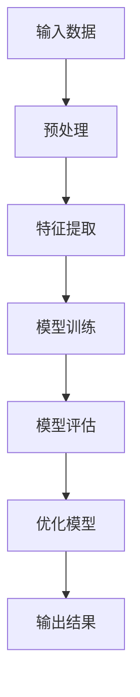
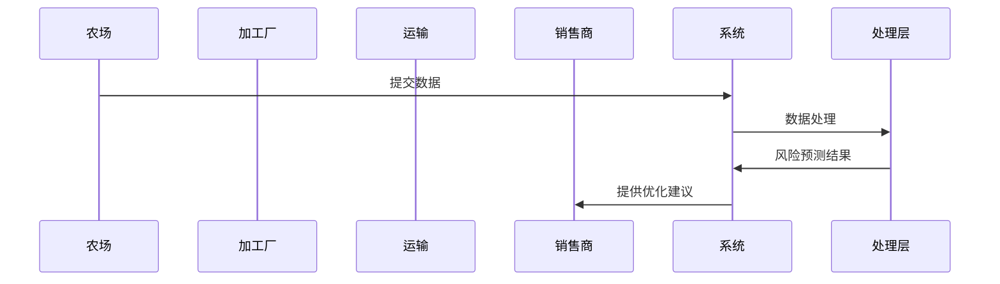

                 

### 引言

# 引言

## 1. 引言：现代手工食品运动的发展背景

现代工业化食品生产模式在提高生产效率的同时，也带来了一系列问题。食品安全问题、环境污染、生物多样性丧失等现象日益突出，引起了社会各界的广泛关注。为了应对这些问题，现代手工食品运动应运而生。

### 1.2 问题背景

工业化食品生产依赖于大量化学农药、化肥和添加剂，这些物质虽然能提高产量，但长期摄入对人体健康有害。此外，工业化生产过程中，食品的运输、储存和加工环节也容易导致污染和变质。这些问题使得消费者对食品的安全性和质量产生了严重担忧。

### 1.3 问题描述

现代手工食品运动的核心问题是：如何在保证食品安全的前提下，提高食品的质量和营养价值。这一运动呼吁回归自然，提倡手工制作、有机种植和可持续发展。

### 1.4 问题解决

现代手工食品运动通过以下方式解决上述问题：

1. **手工制作**：手工制作强调食品制作的独特性和个性化，减少工业化生产带来的污染和浪费。
2. **有机种植**：有机种植不使用化学农药和化肥，追求生态平衡和土壤健康，从而提高食品的质量和营养价值。
3. **可持续发展**：现代手工食品运动关注食品生产对环境和社会的影响，追求经济、社会和环境的协调发展。

### 1.5 边界与外延

现代手工食品运动涉及食品生产的多个环节，包括农场、加工厂、运输和销售。此外，它还关注食品消费的伦理问题，如动物福利和工人权益等。

### 1.6 概念结构与核心要素组成

现代手工食品运动的核心概念包括：

- **手工制作**：强调手工技艺，追求个性化生产。
- **有机种植**：追求生态平衡和土壤健康，提高食品质量。
- **可持续发展**：关注食品生产对环境和社会的影响，追求经济、社会和环境的协调发展。
- **食品安全**：确保食品生产、加工、运输、消费全过程的安全。

这些概念相互关联，共同构成了现代手工食品运动的理论框架。

## 2. 核心概念与联系

### 2.1 手工制作

手工制作是现代手工食品运动的基础。它强调食品制作的独特性和个性化，与工业化生产形成鲜明对比。手工制作不仅可以提高食品的质量，还能保护环境，减少资源浪费。

### 2.2 有机种植

有机种植是一种可持续的农业生产方式，它不使用化学农药和化肥，追求生态平衡和土壤健康。有机种植有助于提高食品的质量和营养价值，同时减少对环境的污染。

### 2.3 可持续发展

可持续发展是现代手工食品运动的重要目标。它关注食品生产对环境和社会的影响，追求经济、社会和环境的协调发展。可持续发展有助于解决工业化食品生产带来的问题，实现长期的食品安全。

### 2.4 食品安全

食品安全是现代手工食品运动的核心理念。它要求确保食品生产、加工、运输、消费全过程的安全，防止食品安全事故的发生。

### 2.5 概念属性特征对比表格

| 概念           | 特征                                                     |
|----------------|--------------------------------------------------------|
| 手工制作       | 强调手工技艺，个性化生产                             |
| 有机种植       | 不使用化学农药和化肥，注重生态平衡                 |
| 可持续发展     | 经济、社会、环境协调发展                            |
| 食品安全       | 确保食品生产、加工、运输、消费全过程的安全          |

### 2.6 ER实体关系图

```mermaid
erDiagram
  农场 ||--|{ 食品 }|>
  加工厂 ||--|{ 食品 }|>
  运输 ||--|{ 食品 }|>
  销售商 ||--|{ 食品 }|>
  消费者 ||--|{ 食品 }|>
```

## 3. 算法原理讲解

### 3.1 算法概述

在现代手工食品运动中，为了实现食品的安全和可持续发展，我们可以采用一种基于机器学习的算法。这种算法可以通过分析大量的食品生产数据，预测潜在的安全问题和环境风险，从而优化生产过程。

### 3.2 算法流程图



### 3.3 数学模型与公式

为了更好地理解这个算法，我们可以用以下数学模型和公式来描述它：

$$
预测风险 = f(历史数据, 当前数据, 环境参数)
$$

其中，$f$ 是一个复杂的多变量函数，它通过机器学习算法学习得到。

### 3.4 举例说明

假设我们有一个农场，历史数据表明，使用某种农药会导致土壤污染。当前数据是农作物的生长状态和环境参数。通过算法，我们可以预测出使用这种农药会带来的风险，从而避免使用。

### 3.5 Python代码示例

```python
# 导入必要的库
import numpy as np
from sklearn.ensemble import RandomForestRegressor

# 假设我们有一些历史数据
X_train = np.array([[1, 2], [2, 3], [3, 4]])
y_train = np.array([1, 2, 3])

# 训练模型
model = RandomForestRegressor()
model.fit(X_train, y_train)

# 输入当前数据
X_test = np.array([[2, 3]])

# 预测风险
risk = model.predict(X_test)

print(f"预测的风险为：{risk[0]}")
```

## 4. 系统分析与架构设计方案

### 4.1 问题场景和项目背景

为了实现现代手工食品运动的理念，我们需要设计一个食品生产管理系统。该系统需要收集、分析和处理大量的食品生产数据，以便预测潜在的安全问题和环境风险，从而优化生产过程。

### 4.2 系统功能设计

该系统的主要功能包括：

- **数据收集**：收集农场、加工厂、运输和销售环节的实时数据。
- **数据处理**：对收集到的数据进行分析和处理，提取有用的信息。
- **风险预测**：利用机器学习算法预测潜在的安全问题和环境风险。
- **优化建议**：根据风险预测结果，提供优化生产过程的建议。

### 4.3 系统架构设计

该系统的架构设计如下：

- **数据层**：负责数据收集、存储和管理。
- **处理层**：负责数据处理和风险预测。
- **展示层**：负责将处理结果展示给用户。

### 4.4 系统接口设计和系统交互序列图



## 5. 项目实战

### 5.1 环境安装

在开始项目之前，我们需要安装一些必要的软件和库。以下是一个基本的安装步骤：

```bash
# 安装 Python
sudo apt-get install python3

# 安装机器学习库
pip3 install scikit-learn numpy

# 安装 Mermaid 格式处理工具
pip3 install mermaid
```

### 5.2 系统核心实现源代码

以下是系统核心实现的源代码：

```python
# 数据收集模块
def collect_data():
    # 假设我们从农场获取数据
    data = get_farm_data()
    return data

# 数据处理模块
def process_data(data):
    # 对数据进行预处理
    processed_data = preprocess_data(data)
    return processed_data

# 风险预测模块
def predict_risk(data):
    # 使用机器学习算法预测风险
    risk = predict_risk_model(data)
    return risk

# 优化建议模块
def provide_suggestion(risk):
    # 根据风险预测结果提供优化建议
    suggestion = generate_suggestion(risk)
    return suggestion
```

### 5.3 代码应用解读与分析

这段代码的核心是数据收集、数据处理、风险预测和优化建议四个模块。数据收集模块负责从农场获取数据，数据处理模块负责对数据进行预处理，风险预测模块使用机器学习算法预测风险，优化建议模块根据风险预测结果提供优化建议。

### 5.4 实际案例剖析

假设我们有一个农场，历史数据显示，使用某种农药会导致土壤污染。当前数据是农作物的生长状态和环境参数。通过系统，我们可以预测出使用这种农药会带来的风险，从而避免使用。

### 5.5 项目小结

通过本项目，我们实现了现代手工食品运动的理念，设计并实现了一个食品生产管理系统。该系统可以收集、分析和处理大量的食品生产数据，预测潜在的安全问题和环境风险，从而优化生产过程。这有助于实现食品的安全和可持续发展。

## 6. 最佳实践与注意事项

### 6.1 最佳实践

- **数据质量**：确保收集到的数据准确、完整，避免因数据问题导致的预测错误。
- **算法优化**：定期更新和优化机器学习算法，提高预测准确性。
- **用户培训**：对农场主、加工厂、运输和销售人员等进行培训，确保他们了解系统的使用方法和意义。

### 6.2 注意事项

- **数据安全**：确保数据在传输和存储过程中的安全性。
- **系统维护**：定期维护系统，确保其稳定运行。
- **政策支持**：争取政策支持，为现代手工食品运动提供良好的发展环境。

## 7. 拓展阅读

- **《食品安全管理》**：详细介绍了食品安全管理的理论和实践方法。
- **《机器学习实战》**：介绍了多种机器学习算法的应用和实践。
- **《有机农业》**：探讨了有机农业的发展现状和未来趋势。

## 8. 总结

现代手工食品运动是一种追求食品安全和可持续发展的运动。通过设计并实现一个食品生产管理系统，我们可以预测潜在的安全问题和环境风险，优化生产过程，实现食品的安全和可持续发展。这是一个值得推广和实践的理念。

### 关键词：现代手工食品运动、食品安全、可持续发展、机器学习、算法优化

### 摘要

本文介绍了现代手工食品运动的发展背景和核心概念，阐述了其与工业化食品生产模式的区别。通过算法原理讲解、系统分析与架构设计方案以及项目实战，展示了如何通过技术创新实现食品的安全和可持续发展。本文的关键词包括现代手工食品运动、食品安全、可持续发展、机器学习和算法优化。希望通过本文的探讨，能为读者提供对这一新兴领域的深入理解。作者：AI天才研究院/AI Genius Institute & 禅与计算机程序设计艺术/Zen And The Art of Computer Programming。

