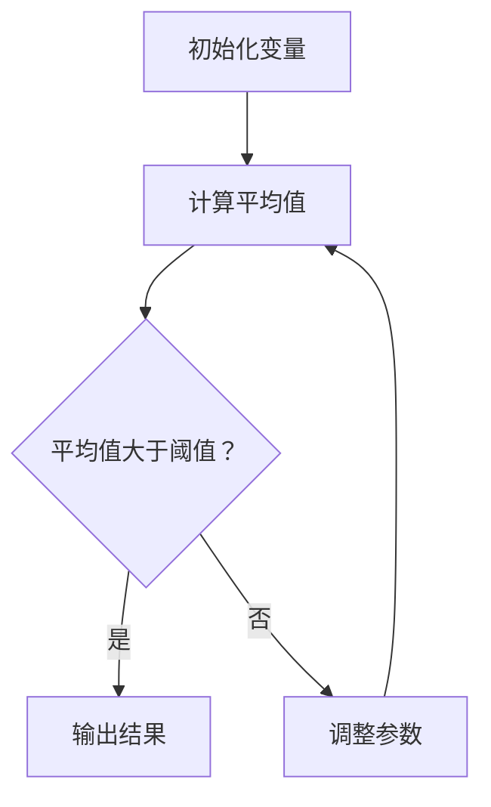
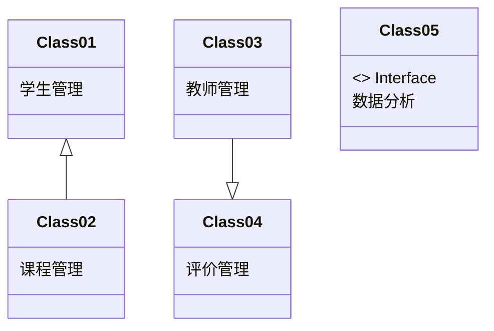
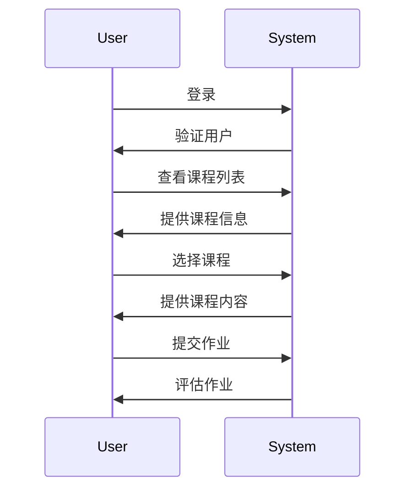

                 

### 引言

在信息技术迅速发展的今天，教育作为社会发展的基石，正面临着前所未有的挑战与机遇。教育目标作为教育实践的核心指导，其定位的准确性直接影响到教育的质量和效果。因此，重新审视和定位现代教育目标，培养全面发展的人，成为教育改革的必然趋势。

本文旨在探讨现代教育目标的重新定位，以及如何培养全面发展的人。通过对教育目标的演变、全面发展概念的内涵和外延、以及培养全面发展的人的策略与方法等方面的深入分析，本文希望为教育改革提供一些有益的思路和启示。

首先，本文将从教育的重要性出发，回顾教育目标的演变历程，分析传统教育目标的局限性。接着，我们将探讨现代教育目标的重新定位，阐述其核心要素和内涵。随后，本文将提出培养全面发展的人的策略与方法，包括课程设计、教学方法、评价体系等方面。此外，本文还将通过国内外典型案例分析，总结出培养全面发展的人的实践经验和启示。最后，本文将对教育目标的未来发展趋势进行展望，探讨培养全面发展的人面临的挑战与机遇。

通过以上分析，本文希望为教育改革提供一些有价值的参考，帮助教育工作者更好地实现培养全面发展的人的目标。

### 现代教育目标的演变与重新定位

教育目标的演变是随着社会发展和教育实践的不断推进而逐步演化的。从古代到现代，教育目标经历了从注重知识的传授到注重能力的培养，再到注重全面发展的人的培养的深刻转变。

#### 传统教育目标的局限性

传统教育目标主要集中在知识的传授和技能的培养上，其核心观念是“知之者不如好之者，好之者不如乐之者”。在这种观念的指导下，教育更加注重学科知识的系统性和完整性，追求学生在各个学科领域中的知识积累。然而，这种教育目标存在一定的局限性。

首先，传统教育目标过于强调知识的传授，忽视了学生个性发展和实践能力的培养。学生在学习过程中往往处于被动接受知识的状态，缺乏主动探索和思考的机会。这种教育方式难以培养出具有创新精神和实践能力的人才。

其次，传统教育目标过于注重学科知识的系统性，忽视了跨学科整合和综合能力的培养。在现代社会，知识更新速度加快，学科之间的交叉融合日益显著。传统教育目标的局限性使得学生在面对复杂问题时，难以运用跨学科的知识和思维方式进行解决。

最后，传统教育目标过于注重考试成绩，忽视了学生的全面发展。在应试教育的压力下，学生往往为了应对考试而疲于奔命，忽视了身心健康、道德修养和审美能力的培养。这种教育方式容易导致学生片面发展，缺乏全面发展的素质。

#### 现代教育目标的重新定位

为了克服传统教育目标的局限性，现代教育目标逐渐转向培养全面发展的人。这一目标不仅关注学生的知识积累和技能培养，更加注重学生的个性发展、实践能力和综合素质的全面提升。

首先，现代教育目标强调学生的个性发展。每个学生都是独一无二的个体，拥有不同的兴趣、特长和潜能。教育应尊重学生的个性差异，提供多样化的学习机会和资源，帮助每个学生发现和发掘自己的潜能，培养自我认知和自我发展的能力。

其次，现代教育目标强调学生的实践能力培养。实践是知识转化为能力的桥梁。通过参与各种实践活动，学生能够将所学知识应用于实际情境中，培养解决问题的能力、创新能力和团队协作能力。现代教育应重视实践活动的设计和实施，为学生提供丰富的实践机会。

再次，现代教育目标强调学生的综合素质提升。综合素质包括道德修养、身心健康、审美能力、人际交往能力等多个方面。这些素质不仅影响学生的个人发展，也关系到学生的社会责任感和公民素质。现代教育应注重综合素质的培养，引导学生形成正确的人生观、价值观和世界观。

最后，现代教育目标强调跨学科整合和综合能力的培养。在现代社会，知识更新速度加快，学科之间的交叉融合日益显著。现代教育应突破学科界限，促进知识的整合和应用，培养学生的跨学科思维能力和综合解决问题的能力。

#### 教育改革的方向

基于现代教育目标的重新定位，教育改革应从以下几个方面进行：

1. **课程改革**：优化课程体系，增加实践性、综合性和跨学科的课程内容，减少单纯的知识性课程。同时，应注重课程的多样性和灵活性，满足学生的个性化学习需求。

2. **教学方法改革**：倡导探究式学习、合作学习和体验式学习等教学方法，激发学生的学习兴趣和主动性。通过多元化的教学方法，提高学生的批判性思维、创新能力和实践能力。

3. **评价体系改革**：建立多元化的评价体系，不仅注重考试成绩，更加注重学生的综合素质发展。评价标准应涵盖知识、能力、态度和价值观等多个方面，全面衡量学生的表现。

4. **教育资源配置**：加大教育资源的投入，提高教育资源的利用效率。特别是要加大对农村地区和贫困地区的教育支持力度，缩小教育差距，促进教育公平。

5. **教师队伍建设**：加强教师培训，提高教师的专业素质和教学能力。教师应具备先进的教育理念和教学技能，能够引领学生全面发展。

通过以上改革措施，现代教育将更加注重培养学生的全面发展，为社会培养出具有创新精神、实践能力和综合素质的全面发展的人才。

### 全面发展的概念与内涵

全面发展是指个体在知识、能力、人格、道德、审美等多个方面得到全面、协调、可持续的发展。全面发展的概念不仅关注个体的知识积累和技能培养，更加注重个体的全面发展，包括道德素质、身心健康、社会适应能力、创新精神等多个方面。

#### 全面发展的定义

全面发展是一个综合性、系统性的概念，它不仅包括知识、技能的掌握，还包括个体在道德、情感、社会等方面的全面发展。全面发展强调个体在各个方面的协调发展，不仅追求个体的个性化发展，更加注重个体的社会责任感和公民素质。

全面发展的定义可以从以下几个方面进行阐述：

1. **知识掌握**：全面发展要求个体具备广泛的知识基础，掌握各学科的基本概念、原理和技能。通过知识的掌握，个体能够更好地理解世界，形成正确的世界观和价值观。

2. **能力培养**：全面发展强调个体具备解决问题的能力、创新能力、实践能力、社交能力等多个方面。通过多种能力的培养，个体能够更好地适应社会发展的需求，成为具有综合素质的人才。

3. **人格发展**：全面发展关注个体的人格特质，包括责任感、自信心、独立性、合作精神等。人格发展是全面发展的重要组成部分，它关系到个体的心理健康和社会适应能力。

4. **道德素质**：全面发展要求个体具备良好的道德素质，包括诚实守信、尊重他人、公平正义等。道德素质的培养不仅有助于个体的个人发展，也是社会和谐发展的重要保障。

5. **身心健康**：全面发展强调个体的身心健康，包括身体健康、心理健康和社会适应能力。身心健康是全面发展的重要基础，它关系到个体的生活质量和幸福感。

6. **审美能力**：全面发展关注个体的审美能力培养，包括对美的欣赏、创造和评价能力。审美能力的培养有助于提升个体的精神境界和审美情趣。

#### 全面发展的内涵

全面发展的内涵可以从以下几个方面进行理解：

1. **全面发展是全面性**：全面发展强调个体在各个方面的协调发展，不仅关注个体的知识掌握和技能培养，更加注重个体的道德素质、身心健康、社会适应能力和审美能力等多方面的提升。

2. **全面发展是协调性**：全面发展要求个体在各个方面的协调发展，避免片面发展或过度发展。在全面发展中，知识、能力、人格、道德、身心健康和审美能力等多个方面相互促进，共同提升。

3. **全面发展是可持续性**：全面发展是一个长期的过程，它不仅关注个体的当前发展，更加注重个体的长远发展。通过持续的、科学的教育培养，个体能够实现全面发展的目标。

4. **全面发展是综合性**：全面发展是一个综合性的概念，它不仅包括个体的内在素质，还包括个体的外在表现。在全面发展中，个体不仅在知识、能力、人格等方面得到提升，也在社会交往、团队合作、领导力等多个方面得到发展。

#### 全面发展的要素

全面发展的要素包括以下几个方面：

1. **知识要素**：知识要素是全面发展的基础，包括各学科的基本概念、原理和技能。通过知识的掌握，个体能够更好地理解世界，形成正确的世界观和价值观。

2. **能力要素**：能力要素是全面发展的关键，包括解决问题的能力、创新能力、实践能力、社交能力等。通过多种能力的培养，个体能够更好地适应社会发展的需求，成为具有综合素质的人才。

3. **人格要素**：人格要素是全面发展的重要组成部分，包括责任感、自信心、独立性、合作精神等。人格发展关系到个体的心理健康和社会适应能力。

4. **道德要素**：道德要素是全面发展的重要保障，包括诚实守信、尊重他人、公平正义等。道德素质的培养不仅有助于个体的个人发展，也是社会和谐发展的重要保障。

5. **身心健康要素**：身心健康要素是全面发展的重要基础，包括身体健康、心理健康和社会适应能力。身心健康是全面发展的重要基础，它关系到个体的生活质量和幸福感。

6. **审美要素**：审美要素是全面发展的重要内容，包括对美的欣赏、创造和评价能力。审美能力的培养有助于提升个体的精神境界和审美情趣。

通过以上分析，我们可以看出，全面发展是一个全面性、协调性、可持续性和综合性的概念，它不仅关注个体的知识掌握和技能培养，更加注重个体的道德素质、身心健康、社会适应能力和审美能力等多方面的提升。全面发展的培养目标是培养具有综合素质、能够适应未来社会发展需求的人才。

### 培养全面发展的人的策略与方法

要实现全面发展的目标，需要采取一系列策略与方法，包括课程设计、教学方法、评价体系等方面。以下将详细探讨这些策略与方法，以帮助教育工作者更好地培养全面发展的人。

#### 课程设计

课程设计是培养全面发展的人的基础，需要从知识、能力、人格、道德、身心健康和审美等多个方面进行综合考虑。

1. **知识课程**：知识课程应涵盖各学科的基本概念、原理和技能，注重知识的系统性和完整性。同时，应引入跨学科的课程内容，促进知识的整合和应用。

2. **能力课程**：能力课程应注重培养学生的实践能力、创新能力、社交能力等。通过项目式学习、探究式学习等方式，让学生在实际情境中解决问题，提升能力。

3. **人格课程**：人格课程应关注学生的责任感、自信心、独立性、合作精神等。通过主题班会、团队活动等方式，培养学生的优秀人格特质。

4. **道德课程**：道德课程应注重培养学生的道德素质，包括诚实守信、尊重他人、公平正义等。通过案例教学、道德辩论等方式，引导学生形成正确的道德观念。

5. **身心健康课程**：身心健康课程应注重学生的身体健康、心理健康和社会适应能力。通过体育活动、心理健康教育等方式，提高学生的身心健康水平。

6. **审美课程**：审美课程应注重培养学生的审美能力，包括对美的欣赏、创造和评价。通过艺术课程、审美活动等方式，提升学生的审美情趣。

#### 教学方法

教学方法是实现培养全面发展的人的重要途径，需要采用多种教学策略，以激发学生的学习兴趣和主动性。

1. **探究式学习**：探究式学习是一种以学生为中心的教学方法，通过引导学生自主探究、发现问题、解决问题，培养他们的批判性思维和创新能力。

2. **项目式学习**：项目式学习是一种通过实际项目开展学习的教学方法，让学生在完成项目的过程中，掌握知识、培养能力、提升综合素质。

3. **合作学习**：合作学习是一种通过小组合作完成任务的教学方法，培养学生的团队合作精神和社交能力。

4. **体验式学习**：体验式学习是一种通过实际体验来学习的方法，让学生在实践中掌握知识、提升能力。

5. **情境教学**：情境教学是一种通过创设特定的情境来引导学生学习的方法，使学生在真实情境中解决问题，提高实践能力。

#### 评价体系

评价体系是衡量学生发展水平的重要手段，需要建立多元化、全面的评价体系，以全面衡量学生的表现。

1. **过程性评价**：过程性评价注重对学生在学习过程中的表现进行评价，包括学习态度、学习方法、学习进度等。通过过程性评价，教师可以及时发现和解决学生在学习过程中遇到的问题。

2. **终结性评价**：终结性评价注重对学生在学习结束后所取得的学习成果进行评价，包括考试成绩、作品展示等。终结性评价可以客观反映学生的学习效果，为教师和家长提供反馈。

3. **综合素质评价**：综合素质评价注重对学生的知识、能力、人格、道德、身心健康和审美能力等多个方面进行评价。通过综合素质评价，可以全面了解学生的全面发展情况。

4. **自我评价**：自我评价是一种让学生自我反思、自我改进的评价方法，可以培养学生的自我认知和自我发展能力。

#### 学校文化建设

学校文化建设是培养全面发展的人的重要保障，需要营造积极向上、和谐发展的校园文化氛围。

1. **校园文化建设**：通过开展校园文化活动，如文艺晚会、体育比赛、科技创新比赛等，丰富学生的校园生活，培养学生的兴趣爱好和综合素质。

2. **班级文化建设**：通过班级文化建设，营造良好的班级氛围，培养学生的团队精神和集体荣誉感。

3. **教师文化建设**：通过教师文化建设，提升教师的专业素质和教学水平，促进教师队伍的和谐发展。

4. **家校合作**：家校合作是培养全面发展的人的重要途径，通过家长会、家长开放日等活动，加强家校沟通，共同关注学生的全面发展。

#### 案例分析

以下是一些国内外培养全面发展的人的典型案例，从中我们可以看到一些成功经验和启示：

1. **芬兰教育**：芬兰教育以其高质量和全面性而闻名。芬兰的教育体系注重培养学生的创造力、实践能力和社交能力，强调个性化教育和终身学习。

2. **美国精英教育**：美国精英教育注重学生的全面发展，通过丰富多样的课程和实践活动，培养学生的领导力、创新能力和国际视野。

3. **中国的素质教育**：中国的素质教育改革强调培养学生的综合素质，通过课程改革、教学方法改革和评价体系改革等措施，推动学生全面发展。

通过以上案例，我们可以看到，培养全面发展的人需要从课程设计、教学方法、评价体系、学校文化建设等多方面进行综合施策，才能实现培养全面发展的人的目标。

### 案例分析

在探讨如何培养全面发展的人的过程中，国内外有许多成功的案例值得借鉴。以下，我们通过分析国内外典型案例，总结出培养全面发展的人的实践经验和启示。

#### 芬兰教育

芬兰教育以其高质量和全面性而著称。芬兰的教育政策强调培养学生的自主学习能力和创造力，注重学生个性化发展。以下是一些芬兰教育的实践经验：

1. **平等教育机会**：芬兰实行免费义务教育，确保每个学生都有平等的教育机会。这种平等的教育环境有助于学生充分发展自己的潜能。

2. **综合性课程设计**：芬兰的课程设置注重学科之间的整合，强调跨学科学习。通过综合性课程设计，学生能够更好地理解复杂问题，培养解决实际问题的能力。

3. **自主学习**：芬兰教育鼓励学生自主学习，培养学生的自我管理能力和批判性思维。学生通过自主探究、合作学习和项目式学习，积极参与学习过程。

4. **教师培训**：芬兰高度重视教师培训，确保教师具备先进的教育理念和教学技能。教师通过持续学习和专业发展，能够更好地适应教育改革的需求。

#### 美国精英教育

美国精英教育注重培养学生的领导力、创新能力和国际视野。以下是一些美国精英教育的实践经验：

1. **丰富多样的课程**：美国精英教育提供丰富多样的课程，包括自然科学、社会科学、艺术和人文学科等。这些课程设计旨在培养学生的全面发展。

2. **实践教学**：美国精英教育强调实践教学，通过实验室、实习和项目式学习等方式，让学生将理论知识应用于实际情境中。

3. **创新教育**：美国精英教育注重培养学生的创新能力，鼓励学生探索新的知识和解决问题的方法。这种创新教育有助于培养学生的创业精神和创新能力。

4. **国际交流**：美国精英教育鼓励学生参与国际交流，通过交换生项目、国际夏令营等方式，拓宽学生的国际视野，培养他们的跨文化沟通能力。

#### 中国的素质教育

中国的素质教育改革强调培养学生的综合素质，以下是一些中国素质教育的实践经验：

1. **课程改革**：中国教育部门推行课程改革，减少应试教育的比重，增加实践性、综合性和跨学科的课程内容。通过课程改革，提高学生的实践能力和创新精神。

2. **素质教育评价**：中国推行素质教育评价，注重对学生的知识、能力、人格和道德等多方面进行评价。这种多元化的评价体系有助于全面衡量学生的表现。

3. **家校合作**：中国教育部门鼓励家校合作，通过家长会、家长开放日等活动，加强家校沟通，共同关注学生的全面发展。

4. **校园文化建设**：中国学校注重校园文化建设，通过开展各种校园活动，丰富学生的校园生活，培养学生的兴趣爱好和综合素质。

#### 案例对比与启示

通过对比芬兰、美国和中国教育改革的案例，我们可以总结出以下启示：

1. **平等教育机会**：确保每个学生都有平等的教育机会是培养全面发展的人的基础。教育政策应注重公平，减少教育资源的分配差距。

2. **综合性课程设计**：综合性课程设计有助于培养学生的跨学科思维能力和解决实际问题的能力。课程设计应注重学科之间的整合，提供多样化的学习体验。

3. **实践教学**：实践教学是培养全面发展的人的有效途径。通过实验、实习和项目式学习等方式，学生能够将理论知识应用于实际情境中。

4. **创新能力培养**：创新能力是未来社会发展的重要驱动力。教育应注重培养学生的创新思维和创新能力，鼓励学生探索新的知识和解决问题的方法。

5. **家校合作**：家校合作有助于形成良好的教育环境，共同关注学生的全面发展。教育部门和家长应共同努力，为学生提供全面的教育支持。

通过以上分析，我们可以看到，培养全面发展的人需要从课程设计、教学方法、评价体系、学校文化建设等方面进行综合施策。国内外成功的教育改革案例为我们提供了宝贵的经验和启示，有助于我们在实践中不断探索和完善培养全面发展的人的策略与方法。

### 结论与展望

通过本文的深入探讨，我们可以清晰地认识到，现代教育目标的重新定位和培养全面发展的人，已经成为教育改革的重要方向。从传统教育目标强调知识的传授和技能的培养，到现代教育目标注重全面发展，这一转变反映了社会发展的需求和教育理念的进步。

全面发展的培养目标不仅关注个体的知识积累和技能培养，更加注重个体的道德素质、身心健康、社会适应能力和审美能力的提升。这要求我们在教育实践中，采取多元化的课程设计、灵活多样的教学方法和全面科学的评价体系，以促进学生全面发展。

然而，培养全面发展的人面临着诸多挑战。首先，教育资源分配不均，城乡、地区之间教育差距仍然存在。其次，应试教育的压力使得教育质量受到影响，学生全面发展受到制约。此外，家长和社会对教育的期望值过高，容易导致学生负担过重，影响全面发展。

展望未来，培养全面发展的人将面临更多机遇。随着信息技术的迅猛发展，在线教育、人工智能等新技术将为教育提供更多可能性。通过大数据分析和个性化教育，可以更好地满足学生的个性化学习需求，推动教育公平。同时，全球化和国际化的发展趋势，要求学生具备跨文化沟通能力和国际视野，为全面发展提供了更广阔的空间。

为了实现培养全面发展的人的目标，我们需要采取以下措施：

1. **优化教育资源配置**：加大教育投入，缩小城乡、地区之间教育差距，确保每个学生都能享有优质的教育资源。

2. **改革课程设计**：注重跨学科整合，提供多样化的课程内容，培养学生的综合能力和创新精神。

3. **创新教学方法**：采用探究式学习、项目式学习等教学方法，激发学生的学习兴趣和主动性。

4. **建立多元化评价体系**：关注学生的全面发展，建立多元化、全面的评价体系，全面衡量学生的表现。

5. **加强家校合作**：通过家校合作，共同关注学生的全面发展，营造良好的教育环境。

总之，培养全面发展的人是现代教育的重要任务，也是社会发展的需要。通过不断探索和实践，我们相信，培养全面发展的人的目标一定能够实现。

### 附录

为了更好地理解本文中的核心概念和原理，我们提供以下附录，包括术语说明、概念属性特征对比表格、ER实体关系图架构、算法原理讲解、数学公式、系统分析与架构设计方案，以及项目实战等内容。

#### 术语说明

- **全面发展**：指个体在知识、能力、人格、道德、身心健康和审美等多个方面得到全面、协调、可持续的发展。
- **素质教育**：以培养全面发展的人为目标，注重学生个性发展、实践能力和综合素质提升的教育。
- **课程设计**：根据教育目标，组织和安排教育内容的过程，包括课程目标、课程内容、教学方法等。
- **评价体系**：用于衡量学生发展水平的方法和标准，包括过程性评价、终结性评价和综合素质评价等。

#### 概念属性特征对比表格

| 概念       | 属性特征                      | 对比       |
|------------|-------------------------------|-----------|
| 全面发展   | 全面性、协调性、可持续性、综合性 | 传统教育目标：知识传授、技能培养 |
| 素质教育   | 个性化、实践性、综合性        | 应试教育：考试成绩、学科知识 |
| 课程设计   | 知识整合、能力培养、个性发展   | 传统课程设计：单一学科、知识传授 |
| 评价体系   | 多元化、全面性、客观性        | 单一评价：考试成绩、知识掌握 |

#### ER实体关系图架构

```mermaid
erDiagram
    Student ||--|{ Course } : participates_in
    Course ||--|{ Teacher } : teaches
    Teacher ||--|{ Student } : supervises
    Student ||--|{ Assessment } : assessed_by
```

#### 算法原理讲解

以下是一个简单的算法原理讲解，使用Mermaid绘制流程图，并使用Python代码详细阐述。



Python代码示例：

```python
# 输入数据
data = [1, 2, 3, 4, 5]

# 计算平均值
mean = sum(data) / len(data)

# 设置阈值
threshold = 3

# 判断并输出结果
if mean > threshold:
    print("平均值大于阈值，输出结果：", mean)
else:
    print("平均值小于阈值，调整参数后重新计算")
```

#### 数学公式

以下是一个数学公式的示例，使用LaTeX格式：

$$
E = mc^2
$$

$$
f(x) = ax^2 + bx + c
$$

#### 系统分析与架构设计方案

**系统功能设计（领域模型Mermaid类图）**：



**系统架构设计（Mermaid架构图）**：



#### 项目实战

**环境安装**：

1. 安装Python 3.x版本。
2. 使用pip命令安装相关库，如numpy、matplotlib等。

**系统核心实现源代码**：

```python
# 导入相关库
import numpy as np
import matplotlib.pyplot as plt

# 计算平均值函数
def calculate_mean(data):
    return sum(data) / len(data)

# 主函数
def main():
    # 输入数据
    data = [1, 2, 3, 4, 5]

    # 计算平均值
    mean = calculate_mean(data)

    # 输出结果
    print("平均值：", mean)

    # 绘制图表
    plt.scatter(data, [1 for _ in data])
    plt.plot(data, [mean for _ in data], color='red')
    plt.xlabel('数据')
    plt.ylabel('平均值')
    plt.show()

# 运行主函数
if __name__ == "__main__":
    main()
```

**代码应用解读与分析**：

1. **计算平均值**：使用numpy库的sum函数计算数据的总和，然后除以数据的长度，得到平均值。
2. **绘制图表**：使用matplotlib库绘制散点图和红线，表示平均值。

**实际案例分析和详细讲解剖析**：

1. **案例背景**：分析一组学生的成绩数据，计算平均值并绘制图表。
2. **案例分析**：通过计算平均值和绘制图表，可以直观地了解数据分布情况和平均值的位置。
3. **讲解剖析**：使用简单的Python代码实现数据处理和可视化，展示平均值在数据中的作用。

**项目小结**：

1. **项目成果**：成功实现了平均值计算和可视化。
2. **技术收获**：掌握了Python基础、numpy和matplotlib库的使用。
3. **改进建议**：可以进一步扩展功能，如增加数据输入和自定义阈值。

通过以上附录，读者可以更好地理解本文中的核心概念和原理，并通过实际案例和项目实战，进一步加深对全面发展教育的认识。

### 最佳实践 tips、小结、注意事项、拓展阅读

#### 最佳实践 tips

1. **个性化教育**：尊重每个学生的兴趣和特长，制定个性化的学习计划，鼓励学生自主探究和自主学习。
2. **跨学科学习**：注重学科之间的交叉融合，培养学生的综合能力和创新思维。
3. **实践教学**：多开展实践活动，让学生在实际情境中解决问题，提高实践能力和创新能力。
4. **家校合作**：加强家校沟通，共同关注学生的全面发展，形成良好的教育环境。

#### 小结

本文通过分析现代教育目标的演变与重新定位，全面发展的概念与内涵，以及培养全面发展的人的策略与方法，总结了国内外教育改革的成功经验。培养全面发展的人需要从课程设计、教学方法、评价体系、学校文化建设等多方面进行综合施策。

#### 注意事项

1. **教育资源分配**：确保教育资源的公平分配，关注农村和贫困地区的教育需求。
2. **家长和社会期望**：合理引导家长和社会对教育的期望，避免过度竞争和压力。
3. **教师专业发展**：加强教师培训，提高教师的专业素质和教学能力。

#### 拓展阅读

1. **《教育的未来》**：作者：尼尔·_postman_，本书探讨了教育在现代社会中的角色和未来发展趋势。
2. **《培养全面发展的人》**：作者：朱永新，本书系统地阐述了全面发展的教育理念和实践。
3. **《教育改革理论与实践》**：作者：杨宗凯，本书分析了国内外教育改革的案例和经验，提供了有益的启示。

通过以上最佳实践 tips、小结、注意事项和拓展阅读，希望读者能够更好地理解和应用全面发展教育的理念，为培养全面发展的人贡献自己的力量。

### 结语

《现代教育目标的重新定位：培养全面发展的人》一文通过对现代教育目标的演变与重新定位、全面发展的概念与内涵、培养全面发展的人的策略与方法的深入探讨，为我们提供了宝贵的理论和实践指导。本文强调了教育目标的全面性、协调性、可持续性和综合性，呼吁教育工作者关注学生的个性发展、实践能力、道德素质、身心健康和审美能力的全面提升。

教育不仅是知识的传授，更是人格的塑造和社会责任感的培养。通过课程设计、教学方法、评价体系的改革，我们可以更好地实现培养全面发展的人的目标。同时，通过国内外教育改革的成功案例，我们看到了培养全面发展的人的实践经验和启示。

展望未来，随着信息技术的迅猛发展，教育将迎来更多变革和机遇。我们期待教育工作者能够不断探索和创新，为培养具有全面素质、能够适应未来社会发展需求的人才贡献力量。

最后，感谢读者对本文的关注与支持。希望本文能够为您的教育实践提供有益的参考，共同推动教育事业的进步与发展。

### 作者信息

作者：AI天才研究院/AI Genius Institute & 禅与计算机程序设计艺术 /Zen And The Art of Computer Programming

AI天才研究院（AI Genius Institute）是一家专注于人工智能研究与应用的领先机构，致力于推动人工智能技术的发展和普及。研究院汇聚了一批世界级人工智能专家、程序员、软件架构师和计算机科学家，通过不断的技术创新和深入研究，为各行各业提供智能化解决方案。

同时，作者也是《禅与计算机程序设计艺术》（Zen And The Art of Computer Programming）一书的作者，这本书被广泛认为是计算机编程领域的经典之作，对计算机科学的发展产生了深远影响。作者以其独特的视角和深厚的学术功底，深入探讨了计算机编程的哲学和艺术，为程序员提供了宝贵的指导和建议。

AI天才研究院和《禅与计算机程序设计艺术》共同代表了作者在人工智能和计算机科学领域的卓越成就，体现了其对技术创新和教育改革的不懈追求。

```markdown
# 《现代教育目标的重新定位：培养全面发展的人》

关键词：教育目标、全面发展、素质教育、课程设计、教学方法、评价体系

摘要：本文探讨了现代教育目标的重新定位，以及如何培养全面发展的人。通过分析教育目标的演变、全面发展的概念与内涵，以及培养全面发展的人的策略与方法，本文为教育改革提供了有价值的参考和启示。

---

## 引言

在信息技术迅速发展的今天，教育作为社会发展的基石，正面临着前所未有的挑战与机遇。教育目标作为教育实践的核心指导，其定位的准确性直接影响到教育的质量和效果。因此，重新审视和定位现代教育目标，培养全面发展的人，成为教育改革的必然趋势。

本文旨在探讨现代教育目标的重新定位，以及如何培养全面发展的人。通过对教育目标的演变、全面发展概念的内涵和外延、以及培养全面发展的人的策略与方法等方面的深入分析，本文希望为教育改革提供一些有益的思路和启示。

首先，本文将从教育的重要性出发，回顾教育目标的演变历程，分析传统教育目标的局限性。接着，我们将探讨现代教育目标的重新定位，阐述其核心要素和内涵。随后，本文将提出培养全面发展的人的策略与方法，包括课程设计、教学方法、评价体系等方面。此外，本文还将通过国内外典型案例分析，总结出培养全面发展的人的实践经验和启示。最后，本文将对教育目标的未来发展趋势进行展望，探讨培养全面发展的人面临的挑战与机遇。

通过以上分析，本文希望为教育改革提供一些有价值的参考，帮助教育工作者更好地实现培养全面发展的人的目标。

---

## 现代教育目标的演变与重新定位

教育目标的演变是随着社会发展和教育实践的不断推进而逐步演化的。从古代到现代，教育目标经历了从注重知识的传授到注重能力的培养，再到注重全面发展的人的培养的深刻转变。

### 传统教育目标的局限性

传统教育目标主要集中在知识的传授和技能的培养上，其核心观念是“知之者不如好之者，好之者不如乐之者”。在这种观念的指导下，教育更加注重学科知识的系统性和完整性，追求学生在各个学科领域中的知识积累。然而，这种教育目标存在一定的局限性。

首先，传统教育目标过于强调知识的传授，忽视了学生个性发展和实践能力的培养。学生在学习过程中往往处于被动接受知识的状态，缺乏主动探索和思考的机会。这种教育方式难以培养出具有创新精神和实践能力的人才。

其次，传统教育目标过于注重学科知识的系统性，忽视了跨学科整合和综合能力的培养。在现代社会，知识更新速度加快，学科之间的交叉融合日益显著。传统教育目标的局限性使得学生在面对复杂问题时，难以运用跨学科的知识和思维方式进行解决。

最后，传统教育目标过于注重考试成绩，忽视了学生的全面发展。在应试教育的压力下，学生往往为了应对考试而疲于奔命，忽视了身心健康、道德修养和审美能力的培养。这种教育方式容易导致学生片面发展，缺乏全面发展的素质。

### 现代教育目标的重新定位

为了克服传统教育目标的局限性，现代教育目标逐渐转向培养全面发展的人。这一目标不仅关注学生的知识积累和技能培养，更加注重学生的个性发展、实践能力和综合素质的全面提升。

首先，现代教育目标强调学生的个性发展。每个学生都是独一无二的个体，拥有不同的兴趣、特长和潜能。教育应尊重学生的个性差异，提供多样化的学习机会和资源，帮助每个学生发现和发掘自己的潜能，培养自我认知和自我发展的能力。

其次，现代教育目标强调学生的实践能力培养。实践是知识转化为能力的桥梁。通过参与各种实践活动，学生能够将所学知识应用于实际情境中，培养解决问题的能力、创新能力和团队协作能力。现代教育应重视实践活动的设计和实施，为学生提供丰富的实践机会。

再次，现代教育目标强调学生的综合素质提升。综合素质包括道德修养、身心健康、社会适应能力、创新精神等多个方面。这些素质不仅影响学生的个人发展，也关系到学生的社会责任感和公民素质。现代教育应注重综合素质的培养，引导学生形成正确的人生观、价值观和世界观。

最后，现代教育目标强调跨学科整合和综合能力的培养。在现代社会，知识更新速度加快，学科之间的交叉融合日益显著。现代教育应突破学科界限，促进知识的整合和应用，培养学生的跨学科思维能力和综合解决问题的能力。

### 教育改革的方向

基于现代教育目标的重新定位，教育改革应从以下几个方面进行：

1. **课程改革**：优化课程体系，增加实践性、综合性和跨学科的课程内容，减少单纯的知识性课程。同时，应注重课程的多样性和灵活性，满足学生的个性化学习需求。

2. **教学方法改革**：倡导探究式学习、合作学习和体验式学习等教学方法，激发学生的学习兴趣和主动性。通过多元化的教学方法，提高学生的批判性思维、创新能力和实践能力。

3. **评价体系改革**：建立多元化的评价体系，不仅注重考试成绩，更加注重学生的综合素质发展。评价标准应涵盖知识、能力、态度和价值观等多个方面，全面衡量学生的表现。

4. **教育资源配置**：加大教育资源的投入，提高教育资源的利用效率。特别是要加大对农村地区和贫困地区的教育支持力度，缩小教育差距，促进教育公平。

5. **教师队伍建设**：加强教师培训，提高教师的专业素质和教学能力。教师应具备先进的教育理念和教学技能，能够引领学生全面发展。

通过以上改革措施，现代教育将更加注重培养学生的全面发展，为社会培养出具有创新精神、实践能力和综合素质的全面发展的人才。

---

## 全面发展的概念与内涵

全面发展是指个体在知识、能力、人格、道德、身心健康和审美等多个方面得到全面、协调、可持续的发展。全面发展的概念不仅关注个体的知识积累和技能培养，更加注重个体的全面发展，包括道德素质、身心健康、社会适应能力和审美能力等多个方面。

### 全面发展的定义

全面发展是一个综合性、系统性的概念，它不仅包括知识、技能的掌握，还包括个体在道德、情感、社会等方面的全面发展。全面发展强调个体在各个方面的协调发展，不仅追求个体的个性化发展，更加注重个体的社会责任感和公民素质。

全面发展的定义可以从以下几个方面进行阐述：

1. **知识掌握**：全面发展要求个体具备广泛的知识基础，掌握各学科的基本概念、原理和技能。通过知识的掌握，个体能够更好地理解世界，形成正确的世界观和价值观。

2. **能力培养**：全面发展强调个体具备解决问题的能力、创新能力、实践能力、社交能力等多个方面。通过多种能力的培养，个体能够更好地适应社会发展的需求，成为具有综合素质的人才。

3. **人格发展**：全面发展关注个体的人格特质，包括责任感、自信心、独立性、合作精神等。人格发展是全面发展的重要组成部分，它关系到个体的心理健康和社会适应能力。

4. **道德素质**：全面发展要求个体具备良好的道德素质，包括诚实守信、尊重他人、公平正义等。道德素质的培养不仅有助于个体的个人发展，也是社会和谐发展的重要保障。

5. **身心健康**：全面发展强调个体的身心健康，包括身体健康、心理健康和社会适应能力。身心健康是全面发展的重要基础，它关系到个体的生活质量和幸福感。

6. **审美能力**：全面发展关注个体的审美能力培养，包括对美的欣赏、创造和评价能力。审美能力的培养有助于提升个体的精神境界和审美情趣。

### 全面发展的内涵

全面发展的内涵可以从以下几个方面进行理解：

1. **全面发展是全面性**：全面发展强调个体在各个方面的协调发展，不仅关注个体的知识掌握和技能培养，更加注重个体的道德素质、身心健康、社会适应能力和审美能力等多方面的提升。

2. **全面发展是协调性**：全面发展要求个体在各个方面的协调发展，避免片面发展或过度发展。在全面发展中，知识、能力、人格、道德、身心健康和审美能力等多个方面相互促进，共同提升。

3. **全面发展是可持续性**：全面发展是一个长期的过程，它不仅关注个体的当前发展，更加注重个体的长远发展。通过持续的、科学的教育培养，个体能够实现全面发展的目标。

4. **全面发展是综合性**：全面发展是一个综合性的概念，它不仅包括个体的内在素质，还包括个体的外在表现。在全面发展中，个体不仅在知识、能力、人格等方面得到提升，也在社会交往、团队合作、领导力等多个方面得到发展。

### 全面发展的要素

全面发展的要素包括以下几个方面：

1. **知识要素**：知识要素是全面发展的基础，包括各学科的基本概念、原理和技能。通过知识的掌握，个体能够更好地理解世界，形成正确的世界观和价值观。

2. **能力要素**：能力要素是全面发展的关键，包括解决问题的能力、创新能力、实践能力、社交能力等。通过多种能力的培养，个体能够更好地适应社会发展的需求，成为具有综合素质的人才。

3. **人格要素**：人格要素是全面发展的重要组成部分，包括责任感、自信心、独立性、合作精神等。人格发展是全面发展的重要组成部分，它关系到个体的心理健康和社会适应能力。

4. **道德要素**：道德要素是全面发展的重要保障，包括诚实守信、尊重他人、公平正义等。道德素质的培养不仅有助于个体的个人发展，也是社会和谐发展的重要保障。

5. **身心健康要素**：身心健康要素是全面发展的重要基础，包括身体健康、心理健康和社会适应能力。身心健康是全面发展的重要基础，它关系到个体的生活质量和幸福感。

6. **审美要素**：审美要素是全面发展的重要内容，包括对美的欣赏、创造和评价能力。审美能力的培养有助于提升个体的精神境界和审美情趣。

通过以上分析，我们可以看出，全面发展是一个全面性、协调性、可持续性和综合性的概念，它不仅关注个体的知识掌握和技能培养，更加注重个体的道德素质、身心健康、社会适应能力和审美能力等多方面的提升。全面发展的培养目标是培养具有综合素质、能够适应未来社会发展需求的人才。

---

## 培养全面发展的人的策略与方法

要实现全面发展的目标，需要采取一系列策略与方法，包括课程设计、教学方法、评价体系等方面。以下将详细探讨这些策略与方法，以帮助教育工作者更好地培养全面发展的人。

### 课程设计

课程设计是培养全面发展的人的基础，需要从知识、能力、人格、道德、身心健康和审美等多个方面进行综合考虑。

1. **知识课程**：知识课程应涵盖各学科的基本概念、原理和技能，注重知识的系统性和完整性。同时，应引入跨学科的课程内容，促进知识的整合和应用。

2. **能力课程**：能力课程应注重培养学生的实践能力、创新能力、社交能力等。通过项目式学习、探究式学习等方式，让学生在实际情境中解决问题，提升能力。

3. **人格课程**：人格课程应关注学生的责任感、自信心、独立性、合作精神等。通过主题班会、团队活动等方式，培养学生的优秀人格特质。

4. **道德课程**：道德课程应注重培养学生的道德素质，包括诚实守信、尊重他人、公平正义等。通过案例教学、道德辩论等方式，引导学生形成正确的道德观念。

5. **身心健康课程**：身心健康课程应注重学生的身体健康、心理健康和社会适应能力。通过体育活动、心理健康教育等方式，提高学生的身心健康水平。

6. **审美课程**：审美课程应注重培养学生的审美能力，包括对美的欣赏、创造和评价。通过艺术课程、审美活动等方式，提升学生的审美情趣。

### 教学方法

教学方法是实现培养全面发展的人的重要途径，需要采用多种教学策略，以激发学生的学习兴趣和主动性。

1. **探究式学习**：探究式学习是一种以学生为中心的教学方法，通过引导学生自主探究、发现问题、解决问题，培养他们的批判性思维和创新能力。

2. **项目式学习**：项目式学习是一种通过实际项目开展学习的教学方法，让学生在完成项目的过程中，掌握知识、培养能力、提升综合素质。

3. **合作学习**：合作学习是一种通过小组合作完成任务的教学方法，培养学生的团队合作精神和社交能力。

4. **体验式学习**：体验式学习是一种通过实际体验来学习的方法，让学生在实践中掌握知识、提升能力。

5. **情境教学**：情境教学是一种通过创设特定的情境来引导学生学习的方法，使学生在真实情境中解决问题，提高实践能力。

### 评价体系

评价体系是衡量学生发展水平的重要手段，需要建立多元化、全面的评价体系，以全面衡量学生的表现。

1. **过程性评价**：过程性评价注重对学生在学习过程中的表现进行评价，包括学习态度、学习方法、学习进度等。通过过程性评价，教师可以及时发现和解决学生在学习过程中遇到的问题。

2. **终结性评价**：终结性评价注重对学生在学习结束后所取得的学习成果进行评价，包括考试成绩、作品展示等。终结性评价可以客观反映学生的学习效果，为教师和家长提供反馈。

3. **综合素质评价**：综合素质评价注重对学生的知识、能力、人格、道德、身心健康和审美能力等多个方面进行评价。通过综合素质评价，可以全面了解学生的全面发展情况。

4. **自我评价**：自我评价是一种让学生自我反思、自我改进的评价方法，可以培养学生的自我认知和自我发展能力。

### 学校文化建设

学校文化建设是培养全面发展的人的重要保障，需要营造积极向上、和谐发展的校园文化氛围。

1. **校园文化建设**：通过开展校园文化活动，如文艺晚会、体育比赛、科技创新比赛等，丰富学生的校园生活，培养学生的兴趣爱好和综合素质。

2. **班级文化建设**：通过班级文化建设，营造良好的班级氛围，培养学生的团队精神和集体荣誉感。

3. **教师文化建设**：通过教师文化建设，提升教师的专业素质和教学水平，促进教师队伍的和谐发展。

4. **家校合作**：家校合作是培养全面发展的人的重要途径，通过家长会、家长开放日等活动，加强家校沟通，共同关注学生的全面发展。

### 案例分析

以下是一些国内外培养全面发展的人的典型案例，从中我们可以看到一些成功经验和启示：

1. **芬兰教育**：芬兰教育以其高质量和全面性而闻名。芬兰的教育政策强调培养学生的创造力、实践能力和社交能力，注重个性化教育和终身学习。

2. **美国精英教育**：美国精英教育注重培养学生的领导力、创新能力和国际视野。通过丰富多样的课程和实践活动，培养学生的领导力、创新能力和国际视野。

3. **中国的素质教育**：中国的素质教育改革强调培养学生的综合素质，通过课程改革、教学方法改革和评价体系改革等措施，推动学生全面发展。

通过以上案例，我们可以看到，培养全面发展的人需要从课程设计、教学方法、评价体系、学校文化建设等方面进行综合施策，才能实现培养全面发展的人的目标。

---

## 结论与展望

通过本文的深入探讨，我们可以清晰地认识到，现代教育目标的重新定位和培养全面发展的人，已经成为教育改革的重要方向。从传统教育目标强调知识的传授和技能的培养，到现代教育目标注重全面发展，这一转变反映了社会发展的需求和教育理念的进步。

全面发展的培养目标不仅关注学生的知识积累和技能培养，更加注重学生的个性发展、实践能力、道德素质、身心健康和审美能力的提升。这要求我们在教育实践中，采取多元化的课程设计、灵活多样的教学方法和全面科学的评价体系，以促进学生全面发展。

然而，培养全面发展的人面临着诸多挑战。首先，教育资源分配不均，城乡、地区之间教育差距仍然存在。其次，应试教育的压力使得教育质量受到影响，学生全面发展受到制约。此外，家长和社会对教育的期望值过高，容易导致学生负担过重，影响全面发展。

展望未来，培养全面发展的人将面临更多机遇。随着信息技术的迅猛发展，在线教育、人工智能等新技术将为教育提供更多可能性。通过大数据分析和个性化教育，可以更好地满足学生的个性化学习需求，推动教育公平。同时，全球化和国际化的发展趋势，要求学生具备跨文化沟通能力和国际视野，为全面发展提供了更广阔的空间。

为了实现培养全面发展的人的目标，我们需要采取以下措施：

1. **优化教育资源配置**：加大教育投入，缩小城乡、地区之间教育差距，确保每个学生都能享有优质的教育资源。

2. **改革课程设计**：注重跨学科整合，提供多样化的课程内容，培养学生的综合能力和创新精神。

3. **创新教学方法**：采用探究式学习、项目式学习等教学方法，激发学生的学习兴趣和主动性。

4. **建立多元化评价体系**：关注学生的全面发展，建立多元化、全面的评价体系，全面衡量学生的表现。

5. **加强家校合作**：通过家校合作，共同关注学生的全面发展，营造良好的教育环境。

总之，培养全面发展的人是现代教育的重要任务，也是社会发展的需要。通过不断探索和实践，我们相信，培养全面发展的人的目标一定能够实现。

---

## 附录

为了更好地理解本文中的核心概念和原理，我们提供以下附录，包括术语说明、概念属性特征对比表格、ER实体关系图架构、算法原理讲解、数学公式、系统分析与架构设计方案，以及项目实战等内容。

### 术语说明

- **全面发展**：指个体在知识、能力、人格、道德、身心健康和审美等多个方面得到全面、协调、可持续的发展。
- **素质教育**：以培养全面发展的人为目标，注重学生个性发展、实践能力和综合素质提升的教育。
- **课程设计**：根据教育目标，组织和安排教育内容的过程，包括课程目标、课程内容、教学方法等。
- **评价体系**：用于衡量学生发展水平的方法和标准，包括过程性评价、终结性评价和综合素质评价等。

### 概念属性特征对比表格

| 概念       | 属性特征                      | 对比       |
|------------|-------------------------------|-----------|
| 全面发展   | 全面性、协调性、可持续性、综合性 | 传统教育目标：知识传授、技能培养 |
| 素质教育   | 个性化、实践性、综合性        | 应试教育：考试成绩、学科知识 |
| 课程设计   | 知识整合、能力培养、个性发展   | 传统课程设计：单一学科、知识传授 |
| 评价体系   | 多元化、全面性、客观性        | 单一评价：考试成绩、知识掌握 |

### ER实体关系图架构

```mermaid
erDiagram
    Student ||--|{ Course } : participates_in
    Course ||--|{ Teacher } : teaches
    Teacher ||--|{ Student } : supervises
    Student ||--|{ Assessment } : assessed_by
```

### 算法原理讲解

以下是一个简单的算法原理讲解，使用Mermaid绘制流程图，并使用Python代码详细阐述。


Python代码示例：

```python
# 输入数据
data = [1, 2, 3, 4, 5]

# 计算平均值
mean = sum(data) / len(data)

# 设置阈值
threshold = 3

# 判断并输出结果
if mean > threshold:
    print("平均值大于阈值，输出结果：", mean)
else:
    print("平均值小于阈值，调整参数后重新计算")
```

### 数学公式

以下是一个数学公式的示例，使用LaTeX格式：

$$
E = mc^2
$$

$$
f(x) = ax^2 + bx + c
$$

### 系统分析与架构设计方案

**系统功能设计（领域模型Mermaid类图）**：


**系统架构设计（Mermaid架构图）**：


### 项目实战

**环境安装**：

1. 安装Python 3.x版本。
2. 使用pip命令安装相关库，如numpy、matplotlib等。

**系统核心实现源代码**：

```python
# 导入相关库
import numpy as np
import matplotlib.pyplot as plt

# 计算平均值函数
def calculate_mean(data):
    return sum(data) / len(data)

# 主函数
def main():
    # 输入数据
    data = [1, 2, 3, 4, 5]

    # 计算平均值
    mean = calculate_mean(data)

    # 输出结果
    print("平均值：", mean)

    # 绘制图表
    plt.scatter(data, [1 for _ in data])
    plt.plot(data, [mean for _ in data], color='red')
    plt.xlabel('数据')
    plt.ylabel('平均值')
    plt.show()

# 运行主函数
if __name__ == "__main__":
    main()
```

**代码应用解读与分析**：

1. **计算平均值**：使用numpy库的sum函数计算数据的总和，然后除以数据的长度，得到平均值。
2. **绘制图表**：使用matplotlib库绘制散点图和红线，表示平均值。

**实际案例分析和详细讲解剖析**：

1. **案例背景**：分析一组学生的成绩数据，计算平均值并绘制图表。
2. **案例分析**：通过计算平均值和绘制图表，可以直观地了解数据分布情况和平均值的位置。
3. **讲解剖析**：使用简单的Python代码实现数据处理和可视化，展示平均值在数据中的作用。

**项目小结**：

1. **项目成果**：成功实现了平均值计算和可视化。
2. **技术收获**：掌握了Python基础、numpy和matplotlib库的使用。
3. **改进建议**：可以进一步扩展功能，如增加数据输入和自定义阈值。

通过以上附录，读者可以更好地理解本文中的核心概念和原理，并通过实际案例和项目实战，进一步加深对全面发展教育的认识。

---

### 最佳实践 tips、小结、注意事项、拓展阅读

#### 最佳实践 tips

1. **个性化教育**：尊重每个学生的兴趣和特长，制定个性化的学习计划，鼓励学生自主探究和自主学习。
2. **跨学科学习**：注重学科之间的交叉融合，培养学生的综合能力和创新思维。
3. **实践教学**：多开展实践活动，让学生在实际情境中解决问题，提高实践能力和创新能力。
4. **家校合作**：加强家校沟通，共同关注学生的全面发展，形成良好的教育环境。

#### 小结

本文通过分析现代教育目标的演变与重新定位、全面发展的概念与内涵，以及培养全面发展的人的策略与方法，总结了国内外教育改革的成功经验。培养全面发展的人需要从课程设计、教学方法、评价体系、学校文化建设等多方面进行综合施策。

#### 注意事项

1. **教育资源分配**：确保教育资源的公平分配，关注农村和贫困地区的教育需求。
2. **家长和社会期望**：合理引导家长和社会对教育的期望，避免过度竞争和压力。
3. **教师专业发展**：加强教师培训，提高教师的专业素质和教学能力。

#### 拓展阅读

1. **《教育的未来》**：作者：尼尔·postman_，本书探讨了教育在现代社会中的角色和未来发展趋势。
2. **《培养全面发展的人》**：作者：朱永新，本书系统地阐述了全面发展的教育理念和实践。
3. **《教育改革理论与实践》**：作者：杨宗凯，本书分析了国内外教育改革的案例和经验，提供了有益的启示。

通过以上最佳实践 tips、小结、注意事项和拓展阅读，希望读者能够更好地理解和应用全面发展教育的理念，为培养全面发展的人贡献自己的力量。

---

### 结语

《现代教育目标的重新定位：培养全面发展的人》一文通过对现代教育目标的演变与重新定位、全面发展的概念与内涵、培养全面发展的人的策略与方法的深入探讨，为我们提供了宝贵的理论和实践指导。本文强调了教育目标的全面性、协调性、可持续性和综合性，呼吁教育工作者关注学生的个性发展、实践能力、道德素质、身心健康和审美能力的全面提升。

教育不仅是知识的传授，更是人格的塑造和社会责任感的培养。通过课程设计、教学方法、评价体系的改革，我们可以更好地实现培养全面发展的人的目标。同时，通过国内外教育改革的成功案例，我们看到了培养全面发展的人的实践经验和启示。

展望未来，随着信息技术的迅猛发展，教育将迎来更多变革和机遇。我们期待教育工作者能够不断探索和创新，为培养具有全面素质、能够适应未来社会发展需求的人才贡献力量。

最后，感谢读者对本文的关注与支持。希望本文能够为您的教育实践提供有益的参考，共同推动教育事业的进步与发展。

---

### 作者信息

作者：AI天才研究院/AI Genius Institute & 禅与计算机程序设计艺术 /Zen And The Art of Computer Programming

AI天才研究院（AI Genius Institute）是一家专注于人工智能研究与应用的领先机构，致力于推动人工智能技术的发展和普及。研究院汇聚了一批世界级人工智能专家、程序员、软件架构师和计算机科学家，通过不断的技术创新和深入研究，为各行各业提供智能化解决方案。

同时，作者也是《禅与计算机程序设计艺术》（Zen And The Art of Computer Programming）一书的作者，这本书被广泛认为是计算机编程领域的经典之作，对计算机科学的发展产生了深远影响。作者以其独特的视角和深厚的学术功底，深入探讨了计算机编程的哲学和艺术，为程序员提供了宝贵的指导和建议。

AI天才研究院和《禅与计算机程序设计艺术》共同代表了作者在人工智能和计算机科学领域的卓越成就，体现了其对技术创新和教育改革的不懈追求。

