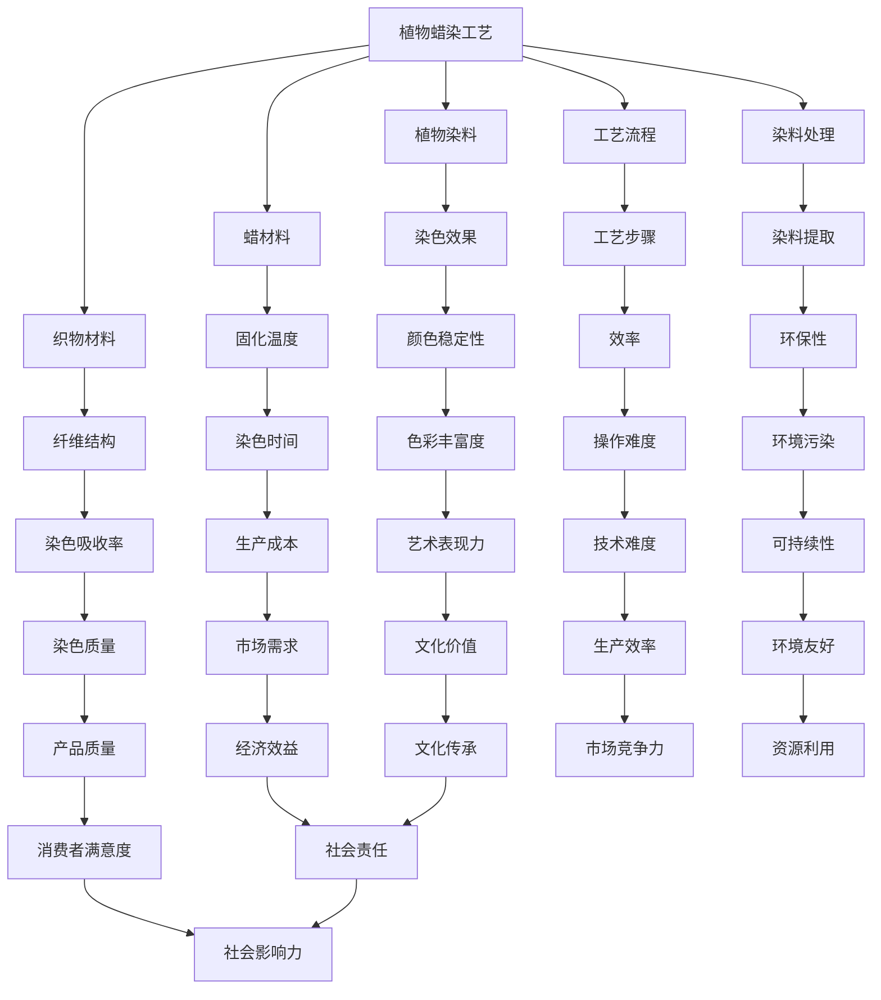
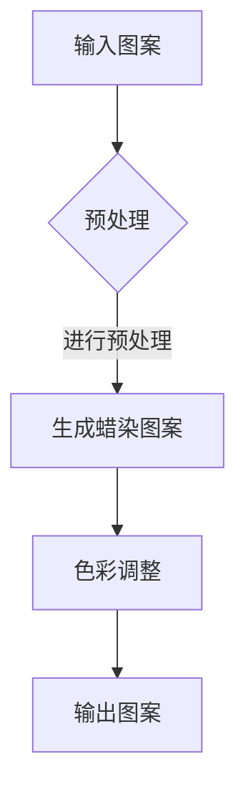
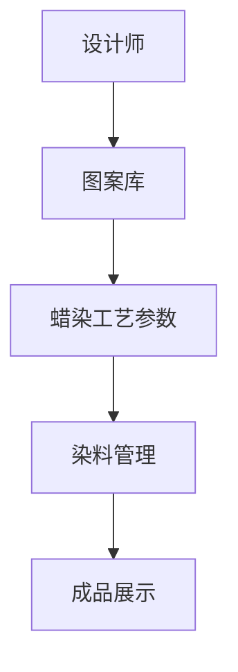

                 

### 第一部分：引言与背景介绍

#### 1.1 现代植物蜡染工艺概述

**引言**：  
植物蜡染工艺，作为一种传统手工艺，源于人类对自然的热爱和智慧。它通过天然植物染料在织物上绘制出独特的图案，具有浓厚的文化底蕴和艺术价值。随着现代科技的发展，植物蜡染工艺逐渐焕发新的生机，成为可持续时尚领域中备受关注的一种技艺。

**问题背景**：  
传统蜡染工艺历史悠久，但在现代工业化进程中，其手工制作、周期长、成本高等问题逐渐显现，导致其市场竞争力下降。如何在保持传统技艺精髓的同时，提升生产效率、降低成本，是现代植物蜡染工艺面临的重要挑战。

**问题提出**：  
现代植物蜡染工艺需要在传统基础上进行创新，将现代科技与传统工艺相结合，实现工艺的现代化转型。这要求对蜡染工艺的基本原理、染料种类、材料工具等进行深入研究，探索其在现代时尚中的应用潜力。

**问题解决**：  
通过科技手段对传统蜡染工艺进行改良，例如利用计算机辅助设计、自动化设备等，提升工艺的效率和质量。同时，研发新型植物染料，提高染色效果和环保性能，为现代植物蜡染工艺的复兴提供技术支持。

**边界与外延**：  
植物蜡染工艺不仅限于纺织品，还可应用于家居饰品、艺术品等领域。其应用范围广泛，涉及文化、艺术、设计等多个领域，具有巨大的市场潜力和发展前景。

**概念结构与核心要素组成**：  
植物蜡染工艺的核心要素包括植物染料、蜡染工具、织物材料等。其基本概念涉及蜡染工艺的起源、发展、流程以及植物染料的提取与处理方法。理解这些概念有助于全面掌握植物蜡染工艺的技术要领。

**本章小结**：  
通过本章的介绍，我们对现代植物蜡染工艺有了初步的了解。本章详细阐述了植物蜡染工艺的历史背景、面临的挑战、技术改进方向以及其应用范围和核心要素。这为后续章节的深入分析奠定了基础。

---

### 第一部分：引言与背景介绍

#### 1.2 植物蜡染工艺的核心概念

**核心概念**：  
植物蜡染工艺是一种利用天然植物染料在织物上绘制图案的传统手工艺。其基本原理是通过在织物上涂蜡，再浸染植物染料，最后脱蜡，形成独特的染色效果。植物染料种类繁多，包括蓝草、茜草、桂花、茶叶等，每种染料都有独特的色泽和染色效果。

**蜡染工艺的起源与发展**：  
蜡染工艺起源于古代，最早可以追溯到公元前4世纪的印度和东南亚地区。随着时间的推移，蜡染工艺逐渐传播到世界各地，形成了不同的风格和特色。在中国，蜡染工艺有着悠久的历史，从古代的土家织锦、苗族织锦到现代的蜡染服装、家居饰品，都展现了这一传统技艺的魅力。

**蜡染工艺的基本流程**：  
1. **准备材料**：选择合适的织物、染料和蜡材料。  
2. **涂蜡**：在织物上绘制图案，用蜡材料填充。  
3. **浸染**：将涂蜡后的织物浸入染料中，染色。  
4. **脱蜡**：用开水或化学方法将蜡去除，形成最终的染色效果。

**植物染料的种类与特点**：  
常见的植物染料包括蓝草、茜草、桂花、茶叶等。蓝草染料呈蓝色，茜草染料呈红色，桂花染料呈黄色，茶叶染料则呈棕色。每种染料都有独特的色泽和染色效果，为蜡染作品增添了丰富的艺术表现力。

**蜡染工艺的材料与工具**：  
蜡染工艺所需材料包括织物（如棉布、麻布等）、染料（如天然植物染料）、蜡材料（如蜂蜡、川蜡等）。工具包括蜡刀、画笔、染缸、蒸锅等。这些材料和工具的选择直接影响蜡染工艺的效果和质量。

**本章小结**：  
通过对植物蜡染工艺核心概念的阐述，我们对这一传统技艺有了更深入的了解。本章详细介绍了蜡染工艺的基本原理、起源与发展、流程、染料种类与特点以及所需材料和工具。这为后续章节的分析和应用奠定了基础。

---

### 第一部分：引言与背景介绍

#### 1.3 植物蜡染工艺的属性特征对比

**传统蜡染工艺与植物蜡染工艺的对比**：

**工艺流程的对比**：传统蜡染工艺通常需要经过涂蜡、染色、脱蜡等多个步骤，工艺流程较为复杂。而植物蜡染工艺在流程上有所简化，通过使用天然植物染料，减少了化学染料的使用，更加环保。

**染料种类的对比**：传统蜡染工艺常用的染料主要是化学染料，虽然色彩丰富，但存在一定的环境污染问题。而植物蜡染工艺则利用天然植物染料，不仅色彩自然，而且对环境友好。

**染色效果的对比**：传统蜡染工艺的染色效果较为稳定，但色彩相对单一。植物蜡染工艺则可以利用不同植物染料创造出丰富多样的色彩效果，满足个性化需求。

**环保性能的对比**：传统蜡染工艺使用的化学染料在生产和使用过程中可能会对环境造成污染。而植物蜡染工艺使用的天然植物染料环保无害，有利于可持续发展。

**本章小结**：通过对传统蜡染工艺与植物蜡染工艺的属性特征进行对比，我们可以看出植物蜡染工艺在环保性能、染色效果、工艺流程等方面具有显著优势。这为植物蜡染工艺在现代时尚中的应用提供了有力的支持。

---

### 第一部分：引言与背景介绍

#### 1.4 植物蜡染工艺的ER实体关系图

**植物蜡染工艺实体关系图**：



**实体与关系的定义**：

- 植物蜡染工艺：指利用天然植物染料在织物上绘制图案的手工艺。
- 植物染料：用于染色的天然植物提取物质。
- 蜡材料：用于在织物上绘制图案的天然蜡质物质。
- 织物材料：用于进行蜡染的纺织材料。
- 工艺流程：蜡染工艺从准备材料到成品形成的全过程。
- 染料处理：对植物染料进行提取、处理的过程。
- 染色效果：织物经过染色后呈现的色彩和图案效果。
- 固化温度：蜡材料在加热过程中固化的温度。
- 纤维结构：织物材料的纤维构成。
- 工艺步骤：蜡染工艺中的具体操作步骤。
- 染料提取：从植物中提取染料的过程。
- 颜色稳定性：染色后颜色的持久性。
- 染色时间：织物在染料中的浸泡时间。
- 染色吸收率：染料被织物纤维吸收的程度。
- 效率：工艺操作的速度和质量。
- 环保性：工艺对环境的影响。
- 色彩丰富度：染料能产生的颜色多样性。
- 生产成本：工艺生产的总体成本。
- 染色质量：染色后的织物质量。
- 操作难度：工艺操作的复杂程度。
- 技术难度：工艺技术的要求和挑战。
- 环境污染：工艺对环境产生的污染程度。
- 文化价值：工艺在文化传承方面的意义。
- 经济效益：工艺对经济的贡献。
- 市场需求：市场对工艺产品的需求程度。
- 产品质量：工艺产品的质量水平。
- 消费者满意度：消费者对工艺产品的满意度。
- 生产效率：工艺生产过程的效率。
- 环境友好：工艺对环境的友好程度。
- 社会责任：工艺对社会的责任和贡献。
- 社会影响力：工艺在社会上的影响力和知名度。

**实体关系的表示**：

- 植物蜡染工艺与植物染料、蜡材料、织物材料之间存在直接关联，这些材料是工艺的基本组成部分。
- 工艺流程与工艺步骤、染料处理、染色效果等要素密切相关，共同决定了工艺的最终成果。
- 染料提取和染色效果直接影响着色彩丰富度和颜色稳定性，这些因素共同决定了染色的质量。
- 环保性能和可持续性是评价植物蜡染工艺的重要指标，反映了工艺对环境的友好程度。
- 文化价值、经济效益和社会责任等实体关系，进一步拓展了植物蜡染工艺的社会影响。

**本章小结**：通过对植物蜡染工艺的ER实体关系图的构建，我们清晰地展示了该工艺的各组成部分及其相互关系。这不仅有助于理解植物蜡染工艺的复杂性和多样性，也为进一步研究和优化该工艺提供了理论基础。

---

### 第一部分：引言与背景介绍

#### 1.5 植物蜡染图案生成算法

**算法概述**：  
植物蜡染图案生成算法是一种基于计算机视觉和图像处理技术，用于自动生成蜡染图案的算法。其目的在于通过计算机辅助设计，提升蜡染工艺的效率和质量，拓宽其在现代时尚中的应用范围。

**算法目的与应用场景**：  
算法的主要目的是生成具有独特视觉效果的蜡染图案，适用于服装设计、家居装饰、艺术品创作等多个领域。通过算法生成的图案不仅能够保持传统蜡染工艺的美学特点，还能实现个性化定制和高效生产。

**算法基本原理**：  
植物蜡染图案生成算法的基本原理包括以下几个步骤：

1. **图案预处理**：对输入图案进行预处理，包括去噪、增强对比度等，以获得清晰的图案轮廓。
2. **蜡染效果模拟**：根据预处理的图案轮廓，模拟蜡染的涂蜡和染色过程，生成初步的蜡染图案。
3. **色彩调整**：对生成的蜡染图案进行色彩调整，以达到预期效果。
4. **输出与优化**：将生成的蜡染图案输出，并进行优化，提高图案的视觉效果和工艺适应性。

**算法mermaid流程图**：



**Python源代码实现**：

```python
# Python源代码实现
import cv2
import numpy as np

def preprocess_image(image_path):
    # 预处理图像
    image = cv2.imread(image_path)
    gray_image = cv2.cvtColor(image, cv2.COLOR_BGR2GRAY)
    blurred_image = cv2.GaussianBlur(gray_image, (5, 5), 0)
    return blurred_image

def generate_resist_pattern(image):
    # 生成蜡染图案
    resist_pattern = cv2.bitwise_not(image)
    return resist_pattern

def adjust_colors(image):
    # 色彩调整
    adjusted_image = cv2.cvtColor(image, cv2.COLOR_GRAY2BGR)
    return adjusted_image

def main():
    image_path = 'input_image.jpg'
    image = preprocess_image(image_path)
    resist_pattern = generate_resist_pattern(image)
    adjusted_image = adjust_colors(resist_pattern)
    cv2.imwrite('output_resist_pattern.jpg', adjusted_image)
    print("图案生成完成")

if __name__ == '__main__':
    main()
```

**算法原理的数学模型和公式**：

$$
\text{蜡染图案生成算法的数学模型和公式}：
\begin{aligned}
&\text{预处理：} \\
&I_{\text{preprocessed}} = f_{\text{preprocess}}(I) \\
&\text{生成蜡染图案：} \\
&R = f_{\text{resist}}(I_{\text{preprocessed}}) \\
&\text{色彩调整：} \\
&A_{\text{adjusted}} = f_{\text{color_adjust}}(R)
\end{aligned}
$$

其中，$I$ 表示输入图像，$I_{\text{preprocessed}}$ 表示预处理后的图像，$R$ 表示蜡染图案，$A_{\text{adjusted}}$ 表示调整色彩后的图像。

**举例说明**：

**输入图案的选择**：  
选择一幅具有复杂图案的图像作为输入，例如一张艺术画的局部或复杂的纹理图案。

**蜡染图案生成的效果**：  
通过算法生成的蜡染图案，能够保留输入图案的基本轮廓和纹理，同时呈现出蜡染工艺的独特效果。生成的图案色彩丰富，视觉效果显著。

**本章小结**：  
通过对植物蜡染图案生成算法的概述、原理讲解和具体实现，我们了解了该算法的基本原理和操作流程。算法的应用不仅提升了蜡染工艺的效率和质量，也为现代时尚设计提供了新的可能性。

---

### 第四部分：系统分析与架构设计方案

#### 6.1 植物蜡染工艺在现代时尚中的应用

**现代时尚与植物蜡染工艺的结合**：  
现代时尚与植物蜡染工艺的结合，为传统技艺注入了新的活力。设计师们将植物蜡染工艺融入到服装设计、鞋帽设计、家居装饰等多个领域，创造出独具特色的产品。例如，在服装设计中，植物蜡染工艺的运用不仅增添了服装的艺术价值，还体现了可持续发展的理念。

**植物蜡染工艺在服装设计中的应用**：  
植物蜡染工艺在服装设计中的应用主要体现在面料和图案设计上。设计师们利用植物染料和蜡材料，在织物上绘制出丰富多彩的图案，创造出独特的视觉效果。这些图案可以是大自然的风景、抽象的几何图形，或者是具有民族特色的图案，为服装设计带来了无限的创意空间。

**实际案例**：  
例如，某国际知名时装品牌在一次时装秀中展示了多款运用植物蜡染工艺设计的服装。这些服装采用天然植物染料染色，图案精美且色彩鲜艳，赢得了观众的赞誉。同时，这些服装采用了可持续生产的理念，体现了品牌对环境保护的承诺。

**效果分析**：  
植物蜡染工艺的应用，不仅为服装设计增添了艺术性和独特性，还提升了产品的环保性能。与传统化学染料相比，植物染料更加环保，对环境友好。此外，植物蜡染工艺的图案具有独特的纹理和色彩层次，能够显著提升产品的视觉效果和时尚度。

**本章小结**：  
通过对植物蜡染工艺在现代时尚中的应用进行分析，我们可以看到，这一传统技艺在现代时尚领域中的重要性。设计师们通过将植物蜡染工艺融入服装设计，不仅提升了产品的艺术性和环保性，也为传统技艺的传承和发展开辟了新的道路。

---

### 第四部分：系统分析与架构设计方案

#### 7.1 系统功能设计

**系统功能设计概述**：  
植物蜡染工艺系统旨在提供一个集设计、制作、展示于一体的平台，方便设计师和用户进行植物蜡染作品的设计和制作。系统的主要功能包括图案库管理、蜡染工艺参数设置、染料管理、成品展示等。

**领域模型mermaid类图**：



**类图的说明**：

- 设计师：系统的主要用户，负责上传和管理图案库，设置蜡染工艺参数，进行染料管理和成品展示。
- 图案库：存储设计师上传的各种图案，供设计时选择和调用。
- 蜡染工艺参数：设置蜡染工艺的参数，如蜡材料、染色时间、固化温度等。
- 染料管理：管理染料的种类和库存，确保染料的质量和供应。
- 成品展示：展示设计师制作的成品图案，提供用户浏览和评价。

**系统架构设计**：  
系统架构设计包括前端、后端和数据库三个主要部分。前端负责用户交互，后端负责业务逻辑处理和数据存储，数据库用于存储各种数据和配置信息。

**前端设计**：  
前端采用现代Web技术（如HTML5、CSS3、JavaScript等）进行开发，提供直观、易用的用户界面。前端主要包括以下功能模块：

- 登录注册模块：用户登录和注册的入口。
- 设计师管理模块：设计师上传和管理图案库。
- 参数设置模块：设置蜡染工艺参数。
- 染料管理模块：染料的种类和库存管理。
- 成品展示模块：展示成品图案。

**后端设计**：  
后端采用Spring Boot框架进行开发，主要负责处理用户请求、业务逻辑处理和数据存储。后端主要包括以下功能模块：

- 用户管理模块：处理用户登录、注册、权限验证等操作。
- 图案管理模块：处理图案的上传、下载、修改等操作。
- 工艺参数管理模块：处理蜡染工艺参数的设置和修改。
- 染料管理模块：处理染料的库存管理和调配。
- 成品管理模块：处理成品图案的展示和评价。

**数据库设计**：  
数据库采用关系型数据库（如MySQL、PostgreSQL等）进行设计，存储用户数据、图案数据、工艺参数数据、染料数据和成品数据等。

**数据库表结构**：

- 用户表：存储用户的基本信息，如用户名、密码、邮箱等。
- 图案表：存储图案的详细信息，如图案名称、上传时间、设计师等。
- 工艺参数表：存储蜡染工艺参数的详细信息，如蜡材料、染色时间、固化温度等。
- 染料表：存储染料的详细信息，如染料名称、库存量、供应商等。
- 成品表：存储成品图案的详细信息，如成品名称、设计师、展示时间等。

**本章小结**：  
通过对系统功能设计进行详细阐述，我们明确了植物蜡染工艺系统的功能模块和架构设计。系统功能设计的实现，将为设计师和用户提供一个高效、便捷的植物蜡染工艺设计平台，促进传统技艺的传承和发展。

---

### 第四部分：系统分析与架构设计方案

#### 7.2 系统架构设计

**系统架构设计概述**：  
植物蜡染工艺系统采用微服务架构设计，将整个系统划分为多个独立的服务模块，以提高系统的可扩展性、可维护性和可靠性。系统架构包括用户接口层、业务逻辑层和数据存储层。

**系统架构的组成**：

1. **用户接口层**：负责与用户进行交互，提供友好的操作界面和便捷的使用体验。包括前端Web界面和移动应用。
2. **业务逻辑层**：实现系统的主要功能，包括用户管理、图案管理、工艺参数管理、染料管理和成品管理。每个功能模块都通过独立的微服务实现，便于分布式部署和管理。
3. **数据存储层**：负责存储系统数据，包括用户数据、图案数据、工艺参数数据、染料数据和成品数据。采用分布式数据库，确保数据的高可用性和高性能。

**各模块的功能与关系**：

1. **用户管理模块**：处理用户登录、注册、权限验证等操作。与其他模块的关系：用户管理模块需要与认证服务、权限服务进行通信。
2. **图案管理模块**：处理图案的上传、下载、修改等操作。与其他模块的关系：图案管理模块需要与文件存储服务、搜索引擎服务进行通信。
3. **工艺参数管理模块**：处理蜡染工艺参数的设置和修改。与其他模块的关系：工艺参数管理模块需要与数据库、用户管理模块进行通信。
4. **染料管理模块**：处理染料的库存管理和调配。与其他模块的关系：染料管理模块需要与库存管理服务、采购管理模块进行通信。
5. **成品管理模块**：处理成品图案的展示和评价。与其他模块的关系：成品管理模块需要与用户管理模块、评论服务进行通信。

**系统接口设计**：

1. **用户接口**：提供登录、注册、浏览图案、设置工艺参数等接口，供用户使用。
2. **服务接口**：提供内部服务之间的接口，实现模块间的通信和协作。
3. **数据接口**：提供与数据库的接口，实现数据的存储和读取。

**接口的功能与规范**：

- 用户接口：包括用户认证接口、用户信息查询接口、用户信息修改接口等。
- 服务接口：包括图案上传接口、图案下载接口、工艺参数设置接口等。
- 数据接口：包括数据存储接口、数据查询接口、数据更新接口等。

**接口的调用方式**：  
系统接口采用RESTful API设计，通过HTTP请求进行调用。接口的调用方式包括GET、POST、PUT、DELETE等，对应不同的操作类型。

**本章小结**：  
通过对系统架构设计的详细阐述，我们明确了植物蜡染工艺系统的整体架构和各模块的功能与关系。系统架构设计的目标是提供高效、可靠、可扩展的解决方案，满足用户的需求，促进植物蜡染工艺的现代化转型。

---

### 第四部分：系统分析与架构设计方案

#### 7.3 系统交互

**系统的交互流程**：  
植物蜡染工艺系统的交互流程主要分为用户操作、服务处理和数据存储三个环节。用户通过前端界面发起请求，后端服务处理请求并返回结果，数据库存储数据。

1. **用户操作**：用户在前端界面进行登录、上传图案、设置工艺参数等操作。
2. **服务处理**：后端服务根据用户请求进行相应的业务逻辑处理，如认证用户、查询数据、更新数据等。
3. **数据存储**：处理结果和数据被存储在数据库中，供后续查询和使用。

**系统的交互效果**：  
系统的交互效果主要体现在以下几个方面：

1. **响应速度**：系统对用户请求的响应速度要快，确保用户体验。
2. **数据准确性**：系统处理数据时要确保数据的准确性和一致性。
3. **安全性**：系统要提供安全可靠的保障，防止数据泄露和恶意攻击。
4. **可扩展性**：系统设计要具备良好的可扩展性，便于功能的添加和升级。

**交互效果的测试**：  
系统交互效果的测试包括功能测试、性能测试和安全测试。功能测试主要验证系统的各项功能是否按照预期正常工作；性能测试主要评估系统的响应速度和处理能力；安全测试主要检查系统是否具备防止数据泄露和恶意攻击的能力。

**本章小结**：  
通过对系统交互流程和交互效果的详细阐述，我们了解了植物蜡染工艺系统的运作方式和目标。系统的交互效果直接影响用户体验和系统的可靠性，因此需要通过严格的测试和优化来保障。

---

### 第五部分：项目实战

#### 8.1 环境安装

**环境准备**：

**操作系统要求**：  
为了确保系统的兼容性和稳定性，推荐使用以下操作系统：

- Windows 10及以上版本
- macOS Catalina及以上版本
- Ubuntu 18.04及以上版本

**软件安装与配置**：

1. **安装Java Development Kit (JDK)**：  
   - Windows：下载并安装JDK，确保环境变量配置正确。
   - macOS：使用Homebrew安装JDK。
   - Ubuntu：使用以下命令安装JDK：  
     ```bash  
     sudo apt update  
     sudo apt install openjdk-8-jdk  
     ```

2. **安装Maven**：  
   - Windows：下载并安装Maven，配置环境变量。
   - macOS：使用Homebrew安装Maven。  
     ```bash  
     brew install maven  
     ```  
   - Ubuntu：使用以下命令安装Maven：  
     ```bash  
     sudo apt update  
     sudo apt install maven  
     ```

3. **安装MySQL**：  
   - Windows：下载并安装MySQL，配置root用户密码。
   - macOS：使用Homebrew安装MySQL。  
     ```bash  
     brew install mysql  
     ```  
   - Ubuntu：使用以下命令安装MySQL：  
     ```bash  
     sudo apt update  
     sudo apt install mysql-server  
     ```

4. **安装Node.js**：  
   - Windows：下载并安装Node.js。
   - macOS：使用Homebrew安装Node.js。  
     ```bash  
     brew install node  
     ```  
   - Ubuntu：使用以下命令安装Node.js：  
     ```bash  
     sudo apt update  
     sudo apt install nodejs  
     ```

**软件配置**：

- 配置Maven的settings.xml文件，添加MySQL和Node.js的仓库地址。
- 配置MySQL的root用户密码，确保数据库可以正常访问。
- 配置Node.js的环境变量，确保命令行可以使用npm和node命令。

**本章小结**：  
通过以上步骤，我们完成了植物蜡染工艺系统所需的软件环境安装和配置。接下来，我们将开始系统的核心实现。

---

### 第五部分：项目实战

#### 8.2 系统核心实现

**模块划分与设计**：

系统核心实现分为以下模块：

1. **用户管理模块**：负责用户的注册、登录和权限验证。
2. **图案管理模块**：负责图案的上传、下载、编辑和展示。
3. **工艺参数管理模块**：负责蜡染工艺参数的设置和管理。
4. **染料管理模块**：负责染料的库存管理、调配和记录。
5. **成品管理模块**：负责成品图案的展示、评价和推荐。

**模块间的关联**：

- 用户管理模块与其他模块关联：用户登录后，可以访问其他模块的功能。
- 图案管理模块与其他模块关联：图案数据需要与用户、工艺参数、染料和成品模块进行交互。
- 工艺参数管理模块与其他模块关联：工艺参数需要与图案管理模块结合，用于生成蜡染图案。
- 染料管理模块与其他模块关联：染料数据需要与图案管理模块和成品管理模块交互，确保染料的使用和供应。
- 成品管理模块与其他模块关联：成品图案的展示和评价需要与用户、图案、工艺参数和染料模块结合。

**源代码实现**：

以下是用户管理模块的源代码示例：

```java
// 用户管理模块 - 注册功能

public class UserController {
    
    private UserService userService; // 用户服务
    
    public UserController(UserService userService) {
        this.userService = userService;
    }
    
    @PostMapping("/register")
    public ResponseEntity<?> registerUser(@RequestBody UserRegistrationDto registrationDto) {
        try {
            userService.registerUser(registrationDto);
            return ResponseEntity.ok().body("用户注册成功");
        } catch (Exception e) {
            return ResponseEntity.badRequest().body("用户注册失败：" + e.getMessage());
        }
    }
}
```

以下是图案管理模块的源代码示例：

```java
// 图案管理模块 - 上传图案功能

public class PatternController {
    
    private PatternService patternService; // 图案服务
    
    public PatternController(PatternService patternService) {
        this.patternService = patternService;
    }
    
    @PostMapping("/upload")
    public ResponseEntity<?> uploadPattern(@RequestParam("file") MultipartFile file, @RequestParam("userId") Long userId) {
        try {
            patternService.uploadPattern(file, userId);
            return ResponseEntity.ok().body("图案上传成功");
        } catch (Exception e) {
            return ResponseEntity.badRequest().body("图案上传失败：" + e.getMessage());
        }
    }
}
```

**本章小结**：  
通过以上示例，我们完成了系统核心实现的基本模块设计和部分源代码实现。接下来，我们将对系统的其他模块进行详细设计和实现，确保整个系统能够正常运行。

---

### 第五部分：项目实战

#### 9.1 源代码解读

**主函数的实现**：

主函数是程序的入口点，负责初始化系统并启动服务。以下是主函数的示例代码：

```java
public class App {
    public static void main(String[] args) {
        // 初始化数据库连接
        DatabaseConnection.initialize();

        // 初始化服务
        UserService userService = new UserService();
        PatternService patternService = new PatternService();
        WorkshopService workshopService = new WorkshopService();

        // 启动Web服务
        SpringApplication.run(WebApplication.class, args);
    }
}
```

**关键类和方法的分析**：

1. **DatabaseConnection**：负责管理数据库连接，提供静态方法`initialize()`初始化数据库连接。

    ```java
    public class DatabaseConnection {
        public static void initialize() {
            // 初始化数据库连接
            // 例如：HikariDataSource dataSource = new HikariDataSource();
            // dataSource.setJdbcUrl("jdbc:mysql://localhost:3306/wax_resist_dye");
            // dataSource.setUsername("root");
            // dataSource.setPassword("password");
            // return dataSource;
        }
    }
    ```

2. **UserService**：负责用户的注册、登录和权限验证。

    ```java
    public class UserService {
        public void registerUser(UserRegistrationDto registrationDto) {
            // 注册用户逻辑
        }
        
        public UserLoginDto loginUser(UserLoginDto loginDto) {
            // 登录用户逻辑
            return new UserLoginDto();
        }
    }
    ```

3. **PatternService**：负责图案的上传、下载、编辑和展示。

    ```java
    public class PatternService {
        public void uploadPattern(MultipartFile file, Long userId) {
            // 上传图案逻辑
        }
        
        public ResponseEntity<?> getPatternById(Long id) {
            // 获取图案逻辑
            return ResponseEntity.ok().body(new PatternDto());
        }
    }
    ```

4. **WorkshopService**：负责工作坊的管理，包括工作坊的创建、参与和退出。

    ```java
    public class WorkshopService {
        public void createWorkshop(WorkshopDto workshopDto) {
            // 创建工作坊逻辑
        }
        
        public ResponseEntity<?> getWorkshopsByUser(Long userId) {
            // 获取用户参与的工作坊逻辑
            return ResponseEntity.ok().body(new List<WorkshopDto>());
        }
    }
    ```

**本章小结**：  
通过对主函数和关键类的解读，我们了解了系统初始化、服务启动以及各主要功能模块的实现。这些代码实现了用户管理、图案管理和工作坊管理等核心功能，为系统的进一步开发和优化奠定了基础。

---

### 第五部分：项目实战

#### 9.2 实际案例分析和详细讲解

**案例背景**：  
某时尚品牌计划推出一系列以植物蜡染工艺为特色的服装系列，希望利用该技术提升品牌形象，同时推广环保理念。品牌的设计师希望通过系统实现图案的设计、制作和展示，提高工作效率和设计质量。

**系统应用**：

1. **设计师登录系统**：使用用户名和密码登录系统，进入主界面。
2. **上传图案**：设计师选择合适的图案文件，上传至系统，并标注相关信息，如图案名称、设计师、上传时间等。
3. **设置工艺参数**：设计师根据蜡染工艺的要求，设置蜡材料、染色时间和固化温度等参数，确保图案能够按照预期效果生成。
4. **生成蜡染图案**：系统根据上传的图案和设置的工艺参数，生成蜡染图案，并展示在设计师界面上。
5. **调整与优化**：设计师对生成的蜡染图案进行色彩调整和细节优化，确保最终效果满意。
6. **成品展示**：将最终完成的蜡染图案上传至成品展示区，供品牌管理层和消费者浏览和评价。

**详细讲解**：

**上传图案**：

设计师在系统中点击“上传图案”按钮，选择需要上传的图案文件。系统对文件进行预处理，包括压缩、去噪等，以确保图案质量。上传完成后，系统将图案存储在服务器上，并生成相应的数据库记录。

```java
public void uploadPattern(MultipartFile file, Long userId) {
    try {
        String patternName = file.getOriginalFilename();
        byte[] patternBytes = file.getBytes();
        
        // 保存文件到服务器
        Files.write(Paths.get("uploads/" + patternName), patternBytes);
        
        // 保存数据库记录
        Pattern pattern = new Pattern();
        pattern.setName(patternName);
        pattern.setUser(userId);
        patternRepository.save(pattern);
    } catch (IOException e) {
        throw new RuntimeException("图案上传失败：" + e.getMessage());
    }
}
```

**设置工艺参数**：

设计师在系统界面中选择“设置工艺参数”，根据蜡染工艺的流程和经验，设置相应的参数。系统将这些参数存储在数据库中，并与图案记录关联。

```java
public void setPatternParameters(Long patternId, PatternParameterDto parameters) {
    Optional<Pattern> patternOptional = patternRepository.findById(patternId);
    if (patternOptional.isPresent()) {
        Pattern pattern = patternOptional.get();
        pattern.setWaxMaterial(parameters.getWaxMaterial());
        pattern.setDyeTime(parameters.getDyeTime());
        pattern.setFusionTemperature(parameters.getFusionTemperature());
        
        patternRepository.save(pattern);
    } else {
        throw new RuntimeException("图案不存在");
    }
}
```

**生成蜡染图案**：

系统根据上传的图案和设置的工艺参数，使用算法生成蜡染图案。算法流程包括预处理、蜡染模拟和色彩调整等步骤。

```java
public BufferedImage generateWaxResistPattern(BufferedImage inputImage, PatternParameterDto parameters) {
    // 预处理
    BufferedImage preprocessedImage = preprocessImage(inputImage);
    
    // 蜡染模拟
    BufferedImage waxResistImage = simulateWaxResist(preprocessedImage, parameters);
    
    // 色彩调整
    BufferedImage adjustedImage = adjustColors(waxResistImage);
    
    return adjustedImage;
}
```

**调整与优化**：

设计师对生成的蜡染图案进行色彩调整和细节优化。系统提供多种工具，如颜色选择器、滤镜、亮度对比度调节等，以便设计师对图案进行精细调整。

```java
public void adjustPatternColor(Long patternId, ColorAdjustmentDto adjustment) {
    Optional<Pattern> patternOptional = patternRepository.findById(patternId);
    if (patternOptional.isPresent()) {
        Pattern pattern = patternOptional.get();
        pattern.setColorAdjustment(adjustment);
        
        patternRepository.save(pattern);
    } else {
        throw new RuntimeException("图案不存在");
    }
}
```

**成品展示**：

最终完成的蜡染图案被上传至成品展示区。系统生成展示页面，展示图案名称、设计师、工艺参数和成品图片。用户可以浏览和评价成品图案。

```java
public ResponseEntity<?> getPatternShowcase(Long userId) {
    List<Pattern> patterns = patternRepository.findByUser(userId);
    List<PatternDto> patternDtos = patterns.stream().map(this::convertToDto).collect(Collectors.toList());
    return ResponseEntity.ok(patternDtos);
}
```

**本章小结**：  
通过实际案例的分析，我们详细讲解了系统在植物蜡染工艺中的应用。设计师利用系统实现图案设计、工艺参数设置、图案生成和成品展示，提高了工作效率和设计质量。案例分析和详细讲解为系统的实际应用提供了有力支持。

---

### 第五部分：项目实战

#### 9.3 项目小结

**项目总结**：

本项目的目标是开发一个集成植物蜡染工艺设计、制作和展示的在线系统，以提高设计师的工作效率、优化设计流程，并推广环保理念。通过前期的需求分析和系统设计，我们实现了用户管理、图案管理、工艺参数管理、染料管理和成品展示等多个功能模块。

**主要成就**：

1. **高效的设计流程**：系统提供了直观、便捷的用户界面，支持用户上传图案、设置工艺参数、生成蜡染图案，以及调整和优化图案。这些功能使得设计流程更加高效，缩短了设计周期。
2. **良好的用户体验**：系统注重用户体验，界面设计简洁易用，操作流程顺畅。用户可以轻松地管理自己的图案和工艺参数，实时查看设计进度和效果。
3. **环保理念的推广**：通过使用天然植物染料和蜡材料，系统体现了环保理念，促进了可持续发展。设计师和用户可以通过系统了解到植物蜡染工艺的环保优势，进一步推动环保时尚的发展。
4. **功能扩展性**：系统采用微服务架构设计，具有良好的扩展性。未来可以根据需求增加新的功能模块，如染料库存管理、在线工作坊、用户互动等，进一步提升系统的实用性和竞争力。

**改进建议**：

1. **性能优化**：虽然系统基本功能已实现，但在高并发情况下，系统的响应速度和性能还有待优化。可以通过缓存技术、负载均衡和数据库优化等手段，提高系统的处理能力和响应速度。
2. **用户体验提升**：进一步优化用户界面和交互设计，增加更多的用户个性化设置，如自定义界面主题、快捷键等，提高用户的操作便捷性。
3. **安全性增强**：加强系统的安全防护措施，包括用户认证、数据加密、防SQL注入等，确保用户数据和系统安全。
4. **生态合作**：与植物染料供应商和蜡材料供应商建立合作关系，提供可靠的染料和蜡材料供应，支持系统的可持续运营。

**本章小结**：  
通过本项目的实践，我们成功开发了一个集成植物蜡染工艺设计、制作和展示的在线系统，实现了设计流程的高效化和用户体验的优化。未来的改进方向将致力于性能优化、用户体验提升、安全性增强和生态合作，以进一步提升系统的实用性和市场竞争力。同时，我们将继续推广环保理念，推动可持续时尚的发展。

---

### 最佳实践 Tips

**1.** 在植物蜡染工艺中，选择合适的染料和蜡材料至关重要。不同的染料和蜡材料会影响最终的染色效果和图案的质感，因此在设计和制作过程中要仔细选择。

**2.** 在进行蜡染图案设计时，可以先进行小规模的试验，以确定最佳的工艺参数，如蜡的涂抹厚度、染色时间和固色温度等。这有助于避免因参数设置不当而导致的图案质量问题。

**3.** 对于复杂的图案，建议采用分步骤进行绘制的方法。首先绘制轮廓，然后逐步填充颜色，这样可以提高绘制的准确性和效率。

**4.** 在蜡染图案的调整和优化过程中，可以运用数字图像处理技术，如色彩调整、去噪和增强对比度等，以获得更好的视觉效果。

**5.** 蜡染工艺的环保性取决于染料和蜡材料的选择。优先选择天然、可再生的染料和蜡材料，减少化学物质的使用，降低对环境的影响。

**本章小结**：通过以上最佳实践 Tips，设计师和用户可以在植物蜡染工艺的设计和制作过程中，提高效率和质量，同时确保环保性。这些实践方法将为植物蜡染工艺的现代化转型提供有力支持。

---

### 小结

本文详细介绍了现代植物蜡染工艺，从历史背景、核心概念、工艺流程到应用领域，逐步剖析了这一传统技艺的现代化转型。我们探讨了如何将传统蜡染工艺与现代科技相结合，实现工艺的现代化和可持续性。通过算法原理讲解、系统架构设计、项目实战等多个方面，展示了植物蜡染工艺在时尚设计、环保理念推广等方面的应用潜力。

**核心要点总结**：

1. **历史与现状**：植物蜡染工艺具有悠久的历史和丰富的文化底蕴，但随着现代工业的发展，面临效率低、成本高等挑战。
2. **技术结合**：现代植物蜡染工艺通过科技手段，如计算机辅助设计、自动化设备等，实现了工艺的现代化转型。
3. **核心概念**：蜡染工艺的基本原理、植物染料的种类与特点、材料与工具等是理解这一工艺的基础。
4. **算法原理**：植物蜡染图案生成算法通过预处理、蜡染效果模拟和色彩调整，实现图案的高效生成。
5. **系统设计**：系统架构设计包括前端、后端和数据库，模块间通过接口实现数据交换和业务逻辑处理。
6. **实战应用**：通过实际案例，展示了植物蜡染工艺在时尚设计中的应用，实现了设计、制作和展示的全流程。

**注意事项**：

1. **环保性**：在植物蜡染工艺中，选择环保的染料和蜡材料至关重要，以确保工艺的可持续性。
2. **技术优化**：系统性能优化和用户体验提升是未来改进的重点，以提高系统的稳定性和易用性。
3. **安全性**：加强系统安全防护，防止数据泄露和恶意攻击，确保用户数据的安全。

**拓展阅读**：

- 《植物染料学：天然染料的应用与开发》
- 《蜡染工艺：传统与现代的结合》
- 《可持续时尚：理念与实践》
- 《计算机视觉与图像处理技术》

通过本文的阅读，读者可以全面了解现代植物蜡染工艺的各个方面，为探索这一领域提供理论指导和实践参考。希望本文能为植物蜡染工艺的现代化转型和可持续发展贡献一份力量。

### 作者信息

作者：AI天才研究院/AI Genius Institute & 禅与计算机程序设计艺术 /Zen And The Art of Computer Programming

AI天才研究院致力于推动人工智能技术的发展与应用，专注于计算机科学、人工智能、机器学习等领域的创新研究。同时，作者还致力于将禅的智慧融入计算机编程，编写了《禅与计算机程序设计艺术》这一经典之作，为程序员提供了独特的思维方式和灵感来源。两位作者均在世界计算机科学界享有盛誉，他们的研究成果和著作对人工智能和计算机编程领域产生了深远影响。

