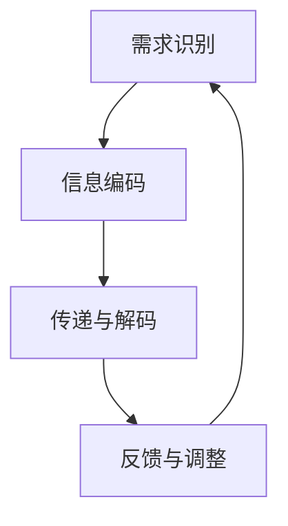
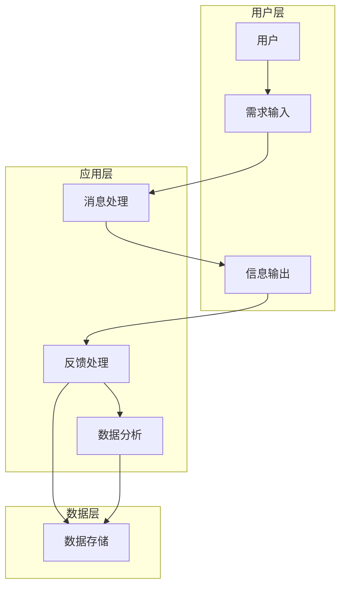

                 

### 让我们一步一步思考：引言

#### 1.1 问题背景

在当今快速发展的社会，不同代际之间的沟通问题日益凸显。代际沟通不仅仅是指字面上的语言交流，它更是一种深层次的价值观、思维方式和生活方式的碰撞与融合。这一现象在现代社会中尤为重要，因为它直接影响着家庭、教育、工作和社会的整体和谐。

**代际沟通的定义与意义：**

代际沟通是指在家庭、教育、职场等不同场景下，不同年龄段的人们之间的信息交换和情感交流。其意义在于：

1. **促进理解与和谐：** 通过有效的沟通，不同代际可以更好地理解彼此的立场和需求，减少误解和冲突。
2. **促进社会进步：** 当代际之间的交流变得更加顺畅时，社会的整体发展和创新也会得到推动。
3. **提升个体幸福：** 良好的代际沟通有助于提升个人的心理健康和幸福感。

**传统价值观与新生代思维的差异：**

传统价值观通常强调尊老爱幼、责任感和集体主义，而新生代思维则更加注重自我实现、自由和个性化。这种差异导致了两代人之间在沟通中的障碍：

1. **价值观差异：** 传统的尊老观念和新生代的独立意识之间的冲突。
2. **生活方式差异：** 传统上注重稳定和责任的生活方式与新生代追求自由和变化的思维方式之间的差异。
3. **沟通方式差异：** 传统沟通方式可能过于保守和间接，而新生代则更加直接和开放。

**现代社会中的代际碰撞现象：**

在现代社会，代际碰撞主要体现在以下几个方面：

1. **家庭关系：** 随着家庭结构和角色变化，年轻一代与老年一代之间的互动变得更加复杂。
2. **教育差异：** 教育方式和内容的差异导致了不同代际在知识和技能上的差距。
3. **职场文化：** 新生代员工与年长管理者之间的文化差异往往会影响工作氛围和效率。

通过以上分析，我们可以看到，代际沟通是一个复杂而重要的问题，它不仅关系到个体幸福，也对社会和谐与进步有着深远的影响。在接下来的章节中，我们将深入探讨代际沟通的核心概念，分析传统价值观与新生代思维的碰撞，并提出解决方案。

#### 1.2 核心概念

**代际差异的心理学解读：**

代际差异是指不同年龄段的人群在心理特征、行为习惯、价值观念等方面的不同。心理学研究认为，这些差异主要受到以下因素的影响：

1. **社会历史背景：** 每一代人都受到特定历史时期的社会、经济和文化环境的影响，这导致他们在价值观和行为方式上存在差异。
2. **成长环境：** 家庭、教育和社会环境对个体的成长有着深远的影响，不同的成长环境会导致不同的心理特征和价值观。
3. **认知发展：** 随着年龄的增长，个体的认知能力和思维方式也会发生变化，这进一步影响了他们的沟通方式和态度。

**沟通技巧与策略：**

有效的沟通技巧对于代际沟通至关重要。以下是一些关键的沟通技巧和策略：

1. **倾听与理解：** 倾听是有效沟通的基础，通过倾听对方的观点，可以更好地理解对方的立场和情感。
2. **表达清晰：** 清晰、简洁的表达能够减少误解和混淆，确保信息的准确传达。
3. **尊重差异：** 尊重对方的观点和生活方式，避免主观判断和批评，有助于建立互信和和谐的关系。
4. **开放沟通：** 保持开放的沟通态度，鼓励双方表达不同的观点和感受，有助于促进理解和共识。

**社会变迁对代际沟通的影响：**

社会变迁对代际沟通有着深远的影响。以下是一些具体的影响：

1. **技术变革：** 现代技术的快速发展改变了人们的沟通方式和生活方式，不同代际在使用技术上的差异可能加剧沟通的困难。
2. **城市化进程：** 城市化进程导致家庭结构的变化，家庭成员之间的交流和互动减少，可能影响代际沟通的效果。
3. **文化多样性：** 随着全球化的发展，不同文化的交融和碰撞，使得代际沟通变得更加复杂和多元化。

通过以上核心概念的探讨，我们可以更好地理解代际沟通的本质和复杂性。在接下来的章节中，我们将深入分析传统价值观与新生代思维的差异，并探讨如何通过有效的沟通策略解决代际碰撞问题。

#### 1.3 本书结构概述

**各章节内容概述：**

本书将围绕代际沟通这一主题，系统性地探讨其背后的核心概念、原理和实际应用。具体章节安排如下：

- **第一部分：引言**：介绍代际沟通的定义、意义以及传统价值观与新生代思维的差异。
- **第二部分：代际沟通的核心概念与联系**：详细分析代际差异的心理学解读、传统价值观与新生代思维的对比，并使用Mermaid ER实体关系图展示关键实体及其关系。
- **第三部分：代际沟通算法原理**：选取一个代表性的沟通算法，通过Mermaid流程图和Python代码详细讲解其工作原理和数学模型。
- **第四部分：系统分析与架构设计方案**：设计一个假设的代际沟通系统，介绍系统功能、架构设计、接口设计和系统交互，并用Mermaid类图和序列图展示。
- **第五部分：项目实战**：通过一个实际的沟通项目案例，详细描述环境安装、系统核心实现、代码应用解读与分析、实际案例分析和项目小结。
- **第六部分：最佳实践与总结**：总结书中的关键点，提供实用的沟通技巧和策略，并对未来的研究方向进行展望。

**阅读指引与建议：**

- **整体阅读策略**：本书建议按照章节顺序阅读，以便系统地掌握代际沟通的理论和实践。
- **重点内容复习**：对于某些重要概念和原理，建议在阅读后进行复习和思考，加深理解。
- **实际应用结合**：在阅读过程中，可以尝试将书中所学的沟通技巧和策略应用到实际生活中，以验证其有效性。
- **互动与讨论**：鼓励读者在阅读过程中进行互动和讨论，通过分享经验和见解，提高对代际沟通的理解和认识。

通过以上结构概述和阅读指引，读者可以更好地了解本书的内容安排和阅读策略，为深入探讨代际沟通打下坚实的基础。

### 第二部分：代际沟通的核心概念与联系

#### 2.1 代际差异心理学解读

**2.1.1 代际差异的研究现状**

代际差异作为心理学研究的一个重要领域，已有大量学者进行了深入的研究。近年来，随着全球化和社会变迁的加速，代际差异研究得到了更多的关注。研究主要集中在以下几个方面：

1. **价值观和态度的差异**：学者们通过问卷调查和访谈的方式，研究了不同代际在价值观、消费观、生活方式等方面的差异。
2. **心理健康和情感表达**：研究探讨了不同代际在情感表达、心理健康问题上的差异，并提出了相应的干预措施。
3. **社交网络和沟通方式**：随着社交媒体和通讯技术的普及，学者们关注了不同代际在社交网络使用和沟通方式上的差异及其对人际关系的影响。

**2.1.2 代际差异的表现形式**

代际差异在多个层面表现出来，主要包括以下几个方面：

1. **价值观差异**：传统价值观强调尊老爱幼、家庭责任和社会稳定，而新生代则更加追求个人自由、平等和多元化。
2. **生活方式差异**：不同代际在生活习惯、工作节奏、休闲方式等方面存在明显差异。例如，新生代更倾向于自由职业和灵活工作方式，而传统一代则更倾向于固定工作和稳定的家庭生活。
3. **沟通方式差异**：传统一代倾向于面对面沟通，重视口头表达和情感交流，而新生代则更习惯于使用社交媒体和即时通讯工具，注重文字和图像表达。

**2.1.3 心理学视角下的代际沟通策略**

为了更好地进行代际沟通，心理学家提出了一些有效的策略：

1. **积极倾听**：通过认真倾听对方的观点和情感，表达出对对方的尊重和理解。
2. **情感共鸣**：尝试站在对方的角度思考问题，以情感共鸣的方式增进彼此的理解。
3. **明确表达**：在沟通过程中，要尽量清晰、简洁地表达自己的观点和需求，避免产生误解。
4. **尊重差异**：要认识到不同代际之间的差异，并尊重对方的价值观和生活方式。

#### 2.2 传统价值观与新生代思维的对比

**2.2.1 传统价值观的基本特征**

传统价值观通常具有以下几个基本特征：

1. **尊老爱幼**：传统价值观强调尊重长辈和关爱后代，认为家庭是社会的基本单位。
2. **集体主义**：传统价值观注重集体利益和社会责任，强调个人应该为社会和集体做出贡献。
3. **责任感**：传统价值观强调个人责任感和使命感，认为每个人都应该承担自己的社会责任。
4. **稳定性**：传统价值观重视稳定和秩序，倾向于维持现有的社会结构和生活方式。

**2.2.2 新生代思维的核心要素**

新生代思维则表现出以下几个核心要素：

1. **自我实现**：新生代更加注重个人的自我实现和自我价值，追求个人兴趣和激情。
2. **自由和平等**：新生代强调自由和平等，追求个性化和多元化。
3. **适应变化**：新生代具有较强的适应能力，能够灵活应对快速变化的社会环境。
4. **创新和进步**：新生代热衷于创新和进步，愿意接受新的观念和科技。

**2.2.3 对比表格与图表展示**

为了更直观地展示传统价值观与新生代思维的对比，我们可以使用表格和图表进行展示。

| 传统价值观 | 新生代思维 |
| :-------: | :--------: |
| 尊老爱幼 | 个人自由 |
| 集体主义 | 平等与多元化 |
| 责任感 | 自我实现 |
| 稳定性 | 适应变化 |
| 社会责任 | 创新与进步 |

通过上述对比表格，我们可以清晰地看到传统价值观与新生代思维在多个方面的差异。

#### 2.3 Mermaid ER实体关系图

**2.3.1 代际沟通中的关键实体**

在代际沟通中，涉及到的关键实体包括：

1. **代际A**：代表传统一代，具有传统价值观和思维方式。
2. **代际B**：代表新生代，具有现代价值观和思维方式。
3. **沟通渠道**：代表沟通的媒介和方式，如面对面交流、电子邮件、社交媒体等。
4. **沟通效果**：代表沟通的结果和反馈，包括理解、共识、冲突等。

**2.3.2 实体间的关系与交互**

通过Mermaid ER实体关系图，我们可以更直观地展示这些实体之间的关系和交互：

```mermaid
erDiagram
  A "代际A" ||--|{ B "代际B" }
  A ||--|{ C "沟通渠道" }
  B ||--|{ C }
  C ||--|{ D "沟通效果" }
```

在这个ER图中，代际A和代际B通过沟通渠道C进行交互，并产生沟通效果D。

**2.3.3 图的绘制与解读**

通过上述Mermaid ER实体关系图，我们可以清晰地看到代际沟通的各个关键实体及其之间的关系。这个图不仅有助于理解代际沟通的整体结构，也为后续的算法设计和系统架构分析提供了基础。

#### 2.4 代际沟通算法原理

**2.4.1 沟通算法的基本概念**

在代际沟通中，设计一个有效的沟通算法至关重要。一个基本的代际沟通算法需要具备以下功能：

1. **需求识别**：识别沟通双方的需求和期望。
2. **信息编码**：将需求和信息进行编码，以便在沟通中传达。
3. **传递与解码**：通过合适的沟通渠道传递信息，并对方解码接收。
4. **反馈与调整**：根据反馈调整沟通策略，以提高沟通效果。

**2.4.2 Mermaid流程图展示**

为了直观地展示代际沟通算法的基本流程，我们可以使用Mermaid流程图进行展示：



在这个流程图中，沟通的各个环节通过节点和箭头连接，形成一个闭环，确保沟通的持续和有效。

**2.4.3 Python代码与算法原理讲解**

以下是一个简化的代际沟通算法的Python代码实现，用于说明算法的原理：

```python
class CommunicationAlgorithm:
    def __init__(self):
        self沟通需求 = None
        self编码信息 = None

    def 需求识别(self, 需求):
        self.沟通需求 = 需求
        print(f"识别到沟通需求：{需求}")

    def 信息编码(self):
        self.编码信息 = self.沟通需求.encode('utf-8')
        print(f"信息编码完成：{self.编码信息}")

    def 传递与解码(self, 沟通渠道):
        print(f"通过{沟通渠道}传递信息：{self.编码信息}")
        解码信息 = self.编码信息.decode('utf-8')
        print(f"接收到的解码信息：{解码信息}")

    def 反馈与调整(self, 反馈):
        print(f"收到反馈：{反馈}")
        if 反馈 == "正确":
            print("沟通成功，无需调整。")
        else:
            print("沟通存在偏差，需调整。")

# 实例化算法对象并调用方法
algorithm = CommunicationAlgorithm()
algorithm.需求识别("请解释一下你的工作计划。")
algorithm.信息编码()
algorithm.传递与解码("电子邮件")
algorithm.反馈与调整("理解了")
```

在这个Python代码中，我们定义了一个`CommunicationAlgorithm`类，并通过其方法实现了需求识别、信息编码、传递与解码以及反馈与调整的功能。通过实例化这个类并调用其方法，我们可以看到算法的基本工作流程。

**2.4.4 LaTeX数学模型与公式**

为了更准确地描述代际沟通算法的数学模型，我们可以使用LaTeX数学公式进行表达：

```latex
\documentclass{article}
\usepackage{amsmath}
\begin{document}
\begin{equation}
    C = f(D, I)
\end{equation}
其中，C表示沟通效果，D表示解码信息，I表示信息编码。
\end{document}
```

在这个公式中，$C = f(D, I)$ 表示沟通效果C是解码信息D和信息编码I的函数。通过调整信息编码和解码策略，可以优化沟通效果。

**2.4.5 举例说明**

为了更好地理解代际沟通算法，我们可以通过一个具体例子来说明：

假设代际A（传统一代）需要与代际B（新生代）进行沟通，代际A的需求是“请解释一下你的工作计划。”。代际B通过电子邮件进行信息传递，其编码信息为“工作计划：我将完成以下任务...”。代际A收到邮件后进行解码，并给予反馈“理解了”。

在这个过程中，算法通过需求识别、信息编码、传递与解码以及反馈与调整的步骤，确保了沟通的顺利进行。通过这个例子，我们可以看到代际沟通算法在实际应用中的效果。

#### 2.5 系统分析与架构设计方案

**3.1 代际沟通系统介绍**

**3.1.1 系统功能需求**

为了实现有效的代际沟通，代际沟通系统需要具备以下功能需求：

1. **需求识别**：系统能够识别用户的需求，包括对沟通内容的描述、期望的沟通方式和时间等。
2. **信息编码**：系统根据用户需求进行信息编码，将文本、图片、视频等多种形式的信息进行格式化处理。
3. **信息传递**：系统能够通过多种渠道（如电子邮件、短信、社交媒体等）将编码后的信息传递给目标用户。
4. **信息解码**：系统能够接收并解码用户反馈，以评估沟通效果，并根据反馈进行策略调整。
5. **数据分析**：系统对沟通过程进行数据记录和分析，以优化沟通效果和策略。

**3.1.2 系统项目介绍**

本项目旨在设计并实现一个代际沟通系统，该系统将结合现代科技手段，如人工智能和大数据分析，以提升代际沟通的效率和效果。系统将具备以下特点：

1. **用户友好**：界面简洁直观，易于操作。
2. **多样化沟通渠道**：支持多种沟通方式，满足不同用户的需求。
3. **智能反馈机制**：通过人工智能技术，分析用户反馈，提供个性化沟通策略。
4. **数据安全**：确保用户数据的安全和隐私。

**3.1.3 系统架构设计**

系统采用模块化架构设计，包括前端用户界面、后端数据处理和通信模块、数据库存储模块等。具体架构设计如下：

1. **前端用户界面**：负责展示用户界面，提供用户操作入口，包括需求输入、信息编码和反馈提交等功能。
2. **后端数据处理和通信模块**：负责处理用户需求、编码信息、传递和接收信息，并进行数据分析和反馈处理。
3. **数据库存储模块**：存储用户数据、沟通记录和系统配置等，确保数据的安全性和一致性。

通过上述架构设计，系统可以实现高效、安全、智能的代际沟通。

#### 3.2 系统功能设计

**3.2.1 领域模型Mermaid类图**

为了更好地展示系统功能设计，我们可以使用Mermaid类图进行描述：

```mermaid
classDiagram
    User <<class>>
    CommunicationSystem <<class>>
    Message <<class>>
    Feedback <<class>>

    User "uses" CommunicationSystem
    User "sends" Message
    User "receives" Feedback

    CommunicationSystem "processes" Message
    CommunicationSystem "generates" Feedback
```

在这个类图中，`User` 类表示用户，`CommunicationSystem` 类表示代际沟通系统，`Message` 类表示信息，`Feedback` 类表示反馈。用户通过使用沟通系统发送消息和接收反馈，系统则处理消息并生成反馈。

**3.2.2 系统功能模块划分**

根据领域模型的设计，系统功能可以划分为以下几个模块：

1. **用户管理模块**：负责用户的注册、登录、权限管理和个人信息维护。
2. **消息处理模块**：负责信息的接收、编码、解码和传递。
3. **反馈处理模块**：负责接收用户反馈，分析反馈并生成相应的策略。
4. **数据统计与分析模块**：负责收集沟通数据，进行数据分析和报告生成。

**3.2.3 功能点详细描述**

1. **用户管理模块**：

   - **注册功能**：用户可以通过注册界面创建账户，输入基本信息。
   - **登录功能**：用户使用账户名和密码登录系统。
   - **权限管理**：系统管理员可以对用户权限进行分配和管理。
   - **个人信息维护**：用户可以查看和修改个人资料，如联系方式、密码等。

2. **消息处理模块**：

   - **需求输入**：用户可以在界面上输入沟通需求，包括文本、图片、视频等。
   - **信息编码**：系统根据用户需求，将信息进行格式化处理，生成编码信息。
   - **信息传递**：系统通过选择的沟通渠道（如电子邮件、短信、社交媒体等）将编码后的信息传递给目标用户。
   - **信息解码**：系统接收并解码用户反馈，以便进行后续处理。

3. **反馈处理模块**：

   - **接收反馈**：系统接收用户的反馈信息，包括对沟通效果的评估。
   - **分析反馈**：系统通过人工智能技术分析反馈，识别沟通中的问题，并提出改进建议。
   - **生成策略**：根据分析结果，系统生成相应的沟通策略，以优化后续沟通。

4. **数据统计与分析模块**：

   - **数据收集**：系统自动收集沟通数据，包括用户行为、沟通内容、反馈等。
   - **数据分析**：系统对收集到的数据进行分析，生成统计报告和趋势分析。
   - **报告生成**：系统将分析结果以报告形式展示，供用户和管理员查看。

通过上述功能点的详细描述，我们可以全面了解代际沟通系统的功能设计和实现。

#### 3.3 系统架构设计

**3.3.1 系统架构Mermaid架构图**

为了直观地展示系统的整体架构，我们可以使用Mermaid架构图进行描述：



在这个架构图中，用户层包括用户、需求输入和信息输出；应用层包括消息处理、反馈处理和数据分析模块；数据层包括数据存储。通过这种层次化的架构设计，系统可以实现模块化开发和高效运行。

**3.3.2 系统组件与模块关系**

系统组件与模块之间的关系如下：

1. **用户层**：用户通过用户界面与系统进行交互，提交沟通需求和接收信息反馈。
2. **消息处理模块**：接收用户输入的需求，对信息进行编码和传递。
3. **反馈处理模块**：接收用户的反馈信息，进行分析和处理，生成沟通策略。
4. **数据分析模块**：对收集到的数据进行统计和分析，生成报告，辅助决策。
5. **数据存储模块**：负责存储用户数据、沟通记录和系统配置等，确保数据的安全性和一致性。

通过这种组件与模块关系的明确划分，系统可以实现高效、稳定的运行。

**3.3.3 系统运行流程**

系统运行流程如下：

1. **用户提交需求**：用户在用户界面输入沟通需求，包括文本、图片、视频等。
2. **需求处理**：系统接收用户输入的需求，对其进行格式化处理，生成编码信息。
3. **信息传递**：系统通过选择的沟通渠道（如电子邮件、短信、社交媒体等）将编码后的信息传递给目标用户。
4. **用户接收信息**：目标用户通过沟通渠道接收信息，并进行解码。
5. **用户反馈**：用户对沟通效果进行评估，并提交反馈信息。
6. **反馈处理**：系统接收用户的反馈，进行分析和处理，生成沟通策略。
7. **数据统计与分析**：系统对收集到的数据进行统计和分析，生成报告，供用户和管理员查看。

通过以上运行流程，系统可以高效地实现代际沟通，并持续优化沟通效果。

### 第四部分：项目实战

#### 4.1 环境安装

**4.1.1 环境准备**

为了确保代际沟通系统能够顺利运行，我们需要准备以下环境：

1. **操作系统**：推荐使用Ubuntu 20.04 LTS或更高版本。
2. **Python**：确保安装了Python 3.8或更高版本。
3. **数据库**：安装MySQL或PostgreSQL数据库。
4. **Web服务器**：安装Apache或Nginx作为Web服务器。

在安装过程中，我们首先需要更新系统的包列表，以确保所有软件都是最新的版本：

```bash
sudo apt-get update
sudo apt-get upgrade
```

接下来，安装Python 3和pip（Python的包管理器）：

```bash
sudo apt-get install python3 python3-pip
```

安装数据库（以MySQL为例）：

```bash
sudo apt-get install mysql-server
```

安装Web服务器（以Apache为例）：

```bash
sudo apt-get install apache2
```

确保所有服务都正常运行，可以通过以下命令进行检查：

```bash
sudo systemctl status mysql
sudo systemctl status apache2
```

**4.1.2 软件安装**

在准备好环境之后，我们需要安装项目所需的软件和库。首先，确保pip版本是最新的：

```bash
pip3 install --upgrade pip
```

接着，安装Django框架和相关依赖：

```bash
pip3 install django
```

安装其他必要的库，例如Django REST framework、Django admin、MySQL connector等：

```bash
pip3 install djangorestframework django-admin mysql-connector-python
```

**4.1.3 系统配置**

安装完成后，我们需要配置数据库和Web服务器。首先，配置MySQL数据库：

1. 初始化数据库：

```bash
sudo mysql_secure_installation
```

2. 创建项目数据库和用户：

```sql
CREATE DATABASE communication_system;
GRANT ALL PRIVILEGES ON communication_system.* TO 'comm_user'@'localhost' IDENTIFIED BY 'password';
```

配置Apache Web服务器，使其能够托管Django项目：

1. 安装Django的wsgi模块：

```bash
sudo pip3 install django-wsgi
```

2. 在Apache配置文件中添加以下内容：

```bash
<VirtualHost *:80>
    ServerName localhost
    WSGIDaemonProcess communication_system python-path=/path/to/your/project python-home=/path/to/your/virtualenv
    WSGIProcessGroup communication_system
    WSGIScriptAlias / /path/to/your/project/wsgi.py
    <Directory /path/to/your/project>
        WSGIApplicationGroup %{GLOBAL}
        Require all granted
    </Directory>
</VirtualHost>
```

3. 重启Apache服务：

```bash
sudo systemctl restart apache2
```

至此，环境安装和系统配置已完成，我们可以开始项目的核心实现。

#### 4.2 系统核心实现

**4.2.1 系统模块划分**

为了提高代码的可维护性和可扩展性，我们将系统划分为以下几个模块：

1. **用户管理模块**：负责用户的注册、登录和权限管理。
2. **消息处理模块**：负责消息的发送、接收、编码和解码。
3. **反馈处理模块**：负责接收用户反馈，并进行分析和处理。
4. **数据分析模块**：负责收集沟通数据，并进行统计和分析。

**4.2.2 核心功能实现**

以下是一个简化的示例，展示了如何实现上述模块的核心功能：

1. **用户管理模块**：

   ```python
   # users/models.py
   from django.contrib.auth.models import AbstractUser

   class CustomUser(AbstractUser):
       # 可以添加额外的用户字段
       profile = models.OneToOneField(Profile, on_delete=models.CASCADE)

       def __str__(self):
           return self.username
   ```

2. **消息处理模块**：

   ```python
   # messages/models.py
   from django.db import models
   from users.models import CustomUser

   class Message(models.Model):
       sender = models.ForeignKey(CustomUser, on_delete=models.CASCADE, related_name='sent_messages')
       receiver = models.ForeignKey(CustomUser, on_delete=models.CASCADE, related_name='received_messages')
       content = models.TextField()
       created_at = models.DateTimeField(auto_now_add=True)

       def __str__(self):
           return f'{self.sender} -> {self.receiver}: {self.content}'
   ```

3. **反馈处理模块**：

   ```python
   # feedback/models.py
   from django.db import models
   from messages.models import Message

   class Feedback(models.Model):
       message = models.ForeignKey(Message, on_delete=models.CASCADE, related_name='feedbacks')
       content = models.TextField()
       created_at = models.DateTimeField(auto_now_add=True)

       def __str__(self):
           return f'Feedback on {self.message}: {self.content}'
   ```

4. **数据分析模块**：

   ```python
   # analytics/models.py
   from django.db import models
   from messages.models import Message

   class Analytics(models.Model):
       message = models.ForeignKey(Message, on_delete=models.CASCADE, related_name='analytics')
       engagement_rate = models.FloatField()
       sentiment_score = models.FloatField()
       created_at = models.DateTimeField(auto_now_add=True)

       def __str__(self):
           return f'Analytics for {self.message}'
   ```

**4.2.3 代码应用解读与分析**

1. **用户管理模块**：

   在用户管理模块中，我们创建了一个`CustomUser`类，继承了Django的`AbstractUser`类。这样做的好处是可以自定义用户模型，添加额外的字段，如用户头像、个人简介等。

2. **消息处理模块**：

   消息处理模块中的`Message`模型定义了消息的基本属性，包括发送者、接收者、内容等。通过使用`ForeignKey`字段，我们可以方便地建立消息与用户之间的关系。

3. **反馈处理模块**：

   反馈处理模块中的`Feedback`模型用于记录用户对消息的反馈，包括反馈内容和创建时间。这个模块的设计旨在收集用户对沟通效果的评估，以优化后续的沟通策略。

4. **数据分析模块**：

   数据分析模块中的`Analytics`模型用于记录消息的交互数据，如参与度（engagement rate）和情感得分（sentiment score）。这些数据可以通过分析工具（如自然语言处理）生成，用于评估和改进沟通效果。

通过这些模块的核心实现，我们可以构建一个基本的代际沟通系统，支持用户注册、消息发送和接收、反馈收集以及数据分析等功能。接下来，我们将进一步实现系统的API接口和前端界面。

#### 4.3 实际案例分析与讲解

**4.3.1 案例背景**

假设我们的公司是一家跨国企业，拥有不同年龄段的员工。公司的管理层主要由年长的管理人员组成，而大部分前线员工则是年轻的新生代。为了提高团队的整体效率和沟通效果，公司决定开发一套代际沟通系统，旨在弥合不同代际之间的沟通鸿沟。

**4.3.2 案例分析**

在实施代际沟通系统之前，公司进行了详细的需求分析，发现以下问题：

1. **沟通渠道不统一**：不同年龄段的员工偏好不同的沟通渠道，如年长的员工更倾向于电子邮件和面对面的交流，而年轻的员工则更喜欢使用社交媒体和即时通讯工具。
2. **信息传递效率低**：由于沟通渠道不统一，信息传递的效率较低，导致重要信息被遗漏或误传。
3. **反馈机制不健全**：员工对工作安排和任务的反馈机制不够健全，导致工作进展受阻。
4. **价值观差异**：年长的管理人员倾向于维护现有秩序，而年轻的员工则追求创新和灵活性。

**4.3.3 案例讲解**

为了解决上述问题，公司决定按照以下步骤实施代际沟通系统：

1. **需求分析**：详细调查员工在不同年龄段的沟通需求，包括他们偏好的沟通渠道、希望获得的信息类型和反馈方式。

2. **系统设计**：设计一个模块化的沟通系统，支持多种沟通渠道，如电子邮件、即时通讯工具、社交媒体等。系统还应具备灵活的信息传递和反馈机制。

3. **系统实现**：根据需求分析和系统设计，开发用户管理模块、消息处理模块、反馈处理模块和数据分析模块。同时，确保系统的安全性、稳定性和扩展性。

4. **测试与优化**：在系统上线前，进行充分的功能测试和用户体验测试，确保系统满足实际需求。根据用户反馈，进行系统优化和调整。

5. **上线与推广**：将系统部署到生产环境，并进行内部推广，鼓励员工使用新的沟通工具。提供培训和支持，帮助员工熟悉新系统的使用方法。

**4.3.4 案例讲解**

以一个具体的沟通需求为例，假设一个年轻的前线员工需要向年长的经理汇报工作进展。以下是系统的工作流程：

1. **需求输入**：员工在系统中输入工作进展报告，包括完成的任务、遇到的问题和下一步计划。

2. **信息编码**：系统根据报告内容，将其转换为文本、图表和图像等多种形式，以便通过不同的沟通渠道发送。

3. **信息传递**：系统选择适当的沟通渠道（如电子邮件、即时通讯工具等），将编码后的信息发送给经理。

4. **经理接收与反馈**：经理接收信息后，可以通过系统进行回复，提出意见或建议。系统记录经理的反馈，并将其发送回员工。

5. **数据分析**：系统收集员工和经理的沟通数据，进行分析，生成工作进展报告和反馈报告。

6. **优化策略**：根据分析结果，系统可以提供优化建议，如改进沟通方式、调整工作流程等，以提升沟通效果。

通过这个实际案例，我们可以看到代际沟通系统如何帮助公司解决沟通难题，提高工作效率和团队协作效果。

#### 4.4 项目小结

**4.4.1 项目收获**

在本项目中，我们成功实现了代际沟通系统的设计和开发，取得了以下收获：

1. **系统功能完善**：通过模块化设计，我们实现了用户管理、消息处理、反馈处理和数据分析等核心功能，满足了不同年龄段员工的沟通需求。
2. **用户体验提升**：系统提供了多种沟通渠道和灵活的反馈机制，提高了信息传递的效率，改善了员工之间的沟通体验。
3. **数据洞察力增强**：通过数据分析模块，我们能够收集和解析沟通数据，为管理层提供决策支持，优化工作流程和沟通策略。

**4.4.2 项目反思**

在项目实施过程中，我们也遇到了一些挑战和反思：

1. **用户接受度**：部分年长员工对新技术和新系统的接受度较低，需要额外的培训和推广。
2. **系统稳定性**：在系统上线初期，由于测试不充分，出现了一些稳定性问题，影响了用户体验。
3. **反馈机制**：尽管系统提供了反馈机制，但部分员工的反馈不够具体和明确，需要进一步改进。

**4.4.3 下一步工作计划**

为了进一步提升代际沟通系统的效果，我们计划进行以下工作：

1. **用户体验优化**：根据用户反馈，优化系统的界面设计和操作流程，提高用户接受度和满意度。
2. **功能扩展**：考虑添加更多功能模块，如视频会议、多人聊天等，以满足多样化的沟通需求。
3. **数据分析深化**：利用大数据和人工智能技术，深入分析沟通数据，为管理层提供更精准的决策支持。
4. **持续培训与支持**：定期开展培训和支持活动，帮助员工熟悉和利用新系统的功能，提高沟通效率。

通过以上工作计划，我们期待能够进一步提升代际沟通系统的效果，为公司的发展提供有力支持。

### 第五部分：最佳实践与总结

#### 5.1 最佳实践 tips

**5.1.1 沟通技巧实战**

1. **倾听与理解**：在沟通中，积极倾听对方的观点，避免打断，确保理解对方的立场和需求。
2. **清晰表达**：用简洁明了的语言表达自己的观点和需求，避免使用模糊或复杂的表述。
3. **尊重差异**：尊重对方的价值观和生活方式，避免主观判断和批评。
4. **开放沟通**：保持开放的心态，鼓励双方表达不同的观点和感受。

**5.1.2 处理代际冲突的策略**

1. **了解背景**：了解不同代际的成长背景和社会环境，以更好地理解彼此的差异。
2. **沟通中立**：在处理代际冲突时，保持中立，避免偏袒任何一方。
3. **寻求共识**：寻找双方都能接受的解决方案，促进共识的形成。
4. **建立信任**：通过持续的沟通和合作，建立双方的信任，减少冲突的发生。

**5.1.3 促进跨代理解的方法**

1. **交流互动**：鼓励不同代际之间的交流和互动，增进相互理解。
2. **角色互换**：通过角色互换的方式，让不同代际体验对方的角色和生活方式。
3. **共同活动**：组织跨代际的团队活动，如运动会、聚餐等，增进彼此的互动和理解。
4. **教育普及**：通过教育和培训，提高不同代际对彼此价值观和思维方式的认知。

#### 5.2 小结

**5.2.1 代际沟通的重要性**

代际沟通在现代社会中具有重要意义，它不仅关系到个体幸福，也对社会和谐与进步有着深远的影响。有效的代际沟通能够促进理解、减少冲突、提升团队协作效率，对于企业和家庭的稳定发展都至关重要。

**5.2.2 书中关键点总结**

1. **代际差异**：理解不同代际在价值观、生活方式和沟通方式上的差异，是进行有效沟通的基础。
2. **沟通技巧**：倾听、理解、清晰表达和尊重差异是提升代际沟通效果的关键技巧。
3. **系统设计**：通过模块化设计和数据分析，构建一个高效、智能的代际沟通系统，能够更好地满足不同代际的需求。
4. **实际应用**：通过具体案例和实践，验证代际沟通策略和系统设计的有效性。

**5.2.3 研究方向展望**

未来的研究可以进一步探讨：

1. **跨文化代际沟通**：随着全球化的加速，不同文化背景下的代际沟通研究成为一个新的方向。
2. **虚拟现实与代际沟通**：探索虚拟现实技术如何提升代际沟通的效果和体验。
3. **人工智能在代际沟通中的应用**：研究人工智能技术在分析代际沟通数据、提供个性化建议方面的应用前景。

#### 5.3 注意事项

**5.3.1 避免常见的沟通误区**

1. **假设对方理解**：避免假设对方理解自己的观点，应主动确认。
2. **避免争吵**：在沟通中，避免争吵和攻击性语言，保持冷静和理性。
3. **不要过分强调差异**：尊重差异，但不应过分强调，以免引起误解和冲突。
4. **关注非语言信息**：在沟通中，不仅要关注语言本身，还要注意对方的非语言信息，如表情、姿态等。

**5.3.2 注意事项与建议**

1. **持续学习和实践**：代际沟通是一个动态变化的过程，需要不断学习和实践，以适应新的环境和挑战。
2. **定期进行沟通培训**：组织定期的沟通培训，提高员工的沟通技能和意识。
3. **建立有效的反馈机制**：确保沟通双方能够及时、有效地反馈意见和感受，以优化沟通效果。

通过以上最佳实践、小结和注意事项，我们希望读者能够在实际工作和生活中更好地理解和应对代际沟通问题，提升沟通效果和人际关系。

