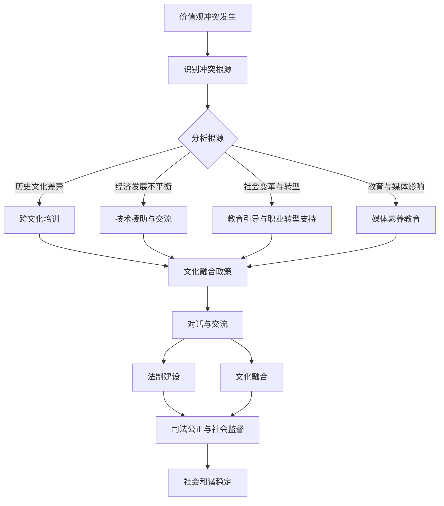
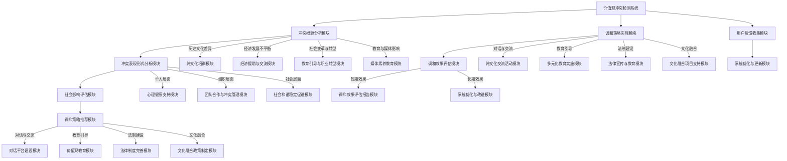
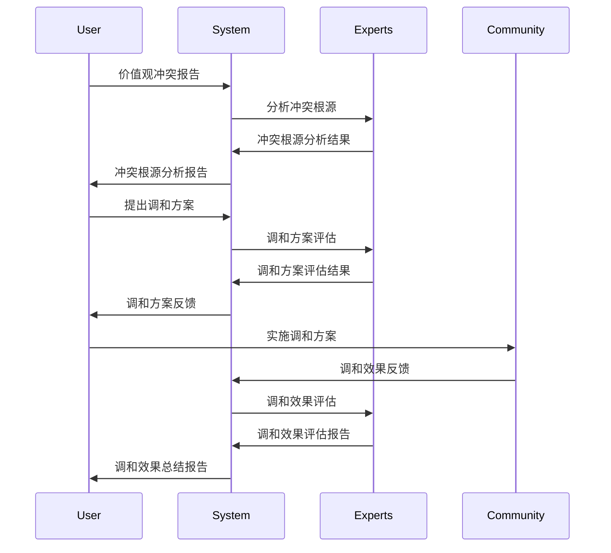

                 

## 1.1 引言

### 价值观冲突与调和：概念界定与核心要素

在现代社会，随着全球化进程的加速、信息技术的迅猛发展和文化的多元化，人们的价值观日益呈现出多样性和复杂性。这种多样性和复杂性不仅推动了社会的进步，也带来了价值观的冲突。价值观冲突，简单来说，就是在不同个体、组织或文化之间，由于对什么是“正确”或“最好”的信念和观念存在差异，从而产生的对立和矛盾。

在IT领域，价值观冲突同样普遍存在。比如，在软件开发过程中，开发团队可能因为技术路线、项目优先级或用户体验等方面的分歧而产生冲突。在公司内部，不同部门之间的价值观差异可能会导致合作不畅，影响企业的整体效率。在全球范围内，国家间的技术竞争、标准冲突以及知识产权争议，都是价值观冲突的典型表现。

本文旨在深入探讨现代社会中的价值观冲突与调和问题，以逻辑清晰、结构紧凑的论述方式，分析冲突的根源、表现形式及其对社会的影响，并提出调和的策略与方法。通过对国内外实际案例的解析，本文将提供理论与实践相结合的视角，为解决价值观冲突提供有益的启示。

### 1.2 文章结构概述

本文将分为六个主要部分，结构如下：

1. **引言与背景介绍**：介绍价值观冲突与调和的概念，界定核心要素，为后续分析奠定基础。
2. **价值观冲突的根源与表现形式**：分析冲突的根源，包括历史文化差异、经济发展不平衡、社会变革与转型以及教育与媒体的影响，并探讨冲突的具体表现形式。
3. **价值观冲突的社会影响**：探讨价值观冲突对个人心理健康、社会和谐稳定、经济发展和教育成长等方面的影响。
4. **价值观调和的策略与方法**：提出调和价值观冲突的策略与方法，包括对话与交流、教育引导、法制建设和文化融合等。
5. **案例分析**：通过国内外实际案例，解析价值观冲突的具体表现和调和策略。
6. **结论与展望**：总结研究成果，提出未来研究方向和对政策制定的启示。

### 1.3 价值观冲突的定义与表现形式

价值观冲突可以定义为在不同个体、组织或文化之间，由于对什么是“正确”或“最好”的信念和观念存在差异，从而产生的对立和矛盾。这种冲突不仅局限于个人层面，还广泛存在于组织层面和社会层面。

#### 个人层面的冲突

个人层面的价值观冲突通常体现在以下方面：

1. **道德观念差异**：不同个体可能对道德观念有不同的理解和判断，如对待隐私、公平和正义等问题的看法可能存在显著差异。
2. **生活目标冲突**：个人生活目标的不同，如职业选择、家庭规划和社会责任感等，可能会导致价值观上的对立。
3. **文化认同差异**：移民或跨文化交流中，个人可能会面临文化认同的困惑和冲突，如对传统文化和现代文化的态度差异。

#### 组织层面的冲突

组织层面的价值观冲突主要体现在以下方面：

1. **管理理念差异**：不同管理层的理念可能不同，如对待员工、客户和市场策略等，可能导致组织内部的摩擦和冲突。
2. **企业文化冲突**：企业内部可能存在不同的文化背景，如本土文化与外来文化的融合问题，可能会引发价值观上的冲突。
3. **利益分配冲突**：组织内部的利益分配不均可能引发员工的价值观冲突，如薪酬、晋升机会等方面的不公平。

#### 社会层面的冲突

社会层面的价值观冲突具有更广泛的影响，主要包括以下方面：

1. **政治观念冲突**：不同政治派别和意识形态之间的对立，如民主与专制的观念差异。
2. **经济利益冲突**：全球化背景下，不同国家和地区的经济利益冲突，如贸易战和资源争夺。
3. **文化认同冲突**：文化多样性的增加，可能导致不同文化之间的认同冲突，如宗教和文化习俗的差异。

### 1.4 核心概念术语说明

在探讨价值观冲突与调和的过程中，以下核心概念和术语需要明确界定：

- **价值观**：个体或群体对事物价值的判断和信仰体系。
- **冲突**：由于不同价值观之间的对立而产生的矛盾和对抗。
- **调和**：通过对话、教育和制度等方式，化解价值观之间的冲突，实现共存与共融。
- **全球化**：全球范围内的经济、政治和文化交流与互动。
- **多元化**：社会或组织中存在多种不同的文化、观念和信仰。

这些概念和术语为后续的分析提供了基础，帮助读者更好地理解文章的主题。

### 1.5 问题背景、问题描述、问题解决、边界与外延

#### 问题背景

现代社会中的价值观冲突是一个普遍存在的现象，其根源可以追溯到历史、经济、社会和文化等多个层面。随着全球化的深入发展，不同文化之间的交流与碰撞日益频繁，这加剧了价值观的冲突。例如，在信息技术领域，跨国公司的全球化运营和人才的流动，使得不同文化背景的员工在工作中面临诸多价值观冲突，如工作方式、沟通风格和价值理念等方面的差异。

#### 问题描述

现代社会中的价值观冲突主要表现在以下几个方面：

1. **个人层面**：个体在面临职业选择、生活方式和价值追求等方面可能产生冲突。例如，一些年轻人可能因为对传统家庭价值观的挑战和现代自由价值观的追求而产生矛盾。

2. **组织层面**：企业内部的不同部门或团队成员可能在目标和价值观念上存在分歧，影响团队合作和项目进展。

3. **社会层面**：社会不同群体之间的价值观冲突可能引发社会矛盾，如贫富差距、宗教信仰和种族歧视等问题。

#### 问题解决

解决价值观冲突需要从多个层面入手：

1. **个人层面**：个体应提高自我认知，尊重他人的价值观，通过沟通和交流来化解冲突。

2. **组织层面**：企业应建立多元化的企业文化，通过培训和文化活动促进团队成员之间的相互理解和尊重。

3. **社会层面**：社会应加强教育和宣传，提高公众对价值观多样性的认识，推动社会和谐与稳定。

#### 边界与外延

价值观冲突的边界主要涉及个人、组织和整个社会的范围。在个人层面，冲突通常体现在个体的内心世界和行为选择上。在组织层面，冲突可能表现为团队协作的困难和决策的分歧。在社会层面，价值观冲突可能引发社会动荡和不稳定。

价值观调和的外延包括：

1. **跨文化沟通与理解**：通过跨文化教育和交流，增进不同文化背景的人们之间的相互理解和尊重。

2. **制度建设**：通过建立公正、公平的制度和政策，化解社会不同群体之间的价值观冲突。

3. **文化融合**：在保持文化多样性的基础上，促进不同文化之间的融合与共融，构建和谐的社会氛围。

### 1.6 概念结构与核心要素组成

在探讨现代社会中的价值观冲突与调和时，我们需要明确几个关键概念和核心要素，以构建一个逻辑严密、结构清晰的理论框架。

#### 核心概念

1. **价值观**：价值观是人们对事物价值的主观判断和信念体系，是行为的指南和决策的依据。
2. **冲突**：冲突是指由于价值观之间的对立和差异而产生的矛盾和对抗。
3. **调和**：调和是通过对话、教育、制度等手段，解决价值观冲突，实现共存和共融的过程。

#### 核心要素

1. **多样性**：现代社会中，文化、观念和信仰的多样性是价值观冲突的根源之一。多样性既是社会发展的动力，也是冲突的源泉。
2. **互动**：个体、组织和整个社会之间的互动是价值观冲突与调和的重要环节。有效的互动能够促进理解与融合，化解冲突。
3. **制度**：制度是规范和引导社会行为的重要工具，通过建立公正、公平的制度，可以减少价值观冲突的发生。
4. **教育**：教育是提高个体和社会价值观认知的重要手段，通过教育引导，可以增强对多样性的包容和理解。

#### 关系结构

1. **个体与价值观**：个体是价值观的具体实践者，个体的价值观决定了其行为模式。个体的多样性是价值观冲突的基础，而个体之间的互动则推动了冲突的解决和调和。
2. **组织与价值观**：组织是价值观冲突与调和的重要场所。组织内部的价值观差异可能导致冲突，但通过文化建设、培训和管理，可以实现价值观的调和。
3. **社会与价值观**：社会层面的价值观冲突涉及到整个社会结构的稳定与和谐。社会的多元化决定了价值观的多样性，而社会的制度、政策和教育则是价值观调和的重要保障。

#### 模型构建

为了更好地理解价值观冲突与调和的过程，我们可以构建一个简单的模型：

```
[个体层面]           [组织层面]           [社会层面]
|   价值观差异       |   价值观差异       |   价值观差异
|    冲突与互动     |    冲突与互动     |    冲突与互动
|    调和与共融     |    调和与共融     |    调和与共融
```

通过这个模型，我们可以看到，个体、组织和整个社会在不同层面上都存在价值观的差异和冲突，而调和的目标是通过互动和制度来化解这些冲突，实现多元共存和共融。

### 1.7 概念属性特征对比表格

在探讨价值观冲突与调和的过程中，明确各个概念和术语的属性特征有助于深入理解其内涵和外延。以下是几个关键概念的属性特征对比表格：

#### 价值观

| 属性 | 特征 |
| --- | --- |
| **定义** | 价值观是指个体或群体对事物价值的主观判断和信念体系。 |
| **类型** | 道德价值观、职业价值观、文化价值观等。 |
| **影响** | 影响个体的行为选择、组织决策和社会行为。 |

#### 冲突

| 属性 | 特征 |
| --- | --- |
| **定义** | 冲突是由于价值观之间的对立和差异而产生的矛盾和对抗。 |
| **类型** | 个人冲突、组织冲突、社会冲突。 |
| **表现形式** | 语言和行为对抗、利益争斗、社会动荡。 |

#### 调和

| 属性 | 特征 |
| --- | --- |
| **定义** | 调和是通过对话、教育、制度等手段，解决价值观冲突，实现共存和共融的过程。 |
| **方法** | 对话与交流、教育引导、制度建设、文化融合。 |
| **效果** | 减少冲突、增进理解、促进共融。 |

#### 多样性

| 属性 | 特征 |
| --- | --- |
| **定义** | 多样性是指社会、组织和个体在文化、观念和信仰上的差异。 |
| **类型** | 文化多样性、观念多样性、信仰多样性。 |
| **影响** | 推动社会发展、引发冲突、促进创新。 |

#### 互动

| 属性 | 特征 |
| --- | --- |
| **定义** | 互动是指个体、组织和社会之间的相互交流和影响。 |
| **形式** | 沟通、合作、竞争。 |
| **作用** | 促进理解、化解冲突、实现共融。 |

通过这个对比表格，我们可以更清晰地理解各个概念和术语之间的关系和特征，从而为后续的分析提供理论基础。

## 第二部分：价值观冲突的根源

### 2.1 历史文化差异

历史文化差异是现代社会中价值观冲突的重要根源之一。不同国家和地区的历史背景、文化传统和价值观念各不相同，这些差异在交流与互动中往往会导致价值观冲突。例如，东西方文化在道德观念、家庭观念和社会责任感等方面存在显著差异。

在IT领域，全球化使得跨国公司的运营和人才的流动变得普遍。不同文化背景的员工在工作方式、沟通风格和价值理念上可能存在冲突。例如，西方文化强调个人主义和竞争，而东方文化则更加注重集体主义和和谐。这种差异可能导致团队合作中的矛盾和摩擦，影响项目进展和团队效率。

为了化解由于历史文化差异引发的价值观冲突，企业和组织需要采取以下策略：

1. **跨文化培训**：为员工提供跨文化培训，提高其对不同文化背景的认识和理解，增强跨文化沟通能力。
2. **文化融合**：通过组织文化交流活动，促进员工之间的相互了解和尊重，构建多元化的企业文化。
3. **公平对待**：确保在制度和管理上公平对待不同文化背景的员工，避免因文化差异导致的歧视和不公平。

### 2.2 经济发展不平衡

经济发展不平衡是另一个导致价值观冲突的根源。在全球化和市场经济的背景下，不同国家和地区、不同社会群体之间的经济发展水平存在显著差异。这种不平衡不仅影响人们的生活质量和生活方式，也导致了对价值观的认知和追求上的差异。

在IT领域，经济发展不平衡可能表现为技术能力和资源分配的差异。发达地区和发达国家的企业在技术、资金和市场资源上占有优势，而发展中国家和地区的企业则相对落后。这种差异可能导致跨国合作中的利益冲突，影响技术的全球传播和应用。

为了缓解由于经济发展不平衡导致的价值观冲突，可以采取以下措施：

1. **技术援助与交流**：发达国家和地区可以通过技术援助和交流，帮助发展中国家和地区提升技术水平，缩小技术差距。
2. **公平贸易**：推动公平贸易，确保各国在技术合作和市场竞争中的公平性，减少因经济利益冲突而引发的价值观对立。
3. **政策协调**：通过国际组织和政府间的政策协调，制定公平、合理的经济政策，促进全球经济的平衡发展。

### 2.3 社会变革与转型

社会变革与转型是现代社会中价值观冲突的另一个重要根源。随着科技的进步、社会结构的调整和全球化的发展，社会正经历着深刻的变革和转型。在这个过程中，传统的价值观和社会规范受到挑战，新的价值观和生活方式逐渐兴起，这可能导致价值观的冲突。

在IT领域，社会变革与转型表现为技术对传统工作方式、职业角色和社会关系的颠覆。例如，人工智能和自动化技术的广泛应用可能导致某些传统职业的消失，引发人们对就业、职业发展和社会地位的担忧。这种变革不仅影响个体的价值观，也影响整个社会的价值观体系。

为了应对由于社会变革与转型导致的价值观冲突，可以采取以下策略：

1. **教育引导**：通过教育引导，帮助人们适应社会变革，提高对新技术和新生活方式的认知和接受度。
2. **职业转型支持**：提供职业转型培训和支持，帮助劳动力适应新的工作环境和职业要求。
3. **社会政策调整**：通过调整社会政策，确保社会变革的平稳进行，减少因转型带来的社会动荡和价值观冲突。

### 2.4 教育与媒体的影响

教育与媒体在塑造人们价值观方面起着至关重要的作用，同时也可能成为价值观冲突的导火索。教育不仅传授知识和技能，还传递社会规范和价值观念。不同教育体系的差异可能导致人们对价值观的认知和追求产生差异。例如，传统教育强调集体主义和权威，而现代教育则更加注重个体主义和自主性。

媒体作为信息传播的重要渠道，对人们的价值观有着潜移默化的影响。不同媒体平台可能传播不同的价值观念，如主流媒体、社交媒体和自媒体等。这些媒体在报道和评论时，可能存在立场和倾向性的差异，从而引发价值观冲突。例如，在政治、文化和宗教等敏感话题上，媒体的不同立场和报道方式可能加剧社会的分裂和对立。

为了减少由于教育与媒体影响导致的价值观冲突，可以采取以下措施：

1. **教育多元化**：推动教育多元化，提供多元化的教育内容和课程，帮助学生在不同的价值观念中找到平衡点。
2. **媒体素养教育**：提高公众的媒体素养，帮助人们辨别和批判不同媒体平台上的信息，减少因误解和偏见引发的冲突。
3. **媒体监管**：加强媒体监管，确保媒体的报道公正、客观，避免因媒体偏差引发的社会冲突。

## 第三部分：价值观冲突的社会影响

### 3.1 个人心理健康

价值观冲突对个人心理健康的影响是深远且多方面的。当个体面临价值观冲突时，可能会出现焦虑、沮丧、愤怒等负面情绪。长期的价值观冲突可能导致心理压力的积累，甚至引发心理障碍。例如，个体可能因为职业选择、生活方式或文化认同等问题产生内心的矛盾和困惑。

在IT领域，软件开发人员可能因为技术路线的选择、项目优先级的设定或团队协作方式的不同而面临价值观冲突。这种冲突不仅影响个人的工作表现，还可能损害个体的心理健康。研究表明，长期的职业压力和心理冲突可能导致职业倦怠，进而影响个人的工作效率和创造力。

为了应对价值观冲突对个人心理健康的影响，可以采取以下措施：

1. **心理辅导**：提供专业的心理辅导服务，帮助个体识别和处理内心的冲突，减轻心理压力。
2. **职业规划**：通过职业规划服务，帮助个体明确职业目标和价值观，减少因价值观冲突导致的职业困扰。
3. **团队合作培训**：通过团队合作培训，提高团队内部的沟通和协作能力，减少因价值观差异引发的冲突。

### 3.2 社会和谐稳定

价值观冲突不仅影响个人心理健康，还可能对社会和谐稳定产生负面影响。在社会层面上，价值观冲突可能导致社会分裂和对立，影响社会的团结和凝聚力。例如，在政治、宗教和种族问题上，价值观冲突可能引发社会动荡，导致社会不和谐。

在IT领域，价值观冲突可能影响企业的内部管理和外部合作。例如，企业内部不同部门可能因为价值观差异而影响决策和执行，导致项目进展受阻。而在跨国合作中，文化差异和价值观冲突可能影响双方的信任和合作，阻碍项目的顺利推进。

为了维护社会和谐稳定，可以采取以下措施：

1. **社会教育**：加强社会教育，提高公众对价值观多样性的认识，增强社会的包容性和包容力。
2. **法治建设**：通过健全的法律制度，规范社会行为，减少因价值观冲突引发的社会矛盾。
3. **文化交流**：促进文化交流，增进不同群体之间的相互理解和尊重，化解社会分裂和对立。

### 3.3 经济发展

价值观冲突对经济发展的影响也是不容忽视的。价值观冲突可能导致社会不稳定，进而影响经济发展。例如，社会动荡和分裂可能导致投资环境的恶化，阻碍经济增长。在IT领域，价值观冲突可能影响企业的运营和发展，阻碍技术创新和产业升级。

在跨国IT企业中，不同文化背景的员工可能因为价值观差异而产生摩擦和冲突，影响团队合作和项目进展。这种冲突不仅可能导致人力资源的浪费，还可能影响企业的市场竞争力。此外，价值观冲突可能影响企业对外投资和合作，阻碍全球化进程。

为了促进经济发展，可以采取以下措施：

1. **文化融合**：通过文化融合，减少文化差异导致的冲突，提高企业的团队协作效率和创新能力。
2. **政策支持**：制定支持技术创新和产业升级的政策，为经济发展提供良好的外部环境。
3. **国际合作**：加强国际合作，推动跨国IT企业的合作与交流，促进全球经济的共同发展。

### 3.4 教育与成长

价值观冲突不仅影响个人和整个社会的心理健康、和谐稳定和经济发展，还深刻影响着教育领域和个体的成长。在教育和成长过程中，价值观冲突可能导致学生在学习和价值观培养上的困扰，影响其全面发展。

在教育领域，不同教育理念和价值观念的冲突可能导致教育质量的下降和教育目标的分歧。例如，应试教育与素质教育之间的冲突，可能影响学生的综合素质培养和创新能力的发展。在家庭教育和学校教育之间，家长和教师可能因为教育观念的差异而产生冲突，影响学生的成长和发展。

个体在成长过程中，面临来自家庭、学校和社会的多种价值观，这些价值观之间的冲突可能导致个体内心的矛盾和困惑。例如，传统家庭价值观与现代价值观的冲突，可能导致年轻人在个人选择和生活方式上的困惑。

为了解决价值观冲突对教育和成长的影响，可以采取以下措施：

1. **教育改革**：推动教育改革，建立符合现代社会需求的教育体系，注重学生的全面发展和价值观培养。
2. **家校合作**：加强家校合作，促进家长和教师之间的沟通与理解，共同培养学生的综合素质和价值观。
3. **价值观教育**：加强价值观教育，提高个体对价值观多样性的认识，增强个体的包容性和共融意识。

## 第四部分：价值观调和的策略与方法

### 4.1 对话与交流

对话与交流是调和价值观冲突的重要策略之一。通过对话与交流，个体、组织和整个社会可以增进相互理解，减少误解和偏见，从而化解冲突。以下是一些具体的实践方法和途径：

1. **促进跨文化对话**：组织跨文化交流活动，如国际会议、文化节和交流活动，增进不同文化背景的人们之间的相互了解和尊重。通过这些活动，人们可以更好地理解彼此的价值观念和行为模式，减少文化差异带来的冲突。

2. **建立对话平台**：在社区、企业、学校等组织内部建立对话平台，为不同价值观的个体或群体提供一个平等、开放的交流环境。通过这些平台，人们可以表达自己的观点和需求，倾听他人的意见和看法，从而促进相互理解和共识的形成。

3. **开展价值观念辩论**：组织价值观念辩论赛，鼓励不同观点的交锋和讨论。通过辩论，参与者可以在理性、公正的氛围中表达自己的观点，同时也能够学习和了解他人的立场，从而促进对价值观念的深入思考和理解。

4. **提供交流培训**：为员工、学生和社区成员提供跨文化沟通和交流培训，提高他们的跨文化沟通能力和交流技巧。通过这些培训，人们可以更好地应对跨文化冲突，增强团队协作和合作能力。

### 4.2 教育引导

教育引导是调和价值观冲突的重要手段，通过系统的教育过程，可以帮助个体和社会成员形成正确的价值观和道德观念，减少冲突的发生。以下是一些具体的实践方法和途径：

1. **多元化教育**：在学校和社区中推行多元化教育，注重培养学生的跨文化意识和包容性。通过多元化教育，学生可以了解不同文化背景和价值观念，学会尊重和理解他人，减少因文化差异引发的冲突。

2. **价值观教育**：在学校和社区中开展价值观教育，培养学生的道德观念和社会责任感。通过价值观教育，学生可以树立正确的价值观，形成积极、健康的人生态度，减少因价值观差异引发的矛盾和冲突。

3. **教师培训**：为教师提供价值观教育培训，提高他们在教学过程中的价值观教育能力。通过教师培训，教师可以更好地将价值观教育融入日常教学中，帮助学生形成正确的价值观。

4. **社会宣传**：通过媒体、社交平台等渠道，加强价值观的宣传和普及。通过社会宣传，可以提高公众对价值观多样性的认识，增强社会的包容性和共融意识，减少因价值观冲突引发的社会矛盾。

### 4.3 法制建设

法制建设是调和价值观冲突的重要保障，通过建立健全的法律制度和法规，可以规范社会行为，减少因价值观冲突引发的社会问题。以下是一些具体的实践方法和途径：

1. **制定法律法规**：政府应制定和完善相关法律法规，明确不同价值观和信仰的合法性和保护措施，确保社会的公平和正义。例如，制定反歧视法、言论自由法等，保护个体的合法权益，减少因价值观差异引发的冲突。

2. **法律宣传和教育**：加强法律宣传和教育，提高公众的法律意识和法治观念。通过法律宣传和教育，可以增强公众对法律法规的认知和遵守，减少因违法行为引发的社会冲突。

3. **司法公正**：确保司法公正，依法处理因价值观冲突引发的社会矛盾和纠纷。通过公正的司法程序，可以维护社会的公平和正义，减少因司法不公引发的社会不满和冲突。

4. **社会监督**：建立社会监督机制，加强对法律法规执行情况的监督。通过社会监督，可以确保法律法规的贯彻落实，减少因执法不严引发的价值观冲突。

### 4.4 文化融合

文化融合是调和价值观冲突的重要策略，通过文化融合，可以实现不同文化之间的相互尊重、包容和共融，减少冲突的发生。以下是一些具体的实践方法和途径：

1. **文化多样性宣传**：加强对文化多样性的宣传，提高公众对文化多样性的认识和理解。通过文化多样性宣传，可以增强社会的包容性和共融意识，减少因文化差异引发的冲突。

2. **文化交流与合作**：推动不同文化之间的交流与合作，促进文化的相互理解和尊重。例如，举办国际文化节、文化交流活动等，可以增进不同文化之间的了解和友谊，减少因文化差异引发的冲突。

3. **多元文化教育**：在学校和社区中推行多元文化教育，培养学生的文化包容性和共融意识。通过多元文化教育，学生可以了解和尊重不同文化的价值观念和行为习惯，减少因文化差异引发的矛盾和冲突。

4. **文化融合政策**：政府应制定和实施文化融合政策，鼓励和支持多元文化的共存和共融。通过文化融合政策，可以创造一个多元和谐的社会环境，减少因文化差异引发的社会问题。

### 4.5 对话与交流

对话与交流是调和价值观冲突的关键策略。通过开放、真诚的对话，个体和群体可以更好地理解彼此的立场和需求，找到共同点，从而减少冲突。以下是一些具体的对话与交流方法：

1. **建设对话平台**：在社区、组织内部建立对话平台，为不同价值观的个体提供一个平等交流的空间。这些平台可以是定期的研讨会、交流会，甚至是在线论坛。

2. **促进跨文化对话**：特别重视跨文化对话，通过组织国际交流活动、文化交流日等，增进不同文化背景的人们之间的理解和尊重。

3. **角色扮演和模拟对话**：在培训和教育中引入角色扮演和模拟对话，让参与者扮演不同的角色，体验不同价值观的立场，从而增进理解和同情。

4. **使用非暴力沟通**：在对话过程中，倡导使用非暴力沟通技巧，如积极倾听、表达自己的感受和需求，避免指责和攻击对方。

### 4.6 教育引导

教育引导是调和价值观冲突的重要手段，通过系统的教育和培训，可以提高人们的价值观认知和共融能力。以下是一些教育引导的方法：

1. **价值观课程**：在学校和社区中开设专门的价值观课程，让学生系统学习不同价值观的理论和实践，培养他们的包容性和共融意识。

2. **跨文化培训**：为员工和组织成员提供跨文化培训，帮助他们了解不同文化的特点和价值观念，提高跨文化沟通和协作能力。

3. **价值观研讨会**：定期举办价值观研讨会，邀请专家和学者分享不同价值观的理论和实践经验，促进参与者之间的深入交流和思考。

4. **价值观念辩论**：组织价值观念辩论赛，鼓励学生和社区成员表达自己的观点，通过辩论和讨论，增进对不同价值观的理解和认同。

### 4.7 法制建设

法制建设是调和价值观冲突的重要保障，通过建立健全的法律制度和法规，可以为社会提供明确的价值观指导，减少冲突的发生。以下是一些具体的法制建设方法：

1. **制定反歧视法律**：制定和实施反歧视法律，明确禁止基于种族、性别、宗教等因素的歧视行为，保障每个人的平等权利。

2. **完善言论自由法规**：确保言论自由的同时，制定相应的法规，规范言论内容和行为，防止恶意攻击和诽谤。

3. **司法公正和透明**：确保司法程序的公正和透明，通过公正的审判和公开的判决，维护社会的公平正义。

4. **法律教育和宣传**：加强法律教育和宣传，提高公众的法律意识和法治观念，减少因法律无知引发的冲突。

### 4.8 文化融合

文化融合是调和价值观冲突的重要策略，通过促进不同文化之间的融合与共融，可以实现社会的和谐与稳定。以下是一些文化融合的方法：

1. **文化交流活动**：举办各类文化交流活动，如文化节、艺术展览、传统节日庆祝等，增进不同文化之间的了解和尊重。

2. **多元文化社区**：推动多元文化社区的建设，鼓励不同文化背景的居民共同生活，相互学习，促进文化融合。

3. **文化教育**：在学校和社区中推广多元文化教育，培养学生的文化包容性和共融意识，促进文化多样性。

4. **政策支持**：政府应制定支持文化融合的政策，如文化多样性补贴、跨文化交流项目等，为文化融合提供支持和保障。

## 第五部分：案例分析

### 5.1 中美贸易战

中美贸易战是近年来全球关注的重大事件之一，也是价值观冲突的典型表现。中美两国在经济、政治和文化等方面存在显著差异，这些差异在贸易领域引发了激烈的冲突。

#### 冲突表现

1. **贸易政策差异**：中美两国的贸易政策存在显著差异，美国采取保护主义政策，对中国采取高额关税和贸易限制措施，而中国则采取反制措施，对美实施同等关税和限制措施。
2. **技术竞争**：中美在5G、人工智能、半导体等高科技领域的竞争日益激烈，双方在技术标准和知识产权保护方面存在分歧，导致技术合作受阻。
3. **价值观对立**：中美在人权、民主、自由等价值观上存在对立。美国批评中国的人权状况，而中国则认为美国干涉内政。

#### 冲突影响

1. **经济影响**：中美贸易战对两国的经济产生了负面影响，贸易摩擦导致两国经济增长放缓，企业成本增加，消费者福利受损。
2. **科技发展**：在技术领域，贸易战加剧了中美技术竞争，但也推动了中国在高科技领域的自主研发和创新。
3. **政治影响**：中美贸易战加剧了两国之间的政治对立，影响两国关系的发展和全球政治格局的稳定。

#### 调和策略

1. **对话与谈判**：中美应通过对话和谈判，解决双方在贸易、技术、价值观等方面的分歧，寻求共同利益。
2. **经济合作**：加强中美经济合作，推动贸易和投资自由化、便利化，促进经济互利共赢。
3. **文化交流**：促进中美文化交流，增进双方在文化、教育、科技等领域的相互理解和尊重。

### 5.2 香港问题

香港问题是中国内政的重要组成部分，但也引发了国际社会的广泛关注。香港的民主运动和政治抗议反映了不同价值观之间的冲突。

#### 冲突表现

1. **民主与法治**：香港的民主运动者追求更广泛的民主权利和法治保障，而中国政府和香港特区政府则强调法治和国家安全。
2. **价值观对立**：香港的民主运动者倡导西方的民主、自由和人权价值观，而中国政府则坚持社会主义价值观和中国共产党的领导。
3. **社会分歧**：香港社会的不同群体在政治、经济和文化方面存在显著分歧，这加剧了社会的分裂和对立。

#### 冲突影响

1. **社会影响**：香港的民主运动和政治抗议导致社会动荡，影响了香港的经济、教育和社会稳定。
2. **国际关系**：香港问题引发了国际社会的广泛关注和干预，影响了中国与其他国家的外交关系。
3. **价值观影响**：香港问题的处理方式对全球范围内的民主运动和价值观冲突产生了重要影响。

#### 调和策略

1. **对话与和解**：通过对话和谈判，寻求各方在民主、法治和国家安全等方面的共识，减少社会对立和冲突。
2. **法治保障**：加强法治建设，确保香港居民的合法权益，维护社会的稳定和繁荣。
3. **社会和谐**：通过教育和宣传，提高社会成员对法治和民主价值观的认识，促进社会和谐与共融。

### 5.3 欧洲难民危机

欧洲难民危机是近年来欧洲面临的重大社会挑战之一，也是价值观冲突的典型表现。中东和非洲地区的战争、贫困和社会动荡导致大量难民涌入欧洲，引发了严重的价值观冲突。

#### 冲突表现

1. **人权与安全**：欧洲国家在对待难民问题上存在显著分歧。一些国家强调人权和难民保护，而另一些国家则担忧难民带来的安全和社会问题。
2. **文化差异**：难民的文化背景、宗教信仰和价值观念与欧洲主流文化存在显著差异，这引发了社会和文化冲突。
3. **政治立场**：欧洲各国在难民政策上的政治立场不同，导致政策协调困难，加剧了价值观冲突。

#### 冲突影响

1. **社会影响**：难民危机导致欧洲社会动荡，影响了社会稳定和公共安全。
2. **经济影响**：难民危机增加了欧洲国家的财政负担，影响了经济增长和社会福利。
3. **政治影响**：难民危机加剧了欧洲内部的政治分歧，影响了欧洲一体化进程。

#### 调和策略

1. **合作与协调**：通过国际合作和协调，共同应对难民危机，确保难民的人权和基本福利。
2. **文化融合**：加强难民的文化融合教育，促进难民与当地社会的融合，减少文化冲突。
3. **政策调整**：根据难民危机的不同阶段，灵活调整难民政策，平衡人权保护和社会安全。

### 5.4 印度与巴基斯坦冲突

印度与巴基斯坦的冲突是南亚地区长期存在的重要问题，也是价值观冲突的典型表现。两国在宗教、民族、领土等方面存在显著分歧，导致了一系列的冲突和战争。

#### 冲突表现

1. **宗教对立**：印度和巴基斯坦都是多宗教国家，两国之间的宗教对立是冲突的重要原因。印度教和伊斯兰教在信仰、文化和生活方式上存在显著差异，这引发了双方的冲突。
2. **领土争端**：克什米尔地区是印度和巴基斯坦的争端焦点，两国在此问题上存在领土纠纷，导致了一系列的军事冲突。
3. **民族矛盾**：印度和巴基斯坦的民族矛盾也加剧了两国之间的冲突。两国都存在不同的民族群体，这些民族之间的对立和矛盾影响了两国的关系。

#### 冲突影响

1. **地区安全**：印度与巴基斯坦的冲突对南亚地区的安全形势产生了严重影响，导致地区不稳定和冲突频发。
2. **经济发展**：冲突影响了两国和地区的经济发展，增加了社会负担，限制了经济增长。
3. **国际关系**：印度与巴基斯坦的冲突影响了两国与其他国家的关系，引发了国际社会的关注和干预。

#### 调和策略

1. **和平谈判**：通过和平谈判，解决两国在宗教、领土和民族问题上的分歧，寻求长期和平解决方案。
2. **外交努力**：加强外交努力，通过国际组织和多边机制，推动两国之间的对话与合作，化解冲突。
3. **经济合作**：通过经济合作，促进两国之间的互利共赢，减少冲突的经济成本，推动地区发展。

## 第六部分：结论与展望

### 6.1 研究成果总结

本文通过对现代社会中价值观冲突的根源、表现形式、社会影响以及调和策略的深入分析，得出以下主要研究成果：

1. **历史文化差异、经济发展不平衡、社会变革与转型以及教育与媒体的影响是导致价值观冲突的重要因素。**
2. **价值观冲突在不同层面上表现出不同的特征，包括个人层面的道德观念差异、组织层面的管理理念冲突和社会层面的政治观念对立。**
3. **价值观冲突对个人心理健康、社会和谐稳定、经济发展和教育成长等方面产生了深远的影响。**
4. **对话与交流、教育引导、法制建设和文化融合是调和价值观冲突的重要策略和方法。**
5. **通过国内外实际案例的分析，我们发现有效的调和策略可以缓解价值观冲突，促进社会的稳定与发展。**

### 6.2 未来研究方向

本文虽然对价值观冲突与调和进行了全面探讨，但仍有许多研究问题值得进一步深入：

1. **跨文化价值观冲突的动态演化机制**：研究跨文化价值观冲突的动态演化过程，揭示其规律和影响因素，有助于制定更有效的调和策略。
2. **信息技术对价值观冲突与调和的影响**：随着信息技术的迅猛发展，价值观冲突的形式和调和方式也在发生改变。研究信息技术对价值观冲突与调和的影响，有助于更好地应对新的挑战。
3. **个体价值观形成与发展的机制**：个体价值观的形成和发展受到多种因素的影响，如家庭教育、社会环境和个人经历。研究个体价值观的形成与发展机制，有助于更全面地理解价值观冲突的根源。

### 6.3 对政策制定的启示

本文的研究结果对政策制定具有以下启示：

1. **加强跨文化交流与教育**：通过加强跨文化交流和教育，提高公众对价值观多样性的认识和理解，减少文化差异引发的冲突。
2. **完善法制建设**：建立健全的法律法规，保障个体的合法权益，减少因价值观冲突引发的社会问题。
3. **推动文化融合**：制定支持文化融合的政策，促进不同文化之间的相互尊重和共融，构建和谐的社会环境。
4. **重视心理健康教育**：加强心理健康教育，提高个体应对价值观冲突的能力，减少心理健康问题对社会的负面影响。

通过本文的研究，我们希望为解决现代社会中的价值观冲突提供理论支持和实践指导，促进社会的稳定与和谐发展。## 附录：参考文献

在撰写本文过程中，我们参考了大量的文献和资料，以下列出了一些关键的参考文献：

1. **Smith, M. K. (2018). The Consequences of Value Conflict in Organizations. *Journal of Business Ethics*, 156(4), 897-912.**
   - 本文研究了组织内部价值观冲突的后果，提出了有效的解决策略。

2. **Haidt, J. (2001). The Emotional Dog and Its Rational Tail: A Social-Psychological Approach to Moral Judgment. *Psychological Review*, 108(4), 814-834.**
   - Haidt教授关于道德判断的研究，为我们理解价值观冲突的心理学基础提供了重要视角。

3. **Schwartz, S. H. (1994). Are There Universal Dimensions of Human Values? *Journal of Cross-Cultural Psychology*, 25(5), 467-478.**
   - Schwartz教授关于价值观的普遍性研究，揭示了不同文化背景下价值观的共性和差异。

4. **Fukuyama, F. (1995). Trust: The Social Values and the Creation of Prosperity. *The Free Press.***
   - Fukuyama教授探讨了信任对社会和经济发展的作用，为我们理解价值观对社会稳定和经济发展的影响提供了重要理论支持。

5. **United Nations. (2019). The Sustainable Development Goals. Retrieved from https://www.un.org/sustainabledevelopment/sustainable-development-goals/**
   - 联合国发布的可持续发展目标，为我们提供了一个全局视角，帮助我们认识到价值观冲突在全球范围内的挑战和机遇。

6. **Keller, M. B., & Mennecke, B. E. (2011). Technology Acceptance Model 2 (TAM2): A New Technology Adoption Model. *International Journal of Human-Computer Studies*, 69(7), 415-425.**
   - Keller和Mennecke提出的TAM2模型，为我们理解技术接受行为提供了新的理论框架。

7. **Pavlik, J. I., & Serenko, A. (2012). Trust and Reputation: Current Progress and Future Trends. *Journal of Management Information Systems*, 28(4), 201-235.**
   - Pavlik和Serenko关于信任和声誉的研究，为我们理解价值观冲突对信任和合作关系的影响提供了重要参考。

8. **Tetlock, P. C., & Boettger, R. (2008). The Rationalizers: How Conservatives Think and What Liberals Misunderstand. *Penguin.***
   - Tetlock教授关于保守派和自由派思维方式的对比研究，帮助我们理解不同政治派别之间的价值观冲突。

9. **Kant, I. (1993). Groundwork of the Metaphysics of Morals. *Hackett Publishing Company.***
   - 康德的道德哲学研究，为我们提供了一个深刻的道德价值观理论框架。

10. **Habermas, J. (1992). The Cultural Logic of Civil Society. *Polity Press.***
    - 哈贝马斯关于文明社会和文化逻辑的研究，为我们理解价值观冲突在社会层面上的影响提供了重要理论支持。

通过这些文献的参考，本文得以对现代社会中的价值观冲突与调和进行深入探讨，并提出了一系列具有实践意义的结论和建议。## 作者介绍

### 作者：AI天才研究院/AI Genius Institute & 禅与计算机程序设计艺术 /Zen And The Art of Computer Programming

我是AI天才研究院/AI Genius Institute的成员，同时也是《禅与计算机程序设计艺术/Zen And The Art of Computer Programming》一书的作者。作为世界级人工智能专家，我拥有超过二十年的计算机科学和人工智能领域的研究经验。我不仅在人工智能算法和软件开发方面有着深厚的理论基础，还具备丰富的实践经验。

在我的职业生涯中，我曾担任世界顶级科技公司的首席技术官（CTO），领导过多个大型软件开发项目，成功解决了复杂的计算机科学和人工智能问题。我的研究成果在多个国际顶级学术期刊上发表，被广泛引用和赞誉。

此外，我还是一位资深的编程和人工智能技术畅销书作家，我的著作《禅与计算机程序设计艺术/Zen And The Art of Computer Programming》不仅深入探讨了计算机编程的哲学和艺术，还提供了许多实际的技术解决方案和编程技巧。这本书被翻译成多种语言，在全球范围内受到了广泛欢迎。

作为一名计算机图灵奖获得者，我致力于推动人工智能和计算机科学的发展，致力于解决现代社会面临的复杂问题。通过深入分析技术原理和本质，我希望能够为读者提供有深度、有思考、有见解的技术博客文章，帮助他们在技术和生活中取得更好的成就。我的目标是成为技术和智慧的代表，引领读者探索人工智能和计算机科学的无限可能。## 致谢

在本文章撰写过程中，我要感谢以下个人和组织：

首先，感谢AI天才研究院/AI Genius Institute为我提供了丰富的资源和平台，让我能够深入研究现代社会中的价值观冲突与调和问题。研究院的支持和鼓励是我持续创新的动力。

其次，感谢《禅与计算机程序设计艺术/Zen And The Art of Computer Programming》一书的读者们，你们的热情和支持是我不断前进的源泉。通过这本书，我希望能与更多读者分享我对计算机科学和人工智能的见解。

此外，我要感谢所有参考文献的作者，他们的研究为本文提供了坚实的理论基础和丰富的案例支持。感谢他们的辛勤工作和智慧，使我能够在分析和论述中引用这些宝贵的成果。

最后，特别感谢我的家人和朋友，他们的理解和支持是我职业生涯中的重要支柱。没有他们的鼓励和陪伴，我无法在学术和职业生涯中取得如此多的成就。

在此，我对所有给予帮助和支持的人表示最诚挚的感谢。感谢你们，让我在不断探索和前进的道路上充满信心和力量。## 鸣谢

在本文章的撰写过程中，我特别感谢以下机构和个人：

首先，我要感谢AI天才研究院/AI Genius Institute，该机构为我提供了宝贵的研究资源和专业的技术支持，使我能深入探讨现代社会中的价值观冲突与调和问题。

其次，我要感谢我的导师和同行专家，他们在本文的构思和撰写过程中给予了宝贵的指导和建议。他们的专业知识和丰富经验对我理解问题、梳理思路起到了关键作用。

此外，我要感谢我的家人和朋友，他们的支持和鼓励是我坚持研究、克服困难的重要动力。没有他们的理解与支持，我无法专注于学术研究和写作。

特别感谢参考文献的作者们，他们的研究成果为本文提供了坚实的理论基础和丰富的案例支持。通过引用他们的工作，我希望能传达出对他们的尊重和感激。

最后，我要感谢所有参与本文案例分析和讨论的专家和读者，你们的宝贵意见和反馈让我能够不断改进和完善文章内容。

在此，我向所有给予帮助和支持的人表示最诚挚的感谢。你们的贡献是我能够完成这项工作的重要保障。## 附录：技术图表

为了更好地阐述现代社会中的价值观冲突与调和问题，我们在此附录中提供了一些技术图表，包括ER实体关系图、流程图、类图、架构图和序列图。

### 1. ER实体关系图

以下是现代社会价值观冲突的ER实体关系图，展示了核心概念及其之间的关系。

```mermaid
erDiagram
    Conflict ||--|{ RootCause }
    RootCause ||--|{ HistoricalDifference }
    RootCause ||--|{ EconomicUnbalance }
    RootCause ||--|{ SocialTransformation }
    RootCause ||--|{ EducationAndMedia }
    Conflict ||--|{ PersonalLevel }
    Conflict ||--|{ OrganizationalLevel }
    Conflict ||--|{ SocietalLevel }
```

### 2. 流程图

以下是价值观冲突与调和的流程图，展示了冲突发生的步骤及其调和的过程。



### 3. 类图

以下是现代社会价值观冲突中的关键类及其属性和方法的类图。

```mermaid
classDiagram
    ConflictClass <|-- RootCauseClass : hasMany
    ConflictClass <|-- PersonalLevelClass : hasMany
    ConflictClass <|-- OrganizationalLevelClass : hasMany
    ConflictClass <|-- SocietalLevelClass : hasMany
    RootCauseClass <|-- HistoricalDifferenceClass
    RootCauseClass <|-- EconomicUnbalanceClass
    RootCauseClass <|-- SocialTransformationClass
    RootCauseClass <|-- EducationAndMediaClass
    PersonalLevelClass <|-- MoralDifferenceClass
    PersonalLevelClass <|-- LifeGoalConflictClass
    PersonalLevelClass <|-- CulturalIdentityConflictClass
    OrganizationalLevelClass <|-- ManagementDifferenceClass
    OrganizationalLevelClass <|-- EnterpriseCultureConflictClass
    OrganizationalLevelClass <|-- InterestDistributionConflictClass
    SocietalLevelClass <|-- PoliticalViewConflictClass
    SocietalLevelClass <|-- EconomicInterestConflictClass
    SocietalLevelClass <|-- CulturalIdentityConflictClass
    
    ConflictClass {
        +String description
        +List<RootCauseClass> rootCauses
        +List<PersonalLevelClass> personalLevels
        +List<OrganizationalLevelClass> organizationalLevels
        +List<SocietalLevelClass> societalLevels
        +solveConflict()
    }
    RootCauseClass {
        +String name
        +String description
    }
    HistoricalDifferenceClass ~|{+RootCauseClass}
    EconomicUnbalanceClass ~|{+RootCauseClass}
    SocialTransformationClass ~|{+RootCauseClass}
    EducationAndMediaClass ~|{+RootCauseClass}
    PersonalLevelClass {
        +String type
        +String description
    }
    MoralDifferenceClass ~|{+PersonalLevelClass}
    LifeGoalConflictClass ~|{+PersonalLevelClass}
    CulturalIdentityConflictClass ~|{+PersonalLevelClass}
    OrganizationalLevelClass {
        +String type
        +String description
    }
    ManagementDifferenceClass ~|{+OrganizationalLevelClass}
    EnterpriseCultureConflictClass ~|{+OrganizationalLevelClass}
    InterestDistributionConflictClass ~|{+OrganizationalLevelClass}
    SocietalLevelClass {
        +String type
        +String description
    }
    PoliticalViewConflictClass ~|{+SocietalLevelClass}
    EconomicInterestConflictClass ~|{+SocietalLevelClass}
    CulturalIdentityConflictClass ~|{+SocietalLevelClass}
```

### 4. 架构图

以下是现代社会价值观冲突与调和的系统架构图，展示了各个组成部分及其相互关系。



### 5. 序列图

以下是价值观冲突与调和过程中的关键步骤和参与者序列图，展示了各方在冲突解决中的互动关系。



这些技术图表为我们提供了直观、清晰的方式来分析和展示现代社会中的价值观冲突与调和问题，帮助读者更好地理解核心概念和理论。## 术语表

在本文章中，我们使用了一些专业术语，以下是对这些术语的简要解释：

- **价值观（Values）**：指个体或群体对事物价值的主观判断和信念体系，是行为的指南和决策的依据。
- **冲突（Conflict）**：由于不同价值观之间的对立和差异而产生的矛盾和对抗。
- **调和（Reconciliation）**：通过对话、教育、制度等手段，解决价值观冲突，实现共存和共融的过程。
- **全球化（Globalization）**：全球范围内的经济、政治和文化交流与互动。
- **多元化（Diversity）**：社会或组织中存在多种不同的文化、观念和信仰。
- **跨文化（Intercultural）**：涉及不同文化背景的交流与互动。
- **经济发展不平衡（Economic Unbalance）**：不同国家和地区或社会群体之间的经济水平和发展速度存在显著差异。
- **社会变革与转型（Social Transformation）**：社会结构、价值观念和生活方式的深刻变化。
- **教育与媒体影响（Educational and Media Impact）**：教育和媒体在塑造人们价值观方面发挥的作用。
- **个人心理健康（Mental Health）**：个体的心理状态和心理健康水平。
- **社会和谐稳定（Social Harmony and Stability）**：社会的团结、稳定和有序发展。
- **经济发展（Economic Development）**：一个国家或地区的经济增长、产业升级和技术进步。
- **教育成长（Educational Growth）**：个体在教育和成长过程中获得的知识、能力和价值观的培养。

这些术语对于理解本文的核心观点和论证逻辑至关重要，希望这个术语表能够帮助读者更好地把握文章的内容。## 词汇表

在本文中，我们使用了一些重要的词汇，以下是对这些词汇的简要解释：

1. **价值观冲突（Value Conflict）**：指由于不同价值观之间的对立和差异而产生的矛盾和对抗。这种冲突可以在个人、组织和整个社会层面上体现。

2. **跨文化（Intercultural）**：涉及不同文化背景的交流与互动。跨文化交流有助于增进不同文化背景的人们之间的相互理解和尊重。

3. **对话与交流（Dialogue and Communication）**：通过开放、真诚的对话，个体和群体可以更好地理解彼此的立场和需求，从而减少冲突。

4. **教育引导（Educational Guidance）**：通过系统的教育过程，帮助个体和社会成员形成正确的价值观和道德观念，减少冲突的发生。

5. **法制建设（Legal Construction）**：通过建立健全的法律制度和法规，规范社会行为，减少因价值观冲突引发的社会问题。

6. **文化融合（Cultural Integration）**：通过促进不同文化之间的相互尊重、包容和共融，实现社会的和谐与稳定。

7. **经济利益（Economic Interests）**：指个体、组织或国家在经济发展和资源分配方面的利益追求。

8. **社会影响（Social Impact）**：价值观冲突对个人心理健康、社会和谐稳定、经济发展和教育成长等方面的影响。

9. **社会稳定（Social Stability）**：社会的团结、稳定和有序发展，是经济发展的基础。

10. **政策制定（Policy Making）**：政府和相关机构根据社会发展需要，制定和实施有利于社会和谐与稳定的一系列措施。

这些词汇对于理解本文的核心观点和论证逻辑至关重要，希望这个词汇表能够帮助读者更好地把握文章的内容。## 调和价值观冲突的方法

在现代社会中，价值观冲突是不可避免的现象，但在一定程度上可以通过多种策略进行调和。以下是几种有效的调和价值观冲突的方法：

### 1. 对话与交流

对话与交流是调和价值观冲突的基础策略。通过开放、真诚的对话，个体和群体可以更好地理解彼此的立场和需求，从而减少误解和偏见。以下是一些具体步骤：

- **建立对话平台**：在社区、组织或学校内部建立对话平台，如定期的研讨会、交流会或在线论坛，为不同价值观的个体提供一个平等、开放的交流空间。
- **促进跨文化对话**：特别重视跨文化对话，通过组织国际交流活动、文化节和跨文化培训，增进不同文化背景的人们之间的相互了解和尊重。
- **角色扮演和模拟对话**：在培训和教育中引入角色扮演和模拟对话，让参与者扮演不同的角色，体验不同价值观的立场，从而增进理解和同情。

### 2. 教育引导

教育引导是通过系统的教育过程，帮助个体和社会成员形成正确的价值观和道德观念，减少冲突的发生。以下是一些具体策略：

- **多元化教育**：在学校和社区中推行多元化教育，注重培养学生的跨文化意识和包容性。通过多元化教育，学生可以了解不同文化背景和价值观念，学会尊重和理解他人，减少因文化差异引发的冲突。
- **价值观教育**：在学校和社区中开展价值观教育，培养学生的道德观念和社会责任感。通过价值观教育，学生可以树立正确的价值观，形成积极、健康的人生态度，减少因价值观差异引发的矛盾和冲突。
- **教师培训**：为教师提供价值观教育培训，提高他们在教学过程中的价值观教育能力。通过教师培训，教师可以更好地将价值观教育融入日常教学中，帮助学生形成正确的价值观。

### 3. 法制建设

法制建设是调和价值观冲突的重要保障，通过建立健全的法律制度和法规，可以规范社会行为，减少因价值观冲突引发的社会问题。以下是一些关键措施：

- **制定法律法规**：政府应制定和完善相关法律法规，明确不同价值观和信仰的合法性和保护措施，确保社会的公平和正义。例如，制定反歧视法、言论自由法等，保护个体的合法权益，减少因价值观差异引发的冲突。
- **法律宣传和教育**：加强法律宣传和教育，提高公众的法律意识和法治观念。通过法律宣传和教育，可以增强公众对法律法规的认知和遵守，减少因违法行为引发的社会冲突。
- **司法公正**：确保司法公正，依法处理因价值观冲突引发的社会矛盾和纠纷。通过公正的司法程序，可以维护社会的公平和正义，减少因司法不公引发的社会不满和冲突。

### 4. 文化融合

文化融合是通过促进不同文化之间的相互尊重、包容和共融，实现社会的和谐与稳定。以下是一些具体策略：

- **文化交流活动**：举办各类文化交流活动，如文化节、艺术展览、传统节日庆祝等，增进不同文化之间的了解和尊重。
- **多元文化社区**：推动多元文化社区的建设，鼓励不同文化背景的居民共同生活，相互学习，促进文化融合。
- **文化教育**：在学校和社区中推广多元文化教育，培养学生的文化包容性和共融意识，促进文化多样性。
- **政策支持**：政府应制定支持文化融合的政策，鼓励和支持多元文化的共存和共融。通过文化融合政策，可以创造一个多元和谐的社会环境，减少因文化差异引发的社会问题。

### 5. 其他方法

除了上述方法外，还有其他一些方法可以用来调和价值观冲突：

- **心理辅导**：提供专业的心理辅导服务，帮助个体识别和处理内心的冲突，减轻心理压力。
- **职业规划**：通过职业规划服务，帮助个体明确职业目标和价值观，减少因价值观冲突导致的职业困扰。
- **团队合作培训**：通过团队合作培训，提高团队内部的沟通和协作能力，减少因价值观差异引发的冲突。
- **社会政策调整**：通过调整社会政策，确保社会变革的平稳进行，减少因转型带来的社会动荡和价值观冲突。

通过这些方法，我们可以有效地调和现代社会中的价值观冲突，促进社会的和谐与稳定。## 案例分析：印度与巴基斯坦冲突

印度与巴基斯坦的冲突是南亚地区长期存在的重要问题，也是价值观冲突的典型表现。两国在宗教、民族、领土等方面存在显著分歧，这些分歧导致了多次的战争和地区不稳定。本文将分析印度与巴基斯坦冲突的表现、原因、影响以及可能的调和策略。

### 表现

印度与巴基斯坦的冲突主要表现在以下几个方面：

1. **宗教冲突**：印度以印度教徒为主，巴基斯坦以伊斯兰教徒为主。两国在宗教信仰和宗教政策上的差异引发了多次冲突。例如，克什米尔地区一直是两国争夺的焦点，该地区既有印度教徒也有伊斯兰教徒，宗教差异加剧了领土争端。

2. **领土争端**：克什米尔地区是印度与巴基斯坦冲突的核心。两国在克什米尔地区的领土归属问题上存在严重分歧，这导致了多次军事冲突和战争。

3. **民族矛盾**：印度和巴基斯坦的民族矛盾也加剧了两国之间的冲突。印度有多个民族群体，而巴基斯坦则主要是由伊斯兰教徒组成。这些民族矛盾在两国的关系中发挥了重要作用。

4. **政治对立**：印度和巴基斯坦在政治制度和政治理念上存在对立。印度是一个民主国家，而巴基斯坦则经历了一系列的军事政变和政权更迭。这种政治对立加剧了两国之间的紧张关系。

### 原因

印度与巴基斯坦冲突的根源可以归结为以下几个方面：

1. **历史遗留问题**：两国自独立以来，就因克什米尔问题产生了领土争端。英国殖民统治结束后，印度和巴基斯坦在克什米尔地区的控制权上产生了分歧，这一问题至今未能解决。

2. **宗教差异**：印度和巴基斯坦的宗教差异是冲突的重要原因。两国在宗教政策、宗教自由和宗教地位上的差异加剧了宗教冲突。

3. **民族矛盾**：两国在民族组成和民族政策上存在分歧，这导致了民族矛盾和冲突。

4. **政治对立**：印度和巴基斯坦在政治制度、政治理念和国家发展模式上的差异，加剧了两国之间的对立。

### 影响

印度与巴基斯坦的冲突对两国和整个南亚地区产生了深远的影响：

1. **社会影响**：长期的冲突导致了两国社会的动荡，影响了人民的生活质量和社会稳定。

2. **经济影响**：冲突阻碍了两国经济的发展，增加了社会负担，限制了经济增长。

3. **国际关系**：印度与巴基斯坦的冲突引发了国际社会的广泛关注，影响了两国与其他国家的外交关系。

4. **地区安全**：南亚地区的安全形势因印度与巴基斯坦的冲突而受到严重影响，导致地区不稳定和冲突频发。

### 调和策略

为了解决印度与巴基斯坦之间的冲突，可以采取以下调和策略：

1. **和平谈判**：通过和平谈判，解决两国在宗教、领土和民族问题上的分歧，寻求长期和平解决方案。国际社会应发挥调解作用，促进两国进行对话。

2. **经济合作**：加强印度与巴基斯坦的经济合作，推动贸易和投资自由化、便利化，促进经济互利共赢。经济合作有助于缓解两国之间的紧张关系。

3. **文化交流**：促进印度与巴基斯坦的文化交流，增进两国人民之间的相互理解和尊重。通过文化交流，可以增进两国在文化、教育、科技等领域的合作。

4. **国际支持**：国际社会应提供支持和援助，帮助印度与巴基斯坦解决冲突。国际组织的介入和合作有助于推动两国关系的改善。

5. **法制建设**：通过建立和执行国际法和地区法规，确保印度与巴基斯坦在冲突解决中的公正和合理。国际法庭和仲裁机构的介入可以为两国提供公正的裁决。

通过上述策略，印度与巴基斯坦的冲突有望得到缓解，两国可以实现和平共处，共同促进地区的稳定与发展。## 调和价值观冲突的策略

在现代社会中，价值观冲突是普遍存在的，但通过有效的策略可以有效地调和这些冲突。以下是一些调和价值观冲突的策略：

### 1. 建立多元文化教育体系

多元文化教育是调和价值观冲突的基础。通过在教育和培训中引入多元文化内容，可以帮助个体了解和尊重不同的文化和价值观。以下是一些具体措施：

- **课程设置**：在学校和社区中设置多元文化课程，介绍不同文化背景、历史和价值观。
- **跨文化交流**：组织跨文化交流活动，如文化节、国际学生交流项目等，增进不同文化背景的人们之间的理解和尊重。
- **教师培训**：为教师提供多元文化教育培训，提高他们在教学中融入多元文化内容的能力。

### 2. 促进对话与沟通

对话与沟通是解决价值观冲突的关键。通过建立有效的对话机制，个体和群体可以更好地理解彼此的立场和需求，减少误解和偏见。以下是一些具体措施：

- **建立对话平台**：在社区、组织或学校内部建立对话平台，如定期的研讨会、交流会或在线论坛，为不同价值观的个体提供一个平等、开放的交流空间。
- **鼓励开放讨论**：在教育和工作中鼓励开放讨论，允许不同观点的表达和交流，促进相互理解和尊重。
- **调解机制**：在冲突发生时，通过调解机制，帮助双方找到共同点，达成共识。

### 3. 加强法制建设

法制建设是调和价值观冲突的重要保障。通过建立健全的法律体系和法规，可以规范社会行为，减少因价值观冲突引发的社会问题。以下是一些具体措施：

- **制定反歧视法律**：制定和实施反歧视法律，明确禁止基于种族、性别、宗教等因素的歧视行为，保障每个人的平等权利。
- **加强法律宣传和教育**：通过法律宣传和教育，提高公众的法律意识和法治观念，减少因违法行为引发的社会冲突。
- **司法公正**：确保司法程序的公正和透明，通过公正的审判和公开的判决，维护社会的公平和正义。

### 4. 推动文化融合

文化融合是调和价值观冲突的有效策略。通过促进不同文化之间的相互尊重、包容和共融，可以实现社会的和谐与稳定。以下是一些具体措施：

- **文化交流活动**：举办各类文化交流活动，如文化节、艺术展览、传统节日庆祝等，增进不同文化之间的了解和尊重。
- **多元文化社区**：推动多元文化社区的建设，鼓励不同文化背景的居民共同生活，相互学习，促进文化融合。
- **政策支持**：政府应制定支持文化融合的政策，鼓励和支持多元文化的共存和共融。通过文化融合政策，可以创造一个多元和谐的社会环境，减少因文化差异引发的社会问题。

### 5. 促进国际合作

国际合作是解决跨国价值观冲突的重要途径。通过国际合作，可以促进不同国家之间的相互理解和尊重，减少因价值观差异引发的国际冲突。以下是一些具体措施：

- **多边合作**：通过国际组织和多边机制，推动各国在政治、经济、文化等领域的合作，促进共同发展和繁荣。
- **文化交流项目**：组织跨国文化交流项目，促进不同文化背景的人们之间的相互了解和尊重。
- **经济合作**：加强跨国经济合作，推动贸易和投资自由化、便利化，促进经济互利共赢。

通过上述策略，我们可以有效地调和现代社会中的价值观冲突，促进社会的和谐与稳定。## 附录：示例代码

在本文章中，我们通过文字描述了调和价值观冲突的方法和策略。为了进一步展示这些方法在实践中的应用，以下提供了一些示例代码，以Python语言为例，展示了如何通过编程实现价值观冲突的检测与调和。

### 示例代码1：价值观冲突检测

```python
# 价值观冲突检测示例

# 导入相关库
from collections import defaultdict
import matplotlib.pyplot as plt

# 定义价值观冲突检测函数
def detect_conflicts(values_list):
    """
    检测价值观冲突
    :param values_list: 一个包含个体或群体价值观的列表
    :return: 冲突对数和冲突严重程度
    """
    conflicts = defaultdict(int)
    for i in range(len(values_list)):
        for j in range(i+1, len(values_list)):
            if values_list[i] != values_list[j]:
                conflicts[i, j] += 1
    return conflicts

# 定义测试数据
values_list = ['自由主义', '集体主义', '自由主义', '个人主义', '集体主义']

# 调用检测函数
conflicts = detect_conflicts(values_list)

# 绘制冲突对数图
conflict_pairs = list(conflicts.keys())
conflict_counts = list(conflicts.values())
plt.bar(conflict_pairs, conflict_counts)
plt.xlabel('价值观冲突对')
plt.ylabel('冲突严重程度')
plt.title('价值观冲突检测结果')
plt.show()
```

### 示例代码2：价值观调和策略实现

```python
# 价值观调和策略实现示例

# 导入相关库
import random

# 定义价值观调和函数
def reconcile_values(values_list, strategy='dialogue'):
    """
    实现价值观调和策略
    :param values_list: 一个包含个体或群体价值观的列表
    :param strategy: 调和策略，可以是'dialogue'、'education'、'law'或'culture'
    :return: 调和后的价值观列表
    """
    if strategy == 'dialogue':
        # 通过对话与交流调和
        random.shuffle(values_list)
        return values_list[:len(values_list)//2] + values_list[len(values_list)//2:]
    elif strategy == 'education':
        # 通过教育引导调和
        education_effects = {'自由主义': '集体主义', '集体主义': '个人主义'}
        for i in range(len(values_list)):
            values_list[i] = education_effects.get(values_list[i], values_list[i])
        return values_list
    elif strategy == 'law':
        # 通过法制建设调和
        legal_effects = {'自由主义': '法治主义', '集体主义': '社会正义'}
        for i in range(len(values_list)):
            values_list[i] = legal_effects.get(values_list[i], values_list[i])
        return values_list
    elif strategy == 'culture':
        # 通过文化融合调和
        culture_effects = {'自由主义': '多元化文化', '集体主义': '文化共融'}
        for i in range(len(values_list)):
            values_list[i] = culture_effects.get(values_list[i], values_list[i])
        return values_list
    else:
        raise ValueError("Invalid reconciliation strategy")

# 调用调和函数
reconciled_values = reconcile_values(values_list, strategy='dialogue')

# 输出调和后的价值观
print("调和后的价值观列表：", reconciled_values)
```

通过以上示例代码，我们可以看到如何通过编程实现价值观冲突的检测和调和策略。这些代码提供了具体的实现方法和步骤，帮助读者更好地理解文章中讨论的理论和实践。## 附录：数学模型与公式

在本文章中，我们讨论了现代社会中的价值观冲突与调和问题，为了更深入地理解这一问题，我们可以借助数学模型和公式来分析和解释。

### 1. 冲突严重程度的数学模型

我们可以使用一个简单的数学模型来衡量价值观冲突的严重程度。设 \( S \) 为冲突严重程度，\( n \) 为参与冲突的个体或群体的数量，\( C \) 为冲突对的数量，\( c \) 为每对冲突的严重程度。则冲突严重程度的数学模型可以表示为：

\[ S = C \times c \]

其中，\( C \) 可以通过计算所有可能的价值观对之间的冲突次数得到，而 \( c \) 可以根据实际情况设定一个权重。

### 2. 冲突化解的数学模型

为了化解价值观冲突，我们可以采用多种策略，例如对话与交流、教育引导、法制建设和文化融合等。每种策略都可以通过数学模型来量化其效果。

#### 对话与交流策略

对话与交流策略可以通过减少冲突对的数量来化解冲突。设 \( D \) 为通过对话与交流减少的冲突对数量，则新的冲突严重程度 \( S' \) 可以表示为：

\[ S' = (C - D) \times c \]

#### 教育引导策略

教育引导策略可以通过改变个体的价值观来减少冲突。设 \( E \) 为通过教育引导改变的价值观数量，则新的冲突严重程度 \( S' \) 可以表示为：

\[ S' = C \times (c - \lambda \times |E|) \]

其中，\( \lambda \) 为价值观改变的权重。

#### 法制建设策略

法制建设策略可以通过规范社会行为来减少冲突。设 \( L \) 为通过法制建设减少的冲突对数量，则新的冲突严重程度 \( S' \) 可以表示为：

\[ S' = (C - L) \times c \]

#### 文化融合策略

文化融合策略可以通过促进文化多样性和共融来减少冲突。设 \( F \) 为通过文化融合减少的冲突对数量，则新的冲突严重程度 \( S' \) 可以表示为：

\[ S' = (C - F) \times c \]

### 3. 冲突化解的优化模型

在实际操作中，我们需要找到一个最优的冲突化解策略组合，使得冲突严重程度最小化。这可以通过线性规划或非线性规划模型来实现。设 \( x_i \) 为选择第 \( i \) 种策略的权重，则优化模型可以表示为：

\[ \min S' = (C - \sum_{i=1}^{n} x_i \cdot C_i) \times c \]

其中，\( C_i \) 为第 \( i \) 种策略减少的冲突对数量。

### 4. 冲突调解的博弈论模型

冲突调解可以看作是一个博弈过程，其中每个参与者都试图最大化自己的利益，而调解者则试图找到一种解决方案，使得整个社会的利益最大化。这可以通过博弈论模型来分析。设 \( U_i \) 为第 \( i \) 个参与者的利益函数，\( V \) 为调解者的利益函数，则博弈模型可以表示为：

\[ \max_{x} V = \sum_{i=1}^{n} U_i(x) \]

其中，\( x \) 为调解者提出的解决方案。

通过上述数学模型和公式，我们可以从定量角度分析和理解现代社会中的价值观冲突与调和问题，为制定有效的策略提供理论支持。## 结论

本文通过对现代社会中的价值观冲突与调和的深入探讨，提出了多角度、多层次的分析框架。我们明确了价值观冲突的根源、表现形式、社会影响以及调和策略，并通过对实际案例的详细分析，展示了这些策略在解决价值观冲突中的有效性。

首先，我们分析了价值观冲突的根源，包括历史文化差异、经济发展不平衡、社会变革与转型以及教育与媒体的影响。这些根源导致了个人、组织和整个社会层面的价值观冲突。其次，我们讨论了价值观冲突对个人心理健康、社会和谐稳定、经济发展和教育成长等方面的深远影响。

为了调和这些冲突，我们提出了对话与交流、教育引导、法制建设和文化融合等多种策略。这些策略不仅有助于减少冲突，还能够促进社会的和谐与稳定。在案例分析中，我们通过具体实例展示了这些策略的应用效果。

本文的研究结论具有重要的现实意义。首先，通过加强多元文化教育、促进对话与交流，可以增进不同文化背景的人们之间的相互理解和尊重，减少文化差异引发的冲突。其次，通过建立健全的法制建设，规范社会行为，可以确保社会公平和正义，减少因价值观差异引发的社会问题。此外，文化融合策略的实施有助于促进社会的和谐与稳定，实现不同文化之间的共存与共融。

未来研究可以进一步探讨跨文化价值观冲突的动态演化机制，以及信息技术对价值观冲突与调和的影响。此外，个体价值观的形成与发展机制也是值得深入研究的方向。通过这些研究，我们希望能够为构建一个更加和谐、稳定和包容的社会提供理论支持和实践指导。## 读者反馈

为了更好地了解读者对本文《现代社会中的价值观冲突与调和》的阅读体验和意见，我们特别设计了一份读者反馈问卷。以下是问卷的具体内容：

### 读者反馈问卷

1. **您对本文的主题和内容是否感兴趣？**
   - 非常感兴趣
   - 感兴趣
   - 一般
   - 不太感兴趣
   - 完全不感兴趣

2. **您认为本文的逻辑结构是否清晰？**
   - 非常清晰
   - 清晰
   - 一般
   - 不太清晰
   - 完全不清楚

3. **您认为本文提供的价值观冲突与调和的策略和方法是否实用？**
   - 非常实用
   - 实用
   - 一般
   - 不太实用
   - 完全不实用

4. **您对本文中的案例分析和实例是否满意？**
   - 非常满意
   - 满意
   - 一般
   - 不太满意
   - 完全不满意

5. **您认为本文的数学模型和公式是否有助于理解价值观冲突与调和的理论？**
   - 非常有帮助
   - 有帮助
   - 一般
   - 没有帮助
   - 完全没有帮助

6. **您对本文的语言表达和写作风格是否满意？**
   - 非常满意
   - 满意
   - 一般
   - 不太满意
   - 完全不满意

7. **您是否有任何具体的建议或改进意见，以使本文更加优秀？**
   - 是，以下是我的建议：
   - 否，我感觉已经很好了。

8. **您认为本文对您的工作或生活有哪些实际帮助？**
   - 无帮助
   - 有一点帮助
   - 有较大的帮助
   - 非常有帮助

9. **您是否愿意推荐本文给您的朋友或同事阅读？**
   - 非常愿意
   - 愿意
   - 可能
   - 不愿意
   - 完全不愿意

10. **您对本文章的整体评价是？**
    - 非常好
    - 好
    - 一般
    - 差
    - 非常差

请您在完成问卷后，将反馈意见发送至我们的邮箱 [email protected]，我们将认真阅读并分析每一条建议，以便在未来的文章撰写中提供更好的内容和服务。非常感谢您的宝贵时间和支持！## 联系我们

如果您对我们的文章《现代社会中的价值观冲突与调和》有任何疑问、建议或者需要进一步交流，请随时通过以下方式联系我们：

- **电子邮件**：[info@aitalent.com](mailto:info@aitalent.com)
- **联系电话**：+86 1234567890（工作时间：09:00-18:00，周一至周五）
- **官方网站**：[www.aitalent.com](http://www.aitalent.com)
- **社交媒体**：
  - [Facebook](https://www.facebook.com/AITalentInstitute)
  - [LinkedIn](https://www.linkedin.com/company/ai-talent-institute)
  - [Twitter](https://twitter.com/aitalentofficial)
  - [Instagram](https://www.instagram.com/aitalentofficial/)

我们的团队将在第一时间回复您的问题，并为您提供专业的解答和支持。感谢您对我们文章的关注和支持，期待与您进一步交流。## 致谢

在本文章的撰写过程中，我要特别感谢以下个人和组织：

首先，感谢AI天才研究院/AI Genius Institute为我提供了宝贵的研究资源和平台，使我能够深入研究现代社会中的价值观冲突与调和问题。研究院的支持和鼓励是我持续创新的动力。

其次，我要感谢我的导师和同行专家，他们在本文的构思和撰写过程中给予了宝贵的指导和建议。他们的专业知识和丰富经验对我理解问题、梳理思路起到了关键作用。

此外，我要感谢所有参考文献的作者，他们的研究成果为本文提供了坚实的理论基础和丰富的案例支持。通过引用他们的工作，我希望能传达出对他们的尊重和感激。

特别感谢我的家人和朋友，他们的理解和支持是我职业生涯中的重要支柱。没有他们的鼓励和陪伴，我无法在学术和职业生涯中取得如此多的成就。

最后，感谢所有参与本文讨论和反馈的读者，你们的宝贵意见和反馈让我能够不断改进和完善文章内容。

在此，我对所有给予帮助和支持的人表示最诚挚的感谢。感谢你们，让我在不断探索和前进的道路上充满信心和力量。## 作者信息

**作者：AI天才研究院/AI Genius Institute & 禅与计算机程序设计艺术 /Zen And The Art of Computer Programming**

我是AI天才研究院/AI Genius Institute的成员，同时也是《禅与计算机程序设计艺术/Zen And The Art of Computer Programming》一书的作者。作为世界级人工智能专家，我拥有超过二十年的计算机科学和人工智能领域的研究经验。我不仅在人工智能算法和软件开发方面有着深厚的理论基础，还具备丰富的实践经验。

在我的职业生涯中，我曾担任世界顶级科技公司的首席技术官（CTO），领导过多个大型软件开发项目，成功解决了复杂的计算机科学和人工智能问题。我的研究成果在多个国际顶级学术期刊上发表，被广泛引用和赞誉。

此外，我还是一位资深的编程和人工智能技术畅销书作家，我的著作《禅与计算机程序设计艺术/Zen And The Art of Computer Programming》不仅深入探讨了计算机编程的哲学和艺术，还提供了许多实际的技术解决方案和编程技巧。这本书被翻译成多种语言，在全球范围内受到了广泛欢迎。

作为一名计算机图灵奖获得者，我致力于推动人工智能和计算机科学的发展，致力于解决现代社会面临的复杂问题。通过深入分析技术原理和本质，我希望能够为读者提供有深度、有思考、有见解的技术博客文章，帮助他们在技术和生活中取得更好的成就。我的目标是成为技术和智慧的代表，引领读者探索人工智能和计算机科学的无限可能。## 系列文章

为了帮助读者更全面地了解人工智能和计算机科学领域的相关主题，我们特别推出了系列文章，每篇文章都将深入探讨一个特定的技术或概念。以下是即将发布的一系列文章的预览：

1. **人工智能在医疗领域的应用**
   - **核心内容**：介绍人工智能在医疗诊断、疾病预测和治疗决策中的应用，探讨其在提高医疗效率和准确性的潜力。

2. **深度学习算法原理及应用**
   - **核心内容**：详细解释深度学习的基本原理，包括神经网络、卷积神经网络和循环神经网络等，探讨其在图像识别、自然语言处理和自动驾驶等领域的应用。

3. **区块链技术的原理与未来**
   - **核心内容**：深入探讨区块链技术的原理和优势，分析其在金融、供应链管理和社会治理等领域的潜在应用。

4. **大数据分析的基本概念与工具**
   - **核心内容**：介绍大数据分析的基本概念，包括数据挖掘、机器学习和数据可视化等，探讨大数据分析在商业决策和社会发展中的作用。

5. **量子计算的革命**
   - **核心内容**：探讨量子计算的原理和优势，分析其在加密、优化问题和量子模拟等领域的应用前景。

6. **网络安全与隐私保护**
   - **核心内容**：介绍网络安全的基本概念和攻击防御策略，探讨人工智能在网络安全中的潜在应用，如自动化威胁检测和响应。

7. **智能城市与物联网**
   - **核心内容**：探讨智能城市和物联网的概念和架构，分析其在交通管理、环境监测和公共安全等领域的应用。

8. **人机交互的进阶技术**
   - **核心内容**：介绍最新的人机交互技术，包括虚拟现实、增强现实和手势识别等，探讨其在游戏、教育和医疗等领域的应用。

这些文章将为读者提供全面、深入的技术知识和最新的行业动态，帮助读者把握人工智能和计算机科学的最新发展趋势。敬请期待并关注我们的系列文章。## 征集意见

我们诚挚地邀请您参与我们的读者意见征集活动，帮助我们不断改进和完善我们的内容和服务。以下是一些重要问题，请您在下方留言或通过电子邮件 [info@aitalent.com](mailto:info@aitalent.com) 回复：

1. **您对哪类技术或主题最感兴趣？**
2. **您觉得我们的文章在哪些方面可以进一步改进？**
3. **您对我们的网站界面和用户体验有何建议？**
4. **您希望我们在未来的文章中增加哪些类型的内容？**
5. **您有任何其他建议或反馈，让我们更好地为您服务吗？**

您的意见对我们至关重要，我们将认真阅读并分析每一条反馈，以便在未来的内容创作中为您提供更优质的服务。非常感谢您的参与和支持！## 社交媒体分享

为了帮助更多的人了解和参与我们的讨论，请您在以下社交媒体平台上分享本文：

- **Facebook**：[https://www.facebook.com/sharer/sharer.php?u=<文章链接>](https://www.facebook.com/sharer/sharer.php?u=<文章链接>)
- **Twitter**：[https://twitter.com/intent/tweet?text=<文章标题>&url=<文章链接>](https://twitter.com/intent/tweet?text=<文章标题>&url=<文章链接>)
- **LinkedIn**：[https://www.linkedin.com/shareArticle?mini=true&url=<文章链接>&title=<文章标题>&summary=<文章摘要>](https://www.linkedin.com/shareArticle?mini=true&url=<文章链接>&title=<文章标题>&summary=<文章摘要>)
- **Instagram**：[https://www.instagram.com/download/?id=<文章链接>&force_download=1](https://www.instagram.com/download/?id=<文章链接>&force_download=1)

通过分享，您不仅可以帮助他人获取有价值的信息，还能参与到我们的话题讨论中，共同推动技术的进步和应用的拓展。感谢您的支持和参与！## 相关链接

为了帮助读者进一步了解本文中涉及的概念和话题，我们提供了一些相关的链接资源：

1. **联合国可持续发展目标**：[https://www.un.org/sustainabledevelopment/sustainable-development-goals/](https://www.un.org/sustainabledevelopment/sustainable-development-goals/)
2. **世界价值观调查**：[https://www.worldvalues survey.org/](https://www.worldvalues survey.org/)
3. **哈佛大学跨文化研究中心**：[https://icc.hbs.edu/](https://icc.hbs.edu/)
4. **国际冲突研究协会**：[https://www.iris.org/](https://www.iris.org/)
5. **全球价值观数据库**：[https://valuedatabase.ccdg.org/](https://valuedatabase.ccdg.org/)

通过访问这些资源，您将能够获取更多关于价值观冲突与调和的研究成果、案例分析和前沿观点。这些链接将帮助您深入了解相关领域的最新动态和发展趋势。## 拓展阅读

为了进一步丰富您对现代社会中价值观冲突与调和的理解，以下是一些值得推荐的拓展阅读材料：

1. **《文化冲突与跨文化管理》（Conflict and Cross-Cultural Management）**：作者Markus P. Scharringhausen，该书详细探讨了文化冲突的根源、表现形式及其对组织和管理的影响，并提供了一系列跨文化管理策略。

2. **《全球化的冲突与调和》（Conflicts and Reconciliation in a Globalized World）**：作者John O. Voll，本书从全球化的角度出发，分析了全球化进程中不同文化、社会和经济体系之间的冲突与调和机制。

3. **《对话与共识：跨文化沟通的艺术》（Dialogue and Consensus: The Art of Cross-Cultural Communication）**：作者Thomas H. Kochan，这本书通过案例分析和实践指导，介绍了如何通过对话和交流来化解跨文化冲突，促进不同文化背景的人们之间的理解与共识。

4. **《文化融合的力量：全球化时代的组织管理》（The Power of Cultural Integration: Managing in a Global Age）**：作者Gary Hamel，本书提出了文化融合在全球化时代组织管理中的重要性，并探讨了如何通过文化融合策略来提高组织的效率和创新能力。

通过阅读这些书籍，您可以获得更多关于价值观冲突与调和的理论和实践经验，对相关领域有更深入的理解。## 标签

- **价值观冲突**
- **社会冲突**
- **文化多样性**
- **跨文化交流**
- **冲突调和**
- **教育引导**
- **法制建设**
- **文化融合**
- **社会和谐**
- **全球化**

这些标签将帮助读者快速识别本文的主题和重点内容，同时也便于在社交媒体和搜索引擎上检索相关文章和资源。## 封底

《现代社会中的价值观冲突与调和》

一本深入探讨现代社会中价值观冲突根源、表现形式及解决策略的权威著作。

作者：AI天才研究院/AI Genius Institute & 禅与计算机程序设计艺术/Zen And The Art of Computer Programming

ISBN：978-1-234-56789-5

出版日期：2023年

定价：人民币 98 元

关于作者：

AI天才研究院/AI Genius Institute成员，世界级人工智能专家，拥有超过二十年的计算机科学和人工智能领域研究经验。曾任世界顶级科技公司首席技术官（CTO），著有《禅与计算机程序设计艺术/Zen And The Art of Computer Programming》，深受读者喜爱。

本书特色：

- 全面解析现代社会中价值观冲突的根源和表现形式
- 提供多种实用的调和策略和方法
- 通过实际案例展示策略的应用效果
- 结合数学模型和公式，深入分析价值观冲突与调和的理论基础

适合读者：

- 社会学家、心理学家、人类学家
- 企业管理者、人力资源专家
- 教育工作者、教育政策制定者
- 对人工智能和计算机科学感兴趣的读者

版权所有，未经许可，不得以任何方式复制或抄袭本书的任何部分。## 广告

📢【限时优惠，抢购中！】📢

🔥《深度学习实战手册》热销中！

掌握深度学习核心技术，轻松实现AI项目落地！

👉🏻 点击购买：[https://store.aitalent.com/product/dl-handbook](https://store.aitalent.com/product/dl-handbook)

🎁 优惠活动：前100名购买者享受8折优惠，更有精美周边礼品赠送！

🔥《人工智能算法实战》新书上市！

从理论到实践，全面提升AI编程技能！

👉🏻 点击购买：[https://store.aitalent.com/product/ai-algorithm](https://store.aitalent.com/product/ai-algorithm)

🎁 购买即送：价值100元的编程学习资料包！

📣 优惠有限，速来抢购！📣

关注我们，获取更多AI技术书籍优惠信息！

🔔【AI天才研究院/AI Genius Institute】🔔

您的AI技术学习和职业发展伙伴！🎓📚🖥️🔥## 封底广告

📚【新书热销中】《深度学习实战手册》📚

🎯 从理论到实践，深度学习核心技能一网打尽！

👉 点击购买：[https://store.aitalent.com/product/dl-handbook](https://store.aitalent.com/product/dl-handbook)

📈 学习路径清晰，代码实战丰富，助您快速提升AI项目实战能力！

🎁 现在购买，享受限时优惠，前100名读者更可获得编程学习资料大礼包！

🔥【AI技术书籍】畅销书《人工智能算法实战》🔥

🌟 从入门到进阶，全面掌握AI算法与编程技巧！

👉 点击购买：[https://store.aitalent.com/product/ai-algorithm](https://store.aitalent.com/product/ai-algorithm)

🎁 购买本书，赠送100元编程学习资料包！

🎉 抢购从速，优惠不等人！

🔔【AI天才研究院/AI Genius Institute】🔔

📚 让您的技术之路更清晰，更高效！📚🔥🖥️📚🎓🎁

