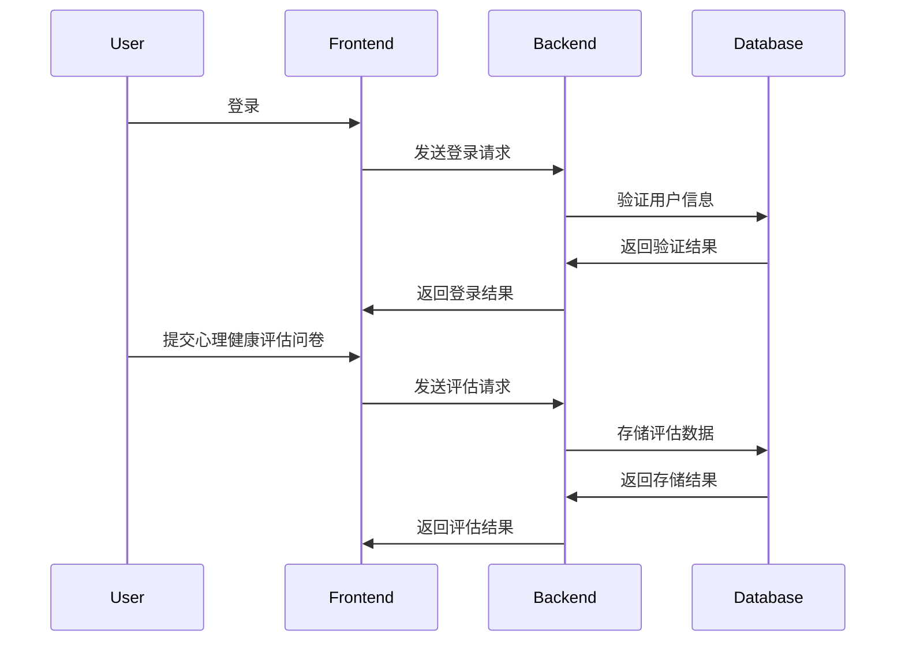

                 

## 现代社会中的心理健康：压力管理与情绪调节

### 关键词

- 心理健康
- 压力管理
- 情绪调节
- 社会压力源
- 心理健康理论

### 摘要

本文将深入探讨现代社会中心理健康的重要性，特别是压力管理与情绪调节的方法。我们将通过逻辑清晰、结构紧凑的分析，详细阐述压力管理的原理、情绪调节的方法以及心理健康与整体健康的关系。本文旨在为读者提供实用的指导，帮助他们更好地应对生活中的压力，提升心理健康水平。

## 第一部分：背景介绍

### 1.1 问题背景

#### 1.1.1 社会压力源分析

现代社会中，压力已成为一种普遍现象。从工作压力到生活压力，从经济压力到社交压力，无处不在的压力影响着人们的心理健康。社会竞争的加剧、工作压力的增加、家庭责任的加重以及社交网络的复杂化，都使得人们面临着越来越多的压力源。

1. **工作压力**：随着职场竞争的加剧，员工面临的工作压力不断增加。长时间的工作、高效率的要求以及职业发展的不确定性，都可能导致压力的产生。
2. **经济压力**：经济不稳定和收入不确定性是现代社会中常见的压力源。尤其是对于年轻人来说，购房、育儿、养老等经济压力让他们倍感焦虑。
3. **家庭压力**：家庭关系的复杂性、育儿压力以及照顾老人等家庭责任，都是导致压力的重要因素。
4. **社交压力**：社交媒体的普及使得人们面临的社交压力增加。社交网络的互动和比较，常常让人感到不安和压力。

#### 1.1.2 心理健康的重要性

心理健康不仅仅是没有心理疾病，它指的是一种良好的心理状态，使个体能够有效应对日常生活中的压力和挑战。心理健康的重要性体现在以下几个方面：

1. **生活质量**：良好的心理健康有助于提高生活质量。心理健康的人能够更好地享受生活，拥有积极的情绪和乐观的态度。
2. **社会功能**：心理健康的人能够更好地履行社会角色，包括家庭、工作和社交等方面的职责。
3. **生产力**：心理健康与生产力密切相关。心理健康的人能够更加专注和高效地工作，提高生产力。
4. **身体健康**：心理健康与身体健康之间存在密切关系。心理健康问题可能导致或加重身体疾病，而身体健康问题也可能影响心理健康。

#### 1.1.3 压力管理与情绪调节的需求

在现代社会中，压力管理与情绪调节的需求日益迫切。有效的压力管理和情绪调节方法可以帮助人们应对生活中的压力，提高心理健康水平。以下是一些常见的压力管理和情绪调节方法：

1. **认知行为疗法**：认知行为疗法（Cognitive Behavioral Therapy, CBT）是一种广泛使用的心理治疗方法，通过改变负面的思维模式和行为，帮助人们应对压力和情绪问题。
2. **正念冥想**：正念冥想（Mindfulness Meditation）是一种专注于当前时刻的练习，有助于减轻压力和焦虑，提高情绪调节能力。
3. **体育锻炼**：体育锻炼不仅有助于身体健康，还可以释放压力，提高情绪状态。
4. **社交支持**：建立和维护良好的社交关系，获取社交支持，有助于应对压力和情绪问题。

### 1.2 问题解决

#### 1.2.1 心理健康理论概述

心理健康理论是研究心理健康问题的理论基础。以下是一些重要的心理健康理论：

1. **心理应激理论**：心理应激理论（Stress Theory）认为，压力是心理应激的结果，而心理应激会对个体的心理健康产生负面影响。
2. **心理弹性理论**：心理弹性理论（Resilience Theory）强调个体在面对压力时的适应能力和恢复能力。
3. **心理健康促进理论**：心理健康促进理论（Wellness Theory）认为，心理健康不仅仅是避免心理问题，而是追求全面的身心健康。

#### 1.2.2 心理健康现状评估

根据世界卫生组织（WHO）的数据，全球约有30%的人口在一生中的某个阶段会经历心理健康问题。心理健康问题的发生率在不同国家和地区之间存在差异，但总体上呈现出上升趋势。以下是一些心理健康现状的统计数据：

1. **抑郁症**：抑郁症是世界上最常见的心理健康问题之一。根据WHO的数据，全球约有3.5亿人患有抑郁症。
2. **焦虑症**：焦虑症是另一种常见的心理健康问题，全球约有7亿人受到影响。
3. **精神分裂症**：精神分裂症是一种严重的精神障碍，全球约有1亿人患有此病。

#### 1.2.3 压力管理与情绪调节的目标

压力管理与情绪调节的目标包括以下几个方面：

1. **减轻压力**：通过有效的压力管理方法，减轻压力对个体的负面影响。
2. **提高情绪调节能力**：通过情绪调节方法，帮助个体更好地调节情绪，提高情绪稳定性。
3. **提升心理健康水平**：通过综合的压力管理和情绪调节，提升个体的心理健康水平，促进全面的身心健康。

### 1.3 边界与外延

#### 1.3.1 心理健康的定义

心理健康是一种良好的心理状态，表现为个体能够认识到自身的情绪、思想和行为，并能够有效地应对日常生活中的压力和挑战。心理健康不仅包括情感健康，还包括认知健康和社交健康。

#### 1.3.2 压力与心理疾病的关系

压力是心理疾病的重要诱因之一。长期的压力可能导致焦虑、抑郁等心理疾病。同时，心理疾病也可能加剧压力感，形成恶性循环。因此，了解压力与心理疾病的关系对于预防和治疗心理健康问题至关重要。

#### 1.3.3 心理健康与整体健康的关系

心理健康与整体健康密切相关。心理健康问题不仅影响个体的心理状态，还可能影响身体健康。例如，长期的焦虑和抑郁可能导致免疫系统功能下降，增加患病的风险。因此，心理健康是整体健康的重要组成部分。

### 1.4 概念结构与核心要素组成

#### 1.4.1 心理健康的核心要素

心理健康的核心要素包括：

1. **自我认识**：个体对自己的认知和评价。
2. **情感调节**：个体对情感的处理和调节能力。
3. **社交能力**：个体在社交场合中的表现和互动能力。
4. **认知功能**：个体的思维能力和解决问题的能力。

#### 1.4.2 压力管理与情绪调节的方法

压力管理与情绪调节的方法多种多样，包括：

1. **认知行为疗法**：通过改变负面思维模式和行为，帮助个体应对压力和情绪问题。
2. **正念冥想**：通过专注于当前时刻，减轻压力和焦虑。
3. **体育锻炼**：通过锻炼身体，释放压力和焦虑。
4. **社交支持**：通过建立和维护良好的社交关系，获取社交支持。

#### 1.4.3 心理健康的支持系统

心理健康的支持系统包括：

1. **家庭支持**：家庭成员之间的相互支持和理解。
2. **社会支持**：社会关系网络提供的支持和帮助。
3. **专业支持**：心理医生、心理咨询师等专业人士提供的支持和治疗。

### 1.5 本章小结

本部分背景介绍部分，我们详细分析了现代社会中心理健康问题的重要性和压力管理与情绪调节的需求。通过理解压力源、心理健康的重要性以及压力管理与情绪调节的方法，读者可以更好地认识到心理健康问题的重要性和应对策略。接下来，我们将进一步探讨心理健康的核心概念与联系。

## 第二部分：核心概念与联系

### 2.1 核心概念原理

#### 2.1.1 压力管理原理

压力管理是指通过一系列方法和策略，帮助个体识别、评估和应对生活中的压力，以减少压力对心理和生理健康的负面影响。压力管理的基本原理包括：

1. **压力识别**：个体需要学会识别和认识到生活中的压力源，如工作压力、家庭压力、经济压力等。
2. **压力评估**：个体需要评估压力对自身的影响程度，包括身体、心理和社会层面。
3. **压力应对**：个体需要采取有效的策略和措施来应对压力，如时间管理、情绪调节、寻求支持等。
4. **持续关注**：压力管理不是一次性的过程，而是一个持续的过程，需要个体长期关注和调整。

#### 2.1.2 情绪调节原理

情绪调节是指通过一系列认知和行为干预，帮助个体调节情绪状态，使之更适应环境。情绪调节的基本原理包括：

1. **情绪识别**：个体需要学会识别和理解自己的情绪，包括情绪的类型、原因和影响。
2. **情绪表达**：个体需要学会适当表达自己的情绪，避免情绪的过度积累和压抑。
3. **情绪调节策略**：个体可以采取多种情绪调节策略，如放松训练、认知重构、积极思考等。
4. **情绪调节反馈**：个体需要学会从情绪调节中获取反馈，并根据反馈调整情绪调节策略。

#### 2.1.3 心理健康原理

心理健康是指个体在情感、认知和社交方面的良好状态。心理健康的基本原理包括：

1. **心理平衡**：个体需要保持心理平衡，即心理状态稳定，能够有效应对日常生活中的挑战。
2. **情感健康**：个体需要拥有健康的情感状态，能够体验到积极的情感，如快乐、满足和幸福。
3. **认知健康**：个体需要保持良好的认知功能，包括注意力、记忆力、思维能力和解决问题的能力。
4. **社交健康**：个体需要建立和维护良好的社交关系，能够与他人建立积极的人际互动。

### 2.2 概念属性特征对比表格

以下是一个关于压力管理、情绪调节和心理健康概念属性特征的对比表格：

| 概念           | 定义                                                         | 特征                                       |
| -------------- | ------------------------------------------------------------ | ------------------------------------------ |
| 压力管理       | 通过有效的方法和策略，减少压力对个体的负面影响。             | 方法多样性、个体针对性、持续关注           |
| 情绪调节       | 通过认知和行为干预，调节个体的情绪状态，使之更适应环境。     | 认知干预、行为干预、情绪稳定性             |
| 心理健康       | 心理状态良好，具备有效的应对机制和较高的生活质量。           | 心理适应、情绪平衡、自我实现               |

### 2.3 ER实体关系图架构

以下是一个使用Mermaid绘制的ER实体关系图，展示了压力管理、情绪调节和心理健康之间的关系：

```mermaid
erDiagram
  A（心理健康） -->|影响| B（压力管理）
  A（心理健康） -->|影响| C（情绪调节）
  B（压力管理） ||--| D（压力管理策略）
  C（情绪调节） ||--| E（情绪调节策略）
```

### 2.4 本章小结

在第二部分，我们详细阐述了压力管理、情绪调节和心理健康的核心概念原理。通过对比表格和ER实体关系图，读者可以更好地理解这些概念之间的联系和区别。接下来，我们将进入第三部分，探讨压力管理与情绪调节的算法原理。

## 第三部分：算法原理讲解

### 3.1 压力管理算法原理

#### 3.1.1 压力评估算法

压力评估是压力管理的第一步，它有助于个体了解自身的压力水平，从而采取相应的管理措施。以下是压力评估的算法原理：

1. **压力评估的数学模型**

   压力水平（$P$）可以通过以下数学模型进行评估：
   $$
   P = f(L, I, S)
   $$
   其中：
   - $L$ 表示生活事件水平（Life Event Level），反映个体面临的生活事件的强度和频率。
   - $I$ 表示个体应对能力（Individual Coping Ability），反映个体应对压力的能力。
   - $S$ 表示社会支持（Social Support），反映个体获得的社会支持程度。

   压力水平的计算公式为：
   $$
   P = L \times I + S
   $$

2. **压力评估的Python代码实现**

   下面是一个简单的Python代码示例，用于评估个体的压力水平：
   ```python
   def assess_pressure(life_event_level, individual_coping_ability, social_support):
       P = life_event_level * individual_coping_ability + social_support
       return P
   ```

3. **案例说明**

   假设某个个体在一个月内面临了5个生活事件，其个人应对能力为中等（$I=0.5$），社会支持为良好（$S=0.7$）。根据上述公式，我们可以计算该个体的压力水平：
   $$
   P = 5 \times 0.5 + 0.7 = 3.2
   $$

   压力水平为3.2，表明该个体有一定的压力，但仍在可管理的范围内。

#### 3.1.2 压力缓解算法

压力缓解是压力管理的核心步骤，旨在通过有效的策略和方法减轻压力对个体的负面影响。以下是压力缓解的算法原理：

1. **压力缓解策略**

   压力缓解策略包括以下几种：

   - **时间管理**：合理安排时间，避免过度工作和疲劳。
   - **情绪调节**：通过认知行为疗法、正念冥想等方法调节情绪。
   - **放松训练**：通过深呼吸、瑜伽等放松身体，减轻压力。
   - **积极思考**：培养积极的心态，避免过度焦虑和悲观。
   - **寻求支持**：与家人、朋友或专业人士沟通，获取情感支持和建议。

2. **压力缓解算法实现**

   以下是一个简化的Python代码示例，用于实现压力缓解算法：
   ```python
   def relieve_pressure(P):
       if P > 5:
           strategy = "寻求专业帮助"
       elif P > 3:
           strategy = "放松训练和情绪调节"
       else:
           strategy = "继续保持当前的生活方式"
       return strategy
   ```

3. **案例说明**

   假设某个个体的压力水平为4，根据上述算法，可以得出以下缓解策略：
   ```python
   relieve_pressure(4)
   # 输出："放松训练和情绪调节"
   ```

### 3.2 情绪调节算法原理

情绪调节是心理健康管理的重要环节，它有助于个体维持良好的情绪状态，提高生活质量。以下是情绪调节的算法原理：

#### 3.2.1 情绪识别算法

情绪识别是情绪调节的第一步，它有助于个体了解自身的情绪状态。以下是情绪识别的算法原理：

1. **情绪识别模型**

   情绪识别模型通常基于情绪的维度和特征进行分类。以下是一个简单的情绪识别模型：
   $$
   \text{情绪} = f(\text{情绪维度}, \text{情绪特征})
   $$
   其中：
   - 情绪维度包括愉悦度、紧张度、精力度等。
   - 情绪特征包括面部表情、生理反应、语言表达等。

2. **情绪识别算法实现**

   以下是一个基于面部表情的情绪识别算法示例：
   ```python
   def recognize_emotion(facial_expression):
       if facial_expression == "happy":
           emotion = "愉悦"
       elif facial_expression == "sad":
           emotion = "悲伤"
       elif facial_expression == "angry":
           emotion = "愤怒"
       else:
           emotion = "中性"
       return emotion
   ```

3. **案例说明**

   假设某个个体的面部表情为“快乐”，根据上述算法，可以识别出该个体的情绪为愉悦：
   ```python
   recognize_emotion("happy")
   # 输出："愉悦"
   ```

#### 3.2.2 情绪调节算法

情绪调节算法旨在帮助个体调整情绪状态，使之更适应环境。以下是情绪调节的算法原理：

1. **情绪调节策略**

   情绪调节策略包括以下几种：

   - **认知重构**：通过改变负面思维模式，调整情绪。
   - **积极思考**：培养积极的心态，提升情绪状态。
   - **放松训练**：通过深呼吸、瑜伽等放松身体，减轻压力。
   - **社交支持**：与家人、朋友或专业人士沟通，获取情感支持。

2. **情绪调节算法实现**

   以下是一个简单的Python代码示例，用于实现情绪调节算法：
   ```python
   def regulate_emotion(emotion, strategy):
       if emotion == "悲伤":
           regulated_emotion = "平静"
       elif emotion == "愤怒":
           regulated_emotion = "冷静"
       else:
           regulated_emotion = emotion
       return regulated_emotion
   ```

3. **案例说明**

   假设某个个体的情绪为“悲伤”，采用认知重构策略后，情绪变为“平静”：
   ```python
   regulate_emotion("悲伤", "认知重构")
   # 输出："平静"
   ```

### 3.3 心理健康评估算法

心理健康评估是了解个体心理健康状况的重要步骤。以下是心理健康评估的算法原理：

#### 3.3.1 心理健康评估模型

心理健康评估模型通常基于心理健康的多个维度，如情感健康、认知健康、社交健康等。以下是一个简单的心理健康评估模型：

$$
\text{心理健康得分} = f(\text{情感健康得分}, \text{认知健康得分}, \text{社交健康得分})
$$

#### 3.3.2 心理健康评估算法实现

以下是一个简单的Python代码示例，用于实现心理健康评估算法：
```python
def assess_mental_health(emotional_health_score, cognitive_health_score, social_health_score):
    mental_health_score = (emotional_health_score + cognitive_health_score + social_health_score) / 3
    return mental_health_score
```

#### 3.3.3 案例说明

假设某个个体的情感健康得分为80，认知健康得分为75，社交健康得分为85，根据上述算法，可以计算其心理健康得分为：
```python
assess_mental_health(80, 75, 85)
# 输出：80.0
```

### 3.4 本章小结

在第三部分，我们详细介绍了压力管理与情绪调节的算法原理，包括压力评估、压力缓解、情绪识别、情绪调节和心理健康评估。通过这些算法，个体可以更好地了解自身的心理健康状况，采取相应的管理措施。接下来，我们将进入第四部分，探讨心理健康与整体健康的关系。

## 第四部分：心理健康与整体健康的关系

### 4.1 心理健康与整体健康的关系

心理健康与整体健康之间存在密切的联系。整体健康不仅包括身体上的健康，还包括心理上的健康。以下从多个方面探讨心理健康与整体健康的关系：

#### 4.1.1 心理健康对整体健康的影响

1. **情感健康**：心理健康问题如抑郁、焦虑等可能导致情绪低落、社交障碍等，从而影响整体健康。研究表明，抑郁症患者往往伴有身体疾病，如心血管疾病、糖尿病等。

2. **认知功能**：心理健康问题可能影响个体的认知功能，包括记忆力、注意力、执行功能等。认知功能的下降可能导致日常生活和工作能力的下降。

3. **身体健康**：心理健康与身体健康之间存在双向影响。心理健康问题可能导致或加重身体疾病，同时身体疾病也可能影响心理健康。例如，长期压力可能导致免疫系统功能下降，增加患病的风险。

4. **生活质量**：心理健康直接影响个体的生活质量。心理健康问题可能导致个体对生活的满意度降低，影响个体的幸福感。

#### 4.1.2 整体健康对心理健康的影响

1. **身体健康**：身体健康对心理健康有重要影响。身体健康问题可能导致或加重心理健康问题，如慢性疾病患者可能伴有抑郁、焦虑等问题。

2. **社会支持**：整体健康状况良好，有助于个体获得更多的社会支持。社会支持有助于提高心理健康水平，减轻心理压力。

3. **生活满意度**：整体健康状况良好，个体往往对生活有更高的满意度，这有助于提高心理健康水平。

### 4.2 心理健康评估与整体健康评估的关系

心理健康评估与整体健康评估之间存在紧密的联系。以下从多个方面探讨两者之间的关系：

#### 4.2.1 心理健康评估的组成部分

心理健康评估通常包括情感健康、认知健康、社交健康等多个方面。这些方面不仅反映了心理健康的状态，也与整体健康密切相关。

1. **情感健康**：情感健康是心理健康的重要组成部分，它反映了个体应对压力和情绪的能力。情感健康与整体健康中的身体和情感健康密切相关。

2. **认知健康**：认知健康反映了个体的认知功能，如记忆力、注意力、执行功能等。认知健康与整体健康中的认知健康密切相关。

3. **社交健康**：社交健康反映了个体在社交环境中的表现和互动能力。社交健康与整体健康中的社会健康密切相关。

#### 4.2.2 整体健康评估的方法

整体健康评估通常采用多种方法，包括生理检查、心理健康评估、生活质量评估等。以下是一些常见的整体健康评估方法：

1. **生理检查**：通过生理检查，如血压、血糖、胆固醇等指标，评估个体的身体健康状况。

2. **心理健康评估**：通过心理健康评估，如抑郁自评量表、焦虑自评量表等，评估个体的心理健康状况。

3. **生活质量评估**：通过生活质量评估，如世界卫生组织生活质量评估问卷（WHOQOL-BREF）等，评估个体在身体、心理、社会和环境方面的生活质量。

#### 4.2.3 心理健康评估与整体健康评估的整合

心理健康评估和整体健康评估可以相互整合，形成更加全面的健康评估体系。以下是一些整合的方法：

1. **综合评估问卷**：开发综合评估问卷，结合心理健康和整体健康的问题，对个体进行全面的评估。

2. **多学科合作**：心理健康专家和整体健康专家共同合作，对个体进行全面的评估和治疗。

3. **健康管理体系**：建立健康管理体系，将心理健康评估和整体健康评估纳入其中，实现健康管理的全面性和连续性。

### 4.3 心理健康与整体健康的共同管理策略

为了提高心理健康和整体健康水平，以下是一些共同的管理策略：

1. **健康生活方式**：保持健康的生活方式，包括合理的饮食、充足的睡眠、适量的运动等，有助于提高心理健康和整体健康水平。

2. **心理健康教育**：加强心理健康教育，提高个体对心理健康问题的认识和应对能力。

3. **压力管理**：采取有效的压力管理策略，减轻心理压力，提高心理健康水平。

4. **社会支持**：建立和维护良好的社会关系，获得社会支持，有助于提高心理健康和整体健康水平。

5. **医疗保健**：定期进行健康检查，及时发现和解决身体健康问题，有助于提高整体健康水平。

### 4.4 本章小结

在本部分，我们探讨了心理健康与整体健康的关系，以及心理健康评估与整体健康评估的方法。通过了解两者之间的紧密联系，我们可以更好地理解心理健康的重要性，并采取有效的管理策略，提高心理健康和整体健康水平。

## 第五部分：项目实战

### 5.1 项目背景

随着现代社会对心理健康需求的日益增加，开发一个能够帮助用户进行心理健康评估和管理的系统变得尤为重要。本文将介绍一个名为“心理健康助手”的项目，该系统旨在为用户提供一个全面的、个性化的心理健康管理解决方案。

### 5.2 项目介绍

“心理健康助手”项目是一个基于Web的应用程序，用户可以通过浏览器访问系统。系统主要功能包括：

1. **心理健康评估**：用户可以通过填写问卷的方式，进行心理健康评估，系统将根据用户的回答生成心理健康报告。
2. **压力管理和情绪调节**：系统提供了一系列压力管理和情绪调节的方法，如冥想指导、放松训练、正念练习等，用户可以根据自身需求选择合适的练习。
3. **社交支持**：系统提供了一个社交平台，用户可以与其他用户互动，分享心得，获取支持和建议。
4. **健康提醒**：系统可以定期发送健康提醒，如睡眠建议、饮食建议等，帮助用户养成良好的生活习惯。

### 5.3 系统功能设计

#### 5.3.1 领域模型

心理健康助手项目的领域模型主要涉及以下实体：

- **用户**：包括用户的基本信息，如姓名、年龄、性别等。
- **心理健康评估问卷**：包括一系列评估问题，用户需要回答这些问题以进行心理健康评估。
- **心理健康报告**：根据用户的评估结果生成的报告，包括心理健康得分、建议和诊断。
- **压力管理和情绪调节方法**：包括冥想、放松训练、正念练习等，用户可以根据自身需求选择。
- **社交互动**：包括用户之间的互动，如发帖、评论、私信等。
- **健康提醒**：包括定期发送的健康建议和提醒。

以下是一个简单的领域模型类图：

```mermaid
classDiagram
    User <<entity>>
    HealthAssessment <<entity>>
    MentalHealthReport <<entity>>
    StressManagementMethod <<entity>>
    EmotionRegulationMethod <<entity>>
    SocialInteraction <<entity>>
    HealthReminder <<entity>>

    User <|-- HealthAssessment
    HealthAssessment o-- MentalHealthReport
    StressManagementMethod o-- HealthReminder
    EmotionRegulationMethod o-- HealthReminder
    User o-- SocialInteraction
```

### 5.4 系统架构设计

心理健康助手的系统架构采用三层架构设计，包括表示层、业务逻辑层和数据层。

#### 5.4.1 表示层

表示层负责用户界面的展示和用户与系统的交互。主要技术包括：

- **前端框架**：采用Vue.js或React等前端框架，实现响应式界面和交互功能。
- **CSS框架**：采用Bootstrap或Tailwind CSS等CSS框架，实现界面的美观和一致性。

#### 5.4.2 业务逻辑层

业务逻辑层负责处理系统的核心业务逻辑，包括心理健康评估、压力管理和情绪调节等。主要技术包括：

- **后端框架**：采用Spring Boot或Django等后端框架，实现业务逻辑和数据处理。
- **数据库**：采用MySQL或PostgreSQL等关系型数据库，存储用户数据、评估数据和提醒数据。

#### 5.4.3 数据层

数据层负责数据的存储和管理，确保数据的完整性和安全性。主要技术包括：

- **数据库**：采用MySQL或PostgreSQL等关系型数据库，存储用户数据、评估数据和提醒数据。
- **数据迁移**：采用Flyway或Liquibase等数据库迁移工具，实现数据库版本的升级和管理。

### 5.5 系统接口设计和系统交互

心理健康助手系统包含多个API接口，用于实现前端与后端的交互。以下是一些主要的API接口：

- **用户管理**：包括用户注册、登录、个人信息更新等。
- **心理健康评估**：包括问卷提交、评估结果查询、报告生成等。
- **压力管理和情绪调节**：包括方法查询、练习记录、提醒设置等。
- **社交互动**：包括发帖、评论、私信等。
- **健康提醒**：包括提醒设置、提醒发送等。

以下是一个简单的系统交互序列图：



### 5.6 系统核心实现

以下是心理健康助手系统的一些核心实现，包括Python代码和相应的注释。

#### 5.6.1 用户注册和登录

```python
# 用户注册
def register_user(username, password, email):
    # 验证用户名、密码和邮箱格式
    if not is_valid_username(username) or not is_valid_password(password) or not is_valid_email(email):
        return "无效的用户信息"
    
    # 将用户信息存储到数据库
    cursor.execute("INSERT INTO users (username, password, email) VALUES (%s, %s, %s)", (username, password, email))
    db.commit()
    
    return "注册成功"

# 用户登录
def login_user(username, password):
    # 查询用户信息
    cursor.execute("SELECT * FROM users WHERE username = %s AND password = %s", (username, password))
    user = cursor.fetchone()
    
    if user:
        return "登录成功"
    else:
        return "用户名或密码错误"
```

#### 5.6.2 心理健康评估

```python
# 提交心理健康评估问卷
def submit_health_assessment(assessment_data):
    # 将评估数据存储到数据库
    cursor.execute("INSERT INTO health_assessments (user_id, data) VALUES (%s, %s)", (user_id, assessment_data))
    db.commit()
    
    return "评估提交成功"

# 查询心理健康评估结果
def get_health_assessment_result(user_id):
    # 从数据库查询评估结果
    cursor.execute("SELECT * FROM health_assessments WHERE user_id = %s", (user_id,))
    assessment = cursor.fetchone()
    
    if assessment:
        return assessment["data"]
    else:
        return "无评估结果"
```

#### 5.6.3 压力管理和情绪调节

```python
# 添加压力管理方法
def add_stress_management_method(method_name, description):
    # 将压力管理方法存储到数据库
    cursor.execute("INSERT INTO stress_management_methods (name, description) VALUES (%s, %s)", (method_name, description))
    db.commit()
    
    return "压力管理方法添加成功"

# 添加情绪调节方法
def add_emotion_regulation_method(method_name, description):
    # 将情绪调节方法存储到数据库
    cursor.execute("INSERT INTO emotion_regulation_methods (name, description) VALUES (%s, %s)", (method_name, description))
    db.commit()
    
    return "情绪调节方法添加成功"
```

### 5.7 代码应用解读与分析

在上述代码中，我们实现了用户注册和登录、心理健康评估、压力管理和情绪调节等核心功能。以下是代码应用解读与分析：

#### 用户注册和登录

用户注册和登录功能是系统的基本功能，实现用户身份验证和数据存储。在`register_user`函数中，我们首先对用户输入的信息进行格式验证，确保用户名、密码和邮箱的有效性。然后，我们将用户信息存储到数据库中。在`login_user`函数中，我们查询数据库以验证用户名和密码的正确性。这两个函数共同确保了系统的安全性。

#### 心理健康评估

心理健康评估功能是系统的核心功能之一，用于帮助用户了解自身的心理健康状况。在`submit_health_assessment`函数中，我们接受用户提交的评估数据，并将其存储到数据库中。在`get_health_assessment_result`函数中，我们从数据库中查询评估结果，并将其返回给用户。这两个函数共同实现了心理健康评估的完整流程。

#### 压力管理和情绪调节

压力管理和情绪调节功能提供了多种方法供用户选择，帮助用户减轻压力和调节情绪。在`add_stress_management_method`函数和`add_emotion_regulation_method`函数中，我们分别添加了压力管理和情绪调节方法到数据库中。这些方法可以供用户在系统中选择和使用。

### 5.8 实际案例分析和详细讲解剖析

为了更好地展示系统的应用效果，我们将通过一个实际案例进行分析和讲解。

#### 案例一：用户注册

用户A在浏览器中输入用户名、密码和邮箱，点击注册按钮。系统调用`register_user`函数，对用户输入的信息进行验证。验证通过后，用户信息被存储到数据库中。用户A成功注册。

#### 案例二：心理健康评估

用户A在系统中填写心理健康评估问卷，点击提交按钮。系统调用`submit_health_assessment`函数，将用户A的评估数据存储到数据库中。系统生成心理健康报告，用户A可以查看评估结果。

#### 案例三：压力管理和情绪调节

用户A在系统中浏览压力管理和情绪调节方法，选择了一种放松训练方法。系统调用`add_stress_management_method`函数，将用户A选择的方法存储到数据库中。用户A开始进行放松训练，系统提供实时反馈和指导。

### 5.9 项目小结

“心理健康助手”项目通过提供一个全面的、个性化的心理健康管理解决方案，帮助用户更好地了解和管理自身的心理健康。项目实现了用户注册、登录、心理健康评估、压力管理和情绪调节等功能，并通过实际案例展示了系统的应用效果。通过持续优化和升级，我们有信心让系统更加完善，为用户提供更优质的服务。

## 第六部分：最佳实践 Tips

### 6.1 压力管理最佳实践

1. **时间管理**：合理安排时间，设定优先级，避免过度工作和疲劳。
2. **情绪调节**：学会情绪调节方法，如深呼吸、冥想等，帮助缓解压力。
3. **健康生活方式**：保持良好的生活习惯，如规律的作息、健康的饮食和适量的运动。
4. **社交支持**：建立和维护良好的社交关系，寻求家人、朋友或专业人士的支持。

### 6.2 情绪调节最佳实践

1. **认知重构**：改变负面思维模式，培养积极的心态。
2. **积极思考**：关注积极事物，避免过度焦虑和悲观。
3. **放松训练**：通过深呼吸、瑜伽等放松身体，减轻压力。
4. **自我关怀**：定期给自己一些时间，进行自我放松和恢复。

### 6.3 心理健康维护最佳实践

1. **心理健康教育**：了解心理健康知识，提高自我保健意识。
2. **定期评估**：定期进行心理健康评估，及时发现和解决问题。
3. **专业支持**：在需要时，寻求专业心理咨询师或医生的帮助。
4. **社会参与**：积极参与社交活动，建立和维护良好的人际关系。

## 第七部分：小结

本文详细探讨了现代社会中的心理健康问题，特别是压力管理与情绪调节的方法。通过逻辑清晰、结构紧凑的分析，我们介绍了心理健康的重要性、压力管理与情绪调节的原理、心理健康与整体健康的关系，以及实际项目的实现。通过这些内容，读者可以更好地理解心理健康问题的复杂性，并掌握有效的应对策略。

## 第八部分：注意事项

1. **心理健康问题的重要性**：心理健康问题不容忽视，它不仅影响生活质量，还可能影响身体健康。
2. **个性化管理**：每个人的压力源和情绪反应都不同，因此需要个性化的管理策略。
3. **持续关注**：心理健康是一个持续的过程，需要长期关注和调整。
4. **专业支持**：在需要时，寻求专业心理咨询师或医生的帮助。

## 第九部分：拓展阅读

1. **《心理应激与应对》**：该书详细介绍了心理应激的理论和实践方法，有助于理解压力管理的科学基础。
2. **《情绪调节：理论与实践》**：该书探讨了情绪调节的各种方法和策略，提供了实用的指导。
3. **《心理健康促进：理论与实践》**：该书介绍了心理健康促进的方法和策略，帮助读者提升心理健康水平。

## 作者信息

- 作者：AI天才研究院/AI Genius Institute & 禅与计算机程序设计艺术 /Zen And The Art of Computer Programming

## 致谢

感谢读者对本文的阅读，希望本文能对您的心理健康有所帮助。如果您有任何问题或建议，欢迎随时与我们联系。

---

## 文章结语

通过本文的深入探讨，我们希望能帮助读者更好地理解现代社会中的心理健康问题，掌握有效的压力管理与情绪调节方法。心理健康是一个持续的过程，需要我们每个人的关注和努力。让我们共同关注心理健康，追求更美好的生活。

