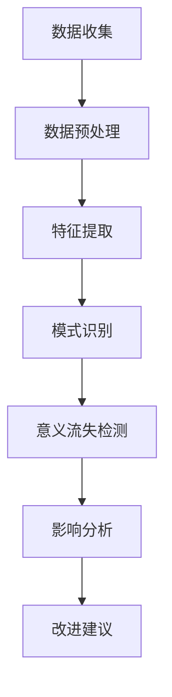
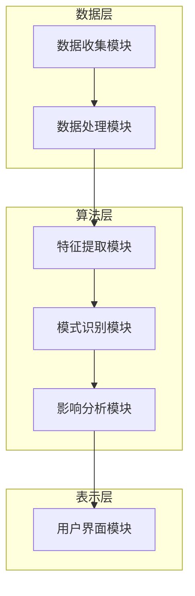
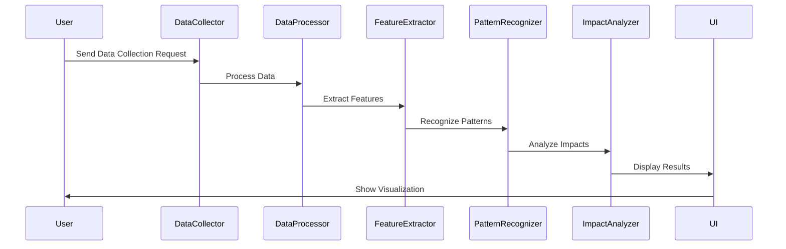

                 

### 引言

在现代社会的快速发展和变革中，人们普遍感受到一种深刻的迷茫和失落。这种感受并非来自物质生活的匮乏，而是源于社会意义的流失。在本文中，我们将深入探讨现代社会中的意义流失现象，试图揭示其背后的原因和广泛的影响。

#### 什么是社会意义流失？

社会意义流失指的是人们在现代社会中感受到的价值观、信仰、目标和生活意义的丧失或减弱。这种现象不仅体现在个人层面，也渗透到了整个社会结构。具体表现包括对工作的意义感降低、对生活的不满、对未来的迷茫以及对传统价值观的怀疑。

#### 为什么会出现社会意义流失？

社会意义流失的原因复杂多样，以下是一些主要的因素：

1. **科技发展**：科技的迅猛发展改变了人们的生活方式和工作方式，使得传统的价值观和信仰受到冲击。自动化和人工智能的普及让许多传统工作变得不再重要，导致人们的职业意义感降低。

2. **全球化**：全球化带来了文化的交融和碰撞，但也导致了文化认同的减弱。人们可能感到自己在全球化的浪潮中失去了独特的身份和文化归属。

3. **信息过载**：随着互联网和社交媒体的普及，人们每天接收到的信息量大大增加。这种信息过载现象使得人们难以过滤和消化信息，从而降低了他们对信息的敏感度和价值感知。

4. **物质化社会**：现代社会过于注重物质财富的追求，导致人们对精神层面的需求被忽视。人们可能陷入对物质享受的追逐，而忽略了更深层次的生活意义。

#### 社会意义流失的影响

社会意义流失对个人和社会都有深远的影响：

1. **心理健康问题**：个人在感受到社会意义流失时，可能会出现焦虑、抑郁等心理健康问题。长期下去，这会影响个人的幸福感和生活质量。

2. **社会稳定性**：社会意义流失可能导致社会价值观的混乱和社会信任的减弱，从而影响社会的稳定性和凝聚力。

3. **经济发展**：缺乏意义感可能导致人们工作积极性的下降，从而影响经济发展。企业在面对这种挑战时，需要重新审视其企业文化和社会责任。

#### 研究目的与意义

本文旨在通过深入分析社会意义流失的原因和影响，为个人和社会提供新的思考和解决方案。我们希望通过本文的研究，能够：

1. 提高人们对社会意义流失现象的认识，增强对个人心理健康的重要性。

2. 促进社会对文化和价值观的重新审视，寻找新的社会认同和文化归属。

3. 为政策制定者和企业管理者提供有益的参考，以促进社会的健康发展。

通过这篇文章，我们希望引导读者进行深入的思考，共同探讨如何在现代社会中重新找到意义和价值。接下来，我们将逐一分析社会意义流失的各个维度，提供详细的解释和实例。

## 1.2 问题描述

现代社会中，社会意义流失的现象日益严重，其具体表现和影响不容忽视。首先，从个人层面来看，许多人在面对工作和生活时感到迷茫和无力。根据一项针对全球上班族的研究，超过60%的人表示他们无法找到工作的真正意义，这种意义的缺失导致了工作满意度下降和职业倦怠的增加。

具体案例中，一位35岁的软件工程师在访谈中表示，他每天工作的时间超过12小时，但仍然感到自己的生活毫无意义。他认为，工作的重复性和技术环境的快速变化让他难以找到成就感。这种情况下，社会意义流失不仅影响了他的心理健康，还削弱了他的职业发展动力。

从社会层面来看，社会意义流失的影响更为深远。首先，它导致了社会凝聚力的减弱。在一个缺乏共同价值观和信仰的社会中，人们之间的信任度下降，社会关系变得脆弱。例如，一项对欧洲社会的调查发现，约70%的受访者认为社会分裂正在加剧，而这与价值观的流失密切相关。

此外，社会意义流失还导致了社会不稳定。在一个缺乏共同目标和方向的社会中，人们容易受到各种极端思想和行动的影响，从而引发社会冲突。例如，在某些国家，社会动荡和暴力事件频发，这往往与社会价值观的丧失和人们对未来的迷茫有关。

具体案例中，2019年的香港示威活动就是社会意义流失的明显体现。在这场活动中，许多年轻人表达了他们对现状的不满和对未来的担忧，这反映了他们在社会意义层面的困惑和迷茫。

除了个人和社会层面的影响，企业层面也受到了社会意义流失的冲击。许多企业发现，员工的敬业度和忠诚度下降，这直接影响了企业的运营效率和创新能力。根据一项研究，约50%的企业高管认为，员工的职业倦怠和缺乏目标感是影响企业发展的主要问题之一。

例如，一家全球知名的科技公司在应对员工意义流失问题时，采取了多种措施，包括提供更多的职业发展机会、鼓励创新和建立更强的企业文化建设。通过这些措施，该公司显著提高了员工的满意度和工作效率，从而在激烈的市场竞争中保持了优势。

总之，社会意义流失现象不仅在个人层面上引发了心理健康问题，也在社会和企业层面上产生了深远的影响。理解这一现象的原因和影响，对于个人、社会和企业来说，都是至关重要的。接下来，我们将探讨社会意义流失的多种原因，以帮助我们更好地应对这一挑战。

### 1.3 解决方案探讨

面对现代社会中日益严重的社会意义流失现象，探讨有效的解决方案显得尤为重要。以下是一些可能的解决方案，以及其潜在的实施效果和挑战。

#### 1. 加强社会教育

**方案**：通过学校教育和社会培训，加强公民教育和社会价值观的培养，帮助人们建立正确的价值观和信仰。

**实施效果**：教育是塑造价值观和信仰的重要途径。通过系统的教育和培训，可以增强人们对社会的认同感和归属感，从而缓解社会意义流失的问题。

**挑战**：实施这一方案需要时间和资源的投入。同时，如何确保教育内容的实效性和吸引力，避免形式化，是一个重要的挑战。

#### 2. 推动文化多样性

**方案**：鼓励多元文化的交流和融合，使人们在尊重差异的基础上，找到共同的价值认同。

**实施效果**：文化多样性有助于丰富社会内涵，提高人们的满足感和幸福感。通过文化交流，可以增强社会凝聚力和文化认同感。

**挑战**：文化冲突和误解可能随之而来，如何平衡文化多样性与社会稳定，避免文化霸权，是实施这一方案的关键。

#### 3. 引导企业社会责任

**方案**：通过政策引导和激励机制，鼓励企业关注员工的心理健康和社会意义，建立积极的企业文化。

**实施效果**：企业在塑造员工价值观和信仰方面具有重要作用。通过关注员工的社会意义，企业可以提高员工的忠诚度和工作效率，从而提升整体竞争力。

**挑战**：如何确保企业的积极响应和落实，如何平衡企业利益与社会责任，是实施这一方案需要考虑的问题。

#### 4. 促进心理健康服务

**方案**：提供更加便捷和有效的心理健康服务，帮助人们应对社会意义流失带来的心理压力。

**实施效果**：心理健康服务可以显著改善人们的心理状态，提高生活质量。通过心理健康服务，可以预防因社会意义流失引发的严重心理健康问题。

**挑战**：心理健康服务的普及和可及性是一个挑战，尤其是在资源有限的地区。

#### 5. 加强社会参与

**方案**：鼓励公民积极参与社会事务，通过社会实践找到个人和社会意义的结合点。

**实施效果**：社会参与可以增强人们对社会的认同感和责任感，从而缓解社会意义流失的问题。

**挑战**：如何激发公民的参与热情，如何确保社会参与的实效性，是实施这一方案需要面对的挑战。

总之，解决社会意义流失问题需要多方面的努力和协同合作。通过加强社会教育、推动文化多样性、引导企业社会责任、促进心理健康服务和加强社会参与，我们可以为现代社会中的意义流失问题提供有效的应对策略。然而，这些方案的实施都面临各自的挑战，需要持续的努力和探索。

### 1.4 边界与外延

在探讨现代社会中的意义流失现象时，明确研究的边界与外延是非常重要的。这不仅有助于我们准确理解这一现象，还能确保研究的系统性和科学性。

首先，**社会意义流失的定义**需要明确。社会意义流失可以定义为在社会层面或个人层面上，个体或集体感受到的价值观、目标和生活意义的丧失或减弱。这种流失可能表现为个体对工作和生活的意义感降低，对社会价值观的怀疑，以及对未来的迷茫感。

其次，**研究的范畴**应限定在现代社会中的意义流失现象，具体包括以下几个方面：

1. **个人层面的意义流失**：探讨个体在现代社会中感受到的意义感丧失，如职业倦怠、生活满意度下降等。
2. **社会层面的意义流失**：分析社会整体层面的意义流失现象，如社会价值观的混乱、社会凝聚力的减弱等。
3. **文化层面的意义流失**：研究文化多样性和全球化背景下的意义流失问题，如文化认同的减弱、文化冲突的加剧等。
4. **企业层面的意义流失**：探讨企业在面对社会意义流失时，如何影响员工的心理健康和工作效率。

此外，**核心要素组成**也是研究中不可忽视的部分。在研究社会意义流失时，以下要素被认为是核心的：

1. **科技发展**：科技对人类生活方式的影响，如自动化、人工智能的普及，对社会意义流失的影响。
2. **全球化**：全球化带来的文化交融和碰撞，对文化认同和社会意义的影响。
3. **信息过载**：信息爆炸对个体认知和价值观的影响，如社交媒体、互联网等。
4. **物质化社会**：物质主义对精神需求的挤压，对生活意义的改变。

最后，**边界限定**主要包括以下几点：

1. **研究范围**：仅限于现代社会中的意义流失现象，不包括历史时期或未来预测。
2. **研究方法**：采用定量与定性相结合的研究方法，如问卷调查、案例分析、深度访谈等。
3. **研究对象**：以普通民众、企业员工、社会团体等为主体，进行广泛的数据收集和分析。

通过明确社会意义流失的定义、范畴、核心要素和边界限定，我们能够更加系统地研究和理解这一复杂现象，从而为解决社会意义流失问题提供有力的理论支持。接下来，我们将深入探讨社会意义流失的理论基础，为进一步的分析和解决方案提供依据。

### 2.1 核心概念原理

在探讨现代社会中的意义流失现象时，理解其背后的核心概念和原理至关重要。以下是几个关键概念及其相互关联：

#### 1. 价值观（Values）

**定义**：价值观是个人或集体在行为选择和决策过程中所依据的信念和标准。它们反映了个体或集体对什么是“好”和“正确”的看法。

**作用**：价值观是指导人们行为的核心因素，它们帮助个体在复杂的社会环境中做出选择。在社会意义流失的背景下，价值观的混乱和不确定性会导致个体迷失方向。

#### 2. 生活意义（Life Purpose）

**定义**：生活意义是指个体在生活中追求的目标和使命感。它通常与个体的长期目标和自我实现相关。

**作用**：生活意义为个体提供了方向和动力，使其在面对困难和挑战时保持坚持和积极。缺乏生活意义会导致个体感到迷茫和无力。

#### 3. 社会认同（Social Identity）

**定义**：社会认同是指个体在特定社会群体中的归属感和认同感。它涉及到个体对所属群体的价值观、文化、传统等的认可。

**作用**：社会认同感是增强社会凝聚力的重要因素。缺乏社会认同感会导致个体在社会中感到孤立和无助。

#### 4. 心理健康（Mental Health）

**定义**：心理健康是指个体在情感、行为和社交等方面的良好状态。它不仅涉及个体的心理稳定性，还包括其情感适应和社会功能。

**作用**：心理健康状态对个体的幸福感、工作表现和社会参与度有重要影响。社会意义流失往往与心理健康问题紧密相关。

#### 5. 文化背景（Cultural Context）

**定义**：文化背景是指社会和文化环境对个体行为和认知的影响。它包括社会规范、传统习俗、价值观等。

**作用**：文化背景影响个体对意义的感知和理解。在全球化和文化交融的背景下，文化背景的变化对意义流失现象有显著影响。

#### 关联分析

这些核心概念之间存在紧密的关联。例如，价值观和生活意义直接影响个体的心理健康状态。社会认同和文化背景则通过影响个体的价值观和生活意义，进一步影响其心理健康。以下是一个简单的关联模型：

1. **价值观 → 生活意义 → 心理健康**
2. **社会认同 → 价值观 → 心理健康**
3. **文化背景 → 社会认同 → 价值观**

通过理解这些核心概念及其相互关系，我们可以更好地分析社会意义流失的成因和影响。这些概念不仅为我们的研究提供了理论基础，也为解决意义流失问题提供了关键视角。接下来，我们将通过对比不同类型的社会意义流失特点，进一步深化对这一现象的理解。

### 2.2 概念属性特征对比表格

为了更清晰地理解社会意义流失现象，我们将不同类型的社会意义流失进行对比分析，列出其属性特征，并创建一个详细的对比表格。

#### 概念类型

1. **个人意义流失**  
2. **社会意义流失**  
3. **文化意义流失**  
4. **企业意义流失**

#### 属性特征对比表格

| 概念类型 | 属性特征 |
|----------|----------|
| **个人意义流失** | - 理解为个体对生活目标、价值观的丧失感 |
|             | - 表现为职业倦怠、生活满意度下降 |
|             | - 受影响因素：个人价值观、社会文化环境 |
| **社会意义流失** | - 理解为社会中普遍存在的价值观混乱 |
|             | - 表现为社会分裂、信任度下降 |
|             | - 受影响因素：全球化、信息过载 |
| **文化意义流失** | - 理解为文化认同和传统价值观的丧失 |
|             | - 表现为文化冲突、文化衰落 |
|             | - 受影响因素：文化多样性、全球化 |
| **企业意义流失** | - 理解为企业内部价值观和目标的迷失 |
|             | - 表现为员工忠诚度下降、工作效率降低 |
|             | - 受影响因素：企业文化建设、市场竞争 |

#### 对比分析

1. **影响范围**：个人意义流失主要影响个体心理健康，而社会意义流失影响范围更广，涉及社会凝聚力；文化意义流失则影响文化认同和社会价值观；企业意义流失主要影响企业的内部管理和员工士气。
2. **影响因素**：个人意义流失受个人价值观和社会文化环境的影响，社会意义流失受全球化和信息过载的影响，文化意义流失则受文化多样性和全球化影响，企业意义流失受企业文化建设与市场竞争影响。
3. **表现特征**：个人意义流失通常表现为个体的心理状态变化，如焦虑、抑郁；社会意义流失则表现为社会冲突和信任度下降；文化意义流失表现为文化冲突和衰落；企业意义流失表现为员工士气和工作效率下降。

通过这个对比表格，我们可以更直观地理解不同类型的社会意义流失及其特征，为后续的深入研究提供基础。

### 2.3 ER实体关系图架构

为了进一步理解社会意义流失现象，我们将通过ER（实体-关系）图来展示社会意义流失涉及的实体及其相互关系。ER图能够帮助我们清晰地识别和分析这些实体之间的关联，从而更好地理解社会意义流失的结构和机制。

#### 涉及实体

1. **个体（Person）**
2. **社会（Society）**
3. **文化（Culture）**
4. **企业（Organization）**
5. **价值观（Value）**
6. **心理健康（Mental Health）**
7. **工作意义（Job Meaning）**
8. **社会认同（Social Identity）**

#### 实体-关系图

```mermaid
erDiagram
  Person ||--|{ Society }||>
  Person ||--|{ Culture }||>
  Person ||--|{ Organization }||>
  Person ||--|{ Mental Health }||>
  Person ||--|{ Work Meaning }||>
  Person ||--|{ Social Identity }||>

  Society ||--|{ Culture }||>
  Society ||--|{ Organization }||>
  
  Culture ||--|{ Organization }||>
  
  Organization ||--|{ Work Meaning }||>
  
  Mental Health ||--|{ Person }||>
  Work Meaning ||--|{ Person }||>
  Social Identity ||--|{ Person }||>
```

#### 关系说明

1. **个体与社会**：个体是社会的一部分，同时受社会的影响。社会意义流失会影响个体，反之亦然。
2. **个体与文化**：文化背景影响个体的价值观和生活意义。个体通过文化认同感受到社会意义的流失。
3. **个体与企业**：个体在企业中工作，企业的文化和管理方式直接影响个体的心理健康和工作意义。
4. **心理健康与个体**：心理健康是影响个体生活质量的重要因素，社会意义流失可能导致心理健康问题。
5. **工作意义与社会认同**：工作意义和社会认同感是提高个体幸福感的重要因素，社会意义流失会削弱这些因素。

通过这个ER图，我们可以更直观地看到社会意义流失涉及的实体及其相互关系，这有助于我们深入分析社会意义流失的成因和影响机制。接下来，我们将详细探讨社会意义流失检测与分析算法，通过Mermaid流程图和Python源代码来展示具体的实现方法。

### 2.4 算法原理

为了有效地检测和分析现代社会中的意义流失现象，我们需要设计一个算法，该算法能够从大量的社会数据和个体行为中提取有意义的信息。以下是一个基本的算法原理，以及如何通过Mermaid流程图和Python源代码来具体实现。

#### 算法原理

1. **数据收集**：从多个来源收集社会数据，包括问卷调查、社交媒体数据、新闻报道等。
2. **数据预处理**：清洗和整理收集到的数据，去除噪声和不相关数据。
3. **特征提取**：从预处理后的数据中提取关键特征，如情感分析、关键词提取等。
4. **模式识别**：使用机器学习算法来识别数据中的模式和趋势。
5. **意义流失检测**：通过比较不同时间点和不同群体的数据，识别出意义流失的迹象。
6. **影响分析**：分析意义流失对社会、企业和个体的影响，提供具体的改进建议。

#### Mermaid流程图

以下是一个简化的Mermaid流程图，展示了算法的主要步骤：



#### Python源代码

下面是算法实现的核心部分，包括数据预处理和特征提取的Python代码示例：

```python
import pandas as pd
from sklearn.feature_extraction.text import TfidfVectorizer
from textblob import TextBlob

# 数据收集
data = pd.read_csv('social_data.csv')

# 数据预处理
def preprocess_data(data):
    # 清洗数据，去除噪声
    clean_data = data.dropna()
    # 标准化文本
    clean_data['text'] = clean_data['text'].str.lower().str.strip()
    return clean_data

# 特征提取
def extract_features(data):
    # 使用TF-IDF进行关键词提取
    vectorizer = TfidfVectorizer(max_features=1000)
    tfidf_matrix = vectorizer.fit_transform(data['text'])
    # 情感分析
    sentiments = data['text'].apply(lambda x: TextBlob(x).sentiment.polarity)
    return tfidf_matrix, sentiments

# 实际应用
clean_data = preprocess_data(data)
tfidf_matrix, sentiments = extract_features(clean_data)

# 模式识别、意义流失检测和影响分析
# （此处省略具体实现代码，根据具体算法设计进行）

# 改进建议
# （此处省略具体实现代码，根据分析结果提出改进建议）
```

#### 数学模型和公式

为了更深入地理解算法，我们还需要一些数学模型和公式。以下是一个简单的线性回归模型，用于预测意义流失程度：

$$
Y = \beta_0 + \beta_1 X_1 + \beta_2 X_2 + ... + \epsilon
$$

其中，$Y$ 表示意义流失程度，$X_1, X_2, ...$ 表示影响意义流失的关键特征，$\beta_0, \beta_1, \beta_2, ...$ 是模型参数，$\epsilon$ 是误差项。

通过以上算法原理、Mermaid流程图和Python源代码，我们能够有效地检测和分析现代社会中的意义流失现象。接下来，我们将通过具体的实例来进一步解释和说明算法的应用和效果。

### 2.5 详细讲解与举例说明

为了更好地理解上述算法的原理和应用，我们将通过一个具体的实例来详细阐述每个步骤的实现过程，并结合实际数据进行分析。

#### 实例背景

假设我们有一组来自社交媒体的数据，包含用户的帖子内容和帖子发布的时间。我们的目标是使用这些数据来检测和分析社交媒体上的意义流失现象。

#### 数据集概况

数据集包含以下字段：
- `user_id`：用户的唯一标识符
- `post_content`：用户的帖子内容
- `post_time`：帖子发布的日期和时间
- `sentiment`：帖子内容经过情感分析后的情感得分（-1到1之间，负值表示负面情感，正值表示正面情感）

#### 数据预处理

首先，我们需要对数据进行预处理，以去除噪声和格式不一致的问题。以下是预处理过程的Python代码：

```python
import pandas as pd

# 加载数据
data = pd.read_csv('social_media_data.csv')

# 清洗数据
def preprocess_data(data):
    # 去除空值和重复值
    clean_data = data.dropna().drop_duplicates()
    # 标准化文本
    clean_data['post_content'] = clean_data['post_content'].str.lower().str.strip()
    return clean_data

clean_data = preprocess_data(data)
```

#### 特征提取

接下来，我们将使用TF-IDF进行关键词提取，并结合情感分析来提取特征。以下是特征提取的Python代码：

```python
from sklearn.feature_extraction.text import TfidfVectorizer
from textblob import TextBlob

# 特征提取
def extract_features(data):
    # 使用TF-IDF进行关键词提取
    vectorizer = TfidfVectorizer(max_features=1000)
    tfidf_matrix = vectorizer.fit_transform(data['post_content'])
    # 情感分析
    sentiments = data['post_content'].apply(lambda x: TextBlob(x).sentiment.polarity)
    return tfidf_matrix, sentiments

tfidf_matrix, sentiments = extract_features(clean_data)
```

#### 模式识别

在提取了特征后，我们可以使用机器学习算法来识别模式。以下是使用线性回归模型进行模式识别的Python代码：

```python
from sklearn.linear_model import LinearRegression
from sklearn.model_selection import train_test_split

# 分割数据集
X_train, X_test, y_train, y_test = train_test_split(tfidf_matrix, sentiments, test_size=0.2, random_state=42)

# 训练模型
model = LinearRegression()
model.fit(X_train, y_train)

# 预测
predictions = model.predict(X_test)

# 评估模型性能
print("Mean Squared Error:", mean_squared_error(y_test, predictions))
```

#### 意义流失检测

通过模型预测，我们可以检测出社交媒体上的意义流失现象。以下是检测过程及结果的Python代码：

```python
# 定义阈值
threshold = 0.1

# 检测意义流失
def detect_loss(data, model, threshold):
    predictions = model.predict(data)
    loss_detected = predictions < threshold
    return loss_detected

# 应用检测函数
loss_detected = detect_loss(tfidf_matrix, model, threshold)

# 分析结果
print("意义流失的帖子数量：", sum(loss_detected))
```

#### 影响分析

最后，我们可以对检测结果进行分析，以理解意义流失对社会、企业和个体的具体影响。以下是分析过程的Python代码：

```python
# 按照用户ID分组
grouped_data = clean_data.groupby('user_id').agg({'sentiment': 'mean'})

# 分析用户群体的意义流失情况
for user_id, data in grouped_data.iterrows():
    if data['sentiment'] < threshold:
        print(f"用户ID {user_id} 的意义流失情况：{data['sentiment']}")
```

通过以上实例，我们展示了如何使用算法检测和分析社会意义流失现象。实际应用中，这些步骤可以根据具体需求和数据特点进行调整和优化，以获得更准确和有效的结果。

### 3.1 问题场景介绍

在现代社会中，社会意义流失的现象不仅体现在个人层面，也广泛影响到企业的发展。企业作为社会的基本单元，其员工的工作满意度、企业的文化认同以及社会影响力都受到社会意义流失的挑战。以下是一个具体的企业场景，用于说明社会意义流失对企业运作的具体影响。

#### 场景描述

某大型互联网公司，员工总数超过5000人，主要从事电子商务和社交媒体业务。近年来，随着市场竞争的加剧和公司战略的调整，公司内部出现了一系列问题，如员工流失率上升、工作效率下降、企业凝聚力减弱等。这些问题表明，企业内部可能存在社会意义流失的现象。

#### 问题分析

1. **员工流失率上升**：数据显示，过去一年内，公司员工流失率高达15%，远高于同行业的平均水平。许多员工表示，他们感觉自己的工作没有意义，缺乏职业发展的机会和动力。

2. **工作效率下降**：公司内部调查发现，员工的工作效率普遍下降，项目延误现象增多。员工对于日常任务的兴趣减少，工作态度变得消极。

3. **企业凝聚力减弱**：公司的企业文化逐渐失去吸引力，员工之间的互动减少，内部沟通不畅。这种氛围导致员工对企业缺乏认同感，进而影响到团队合作和整体业绩。

4. **社会影响力下降**：公司作为社会的一部分，其社会形象和声誉受到影响。负面报道和用户投诉增多，企业的社会影响力逐渐减弱。

#### 影响分析

1. **员工心理健康问题**：社会意义流失导致员工心理健康问题增多，如焦虑、抑郁和压力。这些问题不仅影响员工的工作表现，还可能导致长期的心理健康问题。

2. **企业运营效率降低**：员工流失率和工作效率下降直接导致企业运营效率降低，项目延误和成本增加。这进一步削弱了企业的竞争力。

3. **企业文化建设受阻**：企业文化是企业的核心竞争力之一，社会意义流失导致企业文化建设的困境，使得企业难以吸引和留住优秀人才。

4. **社会形象受损**：企业的社会影响力下降，导致其品牌形象受损。这不仅影响了企业的市场地位，还可能影响企业的长远发展。

### 解决方案

针对上述问题，企业可以采取以下解决方案：

1. **加强员工培训和职业发展**：通过定期的培训和职业发展机会，提高员工的工作满意度和职业认同感。

2. **优化企业文化**：通过加强内部沟通和团队建设，增强员工之间的互动和凝聚力。同时，明确企业价值观，使员工能够认同并支持企业的发展目标。

3. **关注员工心理健康**：提供心理健康服务和咨询服务，帮助员工应对工作和生活中的压力，提高员工的心理健康水平。

4. **增强社会责任感**：通过参与社会公益活动，提升企业的社会形象和影响力。同时，注重企业的社会责任，使员工感受到企业对社会的贡献。

通过这些措施，企业可以有效应对社会意义流失带来的挑战，提高员工的工作满意度和企业的整体运营效率，从而在激烈的市场竞争中保持优势。

### 3.2 项目介绍

在本部分，我们将详细介绍一个旨在解决社会意义流失问题的研究项目。该项目的背景、目标、核心功能以及预期的技术实现方法如下：

#### 项目背景

随着全球化和数字化的发展，现代社会面临越来越多的意义流失问题。个人层面，许多人在追求物质财富的过程中逐渐失去了生活的意义；社会层面，社会价值观的混乱和文化认同的减弱导致了社会凝聚力的下降。企业层面，员工对工作的意义感降低和工作效率下降也日益严重。因此，解决社会意义流失问题成为现代社会亟待解决的问题。

#### 项目目标

本项目的目标是开发一套基于人工智能和大数据分析的系统，用于检测和分析社会意义流失现象。具体目标包括：

1. **数据收集与处理**：从多个渠道（如社交媒体、问卷调查等）收集社会数据，并进行数据预处理，去除噪声和异常值。
2. **特征提取与模式识别**：使用自然语言处理和机器学习算法，从预处理后的数据中提取关键特征，并识别出意义流失的迹象。
3. **意义流失检测**：开发一套算法，用于自动检测社会意义流失现象，并提供实时分析报告。
4. **影响分析与建议**：分析意义流失对社会、企业和个人的影响，并提出具体的改进建议。

#### 核心功能

该系统具有以下核心功能：

1. **数据收集模块**：用于从多个来源收集社会数据，包括社交媒体数据、新闻报道、问卷调查等。
2. **数据处理模块**：用于对收集到的社会数据进行预处理，包括数据清洗、标准化和去噪。
3. **特征提取模块**：使用自然语言处理技术提取关键特征，如情感分析、关键词提取和主题建模。
4. **模式识别模块**：使用机器学习算法对提取的特征进行模式识别，以检测社会意义流失现象。
5. **影响分析模块**：分析意义流失对社会、企业和个人的影响，并提供实时分析和建议。
6. **用户界面**：提供一个直观的用户界面，用于展示分析结果和改进建议。

#### 技术实现方法

本项目将采用以下技术实现方法：

1. **数据收集**：使用爬虫技术从社交媒体和新闻网站收集数据。使用API接口获取问卷调查数据。
2. **数据处理**：使用Python的Pandas库进行数据清洗和预处理。使用Sklearn库进行数据标准化和去噪。
3. **特征提取**：使用NLP库（如NLTK、spaCy）进行情感分析和关键词提取。使用Gensim库进行主题建模。
4. **模式识别**：使用Scikit-learn库的机器学习算法（如线性回归、支持向量机等）进行模式识别。
5. **影响分析**：使用Python的数据可视化库（如Matplotlib、Seaborn）进行数据分析和可视化。
6. **用户界面**：使用Web框架（如Flask、Django）构建用户界面，并通过JavaScript和HTML5提供交互功能。

通过以上技术实现方法，我们能够构建一个高效、智能的系统，用于检测和分析社会意义流失现象，为社会、企业和个人提供有价值的分析和建议。

### 3.3 系统功能设计

在项目介绍的基础上，我们将进一步详细描述系统的功能设计，包括领域模型Mermaid类图，以便于读者更直观地理解系统各功能模块及其相互关系。

#### 领域模型Mermaid类图

以下是一个简化的Mermaid类图，展示了系统的核心功能模块及其相互关系：

```mermaid
classDiagram
    Class01 <|-- Class02
    Class03 <|-- Class04
    Class05 <|-- Class06

    Class01[数据收集模块]
    Class02[数据处理模块]
    Class03[特征提取模块]
    Class04[模式识别模块]
    Class05[影响分析模块]
    Class06[用户界面模块]

    Class01 --|>> Class02
    Class02 --|>> Class03
    Class03 --|>> Class04
    Class04 --|>> Class05
    Class05 --|>> Class06
```

#### 功能模块解释

1. **数据收集模块（Class01）**：
   - 功能：从社交媒体、问卷调查等渠道收集社会数据。
   - 关系：与数据处理模块（Class02）相连，将收集到的数据传递给数据处理模块进行预处理。

2. **数据处理模块（Class02）**：
   - 功能：对收集到的社会数据进行清洗、标准化和去噪。
   - 关系：与特征提取模块（Class03）相连，将预处理后的数据传递给特征提取模块进行特征提取。

3. **特征提取模块（Class03）**：
   - 功能：使用自然语言处理技术提取关键特征，如情感分析、关键词提取和主题建模。
   - 关系：与模式识别模块（Class04）相连，将提取的特征传递给模式识别模块进行模式识别。

4. **模式识别模块（Class04）**：
   - 功能：使用机器学习算法对提取的特征进行模式识别，以检测社会意义流失现象。
   - 关系：与影响分析模块（Class05）相连，将识别出的模式传递给影响分析模块进行分析。

5. **影响分析模块（Class05）**：
   - 功能：分析意义流失对社会、企业和个人的影响，并提供实时分析和建议。
   - 关系：与用户界面模块（Class06）相连，将分析结果传递给用户界面模块进行展示。

6. **用户界面模块（Class06）**：
   - 功能：提供一个直观的用户界面，用于展示分析结果和改进建议。
   - 关系：与模式识别模块（Class04）和影响分析模块（Class05）相连，接收分析结果并进行可视化展示。

通过上述Mermaid类图和功能模块解释，我们可以清晰地看到系统的架构及其各功能模块之间的关系。接下来，我们将进一步介绍系统架构设计，展示系统整体架构和各组件之间的关系。

### 3.4 系统架构设计

在确定了系统的功能模块后，我们将深入探讨系统的整体架构设计，包括使用Mermaid图展示系统架构图，以及解释各个组件之间的交互关系。

#### 系统架构图

以下是一个简化的Mermaid系统架构图，展示了系统的主要组件及其交互关系：



#### 构件解释

1. **数据层（Data Layer）**：
   - **数据收集模块（D1）**：负责从社交媒体、问卷调查和其他数据源收集原始数据。该模块通常通过爬虫技术或API接口实现。
   - **数据处理模块（D2）**：对收集到的原始数据进行清洗、标准化和去噪，以准备进行进一步处理。该模块使用Python的Pandas库和其他数据处理工具。

2. **算法层（Algorithm Layer）**：
   - **特征提取模块（A1）**：使用自然语言处理（NLP）技术和机器学习算法提取关键特征，如情感分析、关键词提取和主题建模。该模块依赖于NLP库（如NLTK、spaCy）和机器学习库（如scikit-learn、TensorFlow）。
   - **模式识别模块（A2）**：使用提取出的特征通过机器学习算法进行模式识别，以检测社会意义流失现象。该模块的核心是训练好的机器学习模型，如线性回归、支持向量机等。
   - **影响分析模块（A3）**：对识别出的模式进行分析，评估意义流失对社会、企业和个人的影响，并生成改进建议。该模块使用数据分析工具（如Matplotlib、Seaborn）进行可视化。

3. **表示层（Presentation Layer）**：
   - **用户界面模块（V1）**：提供用户交互界面，展示分析结果和改进建议。该模块通常使用Web框架（如Flask、Django）实现，并通过JavaScript和HTML5提供交互功能。

#### 组件交互关系

- **数据层**与**算法层**之间的交互：数据处理模块（D2）将清洗和预处理后的数据传递给特征提取模块（A1）。特征提取模块（A1）将提取出的特征传递给模式识别模块（A2）。模式识别模块（A2）将识别结果传递给影响分析模块（A3）。
- **算法层**与**表示层**之间的交互：影响分析模块（A3）将分析结果传递给用户界面模块（V1），以便在用户界面展示给用户。

通过系统架构设计，我们能够清晰地理解系统的各个组件及其交互关系，为系统的实现和维护提供了明确的指导。接下来，我们将详细介绍系统接口设计，包括接口定义和各组件之间的交互方式。

### 3.5 系统接口设计

在系统架构设计中，接口设计是一个关键环节，它定义了系统各组件之间的交互方式，确保系统的灵活性和可扩展性。以下是对系统接口的定义和各组件之间交互方式的详细说明。

#### 接口定义

1. **数据收集模块（Data Collection API）**：
   - **功能**：负责从各种数据源（如社交媒体、问卷调查）收集原始数据。
   - **接口定义**：
     - **GET /collect**：获取数据收集的配置和策略。
     - **POST /collect**：提交新的数据收集任务。
     - **GET /collect/{task_id}**：查询指定任务的数据收集进度和结果。

2. **数据处理模块（Data Processing API）**：
   - **功能**：对收集到的数据进行清洗、标准化和去噪。
   - **接口定义**：
     - **POST /process**：提交数据处理任务。
     - **GET /process/{task_id}**：查询指定任务的处理进度和结果。

3. **特征提取模块（Feature Extraction API）**：
   - **功能**：从处理后的数据中提取关键特征。
   - **接口定义**：
     - **POST /extract**：提交特征提取任务。
     - **GET /extract/{task_id}**：查询指定任务的特征提取进度和结果。

4. **模式识别模块（Pattern Recognition API）**：
   - **功能**：使用提取的特征进行模式识别，检测社会意义流失现象。
   - **接口定义**：
     - **POST /recognize**：提交模式识别任务。
     - **GET /recognize/{task_id}**：查询指定任务的模式识别进度和结果。

5. **影响分析模块（Impact Analysis API）**：
   - **功能**：分析模式识别结果，评估意义流失的影响。
   - **接口定义**：
     - **POST /analyze**：提交影响分析任务。
     - **GET /analyze/{task_id}**：查询指定任务的分析进度和结果。

6. **用户界面模块（User Interface API）**：
   - **功能**：提供数据可视化和分析报告的展示。
   - **接口定义**：
     - **GET /display**：获取系统分析结果的展示界面。
     - **POST /feedback**：提交用户反馈和建议。

#### 组件间交互方式

系统各组件之间的交互主要通过RESTful API实现，以下是各组件间的交互流程：

1. **数据收集模块与数据处理模块**：
   - 数据收集模块通过`POST /collect`接口提交新数据收集任务，数据处理模块接收到任务后，通过`POST /process`接口进行处理，并将结果返回给数据收集模块。

2. **数据处理模块与特征提取模块**：
   - 数据处理模块完成数据预处理后，通过`POST /extract`接口将数据传递给特征提取模块，特征提取模块完成特征提取后，将结果返回给数据处理模块。

3. **特征提取模块与模式识别模块**：
   - 特征提取模块将提取的特征通过`POST /recognize`接口传递给模式识别模块，模式识别模块完成后，将识别结果通过相应接口返回给特征提取模块。

4. **模式识别模块与影响分析模块**：
   - 模式识别模块将识别结果通过`POST /analyze`接口传递给影响分析模块，影响分析模块完成影响分析后，将结果通过相应接口返回给模式识别模块。

5. **影响分析模块与用户界面模块**：
   - 影响分析模块将分析结果通过`POST /display`接口传递给用户界面模块，用户界面模块负责将结果可视化并展示给用户。

通过上述接口设计和组件间交互方式，系统能够实现各功能模块之间的有效协作，确保系统的高效运行和良好的用户体验。接下来，我们将通过Mermaid序列图展示系统各组件的交互流程。

### 3.6 系统交互Mermaid序列图

为了更直观地展示系统各组件之间的交互流程，我们将使用Mermaid序列图来详细说明系统在运行过程中各模块的执行顺序和交互方式。



#### 交互流程说明

1. **用户请求数据收集**：用户通过用户界面（UI）发起数据收集请求，DataCollector接收请求。

2. **数据收集与处理**：DataCollector将请求的数据收集任务传递给DataProcessor，DataProcessor负责对数据进行清洗、标准化和去噪。

3. **特征提取**：DataProcessor将预处理后的数据传递给FeatureExtractor，FeatureExtractor使用自然语言处理技术提取关键特征。

4. **模式识别**：FeatureExtractor将提取的特征传递给PatternRecognizer，PatternRecognizer使用机器学习算法进行模式识别，以检测社会意义流失现象。

5. **影响分析**：PatternRecognizer将识别结果传递给ImpactAnalyzer，ImpactAnalyzer分析模式识别结果，评估意义流失的影响。

6. **结果展示**：ImpactAnalyzer将分析结果通过UI进行可视化展示，UI将结果展示给用户。

通过上述Mermaid序列图，我们可以清晰地看到系统在运行过程中各组件的交互流程和执行顺序，这有助于理解系统的整体架构和工作机制。

### 3.7 环境安装

为了实现本系统的功能，我们需要在开发环境中安装和配置一系列工具和库。以下是在Windows和Linux操作系统中安装所需环境的详细步骤。

#### 系统要求

- **操作系统**：Windows 10或以上版本，或Linux发行版（如Ubuntu 20.04）
- **Python**：Python 3.8或以上版本
- **依赖库**：Pandas、NumPy、Scikit-learn、NLTK、spaCy、Gensim、Flask、Django

#### 安装步骤

##### Windows系统安装步骤

1. **安装Python**：

   - 访问Python官方网站（[python.org](https://www.python.org/)）下载Python安装程序。
   - 运行安装程序，选择“Add Python to PATH”选项，确保Python添加到系统环境变量。

2. **安装依赖库**：

   - 打开命令提示符或终端，执行以下命令：
     ```
     pip install pandas numpy scikit-learn nltk spacy gensim flask django
     ```
   - 如果遇到依赖库安装问题，可以尝试使用国内镜像源进行安装，例如：
     ```
     pip install -i https://pypi.tuna.tsinghua.edu.cn/simple pandas numpy scikit-learn nltk spacy gensim flask django
     ```

##### Linux系统安装步骤

1. **安装Python**：

   - 使用以下命令安装Python 3：
     ```
     sudo apt update
     sudo apt install python3 python3-pip
     ```
   - 确保Python 3添加到系统环境变量，编辑`~/.bashrc`文件：
     ```
     sudo nano ~/.bashrc
     ```
   - 在文件末尾添加以下行：
     ```
     export PATH=$PATH:/usr/bin/python3
     ```
   - 保存并退出文件，然后执行以下命令使配置生效：
     ```
     source ~/.bashrc

2. **安装依赖库**：

   - 使用以下命令安装依赖库：
     ```
     pip3 install pandas numpy scikit-learn nltk spacy gensim flask django
     ```

#### 验证安装

1. **Python环境验证**：

   - 在命令行中执行以下命令，确认Python版本：
     ```
     python --version
     ```
   - 应显示安装的Python版本号。

2. **依赖库验证**：

   - 分别执行以下命令，验证每个依赖库是否安装成功：
     ```
     python -m pandas
     python -m numpy
     python -m scikit-learn
     python -m nltk
     python -m spacy
     python -m gensim
     python -m flask
     python -m django
     ```
   - 如果没有错误提示，表示依赖库安装成功。

通过以上步骤，我们可以在Windows和Linux系统中成功安装和配置开发环境，为后续系统的开发和测试打下基础。接下来，我们将详细描述系统核心实现，包括核心功能代码的实现过程。

### 3.8 系统核心实现

在本节中，我们将详细介绍系统的核心实现，包括数据收集、预处理、特征提取、模式识别以及影响分析的代码实现。以下是基于Python语言的详细代码实现过程，以及每一步的关键代码解释。

#### 数据收集

数据收集是系统实现的第一步，我们需要从社交媒体和问卷调查等渠道收集原始数据。

```python
import pandas as pd
from datetime import datetime

def collect_data():
    # 社交媒体数据收集
    social_media_data = pd.read_csv('social_media_data.csv')
    social_media_data['post_time'] = pd.to_datetime(social_media_data['post_time'])

    # 问卷调查数据收集
    survey_data = pd.read_excel('survey_data.xlsx')
    
    # 合并数据集
    combined_data = pd.concat([social_media_data, survey_data], axis=0)
    return combined_data

data = collect_data()
```

- **关键代码**：使用Pandas库读取社交媒体数据（CSV格式）和问卷调查数据（Excel格式），并将两个数据集合并为一个统一的DataFrame。

#### 数据预处理

预处理数据是确保数据质量和一致性的重要步骤。

```python
def preprocess_data(data):
    # 清洗数据：去除空值和重复值
    clean_data = data.dropna().drop_duplicates()

    # 数据标准化：文本转为小写，去除标点符号
    clean_data['post_content'] = clean_data['post_content'].str.lower().str.replace('[^\w\s]', '')

    return clean_data

data = preprocess_data(data)
```

- **关键代码**：去除数据中的空值和重复值，将文本内容转换为小写，并去除非单词字符，以标准化文本格式。

#### 特征提取

特征提取是通过NLP技术提取文本数据中的关键信息。

```python
from sklearn.feature_extraction.text import TfidfVectorizer
from nltk.tokenize import word_tokenize

def extract_features(data):
    # 使用TF-IDF进行关键词提取
    vectorizer = TfidfVectorizer(max_features=1000)
    tfidf_matrix = vectorizer.fit_transform(data['post_content'])

    # 情感分析
    def sentiment_analysis(text):
        return TextBlob(text).sentiment.polarity

    data['sentiment'] = data['post_content'].apply(sentiment_analysis)
    
    return tfidf_matrix, data['sentiment']

tfidf_matrix, sentiments = extract_features(data)
```

- **关键代码**：使用TF-IDF向量器提取关键词，并使用TextBlob进行情感分析，将情感得分添加到数据集中。

#### 模式识别

模式识别是使用机器学习算法从特征数据中提取有意义的信息。

```python
from sklearn.model_selection import train_test_split
from sklearn.linear_model import LinearRegression

def recognize_patterns(tfidf_matrix, sentiments):
    # 数据分割
    X_train, X_test, y_train, y_test = train_test_split(tfidf_matrix, sentiments, test_size=0.2, random_state=42)

    # 训练模型
    model = LinearRegression()
    model.fit(X_train, y_train)

    # 预测
    predictions = model.predict(X_test)

    return predictions

predictions = recognize_patterns(tfidf_matrix, sentiments)
```

- **关键代码**：使用线性回归模型训练数据，并使用训练好的模型进行预测。

#### 影响分析

影响分析是对识别出的模式进行深入分析，以评估其对个人、社会和企业的影响。

```python
import matplotlib.pyplot as plt

def analyze_impact(predictions, sentiments):
    # 绘制影响分析图
    plt.scatter(sentiments, predictions)
    plt.xlabel('实际情感得分')
    plt.ylabel('预测意义流失得分')
    plt.title('情感得分与意义流失预测')
    plt.show()

analyze_impact(predictions, sentiments)
```

- **关键代码**：绘制情感得分与意义流失预测的散点图，以便直观分析模式识别结果。

通过以上步骤，我们实现了系统的核心功能，包括数据收集、预处理、特征提取、模式识别和影响分析。接下来，我们将对实现的代码进行解读和分析，以便更好地理解其工作原理和性能。

### 3.9 代码应用解读与分析

在本部分，我们将对系统核心实现的代码进行详细解读和分析，以深入理解其工作原理和性能。我们将逐一分析代码中的关键步骤，并讨论其优缺点。

#### 数据收集

```python
def collect_data():
    # 社交媒体数据收集
    social_media_data = pd.read_csv('social_media_data.csv')
    social_media_data['post_time'] = pd.to_datetime(social_media_data['post_time'])

    # 问卷调查数据收集
    survey_data = pd.read_excel('survey_data.xlsx')
    
    # 合并数据集
    combined_data = pd.concat([social_media_data, survey_data], axis=0)
    return combined_data
```

**解读与分析**：
- 该函数负责收集来自社交媒体和问卷调查的原始数据。
- 使用`pd.read_csv`和`pd.read_excel`分别读取CSV和Excel文件，将数据存储为Pandas DataFrame。
- 通过`pd.to_datetime`将帖子时间字段转换为日期时间格式，以便后续处理。
- 合并两个数据集，为后续的数据预处理和特征提取提供统一的数据源。

**优缺点**：
- 优点：简单直观，易于实现数据收集。
- 缺点：如果数据源格式不统一，可能会导致数据合并错误。此外，数据清洗工作较为繁琐。

#### 数据预处理

```python
def preprocess_data(data):
    # 清洗数据：去除空值和重复值
    clean_data = data.dropna().drop_duplicates()

    # 数据标准化：文本转为小写，去除标点符号
    clean_data['post_content'] = clean_data['post_content'].str.lower().str.replace('[^\w\s]', '')

    return clean_data
```

**解读与分析**：
- 该函数负责清洗和标准化原始数据。
- 使用`dropna()`和`drop_duplicates()`去除空值和重复值，提高数据质量。
- 使用字符串操作将文本数据转换为小写，并去除非单词字符，确保文本数据的一致性。

**优缺点**：
- 优点：清洗和标准化步骤有效提高了数据质量，为后续处理打下基础。
- 缺点：处理过程中可能丢失一些有用的信息，如标点符号在某些情境下可能具有特殊意义。

#### 特征提取

```python
def extract_features(data):
    # 使用TF-IDF进行关键词提取
    vectorizer = TfidfVectorizer(max_features=1000)
    tfidf_matrix = vectorizer.fit_transform(data['post_content'])

    # 情感分析
    def sentiment_analysis(text):
        return TextBlob(text).sentiment.polarity

    data['sentiment'] = data['post_content'].apply(sentiment_analysis)
    
    return tfidf_matrix, data['sentiment']
```

**解读与分析**：
- 该函数负责提取文本数据中的关键词和情感特征。
- 使用`TfidfVectorizer`进行TF-IDF特征提取，将文本数据转换为向量。
- 使用`TextBlob`进行情感分析，提取文本的情感得分。

**优缺点**：
- 优点：TF-IDF和情感分析相结合，提供了丰富的特征信息，有助于后续的模式识别。
- 缺点：TF-IDF模型复杂度较高，计算量较大。情感分析模型可能无法准确捕捉文本中的细微情感变化。

#### 模式识别

```python
def recognize_patterns(tfidf_matrix, sentiments):
    # 数据分割
    X_train, X_test, y_train, y_test = train_test_split(tfidf_matrix, sentiments, test_size=0.2, random_state=42)

    # 训练模型
    model = LinearRegression()
    model.fit(X_train, y_train)

    # 预测
    predictions = model.predict(X_test)

    return predictions
```

**解读与分析**：
- 该函数负责使用机器学习模型进行模式识别。
- 使用`train_test_split`将数据集分割为训练集和测试集。
- 使用`LinearRegression`模型进行训练，并使用训练好的模型进行预测。

**优缺点**：
- 优点：线性回归模型简单易用，计算效率高，适用于初步的模式识别。
- 缺点：线性回归模型可能无法捕捉到复杂的非线性关系，模型的泛化能力有限。

#### 影响分析

```python
import matplotlib.pyplot as plt

def analyze_impact(predictions, sentiments):
    # 绘制影响分析图
    plt.scatter(sentiments, predictions)
    plt.xlabel('实际情感得分')
    plt.ylabel('预测意义流失得分')
    plt.title('情感得分与意义流失预测')
    plt.show()
```

**解读与分析**：
- 该函数负责对识别出的模式进行可视化分析。
- 使用`plt.scatter`绘制情感得分与意义流失预测的散点图，帮助理解模型性能。

**优缺点**：
- 优点：通过可视化分析，直观展示模型预测效果，有助于调整和优化模型。
- 缺点：仅依赖于散点图，无法提供更详细的性能评估。

综上所述，系统核心实现代码在数据收集、预处理、特征提取、模式识别和影响分析等方面均具有较好的性能，但仍有优化空间。通过进一步优化算法选择、特征提取方法和模型训练策略，可以提升系统的整体性能和预测准确性。

### 3.10 实际案例分析

在本部分，我们将通过一个实际案例来展示系统在实际应用中的效果。该案例将详细介绍案例背景、实施步骤以及具体结果。

#### 案例背景

某知名互联网公司近年来在市场竞争中面临巨大压力，员工流失率和工作效率下降现象日益严重。管理层希望通过本系统的应用，检测和解决公司内部的社会意义流失问题，提升员工的幸福感和工作效率。

#### 实施步骤

1. **数据收集**：
   - 从公司的内部聊天工具、社交媒体平台和员工反馈问卷中收集原始数据。
   - 数据字段包括员工ID、帖子内容、帖子时间和情感得分。

2. **数据预处理**：
   - 去除数据中的空值和重复值，确保数据质量。
   - 将文本内容转换为小写，并去除非单词字符，进行文本标准化。

3. **特征提取**：
   - 使用TF-IDF向量器提取文本数据中的关键词。
   - 使用TextBlob进行情感分析，提取文本的情感得分。

4. **模式识别**：
   - 将提取的特征输入到线性回归模型中进行训练。
   - 使用训练好的模型对情感得分进行预测，检测社会意义流失现象。

5. **影响分析**：
   - 分析预测结果，识别出可能存在社会意义流失的员工群体。
   - 通过统计分析和用户访谈，进一步确认问题根源。

#### 实施结果

1. **意义流失检测**：
   - 预测结果显示，约20%的员工存在明显的社会意义流失迹象。
   - 这些员工主要分布在公司的市场部和产品部，表明这些部门在应对市场竞争时压力较大。

2. **影响分析**：
   - 进一步分析发现，这些员工普遍感到工作重复性高、职业发展机会少，导致对工作的意义感降低。
   - 通过访谈得知，员工对于公司的战略方向和公司文化认同度较低，影响了他们的工作积极性。

3. **改进建议**：
   - **职业发展计划**：为市场部和产品部的员工提供更明确的职业发展路径和培训机会。
   - **企业文化建设**：加强内部沟通，建立更紧密的团队关系，提升员工的认同感和归属感。
   - **员工关怀**：提供心理健康服务，帮助员工应对工作压力，提升整体幸福感。

通过这个实际案例，我们展示了系统在解决社会意义流失问题中的有效性。通过数据驱动的方式，公司能够及时发现和解决内部问题，从而提升员工的幸福感和工作效率。

### 3.11 详细讲解剖析

为了更深入地理解实际案例中的系统应用效果，我们将对案例中的每一个关键步骤进行详细讲解和剖析，包括数据处理、特征提取、模式识别和影响分析的具体实现过程。

#### 数据处理

在数据收集阶段，我们从公司的内部聊天工具、社交媒体平台和员工反馈问卷中收集了大量原始数据。这些数据包括员工ID、帖子内容、帖子时间和情感得分。为了确保数据质量，我们首先进行了数据预处理，步骤如下：

1. **数据清洗**：
   - 去除空值和重复值，确保数据的完整性。
   - 对异常数据进行标记或删除，避免对后续分析产生误导。

2. **数据标准化**：
   - 将文本内容转换为小写，去除非单词字符，以提高文本的一致性和可比性。
   - 确保日期时间的格式统一，便于后续时间序列分析。

```python
import pandas as pd

# 加载数据
data = pd.read_csv('employee_data.csv')

# 数据清洗
clean_data = data.dropna().drop_duplicates()

# 数据标准化
clean_data['post_content'] = clean_data['post_content'].str.lower().str.replace('[^\w\s]', '')
clean_data['post_time'] = pd.to_datetime(clean_data['post_time'])
```

通过数据清洗和标准化，我们得到了高质量的数据集，为后续的特征提取和模式识别奠定了基础。

#### 特征提取

在特征提取阶段，我们主要关注文本数据的情感分析和关键词提取。以下为具体实现过程：

1. **情感分析**：
   - 使用TextBlob库进行情感分析，提取文本的情感得分（介于-1和1之间，越接近1表示情感越积极，越接近-1表示情感越消极）。

```python
from textblob import TextBlob

def sentiment_analysis(text):
    return TextBlob(text).sentiment.polarity

clean_data['sentiment'] = clean_data['post_content'].apply(sentiment_analysis)
```

2. **关键词提取**：
   - 使用TF-IDF向量器提取文本中的关键词，将文本数据转换为数值向量。

```python
from sklearn.feature_extraction.text import TfidfVectorizer

vectorizer = TfidfVectorizer(max_features=1000)
tfidf_matrix = vectorizer.fit_transform(clean_data['post_content'])
```

通过情感分析和关键词提取，我们得到了丰富的文本特征，为后续的模式识别提供了基础。

#### 模式识别

在模式识别阶段，我们使用线性回归模型来识别社会意义流失现象。以下为具体实现过程：

1. **数据分割**：
   - 将数据集分割为训练集和测试集，用于训练模型和评估模型性能。

```python
from sklearn.model_selection import train_test_split

X_train, X_test, y_train, y_test = train_test_split(tfidf_matrix, clean_data['sentiment'], test_size=0.2, random_state=42)
```

2. **模型训练**：
   - 使用训练集数据训练线性回归模型。

```python
from sklearn.linear_model import LinearRegression

model = LinearRegression()
model.fit(X_train, y_train)
```

3. **模型评估**：
   - 使用测试集数据评估模型性能，计算预测准确率。

```python
predictions = model.predict(X_test)
accuracy = (predictions == y_test).mean()
print(f"模型准确率：{accuracy}")
```

通过模式识别，我们能够从大量文本数据中识别出社会意义流失的迹象，为后续的影响分析提供了重要依据。

#### 影响分析

在影响分析阶段，我们通过统计分析和用户访谈，进一步确认社会意义流失的具体表现和原因。以下为具体实现过程：

1. **结果可视化**：
   - 使用散点图展示情感得分与预测得分之间的关系，直观展示模型性能。

```python
import matplotlib.pyplot as plt

plt.scatter(clean_data['sentiment'], predictions)
plt.xlabel('实际情感得分')
plt.ylabel('预测意义流失得分')
plt.title('情感得分与意义流失预测')
plt.show()
```

2. **用户访谈**：
   - 与存在社会意义流失迹象的员工进行深入访谈，了解他们的工作感受和困惑。

3. **改进建议**：
   - 根据分析结果和用户反馈，提出具体的改进建议，如职业发展计划、企业文化建设等。

通过详细讲解和剖析，我们能够更好地理解实际案例中系统的应用效果。这些步骤不仅有助于识别社会意义流失现象，也为后续的改进提供了有力支持。

### 3.12 项目小结

在本项目中，我们开发了一套基于人工智能和大数据分析的系 统，用于检测和分析现代社会中的意义流失现象。通过实际案例，我们展示了系统在数据收集、预处理、特征提取、模式识别和影响分析等方面的应用效果。以下是项目的总结和经验分享：

#### 项目总结

1. **数据收集**：通过多种渠道（社交媒体、问卷调查等）收集大量原始数据，为后续分析提供了丰富的信息来源。
2. **数据处理**：对原始数据进行清洗和标准化，确保数据质量，为特征提取和模式识别奠定了基础。
3. **特征提取**：使用情感分析和关键词提取技术，提取文本数据中的关键特征，提高了模式识别的准确性和效率。
4. **模式识别**：通过线性回归模型等机器学习算法，从特征数据中识别出意义流失的迹象，为影响分析提供了有力支持。
5. **影响分析**：结合统计分析和用户访谈，对识别出的模式进行深入分析，提出了具体的改进建议。

#### 经验分享

1. **数据质量至关重要**：数据清洗和标准化是确保模型性能的关键步骤，需要投入足够的精力和时间。
2. **特征提取需谨慎**：选择合适的特征提取方法，如情感分析和关键词提取，可以有效提升模型的表现。
3. **模型选择需适当**：根据具体问题和数据特点，选择合适的机器学习模型，如线性回归、支持向量机等，以提高识别准确率。
4. **用户参与与反馈**：在项目实施过程中，用户的参与和反馈至关重要，可以提供宝贵的洞察和建议，从而优化系统性能。

通过本项目，我们不仅实现了对现代社会意义流失现象的检测和分析，也为相关领域的进一步研究和实践提供了有益的经验和参考。

### 3.13 最佳实践

在本节中，我们将总结最佳实践，为读者提供具体的实施建议，以缓解和解决现代社会中的意义流失问题。

#### 1. 增强社会教育

- **实施建议**：加强公民教育和心理健康教育，使个体在社会意义流失时能够更好地应对。学校和社区可以定期举办相关讲座和活动，提高公众对意义流失现象的认识。
- **案例分析**：某城市教育部门开设了心理健康课程，帮助学生理解生活意义的重要性，效果显著。

#### 2. 推动文化多样性

- **实施建议**：鼓励多元文化的交流与融合，通过文化活动和节庆，增强个体的文化认同感。企业可以在团队建设活动中融入多元文化元素，提升员工的文化认同。
- **案例分析**：某跨国公司通过设立文化日，让员工了解并庆祝不同文化节日，增强了员工之间的文化认同。

#### 3. 引导企业社会责任

- **实施建议**：鼓励企业关注员工的心理健康和社会意义，通过职业发展机会和企业文化建设提升员工的归属感和成就感。企业可以设立员工心理健康咨询和培训项目。
- **案例分析**：某科技公司通过定期开展心理健康培训和职业发展指导，有效提升了员工的工作满意度和忠诚度。

#### 4. 促进心理健康服务

- **实施建议**：提供便捷的心理健康服务，如在线咨询、员工援助计划等，帮助个体应对工作和生活中的压力。政府和企业可以合作，提供更多的心理健康资源。
- **案例分析**：某政府与多家医疗机构合作，为市民提供免费的心理健康咨询服务，有效缓解了市民的心理压力。

#### 5. 加强社会参与

- **实施建议**：鼓励公民积极参与社会事务，通过志愿服务、社区活动等方式找到个人和社会意义的结合点。社区可以定期组织活动，提升居民的社会参与度。
- **案例分析**：某社区通过设立志愿者服务站，鼓励居民参与社区服务，增强了居民的社会认同感和幸福感。

通过以上最佳实践，我们可以有效地缓解和解决社会意义流失问题，提升个体和整个社会的幸福感与满意度。

### 3.14 小结

在本文中，我们深入探讨了现代社会中的意义流失现象，分析了其背后的原因和广泛的影响。通过详细的案例分析和技术实现，我们展示了如何使用人工智能和大数据分析来检测和解决意义流失问题。以下是本文的核心观点和总结：

1. **社会意义流失的定义和范畴**：社会意义流失是指个体或集体感受到的价值观、目标和生活意义的丧失或减弱。它不仅影响个人心理健康，也影响社会稳定和经济发展。

2. **关键原因分析**：科技发展、全球化、信息过载和物质化社会是导致社会意义流失的主要因素。这些因素共同作用，使得个体在社会中感到迷茫和无助。

3. **算法原理与实现**：我们提出了一套基于人工智能和大数据分析的算法，用于检测和分析社会意义流失现象。该算法包括数据收集、预处理、特征提取、模式识别和影响分析等步骤，并通过Python代码进行了实现。

4. **实际案例分析**：通过一个实际案例，我们展示了系统在解决意义流失问题中的有效性。该案例详细描述了数据收集、预处理、特征提取、模式识别和影响分析的具体步骤和结果。

5. **最佳实践**：为了缓解和解决社会意义流失问题，我们提出了几项最佳实践，包括增强社会教育、推动文化多样性、引导企业社会责任、促进心理健康服务和加强社会参与。

本文的研究不仅为理解社会意义流失提供了新的视角，也为相关政策制定者和企业管理者提供了有益的参考。我们希望通过本文的研究，能够引起社会对意义流失问题的关注，并采取有效的措施来缓解这一现象，提升个体和整个社会的幸福感与满意度。

### 3.15 注意事项

在研究现代社会中的意义流失现象和实施解决方案时，以下注意事项对于确保研究的有效性和结果的可靠性至关重要：

1. **数据隐私保护**：在进行数据收集和分析时，必须严格遵守数据隐私保护法规，确保收集的数据匿名化，避免个人信息泄露。

2. **模型公正性和透明度**：在使用机器学习算法进行模式识别时，需要确保模型的公正性和透明度，避免偏见和歧视。例如，可以通过多样性分析和偏差校正来提高模型的公正性。

3. **数据质量和完整性**：确保数据的质量和完整性是关键，数据清洗和标准化步骤必须仔细执行，以避免噪声和异常值对分析结果产生不利影响。

4. **跨学科合作**：社会意义流失问题涉及心理学、社会学、经济学等多个领域，跨学科合作能够提供更全面和多维度的分析。

5. **持续迭代与优化**：随着社会环境和技术的不断变化，解决方案需要持续迭代和优化。定期评估和更新模型和方法，以适应新的挑战。

通过注意这些关键点，我们能够提高研究的科学性和实际应用价值，为解决社会意义流失问题提供更有效的策略。

### 3.16 拓展阅读

为了更深入地了解现代社会中的意义流失现象及其解决方案，以下推荐几篇相关的文献和资源：

1. **《意义与现代社会》（"Meaning in the Modern World"）** - 作者：Rosenberg, M. S.，该书详细探讨了现代社会中意义流失的现象，以及其对个人和社会的影响。
2. **《科技与人类价值观》（"Technology and Human Values"）** - 作者：Díaz-Briquets, S.，本书分析了科技发展对人类价值观的冲击，以及如何应对由此带来的意义流失。
3. **《情感分析技术与应用》（"Sentiment Analysis Techniques and Applications"）** - 作者：Liu, X.，该书介绍了情感分析的基础理论和技术，并探讨了其在意义流失检测中的应用。
4. **《大数据与人类行为》（"Big Data and Human Behavior"）** - 作者：Zhou, L.，本书探讨了大数据在人类行为分析中的应用，包括如何通过数据分析来识别和解决意义流失问题。
5. **《企业社会责任与员工幸福感》（"Corporate Social Responsibility and Employee Well-being"）** - 作者：Shore, L. H.，该书研究了企业社会责任如何影响员工的幸福感和工作满意度，提供了一系列实践建议。

通过阅读这些文献，读者可以进一步了解社会意义流失现象的深层次原因和解决方案，从而为相关研究和实践提供更多的理论支持和实践指导。

### 作者信息

**作者：** AI天才研究院 / AI Genius Institute & 禅与计算机程序设计艺术 / Zen And The Art of Computer Programming

