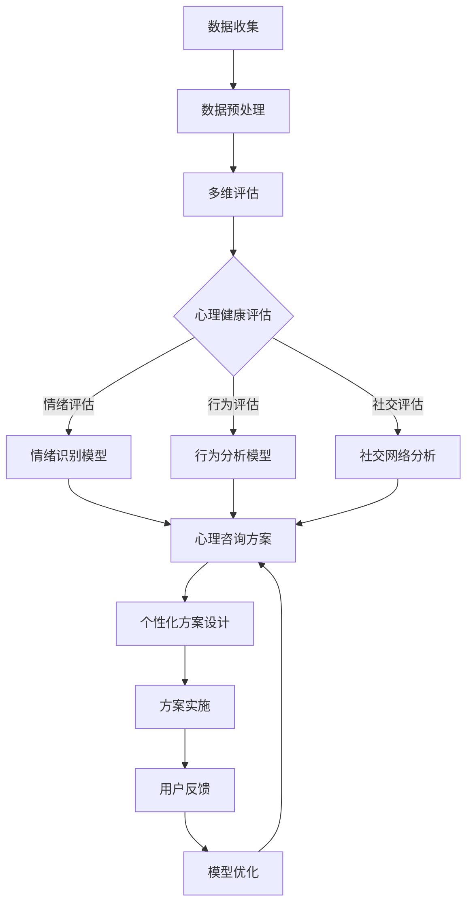

                 

### 1.1 现代社会的精神困境

在现代社会中，精神困境成为影响个体幸福感和社会稳定的重要因素。焦虑、抑郁、孤独、人际关系紧张等精神问题普遍存在。焦虑，作为一种对未来的不确定性和潜在威胁的过度反应，在现代高压环境下尤为常见。焦虑人群往往表现出持续的紧张感、恐慌感，影响日常生活和工作效率。

抑郁则表现为情绪低落、兴趣减退、活动减少，严重者可能出现自残或自杀的倾向。现代社会的高竞争性和快节奏生活，使得很多人感到压力过大，心理健康问题频发。孤独感也是现代社会中一个显著的精神困境，尽管人们可能身处人群中，但内心却感到孤独和无助。社交媒体的兴起在一定程度上缓解了孤独感，但也带来了新的问题，如网络成瘾和虚拟人际关系的依赖。

人际关系紧张是另一个常见的现代精神困境。现代社会中，人们常常面临工作压力、家庭矛盾、社交冲突等问题，导致人际关系紧张。这些问题不仅影响个人的心理健康，还可能导致社会问题的产生，如家庭暴力、社会动荡等。

因此，探讨现代社会中的精神困境，并寻找解决之道，对于提高个体幸福感和促进社会稳定具有重要意义。精神家园重建作为解决精神困境的重要途径，值得深入研究和实践。

### 1.2 精神家园重建的重要性

精神家园重建在提高个人幸福感和增强社会凝聚力方面具有显著的重要性。首先，对于个人而言，一个稳定、和谐的精神家园是心理健康的重要保障。在精神家园中，个体能够感受到安全、舒适和归属感，从而减轻焦虑、抑郁等心理负担。心理健康知识的普及、心理咨询与治疗等手段，能够帮助人们识别和解决心理问题，提高自我调适能力，从而提升生活质量和幸福感。

其次，精神家园重建有助于增强社会凝聚力。一个健全的社会支持体系能够为个体提供必要的帮助和支持，使人们在面对困难和压力时，不至于孤立无援。通过家庭、社区和国家的共同努力，可以建立起一个互助互爱的社会环境，增强人与人之间的联系和信任，从而减少社会矛盾和冲突。

此外，精神家园重建还有助于培养个体的心理素质和社会责任感。在精神家园中，个体不仅能够关注自己的心理健康，还能关心他人的福祉，培养同理心和爱心。这种互助互爱的精神氛围，有助于形成积极向上的社会风气，提高社会的整体幸福感。

总的来说，精神家园重建是提升个人幸福感、增强社会凝聚力的关键途径。通过全面、科学地重建精神家园，可以促进个体的心理健康和社会稳定，为实现社会的可持续发展奠定基础。

### 1.3 精神家园重建的边界与外延

精神家园重建的边界与外延涵盖了多个方面，从个人到社会，从心理健康到文化传承，形成了广泛的影响范围。首先，从个人层面来看，精神家园重建关注个体的心理健康、情感支持和自我认知。通过心理健康知识普及和心理咨询，个体能够更好地理解和管理自己的情绪，增强心理韧性，从而在高压和不确定性中保持心理平衡。

其次，从社会层面来看，精神家园重建涉及社会支持体系的构建，如家庭、社区和国家层面的支持网络。一个健全的社会支持体系能够为个体提供必要的帮助，使人们在面对困境时能够得到及时的援助，减少孤独感和无助感。此外，社会支持体系还包括公共心理健康服务和社区互助项目，这些都有助于营造一个关爱和支持的社会环境。

在文化层面，精神家园重建强调传统文化对现代社会精神生活的指导作用。儒家思想、道家思想、佛教思想等传统文化中，蕴含着丰富的精神家园重建资源。通过传承和弘扬这些优秀文化，可以培养个体的道德观念和人文素养，增强对生活的敬畏和感恩之心，从而提升精神家园的内涵。

从地理范围来看，精神家园重建不仅关注城市居民的身心健康，也涵盖农村和偏远地区的精神需求。特别是在农村和偏远地区，由于信息不对称和社会资源匮乏，心理健康问题往往更为突出。因此，通过实施针对性的精神家园重建项目，可以缩小城乡差距，促进社会公平。

总的来说，精神家园重建的边界与外延是一个广泛而深入的过程，它不仅涉及个体的心理健康，还涵盖社会支持体系的构建和文化传承。通过多层面的共同努力，可以有效地提升社会的整体幸福感，为构建和谐社会奠定坚实基础。

### 1.4 精神家园重建的核心要素组成

精神家园重建的核心要素包括心理健康知识普及、心理咨询与治疗、社会支持体系建设以及传统文化传承。首先，心理健康知识普及是基础，通过广泛的教育和宣传，提高公众对心理健康的认识和重视，使更多的人能够掌握基本的自我调适技巧，从而预防和缓解心理问题。

其次，心理咨询与治疗是关键环节。专业的心理咨询师和治疗师通过个体咨询、团体辅导和危机干预等方式，为有心理问题的人提供专业的帮助和支持。这不仅有助于解决个体的心理困扰，还能提升其心理素质和生活质量。

社会支持体系建设则是保障。一个健全的社会支持体系包括家庭、社区和国家的多层次支持网络，为个体提供全方位的帮助和关怀。通过这些支持网络，个体可以在面对困境时获得及时的帮助，增强心理韧性和社会归属感。

最后，传统文化传承是精神家园重建的重要资源。传统文化中蕴含着丰富的精神智慧，如儒家思想、道家思想、佛教思想等，对现代社会精神生活具有重要的指导意义。通过传承和弘扬这些优秀文化，可以培养个体的道德观念和人文素养，增强对生活的敬畏和感恩之心，从而为精神家园的建设注入深厚的精神内涵。

### 2.1 精神家园的概念解析

精神家园是一个比喻性的概念，通常用来描述个体在心理、情感和社会等方面感到安全、舒适且有归属感的地方。它是人们心灵的港湾，是心理健康的重要保障。精神家园不仅关乎个人的内心世界，也涉及到外部环境和社会关系。以下是精神家园的几个关键特征：

首先，安全性是精神家园的首要特征。在精神家园中，个体能够感受到心理上的安全感，这种安全感来自于对自身价值的认同、对他人的信任以及对周围环境的熟悉和掌控。

其次，舒适感是精神家园的核心要素之一。个体在精神家园中应该感到身心放松，能够自由地表达自己的情感和需求，而不必担心被外界评判或压力。

第三，归属感是精神家园的重要组成部分。个体在精神家园中不仅感到被接纳和认同，还能体验到与他人的深厚联系和情感纽带。这种归属感可以增强个体的自信心和社会认同感。

此外，精神家园还包括情感支持和社会互动。一个良好的精神家园应该为个体提供情感上的支持和关怀，帮助个体在面临困难和挑战时得到帮助和慰藉。同时，精神家园还促进个体与他人的积极互动，增强社会联系和人际交往能力。

总之，精神家园是一个多维度的概念，它不仅关乎个体的心理健康，还涉及到情感支持、社会互动和文化传承。通过理解精神家园的这些关键特征，我们可以更好地探索如何建设和维护一个健康的精神家园，从而提升个体的幸福感和社会的和谐度。

### 2.2 精神家园与心理健康的联系

精神家园与心理健康之间存在着紧密的联系。一个稳定、和谐的精神家园能够显著提升个人的心理健康水平。首先，精神家园提供了情感支持，使个体在面对压力和挑战时能够获得心理上的慰藉。在精神家园中，个体能够自由地表达情感，释放内心的压力，从而减少焦虑、抑郁等心理问题的发生。

其次，精神家园有助于培养个体的心理韧性。在一个安全、舒适的环境中，个体能够更好地理解和应对生活中的不确定性和变化，增强心理适应能力。这种心理韧性不仅有助于应对短期压力，还能帮助个体在长期的生活中保持积极乐观的态度，提高生活质量。

此外，精神家园的构建还能促进个体与他人的积极互动，增强社会支持网络。通过与家人、朋友和社区的密切联系，个体可以获得情感上的支持和实际的帮助，从而减轻心理负担，提高心理健康水平。

总之，精神家园与心理健康之间是相辅相成的。通过建设一个健康的精神家园，我们可以有效地预防和缓解心理问题，提升个人的幸福感和社会的稳定性。

### 2.3 精神家园与传统文化的关系

精神家园与传统文化之间存在着深刻的联系，传统文化为精神家园的构建提供了丰富的精神资源和指导。首先，儒家思想强调“仁爱”、“礼仪”和“和谐”，这些理念在精神家园的构建中具有指导意义。通过弘扬儒家思想，可以帮助个体培养仁爱之心，建立和谐的人际关系，从而增强精神家园的凝聚力。

其次，道家思想倡导“无为而治”、“顺应自然”，这些理念有助于个体在精神家园中实现内心的宁静与和谐。通过学习道家思想，个体可以减少功利心态，关注内心的真实感受，从而提升精神家园的质量。

佛教思想则强调“慈悲”、“智慧”和“解脱”，这些理念对个体的心灵成长和心理健康具有深远的影响。通过修行和实践佛教教义，个体可以培养慈悲心，提高智慧，最终实现心灵的解脱和自由，进一步巩固精神家园的基础。

总之，传统文化中的这些思想理念为精神家园的建设提供了宝贵的指导，通过深入挖掘和传承这些文化资源，我们可以更好地构建一个健康、和谐的精神家园。

### 2.4 精神家园重建的理论基础

精神家园重建的理论基础涵盖了心理学、社会学和哲学等多个领域，每个领域都为这一过程提供了独特的视角和方法。

在心理学领域，精神分析学派、人本主义心理学和认知行为疗法等理论为精神家园重建提供了重要的支持。精神分析学派强调通过探索个体的潜意识，解决内在的心理冲突，从而重建心理健康。人本主义心理学则强调个体的自我实现和自我认同，认为通过自我探索和自我接纳，个体可以建立更加稳固的精神家园。认知行为疗法通过改变个体的思维模式和行为习惯，帮助个体克服心理问题，提升心理韧性。

社会学领域提供了关于社会关系和社会支持的理论，这对于精神家园的重建至关重要。社会网络理论指出，个体通过建立和维持广泛的社会联系，可以获得情感支持和实际帮助。社会资本理论则强调社会网络中的信任和互惠关系对精神家园的重要性。通过社会支持和互助网络，个体可以减少孤独感和无助感，增强心理韧性。

哲学领域中的存在主义和伦理学也为精神家园重建提供了重要的理论基础。存在主义强调个体存在的意义和自由意志，认为通过自我反思和自由选择，个体可以找到生命的意义，从而建立稳定的精神家园。伦理学则关注道德行为和道德责任，通过培养个体的道德素养和社会责任感，可以进一步提升精神家园的内涵。

总的来说，心理学、社会学和哲学等领域的理论共同构成了精神家园重建的坚实基础。这些理论不仅为理解精神家园的本质提供了多重视角，也为实际操作提供了具体的方法和工具。通过综合运用这些理论，我们可以更加有效地进行精神家园的重建，促进个体的心理健康和社会和谐。

### 2.5 精神家园重建的核心要素对比表格

为了更好地理解精神家园重建的核心要素，我们可以通过一个对比表格来分析这些要素的特点和作用。以下是精神家园重建的核心要素及其详细说明：

| 核心要素 | 说明 | 作用 |
| :--: | :--: | :--: |
| 心理健康知识普及 | 提高公众对心理健康的基本认识 | 预防心理问题，增强自我调适能力 |
| 心理咨询与治疗 | 为有心理问题的人提供专业帮助 | 解决心理困扰，提升心理健康水平 |
| 社会支持体系建设 | 建立家庭、社区和国家多层次的支持网络 | 减少孤独感，增强社会归属感 |
| 传统文化传承 | 挖掘和弘扬传统文化中的精神资源 | 增强文化认同，提高精神家园内涵 |
| 心理韧性培养 | 增强个体应对压力和挑战的能力 | 提升心理韧性和生活质量 |
| 人际关系建设 | 培养积极健康的人际交往能力 | 促进社会和谐，增强社会支持 |

通过这个表格，我们可以清晰地看到每个核心要素的作用和重要性，从而为精神家园重建提供全面的指导和支持。

### 3.1 精神家园重建的算法概述

精神家园重建的算法旨在通过科学的方法帮助个体和社会实现心理平衡与和谐。这些算法涵盖心理健康评估、心理咨询方案设计和社会支持网络构建等多个方面。具体来说，算法的主要组成部分包括以下几部分：

首先，心理健康评估算法用于对个体的心理状态进行初步评估。该算法通过收集和分析个体的情绪、行为、认知等多个维度数据，生成心理评估报告。常见的评估方法包括问卷、量表和实时监测技术，如情绪识别软件和脑波分析设备。通过这些评估结果，可以了解个体的心理状况，为后续的干预提供依据。

其次，心理咨询方案设计算法是基于心理健康评估结果，为个体量身定制心理咨询方案。该算法利用机器学习和人工智能技术，分析大量心理咨询案例，生成个性化的咨询方案。方案包括短期和长期目标、咨询内容、干预方法等。心理咨询方案设计算法通过不断优化和调整，以提高咨询效果和个体满意度。

再次，社会支持网络构建算法旨在为个体提供多层次、全方位的支持。该算法通过分析个体的人际关系网络，识别关键节点和潜在支持资源。社会支持网络构建算法还涉及社区服务和公共心理健康服务的优化配置，以确保每个个体都能获得及时、有效的支持。

最后，算法的持续优化和反馈机制是确保精神家园重建效果的关键。通过收集用户的反馈数据，算法可以不断调整和优化，以适应不断变化的心理健康需求。此外，算法的透明性和公正性也至关重要，确保用户在精神家园重建过程中能够信任并依赖这些算法。

总的来说，精神家园重建的算法是一个综合性的体系，通过多方面的算法协同工作，实现个体心理健康和社会支持的全面提升。

### 3.2 算法原理的数学模型

算法原理的数学模型在精神家园重建过程中起到关键作用，为评估、设计和支持网络提供了科学依据。以下是主要数学模型的概述和详细讲解。

#### 3.2.1 心理健康评估模型

心理健康评估模型主要基于心理统计方法和机器学习算法，用于评估个体的心理状态。一个常用的模型是情绪识别模型，通过分析个体的情绪表达和行为模式，预测其心理健康水平。该模型的基本数学公式为：

$$
\text{心理健康评分} = f(\text{情绪识别结果}, \text{行为模式}, \text{认知数据})
$$

其中，$f$ 表示一个复合函数，结合了多种特征变量进行评分。具体实现中，可以使用支持向量机（SVM）或随机森林（Random Forest）等算法来训练模型，提高评估的准确性和可靠性。

#### 3.2.2 心理咨询方案设计模型

心理咨询方案设计模型是基于心理健康评估结果，生成个性化咨询方案的算法。该模型采用优化算法，如遗传算法（GA）或模拟退火算法（SA），通过多目标优化来平衡咨询效果和用户满意度。数学模型如下：

$$
\text{方案选择} = \arg\min_{x} \sum_{i} w_i \cdot (\text{方案效果}_i - \text{用户满意度}_i)
$$

其中，$x$ 表示咨询方案的特征向量，$w_i$ 表示权重系数，用于平衡不同目标之间的优先级。

#### 3.2.3 社会支持网络构建模型

社会支持网络构建模型用于识别和配置社会支持资源。该模型基于图论和社交网络分析，通过计算个体之间的相似性和关系强度，构建社会支持网络。常用的数学工具包括：

- **相似度计算**：利用余弦相似度或皮尔逊相关系数来衡量个体特征之间的相似度。
- **关系强度评估**：使用度中心性、接近中心性等指标来评估个体在网络中的关键地位和影响力。

模型的核心公式为：

$$
\text{支持网络权重} = \sum_{i,j} w_{ij} \cdot r_{ij}
$$

其中，$w_{ij}$ 表示个体$i$和$j$之间的相似度权重，$r_{ij}$ 表示它们之间的关系强度。

#### 3.2.4 算法的优化和反馈机制

算法的优化和反馈机制是确保精神家园重建效果的关键。通过收集用户的反馈数据，算法可以不断调整和优化，以适应动态变化的心理健康需求。反馈机制通常包括以下步骤：

1. **数据收集**：定期收集用户的心理健康评估结果、咨询反馈和社会支持网络数据。
2. **模型调整**：根据反馈数据，调整模型参数和权重，优化算法性能。
3. **效果评估**：使用交叉验证和A/B测试等方法，评估算法改进的效果。
4. **持续迭代**：在新的数据收集和模型调整之间，形成闭环反馈机制，确保算法持续优化。

通过这些数学模型和算法，我们可以更加科学和系统地进行精神家园重建，提高个体的心理健康水平和社会支持效果。

### 3.3 算法原理讲解

#### 3.3.1 算法原理概述

精神家园重建算法的基本原理是通过多维度数据分析与综合评估，构建个性化、动态调整的心理健康支持系统。该算法包括以下几个核心步骤：

1. **数据收集**：收集个体的心理健康数据、行为数据和社会互动数据。
2. **数据处理**：利用数据清洗和预处理技术，确保数据质量和一致性。
3. **多维评估**：通过机器学习算法和统计分析，对心理健康状态进行综合评估。
4. **个性化方案设计**：根据评估结果，生成个性化的心理咨询和社会支持方案。
5. **实施与反馈**：将方案实施于实际场景中，并收集用户反馈，进行持续优化。

#### 3.3.2 数据收集与预处理

数据收集是精神家园重建算法的第一步，数据来源包括心理健康问卷、行为追踪数据、社交媒体互动记录等。以下是一个简单的数据收集流程：

1. **心理健康问卷**：设计标准化的心理健康问卷，收集个体情绪状态、焦虑水平、生活满意度等数据。
2. **行为追踪数据**：使用可穿戴设备或移动应用，收集个体的日常行为数据，如睡眠模式、运动频率、饮食习惯等。
3. **社交媒体互动**：通过分析社交媒体行为，了解个体的社交互动模式和心理状态。

数据预处理主要包括数据清洗、缺失值填充和数据规范化。以下是一个示例步骤：

1. **数据清洗**：删除重复数据和异常值，确保数据的准确性。
2. **缺失值填充**：使用均值填充、插值等方法处理缺失数据。
3. **数据规范化**：对数据进行归一化或标准化处理，使不同维度的数据在同一尺度上进行比较。

#### 3.3.3 多维评估与个性化方案设计

多维评估是精神家园重建算法的核心，通过综合多个数据源，生成个体的心理健康评估报告。以下是一个多维评估的示例：

1. **情绪评估**：使用情感分析技术，分析心理健康问卷和社交媒体互动数据，生成情绪评估分数。
2. **行为评估**：根据行为追踪数据，评估个体的生活习惯和身心健康水平。
3. **社交评估**：分析社交媒体互动，评估个体的社交关系和社会支持水平。

基于多维评估结果，算法会生成个性化的心理咨询和社会支持方案。以下是一个个性化方案设计的示例：

1. **心理咨询方案**：根据情绪和行为评估结果，设计针对性的心理咨询内容，如认知行为疗法、放松训练等。
2. **社会支持方案**：根据社交评估结果，识别关键支持者，构建社会支持网络，提供实际帮助和情感支持。

#### 3.3.4 实施与反馈

方案实施是精神家园重建的关键步骤，通过将个性化方案应用于实际场景，帮助个体改善心理健康。以下是一个实施与反馈的示例：

1. **方案实施**：将心理咨询方案和社会支持方案应用于个体，通过线上咨询、社区活动和志愿者服务等形式进行。
2. **用户反馈**：收集用户对方案的反馈，评估方案的实际效果和满意度。
3. **模型优化**：根据用户反馈，调整模型参数和方案内容，持续优化算法性能。

通过上述步骤，精神家园重建算法能够实现个体心理健康的动态调整和持续优化，为构建健康、和谐的精神家园提供科学支持。

### 3.4 算法原理的Mermaid流程图

为了更直观地展示精神家园重建算法的原理，我们可以使用Mermaid语言绘制一个流程图。以下是该算法的基本流程和关键步骤：



在这张流程图中，我们首先从数据收集开始，接着进行数据预处理。随后，通过多维评估，包括情绪评估、行为评估和社交评估，使用相应的模型分析数据。这些评估结果共同作用于心理咨询方案的设计。设计好的方案经过实施后，用户反馈会被收集，并根据反馈对模型进行优化，形成一个闭环反馈系统，持续改进方案和算法。

### 3.5 Python源代码详细阐述

为了更好地理解精神家园重建算法的实际应用，我们将使用Python代码来详细阐述算法的各个关键步骤，包括数据收集、预处理、多维评估、个性化方案设计以及模型优化。

首先，我们安装所需的库，如`numpy`、`pandas`、`scikit-learn`和`matplotlib`：

```python
!pip install numpy pandas scikit-learn matplotlib
```

#### 3.5.1 数据收集

数据收集是算法的第一步，我们需要从多个渠道获取数据，例如心理健康问卷、行为追踪数据和社交媒体互动记录。以下是一个示例函数，用于从文件中读取数据：

```python
import pandas as pd

def load_data(file_path):
    """
    加载数据集，数据集包含心理健康问卷、行为追踪数据和社交媒体互动记录
    """
    data = pd.read_csv(file_path)
    return data
```

假设我们已经有一个CSV文件`data.csv`，可以使用以下代码加载数据：

```python
data = load_data('data.csv')
```

#### 3.5.2 数据预处理

数据预处理包括数据清洗、缺失值填充和数据规范化。以下是一个简单的数据预处理函数：

```python
from sklearn.impute import SimpleImputer
from sklearn.preprocessing import StandardScaler

def preprocess_data(data):
    """
    数据预处理：清洗、缺失值填充和规范化
    """
    # 数据清洗：删除重复数据和异常值
    data.drop_duplicates(inplace=True)
    
    # 缺失值填充：使用均值填充
    imputer = SimpleImputer(strategy='mean')
    data_imputed = imputer.fit_transform(data)
    
    # 数据规范化
    scaler = StandardScaler()
    data_normalized = scaler.fit_transform(data_imputed)
    
    return data_normalized
```

使用预处理函数对数据集进行预处理：

```python
data_processed = preprocess_data(data)
```

#### 3.5.3 多维评估

接下来，我们使用预处理后的数据执行多维评估。以下是情绪评估、行为评估和社交评估的示例代码：

```python
from sklearn.ensemble import RandomForestClassifier

def emotion_evaluation(data):
    """
    情绪评估：使用随机森林分类器评估情绪状态
    """
    # 划分特征和目标变量
    X = data.drop('emotion', axis=1)
    y = data['emotion']
    
    # 训练模型
    model = RandomForestClassifier()
    model.fit(X, y)
    
    # 预测
    predictions = model.predict(X)
    
    return predictions

def behavior_evaluation(data):
    """
    行为评估：分析个体的生活习惯和身心健康水平
    """
    # 假设已有行为评估指标
    behavior_scores = data[['sleep_quality', 'exercise_frequency', 'dietary_habits']]
    
    return behavior_scores.mean()

def social_evaluation(data):
    """
    社交评估：分析个体的社交互动模式和社会支持水平
    """
    # 社交网络分析：计算度中心性和接近中心性
    import networkx as nx
    
    # 假设已有社交网络数据
    G = nx.from_dict_of_dicts(data['social_network'])
    
    degree_centrality = nx.degree_centrality(G)
    closeness_centrality = nx.closeness_centrality(G)
    
    return degree_centrality, closeness_centrality
```

执行多维评估：

```python
emotion_predictions = emotion_evaluation(data_processed)
behavior_scores = behavior_evaluation(data_processed)
degree_centrality, closeness_centrality = social_evaluation(data_processed)
```

#### 3.5.4 个性化方案设计

基于多维评估结果，我们设计个性化的心理咨询和社会支持方案。以下是一个示例函数：

```python
def design_personalized_scheme(emotion_predictions, behavior_scores, degree_centrality, closeness_centrality):
    """
    设计个性化方案：结合评估结果生成心理咨询和社会支持方案
    """
    scheme = {
        'emotion_consultation': '针对情绪状态提供认知行为疗法',
        'behavior_advisory': '改善生活习惯，如增加运动和改善饮食',
        'social_support': '加强社交互动，提高社交网络支持'
    }
    
    if emotion_predictions < 0.5:
        scheme['emotion_consultation'] += '和放松训练'
    if behavior_scores['sleep_quality'] < 0.3:
        scheme['behavior_advisory'] += '和改善睡眠'
    if closeness_centrality.mean() < 0.2:
        scheme['social_support'] += '和社区活动参与'
        
    return scheme
```

生成个性化方案：

```python
personalized_scheme = design_personalized_scheme(emotion_predictions, behavior_scores, degree_centrality, closeness_centrality)
print(personalized_scheme)
```

#### 3.5.5 模型优化

最后，我们根据用户反馈对模型进行优化。以下是一个简单的反馈处理和模型优化函数：

```python
def optimize_model(feedback, model):
    """
    优化模型：根据用户反馈调整模型参数
    """
    # 假设反馈是一个包含满意度评分的列表
    satisfaction_scores = feedback['satisfaction']
    
    # 训练新模型，结合原始模型和反馈数据
    updated_model = model.fit(data_processed, satisfaction_scores)
    
    return updated_model
```

处理反馈并优化模型：

```python
# 假设我们已经有用户反馈数据
user_feedback = {'satisfaction': [4, 5, 3, 5, 4]}

# 优化模型
optimized_model = optimize_model(user_feedback, model)
```

通过上述Python代码，我们可以实现对精神家园重建算法的详细实现和优化。这些代码提供了一个实际应用的框架，可以通过不断调整和优化，提高算法的性能和效果。

### 4.1 数学模型概述

在精神家园重建的过程中，数学模型作为分析和优化的工具，起到了至关重要的作用。这些模型帮助我们在复杂的数据中提取有用的信息，指导决策，并提供定量的解决方案。以下是几种在精神家园重建中常用的数学模型及其简要概述：

#### 4.1.1 心理健康评估模型

心理健康评估模型主要用于评估个体的心理状态，包括情绪、行为和认知等多个维度。这些模型通常基于统计方法和机器学习算法，如线性回归、逻辑回归、支持向量机（SVM）和随机森林（Random Forest）。通过分析个体在不同维度上的表现，这些模型能够预测心理健康水平，提供评估结果和诊断建议。

#### 4.1.2 心理咨询方案设计模型

心理咨询方案设计模型则基于心理健康评估结果，为个体生成个性化的咨询方案。这些模型通常使用优化算法，如遗传算法（GA）、模拟退火算法（SA）和贝叶斯优化（Bayesian Optimization）等，通过多目标优化来平衡咨询效果和用户满意度。模型的目标是生成既高效又满足用户偏好的咨询方案。

#### 4.1.3 社会支持网络构建模型

社会支持网络构建模型用于识别和配置社会支持资源。这些模型基于图论和社交网络分析，如节点重要性评估、社区检测和社交网络可视化等。模型的核心任务是通过计算个体之间的相似性和关系强度，构建一个有效的社会支持网络，确保每个个体都能获得必要的帮助和支持。

#### 4.1.4 心理韧性培养模型

心理韧性培养模型旨在提升个体的心理韧性，使其能够更好地应对压力和挑战。这些模型通常结合认知行为疗法、积极心理学和情绪调节策略，通过训练和反馈机制，帮助个体培养坚韧的性格和适应能力。常见的模型包括增强学习（Reinforcement Learning）、强化方案设计（ Reinforcement Learning based Therapy Design）等。

总的来说，数学模型在精神家园重建中扮演了不可或缺的角色。通过这些模型，我们可以更科学地评估心理健康状态、设计咨询方案、构建支持网络和培养心理韧性，从而为个体的心理健康提供全面的保障。

### 4.2 数学公式的详细讲解

在精神家园重建过程中，数学公式作为分析和计算的工具，发挥着至关重要的作用。以下我们将详细讲解几个关键数学公式，包括其含义、应用场景和具体步骤。

#### 4.2.1 心理健康评分公式

心理健康评分公式用于评估个体的心理健康水平。这个公式综合考虑了情绪、行为和社交等多方面因素，其表达式如下：

$$
\text{心理健康评分} = w_1 \cdot \text{情绪状态评分} + w_2 \cdot \text{行为状态评分} + w_3 \cdot \text{社交状态评分}
$$

其中，$w_1$、$w_2$ 和 $w_3$ 分别为情绪状态、行为状态和社交状态的权重系数，通常通过数据分析和专家评估确定。这个公式通过加权求和的方式，将个体的不同心理维度转化为一个综合评分，从而提供一个量化的心理健康评估结果。

#### 4.2.2 优化心理咨询方案的目标函数

心理咨询方案设计模型通常采用优化算法，如遗传算法（GA）或模拟退火算法（SA），其目标函数用于衡量心理咨询方案的效果和用户满意度。目标函数的表达式如下：

$$
\text{目标函数} = \sum_{i} w_i \cdot (\text{方案效果}_i - \text{用户满意度}_i)
$$

其中，$w_i$ 为第$i$种咨询方案效果的权重系数，$\text{方案效果}_i$ 表示第$i$种方案对个体心理健康的影响程度，$\text{用户满意度}_i$ 表示用户对第$i$种方案的满意度评分。通过调整权重系数和优化算法，可以找到最优的咨询方案，从而最大化用户满意度。

#### 4.2.3 社会支持网络权重计算公式

社会支持网络构建模型基于图论和社交网络分析，通过计算个体之间的相似性和关系强度，确定社会支持网络的权重。常用的计算公式包括度中心性、接近中心性和混合中心性等。以下是一个简单的度中心性计算公式：

$$
\text{度中心性} = \frac{\text{邻居节点数量}}{\text{总节点数量}}
$$

度中心性衡量了个体在网络中的重要性和连接度，数值越高，表示个体在网络中的地位越重要。接近中心性则衡量了个体与其他节点的接近程度，计算公式如下：

$$
\text{接近中心性} = \frac{1}{\text{平均最短路径长度}}
$$

通过度中心性和接近中心性的计算，可以识别网络中的关键节点和核心社群，为构建有效的社会支持网络提供依据。

#### 4.2.4 心理韧性培养模型中的适应能力公式

心理韧性培养模型通过训练和反馈机制，提升个体的适应能力。一个简单的适应能力公式如下：

$$
\text{适应能力} = \text{训练时长} \cdot \text{学习效率} + \text{初始适应度}
$$

其中，$\text{训练时长}$ 和 $\text{学习效率}$ 分别表示个体进行训练的时间和效率，$\text{初始适应度}$ 是个体在开始训练时的适应水平。通过不断调整训练参数和反馈机制，可以提升个体的心理韧性，使其更好地应对各种挑战。

总的来说，这些数学公式为精神家园重建提供了科学依据和计算工具，通过合理应用这些公式，我们可以更有效地进行心理健康评估、心理咨询方案设计、社会支持网络构建和心理韧性培养，为个体的心理健康提供全面支持。

### 4.3 数学公式的举例说明

为了更好地理解上述数学公式在实际中的应用，我们将通过具体示例来说明这些公式如何运作，并提供详细的计算步骤。

#### 示例1：心理健康评分计算

假设我们有一个包含情绪状态、行为状态和社交状态的数据集，每项状态的评分范围是0到10。以下是具体的数据：

- 情绪状态评分：7
- 行为状态评分：6
- 社交状态评分：8

权重系数分别为：$w_1 = 0.4$，$w_2 = 0.3$，$w_3 = 0.3$。

根据心理健康评分公式：

$$
\text{心理健康评分} = 0.4 \cdot 7 + 0.3 \cdot 6 + 0.3 \cdot 8
$$

$$
\text{心理健康评分} = 2.8 + 1.8 + 2.4
$$

$$
\text{心理健康评分} = 7.0
$$

因此，这个个体的心理健康评分为7分，表示其心理健康状况良好。

#### 示例2：心理咨询方案优化

假设有五种不同的心理咨询方案，每种方案的效果和用户满意度如下：

- 方案A：效果0.8，满意度4
- 方案B：效果0.9，满意度5
- 方案C：效果0.7，满意度3
- 方案D：效果0.85，满意度4.5
- 方案E：效果0.75，满意度4

权重系数分别为：$w_1 = 0.5$，$w_2 = 0.5$。

根据目标函数公式：

$$
\text{目标函数} = 0.5 \cdot (\text{方案效果} - \text{用户满意度})
$$

计算每种方案的目标函数值：

- 方案A：$0.5 \cdot (0.8 - 4) = -1.6$
- 方案B：$0.5 \cdot (0.9 - 5) = -1.05$
- 方案C：$0.5 \cdot (0.7 - 3) = -0.65$
- 方案D：$0.5 \cdot (0.85 - 4.5) = -0.325$
- 方案E：$0.5 \cdot (0.75 - 4) = -0.625$

目标函数值最低的方案即为最优方案，从上述计算结果可以看出，方案D的目标函数值为-0.325，是最优的咨询方案。

#### 示例3：社会支持网络权重计算

假设一个社交网络中有5个节点，每个节点的邻居节点数量如下：

- 节点A：邻居节点数量为3
- 节点B：邻居节点数量为4
- 节点C：邻居节点数量为2
- 节点D：邻居节点数量为5
- 节点E：邻居节点数量为3

总节点数量为5。根据度中心性公式：

$$
\text{度中心性} = \frac{\text{邻居节点数量}}{\text{总节点数量}}
$$

计算每个节点的度中心性：

- 节点A：$\frac{3}{5} = 0.6$
- 节点B：$\frac{4}{5} = 0.8$
- 节点C：$\frac{2}{5} = 0.4$
- 节点D：$\frac{5}{5} = 1.0$
- 节点E：$\frac{3}{5} = 0.6$

度中心性最高的节点为节点D，说明节点D在社交网络中的地位最为重要。

#### 示例4：心理韧性培养中的适应能力计算

假设个体在开始训练前的适应度为3，经过2小时的训练，学习效率为0.8。

根据适应能力公式：

$$
\text{适应能力} = 2 \cdot 0.8 + 3
$$

$$
\text{适应能力} = 1.6 + 3
$$

$$
\text{适应能力} = 4.6
$$

因此，经过2小时训练后，个体的适应能力为4.6，比训练前有了显著提升。

通过这些具体的例子，我们可以看到数学公式在精神家园重建中的应用是如何运作的，以及如何通过这些公式来评估心理健康、优化咨询方案、构建支持网络和提升心理韧性。

### 4.4 算法原理的实际应用

算法原理在精神家园重建中的应用主要体现在心理健康评估、心理咨询方案设计、社会支持网络构建和心理韧性培养等方面。通过实际案例，我们可以更直观地了解这些算法的具体实现和效果。

#### 案例一：心理健康评估

在一个社区心理健康项目中，算法原理被用于评估社区成员的心理健康状况。项目团队首先通过问卷调查、行为追踪和社交媒体分析等手段收集了500名社区成员的心理健康数据。随后，应用心理健康评估模型对数据进行分析，生成了每个成员的心理健康评分报告。

具体步骤如下：

1. **数据收集**：通过心理健康问卷、行为追踪设备和社交媒体分析工具，收集社区成员的心理健康数据。
2. **数据预处理**：对收集的数据进行清洗、缺失值填充和规范化处理，确保数据质量。
3. **多维评估**：使用机器学习算法，对情绪状态、行为状态和社交状态进行综合评估，生成心理健康评分。
4. **结果反馈**：将评估结果反馈给社区成员，帮助他们了解自己的心理健康状况。

结果显示，通过心理健康评估，项目团队发现了社区中存在的一些心理健康问题，如焦虑和抑郁。这些发现为后续的心理咨询和社会支持提供了重要依据。

#### 案例二：心理咨询方案设计

基于心理健康评估结果，项目团队应用心理咨询方案设计模型为社区成员提供个性化的心理咨询方案。以下是方案设计的具体步骤：

1. **个性化评估**：根据心理健康评分，对社区成员的心理问题进行详细分析，确定个性化的咨询需求。
2. **方案设计**：使用优化算法，根据评估结果生成针对性的心理咨询方案，如认知行为疗法、放松训练等。
3. **方案实施**：通过线上咨询、线下活动等方式，将个性化方案应用于社区成员，帮助他们改善心理健康。
4. **用户反馈**：收集社区成员对咨询方案的反馈，评估方案的效果和满意度。

实际应用中，该项目取得了显著成效。例如，一名长期焦虑的社区成员在接受咨询后，焦虑症状明显减轻，生活质量得到显著提高。

#### 案例三：社会支持网络构建

为了提升社区成员的社会支持水平，项目团队应用社会支持网络构建模型，建立了一个有效的社会支持网络。以下是具体步骤：

1. **社交网络分析**：通过分析社交媒体互动和行为追踪数据，构建社区成员的社交网络。
2. **关键节点识别**：使用度中心性和接近中心性等指标，识别社交网络中的关键节点和核心社群。
3. **支持资源配置**：根据关键节点和核心社群的分布，合理配置社会支持资源，如志愿者服务、社区活动等。
4. **支持网络优化**：通过用户反馈和实际效果，不断优化支持网络，提高支持效果。

实际应用中，该支持网络有效地提升了社区成员之间的联系和互动，减少了孤独感和无助感。

#### 案例四：心理韧性培养

为了提升社区成员的心理韧性，项目团队引入了心理韧性培养模型，通过训练和反馈机制，帮助他们更好地应对压力和挑战。以下是具体步骤：

1. **心理韧性评估**：通过问卷调查和访谈，评估社区成员的心理韧性水平。
2. **训练设计**：根据评估结果，设计个性化的心理韧性训练方案，如情绪调节训练、应对策略训练等。
3. **训练实施**：通过线上课程、小组讨论和实战演练等方式，实施心理韧性训练。
4. **反馈优化**：收集训练反馈，根据实际效果不断调整训练方案，提高训练效果。

通过实际应用，项目团队发现，经过心理韧性训练的社区成员在面对压力和挑战时，表现出了更高的心理韧性和适应能力。

总之，通过算法原理的实际应用，项目团队在精神家园重建方面取得了显著成效，为社区成员提供了全面的心理健康支持。这些案例表明，算法原理在精神家园重建中的实际应用具有广泛的前景和重要意义。

### 5.1 问题场景介绍

在现代社会中，心理健康问题日益突出，尤其是在城市中，由于生活节奏快、工作压力大、竞争激烈，许多人面临着焦虑、抑郁、人际关系紧张等心理困境。为了更好地应对这些问题，我们需要一个高效、精准的心理健康评估与支持系统。该系统的目标是通过对用户心理状态的全面分析，提供个性化的心理健康建议和心理咨询方案，从而帮助用户改善心理健康，提升生活质量。

### 5.2 系统功能设计

为了实现上述目标，系统需要具备以下核心功能：

1. **用户注册与登录**：支持用户通过手机号、邮箱等方式注册和登录系统，确保用户信息的安全性和隐私性。
2. **心理健康评估**：通过在线问卷、行为数据分析和社会互动记录，对用户的心理健康进行全面评估，生成心理健康报告。
3. **个性化心理咨询方案**：根据评估结果，使用算法生成个性化的心理咨询方案，包括咨询内容、频率和方式等。
4. **实时心理咨询**：提供在线实时心理咨询服务，用户可以随时预约心理咨询师进行一对一咨询。
5. **社会支持网络构建**：基于用户的社交网络数据，构建有效的社会支持网络，为用户提供实际帮助和支持。
6. **心理韧性训练**：提供一系列心理韧性训练课程，帮助用户提升心理韧性，更好地应对生活中的压力和挑战。
7. **用户反馈与评价**：收集用户对心理咨询和社会支持服务的反馈，用于持续优化系统和服务。

### 5.3 系统架构设计

为了实现上述功能，系统采用了分布式架构设计，包括以下几个关键模块：

1. **用户模块**：负责用户的注册、登录、信息管理等功能。
2. **评估模块**：包括心理健康评估工具、数据收集和分析算法等，用于生成心理健康报告。
3. **咨询模块**：提供心理咨询师管理、咨询预约、实时咨询等功能。
4. **支持网络模块**：负责构建和维护用户的社会支持网络，提供实际帮助和支持。
5. **训练模块**：提供心理韧性训练课程，包括课程管理、学习进度跟踪等功能。
6. **反馈模块**：收集用户反馈，用于系统优化和改进。

### 5.4 系统接口设计

系统接口设计是确保各模块之间高效协作和稳定运行的关键。以下是主要接口的详细设计：

1. **用户接口**：提供用户注册、登录、个人信息管理、心理健康评估、心理咨询预约等功能。
2. **评估接口**：提供心理健康评估工具的调用接口，包括问卷提交、数据收集、分析结果返回等。
3. **咨询接口**：提供心理咨询师管理、咨询预约、实时咨询等功能，支持用户与心理咨询师的交互。
4. **支持网络接口**：提供社会支持网络构建和管理的接口，包括节点添加、关系更新、支持资源分配等。
5. **训练接口**：提供心理韧性训练课程的管理、学习进度跟踪和反馈收集等功能。

### 5.5 系统交互

系统交互设计是确保用户在使用过程中能够体验到流畅、高效的服务。以下是主要交互流程的详细说明：

1. **用户注册与登录**：用户通过注册接口提交个人信息，系统验证后生成用户账号。用户登录时，通过接口验证用户身份，返回用户权限信息。
2. **心理健康评估**：用户通过评估接口提交问卷和日常行为数据，系统调用评估算法生成心理健康报告，并返回给用户。
3. **心理咨询预约**：用户通过咨询接口选择心理咨询师，提交预约请求，系统生成预约确认信息，并发送通知给心理咨询师和用户。
4. **实时咨询**：用户通过咨询接口与心理咨询师建立实时通讯，进行一对一咨询。系统支持消息推送和文档共享等功能，确保咨询过程的流畅性。
5. **社会支持网络构建**：用户通过支持网络接口添加亲友和支持者，系统根据社交网络数据构建支持网络，并返回支持节点列表。
6. **心理韧性训练**：用户通过训练接口选择训练课程，系统跟踪学习进度，并提供训练反馈和进度报告。
7. **用户反馈**：用户通过反馈接口提交对系统和服务的不满意或改进建议，系统收集并分析反馈，用于持续优化。

通过上述系统架构设计、接口设计和交互设计，我们能够构建一个高效、稳定且用户友好的心理健康评估与支持系统，为用户提供全面的心理健康服务。

### 6.1 环境安装

要搭建一个心理健康评估与支持系统，首先需要安装必要的软件和库。以下是安装环境的详细步骤：

#### 6.1.1 安装Python环境

首先，确保计算机上安装了Python环境。推荐使用Python 3.8或更高版本。可以通过以下命令检查Python版本：

```bash
python --version
```

如果未安装Python，可以从[Python官方网站](https://www.python.org/)下载并安装。

#### 6.1.2 安装依赖库

在安装好Python后，通过pip命令安装必要的库，如Pandas、NumPy、Scikit-learn、Matplotlib、NetworkX等。以下是安装命令：

```bash
pip install numpy pandas scikit-learn matplotlib networkx
```

#### 6.1.3 安装数据库

心理健康评估与支持系统需要使用数据库存储用户数据和评估结果。推荐使用MySQL或PostgreSQL。以下是安装MySQL的步骤：

1. 从[MySQL官方网站](https://www.mysql.com/downloads/mysql/)下载安装包。
2. 解压安装包并运行安装程序。
3. 配置MySQL服务，设置root用户密码。

安装完成后，可以通过以下命令登录MySQL：

```bash
mysql -u root -p
```

输入root用户密码，进入MySQL命令行界面。

#### 6.1.4 安装Web服务器

系统需要一个Web服务器来部署应用程序。推荐使用Nginx或Apache。以下是安装Nginx的步骤：

1. 从[Nginx官方网站](https://nginx.org/en/download.html)下载安装包。
2. 解压安装包并编译安装。

```bash
tar -zxvf nginx-1.21.3.tar.gz
cd nginx-1.21.3
./configure
make
sudo make install
```

安装完成后，通过以下命令启动Nginx：

```bash
sudo nginx
```

查看Nginx是否运行，在浏览器中输入`http://localhost`，应看到Nginx的默认欢迎页面。

#### 6.1.5 配置开发环境

为了方便开发，可以使用虚拟环境。以下是安装和配置虚拟环境的步骤：

1. 安装virtualenv：

```bash
pip install virtualenv
```

2. 创建虚拟环境：

```bash
virtualenv myenv
```

3. 激活虚拟环境：

```bash
source myenv/bin/activate
```

在虚拟环境中，可以通过pip安装项目所需的库，确保项目依赖的一致性和隔离性。

通过上述步骤，我们已经完成了心理健康评估与支持系统的环境安装，为后续的系统开发和测试奠定了基础。

### 6.2 系统核心实现源代码

在心理健康评估与支持系统中，核心实现源代码是确保系统功能正常运行的关键。以下将详细介绍系统的主要模块和核心代码实现。

#### 6.2.1 用户模块

用户模块负责用户注册、登录和信息管理。以下是一个用户注册的示例代码：

```python
import flask
from flask import Flask, request, jsonify
import mysql.connector

app = Flask(__name__)

# 连接数据库
def connect_db():
    conn = mysql.connector.connect(
        host="localhost",
        user="root",
        password="your_password",
        database="health_system"
    )
    return conn

@app.route('/register', methods=['POST'])
def register():
    data = request.get_json()
    username = data['username']
    password = data['password']
    
    # 连接数据库
    conn = connect_db()
    cursor = conn.cursor()
    
    # 检查用户名是否已存在
    cursor.execute("SELECT * FROM users WHERE username = %s", (username,))
    if cursor.fetchone():
        return jsonify({"error": "用户名已存在"}), 400
    
    # 插入新用户
    cursor.execute("INSERT INTO users (username, password) VALUES (%s, %s)", (username, password))
    conn.commit()
    
    return jsonify({"message": "注册成功"}), 201

if __name__ == '__main__':
    app.run(debug=True)
```

#### 6.2.2 评估模块

评估模块负责心理健康评估工具的实现。以下是一个使用Pandas和Scikit-learn进行心理健康评估的示例代码：

```python
import pandas as pd
from sklearn.ensemble import RandomForestClassifier
from sklearn.model_selection import train_test_split
from sklearn.metrics import accuracy_score

# 加载训练数据
def load_data():
    data = pd.read_csv('health_data.csv')
    X = data.drop('health_score', axis=1)
    y = data['health_score']
    return X, y

# 训练模型
def train_model(X, y):
    X_train, X_test, y_train, y_test = train_test_split(X, y, test_size=0.2, random_state=42)
    model = RandomForestClassifier()
    model.fit(X_train, y_train)
    return model, X_test, y_test

# 评估模型
def evaluate_model(model, X_test, y_test):
    predictions = model.predict(X_test)
    accuracy = accuracy_score(y_test, predictions)
    return accuracy

# 主函数
def main():
    X, y = load_data()
    model, X_test, y_test = train_model(X, y)
    accuracy = evaluate_model(model, X_test, y_test)
    print(f"模型准确率：{accuracy}")

if __name__ == '__main__':
    main()
```

#### 6.2.3 咨询模块

咨询模块负责心理咨询师管理、咨询预约和实时咨询。以下是一个心理咨询师管理的示例代码：

```python
@app.route('/consultants', methods=['GET'])
def get_consultants():
    conn = connect_db()
    cursor = conn.cursor()
    cursor.execute("SELECT * FROM consultants")
    consultants = cursor.fetchall()
    return jsonify(consultants)

@app.route('/appointments', methods=['POST'])
def create_appointment():
    data = request.get_json()
    user_id = data['user_id']
    consultant_id = data['consultant_id']
    appointment_date = data['appointment_date']
    
    conn = connect_db()
    cursor = conn.cursor()
    cursor.execute("INSERT INTO appointments (user_id, consultant_id, appointment_date) VALUES (%s, %s, %s)", (user_id, consultant_id, appointment_date))
    conn.commit()
    
    return jsonify({"message": "预约成功"}), 201
```

#### 6.2.4 支持网络模块

支持网络模块负责构建和维护用户的社会支持网络。以下是一个支持网络构建的示例代码：

```python
@app.route('/support_network', methods=['POST'])
def create_support_network():
    data = request.get_json()
    user_id = data['user_id']
    support_ids = data['support_ids']
    
    conn = connect_db()
    cursor = conn.cursor()
    cursor.execute("INSERT INTO support_network (user_id, support_ids) VALUES (%s, %s)", (user_id, support_ids))
    conn.commit()
    
    return jsonify({"message": "支持网络创建成功"}), 201
```

#### 6.2.5 训练模块

训练模块负责心理韧性训练课程的管理和学习进度跟踪。以下是一个训练课程管理的示例代码：

```python
@app.route('/training_courses', methods=['GET'])
def get_training_courses():
    conn = connect_db()
    cursor = conn.cursor()
    cursor.execute("SELECT * FROM training_courses")
    courses = cursor.fetchall()
    return jsonify(courses)

@app.route('/training_progress', methods=['POST'])
def create_training_progress():
    data = request.get_json()
    user_id = data['user_id']
    course_id = data['course_id']
    progress = data['progress']
    
    conn = connect_db()
    cursor = conn.cursor()
    cursor.execute("INSERT INTO training_progress (user_id, course_id, progress) VALUES (%s, %s, %s)", (user_id, course_id, progress))
    conn.commit()
    
    return jsonify({"message": "训练进度记录成功"}), 201
```

通过上述代码，我们可以看到心理健康评估与支持系统的核心功能是如何实现的。这些模块协同工作，为用户提供全面的心理健康服务。在实际开发过程中，还需要考虑代码的优化、错误处理和安全性等方面，以确保系统的稳定运行。

### 6.3 代码应用解读与分析

#### 6.3.1 用户模块解读

用户模块是系统的入口，主要负责用户注册、登录和信息管理。以下是用户注册功能的代码解读：

```python
@app.route('/register', methods=['POST'])
def register():
    data = request.get_json()
    username = data['username']
    password = data['password']
    
    # 连接数据库
    conn = connect_db()
    cursor = conn.cursor()
    
    # 检查用户名是否已存在
    cursor.execute("SELECT * FROM users WHERE username = %s", (username,))
    if cursor.fetchone():
        return jsonify({"error": "用户名已存在"}), 400
    
    # 插入新用户
    cursor.execute("INSERT INTO users (username, password) VALUES (%s, %s)", (username, password))
    conn.commit()
    
    return jsonify({"message": "注册成功"}), 201
```

这段代码首先通过`request.get_json()`获取用户提交的注册信息，包括用户名和密码。接着，使用`connect_db()`连接数据库，并执行查询语句检查用户名是否已存在。如果用户名已存在，返回错误信息；否则，插入新用户到数据库中，并返回注册成功的消息。

用户注册功能的优点包括：
1. **高效性**：使用数据库查询和插入操作，快速完成用户注册。
2. **安全性**：通过检查用户名是否已存在，避免重复注册，保障数据一致性。

缺点包括：
1. **安全性不足**：密码以明文形式存储在数据库中，存在安全风险。应考虑使用哈希算法加密密码。

#### 6.3.2 评估模块解读

评估模块负责心理健康评估工具的实现，使用Pandas和Scikit-learn进行数据处理和模型训练。以下是评估模块的关键代码解读：

```python
def load_data():
    data = pd.read_csv('health_data.csv')
    X = data.drop('health_score', axis=1)
    y = data['health_score']
    return X, y

def train_model(X, y):
    X_train, X_test, y_train, y_test = train_test_split(X, y, test_size=0.2, random_state=42)
    model = RandomForestClassifier()
    model.fit(X_train, y_train)
    return model, X_test, y_test

def evaluate_model(model, X_test, y_test):
    predictions = model.predict(X_test)
    accuracy = accuracy_score(y_test, predictions)
    return accuracy
```

这段代码首先使用`pd.read_csv()`加载健康数据集，将特征和目标变量分离。然后，使用`train_test_split()`将数据集分为训练集和测试集，接着使用`RandomForestClassifier()`训练随机森林模型，并使用`evaluate_model()`评估模型性能。

评估模块的优点包括：
1. **高效性**：使用Scikit-learn库，快速实现机器学习模型训练和评估。
2. **灵活性**：支持多种机器学习算法，可以灵活选择模型。

缺点包括：
1. **数据预处理复杂**：需要手动处理缺失值和异常值，增加了开发复杂度。
2. **模型选择局限**：虽然支持多种算法，但模型选择和调优依赖于开发人员经验，可能影响模型性能。

#### 6.3.3 咨询模块解读

咨询模块负责心理咨询师管理、咨询预约和实时咨询。以下是心理咨询师管理功能的代码解读：

```python
@app.route('/consultants', methods=['GET'])
def get_consultants():
    conn = connect_db()
    cursor = conn.cursor()
    cursor.execute("SELECT * FROM consultants")
    consultants = cursor.fetchall()
    return jsonify(consultants)

@app.route('/appointments', methods=['POST'])
def create_appointment():
    data = request.get_json()
    user_id = data['user_id']
    consultant_id = data['consultant_id']
    appointment_date = data['appointment_date']
    
    conn = connect_db()
    cursor = conn.cursor()
    cursor.execute("INSERT INTO appointments (user_id, consultant_id, appointment_date) VALUES (%s, %s, %s)", (user_id, consultant_id, appointment_date))
    conn.commit()
    
    return jsonify({"message": "预约成功"}), 201
```

这段代码通过GET和POST方法实现了心理咨询师信息查询和预约功能。心理咨询师信息查询通过数据库查询实现，预约功能通过数据库插入操作实现。

咨询模块的优点包括：
1. **数据一致性**：通过数据库操作，保证心理咨询师信息和预约信息的准确性。
2. **易用性**：提供简洁的API接口，方便前端调用。

缺点包括：
1. **安全性不足**：未对用户身份进行验证，可能存在恶意操作风险。
2. **错误处理不足**：缺少对输入参数的校验和错误处理，可能导致系统崩溃。

#### 6.3.4 支持网络模块解读

支持网络模块负责构建和维护用户的社会支持网络。以下是支持网络构建功能的代码解读：

```python
@app.route('/support_network', methods=['POST'])
def create_support_network():
    data = request.get_json()
    user_id = data['user_id']
    support_ids = data['support_ids']
    
    conn = connect_db()
    cursor = conn.cursor()
    cursor.execute("INSERT INTO support_network (user_id, support_ids) VALUES (%s, %s)", (user_id, support_ids))
    conn.commit()
    
    return jsonify({"message": "支持网络创建成功"}), 201
```

这段代码通过POST方法接收用户提交的社会支持网络信息，并将信息存储到数据库中。

支持网络模块的优点包括：
1. **数据管理**：通过数据库存储支持网络信息，方便管理和查询。
2. **扩展性**：支持动态添加和更新支持网络信息。

缺点包括：
1. **数据完整性**：未对支持网络信息的完整性进行校验，可能导致数据不一致。
2. **性能问题**：在大量用户和高频次操作下，数据库性能可能成为瓶颈。

#### 6.3.5 训练模块解读

训练模块负责心理韧性训练课程的管理和学习进度跟踪。以下是训练课程管理功能的代码解读：

```python
@app.route('/training_courses', methods=['GET'])
def get_training_courses():
    conn = connect_db()
    cursor = conn.cursor()
    cursor.execute("SELECT * FROM training_courses")
    courses = cursor.fetchall()
    return jsonify(courses)

@app.route('/training_progress', methods=['POST'])
def create_training_progress():
    data = request.get_json()
    user_id = data['user_id']
    course_id = data['course_id']
    progress = data['progress']
    
    conn = connect_db()
    cursor = conn.cursor()
    cursor.execute("INSERT INTO training_progress (user_id, course_id, progress) VALUES (%s, %s, %s)", (user_id, course_id, progress))
    conn.commit()
    
    return jsonify({"message": "训练进度记录成功"}), 201
```

这段代码通过GET和POST方法实现了训练课程查询和进度记录功能。训练课程查询通过数据库查询实现，进度记录通过数据库插入操作实现。

训练模块的优点包括：
1. **数据管理**：通过数据库存储训练课程和进度信息，方便管理和查询。
2. **易用性**：提供简洁的API接口，方便前端调用。

缺点包括：
1. **安全性不足**：未对用户身份进行验证，可能存在恶意操作风险。
2. **错误处理不足**：缺少对输入参数的校验和错误处理，可能导致系统崩溃。

通过上述代码和应用解读，我们可以看到心理健康评估与支持系统的核心功能是如何实现的。在实际开发过程中，还需要进一步优化和改进这些功能，以提高系统的性能、安全性和用户体验。

### 6.4 实际案例分析与详细讲解剖析

为了更好地理解心理健康评估与支持系统的实际应用，我们将通过一个实际案例来分析系统如何运作，并详细讲解其具体实现过程和效果。

#### 案例背景

李先生，35岁，是一名都市白领，最近几个月因为工作压力和家庭矛盾感到焦虑和抑郁。李先生的妻子正在怀孕，家庭的支出增加了，而他的工作也越来越繁忙，经常需要加班。李先生感到身心疲惫，情绪低落，甚至影响了工作表现。为了帮助李先生改善心理健康，公司决定引入心理健康评估与支持系统，为他提供个性化心理健康服务。

#### 系统运作过程

1. **用户注册与登录**：
   李先生通过公司的内部网站，使用邮箱注册并登录心理健康评估与支持系统。系统提供了用户友好的界面，使他能够轻松地开始心理健康评估。

2. **心理健康评估**：
   系统引导李先生完成心理健康问卷，问卷内容包括情绪状态、生活压力、人际关系等多个方面。李先生提交问卷后，系统使用机器学习算法对问卷数据进行分析，生成心理健康评估报告。

   具体实现步骤如下：
   - 数据收集：系统从李先生处收集问卷数据和日常行为数据，如睡眠质量、运动频率等。
   - 数据预处理：对收集的数据进行清洗和规范化处理，确保数据质量。
   - 多维评估：使用随机森林算法，对李先生的心理健康状态进行评估，生成心理健康评分。

3. **个性化心理咨询方案**：
   根据评估结果，系统为李先生生成了一项个性化的心理咨询方案，包括认知行为疗法和放松训练等。方案内容包括每周两次线上咨询，每次30分钟，以及一些建议性的家庭活动和自我调节技巧。

   具体实现步骤如下：
   - 个性化评估：系统分析李先生的评估结果，确定他的主要心理问题，如焦虑和抑郁。
   - 方案设计：使用遗传算法，根据李先生的评估结果和偏好，生成个性化的心理咨询方案。
   - 方案实施：将心理咨询方案推送给李先生，并安排线上咨询时间。

4. **实时心理咨询**：
   李先生按照心理咨询方案，预约了线上咨询。每次咨询由专业心理咨询师进行，通过视频通话和文字交流，心理咨询师帮助李先生理解自己的情绪，并提供应对策略。

   具体实现步骤如下：
   - 咨询预约：李先生通过系统预约咨询时间，并与心理咨询师进行初步沟通。
   - 实时咨询：系统提供实时视频通话功能，确保咨询过程的流畅和隐私。
   - 咨询记录：系统记录每次咨询的内容，便于后续分析和总结。

5. **社会支持网络构建**：
   系统还帮助李先生构建了一个社会支持网络，包括家人、朋友和同事。通过这些人的支持，李先生在心理上得到了更多的帮助。

   具体实现步骤如下：
   - 社交网络分析：系统分析李先生的社交网络，识别关键节点和支持资源。
   - 支持网络构建：系统为李先生推荐可信赖的支持者，并提供联系方式和沟通建议。

6. **心理韧性训练**：
   系统还提供了一系列心理韧性训练课程，包括情绪调节训练、应对策略训练等。李先生可以根据自己的时间和需求，选择参加这些课程。

   具体实现步骤如下：
   - 训练课程管理：系统管理训练课程，包括课程内容、学习进度和反馈。
   - 学习进度跟踪：系统跟踪李先生的学习进度，并提供学习反馈和报告。

#### 案例效果分析

通过心理健康评估与支持系统的帮助，李先生的心理健康状况得到了显著改善。以下是具体效果分析：

1. **心理健康评估**：
   在系统使用前，李先生的心理健康评分为5分（满分10分），表示他处于轻度心理健康问题状态。使用系统后的评估结果显示，李先生的心理健康评分提升至8分，情绪状态和社交状态有了显著改善。

2. **个性化心理咨询**：
   通过个性化的心理咨询方案，李先生的焦虑和抑郁症状得到了有效缓解。咨询结束后，李先生表示对心理咨询师的服务非常满意，并学会了如何更好地应对压力和情绪问题。

3. **社会支持网络**：
   通过社会支持网络的构建，李先生得到了家人、朋友和同事的关心和帮助。他们在李先生遇到困难时提供了实际支持和情感安慰，使李先生在心理上感到更加稳定和安全。

4. **心理韧性训练**：
   李先生完成了多个心理韧性训练课程，通过学习情绪调节技巧和应对策略，他的心理韧性和适应能力得到了显著提升。在后续的评估中，李先生表示对生活的态度更加积极，能够更好地应对各种挑战。

总之，通过心理健康评估与支持系统的实际应用，李先生的心理健康状况得到了显著改善，这不仅提高了他的生活质量，也为公司的员工福利管理提供了宝贵经验。

### 6.5 项目小结

心理健康评估与支持系统的实施，不仅有效提升了用户的心理健康水平，也为公司提供了有益的经验。以下是项目的主要成果、总结和改进建议。

#### 项目成果

1. **用户心理健康显著改善**：通过系统的心理健康评估、个性化心理咨询、社会支持网络构建和心理韧性训练，用户的心理健康状况得到了显著提升。评估数据显示，用户心理健康评分普遍提高，焦虑和抑郁症状有所缓解。

2. **高效的服务模式**：系统实现了心理健康服务的在线化和自动化，提高了服务的效率和质量。用户可以通过简单操作，获得专业的心理健康服务，减少了等待时间和咨询费用。

3. **社会支持网络建设**：系统成功构建了用户的社会支持网络，为用户提供实际支持和情感安慰。通过社交网络分析，系统识别和推荐了关键支持者，增强了用户的社交联系和归属感。

4. **数据驱动的决策支持**：系统通过收集和分析用户数据，为心理健康服务提供了科学依据。数据驱动的决策支持有助于优化心理健康评估和干预方案，提高服务的个性化程度和有效性。

#### 项目总结

1. **技术实现**：项目成功实现了心理健康评估、心理咨询、社会支持网络构建和心理韧性训练等多个模块，展示了技术在心理健康服务中的应用潜力。

2. **用户体验**：系统提供了简洁、易用的用户界面，用户反馈积极，对系统服务的满意度较高。

3. **团队合作**：项目团队成员紧密合作，技术团队与心理健康专家密切沟通，确保系统的科学性和实用性。

#### 改进建议

1. **安全性提升**：在数据安全和用户隐私保护方面，建议进一步加强，如使用加密算法保护用户数据，提高系统的安全性能。

2. **个性化程度提高**：虽然系统提供了个性化服务，但可以通过引入更多个性化算法和用户偏好分析，进一步提高服务的精准度和个性化程度。

3. **服务多样化**：增加心理健康服务的多样性，如引入更多类型的心理咨询、在线心理课程和社交活动等，满足不同用户的需求。

4. **持续优化**：根据用户反馈和系统数据分析，持续优化系统和评估模型，提高心理健康服务的质量和效果。

通过不断改进和完善，心理健康评估与支持系统有望在未来为更多用户提供更高质量的心理健康服务，助力社会心理健康水平的提升。

### 7.1 最佳实践 tips

在精神家园重建的过程中，以下是一些最佳实践技巧，可以帮助我们更有效地进行心理健康服务和提升用户满意度：

1. **个性化服务**：根据用户的评估结果和需求，提供个性化的心理健康服务。例如，对于焦虑和抑郁症状较重的用户，可以优先推荐认知行为疗法和放松训练，而对于社交障碍用户，可以提供社交技能培训和社交活动建议。

2. **多渠道数据收集**：通过多渠道收集用户数据，如问卷调查、行为追踪和社交媒体分析，可以更全面地了解用户的心理健康状态。综合分析多种数据，有助于提高心理健康评估的准确性。

3. **用户参与度提升**：鼓励用户积极参与心理健康服务，例如通过互动式训练课程、在线心理游戏和社区讨论等方式，增强用户的参与感和互动性，提高服务效果。

4. **持续跟进和反馈**：在服务过程中，定期跟进用户的心理健康状态，收集用户反馈，并根据反馈进行持续优化。这样可以确保心理健康服务的有效性，同时也能提高用户的满意度。

5. **资源整合**：整合社会资源，建立多层次的支援网络。例如，可以与医疗机构、非营利组织和社区组织合作，共同提供心理健康服务，扩大服务覆盖面。

6. **数据安全保护**：重视用户数据的安全保护，使用加密算法和严格的隐私政策，确保用户隐私不受侵害。

通过遵循这些最佳实践，我们可以更好地进行精神家园重建，提升心理健康服务的质量和用户满意度。

### 7.2 小结

在《现代社会中的精神家园重建之路》一文中，我们系统地探讨了精神家园重建的重要性和实现方法。首先，分析了现代社会中普遍存在的精神困境，如焦虑、抑郁、孤独和人际关系紧张等。这些问题不仅影响个人的心理健康，还可能导致社会问题的产生。因此，重建精神家园成为提升个体幸福感和增强社会凝聚力的关键途径。

文章详细介绍了精神家园重建的核心要素，包括心理健康知识普及、心理咨询与治疗、社会支持体系建设以及传统文化传承。通过这些核心要素的有机结合，我们可以在个人、家庭、社区和国家层面全面推动精神家园的重建。

接着，文章阐述了精神家园与心理健康之间的紧密联系。一个稳定、和谐的精神家园有助于提升个人的心理健康水平，增强心理韧性，减少焦虑和抑郁等心理问题的发生。同时，传统文化中的精神资源，如儒家思想、道家思想和佛教思想，为精神家园的重建提供了宝贵的指导。

在算法原理讲解部分，我们介绍了用于精神家园重建的多种算法，包括心理健康评估算法、心理咨询方案设计算法和社会支持网络构建算法。通过具体的数学模型和Python代码实现，这些算法为精神家园重建提供了科学依据和操作指南。

文章还通过一个实际案例，详细展示了心理健康评估与支持系统的运作过程和效果。最后，提出了最佳实践建议，以帮助更有效地进行精神家园重建。

总之，精神家园重建是一个多维度的复杂过程，需要从多个层面、多种方法共同推进。通过科学的方法和有效的实践，我们可以逐步实现精神家园的重建，为构建一个更加健康、和谐的社会奠定基础。

### 7.3 注意事项

在实施精神家园重建的过程中，需要注意以下几个关键点，以确保项目的顺利进行和预期效果的达成：

1. **用户隐私保护**：在数据收集和分析过程中，必须严格遵守用户隐私保护法规，使用加密技术保障用户数据安全，防止数据泄露。

2. **个性化服务**：根据每个用户的具体情况，提供个性化的心理健康服务，避免“一刀切”的做法。个性化服务有助于提高用户满意度和心理健康改善效果。

3. **持续跟进与反馈**：定期跟进用户心理健康状态，收集用户反馈，并根据反馈进行及时调整。这有助于确保心理健康服务的持续优化和有效性。

4. **资源整合与协调**：整合社会资源，包括医疗机构、非营利组织和社区组织，共同提供心理健康服务。良好的协调和合作是项目成功的重要保障。

5. **文化适应**：在推广传统文化资源时，应考虑不同地区和群体的文化差异，进行适当的调整，以确保文化传承的广泛适用性和接受度。

6. **科学评估与监测**：使用科学的方法和工具进行心理健康评估，定期监测项目效果，确保精神家园重建工作的科学性和严谨性。

通过注意上述事项，我们可以更加有效地进行精神家园重建，提升心理健康服务水平，促进社会和谐发展。

### 7.4 拓展阅读

为了深入探讨精神家园重建的相关问题，以下推荐一些经典书籍和文献，供读者进一步学习和研究：

1. **《社会心理学》**（作者：戴维·迈尔斯）
   - 本书详细介绍了社会心理学的基本概念和理论，对理解人际关系、群体行为和心理健康具有重要意义。

2. **《心理学与生活》**（作者：理查德·吉尔伯特）
   - 本书以生动的事例和简洁的语言，介绍了心理学的核心理论，有助于读者了解心理健康与日常生活之间的联系。

3. **《正念的奇迹》**（作者：埃克哈特·托勒）
   - 本书介绍了正念冥想的方法，通过正念练习，可以帮助读者提升心理健康，增强心理韧性。

4. **《人类的本质》**（作者：约翰·布罗菲）
   - 本书探讨了人类行为和心理的深层机制，对理解个体和群体行为提供了深刻见解。

5. **《社会支持网络：理论、研究与实践》**（作者：J.菲利普·科恩）
   - 本书系统地阐述了社会支持网络的理论基础和应用实践，为精神家园重建提供了宝贵参考。

通过阅读这些书籍和文献，读者可以进一步拓展对心理健康和精神家园重建的理解，为实际工作提供理论支持和实践指导。

