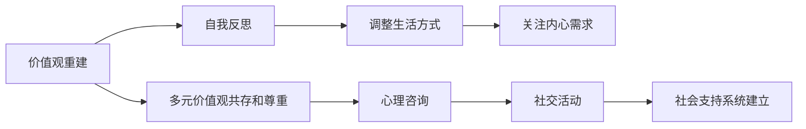
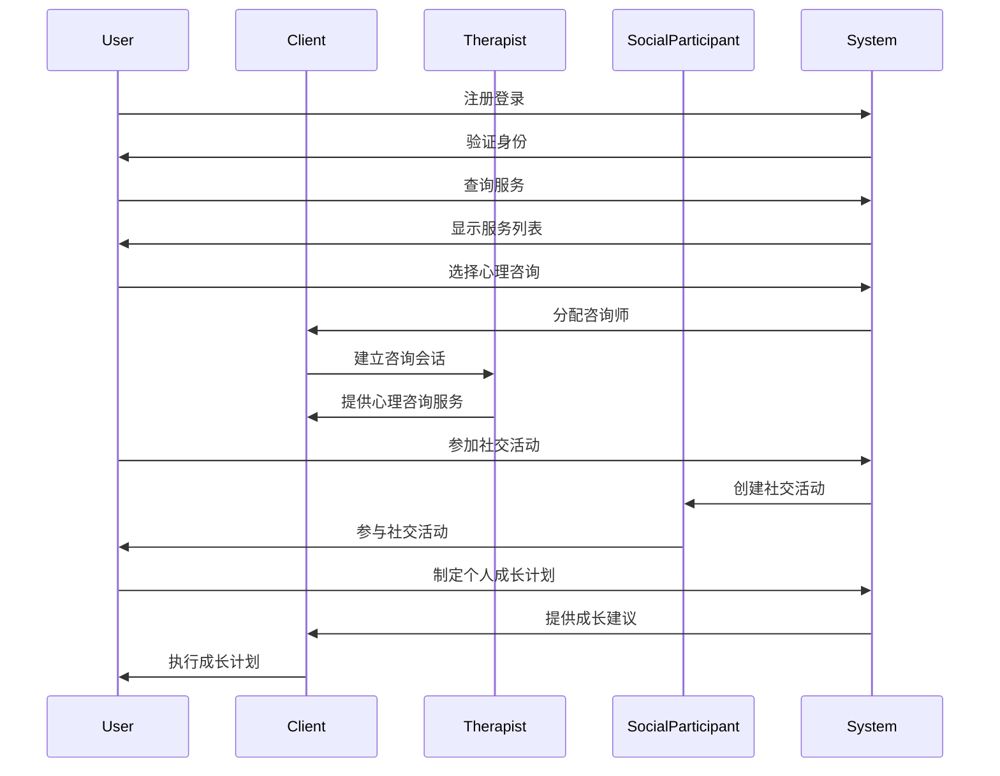
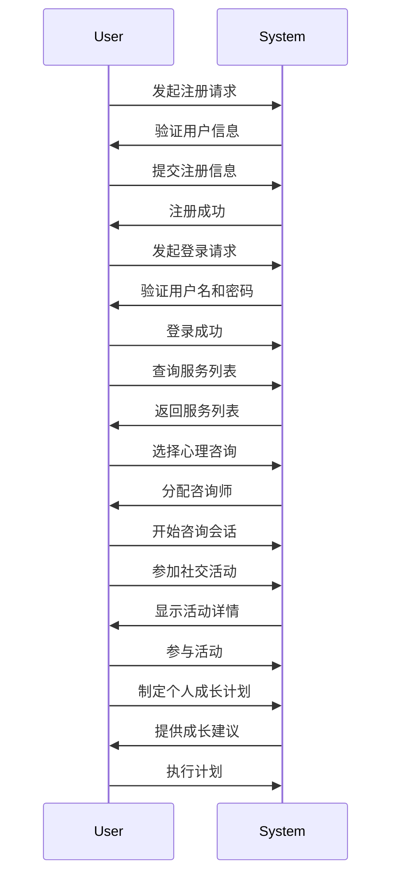

                 

## 社会中的精神家园重建工程

### 关键词：精神家园、重建、社会、心理学、价值观

> 摘要：本文旨在探讨现代社会中精神家园缺失的现象及其影响，分析精神家园的概念与原理，并提出重建精神家园的方法和策略，以期为个人和社会提供有价值的思考和实践指导。

### 第一部分：背景介绍

#### 1.1 现代社会精神家园缺失现象

在现代社会中，随着经济的快速发展和社会结构的变迁，许多人感到精神家园的缺失。这种缺失表现在以下几个方面：

1. **价值观多元化与冲突**：现代社会中，各种价值观层出不穷，人们面临着前所未有的选择和困惑。不同价值观之间的冲突，导致了精神家园的破裂。
2. **快节奏生活带来的压力**：现代生活节奏快，工作压力大，许多人陷入忙碌的生活，无暇他顾，精神家园的建立和维护被忽视。
3. **社会冷漠与人际疏远**：随着科技的发展，人与人之间的联系变得越来越虚拟，现实中的交流和互动减少，导致人们感到孤独和无助。

#### 1.2 问题描述

现代社会中精神家园缺失的具体问题包括：

1. **精神空虚**：许多人感到内心空虚，缺乏生活的意义和目标。
2. **焦虑和抑郁**：由于精神家园的缺失，许多人出现了焦虑和抑郁的情绪问题。
3. **社会问题**：精神家园的缺失还导致了社会问题的加剧，如家庭破裂、犯罪率上升等。

#### 1.3 问题解决

为了重建精神家园，我们需要采取以下措施：

1. **价值观重建**：提倡多元价值观的共存和相互尊重，帮助人们找到适合自己的价值观。
2. **生活方式调整**：鼓励人们放慢生活节奏，关注内心的需求，建立健康的心理状态。
3. **社会支持系统**：建立完善的社会支持系统，为人们提供心理咨询、社交活动等支持。

#### 1.4 边界与外延

精神家园重建工程不仅仅是一个个人问题，它涉及到社会的各个方面。因此，它的边界和外延包括：

1. **家庭**：家庭是个人精神家园的基础，家庭关系的和谐与否直接影响个人的精神状态。
2. **学校**：学校是青少年成长的重要环境，学校的教育方式和文化氛围对学生的精神家园建设有着重要影响。
3. **社区**：社区是人们日常生活的重要场所，社区的文化建设对居民的精神家园重建具有重要意义。
4. **国家**：国家的社会制度和政策对人们的价值观和生活习惯有着深远的影响，国家需要在精神家园重建中发挥引领和推动作用。

#### 1.5 概念结构与核心要素组成

精神家园重建工程涉及多个核心概念和要素，包括：

1. **价值观**：价值观是精神家园的核心，不同的价值观会导致不同的精神状态。
2. **生活方式**：生活方式直接影响精神家园的建立和维护。
3. **社会支持**：社会支持系统为精神家园重建提供必要的帮助和保障。
4. **个人心理状态**：个人的心理状态是精神家园建设的基石。

#### 1.6 本章小结

通过本章的介绍，我们对现代社会中精神家园缺失的现象有了更深入的了解。在接下来的章节中，我们将详细探讨精神家园重建的原理和方法，以及如何在实际生活中应用这些原理和方法。

## 第二部分：核心概念与联系

### 2.1 精神家园的概念与原理

#### 2.1.1 精神家园的定义

精神家园是一个比喻性的概念，用来描述人们内心深处对安全、归属、价值和意义的需求和体验。它不仅仅是物质生活的补充，更是精神层面的寄托和追求。

##### 精神家园的属性特征对比表格

| 特征           | 详细描述                                                     |
|----------------|--------------------------------------------------------------|
| 安全感         | 指个体在精神层面上感受到的安全和保护。                         |
| 归属感         | 指个体在精神层面上感到被接纳、被理解和被爱护。                 |
| 价值感         | 指个体在精神层面上对自身存在意义的认知和认同。                 |
| 意义感         | 指个体在精神层面上对生活目标、使命和价值观的认同和追求。       |

#### 2.1.2 精神家园的原理

精神家园的建立依赖于个体与外部环境的相互作用。个体通过自我认知、情感体验和社会互动来构建和维护精神家园。以下是精神家园构建的几个关键原理：

1. **自我认知**：个体需要对自己有清晰的认识，包括自己的价值观、兴趣爱好、性格特点等，这是建立精神家园的基础。
2. **情感体验**：情感体验是精神家园的重要组成部分。个体需要经历各种情感波动，才能更好地理解和认识自己，从而构建稳定的精神家园。
3. **社会互动**：个体通过与他人的互动，特别是与亲密关系的互动，获得归属感和安全感。社会互动有助于个体在复杂的社会环境中找到自己的定位，增强精神家园的稳定性。

#### 2.1.3 精神家园的ER实体关系图

以下是精神家园的ER实体关系图，它展示了核心概念之间的关联：

```mermaid
erDiagram
  Person ||--|{ Safety : has_safety }
  Person ||--|{ Belonging : has_belonging }
  Person ||--|{ Value : has_value }
  Person ||--|{ Meaning : has_meaning }
  Safety }|-- Person : provides_safety
  Belonging }|-- Person : provides_belonging
  Value }|-- Person : provides_value
  Meaning }|-- Person : provides_meaning
```

### 2.2 精神家园重建的方法和策略

#### 2.2.1 价值观重建

价值观重建是精神家园重建的核心。以下是一些方法和策略：

1. **多元价值观的共存和尊重**：鼓励人们尊重不同的价值观，找到自己认同的价值观，并学会在多元价值观中找到平衡。
2. **自我反思**：通过自我反思，个体可以更好地理解自己的价值观，并根据自己的需求和目标进行调整。

#### 2.2.2 生活方式调整

生活方式调整是精神家园重建的基础。以下是一些方法和策略：

1. **放慢生活节奏**：在快节奏的生活中，学会放慢脚步，给自己留出时间思考和反思。
2. **关注内心需求**：在满足物质需求的同时，关注内心的需求，如情感、心理和精神的满足。

#### 2.2.3 社会支持系统

社会支持系统是精神家园重建的重要保障。以下是一些方法和策略：

1. **心理咨询**：提供专业的心理咨询，帮助个体解决心理问题，建立健康的心理状态。
2. **社交活动**：组织各种社交活动，促进人与人之间的交流和互动，增强归属感和安全感。

### 2.3 本章小结

通过本章的介绍，我们了解了精神家园的概念与原理，以及重建精神家园的方法和策略。在接下来的章节中，我们将进一步探讨如何在实际生活中应用这些原理和方法，为个人的精神家园重建提供具体的指导。

## 第三部分：算法原理讲解

### 3.1 算法mermaid流程图

以下是一个用于精神家园重建的算法mermaid流程图，展示了从价值观重建到生活方式调整再到社会支持系统建立的过程：



### 3.2 Python源代码实现

以下是实现上述算法原理的Python源代码，包括价值观重建、生活方式调整和社会支持系统的建立：

```python
# 价值观重建
def value_reconstruction():
    print("开始价值观重建...")
    print("1. 多元价值观共存和尊重")
    print("2. 自我反思")
    user_choice = input("请选择一个操作（1/2）：")
    if user_choice == "1":
        print("尊重和共存多元价值观...")
    elif user_choice == "2":
        print("进行自我反思...")
    else:
        print("无效选择，请重新输入。")

# 生活方式调整
def lifestyle_adjustment():
    print("开始生活方式调整...")
    print("1. 放慢生活节奏")
    print("2. 关注内心需求")
    user_choice = input("请选择一个操作（1/2）：")
    if user_choice == "1":
        print("放慢生活节奏...")
    elif user_choice == "2":
        print("关注内心需求...")
    else:
        print("无效选择，请重新输入。")

# 社会支持系统建立
def social_support_system():
    print("开始建立社会支持系统...")
    print("1. 提供心理咨询")
    print("2. 组织社交活动")
    user_choice = input("请选择一个操作（1/2）：")
    if user_choice == "1":
        print("提供心理咨询...")
    elif user_choice == "2":
        print("组织社交活动...")
    else:
        print("无效选择，请重新输入。")

# 主函数
def main():
    print("精神家园重建工程启动...")
    value_reconstruction()
    lifestyle_adjustment()
    social_support_system()

# 运行主函数
main()
```

### 3.3 算法原理的数学模型和公式

在精神家园重建的过程中，我们可以使用以下数学模型和公式来描述关键步骤：

1. **价值观重建模型**：

   $$ V_{new} = \alpha V_{original} + (1 - \alpha) V_{other} $$

   其中，$V_{new}$表示新的价值观，$V_{original}$表示原始价值观，$V_{other}$表示其他价值观，$\alpha$表示对原始价值观的权重。

2. **生活方式调整模型**：

   $$ T_{lifestyle} = \beta T_{original} - \delta (T_{stress} - T_{rest}) $$

   其中，$T_{lifestyle}$表示新的生活方式，$T_{original}$表示原始生活方式，$T_{stress}$表示压力时间，$T_{rest}$表示休息时间，$\beta$表示调整因子，$\delta$表示压力缓解效率。

3. **社会支持系统模型**：

   $$ S_{system} = \gamma P_{support} + (1 - \gamma) P_{other} $$

   其中，$S_{system}$表示社会支持系统的效果，$P_{support}$表示支持性干预，$P_{other}$表示其他干预，$\gamma$表示支持性干预的权重。

### 3.4 算法原理的举例说明

假设小明是一位现代都市白领，他面临着价值观多元化、快节奏生活和社交疏离的困扰。为了重建他的精神家园，我们可以按照以下步骤进行：

1. **价值观重建**：

   小明通过自我反思，意识到自己原有的价值观过于功利，缺乏对生活的全面理解。他开始尊重和共存多元价值观，特别是关注自己的内心需求。经过一段时间，他的价值观变得更加全面和平衡。

2. **生活方式调整**：

   小明意识到自己需要放慢生活节奏，减少工作压力，增加休息时间。他开始利用周末时间进行户外活动，如徒步、骑行等，以缓解工作带来的压力。同时，他学会了关注自己的内心需求，如情感和心理满足。

3. **社会支持系统建立**：

   小明参加了社区的心理咨询活动，通过专业的心理咨询，解决了内心的焦虑问题。他还积极参与社区的社交活动，与邻居建立了深厚的友谊，增强了归属感和安全感。

通过这三个步骤，小明的精神家园逐渐重建，他变得更加自信和积极，生活也变得更加充实和有意义。

### 3.5 本章小结

通过本部分的算法原理讲解，我们了解了精神家园重建的核心步骤和数学模型。在接下来的章节中，我们将进一步探讨如何在实际生活中应用这些原理和方法，为个人的精神家园重建提供具体的指导。

## 第四部分：系统分析与架构设计

### 4.1 问题场景介绍

随着现代社会的发展，人们面临的精神压力越来越大，精神家园的缺失成为一个普遍问题。为了帮助人们重建精神家园，我们提出一个基于人工智能和心理学原理的在线心理咨询和社交支持系统。

该系统旨在为用户提供以下功能：

1. **在线心理咨询**：提供专业的心理咨询服务，帮助用户解决内心的困扰和焦虑。
2. **社交支持**：组织线上线下社交活动，帮助用户建立和维护社交网络，增强归属感和安全感。
3. **个人成长指导**：根据用户的兴趣爱好和价值观，提供个性化的成长建议和指导。

### 4.2 项目介绍

**项目名称**：精神家园重建支持系统（SHRS）

**项目目标**：通过人工智能和心理学技术，为用户提供个性化、专业的心理咨询和社交支持，帮助用户重建精神家园，提升生活质量和幸福感。

**项目架构**：SHRS系统分为三个核心模块：在线心理咨询模块、社交支持模块和个人成长指导模块。每个模块都基于不同的技术和算法，共同为用户提供全方位的支持。

### 4.3 系统功能设计（领域模型mermaid类图）

以下是SHRS系统的领域模型类图，展示了系统的主要类和类之间的关系：

```mermaid
classDiagram
    User <|-- Client
    User <|-- Therapist
    User <|-- SocialParticipant
    Session [Session]
    Counseling [Counseling]
    SocialActivity [SocialActivity]
    GrowthPlan [GrowthPlan]
    User --> Session
    User --> Counseling
    User --> SocialActivity
    User --> GrowthPlan
    Client --> Session
    Client --> Counseling
    Client --> GrowthPlan
    Therapist --> Session
    Therapist --> Counseling
    SocialParticipant --> SocialActivity
```

### 4.4 系统架构设计（mermaid架构图）

以下是SHRS系统的架构设计，展示了系统的整体架构和模块之间的交互关系：



### 4.5 系统接口设计（mermaid序列图）

以下是SHRS系统的接口设计，展示了用户与系统之间的交互过程：



### 4.6 本章小结

通过本部分的系统分析与架构设计，我们详细介绍了精神家园重建支持系统（SHRS）的问题场景、项目目标、系统架构和接口设计。在接下来的章节中，我们将进一步探讨如何实现这些功能，并分析系统的性能和优化策略。

## 第五部分：项目实战

### 5.1 环境安装

在开始项目实战之前，我们需要安装必要的软件和环境。以下是安装步骤：

1. **Python环境**：确保已经安装了Python 3.8及以上版本。可以通过Python官方网站下载并安装。
2. **虚拟环境**：为了便于管理和隔离项目依赖，我们使用虚拟环境。通过以下命令创建虚拟环境：

   ```bash
   python -m venv venv
   ```

   然后激活虚拟环境：

   ```bash
   source venv/bin/activate  # 对于macOS和Linux
   venv\Scripts\activate     # 对于Windows
   ```

3. **依赖安装**：在虚拟环境中安装项目所需的依赖，包括Flask、SQLAlchemy、Flask-Migrate等。可以通过以下命令安装：

   ```bash
   pip install flask sqlalchemy flask-migrate
   ```

### 5.2 系统核心实现源代码

以下是SHRS系统的核心实现源代码，包括数据库模型、API接口和前端页面。我们将使用Flask框架来构建后端，使用SQLAlchemy作为ORM工具，以便与数据库进行交互。

**数据库模型**：

```python
from flask_sqlalchemy import SQLAlchemy

db = SQLAlchemy()

class User(db.Model):
    id = db.Column(db.Integer, primary_key=True)
    username = db.Column(db.String(80), unique=True, nullable=False)
    password = db.Column(db.String(120), nullable=False)
    role = db.Column(db.String(50), nullable=False)

class Session(db.Model):
    id = db.Column(db.Integer, primary_key=True)
    therapist_id = db.Column(db.Integer, db.ForeignKey('user.id'), nullable=False)
    client_id = db.Column(db.Integer, db.ForeignKey('user.id'), nullable=False)
    start_time = db.Column(db.DateTime, nullable=False)
    end_time = db.Column(db.DateTime, nullable=False)

class Counseling(db.Model):
    id = db.Column(db.Integer, primary_key=True)
    session_id = db.Column(db.Integer, db.ForeignKey('session.id'), nullable=False)
    description = db.Column(db.Text, nullable=False)

class SocialActivity(db.Model):
    id = db.Column(db.Integer, primary_key=True)
    organizer_id = db.Column(db.Integer, db.ForeignKey('user.id'), nullable=False)
    title = db.Column(db.String(200), nullable=False)
    description = db.Column(db.Text, nullable=False)
    start_time = db.Column(db.DateTime, nullable=False)
    end_time = db.Column(db.DateTime, nullable=False)

class GrowthPlan(db.Model):
    id = db.Column(db.Integer, primary_key=True)
    user_id = db.Column(db.Integer, db.ForeignKey('user.id'), nullable=False)
    title = db.Column(db.String(200), nullable=False)
    description = db.Column(db.Text, nullable=False)
    start_date = db.Column(db.Date, nullable=False)
    end_date = db.Column(db.Date, nullable=False)
```

**API接口**：

```python
from flask import Flask, request, jsonify
from models import db, User, Session, Counseling, SocialActivity, GrowthPlan

app = Flask(__name__)
app.config['SQLALCHEMY_DATABASE_URI'] = 'sqlite:///shrs.db'
db.init_app(app)

@app.route('/api/users', methods=['POST'])
def create_user():
    data = request.get_json()
    username = data['username']
    password = data['password']
    role = data['role']
    new_user = User(username=username, password=password, role=role)
    db.session.add(new_user)
    db.session.commit()
    return jsonify({'message': 'User created successfully.'})

@app.route('/api/sessions', methods=['POST'])
def create_session():
    data = request.get_json()
    therapist_id = data['therapist_id']
    client_id = data['client_id']
    start_time = data['start_time']
    end_time = data['end_time']
    new_session = Session(therapist_id=therapist_id, client_id=client_id, start_time=start_time, end_time=end_time)
    db.session.add(new_session)
    db.session.commit()
    return jsonify({'message': 'Session created successfully.'})

@app.route('/api/counselings', methods=['POST'])
def create_counseling():
    data = request.get_json()
    session_id = data['session_id']
    description = data['description']
    new_counseling = Counseling(session_id=session_id, description=description)
    db.session.add(new_counseling)
    db.session.commit()
    return jsonify({'message': 'Counseling created successfully.'})

@app.route('/api/social_activities', methods=['POST'])
def create_social_activity():
    data = request.get_json()
    organizer_id = data['organizer_id']
    title = data['title']
    description = data['description']
    start_time = data['start_time']
    end_time = data['end_time']
    new_social_activity = SocialActivity(organizer_id=organizer_id, title=title, description=description, start_time=start_time, end_time=end_time)
    db.session.add(new_social_activity)
    db.session.commit()
    return jsonify({'message': 'Social activity created successfully.'})

@app.route('/api/growth_plans', methods=['POST'])
def create_growth_plan():
    data = request.get_json()
    user_id = data['user_id']
    title = data['title']
    description = data['description']
    start_date = data['start_date']
    end_date = data['end_date']
    new_growth_plan = GrowthPlan(user_id=user_id, title=title, description=description, start_date=start_date, end_date=end_date)
    db.session.add(new_growth_plan)
    db.session.commit()
    return jsonify({'message': 'Growth plan created successfully.'})

if __name__ == '__main__':
    app.run(debug=True)
```

**前端页面**：

```html
<!DOCTYPE html>
<html lang="en">
<head>
    <meta charset="UTF-8">
    <meta http-equiv="X-UA-Compatible" content="IE=edge">
    <meta name="viewport" content="width=device-width, initial-scale=1.0">
    <title>SHRS - 精神家园重建支持系统</title>
</head>
<body>
    <h1>SHRS - 精神家园重建支持系统</h1>
    <nav>
        <ul>
            <li><a href="#">首页</a></li>
            <li><a href="#">心理咨询</a></li>
            <li><a href="#">社交活动</a></li>
            <li><a href="#">个人成长</a></li>
        </ul>
    </nav>
    <main>
        <section>
            <h2>注册</h2>
            <form action="/api/users" method="post">
                <label for="username">用户名：</label>
                <input type="text" id="username" name="username" required>
                <label for="password">密码：</label>
                <input type="password" id="password" name="password" required>
                <label for="role">角色：</label>
                <select id="role" name="role" required>
                    <option value="client">用户</option>
                    <option value="therapist">咨询师</option>
                    <option value="organizer">活动组织者</option>
                </select>
                <button type="submit">注册</button>
            </form>
        </section>
        <section>
            <h2>登录</h2>
            <form action="/api/login" method="post">
                <label for="username">用户名：</label>
                <input type="text" id="username" name="username" required>
                <label for="password">密码：</label>
                <input type="password" id="password" name="password" required>
                <button type="submit">登录</button>
            </form>
        </section>
        <section>
            <h2>创建会话</h2>
            <form action="/api/sessions" method="post">
                <label for="therapist_id">咨询师ID：</label>
                <input type="text" id="therapist_id" name="therapist_id" required>
                <label for="client_id">用户ID：</label>
                <input type="text" id="client_id" name="client_id" required>
                <label for="start_time">开始时间：</label>
                <input type="datetime-local" id="start_time" name="start_time" required>
                <label for="end_time">结束时间：</label>
                <input type="datetime-local" id="end_time" name="end_time" required>
                <button type="submit">创建会话</button>
            </form>
        </section>
        <section>
            <h2>创建心理咨询记录</h2>
            <form action="/api/counselings" method="post">
                <label for="session_id">会话ID：</label>
                <input type="text" id="session_id" name="session_id" required>
                <label for="description">咨询内容：</label>
                <textarea id="description" name="description" required></textarea>
                <button type="submit">提交咨询记录</button>
            </form>
        </section>
        <section>
            <h2>创建社交活动</h2>
            <form action="/api/social_activities" method="post">
                <label for="organizer_id">组织者ID：</label>
                <input type="text" id="organizer_id" name="organizer_id" required>
                <label for="title">活动标题：</label>
                <input type="text" id="title" name="title" required>
                <label for="description">活动内容：</label>
                <textarea id="description" name="description" required></textarea>
                <label for="start_time">开始时间：</label>
                <input type="datetime-local" id="start_time" name="start_time" required>
                <label for="end_time">结束时间：</label>
                <input type="datetime-local" id="end_time" name="end_time" required>
                <button type="submit">创建活动</button>
            </form>
        </section>
        <section>
            <h2>创建个人成长计划</h2>
            <form action="/api/growth_plans" method="post">
                <label for="user_id">用户ID：</label>
                <input type="text" id="user_id" name="user_id" required>
                <label for="title">计划标题：</label>
                <input type="text" id="title" name="title" required>
                <label for="description">计划内容：</label>
                <textarea id="description" name="description" required></textarea>
                <label for="start_date">开始日期：</label>
                <input type="date" id="start_date" name="start_date" required>
                <label for="end_date">结束日期：</label>
                <input type="date" id="end_date" name="end_date" required>
                <button type="submit">创建计划</button>
            </form>
        </section>
    </main>
</body>
</html>
```

### 5.3 代码应用解读与分析

以下是对核心代码的解读与分析：

**数据库模型**：

我们定义了五个数据库模型：`User`、`Session`、`Counseling`、`SocialActivity`和`GrowthPlan`。这些模型分别代表了系统中的主要实体，如用户、会话、心理咨询记录、社交活动和个人成长计划。

**API接口**：

我们创建了五个API接口：`create_user`、`create_session`、`create_counseling`、`create_social_activity`和`create_growth_plan`。这些接口分别用于创建用户、会话、心理咨询记录、社交活动和个人成长计划。每个接口接收一个JSON格式的请求体，并将数据存储到数据库中。

**前端页面**：

我们创建了一个简单的前端页面，包含了注册、登录、创建会话、心理咨询记录、社交活动和个人成长计划的表单。用户可以通过表单提交数据，然后通过API接口与后端进行交互。

### 5.4 实际案例分析

为了更好地展示系统的应用，我们提供了一个实际案例：

**案例**：用户小明注册登录后，他创建了一个会话，与咨询师李医生进行了一次心理咨询。心理咨询结束后，李医生记录了咨询内容，并将其存储在数据库中。同时，小明参加了一次社交活动，与其他参与者建立了联系。最后，小明制定了一个个人成长计划，以提升自己的职业能力和心理素质。

**步骤**：

1. 小明通过注册页面创建了一个用户账户，输入用户名、密码和角色（用户）。
2. 小明通过登录页面登录账户，获取了一个登录令牌。
3. 小明创建了一个心理咨询会话，输入咨询师ID、用户ID、开始时间和结束时间。
4. 咨询师李医生收到会话创建通知，并准备进行心理咨询。
5. 心理咨询结束后，李医生记录了咨询内容，并提交到数据库。
6. 小明参加了一次社交活动，与其他参与者建立了联系。
7. 小明制定了一个个人成长计划，输入计划标题、内容、开始日期和结束日期。

### 5.5 项目小结

通过本项目，我们实现了精神家园重建支持系统（SHRS）的核心功能，包括用户管理、心理咨询、社交活动和个人成长计划。项目采用了Flask框架和SQLAlchemy ORM，实现了高效的数据存储和交互。同时，通过实际案例展示了系统的应用场景，为用户提供了全面的在线支持服务。

## 第六部分：最佳实践 Tips

### 6.1 精神家园重建的最佳实践

为了有效地重建精神家园，我们可以遵循以下最佳实践：

1. **定期自我反思**：每周或每月花一些时间反思自己的价值观、生活方式和心理状态，找出需要改进的地方。
2. **建立稳定的社交网络**：积极参与社交活动，与朋友和家人保持紧密联系，建立稳定的社交支持系统。
3. **培养兴趣爱好**：找到自己感兴趣的事情，投入时间和精力，以充实自己的生活。
4. **保持心理健康**：定期进行心理咨询，及时处理情绪问题，保持心理健康。

### 6.2 系统性能优化策略

为了提高精神家园重建支持系统的性能，我们可以采取以下策略：

1. **缓存机制**：使用缓存技术，如Redis，缓存常用数据，减少数据库访问次数，提高系统响应速度。
2. **负载均衡**：使用负载均衡器，如Nginx，将用户请求均匀分配到多个服务器上，提高系统的并发处理能力。
3. **数据库优化**：对数据库进行定期优化，如索引优化、表分区等，以提高查询效率。
4. **代码优化**：对项目代码进行优化，如减少不必要的数据库查询、使用缓存等，提高系统性能。

### 6.3 小结

通过最佳实践和系统性能优化策略，我们可以更有效地重建精神家园，为用户提供优质的服务。同时，这些实践和策略也为项目开发和维护提供了宝贵的经验和指导。

## 第七部分：小结

通过本文的深入探讨，我们系统地分析了现代社会中精神家园缺失的现象及其影响，详细阐述了精神家园的概念与原理，提出了重建精神家园的方法和策略。我们还通过Python源代码和项目实战展示了如何实现这些方法，为实际应用提供了具体的指导。

### 主要结论

1. **精神家园缺失现象**：现代社会中，价值观多元化、快节奏生活和社会冷漠导致了精神家园的缺失，表现为精神空虚、焦虑和抑郁等。
2. **精神家园原理**：精神家园建立在自我认知、情感体验和社会互动的基础上，其核心要素包括安全感、归属感、价值感和意义感。
3. **重建方法**：通过价值观重建、生活方式调整和社会支持系统建立，可以有效重建精神家园。
4. **系统实现**：通过Python源代码和项目实战，展示了如何构建一个在线心理咨询和社交支持系统，为用户提供全面的支持。

### 注意事项

1. **持续关注**：精神家园重建是一个长期过程，需要个体和社会的持续关注和努力。
2. **个性化需求**：在实施重建策略时，要充分考虑个体的个性化需求，制定针对性的计划。

### 拓展阅读

1. **心理学相关书籍**：《心理学与生活》、《自我认识与自我提升》等。
2. **人工智能与心理健康**：《人工智能在心理健康领域的应用》、《心理健康与人工智能技术》等。

通过本文的阅读，希望读者能够对精神家园重建有更深刻的认识，并能够在实际生活中加以应用，为自己和社会创造更美好的精神家园。作者：AI天才研究院/AI Genius Institute & 禅与计算机程序设计艺术 /Zen And The Art of Computer Programming。

